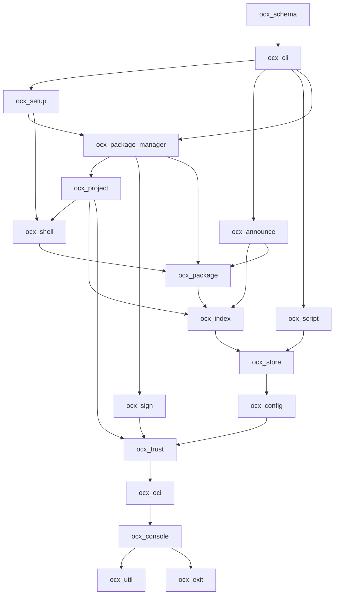

# ADR: Distribute `ocx_lib` into a responsibility-derived `ocx_*` crate workspace

## Metadata

**Status:** Accepted
**Date:** 2026-09-06
**Accepted:** 2026-09-16
**Deciders:** Michael Herwig
**Blast radius:** cross-area + external contract (two lockstep satellite repos, every AI-config path glob, the verification pipeline)
**Reversibility:** one-way (high) — once satellites take path dependencies on individual crates and the module-local error enums are re-homed, reversal is a second migration, not a revert. The per-crate point of no return is the day a satellite links that crate; before it, two crates can still be merged back by concatenating their modules.
**Tier:** xhigh
**Domain Tags:** infrastructure | api | security | devops
**Related:** `.agents/discussions/crate-split-and-verify-tiers.md` (ratified dossier), `.claude/artifacts/discover_crate_split_workspace.md`
**Supersedes:** the "Core vs Plugin Boundary" long-term clause and the "known drift" note in `.claude/rules/arch-principles.md`, and the two-tier stability text in `CLAUDE.md` § "Stability tiers" (both edits stated in § Ecosystem contract; neither file is edited by this ADR)
**Superseded By:** —

**Tech Strategy Alignment:**
- [x] Rust 2024, Cargo workspace, resolver v3 — Golden Path in `.claude/rules/product-tech-strategy.md`, unchanged
- [x] No new build system (Bazel parked by the dossier), no new dependency introduced by this ADR

---

## Context

`crates/ocx_lib` is 278,777 LOC across 364 files in **35 top-level modules** —
33 `pub mod` plus private `config` and `media_type`, with `pub mod prelude` a
36th declaration that dissolves trivially (it re-exports only `Error`, `Result`
and four `utility` extension traits). Its module graph is not layered: 63 of
roughly 120 populated edges are reciprocated 2-cycles. `cli` (the lib-internal
module, not the `ocx_cli` crate) is the top hub at in-degree 25 / out-degree 23;
`utility`, `oci`, `env` and `file_structure` follow. No crate boundary exists
today that Cargo would accept.

Three forces converge:

1. **Change surface is unpredictable.** Every edit inside `ocx_lib` can reach
   every other module, so no agent or human can bound what a change touches.
2. **Reuse is blocked.** `ocx-mirror` already links `ocx_lib` as a path
   dependency into a git submodule and imports across nearly every top-level
   module — recorded in `arch-principles.md` as "known drift". A second
   consumer, `grimoire`, needs the whole signing stack plus generic OCI, and has
   none of it today (verified: `grimoire`'s manifest has zero `sigstore`, `sign`,
   `attest` or `cosign` dependencies; its only `verify.rs` is a registry-login
   credential ping).
3. **Verification cost dominates plan cost.** Any touch inside `ocx_lib` costs a
   uniform ~7.0 s incremental rebuild whether the file is 91 lines or 8,157
   (`research_crate_split_performance.md`, measurements 3 and 4), and every hex
   work package currently pays the full ~25-minute gate because the acceptance
   suite has no scoping mechanism.

The dossier at `.agents/discussions/crate-split-and-verify-tiers.md` ratified the
shape of the answer on 2026-09-06 and handed the map, the error strategy, the
tiers and the sequencing to this ADR.

## Decision Drivers

Weighted for the trade-off matrix below. Weights are the dossier's stated
priority order ("predictable change surface, then reusability … compile speed is
a consequence, not the driver").

| # | Driver | Weight | Test |
|---|---|---|---|
| D1 | Predictable change surface | 5 | Can a reader name, from the manifest alone, every crate a given edit can force to recompile? |
| D2 | Reuse by satellites | 5 | Can `grimoire` link the signing stack without naming a product-only crate, and at what compile cost? |
| D3 | Migration risk against in-flight work | 4 | Does the first work package collide with an open PR? |
| D4 | Operability and upkeep | 3 | How many CI files, rule globs and hand-maintained tables must change, and how often afterwards? |
| D5 | Dev-loop time | 2 | Incremental rebuild after a single-file touch; per-work-package gate wall time. |

### Non-negotiables

Owner constraints, ruled 2026-09-16 (§ Rulings). Every phase is measured against
them; none is traded against a driver.

- **Structural change only.** The acceptance suite (`test/**`) keeps identical
  semantics throughout: no test is deleted, weakened or has an assertion
  changed. Adding tests, and adding the `smoke` marker, is allowed.
- **No feature is cut to save implementation time.**
- **Every crate is logically independent with a closed interface** — designed
  for no single consumer (SOLID), so a second consumer needs no re-cut.
- **`ocx_exit` and the CLI's data / error-envelope types stay SDK-liftable** —
  a future Rust SDK that drives `ocx` as a binary lifts them unchanged.

## Industry Context & Research

Five research artifacts inform this decision; each is cited inline where its
finding is load-bearing.

- `.claude/artifacts/research_crate_split_performance.md` — measured baseline on
  this host: leaf touch 6.93 s, hub touch 7.01 s, CLI touch 1.44 s, cold build
  with dependencies 71.7 s, full `ocx_lib` unit suite 111.2 s / 5,711 tests.
  Projects 2.5–3 s for a leaf touch after the split and 4–5 s for a still-entangled
  hub. Also records that mold is not configured (LLD 22.1.2 is in use) and that
  the shared `sccache` daemon may be silently missing across worktrees.
- `.claude/artifacts/research_crate_split_data_model.md` — reaffirms per-crate
  `thiserror` and rejects `snafu` with a falsification criterion; establishes the
  three mechanical ecosystem-contract lines; recommends moving exit-code
  classification to the application layer for every crate, not only the
  grimoire-visible ones.
- `.claude/artifacts/research_crate_split_operability.md` — CI cost is flat under
  the split (every workflow command resolves through `cargo metadata` or the
  lockfile); the bounded cost is 14 AI-config path globs; per-crate `README.md`
  beats per-crate `CLAUDE.md` on upkeep (rust-analyzer keeps one ~80-line root
  file, wasmtime keeps per-crate READMEs). Its addendum sizes the basic
  acceptance tier and names the Sigstore-stack exclusion as the load-bearing
  change.
- `.claude/artifacts/research_crate_split_recon.md` — the module graph, the
  responsibility map, and the `oci` generic/specific/mixed classification.
- `.claude/artifacts/research_crate_decomposition_patterns.md` and
  `research_crate_split_prior_art.md` — the ecosystem's own counter-position
  ("you should not use multiple crates unless you need one of the things you can
  only get that way"), the layered-plus-facade shape at uv, deno, wasmtime,
  rust-analyzer, nushell, and the documented false-negative record of predictive
  test selection (bazel-diff, turborepo #9234) that argues against impact-analysis
  tooling here.

## Considered Options

### Option A — Layer in place, then extract into a 17-crate responsibility map

Invert the offending edges inside `ocx_lib` first, each inversion pinned by a
boundary test shown red before and green after; extract a crate only when its
disallowed-edge count reaches zero; delete `ocx_lib` when empty. No facade crate.

### Option B — Minimal extraction: only the reuse targets leave

Extract `ocx_oci`, `ocx_trust`, `ocx_sign`, `ocx_console`, `ocx_package`,
`ocx_config`, `ocx_index`. Leave `ocx_lib` in place as the operations core.

### Option C — Big-bang carve

Cut all crates in one branch, fix the compile errors, land once.

### Option D — Module-level boundary tests only, no crates

Keep one crate. Enforce the intended layering with directory-walk tests in the
A-45 style. Satellites keep taking `ocx_lib` whole.

### Trade-off matrix

Scores 1 (poor) to 5 (excellent). Totals are the weighted sum and are
reproducible from the weights above.

| Driver (weight) | A: layer-then-extract | B: minimal extraction | C: big-bang | D: tests only |
|---|---|---|---|---|
| D1 predictable change surface (5) | 5 | 2 | 5 | 2 |
| D2 reuse by satellites (5) | 5 | 4 | 5 | 1 |
| D3 migration risk vs in-flight (4) | 4 | 5 | 1 | 5 |
| D4 operability (3) | 3 | 4 | 2 | 5 |
| D5 dev-loop time (2) | 4 | 2 | 4 | 1 |
| **Weighted total** | **83** | **66** | **68** | **52** |

Scores argued on drivers, not on procedure:

- **B scores 2 on D1** because the residual `ocx_lib` is ~119K LOC across roughly
  twenty modules and retains four of the five hub modules (`utility`, `config`,
  `env`, `file_structure`) plus every 2-cycle among them. B extracts ~160K LOC;
  it does not extract the entanglement. It scores 4 on D2 because both named
  consumers are in fact fully served by B's seven crates — this is B's real
  strength and the reason it beats C on migration risk. It loses on D1 and D5,
  which together carry weight 7.
- **D scores 1 on D2** with a measured cost, not a rhetorical one: `grimoire`
  would link all 278,777 LOC and the full dependency set — the Starlark family,
  `sigstore`, `indicatif`, `clap_builder`, `zip`, `tar`, `starlark_derive` — to
  obtain the signing stack. On this host that is a 71.7 s cold build and a 7.0 s
  incremental rebuild for every touch anywhere in the tree
  (`research_crate_split_performance.md`, measurements 1 and 3), against a
  six-crate closure under A. D also scores 1 on D5 because nothing about the
  dev loop changes.
- **C matches A on the end state** and loses only on D3 and D4, but those are
  where the whole cost sits: it collides with five open branches simultaneously
  and produces a diff no reviewer can check.

Risks and reversibility:

| Option | Principal risk | Reversibility |
|---|---|---|
| A | Long tail: fourteen named edge inversions before the first non-leaf crate exists; a phase-1 stall leaves the tree half-layered but always compiling and always green | Each phase reverts independently; phase 1 leaves no crate behind. Per crate, the point of no return is the day a satellite links it |
| B | Ratified requirement (no residual `ocx_lib`) is not met; D1 and D5 stay broken for ~119K LOC | High — B is a prefix of A and forecloses nothing |
| C | Cannot be reviewed; conflicts with every open branch; a single mistake in an inverted edge is indistinguishable from the 200 other changes in the diff | None in practice |
| D | Does not deliver D2 at all; a boundary test is a tripwire for the likely accident, not the contract (`quality-rust.md` § structural guards) | Total |

### Decision Outcome

**Option A.** It is the only option that satisfies the ratified end state (no
residual `ocx_lib`) while staying reviewable and rebaseable against five open
branches, and it is the only one that gives `grimoire` a six-crate closure
instead of a 278K-LOC one.

Two rulings inside Option A depart from the dossier's own recommendations and are
argued below: **no facade crate**, and **no cycle-detection tool**.

---

## Technical Details

### Architecture — the crate map

Seventeen `ocx_*` library crates — sixteen product crates plus `ocx_test_support`,
a dev-dependency — replace `ocx_lib`. `ocx_cli`, `ocx_schema` and `ocx_shim`
keep their names and roles. Dependencies flow strictly downward; the "may depend
on" column is the contract, and a dependency not listed there is a defect even
when Cargo would accept it.

| Crate | Responsibility | Contents (today's modules) | May depend on | Tier | Justified by |
|---|---|---|---|---|---|
| `ocx_exit` | Process-outcome vocabulary shared by every OCX binary and by a future SDK: `ExitCode`, `ErrorCategory` | `cli/exit_code.rs`, `cli/error_category.rs` | — (`serde` is its only dependency; no `indicatif`, `console`, `tracing`, `clap`) | **interface** (exit codes are a CLI contract) | ocx-mirror: 201 `ExitCode` value uses; the foundation a future `ocx_api`/SDK crate lifts unchanged; ruled 2026-09-16 (§ Rulings OQ3) |
| `ocx_util` | Domain-free primitives: fs, locking, extension traits, async singleflight, TLS roots, archive extraction, path-context error helpers | `utility` minus `fs/assemble.rs`; `compression`; `archive`; `error.rs`'s `file_error`, `render_chain`, `append_chain` | — | ecosystem | ocx-mirror imports `string_ext`, `tls::seed_embedded_roots`, `fs` helpers, `Archive::extract`; boundary: nothing generic may name an OCX type |
| `ocx_console` | Presentation vocabulary shared by every OCX binary: rendering, printer, theme, styles, progress bars, data interface, options | `cli` minus classification, minus subscriber setup and minus `ocx_exit`'s two files; `log` | `ocx_exit`, `ocx_util` | ecosystem | ocx-mirror: `DataInterface`, `Printer`, `ProgressManager`; depends on `ocx_exit` so the rendering half never re-declares an exit value |
| `ocx_oci` | OCI/distribution-spec-generic registry work: references, digests, manifests, transport, referrers, layer-placement annotations, SSRF guard, registry auth | 12 of the 13 generic `oci` sub-modules (all but `simplesigning`) + `identifier`, `platform`, `client`, `copy`, `host_capabilities`, `layer_layout`, `native`, `auth`, `media_type`, and the referrer/sidecar tag helpers moved out of `package::tag` | `ocx_util`, `ocx_console`, `ocx_exit` | ecosystem | ocx-mirror ~140 imports incl. `LayerLayoutSpec` at 4 sites; grimoire; boundary: the generic-vs-product line |
| `ocx_trust` | Signer-identity policy: `[[trust.policy]]` model, **tiered resolution** (`resolve_tiered`), `CompiledPolicy`/`IdentityRule`, `SigstoreTrust` config type | `trust` | `ocx_oci`, `ocx_util` | ecosystem | grimoire needs the policy engine; boundary: 7 in-repo consumers reach policy without pulling Sigstore |
| `ocx_sign` | Supply-chain signing: keyless Sigstore sign, DSSE attest, full verify, `TrustRoot` verification material, cosign simplesigning, SBOM referrers | `oci/{sign,attest,verify}`, `oci/simplesigning`, `sbom` | `ocx_trust`, `ocx_oci`, `ocx_util`, `ocx_exit` | ecosystem | grimoire needs the whole stack (dossier addendum) |
| `ocx_config` | Resolved settings from files and environment: the four config tiers, the managed tier, env-var vocabulary and validation | `config`, `managed_config`, `env` (settings half) | `ocx_trust`, `ocx_oci`, `ocx_util`, `ocx_exit` | ecosystem | ocx-mirror imports `env::var`, `keys::CREDENTIAL_KEYS`, `insecure_registries` |
| `ocx_store` | The on-disk layout: three-tier CAS, symlink namespace, package materialisation, shim blobs, local code signing | `file_structure` minus `index_store`; `symlink`, `hardlink`, `reference_manager`, `shim`+`shims/`, `codesign`, `utility/fs/assemble.rs` | `ocx_config`, `ocx_oci`, `ocx_util`, `ocx_exit` | internal | crate, not module: it is the one crate a satellite may compile transitively but never name, which a module cannot express |
| `ocx_index` | The OCX resolution-index protocol and its local collection | `oci/index`, `file_structure/index_store` | `ocx_store`, `ocx_config`, `ocx_oci`, `ocx_util`, `ocx_exit` | ecosystem | ocx-mirror imports `index::` and every `file_structure` item it uses (`IndexStore`, `CatalogEntryStatus`, `CatalogTransaction`, `RootReadResult`, `SOURCE_LOCK_TIMEOUT`) |
| `ocx_package` | Package identity, metadata, versioning, cascade, authoring and publication | `package` (minus the referrer/sidecar tag helpers), `publisher` | `ocx_index`, `ocx_store`, `ocx_config`, `ocx_oci`, `ocx_util`, `ocx_exit` | ecosystem | ocx-mirror ~70 imports incl. `Publisher`, `Version`, `metadata::*`, `tag::*` |
| `ocx_shell` | Shell and CI export surface: export generation, per-prompt reconciliation planner, hook emission, CI flavors | `shell`, `ci` | `ocx_package`, `ocx_config`, `ocx_store`, `ocx_oci`, `ocx_util`, `ocx_console`, `ocx_exit` | internal | crate, not module: A-45 becomes a Cargo error rather than a directory-walk test, and it carries its own `__testing` seam (`shell/hook.rs`) |
| `ocx_project` | The project tier: `ocx.toml`/`ocx.lock`, consent, mutation, per-prompt activation sequencing, lazy loading | `project`, `lazy`, `activation` | `ocx_shell`, `ocx_package`, `ocx_index`, `ocx_store`, `ocx_config`, `ocx_trust`, `ocx_oci`, `ocx_util`, `ocx_exit` | internal | crate, not module: it holds the other side of A-45, and the pair only compiles acyclically if both are crates |
| `ocx_package_manager` | Resolution, install, environment composition, patches, launch and execution records | `package_manager`, `patch`, `launch`, `record`, `env` (composition half) | `ocx_project`, `ocx_package`, `ocx_index`, `ocx_sign`, `ocx_store`, `ocx_config`, `ocx_oci`, `ocx_util`, `ocx_console`, `ocx_exit` | internal | 43.6K LOC of compile isolation; heaviest edge `-> oci` at 317 refs |
| `ocx_announce` | Index publication workflow: announce pipeline, forge drivers, index claim | `announce`, `forge`, `claim` (arrives with [#420](https://github.com/ocx-sh/ocx/pull/420)) | `ocx_index`, `ocx_package`, `ocx_config`, `ocx_oci`, `ocx_util`, `ocx_exit` | internal | keeps the git-forge dependency set out of `ocx_index`, which ocx-mirror links |
| `ocx_script` | The Starlark host API for `ocx package test --script` | `script` | `ocx_store`, `ocx_config`, `ocx_oci`, `ocx_util`, `ocx_console` | internal | the `starlark`/`starlark_syntax`/`starlark_map`/`starlark_derive`/`allocative` family reaches exactly one crate; in-degree is already 0 today |
| `ocx_setup` | Self-install: bootstrap, env shim files, managed RC blocks, profile detection | `setup` | `ocx_package_manager`, `ocx_shell`, `ocx_config`, `ocx_store`, `ocx_oci`, `ocx_util`, `ocx_exit` | internal | **weakest in the map** — its module-vs-crate test is compile isolation for 6,691 LOC nothing imports; ruled to stay (§ Rulings OQ2) |
| `ocx_test_support` | Shared unit-test fixtures and the process-environment override seam | `crates/ocx_lib/test/` (`data.rs`, `env.rs`, `manifest_source.rs`) | `ocx_util`, `ocx_console` | internal, **dev-dependency only** | crate, not module: `#[cfg(test)] mod` cannot be shared across crates, and 241 call sites in 22 files land in ~10 crates. This is the one crate whose justification is "no other mechanism exists" |
| `ocx_cli` (pkg `ocx`) | Application layer: argv, context, commands, reports, subscriber setup, and *all* error-to-exit-code classification | unchanged + `exit/` (the relocated ladder) + tracing init | every crate above | interface (CLI surface) | unchanged |
| `ocx_schema` | Build-only JSON Schema generation | unchanged | `ocx`, `ocx_config`, `ocx_package`, `ocx_project`, `ocx_package_manager` | internal | unchanged |
| `ocx_shim` | Windows `.exe` launcher | unchanged | — | interface (wire ABI) | unchanged; untouched by this ADR |

Dependency direction. This diagram is identical to the system design's container
diagram; both omit transitive edges and neither is authoritative — the "may
depend on" column above is the contract. `ocx_test_support` is omitted from both
because it is a dev-dependency of every crate and drawing it adds seventeen edges
that say nothing.

#### Placement rulings the dossier left open

- **`oci/index` and `file_structure/index_store` become one crate.** The store is
  the index protocol's on-disk half; today's placement is a module-name accident.
  Verified as the right cut: every `file_structure` item `ocx-mirror` imports is
  defined in `index_store.rs`.
- **`oci/layer_layout` stays in `ocx_oci`** — correcting an earlier draft that
  sent it to `ocx_store`. Its annotation namespace is `sh.ocx.layer.*`, but the
  type is a manifest layer-descriptor wire shape used push-side, and `ocx-mirror`
  imports `LayerLayoutSpec` from `ocx_lib::oci` at four load-bearing sites
  (`src/pipeline/push.rs:8,62`, `crates/ocx_python/src/compose.rs:52,154,361`).
  This also closes the dossier's uncategorized 23rd `oci` sub-module.
- **`utility/fs/assemble.rs`** (3,819 LOC) is install materialisation, not a
  helper. It moves to `ocx_store`, per the dossier's own recommendation.
- **`error.rs` dissolves in two directions.** The 33-variant `Error` disappears
  per contract E1; the domain-free helpers travel to `ocx_util` — `file_error`
  (38 call sites), `render_chain` (3), `append_chain` (1). `ArcError` (4 call
  sites) wraps the type E1 deletes and therefore has no successor: each of the
  four sites that needs a cloneable error wraps its own crate's error in an
  `Arc` locally, which is what those sites already mean.
- **`codesign` moves to `ocx_store`, not `ocx_sign`.** It is macOS ad-hoc Mach-O
  signing applied during package extraction — local binary signing, unrelated to
  supply-chain provenance. **This contradicts the ratified dossier addendum**,
  which lists `codesign.rs` inside the 37-file signing stack grimoire needs. The
  contradiction is deliberate and argued: grimoire installs binaries and may one
  day need ad-hoc signing, but it would need it beside *its own* store, not
  beside a Sigstore verifier, and putting it in `ocx_sign` would put a macOS-only
  extraction concern in the closure of every signing consumer. Ruled
  2026-09-16: it stays in `ocx_store`, and the dossier addendum is read as
  descriptive, not binding. If grimoire ever needs `codesign`, it takes a direct
  dependency on `ocx_store` — a named, owner-granted exception to the satellite
  linking rule, opened on that day and not before.
- **`env` splits.** The env-var vocabulary, accessor and key validator go to
  `ocx_config` (with which `env` is already a 2-cycle: `env -> config` 35 refs,
  `config -> env` 28); the package-aware composition half, source of
  `env -> package` (48 refs), goes to `ocx_package_manager` beside `composer.rs`.
- **`auth`** joins `ocx_oci`: registry credential resolution is a transport
  concern, and `auth ↔ oci` is already reciprocal.
- **The lib-internal `cli` module splits into `ocx_exit` and `ocx_console`**
  (ruled 2026-09-16, § Rulings OQ3), retiring the collision with the `ocx_cli`
  crate. `exit_code.rs` and `error_category.rs` become `ocx_exit`, a
  `serde`-only leaf that a future SDK crate lifts unchanged; the rest —
  rendering, printer, theme, styles, progress, data interface, human
  formatting, user interface, options — becomes `ocx_console`, which depends on
  `ocx_exit`. **Subscriber initialisation travels with neither.** `log_level`, `log_settings` and `progress`'s subscriber wiring move
  to `ocx_cli`: libraries emit `tracing` events, binaries configure subscribers,
  and a satellite must not link ocx's subscriber setup to obtain a `Digest`.
  `log.rs` — a 4-line `tracing_log` re-export shim, not an init site — travels
  with the rest to `ocx_console`.

#### Minimality — the module-versus-crate test

Nine crates carry a named external consumer. `ocx_announce`,
`ocx_script` and `ocx_package_manager` carry measured dependency or compile
isolation. `ocx_test_support` has no alternative mechanism. That leaves three
whose justification is a boundary, and for each the test is what a module plus a
boundary test cannot give:

| Crate | What only a crate gives |
|---|---|
| `ocx_store` | A dependency a satellite must compile transitively but may never name. A module cannot be excluded from a satellite's import surface at all |
| `ocx_shell` | A-45 enforced by the compiler rather than by a directory-walk test that can silently stop matching, plus its own `__testing` feature (`shell/hook.rs`) which a module cannot declare |
| `ocx_project` | The other half of A-45. The pair is only acyclic if both are crates; as modules the cycle is legal and only a test forbids it |

`ocx_setup` fails this test and stays a crate by owner ruling (§ Rulings OQ2):
compile isolation for 6,691 LOC that nothing imports is the reason.

#### No facade crate

The dossier's docket recommended one `ocx` facade re-exporting the curated
ecosystem surface (the wasmtime pattern). **Ruled: no facade.** A facade's one
job is a single stable surface for consumers on independent versions; ocx's
consumers are lockstep submodule path dependencies that edit their own manifest
on every bump, so they gain nothing, and a re-export layer is a second surface to
keep in sync. Falsification criterion: introduce the facade the day ocx publishes
any crate to crates.io, or the day a consumer appears that cannot be bumped in
lockstep.

#### No cycle-detection tool

The dossier's docket recommended `cargo-modules --acyclic` or a `guppy`-based
check, from zero installed infrastructure. Three candidates were considered:
`cargo-deny`'s `[bans]` (denies crate names and can express one `wrappers`
relation, not an N-crate DAG, and it auto-allows workspace members),
`guppy` (a graph-query library, not a check — the check would still be ours to
write), and `cargo-modules --acyclic` (proves acyclicity, which is the property
Cargo already enforces once crates exist).

**Ruled: no new tool.** After extraction Cargo is the cycle gate and is stricter
than any script. Before extraction, a per-edge boundary test is more precise than
a global acyclicity check, because the intended layering forbids edges that are
perfectly acyclic. What Cargo does *not* give is direction: it accepts any
acyclic edge, while the map above allows only a listed subset. That gap is closed
by `task rust:deps:direction`, which reads each crate manifest's `[dependencies]`
and fails on any `ocx_*` entry absent from the map's allowed set. Its own fixture
is the allowed-set table, and its red state is one disallowed dependency.

The check cannot fire during phase 1, when no crate exists. Phase 1's measurement
is the edge inventory described in phase 0.2, not this check.

### API Contract — error strategy

**Per-crate `thiserror` enums, composed with `#[source]`/`#[from]` at crate
boundaries. No `snafu`. No shared leaf-error crate. The workspace-wide
`ocx_lib::Error` dissolves.**

| Contract | Statement | Checked by |
|---|---|---|
| E1 | Each crate defines its own error type(s); no crate names another crate's error variant except through a `#[source]`/`#[from]` field it declares | `cargo build` after the crate-wide `Error` is deleted. **Review-only** beyond that: no gate proves a variant is well-factored |
| E2 | The three-layer pattern (`Error` → context-bearing wrapper struct → discriminant `*Kind` enum) stays the way two call sites over one source type are told apart | `quality-rust-errors.md`; worked example in `crates/ocx_package_manager/src/error.rs` (`InternalFile` / `LayerLayout` / `SymlinkWalk` over one `io::Error`) — the example moved there at WP-34 and the crate that held it was deleted at WP-37 |
| E3 | No library crate defines or implements `ClassifyExitCode` / `ClassifyErrorKind` | a boundary test scanning every `crates/ocx_*/src/**` except `ocx_cli` for those identifiers, rejecting `use` imports, fully-qualified paths and lib-root re-exports alike |
| E4 | `ocx_exit::ExitCode` and `ErrorCategory` remain plain value types with no knowledge of any error type, and `ocx_exit` carries no rendering, logging or argument-parsing dependency | `ocx_exit`'s manifest lists `serde` and no `ocx_*` crate; `ocx_console`'s lists no `ocx_*` dependency but `ocx_util` and `ocx_exit` |
| E5 | `anyhow` appears only in `ocx_cli`, and as a dev-dependency of `ocx_script` | the existing `anyhow_is_dev_dependency_only` test, **rewritten to walk every `crates/ocx_*/Cargo.toml`** rather than only its own — re-homed unchanged it would lock one crate and leave sixteen untested |
| E6 | The serialized shape of every `crates/ocx_cli/src/api/**` data type and of `crates/ocx_cli/src/error_envelope.rs` is `serde` derives over `ocx_exit` values and plain data; the human-format arm (`DataInterface`, `Cell`, `Theme`, `Printer`) is a separate `impl` that a future `ocx_api` extraction leaves behind. The wire shape never *requires* a rendering type | Review-only this round: one consumer, so the types stay in `ocx_cli` (YAGNI). The extraction target is named — `ocx_api`, § Deferred — not built |

**Where classification lives.** `ClassifyExitCode`, `ClassifyErrorKind`,
`classify_error` and the `try_classify` downcast ladder move from
`crates/ocx_lib/src/cli/classify.rs` to `crates/ocx_cli/src/exit/`. The impls
currently living beside their error types move with them. The orphan rule permits
this: the trait becomes local to `ocx_cli` and the error types are foreign.

**Counts, re-verified for this revision** — a multi-line-aware scan with comment
lines stripped, over `crates/ocx_lib/src`:

| Item | Verified | Note |
|---|---|---|
| `impl ClassifyExitCode` blocks | **58**, in 51 files across 23 top-level modules | A single-line grep undercounts to the high 30s because several impls are written `impl crate::cli::ClassifyExitCode for X`; the string `ClassifyExitCode for` appears 60 times including doc text. The dossier's "56 in 21" and the discover artifact's "61 in 23" are both close and both wrong |
| `impl ClassifyErrorKind` blocks | **3** — `oci/sign/error.rs`, `oci/verify/error.rs`, `publisher/copy.rs` | travel with the trait |
| `try_downcast!` entries in `try_classify` | **55** | 57 occurrences in the file; two are in doc comments |
| `use crate::` lines inside `try_classify` | **42** | |
| Module-local `pub enum *Error` types | **63** | excludes `*Kind` enums; this is the migration inventory |

This is still the single highest-leverage inversion available: it removes 155 of
the `cli` module's 166 out-references and 21 of its 25 in-edges.

Verified cost to `ocx-mirror`: **none.** The mirror defines its own
`classify_error` free functions per source (`src/source/pypi.rs:270`,
`src/source/pylock.rs:50`) mapping into `MirrorError`, and consumes
`ocx_lib::cli::ExitCode` only as a value (201 occurrences), which become
`ocx_exit::ExitCode`. It never uses the trait or the ladder.

**Falsification criterion for revisiting `thiserror`.** Reopen the `snafu`
question only when a crate must distinguish two call sites that produce the same
source type *and* the three-layer wrapper pattern cannot express the distinction.

**Named ecosystem break.** `ocx-mirror` matches on
`ocx_lib::Error::OciClient(ClientError::…)` at **4 sites**, all in
`src/pipeline/target_registry.rs`, and uses `ocx_lib::Result` at five more in the
same file. The replacement is what the code actually wants —
`ocx_oci::client::error::ClientError` matched directly — so the consumer edit is
a simplification, and it rides the same change series as the `ocx_oci`
extraction. Commit subject: `refactor(error)!: dissolve the crate-wide Error into per-crate types`.

### Stability tiers and the ecosystem contract

Three tiers, as ratified:

- **Internal** — free to change, no announcement. `ocx_store`, `ocx_shell`,
  `ocx_project`, `ocx_package_manager`, `ocx_announce`, `ocx_script`,
  `ocx_setup`, `ocx_test_support`, `ocx_schema`.
- **Ecosystem** — a crate a lockstep submodule consumer links. Breaking changes
  are allowed when justified, but the consumer is upgraded in the same change
  series. A lockstep consumer does **not** promote a crate to interface.
  `ocx_util`, `ocx_console`, `ocx_oci`, `ocx_trust`, `ocx_sign`, `ocx_config`,
  `ocx_index`, `ocx_package`.
- **Interface** — the CLI surface, every wire and persisted format, the shim
  wire ABI, and `ocx_exit`: an exit code is a CLI contract, so the crate that
  defines the values carries the tier. The surface itself is unchanged by this
  ADR; `ocx_exit` is the one crate the split adds to the tier.

**The tier is enforced, or it is a label.** "ocx-mirror builds at the matching
pointer" is a checkbox, not a gate. Phase 0 adds `task satellite:verify`, which
checks out `../ocx-mirror` at its current submodule pointer and builds it against
this workspace, and a `verify-deep.yml` job that runs it (ruled 2026-09-16: the
deep tier, not per commit). Without that job the ecosystem tier
says only what "internal" already says when the consumer is in-tree.

**`CLAUDE.md` edit this ADR requires** (stated, not made): § "Stability tiers"
currently describes two tiers, internal and interface. It gains the ecosystem
tier between them, with the lockstep-upgrade obligation and the pointer to this
ADR. `arch-principles.md` changes too: the Crate Layout table is replaced by the
map above, the "Long-term: split `ocx_lib`" clause is struck as delivered, and
the "Known drift" line is replaced by the satellite linking rule below.

**Why not the rust-analyzer model.** rust-analyzer publishes independently
versioned `ra_ap_*` crates to crates.io. ocx deliberately does not: the crate map
is new and will move, and per-crate semver would force release ceremony on every
boundary correction. `adr_cli_repo_split_template.md` already rejected publishing
`ocx_lib` on the same grounds.

**Three mechanical lines every lockstep consumer must carry.** These are Cargo
behaviour, not convention, and each has an observed failure mode:

1. **`[patch.crates-io]` does not travel across a path or git dependency
   boundary.** Every consumer re-declares it verbatim, pointing into its own
   submodule checkout. `ocx-mirror` already does; its manifest comment records
   the trap: dropping the table does not error, Cargo silently resolves the
   unpatched crates.io releases.
2. **A producer feature whose absence silently changes behaviour is a named
   contract line, not an inheritance.** Cargo's feature unification for a path
   dependency resolves in the *consumer's* graph. Named lines today:
   `serde_json/preserve_order` (without it the index-root serializer alphabetizes
   and every rewritten root's digest changes, with no compile error) and
   `serde_json/raw_value` (the attestation path splices a caller-supplied
   predicate verbatim). Post-split these unify with `ocx_index` and `ocx_sign`
   rather than `ocx_lib`; the consumer declaration is unchanged and still
   mandatory.
3. **Full-tree git-submodule vendoring is a hard requirement.** Cargo cannot
   resolve a transitive path dependency across two separate git repositories
   ([rust-lang/cargo#14946](https://github.com/rust-lang/cargo/issues/14946)).

**Satellite linking rule** (replaces the "CLI for operations" migration target
and retires the "known drift" note):

> A satellite links library-shaped operations — the OCI client, the index
> transport and store, `Publisher`, the signing stack, the trust-policy engine,
> the presentation vocabulary — and never re-implements a CLI command's workflow
> orchestration. `install`, `exec`, `lock`, `update`, `self setup` and project
> activation stay CLI calls.
>
> Mechanically: a satellite may take a **direct** dependency on any
> *ecosystem*-tier crate and on `ocx_exit` (interface tier), and on no other. It must not name
> `ocx_package_manager`, `ocx_project`, `ocx_shell`, `ocx_setup`,
> `ocx_announce`, `ocx_script`, `ocx_store`, `ocx_test_support` or `ocx_cli` in
> its manifest or its source. **Two sanctioned transitive paths exist:**
> `ocx_index` depends on `ocx_store` (21 references from `oci/index` into
> `file_structure`, load-bearing and not scheduled for inversion) and so does
> `ocx_package` (the crate map's ecosystem-tier edge; DX-11), so a satellite
> that links either compiles `ocx_store` without being permitted to name it.

**This is a widening, and it is a trade, not a preservation.** The retired
doctrine read: "Boundary is behavioral, not link-level … Linking *vocabulary/
utility* crates (version, identifier, slug, platform types) is fine." What it
protected was that every *operation* went through one stable contract, the CLI.
The new rule permits the full OCI client, the signing stack, the trust engine,
`Publisher` and the metadata machinery — an order of magnitude more surface. The
protection traded away is "one stable contract"; what replaces it is
checkability plus the ecosystem tier's lockstep-upgrade obligation, and the
ecosystem tier is only as good as the `task satellite:verify` job above. That is
the honest accounting; the ADR does not claim the old property survives.

**Workspace-hack (`cargo-hakari`): not adopted.** It is a build-time
optimisation whose own documentation warns that a path/git consumer inherits
whatever features the hack crate forces. Revisit only if a feature-unification
rebuild shows up in the scoped gate's measured time.

**Public-surface growth.** The split turns one visibility boundary into
eighteen. Two consequences are sequenced rather than left to drift.
`lints.workspace = true` and `publish = false` are asserted on every new manifest
(LINT-01; `publish = false` is load-bearing for cargo-dist's workspace scan).
And `unreachable_pub`: **the ratchet the earlier draft leaned on does not exist.**
`rust-cargo.md` LINT-11 routes the lint through the LINT-16 ratchet rather than
the manifest, and no baseline file exists anywhere in the tree — repo-wide search
for `unreachable_pub` in manifests, `clippy.toml` and taskfiles returns zero
hits. Standing the baseline up is therefore a phase-0 deliverable; **until it
exists, credential-path visibility is protected by manual review, not by a
gate**, and this ADR claims nothing stronger.

Crate-boundary traits that must not be implemented downstream use the
private-supertrait sealed pattern; RFC 3323's `impl(crate)` is nightly-only with
no stabilization date and is not designed around.

### Verification tiers

Three gates. Only the middle one is new.

| Gate | Command | Scope | Where |
|---|---|---|---|
| Fast check | `task` | `cargo fmt --check`, `cargo clippy --workspace … -D warnings`, `cargo check` | every save; unchanged |
| **Scoped WP gate** | `task verify:scoped` | changed crates only + smoke acceptance + command-mapped subset | per work package, **local only** |
| Full gate | `task verify` | unchanged | `/hex-review`, `/hex-finalize`, CI |

**Scoped-gate selection rule.** No new tool, no impact-analysis prediction.

1. `git diff --name-only $(git merge-base origin/main HEAD)...HEAD` → changed
   paths.
2. **Escalate to `task verify` and stop** if any changed path does not resolve to
   a workspace member. This covers the root `Cargo.toml`, `Cargo.lock`,
   `rust-toolchain.toml`, `taskfile.yml`, `taskfiles/**`, `test/**`,
   `.github/**`, `.claude/**` and `external/**`. Without this step the gate
   silently degrades to smoke alone on a workspace-dependency bump or a change
   to the patched `oci-client` fork.
3. Resolve the remaining paths to package names through
   `cargo metadata --format-version 1`.
4. **Escalate to `task verify` and stop** if any changed crate is a hub. Hub is
   defined mechanically, not by a hand-picked list: a crate whose
   reverse-dependent count within the workspace is ≥ 4, recomputed by the task
   from `cargo metadata` on every run. On the map as drawn that set is
   `ocx_exit`, `ocx_util`, `ocx_console`, `ocx_oci`, `ocx_config`, `ocx_store`,
   `ocx_index` and `ocx_package` — the last two were missing from the earlier hand-picked
   list despite having four dependents each. Escalate as well for any changed
   ecosystem-tier crate, since its blast radius reaches a satellite the local
   gate cannot build.
5. Otherwise: `cargo clippy -p <crate> --all-targets --locked -- -D warnings` and
   `cargo nextest run -p <crate> --locked` per changed crate, plus
   `task test:smoke`, plus the crate → command → test-glob subset from a
   hand-maintained table in `test/taskfile.yml`.

**What the scoped tier does not catch, stated plainly.** A change confined to one
non-hub internal crate can still alter the single `ocx` binary's black-box
behaviour in a command the glob table does not map to that crate. The scoped
tier will not see it; `/hex-review` and `/hex-finalize` will. That residual is
accepted by design and is the same trade rust-lang/rust makes between its
per-push subset and its merge-time full suite.

**Basic and deep acceptance.** The suite stays one suite; it gains a tier marker.

- A `smoke` marker joins `requires_tty` and `divergence` in
  `test/pyproject.toml`. `task test:smoke` runs
  `uv run pytest -m smoke -n auto --dist loadgroup`.
- Size: 20–30 tests, one happy path per top-level CLI verb, **zero** touching
  sign / attest / verify / cosign, so the Sigstore stack never starts. That
  exclusion is what buys the ~1-minute budget: `verify-basic.yml`'s "Start
  Sigstore stack" step budgets 300 s for seven containers, and
  `test/fixtures/sigstore_stack.py` raises rather than skips.
- **The exclusion is a coverage loss, not just a speed mechanism.** Narrowing the
  basic tier removes every signing, trust-policy and Sigstore-transport
  regression from per-PR coverage. Neither anti-rot check below can detect that,
  because verb enumeration collapses `sign`, `attest` and `verify` under
  `package`.
- The scoped gate's always-run smoke set and CI's basic tier are the same list.
- **Three anti-rot mechanisms, all of them, not a choice:**
  (a) `test/tests/test_smoke_coverage.py` enumerates the command surface from
  `crates/ocx_cli/src/command.rs` (73 command modules, roughly 20–25 user-facing
  top-level verbs) and asserts each appears in at least one `smoke`-marked test's
  invoked arguments. Red state: delete one verb's smoke test.
  (b) A wall-clock budget assertion on the smoke step, failing above 90 s. Red
  state: mark a slow test `smoke`.
  (c) A signing-coverage assertion: the smoke set carries **zero** tests matching
  `sign|attest|verify|cosign`, and `verify-deep.yml`'s acceptance job is
  configured to run on a per-PR event (the draft-gated `pull_request` trigger
  ruled below). Red state: add a signing test to the smoke
  set, or remove the deep per-PR trigger. This is the check that pins the loss in
  (a)'s blind spot to the gate that covers it.
- `verify-basic.yml`'s acceptance job switches to `task test:smoke` and the
  "Start Sigstore stack" step is **deleted, not conditionally skipped**.

**Prerequisite, not an open question.** `verify-basic.yml` is today the only
place the full 2,412-test suite gates every push and pull request;
`verify-deep.yml` triggers on `workflow_dispatch`, `workflow_call` and a Monday
06:00 cron only. So: **the smoke tier ships first as an additional fast job, and
`verify-basic.yml`'s acceptance job narrows to `-m smoke` only in the same change
that gives `verify-deep.yml` a per-PR trigger**, with anti-rot check (c) above
asserting that trigger's presence in the workflow file.

**The trigger, ruled 2026-09-16 (§ Rulings OQ1).** `verify-deep.yml` gains both
`merge_group:` and `pull_request:` (branches `main`), every job guarded by
`if: github.event_name != 'pull_request' || github.event.pull_request.draft == false`.
The deep tier therefore runs on every push to a non-draft PR, on merge-queue
entries, on the weekly cron and on manual dispatch. For a ready PR that is
exactly today's per-PR full-suite cost; for a draft it is cheaper — which is what
lets the basic tier narrow in the same series. `merge_group` alone would never
fire: the repository ruleset (id 13466314, "protected main") has no
`merge_queue` rule. Enabling the merge queue stays an owner repo-settings
action, listed under Deferred as an optional cost optimisation, no longer a
prerequisite.

Two `merge_group` gotchas stay on record for that day because both fail
silently: `merge_group` is a distinct trigger, so a required workflow missing
`on: merge_group` stalls the queue rather than erroring; and check names must
match between the `pull_request` and `merge_group` events or the required check
never resolves. The second is moot today — the ruleset names no required status
checks (only `deletion`, `non_fast_forward`, `pull_request`,
`required_signatures`) — and is kept for the day one is added.

**Pre-commit hook.** `.claude/hooks/.state/commit-verified` holds a bare Unix
epoch, written by `.verify:mark` and read by
`hook_utils.py::StateManager.is_recently_verified` with a 300-second TTL. It
gains a scope: `.verify:mark` writes JSON
(`{"timestamp": <epoch>, "scope": "full"|"scoped", "crates": [...]}`);
`is_recently_verified(ttl, require_full: bool)` parses it and treats an
unparseable file as *not verified* (fail-closed, so no compatibility shim is
needed for a stale bare-integer file); `/hex-finalize` requires a full mark. Red
state: write a scoped mark, run `/hex-finalize`, see it deny.

### AI-config layout

- **A `README.md` per crate is the primary artifact** — name, responsibility,
  stability tier, and the "may depend on" row from the map.
- **A per-crate `CLAUDE.md` only where agent-specific guidance has no other
  home. Four qualify:** `ocx_oci` ("the OCX-specific knowledge that remains here
  is the default-registry constant and the `ocx.sh/ocx/cli` self-image in
  `identifier`; add no *other* OCX domain type" — the blanket "no OCX domain type
  here" of an earlier draft was contradicted by `identifier` itself),
  `ocx_trust` and `ocx_sign` ("no `ClassifyExitCode` impl here — it lives in
  `crates/ocx_cli/src/exit/`"), and `ocx_shell` ("never `use crate::project` —
  A-45"). § Operability's count of four is now consistent.
- **Glob re-scope rule.** Each `subsystem-*.md` `paths:` glob is re-pointed at
  its new crate in the same commit as the extraction it tracks, together with the
  `.claude/rules.md` catalog rows and the `CLAUDE.md` subsystem table. Scope
  stays the **source-work surface** per `adr_ai_config_path_scope_correction.md`.
  14 files carry a `crates/`-naming glob today.
- **Red-state requirement, with its known limit.**
  `.claude/tests/test_ai_config.py::TestRuleGlobs::test_all_rule_globs_match_files`
  (`:329`) fails on any glob matching zero files. Every extraction commit must
  show it red once — point the glob at the new path before the files move — and
  green after. Limit: it is a *single aggregate* assertion and it exempts
  `quality-*` rules entirely, so the ritual cannot be demonstrated for
  `quality-cli-help.md`. Either parametrise the assertion per rule in phase 0 or
  accept that that one file's re-scope is review-only; the ADR takes the first.

---

## Implementation Plan

### Phase 0 — tooling, before any code moves

| Step | Deliverable |
|---|---|
| 0.1 | Boundary-test harness `assert_no_imports(subtree, forbidden, witness)`, generalized from `shell_does_not_import_project` (`crates/ocx_lib/src/activation.rs:1159`). Scans for `use crate::` imports, fully-qualified `crate::x::` expression paths **and** lib-root re-exports (`use crate::Config`). Witness assertion and non-empty-walk assertion baked in. Every boundary gets a committed negative fixture, so red state is machine-checkable rather than quoted in a commit body |
| 0.2 | **Mechanical edge inventory.** A script over `crates/ocx_lib/src` reporting, per intended crate, the count of edges the map disallows, plus the reciprocated-pair count (63 today). Committed as a JSON baseline. Each phase-1 commit records the new numbers; **extraction of crate X requires X's disallowed-edge count to be 0**. This is the definition of "clean" that phase 1 otherwise lacks |
| 0.3 | `task rust:deps:direction` — reads each crate manifest against the map's allowed-dependency table. Lands *after* 0.2's first run, so the map corrections it encodes are the verified ones |
| 0.4 | `task satellite:verify` — build `../ocx-mirror` at its current submodule pointer against this workspace; wired as a job in `verify-deep.yml` (the deep tier, not per commit — ruled 2026-09-16). Without it the ecosystem tier is a label |
| 0.5 | `ocx_test_support` crate: move `crates/ocx_lib/test/` out, make `env::var`'s `#[cfg(test)]` override (`env.rs:1297`) a runtime-injectable hook re-exported from the support crate, and add it as a dev-dependency where needed. Validation: one `ocx_sign` unit test reading `OCX_SIGNING_KEY` shown red with the hook removed — today those tests fall through to the real process environment and pass either way |
| 0.6 | `smoke` marker, `task test:smoke`, `test_smoke_coverage.py`, the wall-clock budget assertion, the signing-coverage assertion, and a new fast acceptance job in `verify-basic.yml` **alongside** the existing full one |
| 0.7 | `task verify:scoped` + the scope field in `.verify:mark` / `hook_utils.py` / `pre_commit_verification.py` |
| 0.8 | `unreachable_pub` ratchet baseline (LINT-11 / LINT-16), so the visibility claim in § Public-surface growth has a gate behind it |
| 0.9 | Parametrise `test_all_rule_globs_match_files` per rule, so the per-extraction red-state ritual is demonstrable for every rule file |

Verification: each check shown red on a deliberate violation and green after,
with the negative fixture committed. Measure `task verify:scoped` on a
representative single-crate change against the 5-minute budget.
Rollback: revert the taskfile, workflow and hook commits. Nothing under
`crates/` has moved except `crates/ocx_lib/test/`, which reverts with 0.5.

### Phase 0.5 — leaf extraction, in parallel with phase 1

`ocx_script` has in-degree 0 today and carries the whole Starlark dependency
family. It does not wait for eleven inversions and three PR merges. It extracts
as soon as its five dependency crates exist, and its own extraction is what
proves the phase-2 mechanics before they are applied to anything entangled.

### Phase 1 — layer in place, inside `ocx_lib`

**Entry gate, two parts.** First: `feat/lazy-package-loading`,
[#420](https://github.com/ocx-sh/ocx/pull/420) and
[#426](https://github.com/ocx-sh/ocx/pull/426) merged. All three touch `cli` and
`env`; #426 rewrites `activation.rs`; #420 adds the `claim` module, absent from
`origin/main` today (verified — `crates/ocx_lib/src/claim.rs` does not exist on
`evelynn`). Second, and equally hard: **re-run the phase-0.2 edge inventory after
those merges and diff the map against it.** The map in this ADR is derived from a
tree that does not contain `claim`; every `claim` edge must be assigned before
phase 1 starts, and any new disallowed edge from the merged branches must gain an
inversion or a map correction. Without this gate the map is stale on the day
phase 1 begins.

Each step lands as its own `refactor:` commit with a boundary test and its
negative fixture.

| # | Inversion | Boundary test |
|---|---|---|
| 1.1 | Move `ClassifyExitCode`, `ClassifyErrorKind`, `classify_error`, `try_classify` and all 58 + 3 impls to `crates/ocx_cli/src/exit/` | `cli_defines_no_classification` |
| 1.2 | Delete the two `impl StyledInk` blocks in `theme.rs` (`Digest` and `Identifier` — there is no `Visibility` impl, only a match arm over it); `Theme` takes rendered `&str` plus a style token | `console_imports_no_subsystem` |
| 1.3 | Move subscriber initialisation out of `cli/{log_level,log_settings,progress}` to `ocx_cli` | `console_configures_no_subscriber` |
| 1.4 | `oci` **and `auth`** stop reading `config`, `env` and `project`. Named site: `auth/store.rs:165` reaching `crate::env::var` for `DOCKER_CONFIG`, which would otherwise close `ocx_oci → ocx_config → ocx_trust → ocx_oci` | `oci_does_not_import_config` |
| 1.5 | `oci::client` stops reaching `announce`, `publisher`, `patch`, `managed_config`, package `description` | `oci_client_does_not_import_workflow` |
| 1.6 | Move the referrer and sidecar tag helpers out of `package::tag` into `ocx_oci` (they are cosign/OCI tag conventions, not package metadata). `Tag` itself stays in `ocx_package`. Fixes two disallowed edges at once: `oci/client/transport.rs:16` → `package::tag::referrer_fallback_tag`, and `oci/verify/pipeline.rs` → `package::tag::sbom_sidecar_tag` | `oci_does_not_import_package` |
| 1.7 | `utility` stops constructing other modules' errors and stops serving `shell`. Named site: `utility/boolean_string.rs:95` constructing `config::error::Error::InvalidBooleanString`. Move `fs/assemble.rs` out; split the shell-serving half of `utility/path.rs`; give `utility` its own error types | `utility_imports_nothing` |
| 1.8 | `trust` stops reaching `config`, `cli`, `managed_config`. **`resolve_tiered` stays in `ocx_trust`** — it is a pure function over two policy slices and a target, and its caller already passes both (`crates/ocx_cli/src/command/package_sign_common.rs:493`) | `trust_does_not_import_config` |
| 1.9 | **The signing stack stops reaching upward.** Three named edges, none of which the earlier draft scheduled: `StateStore` (`oci/sign/referrers.rs:16`, `oci/verify/trust_cache.rs:27`, `oci/verify/trust_resolve.rs:43`, and `trust_resolve.rs:156`'s `TrustRoot::load_embedded(&state.tuf_cache_dir())`) becomes an injected `&Path`; the sign and verify pipelines take a resolved target rather than an `oci::index` handle (`oci/sign/pipeline.rs:33`, `oci/verify/pipeline.rs:59`); the `package::tag` edge is already removed by 1.6. The security review additionally cited `oci/sign/key_ref.rs:117` and `key_backend.rs:127` reaching `config`; I could not reproduce that from their `use` lines, which is itself the reason 0.2's inventory must cover fully-qualified and re-exported paths — the inventory, not this table, is the authority | `sign_does_not_import_store`, `sign_does_not_import_index` |
| 1.10 | Split `env` — vocabulary/accessor/validator half toward `config`, package-aware composition half toward `package_manager` | `env_settings_does_not_import_package` |
| 1.11 | Relocate `file_structure/index_store` under `oci/index` | — (a move; covered by the full gate) |
| 1.12 | Invert `shell -> activation` (5 refs) | `shell_does_not_import_activation`, beside the existing `shell_does_not_import_project` |
| 1.13 | `config` stops reaching `package_manager`, `project`, `record` | `config_does_not_import_operations` |
| 1.14 | `host_capabilities` becomes a pure detector; its `state/host/capabilities.json` cache moves to the store | `host_capabilities_does_not_import_file_structure` |

**Boundaries already clean, extracting with no inversion:** `ocx_script`
(in-degree 0), `ocx_test_support` (moved wholesale in phase 0.5),
`ocx_setup` and `ocx_announce` (out-edges only, all downward), and
`ocx_package_manager` (top of the operations layer; everything it reaches is
below it). Every other boundary appears in the table above. This is the
statement that makes the dossier's "a boundary test per intended edge removal"
checkable without re-deriving the graph.

Verification per step: the named boundary test red then green against its
committed fixture; `task verify` green; the 0.2 inventory's disallowed-edge and
reciprocated-pair counts recorded in the commit body and monotonically
decreasing.
Rollback: each step is a single revertible commit.

### Phase 2 — extraction

One crate per commit series. Each creates the crate, moves the modules, adds the
manifest with `lints.workspace = true` **and `publish = false`**, adds the
`README.md`, re-points the matching `subsystem-*.md` glob plus catalog rows, and
runs the full gate. Extraction of crate X is gated on X's disallowed-edge count
being 0 in the phase-0.2 inventory.

Order — `ocx_exit` first because it is a pure leaf (two files, `serde` only,
nothing beneath it), and `ocx_sign` late relative to the earlier draft, so that
any residual upward edge surfaces as a compile error against an existing crate
rather than being silently allowed:

`ocx_exit` → `ocx_util` → `ocx_console` → `ocx_oci` → `ocx_trust` → `ocx_config` →
`ocx_store` → `ocx_index` → `ocx_package` → `ocx_sign` → `ocx_shell` →
`ocx_project` → `ocx_package_manager` → `ocx_announce` → `ocx_setup` → delete
the empty `ocx_lib`. (`ocx_script` and `ocx_test_support` land earlier, per
phases 0.5 and 0.)

Grimoire's six-crate closure therefore completes at step 10, not step 4. The
order is consumer-driven in effect even though the map came first; that is
stated rather than disguised.

Numbered step inside this phase: **seal `OciTransport`**
(`crates/ocx_lib/src/oci/client/transport.rs:336`) with the private-supertrait
pattern during the `ocx_oci` extraction, with a red-state proof — an external
`impl OciTransport for LocalType` in a test crate must fail to compile.

**Integration tests move with their subject**, and are named because they are the
byte-parity gate for a format this ADR promises is unchanged:
`index_wire_conformance.rs`, `dispatch_conformance.rs` and `live_index_wire.rs`
plus `tests/fixtures/{index_wire,live_index_ocx_sh}` → `crates/ocx_index/tests/`;
`tag_verdicts.rs` → `crates/ocx_package/tests/` (it exercises
`package::tag::Tag::is_reserved` against a vendored upstream fixture). Its
`SOURCE_COMMIT` pin and the `test/scripts/sync_index_conformance.sh` re-vendor
path are unchanged.

**Dev-dependency placement.** `h2` and `tokio/test-util` belong to
`oci/transport_policy.rs` and travel to `ocx_oci`. `anyhow` travels to
`ocx_script`. `ocx_test_support` becomes a dev-dependency of every crate that
used `crate::test`. Dev-dependency cycles are legal in Cargo but make
`cargo test` graphs confusing; the direction check treats `[dev-dependencies]`
as a separate allowed-set so a dev-only edge cannot smuggle in a runtime one.

Verification per extraction: `task verify` green; `task rust:deps:direction`
green; `task satellite:verify` green; `task claude:tests` shown red on the stale
glob then green; the boundary test the extraction supersedes deleted in the same
commit.
Rollback: revert the crate's commit series.

### Phase 3 — satellite pointer bumps

- **ocx-mirror**, in the same change series as each extraction that touches its
  import set: submodule pointer bump, one path dependency per crate it uses,
  `ocx_lib::` path rewrite. `[patch.crates-io]` and the `preserve_order`
  declaration are unchanged and still mandatory. The four `ocx_lib::Error::OciClient`
  matches become `ocx_oci::client::error::ClientError` matches.
- **grimoire**, once `ocx_oci`, `ocx_trust` and `ocx_sign` exist. This is **not**
  a re-point of an existing pattern, as an earlier draft claimed: grimoire's
  `external/rust-oci-client` is pinned to `ocx/integration` @ `7f3d0b6c` while
  this tree's submodule is on `ocx/drop-dead-referrers-fallback` @ `e5ed433a`.
  Onboarding grimoire is a fork reconciliation first and a dependency edit
  second, and the reconciliation is the risk.

Verification: `task satellite:verify` green; the closure checks in § Validation.
Rollback: revert the submodule pointer in the satellite.

### Out of scope — two orthogonal spikes

**mold vs LLD** (`product-tech-strategy.md` lists mold; LLD 22.1.2 is what links
the binary) and **sccache hit rate across worktrees**. Both cheaper than the
split, independent of it, neither a substitute.

Also out of scope, recorded once: the dossier's own cleanup leads
(`package_manager/composer.rs.all` and `.fns`, and `ocx_lib/Cargo.toml`'s
`exclude = ["src/test_data/**"]` matching nothing on disk) belong to a separate
tidy-up, not to this migration.

## Validation

- [ ] Every phase-1 boundary test observed red against its committed negative
      fixture and green after; the fixture is in the repository, not the commit body.
- [ ] The phase-0.2 edge inventory reports 0 disallowed edges for a crate before
      that crate is extracted, and its reciprocated-pair count is monotonically
      decreasing across phase 1 from a baseline of 63.
- [ ] `cargo metadata` shows the 17 `ocx_*` crates plus `ocx`, `ocx_schema`,
      `ocx_shim`, with no cycles, and `crates/ocx_lib` absent.
- [ ] `task rust:deps:direction` green, and shown red by adding one disallowed
      `ocx_*` dependency.
- [ ] `task satellite:verify` green in the deep tier for every extraction series.
- [ ] `task claude:tests` green with per-crate globs, and shown red by a glob
      pointing at a removed path (per rule, after phase 0.9's parametrisation).
- [ ] `task verify` green at every extraction commit; **acceptance test count does
      not drop (2,412 today) and inline unit-test count does not drop
      (3,818 `#[test]` items redistributed across the crate set).**
- [ ] All four former `crates/ocx_lib/tests/` integration tests still run in their
      new homes; `task test:index-conformance-drift` still passes.
- [ ] The `__testing` forward list on `ocx_cli` equals
      `grep -rl 'feature = "__testing"' crates/*/src` mapped to crates, asserted by
      a test and shown red by deleting one crate from the list.
- [ ] One `ocx_sign` unit test that reads a credential env var shown red with the
      `ocx_test_support` override hook removed.
- [ ] `task verify:scoped` measured ≤ 5 minutes, and shown red by a deliberately
      broken command-mapped acceptance test.
- [ ] `task test:smoke` measured ≤ 60 s with the Sigstore step deleted; all three
      anti-rot assertions shown red by their named mutations.
- [ ] Satellite closure, in the **forward** direction — the earlier draft used
      `cargo tree -i <ocx dependency>`, which is the reverse query and passes
      regardless. For each of `ocx_store`, `ocx_shell`, `ocx_project`,
      `ocx_package_manager`, `ocx_setup`, `ocx_announce`, `ocx_script`,
      `ocx_test_support`, `ocx_cli`: run `cargo tree -i <that crate>` **in the
      satellite's own workspace** and expect no match, except `ocx_store` in
      ocx-mirror's tree, which is the sanctioned transitive path and must
      appear only under `ocx_index` and/or `ocx_package` (its direct
      dependents ⊆ `{ocx_index, ocx_package}`, never the satellite itself —
      DX-11). Red state: add one forbidden path dependency
      to the satellite manifest and see it match. Additionally, no satellite
      source file names a forbidden crate.
- [ ] CLI surface, exit codes and every wire/persisted format unchanged —
      demonstrated by the full acceptance suite passing unmodified throughout.

**Labelled review-only, not gated:** the responsibility column of the crate map,
contract S1's "one owner for `$OCX_HOME`", and the claim that every
remote-controlled host reaches the SSRF guard beyond what the boundary test in
§ NFR security checks. Naming them here is the alternative to implying a gate
that does not exist.

### Quantified Impact

| Metric | Today (measured) | Projected | Source |
|---|---|---|---|
| Incremental rebuild, leaf touch | 6.93 s | 2.5–3 s | performance research, measurement 3 |
| Incremental rebuild, hub touch (`oci/client.rs`) | 7.01 s | 4–5 s, converging toward leaf | measurement 4 |
| Incremental rebuild, CLI touch | 1.44 s | 1.44 s (already isolated) | measurement 6 |
| Full lib unit suite | 111.2 s / 5,711 tests | per-crate `nextest -p`; largest is `ocx_oci` at roughly a quarter of the inline tests (estimate from the distribution, not measured) | measurement 14, recon finding 6 |
| Per-work-package gate | ~25 min (full gate) | ≤ 5 min | dossier success criterion |
| Basic-tier acceptance in CI | 558 s (the full 2,412-test suite) | ≤ 60 s, 20–30 tests, no Sigstore stack | recon finding 13, operability addendum |
| Full acceptance in CI | 1,604 s | unchanged | recon finding 13 |
| Grimoire's closure to obtain the signing stack | 278,777 LOC (Option D) | 6 crates | this ADR |
| Workspace members | 4 | 20 | this ADR |
| CI workflow files needing edits | — | **3** — `build-windows-shims.yml`, `shell-activation.yml`, `verify-release-ci.yml` all carry `paths:` filters. The earlier draft's "0" counted only the commands, which are crate-count-agnostic, and contradicted this ADR's own operability section | verified: `grep -l "paths:" .github/workflows/*.yml` |

### Non-functional requirements

- **Scalability (crate count).** 20 members is mid-range for a Rust CLI of this
  size (uv 50–90, deno 77, ruff 49, nushell 40+). Workspace-wide tooling is
  crate-count-agnostic; `dist-workspace.toml`'s `members = ["cargo:."]` and the
  single `[[bin]]` mean the release pipeline needs no change, which
  `publish = false` on every new manifest preserves. The growth risk is
  lint-inheritance drift, handled by the LINT-01 per-crate assertion.
- **Availability.** n/a — no runtime service.
- **Latency.** Runtime latency is unaffected: the `dist` profile is fat-LTO,
  which erases crate boundaries at link time. Dev-loop latency is in the table.
- **Security.** Five properties must not weaken as boundaries appear.
  (i) **SSRF.** `ssrf` and `client` stay in `ocx_oci`. The guard is **opt-in
  today**, not ambient: `ClientBuilder::ssrf_guard` (`oci/client/builder.rs:155`)
  with `dns_resolver` defaulting to `None`, three of four `ClientBuilder::new()`
  sites unguarded, raw `reqwest` clients at `forge/http.rs:34` and
  `oci/index/ocx_index.rs:238`, and explicit `guard_destination` calls at
  `announce/pipeline.rs:291` and `oci/index.rs:437`. The `GuardedTransport`
  decorator an earlier draft named as the mitigation **does not exist in the
  tree** — it appears only in `adr_real_sigstore_stack_and_delegation.md:516`,
  which is Proposed. The split's obligation is therefore not "keep the decorator
  wrapped" but a new boundary test: every `reqwest::Client` construction under
  `crates/ocx_*` either seeds a `GuardedResolver` or is preceded by
  `guard_destination`. The pre-existing opt-in gap, and its overlap with the
  in-flight proxy-aware guard PR [#409](https://github.com/ocx-sh/ocx/pull/409),
  is ruled under Deferred below: the split does not wait for #409 — the
  boundary test lands first and #409 rebases onto it. This ADR closes nothing
  else there.
  (ii) **Credential paths.** `auth` moves into `ocx_oci`;
  `env::keys::CREDENTIAL_KEYS` stays in `ocx_config`; `media_type` is the one
  known intentional widening (`pub(crate)` today, `pub` in `ocx_oci`). Until
  phase 0.8's ratchet exists this is protected by review, not by a gate.
  (iii) **Trust-policy tiering stays in one crate.** `resolve_tiered` remains in
  `ocx_trust` with policy compilation; it is a pure function over an operator
  slice and a project slice, and the CLI already supplies both
  (`package_sign_common.rs:493`). Moving it to `ocx_config` — as an earlier draft
  and the system design each said, contradicting one another — would leave
  grimoire, which links `ocx_trust` and not `ocx_config`, with only the flat
  `resolve`, whose own doc names cross-tier pooling as an enrollment channel.
  Adversarial test required at extraction: a project-tier policy cannot override
  a `system_locked` operator policy.
  (iv) **Test seams.** The feature reaches **11 files in 7 crates**, not the
  three files in two crates an earlier draft claimed:
  `announce/pipeline.rs`, `forge/github.rs`, `forge/gitlab.rs` → `ocx_announce`;
  `config/loader.rs` → `ocx_config`; `file_structure/shim_bin_store.rs` →
  `ocx_store`; `oci/host_capabilities.rs`, `oci/identifier.rs` → `ocx_oci`;
  `package/metadata/template.rs`, `package/metadata/template/render.rs` →
  `ocx_package`; `record/environment.rs` → `ocx_package_manager`;
  `shell/hook.rs` → `ocx_shell`. Four of them carry a
  `#[cfg(not(any(test, feature = "__testing")))]` sibling arm, so a short forward
  list does not fail the build — it silently substitutes production behaviour
  into the acceptance run, which is exactly the green-that-never-ran shape this
  ADR guards against elsewhere. `ocx_cli` therefore forwards all seven, and the
  validation item above pins the list to a grep. `config/loader.rs`'s seam
  redirects the system config tier, which carries `system_locked` trust pins, so
  this is a security-relevant seam and not only a convenience one.
  **Feature contract for consumers:** Cargo features are consumer-selected, so a
  satellite *can* enable `ocx_oci/__testing` directly. What it gets is the test
  seams listed above, unsupported and outside the ecosystem tier's
  lockstep obligation. Release artifacts are built with the feature off, and that
  is a property of the release build's feature selection, not of the crate — so
  it is asserted by a feature-graph check on the release profile, not claimed as
  a crate invariant.
  (v) **Path containment.** `assemble.rs` and the symlink-escape guards land in
  `ocx_store` together; `utility::fs::path` containment helpers stay in
  `ocx_util` and are used, not duplicated.
  Review routing: a diff touching `ocx_oci`, `ocx_sign`, `ocx_trust`,
  `ocx_config` or `ocx_store` is security-relevant and reviews at Opus per
  CLAUDE.md § Model Policy.
- **Cost.** No new dependency, no new build system. New CI jobs: the smoke
  acceptance job and `task satellite:verify`.
- **Operability.** 14 rule files, one catalog, one root `CLAUDE.md` table, 17
  READMEs, 4 per-crate `CLAUDE.md` files, and **three** workflows carrying
  `paths:` filters. `build-windows-shims.yml` (naming `crates/ocx_lib/src/shims/**`
  and `shim.rs`) and `shell-activation.yml` (naming `setup.rs`, `setup/**`,
  `shim.rs`, `shell.rs`, `shell/**`) both name files that move, and their failure
  mode is a job that quietly never runs. `verify-release-ci.yml` filters on
  `**/Cargo.toml`, which survives the split. The two that must change are edited
  in the same commit as the `ocx_store`, `ocx_shell` and `ocx_setup` extractions,
  and validated by an automated repository check that every workflow `paths:`
  entry resolves to at least one file on disk — not by a manual no-op push.

### Consequences

**Positive.** Every crate boundary Cargo accepts is a boundary a reader can
trust. `grimoire` obtains the signing stack in a six-crate closure instead of
278K LOC. `ocx-mirror`'s "known drift" becomes a rule with a check and a CI job.
A leaf touch costs a third of what it costs today.

**Negative.** Cross-crate dead-code analysis stops working. The orphan rule now
costs something. Eighteen manifests must stay in lint-inheritance lockstep. The
migration is long and its value is back-loaded. The satellite surface widens by
an order of magnitude, traded for checkability.

**Neutral.** Runtime performance, the CLI surface, exit codes and every wire
format are untouched by construction.

## Links

- Dossier: `.agents/discussions/crate-split-and-verify-tiers.md`
- Discover: `.claude/artifacts/discover_crate_split_workspace.md`
- Research: `.claude/artifacts/research_crate_split_data_model.md`,
  `research_crate_split_performance.md`, `research_crate_split_operability.md`,
  `.claude/artifacts/research_crate_split_recon.md`,
  `research_crate_split_prior_art.md`, `research_crate_split_archaeology.md`,
  `research_test_impact_adjacent.md`, `research_crate_decomposition_patterns.md`
- System design: `.claude/artifacts/system_design_crate_workspace.md`
- Constraining ADRs: `adr_shell_env_addenda.md` (A-45),
  `adr_cli_repo_split_template.md` (Accepted), `adr_cli_plugin_pattern.md`
  (Proposed), `adr_ai_config_path_scope_correction.md` (Proposed),
  `adr_trust_policy.md` (Proposed), `adr_real_sigstore_stack_and_delegation.md`
  (Proposed), `adr_offline_verify_trust_cache.md` (Accepted)
- Rules this ADR changes: `.claude/rules/arch-principles.md` and `CLAUDE.md`
  § "Stability tiers" (both stated, neither edited)

## Open Questions — ruled

All three were ruled by the owner on 2026-09-16; § Rulings is the record, and
the body above already carries each ruling.

**1. Which per-PR trigger carries the full acceptance suite once the basic tier
narrows? — Ruled: draft-gated `pull_request` plus `merge_group` on
`verify-deep.yml`.**
That *a* trigger exists is a prerequisite, asserted by anti-rot check (c). The
recommendation here was `merge_group:` alone with GitHub's merge queue enabled
(the rust-lang bors precedent); the owner ruled otherwise because the ruleset
has no `merge_queue` rule, so `merge_group` alone would never fire. The full
spelling is in § Verification tiers. **The label-gated fallback stays ruled
out**, not offered: signing, trust-policy and Sigstore-transport coverage leaves
the per-PR gate entirely when basic narrows, and a gate that depends on a human
remembering a label is not a gate for that class of regression.

**2. Does `ocx_setup` earn a crate? — Ruled: yes, it stays a crate.**
It is the one crate that fails the module-versus-crate test in § Minimality: one
consumer, no satellite exposure, no feature of its own. The ruling follows the
recommendation — 6,691 LOC that nothing imports is 6,691 LOC that stops being
recompiled by every other change. The owner doctrine "lib hosts orchestration,
CLI stays thin" is cited here and *not* cited against moving the classification
ladder into `ocx_cli`, because the two are different things: the ladder is a
dispatch table over error types with no orchestration in it, while `setup`
sequences a real multi-step install. The fold-back clause of the earlier draft
("fold into `ocx_cli` if its in-degree is still exactly 1 after phase 1") is
withdrawn by the ruling.

**3. Should `ocx_console` sit below the library crates, or be split now? —
Ruled: split now, into `ocx_exit` and `ocx_console`; no reporter port.**
The recommendation was to keep one `ocx_console` and revisit on evidence, with a
falsification criterion: split an `ocx_exit` value crate out the day a non-CLI
consumer needs `ocx_oci`, or the day a satellite reports the transitive
dependency as a real cost. The owner supplied the non-CLI consumer up front — a
future Rust SDK that drives `ocx` as a binary must reuse the CLI's data and
exit-code interface as a crate — and added the SOLID constraint that every crate
has a closed interface designed for no single consumer. That meets the
criterion, so the value half splits now: `ocx_exit` is a `serde`-only leaf
holding `ExitCode` and `ErrorCategory`; `ocx_console` keeps the progress-bar,
printer, theme and data-interface types and depends on `ocx_exit`. Eight crates
that reached `cli` only for `ExitCode` values now name `ocx_exit` alone
(`ocx_sign`, `ocx_config`, `ocx_store`, `ocx_index`, `ocx_package`,
`ocx_project`, `ocx_announce`, `ocx_setup`); `ocx_oci` (`ProgressManager`),
`ocx_shell` (`Theme`) and `ocx_package_manager` (`ProgressManager`) keep
`ocx_console` beside it; `ocx_script` and `ocx_test_support` reach neither
today and keep their listed allowance until the phase-0.2 inventory prunes it.
The assignment comes from a scan of `crate::cli::` reaches once phase 1.1 has
removed classification; the inventory, not this paragraph, is the authority
that confirms it. The other half of uv's counter-model — a `Reporter` port
injected by the binary, with no `indicatif` in the resolver or installer — is
still **not** introduced: a port with one implementation is what
`quality-core.md` § YAGNI forbids, and both satellites are CLIs with their own
progress needs. The CLI's serialized output types
(`crates/ocx_cli/src/error_envelope.rs`, `crates/ocx_cli/src/api/**`) stay in
`ocx_cli` this round — one consumer — under contract E6; their extraction target
is named `ocx_api` and deferred.

### Deferred — ruled 2026-09-16

Every item below was an owner decision; each now carries its ruling.

- **`--cfg ocx_testing`** (RUSTFLAGS plus `[lints.rust.unexpected_cfgs]`) instead
  of a forwarded Cargo feature, which would remove the forward-list maintenance
  entirely. **Ruled: keep the forwarded feature this round**; revisit if the
  forward-list check fires twice.
- **`native_transport`** (`oci/client.rs:160`) is `pub` and re-checks nothing,
  so it hands grimoire a write-capable escape hatch around the guard. **Ruled:
  accepted explicitly as-is**; no narrowing this round.
- **The opt-in SSRF guard** described in § NFR security (i) is a pre-existing gap
  outside this diff, overlapping the in-flight PR
  [#409](https://github.com/ocx-sh/ocx/pull/409). **Ruled: the split does not
  wait** — out of scope for a structural change; the new boundary test lands
  first and #409 rebases onto it.
- **`codesign` placement.** **Ruled: stays in `ocx_store`**, as § Placement
  rulings says; the dossier addendum is descriptive, not binding; grimoire may
  take a direct dependency on `ocx_store` if it ever needs `codesign`.
- **Whether an unenforced ecosystem tier is worth having.** **Ruled: the tier
  is kept.** `task satellite:verify` runs in the deep tier (`verify-deep.yml`),
  not per commit. A break in `ocx_oci` without a same-series ocx-mirror bump is
  caught there and fixed in the same series, per the lockstep doctrine.
- **GitHub merge queue on `main`** — *new, optional.* Enabling it is an owner
  repo-settings action that would let the deep tier run once per merge attempt
  instead of once per push to a ready PR. A cost optimisation, not a
  prerequisite; the `merge_group:` trigger is already in place for it.
- **`ocx_api`** — *new, deferred, not built.* The future extraction of the CLI's
  serialized output types (`crates/ocx_cli/src/error_envelope.rs`,
  `crates/ocx_cli/src/api/**`) into a crate a Rust SDK links beside `ocx_exit`.
  One consumer today, so contract E6 holds the seam open and nothing moves.

## Rulings (2026-09-16)

Owner rulings that ratified this ADR. Each is applied in the body above; this
section is the record.

1. **OQ1 — per-PR deep trigger.** `verify-deep.yml` gains both `merge_group:`
   and `pull_request:` (branches `main`), every job guarded by
   `if: github.event_name != 'pull_request' || github.event.pull_request.draft == false`:
   the deep tier runs on every push to a non-draft PR, on merge-queue entries,
   on the weekly cron and on manual dispatch. Rationale: the ruleset
   (id 13466314, "protected main") has no `merge_queue` rule, so `merge_group`
   alone would never fire; the draft-gated `pull_request` trigger reproduces
   today's per-PR full-suite cost exactly for ready PRs and is cheaper for
   drafts, so the basic tier may narrow in the same series. The ruleset names
   no required status checks (only `deletion`, `non_fast_forward`,
   `pull_request`, `required_signatures`), so the check-name gotcha is moot
   today; the note stays. Merge-queue enablement is an owner repo-settings
   action, listed under Deferred as an optional cost optimisation, no longer a
   prerequisite.
2. **OQ2 — `ocx_setup`** stays a crate (the recommended line).
3. **OQ3 — `ocx_console` splits now**, on two owner requirements: "the CLI
   Data and ErrorCode interface must be reusable as a crate in the future to
   implement a Rust SDK that calls ocx as a binary", and "each crate is
   logically independent with a closed interface not designed for one specific
   consumer (SOLID)".
   - **`ocx_exit`** — leaf value crate: `ExitCode`
     (`crates/ocx_lib/src/cli/exit_code.rs`) and `ErrorCategory`
     (`crates/ocx_lib/src/cli/error_category.rs`); dependencies: `serde` only,
     plus std. No `indicatif`, `console`, `tracing`, `clap`. The foundation a
     future `ocx_api`/SDK crate lifts unchanged. Stability tier: **interface**.
   - **`ocx_console`** — the rest of the lib-internal `cli` module (rendering,
     printer, theme, styles, progress, data interface, human formatting, user
     interface, options, the `log.rs` shim). Depends on `ocx_exit`.
   - The CLI's serialized output types (`crates/ocx_cli/src/error_envelope.rs`,
     `crates/ocx_cli/src/api/**`) stay in `ocx_cli` this round — one consumer,
     YAGNI — under contract E6: their wire shape must not gain a
     terminal-rendering dependency. The future extraction is named `ocx_api`,
     deferred, not built now.
   - ocx-mirror's 201 `ocx_lib::cli::ExitCode` value uses become
     `ocx_exit::ExitCode`.
   - The reporter port is still not introduced — one implementation.
   - Ripple applied: the crate map (new row, re-pointed dependency columns),
     the container diagrams here and in the system design, the counts
     (seventeen `ocx_*` library crates — sixteen product crates plus
     `ocx_test_support` — and twenty workspace members), the phase-2 order
     (`ocx_exit` extracts first, before `ocx_util`), the hub set, grimoire's
     closure (six crates), the stability tiers and the satellite linking rule.
4. **Deferred list** — every item ruled; see § Deferred above.
5. **Non-negotiables** recorded under § Decision Drivers: structural change only
   with identical acceptance-test semantics; no feature cut for time; every
   crate logically independent with a closed interface; `ocx_exit` and the CLI
   data / error-envelope types stay SDK-liftable.

---

## Changelog

| Date | Change |
|---|---|
| 2026-09-06 | Initial draft. Status: Proposed. |
| 2026-09-06 | Round 1 review fixes. Corrected the `__testing` inventory (11 files / 7 crates), the module count (35), the generic `oci` count (12), the classification impl count (58 + 3, re-verified), the error-enum inventory (64), the `try_downcast!` count (55), the mirror's `Error::OciClient` sites (4), the workflow `paths:` count (3), and the trade-off totals. Removed the non-existent `GuardedTransport` and `impl StyledInk for Visibility`. Added `ocx_test_support`; moved `layer_layout` back to `ocx_oci`, `error.rs` helpers to `ocx_util`, subscriber init to `ocx_cli`; kept `resolve_tiered` in `ocx_trust`. Added the signing-stack inversions, the post-merge re-recon gate, the phase-0 edge inventory, the satellite-verify job, the `unreachable_pub` baseline step, non-crate-path and mechanical-hub escalation, the signing-coverage anti-rot check, and the forward-direction closure validation. Reworded the satellite rule to direct-dependency with one sanctioned transitive path. |
| 2026-09-16 | Ratified by the owner. Status: Accepted. Rulings applied (§ Rulings): OQ1 draft-gated `pull_request` + `merge_group` on `verify-deep.yml`; OQ2 `ocx_setup` stays; OQ3 `ocx_console` split into `ocx_exit` (interface tier, `serde`-only leaf) + `ocx_console`, eight crates re-pointed at `ocx_exit`, `ocx_exit` first in the phase-2 order, hub set and grimoire closure (six crates) updated, counts recounted (17 `ocx_*` library crates, 20 members); every Deferred item ruled, merge queue and `ocx_api` added as deferred; Non-negotiables recorded; contract E6 added; `task satellite:verify` placed in the deep tier. |
| 2026-09-06 | Re-validation residuals: 63 module-local error enums, 21 `oci/index` → `file_structure` references, 241 `crate::test` sites, `auth/store.rs:165`, five dependency crates for `ocx_script`; research citations re-pointed from `.agents/research/` to `.claude/artifacts/`. |
| 2026-09-16 | Owner ruling D8 (WP-40): the sanctioned `ocx_store` transitive path reads `{ocx_index, ocx_package}` — the crate map's ecosystem-tier edge (`scripts/crate_map.toml`, `ocx_package → ocx_store`) is kept and § "Stability tiers" / § Testing strategy are corrected to match it (plan DX-11); `task satellite:verify`'s `ocx_store` arm sanctions exactly that set. |
