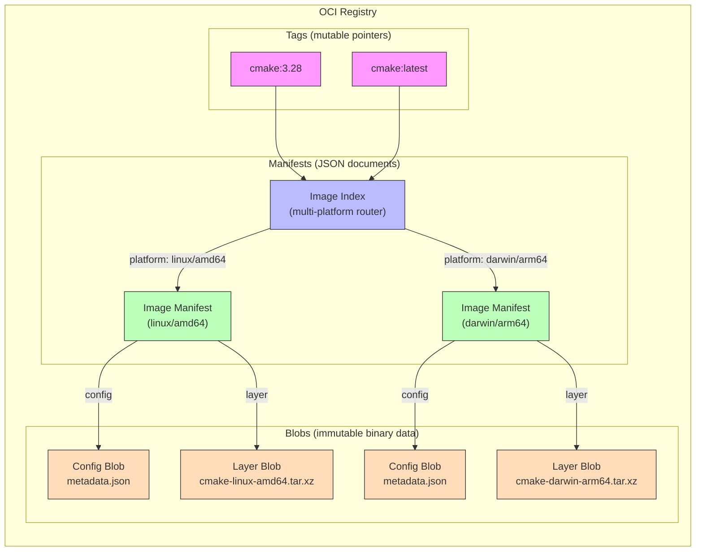
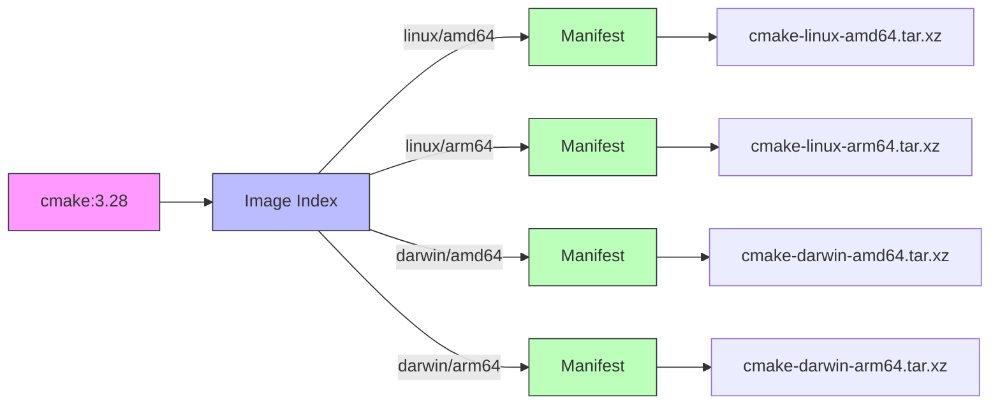
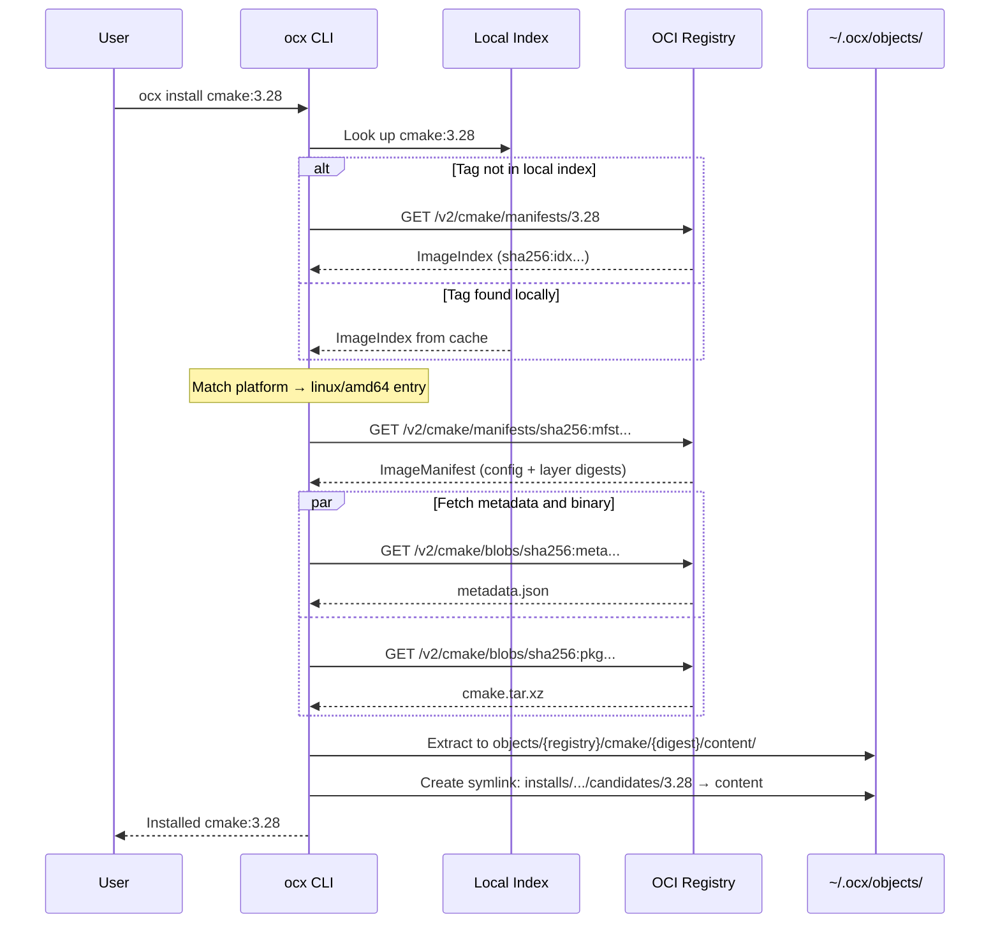
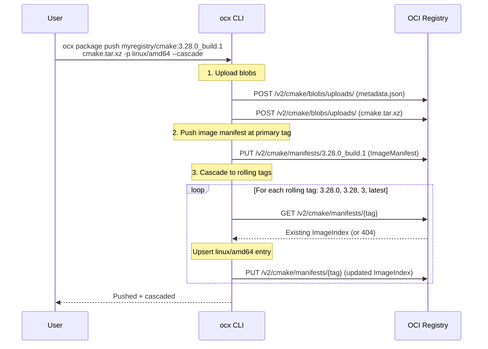
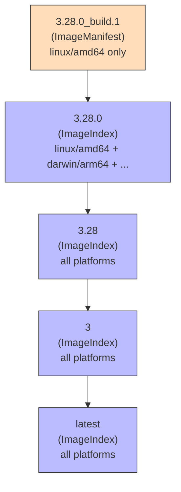
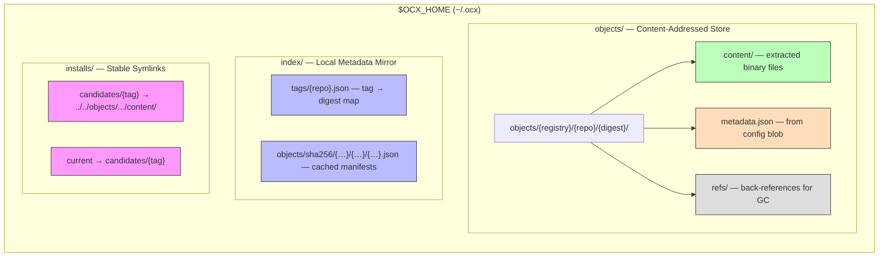

# OCI Manifests in OCX

A self-contained guide to understanding how OCX uses OCI (Open Container Initiative) registry infrastructure to distribute binary packages.

---

## Part 1: OCI Fundamentals

The OCI defines specs for storing and distributing content via registries. While designed for container images, the specs are generic enough for any content — OCX exploits this to distribute pre-built binaries.

### The Three Building Blocks

An OCI registry stores three kinds of objects:



**Blobs** — Opaque binary data, addressed by content hash (digest like `sha256:abc123...`). Once pushed, a blob is immutable. A blob could be a tar archive, a JSON config, a PNG image — the registry doesn't care.

**Manifests** — JSON documents that describe an artifact by listing its blobs. A manifest has:
- A **config** descriptor — points to one blob (typically JSON metadata)
- A **layers** list — points to one or more blobs (the actual content)
- An optional **artifactType** — declares what kind of thing this is
- Optional **annotations** — key-value metadata

**Image Indexes** — JSON documents that aggregate multiple manifests, typically one per platform (OS + CPU architecture). This is how one tag like `cmake:3.28` can serve Linux, macOS, and Windows users.

### Descriptors: The Pointers

Every reference from a manifest to a blob is a **descriptor** — a small JSON object with three fields:

```json
{
  "mediaType": "application/vnd.oci.image.layer.v1.tar+xz",
  "digest": "sha256:def456...",
  "size": 10485760
}
```

The `digest` is the content hash of the blob. The registry uses it to find and verify the data. The `mediaType` tells consumers how to interpret the blob. The `size` enables progress bars and allocation.

### Tags vs Digests

| Concept | Example | Mutable? | Analogy |
|---|---|---|---|
| **Tag** | `cmake:3.28` | Yes — can be re-pointed | Git branch |
| **Digest** | `sha256:43567c07f1a6...` | No — content hash | Git commit SHA |

A tag is a human-readable name. A digest is an immutable content address. You can combine both: `registry/repo:tag@sha256:...` — the digest pins the exact content even if the tag moves.

### The Distribution API

Registries expose a simple HTTP API:

| Operation | Endpoint |
|---|---|
| Fetch manifest | `GET /v2/{repo}/manifests/{tag-or-digest}` |
| Push manifest | `PUT /v2/{repo}/manifests/{reference}` |
| Upload blob | `POST /v2/{repo}/blobs/uploads/` |
| Download blob | `GET /v2/{repo}/blobs/{digest}` |
| List repos | `GET /v2/_catalog` |
| List tags | `GET /v2/{repo}/tags/list` |

Any OCI-compliant registry (Docker Hub, GHCR, ECR, ACR, Harbor, self-hosted `registry:2`) speaks this protocol. Authentication uses Docker's token-based auth.

---

## Part 2: How OCX Maps Onto OCI

OCX treats each **package** as an OCI artifact and each **registry** as a package repository.

### Package = Image Manifest

A single-platform package is one Image Manifest:

```json
{
  "schemaVersion": 2,
  "mediaType": "application/vnd.oci.image.manifest.v1+json",
  "artifactType": "application/vnd.sh.ocx.package.v1",
  "config": {
    "mediaType": "application/vnd.sh.ocx.package.v1+json",
    "digest": "sha256:abc123...",
    "size": 1024
  },
  "layers": [
    {
      "mediaType": "application/vnd.oci.image.layer.v1.tar+xz",
      "digest": "sha256:def456...",
      "size": 10485760
    }
  ]
}
```

| Field | OCX Usage |
|---|---|
| `artifactType` | `application/vnd.sh.ocx.package.v1` — marks it as an OCX package |
| Config blob | `application/vnd.sh.ocx.package.v1+json` — the package's `metadata.json` (env var declarations, version) |
| Layer (always exactly 1) | `…/tar+gzip` or `…/tar+xz` — the binary archive |

The config blob is stored separately from the binary so OCX can fetch metadata (environment variables, version info) without downloading the potentially large archive.

### Multi-Platform = Image Index

When a tag serves multiple platforms, it points to an Image Index:



Running `ocx install cmake:3.28` fetches the index, matches the current OS/architecture, then follows the platform-specific manifest to download the right binary.

### Custom Media Types

OCX defines its own media types to distinguish its artifacts from container images:

| Constant | Value | Purpose |
|---|---|---|
| `MEDIA_TYPE_PACKAGE_V1` | `application/vnd.sh.ocx.package.v1` | Package artifact type marker |
| `MEDIA_TYPE_PACKAGE_METADATA_V1` | `application/vnd.sh.ocx.package.v1+json` | Metadata config blob |
| `MEDIA_TYPE_DESCRIPTION_V1` | `application/vnd.sh.ocx.description.v1` | Repository description artifact |
| `MEDIA_TYPE_TAR_GZ` | `application/vnd.oci.image.layer.v1.tar+gzip` | Gzip layer (standard OCI) |
| `MEDIA_TYPE_TAR_XZ` | `application/vnd.oci.image.layer.v1.tar+xz` | XZ layer (standard OCI) |

All defined in `crates/ocx_lib/src/media_type.rs`.

---

## Part 3: Pull and Push Flows

### Pulling a Package



### Pushing a Package



### Cascade Publishing in Detail

`--cascade` automates rolling tag maintenance. Each cascade level is an independent image index:



Merging into a rolling tag means: fetch the existing index, update the entry for the pushed platform, push the index back. Blocking is **platform-aware** — a `darwin/arm64` push of `3.28` won't be blocked by a `linux/amd64` push of `3.29`.

---

## Part 4: Local Storage

OCX mirrors the OCI content-addressing model on disk:



**Object store** — Content-addressed by SHA-256 digest. Identical binaries referenced by multiple tags share one directory on disk. The `refs/` subdirectory tracks which symlinks point here, enabling safe garbage collection.

**Index store** — A local snapshot of registry metadata (tag-to-digest maps + cached manifest JSON). `ocx index update` syncs incrementally. Once populated, enables fully offline installs.

**Install store** — Two-tier symlinks with stable paths:
- `candidates/{tag}` — pinned to a specific version
- `current` — floating pointer set by `ocx select`

These paths never change even when the underlying content is updated, making them safe to embed in IDE configs and shell profiles.

---

## Part 5: Description Artifacts

Repository-level metadata (README, logo, title, keywords) lives at the hidden tag `__ocx.desc`:

```json
{
  "schemaVersion": 2,
  "artifactType": "application/vnd.sh.ocx.description.v1",
  "config": {
    "mediaType": "application/vnd.oci.empty.v1+json",
    "digest": "sha256:...",
    "size": 2
  },
  "layers": [
    {
      "mediaType": "application/markdown",
      "digest": "sha256:readme...",
      "annotations": { "org.opencontainers.image.title": "README.md" }
    },
    {
      "mediaType": "image/png",
      "digest": "sha256:logo...",
      "annotations": { "org.opencontainers.image.title": "logo.png" }
    }
  ],
  "annotations": {
    "org.opencontainers.image.title": "CMake",
    "org.opencontainers.image.description": "Cross-platform build system",
    "sh.ocx.keywords": "cmake,build,c++"
  }
}
```

The config is an empty JSON object (`"{}"`) — OCI artifact semantics, no config needed. Tags prefixed with `__ocx.` are filtered from public listing by `Index::list_tags()`.

---

## Key Source Files

| File | Purpose |
|---|---|
| `crates/ocx_lib/src/media_type.rs` | All custom media type constants |
| `crates/ocx_lib/src/oci/client.rs` | Manifest fetch/push, cascade merge, description push/pull |
| `crates/ocx_lib/src/oci/index.rs` | Index abstraction, `fetch_candidates()`, platform selection |
| `crates/ocx_lib/src/oci/index/local_index.rs` | Local index sync, manifest caching on disk |
| `crates/ocx_lib/src/oci/manifest.rs` | Manifest utilities (`has_platform()` check) |
| `crates/ocx_lib/src/oci/platform.rs` | Platform type, matching, conversion |
| `crates/ocx_lib/src/oci/digest.rs` | Digest type, parsing, serialization |
| `crates/ocx_lib/src/oci/annotations.rs` | OCI annotation constants (standard + OCX-specific) |
| `crates/ocx_lib/src/oci/identifier.rs` | Identifier parsing, digest attachment |
| `crates/ocx_lib/src/package/cascade.rs` | Cascade tag resolution + platform-aware orchestration |
| `crates/ocx_lib/src/package/description.rs` | Description artifact handling |
| `crates/ocx_lib/src/file_structure/index_store.rs` | Index filesystem layout and sharding |
| `external/rust-oci-client/src/manifest.rs` | Upstream OCI manifest type definitions |
