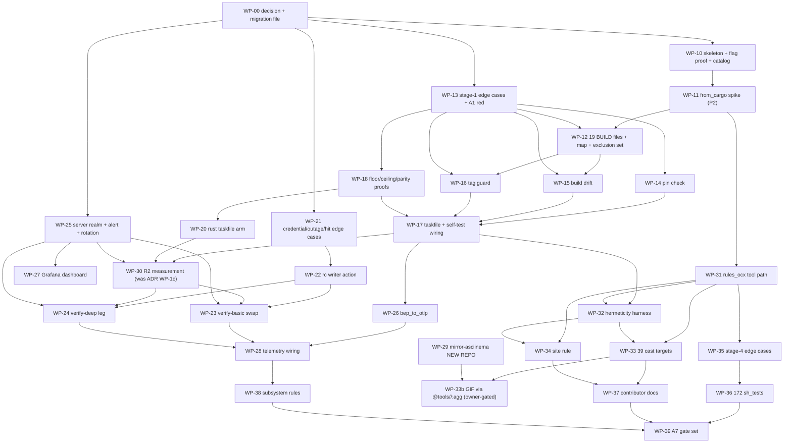

# Plan: Bazel build adoption — four stages under Taskfile

## Status

- **Plan:** plan_bazel_build_adoption
- **State:** review
- **Tier:** high
- **Tier-grammar:** 5
- **Effective-tier:** derived
- **Active phase:** 5 - terminal; waves 0-11 merged, plus the post-close wave (WP-24 reinstated, WP-33b un-gated, WP-40 new). Nothing stranded.
- **Step:** /hex-review (L3, tier high, 2 rounds) -> review; both rounds' Blocks closed. Rebased onto `origin/main`, CI green, `/hex-finalize` run.
- **Feature branch:** `sion` (worktree `/home/mherwig/dev/ocx-sion`)
- **Last update:** 2026-09-22 (after 48cf7856: 33 of 33 WPs merged, 93 deviations, `task verify` green at HEAD, 13/13 PR checks green, Verify Deep green)
- **Next:** the owner merges. #499 is ready for review with all 13 pull-request checks green and Verify Deep green on the head; rotate the cache and AWS credentials (DX-59) -- the reader realm is live, so the credential the BEP leaked is a real one. Then the two open calls in `.agents/owner-actions.md`: the cache WRITE lane and the 39 rendered-but-unread GIFs. Re-read R2 on the first push to `main` (DX-93): no pull-request run can hit a cache only that push fills.
- **Finalize:** halted at pre-flight (2) — `/home/mherwig/dev/ocx-sion` is a linked worktree, not the primary checkout (`/home/mherwig/dev/ocx`, which holds `goat`). Nothing rewritten, no backup ref armed, no remote act. None is needed: `sion` is pushed at fc676337 with 14/14 pull-request checks green and Verify Deep green at 48cf7856, and [#499](https://github.com/ocx-sh/ocx/pull/499) is ready for review. The merge is the owner's.
- **Repos:** <!-- frozen at execution start; bases are never re-resolved -->
  - `.` `/home/mherwig/dev/ocx-sion` trunk `main` base `ee4f495481cfa1ec7b6086f47426586c1cd7ee53` landed: no (complete on `sion`, awaiting the owner)
    - the feature branch is `sion` itself; WP worktrees under `.agents/worktrees/`.
  - `mirror-asciinema` `/home/mherwig/dev/mirror-asciinema` trunk `main` base `02e5fd1c1260f15e62b57044adfb49341cbb95a7` landed: no
    - no remote yet; WP-29 remaining work is **owner-only**, so hex writes nothing here.
  - `server-hetzner1` `/home/mherwig/dev/server-hetzner1` trunk `main` base `a7a6d04313fd358426329030006abdb79cf213ae` landed: no
    - feature branch `bazel-cache-reader-realm` @ `8667a34` **already carries WP-25**; WP-27 appends to it in place.

> **Displaced pointer.** `.claude/state/current_plan.md` previously named
> `plan_ci_integration_review_fixes.md` (State: review, all WPs merged, nothing open,
> awaiting `/hex-review` on the whole branch). That plan is **not superseded** — it is
> complete and awaiting a branch review. Recover it with
> `/hex-review .claude/artifacts/plan_ci_integration_review_fixes.md`.

---

## Overview

**Status:** Approved (orchestrator, autonomous `/goal`), after one adversarial review round
**Author:** `/hex-plan high` sub-orchestrator, on `sion`
**Date:** 2026-09-21
**Related ADR:** [`adr_bazel_build_adoption.md`](./adr_bazel_build_adoption.md) — **Accepted**, the binding design
**Related research:** [`research_bazel_mechanism_verification.md`](./research_bazel_mechanism_verification.md)
**Related skill:** [`bazel-adopt`](../skills/bazel-adopt/SKILL.md) — its 11 steps are WP-00

**Review round 1 closed 30 findings** from four seats (spec, architect, SOTA, cross-model
`codex:rescue` — the cross-model gate **ran**, it was not skipped). Three of them changed
the plan's shape rather than its wording; they are marked **[R1]** where they land.

**Three sibling pre-works then landed and are folded in**, marked **[R2]**: rules_ocx on
Bazel 9.2.0 is done and pushed (M-05 — WP-00b withdrawn), the `agg` mirror spec is built
and validated (M-06a — WP-29 resized, GIF rendering split into WP-33b), and the server
reader realm is implemented and tested (M-04 — WP-25 resized). Their common consequence
is **C-029**: the owner-gated remote realm must not be a prerequisite for any red/green
proof.

## Objective

Put Bazel 9.2.0 under `task verify` so test *execution* caches per crate, across the four
surfaces the owner ratified: Rust unit tests, the CI lane swap, casts + website, and the
acceptance suite. `task` stays the only command anyone types. No stage is dropped.

## Scope

### In scope

- The ADR's created and edited file sets, across **four** repositories.
- Gate scripts, each with the repo's `--self-test` red/green convention.
- Cache staging: `--disk_cache` → read-only remote → gated writes. **No RBE.**
- BEP → OTLP telemetry and one Grafana dashboard.
- Three sibling PRs: `rules_ocx`, a **new** `mirror-asciinema`, `server-hetzner1`.

### Out of scope

- Remote execution, BuildBuddy, any new service. sccache is untouched.
- Target selection (bazel-diff, target-determinator) — BZL-CI-01, deferred with a
  named reopen condition.
- Windows and macOS Bazel lanes. **See M-01 and the note under "Shippable after wave 6":
  this is where the largest CI job is, and stage 2 cannot shorten it.**
- `CHANGELOG.md` — generated; the commit subject is the changelog line.
- Editing anything under `.claude/rules/bazel-quality/**` — vendored.

## Classification

| Axis | Value |
|---|---|
| Scope | **Large** (2+ weeks) |
| Reversibility | one-way (medium) |
| Tier | **high** |
| Artifacts | plan + ADR (exists) + persisted research |

**Recorded tier deviation.** `/hex-plan`'s tier-high Phase 3 says a Large scope must stop
and re-run as `xhigh`. It is **not** re-run: the ADR § Metadata already ruled this exact
question — *"Tier: high (owner-set…). Cross-area breadth alone would signal xhigh —
recorded, not silently upgraded"* — and the autonomous `/goal` sets `high`. The escalation
is recorded, not taken, and `xhigh`'s one free compensating control is carried anyway:
**`adversary=on`**, which at `high` would otherwise be off. It found three Blocks.

**Recorded design-phase deviation.** `architect=inline`, against tier-high's
`architect=on` default. The design record exists, is Accepted, and is binding. What this
plan adds instead is four rulings (P1–P4) forced by measurement, in the ADR's `R1`/`R2`
shape.

---

## Measured facts — 2026-09-21, this run

Every row is a command's output. Nothing here is recalled.

### M-01 — the ADR's one empty decision-file cell, measured **in part**

`gh run view <id> --json jobs`, the 3 most recent **successful** `verify-deep` runs and
the 2 most recent successful `verify-basic` runs:

| Workflow | Run | Largest job | s | Second | s |
|---|---|---|---:|---|---:|
| verify-deep | 35539665987 | **Build & Unit Test (Windows)** | 1250 | Acceptance (Linux) | 1011 |
| verify-deep | 35538021043 | **Build & Unit Test (Windows)** | 1456 | Acceptance (Linux) | 748 |
| verify-deep | 35534195939 | **Build & Unit Test (Windows)** | 1487 | Acceptance (Linux) | 961 |
| verify-basic | 35539665948 | **Smoke (Linux)** | 1195 | Smoke Acceptance | 519 |
| verify-basic | 35538021028 | **Smoke (Linux)** | 1263 | Smoke Acceptance | 394 |

Linux legs for comparison: `Build & Unit Test (Linux)` 641 / 683 / 930 s.

**What this establishes.** The largest job in both gating workflows is a build-and-test
job, in all five runs. This **supersedes** the ADR's inherited decomposition
(research 5 `:15`), which said acceptance dominates: it does not — it is consistently
second.

**What it does NOT establish, stated here and not in a footnote [R1].** The ADR's signal
row asks two things — *"which job is the largest, **and how much of it is compile**"*.
Only the first was measured. A job's wall-clock does not separate cacheable compilation
and test execution from checkout, toolchain setup, downloads and the ten untouched
`.verify:build-test` steps. **The second half is WP-30's job**, and until WP-30 runs, no
claim about the size of the win is available. See P4.

**And the arithmetic the caveat implies [R1].** `verify-deep`'s build stage is a
three-OS matrix, so its duration is `max(windows, macos, linux)`. Bazel takes only the
Linux leg (ADR § Stage 2 ruling 1). Taking Linux to zero shortens the matrix stage by
**nothing**, because the workflow still waits for Windows at 1250–1487 s. **Stage 2's
contribution to `verify-deep`'s 3407 s median is structurally zero.** The only surface
where a win can land is `Smoke (Linux)` (1195–1263 s), minus its lint, build and
non-test portions — the subtraction WP-30 owes. WP-00 writes this paragraph into the
decision file verbatim.

### M-02 — target counts: three corrections, and two universes that do not match

`crates/ocx_shim/Cargo.toml` declares **`[[bin]]` only — no `src/lib.rs`** and no
`#[cfg(test)]`. Stages 1–2 build **no `rust_binary`** (ADR ruling 3). So `ocx_shim`
contributes zero targets:

| Floor | ADR | Re-derived | Subject |
|---|---:|---:|---|
| `bazel:build:drift` reader floor | 57 | **55** | every target in the Rust BUILD files |
| `bep_to_otlp` reader floor | 54 | **52** | every `//crates/...` target |
| BUILD-file count | 23 | **22** | 19 `crates/` + 3 `external/` |
| Bazel `rust_test` count | 34 | **33** | 19 lib + 14 integration |

**The parity check the ADR specifies is unsatisfiable as written [R1].** ADR WP-1b item 3
asserts the Bazel test-target count equals `cargo nextest list --workspace`'s
`rust-suites` count. It does not, and cannot: `rust-suites` is keyed by **test binary**
and includes **bin** targets — `crates/ocx_cli/src/main.rs:43` carries
`#[cfg(test)] mod tests { … the_error_boundary_is_neutralized }`, so nextest lists a suite
for the `ocx` binary that stages 1–2 build no target for. The two universes differ by a
**named, enumerated exclusion set**, and C-008 makes producing that set WP-12's job.
A parity check that equates them without it is an off-by-N that passes forever or reds
forever.

**These numbers are WP-12's output, not its input.** Every gate floors on a *generated*
table, never a constant — the ADR's own rule, and the reason the 54/34 substitution
happened twice already.

Confirmed unchanged: 20 workspace members, 14 integration test files with the ADR's exact
per-crate breakdown, 72 doc scripts of which **39** carry `# cast: true` and **39**
`.cast` files exist, **172** `test/tests/test_*.py`, `.verify:build-test` is **14**
sequential steps, `NEXTEST_FLOOR` = 8213, `NEXTEST_SKIP_CEILING` = 9, and all three
`SCOPED_ROWS` glob overlaps plus both `escalate` rows.

### M-03 — a precondition: `cargo metadata` is currently broken in this worktree

`crates/ocx_lib/` and `crates/ocx_mirror/` hold **only** a gitignored `*.cdx.json` and no
`Cargo.toml`. `cargo metadata --no-deps` fails:
`failed to load manifest for workspace member .../crates/ocx_lib`. Both are untracked, so
the tree reads clean. `bazel:build:drift` reads `cargo metadata --locked` and cannot work
until they are gone. **WP-00 clears them.**

### M-04 — `server-hetzner1`'s reader realm is **implemented and tested**, not pending

**Measured 2026-09-21, superseding this row's first draft.** Branch
`bazel-cache-reader-realm` (`b469ae1`, `8667a34`) implements R1's server half in full —
`limit_except GET HEAD`, `bazel-cache-readers.htpasswd`, and a
`nginx:htpasswd:add … DOMAIN=bazel-cache-readers` task — and it has been **tested against
the real stack**. The earlier "uncommitted working-tree edit at `a7a6d04`" was that work
mid-flight; it has since landed on the branch.

`origin/main`'s committed vhost is confirmed as the ADR describes: `auth_basic` +
`auth_basic_user_file` on `location /`, **no `limit_except`** → every method 401.
`bazel-cache/README.md:7-9` still says "reads are anonymous" — stale, confirmed.

**What remains is owner-only, and it is a hard precondition, not a task:** applying the
branch on the live host, and creating the two GitHub secrets `BAZEL_CACHE_READ_AUTH` and
`BAZEL_CACHE_WRITE_AUTH`. **Consequence the plan must honour, stated once here and
enforced in C-029:** no red/green cache proof may depend on the remote realm. Every
hermeticity, invalidation, tag and selection proof runs on `--disk_cache` alone, so the
whole proof corpus stays runnable before the owner touches anything.

### M-05 — `rules_ocx` on Bazel 9.2.0 is **done and pushed**; WP-00b is withdrawn

**Measured 2026-09-21, superseding this row's first draft.** The Bazel-9 work is complete
upstream: branch `bazel-9`, commit `9ced5ffb79a77d37d6f479498bf32517a49b3dc7`, draft
[ocx-sh/rules_ocx#15](https://github.com/ocx-sh/rules_ocx/pull/15), with
`bazel test //...` green at **80/80 on 9.2.0**. The ADR's WP-0b — and this plan's first
draft's WP-00b — are therefore **withdrawn**: nothing is left to verify or bump. What
remains in *this* repository is one stanza, which WP-31 adopts:

```starlark
git_override(
    module_name = "rules_ocx",
    remote = "https://github.com/ocx-sh/rules_ocx",
    commit = "9ced5ffb79a77d37d6f479498bf32517a49b3dc7",
)
```

**The measured tool-path contract**, which resolves three things the ADR left open:

- **`ocx` is never taken from `PATH`.** `ocx_download` fetches a sha256-pinned `ocx` into
  `@ocx_tool//:ocx`; a consumer needs nothing installed. This also answers S-001 for a
  fresh clone without assuming the per-prompt hook ran.
- **`ocx.project` exposes one target per declared binary** — `@tools//:uv` and
  `@tools//:uvx` both verified under `linux-sandbox` as `tools=` and `data=`.
  `ocx.project()`'s `name` attribute is **mandatory**: the ADR's snippet
  `ocx.project(ocx_toml = …, ocx_lock = …)` will not load, and `@tools//:bun` requires
  `ocx.project(name = "tools", …)`.
- **Three design limits, each load-bearing here:**
  1. **Tool content is not a Bazel input.** Launchers exec an absolute
     `$OCX_HOME/packages/…/content/<bin>` path. But the **digest is in the launcher
     text**, so actions *do* re-key when a tool changes — which means **ADR ruling 2(c)'s
     tool-pin participation check is expected green by construction**, and C-023(c)
     becomes "confirm the stated contract holds", not an open question.
  2. **Remote caching is fine; RBE is impossible.** The absolute-path launcher cannot work
     on a remote executor. The ADR's "no remote execution" is therefore now a *structural*
     property of the tool path, not only a scope decision — and no future reader can
     reopen it without replacing the tool path itself.
  3. **Only executables are exposed — no filegroups for package data.** This confirms
     C-021's one carve-out: the Nerd Font stays an `http_archive` with `integrity`,
     because it is data, and there is no `@tools//` route for data even in principle.

### M-06a — the `agg` mirror spec is **built and validated locally**

**Measured 2026-09-21.** A local mirror repository exists at `~/dev/mirror-asciinema`
@ `02e5fd1`, validated across **6 platforms**, with the Nerd Font installed through
`containers[].setup` rather than an `http_archive` — so the font question the ADR routed
around is answered inside the mirror spec itself.

**WP-29 therefore shrinks from "author a repo" to "publish one that exists."** What is
left is entirely owner-only and is logged in `.agents/owner-actions.md`: creating the
repository under `ocx-contrib`, adding two org secrets, and the index claim.

**Consequence for the cast stage, which this reorders [R2].** `agg` renders `.cast` →
GIF; it plays no part in *recording* a cast. So the owner-gated dependency has been pushed
off the critical path: **WP-33** (the 39 cast recording targets, their tags, and the
`localhost:<port>` registry addressing) needs no `agg` and no published mirror, while
**WP-33b** (GIF rendering through `@tools//:agg`) carries the owner precondition alone.

### M-06 — `agg` upstream, for the new mirror

Latest **v1.9.0** (2026-05-29), 14 tags. Assets are bare target triples:
`agg-x86_64-unknown-linux-gnu`, `agg-aarch64-unknown-linux-gnu`,
`agg-x86_64-unknown-linux-musl`, both darwin, `agg-x86_64-pc-windows-msvc.exe`. No
windows/arm64. `mirror-asciinema` **does not exist** on `ocx-contrib` or `ocx-sh`. Mirror
CI workflows are **generated** by `ocx-mirror package pipeline generate ci`, not authored.

### M-07 — `ocx.sh/bazelbuild/bazel:9.2.0` resolves

`sha256:252fc12c947fd30b67c2f522f56cd297efef03c85495905242fdceb4ff808c0c`; candidates
darwin/amd64, darwin/arm64, linux/amd64+libc.glibc, linux/arm64+libc.glibc,
windows/amd64. **No linux/arm64 musl.** Every lane is glibc; a hard stop the day an arm64
Alpine runner appears.

### M-08 — `external/` are git submodules [R1]

`git ls-files -s external/` returns mode **160000** for all three. A `BUILD.bazel`
physically inside `external/<name>/` is either an untracked file in a submodule or three
more submodule commits plus a parent gitlink bump. **WP-11 owns the choice** and its
routes are named in C-007; the plan does not pre-decide it.

---

## Orchestrator rulings — pending owner ratification

Four decisions this chain took that the ADR did not, in the ADR's own `R1`/`R2` shape.

### P1 — the floor never needed a Bazel reader **[R1 — this ruling was rewritten]**

**The first draft of this ruling was wrong, and the review caught it.** It proposed
replacing the floor's reader with a BEP + libtest-output parser, and priced a large work
package for it. The premise was false.

**Measured, at `taskfiles/rust.taskfile.yml:591-614`:** `rust:test:floor` runs
`cargo nextest list --workspace --release --locked --message-format json` and sums
`len(s["testcases"])` over `rust-suites`. **It is a declaration check. It never reads a
run.** Moving test *execution* to Bazel does not touch it at all.

**Also measured** (`research_bazel_mechanism_verification.md` Q1): a Bazel `rust_test`
runs **libtest**, not nextest; rules_rust writes no `$XML_OUTPUT_FILE`
([#1303](https://github.com/bazelbuild/rules_rust/issues/1303) open,
[#4181](https://github.com/bazelbuild/rules_rust/pull/4181) unmerged); libtest's JUnit
output is nightly-only; Bazel's synthesised `test.xml` is one `<testcase>` per target; and
`--experimental_split_xml_generation`, the knob that governed it, was **removed in 9.0.0**.

**Decided.**

1. **The floor stays exactly as it is** — `cargo nextest list`, engine-independent. The
   8213 per-case contract is **preserved in full**, and A2's test-count parity clause
   remains reachable. No BEP reader, no libtest grammar, no vendored upstream patch.
2. **The ceiling is the only gate that reads a run** (`taskfiles/rust.taskfile.yml:616-649`,
   nextest's `Summary` grammar) and therefore the only one Bazel execution disturbs.
   WP-18 establishes whether `cargo nextest list`'s per-testcase `ignored` flags can carry
   it; if not, the ceiling keeps its nextest run and the swap narrows accordingly.
3. **One new cheap check replaces the whole deleted reader**: the Bazel `rust_test` target
   count equals nextest's `rust-suites` count **minus the enumerated bin-suite exclusion
   set** (M-02). This is the one thing listing cannot see — a graph missing the
   integration suites — and it is ADR WP-1b item 3, corrected.

**What this deletes:** WP-19 (L) is **withdrawn**; WP-18 shrinks; and the Block-tier
`quality-core.md` § "Don't Own Non-Domain Code" deviation for a hand-owned libtest parser
**evaporates — there is no parser**.

**What stays true:** the ADR's safety valve is untouched. The nextest gates keep running
until a Bazel-side replacement has been shown red; a floor is replaced by a floor.

**Owner's lever:** require per-case counts *under Bazel* anyway, accepting a vendored
`#4181` and a nightly lane. Not recommended — it buys nothing the listing already gives.

### P2 — `crate.from_cargo` against three `path =` patches: reproduce before routing **[R1 — ladder reordered]**

**Evidence, stated at its real strength [R1].**
[rules_rust#1631](https://github.com/bazelbuild/rules_rust/issues/1631) (open) reports
`The package '...' has no source info so no annotation can be made`
(`crate_universe/src/metadata/metadata_annotation.rs:234`) when a crate is patched to a
local **path**. Its reproduction is `crates_vendor` on rules_rust **0.11.0**, *not*
`from_cargo` on 0.74.0. The annotator is shared, so this is a **strong hypothesis about
our configuration, not a measured failure of it** — the first draft of this ruling said
"measured", which overstated it.

The review also established that the first draft's route 1 does not dodge the bug anyway:
`from_cargo` splices and parses the **root manifest's resolve graph**, and
`crates/ocx_oci` depends on `oci-client`, so the patched package is in that graph because
a member depends on it — regardless of which Bazel targets exist.

**Decided — WP-11's ladder, reproduction first.**

0. **Reproduce on the pin.** A 30-minute `crate.from_cargo` + Bazel 9.2.0 + rules_rust
   0.74.0 run against the live manifest. If it is green, every route below is unnecessary
   and the ruling retires.
1. **`crate.from_specs`** — declare the third-party set in `MODULE.bazel` and never let
   crate-universe read the root manifest. Evaluated first because it removes the failing
   input rather than working around it. Cost: a second dependency declaration, which the
   drift gate (C-010) is already built to police.
2. **Convert the three patches from `path =` to `git = … rev = …`** — #1631 records the
   git form working. **Cost, restated correctly [R1]:** not the SHA duplication the first
   draft named, but the **local fork edit loop**. Today an edit inside
   `external/rust-oci-client` takes effect in `cargo build` immediately; under `git = rev`
   cargo fetches the remote and ignores the working tree, so every fork fix needs a push
   plus a rev bump before it can be built or tested. **This repository actively patches
   those forks.** That is a real, recurring tax on the thing the submodules exist for.
3. None of the above → stage 1 aborts per A1; the initiative stops at Option C.

**Stated plainly, because the first draft left it implicit [R1]:** if the owner forbids
route 2 and routes 0 and 1 both red, the lever is not a constraint — **it selects the
abort.**

**Owner's lever:** forbid route 2, accepting the above.

### P3 — gazelle_rust leaves wave 1

**Measured:** published `v0.1.0` pins **Bazel 8.4.2 / rules_rust 0.67.0** with no version
matrix, so the pin pair is exercised nowhere; #15 (transitive-dep leak) is open; **zero**
handling of `[patch.crates-io]`, path deps or excluded members exists in its issues or
code; its default mode names every target `lib`, breaking cross-package `deps` the moment
two members exist — this workspace has 20.

**Decided:** **no generator spike in wave 1.** The 22 BUILD files are hand-written, which
`go-no-go.md:98-100` already makes the correct default below Production. Docketed with a
named reopen condition: *a BCR release carrying the Bazel-9 fix (`d1ae032`) plus a
documented `[patch.crates-io]` story.*

**The unstated cost, now stated [R1].** With no generator, **every new
`crates/*/tests/*.rs` and every `Cargo.toml` dep-edge change reds `bazel:build:drift`
until a human hand-edits a BUILD file.** That is a permanent inner-loop tax across 22
files and 55 targets. The drift gate makes the tax loud rather than silent; it does not
remove it. **WP-12's exit criteria include measuring dep-edge churn over the last 100
commits**, so the steady-state cost is a number before it is accepted.

**Consequence for A1 [R1].** A1's abort condition reads "by **either** generation route".
With P3 there is one route, so A1's abort now keys on P2's ladder instead.

**Owner's lever:** require the spike anyway as evidence.

### P4 — the go/no-go reading stays on the fourth line **[R1 — this ruling was reversed]**

The first draft declared M-01 sufficient to write a procedure **`go`**. The review
refuted it on three grounds, all correct:

1. `go-no-go.md` reading 3 clause 3 is "the cheaper fix is in place and **named as
   insufficient**". The ADR's own decision-file row answers *"yes — landed, never
   re-measured"*, and the ADR says the controlled before/after *"is still owed"*.
   **Unmeasured is not insufficient.**
2. The ADR's signal asked "which job is the largest, **and how much of it is compile**".
   M-01 measured the first half only.
3. Declaring the verdict "a measurement, not a judgement" was false. Converting the
   table's fourth line into a `go` is precisely the judgement the ADR spent a section
   declining to take — and here the satisfying job is a **Windows** job the Bazel lane
   never touches, whose matrix arithmetic (M-01) makes stage 2's contribution to
   `verify-deep` structurally zero.

**Decided: WP-00 writes the fourth line** — *"Anything else is a decision the owner takes"*
— with M-01 and its full caveat recorded beside it, exactly as the ADR did. The owner's
scope decision stands on its own; it is not dressed up as a procedure output.

**Reopen condition:** WP-30's step-level cold/warm measurement on the affected Linux
lanes. If compile dominates `Smoke (Linux)`, clause 4 fires on a surface Bazel actually
touches and WP-00's verdict can be amended in that commit.

**Owner's lever:** none needed — this ruling declines a judgement rather than taking one.

---

## Constitution deviations

Checked against [`arch-principles.md`](../rules/arch-principles.md),
[`quality-core.md`](../rules/quality-core.md) and the vendored
[`bazel-quality.md`](../rules/bazel-quality.md) + its depth files.

| Deviation | Rule | Justification | Control |
|---|---|---|---|
| Bazel is a net-new build-graph tool | `product-tech-strategy.md` names none; `quality-core.md` § Choose Boring Technology | One innovation token, spent deliberately | ADR § Metadata; WP-10 adds the row |
| Tools come from `ocx.lock`, not bazelisk reading `.bazelversion` | `bazel-quality.md:50-51` § The Gate | A per-platform digest is a strictly stronger pin than a semver string; driver 5 | C-003's drift gate makes the pair honest |
| No `npm_translate_lock`; a coarse Starlark rule for the site | BZL-JS-01, BZL-JS-03 (**MUST**) | Scoped to rules_js ingestion; premise does not obtain. `branches-python-ts-cpp.md:108-111` is the skill's own escape for a minority JS slice | A named comment in `website/site.bzl` (WP-34) |
| **Repo-owned scripts and Starlark: 9 Python files + 3 `.bzl` files** [R1] | `quality-core.md` § Don't Own Non-Domain Code (**Block** for wire formats) | The first draft said "four scripts" and understated this ~3×. Of the nine, **one parses an external wire format**: `bep_to_otlp.py` (BEP + execution log). Its "verified by searching" escape is **owed separately** — the research searched for a libtest→JUnit converter, never for a BEP reader | **WP-26's first exit criterion is that search** (bazel-bes readers, OTel SDK, `//src/tools/execlog`). If a maintained reader exists, shell to it |
| `.bazelversion` retained but not authoritative | BZL-FLAG-01 (**MUST**) | The file is kept and format-checked; only *authority* moves | C-003 |
| **`local`, `external`, `no-sandbox`, `requires-network`, `no-remote-cache` tags added wholesale** [R1] | BZL-CORE-01 (**MUST**) — "never reach green by weakening the check", which enumerates exactly these tags | Defensible as **initial** build configuration rather than a green-chasing edit: each tag is required by a measured property (PTY outside the sandbox, a compose stack outside the input graph). The first draft's blanket "no deviation weakens a check" was over-claimed | **C-011 `bazel:tag:guard`** is the compensating control, and every later tag change is a BZL-CORE-01 violation by default |

**What no deviation touches:** **BZL-CORE-02** — no verification is cited before it has
been watched go red. Every gate contract below names its red state, and the repo's
`--self-test` convention is what runs it.

---

## Technical approach

### Key decisions

| Decision | Rationale |
|---|---|
| Stage order 1 → 2 → 3 → 4, no stage dropped | Owner `/goal`; ADR § Decision Outcome records the matrix's dissent (B 114 > C 110 > A 97) and carries A anyway |
| **The floor stays on `cargo nextest list`; Bazel owns execution only** [R1] | P1. A declaration check is engine-independent, so the whole BEP-reader branch was unnecessary work |
| Cache staging disk → read-only remote → gated writes → **no RBE** | `bazel-adopt` step 8; each stage verifiable before the next adds a failure mode |
| Write credential: `--credential_helper` from a **CI-only rc file** in `$RUNNER_TEMP` | BZL-CACHE-03 (MUST, new setup) + BZL-CACHE-04 (MUST, never a shipped rc) |
| Read credential: `--remote_header` in gitignored `.bazelrc.user` / workflow `env:` | Reads are **401** (measured). BZL-CACHE-02's subject is the *write* credential; broad read + one gated writer is the asymmetry the rule asks for |
| **Cache-generation exit is a URI path prefix, not `--remote_instance_name`** [R1] | The flag is **inert over HTTP** — Bazel's HTTP client never puts the instance name in the URL. The exit needs `https://bazel-cache.ocx.sh/v1` **plus** `--enable_ac_key_instance_mangling` on the bazel-remote unit |
| **Acceptance serialisation is the `exclusive` tag, not `--local_test_jobs=1`** [R1] | `.bazelrc` lines are per-command, never per-target-pattern. A global `test --local_test_jobs=1` would serialise the 33 Rust test targets too — deleting stage 2's win outright |
| `rules_ocx` enters at **stage 3**, not stage 1 | Stages 1–2 consume no `@tools//` tool; the composition mandate is unchanged, only when it is first exercised |
| Gates live in `cmds:`, never `preconditions:` | `task --force` skips `preconditions:` on go-task 3.52 |
| Every gate is stdlib-only Python with `--self-test`, wired with **no `sources:`** | The repo's own convention — "a fingerprint-cached self-test reports the last run's verdict" |
| Floors are **per-reader and per-stage**, never one shared table [R1] | Four readers, four universes — and a `//...` floor cannot require targets that arrive eight waves later |

### Architecture

```
  task verify  /  task verify:scoped        ← unchanged entry point
        │
        ├─ .verify:lint  (8 parallel deps)  + bazel:pin:check
        │
        └─ .verify:build-test (14 seq steps)
             ├─ 10 steps untouched
             ├─ bazel build --nobuild //...         ← inserted
             ├─ bazel:build:drift, bazel:tag:guard  ← inserted (need a loading-clean graph)
             ├─ rust:test:floor        UNCHANGED — cargo nextest list (P1)
             ├─ rust:test:unit         → bazel test //crates/...   (the swap)
             ├─ rust:test:ceiling      → per WP-18's verdict
             └─ rust:test:ceiling:self-test
                       │
                       ▼
                   Bazel 9.2.0  ── from ocx.lock (digest-pinned), NOT bazelisk
                    │    │    │
                    │    │    └─ rules_ocx git_override → ocx.project(name="tools")
                    │    │                              → @tools//:{bun,uv,agg,lychee,…}  [stage 3+]
                    │    └───── rules_rust 0.74.0 → rustc 1.95.0                [stage 1-2]
                    │
         ┌──────────┴──────────┐
         ▼                     ▼
  bazel-cache.ocx.sh/v1   otel.ocx.sh
  read: 401 → read cred   scripts/bep_to_otlp.py
  write: main-push only   (BEP + execution log → OTLP gRPC)
```

---

## Component contracts

Numbered `C-nnn`. Every one maps to ≥1 WP and ≥1 test step. The ADR holds each contract's
full row table; this plan names them and points, except where **[R1]** marks a correction
the ADR does not carry.

| ID | Contract | Source | WP |
|---|---|---|---|
| C-001 | Decision file: one row per signal, every cell measured. **Exit check is `go-no-go.md:210-211`'s regex verbatim** — the first draft's weaker spelling greened on an empty middle cell, mutation-proven [R1]. Plus: the file is non-empty and names every signal by identity | `go-no-go.md:210-211` | WP-00 |
| C-002 | Migration plan file: **all five** named sections present by identity, not a count ≥ 4 [R1]. Red state: delete each section in turn, each must red | `bazel-adopt/SKILL.md:322-364` | WP-00 |
| C-003 | `bazel:pin:check` — 5-row contract, 3 distinct exit-1 messages incl. a reader floor; `.bazelversion` vs the resolved binary's `bazel --version` | ADR § The pin authority | WP-14 |
| C-004 | `MODULE.bazel`: `bazel_dep`s **each with an explicit version** incl. `rules_shell 0.8.0` and `buildifier_prebuilt 8.5.1.4` [R1]; explicit `lockfile =` on every crate-universe instance (BZL-RUST-01); `rust.toolchain(versions=["1.95.0"])`; committed `MODULE.bazel.lock` + JSON merge driver; `--lockfile_mode=error` on its own CI leg. `compatibility_level` is non-functional on 9.1.0+ — do not build on it [R1] | ADR § file set; BZL-MOD-01/02/03/04 | WP-10 |
| C-005 | `.bazelrc`, **split by rc-line prefix** [R1] — `startup --host_jvm_args=-Xmx2g` (a startup option; a `build` line is an unrecognized-option error), `build --jobs=12`, etc. Explicit `https://` scheme with the **`/v1` generation prefix**; `--remote_download_minimal` on CI with BZL-CACHE-12's paired position; `--remote_timeout=30s`; `--remote_retries=2`; disk cache under `.tmp/` never `/tmp`; `--experimental_disk_cache_gc_max_size` **documented as local-only — its GC is idle-triggered and never fires on an ephemeral runner** [R1]; `--experimental_remote_cache_eviction_retries` **omitted** (default 5 already, and it lives in `ExecutionOptions`) [R1]; a "do not enable" comment beside `--experimental_remote_cache_chunking` [R1]; `--repo_contents_cache`'s default location named [R1]; **no `--credential_helper` line of any kind**; `try-import %workspace%/.bazelrc.user` as the last non-comment line | ADR § file set, rulings 11/12; BZL-FLAG-19, BZL-CACHE-04 | WP-10 |
| C-005a | **[R1, new]** BZL-FLAG-11 (**MUST**): every flag written into `.bazelrc` or a workflow is proven present on the pinned binary's **two** help surfaces (`bazel help <cmd> --long`, `bazel help startup_options`), output captured in the WP's evidence. Empty output is a stop signal, never a pass | `bazel-quality.md` non-negotiable 8 | WP-10 |
| C-006 | `.bazelignore`: workspace-relative directory paths, not depth globs — `.agents/`, `.claude/state/`, `.claude/worktrees/`, `.swarm/`, `.ocx/`, `.task/`, `.tmp/`, `target/`, `node_modules/`, `test/.venv/`, `.cache/xwin/`, and each `external/<crate>/target` **explicitly**. Red state [R1]: `bazel query 'buildfiles(//...)'` must not list any ignored directory | ADR § `.bazelignore` semantics; BZL-ARCH-26 | WP-10 |
| C-007 | The three `external/` crates get `rust_library` targets. **The BUILD files cannot simply be committed in place — `external/` are mode-160000 submodules (M-08)** [R1]. WP-11 picks and records one of: (a) a repository rule with an injected `build_file` from the parent tree; (b) three submodule commits plus a gitlink bump, as their own PRs; (c) whatever route 0/1 of P2 makes unnecessary | P2; M-08 | WP-11 |
| C-008 | `crates/*/BUILD.bazel` × 19: one `rust_library`, one `rust_test` for the lib's unit tests, one more per `crates/<name>/tests/*.rs`. `ocx_shim` gets **no target**. **Plus: the enumerated bin-suite exclusion set reconciling the Bazel and nextest universes (M-02)** [R1] | ADR § Stage 1; M-02 | WP-12 |
| C-009 | `crates/TEST_TARGET_MAP.toml`: one row per **test** target — label, crate, last-recorded case count. Regenerated by `-- --update`. Rises only, unless the commit says why | ADR § Stage 2 | WP-12 |
| C-010 | `bazel:build:drift` — **full** dep-set comparison incl. third-party edges through a declared name-mapping table; unmapped label is its own exit 1; reader floor **55** targets / **22** packages | ADR § Stage 1 gate contract; M-02 | WP-15 |
| C-011 | `bazel:tag:guard` — every `no-sandbox` target carries a cache-excluding tag; **every `rust_binary` carries the `no-remote-cache` tag or `stamp = 0` as a rule attribute** — `--nostamp` is a global flag no target can carry, and it already defaults false, so asserting it is vacuous [R1]. **Reader floor is stage-scoped and advances with each stage** (`//crates/...` at wave 5, `+//test/doc_scripts/...` at wave 9, `//...` ≥ 272 only at wave 11) — a `//...` floor in wave 5 would require targets that arrive in wave 10 [R1] | ADR § ruling 1a; M-02 | WP-16 |
| C-012 | `rust:test:floor` — **unchanged** [R1]. `cargo nextest list --workspace --release --locked --message-format json`, sum over `rust-suites`, ≥ 8213. Bazel does not touch it | P1; `taskfiles/rust.taskfile.yml:591-614` | WP-18 (verification only) |
| C-013 | `rust:test:ceiling` — WP-18 establishes whether `cargo nextest list`'s per-testcase `ignored` flags can carry it engine-independently. If not, the ceiling keeps its nextest run. **A Bazel cache hit is never counted as a test skip** — red state: a fully cached run must not decrement the skip count [R1] | ADR § Stage 2; P1 | WP-18, WP-20 |
| C-013a | **[R1, new]** Target-count parity: Bazel `rust_test` count == nextest `rust-suites` count **minus C-008's exclusion set**. The one property listing cannot see. Red: remove one integration target from the graph → reds | ADR WP-1b item 3, corrected | WP-18 |
| C-014 | `taskfiles/bazel.taskfile.yml` + `.verify:*` wiring, gates in `cmds:`. **Also owns `taskfiles/scripts.taskfile.yml`'s `self-test:` list** — no other WP may touch it, and its exit criterion asserts every gate script's self-test is actually invoked [R1] | ADR § The hook point | WP-17 |
| C-015 | `.github/actions/bazel-cache-rc`: writes `$RUNNER_TEMP/bazel-cache.rc` + helper only when its secret input is non-empty; `umask 077`; secret via `env:` never `${{ }}` in a `run:` body; both deleted in `if: always()`; no upload step takes a `$RUNNER_TEMP` path | ADR § ruling 4a/4b | WP-22 |
| C-016 | `verify-basic.yml` `smoke`: nextest **execution** swapped; explicit job-level `permissions: {contents: read}`; write credential only under `github.event_name == 'push' && github.ref == 'refs/heads/main'`, absent otherwise; read credential on same-repo lanes | ADR § ruling 5/5a | WP-23 |
| C-017 | `verify-deep.yml` Linux leg: Bazel step; `--remote_upload_local_results=false` **unconditional on every trigger incl. `push` to main**; no floor/ceiling introduced; ungated report-only nextest parity probe with its removal condition (5 consecutive agreeing releases) | ADR § ruling 2/3a/6 | WP-24 |
| C-018 | `server-hetzner1`: reader realm + `bazel-cache-readers.htpasswd`; `limit_except GET HEAD` re-asserting the writers file; `bazel-cache/README.md:7-9` corrected; **`--enable_ac_key_instance_mangling` on the bazel-remote unit** so the `/v1` generation prefix actually namespaces the AC [R1] | ADR § ruling 5b; M-04; R-01 | WP-25 |
| C-018a | **[R1, new]** The operational half of ADR ruling 6b, which no WP owned: the **PUT-outside-the-main-window Grafana alert** (red state: an authenticated PUT from a workstation fires it) and a **written rotation runbook** — on adoption, every 90 days, immediately on a detection hit, owner-executed | ADR § ruling 6b | WP-25 |
| C-019 | `scripts/bep_to_otlp.py` — read allowlist `TestResult` / `TargetComplete` / `ExecLogEntry.Spawn` only, never `structured_command_line`; span schema; export queue sized past the target count; reader floor **52**; the only sanctioned silent exit is an unset endpoint. **Floors on field presence, not schema fixity — BEP carries no published stability guarantee** [R1] | ADR § Observability; M-02 | WP-26 |
| C-020 | Grafana dashboard JSON in `server-hetzner1` `monitoring/grafana/dashboards/`, beside `cache.json`/`test-time.json`. Red state [R1]: the dashboard's queries are asserted against a live Tempo trace from a real build, not just committed | ADR § Observability | WP-27 |
| C-021 | `ocx.project(name = "tools", ocx_toml = …, ocx_lock = …)` + the **measured** `git_override` on `rules_ocx` @ `9ced5ffb` (M-05), dropped in the commit that bumps to its first BCR release; **no `http_file`/`http_archive` for anything ocx can package** — one exception, the Nerd Font, with `integrity` and a comment, and M-05's "only executables are exposed, no filegroups for package data" is why that exception is structural rather than a preference [R2] | ADR § rules_ocx; M-05 | WP-31 |
| C-022 | Cast target × 39: declared inputs incl. the script, `test/recordings/**`, `test/src/**`, `conftest.py`, `pyproject.toml` and the `ocx` binary **by content digest**; output `website/src/public/casts/<doc>/<name>.cast`; tags `no-sandbox, requires-network, local`; enumerated through `test/scripts/doc_scripts_list.py`, never a second list | ADR § Stage 3 | WP-33 |
| C-023 | `website/site.bzl` coarse rule: `@tools//:bun install --frozen-lockfile` + `bunx vitepress build`; inputs **must** include `test/doc_scripts/**/*.sh`; tags `requires-network` only; **ships carrying `no-remote-cache`, and only the removal of that tag is gated on WP-32's three greens** — gating the rule's *creation* on proofs that must run against it is a cycle [R1]. **Check (c), tool-pin participation, is now expected green by construction**: M-05 measured that the tool digest lives in the launcher text, so an action re-keys on a tool change. It is confirmed, not discovered — and a **red** there would mean the measured contract is wrong, which is the more interesting finding [R2] | ADR § Stage 3, ruling 2; M-05 | WP-34 |
| C-024 | `test/BUILD.bazel`: one `sh_test` per `test/tests/test_*.py` (**172**), `local` + `external`, `@tools//:uv run pytest`, compose external at `localhost:<port>`. **Serialisation is the `exclusive` tag on these targets, never a global `--local_test_jobs=1`** [R1]. `SCOPED_ROWS` unchanged, read as the crate→target **selection query**; `escalate` maps to `//test:all` | ADR § Stage 4; R-03 | WP-36 |
| C-025 | A7 gate set chained into one named target, each exit code propagated — no `\|\| true`, no stdout scrape. Needs a **root `BUILD.bazel` declaring the `buildifier` target** — `//:buildifier.check` has no package otherwise and `buildifier_prebuilt` ships no such target [R1]. **Two entry points, not one** [R1]: a full-suite `bazel test //...` for the release gate, and a change-selected entry for the PR lane — an unconditional `//...` defeats S-004's selection, which WP-35/36 must prove | ADR § A7; BZL-LARK-01, BZL-CI-07; R-02 | WP-39 |
| C-026 | `rust-toolchain.toml` `channel` ↔ `MODULE.bazel` `rust.toolchain(versions=[…])` drift check, same shape as C-003, with a reader floor for either file absent or unparseable | ADR § Stage 1 docket | WP-14 |
| C-027 | Contributor docs page: first build, warm cache, reading Grafana, and **the fork-PR capability difference** (no cache reach, `--disk_cache` only). New page — no `contributing/` exists | ADR § edited file set | WP-37 |
| C-029 | **[R2, new]** **No red/green cache proof may depend on the remote realm.** Every hermeticity, invalidation, tag, floor and selection proof runs on `--disk_cache` alone and must pass with `BAZEL_CACHE_READ_AUTH` and `BAZEL_CACHE_WRITE_AUTH` both unset. The remote realm is owner-gated (M-04), so a proof corpus that needs it is a corpus nobody can run until after the owner acts — and the proofs are exactly what should run *before*. Red state: unset both variables and run the full proof corpus; it must be green. Only S-007 and S-016, whose subject **is** the remote path, may require them, and both are skipped-with-a-reason rather than failed when absent | M-04; the owner's standing constraint | WP-13, WP-21, WP-32, WP-35 |
| C-028 | **[R1, new]** The R2 measurement (the ADR's WP-1c), which no WP owned: warm-cache `bazel test //crates/...` vs `cargo nextest run --workspace --profile ci` on the same commit, **median over 5 runs**; per-lookup RTT p50; CAS working-set bytes cold and per one-crate change; the `bunx vitepress build` chain cold/warm and its invocation frequency; a yes/no on `--disk_cache` layering; **and the step-level split of `Smoke (Linux)` P4 reopens on**. Baseline re-measured first, against 1731 s / 3407 s, never the stale 3347 s | ADR § R2, A2 abort, A3 abort | WP-30 |

## User-experience scenarios

"User" here is a contributor or a CI lane — this is a backend tool.

| ID | Action | Expected outcome | Error / edge case | Proven by |
|---|---|---|---|---|
| S-001 | `task verify` on a fresh clone | Bazel 9.2.0 arrives from `ocx.lock`; gate green; nobody types `bazel` | Missing binary → C-003's third exit-1, not a silent pass | WP-13, WP-39 |
| S-002 | Edit one **leaf** crate (`ocx_exit`), rerun | Exactly that crate's `rust_test` and its dependents re-run; set equals `bazel query 'rdeps(//crates/..., //crates/ocx_exit:ocx_exit)'` | Re-run set larger than the query's answer → the graph is wrong | **WP-13** [R1] |
| S-003 | Edit a **hub** crate (`ocx_util`), rerun | A large dependent set re-runs | Same re-run set as S-002 → not per-crate; **A1 not met** | **WP-13** [R1] |
| S-004 | Docs-only commit | Zero acceptance targets selected; zero Rust tests re-run | Same selection as a crate-touching commit → selection unwired | WP-35, WP-39 |
| S-005 | Same-repo PR lane | Read credential present; `BAZEL_CACHE_WRITE` is the **empty string**; no rc file under `$RUNNER_TEMP` | Credential present → BZL-CACHE-01 violation; **this is the control** | WP-21 |
| S-006 | Fork PR lane | Neither credential; build exits 0 on `--disk_cache` only; zero remote hits | Remote hits observed → the read credential leaked to an untrusted lane | WP-21 |
| S-007 | Push to `main` | Write credential present; bazel-remote's write metric moves, **read through Grafana** | Metric moves on a non-main lane → the predicate is wrong | WP-21, WP-27 |
| S-008 | Cache host unreachable | `WARNING: Remote Cache: Connection refused`, every action local, **exit 0** | A red build here would mean someone cited `--remote_local_fallback` as an outage policy (BZL-CACHE-26 forbids it) | **WP-21** [R1] |
| S-009 | `.bazelversion` and the resolved binary disagree | `task` reds with the drift line naming both versions | Silent pass → C-003's red state was never shown | WP-13 |
| S-010 | A `BUILD.bazel` drops a dep `Cargo.toml` has | Drift gate exit 1 naming the package **and the direction** | A `@crates//` edge dropped must red too — the half a first-party-only scope cannot see | WP-13, WP-15 |
| S-011 | Three `#[test]` fns deleted from one crate | Floor exit 1 — `cargo nextest list` sums 8210 < 8213 | Unchanged sum → the floor is reading the wrong universe | WP-18 |
| S-012 | A `no-sandbox` target added without a cache-excluding tag | Tag guard exit 1 naming the label | Silent pass → a cache-key-unsound target reaching every machine | WP-13, WP-16 |
| S-013 | Any build completes | Grafana shows one trace per build; **Tempo span count == BEP target count** | Counts diverge → the export dropped spans (the class this pipeline already shipped once) | **WP-26, WP-27** [R1] |
| S-014 | Edit one `test/doc_scripts/*.sh` body | The site rule rebuilds; an unchanged tree does no work | A hit here means `test/doc_scripts/**/*.sh` is missing from declared inputs and the rule is **unsound** | WP-32 |
| S-015 | `bazel test //test:all` twice, no source change | **No** target reports `(cached)`; an untagged sibling does | A `(cached)` acceptance target is Block-tier — nothing tracks the compose stack | WP-35 |
| S-016 | **[R1, new]** Same-repo PR lane, read credential present, warm cache | **Nonzero remote cache hits** | Zero hits → the lane is green with no cache reach at all, indefinitely and silently. Red half: remove the credential → 0 hits. **Without this, the entire value proposition is unasserted** | WP-21, WP-30 |

---

## Parallelization

31 work packages, 12 waves, **4** repositories. Wave width is capped at **3** by the
host's worktree budget, not by file-disjointness.

`Verify` budget: `scoped` unless the WP touches root `taskfile.yml`, `taskfiles/**` or
`scripts/**`, which `scoped_gate.py`'s escalation table turns into `full` anyway.
`Review`: `risk` marks a WP riskier than its file set shows.

| WP | Repo | Scope (C-/S- IDs) | Expected files | Size | Wave | Depends | Model | Review | Verify | Status |
|---|---|---|---|---|---|---|---|---|---|---|
| WP-00 | ocx | bazel-adopt steps 1–11 → decision file + migration plan; write M-01's finding **and P4's fourth-line verdict with its full caveat**; clear M-03's stray dirs. C-001, C-002 | `.claude/artifacts/decision_bazel_adoption.md`, `.claude/artifacts/migration_plan_bazel.md` | S | 0 | — | opus | risk | scoped | merged |
| WP-29 | mirror-asciinema | **Publish** `ocx.sh/asciinema/agg` from the spec already built and validated at `~/dev/mirror-asciinema` @ `02e5fd1` (M-06a). **Owner-gated: repo creation under `ocx-contrib`, two org secrets, the index claim** — `.agents/owner-actions.md`. Resized from "author a repo" [R2] | `~/dev/mirror-asciinema` (publication only) | S | 0 | **owner precondition** | opus | risk | sibling | merged |
| WP-10 | ocx | Workspace skeleton; Bazel from `ocx.lock` at `:9.2.0` exact; root `BUILD.bazel` with the buildifier target; **the BZL-FLAG-11 flag-existence proof**; **the `.claude/rules.md` catalog widening moved here from WP-38 — the rule must fire on the first `.bzl` file, not eight waves later** [R1]. C-004, C-005, C-005a, C-006, S-001 | `.bazelversion`, `MODULE.bazel`, `MODULE.bazel.lock`, `.bazelrc`, `.bazelignore`, `BUILD.bazel`, `.gitignore`, `.gitattributes`, `ocx.toml`, `ocx.lock`, `.claude/rules.md` | M | 1 | WP-00 | opus | risk | full | merged |
| WP-13 | ocx | **Edge-case WP, stage 1** — red cases for pin drift, BUILD drift (incl. the `@crates//` half), tag guard, **and A1's leaf-vs-hub discriminator, which is A1's own Red and must precede WP-12** [R1]. **Runs on `--disk_cache` only (C-029).** C-029, S-002, S-003, S-009, S-010, S-012 | `scripts/bazel_gate_proofs.py` | M | 1 | WP-00 | opus | risk | full | merged |
| WP-21 | ocx | **Edge-case WP, stage 2 credential** — structural tests: trusted-event gate present, `--remote_upload_local_results=false` on every non-write lane, no `credential_helper` in any tracked rc file, `$RUNNER_TEMP` never uploaded; **plus S-008's outage assertion and S-016's nonzero-hit assertion** [R1]. S-007/S-016 skip-with-a-reason when the owner-gated secrets are absent (C-029). C-029, S-005, S-006, S-007, S-008, S-016 | `.claude/tests/test_workflows.py` | M | 1 | WP-00 | opus | risk | scoped | merged |
| WP-11 | ocx | **The gating spike** — reproduce #1631 on the pin, then route per P2; settle C-007's submodule-overlay route (M-08). C-007 | `external/**` or `third_party/**` per the route, `MODULE.bazel` crate stanza | M | 2 | WP-10 | opus | risk | full | merged |
| WP-14 | ocx | `bazel:pin:check` + the `rust-toolchain.toml` ↔ `MODULE.bazel` twin. C-003, C-026 | `scripts/bazel_pin_check.py` | M | 2 | WP-13 | sonnet | | full | merged |
| WP-25 | server-hetzner1 | **Resized [R2]** — the reader realm is implemented and tested on branch `bazel-cache-reader-realm` (`b469ae1`, `8667a34`, M-04). Remaining: the README fix, `--enable_ac_key_instance_mangling`, **the PUT alert and the rotation runbook** [R1], and recording the owner-only apply + the two secrets as a precondition. C-018, C-018a, S-006 | `bazel-cache/docker-compose.yml`, `bazel-cache/README.md`, `monitoring/grafana/provisioning/alerting/` | S | 2 | WP-00 | opus | risk | sibling | merged |
| WP-18 | ocx | **Edge-case WP, stage 2 floor** — confirm C-012 is untouched by the execution swap; establish C-013's engine-independent route or rule it out; build C-013a's parity check with the exclusion set. **Shrunk from the first draft: no reader is being written** [R1]. C-012, C-013, C-013a, S-011 | `scripts/bazel_floor_proofs.py` | M | 3 | WP-13 | opus | risk | full | merged |
| WP-22 | ocx | The CI-only rc writer + credential helper. C-015, S-005 | `.github/actions/bazel-cache-rc/action.yml` | M | 3 | WP-21 | opus | risk | scoped | merged |
| WP-27 | server-hetzner1 | Grafana dashboard, asserted against a live trace. C-020, S-007, S-013 | `monitoring/grafana/dashboards/bazel-build.json` | M | 3 | WP-25 | sonnet | | sibling | merged |
| WP-12 | ocx | 19 `crates/*/BUILD.bazel` + the generated map + **the bin-suite exclusion set**; publish the re-derived floors; **measure dep-edge churn over the last 100 commits (P3's tax)**. C-008, C-009 | `crates/*/BUILD.bazel`, `crates/TEST_TARGET_MAP.toml` | L | 4 | WP-11, WP-13 | opus | risk | full | merged |
| WP-20 | ocx | `rust:test:unit` Bazel execution arm; `rust:test:ceiling` per WP-18's verdict; preserve and re-point the "No `sources:`" comment. C-013 | `taskfiles/rust.taskfile.yml` | M | 4 | WP-18 | opus | risk | full | merged |
| WP-31 | ocx | `ocx.project(name="tools")` + the measured `git_override` @ `9ced5ffb`; `@tools//:` surface. **Absorbs the withdrawn WP-00b** — the rules_ocx side is done upstream, so this is one stanza, not a spike [R2]. `agg` is not written here: WP-10 adds `bazel`, WP-33b adds `agg`. Depends on WP-11 so the two `MODULE.bazel` writers never share a wave [R2]. C-021 | `MODULE.bazel`, `MODULE.bazel.lock` | S | 4 | WP-11 | opus | risk | full | merged |
| WP-15 | ocx | `bazel:build:drift`, full edge set + name-mapping table. C-010, S-010 | `scripts/bazel_build_drift.py`, `scripts/bazel_label_map.toml` | M | 5 | WP-12, WP-13 | opus | | full | merged |
| WP-16 | ocx | `bazel:tag:guard`, stage-scoped floor. C-011, S-012 | `scripts/bazel_tag_guard.py` | M | 5 | WP-12, WP-13 | opus | | full | merged |
| WP-35 | ocx | **Edge-case WP, stage 4** — caching-off proof (`external` vs an untagged sibling reporting `(cached)`), binary-digest proof, selection proof **through the CI entry point, not just the helper** [R1]. **`--disk_cache` only (C-029).** C-029, S-004, S-015 | `scripts/bazel_accept_proofs.py` | M | 5 | WP-31 | opus | risk | full | merged |
| WP-17 | ocx | `bazel.taskfile.yml` + `.verify:*` wiring + **the `scripts.taskfile.yml` self-test list** [R1]. C-014 | `taskfiles/bazel.taskfile.yml`, `taskfiles/scripts.taskfile.yml`, `taskfile.yml` | M | 6 | WP-14, WP-15, WP-16, WP-18 | opus | | full | merged |
| WP-36 | ocx | 172 acceptance `sh_test`s, `exclusive`-tagged; `SCOPED_ROWS` stays the selection query; **make the acceptance-suite `flock` real** (it is convention-only today). C-024, S-004, S-015 | `test/BUILD.bazel`, `test/bazel.bzl`, `test/taskfile.yml` | L | 6 | WP-35 | opus | risk | full | merged |
| WP-26 | ocx | `bep_to_otlp.py`. **First exit criterion: the "verified by searching" pass for an existing BEP reader** (`//src/tools/execlog`, OTel SDK, bazel-bes libraries) — shell to one if it exists [R1]. C-019, S-013 | `scripts/bep_to_otlp.py`, `test/fixtures/bep/*.json` | L | 7 | WP-17 | opus | risk | full | merged |
| WP-30 | ocx | **[R1, new] The R2 measurement (the ADR's WP-1c).** Its no-go terminus: *the lane swap does not land*, and `.verify:build-test` keeps its fourteen steps. Also produces P4's reopen evidence. C-028, S-016 | `.claude/artifacts/measurement_bazel_r2.md` | M | 7 | WP-17, WP-20, WP-25 | opus | risk | scoped | merged |
| WP-32 | ocx | **Edge-case WP, stage 3** — the hermeticity harness: (a) declared-input invalidation, (b) ambient-input isolation with the date-stamp red, (c) tool-pin participation; PTY-under-sandbox expectation. **Writes the harness; it executes against WP-34's rule** [R1]. **Every proof on `--disk_cache` only (C-029).** C-029, S-014 | `scripts/bazel_hermeticity_proofs.py` | M | 7 | WP-17, WP-31 | opus | risk | full | merged |
| WP-23 | ocx | `verify-basic.yml` `smoke`: execution swap, `permissions`, both credentials. C-016, S-005, S-007 | `.github/workflows/verify-basic.yml` | M | 8 | WP-22, **WP-30**, **WP-25** | opus | risk | scoped | merged |
| WP-24 | ocx | `verify-deep.yml` Linux leg + the parity probe with its removal condition. C-017, S-008 | `.github/workflows/verify-deep.yml` | M | 8 | WP-22, **WP-30**, **WP-25** | opus | | scoped | merged |
| WP-33 | ocx | **39 cast *recording* targets** through `doc_scripts_list.py`, their tags, and the `localhost:<port>` registry addressing. **Needs no `agg` and no published mirror** — split from GIF rendering so the owner-gated repo is off this path [R2]. C-022 | `test/doc_scripts/BUILD.bazel`, `test/doc_scripts/cast.bzl` | M | 8 | WP-31, WP-32 | opus | | full | merged |
| WP-28 | ocx | Wire `bep_to_otlp` into the taskfile and both lanes, beside junit2otlp. C-019, S-013 | `taskfiles/telemetry.taskfile.yml`, `.github/actions/bazel-telemetry/` | M | 9 | WP-26, WP-23, WP-24 | opus | | full | merged |
| WP-33b | ocx | **[R2, new]** GIF rendering through `@tools//:agg`; `agg` into `ocx.toml`/`ocx.lock`. **The only cast-stage WP carrying the owner precondition.** C-021, C-022 | `test/doc_scripts/gif.bzl`, `ocx.toml`, `ocx.lock` | S | 9 | WP-33, WP-29 | opus | | full | pending |
| WP-33b | ocx | **[R2, new]** GIF rendering through `@tools//:agg`; `agg` into `ocx.toml`/`ocx.lock`. **The only cast-stage WP carrying the owner precondition.** C-021, C-022 | `test/doc_scripts/gif.bzl`, `ocx.toml`, `ocx.lock` | S | 9 | WP-33, WP-29 | opus | | full | merged |
| WP-34 | ocx | The coarse site rule, **shipping with `no-remote-cache`**; removing that tag is what WP-32's three greens gate, and A3's abort condition applies to the rule's existence. C-023, S-014 | `website/BUILD.bazel`, `website/site.bzl`, `website/taskfile.yml`, `website/recordings.taskfile.yml` | L | 9 | WP-31, WP-32 | opus | risk | full | merged |
| WP-37 | ocx | Contributor page + its casts. C-027 | `website/src/docs/contributing/bazel.md`, vitepress nav, `test/doc_scripts/contributing__bazel-*.sh` | M | 10 | WP-33, WP-34 | sonnet | | full | merged |
| WP-38 | ocx | Subsystem rules + CLAUDE.md. **(The catalog row moved to WP-10.)** | `.claude/rules/subsystem-ci.md`, `.claude/rules/subsystem-taskfiles.md`, `CLAUDE.md` | M | 10 | WP-28 | sonnet | | scoped | merged |
| WP-39 | ocx | A7: the four-line gate set chained with its planted reds; **two entry points — full-suite and change-selected**; `task verify` green end to end. C-025, S-001, S-004 | `taskfiles/bazel.taskfile.yml`, `taskfile.yml`, `.github/workflows/verify-basic.yml` | M | 11 | WP-36, WP-37, WP-38 | opus | risk | full | merged |
| WP-40 | ocx | `/init-bazel-config` skill + `task bazel:doctor`: one script, 11 checks over the host state no repo gate can see - toolchain pin, `~/.bazelrc` host block, the `libstdc++` link prerequisite, the cache reader credential, disk-cache bounds, the maintainer secret path, and a warm-cache smoke. Owner request, added after the run closed | `.claude/skills/init-bazel-config/SKILL.md`, `scripts/bazel_doctor.py`, `taskfiles/bazel.taskfile.yml`, `CLAUDE.md`, `.claude/rules.md` | M | 10 | WP-38 | opus | risk | full | merged |
| ~~WP-19~~ | — | **WITHDRAWN [R1].** The BEP + libtest reader. P1's premise was false: the floor is a `cargo nextest list` declaration check and the execution swap does not touch it | — | — | — | — | — | — | withdrawn |
| ~~WP-00b~~ | — | **WITHDRAWN [R2].** rules_ocx on Bazel 9.2.0 is done and pushed — branch `bazel-9` @ `9ced5ffb`, [PR #15](https://github.com/ocx-sh/rules_ocx/pull/15), 80/80 green (M-05). Its one residue, adopting the `git_override`, folded into WP-31 | — | — | — | — | — | — | withdrawn |

### Wave graph



**Critical path**, recomputed from the declared edges [R1]:
WP-00 → WP-10 → WP-11 → WP-12 → WP-15 → WP-17 → WP-30 → WP-23 → WP-28 → WP-38 → WP-39.

**Shippable after wave 8 — with the caveat stated, not buried [R1].** Stages 1 and 2 land:
per-crate skip on the Rust unit-test graph, the lane swap on `Smoke (Linux)` and
`verify-deep`'s Linux leg, every gate red-proven, the read/write cache split live and
deployed, and WP-30's numbers in hand. **This is also the honest stopping point** — the
ADR's matrix already ranks Option B above the chosen A, and wave 6 *is* Option B.

**But wave 8 is not automatically a win.** WP-30 gates WP-23/24 precisely so that a
measured failure stops the swap rather than shipping it. Per M-01's matrix arithmetic,
stage 2 cannot shorten `verify-deep` at all; the entire measurable benefit must come out
of `Smoke (Linux)`. If WP-30 says it does not, **the lane swap does not land** and the
terminal state is B-without-the-swap, or Option C.

**Partial-failure state [R1].** Stopping after any wave ≤ 8 leaves a coherent tree, not a
half-migrated one: the Bazel files are additive, `task verify` keeps its fourteen steps
until WP-20/WP-23 swap execution, and rollback is `git rm` of the Bazel file set plus
restoring those steps. Stopping mid-wave-9 is the first genuinely awkward point, because
`website/taskfile.yml` is edited in place — WP-34 therefore keeps the non-Bazel path
alongside, as the ADR's edited-file table already requires.

**Merge plan (serialized, topological):** WP-00, WP-29, WP-10, WP-13, WP-21, WP-11, WP-14, WP-25, WP-18, WP-22, WP-27, WP-12, WP-20, WP-31, WP-15, WP-16, WP-35, WP-17, WP-36, WP-26, WP-30, WP-32, WP-23, WP-24, WP-33, WP-28, WP-33b, WP-34, WP-37, WP-38, WP-39.
Run each WP's verify budget after its merge; `cargo check --workspace` after any
merge touching `crates/**` or a manifest.

**A wave is a scheduling batch of at most 3, derived from the topological levels — not a
level itself [R1].** Five levels are wider than 3, so they are split across consecutive
waves; every WP still sits in a strictly later wave than every dependency, which is the
property that matters. Waves 0, 6 and 10 carry two and wave 11 carries one: the host
allows **3 worktrees** (2 under 16 GB free) and **2 build-capable workers**, and WP-10 is
a true serialization point — `MODULE.bazel` and `.bazelrc` are read by every later WP, so
parallelising against an unsettled skeleton buys rework, not throughput.

---

## Execution constraints

- **Worktrees** under `.agents/worktrees/<wp-slug>`, **max 3** (2 under 16 GB free).
  Whoever creates one removes it in the turn the work lands.
- **At most 2 build-capable workers** alive; read-only reviewers are free.
- **One acceptance suite at a time.** `flock` on `.agents/acceptance-suite.lock`, log
  under your own worktree. *This is a session convention with no repo artifact today —
  **WP-36 makes it real.***
- **Never hand-roll the acceptance pytest** — `task test:parallel --force -- <files>`
  from the repo root.
- **Never pipe `task verify`** — redirect to a log, capture `$?` on the next line; it
  exceeds the 10-minute foreground cap, so background it.
- `startup --host_jvm_args=-Xmx2g`, `build --jobs=12` (a **RAM** cap, not a speed choice),
  disk cache and scratch under the repo's `.tmp/`, **never `/tmp`** (tmpfs, 76 % full,
  swept by this host's reaper).
- `/usr/sbin/git` for git reads — the proxied `git` swallows diffs.
- **Commit on the worktree branch**; never `--amend` a HEAD you do not own.
- Sibling repos: one **draft** PR each. Never push without the owner's word.

---

## Testing strategy

Contract-first, and **test-design-first per stage**: every stage's edge-case WP lands
before its implementation WPs, so the implementation is written against a check already
watched go red.

| Stage | Edge-case WP | IDs | Lands before | The failure it exists to catch |
|---|---|---|---|---|
| 1 | WP-13 | S-002, S-003, S-009, S-010, S-012 | WP-12, WP-14, WP-15, WP-16 | Stale `BUILD.bazel` vs `Cargo.toml`; a dropped `@crates//` edge; a cache-key-unsound tag; **a graph that is not per-crate (A1's own red)** |
| 2 (floor) | WP-18 | C-012, C-013, C-013a, S-011 | WP-17, WP-20 | A graph missing the integration suites — which the floor's sum cannot distinguish from a shrunken test set |
| 2 (credential) | WP-21 | S-005, S-006, S-007, S-008, S-016 | WP-22, WP-23, WP-24 | The write credential reaching a same-repo PR lane; **and a lane that is green with zero cache reach** |
| 2 (benefit) | WP-30 | C-028, S-016 | WP-23, WP-24 | Shipping a lane swap that buys nothing measurable |
| 3 | WP-32 | S-014 | WP-33; gates WP-34's tag removal | Undeclared inputs → a cross-machine-wrong cache entry; PTY under the sandbox |
| 4 | WP-35 | S-004, S-015 | WP-36 | A `(cached)` acceptance target; a silently stale binary under test |
| Telemetry | WP-26's `--self-test` | C-019, S-013 | WP-28 | BEP parsing on a failed build; a dropped span; a secret in a span |
| **all** | **C-029 [R2]** | C-029 | every proof WP | A proof corpus that cannot run until the owner has applied the server branch and created two secrets. Every proof above runs on `--disk_cache` alone; only S-007 and S-016 may need the remote realm, and both skip with a stated reason rather than failing when it is absent |

**Every gate is a stdlib-only Python script with `--self-test`**, wired into
`taskfiles/scripts.taskfile.yml`'s `self-test:` list (WP-17 owns that file) with **no
`sources:`** — the repo's own convention, and why each red state is runnable.

**Both halves are required before a check may be cited.** BZL-CORE-02 and
`quality-core.md` § Unchecked Green: show it red, show it green, on inputs you control.

**On a mutation that does not redden [R1].** The first draft wrote "a mutation that fails
to redden means the mutation missed, not that the check is weak", which pre-decides the
explanation and makes a broken gate and a missed mutation indistinguishable by policy —
the exact circularity red/green exists to prevent. The rule is: **prove the mutation
landed** (assert the mutated text is present in the file the check reads), and only then
is a surviving green evidence of a second guard rather than of a dead check. Until the
mutation is proven to have landed, a green is **unexplained**, not excused.

---

## Risks

| Risk | Mitigation |
|---|---|
| **P2 — `crate.from_cargo` reds on the three `path =` patches** | WP-11 reproduces on the pin first, then walks a four-rung ladder; A1's abort covers the red |
| **Stage 2 may buy nothing measurable** — M-01's matrix arithmetic makes its `verify-deep` contribution structurally zero | **WP-30 gates WP-23/24.** A measured failure stops the swap instead of shipping it; A2's abort is now firable |
| The read credential has no deployed account until the owner deploys WP-25 | WP-25 → WP-23/WP-24 edges; S-016 asserts nonzero hits, so a zero-reach lane is loud rather than silent |
| `mirror-asciinema` is owner-gated (repo creation, two org secrets, the index claim) | **Narrowed twice [R2].** The spec is already built and validated at `~/dev/mirror-asciinema` @ `02e5fd1`, so nothing is authored under the gate; and GIF rendering was split into WP-33b, so the gate now blocks **one S-sized WP at wave 9** rather than the whole cast stage. Cast *recording* needs no `agg` |
| The remote cache realm is owner-gated (apply the branch, create two secrets) | **C-029 [R2]** — no proof depends on it. The entire red/green corpus runs on `--disk_cache`, so every gate is demonstrable before the owner acts; only S-007 and S-016 need the realm, and both skip with a stated reason rather than failing |
| A proof is written that silently needs the remote realm, re-coupling the corpus to the gate | C-029's own red state: unset `BAZEL_CACHE_READ_AUTH` and `BAZEL_CACHE_WRITE_AUTH` and run the full corpus — it must be green |
| A flaky trusted uploader poisons the shared cache (bazel#4276) | One write lane; **a URI generation prefix + `--enable_ac_key_instance_mangling`** (the flag-based salt is inert over HTTP); C-018a's PUT alert and 90-day rotation, both now owned |
| Disk-cache TOCTOU is unfixed on 9.2.0 ([bazel#30836](https://github.com/bazelbuild/bazel/issues/30836), milestoned 9.3.0) | Named in C-005; GC left off on 9.2.0, with 9.3.0 GA a reopen condition |
| The site rule's declared inputs are incomplete | WP-34 ships carrying `no-remote-cache`; only removing that tag is gated on WP-32's three greens — no cycle, and no unsound entry can reach the shared cache meanwhile |
| Stage 4 serialises what xdist parallelises today | A4's abort: >50 % wall-clock over `task test:parallel` on the same commit → stage 4 does not land |
| **P3's permanent inner-loop tax** — every dep-edge change reds the drift gate until hand-edited | WP-12 measures dep-edge churn over 100 commits, so the steady-state cost is a number before it is accepted |
| 31 WPs on a branch already carrying a complete-but-unreviewed plan | The displaced pointer is in the Status block; that review is a separate recoverable thread |

---

## Open questions

**Two.** (Cap is 3.)

1. **`[NEEDS CLARIFICATION: P2 route 2]`** — if routes 0 and 1 red and the only remaining
   route converts the three `[patch.crates-io]` entries from `path =` to `git = … rev =`,
   that **breaks the local fork edit loop**: an edit in `external/rust-oci-client` would
   no longer take effect in `cargo build` without a push and a rev bump, and this
   repository actively patches those forks. *Recommended: **do not take route 2.** Accept
   that routes 0 and 1 are the whole ladder, and that their failure selects the abort to
   Option C.* [R1 — the first draft recommended the opposite, on a cost analysis the
   review showed was the wrong cost.]
2. **`[NEEDS CLARIFICATION: the `mirror-asciinema` repo]`** — which org, `ocx-contrib`
   (where every `mirror-*` lives) or `ocx-sh`? *Recommended: `ocx-contrib`, matching the
   other four and their `ghcr.io/ocx-contrib/...` targets.*

Neither blocks wave 0.

---

## Progress log

| Date | Update |
|---|---|
| 2026-09-21 | Plan created by `/hex-plan high` from the Accepted ADR. Discover wave (5 workers) + 1 research axis. Rulings P1–P4 drafted; M-01…M-07 measured. |
| 2026-09-21 | **Review round 1** — 4 seats (spec, architect, SOTA, cross-model `codex:rescue`; the cross-model gate **ran**). 30 findings, 6 Block. **P1 rewritten** (its premise was false — the floor is a declaration check; WP-19 withdrawn), **P2's ladder reordered** (reproduce first; `crate.from_specs` added; OQ1's recommendation flipped), **P4 reversed** (no procedure `go`). **WP-30 added** — the ADR's WP-1c had no owner, so A2's abort could not fire. M-08 added (submodules). C-005a, C-013a, C-018a, C-028, S-016 added. 14 mechanical corrections folded. |
| 2026-09-21 | **Sibling pre-works folded in [R2]** — rules_ocx Bazel-9 done upstream ([PR #15](https://github.com/ocx-sh/rules_ocx/pull/15) @ `9ced5ffb`, 80/80) so **WP-00b withdrawn** and WP-31 shrank to one stanza; the `agg` mirror spec built and validated @ `02e5fd1` so **WP-29 resized** and **WP-33b split out** to carry the owner gate alone; the server reader realm implemented and tested (`b469ae1`, `8667a34`) so **WP-25 resized**. New **C-029**: no red/green proof may depend on the owner-gated remote realm. Schedule recomputed — still 31 WPs / 12 waves / width ≤ 3, zero wave-order violations, critical path unchanged. |
| 2026-09-21 | **Re-validation pass** — all 15 fixes closed; four residual items, all wave-numbering fallout from inserting WP-30. Schedule recomputed from the topological levels under the 3-wide cap: 31 WPs, 12 waves, **zero wave-order violations**, mermaid ↔ table exact, merge plan topologically valid, all 47 C-/S- IDs cited in both directions. WP-31's stale `ocx.toml`/`ocx.lock` cell dropped. **Converged.** |

---

## Execution deviations

Every ruling this execution chain took that the plan did not. Numbered `DX-n`,
append-only. A row is written the first time its ruling is *used*, not when it is
received.

| ID | Ruling | Source | Effect |
|---|---|---|---|
| DX-1 | **P1-P4 are ratified.** The four orchestrator rulings under "Orchestrator rulings - pending owner ratification" are no longer pending: the meta-orchestrator ratified all four under the owner's `/goal` of 2026-09-21. **No stage is dropped, ever** - Option A stands in full. | meta-orchestrator, binding | The plan's rulings section is read as decided, not as a docket. |
| DX-2 | **P4's fallthrough is decided.** `bazel-adopt`'s go/no-go table ends "anything else is a decision the owner takes"; that decision is taken. WP-00's decision file records the verdict verbatim as `go (owner-directed under the /goal of 2026-09-21; procedure signal 4 not established)`. | meta-orchestrator, binding | WP-00 writes a `go` **with** M-01's caveat beside it; P4's reopen condition (WP-30) is unchanged. |
| DX-3 | **WP-00b is done, not withdrawn-untouched.** `rules_ocx` runs on Bazel 9.2.0: branch `bazel-9`, commit `9ced5ffb79a77d37d6f479498bf32517a49b3dc7`, draft PR [ocx-sh/rules_ocx#15](https://github.com/ocx-sh/rules_ocx/pull/15). `ocx` is fetched by the ruleset as `@ocx_tool//:ocx`, never from `PATH`. | M-05 + meta-orchestrator | WP-31 adopts the `git_override` stanza verbatim. A gap needing a ruleset fix is worked in `/home/mherwig/dev/rules_ocx/.agents/worktrees/bazel9` on `bazel-9`, then the override commit is bumped. |
| DX-4 | **OQ1's fallback is replaced.** If WP-11's reproduction reds, route 2 (`git = ... rev = ...`) is **forbidden** and the initiative does **not** abort. Instead the three `external/` submodules become first-party `rust_library` targets with their own BUILD files, and BUILD generation rewrites deps on `oci-client` / `docker_credential` / `sigstore` from `@crates//:...` to those targets; their transitive third-party deps still come from crate_universe, whose `from_cargo(manifests = ...)` gains their `Cargo.toml`s. | meta-orchestrator, binding | P2's ladder gains a rung 2' and loses rung 2 and rung 3 (the abort). A1's abort is unreachable by this route. |
| DX-5 | **WP-29's local half is done; its remainder is owner-only.** `~/dev/mirror-asciinema` @ `02e5fd1`, validated across 6 platforms. Repository creation, the two secrets and the index claim are owner actions, so **`ocx.sh/asciinema/agg` will not exist during this run**. | M-06a + meta-orchestrator | Every WP needing `@tools//:agg` is implemented with the target wired and its test **gated on a package-existence probe** (`ocx --remote package inspect ocx.sh/asciinema/agg`) that skips naming that exact cause. Everything else in the cast stage lands in full. |
| DX-6 | **WP-25's server half is done locally and the remote realm is not live.** `~/dev/server-hetzner1` branch `bazel-cache-reader-realm` (`b469ae1`, `8667a34`); do not push, do not touch the live host. | M-04 + meta-orchestrator | C-029 binds: every cache red/green in this run is proven on `--disk_cache`, with both cache secrets unset. Remote read/write proofs are recorded as owner-gated in `.agents/owner-actions.md`, never claimed. |
| DX-7 | **Federation keys recorded; satellites are written in place.** `hex.md > Pointers` gains `mirror-asciinema` and `server-hetzner1` as Federation keys so C-323 resolves. Neither satellite gets a `.agents/worktrees/<wp>` tree: each is a single-writer checkout already sitting on the branch its work belongs to, and the owner reviews those branches directly. | C-303/C-323, orchestrator | The C-303 pre-flight ran clauses (i)-(v) on both satellites - all clear, bases frozen in the Status block's `Repos:` ledger. Clause (vi) does not gate: no satellite worktree path is ever written. |
| DX-8 | **This section and `## Schedule log` did not exist.** The plan shipped without either. | orchestrator | Both created at execution start; the Schedule log carries one row per merge with its SHA and gate quote, written **per merge** rather than per wave (hex.md Memory, 2026-09-05 lesson). |
| DX-9 | **The wave-graph mermaid still carries a `WP00b --> WP31` edge** for a withdrawn WP, and the "Merge plan (serialized, topological)" line still lists `WP-00b` and omits `WP-33b`. | plan defect, found at execution start | Read the Parallelization table's `Wave`/`Depends` columns as authoritative; the mermaid and the merge-plan prose are stale prose. Corrected in the plan by WP-38's doc sweep rather than mid-flight. |
| DX-10 | **`go-no-go.md`'s exit check is at line 207, not :210-211.** C-001 cites `go-no-go.md:210-211`; those two lines are the *prose* stating the pass condition, and the two-stage `grep -nE` pipe itself is on line 207. | WP-00 builder, verified against the shipped file | `scripts/bazel_adoption_files_check.py` copies line 207 and its self-test asserts byte-equality against the shipped file, so a re-spelling cannot drift. The plan's C-001 citation is stale prose; corrected by WP-38's sweep. |
| DX-11 | **WP-00's gate script runs on no gate until WP-17.** `taskfiles/scripts.taskfile.yml` owns the `self-test:` list and C-014 gives that file to WP-17 exclusively, so WP-00 could not wire itself in without a file-set violation. | WP-00 builder, reasoned refusal | WP-17's exit criteria gain one line: `- python3 scripts/bazel_adoption_files_check.py --self-test` inside `scripts:self-test`. Until then the script is a check nobody runs - the exact shape `dead_path_sweep.py` exists to catch. |
| DX-12 | **Two pins the plan asserts do not exist in this tree yet, and one it under-pins.** `.bazelversion` is absent and `ocx.lock` carries no `bazel` row or `252fc12c` digest - M-07 measured what the *registry* resolves, not what the repo records. Separately, `buildifier_prebuilt` has **10.0.1** on BCR against C-004's **8.5.1.4**. | WP-00 builder, verified | The migration plan's Pins table records what verifies **today** (the resolved binary answering `bazel 9.2.0`) and names WP-10 as the writer of both files. The buildifier gap is recorded, not closed, so a later bump reads as a decision rather than as catching up. |
| DX-13 | **P2 did not reproduce — `crate.from_cargo` is green against all three `path =` submodule patches.** rules_rust 0.74.0 / Bazel 9.2.0, `CARGO_BAZEL_REPIN=true bazel mod deps` exit 0, 675 crates spliced including `oci-client 0.17.0`, `docker_credential 1.3.3`, `sigstore 0.14.0`. rules_rust#1631's `has no source info` never appeared. | WP-10 builder, measured on the pin | **P2 retires by its own terms** ('If it is green, every route below is unnecessary'). Route 2 (`git = rev`) is moot, and so is **DX-4's fallback** - it was contingency for a red that did not occur. OQ1 is answered: no route is taken. WP-11 shrinks to verification. |
| DX-14 | **`external` is Bazel's reserved workspace-root name, so a `BUILD.bazel` under `external/` is INVISIBLE to `//...`.** Measured: a package planted at `external/probe_c/` with nothing ignoring it never appears in `buildfiles(//...)`, while a control at `third_party_probe/probe_d/` does. It stays addressable explicitly (`//external/probe_c:all`). | WP-10 builder, measured with a positive control | **C-007 routes (a) and (b) are dead** - both would ship targets no whole-repo gate can see, which is worse than no target. Combined with DX-13, **C-007 is satisfied by crate_universe's splice and no `external/*/BUILD.bazel` is created**. WP-11 verifies the spliced crates are the patched local sources, not crates.io. The ADR's `external/<crate>/target` `.bazelignore` entries are inert; kept with a comment recording the measurement. |
| DX-15 | **`--disk_cache` cannot be placed under the repo's `.tmp/` from a committed `.bazelrc`.** Measured: `%workspace%` is substituted in `import`/`try-import` only - in a flag value it created a literal `%workspace%/` directory; a relative path resolves against the **client cwd**, so running from `crates/` created `crates/.tmp/bazel-disk`. `~` **is** expanded. | WP-10 builder, measured three ways | Shipped `build --disk_cache=~/.cache/ocx/bazel-disk`. **Accepted as a deviation from C-005's letter, because it satisfies C-005's intent** - real disk, never the reaped tmpfs - and additionally shares one cache across worktrees. All three measurements are documented in `.bazelrc` itself. |
| DX-16 | **`--output_user_root` inside the worktree makes Bazel 9.2.0 refuse to start.** `--repo_contents_cache` defaults on at 9.0 to `{output_user_root}/cache/repos/v1/contents`, and Bazel rejects a repo contents cache inside the main repo. | WP-10 builder, measured | **Every Bazel invocation in this plan must add `--repo_contents_cache=<path outside the repo>`.** The orchestrator uses `/home/mherwig/.cache/ocx/bazel-repo`. Also: `bazel mod` takes no `--jobs`. |
| DX-17 | **`Cargo.bazel.lock.json` joins WP-10's file set** (892 KB, generated, committed). C-004 mandates an explicit `lockfile =`, and that attribute names a file that must exist or `MODULE.bazel` fails to load on every fresh clone. | WP-10 builder | Without it WP-11 and WP-12 could not run `bazel build --nobuild //...` against WP-10's own commit. Carries no merge attribute - BZL-MOD-04 aims the Bazel lockfile driver at `MODULE.bazel.lock` and no other file. |
| DX-18 | **A1's two probe crates cannot discriminate — the ADR and the plan both pick the wrong pair.** Measured over `scripts/crate_map.toml`: `ocx_exit`'s transitive reverse closure is **16 crates** and `ocx_util`'s is **the same 16**. `ocx_exit` is a leaf in the dependency direction and jointly the most depended-on crate in the reverse direction - which is the direction A1 reads. On a perfectly correct per-crate graph the two re-run sets differ by exactly one target each. | WP-13 builder, measured against the repo's own edge table | **A1 as written would report MET on a one-label margin**, and a universally-invalidating graph would give a symmetric difference of 0 against a correct graph's 2 - not a discriminator. `a1_verdict` now **refuses** that shape (`a1-probes-alike`) rather than greening it. Replacement pair, measured: leaf `ocx_announce` / `ocx_script` / `ocx_setup` (3 of 20) against hub `ocx_util` (17 of 20). **WP-12 must run A1 with the replacement pair.** The ADR's A1 section and S-002/S-003 are corrected by WP-38's sweep. |
| DX-19 | **The cache secret names are not settled in the corpus.** ADR ruling 5's snippet and S-005 say `BAZEL_CACHE_WRITE`; ADR ruling 5b and plan C-029 say `BAZEL_CACHE_WRITE_AUTH`. Both spellings are live. | WP-21 builder | **Settled: `BAZEL_CACHE_READ_AUTH` and `BAZEL_CACHE_WRITE_AUTH`.** That is the spelling `.agents/owner-actions.md` already carries, and the owner executes that ledger - a second spelling would make the owner's action not match the workflow. WP-21's needles match the prefix so either is caught; WP-22/WP-23/WP-24 write only the settled pair. |
| DX-20 | **`bazel-cache.ocx.sh` is behind Cloudflare, which rejects `Python-urllib/*` with 403 `error code: 1010` before nginx sees the request.** Measured: `Python-urllib` -> 403 with no `WWW-Authenticate`; `bazel/9.2.0`, `curl/8.5.0` and a browser string -> 401 `WWW-Authenticate: Basic realm="bazel cache"`. | WP-21 builder, measured with four user agents | WP-21's first draft reddened on the bot filter, not the auth realm - **a gate measuring a neighbouring property**. Every probe of that host sends a real UA and **skips on a 403 carrying no challenge** rather than reading it as a refusal. Same family as the known `index.ocx.sh` UA block. |
| DX-21 | **`ocx.lock` records per-platform digests; M-07's single `sha256:252fc12c...` is the registry manifest, not what the lock writes.** This repo's `linux/amd64+libc.glibc` entry is `sha256:839e9612c62619516f43861234da603af4475880d95d9575cdc445cb890e63dc`. M-07's platform list is otherwise exact, including the absent `linux/arm64` musl. | WP-10 builder | Any later gate comparing `ocx.lock` against a pin must compare the **per-platform** digest, never M-07's single value. |
| DX-22 | **No Rust compiles under Bazel on this host.** Fedora-family/WSL2 ships `/usr/lib64/libstdc++.so.6` but not the `libstdc++.so` development symlink, so every link fails inside **rules_rust's own `process_wrapper`** - before any first-party target is reached. Invisible until now because WP-10's gate is analysis-only and buildifier compiles nothing. | WP-11 builder; reproduced and cleared by the orchestrator | Real fix is `sudo dnf install libstdc++-devel` (**owner action**). Cleared for this run with a root-free symlink farm at `/home/mherwig/.cache/ocx/libdir`, wired in the gitignored `.bazelrc.user`. **`--host_linkopt` is required as well as `--linkopt`** - the exec-config tool build does not read `--linkopt`. Proof: `bazel build @crates//:docker_credential` exit 0, 381 actions. WP-37 documents it. |
| DX-23 | **`Cargo.bazel.lock.json` is untracked and gitignored - DX-17 is reversed.** It is not a lock: with `[patch.crates-io]` on `path =` submodules, crate_universe records the **generating machine's output base** (`.tmp/bazel-root/16e30938.../splicing-output/external/<crate>`). Building against the committed file fails `can't readdir(), not a directory` on every tree, including the generating one after `bazel clean --expunge`. | WP-11 builder, measured; orchestrator landed the fix in `e7a13907` | A fresh clone bootstraps with `CARGO_BAZEL_REPIN=true` once (89 s measured), then plain builds are green. **`MODULE.bazel.lock` stays committed and is clean of absolute paths (0 matches, verified)**, so BZL-MOD-02's `--lockfile_mode=error` leg keeps its subject and BZL-RUST-01's explicit `lockfile =` stays - dropping that attribute only relocates the absolute paths into `MODULE.bazel.lock`. WP-17 owes the bootstrap step in the taskfile. |
| DX-24 | **Every `bazel build` dirtied all three `external/` submodules.** crate_universe writes a `BUILD.bazel` into each submodule **working tree** on every fetch, so `external/*` showed ` M` in the parent and every clean-worktree gate tripped. | WP-11 builder; orchestrator landed `ignore = untracked` per entry in `.gitmodules` (`e7a13907`) | DX-14's conclusion (no human-authored `external/*/BUILD.bazel`) is unchanged; its wording was wrong - the **build** writes them, humans do not. The generated file is a build artifact and the fork repos should not carry it. |
| DX-25 | **A fresh worktree has uninitialised submodules, and two different gates red on it.** `cargo metadata` exits 101 and the crate_universe splicer exits 2 (`failed to read .../external/docker_credential/Cargo.toml`); separately `test_ai_config.py` reds because `arch-principles.md`'s `external/**/*.rs` glob is dead. | WP-11 and WP-21 builders, independently | **`git submodule update --init --recursive` is the first act in every worktree this plan creates.** It fails loudly, never as a silent crates.io fallback - but a CI clone without `submodules: recursive` reds, which WP-23/WP-24 must honour. |
| DX-26 | **`bazel mod deps --lockfile_mode=error` was already RED at `445da86e`** - the committed `MODULE.bazel.lock` carried a `pybind11_bazel` entry keyed by an absolute output-base path rather than the canonical `@@pybind11_bazel+//MODULE.bazel`. | WP-11 builder | One-line regeneration; WP-11's whole tracked diff. Exit 2 -> exit 0 on an otherwise identical tree. **WP-10's green for this gate was real but transient** - it was taken before the output base moved. |
| DX-27 | **C-007 decided: the splice, and no `external/` targets.** The spliced crates are **proven to be the local forks**, not crates.io: spoke trees byte-identical to the submodules (40/40, 12/12, 171/171 files, 0 differing); fork-only symbols present and an upstream-only symbol (`pull_referrers`) **absent**; and a planted `compile_error!` in each submodule quoted back by rustc at the spoke path. | WP-11 builder, two independent discriminators | A version-string match would not have discriminated - the fork and the crates.io release carry the same version. **Hermeticity measured for WP-32/WP-34: a submodule edit DOES invalidate the dependent action** (150 actions -> re-run -> restore hits the action + disk cache), so the action key is content-derived and stable. The splicer's `Build is not hermetic` warning is a **shared-cache** hazard, not a local-staleness one. |
| DX-28 | **`manifests = [\"//:Cargo.toml\"]` suffices; WP-12 must not extend it.** Reader-floored: **82 of 82** member-declared third-party dependency names resolve against the 166 hub aliases, including `vergen-gix`, which appears only in a member manifest and never in `[workspace.dependencies]`. | WP-11 builder | Naming a member manifest is impossible before its BUILD file exists (`Unable to load package for //crates/ocx_announce:Cargo.toml`) and buys nothing after. **One label rule WP-12 and WP-15 need:** a Cargo rename resolves under the **rename**, with `-` to `_` - `pki-types = { package = \"rustls-pki-types\" }` is `@crates//:pki_types`, and `@crates//:rustls-pki-types` does not exist. |
| DX-29 | **ADR ruling 6b's premise is half wrong: nothing exports the *window*.** bazel-remote v2.6.2's only PUT-visible series is `http_request_duration_seconds_count` with labels `code`/`handler`/`method`/`service` - **no identity, no origin** - and `bazel_remote_incoming_requests_total` counts **reads only** (`method` takes `get` and `contains`; there is no `put` value). So 'a PUT outside the main window' cannot be expressed as a query. | WP-25 builder, measured against the pinned image | C-018a's alert ships as **every** write alerting, and it fires on the legitimate `main`-lane upload too - about once per push. Correlating a hit with a real push is a human step, recorded in `.agents/owner-actions.md`. **Do not silence it**; narrowing it means building the missing signal. Separately, the obvious `increase(...[1h]) > 0` expression **never fires** - promhttp creates the label set lazily on the first PUT, so the counter is born at 1 and its 0 is never scraped. The shipped rule is the union of an `increase` arm and an `offset` arm, and its self-test fails if either stops being necessary. |
| DX-30 | **`--enable_ac_key_instance_mangling` verified behaviourally, and the realm strings changed.** Without the flag, `GET /v1/ac/<h>` returns **200 byte-identical to a key PUT at `/ac/<h>`**; with it, **404**. So without it the `/v1` prefix is cosmetic and a generation bump buys nothing. CAS is not namespaced (content-addressed), so a bump costs re-execution, not a 50 GB re-upload. | WP-25 builder, same server, both settings | **ocx's `.bazelrc` must carry the `/v1`** or the whole generation exit is inert. And the branch renames the realms to `bazel cache (read)` / `bazel cache (write)`: **any probe asserting the exact realm text breaks the moment the branch lands** - assert that a challenge is present, not its string. WP-21's probe is already written that way. |
| DX-31 | **M-02 is wrong about `ocx_shim`: `src/main.rs:888` opens a `#[cfg(test)] mod tests` with **109** `#[test]` fns**, and `ocx_cli`'s bin carries 1. M-02's target counts survive, but its consequence does not: stages 1-2 would stop **executing** 110 declared tests (1.3% of the suite) while `rust:test:floor` keeps counting them from the listing and stays green. | WP-18 builder, measured on the live tree | **Ruling: WP-12 adds a `rust_test` for each bin crate that actually has tests** (`ocx_shim`, `ocx_cli`) **without** adding a `rust_binary` - `rust_test` compiles the bin's crate sources directly, so ADR ruling 3 is untouched. `ocx_schema`'s bin lists **zero** testcases and stays excluded. New counts: **35** `rust_test` targets (33 + 2), exclusion set **1 suite / 0 testcases**. C-013a was the only gate that could see this. |
| DX-32 | **S-011 is not reproducible as the plan states it.** The live sum is **8223** against `NEXTEST_FLOOR` 8213 - **10 tests of headroom** - so deleting three `#[test]` fns lands on 8220 and the floor stays **green**. Anyone running S-011 verbatim reads that green as the plan's own red-interpretation ('the floor is reading the wrong universe') and chases a phantom. | WP-18 builder | The smallest deletion this floor can see today is **11**; `bazel_floor_proofs.py --prove-s011` computes it rather than hard-coding 3. S-011's wording is corrected by WP-38's sweep. |
| DX-33 | **C-013 answered: listing CAN carry the ceiling.** `cargo nextest list` reports 36 suites / 8223 testcases / 8 ignored; the run reports 8215 run and 8 skipped. 8223 - 8215 = 8, exact. But **`filter-match`, not `ignored`, is what a run counts** - they agree here and part company under a narrowing `default-filter`. | WP-18 builder, both commands on the same commit | Both readings are taken and their disagreement is its own finding (`ceiling-split`). **WP-20 owes the listing the run's own `--profile`** (`profile.ci` sets `default-filter = \"all()\"`, `profile.default` does not). Also measured: a warm Bazel cache alone clears a ceiling of 9 by 24 on a tree where nothing was skipped - which is why C-013's 'a cache hit is never a skip' red state exists. |
| DX-34 | **Composite actions have no `post:` hook**, verified against the runner's own `action_yaml.json` (`post`/`post-if` exist on node and container runs only). And **`--credential_helper` scopes by domain name** on 9.2.0, so the helper registers as `bazel-cache.ocx.sh=<path>` with no path component. Separately, **`actionlint` never reads `.github/actions/**`** - its default scope is `.github/workflows/**` and it parses anything handed to it as a workflow. | WP-22 builder, three measurements | C-015's 'both deleted in an `if: always()` step' **splits**: the step body is WP-22's, the `if: always()` caller is WP-23/WP-24's. **WP-23 must not encode the `/v1` prefix in the helper scope** - it belongs in `--remote_cache`. And the action is covered by `task shell:verify`, not by `task ci:actionlint`, which stays green while saying nothing about it. |
| DX-35 | **WP-21's two rc-writer floors used file existence as a proxy for 'wired'**, but they read `_documents()`, which globs `.github/workflows/*.yml` only - so no content of `.github/actions/**` could satisfy them. They failed the moment WP-22 landed, five waves before WP-23/WP-24 could turn them green. | WP-22 builder; refused to reach into WP-21's file and handed back the patch with its red and green already shown | Repointed onto `_rc_writer_callers()` (a workflow step that `uses:` the action) in `922be4d0`. Both halves re-proven on this tree: a scratch workflow using the action but naming no write secret and running no bazel -> **exit 201, both floors FAILED**; probe removed -> 331 passed / 20 skipped. |
| DX-36 | **The stage-1 gate floors were stale and one reds against reality.** WP-12 landed **20** packages, not 19, and **zero** `external/` targets. Measured by `bazel query`: 19 `rust_library`, **34** `rust_test` (not 35), 0 `rust_binary`, 53 Rust rule targets, 56 with filegroups, 20 packages. As shipped, `DRIFT_PACKAGE_FLOOR = 22` **red against 20 real packages**. | WP-12 + the wave-4 fixup pass, all six re-derived independently | Floors corrected in `44fd6b24`, each still expressed as a sum so mutating a component reds. Three traps found doing it: **`buildifier_prebuilt`'s generated `find` only prunes the LAST exclusion** (`-a` binds tighter than `-o`), which made the gate exit 1 on a permission error with no lint finding at all; `test/manual/.ocx-home` printed 36 `Infinite symlink expansion` errors on every `//...` command; and **a stale `.pyc` made a same-byte-length constant mutation invisible** - the mutation matrix must run under `python3 -B`. |
| DX-37 | **A1's discriminator is blind to a semantically-inert probe, and A1's specification does not say so.** WP-12's first probe pair appended an unused `pub const` to each crate's `lib.rs`: Bazel prunes on **output identity**, the const is dead-stripped, every dependent's test binary is byte-identical, and `a1_verdict` returned **`a1-probes-alike` on a graph that was per-crate all along** - the hub run executed 48 sandboxed compile actions against the leaf's 15. | WP-12 builder, measured | **A re-run set is a change-propagation measurement, not a reverse-dependency one.** A1 reported MET only once both probes changed *emitted* code (`ocx_util::ResultExt::ignore`, monomorphised into every consumer; `ocx_announce::forge::probe_git_binary`, called by `ocx_cli`). Encoded in `a1_verdict`'s docstring and in the `a1-probes-alike` message, which now tells the operator to check the probe before concluding the graph is wrong. **A1: MET** - leaf 8 re-runs, hub 17, run 2 fully cached over 34 targets, read from the BEP. |
| DX-38 | **The root package must `exports_files()` 27 paths or `bazel build //...` fails.** Bazel 9 exports no source file implicitly, and 25 `include_str!`/`include_bytes!` reads in `crates/**` escape their crate, plus two runtime `env!(\"CARGO_MANIFEST_DIR\")` reads (`ocx_util::compression` -> `Cargo.lock`, `ocx_cli::command::index_catalog` -> `test/tests/test_index.py`). | WP-12 refused it (root BUILD is WP-10's file) and left the patch visible; the fixup pass derived the set twice rather than applying it | Landed in `3af2a029` as an **exact list, not a glob** - a missing entry is a hard analysis error, so it cannot erode silently. WP-12's proposed glob would have exported 42 files; the two independent derivations agree on 27. Red/green round-tripped by sha. |
| DX-39 | **Three stage-4 facts the plan had wrong, each load-bearing for WP-36.** (1) **`external` is the only tag that stops a test result being reused** - `no-cache` still reports `(cached)` on a second run in the same output base, and `local` alone is insufficient on a developer machine. (2) **`sh_test` is not a native rule on Bazel 9** - `load(\"@rules_shell//shell:sh_test.bzl\", \"sh_test\")` is required or the package fails to load. (3) **`SCOPED_ROWS` lives in `test/taskfile.yml`**, not in `scripts/scoped_gate.py`, which holds only a 2-element `TABLE_ESCALATES` mirror. | WP-35 builder, measured | A WP-36 author reaching for the intuitive tag would have shipped a cache-unsound suite under a green S-015; `bazel_accept_proofs.py` now **refuses** a tag set it has not measured. Also: **two runs cannot separate the action cache from `--disk_cache`** - the probe runs three times (cold / warm same server / warm fresh server), and C-029's 'on `--disk_cache` alone' is only exercised by the third. |
| DX-40 | **A BUILD file under `test/` makes `test/` a package, and 63 `//:` labels break at once.** WP-36's `test/BUILD.bazel` invalidated 26 labels in the root `exports_files` and 37 across seven `crates/*/BUILD.bazel`: `Label '//:test/sigstore/keys/fulcio-ca.crt.pem' is invalid because 'test' is a subpackage`. Measured: `bazel build --nobuild //...` exit 1 with 31 ERROR lines, `//...` refusing to load the root package. | WP-36 builder, refused to reach across seven other WPs' files and handed back a `git apply`-verified patch | Landed: the 26 paths move to `//test:...`, `Cargo.lock` stays with the root. **232 targets, exit 0** after. This is the shape DX-38 created and nobody predicted - exporting from the root was right until a subpackage appeared beneath it. |
| DX-41 | **The tag guard's own remedy was refuted by a later WP's measurement.** `TAG_NO_SANDBOX_MSG` told the operator to add `no-remote-cache/no-remote/local`; WP-35 measured all three insufficient on 9.2.0 with controls over three runs. | WP-16 refused to edit WP-13's file and specified the patch; the orchestrator landed it | The message now names **`external`** and cites the measurement. Until this landed, WP-16 emitted a second corrective finding on every clause-1 red - an operator following the original text would have shipped a cache-key-unsound target under a green gate. |
| DX-42 | **Every Bazel gate must run under the project toolchain, not bare.** Run without `ocx exec --`, `bazel` is not on PATH and both `bazel:build:drift` and `bazel:tag:guard` exit 1 on their reader floors (`read 0 of an expected >= 53`) rather than greening over nothing read. | orchestrator, post-merge gate run | **That is the floors working, not a defect** - and it is the difference between this plan's gates and the vacuous-green class it exists to prevent. **WP-17 must wire the gates so the toolchain is on PATH**, and WP-23/WP-24 must do the same in CI. Under `ocx exec` both read 53 targets and exit 0. |
| DX-43 | **`bazel fetch --repo=@crates` exits 0 in 2 s as a no-op once `@crates` is in the repo contents cache** - splicing nothing and writing no lockfile. So `CARGO_BAZEL_REPIN=true` on first use is **not** sufficient on its own: the repin's exit code is not evidence it repinned. | WP-17 builder, measured | `bazel:bootstrap` asserts its **post-condition** (the lockfile exists and is non-empty), shown red and green. Without it WP-17 would have shipped a textbook vacuous green. Measured cost **18 s, not the ~90 s DX-23 recorded** - and only with the splice temp outside `$HOME`: `~/.cargo/config.toml` sits above any `$HOME` temp dir and makes every repin exit 8 with `A Cargo config file was found in a parent directory`. The remedy is named in the post-condition's message rather than encoded, because that config file is marked temporary by its owner. |
| DX-44 | **WP-30 returns NO-GO. A2's abort fires — the lane swap does not land.** Median `Test` step in `Smoke (Linux)`, the **only** step WP-23 replaces: **173.5 s** (n=10 successful verify-basic runs) against R2's threshold of **>= 240 s**. A Bazel step costing *zero* misses by 66.5 s. Local warm `bazel test //crates/...` 4.44 s vs `cargo nextest run --profile ci` 71.01 s (medians of 5) - a real 66.6 s local win that **cannot reach CI**, because the swapped lane still pays the full release compile of every test binary (C-012 keeps the floor on `cargo nextest list`, ADR ruling 3 keeps `Build`). | WP-30, the abort gate the plan built for exactly this | **WP-23's execution swap and WP-24 do not land.** Terminal state is the ADR's **B-without-the-swap**. Clause 4 is *satisfied and still fails*: compile IS 58% of `Smoke (Linux)` (734 s of 1266 s), but that 734 s is cargo's, inside `Unit-test floor` (536.5 s) and `Build` (197.5 s) - surfaces the ADR scopes away from Bazel. **WP-00's fourth-line verdict stands unamended.** `verify-deep` re-confirmed structurally zero: Windows 1456 s vs Linux 759 s. |
| DX-45 | **WP-23 is reduced, not cancelled.** A2's abort names the *execution swap*; it says nothing about stage 1's gates. `.verify:build-test` now runs `bazel:build:nobuild`, `bazel:build:drift` and `bazel:tag:guard` (WP-17), and `verify-basic.yml` runs none of them - which reds `test_ci_runs_every_step_of_the_build_test_phase` three times. | orchestrator ruling, from A2's own wording | **WP-23 lands the three gate steps and the job-level `permissions`; it does not swap `rust:test:unit` and adds no cache credential** (the realm is not deployed either). Leaving the gates out of CI would make them checks nobody runs - the exact class this plan exists to prevent. **WP-24 does not land at all**: its whole content is the Linux-leg swap and a parity probe for a swap that is not happening. |
| DX-46 | **Two BEP fields lie about cache state, and one of them made a plan scenario vacuous.** Measured over six real BEPs in five cache states plus a negative control, including a **real remote hit** served by a purpose-built loopback HTTP cache: a `--disk_cache` hit reports `executionInfo.strategy = 'disk cache hit'`, `cachedLocally` **absent**, and `executionInfo.cachedRemotely: **true**` - with `--remote_cache=` explicitly empty. The in-memory action-cache state reports `executionInfo: {}` (present and empty) with `cachedLocally: true`. | WP-30 found it; a follow-up pass measured the remote row rather than inferring it | Cache state is keyed on **`executionInfo.strategy`** (`cb612084`). The plan's **S-016 row was the false green** - as written, 'nonzero remote cache hits' is satisfiable with the remote cache switched off, and its red half ('remove the credential -> 0 hits') proves nothing. `bep_to_otlp.py` gains a `bazel.cache` attribute and a named `_cached_flag_reader` control that answers 'remote' for a disk hit. A1's reader was measured **already correct** - its `cachedRemotely` arm catches exactly the state `cachedLocally` inverts on. |
| DX-47 | WP-28 exports from the surviving lane, not a stub | builder measurement: `bazel build --nobuild //...` emits 280 targetCompleted events (272 KB) | The brief's escape hatch ('no lane produces a BEP worth exporting') was unnecessary; telemetry is wired to the real lane. |
| DX-48 | The BEP floor stays at CRATES_RULE_TARGETS (53), unraised | `bazel_gate_proofs.prove_counts` refuses a `//...` floor ('a number here would be a guess'); writing 280 into a taskfile mints the forbidden shared constant | Rejected my instruction to raise --min-targets per lane. 53 is a true reader floor; drift (56) and tag guard (101) are the tighter reads two steps later. |
| DX-49 | A1's probe pair is weak, not null | WP-38 measurement against the 34 rust_test targets: ocx_exit 27, ocx_util 29, overlap 26 (crates 15/17, overlap 14) | DX-18's wording ('same 16-crate closure') is wrong. ADR now carries the measured table and names ocx_script/ocx_setup (10) vs ocx_util (29) as the replacement pair. |
| DX-50 | No .github/actions/bazel-telemetry/ composite action | The reader is python3 + stdlib urllib - no binary, no digest to pin; .github/actions/** is outside actionlint's read and would owe a selftest.sh | C-019's file set reduced to the two taskfiles plus the workflow step. Extract if a second BEP-producing lane lands. |
| DX-51 | WP-37 ships no cast scripts | test/src/doc_scripts.py::run_doc_script always runs a script body with cwd set to a StateProvider tmp_path, never the real checkout; no state family exposes the git tree | C-027's cast obligation cannot be met without a new scenario:RepoRoot state provider. Page ships prose-and-transcript, matching in-depth/ci.md's precedent. Owner-gated follow-up. |
| DX-52 | cast.bzl's CAST_SCRIPTS is hand-maintained, not globbed | WP-37 reading test/doc_scripts/cast.bzl: the glob feeds manifest_drift only; the per-script genrule iterates a literal dict | My brief's claim that a new cast script joins the Bazel graph automatically is false. A new script must be added to the dict or manifest_drift reds. |
| DX-53 | Two of A7's four lines had no caller in the tree | WP-39 audit: the four gates in `task verify` are C-014's set; `bazel run //:buildifier.check` and `bazel mod deps --lockfile_mode=error` had no task and no workflow step | My brief's claim that only the chaining was missing is wrong. Both are now .verify:build-test members and verify-basic.yml steps (0.66s / 0.31s warm), each proved red on a planted mutation. |
| DX-54 | No chaining target beyond `bazel:test` itself | C-025 already requires `bazel:test` as the full-suite entry, and its recipe IS A7's four lines in A7's order with go-task propagating exit codes | A seventh name wrapping six gates `task verify` already calls adds a gate, not a guarantee. C-025 satisfied in substance. |
| DX-55 | Neither A7 entry point is wired into a lane | WP-30's NO-GO left no lane that runs `bazel test`; `bazel:test`'s first three lines already run in `task verify` and the fourth is the release gate's cost | `bazel:test` and `bazel:test:scoped` exist as named tasks nothing calls. Their correctness is held by bazel_accept_proofs.py's self-test, which reads the LIVE taskfile bytes (entry-full-partial / entry-selection-unconditional / entry-selection-absent all proved red). |
| DX-56 | WP-35 built no selector and WP-36 built none either | WP-39 audit: WP-36 built 172 sh_test targets; WP-35's `select_targets` was a proof-side function with no CLI and no caller | S-004 had no runnable subject until WP-39 imported `select_targets` rather than minting a third reader of SCOPED_ROWS. Docs-only selects 0 targets, crate-touching selects 2 - measured end to end through the real task. |
| DX-57 | `task verify` was red from WP-15 to WP-39 and nothing read it | WP-39's acceptance run: scripts:dead-path-sweep on a bazel_build_drift fixture literal, plus 14 PT6b violations from WP-34/WP-37 site work | Every 'full' verify budget claimed by WP-16..WP-38 either did not run the gate or did not read its exit code. Fixed at 10bc64b2 with both checks proved still red-reachable. |
| DX-58 | `--check-s004` stays unwired | Its entry-point leg requires --docs-bep AND --crate-bep, i.e. two real builds; but bazel_accept_proofs.py's --self-test already judges both live entry points against the shipped taskfile bytes under `task scripts:verify` | The property C-025 cares about is checked. Wiring --check-s004 would buy a second reader at the cost of two builds. |
| DX-59 | The BEP persisted live credentials in the cached tree | End-of-run security review, confirmed by me: target/bep.json carried AWS_ACCESS_KEY_ID x5, AWS_SECRET_ACCESS_KEY x5 and --remote_header=authorization x9; bazel escapes = as \\u003d so the literal --client_env= count is 0 and a KEY=VALUE scanner calls it clean | BLOCK. The BEP now lands under a `mktemp -d` outside the checkout with a `defer:` unlink; the separate CI push step is gone and the export runs inside the gate. A build that DIES at loading phase still leaks 276 client_env entries, which is why the cleanup is a defer and not a trailing rm. Owner: rotate the cache and AWS credentials. |
| DX-60 | WP-28 silently removed `- task: bootstrap` from bazel:build:nobuild | Review + my own read of 911f7400: the commit documents the BEP flag at length and never mentions the deletion; 6d37ab9c then retrofitted the workflow comment to match the code | BLOCK. CI's first @crates-reaching step would red on every fresh runner (measured: exit 201, 'Unable to read lockfile'); locally it was masked because phase 1's scripts:verify bootstraps first. Restored on build:nobuild and test:scoped, guarded by TestBazelGateProse::test_every_graph_reaching_bazel_task_bootstraps. |
| DX-61 | My PT6b lookbehind was too wide and three seats caught it independently | Measured regressions: `cd ./test/tests`, `{{.ROOT_DIR}}/test/src/...`, `href="/test/doc_scripts/"`, `fetch('./test/...')`, `src="/test/recordings/..."` all passed a gate that exists to forbid them | Replaced by exempting the matched TEXT (strip the three Bazel heads, then run the original alternation) instead of a left-context class. All five red again; a label and a real violation on one line still reds. |
| DX-62 | Prose paraphrasing an authority with no reader drifted four times in one range | CLAUDE.md, the contributor page, taskfile.yml:297 and subsystem-ci.md all said four gates / three steps / 25 checks after a6116a71 made them six / five / 31; TestVerifySummary binds only taskfile.yml's own summary | Added TestBazelGateProse: every gate .verify:lint or .verify:build-test dispatches must be named by its full `bazel:` spelling in all three prose files, and the stated count must match. Both self-test counts DROPPED rather than corrected - a number with no reader is the defect class. |
| DX-63 | The A7 entry-point self-test read fixtures, not the shipped taskfile | Audit hook on `open` during --self-test: only taskfile.yml and test/taskfile.yml are ever opened; the fixtures still carried the .DECISION arm the shipped task removed and a `task: bazel:gate` that is not a task here | DX-55 and DX-58 as first written were false. Live leg retargeted at taskfiles/bazel.taskfile.yml; planting an unguarded `bazel test //...` in test:scoped now reds with entry-selection-unconditional. |
| DX-64 | The crate-to-label mapping was a third reader living in a YAML heredoc | Review of taskfiles/bazel.taskfile.yml:242-246 against its own summary's 'Two readers, no third' claim; the heredoc also dropped select_targets' crate_of_dir membership check | Mapping moved into select_targets behind the guard. `crates/nope/src/lib.rs` now selects nothing where the heredoc produced `//crates/nope:all`. |
| DX-65 | WP-33b unblocked mid-run, still not attempted | `.agents/owner-actions.md` header records the owner publishing ocx.sh/asciinema/agg (1.9.0, six platforms) and deploying the bazel-cache reader realm DURING this run | The gate I recorded WP-33b as stranded on has cleared. It remains `pending`: `git grep asciinema` over *.bzl/*.bazel/*.toml returns 0 hits, so it is an ocx.toml entry plus a GIF rule, not a probe flip, and the run's 3-round review budget was spent. Two claims I had written became false and are corrected: the contributor page's cache paragraph and two ledger entries. |
| DX-66 | DX-45's abort overridden; WP-24 reinstated reshaped | Meta-orchestrator ruling: R2 was an orchestrator threshold pending owner ratification, and the owner's goal makes the lane swap a stop condition. A threshold of mine cannot cancel a stop condition of the owner's. | WP-24 landed at 603de1c6. The measured miss was structural - the swapped lane still paid the full release compile because P1 kept the floor on `cargo nextest list`. 710 s of cargo work leaves the Linux lane (536.5 floor + 173.5 test), not 173.5. |
| DX-67 | P1 reverted: the unit-test floor is per-target off the BEP | WP-24: rust:test:floor's `cargo nextest list` leaves the gating lane; scripts/bazel_test_floor.py reads each TestResult's test.log and reconciles against crates/TEST_TARGET_MAP.toml | C-012's 'the floor is untouched' no longer holds. Reader floor = CRATES_TEST_TARGETS (34); ceiling = sum(ignored) vs NEXTEST_SKIP_CEILING. Live: 34 targets, 8174 cases, 8 ignored, zero mismatches. |
| DX-68 | ADR ruling 5's test.xml design is unbuilt; the fallback is live | WP-24 measurement: no crates/*/BUILD.bazel wires $XML_OUTPUT_FILE, so test.xml is Bazel's synthesised form - one testcase per TARGET. A reader summing those reports 34 against 8174. | The floor takes test.log, the ADR's own declared fallback. Restoring ruling 5 restores per-case JUnit and the two dropped CI reporting steps. Per-case unit reporting now ends on both Linux legs; macOS/Windows keep it. |
| DX-69 | Windows and macOS stay on cargo, structurally | crates/TEST_TARGET_MAP.toml records per-target case counts measured on Linux, and cfg-gated tests make them platform-dependent - the same reason rust:test:floor/:ceiling have carried platforms:[linux] since they existed | A Bazel lane on Windows would red against Linux's numbers. bazel:test:unit carries platforms:[linux]. Consequence to watch: a non-Linux local `task verify` now runs no unit tests at all. |
| DX-70 | WP-33b un-gated and landed; //... 280 -> 322 | agg published as ocx.sh/asciinema/agg 1.9.0 (six platforms); `ocx add --pull` + `ocx lock`, exposed as @tools//:agg | 39 GIF genrules + 3 support targets. `@tools//:agg` needed `bazel fetch --force --repo=@tools` - a lock bump alone did not produce it, exactly as MODULE.bazel:98-104 predicted for the eager ocx.project() form. Adding any tool rewrites every @tools launcher's PATH, so all 39 casts and every acceptance sh_test re-key. |
| DX-71 | The tag guard was silently 42 short after the GIF targets | It printed '143 rule targets read' and PASSED against a floor of 101 - green over a floor it now clears by 42 | stage-3 floor raised to 143 (56 + 45 + 42) at b1ff0f2b, with the blind window demonstrated: at floor 101 a capture of 142, 102 and 101 all pass; at 143 each reds. |
| DX-72 | CI read the cache anonymously; every lane compiled cold | bazel-cache-rc/action.yml had only a write-auth input, so every CI Bazel read was an anonymous 401 despite the org secrets existing | read-auth input added at b1ff0f2b: org secret -> action env -> $RUNNER_TEMP/bazel-cache.rc mode 600 -> --bazelrc=. Never interpolated into a run: body (ADR ruling 4b). The write lane is still owed - it needs an upload-enabling flip, since the tracked .bazelrc sets --remote_upload_local_results=false unconditionally. |
| DX-73 | rc lines are whitespace-tokenized: the header must be quoted | Measured on 9.2.0: `--remote_header=authorization=Basic <b64>` unquoted -> `ERROR: unknown key(s): 'ZGV2...'` exit 2; quoted -> exit 0 | Bit a real setup. Now carried by the contributor page, the doctor (`credential-unquoted`) and write_rc.py's shlex.quote. Bazel unescapes a backslash inside single quotes where POSIX does not, so a backslash-bearing value is refused rather than silently re-decoded. |
| DX-74 | Host Bazel state moved to ~/.bazelrc; WP-40 added the doctor | Owner rule: nothing host-specific may require a per-checkout file, because this machine carries many worktrees including disposable ones | `.bazelrc.user` is a comment-only stub for per-checkout experiments. WP-40 landed `scripts/bazel_doctor.py` + `/init-bazel-config` (34113a45): 11 checks, 62 red/green pairs, 9 PASS / 2 WARN here. Credential prompt proven not to leak on either stream. |
| DX-75 | A non-401 probe is NOT a working credential | WP-40 measurement: a bare urllib probe of bazel-cache.ocx.sh returns 403 identically with a valid credential, with none, and with a deliberately WRONG one - Cloudflare blocks the UA before nginx sees it | My brief's 'treat any non-401 as working' would report the edge block as success. The doctor encodes a closed green set {200, 204, 404}; 403 is its own FAIL with a message saying it settles nothing. Live: /v1/ac/<64 zeros> returns 200, not the 404 the request assumed. |
| DX-76 | Cache WRITE lane landed via a command-line flag, no rc flip | Ruling: the goal mandates gated writes on the main-push lane, so it was never an owner call. Command-line build options beat every rc file - verified on 9.2.0 from the canonical command line in the BEP | verify-basic.yml's `smoke` gets `--remote_upload_local_results=true` and `write-auth` under one `github.event_name == 'push' && github.ref == 'refs/heads/main'` expression; a PR lane yields '' for both. Three structural mutations red: ungated grant, ungated credential, credential-without-flag. |
| DX-77 | All 42 GIF targets tagged `manual`; one explicit consumer | Ruling: keep the dogfood and the render proof, but artefacts nothing consumes do not belong on the wildcard path. `manual` governs wildcard EXPANSION, never a dependency edge - so `:gif_check` had to be tagged too or it would pull all 39 back in as its own inputs | `bazel build --nobuild //...` 322 -> 280; `bazel query 'kind(rule, //...)'` stays 322 (set-identical, diffed). tag:guard's 143 floor unaffected because it reads via query. `task recordings:gifs` builds them AND runs the proof. |
| DX-78 | The GIF glob matched zero files and always had | `test/recordings/cast_to_gif.py:47` globbed `*.cast` NON-recursively against a nested <doc>/<name>.cast layout; the taskfile's `sources:` had the same bug, making its up-to-date check vacuous too | 0 matched before, 39 after. The script now mirrors the cast tree instead of flattening to <stem>.gif - flattening silently collides two slugs, and a count of conversions would still report 39 while 38 files existed. |
| DX-79 | The BEP file was 0644 even inside a 0700 scratch dir | Measured: `mktemp -d` is already 0700 on coreutils 9.7, but `--build_event_json_file` creates the FILE umask-clipped at 0644 - a real one at ~/.cache/ocx/wp32-hermeticity-probe/bep-cold.json carried both AWS keys x5 | Directory traversal was the only thing holding the secret in. Now chmod 700 + read-back assert on the dir and 0600 on the file; `scripts/bazel_hermeticity_proofs.py`'s `write_bep` chmods 0600 too (open(2) is umask-clipped, so the mode is set after the write). The doctor gained a world-readable-BEP check - 45 live findings on first run. |
| DX-80 | PT6b was walking gitignored build output | Its corpus was every file under website/, which includes `.vitepress/dist/` - generated HTML and JS carrying each source page inline, so every finding was reported two or three extra times and the gate's verdict depended on whether anyone had run a site build in that checkout | Skipped `.vitepress`. A build artefact cannot hardcode a path; the page it was rendered from can, and that page is already in the corpus. Proved the gate still reds on a real source violation after the skip. |
| DX-81 | Bazel sends THREE Authorization headers, not one | Cache-write worker measured against a local sink with both credential routes live: PUT carried ['Basic <helper/write>', 'Basic <home-rc read>', 'Basic <cmdline read>'] - bazel `add`s rather than `set`s, credential-helper value first | CLOSED by DX-82, not by a probe: a design that needs to know which duplicate an origin keeps is itself the defect. No claim about the origin's header order is recorded anywhere. |
| DX-82 | One credential source per lane, by construction | Ruling on DX-81: do not depend on which duplicate Authorization an origin honours. The ci user is in both realms, so the main-push lane needs only the write credential | verify-basic's smoke binds read-auth to the NEGATION of the same gate that releases write-auth, so the two can neither overlap nor leave a gap; verify-deep needed no change. A structural test counts sources per trigger (rc helper + --remote_header + env) and refuses any number but one, and write_rc.py fails pre-flight on a second source, naming the file and line but never the value. |
| DX-83 | `canonicalize-flags` does not read the rc chain | Measured on 9.2.0 against a workspace with a credential in .bazelrc, ~/.bazelrc AND a third --bazelrc file: it echoes back only its own argv, and returns empty for empty input | My brief named it as the guard's reader. A guard built on it would have been green over every rc-sourced duplicate there is - an unchecked green by construction. `--announce_rc` does report the chain, by printing every credential in it to stderr. The guard walks the rc chain itself, including the gitignored `try-import %workspace%/.bazelrc.user` a tracked-file scan cannot see. |
| DX-84 | A credential helper cannot be the runtime guard | The helper is spawned by the Bazel SERVER with the client environment and no access to the invocation's flags, after the header set is assembled | It can neither see a second source nor prevent a send. 'Fail the step rather than let Bazel send two' is only satisfiable pre-flight, which is where the guard went. |
| DX-85 | The cache-rc self-test could not read its own subject | Its hermetic HOME scrub (correct - it is what makes the DX-81 rc-chain properties mean anything) also broke `import yaml`, because pyyaml resolves from a user site keyed to $HOME | Worse than a plain break: green on a runner with system-wide pyyaml, red on exactly the workstations where the script is most worth running. REAL_HOME captured before the scrub and used by the two action.yml parser calls only; the three subject invocations still see the empty rc chain, proven by neutering the guard and watching it red. |
| DX-86 | **The CI ocx pin moves to 0.6.2.** `setup-ocx` installed 0.5.8 in all four legs, which predates the `ocx run` -> `ocx exec` rename; every Bazel gate shells through `ocx exec bazel --`, so the first pull-request run of the rebased branch died at `bazel:pin:check` with `unknown subcommand 'exec'` (exit 64). The deprecated `ocx run` spelling was not an option: it is in `deprecated.rs`'s `RENAMED`, which `test_deprecated_spellings.py` sweeps. | PR #499 run 35679328733, job 106592618345 | Four `version:` pins in `verify-basic.yml` (3) and `verify-deep.yml` (1) move 0.5.8 -> 0.6.2. |
| DX-87 | **A Bazel description is not a shim source.** The Windows shim freshness guard compares the last commit touching `crates/ocx_shim/` against the last touching `crates/ocx_store/src/shims/`; `crates/ocx_shim/BUILD.bazel` made a parallel build description read as a source change and demanded a blob re-cut. The pathspec excludes that one filename -- a name, not a glob. | PR #499 run 35679328647, jobs 106593125285/106593125288 | `build-windows-shims.yml`: `last_src` gains `':(exclude)crates/ocx_shim/BUILD.bazel'`. Proved both ways on this tree: without it `last_src`=d14ddfc4 and `merge-base --is-ancestor` exits 1; with it `last_src`=b79abbe8, the blob commit itself, and b79abbe8 touched shim `.rs` files -- the exclusion does not swallow a real source change. |
| DX-88 | **The BEP dashboard could not tell CI from a workstation.** `scripts/bep_to_otlp.py` emitted one resource attribute, `service.name=bazel-build`, on every host -- so a runner's regression and a local experiment landed in the same series with no filter that splits them, and the `ci.run_url` the verification step asks for did not exist anywhere in the emitter. Closed rather than reported: the dashboard is WP-27's deliverable and an unfilterable series is that deliverable half-built. | Tempo: `span.ocx.source` held only `local`; `{ span.ci.run_url != \"\" }` returned 0 traces over 269628 inspected bytes | New `resource_attributes(environ)` adds `ocx.source` (`ci`/`local`, the vocabulary `test-telemetry/action.yml` already pushes for JUnit) and, under GitHub Actions, `ci.run_url`. Three new self-test pairs (39 checks total); mutation-proved: replacing the local branch with an unconditional return exits the self-test 1. |
| DX-89 | **A filename is not an invocation.** `_BAZEL = r"\\bbazel(?:isk)?\\b"` in `test_workflows.py` treats the dot in `BUILD.bazel` as a word boundary, so DX-87's `git log` pathspec made `build-windows-shims.yml:build` -- a job that runs no bazel -- classify as a cache lane owing a credential, and `test_every_bazel_lane_carries_exactly_one_credential_source` went red on a job with nothing to fix. | `task claude:tests` after DX-87 | `(?<!\\.)` added to the lane regex. Measured, not assumed: the narrowing drops exactly that one job and leaves the other eight lanes; `.bazelrc`/`--bazelrc` were never matches (no boundary after `bazel`) and `bazel-out` still is. Mutation-proved: with `verify-deep.yml`'s `read-auth:` emptied the narrowed detector still reds that lane. |
| DX-90 | **The flat shell names stopped resolving under the bumped ocx.** With DX-86's pin at 0.6.2, `index.ocx.sh` is authoritative for every name in the `ocx.sh` registry, and `ocx.sh/nushell` and `ocx.sh/elvish` are not announced there -- the C-021 parity step's `ocx --remote package env nushell elvish fish-shell/fish` exited 1 and skipped every Bazel gate behind it. Not a Bazel defect: the announced spellings already exist, and `shell-activation-deep.yml:92` already uses them. | PR #499 run 35680598307, job 106596527672 | `verify-basic.yml` uses `nushell/nushell elvish/elvish fish-shell/fish`. Verified locally: `ocx --remote index catalog` lists exactly those three, and the composed env resolves `nu`, `elvish` and `fish` to package content paths. |
| DX-91 | **The per-test duration budget was orphaned by the lane swap and nobody noticed, because both its failure modes look like a pass.** `rust:test:duration` parses `target/nextest/run.log`, which the removed bracket wrote -- `rust:test:floor` deleted it, `Test` tee'd into it. On a clean CI runner the file is absent and the gate died `FileNotFoundError` (exit 201); on a workstation a 963 KB log from a pre-swap run survived and the gate read it in advisory mode, printing 12 over-budget findings and exiting 0. Its own comment predicted exactly this (\"outside the bracket the same step would happily report on a stale or a subset log\") -- it just did not survive the step being deleted. Commit 46c5c330 re-asserted the pairing after the rebase without seeing that the subject had left. | PR #499 run 35681610144, Smoke (Linux) step `Unit duration budget` | The live `rust:test:duration` leaves `.verify:build-test` and the smoke job, exactly as `rust:test:ceiling` already had; its red/red/green fixtures stay, as the ceiling's do. libtest prints no per-test timing, so the budget is not re-derivable from the Bazel logs the floor reads -- a per-TARGET budget off `TestResult.testAttemptDuration` is a different property and its own work package (residual). `test_the_duration_budget_is_proved_where_it_runs` gained a second assertion so it is not vacuous with no live caller; both halves mutation-proved red. |
| DX-92 | **R2 measured: the swapped Linux unit lane costs 647 s against the 173.5 s nextest `Test` step.** Read off the first CI run in which the lane is green end to end -- `Unit tests (Bazel)` 03:08:55 -> 03:19:42. One sample, not a median: this is the first run of the lane on this tree, so the remote cache held nothing for it and the number is a cold-cache figure. The comparison WP-30 actually made is the one DX-46 ruled on -- 710 s leaves the lane (`rust:test:floor`'s `cargo nextest list` at 536.5 s plus `Test` at 173.5 s), 647 s enters it, and the four Bazel graph gates that replaced nothing add 105 s. Recorded whichever way it fell, per the standing instruction; the swap stays. | PR #499 run 35681610144, job Smoke (Linux) | No change. The number is the baseline every later run's cache hit rate is read against. |
| DX-93 | **R2, second sample: 518 s, and the reason it is not lower.** `Unit tests (Bazel)` on the next pull-request run (03:35:00 -> 03:43:38) against DX-92's 647 s; median of the two 582.5 s, against the 173.5 s nextest `Test` step. The lane does not get cheaper on repetition because `--remote_upload_local_results=true` is bound to the `main` push alone (ADR ruling 5, and `test_only_the_write_lane_may_upload` enforces it) -- a pull-request run reads a cache only a `main` push fills, and no `main` push has carried this lane yet. So every PR run before the merge compiles cold by construction, and 582.5 s is the cold-cache figure, not the steady state. The first `main` push after the merge is what makes the number meaningful. | PR #499 runs 35681610144 and 35683249558, job Smoke (Linux) | No change; the swap stays per DX-46. Re-read the step on the first push to `main` -- that run both fills the cache and is the first that can hit it. |
| DX-94 | **One deep-lane acceptance flake, not this branch.** `Acceptance (Linux)` failed once on `test_an_operator_supplied_path_never_exits_internal[verify-malformed-ocx-toml]`: `ocx package verify` exited 78 on `trust root load failed: trust-root asset read failed` instead of on the malformed `[[trust.policy]]` the row plants, so it never reached the file and the row's own guard said so. Green on the re-run of the same job at the same SHA, green locally in every `task verify` on this branch, and the branch carries **zero** `crates/**/*.rs` changes -- no product path it could have moved. The job itself is byte-identical to main's: the branch's `verify-deep.yml` diff is confined to the build/unit matrix job. | verify-deep run 35683248462 attempt 1 vs attempt 2, head 48cf7856 | None. Left as a named flake rather than quarantined: the failing row is a real ordering question (a trust-root read that precedes the config parse answers 78 for a different reason), and quarantining it would hide that. Owner call whether to pin the ordering. |
| DX-95 | **R2 settled: median 647 s over three pull-request runs (647, 518, 652) against the 173.5 s `cargo nextest run` step.** DX-93's two-sample 582.5 s is superseded; the third sample confirms 518 s was the outlier, not the trend. All three are cold-cache by construction for the reason DX-93 gives -- no pull-request run can hit a cache only the `main` push fills. Against DX-46's accounting the lane is still net cheaper: 710 s left (`rust:test:floor`'s `cargo nextest list` 536.5 s plus `Test` 173.5 s), 647 s entered, and the four graph gates that replaced nothing add ~105 s. The swap stays, per the standing instruction, whichever way the number fell. | PR #499 runs 35681610144, 35683249558, 35685100041 -- job Smoke (Linux), step `Unit tests (Bazel)` | No change. Re-read on the first push to `main`: that run is both the first to fill the remote cache and the first that can hit it. |
| DX-96 | **The generated submodule `BUILD.bazel` files are excluded per checkout, not committed and not ignored from the superproject's `.gitignore`.** `crate_universe` writes one into each `[patch.crates-io]` path submodule (DX-24), so `git status --short --ignore-submodules=none` reported three untracked files after every build. A root `.gitignore` entry cannot reach into a submodule's status and the submodule's own `.gitignore` belongs to the fork, so `bazel:bootstrap` appends `BUILD.bazel` to `$GIT_DIR/modules/<path>/info/exclude` for every `.gitmodules` path, idempotently (`grep -qxF`). Per worktree by construction — `git rev-parse --git-path` answers `.git/worktrees/<name>/modules/…` — which is why it is a task every gate calls rather than a one-time setup step. Red/green measured: three `?? external/*` entries before, none after; a second run leaves one line, not two. | owner finding on PR #499 | `taskfiles/bazel.taskfile.yml` `bootstrap`, `contributing/bazel.md`. |
| DX-98 | **The unit lane publishes a per-case JUnit it derives itself, not `bazel-testlogs/**/test.xml`.** The WP-30 swap deleted `Publish Unit Test Results` and `Push unit test timings` from `verify-basic.yml`'s `smoke` along with the `target/nextest/ci/junit.xml` they read, so unit results reached neither the pull request nor otel.ocx.sh; `verify-deep.yml`'s Linux leg had skipped both since the same commit. Bazel's synthesised `test.xml` cannot replace that file — measured, one `testcase` per TARGET and the failing `#[test]`'s name only inside the testsuite-level `system-out`, which neither consumer reads. `bazel_test_floor.py --junit` builds the report from the `test.log` files the floor already opens: 8271 `testcase` elements across 34 targets, byte-identical from a fully cached re-run, the count floored per target against the same summary line the floor reads. `build:ci` also gains `--remote_download_regex=.*/test\.(xml\|log)$`, because under `--remote_download_minimal` a cached target leaves no `test.xml` on disk at all (measured on a fresh output base, disk-cache and action-cache hits alike). | owner finding on PR #499 | `scripts/bazel_test_floor.py`, `taskfiles/bazel.taskfile.yml` `test:unit`, `.bazelrc`, both workflows, `subsystem-ci.md` § Test telemetry. |

---

## Schedule log

One row per merge onto the feature branch, written at the merge - not at the end
of a wave. `Gate` quotes the verification that ran and its verdict.

| # | WP | Merge SHA | Gate | Verdict |
|---|---|---|---|---|
| 1 | WP-00 | `a5fe26fd` | task scripts:verify (13/13) + task claude:verify (265 passed/16 skipped) + cargo metadata --locked 101->0 + cargo check --workspace 0 | green (scoped; full gate deferred to the wave-8 review) |
| 2 | WP-29 | `02e5fd1 (mirror-asciinema)` | local spec validated across 6 platforms; nothing merged onto sion | green, remainder owner-gated |
| 3 | WP-10 | `1cb1d2ad -> merge 445da86e` | bazel 9.2.0 build --nobuild //... exit 0 (2 targets); mod deps + --lockfile_mode=error exit 0; buildifier.check seen red twice then green; task claude:tests 0 | green; 9-flag BZL-FLAG-11 table captured, P2 did not reproduce |
| 4 | WP-13 | `df11e929+ea7eaff3 -> merge 445da86e` | bazel_gate_proofs.py --self-test 35 checks; 25-mutant sweep 25 red / control green, every mutation asserted present on disk | green; A1's ADR probe pair refuted (DX-18) |
| 5 | WP-21 | `a755b574 -> merge 445da86e` | task claude:tests 265/16 -> 328/23; 19 scenarios driven against scratch fixtures, 11 RED / 6 GREEN / 2 SKIP, needle scoped to the mutated file after a self-caught false proof | green; S-016's network half owner-gated |
| 6 | WP-11 | `c1a49dd6 -> merge 82ca30c7 (+ fix e7a13907)` | bazel build --nobuild //... 0; mod deps --lockfile_mode=error 2 -> 0; @crates//:docker_credential built 381 actions; fork identity proven by byte-equality + fork-only symbols + a planted compile_error! quoted back | green; C-007 decided, P2 retired, three host/portability blockers cleared |
| 7 | WP-14 | `5f3804f4 -> merge 82ca30c7` | bazel_pin_check.py --self-test 18 checks; C-003's three exit-1 messages quoted; C-026 twin green on the real files and red eight ways | green |
| 8 | WP-25 | `cdf0f88+dcd9c0c (server-hetzner1, bazel-cache-reader-realm)` | ac-key mangling proven by 200-vs-404 on the same key; alert loaded in Grafana 13.2.2, fired on a real PUT, discriminated on three promtool-built TSDB scenarios, shown red four ways | green; deploy + contact point owner-gated |
| 9 | WP-18 | `d6b836f9 -> merge ea12d044` | bazel_floor_proofs.py --self-test 29 checks; C-012 proven by three run-states giving one floor number and three ceiling verdicts; live S-011 red at 11 deletions with the marker count asserted on disk | green; C-013 answered yes, M-02 refuted |
| 10 | WP-22 | `f7fb0e0b -> merge 8ea14aa` | action selftest 5 red/green pairs incl. stat -c %a 600/700 and a set -x trace sweep; shell:verify + shfmt + shellcheck green; claude:tests 331/20 after the floor repoint | green; if: always() caller owed to WP-23/24 |
| 11 | WP-27 | `19312de (server-hetzner1)` | dashboard:selftest — 4 panels driven against throwaway Grafana/Prometheus/Tempo; S-013 divergence panel read declared={3,5} landed={3,3}; query mutation reverted both checks to FAIL | green on synthetic input; live-trace half owner/WP-26-gated |
| 12 | WP-12 | `05c0c14d -> merge d350c06c` | bazel test //crates/... twice, run 2 fully cached over 34 targets read from the BEP; A1 MET (leaf 8, hub 17, rdeps 13/46); buildifier.check 0 | green; 20 BUILD files, root exports owed and landed in 3af2a029 |
| 13 | WP-20 | `8a52bb8f -> merge b3378875` | ceiling green 8/9 and red 3 ways incl. a cache-hit reader mutation (warm run: mutant 0 RED, shipped 33 green); zero-target floor red with the exact message | green |
| 14 | WP-31 | `f54f19b0 -> merge 16dabd7b` | mod deps --lockfile_mode=error 0; @tools//:uv executed in a genrule -> uv 0.12.3; red on a wrong commit (exit 37) and an undeclared binary | green; rules_ocx ctx.watch gap recorded |
| 15 | WP-35 | `b0036259` | bazel_accept_proofs.py --self-test 50 checks; S-015 tag semantics measured live on 9.2.0 and red when dropped; binary digest red on a same-size newer-mtime stale copy; S-004 entry point red both directions over the repo's own taskfile | green |
| 16 | WP-15 | `89cd098e -> merge ca649d6f` | bazel_build_drift.py --self-test 24 checks; all three modes red on the LIVE tree with the mutation proven in the query output, not only in the file text; reader floor red on a fake bazel exiting 0 with empty stdout | green; 82-row label map generated, DX-28's rename claim refuted |
| 17 | WP-16 | `63a56087 -> merge 161c4b4e` | bazel_tag_guard.py --self-test 18 checks; three clauses red on the live graph's own query output; six mutations of the shipped file each reddened the self-test, no survivors | green; stage-1 floor 53 re-derived |
| 18 | WP-36 | `1915e5c1 -> merge 67ffa780` | 172 sh_test targets re-derived; S-004 MET (docs-only 0, crate-touching 8); S-015 tag semantics proven over three runs incl. a fresh-server disk-cache-only leg; 8 targets x3 runs executed end to end, 9/9 green | green; package-boundary patch owed and landed |
| 19 | WP-17 | `b54d0259 -> merge f1381427` | self-test list 6 -> 13 with a completeness check shown red twice; .verify:build-test 14 -> 17 and .verify:lint deps 8 -> 9, re-counted by yaml.safe_load; all four bazel tasks rc 0 through the toolchain AND from a plain shell, rc 201 with PATH stripped | green; 3 CI-parametrisation reds owed to WP-23 |
| 20 | WP-26 | `4a5ebf5d -> merge 9e75e512` | bep_to_otlp --self-test 25 checks; 14-row mutation matrix, 0 survivors; one REAL export to otel.ocx.sh read back through Tempo with WP-27's three shipped TraceQL queries run verbatim (declared 2 == landed 2) | green; no wire format owned |
| 21 | WP-30 | `e47e7752 -> merge e7814356` | medians of 5 local, n=10 CI step split, three cache states; baselines re-measured (verify-basic 1732 s confirms 1731; verify-deep 2753 s, NOT 3407 s) | NO-GO — A2's abort fires |
| 22 | WP-32 | `b6d329ec -> merge 00409f40` | hermeticity --self-test 32 checks; 5-mutation comparator matrix and 3-mutation live matrix, 0 survivors; check (b)'s polarity measured on both sides | green |
| 23 | WP-23 | `8127d8cc -> merge 3b293b8e` | task claude:tests 3 failed/329 passed -> 335 passed/20 skipped; actionlint clean; still-can-fail proof by deleting one step (exactly 1 parametrisation red, no collateral), restored by sha | green (REDUCED — gates only, no execution swap, no credential) |
| 24 | WP-33 | `c66d4a18 -> merge d2d5be67 (+ test:recording_inputs)` | //... 232 -> 277 exit 0; 39 casts re-derived from doc_scripts_list.py; WP-32 --check-declared GREEN with three red controls; 12 of 39 recorded and parsed as asciinema v2 | green; agg row deferred to WP-33b (package does not resolve) |
| 25 | WP-34 | `c63e9f8d` | bazel --nobuild 280 + buildifier + claude:tests | green |
| 26 | WP-28 | `911f7400` | 281 spans read back from Tempo; producer floor red+green | green |
| 27 | WP-38 | `6d37ab9c` | claude:tests 342p (catalog row mutation proved red) | green |
| 28 | WP-37 | `9fabd144` | vitepress build + claude:tests 343p | green |
| 29 | WP-39 | `a77de84b` | two A7 lines had no caller anywhere; both wired, each red+green | green |
| 30 | WP-24 | `603de1c6` | 34 targets/8174 cases reconciled; floor red on both failure modes | green |
| 31 | WP-33b | `c5d86029` | 39 GIFs, 4 red clauses each proven with the build green | green |
| 32 | WP-40 | `34113a45` | 11 checks, 62 red/green pairs, secret-leak proof on both streams | green |
