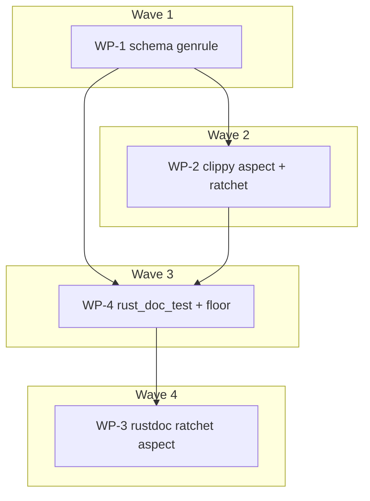

# Plan: Port the remaining `task verify` cargo compiles to cached Bazel actions

## Status
- State:   executing          <!-- planning → plan-approved → executing → review → done -->
- Tier:    high
- Tier-grammar: 5
- Effective-tier: derived
- Updated: 2026-09-25
- Next:    /hex-execute .claude/artifacts/plan_bazel_cargo_port.md
- **Plan:** plan_bazel_cargo_port
- **Active phase:** 3 — WP-4 rust_doc_test + floor
- **Step:** `/hex-execute → Stub`
- **Last update:** 2026-09-25 (after 6f23c8364: chore: tick the PR 528 inclusion in the goal file)
- **Branch:** `refactor/bazel-test-binary` (PR [ocx-sh/ocx#527](https://github.com/ocx-sh/ocx/pull/527))

Source: goal file `.agents/goals/pr-527.md` § Emphasis; per-step design in issue
[ocx-sh/ocx#531](https://github.com/ocx-sh/ocx/issues/531). Research:
[`research_rules_rust_clippy_doc.md`](./research_rules_rust_clippy_doc.md).

## Classification

- Scope: small (1–3 days). Reversibility: two-way door. Build tooling only; no CLI, wire or
  persisted format changes. Task names `schema:generate`, `rust:clippy:check` and `rust:doc:ratchet`
  stay. `rust:lint:ratchet` and `rust:test:doc` are deleted (internal, no compat).
- Tier high, architect inline, research 1, adversary off. Checked against the constitution
  (`arch-principles.md`): no deviations, nothing crosses a crate boundary.

## Objective

`task verify` stops compiling the workspace outside Bazel in four places:

| # | Today | After | Decision |
|---|---|---|---|
| 1 | 7× `cargo run -p ocx_schema --release` (a release-profile compile) | one cached `genrule` over `//crates/ocx_schema:ocx_schema_bin` | implement (WP-1) |
| 2 | `rust:clippy:check` + `rust:lint:ratchet`: two cargo clippy runs (`target/`, `target/ratchet`) | one `rust_clippy_aspect` pass. Its diagnostics are cached outputs, and `lint_ratchet.py` reads them | implement (WP-2) |
| 3 | `rust:doc:ratchet`: `cargo doc` in `target/docratchet` | a repo aspect over `rustdoc_compile_action` that captures JSON diagnostics | **implement, timeboxed** (WP-3). Estimate 4–6 h |
| 4 | `rust:test:doc`: `cargo test --doc` | `rust_doc_test` per library crate, run and floored by `bazel:test:unit` | **implement** (WP-4). Estimate 3–4 h |

`fmt` and `cargo deny` stay on cargo, because neither compiles the workspace. Release builds stay on cargo-dist.

### Decisions for the investigate items

- **Item 3, doc ratchet: implement, behind a 2 h spike gate. Estimate 4–6 h.**
  - No rules_rust setting captures rustdoc diagnostics (research §C).
  - Console scraping is wrong on a cache hit, because Bazel prints nothing then.
  - The "small wrapper" is therefore an ~80-line repo aspect. It loads the private
    `rustdoc_compile_action` (loadable: `rust/private` declares no `visibility()`) and sends stderr to
    a declared file.
  - It reuses WP-2's BEP reader and rustc-JSON adapter unchanged, and those are most of the cost.
  - Cost: coupling to a private rules_rust function. A bump that changes it fails loudly at
  analysis, never silently.
  - **Spike gate:** the spike runs on `ocx_util`. If within 2 h it cannot produce a JSON diagnostics
  file for that crate, WP-3 stops and its changes are dropped. The executor then records in the goal
  file (§ Emphasis item 3): "deferred, estimate 6–8 h, blocker: <what failed>". `rust:doc:ratchet`
  stays on cargo.
- **Item 4, doctests: implement. Estimate 3–4 h.**
  - Inventory: 24 runnable doctests plus 5 `compile_fail`, in 8 crates (research §E).
  - None reads cargo's environment or a dev-dependency, so the risk #531 named does not exist today.
  - The real work is the floor machinery. `bazel_build_drift.py`/`bazel_gate_proofs.py` hold map-row
    parity for `rust_test`/`sh_test` kinds only. The skip ceiling would count the 12 `ignore` fences.
    Both are covered by C-033/C-034.
  - Remaining risk: a `compile_fail` passing for the wrong reason under Bazel's `--extern` set. C-032
    proves it does not.

## Scope

In scope:
- items 1–4 above;
- their CI steps in `verify-basic.yml`, `verify-deep.yml` and `deploy-website.yml`;
- the task docs that name them.

Out of scope, see § Follow-ups:
- the scoped arm's per-crate `cargo clippy -p` loop;
- wiring the `//test` schema consumers to the genrule label;
- anything else in #531.

## Technical approach and trade-offs

| Decision | Options | Chosen | Why |
|---|---|---|---|
| Schema action | `genrule`; `run_binary` (new `aspect_bazel_lib` dep); `bazel run` | `genrule`, one target, 7 `outs`, binary in **`srcs`** (target config), run via `$(location)` | Follows the repo idiom and adds no dependency. `tools =` would build `ocx_schema_bin` a second time in the exec config (its 19-crate closure). `srcs` reuses the target-config binary `test:.build-binaries` already builds. That needs host = target, and every Bazel gate here is Linux-only. `bazel run` is uncached and holds the server lock. |
| Where clippy settings live | task command line; `.bazelrc` bare `build` | `.bazelrc` bare `build` (aspect + settings). The task requests only the output group | BZL-RUST-23. If Starlark settings differ between invocations, each switch discards the analysis cache, and verify alternates between four Bazel invocations. `rust_clippy_aspect` has no `attr_aspects`, so the cost is analysis only, on the top-level targets each command already names. Rustc action keys and output paths are unchanged, because the aspect creates separate `Clippy` actions. |
| Which files the ratchet reads | glob `bazel-bin/**/*.clippy.diagnostics`; this run's BEP | BEP (`--build_event_json_file`) | A glob picks up stale files and whatever config `bazel-bin` points at. BEP names exactly what this invocation built, cached or not. This is the same stance as `bazel_test_floor.py`. |
| `-D warnings` gate vs ratchet | keep a second strict pass; let the ratchet compare subsume it | subsume, plus a baseline code allow-list (C-018) | Compare fails on any key above its baseline, and an absent key's baseline is 0, so one pass gives the strict gate and the backlog. The allow-list stops `--update --allow-regression` from parking codes that `-D warnings` never allowed. |
| Lint levels | `rust_lint_config`/`extract_cargo_lints` per target; `clippy_flag` | `clippy_flag=-Wunreachable_pub`, plus a guard (C-017) | `[workspace.lints]` holds only `rust.warnings = "deny"`, and the ratchet reproduces it. The guard makes a future lint entry fail loudly instead of being ignored by Bazel. |
| Doc ratchet capture | `rust_doc` + console scrape; custom aspect; stay on cargo | custom aspect (timeboxed) | Scraping is wrong on a cache hit. |
| Doctest targets | the 8 crates with doctests; all 20 lib crates | all 20 | A crate gaining its first doctest is covered with no BUILD edit (BZL-RUST-28's silent gap). |
| Where doctests run | own task; `bazel:test:unit` | `bazel:test:unit` (already `bazel test //crates/...`) | No new gate, and the unit floor covers doctest counts. |

**Platform note.** Every new Bazel-backed gate is `platforms: [linux]`, like `bazel:test:unit`. CI
already lints only on Linux (`smoke` runs on `ubuntu-latest`). On macOS or Windows, a local
`task verify` loses clippy. [NEEDS CLARIFICATION] 1 covers this.

**Named lint residuals of the one-pass design.** The executor records these in the WP-2 commit body.
They are accepted, and a follow-up covers them.
- `crates/ocx_cli/build.rs` and `crates/ocx_cli/tests/linux_self_contained.rs` have no Bazel target,
  so clippy no longer lints them.
- `ocx_announce`, `ocx_package`, `ocx_package_manager`, `ocx_shell` and `ocx_index` get `__testing`
  only through `ocx`'s own feature. Bazel always builds them with it, so nothing in `task verify`
  lints their default feature set any more.
- For that set, nothing before merge compiles default features on Linux or macOS any more:
  - `verify-deep.yml`'s `cargo xwin` targets Windows ARM64 only, and its build and nextest legs use
    `features: ocx/__testing` (`:138`).
  - A default-feature rustc warning, such as dead code under `warnings = "deny"`, first fails at
    `deploy-website.yml:59` (`cargo build --release -p ocx`, main only) or at release.
  - This is the one residual the owner may want to weigh (see Deferred, [NEEDS CLARIFICATION] 2).
- Clippy-only lints on code that exists only without `__testing`: there is none today, because no
  code is gated on `not(__testing)`.

## Component contracts

### Schema generation (WP-1)

- **C-001**
  - `//crates/ocx_schema:schemas` is a `genrule` with `srcs = [":ocx_schema_bin"]`, not `tools`.
  - It has exactly 7 `outs`:
    - `schemas/metadata/v1.json`
    - `schemas/config/v1.json`
    - `schemas/project/v1.json`
    - `schemas/project-lock/v3.json`
    - `schemas/patch/v1.json`
    - `schemas/reports/v1.json`
    - `schemas/execution-record/v1.json`
  - Each file is `$(location :ocx_schema_bin) <kind>`'s stdout.
  - A non-zero binary exit fails the action.
  - No tags: the target is sandboxed and remote-cacheable. `bazel:tag:guard`, `bazel:build:drift`
    and `bazel:lint` stay green.
- **C-002** `task schema:generate`:
  - builds `//crates/ocx_schema:schemas` through `ocx exec bazel -- bazel {{.CACHE_RC}} build`, with
    the same `CACHE_RC` and `:bazel:bootstrap` dependency as `test:.build-binaries`;
  - lists its outputs with `cquery --output=files`;
  - copies each to `website/src/public/schemas/<kind>/<vN>.json` by copy → `chmod u+w` → rename;
  - fails with exit ≠ 0 and writes no file when cquery reports anything other than those 7 paths.
    This path gets a red/green proof: point the task at a wrong label once.
  - `schema:default` is this task.
  - The six `generate-<kind>` tasks are deleted, because `default` was their only caller (re-check
    with `/usr/sbin/git grep`).
  - The `sources:` fingerprints go, because Bazel is the cache.
- **C-003** Output is byte-identical to the cargo-built binary's for all 7 kinds. Keep the cargo
  output aside first, then diff. `task --dry verify` contains no `cargo run -p ocx_schema`.
- **C-004** Every caller keeps working, and each job is checked:
  - `bazel:test:accept`, and `test:build` via `:website:schema:default`;
  - `website:build`;
  - `verify-basic.yml` `smoke` › `Generate Schema`, and `smoke-acceptance` (`task test:smoke` → build → schema);
  - `verify-deep.yml` `Generate Schema`, which moves **before** `Remove the Bazel cache credential`
    (`:209`) so it reads the cache;
  - `deploy-website.yml` (`task schema` at `:65`, `test:doc-scripts:drift` at `:186`).

  A job that already runs Bazel for `test:build`, which PR 527 put there, needs nothing new.
  **Decided:** a job that reaches schema generation with no Bazel gets the same setup steps
  `verify-basic.yml` `smoke` uses. That means setup-ocx, `./.github/actions/bazel-cache-rc` (so it
  reads the shared cache), `Install lld`, and the credential-removal step after it. This covers
  `deploy-website.yml`'s `build-binary` job (`:58-65`), and `smoke-acceptance` if its `test:build`
  is not already Bazel-backed. The zoo guard (`.claude/tests/test_workflows.py` `SCHEMA_TASK`) stays
  green unchanged. WP-1 owns the schema prose at `subsystem-taskfiles.md:114,188`,
  `subsystem-ci.md:23`, `verify-deep.yml:102` and `test/taskfile.yml:150`. Only the PR's CI run
  proves the workflow half. The lead reads the per-job conclusions on the PR head.

### Clippy + lint ratchet, one pass (WP-2)

- **C-010** `.bazelrc`, bare `build`:
  - Four settings:
    - `--aspects=@rules_rust//rust:defs.bzl%rust_clippy_aspect`
    - `--@rules_rust//rust/settings:clippy_output_diagnostics=true`
    - `--@rules_rust//rust/settings:clippy_error_format=json`
    - `--@rules_rust//rust/settings:clippy_flag=-Wunreachable_pub`
  - Add `.*\.(clippy|rustdoc)\.diagnostics$` to `build:ci`'s `--remote_download_regex` (`:129`).
  - BZL-FLAG-11: prove `--aspects` on `bazel help build --long` at 9.2.0. The three Starlark settings
    are absent from help by nature. Prove them by `ocx exec bazel -- bazel query
    @rules_rust//rust/settings:<name>` resolving.
  - After the edit, `bazel-bin` still resolves to `k8-fastbuild` with no `-ST-` suffix, so no lane
    re-keys.
  - No `--output_groups` in the rc.
- **C-011** `task rust:clippy:check` (`platforms: [linux]`, depends on `:bazel:bootstrap`):
  - runs `ocx exec bazel -- bazel {{.CACHE_RC}} build //crates/... --output_groups=clippy_output
    --build_event_json_file=<BEP>`;
  - BEP handling follows `bazel:test:unit` exactly:
    - mktemp dir outside the checkout, mode 0700, file 0600;
    - removal is deferred;
    - the BEP serialises the client environment;
    - an empty or missing BEP fails the task, naming the flag;
  - then runs `python3 scripts/lint_ratchet.py --by-file --bep <BEP> {{.CLI_ARGS | default "--check"}}`;
  - if bazel fails, the task exits with bazel's status, and the ratchet does not run over a partial
    BEP.
- **C-012** `lint_ratchet.py --bep PATH` is a new input mode. `--suffix` selects
  `.clippy.diagnostics` (default) or `.rustdoc.diagnostics`, for WP-3. Behaviour:
  - It refuses a BEP with no `buildFinished` event reporting success, or no `lastMessage`. This
    replaces cargo's `build-finished` truncation guard (`lint_ratchet.py:40-52`).
  - It collects every file whose name ends in the suffix from this BEP's output-group file sets.
    Paths come from the BEP's file URIs, never from a `bazel-bin` glob.
  - It assigns each file to a member by the **Bazel package** of the target that produced it
    (`//crates/<member>`), not by span paths.
  - It parses each file as rustc-native JSON lines. It keeps `$message_type == "diagnostic"` records
    at level `warning`/`error` and feeds them into the existing census:
    - the same dedup key `(code, file, line, column)`;
    - the same `--by-file` keying;
    - the same compare, update and `--allow-regression`;
    - the same LINT-16, zero-entry and dark-member refusals.
  - Coverage: **every** `workspace_members()` entry, read from the manifest, must own at least one
    diagnostics file. Otherwise it exits 1 naming the missing members. This replaces cargo's
    `compiler-artifact` evidence.
  - It fails closed with exit 1 and a message naming the cause when:
    - the BEP is unreadable;
    - no file matches;
    - a named file is missing on disk;
    - a line is not JSON.
  - The cargo-JSON stdin mode stays while WP-3 needs it. Whichever WP is last to use it deletes it.
- **C-013** Gate semantics: exit 0 iff every live key ≤ its baseline count, where an absent key
  counts as 0. A new warning of any code, in any file Bazel lints, fails the gate. That is the old
  `-D warnings` gate, minus the named residuals above.
  - Rustc's "N warnings emitted" summaries have no spans and are ignored.
  - A spanned warning with no code is keyed `<file>::<uncoded>` and fails like any other.
  - Clippy's deny-by-default lints are capped to warnings by `--cap-lints=warn`. They are still keys,
    so they still fail.
- **C-014** One-time re-baseline via `task rust:clippy:check -- --update --allow-regression`, after
  a key-set diff between the last cargo run and the Bazel run, in both directions:
  - A **new or raised** `unreachable_pub` key must sit in a `__testing`-gated file, or under a target
    cargo never linted.
  - A new key of any other code is fixed, not baselined (C-018).
  - A **dropped or lowered** key must be a real fix. Otherwise it is a coverage-loss finding,
    resolved before commit or named as a residual.
  - The diff summary goes in the commit body.
- **C-015** Wiring and references. The full list, re-checked with
  `/usr/sbin/git grep -n 'lint:ratchet\|clippy:check\|target/ratchet'` before commit:
  - `rust:lint:ratchet` is deleted, and nothing writes `target/ratchet` any more.
  - In `taskfiles/rust.taskfile.yml`, `rust:verify` (`:111`) stops calling `lint:ratchet`. The prose
    at `:91,193,201` is updated.
  - `.verify:lint` (phase 1) drops `rust:clippy:check`. `.verify:build-test` (phase 2) runs it where
    `rust:lint:ratchet` stood.
  - `verify`'s `summary:` is rewritten, since it is checked against the phases.
  - `task` (default, `taskfile.yml:74-82`) keeps `rust:clippy:check`, but runs it **after**
    `cargo check`, not in parallel (host RAM cap, `taskfile.yml:297-303`).
  - `rust:clippy:fix` stays on cargo.
  - `scripts/lint_ratchet.py:54,371` messages.
  - `subsystem-ci.md:18,308`, `subsystem-taskfiles.md:42-43,63-64` and the clippy rows,
    `rust-cargo.md` ratchet prose.
  - CI `verify-basic.yml` `smoke`:
    - `Clippy` moves after `Install lld` (`:345`) and before `Remove the Bazel cache credential`;
    - the `Lint ratchet` step is removed;
    - `steps.ratchet` is removed from the final lint gate (`:544-545`).
- **C-016** Cache: a second consecutive `task rust:clippy:check` executes no `Clippy` actions. Its
  BEP still names all diagnostics files and the ratchet still passes. Evidence: both runs' Bazel
  process-summary lines, recorded in the WP report.
- **C-017** `lint_ratchet.py` refuses with exit 1 in two cases:
  - root `Cargo.toml` `[workspace.lints.*]` carries any entry other than `rust.warnings`;
  - any `crates/*/Cargo.toml` `[lints]` carries anything other than `workspace = true`.

  The message names the entry and says Bazel does not read it. The remedy is to wire it through the
  `.bazelrc` `clippy_flag` (or `extract_cargo_lints`) and extend the allow-list.
- **C-018** Each baseline's keys are limited to a code allow-list given by a `--allow-codes` argument:
  - clippy: `unreachable_pub`;
  - rustdoc: the `rustdoc::` prefix.

  An update that would write any other code is refused with exit 1, even with `--allow-regression`.

### Doc ratchet (WP-3, timeboxed)

- **C-020** A repo aspect, `rustdoc_diagnostics_aspect`:
  - Lives in a new `.bzl` beside root `BUILD.bazel`, with `visibility()` declared (BZL-ARCH-08).
  - Applies to non-test `CrateInfo` targets under `//crates/...`.
  - Calls `rustdoc_compile_action` from `@rules_rust//rust/private:rustdoc.bzl`.
  - Sets JSON error format **only** through its own `_error_format` attribute, pointed at a
    json-valued setting. `construct_arguments` already adds `--error-format`, so the same flag in
    `rustdoc_flags` would be a duplicate.
  - Uses `--cap-lints warn`, and rustdoc flags equal to today's `cargo doc --no-deps`.
  - Declares the HTML output as a tree artifact.
  - Sends stderr to `<name>.rustdoc.diagnostics` via process_wrapper `--stderr-file`.
  - Output group: `rustdoc_diagnostics`.
  - Registered on the `.bazelrc` bare `build` beside clippy.
- **C-021** `task rust:doc:ratchet` (`platforms: [linux]`, `:bazel:bootstrap`):
  - builds `//crates/...` with `--output_groups=rustdoc_diagnostics`, handling the BEP as C-011 does;
  - then runs `lint_ratchet.py --by-file --baseline rustdoc-warn-baseline.json
    --suffix .rustdoc.diagnostics --allow-codes 'rustdoc::' --bep <BEP>`;
  - nothing writes `target/docratchet` any more;
  - the cargo-JSON stdin mode is deleted;
  - on the scoped arm, `rust:doc:ratchet` moves out of `.verify:scoped:cargo` (`taskfile.yml:365-367`)
    into the Bazel lane of `.verify:scoped:lanes`, so no Bazel call runs inside the cargo lane. There
    it takes the lane's `--jobs=4` cap (`taskfile.yml:319-326`), the same way that lane's other Bazel
    calls do;
  - in CI `verify-basic.yml`, the `Doc ratchet` step (`:198`) moves after `Install lld` and before
    `Remove the Bazel cache credential`. `steps.docratchet` stays in the lint gate.
- **C-022** One-time re-baseline of `rustdoc-warn-baseline.json`, under C-014's rules.
- **C-023** Cache: a second consecutive run executes no rustdoc-diagnostics actions, and its BEP still
  names every file.
- **C-024** Red/green: during the spike, plant a broken intra-doc link in `ocx_util` and confirm the
  ratchet reds with that key. Remove it and confirm green.

### Doctests (WP-4)

- **C-030** Every crate with a `src/lib.rs` has
  `rust_doc_test(name = "<crate>_doc_test", crate = ":<crate>")` in its `BUILD.bazel`, with no tags.
  That is 20 crates; `ocx_shim` has no `src/lib.rs`.
- **C-031** Parity by name (BZL-RUST-27):
  - Compare the doctest names `cargo test --doc --workspace -- --list` reports with the names the
    Bazel test logs report.
  - Normalise both to `<crate>::<path relative to the crate> - <item> (line N)` first. Cargo's names
    are package-relative; Bazel's are execroot-relative.
  - Today that is 24 runnable, 5 `compile_fail` and 12 `ignore`.
  - The diff must be empty, or every difference is explained in the commit body.
  - The names are read from the Bazel test log, never assumed from a summary line.
- **C-032** `compile_fail` proof:
  - Take one `crates/ocx_oci/src/lib.rs` `compile_fail` block and remove its violation.
  - Confirm `//crates/ocx_oci:ocx_oci_doc_test` goes red.
  - Restore the block and prove the restore landed. Confirm green.
- **C-033** Floor and drift:
  - `bazel:test:unit` runs the doctest targets, since they are tests under `//crates/...`.
  - `scripts/bazel_build_drift.py` `TEST_RULE_KINDS` (`:173`) gains `rust_doc_test`.
  - `scripts/bazel_gate_proofs.py` gains a doctest target constant, docstrings, and its self-check
    (`:574`, `:1608`). `scripts/bazel_floor_proofs.py:939-948` and
    `scripts/tests/test_bazel_test_floor.py` follow.
  - 20 rows go into `crates/TEST_TARGET_MAP.toml`. No writer exists (`bazel_test_floor.py` takes only
    `--bep`/`--junit`), so the rows are hand-derived from each target's `test.log`. The file's header
    ("Generated, never hand-edited … `-- --update`") is rewritten to say how its rows are actually
    derived.
  - `bazel:build:drift` and `bazel:tag:guard` stay green.
- **C-034** Skip ceiling: `bazel_test_floor.py`'s ceiling (`:449-461`, `crates/NEXTEST_SKIP_CEILING`)
  excludes `rust_doc_test` targets.
  - Reason: an `ignore` fence is documentation, not a skipped test. The ceiling bounds `--skip`
    filters and `#[ignore]`.
  - The set of `ignore`d doctests is pinned by C-031's name diff instead.
  - Red/green: the ceiling proof still reds a non-doctest target over the ceiling.
- **C-035** Deletions:
  - `rust:test:doc` leaves `rust.taskfile.yml`, `.verify:build-test` and `verify`'s summary.
  - The `Doc tests` step leaves `verify-basic.yml` (`:510`).
  - The scoped arm's `cargo test --doc -p` loop (`taskfile.yml:358-359`) is deleted, because
    `.verify:scoped:lanes` already runs `bazel:test:unit` over `//crates/...` (`:325`).
  - `.claude/tests/test_workflows.py` stays green, because its build-test parametrisation follows the
    phase. Its `rust:test:doc` docstring (`:724`) is updated.

## User-experience scenarios (developer-facing)

- **S-001** Run `task schema:generate`. The 7 website schemas are written and no cargo compile runs.
  A repeat run is a Bazel cache hit. Error: if the genrule fails or cquery lists anything but the 7
  outputs, the task exits ≠ 0 and touches no schema file.
- **S-002** A change adds a clippy warning. `task rust:clippy:check` exits 1 naming `<file>::<lint>`,
  with live and baseline counts. Fixing the warning gives exit 0.
- **S-003** A change removes backlog warnings. The check passes and says to run
  `task rust:clippy:check -- --update`, which lowers the baseline. Error: a truncated run, a failed
  build or a dark member exits 1 and names the cause.
- **S-004** On a second `task verify`, the clippy and rustdoc steps execute no actions.
- **S-005** A broken intra-doc link makes `task rust:doc:ratchet` exit 1 naming `<file>::<lint>`.
  C-024 proves it.
- **S-006** A broken doctest makes `task verify` fail in `bazel:test:unit`, naming
  `//crates/<crate>:<crate>_doc_test`.
- **S-007** Adding `pedantic = "warn"` to `[workspace.lints.clippy]`, or a crate-level `[lints]`
  entry, makes the clippy check exit 1 saying Bazel does not read it (C-017).

## Error taxonomy

| Failure | Where | Remediation printed |
|---|---|---|
| `Cargo.bazel.lock.json` missing | any new Bazel task | handled by the `:bazel:bootstrap` dependency |
| bazel build fails | clippy/doc task | bazel's exit status, the ratchet is not run |
| BEP empty/missing/unfinished | clippy/doc task, `lint_ratchet.py` | "restore `--build_event_json_file`" / "build did not finish" |
| Diagnostics file named in BEP absent on disk | `lint_ratchet.py` | names the file and points at the remote-download mode |
| Dark member | `lint_ratchet.py` | names the members and says to re-run the whole gate |
| Key above baseline | `lint_ratchet.py` | names the key, with live and baseline counts |
| Code outside the allow-list | `lint_ratchet.py --update` | "fix it; this code cannot be baselined" |
| Unsupported `[lints]` entry | `lint_ratchet.py` | C-017 message |
| genrule output count ≠ 7 | `schema:generate` | names the cquery result |

## Edge cases

- **Duplicate warnings.** A warning can appear in both a lib and its `crate =` test target. The
  dedup key absorbs it, as with cargo `--all-targets`.
- **A crate with zero warnings.** Its diagnostics file exists and is empty. It still counts as
  coverage.
- **`__testing`-gated code** is now linted, which is the expected one-time rise.
- **Third-party crates** are skipped, because the aspect skips external repos.
- **`ocx_shim`** is a Linux-buildable Rust target, so it is linted. It gets no doctest target.
- **Remote cache with minimal downloads** is handled by C-010's regex.

## Parallelization

| WP | Repo | Scope | Expected files | Size | Wave | Depends-on | Review | Verify | Status |
|---|---|---|---|---|---|---|---|---|---|
| WP-1 | ocx | C-001–C-004, S-001 | `crates/ocx_schema/BUILD.bazel`, `website/schema.taskfile.yml`, `.github/workflows/verify-deep.yml`, `.github/workflows/verify-basic.yml` / `deploy-website.yml` (only as C-004 requires), `.claude/rules/subsystem-taskfiles.md` (`:114,188`), `.claude/rules/subsystem-ci.md` (`:23`), `.claude/rules/subsystem-website.md` / `subsystem-metadata-schema.md` (only if they name cargo) | S | 1 | — | risk: CI workflow | scoped | merged |
| WP-2 | ocx | C-010–C-018, S-002–S-004, S-007 | `.bazelrc`, `taskfiles/rust.taskfile.yml`, `taskfile.yml`, `scripts/lint_ratchet.py`, `scripts/tests/test_lint_ratchet.py`, `clippy-warn-baseline.json`, `.github/workflows/verify-basic.yml`, `.claude/rules/subsystem-taskfiles.md`, `.claude/rules/subsystem-ci.md`, `.claude/rules/rust-cargo.md` | M | 2 | WP-1 | risk: CI workflow + gate semantics | scoped | merged |
| WP-4 | ocx | C-030–C-035, S-006 | `crates/*/BUILD.bazel` (20), `crates/TEST_TARGET_MAP.toml`, `scripts/bazel_build_drift.py`, `scripts/bazel_gate_proofs.py`, `scripts/bazel_floor_proofs.py`, `scripts/bazel_test_floor.py`, `scripts/tests/test_bazel_test_floor.py`, `taskfiles/rust.taskfile.yml`, `taskfile.yml`, `.github/workflows/verify-basic.yml`, `.claude/tests/test_workflows.py` (docstring), `.claude/rules/subsystem-taskfiles.md`, `.claude/rules/subsystem-ci.md` | M | 3 | WP-1, WP-2 | risk: floor/drift gate scripts | scoped | pending |
| WP-3 | ocx | C-020–C-024, S-004 (rustdoc half), S-005 | new `.bzl` at repo root + `BUILD.bazel`, `.bazelrc`, `taskfiles/rust.taskfile.yml`, `taskfile.yml`, `scripts/lint_ratchet.py`, `scripts/tests/test_lint_ratchet.py`, `rustdoc-warn-baseline.json`, `.github/workflows/verify-basic.yml`, `.claude/rules/subsystem-taskfiles.md` | M | 4 | WP-2, WP-4 | risk: private rules_rust API | scoped | pending |

- Critical path: WP-1 → WP-2 → WP-4 → WP-3. The chain is fully serial.
- Shippable after wave 3: schema, clippy and doctests are off cargo; the doc ratchet is still on cargo.
- Merge order (serialized, topological): WP-1, WP-2, WP-4, WP-3.
- Why serial:
  - All four WPs edit `.github/workflows/verify-basic.yml` and `subsystem-taskfiles.md`, and three
    also edit `taskfile.yml` (phase lists plus the checked summary) and `taskfiles/rust.taskfile.yml`.
    WP-1 is ~45 min, so running it first costs little.
  - WP-4 goes before WP-3 because it is certain, while WP-3 carries the spike gate.

Effective-tier histogram: WP-1 medium · WP-2 high · WP-4 high · WP-3 high.

## Executable phases (per WP)

Each WP runs Stub → Specify → Implement → Review. Each also records the wall time of the task it
replaces, before and after, as #531 asks.

- **WP-1.**
  - Stub: the genrule with 7 `outs`.
  - Specify: keep the cargo outputs aside, then byte-diff all 7. Add the C-002 red/green (wrong label
    → no file written) and `task --dry verify | grep -c 'cargo run -p ocx_schema'` = 0.
  - Implement: task rewrite, deletions, C-004 CI moves, doc lines.
  - Review: spec, plus security (workflow edits).
- **WP-2.**
  - Stub: `--bep`/`--suffix`/`--allow-codes` parsing and the C-017 guard in `lint_ratchet.py`.
  - Specify: extend the script's embedded `prove_*` proofs and `scripts/tests/test_lint_ratchet.py`,
    working from fixture BEP and diagnostics files. Each needs a red and a green:
    - each C-012 fail-closed cause, and the unfinished BEP;
    - C-013: a new code reds, a baselined key at its count passes, an uncoded spanned warning reds,
      a summary line is ignored;
    - dark member;
    - C-017, root and crate-level;
    - C-018;
    - C-011's task guards, run once by hand: drop the `--build_event_json_file` flag and the task reds
      naming it; plant a compile error and the task exits with bazel's status without running the
      ratchet. Restore both and prove the restore landed.
  - Implement: `.bazelrc`, the task, the adapter, the C-015 wiring and CI step move, the re-baseline
    under C-014, and the docs.
  - Review: spec, plus quality (opus), plus security (workflow path).
- **WP-4.**
  - Stub: the 20 targets.
  - Specify: the C-031 name diff, the C-032 mutation, and the C-033/C-034 proof updates, each red and
    green.
  - Implement: map rows, drift/gate/floor script changes, the C-035 deletions, and the docs.
  - Review: spec, plus quality (opus).
- **WP-3.**
  - Spike: at most 2 h on `//crates/ocx_util`, including C-024, under the gate above.
  - Specify: proofs for the `.rustdoc.diagnostics` suffix path.
  - Implement: the aspect, the task, the scoped-lane move, the re-baseline (C-022), deleting the
    cargo-JSON stdin mode and `target/docratchet`, and CI/docs.
  - Review: spec, plus quality (opus).

## Verification budget

Per WP:
1. Run the targeted checks the WP names: script proofs via `task scripts:verify`, `task claude:tests`,
   the Bazel gates it touches (`bazel:build:nobuild`, `bazel:tag:guard`, `bazel:build:drift`,
   `bazel:lint`), and the task itself.
2. Run `task verify:scoped --force`.
3. Where that escalates to the full gate, use `task verify:mark` and name the deferral in the commit
   body (CLAUDE.md escape hatch). Any taskfile, BUILD/.bzl, `scripts/**` or workflow edit escalates,
   so every WP here does.

The C-016/C-023 cache evidence comes from two consecutive task runs, not from `task verify`. **One**
full `task verify` runs at the end, twice back-to-back: the goal asks for the second run as its
"served from cache" proof. No new gate enters `task verify` uncached.

## [NEEDS CLARIFICATION]

1. [NEEDS CLARIFICATION: a local `task verify` on macOS/Windows no longer runs clippy.]
   Recommended: accept. CI lints only on Linux already, every Bazel gate is Linux-only, and
   `rust:clippy:fix` (cargo) stays available everywhere. (Taken.)
2. [NEEDS CLARIFICATION: the one-pass clippy loses the named lint residuals: `ocx_cli/build.rs`,
   `linux_self_contained.rs`, and the default feature set of five crates. For that feature set, no
   pre-merge job compiles it on Linux/macOS any more, so a default-feature `dead_code` would first
   fail at `deploy-website` on main, or at release.]
   Recommended: accept, and file a follow-up for a Bazel default-feature pass (`select()`-based
   `crate_features`). Keeping a cargo compile in `task verify` for this would undo the port's point.
   (Taken. This is surfaced to the owner as a deferred finding.)
3. [NEEDS CLARIFICATION: the scoped arm (`task verify:scoped`) keeps its per-crate cargo clippy.]
   Recommended: leave it this round and file a follow-up. It is not reachable from `task verify`.
   (Taken.)

## Follow-ups (filed)

- [ocx-sh/ocx#532](https://github.com/ocx-sh/ocx/issues/532) — Scoped arm: replace `.verify:scoped:checks`' per-crate `cargo clippy -p … -D warnings` with the
  cached Bazel pass.
- [ocx-sh/ocx#533](https://github.com/ocx-sh/ocx/issues/533) — Lint residuals (plus the default-feature pass and LINT-19 below):
  - give `crates/ocx_cli/tests/linux_self_contained.rs` a Bazel target;
  - decide how to lint `crates/ocx_cli/build.rs`;
  - decide how to lint the release feature set of the five crates that get `__testing` only through
    `ocx`.
- [ocx-sh/ocx#534](https://github.com/ocx-sh/ocx/issues/534) — `//test` schema consumers: take `//crates/ocx_schema:schemas` as `data`, instead of the gitignored
  `website/src/public/schemas/metadata/v1.json` export. That removes `bazel:test:accept`'s
  `schema:default` pre-step.
- [ocx-sh/ocx#533](https://github.com/ocx-sh/ocx/issues/533) — When LINT-19 adds clippy lints: move lint levels to `extract_cargo_lints` and relax C-017/C-018.

## Rollback

Each WP is one commit series on the PR branch. Reverting a WP's commits restores the cargo task it
replaced, and its baselines revert with it.

## Progress Log

- 2026-09-25: plan written by /hex-plan (tier high).
  - Discover: 1 architecture-explorer and 3 explorers.
  - Research: 1 researcher, persisted by the orchestrator. The rules_rust 0.74 source was read locally.
  - Review round 1: spec reviewer (opus) and a pitfall researcher. 21 + 4 findings: 5 Block, all
    folded in (C-004 callers, C-013 residuals, C-033 writer/drift parity, C-034 ceiling); Warn and
    Suggest folded in as C-015/C-017/C-018/C-021/C-024 and the genrule `srcs` change. WP-1/WP-2 are
    serialized for file overlap.
- 2026-09-25: /hex-execute started (tier high, from Status block; adversary off; review=full,
  loop-rounds=1).
  - Q: the table's `Repo` cell reads `ocx`, which is no declared Federation key. Decision: it names
    this lead repo (`.`); no satellite is touched, so no C-303 pre-flight and no `Repos:` ledger.
  - Q: worktree per WP? Decision: no. The chain is fully serial and every WP needs the checkout's
    gitignored Bazel state (`Cargo.bazel.lock.json`, caches), so each WP runs in place on
    `refactor/bazel-test-binary`, one at a time.
  - Q: separate stub/tester/implement spawns for the `high` WPs? Decision: one opus builder per WP,
    contract-first inside the spawn (proof red before implementation green), then an opus `L1`
    reviewer. Reason: owner's short-loop directive; the red/green evidence is carried in the
    builder's report and grep-verified at `L0`.
  - WP-1 landed. The seven schemas are byte-identical to cargo's output (`cmp`, all 7). `task --dry
    verify` has 0 `cargo run -p ocx_schema` lines. `schema:generate` takes 0.68 s on a cache hit
    against 1.94 s warm on cargo. The L1 review passed and its 3 Suggests are folded in: cquery
    stderr is surfaced, the copy is staged then renamed, and the `test_workflows.py` message is
    reworded. Deferred to PR CI: `smoke-acceptance` `timeout-minutes: 10` now covers a Bazel build
    of the schema binary.
  - WP-2 landed. Cargo and Bazel key sets are identical in both directions: 44 keys, 179
    diagnostics, all `unreachable_pub`. So the re-baseline left `clippy-warn-baseline.json`
    unchanged, and the named residuals carried 0 keys under cargo. C-016: the second run was
    `1 process: 1 internal` in 0.43 s. Before the port, cargo took 11.16 s warm; the first Bazel pass
    took 17.6 s.
  - The L1 review folded in two Warns and one Suggest:
    - Only rustc's `N warnings emitted` summary is dropped; any other warning with no span and no
      code now fails the gate.
    - Coverage is now checked per target through the BEP `targetConfigured` events, so an opt-out
      tag (`no_clippy`/`no_lint`/`nolint`/`noclippy`) or an unlinted Rust target is refused.
    - The bazel-failure message is reworded.
  - Q: `rust-cargo.md` LINT-15 prescribes two clippy runs, but the file is vendored (grimoire).
    Decision: leave the vendored file alone. `subsystem-taskfiles.md` records the local override.
  - Residual: a `manual`-tagged crate target falls outside `//crates/...` and nothing reds it
    (`bazel:tag:guard` and `bazel:build:drift` both stay green when one is planted). Tracked with
    [ocx-sh/ocx#533](https://github.com/ocx-sh/ocx/issues/533).
