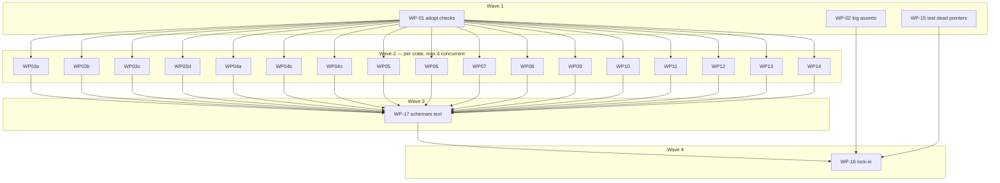

# Plan: code-docs cleanup — comment density, ADR references, log-string tests

## Status
- State:   done
- Tier:    high
- Tier-grammar: 5
- Effective-tier: derived
- Updated: 2026-09-29
- Next:    /hex-finalize
- Reviewed: 5e6451c3c1874a8d1cab8448605b09c3e0e08480

- **Plan:** plan_code_docs_cleanup
- **Active phase:** 6 — necessity pass (WP-19 done)
- **Step:** awaiting /finalize
- **Last update:** 2026-09-29 (WP-19: necessity pass, schema-doc pass, closing review fixes; E-24/E-25 added)

Source: `.agents/discussions/code-docs-cleanup.md` (ratified 2026-09-28) ·
Goal: `.agents/goals/code-docs-cleanup.md` · Branch: `hex/code-docs-cleanup`.

## Classification

- Scope: medium (1–2 weeks of agent time, ~480 prod files, 22 WPs) · Reversibility: two-way door
  (comment prose; the only rendered-text change is `--help`/schema descriptions, reviewed as
  a CLI-surface change, no wire or grammar change) · Tier: high · Overlays: architect=inline,
  research=skip (four research lanes dated 2026-09-28 already in the discussion, plus
  `research_code_comment_density.md`), adversary=off (two-way door).
- No ADR: no boundary decision. Adoption choices are recorded under Decisions below.

## Objective

Apply `.claude/rules/code-docs.md` through the `code-docs-cleanup` skill to prod Rust in
`crates/**`, after adopting the rule's checks as a ratchet so density cannot regrow; move
ADR rationale out of code, strip process IDs, keep `#N` only for open-issue workarounds,
repair dead record pointers, and turn log-text asserts into behaviour asserts.

## Baseline (before, `comment_census.py --report`, prod scope, 2026-09-28 at 4323c113e)

"blocks" = over-cap blocks, "lines" = comment lines in over-cap blocks (the LEN-03 ratchet
unit). Ratio = (doc + plain comment lines) / code lines. Band 0.17–0.25 is the **reported**
expectation, never gated (LEN-04); no guard is cut to reach it.

| crate | code | ratio | blocks | lines | WP |
|---|---:|---:|---:|---:|---|
| ocx_cli | 20044 | 0.603 | 592 | 8703 | WP-04a–c |
| ocx_package_manager | 13274 | 1.111 | 496 | 8704 | WP-03a–d |
| ocx_oci | 7904 | 0.860 | 208 | 3513 | WP-06 |
| ocx_package | 6957 | 0.646 | 124 | 1983 | WP-12 |
| ocx_sign | 6498 | 1.036 | 196 | 3230 | WP-07 |
| ocx_announce | 5639 | 1.098 | 194 | 3311 | WP-10 |
| ocx_config | 4258 | 1.233 | 175 | 3321 | WP-05 |
| ocx_index | 4251 | 1.162 | 178 | 2998 | WP-09 |
| ocx_project | 3562 | 1.146 | 143 | 2508 | WP-11 |
| ocx_util | 3534 | 0.709 | 79 | 1210 | WP-14 |
| ocx_setup | 2707 | 0.940 | 71 | 1273 | WP-13 |
| ocx_store | 2519 | 1.186 | 87 | 1646 | WP-08 |
| ocx_shell | 2232 | 1.106 | 107 | 1978 | WP-13 |
| ocx_script | 1299 | 0.560 | 17 | 247 | WP-14 |
| ocx_python | 1231 | 0.738 | 15 | 237 | WP-12 |
| ocx_console | 1170 | 0.544 | 13 | 207 | WP-14 |
| ocx_test_support | 948 | 0.462 | 15 | 238 | WP-14 |
| ocx_trust | 848 | 0.881 | 27 | 489 | WP-08 |
| ocx_shim | 764 | 1.207 | 36 | 590 | WP-14 |
| ocx_schema | 275 | 0.476 | 4 | 76 | WP-12 |
| ocx_exit | 73 | 1.932 | 5 | 70 | WP-14 |
| **total prod** | 93524 | — | 2784 | 46555 | |

Test scope (`--scope test`, all groups): ratio 0.359, 2839 over-cap blocks (1182 in
`test/tests`, 1083 in Rust test code). Linkage at HEAD (with the config in D-2):
bare-id-prod 2910, bare-id-test 4555, short-label 2669, dead-pointer 121 ratchet keys (67 in
`crates/`, 52 in `test/`, 2 in `.claude/`; re-measured with the D-2 config) plus 2 advisory
pointer findings outside the keys.

## After (C-013, `comment_census.py --report`, prod scope, HEAD after WP-16)

Same tool, same scope, same census definition as the Baseline; the before column is re-measured
on `4323c113e` and equals the Baseline table. Code lines differ only in `ocx_cli` (+464). Ratio
0.17–0.25 is reported context, never a gate (LEN-04): the guards the caps must not cut keep the
prod ratio above it.

| crate | code before → after | comment:code before | after | over-cap lines before | after | over-cap blocks before → after |
|---|---:|---:|---:|---:|---:|---:|
| ocx_cli | 20044 → 20508 | 0.603 | 0.467 | 8703 | 43 | 592 → 2 |
| ocx_package_manager | 13274 → 13274 | 1.111 | 0.748 | 8704 | 0 | 496 → 0 |
| ocx_oci | 7904 → 7904 | 0.860 | 0.635 | 3513 | 0 | 208 → 0 |
| ocx_package | 6957 → 6957 | 0.646 | 0.534 | 1983 | 0 | 124 → 0 |
| ocx_sign | 6498 → 6498 | 1.036 | 0.775 | 3230 | 0 | 196 → 0 |
| ocx_announce | 5639 → 5639 | 1.098 | 0.807 | 3311 | 0 | 194 → 0 |
| ocx_config | 4258 → 4258 | 1.233 | 0.825 | 3321 | 0 | 175 → 0 |
| ocx_index | 4251 → 4251 | 1.162 | 0.808 | 2998 | 0 | 178 → 0 |
| ocx_project | 3562 → 3562 | 1.146 | 0.816 | 2508 | 0 | 143 → 0 |
| ocx_util | 3534 → 3534 | 0.709 | 0.532 | 1210 | 0 | 79 → 0 |
| ocx_setup | 2707 → 2707 | 0.940 | 0.694 | 1273 | 0 | 71 → 0 |
| ocx_store | 2519 → 2519 | 1.186 | 0.855 | 1646 | 0 | 87 → 0 |
| ocx_shell | 2232 → 2232 | 1.106 | 0.685 | 1978 | 55 | 107 → 3 |
| ocx_script | 1299 → 1299 | 0.560 | 0.476 | 247 | 0 | 17 → 0 |
| ocx_python | 1231 → 1231 | 0.738 | 0.617 | 237 | 0 | 15 → 0 |
| ocx_console | 1170 → 1170 | 0.544 | 0.477 | 207 | 0 | 13 → 0 |
| ocx_test_support | 948 → 948 | 0.462 | 0.327 | 238 | 0 | 15 → 0 |
| ocx_trust | 848 → 848 | 0.881 | 0.716 | 489 | 0 | 27 → 0 |
| ocx_shim | 764 → 764 | 1.207 | 0.813 | 590 | 0 | 36 → 0 |
| ocx_schema | 275 → 275 | 0.476 | 0.331 | 76 | 0 | 4 → 0 |
| ocx_exit | 73 → 73 | 1.932 | 1.452 | 70 | 0 | 5 → 0 |
| **total prod (crates)** | 89987 → 90451 | 0.894 | 0.650 | 46532 | 98 | 2782 → 5 |

Five over-cap blocks (98 lines) remain: `setup.rs` (E-20), and four blocks the census counts as
prod that sit in test code (`hook.rs` ×2, `tests_path_parity.rs`, `activate.rs` test doc), left
to the test-code follow-up. Baselines: `.code-docs-length.json` 24,760 → 121 lines over 6 files;
`.code-docs-linkage.json` bare-id-prod 143 → 28 keys, dead-pointer 20 → 15 keys. C-009 scan of
prod comments: every remaining `ocx-sh/ocx#N` names an open issue except those listed in E-20
(superseded by E-22: the first scan missed the `ocx#N` and `issue #N` spellings).

## Decisions (question → research → decision)

Recorded per the goal's § Issue resolution; every one was settled by research, none needs a
human.

- **D-1 — Open question 3: can `comment_census.py` scope test code?** Research: read the
  vendored source (`.claude/rules/code-docs/checks/comment_census.py`, grim-installed from
  `ghcr.io/ocx-sh/lore/code-docs-essentials`, pinned in `grimoire.lock`). The census
  *table* honours `--scope test` (prod/test split per file, Rust `#[cfg(test)]` items,
  `tests/` dirs, and `test/**/*.py` all land in `test`), and `--over-cap --scope test` works.
  But `--report` and the ratchet (`--check`/`--update`, `ratchet()`) are hard-wired to
  `prod` — the discussion's "`--report --scope test` returned the prod table" is that.
  `--root test` does not help (it reclassifies `test/src/**` as prod and drops Rust).
  **Decision:** do not patch the vendored checks. WP-01 adds one lint module that imports
  `comment_census` (as `linkage_check.py` itself does), scans once, and runs the census's own
  `ratchet()` twice: once on prod rows against `.code-docs-length.json`, once on test rows
  relabelled to the ratchet's scope against `.code-docs-length-test.json`. Same baseline
  shape, same rise/missing semantics, no second implementation. Mechanics (checked against
  the source): `cc.scan()` returns `Scan(rows, measured, aggs)`; the test pass builds
  `Scan([(rel, "prod", pkg, lib, b) for rows with scope "test"], measured=<every path
  cc.list_files(root) returns>, aggs)` and calls `cc.ratchet(root, scan, baseline, update,
  allow)`. `measured` must be the full file list, not the files that have test rows, or a
  file whose test comments were all deleted reads as an unmeasured key. A first `--update`
  needs `--allow-regression` (`load_baseline` treats creating a baseline as a rise); that is
  the only time it is passed. A `--update` entry point in the same module keeps baseline
  refresh one command. Upstream gap (test scope in `--check`/`--report`) is reported for the
  `ocx-sh/lore` owner, not filed from here.
- **D-2 — LNK-14 `--discover` verdicts (16 prefixes).** Research: sampled ≥5 non-test hits
  per prefix. **Families** (process IDs, banned bare): `G R W E V F PKG ARCH OCX-C SEC
  CODEX-BLOCK M AM` — plan/review/audit/ADR-clause labels. **non_ids**: `P` (NIST P-256
  curve), `BZL-CORE` (the repo's own Bazel rule catalogue, `bazel-quality.md`), `LINT` (the
  repo's lint-code catalogue, `rust-cargo.md`). `records: [".claude/artifacts/*.md"]` (the
  whole ADR/plan/research store). Lands as `.code-docs-linkage-config.json`.
- **D-3 — Open question 1: opus guard review for security code?** Adopted the
  recommendation, widened by the architect review. A `reviewer:security` (opus) seat whose
  sole question is "did any guard lose its constraint or consequence" runs on every WP that
  touches the **security glob**: `crates/{ocx_oci,ocx_sign,ocx_trust,ocx_config,ocx_store}/**`
  (the `hex.md › Preferences` always-on set), plus
  `crates/ocx_announce/src/forge/**` (token redaction:
  `credentials`, `git_stderr`, `error`, `git_workspace`, …), `crates/ocx_cli/src/command/{login,logout,package_sign*,package_verify,package_attest}.rs`,
  `crates/ocx_cli/src/options/{forge_write,key,verify,rekor_upload}.rs`,
  `crates/ocx_shell/**` (export quoting feeds `eval`) and `crates/ocx_shim/**` (the
  BatBadBut argv contract). CLAUDE.md model policy: guard loss on auth/SSRF/trust/TLS paths
  is a security regression.
- **D-4 — Open question 2: moved rationale with no ADR home.** Adopted the recommendation:
  append to the nearest existing ADR under a `## Rationale from code: <crate>` section (one
  section per WP, so two WPs never edit the same lines); mint no ADR for a comment move.
  Prefer a pointer to text an ADR already holds (`--cites`) over appending. Pointers are
  file-qualified, one per non-obvious line, `adr_x.md § Heading`. Serialized landing (D-13)
  rebases each WP onto the previous one, so two EOF appends to one ADR resolve by keeping
  both sections in landing order.
- **D-5 — Baselines are lowered by the integrator, not by WPs.** The skill's step 10 records
  the drop in each commit, but parallel WPs would all rewrite the same three JSON files, and
  CLN-05 fails a cleanup commit that touches a non-source path. So WPs never touch
  baselines; `--check` fails only on a rise, so a WP that lowers counts is green against the
  current baseline. Right after each WP lands on the integration branch (D-13), the
  orchestrator runs the three `--update`s **without** `--allow-regression` and commits
  `chore: lower code-docs baselines after <WP>` — a refusal is a regression in that WP, fixed
  before the next one lands. This closes the regrowth window (a file cut 100 → 10 cannot drift
  back to 90 unseen). WP-16 is the final no-op-or-drop check.
- **D-6 — What the ratchet actually bounds.** LEN-03 ratchets *lines in over-cap blocks* per
  file, not the ratio. "Density cannot regrow" is therefore enforced as "no file grows its
  over-cap comment lines, and no bare ID or dead pointer is added"; the ratio stays reported.
- **D-7 — Log-string asserts (recon + inventory).** Only three files assert log text; no Rust
  test uses `tracing_test`/`logs_contain`. The compact subscriber prints the level but no
  target (`with_target(false)`), so `test_logging.py` pins message text to prove `OCX_LOG`
  crate targets still resolve (the crate-split oracle, still wanted while the split is
  paused). **Decision:** rewrite it to assert per target that a line *at the row's level*
  appears under `OCX_LOG=<crate>=<level>` and none under `OCX_LOG=<crate>=warn` — the target
  guard survives, the message text is free. Rows at TRACE (`ocx_shell`, `TRACE_TARGETS`) assert
  TRACE. EnvFilter matches targets by prefix, so the `ocx_package` row uses a directive or argv
  that reaches no `ocx_package_manager` line (e.g. `ocx_package::<module>` or a command that
  never enters the package manager), proven by a red run with `ocx_package_manager` alone.
  `test_debug_level_reaches_library_events` is rewritten the same way. The lint
  `test/lint/test_logging_structure.py` keeps its completeness check, its row unpack kept in
  sync with the new row shape. `test_pull_progress.py`'s two tests assert the `"pulling"` event
  text; functional `pull --group` is covered by `test_project_pull.py` → delete the module
  and update every count that names it: `test/scoped_rows.toml`,
  `scripts/bazel_gate_proofs.py` (`ACCEPTANCE_MODULE_TARGETS` 172→171,
  `ACCEPTANCE_RULE_TARGETS` 181→180, `STAGE_FLOORS["stage-4"].minimum` 358→357, recomputed
  from the tree, not by hand), the count comment in `test/BUILD.bazel`, and `test/SUITE_FLOOR`
  if collection drops below it.
- **D-8 — `#N` refs.** Kept only where the line is a workaround for a still-**open** issue,
  rewritten `ocx-sh/ocx#N` (or `owner/repo#N`); refs to closed/merged items are deleted.
  Prod comments only; test code is ratcheted, not cleaned. Open-issue list: § Issue refs
  (queried 2026-09-28); re-queried at each WP's worklist step.
- **D-9 — Interface text: clap in the crate WPs, schemars in one late WP.** `cleanup_check.py`
  freezes interface doc lines (CLN-03: doc text on clap `Parser/Args/Subcommand/ValueEnum` and
  schemars `JsonSchema` items, found by the derive), so a cleanup commit never edits them.
  - **clap** (106 files: 104 in ocx_cli, one each in ocx_announce and ocx_console; no file
    derives both clap and `JsonSchema`): fixed inside the owning crate WP, in its own
    `docs(cli): …` commit after the cleanup commits. `help_surface.rs` asserts required
    phrases, not bytes, so no shared file is contended. Reviewed as a CLI-surface change.
  - **schemars**: pinned byte-for-byte by the 7 goldens under `crates/ocx_schema/tests/golden/`
    (`golden_schemas.rs`) and mirrored in `website/src/public/schemas/**` — single shared
    files, so all schemars text lands in WP-17 after every crate WP, in one
    `docs(schema): …` commit naming the regenerated schemas.
  - Moving rationale out (SRF-02) is never a verbatim copy: the moved plain comment drops
    IDs, qualifies pointers as `adr_x.md § Heading`, respects the caps (GRD-03 split), and
    `linkage ids|pointers --check` + census `--check` run after the move.
  - Baseline at HEAD: 548 source findings (ocx_cli 240, ocx_config 81, ocx_project 77,
    ocx_shell 60, ocx_trust 44, ocx_package 21, ocx_package_manager 20, other 5), 540 in the
    published schemas.
- **D-10 — Commit granularity.** Sweep mode: one file per commit (CLN-08), cold re-check
  (CLN-06) once per WP over every shortened guard, budget ≤1 re-check session per 20
  shortened guards (batched per file). `/hex-finalize` may squash per crate; a cleanup commit
  never merges with a code, interface or test-region commit.
- **D-11 — Verification is proportionate.** Per file: `cleanup_check.py --base HEAD` before
  that file's commit (skill Setup 4 — a cumulative base would red CLN-05 once a non-cleanup
  commit is in range), then `task verify:mark` for that commit, with the body naming the
  deferral ("scoped verify runs at WP end; full at finalize") — the CLAUDE.md escape hatch,
  since the commit gate wants a mark per non-Checkpoint commit. The same applies to D-5's
  baseline commits. Per WP: `task verify:scoped --force` once, on the WP tip. Full `task verify` once, at
  finalize. Planted-edit owner runs (skill step 5) use a scoped `cargo test -p <crate>` (or the
  named Bazel test target) in the scratch copy, never a full suite.
- **D-12 — No `.code-docs.json`.** Skill Setup 5: every crate is app-kind — no `ocx_*` crate is
  a published library (CLAUDE.md § Stability tiers; the binary is the only consumer). Defaults
  (plain 5, doc 10) apply; `--report` flags no undeclared published package (checked).
- **D-13 — Landing is rebase + fast-forward, not merge commits.** The commit gate accepts a
  merge commit only with a **full** `task verify` mark over the merged tree
  (workflow-git § Work-Package Merges); a full run per WP would be hour-long loops. Each WP branch
  is rebased onto the integration tip and fast-forwarded (a named residual of that clause),
  in the serialized order below, with `task verify:scoped --force` on the rebased tip. The
  finalize full `task verify` is the backstop the rule names. Wave-2 concurrency is capped at
  **4** WPs at once (cargo build slot, jobs=12 RAM cap).
- **D-14 — The test-scope shim couples to census internals.** D-1's module calls `ratchet()`
  and relies on `Scan`'s row 5-tuple. A `.code-docs.json` key is not an option (`load_config`
  rejects unknown keys; `ratchet()` hard-codes `scope == "prod"`). A grim bump that changes
  either fails the lint loudly (import or unpack error), never silently. Upstream fix
  (`--check/--update` honouring `--scope`, one baseline per scope) belongs to `ocx-sh/lore`;
  delete the shim once it ships.

## Scope

In: prod Rust `crates/*/src/**` + `crates/ocx_cli/build.rs`; clap/schemars doc text; dead
pointers repo-wide except `.claude/`; the log-assert files and the counts that name them
(`scripts/bazel_gate_proofs.py`, `test/BUILD.bazel`, `test/SUITE_FLOOR`,
`test/scoped_rows.toml` — the one `scripts/` exception); root config/baselines; one
`test/lint/` module and `test/LINT_FLOOR`.
Out (discussion § Out of scope): cleaning Rust test comments and the Python suite beyond
log asserts and dead pointers (ratcheted only); taskfiles, other scripts, website prose,
`external/**`; `.claude/**` text and ADR contents except appended moved rationale; any
behaviour change; `CHANGELOG.md`.

## Component contracts

- **C-001 prod length ratchet.** `.code-docs-length.json` = census `--update
  --allow-regression` (first write only) at WP-01's HEAD. A T0 lint test runs the census
  ratchet against it and fails on any per-file rise in prod over-cap lines. Planting a 7-line
  plain comment block in any `crates/*/src` file reds it; removing it greens it.
- **C-002 test-scope length ratchet.** `.code-docs-length-test.json`, same shape, test rows
  only (Rust `#[cfg(test)]` items, `crates/*/tests/**`, `test/**/*.py`, other `tests/`),
  `measured` = every listed file (D-1). A planted over-cap block in a Rust test module reds
  it, and separately in `test/tests/*.py`; the prod ratchet stays green for both plants.
  `--check` on the untouched tree is green (no spurious "unmeasured" keys).
- **C-003 linkage ids ratchet.** `.code-docs-linkage.json` (`ids` keys). Adding a bare
  `WP-12` (built-in family) or `SEC-3` (D-2 family) to a prod comment reds; the same in a
  Python test comment reds (`bare-id-test`). `P-256` does not red.
- **C-004 linkage pointers ratchet.** Same file, `pointers` keys. Adding a comment naming
  `adr_does_not_exist.md` reds, in Rust and in Python.
- **C-005 discover is clean.** `linkage_check.py ids --discover` exits 0 with the D-2 config.
- **C-006 runtime.** The whole code-docs check is **one** test function (one census scan,
  both length ratchets, both linkage passes), so `-n auto` runs it once; it adds ≤15 s wall
  to `task test:lint:structure` (measured ~5.7 s census, ~3.6 s per linkage pass) and the
  tier stays inside `OCX_LINT_BUDGET_SECONDS=30`. `test/LINT_FLOOR` raised to the new count.
- **C-007 per-crate cleanup.** For each WP's files: every prod over-cap block is split,
  compressed or moved per the skill; `cleanup_check.py --base HEAD` exits 0 per file; no guard
  loses constraint or consequence (GRD-01, LEN-05/06); prod `bare-id-prod` and
  `dead-pointer` keys for those files reach 0; over-cap lines do not rise anywhere.
- **C-008 ADR references.** Code keeps at most one file-qualified pointer per non-obvious
  line; rationale lives in `.claude/artifacts/adr_*.md` (D-4). No plan/WP/C-/S-/DX-/DEC-/
  round/batch IDs or `Finding #N`-style ordinals remain in prod comments.
- **C-009 `#N` policy.** Every remaining issue ref in a prod comment is `owner/repo#N` for an
  issue open at the WP's run and sits on a workaround line; all others are gone. Checked by a
  scan of prod comments for `#\d+` that must equal the § Issue refs allowlist (minus issues
  closed since).
- **C-010 interface text.** No SRF-01 token (process ID, record filename, ISO date, code path,
  intra-doc link) in clap (crate WPs) or schemars (WP-17) doc text; rationale moved to a plain
  comment per D-9, never deleted; `help_surface.rs` and `golden_schemas.rs` green, goldens
  regenerated; every removed doc sentence naming a breaking edit has a matching added plain
  comment (SRF-02 diff).
- **C-011 log asserts.** No acceptance test asserts on log message text. `OCX_LOG` crate
  target selection is still pinned per crate by level presence/absence.
- **C-012 dead pointers.** Every dead record pointer outside `.claude/` — in comments and in
  interface doc text (WP-17: e.g. `plan_lazy_package_loading.md` in `ocx_project` schemars
  docs, rendered into `project.json`) — is re-pointed to a live artifact or deleted;
  `dead-pointer` key total drops from 121 to ≤2 (the `.claude/` pair).
- **C-013 lock-in.** After WP-16, all three baselines equal a fresh `--update` without
  `--allow-regression`; census `--report` after-table recorded in this plan and the PR body.

## User-experience scenarios

- **S-001** Contributor adds a 12-line essay comment to a prod file → `task verify:scoped`
  (T0) fails naming `file:line LEN-03` → they split it and it passes.
- **S-002** Contributor writes `// per WP-7` or cites a deleted plan → T0 fails `LNK-01` /
  `LNK-02` with the location.
- **S-003** Contributor adds a long comment to a pytest module → T0 fails on the test-scope
  ratchet (C-002), not the prod one.
- **S-004** Maintainer rewords a `log::debug!` message → no acceptance test fails.
- **S-005** User runs `ocx <cmd> --help` / reads the JSON schema → text states the contract,
  no plan IDs, filenames or `[`Self::x`]` brackets; wording otherwise unchanged in meaning.
- **S-006** Error case: a baseline file deleted or unreadable → the lint test fails loudly
  (census exits 2), never silently passes.

## Issue refs

Inventory 2026-09-28 (prod comments, `gh` state queried): 395 refs, **21 to open issues**,
374 to closed/merged items (deleted). 51 `Finding #N`/`Invariant #N`-style ordinals are not
issue refs; they are internal labels and fall under C-008 (rewrite as prose or delete).

| crate | refs | open | | crate | refs | open |
|---|---:|---:|---|---|---:|---:|
| ocx_announce | 89 | 0 | | ocx_store | 19 | 5 |
| ocx_package_manager | 54 | 3 | | ocx_util | 18 | 3 |
| ocx_cli | 45 | 2 | | ocx_index | 17 | 0 |
| ocx_shell | 35 | 1 | | ocx_project | 15 | 2 |
| ocx_config | 33 | 0 | | ocx_package | 11 | 0 |
| ocx_sign | 31 | 4 | | ocx_trust | 5 | 0 |
| ocx_oci | 20 | 1 | | ocx_setup | 3 | 0 |

Kept (rewritten `ocx-sh/ocx#N` where bare; each must still sit on a workaround line, else
delete): #316 + #167 `ocx_cli/src/command/index_catalog.rs`; #392 `ocx_oci/src/client.rs`;
#313, #324 `ocx_package_manager/src/activation.rs`; #50
`ocx_package_manager/src/tasks/garbage_collection.rs`; #348 `ocx_project/src/consent.rs`,
`ocx_store/src/file_structure/package_store.rs`; #313 `ocx_project/src/toolchain_home.rs`,
`ocx_store/src/file_structure/toolchain_store.rs`; #102 `ocx_sign/src/attest/{pipeline,predicate}.rs`;
#107 `ocx_sign/src/sign/rekor.rs`; #363 `ocx_store/src/file_structure/toolchain_store.rs`;
#283 `ocx_util/src/archive.rs`; external open: `PowerShell/PowerShell#21208`,
`rust-lang/rust#63010`.

Dead pointers named in the discussion: `plan_lazy_package_loading.md` (10 prod refs + the
project schema) → `adr_lazy_package_loading.md`; `plan_self_setup.md`
(`ocx_setup/src/{lib,bootstrap}.rs`) → `adr_self_setup.md`;
`design_spec_ocx_python.md` is a URL into `ocx-sh/ocx-mirror` and resolves — no action.
The `pointers` check finds 121 ratchet keys in total (D-2 config); each WP re-points or deletes its own.

## Work packages

Every cleanup WP runs the `code-docs-cleanup` skill in sweep mode over its files, heaviest
file first (`--over-cap`), in the Stub → Specify → Implement → Review shape:
**Stub** = worklist (`--over-cap`, `ids`, `pointers`, `interface_leak.py --source` for the
file set, guard list per step 2); **Specify** = planted-edit owner runs (step 5) that decide
which guards may shrink; **Implement** = steps 3–7, then the clap `docs(cli)` commit (D-9);
**Review** = `cleanup_check.py`, cold re-check (step 9), reviewer seats below.

Scope shorthand: **CX** = C-007, C-008, C-009, C-012 (comment part). Files ≥ 5,000 lines
(`render_toolchain.rs` 9.8k, `resolve.rs` 8.3k, `composer.rs`, `chained_index.rs`,
`loader.rs`, …) are worked block by block from `--over-cap` line numbers, never read whole.

| WP | Scope (IDs) | Expected files | Size | Wave | Depends on | Review | Verify | Status |
|---|---|---|---|---|---|---|---|---|
| WP-01 | adopt checks: C-001–C-006, S-001–S-003, S-006 | `.code-docs-linkage-config.json`, `.code-docs-length.json`, `.code-docs-length-test.json`, `.code-docs-linkage.json`, `test/lint/test_code_docs_ratchet.py`, `test/LINT_FLOOR` | M | 1 | — | quality | scoped | merged |
| WP-02 | log asserts: C-011, S-004 | `test/tests/test_logging.py`, `test/lint/test_logging_structure.py`, `test/tests/test_pull_progress.py` (delete), `test/scoped_rows.toml`, `scripts/bazel_gate_proofs.py`, `test/BUILD.bazel`, `test/SUITE_FLOOR` | S | 1 | — | quality | scoped | merged |
| WP-15 | test dead pointers: C-012 (test part) | `test/**/*.py` listed by `pointers` (~45 files; not the WP-02 files) | S | 1 | — | spec | scoped | merged |
| WP-03a | ocx_package_manager `tasks/render_toolchain.rs`: CX | that file | L | 2 | WP-01 | quality, risk | scoped | merged |
| WP-03b | ocx_package_manager `tasks/resolve.rs` + `tasks/patch_*.rs`: CX | those files | L | 2 | WP-01 | quality, risk | scoped | merged |
| WP-03c | ocx_package_manager rest of `tasks/`: CX | `crates/ocx_package_manager/src/tasks/**` minus WP-03a/b files | L | 2 | WP-01 | quality | scoped | merged |
| WP-03d | ocx_package_manager outside `tasks/`: CX | `crates/ocx_package_manager/src/**` minus `tasks/` | L | 2 | WP-01 | quality | scoped | merged |
| WP-04a | ocx_cli `command/{self_group,launcher}/**` + security-glob command files (D-3): CX, C-010 (clap), S-005 | those files | M | 2 | WP-01 | quality, security, spec (CLI surface) | scoped | merged |
| WP-04b | ocx_cli rest of `command/`: CX, C-010 (clap), S-005 | `crates/ocx_cli/src/command/**` minus WP-04a files | L | 2 | WP-01 | quality, spec (CLI surface) | scoped | merged |
| WP-04c | ocx_cli `api/ app/ exit/ options/ tracing_init/`, top-level, `build.rs`: CX, C-010 (clap), S-005 | `crates/ocx_cli/src/**` minus `command/`, `crates/ocx_cli/build.rs` | L | 2 | WP-01 | quality, security (options/ glob files), spec (CLI surface) | scoped | merged |
| WP-05 | ocx_config: CX | `crates/ocx_config/src/**` | M | 2 | WP-01 | quality, security | scoped | merged |
| WP-06 | ocx_oci: CX | `crates/ocx_oci/src/**` | M | 2 | WP-01 | quality, security | scoped | merged |
| WP-07 | ocx_sign: CX | `crates/ocx_sign/src/**` | M | 2 | WP-01 | quality, security | scoped | merged |
| WP-08 | ocx_trust + ocx_store: CX | `crates/ocx_trust/src/**`, `crates/ocx_store/src/**` | M | 2 | WP-01 | quality, security | scoped | merged |
| WP-09 | ocx_index: CX | `crates/ocx_index/src/**` | M | 2 | WP-01 | quality | scoped | merged |
| WP-10 | ocx_announce: CX, C-010 (clap) | `crates/ocx_announce/src/**` | M | 2 | WP-01 | quality, security (forge/ glob files) | scoped | merged |
| WP-11 | ocx_project: CX | `crates/ocx_project/src/**` | M | 2 | WP-01 | quality | scoped | merged |
| WP-12 | ocx_package + ocx_python + ocx_schema: CX | `crates/ocx_package/src/**`, `crates/ocx_python/src/**`, `crates/ocx_schema/src/**`, `crates/ocx_schema/tests/schema_outputs.rs` (dead pointer only) | M | 2 | WP-01 | quality | scoped | merged |
| WP-13 | ocx_shell + ocx_setup: CX | `crates/ocx_shell/src/**`, `crates/ocx_setup/src/**` | M | 2 | WP-01 | quality, security (ocx_shell) | scoped | merged |
| WP-14 | small crates: ocx_util, ocx_console, ocx_exit, ocx_script, ocx_shim, ocx_test_support: CX, C-010 (clap, ocx_console) | their `src/**` | M | 2 | WP-01 | quality, security (ocx_shim) | scoped | merged |
| WP-17 | schemars interface text (D-9): C-010 (schema), C-012 (interface part), S-005 | schemars doc lines in `crates/*/src/**` (files listed by `interface_leak.py --source`), `crates/ocx_schema/tests/golden/*.json`, `website/src/public/schemas/**` | L | 3 | WP-03a…WP-14 | quality, spec (CLI surface: schema diff), security (guards moved out of ocx_config/ocx_trust/ocx_oci/ocx_sign schema text) | scoped | merged |
| WP-16 | lock-in: C-009 scan, C-013, after-report | the three baseline JSONs, this plan (after-table) | S | 4 | all | spec | scoped | done |
| WP-18 | convergence gaps (hex-review 2026-09-29): C-007 (prod bare-ID keys), C-008 (process IDs left in prod), C-009 (closed refs written `ocx#N` / `issue #N`) | prod comments listed in the review's Convergence section (`self_setup.rs`, `builder.rs`, `identifier.rs`, `package_ref.rs`, `error.rs`, `pull_local.rs`, `resolve.rs`, `registry.rs`, `ssrf.rs`, `toolchain_store.rs`, `local_index.rs`, `claim.rs`, `key_backend.rs`, `ledger.rs`, `api/data/install.rs` + `reports.json` golden) | S | 5 | WP-16 | quality, security (ssrf.rs, key_backend.rs) | scoped | merged |
| WP-19 | owner correction: cut to necessity, not to the cap (29 module agents, one per crate slice); schema-doc rationale pass; closing review (4 opus groups) and fixes | prod comments in every `crates/*/src/**` file, schemars doc text + the 7 schema goldens, `subsystem-cli-api.md` report-doc rule | L | 6 | WP-18 | quality, security, spec (help walk, schema diff) | scoped | merged |

WP-18 steps: re-run the C-009 scan matching every ref form (`#N`, `ocx#N`, `issue #N`, `ocx-sh/ocx#N`), delete closed refs, rewrite open ones `ocx-sh/ocx#N`; strip or restate the C-/D-/WP-/ARCH- IDs the linkage keys still hold; regenerate the `reports.json` golden for the `InstallEntry` doc; lower `.code-docs-linkage.json` without `--allow-regression`.

ADR appends (D-4) are the one shared-file exception, handled by per-WP sections and the
serialized rebase (D-13).

Per-WP steps (every cleanup WP, WP-03a…WP-14):

1. Worklist: `comment_census.py --over-cap`, `linkage_check.py ids|pointers --format json`,
   `interface_leak.py --source`, filtered to the WP's files; open-issue ref list re-queried
   (D-8).
2. In-flight check per file (skill § Scope); skip and list any file another branch holds.
3. Per file, one `refactor(<crate>): …` cleanup commit: skill steps 1–8;
   `cleanup_check.py --base HEAD` exits 0 before the commit (`--relocation`/`--cites` per
   record touched).
4. Clap doc text (D-9), if the WP owns clap items: one `docs(cli): …` commit, SRF-02 moves,
   `help_surface.rs` green, `interface_leak.py --source` findings for those files → 0.
   Schemars doc lines stay untouched; their findings go into the WP report for WP-17.
5. After the last cleanup check: dead-pointer / bare-ID / `#N` edits in Rust test regions of
   the WP's files, one `chore(<crate>): …` commit (never a cleanup commit, CLN-05).
6. Cold re-check (step 9) over every shortened guard (D-10 budget); failures rewritten or
   restored.
7. `task verify:scoped --force` green; T0 `--check` green; report before/after over-cap
   lines per file and every `CLN-02 review` item.

Wave-1 WPs (WP-02, WP-15) rebase onto WP-01 and run its lint before landing, so a new over-cap
test comment or bare ID they add reds before it lands.

Reviewer seats per WP: `reviewer:quality` (opus, per `hex.md` overrides) checks C-007/C-008
and every CLN-02 review item; `reviewer:security` (opus) on every WP touching the D-3 glob
answers only "did any guard lose constraint or consequence"; `reviewer:spec` (opus) on WP-04a–c
and WP-17 reads the rendered `--help`/schema diff as a CLI-surface change, and on WP-16 checks
the lock-in.

- Critical path: WP-01 → WP-03a (`render_toolchain.rs`, 1.6k over-cap lines in one 9.8k-line
  file) → WP-17 → WP-16.
- Shippable after wave: 1 — the ratchet is live and log text is free; every later wave only
  lowers counts.
- Landing plan (serialized, topological; D-13 rebase + fast-forward, D-5 baseline lowering
  after each): WP-01, WP-02, WP-15, then wave 2 heaviest-first (WP-03a, WP-04b, WP-03c,
  WP-04c, WP-03b, WP-03d, WP-05, WP-06, WP-07, WP-10, WP-09, WP-11, WP-12, WP-04a, WP-13,
  WP-08, WP-14), then WP-17, then WP-16.
- WP-17 is sequential by necessity: it edits schemars lines inside files every crate WP owns,
  and the 7 goldens are single shared files.
- Grouping justification: ocx_trust (27 blocks) folds into ocx_store, ocx_python/ocx_schema
  into ocx_package, and six small crates into WP-14 — each under the per-WP overhead floor
  alone. ocx_package_manager splits at file seams (two giant files isolated) and ocx_cli at
  directory seams, keeping each WP inside one worker's context; WP-04a groups the
  security-glob command files so one security seat covers them.

## Verification

- Per file: `cleanup_check.py --base HEAD` exit 0. Per WP: `task verify:scoped --force` green
  (T0 runs the new ratchets; `rust:doc:ratchet` must not rise); `linkage_check.py ids` and
  `pointers --format json` report 0 `bare-id-prod` and 0 `dead-pointer` keys for the WP's
  files (C-007, C-008, C-012), and `--over-cap` shows the WP's before/after lines (C-007).
- WP-01 (S-001–S-003): each of C-001–C-004 shown red on a planted regression and green after removal, in
  prod Rust, Rust test code and the Python suite; `ids --discover` exit 0; untouched-tree
  `--check` green (C-002); a deleted baseline reds the test with census exit 2 (S-006); lint
  tier wall time under `-n auto` recorded before/after (C-006).
- WP-02: rewording one pinned `log::debug!` message in a scratch copy leaves the rewritten
  tests green (C-011); a bogus `OCX_LOG` target reds the row (red/green); the `ocx_package`
  row reds with only `ocx_package_manager` enabled; `task verify:scoped --force` (escalates to
  full because `scripts/` is touched — the one accepted full run before finalize).
- Crate WPs with clap text: `help_surface.rs` green; `interface_leak.py --source` 0 for the
  WP's clap files.
- WP-17: `golden_schemas.rs` green after regeneration;
  `interface_leak.py website/src/public/schemas` 540 → recorded after; SRF-02 diff has a
  plain-comment line for every removed guard sentence; `linkage` + census `--check` green.
- WP-16: `--update` without `--allow-regression` succeeds (no-op or drop); `--check` green;
  C-009 scan equals the allowlist; `pointers` key total ≤2 (C-012); census `--report` after-table appended here (per-crate
  ratio before/after).
- Finalize: full `task verify`.

## Execution decisions (2026-09-28)

- **E-1 — `.claude/rules.md` missed the vendored `code-docs.md`** (pre-existing red in
  `task claude:tests`). Catalogued with declared overlaps (38bfc1ada).
- **E-2 — Fresh worktrees cannot splice `@crates`.** `test/taskfile.yml` exports `TMPDIR` under
  `$HOME`, and cargo-bazel refuses the parent `~/.cargo/config.toml`; a Bazel server started
  with that env keeps it. Per-worktree bootstrap: kill that output base's server, repin with
  `TMPDIR=/var/tmp/ocx-splice CARGO_BAZEL_REPIN=1`, then `task schema` (the link gate reads
  gitignored generated schemas). Follow-up candidate, not fixed here.
- **E-3 — D-7 negative leg.** Uses the next stricter level, not a fixed `warn` (warn/info rows
  could never red against `warn`). The `ocx_package` row uses the crate directive (a module path
  reds the crate-path lint) and asserts `ocx_package_manager` is silent for the same argv.
- **E-4 — C-011 scope.** Review found three log-text asserts D-7 missed: `test_managed_config`
  (now asserts `kill_switches`), `test_trampoline_exec` (debug block deleted, behaviour kept),
  `test_package_claim` owner line **kept as the one C-011 exemption**: it is the default-on
  stderr notice users read before ownership is claimed.
- **E-5 — WP-17 scope.** `website/src/public/schemas/**` is gitignored build output; WP-17
  regenerates the goldens only.
- **E-6 — `.code-docs-*.json` routed to the lint tier** in `scripts/scoped_gate.py`
  (`LINT_TIER_FILES`), so D-5 baseline commits do not escalate.
- **E-7 — Full `task verify` deferred to finalize.** Two runs after wave 1 went red only on
  wall-clock budgets (tooling 26.7 s / 20 s) while four cleanup workers loaded the host, after a
  real lint red was fixed (801208bb7). Scoped verify per WP stays.
- **E-8 — Resume after host OOM (31 GB).** Four concurrent WPs with nested workers and parallel
  builds exhausted RAM. Resumed with at most 2 WPs in flight, 1 worker each, and one
  build/test/verify host-wide (`flock .agents/build.lock`); workers run only the python checks,
  builds happen at landing.
- **E-9 — `verify:scoped` escalated to full on every WP.** Its base is the last full mark, else
  `merge-base(origin/main)`; the branch carried no full mark, so the wave-1 `scripts/` and
  workflow edits forced escalation. WP-03c's landing ran the full gate green (full mark at
  e2d99bc85), so later WPs rebased onto it scope to their own diff.
- **E-10 — Landing reds were rustdoc/clippy, not tests.** A rewrapped doc line starting with
  `+ ` (`clippy::doc_lazy_continuation`) and a public doc linking a private fn
  (`rustdoc::private_intra_doc_links`). Both fixed in WP-03c; finisher briefs now name both traps.
- **E-11 — Cleanup workers escalated to opus.** Opus guard review of the sonnet-finished WP-03a
  and WP-04b found 10 and 14 actionable items: guards dropped with no ADR home, and several
  rewrites that inverted the rule (a sanitised chain described as raw, a union rule as an
  intersection, `rsync -l` for `rsync` without `-l`). CLAUDE.md model policy: sonnet fell short
  twice on the same subtask. Remaining cleanup runs on opus; an opus guard review still gates
  every landing.
- **E-12 — Test-region ID stripping must spare live keys.** WP-04b removed `EC-REC-*` ids that
  `test_shell_reconcile_edge_cases_structure` reads as register citations; restored. A full
  `task verify` per landing is accepted (~12 min): the shared verify mark loses `full_head` when
  parallel workers write scoped marks, so `verify:scoped` escalates regardless (corrects E-9).
- **E-13 — Opus cleanup still inverts guards; review stays mandatory.** WP-04c (opus) drew 14
  review findings, 7 of them meaning changes (fails-closed written as fails-open, a reversed
  sbom rule). The finisher brief now carries a per-clause meaning check (subject, polarity,
  direction, mechanism), and every WP gets an opus guard review plus a fix round before landing.
- **E-14 — Residuals kept on purpose.** `command.rs` Add/Update/Pull variant docs (clap-rendered,
  phrases pinned by `help_surface.rs`) and `app/seam.rs` `run()` (five test-pinned clauses)
  stay over the doc cap; `package_announce.rs` struct doc (credential paragraph asserted
  verbatim by a test) too. Test-region bare IDs (244 in ocx_cli api/app) are left to the
  test-scope ratchet (D-8: prod only). Pointers quote heading words only, since a heading's
  own ID tokens red the linkage ratchet.
- **E-15 — Throughput: parallel editors, batch commits (owner directive).** From WP-06 on, a WP's
  files split into file-disjoint batches; up to 6 sonnet editors per WP (≤10 host-wide) edit in
  the WP's one worktree without committing or building. The orchestrator commits one
  `refactor(<crate>): …` per batch or module, then an opus guard review over the batch diff,
  then one full verify at landing. D-10's one-file-per-commit rule is superseded. Moved rationale
  goes through a per-editor moves file and is appended to the ADR by the committer, so parallel
  editors never share an ADR. Clap text stays frozen in the editor pass and gets its own
  `docs(cli)` pass after the cleanup commit.
- **E-16 — Lock hygiene on this host.** A Bazel server or sccache daemon started under
  `flock .agents/build.lock` inherits the lock fd and holds it after its task ends (a verify
  deadlocked on it). Every locked command now runs `flock -o`; a fresh worktree is bootstrapped
  (submodules, E-2 repin, `task schema`) by `.agents/new_wp.sh`. Landed WP worktrees are reused
  for the next WP (warm output base) instead of removed and re-created cold.
- **E-17 — Landing after a parallel land.** A WP whose full verify was green on the previous
  integration tip is rebased onto the new tip and, when the rebase is clean or only merges ADR
  appends, landed after the lint tier and the rustdoc ratchet pass on the rebased tip; its files
  are disjoint from the WP that landed in between. A code-file conflict re-runs the full verify.

- **E-18 — C-012 dead pointers left: 18 findings, all in test code or `.claude/`.** 16 sit in
  test code (`#[cfg(test)]` regions in `ocx_index` chained_index, `ocx_project` config/env/lazy/
  registry, `ocx_script` ×4, `ocx_shell`, `ocx_store` ×2, `ocx_schema/tests/schema_outputs.rs`,
  and `test/tests/test_sign_platforms.py` ×2 pointing into the `ocx-mirror` repo, absent from
  the linkage repos map); 2 are the `.claude/tests/test_ai_config.py` pair. Prod dead pointers:
  0. CLN-05 forbids test edits in this change; the 15 ratchet keys are tracked in
  [ocx-sh/ocx#541](https://github.com/ocx-sh/ocx/issues/541). One LNK-07 should stays:
  `ocx_python` `lib.rs` links a design spec in `ocx-sh/ocx-mirror` pinned to `main`; the record is
  cross-repo and no repos-map entry resolves in CI.
- **E-19 — `cleanup_check.py` residual, branch-wide (restated in WP-18).** The check is a
  per-file gate: each file passed `cleanup_check.py --base HEAD` before its commit (D-11). Run
  branch-wide it is not a gate and is not clean. Command, from the repo root:
  `python3 .claude/rules/code-docs/checks/cleanup_check.py --root . --base main --format json`
  plus one `--relocation <path>` per `.claude/artifacts/adr_*.md` and `.claude/rules/*.md` file
  the branch changed (13; driver `.tmp/wp18_cleanup.py`). Exit 1, at the WP-18 tree: CLN-02 773
  in 279 files (review notes that a guard block was shortened, each read per file in its WP);
  CLN-03 521 in 129 files (interface lines: clap `///` moved to `long_help`/`long_about` and the
  WP-17 schemars text, reviewed as CLI-surface changes through the goldens and the `--help`
  walk); CLN-04 166 in 37 files (prose removed beside a new ADR pointer whose appended section
  words it differently, so the verbatim match fails); CLN-05 172 in 172 files (test files and
  `#[cfg(test)]` regions, the goldens, and `_test`-named prod report types); LNK-05 57 in 35
  files (a pointer added to a record the block did not name before). The earlier "everything
  else is 0" was wrong.
- **E-20 — Kept on purpose after lock-in.** One over-cap block: `ocx self setup` doc
  (`crates/ocx_cli/src/command/self_group/setup.rs`) — its `# Exit codes` table renders into
  `--help` and a unit test splits the doc on that heading; the length baseline holds it. Closed
  issue refs left in prod comments: `#179` in the `InstallEntry` doc (`api/data/install.rs`, schema
  text, so removing it regenerates the goldens) and external references that still resolve
  (`sigstore/cosign#4641`, `desktop/desktop#18176`, `rust-lang/rustup#261`, `serde-rs/json#907`),
  kept under the external-reference row of `routing.md`. `Invariant #5` and `Component contracts
  #1` are section ordinals into rule and ADR text, not issue refs.

- **E-21 — D-5's per-WP baseline lowering stopped after e8541f7f1.** WP-07…WP-14 and WP-17
  landed without their own lowering commit; the three baselines were lowered once in the lock-in
  commit 9bc043b82, and four cleanup commits edited baselines, which D-5 reserved to the
  integrator. No key was ever raised (a fresh read-only scan matched every baseline), so the end
  state is the one D-5 aimed at; `/hex-finalize` folds the history anyway.
- **E-22 — WP-18, closing-review fixes.** Issue refs: a census over every spelling (`#N`,
  `ocx#N`, `issue #N`, `ocx-sh/ocx#N`, `[#N]`, `issues/N`; driver `.tmp/wp18_refscan.py`, 611
  prod files, 174k lines read) found 17 closed-issue refs in prod comments; all deleted,
  `ocx#455` (open) rewritten `ocx-sh/ocx#455`. Every remaining prod ref names an open issue;
  the `#179` exception in E-20 is gone and `reports.json` was regenerated. Prod bare-ID keys
  left: `execution_record.rs` (a Windows SID, false positive) and `hook.rs` /
  `tests_path_parity.rs` (test code, ocx-sh/ocx#541). `--help` walk, main vs this tree (146
  screens each, `-h` and `--help` for every command): 33 screens differ, every one intended —
  internal clap rationale removed (`exec`, `package exec`, `package test` argv/names, `shell
  completion --activation`), help condensed with the contract kept (`--project`, `--frozen`,
  `--platform`, `--lazy-mode`, `--pinned`, the signing `--key`, `package create --check`), and
  `--env` condensed to a pointer at the full grammar in the command-line reference (the `SEP`
  default and empty-value forwarding now live only there). `package announce` keeps "reads the
  committed index entry" and "reports as unchanged". The rustdoc ratchet was red at the
  reviewed tree (3 raised keys: `init.rs` `<dir>`, `attest/pipeline.rs`, `credentials.rs`
  private links); fixed, and `--update` removed 20 keys and lowered 19 (59 warnings), raising none, the 6
  stale `bare_urls` allowances among them.

- **E-23 — C-011 deleted asserts and what covers each behaviour (WP-18).**
  `test_logging.py`: message-text pins became level presence/absence per `OCX_LOG` target;
  `test_env_filter_naming_no_crate_switches_every_crate_off` adds the no-crate control.
  `test_pull_progress.py` (two tests on the `"pulling"` event text, module deleted): `pull
  --group` is covered by `test_project_pull.py::test_pull_group_filter_pulls_only_named_group`,
  and the outer `Pulling` span (name, `count`, the info event parented to it) by the unit test
  `tasks::pull::tests::pull_all_opens_one_pulling_span_carrying_the_batch_size`. That span drives
  no spinner (progress is not span-driven, `adr_progress_architecture.md`), so no pty test.
  `test_managed_config.py` kill-switch log line: the report leg is
  `test_no_config_refresh_kill_switch_is_reported_and_leaves_explicit_update_working`, the
  behaviour leg `test_no_config_refresh_kill_switch_stops_the_background_apply_tick` (pty,
  `refresh = "apply"`, interval 0: the snapshot digest moves without the switch, stays with
  it; red with the `OCX_NO_CONFIG_REFRESH` early return deleted). `test_trampoline_exec.py`
  collision debug line: `test_item16_two_packages_claiming_one_name_render_one_trampoline_last_wins`
  still asserts one trampoline, no refusal, no warning and that the last-walked package runs;
  that the debug line names the shadowed claim is a log-only surface and is no longer asserted.

- **E-24 — WP-19, the necessity pass.** The owner rejected cap-sized blocks ("you cannot tell
  me these comments are necessary to that extent"). A second pass cut every prod block to the
  guard it carries: one sentence of constraint plus consequence, restatement and settled
  rationale deleted. Prod comment:code went 0.651 → 0.238 (`.tmp/ratio-report.md` numbers are
  in the PR body). Schemars doc text was frozen during the pass and handled once in 40e2d2b60
  (115 descriptions, rationale moved to `//`, goldens regenerated, `interface_leak` clean).
  `subsystem-cli-api.md` no longer asks report docs to restate plain columns or JSON shape
  (6042ba333). The help walk against the WP-18 capture changes only maintainer rationale,
  code-path leaks (`tc_entry.visibility.has_private()`, `find_plain`, `pull_all`) and the
  `ocx clean --force` registry path (now `$OCX_HOME/projects/`).
- **E-25 — WP-19 closing review.** Run as four per-crate opus review groups over
  `3b123da27..HEAD`, not `/hex-review`, because the pass diff (~40k removed lines) exceeded
  one panel. 34 findings: no lost guard in security paths, mostly comments the rewrite made
  false, two test regressions (`0.7 removal:` markers; a rustfmt re-layout under the frozen
  classify baseline, fixed by normalising trailing commas in 505e1042e). All applied in
  04f89e258, b0c90547f, 6b07fcfbc. Code defects found on the way are filed, not fixed here:
  ocx-sh/ocx#542 (shim JOB_LIST lifetime), ocx-sh/ocx#543 (pull lazy-mode zip), ocx-sh/ocx#544
  (`OCX_TOOLCHAIN_DIR` not forwarded to a child ocx).

## Owner-facing follow-up (not done here)

- Upstream: ask `ocx-sh/lore` for census `--check/--update/--report` honouring `--scope`
  (D-14). Needs an other-repo act; reported, not filed.

## Open questions

None — the discussion's three were settled as D-1, D-3, D-4.

## Plan review (2026-09-28)

Round 1 panel (opus spec reviewer, opus architect): 25 findings, all actionable, all applied —
test-scope `measured` set and first-write `--allow-regression` (D-1, C-001/C-002);
per-file `--base HEAD` (D-11); rebase + fast-forward landing instead of gated merge commits
(D-13); integrator-side baseline lowering after each WP (D-5); clap text moved into the crate
WPs, schemars only in WP-17 (D-9); non-verbatim SRF-02 moves; security glob widened (D-3);
ocx_package_manager / ocx_cli split at file and directory seams; WP-02 count files
(`bazel_gate_proofs.py`, `BUILD.bazel`, `SUITE_FLOOR`); `LINT_FLOOR`; single-test lint for
xdist; C-009 scan; C-012 interface part; no `.code-docs.json` (D-12); concurrency cap 4.
Round 1 re-validation (opus spec): 6 further findings (per-commit `verify:mark`, forge glob,
dead-pointer count, zero-count verification steps, S-tags, wording) — all applied.
Cross-model plan review: off (two-way door, tier default).
