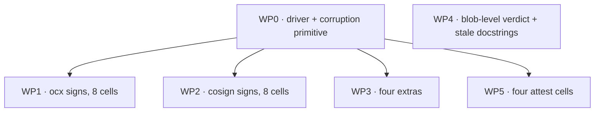

# Plan — WP6: the cosign interop matrix

## Status
- State:   plan-approved
- Tier:    low
- Updated: 2026-08-29
- Next:    /hex-execute .claude/artifacts/plan_cosign_wp6_matrix.md

## Header

- Scope: small (two-way door — acceptance tests and test fixtures only, no
  production surface, no wire format, no CLI grammar)
- Research: skipped — two-way door. Discovery was empirical instead: every
  behavioural fact this plan rests on was **measured** against cosign v3.1.1
  and the local Sigstore stack, and is recorded in
  [`analysis_cosign_interop_probes.md`](./analysis_cosign_interop_probes.md).
  Read that file before implementing; do not re-derive it.
- Reversibility: two-way
- Overlays: (none). One `reviewer:spec` pass (opus) ran on the draft; its five
  Block findings are folded in below and named at their fix sites as `F<n>`.

### Files this plan may touch

`test/tests/test_cosign_interop.py`, `test/tests/test_cosign_matrix_*.py`
(new), `test/tests/fixtures/**`, `test/sigstore/**`.

**Off limits** (a parallel loop owns them): `crates/**`,
`test/tests/test_{sign,attest,push}.py`, `crates/ocx_cli/src/options/**`,
`crates/ocx_lib/src/oci/{sign,attest,verify}/pipeline.rs`. A production defect
found here is reported with a failing test, never fixed in place.

## Design

### What the matrix is

The spec's four axes, full cross-product, 16 cells:

| Axis | Values |
|---|---|
| Direction | ocx signs → cosign verifies · cosign signs → ocx verifies |
| Format | bundle (OCI 1.1 + v0.3) · simplesigning sidecar |
| Key model | keyless (Fulcio + Rekor) · key pair |
| Registry | Referrers API present (zot, 5000) · absent (registry:2, 5001) |

Every cell is **image-level**: `cosign verify <ref>` and `ocx package verify
<identifier>` resolve the artifact out of a registry themselves. No blob
command appears in any of the 16. That is the whole point — the pre-existing
suite proved bundle *content* agreement through `verify-blob`; this proves
*discovery plus content* through the commands a user actually runs.

### Supersession — two spec decisions the measurements overturned (F10)

Recorded here because the spec is otherwise the authority, and a silent
override is indistinguishable from an oversight.

- **Spec §WP6 "drive cosign with `--new-bundle-format=false`"** is not
  executable: probe P1 measured the flag's total absence from `cosign sign`
  and `cosign verify` on v3.1.1. The sidecar route is `cosign generate` →
  `sign-blob` → `attach signature` (P2).
- **Spec §WP6 "the two cosign × bundle × referrers-absent cells cannot produce
  a faithful artifact"** (per [sigstore/cosign#4641](https://github.com/sigstore/cosign/issues/4641))
  is half right on this version: probe P5 measured `artifactType` **surviving**
  and only the three annotations being dropped. Those cells are producible;
  M-10 and M-12 assert the annotation loss instead of skipping.

The spec paired its removed route with a drift guard, and the guard is kept in
a form that still works: **C-004** below pins `cosign.COSIGN_IMAGE` to the
version these probes measured, so a bump reds rather than silently re-testing
a different tool.

### Component contracts

**C-001 — `test/tests/fixtures/cosign_matrix.py`, the shared driver.**
One module every matrix test imports. It owns the four things that vary per
cell and nothing else.

```python
COSIGN_KEY  : Path   # tests/fixtures/golden/keys/cosign.key  (password "ocxtest")
COSIGN_PUB  : Path   # tests/fixtures/golden/keys/cosign.pub
KEY_PASSWORD: str    # "ocxtest" — reaches ocx as OCX_KEY_PASSWORD, cosign as COSIGN_PASSWORD

@dataclass(frozen=True, slots=True)
class Cell:
    """One matrix coordinate, and the registry it runs against."""
    registry: str          # "localhost:5000" | "localhost:5001"
    referrers: bool        # True for zot, False for registry:2
    key_mode: str          # "keyless" | "key"
    fmt: str               # "bundle" | "simplesigning"

def subject_package(...) -> tuple[OcxRunner, PackageInfo, str, int]:
    """Publish a fresh ocx package into `cell.registry`; return runner, pkg,
    subject digest (the linux/amd64 PLATFORM manifest), size."""

def image_ref(cell, pkg, subject_digest) -> str:
    """`{registry}/{repo}@{subject_digest}` — see C-005. NEVER a tag."""

def ocx_sign(...)   -> CompletedProcess
def ocx_verify_args(cell, *, stack, pin_format=None) -> list[str]
def cosign_sign(...) -> CompletedProcess
def cosign_attach_simplesigning(...) -> CompletedProcess
    """`generate` -> `sign-blob` -> `attach signature`: the ONLY route to a
    cosign-produced sidecar on v3.1.1 (P2). Raises if any step fails."""
def cosign_verify(work, cell, ref, *, stack, ignore_tlog: bool) -> CompletedProcess
    """`ignore_tlog` is REQUIRED, never defaulted — see C-006."""

def corrupt_signature(cell, registry, repo, subject_digest) -> tuple[bytes, bytes]:
    """Flip one byte of the signature this cell's artifact carries; re-push.
    Returns (before, after) as read BACK OFF THE WIRE — see C-007."""

def assert_single_candidate(cell, registry, repo, subject_digest) -> None:
    """Assert exactly one signature is discoverable across ALL THREE doors —
    see C-008."""
```

**C-002 — cell test shape.** Each cell is one pytest function that asserts
**both** outcomes against one published subject:

1. produce the artifact (ocx or cosign, per the cell);
2. `assert_single_candidate(...)` — nothing else is discoverable;
3. assert the consumer **accepts** it — `rc == 0`;
4. `before, after = corrupt_signature(...)`; **assert `before != after`**;
5. `assert_single_candidate(...)` again — the corruption replaced the
   candidate, it did not add a second one;
6. assert the consumer **refuses** it — see C-006 for what "refuses" must
   assert.

Steps 3 and 6 in one function is deliberate: a green in step 3 is evidence
only because step 6 proved a red was reachable on the same artifact, in the
same registry, under the same trust material. Steps 2, 4 and 5 are what stop
that red from being reachable *for the wrong reason*.

**C-003 — no weakening.** No cell may `pytest.skip`, catch the failure, accept
an exit-code range, relax an identity matcher, or **assert a bare non-zero exit
code**, to go green. A cell that cannot pass honestly stays red and is
reported.

**C-004 — version drift guard (F10).** The module asserts
`cosign.COSIGN_IMAGE == "ghcr.io/sigstore/cosign/cosign:v3.1.1"`, with a
comment naming this plan and the probe artifact. Every string constant in
C-006 was measured against that image; a bump must red here rather than
silently re-measure.

**C-005 — the reference is a digest, never a tag (F12).** `ocx package sign`
signs the `linux/amd64` **platform manifest** under the package's index. A tag
reference resolves to the *index*, where no signature lives, so
`cosign verify <registry>/<repo>:<tag>` finds nothing and fails with a
discovery error — which a bare non-zero assertion would happily accept as the
negative half. Both tools address the same object:
`{registry}/{repo}@{subject_digest}`. `ocx package verify` reaches the same
manifest with `--platform linux/amd64`.

**C-006 — what "refuses" asserts, per consumer (F2).**

- **ocx**: exit **65** and `error.detail == "signature_invalid"`. Never 79
  (`no_signatures_found`) — that would mean the corruption destroyed
  discovery rather than the signature.
- **cosign**: exit non-zero **and** stderr matches a measured cryptographic
  refusal. The strings must be pinned as constants in `cosign_matrix.py` and
  each must be observed once during implementation before being asserted.
  Note the trap: cosign's *transparency-log* failure reads
  `"no matching signatures: signature not found in transparency log"` — a
  discovery-flavoured sentence for a non-discovery cause — so "assert the
  message is not a discovery error" is **not** a safe filter. Pin the exact
  string each cell expects.

**C-007 — the corruption is per-shape, and proven to have landed (F3).**
`corrupt_signature` dispatches on `(cell.fmt, cell.referrers)`. The naive
"re-push under the same tag" is wrong for the bundle shapes: flipping a byte
in the bundle blob changes the blob digest, so the referrer manifest's layer
descriptor, the referrer manifest digest, and — on the fallback registry — the
index child's `digest` **and** `size` all have to be rewritten. Recipes:

| Shape | Recipe |
|---|---|
| bundle + referrers | rewrite the bundle blob, push it, rebuild the referrer manifest around the new layer descriptor, push it subject-linked, and remove the original referrer so exactly one candidate remains |
| bundle + fallback tag | same blob and referrer rewrite, then rewrite the `sha256-<hex>` index so its single child names the new digest **and** size. Index-tag overwrite only: `mirror-registry` sets no `REGISTRY_STORAGE_DELETE_ENABLED`, so DELETE is not available there |
| simplesigning (either registry) | edit the `dev.cosignproject.cosign/signature` **annotation** on the layer descriptor and re-push the `.sig` manifest under the same tag. Do **not** touch the payload blob — that trips `verify_layer`'s claim check and reds as a subject mismatch, not `signature_invalid` |

`corrupt_signature` returns the signature bytes read **back off the wire**
before and after, and C-002 step 4 asserts they differ. A mutation that did
not land is otherwise indistinguishable from one that did.
`cosign_artifacts.served_bundle_signature` and `served_sidecar_signature`
already do that read — reuse them, do not re-implement.

**C-008 — exactly one candidate, across three doors (F4).** Verification can
reach a signature through the Referrers API, the `sha256-<hex>` fallback index,
**and** the `sha256-<hex>.sig` sidecar tag — and the sidecar door fires
whenever the bundle set comes back empty. So a corruption that empties the
bundle set can be rescued by an untouched sidecar, turning a green into a
false pass. `assert_single_candidate` checks all three doors and asserts the
total is exactly one.

### The 16 cells

Group A — **ocx signs → cosign verifies** (`test_cosign_matrix_ocx_signs.py`):

| ID | Format | Key model | Registry | `ignore_tlog` | Test name |
|---|---|---|---|---|---|
| M-01 | bundle | keyless | referrers | no | `test_cosign_verifies_an_ocx_bundle_keyless_over_the_referrers_api` |
| M-02 | bundle | keyless | fallback | no | `test_cosign_verifies_an_ocx_bundle_keyless_through_the_fallback_tag` |
| M-03 | bundle | key | referrers | **yes** | `test_cosign_verifies_an_ocx_bundle_key_over_the_referrers_api` |
| M-04 | bundle | key | fallback | **yes** | `test_cosign_verifies_an_ocx_bundle_key_through_the_fallback_tag` |
| M-05 | simplesigning | keyless | referrers | no | `test_cosign_verifies_an_ocx_sidecar_keyless_on_a_referrers_registry` |
| M-06 | simplesigning | keyless | fallback | no | `test_cosign_verifies_an_ocx_sidecar_keyless_on_a_legacy_registry` |
| M-07 | simplesigning | key | referrers | **yes** | `test_cosign_verifies_an_ocx_sidecar_key_on_a_referrers_registry` |
| M-08 | simplesigning | key | fallback | **yes** | `test_cosign_verifies_an_ocx_sidecar_key_on_a_legacy_registry` |

Group B — **cosign signs → ocx verifies** (`test_cosign_matrix_cosign_signs.py`):

| ID | Format | Key model | Registry | Test name |
|---|---|---|---|---|
| M-09 | bundle | keyless | referrers | `test_ocx_verifies_a_cosign_bundle_keyless_over_the_referrers_api` |
| M-10 | bundle | keyless | fallback | `test_ocx_verifies_a_cosign_bundle_keyless_through_the_fallback_tag` |
| M-11 | bundle | key | referrers | `test_ocx_verifies_a_cosign_bundle_key_over_the_referrers_api` |
| M-12 | bundle | key | fallback | `test_ocx_verifies_a_cosign_bundle_key_through_the_fallback_tag` |
| M-13 | simplesigning | keyless | referrers | `test_ocx_accepts_a_cosign_keyless_sidecar_that_cosign_itself_refuses` |
| M-14 | simplesigning | keyless | fallback | `test_ocx_accepts_a_cosign_keyless_sidecar_on_a_legacy_registry_that_cosign_refuses` |
| M-15 | simplesigning | key | referrers | `test_ocx_verifies_a_cosign_sidecar_key_on_a_referrers_registry` |
| M-16 | simplesigning | key | fallback | `test_ocx_verifies_a_cosign_sidecar_key_on_a_legacy_registry` |

**The `ignore_tlog` column is per cell, not per group, and it is measured
(F11).** A key-mode signature defaults to no Rekor upload (§Rekor-upload
default), so it carries no `dev.sigstore.cosign/bundle`, and `cosign verify`
returns **rc=12 `signature not found in transparency log`** without the flag —
measured on an OCX key-mode sidecar. Keyless OCX artifacts carry the
annotation and clear cosign's full tlog check **without** the flag; passing it
on M-01/M-02/M-05/M-06 would hide the strongest property those cells have, and
C-003 forbids adding it to make a cell pass.

M-10 and M-12 additionally assert cosign's fallback-index annotation loss
(P5): `artifactType` present, the three annotations absent.

### Known-weak greens — cells that pass because of an open finding (F6, F7)

Two findings from loop D are frozen and deliberately unfixed. WP6 must not
present a cell that passes *because* of one as evidence of parity. Both are
disclosed in the cells' docstrings, and both are **asserted**, so the day
either side changes, the cell reds.

**(a) A keyless simplesigning sidecar verifies with zero signing-time
evidence.** `simplesigning_read.rs:438` feeds
`SigningInstant::CallerSupplied(cert.notBefore)` to the certificate-window
check, which is then satisfied by construction — a once-valid Fulcio cert is
accepted indefinitely. Measured consequence: for a **cosign-produced keyless
sidecar**, `cosign verify` refuses (rc=12, it searches Rekor online) and
`ocx package verify` **accepts** (rc=0, `signatures[0]` carrying no `signed_at`
and no `rekor_log_index`).

→ **M-13 and M-14 pass only because of (a).** Their docstrings name the
finding and cite the line, and each cell asserts the **divergence itself**:
same artifact, same registry, cosign refuses without `--insecure-ignore-tlog`,
ocx accepts. That converts an undisclosed weakness into a pinned fact.

**(b) The bundle→simplesigning fallback is registry-triggerable.**
`pipeline.rs:1401` fires the sidecar door whenever the bundle match set is
empty, and emptiness is whatever the registry served — so a mirror that 404s
the bundle referrer silently downgrades verification onto the weaker path.

→ **X-02b** exercises exactly that and is disclosed as a finding, not a
feature. X-01's added leg (F8) covers the same hazard under
`--signature-format both`.

### Attest and SBOM — scope, stated rather than dropped (F1)

The spec requires each cell "also exercised for `sign`, `attest` and SBOM
attach **where the shape differs**". Applying that qualifier:

- **Sidecar attest (`.att` / `.sbom` tags) — a recorded WP8 gap, not a skip.**
  `simplesigning_read.rs:61-73`: "`.att` by OCI 1.1 referrer is out of scope",
  and only `SidecarKind::Signature` is ever handed to `read_sidecar_tag`. No
  OCX reader exists, so the four sidecar-attest cells are unproducible for a
  reason inside OCX. Registered as a WP8 gap with that citation.
- **Bundle attest — the shape differs on the *discovery* axis only.** Key
  model changes nothing about a DSSE attestation that M-03/M-11 do not already
  prove, so the attest sub-matrix is the two discovery paths, both directions,
  keyless. Four cells, in `test_cosign_matrix_attest.py`:

| ID | Direction | Registry | Test name |
|---|---|---|---|
| A-01 | ocx attests → `cosign verify-attestation` | referrers | `test_cosign_verifies_an_ocx_attestation_over_the_referrers_api` |
| A-02 | ocx attests → `cosign verify-attestation` | fallback | `test_cosign_verifies_an_ocx_attestation_through_the_fallback_tag` |
| A-03 | cosign attests → `ocx package verify --attestation` | referrers | `test_ocx_verifies_a_cosign_attestation_over_the_referrers_api` |
| A-04 | cosign attests → `ocx package verify --attestation` | fallback | `test_ocx_verifies_a_cosign_attestation_through_the_fallback_tag` |

`cosign verify-attestation` is image-level and takes `--type` and
`--trusted-root` (measured). A-01/A-02 keep `--check-claims` at its default so
the subject binding is asserted, matching the existing blob-level attestation
test. Same C-002 shape, same C-006 refusal contract.

### The three extras (`test_cosign_matrix_extras.py`)

- **X-01 — `--signature-format both`.** One `ocx package sign
  --signature-format both`; cosign verifies it; `ocx package verify
  --signature-format bundle` and `--signature-format simplesigning` each
  succeed and report their own `signature_format` / `discovery_method`.
  Two negatives, not one (F8): corrupting the **sidecar** leaves the bundle pin
  green and reds the sidecar pin; corrupting the **bundle** reds the bundle pin
  and — the dangerous leg — must be asserted for what *unpinned* verify then
  does, since the sidecar door fires on the emptied match set.
- **X-02 — the D9 preference.** With only the sidecar present, unpinned
  `ocx package verify` reports `signature_format: simplesigning` /
  `discovery_method: sidecar_tag`; with both present it reports `bundle`.
  Key model is **key** so the green does not also depend on finding (a).
- **X-02b — the downgrade (F7).** A valid bundle **and** a valid sidecar are
  published, then the bundle is made unreachable (referrer removed / dropped
  from the fallback index) while the sidecar stays intact. Unpinned verify is
  asserted for what it reports today; `--signature-format bundle` is the pinned
  control and must refuse. Docstring names finding (b) as registry-triggerable.
- **X-03 — Rekor-upload default, as a two-sample experiment (F13).** Asserting
  a field's absence alone is vacuous — `signed_at` and `rekor_log_index` are
  both `Option`, so a regression dropping them for every signature would pass.
  One subject, one flag apart: sign with `--rekor-upload` and assert both
  fields **present**; sign with `--no-rekor-upload` and assert both **absent**.
  The keyless half is refused at **sign** time: exit **64**,
  `kind_detail == "rekor_upload_required_for_keyless"`.

### (b) Verdict on the retired blob-level criterion — WP4

The meta-plan's WP6 criterion, "the 5 blob-level tests stay and keep passing",
is **retired and replaced**, not merely annotated:

- Its premise was that ocx and cosign agreed on a bundle handed over as a
  *file*, because registry-level discovery was believed impossible. Probe P3
  falsified the premise: `cosign verify <ref>` reads the Referrers API, the OCI
  fallback tag, and the `.sig` sidecar.
- One of the five already inverted under D2
  (`test_ocx_refuses_a_cosign_blob_signature_bundle`), whose own docstring
  says the criterion is "met in letter … but its spirit … was retired by D2"
  and hands the confirmation to loop E. So "keep passing" is satisfied by a
  test asserting the opposite of what the criterion meant.
- **Replacement criterion:** *every one of the 16 image-level cells and the 4
  attest cells passes, and each has demonstrated its own refusal on a
  corrupted signature it proved landed.* The blob-level tests stay as the
  payload-agreement layer beneath it.

**The stale "discovery is out of scope" claim lives in three places (F9), and
WP4 deletes all three:** the `test_cosign_interop.py` module docstring, the
`test_cosign_verifies_an_attestation_ocx_produced` docstring in the same file,
and the `test/tests/fixtures/cosign.py` module docstring ("Interop with cosign
is a bundle-format contract, not a discovery one").

### Error taxonomy

| Condition | Consumer | Exit | `kind_detail` |
|---|---|---|---|
| Corrupted signature | ocx | 65 | `signature_invalid` |
| Corrupted signature | cosign | non-zero + pinned stderr (C-006) | — |
| Nothing discoverable | ocx | 79 | `no_signatures_found` |
| No Rekor entry, key mode | cosign | 12 | `signature not found in transparency log` |
| `--no-rekor-upload` with keyless | ocx (sign) | 64 | `rekor_upload_required_for_keyless` |

### Edge cases

- `ocx package sign` requires `--platform`; every cell signs `linux/amd64` and
  verifies the same platform.
- Each cell uses its own UUID repo, so cells are order-independent and
  parallel-safe under `pytest-xdist`.
- `mirror-registry` (registry:2) has no manifest DELETE; fallback-tag
  corruption is an index-tag rewrite only (C-007).

## Decompose

| WP | Scope (C-/M-/A-/X- IDs) | Files | Size | Wave | Depends-on | Review | Status |
|---|---|---|---|---|---|---|---|
| WP0 | C-001, C-003..C-008 — driver, corruption, single-candidate, drift guard | `test/tests/fixtures/cosign_matrix.py` | L | 1 | — | panel | pending |
| WP1 | C-002, M-01..M-08 | `test/tests/test_cosign_matrix_ocx_signs.py` | M | 2 | WP0 | light | pending |
| WP2 | C-002, M-09..M-16 (incl. the (a) disclosure on M-13/M-14) | `test/tests/test_cosign_matrix_cosign_signs.py` | M | 2 | WP0 | panel | pending |
| WP3 | X-01, X-02, X-02b, X-03 | `test/tests/test_cosign_matrix_extras.py` | M | 2 | WP0 | panel | pending |
| WP4 | (b) verdict + the three stale docstrings | `test/tests/test_cosign_interop.py`, `test/tests/fixtures/cosign.py` | S | 2 | — | self | pending |
| WP5 | A-01..A-04 + the sidecar-attest WP8 gap note | `test/tests/test_cosign_matrix_attest.py` | M | 2 | WP0 | light | pending |



Critical path: WP0 → WP2 (its two disclosure cells carry the most judgement).
Wave 2 runs WP1–WP5 concurrently; the six files are disjoint. **No worker runs
a git command** — the orchestrator owns every commit, so one worktree keeps one
writer of record.

## Open questions

None. The three that would have existed — can cosign discover an ocx
signature, can cosign write a sidecar, does cosign reject an ocx-created
sidecar's empty config — were settled by measurement (P2, P3, P4), as were the
two the review raised (F6, F11).
