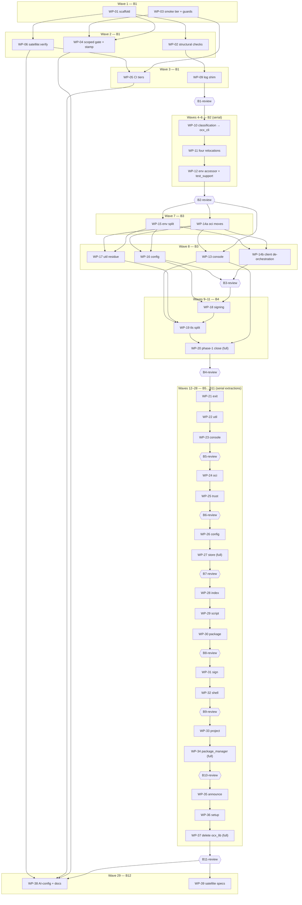

# Plan: Crate split workspace — dissolve `ocx_lib` into the 17 `ocx_*` crates

## Status

- **Plan:** plan_crate_split_workspace
- **State:** executing <!-- planning -> plan-approved -> executing -> review -> done -->
- **Tier:** xhigh
- **Tier-grammar:** 5
- **Effective-tier:** derived
- **Active phase:** 2 — batches B1–B7 **MERGED**; **B8/B9 running** on `hex/crate-split--b8`, WP-32
  `ocx_shell` committed at `5a7650fd`, rebased to `2da3f009`
- **Step:** `evelynn` is at `e5f6a968`. **Twelve crates have physically left `ocx_lib`**, measured at
  `2da3f009` by counting `crates/*/src/**.rs` rather than by reading this block's own history:
  `ocx_exit` 3, `ocx_util` 36, `ocx_console` 13, `ocx_oci` 46, `ocx_trust` 2, `ocx_config` 20,
  `ocx_store` 21, `ocx_index` 15, `ocx_script` 12, `ocx_package` 52, `ocx_sign` 40, `ocx_shell` 17.
  `ocx_lib` is down to **127** source files from 262.

  **Four shells remain**, each holding `lib.rs` alone: `ocx_project`, `ocx_package_manager`,
  `ocx_setup`, `ocx_announce`. Each rises `passed` by one with `SUITE_FLOOR` in the same commit
  (DEC-66/DEC-71); `ocx_sign` was the one extraction where an unmoved `passed` was correct, and it
  behaved as forecast.

  **`ocx` behaves identically.** At `5a7650fd`: acceptance `3655 passed, 156 skipped, 5 xfailed`,
  floor 3816/3816, ceilings 156/255 and 5/5, nextest 8223/8049. The frozen pair unmoved; the rise
  reconciled **by name** — dropping the `ocx_shell` row reds `test_every_crate_that_logs_has_a_row`
  with `missing a row ['ocx_shell']` — never by differencing totals (DEC-45). `task verify --force`
  exit 0 on attempt 5. Recomposition: 16 blobs both sides, **both set differences empty**, 7
  byte-identical, 9 changed and each attributable to the E1 narrowing, the DEC-63 fix or the
  de-linking.

  **`2da3f009` is not yet certified.** Its claim rests on `5a7650fd`'s run plus tree equality, and
  that is insufficient here for a reason unrelated to the rebase: the **gate set changed underneath
  it**. `6a3f4aa6` added `scripts:dead-path-sweep` to `.verify:build-test` and `a8fcb5eb` turned that
  gate's verdict from a count into a named set, so `task verify` now runs a check that never ran
  against this tree. Tree equality proves no file moved; it cannot certify a gate that did not exist.
  A fresh `task verify` is owed.

  **Five standing DEC-50 allows**, the fifth ruled this batch:
  `sync_index_conformance.sh:3`, `:24`, `test_trampoline_exec.py:852`,
  `test/tests/fixtures/simplesigning/README.md:4`, `test/tests/test_shell_reconcile_edge_cases.py:931`.
  The last is a crate path inside a `pytest.skip()` reason — DEC-51's collision a third time, cleared
  by the same instrument `test_trampoline_exec.py:852` has used for batches rather than by a new
  route, because a route permits the shape everywhere unreviewed and a string literal in a collected
  module is also where an assertion subject lives.

  **Remaining:** B8R (the `review-b8` deferrals — T-arch-G1's missing `stale` check, the
  `__test_scaffolding` forwarding guard, `clippy-warn-baseline` per-file attribution,
  `edge_inventory`'s `module_pairs_reciprocated_count`, DEC-40's missing
  `every_public_item_of_ocx_util_has_a_consumer`), B10 (WP-33/34), B11 (WP-35/36/37 — WP-37 deletes
  `ocx_lib`), B12 (WP-38/39), then one draft PR, CI green including the manual Verify Deep workflow,
  then `/hex-finalize`.

  **Two obligations `task verify` does not discharge**, both of which cost this run a merged defect:
  the test-diff guard over the committed range (DEC-50), and the two `ls-tree -r` dicts after any
  rebase, reported even when empty. The dead-path sweep is **no longer** in this list — it was, until
  `6a3f4aa6` discovered it had a task and a `--self-test` and was invoked by nothing at all.
- **Last update:** 2026-09-19 (after `e5f6a968`: DEC-74's measured outcome)

## Overview

**Status:** Approved (owner mandate 2026-09-16, full autonomous mode)
**Author:** hex-plan orchestrator (tier xhigh), 2026-09-16
**Design record:** [`adr_crate_split_workspace.md`](./adr_crate_split_workspace.md) (Status **Accepted** 2026-09-16) + [`system_design_crate_workspace.md`](./system_design_crate_workspace.md) + design addendum [`design_spec_crate_split_inversions.md`](./design_spec_crate_split_inversions.md) (D-001…D-066, the per-edge mechanisms; amended by § Decisions below)
**Measured state:** [`discover_crate_split_file_map.md`](./discover_crate_split_file_map.md), [`discover_crate_split_edge_inventory.md`](./discover_crate_split_edge_inventory.md) (the re-run phase-0.2 inventory; JSON at `.tmp/hex/plan-crate-split/edge_inventory.json` until WP-02 commits the script), [`discover_crate_split_tests.md`](./discover_crate_split_tests.md), [`discover_crate_split_ai_config_satellites.md`](./discover_crate_split_ai_config_satellites.md)
**Research this run:** [`research_crate_split_cargo_workspace_idioms.md`](./research_crate_split_cargo_workspace_idioms.md), [`research_crate_split_extraction_mechanics.md`](./research_crate_split_extraction_mechanics.md), [`research_crate_split_verification_tiers.md`](./research_crate_split_verification_tiers.md) (on top of the ADR's eight)
**Plan reviews:** [`review_crate_split_plan_spec.md`](./review_crate_split_plan_spec.md), [`review_crate_split_plan_architect.md`](./review_crate_split_plan_architect.md), [`review_crate_split_plan_sota.md`](./review_crate_split_plan_sota.md), [`review_crate_split_plan_adversary.md`](./review_crate_split_plan_adversary.md) — every actionable finding is applied in this revision
**Branch:** `evelynn` (feature branch for the whole series; worktrees under `.agents/worktrees/<wp-slug>`)

### Classification

- **Scope:** large — 388 source files / 348,648 LOC re-homed across 17 crates, 21 phase-1 inversions, 9 tooling deliverables, 14 rule globs, 3 workflows, 2 satellites
- **Reversibility:** one-way (high) — per crate, the point of no return is the day a satellite links it (ADR § Metadata)
- **Tier:** xhigh (explicit)
- **Overlays:** architect=on (the design addendum is the delegated output; the ADR pre-exists), research=3, adversary=on (`codex:rescue`, plan-artifact scope — ran, 22 findings triaged)
- **Required artifacts:** plan (this), ADR (Accepted), research ×3 (persisted) — all present

## Objective

Replace `crates/ocx_lib` with seventeen `ocx_*` library crates whose dependency graph
is the ADR's map (as corrected by measurement, DEC-11), with `ocx`'s observable
behaviour, every wire/persisted format and every acceptance test's semantics unchanged
— the one recorded exception being the `log` target names a hand-written
`OCX_LOG`/`RUST_LOG` directive can spell (DEC-3) — and with the verification tiers
(`task verify:scoped`, the `smoke` acceptance tier, the deep per-PR trigger,
`task satellite:verify`, `task rust:deps:direction`) in place before the first module
moves. The ADR decides **what**; this plan decides **who builds which file, in what
order, proving what**.

## Scope

### In scope — every ADR feature, none cut (owner constraint 2)

- Phase 0 tooling 0.1–0.9 as WP-01…WP-06 (harness, edge inventory, direction check,
  satellite verify, `ocx_test_support`, smoke tier + three anti-rot checks + wall-clock
  budget, scoped gate + `.verify:mark` scope, `unreachable_pub` ratchet baseline, per-rule
  glob parametrisation) plus the scaffold commit (design § D), the observable-behaviour
  guards (design § A.5), the structural-change diff guard (C-077) and the release
  feature-graph check (C-078).
- Phase 0.5 / 1: the 21 inversions of design § B (ADR 1.1–1.14 re-measured, plus
  1.16–1.21 and the `log.rs` dissolution), each with a boundary test and a committed
  negative fixture, until the inventory reports **0 disallowed edges for every crate**.
- Phase 2: seventeen extractions in the ADR order (`ocx_exit` first, `ocx_script` as
  soon as its five dependencies exist, `ocx_test_support` in phase 0.5), one crate per
  work package, each re-pointing its `subsystem-*.md` glob, catalog rows and `CLAUDE.md`
  table in the same commit; the two `paths:`-filtered workflows edited with every move
  they watch; the four integration tests relocated; `OciTransport` sealed with a
  red-state proof; the trust-tiering adversarial test; the SSRF construction-site
  ratchet; then the deletion of `ocx_lib`.
- Per-crate `README.md` (17), per-crate `CLAUDE.md` (4), `CLAUDE.md` § Architecture and
  § Stability tiers, `arch-principles.md` (crate table, ADR index row, satellite linking
  rule), `.claude/rules.md`, `.claude/tests/test_ai_config.py` glob checks, hex.md
  Pointers, the ecosystem-tier text.
- The `ocx_exit` SDK seam (X1–X5) and contract E6 (the CLI's data / error-envelope types
  stay `serde`-over-`ocx_exit`, review-only).
- The two out-of-repo satellite follow-ups **specified** here (WP-39), not executed here.

### Out of scope (ADR § Deferred, § Out of scope; owner constraint 5)

- `native_transport` narrowing, the opt-in SSRF guard's default, PR #409 — ruled out; the
  SSRF construction-site check is a ratchet over today's sites (C-053), not a fix.
- mold vs LLD, sccache hit rate, `composer.rs.all/.fns`, the `exclude` glob — separate tidy-ups.
- `--cfg ocx_testing`, `ocx_api`, the GitHub merge queue — deferred by ruling.
- Executing the ocx-mirror and grimoire changes — their own repos, after this lands.
- `.claude/tests/test_ai_config.py::TestPlanStatusBlock`'s dead gate (hex.md memory 2026-08-09) — pre-existing, untouched.

## Research

Three axes, persisted (`Expires:` 2027-03-16):

- **Cargo workspace idioms** — `[workspace.package]` gains `edition`/`rust-version`; keep
  the `__testing` forward list (Cargo auto-declares `check-cfg` for real features); route
  `unreachable_pub` through the LINT-16 ratchet, not the manifest; `cargo nextest run -p`,
  doc-tests need `cargo test --doc` (run nowhere today — the sealed-trait proof adds it);
  `cargo metadata --no-deps` for path→crate, full metadata for reverse-dep counts (needs
  submodules initialised); cargo-hack/udeps/machete not now; cargo-dist and git-cliff
  are crate-count-agnostic; the three ecosystem-contract lines still hold (rust-lang/cargo#14946 open).
- **Extraction mechanics** — hard-cut per crate, no re-export shim (ruff/uv/rust-analyzer
  precedent); dissolve the wide `Error` in the same commit as its per-crate replacement;
  one `exit/<crate>.rs` per source crate for merge isolation; `ocx_test_support` shaped
  like `uv-test`; regex+witness harness with the raw-string fix and the corpus-ratio
  property the inventory script needed; a scaffold commit makes extractions
  non-contending on the root manifest; `-D rustdoc::broken_intra_doc_links` per crate;
  observable risks: tracing target names, `module_path!`, schema bytes, the trampoline
  test's blob path, `include_str!` depth on directory-level moves.
- **Verification tiering** — `pull_request` needs `ready_for_review` in `types`; job-level
  `continue-on-error: true` for the satellite job (flip = delete one line; never mark it
  required while set); build the mirror by overlaying this tree into a disposable copy;
  `--strict-markers`, budget measured in the taskfile `cmds:`; add `cargo check
  --workspace` to the scoped gate; neither actionlint nor zizmor checks `paths:` liveness;
  `cancel-in-progress` must not cancel `merge_group` runs.

## Decisions taken in place of a human answer (owner mandate)

| # | Decision | Basis |
|---|---|---|
| DEC-1 | **`log.rs` dissolves to the `log` crate's macros directly (`log::info!`), not to `tracing::*!`.** `log = { version = "0.4", features = ["std"] }` becomes a workspace dependency of every library crate (`std` is load-bearing: `oci/index/local_index.rs:1533` calls `log::set_boxed_logger`, provided today only through `tracing-log`'s default features); `tracing-log` stays only in `ocx_cli`. Addendum D-001 and § B row 1.17 read accordingly; the `CapturingLogger` test at `local_index.rs:1512–1537` is **kept as is** (only its `use` line changes). | 487 `log::` vs 72 `tracing::` sites — a one-token `use` edit per file versus a macro rewrite. Both families render identically under this subscriber (`.compact()`, `with_target(false)`, `LogTracer` dispatches with `Parent::Current`; the tree enters no span); the decision is a diff-size call, not a behaviour call — stated so it is not misread. |
| DEC-2 | **`BooleanString` keeps no `clap_builder` dependency in `ocx_util`.** The `ValueEnum` impl is replaced by a const `POSSIBLE: &str = "1, y, yes, true, 0, n, no, false"` (the exact string `value_variants()` renders today — `on`/`off` are accepted but absent from the list) and `FromStr`; a unit test pins the literal. Its three consumers (`env.rs:1845`, `activate.rs:207`, `ocx_cli/src/command/self_group/setup.rs:386`) call `try_from` and only `Display` the error; none uses it as a clap value type. | A CLI-parsing crate in a domain-free primitives crate violates the closed-interface constraint; no consumer needs `ValueEnum`. |
| DEC-3 | **`log` target names follow the module path as it moves** (first at WP-11, `ocx_lib::activation` → `ocx_lib::package_manager::activation`; the crate prefix changes from WP-22 on). Announced **once**, in the subject of WP-11's commit, worded for the whole series: `refactor(log)!: log targets follow the crate split — ocx_lib::<module> becomes ocx_<crate>::<module> by its end`. No compatibility mapping. This is the plan's one recorded exception to "observable behaviour unchanged" and it reaches only a hand-written `OCX_LOG`/`RUST_LOG` directive. | No default directive, `--log-level` mapping or doc names `ocx_lib` (addendum A.5(i)); CLAUDE.md pre-1.0 rule: a break is announced in the changelog (= commit subject) and nowhere else. WP-24's subject additionally names the ADR's ecosystem break (`ocx_lib::Error::OciClient` → `ClientError`). |
| DEC-4 | **`satellite-verify` runs in `verify-deep.yml` with job-level `continue-on-error: true`** from the day it lands until the ocx-mirror follow-up PR merges; the flip is deleting that one line (WP-39's spec names it). **It must never be made a required check while the line is set** — the job's own check run concludes `failure` under job-level `continue-on-error` (only the run conclusion and `needs.*.result` read `success`), so a required check on it would block every merge until the mirror re-points; a gate read as green would gate nothing (wording corrected by WP-05's L1 review). | Research rec 2; the job is expected red from the first extraction until the mirror re-points. |
| DEC-5 | **`ocx_script` extracts right after `ocx_store`** (WP-29), the first point where its five dependencies exist as crates. | ADR phase 0.5 says "as soon as its five dependency crates exist". |
| DEC-6 | **Full-mark requirement:** `pre_commit_verification.py` requires `scope == "full"` when the commit subject starts with `release:` or the branch is `main`; `task release:prepare` (the release entry point) refuses to run without a fresh full mark (a `cmds:` check). Every other commit accepts a fresh `scoped` mark. `/hex-finalize` runs the full gate, which writes a full mark. | The ADR's "`/hex-finalize` requires a full mark" has no hook-visible finalize signal; the release entry, the release commit and `main` are the three places a scoped mark must never suffice, and all three are enforceable. |
| DEC-7 | **Workspace-wide standing guards live in `crates/ocx_test_support/tests/workspace_structure.rs`** using `ocx_test_support::boundary`; their witness fixtures live under `crates/ocx_test_support/tests/fixtures/boundaries/` so they outlive `ocx_lib`. Phase-1-only boundary tests and fixtures live in `ocx_lib` and die with it. `task rust:deps:direction` is `cargo nextest run -p ocx_test_support --test workspace_structure deps_direction`. | The harness must outlive `ocx_lib`; `ocx_cli` is the top crate and dev-depends on `ocx_test_support` legally. No new Python project. |
| DEC-8 | **Phase-1-only tooling is Python under `scripts/`** (`edge_inventory.py` + `edge_inventory.baseline.json`, `scoped_gate.py`, `test_diff_guard.py`), each with `--self-test`; `edge_inventory.py`, its baseline and its task are deleted with `ocx_lib` (WP-37). The authoritative inventory script is `scripts/edge_inventory.py` once WP-02 lands (seeded from `.tmp/hex/plan-crate-split/edge_inventory.py`, whose fixes the addendum's `edge_inventory_full.py` also carries). | `scripts/` exists; stdlib only. |
| DEC-9 | **Execution batches** (§ Execution batches): twelve `/hex-execute` invocations. The boundary is enforced by a **non-WP gate token** (`B<n>-review`) in the `Depends on` cell of every batch's first WP(s): the ready-set can never resolve it to `merged`, so nothing launches past a batch until the batch-end `/hex-review` has run and the main session deletes the token. | Owner: one opus context per wave set; `/hex-execute` launches on dependency-ready and reads no batch column, so the gate has to be a dependency. |
| DEC-10 | **The only edits to files under `test/**`:** (a) adding `@pytest.mark.smoke` lines (and the `import pytest` a marked module lacked, DX-19), (b) new test files, (c) `test/pyproject.toml`/`test/taskfile.yml`/floor files, (d) the blob path constant at `test_trampoline_exec.py:852` when `shims/` moves (shown red on the stale path first), (e) docstring/comment path spellings, (f) the plan's own structural tests under `test/tests/` (`test_smoke_coverage.py`, `test_logging.py`, `test_no_crate_path_assertions.py` — C-014/C-048 oracles, never an acceptance assertion) are exempt from the guard's line checks and are edited by later WPs (DX-17). No assertion, parametrisation, fixture semantics or skip changes anywhere else. **Enforced mechanically** by `scripts/test_diff_guard.py` (C-077) at every merge. **S-012 and this decision are implicit members of every WP's Scope cell and of the merge predicate.** | Owner constraint 1; (d) is a fixture path, not an assertion. |
| DEC-11 | **Map corrections adopted from the addendum (D-037):** `ocx_package_manager` += `ocx_trust`, `ocx_shell`; `ocx_setup` += `ocx_index`, `ocx_package`; `ocx_test_support` depends on nothing; item/file moves down as listed in addendum § A.4. No ecosystem crate gains a dependency; grimoire's six-crate closure is intact (verified by the architect review, Q1). **One addendum correction:** `SerializationFailure` is constructed in `ocx_util` (`utility/fs/locked_file.rs:402`, `utility/serde_ext.rs:28,36`), so it homes in `ocx_util::error::SerializationError` (literal `"JSON serialization error"` + `#[source] serde_json::Error`), not in `ocx_package_manager`, whose three sites wrap it transparently. | The ADR's own entry gate: "any new disallowed edge … must gain an inversion or a map correction". |
| DEC-12 | **Baselines re-measured:** 3,618 collected acceptance tests (255 skipped, 5 xfailed in the last green CI run), 8,049 nextest cases, 64 + 4 classify impls in 57 files, 59 `try_downcast!` entries, 70 reciprocated module pairs (`edge_inventory.json: module_pairs_reciprocated_count`), 388 source files, **8** `__testing` seam crates (`ocx_oci, ocx_config, ocx_store, ocx_index, ocx_announce, ocx_package_manager, ocx_package, ocx_shell` — `ocx_index` carries a `cfg(not)` sibling). | Discover; the ADR anticipated the re-run. |
| DEC-13 | **One commit per extraction, atomic** (`refactor(<crate>)!: extract <crate> from ocx_lib`). The two-commit shape (pure `git mv`, then edits) is withdrawn: a moved file's `use crate::…` lines cannot compile in the new crate without edits, and a non-compiling commit breaks the per-commit `cargo check` bisectability proof. Rename detection survives (a moved file's content changes by a few `use` lines; similarity stays > 90 %). No `.git-blame-ignore-revs`. | Cross-model finding 1; hex.md memory on per-commit `cargo check`. |
| DEC-14 | **Sealed-trait red state via a `compile_fail` doctest** in `ocx_oci` and `cargo test --doc -p ocx_oci` in the gate (no `trybuild`). The four in-workspace test doubles (`impl OciTransport for RecordingTransport` at `oci/attest/pipeline.rs:730`, `oci/sign/pipeline.rs:1300`, `oci/verify/pipeline.rs:4385`, and `impl OciTransport for SbomTransport` at `oci/verify/pipeline.rs:6397`) move into `ocx_oci` as `#[cfg(any(test, feature = "__testing"))] pub mod testing::{RecordingTransport, SbomTransport}`, and `ocx_sign` dev-depends on `ocx_oci` with `features = ["__testing"]` — the sealed trait is implemented only inside its crate. | ADR: "no new dependency"; cross-model finding 2. |
| DEC-15 | **Gate cost, stated plainly.** `Verify-default: scoped`, but: every phase-1 WP's command-mapped subset is "every verb" (`ocx_lib` is the only member with content), every extraction edits `.claude/rules/*.md`/`CLAUDE.md`/`test/tests/test_logging.py`, and the framework's high-risk checkpoint fires on any file another WP also declares. **Expect ≈ 30 full-cost runs across the series** (planned at ~25 min each on this host, ~13 h serialized; B1 measured 5–12 min per full run — ≈ 10 min typical per `hex.md` — so ≈ 2.5–6 h serialized), not the four `Verify: full` cells. The scoped tier pays off after WP-37; it is built for the post-split loop, not the migration. Mitigation adopted in C-019 rule (2): `.claude/**` + `CLAUDE.md` route to `task claude:tests`, `.github/**` to `actionlint` + `test_workflows.py`, a changed `test/tests/<f>.py` to that file — none of which is impact analysis. | Architect finding 4, spec finding 24; owner's "no full verify per WP" is honoured in the plan's own gates, and the residual full runs are the framework's checkpoints, named here rather than hidden. |
| DEC-16 | **Constitution, no `mod.rs`, no bespoke seam:** the new module trees are `crates/ocx_cli/src/exit.rs` + `exit/*.rs`, `crates/ocx_cli/src/tracing_init.rs` + `tracing_init/*.rs`; `trust.rs` stays a file and gains `pub mod key_ref;` (`trust/key_ref.rs`), which also keeps its `include_str!("../../…")` depths intact. The env override table is gated `#[cfg(any(test, feature = "__testing"))]` (addendum § E.1 amended): `ocx_util` declares the `__testing` feature, every crate whose unit tests set env overrides lists `ocx_util = { workspace = true, features = ["__testing"] }` under `[dev-dependencies]` (resolver v3 keeps dev-dependency features out of the normal build), `ocx_cli` forwards `ocx_util/__testing` like every other seam, and D-065's tripwire is dropped — the compiler is the tripwire. | `arch-principles.md` § Code Style; architect finding 9. |
| DEC-17 | **Sign/verify/attest pipelines keep their pre-resolution checks in order:** instead of a mandatory pre-resolved `(Digest, Manifest)`, each pipeline context takes a caller-supplied `resolve: &dyn Fn(&Identifier, &Platform) -> Result<SignTarget, ResolveTargetError>` closure plus `DialPolicy` and `SigningStatePaths`; the pipeline calls it exactly where `resolve_platform_target` is called today, so an argument error still precedes a network error (addendum D-026 amended). | Cross-model finding 3 (`AttestPipeline::run_inner` rejects unsupported predicates before resolving). |

## Execution deviations (DX — recorded by /hex-execute, append-only)

| # | Deviation | Basis |
|---|---|---|
| DX-1 | `task rust:doc:check -- <crate>` is delivered by WP-04, not WP-02: WP-04 is its only consumer (C-019 step 5) and WP-02 runs in parallel; hunk placement rule keeps `taskfiles/rust.taskfile.yml` merge-clean (WP-04 inserts after `clippy:check`, WP-02 appends at the end). | Merge order is WP-02 then WP-04 either way; avoids a cross-WP dependency on a one-task file. |
| DX-2 | The LINT-16 ratchet's JSON grouping lives in `scripts/lint_ratchet.py` (stdlib), not inline in `taskfiles/rust.taskfile.yml`: `jq` is not in the project toolchain and a 30-line `python3 -` heredoc in `cmds:` is untestable; the script carries `--self-test` like the other `scripts/` tools (DEC-8 shape). | `ocx.toml` toolchain lacks `jq`; DEC-8 precedent. |
| DX-3 | `task verify:mark` (the manual mark) writes `scope: "scoped"`, never `full`: only `task verify` writes a full mark, so a `release:` commit or a commit on `main` cannot be stamped by hand (C-021's fail-closed intent). | DEC-6; owner mandate rule 6 (`task verify:mark` bypasses the hook during work, never at finalization). |
| DX-4 | `crates/ocx_lib/src/launch.rs` gains one `SPAWN_ALLOWED` row for `ocx_test_support/tests/workspace_structure.rs` (it runs `cargo metadata`/`cargo tree`); applied as WP-02's merge fix pass, red/green quoted in the fix commit. | The process-spawn firewall test is the one guard the new integration test could not satisfy from inside WP-02's file set. |
| DX-5 | Root `taskfile.yml` `.verify:build-test` runs `rust:deps:inventory`, `rust:lint:ratchet`, and brackets `rust:test:unit` with `rust:test:floor` / `rust:test:ceiling`; applied as WP-04's merge fix pass. WP-05 adds the matching CI steps to the Linux unit job. | C-008/C-011/C-070 name `task rust:verify`, which neither `task verify` nor CI runs — a gate outside the full gate is a gate nobody runs. |
| DX-6 | WP-03's L1 review ran post-merge (orchestrator omission) and returned 1 Block (a docstring-boundary move neutralises assertions unseen by the diff guard) + 4 Warn; fixed on the feature branch as `WP-03-fix` (own worktree, WP-03's file set) before WP-05 launches, since WP-05 edits two of the same files. | Review by join level: findings become one fix pass; the fix must precede the next writer of those files. |
| DX-7 | `task satellite:verify`'s `ocx_store` arm accepts `did not match any packages` while nothing links `ocx_store` (today), and otherwise requires its **direct** dependents (`cargo tree -i --depth 1`) to be exactly `ocx_index`; `ocx_cli` is queried as package `ocx` (the crate is bin-only — `cargo tree -i ocx_cli` would be a green that never ran); the mirror-source scan strips `//` comments and matches path roots (the live mirror has its own `pipeline::ocx_cli` module). | C-018 states the end state; the check must be green at the v0.6.2 pointer today and red the day the mirror links an operations crate. |
| DX-8 | The merge-time `scripts/test_diff_guard.py` range is `merge-base(origin/main, HEAD)..HEAD` (= v0.6.2 `3538b755` for this series), not the WP's own `<base>..<tip>`: S-012's invariant is "identical to v0.6.2", and per-WP ranges red on the plan's own structural tests under `test/tests/` (`test_smoke_coverage.py`, `test_logging.py`) when a later WP edits them, which the guard cannot tell from an acceptance test. | Owner constraint 1 is stated against the release, not against the previous merge. |
| DX-9 | `test_logging.py`'s CLI-only directive is `OCX_LOG=ocx::app=debug`, not the plan's literal `OCX_LOG=ocx_cli=debug`: the CLI crate's tracing target is its package name `ocx`, so `ocx_cli=debug` selects nothing and cannot discriminate (verified: empty stderr); a bare `ocx=debug` prefix-matches `ocx_lib` too. | C-048's discriminating red must be reachable. |
| DX-10 | Builder scratch `TMPDIR` moved out of the repository (`~/.cache/ocx-hex-exec-b1/tmp`): a `TMPDIR` beneath the repo's `ocx.toml` reds `config::loader::tests::project_path_walk_without_git_or_ceiling_returns_none` on any tree (`TempDir` honours `TMPDIR`, the walk finds the repo's `ocx.toml`). | Environmental red that reads as a code defect; found by WP-09's builder. |
| DX-11 | `task satellite:verify`'s `ocx_store` arm sanctions direct dependents ⊆ `{ocx_index, ocx_package}` (non-empty, never the mirror itself), not `{ocx_index}` alone: the ADR crate map (`scripts/crate_map.toml:31`) gives `ocx_package` (ecosystem tier) a direct `ocx_store` edge, so C-018's literal "only `ocx_index`" would red permanently on the ADR's own end state. C-018 reads accordingly. | WP-06 L1 review; the sanctioned set is the ecosystem-tier rows of the one crate map that list `ocx_store`. |
| DX-12 | `task satellite:verify` is red from WP-09's merge (not "from the first extraction" as DEC-4 dates it): the live mirror has 24 `use ocx_lib::log;` sites in 23 files (`error[E0432]: unresolved import ocx_lib::log`, 22 errors). DEC-4's `continue-on-error` covers it; WP-39's mirror spec must carry `ocx_lib::log` → `log` (+ a `log = "0.4"` dependency). The WP-06 merge gate ran green before WP-09 landed; the closure arms were re-proven on a scratch clone patched the same way. | WP-09 L1 review. |
| DX-13 | `.claude/taskfile.yml` `claude:tests` runs `test_ai_config.py test_hooks.py test_workflows.py` (was `test_ai_config.py` alone): the hook specification (C-021/S-011) and the workflow anti-rot check (C-023) otherwise ran on no gate — a guard outside every gate is a guard nobody runs. Outside WP-04's/WP-05's declared sets; applied in the review-fix passes. | WP-04 and WP-05 L1 reviews. |
| DX-14 | WP-05 L1 fix pass applied directly on `evelynn` (852a202f): the satellite job takes `build`'s schedule clause (the weekly cron is the drift check only), `cache-workspaces` + `cache-on-failure` for the mirror target, and the DEC-4 rationale corrected — under job-level `continue-on-error` the job's own check run concludes `failure`, so a required check would block every merge rather than gate nothing; the rule (never required while set) is unchanged. | WP-05 L1 review. |
| DX-15 | `.claude/rules/workflow-git.md` and `.claude/skills/commit/SKILL.md` instruct `task verify:mark` (the bare-integer `echo … > commit-verified` they carried reads as *not verified* since WP-04 and would overwrite the JSON mark `task verify` writes). | L2 aggregate review (F4). |
| DX-16 | `verify-deep.yml` also runs on `push: [main]`: v0.6.2's basic ran the full acceptance suite on every push, WP-05 narrowed basic to the smoke tier, this repository has no merge queue and merges are rebase-only, so without it a PR tested at head H and landed on a moved `main` was never full-suite-verified on main's tree. C-016's trigger list reads accordingly; `test_workflows.py` pins it. | L2 aggregate review (F7); one full deep run per merge, the cost basic used to pay. |
| DX-17 | Supersedes DX-8: `scripts/test_diff_guard.py` names the plan's own structural tests (`test_smoke_coverage.py`, `test_logging.py`, `test_no_crate_path_assertions.py` — C-014/C-048) as the only files exempt from the line checks; every other file under `test/`, in-series acceptance tests such as `test_patch_smoke.py` included, gets the full checks. The merge gate runs the guard over BOTH the per-WP range and `merge-base(origin/main)..HEAD` and quotes both (over the release base an in-series file is status `A` forever, which hid later assertion edits). Also: an allow-listed hunk must replace exactly one line with one line; a wholly new def/class may not rebind module state (`globals(`, `setattr(`, `sys.modules`, default arguments, non-`pytest.mark` decorators, stores to an imported module's attribute). | L2 aggregate review (F3, F8, F9). |
| DX-18 | C-078 measures the release feature set with `cargo tree -p ocx --edges normal,build`, not `cargo metadata --no-default-features`: on a virtual workspace `cargo metadata` folds dev-dependency features into the resolve graph, so `ocx` showed `__testing` there even with dev deps excluded. Same commit: `rust:lint:ratchet` passes `--cap-lints warn`, because the manifest's `warnings = "deny"` otherwise turns `unreachable_pub` into 187 hard errors and clippy exits before emitting the JSON stream the ratchet reads. C-078 reads accordingly. | WP-02 implementation ([bde69934](https://github.com/ocx-sh/ocx/commit/bde69934)); the body names both as "deviations from the plan text". |
| DX-19 | DEC-10(a) also admits the `import pytest` line (and its blank line) in a module that lacked it: eleven of the 19 marked modules did not import pytest, and a `@pytest.mark.smoke` line that cannot resolve is not a marker. `scripts/test_diff_guard.py` allows exactly that addition. | WP-03 implementation ([ba12c032](https://github.com/ocx-sh/ocx/commit/ba12c032)): "the one addition beyond the plan's letter". |
| DX-20 | The `test:scoped` `ocx` row reads `escalate` for phase 1 and `scripts/scoped_gate.py` carries `TABLE_ESCALATES = {ocx_lib, ocx_test_support, ocx}` (its `--self-test` keeps the set equal to the taskfile's `escalate` rows): the CLI crate still holds every command file, so a change there can touch any verb; the row reverts to its own subset when the verbs move out, and the whole mechanism goes when WP-37 retires the phase-1 tooling. C-022 reads accordingly. | WP-04 L1 review fix ([19f49994](https://github.com/ocx-sh/ocx/commit/19f49994)). |
| DX-21 | `task verify:scoped` refuses to run without `--force` (`{{.CLI_FORCE}}`; the hook's deny reason and the task's `desc` say so): a cached sub-task is a skipped step, and the mark must not certify one. The scoped branch also runs `cargo fmt --all -- --check` and the routed test branch `test:lint` — neither was in C-019's step list. | WP-04 L1 review fix ([19f49994](https://github.com/ocx-sh/ocx/commit/19f49994)); red `task verify:scoped` → "run with --force", green with it. |
| DX-22 | `.claude/hooks/conventional_commit_validator.py` — outside every WP's file set — gains the `_MSG_FLAG` regex (`-m "…"`, `-m"…"`, `-am`/`-sam`, `--message "…"`, `--message=…`, anchored to a word start so `--amend` never reads as `-m`), and `pre_commit_verification.py` reads `-F`/`--file` from the cwd and `--amend` without a message from `git log -1 --format=%s`: the release-detection guard (C-021) otherwise saw no subject for those spellings and a scoped mark admitted a `release:` commit. Every shape is a `TestFullMarkRouting` polarity (red on the HEAD hooks: 17 failed; green: 146 passed). | WP-04 L1 review fix ([19f49994](https://github.com/ocx-sh/ocx/commit/19f49994)); WP-40 H3 hardens the same guard for `-C`/`--reuse-message`/`-c`. |
| DX-23 | The SSRF allowlist (`crates/ocx_test_support/tests/fixtures/ssrf_unguarded_baseline.txt`, C-053) is `<path> <fn> <count>`, not `<path> <fn>`: a fn holding more constructions than its entry reds, and an entry above the live count is stale (the list only shrinks, counts included). Measured by the ratchet itself: `build_index_http_client` 2, every other entry 1. Earlier in the pass, `reqwest::Client::default(` / `ClientBuilder::default(` joined the needle lists. | L2 aggregate fix F6 ([fb4a1ddb](https://github.com/ocx-sh/ocx/commit/fb4a1ddb)); the `::default(` needles from the WP-02 L1 fix ([22423155](https://github.com/ocx-sh/ocx/commit/22423155)). |
| DX-24 | Two routes C-019 rule (2) did not name: `scripts/**` → `task scripts:self-test` **and** the full verify (the gate tooling decides what every other gate runs, so nothing less than the full run certifies an edit there — the route is what `--plan` reports, the escalation is what runs it); `.agents/**` (swarm memory) → `task claude:tests` like `.claude/**`. The four gate scripts' `--self-test` ran on no gate until this: new `taskfiles/scripts.taskfile.yml` (`scripts:verify` → `self-test`, no `sources:` cache) — a file outside every WP's set — is called from `.verify:lint`. | L2 aggregate fixes F2 + S4 ([dba989cd](https://github.com/ocx-sh/ocx/commit/dba989cd)). |
| DX-25 | `verify-basic.yml` lists `merge_group: {}` (harmless without a queue; a basic check later marked required cannot then stall one) and its `cancel-in-progress` spares `gh-readonly-queue/` refs per the subsystem-ci.md § 6 rule; `smoke-acceptance` carries `timeout-minutes: 10`, because the 90 s budget is measured after pytest returns and a hung smoke test never tripped it. C-015/C-016 did not name any of the three. | L2 aggregate fix S3 ([584a5c64](https://github.com/ocx-sh/ocx/commit/584a5c64)); WP-03 L1 fix item 8 ([4fdfd802](https://github.com/ocx-sh/ocx/commit/4fdfd802)). |
| DX-26 | The boundary harness's specification is the integration test `crates/ocx_test_support/tests/boundary.rs` (five properties × red/green over `tests/boundary_fixtures/**`), a file no WP's expected set lists — WP-02 names `src/{lib,boundary}.rs` and the fixtures only, and § Testing strategy says "unit tests". The commit body names the file and states no reason for the integration-test shape. | WP-02 specification ([0bdf940d](https://github.com/ocx-sh/ocx/commit/0bdf940d)); recorded here because the review found it outside every WP set (W10), not from a commit-body rationale. |
| DX-27 | **Accepted per-push deep cost, stated plainly.** Since WP-05 (C-016) every push to a non-draft PR runs `verify-deep.yml`'s 3-OS `build` matrix, `cross-compile` and `satellite-verify` beside basic's legs, and DX-16 adds the same run per push to `main`: ≈ 41 → ≈ 160 runner-minutes per push (runs [35032266887](https://github.com/ocx-sh/ocx/actions/runs/35032266887) / [35003182482](https://github.com/ocx-sh/ocx/actions/runs/35003182482)), not "the cost basic used to pay" as DX-16 read it. Accepted for the series; the basic/deep partition is deferred D5 (owner). | B1 review W28; DX-16's wording corrected here rather than rewritten (the table is append-only). |

| DX-28 | WP-40 ran as six file-disjoint sub-WPs on `evelynn` (rust 8af12cf3, scripts 6f6bf4d9, hooks e4474af2, taskfiles 4c316350, docs cf1f49fc, ci b9252e56 — the last one added for the D5/D6/D10 rulings), each with its own L1 seat (every leaf "needs work" → one fix pass) and the WP-40 gate line's named checks at its join; `task verify:scoped --force` (escalating to full) ran once, at the WP join, as the mandated final full gate. | A single ready WP runs its pipeline inline; the L-sized fix list decomposed cleanly by file. |
| DX-29 | `scripts/sbom-to-markdown.py` joined the set: H7's `scripts:lint` reds on two pre-existing findings there (FLY002, UP017); fixed in two lines, `generate_markdown()` output byte-identical. | A lint over the whole `scripts/` tree with an exclude list is the forbid-list shape the review warned against. |
| DX-30 | H7 delivered as `task scripts:lint` in `scripts:verify`, running `test/`'s uv-pinned ruff with `--config test/pyproject.toml` over `scripts/` (same 788-rule set and 3.14 floor as `test:lint`); no `scripts/ruff.toml`, no pyright — none exists anywhere in the repository and the owner's instruction was to reuse the existing toolchain, not invent one. PY-CORE-06's type-checker half → D14. | Owner instruction 2026-09-16; one config, one pinned tool. |
| DX-31 | The verify mark is bound to `HEAD` (review Suggest, taken): `is_recently_verified(head=…)` refuses a mark written at another commit, so one mark certifies one tree; `task verify:mark` precedes every commit (the builder protocol already did), an `--amend` on the unchanged `HEAD` still passes, `release:prepare` binds the same way. C-021 reads accordingly. | A mark that outlives the tree it certified is a green that never ran for the next commit. |
| DX-32 | Two verification costs accepted beside W2/W12: `rust:test:unit` loses `sources:` caching (+≈ 83 s per unchanged-tree `task verify`; the floor deletes the run log, so a fingerprint-cached skip would red the ceiling, and a `-- <filter>` subset run had already stamped the full run up to date) and `rust:lint:ratchet` lints under `CARGO_TARGET_DIR=target/ratchet` (2.2 GB per worktree, one cold check per fresh `target/`; rust-cache saves it as a nested target → D16). | Correctness of the bracket and the end of cargo#9280's double re-lint (≈ 40 s each way, every `task verify`). |
| DX-33 | Contract wording amended by the fixes: DEC-1/C-029 — no crate named `tracing-log` exists in any manifest; the `log`→`tracing` bridge is tracing-subscriber's `tracing-log` feature, now named explicitly in `[workspace.dependencies]` (W8); C-006/ADR § 0.1 — the harness reads source through `syn` (D3), entry points take `&[PathBuf]`, the per-file ratio allowlist is gone. | W8, D3. |
| DX-34 | Guard shapes decided in WP-40: the test-diff guard permits the bare `-m smoke` selection (the smoke tier itself) and reds every other `-m`/`-k`/`--deselect`/`--ignore`/`--co`/`-o`/`-c`/`--lf`/`--ff`/`--sw`/`--noconftest` token and the `testpaths`/`python_*` ini keys in `test/pyproject.toml`/`test/taskfile.yml` (W4); plan-owned `M` modules are parsed like status-`A` ones (W3); a wholly new def stores only into names it binds — `monkeypatch` is the one mutation route (H2 + ruling D1, permit rule); `.claude/taskfile.yml` escalates by permit-list fallthrough — the scoped gate names the `.claude/` subtrees whose only gate is `claude:tests` and escalates everything else, `edge_inventory.FILE_MAP` first (H5). | Permit-lists, not forbid-lists (review RCA cluster B). |
| DX-35 | Both commit hooks read one definition of "a git commit" (`hook_utils.GIT_COMMIT_RE`, `commit_args`): `git -C <dir> commit`, `git -c k=v commit`, `--git-dir`/`--work-tree`/`--no-pager` before `commit` now reach the gate and the validator (a pre-existing bypass of H3's class); the gate reads only the commit's own argument segment (a preceding `python3 -c` no longer eats the reuse-ref match) and resolves bundled `-aC`/`-qc` spellings; `-C <dir>` is resolved for the project check. | H3 L1 review; one regex, two consumers. |
| DX-36 | **Owner rulings D1–D11 (2026-09-16), folded:** D1 strict DEC-10(b) (see DX-34); D2 unknowable subjects stay fail-open because `task release:prepare` requires the full mark itself (hook docstring); D3 the boundary harness is `syn::parse_file` + `Visit` (C-006 rewritten; property 5 → parse refusal; the SSRF ratchet and orphan detector ported off the stripper; `syn`/`proc-macro2` are `ocx_test_support` dependencies only — `cargo tree -i syn -e normal` → `ocx_test_support`); D4 the single-file hook/CLI stands (DEC-6); D5 `verify-basic.yml` runs on Linux only (`smoke-windows`/`smoke-macos` deleted; deep's `build` matrix already ran the identical `cargo nextest run --workspace --profile ci --locked` on the three OSes for every non-draft PR, merge-queue and main push) — per push ≈ 41 → ≈ 18 runner-min (draft) and ≈ 160 → ≈ 130 (non-draft/main), superseding DX-27's numbers; drafts and `announce/**` PRs compile no `cfg(windows)`/macOS arm until marked ready; D6 `push: [main]` stays on deep with the one-line removal note; D7 the 132 s scoped floor is accepted, re-measured at WP-36; D8 the ADR changelog row is signed and § "Stability tiers"/§ Testing strategy read `{ocx_index, ocx_package}`; D9 the non-discriminating satellite gate is accepted until WP-39; D10 `announce/**` stays basic/smoke-only (`subsystem-ci.md`); D11 `test_workflows.py` reads workflows with PyYAML (`pyyaml` in `.claude/tests`). | Autonomous mandate; each ruling's edit is on the branch, the rulings are struck from § Deferred findings. |
| DX-37 | Not changed, stated: `README.md` carries no crate-count line (W21 named it); `crates/ocx_test_support/tests/fixtures/ssrf_unguarded_baseline.txt`'s header still reads true after D3; W25 (three `fix(...)` subjects to recompose) is a `/hex-finalize` note, not a WP-40 edit. | Review items with nothing to edit. |
| DX-38 | `.claude/tests/test_ai_config.py::test_all_markdown_refs_resolve` skips every path containing `worktrees`, so an in-worktree `task claude:tests` green is half-blind; every sub-WP's real run was the post-merge one from the main checkout (258 → 321 → 323 passed). Lesson recorded in `hex.md`. | Docs L1 seat; the memory's "baseline inside `.agents/worktrees/` is filtered out" trap, seen from the other side. |

| DX-39 | WP-40's L2 aggregate seat (opus, adversarial) over the joined delta returned 6 High / 9 Warn; fixed in two file-disjoint passes (`wp-40-l2a` hooks/CI/claude-tests, `wp-40-l2b` guard/harness/taskfile/docs). The two that changed a contract: `hook_utils.GIT_COMMIT_RE` matched an ALLOW-list of git options between `git` and the verb, so `git --no-optional-locks commit -m 'release: …'` bypassed BOTH commit hooks entirely (nine such spellings) — options are now matched by shape; and `.claude/tests/{test_workflows,test_ai_config}.py` ran under no CI job at all (a `claude:tests` grep over `.github/` returned 0), so every D5 compensation pin was a check CI never ran — `verify-basic.yml`'s `workflow-lint` job now runs `task claude:tests` (with `submodules: true`, which its glob test needs), guarded by a test that reds when the step is dropped. | L2 aggregate review; cluster A ("a green that cannot be told from never-ran") reaching the gates themselves. |
| DX-40 | Detection completeness after the syn swap and the corpus union: every needle a scan forbids must appear in its witness (a needle list could erode silently — the SSRF ratchet already did this); every corpus subtree must yield a file (the union floor hid 20 of 21 crates falling out of the walk); an unresolved glob re-export panics instead of silently emptying the name table; `anyhow_only_in_cli_runtime` reads the edge off `cargo metadata`, so a `[target.'cfg(unix)'.dependencies]` row can no longer hide it; the satellite closure counts each pathspec, so one dead spec reds. The test-diff guard's store rule now runs over a new module's import-time body and class bodies (a module-level `os.environ.update(...)` was refused inside a def and permitted at import), and its `ALLOWED_CONFIG` ini-key check is a PERMIT list (`norecursedirs` / `collect_ignore*` had leaked through the enumeration twice). | L2 aggregate review; cluster B, applied to the guards written in this very WP. |
| DX-41 | `crates/ocx_cli/tests/fixtures/boundaries/{no_module_path_in_output,classify_impl}.rs.txt` were edited outside every declared set: DX-40's "every needle is witnessed" reds `no_module_path_in_output` on landing unless its witness carries all four needle shapes. Additive witness source only; `--run-ignored` confirms `no_classification_in_libraries` still fails on its intended 211 reaches. | The finding named the harness fixtures and missed the guard's own witness. |
| DX-42 | Consequence of DX-39's shape matching, for every agent working here: the pre-commit hook reads the Bash command TEXT, so a command that merely quotes a release-commit example (a heredoc writing documentation, a grep pattern) is judged as that commit and refused without a full mark. Write such text through a file, never through a heredoc in the command. | Hit while writing DX-39 itself; the same class as the retired-stamp sweep needing a needle built from parts. |

| DX-43 | **Cross-model gate: partial.** `codex:rescue` hit its usage limit 5 m 06 s in and emitted five unverified leads instead of a review; per the owner's instruction they were reproduced locally by an opus seat before any fix — **all five reproduced**, all five fixed: (1) `conventional_commit_validator.py`'s extractor preferred a single-quoted `-m` value over argument order, so a release subject followed by a quoted body was read as the body and a scoped mark certified the release (it also falsely blocked `-m "feat: x" -m 'body'`); (2) the syn harness dropped a `use` group written inside a macro body (`rooted_paths_in_tokens` stops at the group brace) — the slices are now re-lexed as `syn::ItemUse`; (3) the guard's store rule erased provenance through tuple unpacking and loop targets, so `a, b = helpers.PAIR` then `b["k"] = …` passed; (4) an attached `-kfoo` / `-mnotsmoke` evaded the selection lookahead; (5) a `; return` appended to a docstring LINE kept the line inert while neutering every assertion below it — proven by running the mutated test file under pytest. Self-test 135 → 144 shapes, hook tests 209 → 210. | Owner instruction 2026-09-16: never fix a cross-model lead blind; reproduce, then fix. |
| DX-44 | `.claude/hooks/conventional_commit_validator.py` was edited outside WP-40's declared set (DX-43 lead 1): the `-m` extractor the release gate depends on lives there, not in `hook_utils.py`; the fix makes one extractor serve both hooks. | The lead named `.claude/hooks/`; the root was one file over. || DX-45 | R1–R5 are one defect, not five, and were fixed as one: `hook_utils.py` drops `GIT_COMMIT_RE` / `_GIT_VALUE` / `_GIT_OPT_TAKING_A_VALUE` / `_SHELL_OPERATOR_RE` / `commit_args` for a `shlex` tokenizer, a token-level simple-command split, and a walk of git's option grammar requiring the subcommand token to equal the verb exactly. All three hooks consume it; no hook keeps a private regex. | Meta-orchestrator direction: every round had patched one more regex shape. R2 and R5 were the fourth and fifth. |
| DX-46 | The WP-41 file set grew by `.claude/hooks/pre_push_main_blocker.py`: it carried its own `_CD_PREFIX_RE` / `parse_command_cwd` / `resolve_git_root` and the same `--show-toplevel` comparison R1 fixed, so the identical linked-worktree bypass was open on the push side (measured: a `-C <worktree>` push to main was not recognised as a push at all). Six more push bypasses and two false positives closed with it. | R1's root cause, one file over; D20's "finish the extraction" answered — zero copies of the grammar remain outside `hook_utils.py`. |
| DX-47 | The fail-closed-on-unparsable rule shipped in the first WP-41 commit and was an outage: a `python3 - <<'PYEOF'` heredoc whose BODY contained an apostrophe failed `shlex`, read as "might be a commit", and was denied — no `git` token anywhere in it. The owner hit it three times. The `ValueError` branch is now gated on a word-boundary `git` match over the raw text. | `quality-core.md` "degrade-to-`Ok` erases the refusal", inverted: a guard that denies what it cannot parse is not a guard, it is an outage. |
| DX-48 | Nested-shell recursion is an **enumeration of shells** (`bash`/`sh`/`zsh`/`dash`/`ksh`/`ash` with `-c`, `eval`, backticks, `$( )`), not a "blank every quote" pass. Deliberately still open, each pinned by a case: `perl -e` / `python -c` / `ruby -e` / `node -e` (the argument is another language's source), `ssh host '…'`, `make` / `npm run`, and a verb reached through shell expansion. | A blanket pass makes a printed sentence containing the verb a match and denies it; a false deny on prose is worse than an open `perl -e`. Narrower than the pre-tokenizer regex, which matched `perl -e` textually. |
| DX-49 | R7's inversion is bounded: `_PURE_READS` replaces the `_MUTATORS` deny-list only for a receiver the scope does **not** own. On a fixture parameter the enumeration stays, because a test's whole idiom is calling methods on what pytest handed it and a permit list would have to enumerate every fixture's API. | The permit-list argument applies to arbitrary module receivers, not to `ocx.run` / `tmp_path.joinpath`. |
| DX-50 | Five verbs left `_PURE_READS` after an audit of the whole list — `dump`, `load`, `copy`, `get`, `importorskip` — and `pickle` / `marshal` / `shelve` / `dill` joined `_REFUSED_NAMES`. The verb is judged without the receiver's type, so `shutil.copy` and `dict.copy` are one name. The mandated spellings are now in `subsystem-tests.md` § Adding a New Test. | Deliberate over-refusal: re-admitting them behind a receiver check means trusting the classification of a call result, which R7's own escape showed cannot be trusted. |
| DX-51 | R9 is delivered by the **escalate** arm, not by a consumed route: `crates/*/Cargo.toml` and `crates/*/README.md` route to the two workspace-guard commands and escalate to `task verify`, which is what actually runs them. `MANIFEST_TEST_CMDS` / `Plan.manifest_test_cmds` were added and then removed — nothing read them, and their self-test compared a value to its own source constant. | Same shape as the existing `scripts/**` arm. Wiring a `verify:scoped` step to consume the route is a cost optimisation, deferred — the guard is already correct. |
| DX-52 | `scripts/scoped_gate.py` wrote the verify mark under its own `__file__` root, so `task verify:mark` from a linked worktree wrote a file the hook never reads (the hook resolves `.state/` from the payload's `project_dir`). C-021's "a mark certifies the HEAD it was written on" was void in every agent worktree, in both directions, and the stamp PRINTED the JSON it wrote — a success indistinguishable from never having run. It blocked all four WP-41 round-2 worktrees before it was found. | Discovered during WP-41 and adjacent to R1 (the same gate's worktree scoping). `--git-common-dir` was rejected as the resolution: the four sibling checkouts share one and each verifies its own HEAD. |
| DX-53 | D19's deletion rule judges the removed line against **the line that replaced it** (same key in a `.toml`, else the most word-overlapping added line in the same `--unified=0` hunk), not against a file-wide bag of options. The first cut used the bag and was laundered by the same literal appearing elsewhere in the file. | Found by the L2 seat; a permit rule whose evidence can come from an unrelated line is not a permit rule. |
| DX-54 | D21 narrowed all four helpers to private rather than `pub(crate)`: no consumer exists anywhere in the workspace. A phase-1 boundary test widens them in the commit that needs them. | `CLAUDE.md` § Stability tiers — internal code has no stability; a widening is not a break. |
| DX-55 | D22's assertion and the two ceiling self-tests were shipped, then tightened: go-task echoes the task body to **stderr**, and the body contains the phrase the red half looked for, so the assertion matched the script quoting itself and passed for any failure. Fixed with `-s` on the nested call plus a needle carrying the runtime count, which the body cannot contain. | `quality-core.md` "a detector that can match its own invocation is measuring itself". |
| DX-56 | The B1 delta-2 full gate ran twice: the first reported `1078 failed, 2000 passed, 389 errors`, every error at `make_package`, from the shared zot container's 2 GB tmpfs being full (`docker logs test-registry-1`: `no space left on device`, while the host showed 806 GB free). Restarting that container is the designed remedy — the compose file mounts the store as tmpfs precisely so a restart clears it. Environmental; no diff change. | Not a regression. Recorded so the next mass-red at push time is read as infrastructure before the diff. |
| DX-57 | The commit hook still judges a Bash command whose HEREDOC BODY merely quotes the verb, so plan bookkeeping that documents a hook example must be written through a file rather than inline. Hit once while writing these rows. | Known since WP-40 (§ Schedule log, lesson 1); DX-48's shell enumeration narrows the class but does not close it, and closing it needs heredoc-aware lexing the tokenizer deliberately does not attempt. |
| DX-58 | WP-10: `rust:doc:check` is retired and replaced by `rust:doc:ratchet`, which both arms of `verify:scoped` now run (the escalate arm through `.verify:build-test`). The old task ran under `if: '[ "{{.DECISION}}" = scoped ]'` alone, so escalating — which every remaining batch does — *lost* the only check that reads intra-doc links; WP-10 shipped 21 new broken links past it. It also denied `rustdoc::broken_intra_doc_links` against a backlog of 100 in `ocx_lib`, so it had no green state and its red was never observed. | Ruling from `exec-b2`/team lead, 2026-09-17. A gate the escalated tier does not run is a gate the initiative does not have. |
| DX-59 | The rustdoc backlog ratchets through the **existing** `scripts/lint_ratchet.py`: `cargo doc --message-format=json` emits the same `compiler-message` records, so the script gained only `--by-file` and reuses its span dedup, its `[workspace.lints]` double-listing refusal and its "no workspace-member record in the stream" failure. Baseline `rustdoc-warn-baseline.json`, 205 keys / 471 diagnostics, keyed `<file>::<code>` rather than by code alone — a per-code count stays flat when one link is fixed and another appears, which across nine batches of file movement is the expected case, not a hypothesis. The clippy path is unchanged and still per-code (`unreachable_pub: 244`). | Ruling from `exec-b2`, 2026-09-17, who measured the JSON stream. Proven green → red (one planted `[`NoSuchItemAnywhere`]`) → green. |
| DX-60 | `1da2a105`'s commit body quotes the untruncated `cargo doc` stream as `465 diagnostics over 204 keys`; post-rebase the tree reads `463 over 202`. **Not corrected**, and the commit is merged at `e4fc33a6`. The amend would rewrite landed history for a stale count of a *moving* measurement — the untruncated total changes with every doc-link edit, which phase 2 makes constantly. The evidence the commit actually rests on is the truncation erasure: `rustdoc-warn-baseline.json` rewritten from 204 keys / 16705 bytes to **1 key / 83 bytes** with no `--allow-regression` asked for, stated in the body as taken pre-rebase and unaffected by the drift. | Flagged by `exec-wp45` on its own initiative, ruled by the orchestrator 2026-09-18. Recorded here so an auditor comparing that body against the tree finds the reason rather than a discrepancy. |


## Constitution deviations

Checked against `.claude/rules/arch-principles.md`. **One deviation, recorded:** the ADR
retires the "CLI for operations / vocabulary-only linking" doctrine in favour of the
satellite linking rule — argued in the ADR § "Stability tiers" ("a trade, not a
preservation") and landed by WP-38. DEC-16 removes the two the review found (`mod.rs`,
bespoke seam). No other deviation.

---

## Component contracts

IDs are the coverage join keys. Each maps to ≥ 1 WP (§ Parallelization Scope cells) and
≥ 1 test (§ Testing strategy). `D-nnn` cites the design addendum; `E/T/S/A/X` cite the
ADR and system design. **S-012 and DEC-10 apply to every WP.**

### Phase 0 — tooling

| ID | Contract (testable) |
|---|---|
| C-001 | Root `Cargo.toml` has `members = ["crates/*"]` (Cargo errors on a non-crate directory there — never place one); `crates/ocx_{exit,util,console,oci,trust,sign,config,store,index,package,shell,project,package_manager,announce,script,setup,test_support}/` each exist with `Cargo.toml` (`version.workspace`, `edition.workspace`, `license.workspace`, `publish = false`, `[lints] workspace = true`), `src/lib.rs` (SPDX header + `//!` responsibility line), `README.md` (name, responsibility, tier, may-depend-on row). `cargo check --workspace --locked` green. (D-050, D-051, D-053, D-055) |
| C-002 | `[workspace.dependencies]`'s `# Internal crates` block lists all 17 `ocx_* = { path = "crates/ocx_*" }` sorted; `[workspace.package]` carries `edition = "2024"` and `rust-version` equal to `rust-toolchain.toml`. (D-052) |
| C-003 | `Cargo.lock` is only ever regenerated by cargo; `cargo check --workspace --locked` is a step of `task` (fast check) so a hand-merged lock fails at the next run. (D-054) |
| C-004 | Root `taskfile.yml` includes `satellite: ./taskfiles/satellite.taskfile.yml`; that file exists with `verify:` declared (stub body `exit 1` until WP-06). |
| C-005 | `crates/ocx_schema/tests/golden/{metadata,config,project,project-lock,patch,reports,execution-record}.json` are committed; `cargo test -p ocx_schema` generates each kind in-process and asserts byte equality; editing one byte of a golden reds it. (D-033) |
| C-006 | `ocx_test_support::boundary::assert_no_imports(subtrees: &[PathBuf], forbidden: &[&str], witness: &Path)` (and `assert_no_needles`) parses every `.rs` file with `syn::parse_file` and walks it with `syn::visit::Visit` — `use crate::x…` (nested groups, renames), `crate::`/`super::` paths in items, expressions, types, visibilities and attributes, `super` chains through inline `mod` blocks, lib-root re-exports (`use crate::{Config, Error}` resolved via `lib.rs` `pub use`, glob included) — and walks what `syn` keeps as tokens (macro arguments, attribute lists) with `proc_macro2`, so a reach or a needle inside `format!(…)` is found; comments and literal contents never enter a scan. Panics (1) if any scanned file reaches a forbidden module, (2) unless > 1 file was walked over the corpus (every `crates/*/src`, one-file shells included — H4), (3) unless `witness` reaches a forbidden module, (4) — the negative-fixture property of C-007 — and (5) if any scanned file does not parse (loud, with `file:line:col`; replaces the cleaned/raw byte-ratio floor the retired hand-rolled stripper needed — owner ruling D3, DX-36). Its own tests show a fixture tree red and green for each property. |
| C-007 | Every boundary test names a negative fixture (one real offending line) and asserts the scanner flags it. Phase-1-only fixtures live at `crates/ocx_lib/tests/fixtures/boundaries/<test_name>.rs.txt` and die with `ocx_lib`; standing-guard fixtures (`no_log_shim`, `no_classification_in_libraries`, `ssrf_guard_ratchet`, `no_module_path_in_output`) live at `crates/ocx_test_support/tests/fixtures/boundaries/` from WP-02 on. |
| C-008 | `scripts/edge_inventory.py` (`--json`, `--check`, `--self-test`) computes per target crate the disallowed-edge count against the allowed sets of `scripts/crate_map.toml` (D-037); `scripts/edge_inventory.baseline.json` is committed, **measured under the corrected map** (expected deltas from the discover artifact: `ocx_package_manager` 33 → 19, `ocx_setup` 22 → 17; every other total unchanged) with the discover artifact kept as historical evidence; `task rust:deps:inventory` fails if any crate's count exceeds its baseline entry; the baseline only decreases; extraction of crate X requires X's entry to be 0. `module_pairs_reciprocated_count` is recorded in the JSON and review-only. |
| C-009 | `task rust:deps:direction` = `cargo nextest run -p ocx_test_support --test workspace_structure deps_direction`: reads the **`cargo metadata` resolve graph** (never the manifest text, so `package = "…"` aliases and `[target.'cfg(…)'.dependencies]` are covered), checks every `ocx_*` edge of kind normal or build against the allowed table in `scripts/crate_map.toml` (ADR map + D-037) and every dev edge against a separate allowed set (`ocx_test_support` and `__testing`-feature dev edges everywhere; a dev-only edge never legalises a runtime one); the checker is unit-tested with synthetic metadata carrying one disallowed edge (red), one aliased disallowed edge (red), one target-specific disallowed edge (red) and none (green). |
| C-010 | `crates/ocx_test_support/tests/workspace_structure.rs` carries: `no_classification_in_libraries` (E3), `anyhow_only_in_cli_runtime` (E5 — walks every manifest), `testing_feature_forward_list_matches_grep` (A4 — `ocx_cli`'s `__testing` list equals the crate set of `grep -rl 'feature = "__testing"' crates/*/src`, expected 8 + `ocx_util` + `ocx_oci`'s testing module), `manifests_inherit_lints_and_never_publish` (LINT-01), `no_module_path_in_output` (D-032), `no_log_shim` (D-001), `every_source_file_is_reachable` (every `.rs` under `crates/ocx_*/src` is named by a `mod` item or `#[path]` in its parent — orphaned files after a move cannot hide behind a green build), `crate_map_toml_matches_rust_table`, and `release_feature_set_excludes_testing_seams` (C-078). Until the corresponding phase lands, a guard that would be red is written `#[ignore = "lands with WP-nn"]` and un-ignored in that WP — never deleted, never silently green. |
| C-011 | `task rust:lint:ratchet` runs a second clippy invocation (`-W unreachable_pub`, `--message-format=json`, **no** `-D warnings`), groups by `.message.code.code`, compares to `clippy-warn-baseline.json`; any code above its entry fails; decreases are committed; a code at 0 leaves the baseline and enters `[workspace.lints]` in the same commit. (LINT-11/15/16) |
| C-012 | `test/pyproject.toml` registers `smoke` (with `requires_tty`, `divergence`) and sets `--strict-markers`; `task test:smoke` runs `uv run pytest -m smoke -n auto --dist loadgroup` inside a `cmds:` wrapper that measures wall time and exits non-zero above 90 s; the measured local time is ≤ 60 s (recorded in the WP-03 commit body). |
| C-013 | The smoke set covers every visible top-level verb (22: `env add clean config direnv index about init lock login logout update package patch pull remove exec shell self status inspect version`) with ≥ 1 marked test each — the 21 candidates of `discover_crate_split_tests.md` § 3 plus a new `test_patch_smoke.py` happy path that uses no `xdist_group` and never touches the registry-wide global patch descriptor slot; zero marked tests match `sign|attest|verify|cosign` by name or file, and none takes the `sigstore_stack`/`identity_token` fixtures. |
| C-014 | `test/tests/test_smoke_coverage.py`: (a) enumerates visible verbs from `crates/ocx_cli/src/command.rs` (`pub enum Command`, excluding `hide = true` and `Deprecated*` variants) and asserts each appears in the invoked-argument literals reachable from ≥ 1 `smoke`-marked test — the test body **and the helpers its module defines** (the `exec` candidate's literal lives in `_run_run`); red: remove one verb's marker; (b) asserts the `smoke` selection is disjoint from `sign|attest|verify|cosign` (red: mark one signing test); (c) asserts `.github/workflows/verify-deep.yml` declares `on.pull_request.types` ⊇ `{opened, synchronize, reopened, ready_for_review}` and `on.merge_group` (red: remove the trigger). (c) is added by WP-05. |
| C-015 | `verify-basic.yml`: WP-03 adds a `smoke-acceptance` job (`task test:smoke`) beside the existing full acceptance job; WP-05 then makes the smoke job the only acceptance job and **deletes** the "Start Sigstore stack" step. |
| C-016 | `verify-deep.yml`: `on:` gains `pull_request: {branches: [main], types: [opened, synchronize, reopened, ready_for_review]}` and `merge_group: {}` beside the existing `workflow_dispatch`/`workflow_call`/`schedule`; every job carries `if: github.event_name != 'pull_request' \|\| github.event.pull_request.draft == false`; `concurrency.cancel-in-progress` is `false` for `merge_group` runs (`!startsWith(github.ref, 'refs/heads/gh-readonly-queue/') && github.ref != 'refs/heads/main'`); `test_workflows.py` parses the file and asserts all four. |
| C-017 | `verify-deep.yml` has a `satellite-verify` job running `task satellite:verify --force` with job-level `continue-on-error: true` and a step comment naming the flip and the "never required while set" rule (DEC-4). |
| C-018 | `task satellite:verify` (`taskfiles/satellite.taskfile.yml`): resolves the mirror checkout (`OCX_MIRROR_DIR`, default `../ocx-mirror`; CI checks out `ocx-sh/ocx-mirror` with submodules), creates a **disposable** `git worktree` of it under `<repo>/.tmp/satellite-verify/` (never writes into the live checkout), overlays this workspace's tree into that worktree's `external/ocx` (rsync, excluding `target/`, `.git`), runs `cargo build --workspace` there, then the forward-closure check: for each of `ocx_store ocx_shell ocx_project ocx_package_manager ocx_setup ocx_announce ocx_script ocx_test_support ocx_cli`, `cargo tree -i <crate>` in the mirror workspace must fail with stderr containing `did not match any packages` (asserted on the text, never the exit code) — except `ocx_store`, whose direct dependents must be a non-empty subset of `{ocx_index, ocx_package}`, the two ecosystem-tier crates `scripts/crate_map.toml` gives a direct store edge, with `did not match any packages` accepted as the transitional arm until one of them links it (DX-11, owner ruling D8) — and no mirror source or manifest names a forbidden crate, each pathspec of that walk counted on its own so a spec that stopped matching reds instead of shrinking the scan; the worktree is removed in `cmds:` afterwards. Red state: a forbidden path dependency added to a scratch copy of the mirror manifest (WP-06 commit body). |
| C-019 | `task verify:scoped`: (1) changed paths = `git diff --name-only <base>...HEAD` plus the working tree, where `<base>` is the `head` SHA of the last **full** `.verify:mark` when it is an ancestor of HEAD, else `git merge-base origin/main HEAD`; (2) routing of non-member paths — `.claude/**` and `CLAUDE.md` → `task claude:tests`; `.github/**` → `actionlint` + `.claude/tests/test_workflows.py`; `test/tests/<f>.py` → `task test:parallel -- test/tests/<f>.py`; `crates/<crate>/Cargo.toml` and `crates/<crate>/README.md` → `cargo nextest run -p ocx_test_support --test workspace_structure --locked` **plus** `cargo check --workspace --all-targets --locked` (D34 moved the guards out of package `ocx`, so the route runs them itself instead of escalating; D40 added the workspace compile, because a manifest decides what compiles and `Cargo.lock` carries no feature data) — a crate's manifest and README are workspace structure, not that crate's code, and every guard over them (`deps_direction` C-009, `crate_map_toml_matches_rust_table` C-046, `internal_crates_block_is_complete_and_sorted`, `readme_may_depend_on_rows_match_the_crate_map`, `release_feature_set_excludes_testing_seams`) is a test of package `ocx`, so resolving the path to its own package under (3) and running `nextest -p <crate>` runs none of them: with the 17 shells at zero reverse dependents, a disallowed edge added to one passes a scoped gate green (R9); **any other** non-member path (root manifests, lockfile, taskfiles, `test/src/**`, `test/conftest.py`, `external/**`) → print it and run `task verify`; (3) map member paths → package names via `cargo metadata --no-deps`; (4) any changed crate with reverse-dependent count ≥ 4 (computed from full `cargo metadata` each run) or in the ecosystem set (`ocx_util ocx_console ocx_oci ocx_trust ocx_sign ocx_config ocx_index ocx_package`) → escalate to `task verify`; (5) else `cargo check --workspace --all-targets --locked`, then per crate `cargo clippy -p <crate> --all-targets --locked -- -D warnings`, `cargo nextest run -p <crate> --locked`, `cargo test --doc -p <crate>`, `task rust:doc:check -- <crate>`, then `task test:smoke`, then `task test:scoped -- <crates>`; every step in `cmds:`, never `preconditions:`. The WP-04 measurement is the empty-shell floor only; the ≤ 5 min evidence is the re-measurement after WP-36 (§ Manual checks). Red state: a deliberately failing command-mapped acceptance test. |
| C-020 | `scripts/scoped_gate.py --plan` prints the resolved base, crate set, hub set and decision (escalate / scoped / routed) as JSON and is what the task consumes; `--self-test` exercises the path→crate map, the routing table and the hub predicate on a fixture metadata document; it fails loudly (never "no crates changed") when `cargo metadata` fails. |
| C-021 | `.verify:mark` writes `{"timestamp": <epoch>, "head": "<sha>", "scope": "full"\|"scoped", "crates": [...]}`; `hook_utils.StateManager.is_recently_verified(ttl_seconds, require_full=False, head=None)` returns `False` for a missing, unparseable or bare-integer file (fail-closed), for a `scoped` mark when `require_full`, and for a mark whose `head` is not the current `HEAD` (one mark certifies one tree: a second commit needs `task verify:mark` again; an `--amend` on the same `HEAD` does not — DX-31); `pre_commit_verification.py` passes `require_full=True` when the subject starts with `release:` or the branch is `main`; `task release:prepare` runs the same check in `cmds:`. Hook tests cover all four polarities plus the `release:prepare` refusal. |
| C-022 | `test/taskfile.yml` gains `test:scoped` taking crate names and a hand-maintained crate → command → test-glob table (one row per crate; the `ocx_lib`, `ocx_test_support` and — phase 1 — `ocx` rows read `escalate`, mirrored by `scripts/scoped_gate.py`'s `TABLE_ESCALATES` whose `--self-test` keeps the two equal, DX-20 — during phase 1 the per-WP subset is the hex scoped check's declared test files, not this table); a crate absent from the table exits non-zero with a message; **every glob in a selected row must resolve to ≥ 1 test id** (a stale glob beside a live one is a failure, not a silent coverage loss); a selection of zero tests is a failure. Fixture: one row with one live and one dead glob → red. |
| C-023 | `.claude/tests/test_workflows.py`: every `paths:`/`paths-ignore:` glob in `.github/workflows/*.yml` (GitHub `**` and `!` semantics) matches ≥ 1 tracked file; red: a glob naming a removed path. |
| C-024 | `test_all_rule_globs_match_files` is parametrised per rule file (one test id per `.claude/rules/*.md`, including `quality-*` and `repository:`-tagged rules); red: point one glob at a removed path. |
| C-025 | `ocx_test_support` exports `boundary`, `data` (fixtures moved to `crates/ocx_test_support/data/`, `data_dir()` anchored on its own `CARGO_MANIFEST_DIR`), `fifo` (unix), `pki` (PEM/DER bytes + `serve_https`); it has zero `ocx_*` dependencies and appears only in `[dev-dependencies]`. (D-061, D-062, D-066) |
| C-026 | `crates/ocx_lib/src/utility/env.rs` (later `ocx_util::env`) holds `current_dir, var, flag, string, is_ci, is_valid_env_key, is_reserved_ocx_key, home_dir, PATH_SEPARATOR` and, under `#[cfg(any(test, feature = "__testing"))]`, `pub mod overrides` (`LazyLock<Mutex<HashMap<String, Option<String>>>>`, `EnvLock`, `lock()`, `set/remove/isolate_project_home`); `var` consults `overrides::get` first under the same cfg (DEC-16). |
| C-027 | `read_key_env_bounds_the_value_at_the_shared_cap` (`oci/sign/key_ref.rs`) is red with the `overrides::get` consult removed and green with it (the WP-12 commit body quotes both runs). (D-064) |
| C-028 | `FakeManifestSource` is `#[cfg(test)] mod test_support::manifest_source` inside `package_manager`; `crates/ocx_lib/test/` and the `#[path]` line at `lib.rs:36` no longer exist. (D-063) |
| C-077 | `scripts/test_diff_guard.py <base>..<head>` exits non-zero if, under `test/`, any file is deleted, any removed line under `test/tests/*.py` is not a docstring/comment line, any changed line contains `assert`, `pytest.mark.skip`, `xfail`, `parametrize` or a fixture signature, or any added line is not a `@pytest.mark.smoke` decorator, a docstring/comment line, or part of a wholly new test function or new file; the trampoline path constant (DEC-10 d) is the single allow-listed hunk (`--allow test/tests/test_trampoline_exec.py:852`). `--self-test` shows red for each forbidden shape and green for each allowed one. It runs at every WP merge and its output is quoted in § Schedule log. |
| C-078 | `workspace_structure::release_feature_set_excludes_testing_seams`: `cargo tree -p ocx --edges normal,build` (the release build's feature selection, mirrored from `dist-workspace.toml`/`taskfiles/release.taskfile.yml`; not `cargo metadata`, which folds dev-dependency features into a virtual workspace's resolve graph — DX-18) shows no `ocx_*` package with `__testing` in its feature list; red: add `__testing` to `ocx`'s default features. (ADR NFR (iv)) |

### Phase 1 — layering inside `ocx_lib`

| ID | Contract (testable) |
|---|---|
| C-029 | `crates/ocx_lib/src/log.rs` is deleted; every former `crate::log::X!` site is `log::X!`; `log = { features = ["std"] }` is a workspace dependency; no library manifest lists `tracing-log`; `LOG_INTERVAL` lives in `archive.rs`; boundary `no_log_shim` (fixture `log_shim.rs.txt`). Oracle for unchanged output: `test/tests/test_logging.py` (C-048) plus the existing acceptance assertions on stderr text (`task test:scoped` maps WP-09 to `test_exit_codes.py`, `test_color.py`, `test_logging.py`). (D-001 per DEC-1, D-002, D-003) |
| C-030 | `ClassifyExitCode`, `ClassifyErrorKind`, `classify_error`, `try_classify` and all 64 + 4 impls live under `crates/ocx_cli/src/exit.rs` + `exit/` — `exit.rs` (one `classify_error` walking `source()` and ≤ 17 dispatch lines), `exit/classify.rs`, and one `exit/<crate>.rs` per source crate exporting `pub(super) fn try_downcast`; classification tests move beside their impl; `no_classification_in_libraries` un-ignored and green; every exit-code acceptance test unchanged (`test_exit_codes.py` via `task test:scoped`). (ADR 1.1, D-048, DEC-16) |
| C-031 | `activation.rs` is `package_manager/activation.rs`; `ocx_project`-mapped files name no `crate::package_manager` item; `shell_does_not_import_project` still passes inside the moved file; `project_does_not_import_package_manager` and `shell_does_not_import_activation` exist with fixtures; `shell-activation.yml`'s `activation.rs` path entry is re-pointed in the same commit. (D-028) |
| C-032 | `file_structure/index_store.rs` is `oci/index/store.rs`; `symlink.rs` is `utility/fs/symlink.rs` (25 caller files re-spelled plus the `lib.rs:74` mod line; names nothing outside `utility`; its five upward intra-doc links to `reference_manager` become plain text); `utility/fs/assemble.rs` is `file_structure/assemble.rs`; `FileStructure.index` keeps its type. (ADR 1.11, D-011) |
| C-033 | `cli/theme.rs` has no `impl StyledInk for Digest/Identifier`; `Theme::visibility` takes `VisibilityStyle`; `ocx_cli` owns `visibility_style(Visibility)` and `ink_identifier`; oracle: `test_inspect.py`, `test_deps.py`, `test_package_inspect.py` via `task test:scoped` (rendered strings); boundary `console_imports_no_subsystem`. (ADR 1.2) |
| C-034 | `cli/{log_level,log_settings}.rs` live under `crates/ocx_cli/src/tracing_init.rs` + `tracing_init/`; `ocx_cli::tracing_init::ProgressLogWriter(LogWriter)` implements `MakeWriter` via `LogWriter::handle()`; the four CLI init sites (`app/context.rs:177–180`, `app.rs:185`, `app/plugin_dispatch.rs:27,50`) re-spelled; no `tracing_subscriber`/`EnvFilter`/`MakeWriter` under `cli/`; boundary `console_configures_no_subscriber`. (D-009, D-010, DEC-16) |
| C-035 | `apply_entries, apply_child_env, ChildEnv, reconcile_list_separators, ListSeparatorError, forwarded_env, ForwardedEnvError, encode_forwarded_env` live in `package/metadata/env/apply.rs` (`EnvEntriesExt` on `Env`); `Env::note_package_path` exists; `Env::inherited` → `shell::reconcile::inherited_env()`; `env::records()` → `RecordsOptions::from_env()` (D-007 equality test); `RecordsOptions` is `config/records.rs`; the residual `env.rs` names no `crate::{package,shell,record,package_manager}`; boundary `env_settings_does_not_import_package`. Oracle: `test_toolchain_env.py`, `test_project_run.py`, `test_trampoline_exec.py` via `task test:scoped`. (D-004…D-008) |
| C-036 | `ParsedMirror` lives in `oci/client/mirror_map.rs`, `allows_plain_http` in `oci/ssrf.rs`; the **config-rooted** re-export is deleted and both production callers use the direct path, but **the lib-root `pub use` survives phase 1** — an in-crate re-export on the C-040 precedent, hard-cut by **WP-24** (`ocx_oci`). Amended by DEC-20 (2026-09-17): `record/execution_record.rs:510` documents the field with the intra-doc link `[`crate::allows_plain_http`]`, that exact text is pinned byte-for-byte in `crates/ocx_schema/tests/golden/execution-record.json:385` as a schemars `description`, and `golden_schemas.rs` permits regenerating a golden only in a commit whose subject names the schema change — which a refactor commit cannot say. Deleting the root name inside WP-14a would therefore have forced either a broken doc link or a golden rewrite. `auth/store.rs`, `auth.rs`, `oci/referrer/manifest.rs` read env via `utility::env`; boundary `oci_does_not_import_config`. (D-015, D-023, ADR 1.4) |
| C-037 | `oci/tag.rs` holds `InternalTag`, `parse_keep`, `referrer_fallback_tag`, `is_referrer_fallback_tag`, `sidecar_tag`, `sbom_sidecar_tag`, the suffix consts and `is_reserved_tag`; `Tag` stays in `package/tag.rs` and delegates; `tag_verdicts.rs` asserts `is_reserved_tag(s) == Tag::is_reserved_str(s)` over every fixture string and that no `parse_keep`/fallback form parses as a `Version`; boundary `oci_does_not_import_package`. (D-019, D-020) |
| C-038 | `DiscoveryMethod` lives in `oci/referrer/discovery.rs` with unchanged serde attributes; `ReferrerManifest::to_canonical_json` returns `serde_json::Error`; the reports schema golden is unchanged; boundary `oci_does_not_import_sign`. (D-021, D-022) |
| C-039 | `host_capabilities::detect_and_cache(record: Option<&Path>)` takes its cache path from the caller; `record_path()` is gone; `ReferrersApiCapability::{write_cache, from_cache}` take `&Path`; `home_directory` callers use `utility::env::home_dir`; boundary `host_capabilities_does_not_import_file_structure`. (ADR 1.14) |
| C-040 | `Client` exposes no method naming `Info`, `Metadata`, `Description`, `PatchDescriptor`; `push_package` is `Publisher::push_package`, `push_description`/`pull_description*` are `package/description/transport.rs` free functions over `Client::{fetch_single_layer_artifact, push_blob, push_manifest_raw, ensure_auth}`, `push_patch_descriptor` lives in `package_manager/tasks/patch_publish.rs`, `build_package_manifest` is `Info::manifest_builder`; `pull_layer` performs no code signing and both callers call `sign_extracted_content` immediately after it; `publisher/layer_ref.rs` is `oci/layer_ref.rs` **and `publisher.rs` keeps `pub use crate::oci::layer_ref::{ArchiveMediaType, LayerRef, LayerRefParseError}` through phase 1** (an in-crate re-export, hard-cut by WP-30); `CompressionAlgorithm::from_media_type` → `oci::media_type::compression_for`; oracle for the push sequence (auth → layers → config blob → manifest → index merge → cascade tags): `test_package_push.py`, `test_package_cascade.py`, `test_package_copy.py`, `test_package_description.py`, `test_patches.py` via `task test:scoped`; boundary `oci_client_does_not_import_workflow`. (D-014, D-016…D-018, D-023) |
| C-041 | `DEFAULT_INDEX_BASE_URL` is `config/index.rs`; `default_ocx_root` is `config/home.rs`; `ManagedConfigPaths { state_root }` derives the five managed-config paths byte-identically to the deleted `StateStore::managed_config_*` (unit test over a fixed root); `managed_config/{publish,preview}.rs` live under `package_manager/managed_config/` with their `include_str!("../../…")` depths corrected for the extra directory level (`publish.rs:988,1184`); the three CLI consumers (`command/config_push.rs`, `command/config_test.rs:7`, `api/data/config_test.rs`) and `exit/ocx_config.rs` (`ManagedConfigPublishError`) re-spelled; the four `ProjectConfig` refusal tests live in `project/config.rs`; `HAND_WRITTEN` is inlined in `config/edit.rs`'s test; `FileStructure::ocx_install_bin_path` replaces `setup::ocx_install_bin_path`; oracle: `test_config_setup.py`, `test_config_push.py`, `test_config_update.py` via `task test:scoped`; boundaries `config_does_not_import_operations`, `config_does_not_import_store`, `setup_is_reached_by_nothing`. (D-027, D-029, D-038, D-039) |
| C-042 | `BooleanStringError { value, possible }` in `ocx_util` with the former `InvalidBooleanString` literal and `POSSIBLE` per DEC-2 (literal test), `config::Error::InvalidBooleanString` deleted, its `DataError` classify arm moved to `exit/ocx_util.rs`; `strip_one_quote_pair` is `utility::path`'s and `shell.rs` calls it; the two parity tests live under `shell/`; `utility/error.rs` holds `FileError` (`"internal file error for '{path}': {cause}"`, no `source()`) and `SerializationError` (`"JSON serialization error"`, `#[source] serde_json::Error`); `utility` files construct only local error types (`FileError`, `SerializationError`, `SymlinkWalkError`, `archive::Error`, `compression::Error`, `singleflight::Error`); boundary `utility_imports_nothing`. (D-012, D-013, D-042, DEC-11) |
| C-043 | `tls.rs` keeps `ExtraRoots` (value + `from_pem`), `install_sigstore_roots`, `sigstore_roots`, `MAX_EXTRA_CA_CERTS_BYTES`; `config/tls.rs` holds `ExtraRootsSource`, `TlsError`, `from_env_value`, `read_path`, `parse_pem(pem, origin)`, `resolve_extra_roots`, `sigstore_extra_roots`; every `TlsError` arm's `Display` text is pinned by a literal test; `PemBundleError` is never user-visible; oracle: `test_extra_ca_certs.py` via `task test:scoped`. (ADR 1.7 / addendum 1.21) |
| C-044 | `oci/sign/key_ref.rs` is `trust/key_ref.rs` declared by `pub mod key_ref;` in `trust.rs` (no `mod.rs`; `include_str!` depths unchanged); the 13 `KeyRef`/signing-state users re-spelled (lib: `oci/sign/{bundle,error,key_signer,key_backend}.rs`, `oci/verify/error.rs`, `package_manager/tasks/{attest,sign}.rs`, `package_manager/managed_config/publish.rs`; CLI: `command/{package_attest,package_sbom,package_sign,package_sign_common,package_verify}.rs`, `error_envelope.rs`, `options/key.rs`); `ocx_trust`-mapped files name no `crate::oci::{sign,verify}`, `crate::config`, `crate::managed_config`, `crate::cli`; `key_backend.rs` spells `OCX_KEY_PASSWORD` locally with a parity test; `trust.rs`'s three upward intra-doc links to `managed_config::publish` become plain text; `resolve_tiered` untouched; boundary `trust_does_not_import_config`. (D-024, DEC-16) |
| C-045 | `oci/ssrf.rs` has `DialPolicy` and `guard_physical_dial` returning `PhysicalDialRefused` whose `Display` equals the former `index::Error::Ssrf` literal (literal test); `index::Error::Ssrf` is `#[error(transparent)]` over it; the sign/verify/attest pipeline contexts hold `DialPolicy`, `SigningStatePaths` and a caller-supplied `resolve` closure (DEC-17) and no `&Index`/`&StateStore`; the closure is invoked exactly where `resolve_platform_target` is invoked today, so `AttestPipeline::run_inner`'s pre-resolution refusals keep their order (oracle: `test_package_attest.py`'s argument-error cases run under `task test:scoped`); `SignTarget::from_resolved` stays; `oci/sign/state.rs::SigningStatePaths` derives `referrers_capability_file`, `trust_root_file`, `tuf_cache_dir` byte-identically (unit test); `TrustRoot::load_embedded(&Path)`; boundaries `sign_does_not_import_store`, `sign_does_not_import_index`. (D-025…D-027 as amended, ADR 1.9) |
| C-046 | The allowed-dependency table read by `workspace_structure.rs` and by `scripts/edge_inventory.py` is one shared file, `scripts/crate_map.toml` (ADR map + D-037), asserted equal — every row's allowed set in both directions plus the `[dev]` set — to the Rust `ADR_MAP` const by `crate_map_toml_matches_rust_table`; the const is the deliberate second copy whose only job is to make a TOML edit require a Rust edit in the same commit (delivered by the B1 L2 fix pass). |
| C-047 | **Phase-1 close:** `task rust:deps:inventory` reports 0 disallowed edges for every crate and the baseline is all zeros; `module_pairs_reciprocated_count` is recorded (review-only); every boundary test of § B and its fixture exist and pass; `task verify --force` green; C-069/C-070 floors hold; one leaf-touch incremental rebuild time is recorded (`touch crates/ocx_lib/src/utility/boolean_string.rs && time cargo check -p ocx`) for comparison at WP-37. |
| C-048 | Observable-behaviour guards: `test/tests/test_logging.py::test_debug_level_reaches_library_events` runs `ocx --log-level debug --offline index catalog` (or the cheapest verb emitting a library `debug!`) and asserts one known library debug line renders; `::test_env_filter_selects_library_target` runs **without** `--log-level` under `OCX_LOG=<library crate or module>=debug` and asserts the line renders, and under `OCX_LOG=ocx_cli=debug` asserts it is absent (the discriminating red); the target list is parametrised per crate and fails loudly on a stale name (crates are added as they extract). `test/tests/test_no_crate_path_assertions.py` parses every `test/tests/*.py` with `ast`, skips docstrings and comments and its own file, builds its needle by concatenation, and asserts no remaining string literal contains `ocx_lib::` or `ocx_[a-z_]+::`. Every `CARGO_MANIFEST_DIR`-anchored guard in the 16 files of addendum A.5(v) asserts a non-empty walk or non-zero match. (D-030, D-031, D-034, D-036) |

### Phase 2 — extraction

| ID | Contract (testable) |
|---|---|
| C-049 | **Extraction commit shape, every crate (one atomic commit, DEC-13):** (i) `task rust:deps:inventory` shows 0 for the crate before the commit (quoted); (ii) `refactor(<crate>)!: extract <crate> from ocx_lib` — `git mv` of the file map's set, manifest deps ⊆ the allowed set (only what the moved files need), README filled, `pub use` re-spells hard-cut in every consumer (`ocx_lib`, `ocx_cli`, `ocx_schema`; no `pub use ocx_x` shim left in `ocx_lib`), that crate's phase-1 boundary tests and fixtures deleted, its E1 own-variants moved per D-047, `ocx_cli`'s `[dependencies]` line added in sorted position, the `__testing` forward line where the crate carries a seam, upward intra-doc links rewritten as text; (iii) the matching `subsystem-*.md` `paths:` glob, `.claude/rules.md` rows and the `CLAUDE.md` subsystem table row re-pointed **after** observing `task claude:tests` red on the now-empty old glob (`crates/ocx_lib/src/<module>/**` matches nothing once the files moved — the discriminating red; the pre-created shell makes a "new glob before the move" ritual vacuous, so it is not used), quoted in the commit body; (iv) `task rust:deps:direction` green; (v) `cargo doc -p <crate> --no-deps --all-features` clean under `-D rustdoc::broken_intra_doc_links`; (vi) `every_source_file_is_reachable` green; (vii) `test_logging.py`'s per-crate case gains the crate; (viii) every workflow `paths:` entry naming a moved file re-pointed in the same commit, `test_workflows.py` shown red first. |
| C-050 | `ocx_exit`: manifest lists `serde` and no other crate; holds `ExitCode` and `ErrorCategory` unchanged; tier interface; `test_exit_codes.py` and every exit-code assertion in the suite unchanged. (X1, X2) |
| C-051 | `ocx_util`: no `ocx_*` or `clap*` dependency; declares the `__testing` feature gating `env::overrides`; holds `utility/**`, `archive`, `compression`, `tls` (value half), `fs::symlink`, `env` accessor, `error::{FileError, SerializationError, file_error, render_chain, append_chain}`; the four prelude traits; `FileError` Display literal test, no `source()`. (D-042, D-046, DEC-11) |
| C-052 | `ocx_console`: depends on `ocx_exit`, `ocx_util` only; `indicatif`/`console`/`clap_builder` enter the graph here; no `tracing-subscriber`; `ocx_oci`, `ocx_shell`, `ocx_package_manager` list it and `ocx_script` may; today no other crate does. (X3) |
| C-053 | `ocx_oci`: `OciTransport` sealed (private supertrait) with a `compile_fail` doctest run by `cargo test --doc -p ocx_oci`; `#[cfg(any(test, feature = "__testing"))] pub mod testing` exports `RecordingTransport` and `SbomTransport` for the four `ocx_sign` pipeline test doubles (DEC-14); `ssrf_guard_ratchet` in `workspace_structure.rs`: every `reqwest::Client`/`ClientBuilder` construction under `crates/ocx_*/src` (comment- and `#[cfg(test)]`-stripped) either seeds a `GuardedResolver`, is preceded by `guard_destination` in the same function, or is listed in the committed allowlist `crates/ocx_test_support/tests/fixtures/ssrf_unguarded_baseline.txt` (today: `forge/http.rs:40`, `oci/index/ocx_index.rs:257,277` and the other pre-existing opt-in sites — the #409 gap, out of scope); the allowlist only shrinks; red state = one *new* unguarded construction; `OfflineMode` here (D-043); `h2`, `tokio/test-util` are its dev-deps; `media_type` widening to `pub` is the one documented visibility widening; per-crate `CLAUDE.md` with the ADR's `identifier` text. |
| C-054 | `ocx_trust`: holds `trust.rs` + `trust/key_ref.rs`; adversarial test `a_locked_operator_pin_does_not_open_the_project_tier`; per-crate `CLAUDE.md` ("no `ClassifyExitCode` impl here"). |
| C-055 | `ocx_config`: holds `config/**`, `managed_config/{persistence,pause,test_support}`, `env` (settings half), `records`, `home`, `index` constant, `tls` (config half); config schema golden unchanged; `__testing` seam forwarded. |
| C-056 | `ocx_store`: holds `file_structure/**` (minus `index/store`), `assemble`, `hardlink`, `reference_manager`, `shim` + `shims/*.exe` (`include_bytes!` paths updated), `codesign`; `build-windows-shims.yml` and `shell-activation.yml` (`shim.rs`) `paths:` re-pointed in the same commit with `test_workflows.py` shown red first; `test/tests/test_trampoline_exec.py:852`'s blob path re-pointed and shown red on the stale path first (the C-077 allow-listed hunk); `__testing` seam forwarded. |
| C-057 | `ocx_index`: holds `oci/index/**`, `store.rs`; `crates/ocx_index/tests/{index_wire_conformance,dispatch_conformance,live_index_wire}.rs` + `tests/fixtures/{index_wire,live_index_ocx_sh}` relocated **except `index_wire/tag_verdicts.json`** (stays with `tag_verdicts.rs` until WP-30), with `SOURCE_COMMIT` and `test/scripts/sync_index_conformance.sh` paths updated; `task test:index-conformance-drift` green; `serde_json/preserve_order` declared here; `SharedError` replaces `ArcError` (D-044); `__testing` seam (`oci/index.rs:50`, `ocx_index.rs:299–329`) forwarded; `shell-activation.yml` (`oci/index.rs`) re-pointed. |
| C-058 | `ocx_script`: the only crate depending on `starlark*`/`allocative`; `anyhow` dev-only; depends on `ocx_store, ocx_config, ocx_oci, ocx_util, ocx_console` at most; `cargo tree -i starlark` in the workspace lists only `ocx_script` and `ocx` (via `ocx_script`). |
| C-059 | `ocx_package`: holds `package/**` (incl. `metadata/env/apply.rs`), `publisher/**` (minus `layer_ref`; the phase-1 `pub use` of C-040 hard-cut here), `description/transport.rs`; `crates/ocx_package/tests/tag_verdicts.rs` + `fixtures/index_wire/tag_verdicts.json` relocated; `__testing` seams forwarded. |
| C-060 | `ocx_sign`: holds `oci/{sign,attest,verify,simplesigning}`, `sbom`; `serde_json/raw_value` declared here; depends on `ocx_trust, ocx_oci, ocx_util, ocx_exit` only (dev: `ocx_oci/__testing`, `ocx_test_support`); no `ClassifyExitCode` (T4); `cargo tree -p ocx_sign -e normal` contains none of `starlark`, `starlark_syntax`, `starlark_map`, `starlark_derive`, `allocative`, `clap_complete`, `git2`, and no forge/announce dependency — **it does carry `indicatif`, `clap_builder`, `zip`, `tar`, `flate2`, `zstd` through `ocx_console` (`oci/client.rs:236` `ProgressManager`; `cli/styles.rs:6`) and `ocx_util` (`archive/*`)**, which is the map's own closure and is stated rather than disguised; the ADR's D2 saving is the Starlark family and the operations crates, not those. (T3) |
| C-061 | `ocx_shell`: holds `shell/**`, `ci/**`; `shell-activation.yml` `paths:` (`shell.rs`, `shell/**`) re-pointed (red first); `__testing` seam forwarded; per-crate `CLAUDE.md` ("never `use ocx_project`" — A-45 is now a Cargo error; the directory-walk test deleted). |
| C-062 | `ocx_project`: holds `project/**`, `lazy`, `activate`, `ladder`; depends on `ocx_shell` (for `project/consent.rs`) and never the reverse — the A-45 pair compiles acyclically. |
| C-063 | `ocx_package_manager`: holds `package_manager/**` (incl. `activation`, `managed_config/{publish,preview}`, `test_support/manifest_source`), `patch`, `launch`, `record` (writer); `PackageErrorKind::Internal` is `#[error(transparent)]` over `Box<dyn Error + Send + Sync>` (D-045); `__testing` seam forwarded; `shell-activation.yml` (`package_manager.rs`, `activation.rs` entries) re-pointed. |
| C-064 | `ocx_announce`: holds `announce/**`, `forge/**`, `claim/**`; the forge HTTP/git dependency set is absent from `cargo tree -p ocx_index -e normal`; `__testing` seams forwarded. |
| C-065 | `ocx_setup`: holds `setup/**`; `shell-activation.yml` `paths:` (`setup.rs`, `setup/**`) re-pointed (red first); depends on `ocx_package_manager, ocx_shell, ocx_config, ocx_store, ocx_oci, ocx_util, ocx_exit, ocx_index, ocx_package` at most (D-037). |
| C-066 | **`ocx_lib` deleted:** `crates/ocx_lib` absent; `cargo metadata` lists exactly the 17 `ocx_*` crates plus `ocx`, `ocx_schema`, `ocx_shim`, acyclic; `error.rs`'s residue, `prelude`, `lib.rs` gone; `scripts/edge_inventory.py`, its baseline and `task rust:deps:inventory` deleted; every remaining `#[ignore = "lands with WP-nn"]` in `workspace_structure.rs` removed; `ocx_cli` forwards `__testing` to exactly the seam crates the grep names (the 8 of DEC-12 plus `ocx_util`, `ocx_oci`'s testing module counts under `ocx_oci`) — `testing_feature_forward_list_matches_grep` green; `NEXTEST_FLOOR` re-baselined here; the leaf-touch rebuild time of C-047 re-measured and both quoted. (A4) |
| C-067 | `ocx_schema` depends on `ocx` (the CLI lib target), `ocx_config`, `ocx_package`, `ocx_project`, `ocx_package_manager`; the seven goldens are unchanged at every extraction commit (`$defs` order included). (A3) |
| C-068 | E1 dissolution per D-040…D-047 and DEC-11: each crate with a root `Error` has a `display_chain_is_transparent` test that builds its root `Error` around a **two-level** inner cause and asserts `ocx_util::error::render_chain(&err)` equals `render_chain(&inner)` (red when a wrapper drops `source()` — `{:#}` alone cannot see that); `FileError`, `SerializationError`, `PhysicalDialRefused`, `BooleanStringError` have literal-comparison tests; `#[from]` arms point downward only. (D-049 as amended) |
| C-069 | The acceptance suite never shrinks or goes quiet: `task test` runs `uv run pytest --collect-only -q` and fails below `test/SUITE_FLOOR` (initial 3618, raised only by commits adding tests), and parses the full run's summary line and fails if `skipped` exceeds `test/SKIP_CEILING` (initial 255) or `xfailed` exceeds `test/XFAIL_CEILING` (initial 5) — a skip added to dodge a red is caught by the ceiling, not by the count; WP-03 lands all three files. |
| C-070 | The unit-test set never shrinks or goes quiet: `task rust:verify` runs `cargo nextest list --workspace --message-format json` and fails below `crates/NEXTEST_FLOOR` (initial 8049; **held at 8049 until WP-37 and re-baselined there** — phase-1-only boundary tests are excluded from any raise, so extractions deleting them never red the floor), and parses the run summary and fails if the ignored/skipped count exceeds `crates/NEXTEST_SKIP_CEILING` (initial: the Linux count in the WP-02 commit body); the check is pinned to Linux (`cfg`-dependent counts elsewhere). |

### AI-config and satellites

| ID | Contract (testable) |
|---|---|
| C-071 | Every `.claude/rules/subsystem-*.md` `paths:` glob names a `crates/ocx_<crate>/**` path once its crate exists; `.claude/rules.md` "By subsystem" / "By auto-load path" rows match; the `CLAUDE.md` subsystem table matches; `task claude:tests` green at every extraction commit, **run from the main checkout** (inside `.agents/worktrees/` the markdown-reference test skips itself — hex.md memory). |
| C-072 | `CLAUDE.md` § Architecture names the seventeen crates (one line each) and the three non-lib crates; § Stability tiers has three tiers (internal / ecosystem / interface) with the lockstep-upgrade obligation and a pointer to the ADR; the file stays < 200 lines (`test_line_budget`). |
| C-073 | `arch-principles.md`: the Crate Layout table is the ADR map as corrected (D-037); the "Long-term: split `ocx_lib`" clause is struck; the "Known drift" line is replaced by the satellite linking rule; the ADR index gains the row for `adr_crate_split_workspace.md`; every `ocx_lib::` path in the file is re-spelled. |
| C-074 | `crates/ocx_{oci,trust,sign,shell}/CLAUDE.md` exist with the ADR § AI-config texts, crate paths re-spelled post-split (`ocx_project`, `crates/ocx_cli/src/exit/`). |
| C-075 | `.agents/memory/hex.md › Pointers` "Security-sensitive paths" names `crates/ocx_{oci,sign,trust,config,store}/**`; `hex.md › Memory` proposes the matching `perspectives.always.when` glob for the next `/hex-init`; a `test_ai_config.py` sweep asserts that none of `.claude/**`, `CLAUDE.md`, `CONTRIBUTING.md`, `README.md`, `AGENTS.md`, `.agents/memory/hex.md`, `.claude/rules/product-context.md`, `website/src/docs/authoring/migration.md`, `website/src/docs/in-depth/project.md`, `.claude/hooks/post_tool_use_tracker.py`, `.claude/agents/*.md`, `.claude/skills/**/*.md` names `crates/ocx_lib` after WP-38. |
| C-076 | `.claude/artifacts/issue_drafts_crate_split_satellites.md` enumerates, per satellite: every file to edit with the exact path rewrites (ocx-mirror: 179 distinct `ocx_lib::` items → their crates; the four `ocx_lib::Error::OciClient` sites → `ocx_oci::client::error::ClientError`; the `ocx_lib::Result` uses; the three satellite-rule violations — `ClassifyExitCode` at `main.rs:76`, `LogLevel`/`LogSettings`, `forge::*` (8 items), `ci::CiFlavor` (2) — each with the recommended resolution (a mirror-local classify function; the mirror's own tracing init; `ocx package announce` as a CLI call per the satellite linking rule; a mirror-local CI-flavor enum) flagged for the owner's decision; the submodule pointer bump; the `continue-on-error` flip PR in this repo with the "never required while set" note), and grimoire's onboarding (fork reconciliation of `external/rust-oci-client` first, then the six-crate dependency block with `[patch.crates-io]` and the two `serde_json` feature lines). |

## User-experience scenarios

| ID | Actor / action | Expected outcome | Error / red state |
|---|---|---|---|
| S-001 | Developer edits one file in a non-hub internal crate and runs `task verify:scoped` | Completes ≤ 5 min (evidence: the post-WP-36 measurement; WP-04's run is the empty-shell floor): workspace check, that crate's clippy + nextest + doc, smoke, command-mapped subset; prints the resolved base and crate set | A broken command-mapped acceptance test reds it |
| S-002 | Developer edits `taskfile.yml` (or any unrouted non-member path) and runs `task verify:scoped` | Prints the escalating path and runs the full `task verify`; a `.claude/**` or `test/tests/<f>.py` edit runs the routed check instead | — |
| S-003 | Developer edits `ocx_oci` (hub + ecosystem) and runs `task verify:scoped` | Escalates to full with the reason (reverse-dep count / ecosystem tier) | — |
| S-004 | Developer runs `task test:smoke` | ≤ 60 s locally, ≤ 90 s budget; Sigstore stack never starts | A slow test marked `smoke` reds the budget |
| S-005 | A verb's only smoke test loses its marker | `test_smoke_coverage.py` reds naming the verb | — |
| S-006 | A signing test is marked `smoke` | `test_smoke_coverage.py` (b) reds | — |
| S-007 | `verify-deep.yml` loses its `pull_request`/`merge_group` trigger | `test_smoke_coverage.py` (c) and `test_workflows.py` red | — |
| S-008 | A draft PR is pushed; then marked ready (owner action, observed once after B1) | Deep jobs skip on the draft; run on `ready_for_review`; basic (smoke) runs on both | — |
| S-009 | A crate manifest gains a disallowed `ocx_*` dependency (plain, aliased or target-specific) | `task rust:deps:direction` reds naming from → to | — |
| S-010 | `task satellite:verify` with `../ocx-mirror` present | Builds the mirror in a disposable worktree against this tree; forward-closure check passes on the stderr text; the live mirror checkout is untouched | A forbidden path dep in the mirror manifest reds the closure check; before the mirror re-points, the CI job is red-but-non-blocking (`continue-on-error`) |
| S-011 | Developer commits `refactor:` with a fresh scoped mark; then attempts `release:` with the same mark; then `task release:prepare` | First accepted; second denied naming `scope`; third refused | A bare-integer stamp file is "not verified" |
| S-012 | CI / a script invokes any `ocx` command, reads exit codes and `--format json` | Identical to `v0.6.2` — the full acceptance suite (3,618 collected) passes unmodified at every commit; goldens unchanged; `test_diff_guard.py` green at every merge | Any red acceptance test or diff-guard violation blocks the merge |
| S-013 | User runs `ocx --log-level debug <verb>` / `OCX_LOG=<crate>=debug <verb>` | Library debug lines render as before; per-crate targets resolve | `OCX_LOG=ocx_cli=debug` alone renders no library line (the discriminating red) |
| S-014 | `task schema` / `cargo test -p ocx_schema` | Seven schemas byte-identical to the goldens | A moved type changing `$defs` order reds |
| S-015 | A satellite author adds `ocx_sign` as a path dependency | `cargo tree -p ocx_sign` pulls six `ocx_*` crates; no Starlark family, no forge/announce, no operations crate | Naming `ocx_store` directly is refused by `task satellite:verify` |

---

## Parallelization

Feature branch: `evelynn` (the checked-out worktree branch — owner convention). Each WP
runs on `hex/crate-split--<wp-slug>` in `.agents/worktrees/<wp-slug>/`. Merges are
serialized in topological order. **Merge predicate:** every file in a WP's actual diff
appears in its declared set, or is claimed by a declared ancestor; `task scripts:test-diff-guard RANGE=<base>..<tip>` is green (C-077, DX-17 — the task runs the merge-base range and the per-WP one, and the raw script over the per-WP range alone is the half of it that hides an assertion edit in an in-series file); the scoped check passes.

**Concurrency cap: 3 build-capable worktrees at once** (`.cargo/config.toml` `jobs = 12`;
hex.md memory recommends 2 when free RAM < 16 GB — the sub-orchestrator reads `free -g`
before launching a third). Read-only reviewers are uncapped. Every worktree needs
`git submodule update --init` (`external/sigstore-rs` is uninitialised in this checkout)
and `task schema` before its first build. Full verifies run **one at a time** (hex.md:
two concurrent `task rust:verify` runs are not a trustworthy gate).

**Shared-file ownership (phase 1).** Each contended file has exactly one writer per wave:
`oci/client.rs` (WP-14a wave 7 use-lines + `is_reserved`/`InternalTag` sites; WP-14b wave 8
body), `oci/index.rs` (WP-14a → WP-16 → WP-18), `env.rs` (WP-12 → WP-15), `file_structure.rs`
(WP-11 `assemble` mod line → WP-12 `home_dir` → WP-16), `state_store.rs` (WP-16 managed
paths → WP-18 signing paths), `config/error.rs` (WP-10 → WP-17), `package_manager/activation.rs`
(WP-11 → WP-15 → WP-16), `oci/verify/pipeline.rs` (WP-14a → WP-18), `tls.rs` (WP-12
`test_pki` out → WP-19), `config.rs` (WP-15 `records` line → WP-16 → WP-19 `mod tls`),
`utility/path.rs` (WP-15 `PATH_SEPARATOR` → WP-17), `crates/ocx_cli/src/app/context.rs`
(WP-14a wave 7 → WP-13 wave 8 → WP-19), `package_manager/managed_config/publish.rs`
(WP-16 → WP-18 → WP-19). Phase 2 is serialized by construction (one crate per wave).

**Under-parallelization, justified:** waves 4–6 and 12–28 are single-WP waves because
each package rewrites `use` lines in >100 files (a sed-shaped diff that conflicts with
every sibling); the ADR's green-at-every-commit requirement outranks fan-out there.
WP-39 is isolated because it is an out-of-repo specification with no code.

**Gate tokens.** A `Depends on` entry of the form `B<n>-review` is not a WP: it is the
batch boundary of DEC-9. `/hex-execute` can never resolve it to `merged`, so the WP stays
ineligible until the main session, after the batch-end `/hex-review`, deletes the token
from every cell that carries it and advances `Active phase`.

### Work packages

| WP | Scope (C-/S- IDs) | Expected files | Size | Wave | Depends on | Review | Verify | Status |
|---|---|---|---|---|---|---|---|---|
| **WP-01** | Scaffold: workspace glob, `[workspace.package]`, 17 shells + READMEs, internal-crates block, lock, `--locked` on the fast check, schema goldens + byte test, boundary fixture dirs, satellite include stub, `NEXTEST_FLOOR`. C-001…C-005, C-070 (floor file); S-014 | `Cargo.toml`, `Cargo.lock`, `taskfile.yml` (include line + `--locked` on `check`), `crates/ocx_{exit,util,console,oci,trust,sign,config,store,index,package,shell,project,package_manager,announce,script,setup,test_support}/{Cargo.toml,src/lib.rs,README.md}` (51 new), `crates/ocx_schema/tests/golden_schemas.rs` (new), `crates/ocx_schema/tests/golden/*.json` (7 new), `crates/ocx_schema/Cargo.toml`, `crates/ocx_lib/tests/fixtures/boundaries/.gitkeep`, `crates/ocx_test_support/tests/fixtures/boundaries/.gitkeep`, `taskfiles/satellite.taskfile.yml` (stub), `crates/NEXTEST_FLOOR`, `crates/NEXTEST_SKIP_CEILING` | L | 1 | — | | scoped | merged |
| **WP-03** | Smoke tier + suite floors + diff guard + per-rule globs: marker, strict-markers, `test:smoke` + budget, 21 markers + `test_patch_smoke.py`, `test_smoke_coverage.py` (a)+(b), `SUITE_FLOOR`/`SKIP_CEILING`/`XFAIL_CEILING`, `test_diff_guard.py`, the additional smoke job in verify-basic, `test_all_rule_globs_match_files` parametrised (folded former WP-08). C-012, C-013, C-014(a,b), C-015 (first half), C-024, C-069, C-077; S-004, S-005, S-006, S-012 (the guard) | `test/pyproject.toml`, `test/taskfile.yml`, `test/SUITE_FLOOR`, `test/SKIP_CEILING`, `test/XFAIL_CEILING` (new), `test/tests/test_smoke_coverage.py` (new), `test/tests/test_patch_smoke.py` (new), `test/tests/{test_color,test_project_init,test_direnv,test_login,test_toolchain_env,test_project_add,test_project_remove,test_lock,test_project_pull,test_update,test_status,test_inspect,test_project_run,test_install,test_index,test_clean,test_config_setup,test_self_setup,test_toolchain_cli}.py` (marker lines), `scripts/test_diff_guard.py` (new), `.github/workflows/verify-basic.yml` (add job), `.claude/tests/test_ai_config.py` (parametrise) | L | 1 | — | | scoped | merged |
| **WP-02** | Structural checks: boundary harness (5 properties) + self-tests, `workspace_structure.rs` (all guards incl. `every_source_file_is_reachable`, `release_feature_set_excludes_testing_seams`, `ssrf_guard_ratchet` + allowlist; phase-gated `#[ignore]`s), `crate_map.toml`, `edge_inventory.py` + corrected baseline + `rust:deps:inventory`, `rust:deps:direction` over `cargo metadata`, `rust:lint:ratchet` + baseline, floor/ceiling checks in `rust:verify` (`rust:doc:check` moved to WP-04 — its consumer; DX-1), `anyhow` test re-homed. C-006, C-007, C-008, C-009, C-010, C-011, C-046, C-053 (ratchet half), C-070, C-078; S-009 | `crates/ocx_test_support/Cargo.toml`, `crates/ocx_test_support/src/{lib,boundary}.rs`, `crates/ocx_test_support/tests/boundary_fixtures/**` (new), `crates/ocx_test_support/tests/workspace_structure.rs` (new), `crates/ocx_test_support/tests/fixtures/boundaries/*.rs.txt`, `crates/ocx_test_support/tests/fixtures/ssrf_unguarded_baseline.txt` (new), `crates/ocx_cli/Cargo.toml` (dev-deps `ocx_test_support`, `toml`, `serde_json`), `scripts/crate_map.toml` (new), `scripts/edge_inventory.py` (from `scripts/edge_inventory.py.draft`, deleted), `scripts/edge_inventory.baseline.json`, `scripts/lint_ratchet.py` (new, DX-2), `taskfiles/rust.taskfile.yml` (appended tasks), `clippy-warn-baseline.json` (new), `crates/ocx_lib/src/script.rs` (delete `anyhow_is_dev_dependency_only`), `crates/ocx_lib/src/launch.rs` (one `SPAWN_ALLOWED` row, DX-4 merge fix) | L | 2 | WP-01 | risk | scoped | merged |
| **WP-04** | Scoped gate + stamp scope + hook + release guard + `rust:doc:check` (DX-1). C-019, C-020, C-021, C-022; S-001, S-002, S-003, S-011 | `taskfile.yml`, `scripts/scoped_gate.py` (new), `test/taskfile.yml`, `taskfiles/release.taskfile.yml`, `taskfiles/rust.taskfile.yml` (`doc:check` task only, placed after `clippy:check`; WP-02 appends its tasks at the file end), `.claude/hooks/hook_utils.py`, `.claude/hooks/pre_commit_verification.py`, `.claude/tests/test_hooks.py`; `taskfile.yml` `.verify:build-test` wiring of the WP-02 gates (DX-5 merge fix) | M | 2 | WP-01, WP-03 | | scoped | merged |
| **WP-06** | `task satellite:verify` (fills the stub; disposable worktree; text-asserted closure). C-018; S-010, S-015 | `taskfiles/satellite.taskfile.yml`, `.claude/rules/subsystem-taskfiles.md` | M | 2 | WP-01 | | scoped | merged |
| **WP-05** | CI tiers: deep triggers + draft guard + merge-queue-safe concurrency, basic narrows + Sigstore step deleted, satellite job (non-blocking, never-required note), anti-rot (c), `test_workflows.py`, subsystem-ci text. C-014(c), C-015 (second half), C-016, C-017, C-023; S-007, S-008 | `.github/workflows/verify-deep.yml`, `.github/workflows/verify-basic.yml`, `test/tests/test_smoke_coverage.py`, `.claude/tests/test_workflows.py` (new), `.claude/rules/subsystem-ci.md` | M | 3 | WP-03, WP-06 | risk | scoped | merged |
| **WP-09** | `log.rs` shim dissolves (1.17 per DEC-1) + `test_logging.py`. C-029, C-048 (logging half); S-013 | `crates/ocx_lib/src/log.rs` (deleted), `crates/ocx_lib/src/lib.rs`, `Cargo.toml` (`log` workspace dep with `std`), `crates/ocx_lib/Cargo.toml`, `crates/ocx_cli/Cargo.toml`, 86 `crates/ocx_lib/src/**` + 25 `crates/ocx_cli/src/**` files (use lines), `crates/ocx_lib/src/archive.rs`, `crates/ocx_lib/src/cli/progress.rs`, `crates/ocx_test_support/tests/fixtures/boundaries/log_shim.rs.txt`, `crates/ocx_test_support/tests/workspace_structure.rs` (un-ignore `no_log_shim`), `test/tests/test_logging.py` (new), `scripts/edge_inventory.baseline.json` (decrease, C-008) | L | 3 | WP-02 | | scoped | merged |
| **WP-10** | Classification relocation (1.1). C-030 | `crates/ocx_cli/src/exit.rs` + `exit/{classify,ocx_util,ocx_console,ocx_oci,ocx_trust,ocx_sign,ocx_config,ocx_store,ocx_index,ocx_package,ocx_shell,ocx_project,ocx_package_manager,ocx_announce,ocx_script,ocx_setup}.rs` (new), `crates/ocx_cli/src/{app,main,lib}.rs`, `crates/ocx_lib/src/cli/classify.rs` (deleted), `crates/ocx_lib/src/cli.rs`, the 57 impl-holding files listed in `edge_inventory.json` § 7 (`impl_classify_exit_code`/`impl_classify_error_kind`; declared at launch), `crates/ocx_test_support/tests/fixtures/boundaries/classify_impl.rs.txt`, `crates/ocx_test_support/tests/workspace_structure.rs` (un-ignore E3) | L | 4 | WP-09 | risk | scoped | merged |
| **WP-11** | Four relocations: `activation.rs` → `package_manager/`, `index_store.rs` → `oci/index/store.rs`, `symlink.rs` → `utility/fs/symlink.rs` (25 callers), `utility/fs/assemble.rs` → `file_structure/assemble.rs`; boundary pair; `shell-activation.yml` entry; DEC-3's `!` subject. C-031, C-032 | `crates/ocx_lib/src/activation.rs` → `package_manager/activation.rs`, `lib.rs`, `package_manager.rs`, 7 `crates/ocx_cli/src/**` files (re-spell), 6 doc-comment files (`package_manager/tasks/render_toolchain.rs`, `shell/reconcile/{plan,ledger,fingerprint}.rs`, `shell/reconcile.rs`, `project/lock.rs`), `file_structure/index_store.rs` → `oci/index/store.rs`, `file_structure.rs`, `oci/index.rs`, 24 `IndexStore` re-spell files, `symlink.rs` → `utility/fs/symlink.rs`, `utility/fs.rs`, the 25 `crate::symlink` caller files (`command grep -rlE 'crate::symlink' crates/ocx_lib/src` at launch, plus `lib.rs:74` — incl. `hardlink.rs`, `reference_manager.rs`, `shim.rs`, `script/guard.rs`, `project/registry.rs`, `record/execution_record.rs`, `archive/{tar,zip}.rs`, `archive.rs`, `utility/fs/path.rs`, `package_manager/tasks/pull.rs`), `utility/fs/assemble.rs` → `file_structure/assemble.rs` (+ its `use` re-spells), `.github/workflows/shell-activation.yml`, `tests/fixtures/boundaries/{activation_reach,shell_activation}.rs.txt` | L | 5 | WP-10 | | scoped | merged |
| **WP-12** | Env accessor → `utility/env.rs` + cfg-gated overrides + `ocx_test_support` content (0.5 + 1.10a + design E as amended by DEC-16). C-025, C-026, C-027, C-028 | `crates/ocx_lib/src/env.rs`, `utility/env.rs` (new), `utility.rs`, `crates/ocx_lib/test/**` (deleted), `crates/ocx_test_support/src/{lib,data,fifo,pki}.rs`, `crates/ocx_test_support/data/**` (moved), `crates/ocx_test_support/Cargo.toml`, `crates/ocx_lib/src/tls.rs` (`test_pki` out), `file_structure.rs` (`home_directory` → `home_dir`), `auth/store.rs`, `package_manager/test_support/manifest_source.rs` (new) + `package_manager.rs`, 71 `var()` re-spell files, 37 `lock()` re-spell files, 12 `test_pki` consumers, `crates/ocx_lib/Cargo.toml` (`__testing` feature gates `overrides`; dev-deps), `tests/fixtures/boundaries/env_accessor_reach.rs.txt` | L | 6 | WP-11 | risk | scoped | merged |
| **WP-14a** | OCI mechanical moves (1.4 + 1.6 + 1.18 + 1.14 + `compression_for`). C-036, C-037, C-038, C-039 | `oci/client/{builder,mirror_map,transport}.rs`, `oci/client.rs` (use lines + `is_reserved`/`InternalTag` sites only), `oci/ssrf.rs`, `oci/tag.rs` (new), `oci.rs`, `oci/copy.rs`, `oci/referrer/{discovery(new),manifest,capability}.rs`, `oci/referrer.rs`, `oci/verify/{discovery,pipeline,simplesigning_read}.rs`, `oci/verify/candidates/tests.rs`, `oci/host_capabilities.rs`, `oci/index.rs`, `oci/index/local_index.rs`, `config/{mirror,insecure}.rs`, `lib.rs`, `auth.rs`, `package/tag.rs`, `compression.rs`, `media_type.rs`, `crates/ocx_cli/src/app/context.rs` (`:198`), `crates/ocx_cli/src/command/version.rs`, `crates/ocx_lib/tests/tag_verdicts.rs`, `tests/fixtures/boundaries/{oci_config_reach,oci_package_reach,oci_sign_reach,hostcap_store_reach}.rs.txt` | L | 7 | WP-12 | | scoped | merged |
| **WP-15** | Env split (1.10b/U1) + `RecordsOptions` relocation + `PATH_SEPARATOR`. C-035 | `env.rs`, `package/metadata/env/apply.rs` (new), `package/metadata/env.rs`, `shell/reconcile.rs`, `shell/reconcile/plan.rs`, `package_manager/activation.rs` (`:797`), `record/options.rs` → `config/records.rs`, `record.rs`, `config.rs` (`:175`), `package_manager/launcher/env_tests.rs` (new; relocated trampoline tests), 8 + 5 `crates/ocx_cli/src/**` files (none of `app.rs`, `app/context.rs`, `command/version.rs`), `utility/path.rs` (`PATH_SEPARATOR` users), `ci/*.rs`, `project/env.rs`, `crates/ocx_schema/src/**` (re-point), `tests/fixtures/boundaries/env_package_reach.rs.txt` | L | 7 | WP-12 | risk | scoped | merged |
| **WP-13** | Console (1.2 + 1.3/U2). C-033, C-034 | `crates/ocx_lib/src/cli/theme.rs`, `cli/progress.rs`, `cli/log_level.rs` → `crates/ocx_cli/src/tracing_init/log_level.rs`, `cli/log_settings.rs` → `tracing_init/log_settings.rs`, `crates/ocx_cli/src/tracing_init.rs` (new), `cli.rs`, `crates/ocx_cli/src/app.rs`, `crates/ocx_cli/src/app/context.rs` (`:177–180`), `crates/ocx_cli/src/app/plugin_dispatch.rs`, `crates/ocx_cli/src/api/data/{deps,package_inspect,install}.rs`, `tests/fixtures/boundaries/{theme_reach,subscriber_init}.rs.txt` | M | 8 | WP-14a | | scoped | merged |
| **WP-14b** | Client de-orchestration (1.5). C-040 | `oci/client.rs`, `oci/manifest_builder.rs`, `oci.rs` (`pub mod layer_ref`), `publisher/layer_ref.rs` → `oci/layer_ref.rs`, `publisher.rs` (keeps the `pub use`), `publisher/*.rs` (use lines), `package/info.rs`, `package/description/transport.rs` (new), `package/description.rs`, `package/cascade.rs`, `package_manager/tasks/{patch_publish,pull,pull_local}.rs`, `tests/fixtures/boundaries/client_workflow_reach.rs.txt` | L | 8 | WP-14a, WP-15 | risk | scoped | merged |
| **WP-16** | Config (1.13 + 1.20 + 1.19). C-041 | `config.rs`, `config/loader.rs`, `config/edit.rs`, `config/{home,index}.rs` (new), `config/managed_config/paths.rs` (new), `managed_config.rs`, `managed_config/{publish,preview}.rs` → `package_manager/managed_config/{publish,preview}.rs` (incl. the `include_str!` depth fix at `publish.rs:988,1184`), `package_manager/managed_config.rs` (new), `managed_config/{pause,persistence}.rs`, `package_manager.rs`, `project/config.rs`, `package_manager/launcher/generate.rs`, `shell/reconcile/fingerprint.rs`, `package_manager/activation.rs` (`:327`), `setup.rs`, `file_structure.rs`, `file_structure/state_store.rs` (managed-config methods), `oci/index/ocx_index.rs`, `oci/index.rs` (`:17` re-export), `crates/ocx_cli/src/command/{config_push,config_test}.rs`, `crates/ocx_cli/src/api/data/config_test.rs`, `crates/ocx_cli/src/exit/ocx_config.rs`, `crates/ocx_schema/src/**`, `tests/fixtures/boundaries/{config_ops_reach,config_store_reach,setup_reach}.rs.txt` | L | 8 | WP-14a, WP-15 | | scoped | merged |
| **WP-17** | Util residue (1.7: `BooleanStringError` per DEC-2, `strip_one_quote_pair` + parity tests, `utility/error.rs` with `FileError` + `SerializationError`, local error types in `utility`). C-042 | `utility/boolean_string.rs`, `config/error.rs`, `crates/ocx_cli/src/exit/ocx_util.rs`, `utility/path.rs`, `shell.rs`, `shell/tests_path_parity.rs` (new), `utility/error.rs` (new), `utility.rs`, `utility/serde_ext.rs`, `utility/fs/locked_file.rs`, `utility/fs/{empty_or_absent,path,same_filesystem,symlink_walk}.rs`, `utility/singleflight.rs`, `compression.rs` (its `crate::MEDIA_TYPE_*` reach is gone once WP-14a's `compression_for` move lands), `error.rs` (arms re-pointed), `tests/fixtures/boundaries/utility_reach.rs.txt` | L | 8 | WP-14a, WP-15 | | scoped | merged |
| **WP-18** | Signing (1.8 + 1.9 with the resolver closure of DEC-17). C-044, C-045 | `trust.rs` (`pub mod key_ref;`), `oci/sign/key_ref.rs` → `trust/key_ref.rs`, `oci/sign.rs`, `oci/sign/{bundle,error,key_signer,key_backend,pipeline,referrers}.rs`, `oci/sign/state.rs` (new), `oci/verify/{error,pipeline,trust_cache,trust_resolve}.rs`, `oci/attest/pipeline.rs`, `oci/ssrf.rs`, `oci/index.rs`, `oci/index/error.rs`, `oci/referrer/capability.rs`, `file_structure/state_store.rs` (signing methods), `package_manager/tasks/{auto_verify,attest,sign}.rs`, `package_manager/managed_config/publish.rs` (key_ref use line), `crates/ocx_cli/src/command/{package_attest,package_sbom,package_sign,package_sign_common,package_verify}.rs`, `crates/ocx_cli/src/error_envelope.rs`, `crates/ocx_cli/src/options/key.rs`, `tests/fixtures/boundaries/{trust_sign_reach,sign_store_reach,sign_index_reach}.rs.txt` | L | 9 | WP-14b, WP-16 | risk | scoped | pending |
| **WP-19** | TLS split (1.21). C-043 | `tls.rs`, `config/tls.rs` (new), `config.rs`, `crates/ocx_cli/src/app/context.rs`, `package_manager/managed_config/publish.rs` (tls use line), `managed_config/persistence.rs`, `oci/client/builder.rs`, `auth/login.rs`, `tests/fixtures/boundaries/tls_config_reach.rs.txt` | M | 10 | WP-18, WP-17, WP-13 | | scoped | pending |
| **WP-20** | Phase-1 close: inventory to zero (residual fixes), baseline all zeros, pair count recorded, observable guards (`test_no_crate_path_assertions.py`, CARGO_MANIFEST_DIR guard audit), leaf-touch measurement, full verify. C-047, C-048 (rest); S-012 (full suite unmodified) | `scripts/edge_inventory.baseline.json`, `test/tests/test_no_crate_path_assertions.py` (new), the 16 guard files of addendum A.5(v) (assertion additions only), any residual inversion file the inventory names (declared at launch from the inventory run) | M | 11 | WP-13, WP-19 | risk | **full** | pending |
| **WP-21** | Extract `ocx_exit`. C-049, C-050 | `crates/ocx_lib/src/cli/{exit_code,error_category}.rs` → `crates/ocx_exit/src/`, `crates/ocx_exit/{Cargo.toml,README.md,src/lib.rs}`, `crates/ocx_lib/src/cli.rs`, `crates/ocx_lib/Cargo.toml`, every `crate::cli::ExitCode`/`ErrorCategory` user (≈ 60 files, one-token re-spells), `crates/ocx_cli/Cargo.toml`, `crates/ocx_cli/src/**` use lines, `.claude/rules/subsystem-cli.md`, `.claude/rules.md`, `CLAUDE.md`, `test/tests/test_logging.py` | L | 12 | WP-20 | | scoped | **merged `8f07e1a1`** |
| **WP-22** | Extract `ocx_util` (doc links to `reference_manager` as text). C-049, C-051 | `crates/ocx_lib/src/{utility/**,utility.rs,archive/**,archive.rs,compression/**,compression.rs,tls.rs}` → `crates/ocx_util/src/`, `error.rs` (helpers out), `prelude` → `ocx_util::prelude`, `crates/ocx_util/{Cargo.toml,README.md}` (`__testing` feature), `crates/ocx_lib/src/lib.rs`, `crates/ocx_lib/Cargo.toml` (dev-dep `ocx_util/__testing`), every `crate::utility`/`crate::archive`/`crate::compression`/`crate::tls`/`crate::prelude` user (≈ 200 files), `crates/ocx_cli/**` use lines + forward line, `.claude/rules/*.md` (globs naming `utility`), `.claude/rules.md`, `CLAUDE.md`, `test/tests/test_logging.py` | L | 13 | WP-21 | | scoped | **merged `be3907c5`** |
| **WP-23** | Extract `ocx_console`. C-049, C-052 | `crates/ocx_lib/src/cli/**` (remaining) → `crates/ocx_console/src/`, `cli.rs`, `crates/ocx_console/{Cargo.toml,README.md}`, `lib.rs`, `crates/ocx_lib/Cargo.toml`, every `crate::cli::` user, `crates/ocx_cli/**`, `.claude/rules/*.md`, `.claude/rules.md`, `CLAUDE.md`, `test/tests/test_logging.py` | L | 14 | WP-22 | | scoped | **merged `6fd39bef`** |
| **WP-24** | Extract `ocx_oci` (+ seal `OciTransport`, `testing::RecordingTransport`, ratchet allowlist re-pathed, per-crate CLAUDE.md; subject names the `Error::OciClient` break). **Also owns the C-036 hard-cut (DEC-20): delete the lib-root `allows_plain_http` re-export, and resolve `record/execution_record.rs:510` by dropping the intra-doc link to plain `` `allows_plain_http` `` — do NOT add an `ocx_oci` dependency to whichever crate hosts `record` merely to keep a doc link resolvable. That edits one schemars `description`, so `crates/ocx_schema/tests/golden/execution-record.json` is regenerated here and the commit subject must name the schema description change (the permission `golden_schemas.rs` requires).** C-049, C-053 | the file map's `ocx_oci` set (`oci/**` minus sign/attest/verify/simplesigning/index, `oci.rs`, `auth/**`, `auth.rs`, `media_type.rs`, `layer_ref.rs`, `tag.rs`) → `crates/ocx_oci/src/`, `oci/client/transport.rs` (sealing), `crates/ocx_oci/src/testing.rs` (new), `oci/{attest,sign,verify}/pipeline.rs` (the four test doubles → `ocx_oci::testing`), `crates/ocx_oci/{Cargo.toml,README.md,CLAUDE.md}`, `crates/ocx_oci/src/lib.rs` (compile_fail doctest), `crates/ocx_test_support/tests/fixtures/ssrf_unguarded_baseline.txt`, `lib.rs`, `crates/ocx_lib/Cargo.toml`, every `crate::oci`/`crate::auth` user, `crates/ocx_cli/**`, `.claude/rules/subsystem-oci.md`, `.claude/rules.md`, `CLAUDE.md`, `test/tests/test_logging.py` | L | 15 | WP-23, B5-review | risk | scoped | pending |
| **WP-25** | Extract `ocx_trust` (+ adversarial tiering test, CLAUDE.md, doc links as text). C-049, C-054 | `crates/ocx_lib/src/{trust.rs,trust/**}` → `crates/ocx_trust/src/`, `crates/ocx_trust/{Cargo.toml,README.md,CLAUDE.md}`, `lib.rs`, `crates/ocx_lib/Cargo.toml`, every `crate::trust` user, `crates/ocx_cli/**`, `.claude/rules.md`, `CLAUDE.md`, `test/tests/test_logging.py` | M | 16 | WP-24 | risk | scoped | pending |
| **WP-26** | Extract `ocx_config`. C-049, C-055 | `crates/ocx_lib/src/{config/**,config.rs,managed_config/{persistence,pause,test_support}.rs,managed_config.rs,env.rs}` → `crates/ocx_config/src/`, `crates/ocx_config/{Cargo.toml,README.md}`, `lib.rs`, `crates/ocx_lib/Cargo.toml`, every `crate::config`/`crate::managed_config`/`crate::env` user, `crates/ocx_cli/**` (+ forward line), `crates/ocx_schema/**`, `.claude/rules/*.md`, `.claude/rules.md`, `CLAUDE.md`, `test/tests/test_logging.py` | L | 17 | WP-25, B6-review | | scoped | pending |
| **WP-27** | Extract `ocx_store` (+ two workflow paths, trampoline path). C-049, C-056 | `crates/ocx_lib/src/{file_structure/**,file_structure.rs,hardlink.rs,reference_manager.rs,shim.rs,shims/**,codesign.rs}` → `crates/ocx_store/src/`, `crates/ocx_store/{Cargo.toml,README.md}`, `lib.rs`, `crates/ocx_lib/Cargo.toml`, every `crate::file_structure`/… user, `crates/ocx_cli/**` (+ forward line), `.github/workflows/build-windows-shims.yml`, `.github/workflows/shell-activation.yml` (`shim.rs`), `test/tests/test_trampoline_exec.py` (`:852` path), `.claude/rules/subsystem-file-structure.md`, `.claude/rules.md`, `CLAUDE.md`, `test/tests/test_logging.py` | L | 18 | WP-26 | risk | **full** | pending |
| **WP-28** | Extract `ocx_index` (+ integration tests minus `tag_verdicts.json`, `__testing` forward, workflow path). C-049, C-057 | `crates/ocx_lib/src/oci/index/**`, `oci/index.rs` → `crates/ocx_index/src/`, `crates/ocx_lib/tests/{index_wire_conformance,dispatch_conformance,live_index_wire}.rs` + `tests/fixtures/index_wire/**` (minus `tag_verdicts.json`) + `tests/fixtures/live_index_ocx_sh/**` → `crates/ocx_index/tests/`, `test/scripts/sync_index_conformance.sh`, `taskfiles/*.yml` (`test:index-conformance-drift` path), `crates/ocx_index/{Cargo.toml,README.md}`, `lib.rs`, `crates/ocx_lib/Cargo.toml`, every `crate::oci::index` user, `crates/ocx_cli/**` (+ forward line), `.github/workflows/shell-activation.yml` (`oci/index.rs`), `.claude/rules/subsystem-oci.md`, `.claude/rules.md`, `CLAUDE.md`, `test/tests/test_logging.py` | L | 19 | WP-27, B7-review | | scoped | pending |
| **WP-29** | Extract `ocx_script`. C-049, C-058 | `crates/ocx_lib/src/{script/**,script.rs}` → `crates/ocx_script/src/`, `crates/ocx_script/{Cargo.toml,README.md}`, `lib.rs`, `crates/ocx_lib/Cargo.toml` (starlark family + `anyhow` dev out), `crates/ocx_cli/**`, `.claude/rules/subsystem-script.md`, `.claude/rules.md`, `CLAUDE.md`, `test/tests/test_logging.py` | M | 20 | WP-28 | | scoped | pending |
| **WP-30** | Extract `ocx_package` (+ `tag_verdicts` + its fixture; hard-cut of the `layer_ref` re-export). C-049, C-059 | `crates/ocx_lib/src/{package/**,package.rs,publisher/**,publisher.rs}` → `crates/ocx_package/src/`, `crates/ocx_lib/tests/tag_verdicts.rs` + `tests/fixtures/index_wire/tag_verdicts.json` → `crates/ocx_package/tests/`, `crates/ocx_package/{Cargo.toml,README.md}`, `lib.rs`, `crates/ocx_lib/Cargo.toml`, every `crate::package`/`crate::publisher` user, `crates/ocx_cli/**` (+ forward line), `crates/ocx_schema/**`, `.claude/rules/subsystem-{package,metadata-schema}.md`, `.claude/rules.md`, `CLAUDE.md`, `test/tests/test_logging.py` | L | 21 | WP-29 | | scoped | pending |
| **WP-31** | Extract `ocx_sign` (+ CLAUDE.md). C-049, C-060 | `crates/ocx_lib/src/{oci/{sign,attest,verify,simplesigning}/**,oci/{sign,attest,verify,simplesigning}.rs,sbom/**,sbom.rs}` → `crates/ocx_sign/src/`, `crates/ocx_sign/{Cargo.toml,README.md,CLAUDE.md}` (dev-dep `ocx_oci/__testing`), `lib.rs`, `crates/ocx_lib/Cargo.toml` (`sigstore` out), every user, `crates/ocx_cli/**`, `.claude/rules/subsystem-oci.md`, `.claude/rules.md`, `CLAUDE.md`, `test/tests/test_logging.py` | L | 22 | WP-30, B8-review | risk | scoped | pending |
| **WP-32** | Extract `ocx_shell` (+ workflow paths, CLAUDE.md). C-049, C-061 | `crates/ocx_lib/src/{shell/**,shell.rs,ci/**,ci.rs}` → `crates/ocx_shell/src/`, `crates/ocx_shell/{Cargo.toml,README.md,CLAUDE.md}`, `lib.rs`, `crates/ocx_lib/Cargo.toml`, every user, `crates/ocx_cli/**` (+ forward line), `.github/workflows/shell-activation.yml`, `.claude/rules/*.md`, `.claude/rules.md`, `CLAUDE.md`, `test/tests/test_logging.py` | L | 23 | WP-31 | | scoped | pending |
| **WP-33** | Extract `ocx_project`. C-049, C-062 | `crates/ocx_lib/src/{project/**,project.rs,lazy.rs,activate.rs,ladder.rs}` → `crates/ocx_project/src/`, `crates/ocx_project/{Cargo.toml,README.md}`, `lib.rs`, `crates/ocx_lib/Cargo.toml`, every user, `crates/ocx_cli/**`, `crates/ocx_schema/**`, `.claude/rules/*.md`, `.claude/rules.md`, `CLAUDE.md`, `test/tests/test_logging.py` | L | 24 | WP-32, B9-review | | scoped | pending |
| **WP-34** | Extract `ocx_package_manager` (+ workflow paths). C-049, C-063 | `crates/ocx_lib/src/{package_manager/**,package_manager.rs,patch/**,patch.rs,launch.rs,record/**,record.rs}` → `crates/ocx_package_manager/src/`, `crates/ocx_package_manager/{Cargo.toml,README.md}`, `lib.rs`, `crates/ocx_lib/Cargo.toml`, every user, `crates/ocx_cli/**` (+ forward line), `crates/ocx_schema/**`, `.github/workflows/shell-activation.yml` (`package_manager.rs`, `activation.rs`), `.claude/rules/subsystem-package-manager.md`, `.claude/rules.md`, `CLAUDE.md`, `test/tests/test_logging.py` | L | 25 | WP-33 | risk | **full** | pending |
| **WP-35** | Extract `ocx_announce`. C-049, C-064 | `crates/ocx_lib/src/{announce/**,announce.rs,forge/**,forge.rs,claim/**,claim.rs}` → `crates/ocx_announce/src/`, `crates/ocx_announce/{Cargo.toml,README.md}`, `lib.rs`, `crates/ocx_lib/Cargo.toml`, every user, `crates/ocx_cli/**` (+ forward line), `.claude/rules.md`, `CLAUDE.md`, `test/tests/test_logging.py` | L | 26 | WP-34, B10-review | | scoped | pending |
| **WP-36** | Extract `ocx_setup` (+ workflow paths). C-049, C-065 | `crates/ocx_lib/src/{setup/**,setup.rs}` → `crates/ocx_setup/src/`, `crates/ocx_setup/{Cargo.toml,README.md}`, `lib.rs`, `crates/ocx_lib/Cargo.toml`, `crates/ocx_cli/**`, `.github/workflows/shell-activation.yml`, `.claude/rules.md`, `CLAUDE.md`, `test/tests/test_logging.py` | M | 27 | WP-35 | | scoped | pending |
| **WP-37** | Delete `ocx_lib`; retire phase-1 tooling; final structural sweep; floors re-baselined; leaf-touch re-measured. C-066, C-067, C-068 (final check), C-070 (re-baseline) | `crates/ocx_lib/**` (deleted), `Cargo.toml` (`ocx_lib` internal line), `Cargo.lock`, `crates/ocx_cli/Cargo.toml`, `crates/ocx_schema/Cargo.toml`, `scripts/edge_inventory.py`, `scripts/edge_inventory.baseline.json` (deleted), `scripts/scoped_gate.py` (the `MACHINE_READ` import of `edge_inventory.FILE_MAP` and the `TABLE_ESCALATES` rows go with the tooling), `test/taskfile.yml` (the `test:scoped` `escalate` rows), `taskfiles/rust.taskfile.yml`, `crates/ocx_test_support/tests/workspace_structure.rs` (remove remaining `#[ignore]`s), `crates/NEXTEST_FLOOR`, `.claude/rules/*.md` (any residual `ocx_lib` glob), `.claude/rules.md`, `CLAUDE.md`, `.gitattributes`/`.licenserc.toml` if they name the path | L | 28 | WP-36 | risk | **full** | pending |
| **WP-38** | AI-config + docs sweep (run `task claude:tests` from the main checkout). C-071 (final parity), C-072, C-073, C-074 (final check), C-075 | `CLAUDE.md`, `.claude/rules/arch-principles.md`, `.claude/rules.md`, `.claude/rules/product-context.md`, `.claude/rules/subsystem-*.md` (body text), `.claude/hooks/post_tool_use_tracker.py`, `.claude/agents/*.md`, `.claude/skills/**/*.md` (path mentions), `.agents/memory/hex.md` (Pointers + Memory), `website/src/docs/authoring/migration.md`, `website/src/docs/in-depth/project.md`, `.claude/tests/test_ai_config.py` (counts + the C-075 sweep) | M | 29 | WP-37, WP-04, WP-05, WP-06, B11-review | | scoped | pending |
| **WP-39** | Satellite follow-up specifications (out-of-repo work, specified here). C-076 | `.claude/artifacts/issue_drafts_crate_split_satellites.md` (new) | S | 29 | WP-37, B11-review | | scoped | pending |
| **WP-40** | B1 review fix pass (appended by `/hex-review` 2026-09-16, convergence check): C-002 test half, C-010 red evidence for four guards + single-file crates scanned, C-077 `__globals__`/Subscript/new-file/config-file shapes, C-021 `-C`/`--reuse-message`/`-c`/`--reedit-message` subjects, C-019 routing of machine-consumed `.claude/**` paths, `scripts/` under ruff/pyright + `expect()` self-test signal, `verify:mark` SCOPE pin, docs/DX bookkeeping (H1–H8, W1–W28 of § Batch B1 — review fix pass). Every check touched is shown red AND green in the commit body. | `crates/ocx_test_support/tests/workspace_structure.rs`, `crates/ocx_test_support/src/boundary.rs` (corpus-level walk property), `scripts/{test_diff_guard,scoped_gate,lint_ratchet,edge_inventory}.py`, `scripts/ruff.toml` (new), `taskfiles/{scripts,rust,satellite}.taskfile.yml`, `taskfile.yml`, `test/taskfile.yml`, `.claude/hooks/{pre_commit_verification,hook_utils}.py`, `.claude/tests/{test_hooks,test_ai_config,test_workflows}.py`, `Cargo.toml`, `crates/ocx_cli/Cargo.toml`, `.claude/artifacts/design_spec_announce_initiative.md`, `.claude/rules/{subsystem-taskfiles,subsystem-tests,subsystem-cli-commands,arch-principles,meta-ai-config}.md`, `.claude/rules.md`, `CLAUDE.md`, `CONTRIBUTING.md`, `AGENTS.md`, `README.md`, `.claude/taskfile.yml`, `.agents/memory/hex.md`, `scripts/_git.py` (new, W7), `scripts/sbom-to-markdown.py` (H7 lint), `crates/ocx_test_support/**` (harness + fixtures + `Cargo.toml`), `crates/ocx_lib/Cargo.toml` (comment), `Cargo.lock`, `.claude/tests/{pyproject.toml,uv.lock}` (D11 PyYAML), `.claude/hooks/conventional_commit_validator.py` (shared `GIT_COMMIT_RE`), `.github/workflows/{verify-basic,verify-deep}.yml` + `.claude/rules/subsystem-ci.md` (D5/D6/D10), `.claude/artifacts/adr_crate_split_workspace.md` (D8 row), this plan (DX-18… rows, C-078/C-022/DEC-10(f) text) | L | — (derives: after WP-09, WP-05) | WP-09, WP-05 | risk | scoped | merged |
| **WP-41** | B1 **second** review fix pass (appended by `/hex-review xhigh 0dc12aa1..evelynn`, 2026-09-16 — verdict Request Changes). Closes R1–R12 of § Batch B1 — second review fix pass: the C-021 commit gate's worktree scope and the value-quoted `-c` bypass (**Block**), the remaining bypass spellings and two false positives the unified `GIT_COMMIT_RE` still carries, the shell-operator subject fail-open, the heredoc `-m` ordering, the third corpus walk's missing per-crate assert, the `_MUTATORS` deny-list, the ADR↔`subsystem-ci.md` contradiction on Windows/macOS coverage, the scoped gate's `crates/*/Cargo.toml` route, and the cross-model gate's three (**Block**) — two DEC-10(b) store-rule escapes laundering provenance through a container and a bound-method alias, and the macro-nested `super::` reach the `syn` port stopped seeing. **Every regression here is proven by measuring both sides — the fix commit quotes the baseline value and the fixed value, not only the fixed one**; every hook shape lands as a parametrised case in `test_hooks.py`. | `.claude/hooks/{hook_utils,pre_commit_verification,conventional_commit_validator}.py`, `.claude/tests/test_hooks.py`, `crates/ocx_test_support/tests/workspace_structure.rs`, `scripts/test_diff_guard.py`, `scripts/scoped_gate.py` (R9), `crates/ocx_test_support/src/boundary.rs` + `crates/ocx_test_support/tests/boundary.rs` + a `boundary_fixtures/macro_mod_nesting/` fixture (R12), `.claude/artifacts/adr_toolchain_activation.md`, this plan (DX rows, § Deferred findings D19–D25) | M | — (derives: after WP-40) | WP-40 | risk | scoped | merged |
| **WP-43** | **B2 coverage restoration** (appended by the B2 batch-end `/hex-review xhigh 7adaea62..evelynn`, 2026-09-17 — verdict Approve; this row is the convergence check's output, not a held gate). Closes § Deferred findings **B2-1, B2-2, B2-3** — the one defect class WP-10's relocation left behind, in three faces. **B2-1:** four `#[test]` bodies are literally `{}` on `evelynn` and zero at `7adaea62` — `env.rs:forwarded_env_error_classifies_as_data_error`, `oci/sign/error.rs:{predicate_content_failures_map_to_data_error,offline_attest_refused_maps_to_permission_denied}`, `package_manager/launcher/body.rs:the_utf8_refusal_classifies_as_a_data_error`; restore each assertion against the relocated impl or delete the test. **B2-2:** 192 test functions lost 250 assertions between them, 134 of which are classification assertions, leaving 44 variants unasserted anywhere at HEAD; carry each into `crates/ocx_cli/src/exit/*` or rename the test to what it now checks. **B2-3:** the committed baseline dropped 21 block-form arms during recovery (`… => {` recorded `{` as its value), of which `exit/ocx_config.rs:ManagedConfigPublishError::classify` (`ExtraCaCertsInvalid | ExtraCaCertsNotUtf8` → 65) and `exit/ocx_package.rs:PublishGateError::classify` (`DependencyPinnedToIndex | AnyPinNotAdvertisedAsAny` → 65) are guarded by nothing — proven by a mutation that left `cargo test -p ocx --lib` byte-identical to its control; re-recover the 21 from `7adaea62` **without reading HEAD**, joining each arm across lines before splitting on `=>` — and **rebuild the extractor on `syn` rather than line scanning**, because the cross-model seat found three further holes in it (multiline impl headers skip a whole impl, nested `match`es contribute phantom arms, and a global-`replace` normalize collapses distinct patterns that a set-valued index then hides); `syn` is already in the test-support graph. **Every restoration is proven by measuring both sides** — quote the assertion red with the fix reverted and green with it, per `quality-core.md` § Unchecked Green. Ship the two-line "empty `#[test]` body" arm on `tests_hold_no_inert_loop` in the same pass (B2-4), so the class cannot recur silently. **No behaviour changes**: the variant→exit-code mapping is already proven identical across the batch (356 keys each side, zero changed values). | `crates/ocx_lib/src/env.rs`, `crates/ocx_lib/src/oci/sign/error.rs`, `crates/ocx_lib/src/package_manager/launcher/body.rs`, `crates/ocx_cli/src/exit/*.rs`, `crates/ocx_cli/src/exit/classify_baseline_7adaea62.json`, `crates/ocx_test_support/tests/workspace_structure.rs`, `scripts/lint_ratchet.py` (B2-7's Block-tier `member_records` partial-stream hole), `test/tests/test_self_setup.py` (B2-15 docstring), this plan (§ Deferred findings B2-1…B2-7, B2-15) | M | — (derives: any time after B2; independent of B3) | — | risk | scoped | pending |

`Verify: full` on four packages: **WP-20** is the phase-1 exit gate (the inventory zero is
what licenses extraction); **WP-27** edits two CI `paths:` filters and an acceptance
fixture path — all fail silently when wrong; **WP-34** moves the largest crate (70K LOC)
and the `PackageErrorKind::Internal` value-to-box change; **WP-37** is the terminal
shape check. DEC-15 states the real full-run count.

### Dependency graph



**Critical path:** WP-01 → WP-02 → WP-09 → WP-10 → WP-11 → WP-12 → WP-15 → WP-14b → WP-18 → WP-19 → WP-20 → WP-21 → … → WP-37 → WP-38 (30 packages deep; the extraction chain dominates).

**Shippable after wave:** 3 — the verification tiers (smoke, scoped gate, deep per-PR
trigger, satellite verify, direction check, diff guard) are complete and useful on their
own; every later wave keeps the tree green and shippable, and `ocx` is unchanged throughout.

**Merge plan (serialized topological order):** WP-01, WP-03, WP-02, WP-04, WP-06, WP-05,
WP-09, ⟨B1-review⟩, WP-10, WP-11, WP-12, ⟨B2-review⟩, WP-14a, WP-15, WP-13, WP-14b, WP-16,
WP-17, ⟨B3-review⟩, WP-18, WP-19, WP-20, ⟨B4-review⟩, WP-21 … WP-37 (ID order, gates
B5…B10 between batches), ⟨B11-review⟩, WP-38, WP-39. After each merge: `cargo check
--workspace --all-targets --locked` + `scripts/test_diff_guard.py` + the WP's contract
tests (scoped check), or `task verify --force` (full cells / checkpoints).

**Effective tier (Decompose gate):** `effective tier: medium 1 · high 7 · xhigh 30 (ceiling xhigh)` — WP-39 is `S`; WP-04, WP-06, WP-05, WP-13, WP-19, WP-20, WP-25, WP-29, WP-36, WP-38 are `M`, of which WP-05, WP-20 and WP-25 carry `risk`/`full` and derive at the ceiling; the other 27 packages are `L`.

### Execution batches (`/hex-execute` invocation units)

**Step 0 (main session, before B1):** commit the planning inputs on `evelynn` —
`chore(claude): plan the crate split — artifacts, reviews, inventory draft` — covering
every `.claude/artifacts/*crate_split*` file of this run and `scripts/edge_inventory.py.draft`;
a worktree cut from HEAD otherwise carries none of the files the builders are told to read.

Each batch is one `/hex-execute` run. It launches only what the gate tokens leave
eligible, merges, then stops. The main session then runs the batch-end `/hex-review`,
deletes the batch's gate token from every `Depends on` cell that carries it, advances
`Active phase`, and starts the next batch. Invocation, every batch:

```
/hex-execute xhigh .claude/artifacts/plan_crate_split_workspace.md
```

| Batch | WPs | Parallel width | Batch-end |
|---|---|---|---|
| B1 | WP-01, WP-03, WP-02, WP-04, WP-06, WP-05, WP-09 | 3 | `/hex-review`; record `task verify:scoped` ≤ 5 min and `task test:smoke` ≤ 60 s; **owner:** one draft→ready PR observation (S-008) when the owner next pushes |
| B2 | WP-10, WP-11, WP-12 | 1 | `/hex-review` |
| B3 | WP-14a, WP-15, WP-13, WP-14b, WP-16, WP-17 | 3 | `/hex-review` |
| B4 | WP-18, WP-19, WP-20 | 1 | `/hex-review` on the phase-1 close — **the extraction licence**; **owner:** rebase `evelynn` onto `origin/main` here if `main` moved |
| B5 | WP-21, WP-22, WP-23 | 1 | `/hex-review` |
| B6 | WP-24, WP-25 | 1 | `/hex-review` (security-relevant: opus, `reviewer:security` always-on) |
| B7 | WP-26, WP-27 | 1 | `/hex-review` |
| B8 | WP-28, WP-29, WP-30 | 1 | `/hex-review`; **owner:** second rebase checkpoint |
| B9 | WP-31, WP-32 | 1 | `/hex-review` (security-relevant) |
| B10 | WP-33, WP-34 | 1 | `/hex-review` |
| B11 | WP-35, WP-36, WP-37 | 1 | `/hex-review` |
| B12 | WP-38, WP-39 | 2 | `/hex-review` → `/hex-finalize` |
| B1-fix | WP-40 (appended 2026-09-16 by the B1 batch-end review) | 1 | `/hex-review xhigh` delta over `Reviewed:`; the `B1-review` token is released only on its Approve |

Gate tokens per batch boundary: `B1-review` (WP-10), `B2-review` (WP-14a, WP-15, WP-13),
`B3-review` (WP-18), `B4-review` (WP-21), `B5-review` (WP-24), `B6-review` (WP-26),
`B7-review` (WP-28), `B8-review` (WP-31), `B9-review` (WP-33), `B10-review` (WP-35),
`B11-review` (WP-38, WP-39).

---

## Implementation steps

> Contract-first TDD per WP: Stub → Specify → Implement → Review. Every WP's gate is the
> scoped check (its contract tests + `cargo check --workspace --all-targets --locked` +
> `scripts/test_diff_guard.py`), then `task verify:scoped --force` once WP-04 exists;
> `Verify: full` cells run `task verify --force`. Every boundary test is shown **red
> against its fixture and green after**; every check with a red state named in its
> contract is shown in both polarities in the commit body (quote the output, never an
> exit code). Builders read their doc comments back against the code before returning
> (hex.md lesson) and grep every moved file for `include_str!`/`include_bytes!` `../`
> depth before and after a directory-level move.

### Batch B1 — phase 0

- [x] **WP-01** — Stub: 17 shells + README template + goldens captured from the current
  generator (`task schema`); Specify: `golden_schemas.rs` (red on one byte), `cargo check
  --workspace --locked`; Implement: manifest edits, lockfile regen, floor files;
  Gate: C-001…C-005.
- [x] **WP-03** — Stub: marker + task + empty `test_smoke_coverage.py` skeleton +
  `test_diff_guard.py --self-test` shapes; Specify: (a)/(b) assertions red against the
  unmarked suite, diff-guard red on each forbidden shape, parametrised glob test red on a
  temporary stale glob; Implement: 21 markers + `test_patch_smoke.py` (happy path that
  avoids `patch_global_slot`), budget wrapper, floors/ceilings, the additional CI job;
  Gate: `task test:smoke` ≤ 60 s quoted, C-012–C-014(a,b), C-024, C-069, C-077.
- [x] **WP-02** — Stub: `boundary.rs` signature, `workspace_structure.rs` with every guard
  declared (`#[ignore]` where its phase has not landed), `crate_map.toml`; Specify:
  harness self-tests over fixture trees (five properties × red/green), `deps_direction`
  synthetic metadata (plain/aliased/target-specific), ratchet with a baseline off by one,
  ssrf ratchet red on one new construction, reachability red on an orphaned file;
  Implement: harness (port the inventory script's raw-string/nested-`use`/`super::`
  fixes + the corpus ratio), script productization (`--check`, `--self-test`), tasks,
  the corrected baseline; Gate: C-006–C-011, C-046, C-053 (ratchet), C-070, C-078,
  `task rust:deps:inventory` matching the discover artifact's § 2 except the two D-037
  deltas named in C-008.
- [x] **WP-04** — Stub: `verify:scoped` task shape, `scoped_gate.py --plan`; Specify: hook
  tests (four polarities + `release:prepare` refusal), `--self-test` fixture; Implement:
  base selection from the full mark, routing rules, escalation rules, JSON stamp,
  `test:scoped` table with per-glob non-emptiness; Gate: C-019–C-022, S-001–S-003, S-011,
  timing quoted.
- [x] **WP-06** — Implement the stub; Gate: C-018 against the live `../ocx-mirror` (green
  at the v0.6.2 pointer today, via a disposable worktree), red state proven on a scratch
  copy with one forbidden path dep, the `did not match any packages` assertion shown.
- [x] **WP-05** — Specify: `test_workflows.py` red on a stale glob, (c) red without the
  trigger; Implement: workflow edits (`ready_for_review` in `types`, merge-queue-safe
  `cancel-in-progress`), Sigstore step deleted, satellite job `continue-on-error: true`
  with the never-required note; Gate: C-014(c), C-015–C-017, C-023; `actionlint` clean.
- [x] **WP-09** — Stub: `no_log_shim` un-ignored (red), `test_logging.py` (red under the
  discriminating env); Implement: delete `log.rs`, sed `crate::log::` → `log::`, `log`
  workspace dep with `std`, `LOG_INTERVAL`; Gate: C-029, S-013, `cargo nextest run -p
  ocx_lib` (the `set_boxed_logger` test compiles), `task verify:scoped`.

### Batch B1 — review fix pass (WP-40, appended by `/hex-review xhigh 3538b755..evelynn`, 2026-09-16)

Verdict **Needs Work** — 0 Block, 8 High, 28 Warn (Suggests in the Schedule log line). Posture
verified: no `test/**` semantic change (21 marker/`import pytest` hunks + 3 new files), no
observable `ocx` change, smoke 4–7 s, scoped floor 132 s (≤ 5 min deferred to WP-36 by C-019).
Cross-model (`codex:rescue`, code-diff) ran: 5 findings, all actionable (H2–H5, W15).
Architecture pass: `crate_map.toml` = ADR map = Rust `ADR_MAP` = 17 READMEs, 0 mismatches.

- [ ] **WP-40 — High (all actionable; each fix shows its check red AND green, quoted):**
  - H1 `crates/ocx_cli/tests/workspace_structure.rs:721` `anyhow_only_in_cli_runtime`, `:700–717`
    `manifests_inherit_lints_and_never_publish` (publish/`[lints]` arms), `:753`
    `testing_feature_forward_list_matches_grep`, `:841` `no_module_path_in_output` (live tree) — merge
    gates never shown red (no red quote in any commit body; only the stub-phase `unimplemented!`).
    Quote one mutation red/green each: `anyhow` in a shell's `[dependencies]`; drop `publish = false` /
    `[lints]` on one shell; a raw `feature = "__testing"` line in `crates/ocx_exit/src/lib.rs`; a
    `module_path!()` planted in `crates/ocx_lib/src/archive.rs`.
  - H2 `scripts/test_diff_guard.py:350–370` `_new_def_problem` — a wholly new def rebinds module state via
    `__globals__`/`__dict__` or a Subscript store (`test_old.__globals__["_helper"] = …` passes; the
    adversary executed it and flipped an unchanged assertion). Refuse Attribute reads of
    `__globals__`/`__dict__`/`vars(`; treat `ast.Subscript` stores like Attribute stores; run the same walk
    over status-`A` modules (W3); two self-test shapes. Residual policy → deferred D1.
  - H3 `.claude/hooks/pre_commit_verification.py:150–171` — `git commit -C <ref>` / `--reuse-message=` /
    `-c` / `--reedit-message=` yield no subject, so a scoped mark authorises a `release:` commit
    (`3538b755`'s subject is `release: v0.6.2`). Resolve the four spellings via `git log -1 --format=%s
    <ref>`; hook tests both polarities. Unknown-subject policy → deferred D2.
  - H4 `crates/ocx_cli/tests/workspace_structure.rs:803–812` `library_subtrees` — every one-file crate is
    excluded from `no_log_shim` / `no_module_path_in_output` / (future) `no_classification_in_libraries`;
    a shell that gains content inside its single `lib.rs` is never scanned. Walk `crates/*/src` as one
    corpus per guard (the harness's ">1 file" property becomes per corpus), or exempt only a shell whose
    `lib.rs` is byte-equal to the scaffold; red: `module_path!()` in one shell.
  - H5 `scripts/scoped_gate.py:283–287` — `.claude/artifacts/discover_crate_split_file_map.md` is
    `edge_inventory.py`'s `FILE_MAP` (`:67`) yet routes to `claude:tests` only; `.claude/taskfile.yml`
    bypasses the taskfile escalation. Classify machine-consumed artifacts and nested taskfiles before the
    broad `.claude` rule (escalate, or route to `rust:deps:inventory`); a self-test shape each.
  - H6 `scripts/lint_ratchet.py:197–234`, `scripts/edge_inventory.py:816–862`,
    `scripts/test_diff_guard.py:838` — self-test signal is bare `assert` (quality-python.md:23; verified:
    a no-op `compare()` prints "9 checks passed" under `python3 -O`). Use `scoped_gate.py:421`'s
    `expect()`; `assert changed` (the mutation-landed guard) → `raise SystemExit`.
  - H7 `scripts/*.py` — 2,800 new lines under no ruff/pyright config (python-quality.md PY-CORE-06 MUST).
    `scripts/ruff.toml` (+ pyright) and `scripts:lint` in `scripts:verify`.
  - H8 `.claude/artifacts/design_spec_announce_initiative.md:135` — instructs `task verify && echo $(date
    +%s) > .claude/hooks/.state/commit-verified`, which since WP-04 overwrites the JSON mark with a bare
    integer that `hook_utils.py:299–306` reads as *not verified*. Replace with "`task verify` writes the
    mark; hand-mark only via `task verify:mark`"; add a `test_ai_config.py` sweep forbidding the
    `echo … > …commit-verified` spelling in tracked `.md/.py/.yml` (DX-15's grep found two of three).
- [ ] **WP-40 — Warn (actionable):**
  - W1 `scripts/scoped_gate.py:105,111` + fixture `:346–407` — hub `>= HUB_RDEPS` boundary untested
    (`>` mutation stays 18/18 green; fixture rdeps 7/5/3/2/0): one fixture crate with exactly 4 dependents.
  - W2 `taskfiles/rust.taskfile.yml:462–473` with `:185–197` — `test:ceiling` reads `target/nextest/run.log`
    while `test:unit` keeps `sources:` caching: `rm -f {{.NEXTEST_RUN_LOG}}` first in `test:floor`.
  - W3 `scripts/test_diff_guard.py:499–504` — a new `test/tests/test_*.py` is accepted by name, never parsed
    (folded into H2). W4 `:78–86,497` — `test/pyproject.toml`/`test/taskfile.yml` may add
    `--deselect`/`-k`/`--ignore`/`-m` unseen: red those tokens in ALLOWED_CONFIG files. W5 (range mode) —
    no taskfile/workflow runs the guard; a `verify-basic.yml` PR step (`fetch-depth: 0`, merge-base) or a
    `scripts:test-diff-guard` task the merge predicate calls.
  - W6 `scripts/scoped_gate.py:180,193`, `scripts/test_diff_guard.py:110`,
    `.claude/hooks/pre_commit_verification.py:113,131`, `.claude/tests/test_workflows.py:142` (+ every
    `read_text`/`write_text`) — `text=True` without `encoding=` (PY-PROC-01): `encoding="utf-8"`.
  - W7 `scripts/scoped_gate.py:178–186` = `scripts/test_diff_guard.py:109–115` (`git()` copy);
    `pre_commit_verification.py:106–137` twin wrappers — one `scripts/_git.py`; one `_git_stdout`.
  - W8 `crates/ocx_cli/Cargo.toml:57` + `Cargo.toml:125` — `tracing-log` has no consumer (0 source hits);
    the bridge is tracing-subscriber's default `tracing-log` feature: delete the inert dep, name the
    feature on `tracing-subscriber`; DX row amending DEC-1's wording.
  - W9 `taskfiles/satellite.taskfile.yml:159–172` — arm 3 passes on an empty `git ls-files` walk: count
    first, `< 2` → exit 1; `xargs -0r`.
  - W10 § Execution deviations — append DX-18… for the eight amendments that live only in commit bodies
    (`scripts/**`+`.agents/**` routes; `ocx: escalate`/`TABLE_ESCALATES`; `verify:scoped --force`
    refusal + fmt/`test:lint`; C-078 via `cargo tree` + `--cap-lints warn`; DEC-10(a) `import pytest`;
    verify-basic `merge_group`/cancel/`timeout-minutes`; `conventional_commit_validator.py` regex; SSRF
    allowlist counts) and the three files outside every WP set (`taskfiles/scripts.taskfile.yml`,
    `.claude/hooks/conventional_commit_validator.py`, `crates/ocx_test_support/tests/boundary.rs`).
  - W11 `taskfile.yml:191–193` `verify:mark` — `task verify:mark SCOPE=full --dry` renders `--mark full`
    (CLI var beats the callee default; go-task 3.52.0): pin `vars: { SCOPE: scoped, CRATES: '' }`; one
    hook test.
  - W12 `taskfiles/rust.taskfile.yml:453–454` vs `:140` — the ratchet's trailing rustc args differ from
    `clippy:check`'s, so cargo re-lints every member twice per `task verify` (+≈ 40 s each way,
    cargo#9280): one pass with `--force-warn unreachable_pub` feeding both, or a separate
    `CARGO_TARGET_DIR` for the ratchet.
  - W13 `taskfiles/satellite.taskfile.yml:23,84` — `MIRROR_TARGET_DIR` (4.7 GB/worktree) has no pruner:
    `satellite:clean`.
  - W14 `Cargo.toml:64–84` / `workspace_structure.rs:687–718` — C-002's test half: assert the
    `# Internal crates` block is complete and sorted and `edition = "2024"`; red by swapping two lines.
  - W15 `test/taskfile.yml:191–196` — `s/.*[^0-9]([0-9]+) skipped.*/` cannot match a count at column 0
    (`256 skipped in 1.00s`, the `-q` all-skipped shape) and `${skipped:-0}` reads 0: anchor
    `(^|[^0-9])`. (Only reachable with a hand-passed `-q`; `test:scoped` runs `-v`.)
  - W16 `taskfiles/rust.taskfile.yml:480–496` — `test:ceiling` exits 1 when the Summary omits `skipped`
    (nextest omits it at zero): a loud false-red the day ignores reach 0. Match the whole grammar
    `Summary [..] N tests run: N passed(, N failed)?(, N skipped)?` and read an absent token as 0 only
    on a whole-line match.
  - W17 `.claude/rules/subsystem-taskfiles.md:82`, `taskfile.yml:86–101`, `.agents/memory/hex.md` B1 line —
    none names `TABLE_ESCALATES` (`ocx_lib`, `ocx_test_support`, `ocx` escalate until WP-37).
  - W18 `.claude/rules/subsystem-tests.md:69,103–110` + `subsystem-cli-commands.md` — nothing names the
    `smoke` marker obligation, `--strict-markers`, `test:smoke`/`test:scoped`, the three floor files, or
    the diff guard's allowed shapes: a "Smoke tier and guards" subsection + one line for new verbs.
  - W19 `CLAUDE.md:72` "Four crates" (21 packages) and `:59` (no `task verify:scoped --force`) — interim
    line now; WP-38 rewrites. W20 `.claude/rules/arch-principles.md:82` — ADR index row for
    `adr_crate_split_workspace.md`. W21 `CONTRIBUTING.md:12–17`, `README.md`, `AGENTS.md:37–41,67–68` —
    "Two crates"; add to C-075's sweep list. W22 `taskfile.yml:74–78` — `verify` `summary:` omits
    `scripts:verify`, `test:lint`, `website:lint:links`, `rust:deps:inventory`, `rust:lint:ratchet`,
    floor/ceiling. W23 `.claude/taskfile.yml:36` desc names two files, `:41` runs three;
    `meta-ai-config.md:249–273`. W24 `scripts/scoped_gate.py:17–19` + `:320–323` — "pending until WP-05"
    docstring and the dead `pending` arm (kept alive by `:487–493`): drop both.
  - W25 changelog — `fix(launch)` f70c4381 (a `#[cfg(test)]` allowlist row), `fix(style)` 6e6e7aba,
    `fix(test-guard)` 57f68f27 render under "Fixed" with no user-visible change: recompose as
    `test(launch)`/`style:`/`chore(scripts)` at `/hex-finalize` (note for the finalize step, not WP-40).
  - W26 `scripts/crate_map.toml:31` vs ADR `:479–480,843–845` — ADR prose says `ocx_store` is sanctioned
    only under `ocx_index`; its map gives `ocx_package` the edge; DX-11 follows the map → deferred D8.
    W27 DEC-4/DX-12 vs ADR `:413–415,1064–1067` — the ecosystem tier is unenforced WP-09→WP-39 (a red job
    cannot go redder) → deferred D9. W28 `verify-deep.yml:75–177,331` + DX-16 — per non-draft push deep's
    3-OS `build` matrix + `cross-compile` + `satellite-verify` run beside basic's legs: ≈ 41 → ≈ 160
    runner-min per push (runs 35032266887 / 35003182482), not "the cost basic used to pay": a DX row
    stating the accepted cost now; the partition → deferred D5.
- [ ] Gate: every touched check shown red AND green (quoted); `task scripts:verify`, `task claude:tests`,
  `cargo nextest run -p ocx --test workspace_structure` green; `scripts/test_diff_guard.py` over both
  ranges "changes nothing"; `task verify:scoped --force` (escalates — `scripts/**` + taskfiles); then
  `/hex-review xhigh` delta over `Reviewed:`.

### Batch B2 — serial relocations

- [x] **WP-10** — Stub: `exit.rs` + `exit/` tree with `try_downcast` per crate returning
  `None`; Specify: E3 guard un-ignored (red), every moved classification test compiling;
  Implement: move 64 + 4 impls (57 files from the census), delete `classify.rs`; Gate:
  C-030, exit-code acceptance tests unchanged (`test_exit_codes.py` via `task test:scoped`).
- [x] **WP-11** — one commit; boundary pair with fixtures; the DEC-3 `!` subject; `symlink.rs`
  doc links to `reference_manager` rewritten as text; `shell-activation.yml` entry; Gate:
  C-031, C-032, `test_workflows.py` red-first on the stale `activation.rs` entry.
- [x] **WP-12** — Stub: `utility/env.rs` + cfg-gated `overrides` + `ocx_test_support::{data,fifo,pki}`
  signatures; Specify: D-064 red/green quoted, `env_accessor_is_domain_free`; Implement:
  moves + 120 one-token re-spells, `__testing` feature on `ocx_lib` gating the table;
  Gate: C-025–C-028.

### Batch B3 / B4 — phase-1 inversions

- [x] **WP-14a**, **WP-15** (parallel), then **WP-13**, **WP-14b**, **WP-16**, **WP-17**
  (parallel, cap 3) — each: boundary test red against its fixture → mechanism per
  addendum § B row (as amended by DEC-11/16/17) → green; Gate: the WP's C-IDs + the
  oracle acceptance files named in each contract via `task test:scoped`; WP-14a
  additionally `tag_verdicts` equivalence (D-020); WP-16 the `include_str!` depth check.
- [x] **WP-18**, then **WP-19** — WP-18's gate adds every sign/attest/verify acceptance
  file (Sigstore stack required — the one phase-1 WP whose scoped gate legitimately
  starts the stack), the `PhysicalDialRefused` literal test and the attest argument-error
  cases; WP-19 the `TlsError` literal tests.
- [x] **WP-20** — run the inventory; fix residuals (declared at launch); observable guards;
  leaf-touch measurement; `task verify --force` green; record counts; `/hex-review`.
  **Executed as redefined by DEC-27, not as written above:** the baseline is a hard zero
  for real crate boundaries with no entry to raise, plus a per-crate `dissolve_backlog`
  recorded as the E1 schedule input, plus the red/green demonstration DEC-25 requires.
  Leaf-touch rebuild **3.60 s** (ADR baseline 6.93 s; re-measure at WP-37 against the
  2.5–3 s projection). `task test:smoke` 22 passed in 5 s against a 60 s target.

### Batch B1 — second review fix pass (WP-41, appended by `/hex-review xhigh 0dc12aa1..evelynn`, 2026-09-16)

Verdict **Request Changes**. Convergence over WP-40's own charter is clean (50 of 52 IDs
satisfied, 2 partial by design) — what follows are defects the fix pass *introduced* or
left open in the code it rewrote, not unmet WP-40 requirements. Three are measured
regressions against `0dc12aa1`; the rule for this pass is therefore that **a fix commit
quotes the baseline value beside the fixed value**, because a one-sided green is what let
R1 and R3 through the WP-40 gate.

- [x] **R1 (Block)** — `.claude/hooks/pre_commit_verification.py:119`. WP-40 swapped
  `parse_command_cwd(command)` for `commit_cwd(command, project_dir)`, which now resolves
  `-C <dir>`. A linked worktree of *this* repo has its own `--show-toplevel`, so
  `git -C .agents/worktrees/<slug> commit …` compares unequal and
  `commit_targets_this_project` returns `False` — the gate is skipped entirely on the
  project's own documented parallel-agent path (`CLAUDE.md` § Workflow). Measured both
  sides: `gate_applies` `True` at `0dc12aa1` → `False` at `bd8e934f`. The function's own
  docstring (`:116`) states "false-negatives (skipping the gate for an in-repo commit) are
  not [acceptable]". **Fix:** compare `git rev-parse --git-common-dir` (realpath), so every
  worktree of this repo stays in scope and a sibling repo stays out.
- [x] **R2 (Block — raised from High on max-wins, the cross-model gate rated this same
  `file:line` Block)** — `.claude/hooks/hook_utils.py:100` `_GIT_VALUE`. The comment at `:88`
  claims the regex matches *by shape* and that a missing spelling "is a full bypass of both
  hooks". Four spellings still bypass, measured: `-c user.name='A B'` and its double-quoted
  twin (the alternation only accepts a value that *starts* with the quote, so `\S+` stops at
  the space), a backslash-newline continuation between `git` and `commit`, and a quoted verb
  `git "commit"`. **Fix:** a quote-aware value token
  (`(?:'[^']*'|"[^"]*"|[^\s'"])+`), `(?:\s|\\\n)+` as the separator, and an optional quote
  around the verb — each as a parametrised case in
  `test_hooks.py::test_git_options_before_commit_are_still_a_commit`.
- [x] **R3 (High)** — `.claude/hooks/hook_utils.py:127` `commit_args` cuts the argument text
  at the first `;` / `|` / `&&` *without regard to quoting*, so a subject containing one
  becomes unknowable and rides D2's fail-open: a **scoped** mark now certifies
  `git commit -m 'release: rc; nightly'`. Measured both sides: `extract_commit_message`
  returns `'release: rc; nightly'` at `0dc12aa1`, `None` at `bd8e934f`. Regression in the
  exact C-021 guard this pass existed to harden. `release:prepare --require-full-mark` is
  the backstop, which is why this is High and not Block. **Fix:** split on operators outside
  quoted runs.
- [x] **R4 (High)** — `.claude/hooks/conventional_commit_validator.py:37`. `_MSG_HEREDOC_RE`
  is searched over the whole command and returns *before* the ordered `commit_args`
  extraction, so a later heredoc `-m` outranks the first `-m` — the same invariant
  `test_hooks.py::test_the_first_message_flag_is_the_subject` names, closed for quoted-vs-quoted
  only. **Fix:** run both regexes against the same cut text and take the smaller offset.
- [x] **R5 (High)** — `.claude/hooks/hook_utils.py:111`. `\s+commit\b` matches the hyphenated
  plumbing verbs: `git commit-tree` and `git commit-graph write` are both denied as commits
  (measured). `commit-tree` is the recompose recipe. **Fix:** `\s+commit(?![-\w])`, plus both
  in the negative parametrization.
- [x] **R6 (High)** — `crates/ocx_cli/tests/workspace_structure.rs:1066`.
  `every_source_file_is_reachable` is the **third** corpus walk and the only one that did not
  get `ed57ef06`'s per-crate assert; `rust_sources` answers a missing `src/` with an empty
  walk, so a crate dropping out contributes `(0, [])` and `walked > 1` holds on the other 20.
  This is the corpus-union shape WP-40 was appended to close, fixed in 2 of 3 places — the
  siblings at `:978` carry the assert *and* a message naming this exact failure mode.
  **Fix:** the same three lines inside the `crate_dirs()` loop.
- [x] **R7 (High)** — `scripts/test_diff_guard.py:450` `_MUTATORS` / `:443`
  `_REFUSED_METHODS`. The mutation rule is a deny-list enumeration, 275 lines below the same
  file's `_PERMITTED_CONFIG_KEYS` (`:164`), which WP-40 deliberately inverted *because* "a
  list of the dangerous ones is a list already out of date". Four realistic escapes verified
  green — `Path('test/pytest.ini').write_text(…)` at module level (writing the very file
  `_NEVER_NEW` refuses to let the diff add), `helpers.CACHE.sort()`, `os.putenv(…)`,
  `shutil.rmtree(helpers.ROOT)`. **Fix:** invert it — refuse any attribute call whose
  receiver roots outside the scope except a small permit list of pure reads.
- [x] **R8 (High)** — `.claude/artifacts/adr_toolchain_activation.md:862` and `:1017` still
  state that `verify-basic.yml`'s `smoke-windows` job runs "for every pull request to
  `main`", and that the widening spike "was dropped on that basis". This delta deleted that
  job (D5) and the *same* delta's `.claude/rules/subsystem-ci.md:249` states the opposite.
  Two AI-config documents now assert contradictory CI coverage, and `arch-principles.md:129`
  routes agents to ADRs before decisions in that domain. **Fix:** rewrite both lines to name
  `verify-deep.yml`'s `build` matrix and its narrower frequency, and re-state whether the
  spike stays dropped under it.
- [x] **R9 (High)** — `scripts/scoped_gate.py:322`. The `crates/**` arm matches any path
  with `len(parts) > 2`, so a changed `crates/<crate>/Cargo.toml` or `README.md` resolves to
  that *package* and the gate decides `scoped`; the scoped tier then runs
  `cargo nextest run -p <crate>`. Every workspace-global guard — `deps_direction` (C-009),
  `crate_map_toml_matches_rust_table` (C-046), `internal_crates_block_is_complete_and_sorted`,
  `readme_may_depend_on_rows_match_the_crate_map`, `release_feature_set_excludes_testing_seams`
  — lives in package `ocx`'s `tests/workspace_structure.rs` and therefore never runs. All 17
  shells have zero reverse dependents today, so this is precisely the manifest set **B2 is
  about to write**: a disallowed edge added there passes `task verify:scoped --force` green.
  This is the gate B2 depends on, which is why it is fixed before the token releases rather
  than deferred. **Fix:** route any changed `crates/*/Cargo.toml` or `crates/*/README.md` to
  `task rust:deps:direction` plus `cargo nextest run -p ocx --test workspace_structure`, the
  same shape as the existing `.github/**` → `test_workflows.py` route, and mirror it into
  C-019 rule (2).

**R10–R12 — the cross-model gate's own finds.** `codex:rescue` returned after the panel had
been synthesised. Two of its five findings duplicate R2 and R5; the three below are classes
no panel seat reached. R10 and R11 were reproduced here by execution against the shipped
guard, with the direct forms shown red as controls; R12 was confirmed by reading the
mechanism (a build was not started — the build slot is shared).

- [x] **R10 (Block)** — `scripts/test_diff_guard.py:586`. A container launders provenance:
  `box = [os.environ]` then `box[0]["OCX_OFFLINE"] = "1"` inside a new test def passes both
  the new-definition and new-module checks, because the freshly bound list *is* a name the
  scope binds, so the store reads as owned while the object it mutates is not. Measured:
  the direct form `os.environ['OCX_OFFLINE'] = '1'` reds with two messages, the laundered
  form returns `[]`. **Fix:** track contained-reference provenance — an element stored into
  a container inherits the container's root, so a store through `box[0]` is a store through
  `os.environ`.
- [x] **R11 (Block)** — `scripts/test_diff_guard.py:645`. A bound method escapes the mutator
  check by aliasing: `change = os.environ.update` then `change({...})` passes, because
  detection only matches attribute-call *syntax*. Measured against the same control
  (`sys.path.append(…)` reds; the alias returns `[]`). Distinct from R7 — inverting the
  deny-list does not fix this, since the call site carries no attribute at all. **Fix:**
  propagate mutator provenance through aliases and judge bare-name calls by their binding.
- [x] **R12 (Block)** — `crates/ocx_test_support/src/boundary.rs:608` `scan_tokens`. It
  calls `flatten(stream)` and hands the linear token list to `rooted_paths_in_tokens` /
  `use_trees_in_tokens`, but `self.inline` — the module stack `visit_item_mod` maintains —
  never sees a `mod` that exists only *inside* macro tokens. So for
  `items! { mod nested { pub fn f() { super::api(); } } }` in `src/project.rs`, `super::`
  resolves one level wrong: the old scanner reported `crate::project::api`, HEAD reports no
  reach. **This is a detection regression the `syn` port introduced, and DX-33's
  "old-only reaches: 0" differential did not catch it** — the live tree contains no
  macro-nested `super::`, the same shape as this project's own recorded worked example
  where a JSON escape-boundary bug survived because no fixture held the offending byte.
  Commit `9e50af29` fixed `use` groups inside macro bodies and left module nesting open.
  **Fix:** track module nesting while resolving paths inside macro tokens, and commit the
  fixture above — a differential over the live tree is not a substitute for a fixture.

### Batch B1 — third review fix pass (WP-42, appended by `/hex-review xhigh bd8e934f..evelynn`, 2026-09-16)

Verdict **Request Changes**. Convergence over WP-41's own charter is clean: R1–R12 all closed on
re-executed evidence, D19–D24 delivered, D25 deferred with its measurement. What follows are
defects the fix pass *introduced* or left open in the code it rewrote — **five are measured
regressions against `bd8e934f`** (R13, R14, R15, R17, R22), and the two Block findings silently disable the push-to-main
blocker and the commit gate on a command shape agents write every day. One root cause covers R13, R14, R18,
R21 and R22 — the walk models git's option grammar but not the shell's word structure: **WP-41 applied a differential to the Rust port (DX-33, "old-only reaches:
0") and none to the Python one**, so the tokenizer's acceptance evidence was a fixture list
written from the five regexes' *known* bypasses rather than from the shell grammar it now claims
to implement. The rule for this pass therefore stands and is the gate: **a fix commit quotes the
baseline value beside the fixed value**, and the tokenizer fixes additionally carry an
`old-vs-new` differential over a generated corpus of command shapes.

- [x] **R13 (Block — DISSOLVED by the git-native hook: no token walk exists)** — `.claude/hooks/hook_utils.py` `tokenize` / `_SHELL_OPERATORS`. `"\n"` is in
  `punctuation_chars`, so shlex coalesces an operator that is immediately followed by a newline
  into ONE token — `"&&\n"`, `";\n"`, `"||\n"`, `"|\n"`, `"&\n"`. None is in `_SHELL_OPERATORS`
  (exact-membership), so `_walk` never ends the simple command, and `_parse_simple_command` locks
  onto the FIRST `git` in the merged run and reports *its* verb. Both hooks go silent. Measured
  both sides:
  `git add -A &&\ngit push --force origin main` on `main` → `is_push_to_main` **`True` at
  `bd8e934f`, `False` at `28cb2603`**; `git add -A ;\ngit commit -m 'chore: x'` → `is_git_commit`
  **`True` at `bd8e934f`, `False` at `28cb2603`**. A trailing space before the newline (`&& \n`)
  works, so the failing shape is precisely what any editor that strips trailing whitespace
  produces. **Fix:** in `tokenize`, split a trailing `"\n"` off any token whose remainder is in
  `_SHELL_OPERATORS` and emit it as its own token; one parametrised case per operator × both
  hooks, shown red against current `hook_utils` first.
- [x] **R14 (Block — DISSOLVED by the git-native hook: no token walk exists)** — `.claude/hooks/hook_utils.py` `tokenize`. A line continuation whose next
  line does **not** begin with whitespace glues the newline onto the following word, so the token
  is `"\ngit"` and the basename test in `_parse_simple_command` (and in `_nested_scripts`) fails.
  Measured: `git status && \`⏎`git push origin main` on `main` → **`True` at `bd8e934f`, `False`
  at `28cb2603`** (`tokens: ['git','status','&&','\ngit','push','origin','main']`). The
  docstring's premise — "shlex … reports a line continuation as a literal `"\n"` token" — holds
  only for the *indented* continuation, which is the single shape the one shipped fixture uses.
  **Fix:** in `tokenize`, split any token containing `"\n"` at the newline and emit `" "` between
  the halves; add unindented-continuation fixtures for both hooks.
- [x] **R15 (High — DISSOLVED: a hook fires only when a commit happens, so "might be a commit" is not a state)** — `.claude/hooks/hook_utils.py` `find_git_subcommands` (ValueError branch) +
  `_GIT_WORD_RE`. Any command that fails to tokenize and contains the word `git` is reported as
  **both** a commit and a push. `lex.commenters = ""` widens reachability far past heredocs: a
  trailing shell comment holding an apostrophe is an unbalanced quote. Measured:
  `./scripts/sync.sh  # don't forget the git submodules` → `is_git_commit` **`False` at
  `bd8e934f`, `True` at `28cb2603`**, and with no fresh mark `pre_commit_verification.decide`
  answers `BLOCKED: Cannot commit without passing verification.` for a command that commits
  nothing. **Live-confirmed this session**: the cross-model gate's own first forwarding attempt
  was denied by this branch on a heredoc that was not a commit. A guard that refuses what it
  cannot classify is an outage, and the 5-minute mark TTL means "no fresh mark" is the normal
  state. **Confirmed three times live in the delta-2 review session alone**: the cross-model
  gate's forwarding, a `cat`/`node` invocation with no git verb at all, and this plan edit
  itself — each refused with `BLOCKED: Cannot commit without passing verification.`
  **Fix, owner-directed, in this order:** (1) **strip heredoc bodies before tokenizing** — cut
  every `<<`-introduced block, from its delimiter word (quoted or bare, `-` variant included)
  to its terminator line, out of the string; tokenize the remainder; apply the `git` test and
  the fail-closed branch only to that. A heredoc body is data, never a command, so this removes
  the defect at its source instead of compensating downstream, and it closes the whole class in
  one move: it also subsumes **DX-57** ("a heredoc body that quotes the verb is still judged as
  an invocation", which WP-41 deferred), the *balanced* twin the ValueError branch never even
  reaches — a `cat > doc.md` heredoc whose body merely quotes the verb is denied today with no
  unbalanced quote involved. DX-57's "write such text through a file" workaround retires with
  it, as does the same instruction in the WP-40 lessons. (2) The residual is a **non-heredoc**
  unbalanced quote — a trailing shell comment holding an apostrophe, which the strip does not
  touch: make the fallback verb-aware, `\bgit\b(?:\s+-\S+(?:[=\s]\S+)?)*\s+<verb>\b` against
  the raw text, i.e. the baseline's own shape, so prose mentioning the word stops matching while
  an unparsable real invocation stays gated. (`lex.commenters = "#"` would cut that class at
  source too, but `#` is legal mid-word in an unquoted token — measure before taking it.)
  (3) Return `hook_utils.ask()` rather than `deny()` on the `unparsable` branch of the commit
  gate, so any residual misread costs one keystroke instead of a verify run. The push blocker's
  use of `unparsable` (trunk branch only) is already proportionate — leave it.
- [x] **R16 (High — FIXED, `cb458ca9`)** — `taskfiles/rust.taskfile.yml` `test:ceiling:self-test`. D24 was closed on
  the claim that both ceiling parsers now carry a committed fixture "re-run" by a gate. The
  Python twin is wired (`test/taskfile.yml:113`, a dep of the suite task). The Rust one is not:
  its only caller is `rust:verify:89`, and `command grep -rn "rust:verify"` over `taskfile.yml`,
  `taskfiles/`, `test/taskfile.yml` and `.github/` returns **one hit — the comment at
  `rust.taskfile.yml:555` that asserts the re-run**. `.verify:build-test` calls `rust:test:ceiling`
  and not its self-test; `verify-basic.yml:190` calls the same three tasks directly. Fourth
  recurrence of the DX-13/DX-24 "a gate outside every gate is a gate nobody runs" class, and the
  first where a *review finding* was closed on it. **Fix:** `- task: rust:test:ceiling:self-test`
  after `- task: rust:test:ceiling` in `taskfile.yml` `.verify:build-test`, plus the matching step
  beside `task rust:test:ceiling` in `.github/workflows/verify-basic.yml`; correct the `:555`
  comment to name its real caller.
- [x] **R17 (High — FIXED, `15fa38dc`)** — `scripts/scoped_gate.py` `write_mark` + `.claude/hooks/hook_utils.py`
  `StateManager.is_recently_verified`. DX-52 moved the mark home to `CLAUDE_PROJECT_DIR`, which is
  correct — but the mark payload is `{timestamp, head, scope, crates[, full_head]}` with **no
  writer identity**, and `is_recently_verified` discriminates on HEAD alone (`crates` is read by
  nobody). So sibling `.agents/worktrees/<slug>` checkouts sitting at the shared HEAD certify each
  other's unverified trees. Reproduced end to end with four controls (no mark → BLOCKED; mark from
  a different head → BLOCKED; stale timestamp → BLOCKED; own head → ALLOWED): worktree A stamps,
  worktree B makes an unverified edit at the same HEAD, `decide(...)` → `None`. **The direction
  flipped in this delta**: at `bd8e934f` the writer's `REPO_ROOT` mark landed in a file the reader
  never opened, so the same case was fail-**closed**; it is now fail-**open**. B2 branches 17
  worktrees from one HEAD and commits inside one 5-minute window — this is exactly that shape.
  **Fix:** record `git rev-parse --show-toplevel` (realpath) in the mark and refuse in
  `is_recently_verified` when it disagrees with the invocation's toplevel; a mark without the
  field reads as unverified. Keeps DX-52's shared home and restores per-tree identity.
- [x] **R18 (High — DISSOLVED: git resolves every refspec before the hook, and a redirection never reaches it)** — `.claude/hooks/hook_utils.py` `_parse_simple_command`, consumed by
  `pre_push_main_blocker._pushed_names`. Redirection operators and their targets survive into
  `GitInvocation.args` and are counted as refspec positionals. Measured: `git push >/tmp/log 2>&1`
  → `args=['>', '/tmp/log', '2', '>&', '1']`, so `len(names) <= 1` never fires and
  `is_push_to_main(..., "main")` is **`False`** — a push to main allowed from `main`. Same root
  cause as R13: shell metacharacters reaching a stage that treats them as data. **Fix:** drop a
  redirection operator and its following token when building `args`; add `git push >log` and
  `git push 2>&1` on a trunk branch to `test_hooks.py`.
- [x] **R19 (High — DISSOLVED: the enumeration and the tests that could not tell it apart are deleted)** — `.claude/tests/test_hooks.py` `test_a_git_verb_quoted_as_data_is_not_a_commit`
  (+ its push twin), and the three constants they claim to defend. The test documents the
  enumerated-shells boundary — "a quoted argument is DATA for every program but a shell" — and
  **none of its cases can tell that boundary apart**: it passes with `_SHELL_WRAPPERS` deleted
  *and* with it widened to `perl`/`python3`/`echo`/`grep`, because `echo`/`perl -e`/`grep` carry no
  `-c` and `python3 -c 'print("git commit")'` nests the verb in a second quote. The discriminating
  case, `python3 -c 'git commit -m x'`, is in neither parametrize list. Independently: **no test
  anywhere references `_SHELL_WRAPPERS`, `_MAX_NESTING` or `_GIT_OPTS_WITH_A_SEPARATE_VALUE`** (0
  grep hits in `.claude/tests/`), so the enumeration on which DX-48's whole posture rests has no
  structural pin at all — and DX-48's own sentence "Each is pinned by a case so the set is
  visible" is false: 6 of the 8 holes have no case, and `make`'s is a *positive* case.
  **Fix:** add the discriminating param to both lists, and one structural test asserting the three
  constants verbatim — that is the only check that reds when the set changes shape. Then correct
  or strike the DX-48 sentence.
- [x] **R20 (High — FIXED, `34367791`)** — `crates/ocx_test_support/src/boundary.rs` `use_trees_in_tokens`. This is
  the answer to "what else can the differential not see". A `use` group rooted at the hygienic
  `$crate` — the spelling the crate split *forces* on every macro that becomes cross-module — is
  not a valid `ItemUse`, so the `syn::parse_str` re-lex fails and the `else { continue }` drops it
  silently, while `rooted_paths_in_tokens` independently stops at the group's `{`. Both arms miss;
  `$crate` occurs **0×** in `crates/**` today, so DX-33's "old-only reaches: 0" was arithmetically
  guaranteed to be blind to it — the same mechanism as the two regressions already fixed. Verified
  in a patched copy: two probes flip from `NOT DETECTED` to `shell.rs:3: crate::project::api`
  while five controls stay byte-identical.
  **Fix, in this order:** (1) make the silent skip loud — a token slice beginning `use` that does
  not re-lex panics with the file, line and reconstructed text, exactly as `Source::parse` panics
  on an unreadable file, which is the module's own stated property 5 and converts the whole class
  from silent miss to loud failure including shapes nobody has thought of; the two carve-outs are
  enumerable (`use` followed by `<`, i.e. precise capturing, 5× in the tree; and `$crate`
  normalised to `crate` before the re-lex). (2) commit `macro_mod_nesting/project/dollar_crate_group.rs`
  as the permanent fixture. A differential over the live tree is not a substitute for a fixture.
- [x] **R21 (Warn — DISSOLVED: git's own option grammar is no longer modelled)** —
  `.claude/hooks/hook_utils.py` `_GIT_OPTS_WITH_A_SEPARATE_VALUE` omits **`--shallow-file`**, the
  eighth and last option `git.c handle_options` consumes a separate argv entry for. Measured:
  `git --shallow-file /tmp/f commit -m 'chore: x'` → `is_git_commit` **`False`** — the walk reads
  `/tmp/f` as the subcommand and both gates are skipped on a real commit, precisely the "full
  bypass" the comment at `:99` names. One token. (`--exec-path` bare exits 0 and never consumes an
  argument, and `--super-prefix` has been removed from git; both are harmless over-consumption and
  may stay.)

- [x] **R22 (High — DISSOLVED: nothing inspects quoting)** —
  `.claude/hooks/hook_utils.py` `_lex` / `tokenize`. A command substitution inside **double
  quotes** is one shlex token, so the verb inside it is never seen. The unquoted twin *is* caught
  and has a test, so the design intent — "a command substitution is a command, not an argument",
  stated in `_lex`'s own docstring — is already there; only the quoted span is missed. Measured
  both sides:
  `foo "$(git commit -m x)"` → `is_git_commit` **`True` at `bd8e934f`, `False` at `28cb2603`**;
  `echo "$(git push origin main)"` on `main` → `is_push_to_main` **`True` at `bd8e934f`, `False` at
  `28cb2603`**; the backtick twin `foo "`+"`"+`git commit -m x`+"`"+`"` behaves the same. The old
  regexes matched raw text and caught all six quoted forms. Claude Code's own Bash matcher
  inspects `$(…)` and backticks *regardless of quoting*, so this is a divergence from the
  platform's posture as well as a coverage loss. **Fix:** recurse into a `$(…)` / backtick span
  found inside a double-quoted token, exactly as the unquoted arm already does; parametrise the
  quoted forms for both hooks, shown red first.

**WP-42 outcome — merged at `6a9c5672` (three sub-WPs, three worktrees, all removed).**

The command parsing is **abandoned, not patched again**. Deciding "is this string a git
commit" from an arbitrary shell command is undecidable, and it produced a new bypass or a new
over-block in each of three review rounds — R13, R14, R15, R18, R19, R21 and R22 are one
finding wearing seven hats. `.githooks/{commit-msg,pre-push}`, wired by `core.hooksPath`
(`task git:hooks`, called from `default` and `verify`), hand the rules to git itself:
`commit-msg` is the only hook that sees the subject, so every commit rule lives there, and
`pre-push` reads the refspecs git has already resolved on stdin. `scripts/commit_gate.py`
holds the rules beside this repository's other gate tooling, so its `--self-test` runs on
`scripts:verify` — 12/12, driving **real** `git commit` / `git push` against throwaway repos,
each denial re-run with `core.hooksPath` unset to prove the denial is the gate's. Deleted:
`hook_utils.py`'s tokenizer, the three PreToolUse Bash hooks, their `settings.json` entries
and 1171 lines of tests that could not tell their own boundary apart (R19's residue) — 2183
lines out, 1099 in. Two bypasses the redesign *introduced* (`-m '#41 fix it'` read as a
comment, and `--allow-empty-message`) were caught by an opus review of the diff and are
regression-covered.

- **R16** — `rust:test:ceiling:self-test` now runs from `.verify:build-test` and from
  `verify-basic.yml`'s `smoke` job. Proven in the leg, not by hand: with `ceiling=99999999`
  planted, `task verify` fails at `rust:test:ceiling:self-test`; restored, `parser red on
  999999 skipped, green reading 1 skipped`. Two new structural tests walk the `task:` dispatch
  graph and red on *any* unreachable `*self-test` — the fourth recurrence of this class is the
  last one that needs a human to notice it.
- **R17** — the mark now carries the writer's realpath'd toplevel, and a mark without that
  field reads as unverified. Worktree B at A's HEAD with A's mark is refused; with its own
  mark it commits. This was fail-**open** for the exact shape B2 runs.
- **R20** — a `use` slice that does not re-lex now **panics** with file, line and reconstructed
  text instead of being dropped; the two carve-outs (`use<` precise capturing; `$crate`
  normalised to `crate`) are enumerated, and a sweep over 662 parsable files found no third.
  Six permanent fixtures, including a raw-identifier reach (`crate::r#project::api`) that
  *nothing* reported before. Answering "what else can the DX-33 differential not see": every
  shape absent from `crates/**` — which is why the answer is a fixture, and why the silent
  skip had to become loud.

**Remaining on resume — WP-42.** One line per unfinished item; this list is the whole handover.

1. **D34 (ruled do-now, not started)** — move `crates/ocx_cli/tests/workspace_structure.rs` to
   `crates/ocx_test_support/tests/workspace_structure.rs`; it imports only `std`, `dunce` and
   `ocx_test_support`, so nothing but the manifest moves. Then re-point
   `scripts/scoped_gate.py::classify`'s manifest arm so a crate-manifest edit stops escalating the
   whole gate, **shown red then green** — the escalation exists only because the guard lives in
   package `ocx`. Follows DX-51 and D37, which both collapse into it.
2. **`--no-verify` has no backstop** — no git hook of any kind runs under it, and the permission
   layer matches by prefix only (`git -c x commit --no-verify` passes). Owner decision: CI or branch
   protection. Not a code change in this repo.
3. **D33(b)** — `scripts/scoped_gate.py::changed_paths` runs `git diff --name-only` with rename
   detection on, so a cross-crate move hides its source crate. Its sibling `test_diff_guard.py`
   already passes `--no-renames`. One flag; examined against B2 and judged non-blocking only because
   `ocx_lib`/`ocx_test_support`/`ocx` all sit in `TABLE_ESCALATES`.
4. **`core.hooksPath` is relative** — a worktree parked on a branch from before `6a9c5672` runs no
   hook, and no Git LFS hook either. `sion` and `soraka` are in that state now; rebasing them ends
   it. Degradation, not corruption.
5. **D27–D33(a)(c)(d), D35, D37, D38** — unchanged and unblocking. D35 first: R20 converted its lead
   class from a silent miss into a panic, so the rest are now named decisions.

**What the git-native gate cannot see, stated:** `--no-verify`. No hook of any kind runs
under it; the permission layer denies it by prefix only, so `git -c x commit --no-verify`
still passes. That is the one enforcement property lost against a Bash-level veto, and CI or
branch protection is the only place it can be recovered.

### Batches B5–B11 — extractions (one WP per wave, identical shape)

- [ ] **Stub** — `crates/<crate>/Cargo.toml` deps from the allowed set (only what the
  moved files need), README filled, `lib.rs` `pub mod` tree mirroring the moved files.
- [ ] **Specify** — `task rust:deps:inventory` shows 0 for the crate (quoted); the crate's
  `test_logging.py` case red before the crate exists (fixture name); crate-specific tests
  named in its C-ID (sealed trait `compile_fail`, `testing::RecordingTransport`, tiering
  adversarial test, `SharedError` delegation, `display_chain_is_transparent`).
- [ ] **Implement** — one commit `refactor(<crate>)!: extract …` (C-049 ii); then, still
  inside the WP: `task claude:tests` red on the emptied old glob (quoted) → glob/catalog/
  table re-pointed → green (C-049 iii); workflow `paths:` where named, `test_workflows.py`
  red-first.
- [ ] **Gate** — C-049 (i)–(viii) + the crate's C-ID; `task rust:deps:direction`;
  `cargo test --doc -p <crate>`; `every_source_file_is_reachable`; `task verify:scoped`
  (escalates to full for hub/ecosystem crates by rule (4), and routes `.claude/**`,
  `CLAUDE.md`, `test_logging.py` by rule (2) — DEC-15 counts the result).
- [ ] **WP-37** — deletion + retirement + final sweep; floor re-baselines; leaf-touch
  re-measurement; `task verify --force`; `cargo metadata` shape asserted;
  `testing_feature_forward_list_matches_grep` green.

### Batch B12 — AI-config, docs, satellites

- [ ] **WP-38** — CLAUDE.md § Architecture / § Stability tiers, arch-principles.md (table,
  clause, drift line, ADR index row), catalog, hooks, agents, skills, product-context,
  website mentions, hex.md Pointers + Memory proposal; Gate: C-072, C-073, C-075,
  `task claude:tests` from the main checkout, `CLAUDE.md` < 200 lines, `lychee` on the
  website links.
- [ ] **WP-39** — the satellite follow-up spec (C-076), including the exact
  `continue-on-error` flip diff for this repo, the never-required note, and the mirror's
  per-file rewrite table derived from `discover_crate_split_ai_config_satellites.md` § Part 2.

---

## Files to modify (summary — the WP table is canonical)

| Area | Action |
|---|---|
| `Cargo.toml`, `Cargo.lock`, `crates/ocx_*/` ×17 | Create shells (WP-01); fill by extraction (WP-21…WP-36) |
| `crates/ocx_lib/**` | Layer (WP-09…WP-20); empty by extraction; delete (WP-37) |
| `crates/ocx_cli/src/{exit.rs,exit/,tracing_init.rs,tracing_init/}` | Create (WP-10, WP-13) |
| `crates/ocx_test_support/{src/boundary.rs,tests/boundary.rs,tests/boundary_fixtures/,tests/workspace_structure.rs,tests/fixtures/}`, `crates/NEXTEST_FLOOR`, `crates/NEXTEST_SKIP_CEILING` | Create (WP-02, WP-01); floors re-baselined (WP-37) |
| `crates/ocx_schema/tests/{golden_schemas.rs,golden/}` | Create (WP-01), never edited by a `refactor:` commit |
| `scripts/{crate_map.toml,edge_inventory.py,edge_inventory.baseline.json,lint_ratchet.py,scoped_gate.py,test_diff_guard.py}`, `clippy-warn-baseline.json` | Create (WP-02, WP-03, WP-04); linted by `task scripts:lint` (`taskfiles/scripts.taskfile.yml`, WP-40 H7) with `test/pyproject.toml`'s pinned ruff — no `scripts/ruff.toml`; inventory retired (WP-37) |
| `taskfile.yml`, `taskfiles/{rust,satellite,release,scripts}.taskfile.yml`, `test/taskfile.yml` | Tasks (WP-01, WP-02, WP-04, WP-06; `scripts.taskfile.yml` by the B1 L2 fix, DX-24) |
| `test/**` | Markers, new tests, floors/ceilings (WP-03, WP-05, WP-09, WP-20); one path constant (WP-27) |
| `.github/workflows/{verify-basic,verify-deep,build-windows-shims,shell-activation}.yml` | WP-03, WP-05, WP-11, WP-27, WP-28, WP-32, WP-34, WP-36 |
| `.claude/{hooks,tests,rules}/**`, `.claude/skills/commit/SKILL.md`, `CLAUDE.md`, `CONTRIBUTING.md`, `AGENTS.md`, `.agents/memory/hex.md` | WP-03, WP-04, WP-05, per extraction, WP-38, WP-40 (the interim crate-count lines, DX-15's stamp wording) |

## Dependencies

No new crate enters `Cargo.lock`. `log` (with `std`) becomes a **direct** workspace
dependency (already transitively present via `tracing-log`). `toml` and `serde_json`
become dev-dependencies of `ocx` (already runtime dependencies of `ocx_lib`). Tool
availability on this host: nextest 0.9.144, sccache (via `RUSTC_WRAPPER`), uv, task, gh,
docker compose; cargo-hack absent (not needed); mold and `ld.lld` absent (out of scope).

## Testing strategy

Every C-/S- ID is covered by a WP (table above) and by a test named here:

| IDs | Test(s) |
|---|---|
| C-001…C-004 | `cargo check --workspace --locked`; `manifests_inherit_lints_and_never_publish`; a `workspace_structure.rs` test asserting the internal-crates block and `[workspace.package]` fields |
| C-005, C-067, S-014 | `crates/ocx_schema/tests/golden_schemas.rs` |
| C-006, C-007 | `ocx_test_support` unit tests over `tests/boundary_fixtures/` (red and green per property incl. the parse refusal and the macro-argument reach); every boundary test asserts its fixture reds |
| C-008, C-047 | `scripts/edge_inventory.py --self-test`; `task rust:deps:inventory` |
| C-009, C-046, S-009 | `workspace_structure::deps_direction` + its synthetic-metadata unit tests (plain, aliased, target-specific); `crate_map_toml_matches_rust_table` |
| C-010, C-029, C-030, C-066, C-068, C-078 | `workspace_structure::{no_classification_in_libraries, anyhow_only_in_cli_runtime, testing_feature_forward_list_matches_grep, no_module_path_in_output, no_log_shim, every_source_file_is_reachable, release_feature_set_excludes_testing_seams}`; per-crate `display_chain_is_transparent` over `render_chain` |
| C-011 | `task rust:lint:ratchet` against a baseline off by one (red), then committed (green) |
| C-012…C-015, C-069, S-004…S-006 | `test/tests/test_smoke_coverage.py`; `task test:smoke` budget; `test/SUITE_FLOOR`/`SKIP_CEILING`/`XFAIL_CEILING` checks |
| C-016, C-017, C-023, S-007, S-008 | `.claude/tests/test_workflows.py`; `test_smoke_coverage.py` (c); S-008's live observation is an owner action recorded in § Schedule log when it happens |
| C-018, S-010, S-015 | `task satellite:verify` green at the v0.6.2 pointer; red on a scratch forbidden dep; stderr-text assertion shown |
| C-019…C-022, S-001…S-003, S-011 | `.claude/tests/test_hooks.py` (stamp polarities, `release:prepare` refusal); `scoped_gate.py --self-test`; the timing recorded in WP-04's commit body; a deliberately red command-mapped test; a dead-glob row fixture |
| C-024 | `test_ai_config.py::test_rule_glob_matches_files[<rule>]` |
| C-025…C-028 | `read_key_env_bounds_the_value_at_the_shared_cap` red/green (D-064); `env_accessor_is_domain_free`; `cargo check -p ocx_test_support` shows zero `ocx_*` deps; `cargo tree -p ocx --edges normal,build` shows `ocx_util` without `__testing` (C-078, DX-18) |
| C-031…C-045 | the boundary test named in each contract (with fixture); the literal-comparison tests (`BooleanStringError`, `TlsError` arms, `PhysicalDialRefused`, `FileError`, `SerializationError`); `tag_verdicts` equivalence; `RecordsOptions::from_env` equality; `ManagedConfigPaths`/`SigningStatePaths` byte tests; the oracle acceptance files named in each contract via `task test:scoped` |
| C-048, S-013 | `test/tests/test_logging.py` (both cases); `test/tests/test_no_crate_path_assertions.py` (ast-based); the 16 guard files' non-empty assertions |
| C-049…C-065 | per extraction: `task rust:deps:direction`, `task rust:deps:inventory` (= 0), `task claude:tests` red→green on the emptied old glob, `cargo test --doc -p <crate>`, `cargo doc --all-features` link gate, `every_source_file_is_reachable`, the crate's named tests (`oci_transport_is_sealed` compile_fail, `a_locked_operator_pin_does_not_open_the_project_tier`, `ssrf_guard_ratchet`, `shared_error_delegates_display_and_source`), `task test:index-conformance-drift` (WP-28), `test_trampoline_exec.py` red on the stale path (WP-27), `test_workflows.py` red-first on every re-pointed `paths:` entry (WP-11, WP-27, WP-28, WP-32, WP-34, WP-36) |
| C-070 | `crates/NEXTEST_FLOOR` + `NEXTEST_SKIP_CEILING` checks in `task rust:verify` (Linux) |
| C-071…C-075 | `task claude:tests` from the main checkout (`test_catalog_covers_all_rules`, `test_line_budget`, glob tests, the C-075 path sweep) |
| C-076 | Review-only (a specification artifact); `/hex-review` checks it against § Part 2 of the satellites discover |
| C-077, S-012 | `scripts/test_diff_guard.py --self-test` (red per forbidden shape); the guard at every merge; the full acceptance suite (3,618) unmodified at every full gate |

### Manual checks (recorded in commit bodies, never claimed without output)

- `task verify:scoped` wall time on a one-file change in `ocx_setup` (≤ 5 min) — WP-04, re-measured after WP-36.
- `task test:smoke` wall time (≤ 60 s) — WP-03, re-measured at WP-20 and WP-37.
- Leaf-touch incremental rebuild — WP-20 (before) and WP-37 (after), against the ADR's 6.93 s → 2.5–3 s projection.
- One draft PR push (deep skipped) and its `ready_for_review` (deep ran) — owner, after B1.

## Rollback plan

1. Phase 0: revert the tooling commits; nothing under `crates/` has moved except `crates/ocx_lib/test/` (reverts with WP-12).
2. Phase 1: each inversion is one revertible `refactor:` commit with its boundary test; the inventory baseline reverts with it.
3. Phase 2: revert a crate's commit; two crates can be re-merged by concatenating modules until a satellite links one (ADR § Reversibility).
4. Verification after any revert: `task verify --force` + `task rust:deps:inventory`.

## Risks

| Risk | Mitigation |
|---|---|
| A phase-1 inversion changes behaviour while every boundary test stays green | Literal-comparison tests on every hand-moved string; each contract names its oracle acceptance files for `task test:scoped`; `test_diff_guard.py` forbids assertion edits; `Verify: full` at WP-20 |
| A `sed`-shaped WP (WP-09/10/11/12, extractions) conflicts with an open branch elsewhere | Serial single-WP waves; rebase checkpoints at B4/B8; the owner's other worktrees are not on `evelynn` |
| The scoped gate misses a cross-crate break | `cargo check --workspace --all-targets` is unconditional in `verify:scoped`; hub/ecosystem escalation; checkpoints |
| `task satellite:verify` red for the whole of phase 2 | `continue-on-error: true` by design (DEC-4); never made required while set; the flip is one line in WP-39's spec |
| A structural guard goes green because its path stopped matching | Every guard asserts a non-empty walk + witness (C-006, C-048); `every_source_file_is_reachable`; `test_workflows.py`/glob tests red-first at every move |
| Three concurrent worktrees OOM the host | Cap 3, recommend 2 below 16 GB free; `jobs = 12`; full verifies serialized |
| `cargo metadata` fails on uninitialised submodules | Worktree bootstrap step: `git submodule update --init`; `scoped_gate.py` fails loudly, never degrades to "no crates changed" |
| The `log` target rename surprises a user | DEC-3: announced in the changelog line; `test_logging.py` proves per-crate directives work |
| A directory-level move breaks an `include_str!` depth | DEC-16 keeps `trust.rs` flat; WP-16 fixes `publish.rs:988,1184`; the builder brief's grep step |
| Gate cost is far above the "scoped" label | DEC-15 states ≈ 30 full runs plainly; routing in C-019 rule (2) trims the avoidable ones |

## Open questions

None. Every ambiguity was resolved under the owner's autonomous mandate and is recorded
in § Decisions (DEC-1…DEC-17) and the design addendum's rulings.

## Deferred findings (review panel + cross-model)

- **Owner decision, in WP-39's spec:** how ocx-mirror resolves its three satellite-rule violations (`ClassifyExitCode`, `LogLevel`/`LogSettings`, `forge::*`, `ci::CiFlavor`) — the plan recommends CLI calls / mirror-local copies; the mirror repo decides.
- **Owner action:** the draft→ready PR observation (S-008) and the two rebase checkpoints (B4, B8) need a push / a rebase the agents may not perform.
- **Advisory (SOTA):** ruff/uv landed crate extractions as independent PRs on `main`; this plan's single long-lived branch is the owner's convention — the rebase checkpoints are the mitigation.
- **Stated, not fixed:** `ocx_sign`'s closure carries `indicatif`, `clap_builder`, `zip`, `tar` (C-060) — the ADR's D2 saving is the Starlark family and the operations crates.

**Appended by the B1 batch-end `/hex-review` (2026-09-16) — owner decisions:** D1–D11 were ruled by the owner on 2026-09-16 and folded into WP-40 (DX-36 carries every ruling and where its edit landed); struck here.

**Appended by WP-40's L1/L2 seats (2026-09-16) — owner decisions:**

- D12 `scripts/test_diff_guard.py` `_rebinding` — with D1's permit rule a new def stores only into its own bindings; the residual is indirection: a new def that calls an existing helper which mutates shared state, and a new non-test module (allowed by `_new_file_allowed`) whose import-time body runs. Accept as the per-WP `/hex-review`'s reading duty, or refuse any new non-test file under `test/tests/`?
- D13 `test/SUITE_FLOOR`, `SKIP_CEILING`, `XFAIL_CEILING` — DEC-10(c) lets them "change freely"; the guard now reds `testpaths` narrowing, but a floor lowered in the same diff has no backstop. Make them monotonic in the guard (floor only rises, ceilings only fall) or keep DEC-10(c)?
- D14 PY-CORE-06's type-checker half — no pyright anywhere in the repo (DX-30). Adopt `pyright` for `scripts/` and `test/` together (a new dev dependency in `test/pyproject.toml`), or record a repo-wide exemption?
- D15 `pre_commit_verification.py` — `--fixup=<release-sha>` / `--squash=` / `--fixup=amend:` yield knowable subjects (`fixup! release: …`) that never match `release:`; they fold into the release commit at `rebase --autosquash`. Require the full mark for a fixup/squash of a `release:` commit?
- D16 `taskfiles/rust.taskfile.yml` `rust:lint:ratchet` under `target/ratchet` (DX-32) — rust-cache saves it as a nested target on `main`; ocx-sh/ocx's Actions cache stands at ≈ 10 GB, GitHub's eviction line. Measure the first main save and accept, or take the one-pass `--force-warn unreachable_pub` route (rejected for printing the 244-warning backlog on every `task`)?
- D17 `taskfiles/scripts.taskfile.yml` `lint` + `.claude/hooks/**`, `.claude/tests/**` — H7's ruff reaches `scripts/` only. Extending it under `test/pyproject.toml` raises 45 findings and hits two real blockers: 7 sit in four hook files no WP owns, and `test/pyproject.toml`'s `requires-python = ">=3.14"` (from which ruff derives `target-version`) contradicts the hooks' own PEP 723 `>=3.10` floor, which `.claude/settings.json` relies on (`uv run <script>` may pick 3.10) — so UP017 would demand `datetime.UTC` (3.11+), and two DTZ005 findings are behaviour changes, not style. Raise the hooks' declared floor, lint `.claude/` under its own config, or leave it to a dedicated WP? (The named PY-PROC-01 defect is fixed and now guarded by an ast sweep in `test_hooks.py`; ruff carries no subprocess rule, so it would not have caught that defect either.)
- D18 `crates/ocx_test_support/src/boundary.rs` — "every needle is witnessed" proves no needle in a list is vacuous; it cannot catch a needle DELETED from the list (a shorter list is trivially all-witnessed). Pin the needle lists themselves, or keep that as a review property? **Re-confirmed open by the B1 delta review** — `seen ⊆ required` always, so `required − seen = ∅` for any subset; only an *emptied* list reds (`witness_hits.is_empty()` at `boundary.rs:246`).

**Appended by the B1 delta `/hex-review xhigh 0dc12aa1..evelynn` (2026-09-16) — Warn/Suggest, deliberately NOT another fix loop:**

- D19 `scripts/test_diff_guard.py:851` — `check_config_edit` reads only `hunk.added`, so a *removed* line of an `ALLOWED_CONFIG` file is never judged: deleting `--strict-markers` from `test/pyproject.toml`'s `addopts` is green, after which a misspelled `@pytest.mark.smoke` silently unselects instead of erroring at collection. Same "widens silently" class as D13 and the DX-40 permit-list inversion, in the deletion direction. Apply the permit rule to removed lines too, or pin the load-bearing `addopts` tokens?
- D20 `.claude/hooks/` — the WP-40 extraction moved the *verb* ("what is a git commit") into `hook_utils.py` but not the *quoted-value grammar*: five near-copies remain (`_GIT_VALUE:100`, `_CD_PREFIX_RE:37`, `_MSG_FILE_RE:40`, `_REUSE_RE:48`, `_MSG_QUOTED_RE:36`) plus three hand-written `group(1) or group(2) or group(3)` chains. R2 fixes one of the five; finish the extraction, or accept four copies?
- D21 `crates/ocx_test_support/src/boundary.rs:494,:531,:567,:681` — `rooted_paths_in_tokens`, `use_trees_in_tokens`, `reaches` and `needle_hits` are `pub` with no consumer outside the module (`rust-quality.md` ARCH-15: bare `pub` only for a genuine external contract). Drop `pub`, or keep them exported for the phase-1 boundary tests C-031/C-033/C-036 will write?
- D22 `.claude/tests/test_workflows.py:263` — `test_the_claude_structural_tests_run_in_ci` asserts only that some step's `run` contains `task claude:tests`. The wiring **can** red today (the job carries no `if:`, no `needs:`, no `continue-on-error`, and go-task propagates a failing task as rc 201 — all verified this run), but the assertion would not notice a later `continue-on-error: true`, and `verify-basic.yml` already uses that spelling in four steps. Assert the absence too, or keep it as a review property?
- D23 `.claude/tests/test_ai_config.py:2133` — `_task_body` is a hand-rolled indentation reader over `taskfile.yml`, shipped in the same delta that moved `test_workflows.py` to PyYAML for exactly this reason (D11). `assert ran` catches total drift, not partial: a phase step spelled `- cmd: task X` is invisible while the other entries keep `ran` non-empty. `yaml.safe_load` it?
- D24 `test/taskfile.yml:191` and `taskfiles/rust.taskfile.yml:519` — both ceiling parsers have their red state only in a commit message; every polarity was reproduced from the working tree this run, so the discriminators are real, but nothing in the repo re-proves them. `rust:test:ceiling` already takes `NEXTEST_RUN_LOG=<file>`, so a committed fixture case is nearly free. Add one, or keep the commit-body proof?
- D25 `.github/workflows/` coverage partition — with basic Linux-only (D5) and deep's `pull_request.branches: [main]` (D10), a **draft** PR and **every PR into `announce/**`** compile the `cfg(windows)` / `cfg(target_os = "macos")` arms nowhere, and `task rust:check:windows` (whole-workspace `cargo xwin check`) is invoked by no chain. Both gaps are already stated verbatim in `.claude/rules/subsystem-ci.md:249,:251` as accepted rulings — re-raised only because `task rust:check:windows` exists and a Linux-hosted `cargo check --target` leg would cover the whole class for a fraction of the deleted test legs. Add that leg to basic's `smoke` job, or leave D5/D10 as ruled?

**WP-41 resolution of D19–D25 (2026-09-16).** The pass fixed six of the seven rather than
leaving them as questions: **D19** fixed (the deletion direction now judges a removed option
against the line that replaced it — DX-53); **D20** fixed (zero copies of the cd /
quoted-value / common-dir grammar remain outside `hook_utils.py`, and the push blocker joined
the file set to get there — DX-46); **D21** fixed (all four helpers private, no consumer
exists — DX-54); **D22** fixed (the carrier job must be neither `continue-on-error` nor
`if:`-gated, and the needle reads `job|matrix|leg` so R8's own corrected sentence is in
reach); **D23** fixed (`yaml.safe_load`, asserted per entry); **D24** fixed (both ceiling
parsers carry a committed fixture in both polarities, tightened once — DX-55). **D25 stays
deferred with a measurement**: a Linux-hosted `cargo check --target x86_64-pc-windows-msvc`
dies in cc-rs (`unknown type name 'pthread_rwlock_t'`, aws-lc-sys builds C for the target),
only cargo-xwin's Docker image plus a ~250 MiB SDK works, and `aarch64-apple-darwin` has no
host path at all — so the cheap leg the review imagined does not exist and rulings D5/D10
stand. **D12–D18 are untouched and still open** for the owner.

**Appended by the B1 delta-2 `/hex-review xhigh bd8e934f..evelynn` (2026-09-16) — Warn/Suggest, deliberately NOT part of WP-42:**

- D26 `.claude/artifacts/plan_crate_split_workspace.md` DX-48 — the enumeration names `make` and
  `npm run`, neither used here, and omits **`task`**, this repo's own runner. `taskfile.yml:54,56`
  run `git commit --allow-empty` / `git commit --amend`, `is_git_commit("task checkpoint")` is
  `False`, and `core.hooksPath` holds no `pre-commit`, so checkpoint commits are ungated. Name
  `task <target>` in the enumeration, or state that this is deliberate? *Owner ruling: whether the
  dev-cycle checkpoint is meant to bypass the verify gate.*
- D27 `scripts/test_diff_guard.py` `_store_problems.reference_root` — any `ast.Call` result is
  declared fresh unless the callee is a bare Name in `_HANDLE_FACTORIES`, so a one-line local def
  launders any mutation, including the exact `Path('test/pytest.ini').write_text(…)` shape
  `handle_target` exists to catch. Five green spellings, each with a red control
  (`def grab(): return os.environ`; `partial(os.environ.update)`; `[os.environ.update][0]`; a
  comprehension binding; the same at import time in a new module). Third instance of the R10/R11
  class. Invert as `_PURE_READS` and `_PERMITTED_CONFIG_KEYS` already were — a value is `own` only
  when no Name in its subtree roots outside the scope — or accept that laundering is the per-WP
  review's reading duty (the D12 answer)? *Deferred: no live break; B2–B11 authors do not launder
  on purpose, and the inversion is a design change, not a fix.*
- D28 `scripts/test_diff_guard.py` `_store_problems` / `_def_problems` — `decorator_list` is
  visited by neither walker, so `@mock.patch.dict(os.environ, {…})` is green on a new module while
  the identical `with` form reds, and `_new_def_problem` applies the stricter rule on the other
  path. The two paths disagree. Visit `node.decorator_list`? *Deferred: same class as D27, same
  reason; fix them in one pass or not at all.*
- D29 `.claude/rules/subsystem-tests.md` § "Adding a New Test" — the mandated spelling
  `dict(os.environ).get("X")` is **refused by the guard the table routes around** (`calls .get( on
  dict(os.environ) — a receiver this scope does not own`), verified by two seats independently;
  the working variant is `env = dict(os.environ)` then `env.get("X")`. Separately, the table omits
  that in an existing test module only `import pytest` may be added at module level — `import os`
  and `import json` red, and every row but one needs an import. B2–B11 authors follow this row.
  *Deferred: it reds at the gate rather than passing silently, so nothing ships broken; it costs
  each author one cycle.*
- D30 `.claude/artifacts/research_crate_split_operability.md:138,:149` — two present-tense claims
  that `verify-deep.yml` is `workflow_dispatch`/`workflow_call`/weekly-only and that basic's
  acceptance job is the only full-suite gate; deep's `on:` also carries `push:[main]`,
  `pull_request:[main]` and `merge_group`, and basic now runs `smoke-acceptance`. Both sit beside
  sibling claims this delta annotated as superseded, so a reader cannot tell what the annotation
  covers. Three-way contradiction with `subsystem-ci.md:19` and `meta-ai-config.md:258`.
  *Deferred: dated research artifact, no gate depends on it.*
- D31 `.claude/tests/test_workflows.py` `_stale_job_claims` — R8's needle misses more than the one
  declared blind spot: the path-qualified form (`` `.github/workflows/verify-deep.yml`'s `build`
  job ``, a spelling `subsystem-tests.md:226` already uses), a bold-wrapped job name, the plural
  `jobs`, workflow *display* names (on which `subsystem-ci.md`'s cost paragraph entirely rests),
  and every file outside `.claude/**/*.md` (`CLAUDE.md`, `.github/**`, `taskfiles/**`). It also
  checks existence only, never a trigger or a frequency — so both D30 claims are invisible to it.
  Widen the regex and the corpus, or record the full accepted gap beside the table idiom? Also:
  `meta-ai-config.md:258` does not mention the sweep or its `_STALE_JOB_CLAIMS` exemption, so an
  author writing a legitimate deletion record meets a red with no documented escape hatch.
- D32 `.claude/hooks/hook_utils.py` `_parse_simple_command` — the scan takes the first token in a
  simple command whose basename is `git`, not the command-position token, so `echo git commit -m x`,
  `xargs -n1 echo git commit` and `command grep -rn git commit .` are all commits. Not a
  regression (the baseline regex was equally position-blind and worse on quoted arguments).
  *Owner ruling: narrowing it requires deciding which prefixes stay transparent (`env VAR=1`,
  `command`, `sudo`, `timeout 5`, `nice`) — getting that list wrong converts a false positive into
  a gate bypass.* Related and same call: `_MAX_NESTING = 4` fails open at 5+ layers of `bash -c`
  (measured), and `git <alias>` / `git -c alias.x=commit x` fail open unless the hook reads the
  user's `.gitconfig` on every Bash call. `fish` and `pwsh` are absent from `_SHELL_WRAPPERS`
  though the repo ships activation for both — that one is a two-word fix whenever R13/R14 are
  touched.
- D33 `scripts/scoped_gate.py` `classify` / `changed_paths` — (a) the tests arm routes
  `test/tests/test_X.py` to that file alone, but four suite modules are imported by siblings
  (`test_attest` ← `test_auto_verify`, `test_execution_records` ← `test_execution_record_standards`,
  `test_patches` ← `test_lazy_loading`, `test_assembly` ← `test_purge`), which then never run;
  (b) `git diff --name-only` runs with rename detection on, so a cross-crate file move prints only
  the destination and the source crate is never rebuilt — its sibling `test_diff_guard.py` passes
  `--no-renames` to every `git diff`; (c) `.github/**` routes `CODEOWNERS`, `dependabot.yml` and
  `ISSUE_TEMPLATE/**` to actionlint plus `test_workflows.py`, neither of which reads them;
  (d) `routes["manifests"]` is written and consumed by nothing (the DX-51 owner decision).
- D34 `crates/ocx_cli/tests/workspace_structure.rs` **location** — the file imports nothing from
  `ocx_lib` or `ocx_cli`, only `std`, `dunce` and `ocx_test_support`; it lives in package `ocx` by
  accident, and that accident is the entire reason `nextest -p <crate>` runs none of the
  workspace-global guards and R9's manifest arm must escalate to a full verify. Moving it to
  `crates/ocx_test_support/tests/workspace_structure.rs` makes those guards cost seconds and turns
  DX-51 from a design question into a one-line wiring. *Owner ruling: a test-target move touches a
  crate manifest, and the plan reserved gate wiring for the owner.*
- D35 `crates/ocx_test_support/src/boundary.rs` — further detections absent from the tree and
  therefore invisible to DX-33's differential, all probed: a module whose file location does not
  match its module position (`#[path]`, `cfg_attr(…, path=…)`) resolves every `super::` chain at
  the wrong depth (`file_module_path`); a lib-root re-export reached by a multi-segment path
  (`crate::Config::new()`) is missed because `Reacher::record` consults the table only at length 1;
  a raw-ident segment inside macro tokens truncates the path (`crate::r#gen::lock` → `crate`); a
  module path inside an attribute *string literal* (`#[serde(with = "crate::x::y")]`) is not
  scanned — the last was equally invisible to the pre-port scanner, so it is a blind spot rather
  than a port regression; and `reaches` double-counts a `use super::…` inside a macro body (the
  new `use_super.rs` fixture prints "8 reach(es)" for 7). *Deferred: R20's loud-skip fix converts
  the first class and any unknown sibling into a hard failure; these are then explicit, named
  decisions rather than silent misses. Re-triage after R20 lands.*
- D36 `.claude/hooks/pre_push_main_blocker.py` `_pushed_names` — `part.rsplit("/", 1)[-1]` makes a
  branch genuinely named `feature/main` or `release/main` yield bare `main`, so a legitimate push
  is denied; the documented negative control `feature/main-fix` still passes. The docstring is
  honest as written (it claims only the `-fix` case) but silent about this one. **Not a
  regression — the baseline `\bmain\b` regex blocked both, so this delta strictly narrowed the
  over-block**, and `git branch -a` lists no such branch here. Compare the full ref (stripping only
  a leading `refs/heads/`), or accept the deny direction?
- D37 `scripts/scoped_gate.py` `classify` — a new `.rs` file under a **non-hub** crate's `src/`
  that no `mod` declaration reaches routes to `scoped`, and the orphan guard
  (`every_source_file_is_reachable`) is a test target of package `ocx`, which `-p <crate>` cannot
  select. Demonstrated: `crates/ocx_store/src/orphan.rs` → `decision=scoped`, and the scoped tier's
  `cargo check --workspace --all-targets` finishes green over a *syntactically invalid* orphan.
  **Pre-existing — the baseline `crates/**` branch is identical — and the full verify at
  review/finalize/CI is the backstop**, which is why it is not in WP-42. In scope only because this
  delta added the structurally identical `manifests` escalation for the same reason ("the guard is
  a test of `ocx`, not of this crate"), and B2 relocates modules across exactly these crates. Add
  `cargo nextest run -p ocx --test workspace_structure` to the scoped tier — the command line 377's
  own comment already names for the sibling route — or fold it into D34's relocation?
- D38 `scripts/test_diff_guard.py` `_options` / `_replacement` — D19's new deletion rule is
  launderable two ways, both measured: a *trailing* comment on a live config line
  (`addopts = "-q"  # keep --strict-markers` → `_options` reads `['--strict-markers','-q']`, so the
  drop is green), and an echoed command that out-scores the real one on word overlap
  (`- echo uv run pytest --strict-markers -q` is chosen as the replacement for a removed
  `uv run pytest` line). A *full-line* comment correctly reds, and both controls behave (a plain
  deletion reds, a genuine respelling greens). The shipped self-test case
  `taskfile_launders_a_dropped_option_via_a_neighbour` passes only because its decoy shares zero
  words with the removed line. **New guard, incomplete — no coverage is lost** (the baseline
  `check_config_edit` had no deletion rule at all), which is why it defers. Cut a line at its
  unquoted `#` before scanning, and refuse a replacement whose command word differs from the
  removed line's?
- **Advisory, out of diff:** no `core.hooksPath` is configured in this repo. A real
  `.githooks/pre-commit` calling the already-existing `pre_commit_verification.py
  --require-full-mark` CLI would enforce the verify mark against `perl -e`, `$GIT`, `ssh`, quoted
  substitutions, heredocs and `task checkpoint` alike, with no lexer involved — leaving the Claude
  hook as the fast friendly message rather than the enforcement point. Prior art agrees the
  text-classification posture is best-effort by nature: Claude Code's own hook documentation says
  to "use the permission system rather than a hook to enforce a hard allow or deny", and Codex
  Rules gives up on a real tree-sitter parse and degrades to whole-command matching. *Owner
  decision: worth a WP, or accept the hook as advisory?*
- **Stated, not fixed:** the three hooks cost **+21 ms per Bash call** versus `bd8e934f`
  (59.5 → 80.5 ms for all three, measured), 100 % of it new import cost (`shlex`, `subprocess`,
  `dataclasses`) and 0 % parser — the parser itself is 0.04 ms on a non-git command and linear
  (0.22 ms/KB) thereafter, with the depth-4 cap a bounded ≤5.8× multiplier and no super-linear
  input. `targets_this_project` makes one redundant `git rev-parse` (~1.2 ms, commit/push paths
  only); an `lru_cache` on `git_common_dir` removes it. Below the noise of a tool round-trip;
  recorded so the number is not re-measured.

**Raised by WP-41, deferred (2026-09-16):**

- **Owner decision:** wire a `verify:scoped` step to consume `scoped_gate.py`'s
  `routes["manifests"]` (DX-51). Today a changed crate manifest escalates to `task verify`,
  which runs the workspace guards correctly but costs a full run. B2 writes 17 manifests, so
  the saving is real — but it is a cost optimisation over a gate that is already correct, and
  it edits the root `taskfile.yml`, which no WP-41 sub-WP owned.
- **Stated, not fixed — the nested-shell enumeration (DX-48):** `perl -e` / `python -c` /
  `ruby -e` / `node -e`, `ssh host '…'`, `make` / `npm run`, and a verb reached through shell
  expansion still bypass both commit hooks. Each is pinned by a case so the set is visible;
  closing them means either reading another language's source or executing the command, and
  the pre-tokenizer regex's textual match bought its coverage at the price of denying printed
  prose.
- **Stated, not fixed — a heredoc body that quotes the verb (DX-57)** is still judged as an
  invocation. The tokenizer does not model heredocs, so bookkeeping that documents a hook
  example is written through a file. **Superseded 2026-09-16 by WP-42 R15 step (1)** — the
  heredoc strip closes this and the unbalanced-quote branch as one class.
- **Out of scope, stated:** `#[path = "…"] mod x;` on a *body-less* module. Which file backs
  a module is `file_module_path`'s business, read off the file's own location, and the
  attribute misleads it inside a macro and outside one alike — pre-existing and
  macro-independent, recorded in `boundary.rs`'s module doc rather than deferred as a finding.
- **Out of scope, stated:** `subsystem-ci.md`'s table idiom (`` `verify-deep.yml` → `build`
  Windows leg ``) puts the noun two words from the workflow name, out of reach of the
  stale-job-claim needle; matching across that gap costs more false-positive surface than the
  one document is worth.

**Disposition after WP-42 (2026-09-16) — every D-item the delta-2 review left open, answered.**

- **D26 — RULED, not fixed. The `task checkpoint` bypass is deliberate.** Checkpoints are
  amendable working-phase commits that `/hex-finalize` recomposes; the gate applies at finalize,
  not at every keystroke. The git-native `commit-msg` hook carries the carve-out explicitly — a
  subject of exactly `Checkpoint` is allowed with no mark and no conventional-commit check — so
  what used to be an accident of what the tokenizer could not see is now a named, greppable,
  self-tested decision. Closed.
- **D32 and D36 — DISSOLVED.** Both name symbols in `hook_utils.py` / `pre_push_main_blocker.py`
  that no longer exist. `git` decides what a commit is (D32's position-blindness, the
  `_MAX_NESTING` fail-open, `git <alias>`, the missing `fish`/`pwsh`), and git hands the hook the
  refspecs it already resolved (D36's `feature/main` over-deny). Closed.
- **D34 — RULED "do it now", NOT DONE. Carried on the resume list below.** The meta-orchestrator
  reversed the phase-2 deferral after WP-42's scope was already executing: the relocation dissolves
  the manifest-escalation cost B2 would otherwise pay 17 times, and B2 starts next. The session
  reached its usage cap before it could be built, and half of it — a test target moved between
  manifests with the scoped-gate route not yet re-pointed — is exactly the red state a resume cannot
  pick up cleanly, so **nothing was started**. No code for it exists on `evelynn`.
- **D33(b) — examined against B2 and left deferred.** Rename detection hiding a cross-crate move's
  source crate is exactly B2's shape, so it was checked rather than assumed: `ocx_lib`,
  `ocx_test_support` and `ocx` are all in `TABLE_ESCALATES`, so every extraction *out of* the
  dissolving crate escalates to a full verify and the scoped tier never decides one. The `--no-renames`
  flag its sibling already passes is still the right fix; it does not gate B2. Delta-3 may overturn
  this reading — the argument is stated so it can be.
- **D27, D28, D29, D30, D31, D33(a)(c)(d), D35, D37, D38 — unchanged, none blocks B2.** D35 is the
  one to re-triage first: R20 converted its lead class (a `use` shape the scanner cannot parse) from
  a silent miss into a panic, and fixed its raw-identifier arm outright, so the rest are now explicit
  named decisions rather than unknown unknowns.
- **New, raised by WP-42 — `core.hooksPath` is relative, and that cuts both ways.** One `git config`
  arms every linked worktree, but the value resolves against each worktree's own top level, so a
  worktree parked on a branch from before `6a9c5672` runs no hook — no gate, and no Git LFS hooks
  either, since `.githooks/` took that setting over from `git lfs install` and carries LFS's four
  shims. Degradation, not corruption (the `filter.lfs` smudge driver is config, not a hook), and it
  ends when those branches move. Recorded because it is where a pointer-file surprise on an old
  branch would come from.

**Appended by the B1 delta-3 `/hex-review xhigh 28cb2603..evelynn` (2026-09-16) — the FINAL B1 review. Verdict: Approve with deferrals. The `B1-review` token is released and every finding below is carried, not fixed; there was no fourth loop by construction.**

- D39 `scripts/commit_gate.py::check_message` → the `operation_in_progress` carve-out (rule 1) —
  **Block-tier, deferred under the no-fourth-loop rule.** `git revert -n <ref>` is one command,
  needs no second branch, works on any branch including `main`, and leaves `REVERT_HEAD` set;
  `git merge --no-ff --no-commit <branch>` does the same through `MERGE_HEAD`. Every subsequent
  `git commit` then skips rules 3, 4 and 5 entirely — arbitrary staged content, arbitrary subject,
  no verify mark. Measured on `main`, both polarities seconds apart: the control gives
  `BLOCKED: Cannot commit without passing verification.`, the carve-out gives
  `[main 4314b01] unverified on main, zero rules applied`; the merge variant carries an unrelated
  `poison.txt` into the commit alongside the real files. `git merge --squash` is correctly
  unaffected (it sets no `MERGE_HEAD`). **This is not the closed command-text class** — the
  trigger is git's own state file, which is precisely what the redesign keys on, so the ruling
  that dissolved R13/R15/R18/R19/R21/R22 does not reach it. The self-test's
  `a_replay_commits_without_a_mark` exercises only the *committing* form of `git merge`, so it is
  green throughout. B2's shape reaches this: seventeen worktrees merged onto `evelynn` means
  conflicted merges, and a conflicted merge is the legitimate half of the same carve-out.
  Later WP: narrow the predicate (a replay git authors leaves the index equal to the operation's
  result; `-n` plus extra staging does not), or treat `-n` / `--no-commit` the way `--no-verify`
  is already treated — a settings-level deny plus the CI backstop — and add the `revert -n` case
  to the self-test either way.
  **RESOLVED in `2cfeb062` (pulled forward ahead of B2, not carried).** Neither proposed
  predicate: the index-equality one cannot tell a conflicted merge's resolution from smuggled
  content, and a settings-level deny is the closed command-text class. The carve-out splits by
  what git is doing instead. A **rebase** keeps the whole exemption — git rewrites HEAD through
  intermediate states no mark can certify, and a `reword` hands the hook a message git has
  already consumed (`rebase-merge/message` is empty by then), so there is nothing to compare a
  subject against; the cost, that a hand-written commit at a `rebase -i` stop is exempt, is now
  pinned by a test. A **merge / cherry-pick / revert handed back** exempts the SUBJECT only, and
  only the one git wrote into `MERGE_MSG` (`git commit --no-edit`); rules 4 and 5 apply, because
  HEAD is the pre-operation commit and the working tree about to be committed is exactly what a
  verify run certifies. **Flow change for B2: a merge now needs a mark** — mark before merging
  (a scoped run, or `task verify:mark`), which `workflow-git.md` now says. Evidence, in
  throwaway repositories: under `evelynn`'s file the exploit lands as
  `[2090cec] unverified on main, zero rules applied` carrying `poison.txt`; under the fix it is
  refused with `does not follow conventional commits` and HEAD unmoved, while the same pause
  concluded on git's subject is refused without a mark and commits with one. Three mutations red
  the new rules (old carve-out restored → 2 wrong; subject comparison dropped → 1; rebase
  exemption dropped → 1); self-test **13/13**, up from 12/12, with
  `a_replay_commits_without_a_mark` rewritten to the new contract rather than loosened.
  **Residue, stated not fixed:** a paused operation concluded on git's own subject still carries
  whatever else was staged — at `commit-msg` time that is the same shape as a conflicted merge's
  resolution, which has to keep working. **New, observed while measuring (not D39):** git's
  sequencer commits its own clean replays without running `commit-msg` at all, so a clean
  `cherry-pick` / `revert` never reaches this gate in the first place — outside the carve-out and
  outside the gate's reach, recorded here because it is the same family.
- D40 `scripts/scoped_gate.py::classify` (the manifest arm) + `taskfile.yml::verify:scoped` (the
  `ROUTE_MANIFESTS` step) — **High. D34 made the manifest gate weaker, not only cheaper, and no
  assertion in the diff notices.** The matching condition did **not** widen: `parts[0] ==
  "crates" and len(parts) == 3 and parts[2] in MANIFEST_FILES` with
  `MANIFEST_FILES = {"Cargo.toml", "README.md"}` is character-identical at `28cb2603`. What
  changed is that the arm no longer appends an escalation, so a manifest-only edit is now
  certified by a command that never compiles the crate whose manifest changed. `Cargo.lock`
  carries only `name` / `version` / `source` / `checksum` / `dependencies` keys — **no feature
  data** — so a `[features]` edit never drags the lock into the change set and never escalates.
  Measured against the live workspace: `crates/ocx_lib/Cargo.toml` alone →
  `decision='routed' crates=[] escalate=[]`; all three of `ocx_cli` / `ocx_lib` / `ocx_util` at
  once → `decision='routed' crates=[] escalate=[]`, although `ocx` and `ocx_lib` are in
  `TABLE_ESCALATES` and `ocx_util` is ecosystem tier. The amplifier is arm ordering: the manifest
  arm is tested **before** the crate arm, so a manifest path never resolves to a package and
  neither `TABLE_ESCALATES` nor the hub predicate can fire. Reproduced end to end in a throwaway
  clone by dropping `"raw_value"` from `crates/ocx_lib/Cargo.toml`: `Cargo.lock UNCHANGED`,
  `"decision": "routed"`, `23 tests run: 23 passed, 1 skipped`, and a scoped verify mark written
  — over a workspace that does not compile (`the item is gated behind the 'raw_value' feature`).
  Later WP: add `cargo check --workspace --all-targets --locked` to the manifests route (seconds
  against a warm target dir, and the exact check a `[dependencies]` / `[features]` edit needs), or
  narrow the arm to the sub-tables the guards actually cover (`[lints]`, `publish`, `edition`, the
  `ocx_*` edges) and let `[features]` / `[[bin]]` / `[[test]]` / `default-features` fall through
  to `escalate`.
  **RESOLVED in `88dcfc03` (pulled forward ahead of B2, not carried).** The first option: the
  manifests route now runs `cargo check --workspace --all-targets --locked` as well. The
  sub-table narrowing was rejected — it needs a TOML classifier conservative about every field
  able to change what compiles, pays the full verify the moment that classifier is wrong, and
  still compiles nothing on the arm it keeps. Measured end to end on this tree: dropping
  `"raw_value"` from `serde_json` in `crates/ocx_lib/Cargo.toml` leaves `Cargo.lock` untouched
  and gives `decision='routed' manifests=['crates/ocx_lib/Cargo.toml'] escalate=[]`; the whole
  of the D34-era route (`nextest -p ocx_test_support --test workspace_structure`) reports
  `23 tests run: 23 passed, 1 skipped` over that tree, and the route as it now stands runs
  `cargo check --workspace --all-targets --locked` after it and fails —
  `the item is gated behind the 'raw_value' feature`,
  `task: Failed to run task "verify:scoped": exit status 101` — with the verify mark **not**
  rewritten. Restored, a benign manifest edit routes green through both steps (`23 passed`,
  `Finished dev profile in 37.36s` warm) and the mark is written. Wiring pinned by
  `the_manifest_route_reaches_a_workspace_compile`, red under three `taskfile.yml` mutations
  (the D34-era `scoped`-only condition, the step deleted, the guards step losing the route);
  self-test **26/26**, up from 25/25. Cost to the B2 model: a manifest-only edit is now ~37 s
  warm rather than ~6 s, still far under the full verify it replaces.
- D41 `scripts/commit_gate.py::_CONVENTIONAL_RE` — **Medium. The regex is self-tested for
  `feat|chore` only, and never with a scope or a `!`.** Two independent mutations each leave the
  suite fully green at `12/12`: dropping 8 of the 10 types, and dropping the scope and bang groups
  (after which `feat(oci): x`, `feat!: x` and `feat(oci)!: x` are all `False`). The second would
  refuse every shape `cliff.toml` renders as `*(scope)*` and **BREAKING**, and nothing reds.
  *Loosening* the regex is caught by `the_commit_message_rules`; only **tightening** is invisible.
  The deleted `test_all_valid_types`, `test_valid_fix_with_scope`, `test_valid_breaking_change`
  and `test_valid_breaking_with_scope` covered exactly this. Later WP: one loop in the self-test
  over the ten types plus `feat(scope):`, `feat!:`, `feat(scope)!:`.
- D42 `crates/ocx_test_support/src/boundary.rs::reaches` → `Reacher::record` — **Medium.
  `plain_segment` normalises `segs` but not the re-export table's target.** `reexport_table`
  builds targets from `module.ident.to_string()`, which keeps the `r#`, so a raw-identifier module
  reached through a lib-root re-export resolves to `["r#project", "config"]` and never matches a
  plainly-spelled forbidden entry `["project"]`. Demonstrated with byte-identical fixtures
  differing only in `r#` (`lib.rs` = `mod r#project; mod user; pub use
  r#project::config::ProjectConfig;`): the plain spelling panics as expected, the raw one reports
  no reach. The raw-identifier delta's own stated property — "a forbidden entry written plainly
  has to match both" — is false on this arm, and no fixture covers it. Sibling of D35's raw-ident
  class. Later WP: normalise inside the re-export table (or apply `plain_segment` to `resolved`
  rather than to `segs`), and add a `reexport_raw_ident` fixture beside the existing `reexport`
  one.
- D43 `.claude/tests/test_ai_config.py::TestSelfTestsRunOnAGate::_graph` — **Medium. The dispatch
  walk expands only the root taskfile's `includes:`, one level deep.**
  `taskfiles/rust.taskfile.yml` and `website/taskfile.yml` carry their own `includes:`, so tasks
  declared there are in neither `bodies` nor `defined`, and the class's stated contract — "a new
  self-test is a task that must be wired, so it reds this list until someone puts it on a gate and
  names it here" — does not bind inside a nested include. Demonstrated by adding an unwired
  `bogus:self-test:` to `taskfiles/xwin.taskfile.yml`: the mutation lands, `found ==
  self._SELF_TESTS` still holds, reachability is never asserted for the new task, and all three
  tests stay green. No live consequence today — all three self-tests are top-level. Later WP:
  recurse into nested `includes:` when building `files`, or assert that no included taskfile
  declares `includes:` of its own.
- D44 `scripts/scoped_gate.py::write_mark` — **Low, and fail-safe in direction. The shared mark is
  written with a plain truncate-and-rewrite over a read-modify-write, with no lock and no atomic
  replace.** `mark_file.write_text(json.dumps(mark, sort_keys=True) + "\n", …)` is the whole
  write, and a scoped mark first *reads* the file to carry `full_head` forward. The mark home is
  the project dir (DX-52), shared by every linked worktree, so B2's seventeen worktrees are
  seventeen concurrent readers and writers of one file. Two interleavings are reachable: a lost
  `full_head` carry-forward, and a reader observing partial JSON. Both degrade toward **over**-
  escalation — `read_mark` swallows the `ValueError` and returns `{}`, `full_head_of({})` is
  `None`, and `resolve_base` falls back to `merge-base(origin/main)`, which is the wider base — so
  this costs gate time rather than opening a bypass, and R17's `toplevel` field detects an
  identity mismatch but does nothing about atomicity. **Raised by the cross-model pass; no Claude
  seat found it.** Later WP: atomic temp-file replace, or a per-worktree mark with the shared
  full-verify state kept separately.
- D45 — **Low. Four coverage gaps with no live consequence, grouped because they are one pass of
  work.** (a) `scripts/commit_gate.py::TRUNK_BRANCHES` — the `master` arm is named by neither the
  commit path (rule 4) nor the push path, so reducing the set to `{"main"}` leaves `12/12`: a
  check whose red state has never existed. (b) `scripts/commit_gate.py::check_push` matches the
  last path component, so `refs/tags/main` and `main:refs/heads/feature/main` are refused; not a
  regression — the retired `_pushed_names` had the same semantics and the new form stopped
  blocking `main:feature/x` — and independently re-raised by the cross-model pass. (c)
  `.claude/tests/test_workflows.py::_CI_SELF_TEST_PAIRS` is a hand-list with no completeness
  cross-check, unlike its pinned sibling `_SELF_TESTS`, and compares `str(step["run"]).strip() ==
  gate`, so a job dispatching the gate through a composite task is not a carrier; and
  `test_a_ci_job_running_a_parser_gate_also_runs_its_self_test` applies `_disarmed` to the proof
  step only, so `continue-on-error: true` on the **gate** step is green — the same non-verdict the
  test exists to forbid. (d) genuinely lost with the 1171 deleted lines of `test_hooks.py`, beyond
  D41: `test_anything_but_a_json_mark_is_not_verified` (parametrized over malformed mark shapes;
  only "bare integer" and "no `toplevel`" survive), `test_stale_full_mark_is_not_verified` (only
  the *scoped* stale case survives, inside the R17 test),
  `test_a_push_in_a_linked_worktree_is_still_this_project` and
  `test_a_worktree_push_to_main_is_denied` (the R17 case covers commits from a linked worktree,
  not pushes). Cosmetic, same pass: `taskfiles/rust.taskfile.yml::deps:direction` is now called by
  nothing — its guards run inside the routed `workspace_structure` target and inside
  `rust:test:unit`, so no coverage is lost, but it is an entry point nobody enters — and
  `taskfiles/scripts.taskfile.yml::verify`'s `desc:` still says "the four self-tests" where five
  now run.

- D46 `.claude/artifacts/plan_crate_split_workspace.md` — **Low, but it lands on WP-10 first.**
  D34 moved `workspace_structure.rs` and swept every reference in the tree — `git grep -l
  ocx_cli/tests/workspace_structure` now matches **this plan and nothing else** — but the plan's
  own forward-looking WP rows still name the old path: WP-09's and WP-10's `Files` cells (the
  `un-ignore no_log_shim` and `un-ignore E3` entries), WP-02's, WP-05's and WP-40's file lists,
  and the `SPAWN_ALLOWED` row in § Decisions. The occurrences in D34's own text, in § WP-42's
  remaining list and in § Schedule log are historical records and are correct as written. B2's
  first work package is WP-10, so its author is the first to follow a path that no longer exists.
  Later WP: re-point the forward-looking cells only, leaving the historical ones alone.
  **RESOLVED in `7adaea62` + the commit carrying this line (pulled forward ahead of B2).**
  `7adaea62` took DEC-7, C-010, WP-10 and WP-37; this commit took what was left, on the rule
  *re-point anything a builder can follow to a file today, leave anything that narrates a past
  event*: DX-4 (the `SPAWN_ALLOWED` value, which reads `ocx_test_support/tests/
  workspace_structure.rs` at `launch.rs:934` today), DX-23, DX-37, C-007 (where standing-guard
  fixtures live), C-053, and the `Files` cells of WP-01, WP-02, WP-09, WP-24, WP-40 and WP-41 —
  the fixtures moved with the file, so `crates/ocx_cli/tests/fixtures/{boundaries/*,
  ssrf_unguarded_baseline.txt}` was stale in the same way, and so was the `Files to modify`
  summary table. Left as written: the closed review findings that cite line numbers in the old
  file (H1, H4, W14, R6, R9), D34's and D45's own text, § WP-42's remaining list, DX-41's
  incident record, and § Schedule log. WP-05's file list, which this finding names, carries no
  such path. **Two stale spellings of the same move, fixed here and not in the finding:** C-009
  and C-019 still ran `cargo nextest run -p ocx --test workspace_structure`, which today fails
  with `no test target named 'workspace_structure' in 'ocx'`; and C-019's routing rule still said
  the manifest route escalates to `task verify`, where it now names the route as it stands — the
  guards target plus D40's `cargo check --workspace --all-targets --locked`. **Clean negative on
  the rest of the tree:** sweeping every tracked file for `ocx_cli/tests/workspace_structure`,
  `ocx_cli/tests/fixtures` and `-p ocx --test workspace_structure` returns hits in this plan
  only, plus two historical lines in `.claude/artifacts/review_crate_split_plan_spec.md` —
  `scripts/crate_map.toml`, the taskfiles, `.claude/rules/**` and `launch.rs`'s exemption table
  are all correct, so D34 missed none of them.

**What this review confirmed rather than took on trust.**

- **The scoped-gate self-test is genuinely 25/25 with the manifest rule rewritten, not loosened
  — and the rewrite still encodes a real weakening.** `25/25 rules hold (0 wrong)`, with
  `manifest_routes_and_escalates` replaced by `manifest_routes_without_escalating` plus a new
  `a_manifest_beside_an_escalating_path_does_not_run_the_guards_twice`, and `classify`'s matching
  condition character-identical to `28cb2603`. What no assertion catches is D40. The **relocation
  itself loses nothing**: the move is `R100` byte-identical (`sha256 45eee458…4d2bb4` at both
  revisions), 24 real tests at both revisions with `no_classification_in_libraries` `#[ignore]`d
  as before, and all seven named workspace guards — `deps_direction`,
  `crate_map_toml_matches_rust_table`, `internal_crates_block_is_complete_and_sorted`,
  `readme_may_depend_on_rows_match_the_crate_map`, `release_feature_set_excludes_testing_seams`,
  `every_source_file_is_reachable`, `testing_feature_forward_list_matches_grep` — moved with it;
  none stayed in package `ocx`. The routed step **goes red and go-task propagates**: commenting
  out `[lints] workspace = true` in `crates/ocx_setup/Cargo.toml` gives
  `FAIL manifests_inherit_lints_and_never_publish` → `task: Failed to run task "verify:scoped":
  exit status 100`, and `.claude/hooks/.state/` is never created, i.e. `.verify:mark` did not run;
  restoring it gives `23 tests run: 23 passed, 1 skipped` and the mark is written. Target
  disappearance is loud too — `autotests = false` gives `error: no test target named
  'workspace_structure' in 'ocx_test_support' package`, not a zero-test green.
- **The `Cargo.lock` limit on B2's cost model is CONFIRMED.** Measured against the live workspace:
  `['crates/ocx_lib/Cargo.toml', 'Cargo.lock']` → `decision='escalate'`,
  `escalate=['Cargo.lock: no route — full verify']`. So the saving lands only on manifest edits
  that leave the lock alone — and D40 records that those are precisely the edits the route fails
  to certify. Treat the claimed saving as bounded by both facts together, not by either alone.

**Gate legs, run explicitly** (a full `task verify` is killed by the host's low-memory supervisor
with exit 143): `task claude:tests --force` → `221 passed, 11 skipped`; `task scripts:verify
--force` → `25/25 rules hold (0 wrong)` (scoped gate), `171/171 shapes behave (0 wrong)`
(test-diff guard), `12/12 rules hold (0 wrong)` (commit gate), plus `6 checks passed` (edge
inventory) and `9 checks passed` (lint ratchet); `task rust:verify --force` → `Summary [ 89.021s]
8127 tests run: 8127 passed, 9 skipped`, `nextest ceiling: 9 skipped (ceiling 9)`, and
`ceiling self-test: parser red on 999999 skipped, green reading 1 skipped` — R16's fix observed
doing its job in the leg that depends on it.

**Cross-model gate — PARTIAL, logged as a skip rather than read as a clean pass.** The full
`code-diff` pass under `codex` returned `status: indeterminate  verdict: none  reason:
malformed_output`, `detail: the harness reported You've hit your usage limit … try again at Sep
19th, 2026 8:16 PM`. That is the second consecutive fold on which the Codex gate has died on
quota. `copilot` and `opencode` take the prompt as an argv word and the 155048-byte diff is
refused by the kernel's 128 KiB `MAX_ARG_STRLEN` (`prompt: 155048 bytes reaches the 131072-byte
argv limit (C-1028)`); only `claude` — excluded as self-review — and `codex` read it from stdin.
Fallback: per-file `plan-artifact` passes under `copilot` over `scripts/commit_gate.py` and
`scripts/scoped_gate.py`, both `status: ok  verdict: needs-attention`. Their two `block`-tier
findings ("the script imports a module that is not included", "self-tests point at a hook
directory that is not present") are **false** — artifacts of a scope that ships one file — and are
recorded here so a later reader does not rediscover them as real. Of the rest, one reproduced
D45(b), one reproduced the already-deferred D33(c), and one was new, verified against the source
and became **D44**. The remaining files in the diff — `.githooks/**`, `boundary.rs`, the verify
taskfiles and the CI workflows — received **no cross-model pass this run**. If B2's review can
reach a stdin-carrying harness, running one over this fold retrospectively is cheap and is the
first thing to do.

**Appended by the B2 batch-end `/hex-review` (2026-09-17, tier xhigh, baseline `7adaea62`).**
Verdict **Approve**. Every finding below is a coverage or gate-integrity defect; none of them
changes what `ocx` does. The behaviour question was settled independently of the committed
pin: a seat rebuilt the variant→exit-code mapping from source at both revisions and got
**356 keys on each side, base-only `[]`, head-only `[]`, zero changed values**, with the
downcast ladder identical (59 types, same order, the non-owned `std::io::Error` tail still
last). That is why the batch is not held. B2-1…B2-3 are one defect class with three faces and
should be one work package.

- **B2-1 — Block-tier by `quality-core.md` § Unchecked Green; deferred because it changes no
  behaviour. Four `#[test]` functions have a literally empty body `{}` on `evelynn`; the same
  sweep at `7adaea62` finds zero.** **CORRECTED by WP-43 (2026-09-17): the lost-coverage count
  is one, not four.** Three of the four husks — `predicate_content_failures_map_to_data_error`,
  `offline_attest_refused_maps_to_permission_denied` and `the_utf8_refusal_classifies_as_a_data_error`
  — had already been carried verbatim into `exit/ocx_sign.rs` and `exit/ocx_package_manager.rs`
  by WP-10; what remained in `ocx_lib` was a hollow name, not a lost assertion. WP-43 deleted
  those three and restored the one genuinely gone,
  `forwarded_env_error_classifies_as_data_error`. The finding's *shape* stands — an empty
  `#[test]` body is invisible to every gate — but its severity as coverage loss was overstated
  four-fold by counting names instead of assertions. Each is still named after the exit-code classification it
  no longer checks: `crates/ocx_lib/src/env.rs:forwarded_env_error_classifies_as_data_error`,
  `crates/ocx_lib/src/oci/sign/error.rs:predicate_content_failures_map_to_data_error`,
  `crates/ocx_lib/src/oci/sign/error.rs:offline_attest_refused_maps_to_permission_denied`,
  `crates/ocx_lib/src/package_manager/launcher/body.rs:the_utf8_refusal_classifies_as_a_data_error`.
  This is P-6 in its purest form and **no gate in the repo sees it** — the `de03199a` loop
  guard needs a loop, and these have no loop and no body. Fix: restore each assertion against
  the relocated impl in `crates/ocx_cli/src/exit/*`, or delete the test. Adding an
  "empty `#[test]` body" arm to `tests_hold_no_inert_loop` is a two-line ratchet that would
  have caught all four.
- **B2-2 — 192 test functions survived the batch and lost 250 assertions between them.**
  134 of those are exit-code classification assertions (`ocx_lib` 229 → 0, `ocx_cli` 5 → 100,
  net 242 → 108), and for **44 variants no test anywhere at HEAD asserts a classification**.
  Verbatim shape, repeated ~44 times — `setup/shell_config.rs:an_unreadable_config_is_exit_74`
  kept its name and its `expect_err` and lost
  `assert_eq!(classify_error(&error), ExitCode::IoError)`; same in
  `setup/bootstrap.rs:offline_and_not_present_classifies_offline_blocked`,
  `oci/index/error.rs:ssrf_refusal_classifies_as_config_error` and the rest. The baseline pin
  is **not** a substitute: those assertions covered the chain walk over an error produced by
  production code, which an arm table does not model. Fix: carry each into
  `crates/ocx_cli/src/exit/*`, or rename the test to what it now checks.
- **B2-3 — `crates/ocx_cli/src/exit/classify_baseline_7adaea62.json` pins 355 arms but the
  recovery dropped 21.** **CORRECTED by WP-43 (2026-09-17): the drop measures 15, not 21**, by
  an extractor that joins block-form arms the way the fix itself requires — the 21 came from a
  counter that double-counted multi-line arms. Both unguarded `classify` impls are inside the
  15 and are now closed twice over. Provenance is genuine (all 355 patterns sit at their cited
  `file:line` at `7adaea62`; 32 of the 42 cited files hold no classification text at HEAD, so
  it is not a HEAD regeneration), and the consumer asserts inside the loop body and reds on a
  perturbed row — both demonstrated. The defect is the extractor: every arm whose right-hand
  side opened a block (`… => {`, `Some(match … {`) recorded `{` as its value and was
  discarded. Per-impl tests compensate for 19; **two are guarded by nothing**, proven by a
  mutation that left `cargo test -p ocx --lib` byte-identical to the unmutated control —
  `crates/ocx_cli/src/exit/ocx_config.rs:ManagedConfigPublishError::classify`
  (`ExtraCaCertsInvalid | ExtraCaCertsNotUtf8` → 65) and
  `crates/ocx_cli/src/exit/ocx_package.rs:PublishGateError::classify`
  (`DependencyPinnedToIndex | AnyPinNotAdvertisedAsAny` → 65). Fix: re-recover the 21 from
  `7adaea62` joining each arm across lines before splitting on `=>` — the recovery must not
  read HEAD — and add a per-impl assertion for those two. **Re-recovery alone is not
  sufficient: the cross-model seat (B2-13) found three structural weaknesses in the extractor
  itself, all confirmed against the source.** (a) `exit.rs:arms_in` requires the impl header to
  be one line ending in `{`, so a rustfmt-wrapped `impl ClassifyExitCode\n    for <LongType>\n{`
  makes the **whole impl** invisible — and the aggregate `arm_count >= baseline` check can still
  pass on arms extracted elsewhere. (b) `arms_in` splits **every** line in the impl body on
  `=>`, so a nested `match` inside an arm body contributes phantom arms attributed to the outer
  target. (c) `exit.rs:normalize_pattern` and `exit.rs:normalize` do global textual `.replace()`
  of `{target}::`, `Error::`, `crate::` and `ocx_lib::`, so two distinct patterns can collapse to
  one key; because the index holds a **set** of values per key, a surviving colliding arm that
  kept the old value hides the one that changed. The honest fix for all three is to parse Rust
  rather than scan lines — **`syn` is already in the test-support graph** (`ocx_test_support/src/boundary.rs`
  was ported to it in WP-41), so this is reuse, not a new dependency.
- **B2-4 — the `de03199a` loop guard's ceiling, measured.** Seven shapes planted, one flagged.
  It sees exactly a `for`/`while`/`loop` whose *body* holds no call/macro/assign/`?`/`.await`,
  lexically under `#[cfg(test)]` (or a `*test`-suffixed attribute) under `crates/*/src`. It
  does **not** see: an inert test with no loop (B2-1), `for _x in xs { assert!(true) }`, or
  anything under `crates/*/tests/` — 66 `.rs` files outside the walk. Fix: add `crates/*/tests`
  to `library_subtrees`, excluding `crates/ocx_test_support/tests/boundary_fixtures/`.
- **B2-5 — `scripts/lint_ratchet.py:run` (`mode == "update"`) overwrites the baseline with
  live counts unconditionally, increases included**, and both ratchets expose it as
  `task rust:{doc,lint}:ratchet -- --update`. A builder who hits a red has a one-command,
  no-guard way to make it green. Latent — history shows only downward moves. Fix: refuse an
  increase without an explicit `--allow-regression`, and print the raised keys.
- **B2-6 — `clippy-warn-baseline.json` is a single global key** (`{"unreachable_pub": 243}`),
  so a fix in one crate silently pays for a regression in another — demonstrated by
  redistributing 243 across crates for a clean exit 0. The script's docstring calls the flat
  key deliberate; that reasoning predates the crate split, which is precisely the operation
  that moves `pub` items between crates in both directions at once. Fix: `--by-file`, or key
  per crate. (Correction to the plan's Last-update line: the move was **244 → 243**, not
  243 → 222.)
- **B2-7 — `rust:doc:ratchet` closes the cross-file leak but not the same-file, same-code
  one.** `api/data/lock.rs` reds at +1 across files; a file carrying 4 broken links where two
  are fixed and two new ones appear stays green. 39 of 205 keys have an entry > 1. No cheap
  fix — the honest one is per-link, which is a snapshot, not a ratchet. Record the residue in
  the task summary so the next reader does not over-trust it. **Block-tier sibling, confirmed
  in source and raised independently by the cross-model seat:**
  `scripts/lint_ratchet.py:count_codes` increments `member_records` on **any** record naming a
  member package, `compiler-artifact` included — its own docstring says so. A truncated cargo
  stream that emitted one `compiler-artifact` therefore satisfies the "the stream described the
  workspace" guard while carrying zero diagnostics, so every baseline key reads as a decrease
  and the run exits 0 with 205 notices; a `--update` on top of that (B2-5) would then **erase
  the entire backlog**. Only the taskfile's `--workspace` holds this shut, by convention rather
  than by check. Fix: require a `compiler-message`-or-`compiler-artifact` completion record for
  every package `cargo metadata` names, and fail closed otherwise. Two latent siblings in the
  same file: `count_codes` filters members by the **path prefix**
  `path+file://<repo>/crates/`, which would admit a non-member path dependency under `crates/`,
  and `code_of` splits a `--by-file` key on its **first** `::`, which misparses any source path
  containing `::`. Neither is live today.
- **B2-8 — `crates/ocx_lib/tests/boundaries.rs:env_accessor_is_domain_free` derives its
  forbidden set with `strip_prefix("pub mod ").or_else(|| strip_prefix("mod "))`**, so a
  `pub(crate) mod newdomain;` in `lib.rs` falls outside the guard — contradicting the test's
  own doc claim that a later module joins by itself. Not live. The widened `utility.rs` scope
  does **not** weaken it: that file is 16 lines of `pub mod` declarations with zero `use` and
  zero `crate::` paths, and `env`/`tls` are simultaneously forbidden and declared there while
  the guard stays green, so the tolerance is nil. All three WP-11/WP-12 boundary guards were
  shown red and green on mutations grepped back out first.
- **B2-9 — C-026 ruled: the code is right, the contract's wording is wrong.**
  `7adaea62:crates/ocx_lib/test/env.rs` already held
  `static OVERRIDES: LazyLock<Mutex<HashMap<String, Option<String>>>>`, byte-identical to
  today's `crates/ocx_lib/src/utility/env.rs:overrides`. Design § E.1 says to widen the
  existing gate **verbatim**, and a verbatim widening cannot change the container type, so
  C-026's `LazyLock<Mutex<…>>` is a transcription error, not an instruction. It is also the
  wrong type on the merits: `EnvLock` exists to serialise tests against process-global env,
  and an `RwLock` admits concurrent readers. Swapping `Mutex` → `RwLock` inside a batch whose
  mandate is "behaves identically" would be a silent semantics change. **Action: amend the
  C-026 cell to `LazyLock<Mutex<…>>` in the next plan edit; change no code.**
- **B2-10 — the `#[non_exhaustive]` premise in the review brief was off: 45 removed, 44 kept,
  not 4** (4 is the wildcard-arm count). Clean on the merits — all 45 are `pub` enums in
  `ocx_lib`, none derives or hand-writes `Serialize`/`Deserialize`, so nothing is on a
  persisted or wire surface, and no workspace crate outside `ocx_lib`/`ocx_cli` names them.
  `ocx-mirror` is the one genuine external consumer and touches `ClientError`, `TlsError`,
  `AuthError`, `SsrfError`, `ocx_lib::Error` only through `matches!` and partial patterns with
  fallbacks. The only consequence is that a future variant addition becomes a build break at
  submodule-bump time rather than being absorbed — acceptable per the stability tiers, worth
  an ADR line. Wildcards are 4 → 4, the same four; two are over foreign `#[non_exhaustive]`
  enums this repo cannot change. `"unclassified"` reaches nothing: zero hits in `crates/`,
  zero in the baseline JSON, and the `ClassifyErrorKind` literal census is 83 → 83 with
  base-only and head-only both empty.
- **B2-11 — Suggest: `crates/ocx_lib/src/oci/endpoint.rs:UrlRejection` now carries two
  identical accessors**, `exit()` (added by WP-10) and the pre-existing `exit_code()`, both
  `{ self.exit }`. Delete one.
- **B2-12 — Suggest: three copies of the same P-256 root-certificate recipe now exist** —
  `crates/ocx_test_support/src/pki.rs:mint_root`, `oci/verify/trust_root.rs:real_cert_der`,
  `oci/verify/pipeline.rs` — and `pki.rs`'s own module doc names `real_cert_der` as its
  source. `ocx_test_support` is already a dev-dep of `ocx_lib`, so the older two can call
  `mint_root`. DAMP argues for leaving test code duplicated; a certificate recipe with a
  platform-specific EKU trap attached argues the other way. (`pki.rs` itself is clean:
  `TestPki::mint` is the repo's only leaf and carries both `SubjectAltName` and
  `ExtendedKeyUsage([ID_KP_SERVER_AUTH])`, so the macOS/Windows trap is closed; the
  `sha2`/`oid` edges add **no new crate** to `Cargo.lock` — 13 `+` lines, zero `-`, no
  `[[package]]` among them — and `cargo tree -p ocx --edges normal` shows zero
  `ocx_test_support`.)
- **B2-13 — the cross-model gate: Codex **absent** (quota), `copilot` **ran** and earned its
  keep.** Codex refused at a ~1.5 KiB prompt with `You've hit your usage limit … try again at
  Sep 19th, 2026 8:16 PM` — a pure quota error, **not** the 128 KiB argv cap, so splitting the
  input per file does not help Codex and no second Codex attempt is worth making before
  **2026-09-19 20:16**. Thread created, turn started, API refused before any reasoning; zero
  model output. What it would have covered: `crates/ocx_cli/src/exit.rs`'s baseline pin and
  `scripts/lint_ratchet.py`. On this initiative the cross-model seat has **twice** found classes
  seven-to-eight opus seats missed on separate folds, so a Codex-only reading of this batch would
  have been a measurable coverage reduction. It was avoided: `copilot` is a different provider,
  took the prompt as argv, and **ran read-only in a throwaway detached worktree**, returning seven
  findings — and it again found what the opus seats did not. Three are folded into **B2-3** (the
  extractor's multiline-impl blindness, its phantom arms from nested `match`es, and the
  normalize-collapse that a set-valued index hides) and three into **B2-7** (the
  `member_records` partial-stream hole, now Block-tier, plus the path-prefix member filter and the
  `code_of` first-`::` split). Every one was confirmed against the source before being recorded;
  none was taken on the second model's word. **Standing condition for the rest of the run, not a
  one-off:** B3 onward should assume **no Codex seat** unless someone tops up the credits, reach
  for `copilot` in its place (one attempt, highest-risk files only, read-only in a throwaway
  worktree), and otherwise put the weight on **base-versus-head comparison and builder red/green
  proof** — which is where every real defect in this batch actually came from. `opencode` is not
  installed on this host.
- **B2-14 — ruling: WP-11's module-segment log targets are deliberately unpinned, and that is
  correct.** `test/tests/test_logging.py:LIBRARY_TARGETS` is `["ocx_lib"]` and the assertion drives
  `OCX_LOG=ocx_lib=debug`, so it pins the **crate prefix** and nothing below it —
  `ocx_lib::activation` → `ocx_lib::package_manager::activation` is invisible to it by
  construction, and the suite's green carries no information about what DEC-3 actually spent. The
  ruling is **do not pin the module segment**, for three reasons. (i) A module path is internal
  structure, which `CLAUDE.md` § Stability tiers gives **no stability at all**; pinning it would
  freeze precisely what the crate split exists to move, and would red on every future relocation
  with nothing user-visible behind it. (ii) There is no contract at that level to defend: nothing
  in `website/`, `.github/` or `test/` documents a module-segment target as spellable — the only
  syntax page, `website/src/docs/authoring/env-surface.md`, uses the generic placeholder
  `my_crate::noisy=trace`, and `OCX_LOG` itself is documented as a level. (iii) `EnvFilter`
  prefix-matches, so `ocx_lib=debug` keeps working across any module move; only the **crate**
  prefix can break a user's directive, and that is exactly what `LIBRARY_TARGETS` pins and what
  **WP-22** grows as each crate is extracted. **Action for WP-22:** carry one comment line at
  `LIBRARY_TARGETS` saying the list is crate-level *by decision* and that module segments are
  explicitly out of scope — so the next reader who notices the gap does not re-open it. Scope of
  the clean result: no `ocx_lib::` log-target directive exists in `website/`, `.github/` or
  `test/`, and the only hits outside `crates/` are planning documents describing this change —
  **that is clean for this repository, not for the ecosystem**; `ocx-mirror` is a separate repo and
  was not visible from here.
- **B2-15 — Suggest: `test/tests/test_self_setup.py:test_setup_no_modify_path_via_env_var`
  docstring still says `OCX_NO_MODIFY_PATH` is read through `ocx_lib::env::flag`**; WP-12 moved it
  to `ocx_lib::utility::env::flag`. Prose only, no functional effect — and it stayed stale
  precisely because "the acceptance suite is byte-unchanged" was the batch's binding constraint,
  which is worth noting as a small standing cost of that rule: a relocation cannot fix the docs
  that describe it without breaking the very invariant that proves it safe. Fold into WP-43 or any
  later pass that is already allowed to touch `test/`.

- **DEC-35 (2026-09-18) — the B3-13 armed-error guard widens one crate per extraction, as a third
  contract item — not as a later 24-decision package.** WP-45's guard
  (`every_utility_error_reaching_the_cli_is_armed`) scans `crates/ocx_util/src` only. It therefore
  does **not** decay the way DEC-28's census does — it watches an extracted crate rather than the
  emptying `ocx_lib` tree — but it is blind to a type crossing from the other ten crates until each
  is added.

  **Ruling: extending the guard's subtree to the new crate joins DEC-30's obligations, so every
  extraction commit carries three.** Deferring it to one package later would mean 24 exemption
  decisions taken at once, by whoever draws the short straw, long after the context is gone. Taken
  per extraction it is one constant plus the exemption review for *that* crate's types — decided by
  the builder who has just read them, at the moment the knowledge is freshest. It also mirrors
  DEC-30 item 1 exactly: the same commit that moves a crate is the one that teaches the guards where
  it went.

  **The admission rule the widening must preserve**, because WP-45 derived it the hard way: a type
  **declared in the subtree and implementing `std::error::Error`** is in scope; **declared and off
  the trait** is out of scope; **declared elsewhere** is in scope and loud. Both `derive` and a
  hand-written `impl std::error::Error` count — four `ocx_util` types use the latter. This came from
  a genuine false positive: `PemBundleError` reddened the guard after the `6fd39bef` rebase, and it
  is **not** a hazard — it deliberately stays off the trait so it cannot enter a chain the CLI
  walks, and `parse_pem` maps every variant onto an armed `TlsError` arm. WP-45 **tightened the
  predicate rather than widening the exemption**, which is the correct direction, and proved the
  tightening is not a permanent hole: giving `PemBundleError` a `thiserror` derive reds the guard at
  `tls.rs:135`. An extraction that hits the same shape does the same thing — it does not add an
  exemption.

- **DEC-40 (2026-09-18) — every extracted crate states its tier contract in `lib.rs`, as a contract
  item on the extraction commit.** B5R-15. `ocx_console/src/lib.rs` does this: an explicit paragraph
  saying the tier is **closed** and that nothing is exported because a single caller finds it
  convenient. `ocx_util/src/lib.rs` is sixteen bare `pub mod`s with no interface statement at all, so
  every internal type in it is workspace-public by default. `ocx_util::error` and
  `ocx_util::archive::error` are public because their module is, not because anyone shaped them —
  they exist as a *mechanism* of DEC-27 (mint a root error before extracting), not as a designed seam.

  This is the owner mandate's ISP half, stated directly: each crate must be **logically independent
  with a closed interface that is not explicitly designed for another crate and could stand on its
  own**. `ocx_console` passes it; `ocx_util` does not — and `ocx_util` is the crate `ocx_cli` already
  names in production (`ocx_util::tls::ExtraRoots` at `app/context.rs:13,128,1117`), and the one B5-17
  flagged for `PemBundleError` reachability. The second mandate compounds it: the CLI Data and
  ErrorCode interface must stay reusable by a future Rust SDK that shells out to `ocx`, and an SDK
  consumer pins whatever is reachable, not whatever was intended.

  **Ruling: the extraction commit adds the paragraph, and `ocx_util` and `ocx_exit` are retrofitted.**
  Twelve crates remain; without this, eleven more arrive with an accidental surface. WP-46 owns the
  retrofit and the audit of what `ocx_util` currently exports that nothing outside it uses.

  **Not in scope: `Line`.** `review-b5r`'s judgement, which I accept — `Printer` is public and
  `cout()`/`cerr()` return `Line`, which carries eight public methods. Without the re-export `Printer`
  was exported *unusable*: callable but with an unnameable return type that cannot be stored or passed.
  Completing an already-public type in an already-public signature closes a hole rather than widening a
  surface, and it has zero consumers outside `ocx_console`, which is the strongest evidence it was not
  exported to serve `ocx_cli`.

- **DEC-41 (2026-09-18) — a proof that lives only in a swept worktree is not evidence; cite it from the
  repo or mark it ephemeral.** `exec-b5-fix` reported its `--allow-increase` A/B as run against
  `scripts/.b5fix_old_ei.py`, a preserved copy of the pre-fix tool. Verified at `3e95982e`:
  `git log --all -- scripts/.b5fix_old_ei.py` is empty, no `b5fix`-named path was ever added in any
  branch, and the file is not on disk — it was a dot-prefixed scratch file swept with the worktree.

  **The conclusion survives and the commit is clean**: the path is cited only in the builder's chat
  report, **not** in `c3b8c5b3`'s commit message, so nothing in the landed history rests on it. And
  `review-b5r` reproduced the equivalent from real revisions — `git archive` of `crates/ocx_lib/src` at
  `08035482` and `771aef8f`, head instrument over both — getting `--check` exit 1, `--update` exit 1
  naming the +11 across four crates, and `--update --allow-increase` exit 0 revealing exactly the nine
  `prelude_glob_by_file 1 -> 0` files that B5-11 names. The pairing holds in both directions on real
  inputs.

  **Ruling: a report citing a proof must either name an artefact reproducible from the repository, or
  say plainly that the artefact was ephemeral.** The failure mode is not dishonesty — it is an audit
  trail that dead-ends, which costs the next reviewer the time to rebuild the proof before it can judge
  it. Where a pre-fix tool is the control, the reproducible form is a revision range, not a copied file.

- **DEC-42 (2026-09-18) — C-053's `OfflineMode` clause is withdrawn: the crate it names contains no
  offline-policy code.** The plan directs `OfflineMode` to move to `ocx_oci` at WP-24. `exec-b6`
  measured the tree instead of following the clause: `crates/ocx_oci/src` holds no offline-policy code
  at all, and every raiser is the package-manager tier or `ocx_cli::Context::remote_client`. Moving it
  would hand the crate a case nothing in it constructs.

  **Correction, `review-b6` H4 — the original ruling also claimed the move would "invert three
  dependencies", and that is false.** `scripts/crate_map.toml` already lists `ocx_oci` in the allowed
  set of all three named crates (`ocx_package_manager`, `ocx_announce`, `ocx_setup`); 55 source files
  across those tiers already name `ocx_oci::`; and `ocx_lib/src/setup/bootstrap.rs::offline_blocked`
  calls `ocx_oci::ocx_cli_identifier()` **in the same function that raises `OfflineMode`**. There is no
  inversion to create. The conclusion is unchanged and rests on the surviving ground alone: `OfflineMode`
  is a client-availability policy decided at the package-manager tier, and `ocx_oci` would gain a
  variant nothing in it constructs.

  **Why the correction matters more than the ruling.** DEC-42 writes itself as precedent for the eleven
  remaining extractions. A later work package citing "it would invert dependencies" to withdraw a
  genuinely implementable clause would be citing a test that was never true here, and nobody would
  re-examine it. **The admissible ground for withdrawing a destination clause is that the receiving
  crate would gain a case it never constructs — not a dependency-graph claim, unless that claim is
  measured against `crate_map.toml` and the actual `use` sites at the time it is made.**

  **Ruling: `OfflineMode` stays where it is, and the clause is wrong rather than unimplemented.** The
  evidence is recorded in `7f1de313`'s body. This is a recorded divergence under the owner's rule —
  justified by consistency with the pre-existing code base, not by sparing implementation time. No
  feature is cut: the case still exists, still maps to the same exit code, and no behaviour moves.

  **The general form, which binds the eleven extractions still ahead.** A plan clause naming a
  destination is a prediction made before the tree was read. Where the measured tree contradicts it,
  the measurement wins and the contradiction is recorded as a ruling — never worked around silently,
  and never followed into a dependency inversion for the sake of matching prose. DEC-36 is the same
  shape: DEC-34 called `crates/ocx_lib/src/oci/**` "the tree WP-24 empties" and it is not.

- **DEC-43 (2026-09-18) — `extracted_module`'s rows must be provably disjoint; a stale row is inert,
  a non-disjoint one is a silent exit-code move.** WP-24 and WP-25 drifted six classification-pin rows,
  all pure relocation spelling, bridged per DEC-24 through an `extracted_module` table. The table is
  data, so the question is what happens when a row goes wrong, and the two directions are not alike.

  A **stale** row — one naming a module that no longer occurs — is inert: it renames a head that never
  appears, so the rename is a no-op and the baseline comparison is unaffected. A row whose two surfaces
  are **not disjoint** folds two distinct types onto one canonical row, which is the DEC-23 hazard
  exactly: an exit code moves with byte-identical stderr and the pin stays green.

  **Ruling: assert pairwise disjointness over the rows, derived from the rows themselves.** Not an
  audit obligation and not a per-row prose note — `quality-core.md` § "Unchecked Green" is explicit
  that a guard checked by reading is a habit. Deriving the whole table from `crate_map.toml` was
  considered and refused: it mechanises the harmless direction and leaves the dangerous one to reading.

  **The inert result carries a premise that lives in another file.** If rows turn out to be inert *by
  construction*, that rests entirely on the baseline being frozen at `7adaea62` — a row's job is
  permanently to map today's spelling back to that frozen one, so it retires rather than rots.
  Re-freeze the baseline at another SHA and every row becomes live again with nothing anywhere
  noticing. DEC-43 states that premise at the load-bearing spot. Lands before B7 opens.

- **DEC-44 (2026-09-18) — one defect, six faces: a green reported under a name broader than what was
  actually checked.** Batch B6 surfaced six instances, and treating them as six bugs is what let the
  sixth happen after the first five were known:

  1. `rust:test:doc` sits inside `task verify` but not inside `task rust:verify`, so the latter's green
     covered less than its name implied — third instance of that shape after B5-2 and B5R-4.
  2. A filtered `cargo nextest --test workspace_structure -- <two names>` run reported as the binary
     being green, while the binary was red in three places.
  3. `cargo doc` and `rust:doc:ratchet` check intra-doc *links* and never compile a doctest *body*.
     Both were cited at exit 0 over `crates/ocx_lib/src/oci/verify/candidates.rs:73`, a doctest
     importing `ocx_lib::oci::Algorithm` after WP-24 moved `Algorithm` to `ocx_oci`.
  4. `needle_liveness_and_the_absence_exemption_discriminate` used `oci::copy` as its live-needle
     positive control, and WP-24 moved that file.
  5. `lint_ratchet`'s `member_records += 1` ran above its `code is None` test (B5R-2).
  6. A `git merge-base --is-ancestor` probe reading **stdout**, which that command never writes, so it
     answered identically for an ancestor and a non-ancestor. The team lead's own instrument.

  **Ruling, three parts.** (i) A **filtered or subset test run is never evidence for a gate's verdict** —
  fine for iteration, inadmissible in a report. (ii) A gate that checks a **different property** is not
  the gate; `cargo doc` is not `cargo test --doc`. (iii) **Path literals in `crates/*/tests/*.rs` are
  derived-live**, extending DEC-33 from needles to every repo path a test names — controls, fixture
  anchors and whatever shape nobody has thought of yet — because they share the failure mode and
  DEC-33 derives needles only.

  **Scope of (iii), re-cut on measurement.** Key on the helper call sites
  (`crates_dir().join(..)`, `src().join(..)`, `extracted_src(..)`, `fixture(..)`), which gives an exact
  subject with no path-ish heuristic. The complement was first written as **no repo-rooted string
  literal may appear outside those helpers**, refusing a shape-keyed scan on the grounds that one
  reporting noise gets suppressed and a suppressed scan is worse than none.

  **Measured, that complement is wrong on the one row that matters.** It reds on 21 literals across
  `crates/*/tests/*.rs`, of which 11 are assertion prose, 2 are format templates (`crates/{}`,
  `path+file:///w/crates/{name}#0.1.0`), 1 is a file joined to a type (`ocx_lib/src/error.rs::Error`),
  and 4 are the guard's own marker needles — a detector matching itself. The remaining **3** are
  genuine repo paths outside any helper: `ocx_util/src/{error,archive/error,compression/error}.rs`,
  const-array keys naming real files. They are **data, not filesystem joins**. The complement as first
  written would force them into a `crates_dir().join(..)` call to satisfy a rule about paths — making
  the code worse to please the guard — while saying nothing about whether they still name anything.

  **Ruling: the complement's subject narrows from "repo-rooted literal" to "repo-rooted literal that is
  a path", and every literal in that set must either sit in a helper call or name something live.**
  Not-a-path is four syntactic forms, each present in the corpus and none an allowlist: contains
  whitespace (prose), contains `{` (template), contains `::` (a file joined to a type), or has an empty
  segment (`crates/`, `/src/` — markers, and the clause that stops the detector matching its own
  needles). This is strictly **stronger** than the first version on those three const-array paths,
  because liveness is what DEC-44 is for and they are exactly the class that goes dead at the next
  extraction. The original refusal stands against a scan keyed on *resemblance*; this subject is closed.

  **The reader must be a token walk, not `syn::visit`.** `syn` does not descend into macro arguments
  and nearly every path literal in these files is an `assert!` argument, so the AST implementation read
  **7** literals where the token walk reads **1685** — and reported a clean pass. DEC-44's own defect,
  inside DEC-44, caught before it shipped. Floors therefore bind the **reader** as well as the subject:
  a scan that reads too few files, or too few literals, refuses rather than passes. Lands before B7 opens.

- **DEC-45 (2026-09-18) — a count is settled only by a diff that names its subject; a corroborating
  number can corroborate a phantom.** The team lead's cron brief carried the unit baseline as 8220,
  restated every five minutes and never once measured. `exec-b6`'s tree read 8224, so three tests
  appeared to be unaccounted for. Two methods were then run and both "confirmed" a discrepancy that did
  not exist: a per-crate attribute census reported 73 test attributes uncompiled at the base against 70
  here, which reads as evidence for exactly three missing tests. The real base is **8223**, measured;
  the delta was always +1.

  **Ruling: reconcile a test-count change by diffing names, never by differencing totals.** The
  standing procedure for the eleven extractions ahead — `cargo nextest list --workspace` on the base ref
  in the main checkout, the same on the branch, normalise away the crate head and the extracted parent
  module, diff by name. It cost ninety seconds against a warm checkout and it identifies rather than
  corroborates. Applied to B6 it yields three lines: one rehome
  (`oci::verify::candidates::tests::the_copy_path_never_appends_to_the_fallback_index` →
  `ocx_oci copy::source_guard_tests::…`) and one addition
  (`ocx_trust tests::a_locked_operator_pin_does_not_open_the_project_tier`), with 861 tests changing crate
  without changing identity.

  **Why the corroboration was worthless.** The census was run *after* a count had already been called
  wrong, looking for a difference it had been told to expect. A number that agrees with a hypothesis it
  was summoned to test is not independent evidence. This is the numeric sibling of DEC-44: a figure
  reported under a name broader than what it establishes.

- **DEC-38 (2026-09-18) — the acceptance invariant is `skipped` and `xfailed` frozen, NOT a frozen
  `passed`.** Corrects a statement the orchestrator repeated for most of the run. `passed` moved
  **3643 → 3645** inside batch B5, and it was right to: `test/tests/test_logging.py` parametrizes over
  `LIBRARY_TARGETS`, which went from one case to three as `ocx_util` and `ocx_console` became library
  targets (`771aef8f`, `f5107274`). A parametrized *structural census* gaining cases is the opposite of
  a semantic change — the property asserted per target is identical, there are simply more targets.
  Sanctioned by DEC-10(f) and C-048.

  **Ruling: `skipped` and `xfailed` never move, and no test is added, removed, renamed or re-marked.
  `passed` moves only when a parametrized structural census gains cases, and every such move is
  reconciled in this plan in the commit that causes it.** Twelve library targets remain, so this recurs
  twelve more times: expect 3646 at WP-24, 3647 at WP-25, and so on. A run that reports an unchanged
  `passed` after adding a crate has a census that stopped counting.

  **The census that establishes it** (`review-b5r`, adopted as the standard): `ast.parse` over every
  `test/**/*.py` at both refs, comparing counts of `test_` definitions, skip-decorated, xfail-decorated
  and `parametrize`-decorated. Across `a3ac3bbd..a6296b8a`: 2857 → 2857, 115 → 115, 4 → 4, 150 → 150.

  **The unit is the DECORATOR, not the node, and that choice is load-bearing.** Two seats ran the same
  scan over the same 236 files and got 105/150 and 104/144. The gap is exactly seven decorators: six
  functions carry two `@pytest.mark.parametrize` each (`test_exec_modes.py::test_all_surfaces_carry_self_flag`,
  `test_toolchain_activate.py::test_the_activate_pinned_matrix_emits_the_contracted_set`, three in
  `test_sign_platforms.py`, `test_shell_reconcile.py::test_shell_state_output_is_never_eval_able`) and one
  carries two skip-ish decorators (`test_assembly.py::test_shared_layer_disk_usage_is_not_doubled`).
  Verified independently by the orchestrator, function for function.

  **Per decorator is the correct unit because adding a second `parametrize` to an existing function is a
  census change that a per-node count cannot see** — which is one of the smuggling routes this ruling
  exists to close. `scripts/suite_census.py` pins the shape and states the rule in its docstring.

  **Pin movement log** — the pin moves only when a commit adds a test definition, and the commit that
  adds it moves it. `2857 / 105 / 4 / 150` at the ruling; **2858** from B6's fix round, where
  `test_every_crate_that_logs_has_a_row` derives `LIBRARY_TARGETS` from the tree instead of trusting a
  comment, with `test/SUITE_FLOOR` 3808 → 3809 alongside. This is DEC-38's sanctioned move and the
  instrument caught it: the census reddened the route before the acceptance suite ran, which is the
  behaviour the ruling was written to produce.

  `review-b5r`'s 115 reproduces under no rule either seat could recover and is **not** pinned, per
  DEC-41: a figure nobody can re-run is not evidence, and that binds a reviewer exactly as it binds a
  builder.

  **Amended the same day, on `review-b5r`'s argument, which is correct: as first written this ruling
  was prose, and prose is what this entire review was about.** A `+2` from a census gaining two library
  targets and a `+2` from two new behavioural tests are **byte-identical in the summary line**. The only
  thing that distinguished them was a census that got run because one reviewer chose to run it once.
  Twelve library targets remain, so that is twelve chances for nobody to run it — an invariant that
  depends on a reviewer remembering is the same shape as a check whose green is indistinguishable from
  never having run.

  **Ruling: the census becomes an instrument, not a standard.** WP-46 pins the four numbers —
  `test_` definitions, skip-decorated, xfail-decorated, `parametrize`-decorated — as a test over
  `test/**/*.py`. A behavioural test added under cover of a census bump then **reds**, and reconciling
  it in this plan is what turns it green. This is B5-8/B5-9's fix applied to the suite itself.
  Additionally **`test/SUITE_FLOOR` is stale at 3804 against a collection of 3806** (B5R-14): a floor
  two below collection is a ratchet that has already given away its next two tests. WP-46 raises it to
  the exact collected count so that a census gaining cases must touch the floor in the same commit.

- **DEC-39 (2026-09-18) — a contract item that costs a code change per extraction will be skipped;
  DEC-35's widening becomes data.** B5R-9: DEC-35 says the armed-error guard widens one crate per
  extraction, and that reads as a one-line edit. It is not. Pointing `BOUNDARY_SUBTREE` at
  `ocx_console/src` dies first on a `declared > 20 && implementing > 8` floor hard-wired to `ocx_util`'s
  shape, then on a per-subtree liveness assert — three sites per extraction, each a judgement call,
  fourteen times.

  **Ruling: the subtree set becomes data, and the floor becomes per-subtree or derived rather than a
  constant tuned to one crate.** A newly extracted crate legitimately has few error types, so a floor
  calibrated to `ocx_util` is not a property of the guard's subject; it is a fossil of the first crate
  it was written against. After the change, honouring DEC-35 must be adding one entry. The liveness
  assert stays — it is what stops the set from naming a tree that no longer exists — but it must
  tolerate a small subtree. WP-46 owns this with B5R-1, since both are the same file.

  **Why this is a ruling and not a preference.** DEC-30 and DEC-35 are contract items binding on every
  extraction commit. The run's three vacuity findings so far (B5-22, `boundaries.rs:21`, DEC-37's
  `CARGO_MANIFEST_DIR` class) were all guards that quietly stopped covering their subject. A contract
  whose cost tempts the next builder to skip it produces the same outcome by a different route.

- **DEC-37 (2026-09-18) — a `CARGO_MANIFEST_DIR`-scoped walk silently narrows to its new crate the
  moment its file is extracted. Every extraction commit audits the ones it moves.** A fourth contract
  item, beside DEC-30's two and DEC-35's one.

  `exec-b6` found it at WP-24: `canonical_reference_only_used_in_allowed_files` lives in `oci/client.rs`
  and walks `env!("CARGO_MANIFEST_DIR")/src`. Once `client.rs` is in `ocx_oci`, that walk covers
  `crates/ocx_oci/src` — while four of its six allowlist entries (`package/cascade*.rs`) stay in
  `ocx_lib`. The guard keeps passing and has stopped looking at most of its subject. Same class as
  B5-22 and as `boundaries.rs:21` (B4-3), and the third time this run that a guard has gone vacuous
  by *relocation* rather than by edit.

  **Ruling: for every file it moves that reads `env!("CARGO_MANIFEST_DIR")`, the extraction commit
  states which scope is intended and proves it.** Crate-local is a legitimate answer — the walk then
  polices its own crate and the move is correct by construction. Workspace scope means widening the
  walk to the workspace root and re-spelling any crate-relative allowlist, with a red proven at the
  new scope. Silence is not an answer: a guard that narrowed without anyone deciding it should is the
  failure this rules out.

  **Inventory at `d68a54e5`, so no batch has to rediscover it** — 26 files read `CARGO_MANIFEST_DIR`.
  Twelve are in `ocx_lib` and will move during phase 2: `launch.rs`, `script.rs`, `shim.rs`,
  `activate.rs`, `forge/kind.rs`, `forge/git_workspace.rs`, `oci/client.rs` (WP-24),
  `oci/verify/signing_instant.rs` (WP-31), `oci/index/store.rs` and `oci/index/wire.rs` (WP-28),
  `claim/error.rs`, `package_manager/activation.rs` (WP-34). Five are `crates/ocx_lib/tests/*.rs`
  (`boundaries.rs`, `index_wire_conformance.rs`, `dispatch_conformance.rs`, `tag_verdicts.rs`,
  `live_index_wire.rs`) and reach WP-37. The rest already sit in extracted crates or in `ocx_cli`,
  `ocx_schema`, `ocx_test_support`, `ocx_util`. Each work package checks its own file set against
  this list.

  **The sibling class is loud and needs no rule.** 72 `include_str!` calls use a `..`-relative path;
  a wrong one is a compile error, not a false green. That includes the source-reading guards —
  `oci/verify/candidates/tests.rs` `include_str!`ing `../../copy.rs`, and the same shape at
  `command/deprecated.rs` → `../command.rs`, `app/project_context.rs` → `../command/init.rs`,
  `package_manager/tasks/resolve.rs` → `../../project/config.rs`, `setup/session_path.rs` →
  `../setup.rs`, `command/index_common.rs` → `../main.rs`. They must still be re-homed with their
  subject, but they announce themselves by failing the build rather than by passing emptily.

- **DEC-36 (2026-09-18) — a path-scoped config is WIDENED in the commit that moves any part of its
  subject out, and NARROWED only in the commit that empties the path.** DEC-34 stated the narrow case
  as though it were the general one, because B5's three extractions happened to empty their trees
  whole. It does not generalise. `exec-b6` caught it at WP-24: DEC-34 names `crates/ocx_lib/src/oci/**`
  as "the tree WP-24 empties", and it is not — measured at `a6296b8a`, 89 `.rs` files live there, of
  which `sign` 16, `index` 14, `verify` 13 and `attest` 4 move at **WP-28 and WP-31**, not WP-24. So
  47 files remain and the glob keeps matching.

  Acting on DEC-34 literally would have re-pointed `perspectives.always.when` *away* from
  `crates/ocx_lib/src/oci/**` while `client/`, `auth` and the SSRF surface were still there — removing
  the always-on security perspective from the actual security surface while leaving it on sign/verify.
  The exact inversion of the intent.

  **Ruling: WP-24 and WP-25 ADD `crates/ocx_oci/**` and `crates/ocx_trust/**` to `hex.md`'s
  `perspectives.always.when`, `subsystem-oci.md`'s `paths:` and the `.claude/rules.md` rows, and leave
  `crates/ocx_lib/src/oci/**` in place until WP-31 takes the last of it.** The property both rulings
  protect is unchanged: a `paths:` glob that matches nothing is a rule that silently stops firing —
  `quality-core.md`'s Unchecked Green in config form. Widening preserves it; a premature narrow
  destroys it. The same shape recurs wherever a subtree splits across work packages.

  **Consequence for C-049(iii).** Its discriminating red — `task claude:tests` reddening on a glob that
  has gone dead — is unavailable at WP-24, because the old glob does not die. WP-24 substitutes a
  mutation of the *added* `crates/ocx_oci/**` entry to a non-existent tree, shown red then restored
  green. That proves the dead-glob test works on the entry being added; it does not prove a re-point
  was necessary, because there was none. The commit body must say so rather than reading as C-049(iii)
  discharged as written.

- **DEC-34 (2026-09-18) — a path-scoped config degrades in the commit that empties its path, so it
  moves in that commit.** `hex.md` › Preferences sets `perspectives.always.when` to
  `crates/ocx_lib/src/oci/**` — the tree **WP-24 empties**. C-075 schedules the re-point at WP-38,
  which is **fourteen extractions of silent degradation**: an always-on security perspective that
  matches nothing, passing because it never fires.

  This is DEC-30 item 1 and B5-22 one level up, in the orchestration layer's own config rather than
  in `boundaries.rs`. **Ruling: the re-point moves into the commit that moves `oci/` (WP-24), not
  WP-38**, and the same rule generalises — **any path-scoped config naming a tree an extraction
  empties is re-pointed in that extraction's own commit.** Before B6 starts, sweep `hex.md`,
  `.claude/rules/*.md` `paths:` globs and `.claude/rules.md` for every glob naming
  `crates/ocx_lib/src/<subtree>` that a remaining extraction will empty, and attach each to its
  extraction. A glob that matches nothing fails open and says nothing, which is the same failure
  class as a guard that scans an empty tree.

  Recorded with it, from the same sweep: **`adversary: codex:rescue` is the configured name, not the
  seat that has actually run.** And the wording rule is pinned — a gate run under a substitute is
  **`ran`**; a gate that does not run is **`absent`**, never `skipped`.

- **DEC-46 (2026-09-18) — the classification pin compared on a coarser key than its own collapse
  check, by membership rather than equality.** `every_classification_matches_the_pre_split_baseline` is
  the primary oracle for the owner's binding constraint that this split changes nothing observable. Its
  in-match collapse check keys on `(target, trait, func, match_id, pattern)`; the baseline comparison
  keyed on `(target, trait, pattern)` and asked `!values.contains(&want)`. Two arms in different
  functions were therefore two keys to the collapse check and **one merged key** to the comparison, and
  membership accepts either value. An exit code moves and the pin stays green — the DEC-23 hazard, in
  the instrument built to catch it, reachable without any bridge involved.

  **Ruling: key the comparison on the full tuple and compare by equality.** Re-deriving the baseline at
  `7adaea62` with the finer key is **resolution at an unchanged revision, not a re-freeze**, and DEC-43's
  frozen-baseline premise survives intact — the note at the table says so, because a reader seeing a
  baseline regenerate will otherwise assume the rule was broken.

  **The re-audit, which is the point rather than the guard.** Under the finer key: **0 changed values,
  372 keys compared, up from 358**, across all five merged extractions. Nothing forces work backwards.
  And the green is not the coarse key's luck, measured rather than assumed: of the 14 baseline keys
  carrying more than one row, **all 14 are cross-domain** — every one pairs an `ExitCode` arm with a
  `kind_detail` slug arm of the same `ClassifyErrorKind` impl — and **0** are same-domain. A moved exit
  code could not have hidden in any of them, because the other member of the merged set is a string.
  The hole was real and reachable; on this corpus it had no reachable instance. "Could not have hidden"
  is the property; "hid nothing" would have been a guess.

  **Method, binding on every future baseline touch.** The enrichment is a **join**, verified before
  anything is written: the pin's own `arms_in` run over the `7adaea62` sources must reproduce exactly
  the baseline's arms — 372 of 372, zero missing, zero extra, zero type or trait disagreement — keyed
  on `source`, which is a bijection. A failure to reproduce is a stop-and-report, not something to
  reconcile: it would mean the extractor no longer reads the old tree as it did when the baseline was
  recovered, which is worse than the problem being fixed. A `frozen_columns_sha256` over the
  pre-existing columns lands in the file with a test that recomputes it, so "the join added columns and
  altered no exit code" is checked on every run rather than claimed in a commit message.

- **DEC-47 (2026-09-18) — an extracted crate's boundary guard has no failing state; delete it rather
  than re-point it. Reverses the team lead's WP-24/WP-25 instruction.** `review-b6` B1 and B2, each
  demonstrated by two seats using different methods.

  **The re-point was wrong and B5's deletion precedent was right.** Once a crate extracts, both
  spellings of the forbidden reach — `crate::<tier>` and `ocx_<tier>::` — are uncompilable inside the
  scanned scope, because neither crate declares the module nor depends on the crate. The test binary
  cannot build to run the guard, so it has no reachable red on any tree that compiles: planted
  violations give rustc `E0432`, not a test failure. `deps_direction` catches the reach first and is
  itself pinned by `deps_direction_reds_on_a_plain_disallowed_edge`. Five guards deleted on this ground
  (`oci_does_not_import_config`, `oci_does_not_import_sign`,
  `host_capabilities_does_not_import_file_structure`, `oci_client_does_not_import_workflow`,
  `trust_does_not_import_config`); two kept with their dead extracted-side entries pruned
  (`oci_does_not_import_package`, `setup_is_reached_by_nothing`).

  **Clarified at B7, because the first wording was ambiguous and cost a builder a blocking question.**
  The test is a **reachable red**, never a live file. Those two survived because their residual halves
  can still *red* — `residual_oci_tree()` keeps `crate::package` genuinely reachable — not because a
  file stayed behind. `exec-b7` hit the distinction at `env_settings_does_not_import_package`, whose
  residual half is a live file in `ocx_util` where all seven needles are nonetheless `E0432`: no
  failing state, so it is a deletion and not a prune. A guard that cannot fail is the shape this run
  exists to refuse, and a surviving file is not evidence against that.

  **The companion correction: a bare needle resolves against the crate being *scanned*, not the crate
  that owns the guard file.** DEC-33's ruling was recorded as the latter — true while guard files lived
  in the crate they scanned, false the moment `boundaries.rs` stayed in `ocx_lib` and began scanning
  `ocx_trust`. Five needles named live `ocx_lib` modules, passed liveness, and forbade nothing where
  they were pointed. `needle_resolves` takes the scanned subtree's crate.

  **Why deletion is not a loss of coverage.** The property is still enforced, by a stronger mechanism:
  a compiler error rather than a test. The rule generalises — **where an extraction converts a guard's
  subject into a compile error, the guard is retired, not relocated.** Keeping it produces the shape
  this whole run has been ruling against: a green that is indistinguishable from the check never having
  run, and in this case one that *cannot* run.

- **DEC-48 (2026-09-18) — a `#[cfg(test)]` seam becomes a published feature the moment its crate
  extracts; decide it, never inherit it.** Inside one crate, `#[cfg(test)]` gates a dangerous helper for
  free and no one has to think about it. Across a crate boundary it gates nothing: the consumer is a
  different compilation unit, so the seam must become a cargo feature or cease to exist, and doing that
  by reflex publishes it.

  `exec-b7` hit it at WP-26 with `ToolchainRoot::from_validated`, whose own doc says it bypasses
  C-017–C-019 and must not exist in any build an acceptance test can invoke. The crate gained
  `ocx_config/__test_scaffolding`, and it is deliberately **not** forwarded by `ocx`'s `__testing`.

  **Ruling: every extraction enumerates the `#[cfg(test)]`-gated seams it moves and decides each one
  explicitly — forwarded, crate-local, or deleted — with the reason in the commit body.** Not
  forwarding is the default; forwarding is the decision that needs an argument. The proof is that a dev
  edge is not transitive, so `cargo build -p ocx` never sees it, confirmed independently by
  `release_feature_set_excludes_testing_seams` rather than by the manifest reading as if it were safe.
  Binds every remaining extraction that carries a test-only seam.

- **DEC-49 (2026-09-18) — verify a regenerated golden by parsing it, and read the values you changed.**
  WP-26 regenerated two schema goldens, nine `description` strings. Parsed with every `description` key
  removed the two documents are **equal**, which is the real check: no property, type, enum, `required`
  list or `$ref` moved, and that is a statement a diff of nine changed lines cannot make.

  **The finding that earns the ruling: two of the nine were wrong *before* the commit touched them.**
  `ocx_lib::env::reconcile_list_separators` never existed — the function is
  `ocx_lib::package::metadata::env::apply::reconcile_list_separators`. A mechanical re-spelling would
  have carried a pre-existing error across the crate boundary and, worse, made it look deliberate,
  because everything around it was legitimately renamed in the same commit.

  **Ruling: a golden regeneration is verified by parsing both documents with the intentionally-changed
  keys removed and asserting equality, and the changed values are then read individually rather than
  assumed to be renames.** An extraction is the one moment when every string in a file changes at once,
  which is exactly when a wrong one is invisible.

- **DEC-50 (2026-09-18) — `task verify` does not run the test-diff guard over the range being
  committed, so a green `task verify` is silent about the acceptance oracle.** It reaches
  `scripts/test_diff_guard.py` only through `scripts:verify` → `--self-test`, which checks the guard
  against its own fixtures. The range check is a separate task nothing invokes automatically.

  Found by committing two violations behind an exit-0 `task verify`: a `test/bench/**` edit and a
  `test/src/**` edit, both refused by the guard when it was finally run by hand. `exec-b7` had run it
  manually and was clean; the difference between the two branches was the habit, not the tooling.

  **Ruling: running `python3 scripts/test_diff_guard.py <base>..HEAD` explicitly is an obligation on
  every branch, and it is run both ways so each `--allow` is shown load-bearing and shown to suppress
  exactly one thing.** Wiring it into `task verify` needs a base-ref policy — a merge-base is wrong for
  a rebased branch and a fixed ref is wrong for everything else — and that is a decision, not a fix, so
  it is deliberately not taken here. Same class as DEC-44: a gate inside one task but not the one whose
  name was cited.

- **DEC-51 (2026-09-18) — a file that is both absolutely frozen and naming a moving tree is a red no
  commit can clear.** `check_range` refused `test/bench/**` by shape, with no prose route and no
  `--allow` reach (`--allow` is line-scoped and applies only after a file passes the shape gate, so it
  cannot rescue a file refused by shape). But `test/bench/shell_latency.py` carries two docstring crate
  paths and a live `Path(__file__)` literal at `:1897` naming `crates/ocx_lib/src/setup/shims.rs` —
  correct today, dead when `setup/` extracts, and unrepairable in the commit that kills it.

  `task test` never starts the bench Docker profile, so nothing under `test/bench/` is in the
  acceptance suite the guard's own summary line claims to protect. It remains an oracle in its own
  right — pinned latency floors, an `--expect-fail` gate — so its *semantics* stay frozen.

  **Ruling: `test/bench/**/*.py` takes the same comment/docstring route `test/tests/**/*.py` has,
  shape-only, with `--allow` for line-level exceptions. `test/src/**` stays frozen** — it holds fixture
  semantics the suite asserts, and one stale docstring there is cheaper than a hole in a semantics
  oracle. Four self-test cases, both polarities, because a widening that only ever goes green is
  indistinguishable from opening the directory outright: 175/175 with the route, 173/175 without, the
  two failures being exactly the two green cases.

  The general form binds the ten extractions ahead: **before freezing a surface, ask whether it names
  the tree being restructured.** If it does, the freeze must carry a repair route or it schedules an
  unfixable red.

- **DEC-52 (2026-09-18) — a derived check must read the shape its subject actually takes, and a
  per-row test cannot protect the row nobody wrote a test for.** Two faces, one commit apart.

  The dead-path sweep required a file extension, so it matched `…/file_structure/error.rs` and was
  structurally blind to `…/file_structure/**`. It reported clean under a name wider than what it
  checked — DEC-44, committed by the instrument built to catch DEC-44. Widening it to accept directory
  literals immediately surfaced four more, including `taskfiles/rust.taskfile.yml`.

  `post_tool_use_tracker.py`'s `CONTEXT_REMINDERS` row for `crates/ocx_lib/src/file_structure/**`
  survived WP-27 emptying that subtree outright. The row matched nothing, so editing the extracted
  store fired no staleness reminder at all — and it died directly beside a hand-written assertion for
  the OCI pair, which is the proof that one more pair would not have helped.

  **Ruling: every glob in both reminder tables is matched against `git ls-files`, and a row matching
  nothing fails by name.** Two properties the check needed to mean anything, both of which failed on
  first writing: it is **floored on its reader** (under 500 tracked paths refuses, empty tables refuse
  — otherwise an `ls-files` returning nothing reports every row dead), and a glob may legitimately name
  a path git is told to ignore (`.claude/state/plans/plan_*.md` is a real reminder on real untracked
  files, which the first version called dead). A row is alive if it matches a tracked file **or** its
  pre-wildcard directory exists and `git check-ignore` claims it — earned by what the path is, never by
  exempting a row by name.

  **Corollary for DEC-36, both branches now live.** `file_structure` was **replaced** because the path
  emptied outright, asserted absent before replacing. `crates/ocx_lib/src/package/**` in WP-30 is the
  *partial* case — `package_manager/**` stays — so it is **widened** with an `ocx_package` row beside
  it. The derived test reds on either mistake without a new assertion.

- **DEC-53 (2026-09-18) — the classification pin is one-directional, and that binds every remaining
  extraction.** `crates/ocx_cli/src/exit.rs:966-1021` iterates baseline rows into the tree index; its
  floor `arm_count + relocated.len() >= rows.len()` catches only *missing* arms. A **new** arm carrying
  a changed code, while preserving every baselined arm, is never examined.

  Raised by `review-b7`'s cross-model seat. It does not bite B7 — the `downcast_arm!` census reads
  65 → 65, zero arms added — which is why it is recorded rather than fixed in a commit that could not
  prove it. **The moment it matters is the first extraction that adds an arm**, and WP-28 and WP-30
  both touch error surfaces that could. Whoever adds an arm owes the bidirectional check first: every
  arm in the tree must appear in the baseline or in `extracted_module`, not merely every baseline row
  in the tree.

- **B7 closure numbers (DEC-45 form — diffed by name, not differenced).** Acceptance
  `3650 passed, 156 skipped, 5 xfailed`; `156` and `5` unmoved per DEC-38. The rise from `3648` is
  **exactly two rows** joining `test_logging.py`'s `LIBRARY_TARGETS` decorator, `ocx_config` and
  `ocx_store`, with `test/SUITE_FLOOR` 3809 → 3811 agreeing. No other acceptance case was added in the
  range: `test_project_config.py`, `test_trampoline_exec.py` and `test/bench/shell_latency.py` carry
  docstring path re-points only. (The earlier `3647 → 3648` step was B6's own review-fix row, which is
  why differencing totals against B6's figure would have manufactured a phantom third test.) Unit
  `8220 passed, 8 skipped`; census `{parametrized 150, skipped 105, tests 2858, xfailed 4}` unchanged,
  as DEC-38 predicts for a change adding no definition.

- **Two B7 items closed against the instruments, both green before the fix.** (i)
  `.github/workflows/build-windows-shims.yml:93` ran `cargo nextest run -p ocx_shim -p ocx_lib` after
  WP-27 moved `shim.rs` and its fifteen tests into `ocx_store`, re-pointing eleven other references in
  that same file but not this line — the gate ran zero tests of the crate owning the shim and reported
  green, on the only trigger path a shim-blob PR has. Fixed, then declassed:
  `test_the_shim_gate_names_every_crate_that_owns_the_blob` derives the expected crate set from
  wherever `SHIM_SHA256` / `SHIM_SIZE_BUDGET` live, floored on its reader. (ii) `test_logging.py`'s two
  legs shared one `OCX_HOME`, making the `ocx_store` row's leak assertion unfalsifiable —
  `ReferenceManager::link` is idempotent, so the control leg's second `package install` rendered
  nothing whatever `OCX_LOG` said. Both polarities measured: with the fix and a simulated filter leak,
  7 failed / 2 passed; with the shared home restored and the same leak, 6 failed / 3 passed and
  `ocx_store` green while six siblings red.

- **DEC-54 (2026-09-18) — C-057's "`SharedError` replaces `ArcError` (D-044)" clause is withdrawn;
  E1 makes the swap unnecessary and the DEC-46 pin forbids it.** Measured by `exec-b7` during WP-28's
  E1.

  *Unnecessary.* `ArcError` is `Arc<crate::Error>` — a DISSOLVE reach **only because it names the
  crate-wide error**. After E1 the thing it wraps is the index tier's own error, so
  `chained_index.rs:745`'s `ArcError::from(e)` becomes `Arc<index::Error>`. Type erasure existed to
  escape `crate::Error`; once the tier owns its root there is nothing to escape, and the six reaches go
  to zero by the tier holding an `Arc<Error>` of its own.

  *Forbidden.* `exit/ocx_index.rs:30`'s arm `Self::SourceWalkFailed(arc) | Self::SourceFetchFailed(arc)`
  is pinned at `classify_baseline_7adaea62.json:1493`, and the pin compares **value text**.
  `SharedError` would turn `arc.as_error().classify()` into a `source()` + downcast — a changed value
  with no sanctioned bridge, because `ALIASES` bridges target *names* under DEC-43, not arm bodies. A
  tier-local `Arc<Error>` keeps the arm textually identical and the pin unmoved.

  **The general form, which binds WP-30 and every later C-057 clause about erasure: check whether a
  reach survives E1 before implementing a swap to remove it.** A clause predicting a type change was
  written before the tier had its own error root; E1 is precisely the commit that invalidates its
  premise.

- **DEC-55 (2026-09-18) — the classification pin is made two-directional before the first extraction
  that adds an arm, and new arms are accounted for as data rather than by per-arm proof.** DEC-53
  recorded the hazard; WP-28's E1 is the case that triggers it — `ocx_index`'s tier error gains **seven
  variants**, so `exit/ocx_index.rs::classify` gains seven arms, and
  `arm_count + relocated.len() >= rows.len()` cannot examine an arm that is *added*.

  `exec-b7` offered seven individual red/green proofs and asked whether to build the mechanism first.
  **Mechanism first**, for DEC-52's reason: a per-row proof cannot protect the row nobody wrote a proof
  for. Seven hand proofs are real evidence for seven arms and produce nothing reusable, while WP-30,
  B9, B10 and B11 all add more — O(n) manual proof whose known failure mode is that the eighth is
  skipped, in a batch where everything else is green.

  **A genuinely new variant has no baseline row by construction**, so "bidirectional" cannot mean
  "every tree arm has a baseline row". It means every arm in the tree is accounted for by exactly one
  of three routes, and an arm accounted for by none of them fails:

  1. matched to a baseline row on the full DEC-46 key `(target, trait, func, match_id, pattern)`,
     compared by equality;
  2. a relocation (`EXTRACTED_MODULES` / `ALIASES`), mapping today's spelling back to the frozen one;
  3. listed in `STANDS_IN_FOR` as `(new arm, the baseline arm it stands in for)`, where the pin asserts
     the new arm's **value** equals that baseline row's value.

  Route 3 is exactly the claim the per-arm proofs would have made, written where the tool reads it
  back — including on the commit three batches later that changes one of them. Each row carries the
  baseline `file:line` the proof would have cited, so the evidence is identical and only its location
  differs.

  **The floor matters more than the table.** An arm enumerator returning nothing and a tree with no
  unaccounted arms produce the same green, and this is the one pin that cannot afford that: it refuses
  outright if it parses fewer arms than the baseline has rows.

  **The red must be the real defect.** A new arm whose pattern is new and whose value differs from the
  baseline arm it stands in for, every baselined arm preserved — the exact case DEC-53 says the current
  floor cannot see. Today's pin passes it; the new one must fail it. A mutation that reddens the *old*
  pin too has demonstrated nothing about the new property. `arm_count + relocated.len() >= rows.len()`
  is **kept**: it catches the disappearing arm, which is a different property, and two guards defending
  one property both pass when either alone is deleted.

  **Subsidiary finding, WP-28's sharpest.** `ocx_lib::Error`'s `OciIndex` loses its `#[from]`: a derive
  would nest all seven new variants under `OciIndex` and move seven exit codes with byte-identical
  stderr. DEC-23's hazard arriving through a convenience macro rather than a visible refactor — and
  invisible in review, because the diff shows `#[from]` being *removed*, which reads as a complication
  rather than as the fix. The replacement is a hand-written `From<index::Error> for ocx_lib::Error`
  reconstructing `Store` → `FileStructure`, `File` → `InternalFile`, `PathInvalid` →
  `InternalPathInvalid` and four pass-throughs exactly. 21 of the 156 reaches were
  `crate::error::file_error(...)`, a helper the tier now owns with the same two fields, which is *why*
  `File` reconstructs byte-identically.

- **DEC-56 (2026-09-18) — `EXTRACTED_MODULES` was not missing rows; it cannot express a nested old
  path, and WP-31 is the first arm that needs one.** The open question from `review-b7`'s Note is
  **settled as reading 1** — the absent `ocx_config` / `ocx_store` rows are inert — and settled by a
  measurement rather than by the pin's own green.

  **The half that makes "nothing changed" mean anything: the rows were shown reached.** Two mutations
  on a clean tree, each restored with sha256 equality —
  `ConfigError::FileNotFound` `NotFound → DataError` reds `rc=101`, and
  `FileStructureError::MissingDigest` `DataError → IoError` reds `rc=101`. Both subtrees B7 moved out
  are compared arm by arm, and the failure text shows the bridge working: baseline `type: "Error"`
  matched against today's `ConfigError` / `FileStructureError`. Adding the two rows and removing them
  again both give **229 passed, nothing changed**.

  **Why they were never needed — two mechanisms doing different jobs.** `ALIASES` is keyed on the
  baseline row's **source path** (`crates/ocx_lib/src/config/error.rs` → `ConfigError`), and that key
  is frozen at `7adaea62` by construction, so it cannot go stale however the tree moves.
  `EXTRACTED_MODULES` rewrites a module path appearing *inside an arm's text* — only **11 of 372** rows
  carry one, every one naming `crate::oci::sign::…`, `crate::trust::…` or `crate::oci::cli…`, and
  **no row names `config::`, `file_structure::` or `oci::index::`**. The table holds `ocx_oci` and
  `ocx_trust` because that is the set of crates whose module paths appear in arm bodies — not because
  anyone forgot the rest. **No row is added for `ocx_config`, `ocx_store` or `ocx_index`**: a row
  implying coverage the table does not provide is worse than no row.

  **The shape defect is real, and it is one work package further out than the plan guessed.** Both
  limits come from the same line — the rewrite assigns `path.segments[0].ident` a *single*
  `syn::Ident`. (i) One crate maps to one old module, so `ocx_store`, which absorbed six subtrees,
  could name only one of them; latent today because no arm names any. (ii) A nested old path has no
  representation at all: `oci::sign` is not an identifier, so `("ocx_sign", "oci::sign")` cannot be
  written.

  **WP-31 is that case.** Four baseline rows name `crate::oci::sign::key_backend::KeyBackendError::…`
  (`Unavailable`, `Io(_)`, `MalformedKey`, `Unsupported`) plus a fifth delegating through
  `Self::KeyBackend(error)`. `ocx_sign` extracts `oci/sign/**`, so those five arms will read
  `ocx_sign::key_backend::…` against a baseline saying `oci::sign::key_backend::…`, and the head rename
  that would fix it cannot be expressed. The three rows naming `crate::trust::TrustPolicyError` are
  fine — a single segment. **Fix when WP-31 opens: the table's value becomes a path rather than an
  ident, and the rewrite splices segments instead of assigning one.** Deliberately not done
  speculatively in B8.

- **DEC-57 (2026-09-18) — DEC-40's closed-tier contract is prose citing a check that does not exist,
  and the prose is what makes it invisible.** `crates/ocx_util/src/lib.rs:23-27` states, in the present
  tense, that "`every_public_item_of_ocx_util_has_a_consumer` in `ocx_test_support`'s workspace guards
  holds that open: a `pub` item no crate outside this one names is `pub(crate)`, and a new one reds
  until it is either used or narrowed."

  **That test does not exist.** Neither does `OCX_UTIL_WITHOUT_CONSUMER`. Searched `crates/`,
  `scripts/`, `.claude/` and `test/` on `evelynn`, and the B8 worktree: the only occurrence anywhere in
  the tree is the doc comment asserting it. `workspace_structure.rs` carries four `every_*` guards —
  `every_utility_error_reaching_the_cli_is_armed`, `every_repo_path_literal_in_a_test_names_something_live`,
  `every_boundary_needle_names_something_live`, `every_source_file_is_reachable` — and not this one.
  Found by `audit-surface-b7` while cross-checking against machinery it had been told already existed.

  **The failure mode is sharper than an unwritten test, and it is a new one for this run.** An absent
  check is normally found by whoever looks for it. This one **self-corroborates**: a reader asking "is
  the closed-tier contract enforced?" reads the module doc, finds a named test, and stops. The name
  *is* the evidence, and the name is false. The plan compounded it — DEC-40 is recorded as landed, and
  the B7 surface audit was briefed to "cross-check against the existing machinery rather than
  duplicating it", citing a guard nobody had written.

  **Ruling: a doc comment may not name a check in the present tense unless that check exists.** Where
  the contract is real and the guard is not yet written, the prose says so. This is the documentation
  form of DEC-44 — a claim reported under a name broader than what was done — with the doc comment
  playing the part of the green.

  Writing the guard is B8R work, and it needs DEC-58's third category first or it reds on 9 of
  `ocx_util`'s own rows the day it is switched on.

- **DEC-58 (2026-09-18) — "public solely so an externally-called signature stays nameable" is a third
  category, not an exception.** Such an item has no namer outside its crate and still cannot be
  narrowed: `pub(crate)` makes the public signature unnameable and fails to compile. `RegistryDefaults`
  is the type of `Config::registry`; `LayerStore`, `ShimStore` and `ToolchainStore` are the types of
  `FileStructure`'s pub fields; `AssemblyStats` is the return type of the one assemble entry point
  `ocx_lib` calls.

  Neither existing contract states it. `ocx_util`'s wording — "a `pub` item no crate outside this one
  names is `pub(crate)`" — reds on every return type and pub-field type as written, which is why the
  category must land before the guard is switched on. `ocx_exit` does not need it (two types, both
  named directly by consumers).

  **`ocx_config` and `ocx_store` both join the contract**, nameability wording first: `ocx_store` at 5
  rows, `ocx_config` at 15, of which **11 are one deliberate decision** — the crate publishes its
  env-var vocabulary whole (34 consts, 23 named outside it), because a table with holes is worse than
  no table: a consumer finding 23 of 34 spellings cannot tell a missing row from a variable that does
  not exist.

- **DEC-59 (2026-09-18) — the `PackageDir.dir` finding, corrected downward by its own author, and the
  narrowings that do not expire.** The audit first reported ~50 struct-literal sites "bypassing
  whatever `PackageDir::with_root` guarantees". `with_root` is `Self { dir: path }` — no
  canonicalisation, no containment, no existence or layout check — and its own unit test *asserts*
  that, because the constructor exists to anchor the install pipeline at an arbitrary caller-supplied
  destination deliberately outside the content-addressed store. The fifty literals and the one
  constructor produce byte-identical values. **Unenforced convention, Warn-tier, not a latent
  correctness bug.** `BlobDir`, `LayerDir` and `ShimDir` are weaker still: no constructor exists at
  all, so the pub field *is* the interface.

  What is genuinely wrong is narrower: all four carry a doc comment describing a required on-disk
  layout that **no code path ever checks**, so the type reads as a validated handle and is a plain
  `PathBuf` newtype. **Accept it** — delete the implied promise from the docs. Enforcing it would
  change behaviour (a validating constructor either rejects paths the fifty sites accept today or
  normalises paths recorded verbatim, and `refs/` back-references and the GC reachability graph
  compare these paths), which the identical-behaviour constraint forbids.

  **The expiry rule, and its limit.** 40 `ocx_config` items and 28 `ocx_store` items classified
  "serves `ocx_lib` only" **expire with no edit ever**: their callers sit in subtrees that become
  sibling crates — `package_manager/**` at WP-34, `setup.rs` at WP-36, `oci/index*` at WP-28,
  `shell/**` at WP-32, `project/consent.rs` at WP-33 — at which point each item is an ordinary
  cross-crate interface. Narrowing them now, for WP-34 to need them public again, is churn the plan
  undoes. But `ocx_lib` dissolving does **not** delete the struct-literal sites; it relocates their
  text into `ocx_package_manager` and `ocx_package`, so the `.dir` question is exactly as open at
  WP-37 as today. The `pub(crate)` narrowings whose call sites never leave their own crate also do not
  expire, and each permanently removes a published item.

  **Also confirmed, and it pairs with `review-b7`'s Warn-6.** `ocx_config`'s `__testing` gates
  `managed_config::test_support` *and* forwards `ocx_oci/__testing`, and `ocx_cli/Cargo.toml:24-29`
  forwards `ocx_config/__testing` — so every acceptance build of `ocx` compiles that module and the
  stub transport it is written against. Moving the gate to `__test_scaffolding` is invisible to the
  binary on three checks, the decisive one being that a dev edge is not transitive, so
  `cargo build -p ocx` cannot select it. **What the change does not fix:** `ocx_oci/__testing` still
  reaches the binary, because `ocx_cli/__testing` lists it directly at line 27 — the narrowing removes
  the module, not the transport.

- **DEC-60 (2026-09-18) — DEC-55's "the new arm's value equals the baseline value" does not survive
  contact with the arms, and the corrected form asserts the tree rather than the author.** Measured by
  `exec-b7` while building the pin: of the five arms the new check immediately found unaccounted,
  **four correct ones do not compare equal as text.**

  ```
  Self::Compression(error) => return error.classify()   baseline: e.classify()
  Self::File(error)        => error.classify()          baseline: Some(ExitCode::IoError)
  ```

  The first is one delegation under two different binders plus an early `return`; the second is a
  delegation that *replaced* a literal. No text comparison can hold for either, and requiring one
  **rejects a correct arm**. DEC-42 shape, applied to a design clause I wrote rather than to a plan
  clause written months ago.

  **Corrected: a `STANDS_IN_FOR` claim has two kinds.** `SameDelegation`, compared after normalising
  each side against **its own** binder; and `Resolves(code)`, where the code is recovered by **calling**
  the classifier the arm delegates to. The distinction is the point: *a declared code asserts the
  author's belief; a called one asserts the tree.* A `Resolves` row also asserts the arm actually
  delegates, so a literal cannot be smuggled past the baseline comparison by citing a row. This makes
  `STANDS_IN_FOR` a function rather than a `const`.

  **What the two-directional pin found before any planted defect: five arms spoken for by nothing** —
  `ArchiveError::{Compression, File}`, `ClientError::Digest`, `UtilError::{File, Serialization}`, all
  minted by B5's extractions, all correct. **Correct-and-unchecked is what the one-directional pin
  cannot distinguish from correct-and-checked**, which is the whole argument for DEC-55 restated as a
  measurement.

  **The red carried its control.** A guarded arm returning `ConfigError` where the delegation returns
  `IoError`: the pin as it stood on `3d14d095` exits **0** on that tree — the blind spot — while the
  new pin exits 101, naming the arm without a row and naming the value with one. The old pin passing
  the same tree is what proves the red is the new property rather than a mutation that would have
  reddened anything. The missing-arm direction still reds alone, so the two guards defend different
  properties and neither is redundant.

  **Two bugs in the instrument, both caught by its own red/green rather than by reading**: the
  normaliser ran both sides against the *tree's* binder, leaving the baseline's untouched; and it took
  the last parenthesised group as the binding, which for a guarded arm is a call inside the guard.
  Both would have made a correct arm look wrong.

  **And a second floor written, then deleted.** `index.len() >= rows.len()` looked like the reader
  floor, but its red is unreachable — the collapse check refuses any key carrying two arms, and the
  existing `arm_count + relocated.len() >= rows.len()` refuses first in every state. **A check whose
  red cannot be reached is Block-tier**, so it is a comment recording the attempt rather than a guard
  nobody can falsify. The floor that was asked for already existed.

- **DEC-61 (2026-09-18) — DEC-51's route is derived from what pytest collects, and a mutation that
  reddens through a *different* guard proves nothing about the one under test.** Two rulings, both from
  WP-28's Warn fixes.

  **The route.** `test/bench/**` was added to `check_range` as a literal; `test/recordings/**` is the
  third uncollected tree and reddened the merge range on one docstring line from `45fc84ae`, predating
  the rule. A fourth directory would have been a fourth literal and a fourth ruling. The discriminator
  was never the name: `test/pyproject.toml` sets `testpaths = ["tests"]`, so `bench/` and
  `recordings/` are separate trees with their own runners, while `test/src/**` and `test/conftest.py`
  are uncollected too and stay frozen for the *opposite* reason — the collected tests import them.
  The branch now reads `path.endswith(".py")` and the three cases fall out of where they already sit.
  Shown bounded: `recordings_constant_changed` still reds, `src_helper_edited` and
  `session_conftest_edited` still red, 177/177 with the derivation and 176/177 without.

  **The mutation ruling, which generalises further.** `quality-core.md` already records that a
  mutation *failing* to redden means "I have not found every guard yet". WP-28 found the inverse and
  it is sharper: bending `src()` to `src/oci` **did** redden — through the neighbouring
  `skipped == expected` assertion, because a directory that is not this `src/` does not hold `skip`'s
  names either. So the red proved nothing about the floor being replaced, and the comment written from
  it was wrong. **A mutation is evidence for a guard only if the guard under test is the one that
  reds.** The discriminating mutation was a walk reaching the *right* root and under-reading it: 19
  top-level entries against the 37 the tree holds — a number the old `!out.is_empty()` floor was
  perfectly happy with.

  Its replacement is the module names `src/lib.rs` declares, asserted as a **subset** of the stems the
  walk saw. Subset rather than equality, because `src/` is the tree phase 2 empties and an equality
  would be a number re-tuned by the very commit meant to judge it.

  **Two more false reds worth the line.** Widening `proves_absence` to `&syn::Block` broke the
  *compile* of its own unit tests — A=GREEN B=RED C=RED read as a find and was three `E0308`s, so
  every state now reports whether its red was a compile failure and a run counts only when all three
  say no. And a mutation script's own assertion tripped on a legitimate occurrence elsewhere in the
  file and aborted mid-proof. **A red whose cause is unread is not evidence**, in either direction.

- **DEC-62 (2026-09-18) — an allowlist gets a liveness floor; a module-path sweep does not earn one.**
  B8R (iv) and (v), closed. Two rulings that go opposite ways on the same question, which is why they
  are one entry: *what does this repository owe a stale reference?*

  **The allowlist gets the floor.** `RATIO_ALLOWLIST` held `config/index.rs` and
  `config/managed_config.rs` across two batches after WP-25 moved both into `ocx_config`. Nothing
  reddened, because the exactness that stops a stale entry being *promiscuous* is the same exactness
  that stops it being *noticed* — the `==` comparison fixed the suffix-match defect and inherited a
  new silence. `dead_allowlist_entries` now reds any entry naming no file under `SRC_ROOT`, in the
  scan and in `--self-test`. Shown both ways with real exit codes, never through a pipe: a re-added
  `config/index.rs` gives `--self-test` rc=1 and `--check` rc=1; restored, both rc=0 and the
  self-test count rises 11 → 12. The entry is a *decision about one file*, so its subject vanishing is
  the whole of the defect — which is what makes the check one line.

  **The module-path sweep does not.** B8R (v) proposed extending `dead_path_sweep.py` to read
  `ocx_lib::<module>` paths, since the sweep matches file paths and this class is invisible to it.
  Measured before building: 11 dead top-level refs over 1718 live files, of which the genuinely live
  *instructions* were four, all in `.claude/rules/` — `ocx_lib::env::keys::CREDENTIAL_KEYS` (now
  `ocx_config::`) at `subsystem-cli.md:393,401`, and `ocx_lib::env::flag` (now `ocx_util::`) at
  `subsystem-cli.md:65` and `subsystem-cli-commands.md:136`. The other seven are correct as written:
  a README saying what moved, the DEC-24 exit bridge whose job is to carry both spellings, a `.rs.txt`
  boundary fixture, frozen acceptance-test prose. An exemption table the size of the finding set is
  not a check, it is the finding set with a script wrapped round it. **Fixed the four by hand; wrote
  no sweep.** The seven `ocx_lib::` refs left in `.claude/rules/` name `ci`, `shell`, `setup` and
  `ladder`, all still resident, and they move with their own extractions.

  Why this is not DEC-52's blind spot again: there the subject had a *shape* a reader could be taught
  (a directory literal is a literal). Here the subject is prose about history, and no reader
  distinguishes "names where it was" from "names where it is". The measurement is the ruling.

- **DEC-63 (2026-09-18) — a structural guard whose root still resolves after an extraction is more
  dangerous than one that panics, and `all()` over an empty set is how it stays quiet.** From WP-28,
  and it generalises to the 16 `CARGO_MANIFEST_DIR`-anchored guards the design spec's item (v)
  enumerates — nine extractions still ahead of them.

  Two hazards, same anchor, opposite volume. `wire.rs` walked `src/oci/index`, which WP-28 emptied:
  it panicked in `rust:test:unit` and stopped the gate. That is the *safe* failure. `store.rs` walked
  `CARGO_MANIFEST_DIR/src` — which **still resolves after the crate moves**, just to one crate's tree
  instead of the library's. Nothing panics, nothing reds, and the guard goes on reporting on a
  workspace it no longer reads. `ensure_source_config` being `pub(crate)` makes the narrow walk
  complete *today*; `source_config_path` is `pub`, so one more namer in `ocx_lib` or `ocx` sits
  outside the walk with the guard still green.

  **The rule: a guard anchored at `CARGO_MANIFEST_DIR` is judged by what it still resolves to, never
  by whether it resolves.** A path that survives the move is the finding, not the reassurance.

  Widening the walk exposed the defect underneath it: `path_users.iter().all(...)` is satisfied by the
  empty set, so a walk that read nothing was indistinguishable from a clean workspace — `quality-core.md`'s
  "floor a derived check on its reader" in its purest form. Non-empty assertion plus a 200-file reader
  floor.

  **What settles it is the fourth mutation, and it is the one to copy.** Four were run, each aimed so
  the guard under test is the one that reds, each gated on the mutation landing, each restore
  sha256-proven. Three reddened through the assertion. The fourth — root correct, scope narrowed to
  this crate, i.e. *exactly the scope the guard had this morning* — reddened through **the floor
  alone**: 15 files read, `path_users` non-empty, `all()` satisfied. Without the floor, this commit
  ships a check that reads one crate and reports on the workspace. A mutation that reproduces the
  guard's own prior scope is the discriminating one; the three that merely break it are not.

  One attempt was an `E0308` rather than a finding, caught because the harness reports `compiled` per
  state — DEC-61's trap, working.

- **DEC-64 (2026-09-18) — the four baselines this refactor touches, and why two of them look identical
  and carry opposite obligations.** WP-28 hit its *third* path-keyed baseline (`ssrf_unguarded_baseline.txt`,
  after the rustdoc one at WP-27), each discovered by a gate dying partway — `rust:test:unit` at
  2467/8220 this time. Nine extractions remain; they get the inventory instead of the discovery.

  | File | Shape | Obligation per extraction |
  |---|---|---|
  | `rustdoc-warn-baseline.json` | 149 `(path, lint)` keys | **Rekey.** Reds loudly. |
  | `crates/ocx_test_support/tests/fixtures/ssrf_unguarded_baseline.txt` | 2 `(path, fn, count)` rows | **Rekey.** Reds loudly. |
  | `crates/ocx_cli/src/exit/classify_baseline_7adaea62.json` | 373 path-keyed rows | **Never rekey.** |
  | `clippy-warn-baseline.json` | `{"unreachable_pub": 180}` — one scalar | Cannot red. See below. |

  **The trap is rows three and two.** `classify_baseline_7adaea62.json` is path-keyed exactly like the
  two above it and must never be touched: it is a *pre-move* reading by construction, and a live path
  appearing in it means it was regenerated — the defect, not the fix. The dead-path sweep already
  exempts it for this reason, and that exemption is the only thing distinguishing it from its two
  siblings on disk. A rekey reflex applied uniformly destroys it silently.

  **A rekey is safe only when the guard's own output pins the number.** WP-28's is the model:
  `ssrf_unguarded_baseline.txt` held `ocx_lib/src/oci/index/ocx_index.rs build_index_http_client 2`
  and the live reading was the same function at count **2** — so the move is provably a rename, not a
  new unguarded client. Same discipline as WP-27's rustdoc rekey (12 keys, 12 pairs, 34 → 34, no
  unpaired key). Where the count moves, it is not a rekey and must not be spelled as one.

  **`clippy-warn-baseline.json` is the one that cannot red, and the split is its worst case.** A
  single scalar per lint code means X new warnings plus X fixed elsewhere is invisible — and
  `unreachable_pub` is precisely the lint that crate-boundary `pub` promotion trips, which every
  extraction does by definition. Nine more extractions against one number. This is B8R (ii), and
  seeing the shape beside its three siblings raises it from a deferral to the next instrument worth
  building: per-file attribution, so a promotion in `ocx_package` cannot be paid for by a fix in
  `ocx_util`.

- **DEC-65 (2026-09-18) — DEC-51's predicted collision arrived at WP-28, and the resolution is that
  the diff guard freezes semantics, not bytes.** WP-28 produced the exact shape DEC-51 named without
  resolving: *a file both absolutely frozen and naming a moving tree is a red no commit can clear.*
  Two files, and the two instruments **contradicted each other** on both — the diff guard refused the
  edit, and reverting it would have manufactured a dead path the sweep then reds on. No commit
  satisfied both.

  The guard's own code said so and stopped one branch short. The comment freeing `bench/` and
  `recordings/` spells the reasoning out in full; `_fixture_only` takes `test/src/**` *above* that
  branch, so the reasoning never reached the files it describes.

  **Three routes now, each derived from what the suite does with the file, never from its extension:**

  | Route | Files | Permitted |
  |---|---|---|
  | Collected | `test/tests/**/*.py` | inert lines, smoke marker, `import pytest`, new tests |
  | Imported | `test/src/**` | **inert lines only** (`inert_only=True`) |
  | Session bootstrap | `test/conftest.py` | nothing |
  | Neither collected, imported, nor run | `test/scripts/*.sh`, assets | an allow-listed **one-for-one** re-point |

  **`test/conftest.py` stays frozen outright, and measurably rather than by tradition:** it names zero
  crate paths, so no extraction moves a tree under it and the collision cannot arise there. That
  measurement is the whole justification — without it, freeing `test/src/**` and freezing conftest is
  an arbitrary line. It also meant no self-test expectation had to be edited to reach green, which is
  the difference between changing a rule and weakening a check.

  **`inert_only` drops the additive routes**, because a smoke marker and an `import pytest` are
  meaningful in a collected module and meaningless in a fixture module, where the same shapes are new
  fixture behaviour arriving under the permit written for new tests.

  **Both routes mutation-proven load-bearing, and the first mutation failed.** Dropping the relocation
  route reddens `test_asset_one_for_one_allowed` (181/182). Dropping `inert_only` *changed nothing* at
  first: the case chosen was a new `def`, which `new_definition_lines` already refused — DEC-61's rule
  firing on its author, a red through another guard proving nothing. The discriminating case is a bare
  `import pytest` added to a fixture module, permitted unconditionally on the collected route and
  refused here; with it, dropping `inert_only` gives 182/183. Self-test 177 -> 183.

  Cost of the real range: two `--allow` entries for `sync_index_conformance.sh` (lines 3 and 24), each
  shown load-bearing by dropping it and watching the range red.

- **DEC-66 (2026-09-19) — "`passed` rises by exactly 1 per extraction" is FALSE, and the standing brief
  asserted it as a Block criterion.** WP-29 extracted `ocx_script` and the suite line came back
  identical in all four numbers: `3651 passed, 156 skipped, 5 xfailed`. That is correct, not drift.

  `test_logging.py`'s `LIBRARY_TARGETS` is **derived, not listed** —
  `test_every_crate_that_logs_has_a_row` compares it against every crate whose `src/` calls the `log`
  facade. `ocx_script` calls it nowhere; the host API reports through `ScriptOutcome`. Adding a row
  would have required **inventing a log line in production code** to satisfy a test-count rule, which
  is the tail wagging the dog in its purest form.

  Measured: `LIBRARY_TARGETS` holds exactly 9 rows and exactly 9 crates call the facade — the
  derivation is sound. `ocx_exit` was extracted at WP-21 and has no row either, so this already
  happened once, unremarked.

  **Forecast for every remaining extraction**, measured against the source subtree still inside
  `ocx_lib` rather than the empty destination shell — the shells all read 0 because they are empty, and
  reading them is the "measure the shell, not the destination" error:

  | WP | Crate | log-calling files in its source subtree | row? |
  |---|---|---|---|
  | WP-30 | `ocx_package` | 8 | yes → `3651` → `3652` |
  | WP-31/32 | `ocx_sign` | **0** | **no — `passed` must NOT move** |
  | later | `ocx_shell` | 2 | yes |
  | later | `ocx_setup` | 6 | yes |
  | later | `ocx_project` | 4 | yes |
  | later | `ocx_package_manager` | 29 | yes |
  | later | `ocx_announce` | 1 | yes |

  So `ocx_sign` at B9 is the one remaining extraction where an unmoved `passed` is the correct result.
  Treating it as a Block there would send a reviewer hunting a phantom; the rule is **`passed` rises by
  one iff the extracted subtree calls the `log` facade**, and `SUITE_FLOOR` moves with it or not
  accordingly. `skipped = 156` and `xfailed = 5` stay absolute.

- **DEC-67 (2026-09-19) — an exit-code test can be green, precise, and pinned to a value its site
  cannot produce. E1 is when that becomes visible, so look every time.** From WP-30's E1, and it is a
  shape none of the recorded unfalsifiable greens covers.

  `PublishGateError::AnyPinProvenanceUnavailable.source` was `crate::Error`. Its test built
  `Error::OfflineMode` and asserted **81**. Narrowing the field to `ClientError` showed the assertion
  had never described the system: the field has exactly one feeder, a `Client` call whose error type
  carries no offline or policy variant, and no `OfflineMode` is constructed anywhere under `package/`
  or `publisher/`. **The delegation was real; the cause was fabricated by the test.** It now delegates
  through an error the site can actually produce and asserts the **69** that answers.

  This is not "the check cannot go red" — it went red and green on demand. It is *the check exercises
  an input the system cannot reach*, so its colour was never about production. A wide error type is
  what permits it: while the field accepts `crate::Error`, any variant compiles, and the test author
  picks one that reads plausibly. The exit code it pins is then whatever that variant classifies to.

  **Why E1 is the moment.** Narrowing the field is what makes the compiler reject the fabricated
  cause. Every remaining extraction with a backlog runs an E1 first — `ocx_shell`, `ocx_setup`,
  `ocx_project`, `ocx_package_manager`, `ocx_announce` — and each narrowing is an opportunity this one
  proves is real. **Standing instruction: when E1 narrows a field that an exit-code test feeds, do not
  merely re-type the test's constructor. Ask what the site can actually produce, and assert that.**
  A mechanical re-type preserves the wrong number.

  Mirror image of DEC-23. There, an extraction moves an exit code silently and the test still passes;
  here, the test was pinning a number that was never reachable, and only a narrowing could say so.
  Both are invisible to a diff-scoped reading of the extraction itself.

- **DEC-68 (2026-09-19) — `AssembleError::SymlinkWalk` is unreachable because a *different* guard owns
  the shape, and that premise gets a sentinel. Census reconciliation authorised here.** Closes the
  open item carried since B4; WP-30 was its due date.

  `exec-b7` built the reaching case rather than arguing about it: one layer plants `d` as a symlink,
  the next asks `prefix=d/sub`, both publisher-controlled through the published grammar. It **does not
  reach the guard** — a prefix contributes its own ancestor directories, so `d` arrives from both
  layers and the **cross-layer overlap** check refuses first with 74, never the symlink walk's 64.

  **That is a materially different answer from "no input exists".** "Unreachable" would have been
  recorded as a property of the input space; it is actually a property of *guard ordering*, and guard
  ordering changes. The day the overlap check stops covering a prefix's synthesized ancestors, the
  install reaches the symlink walk, the code becomes 64, and `SymlinkWalk` needs a case of its own —
  with nothing to announce it.

  **Ruling: land the sentinel.** It asserts the 74 and the collision text, so the premise is
  executable rather than prose. This repository's own rule against "a skip naming an assumed
  condition" applies exactly: the condition was observed once, and an observation nobody re-runs is a
  comment. A prose-only judgement would have been the cheaper and weaker answer.

  **Census reconciliation, authorised.** `suite_census.py` refused it because a *new test function*
  moves `tests`, and its message sanctions only a parametrized census gaining cases. Forcing this
  one-off into a parametrization to satisfy the counter would be contriving the test to fit the
  instrument. So the move is recorded here instead, which is what the message asks for:

  | Counter | Before | After |
  |---|---|---|
  | `suite_census.py` `PINNED["tests"]` | 2858 | **2859** |
  | acceptance `passed` | 3652 | **3653** |
  | `test/SUITE_FLOOR` | 3813 | **3814** |
  | `skipped` / `xfailed` / `parametrized` | 156 / 5 / 150 | unmoved |

  One collectible, named: `test_a_prefix_resolving_through_an_earlier_layers_symlink_collides_first`.
  All three edits land in **one commit** with the test (DEC-38's rule), reconciled by that name rather
  than by differencing totals (DEC-45).

  **Downstream break, recorded not deferred.** C-059 hard-cuts C-040's phase-1
  `pub use ocx_oci::layer_ref::{…}` from `publisher.rs`; eight files now name `ocx_oci::layer_ref`
  directly. [ocx-sh/ocx-mirror](https://github.com/ocx-sh/ocx-mirror) vendors this repo as a submodule
  and spells the type through the old path, so it breaks **when it next bumps that submodule**, not
  now. Correct under the stability tiers — internal structure carries no guarantee and `ocx_lib` is
  not a published library — and the fix is one import line in that repo. Flagged to the owner rather
  than filed, since it is another repository's change.

- **DEC-69 (2026-09-19) — `review-b8`'s two findings against instruments I wrote, both fixed, and the
  sharper one is that DEC-52's own script had become the defect it was written to catch.**

  **(1) The sweep was wired to nothing.** `git grep dead_path_sweep` over the whole tree returned two
  hits: this plan, and the script's own docstring. No taskfile, no workflow, and alone among
  `scripts/*.py` it had no `--self-test` — so the only thing running it was a human remembering to,
  which is precisely the shape DEC-52 created it to refuse. It has spent three batches being the
  example in its own docstring.

  Fixed three ways, because any one alone leaves the hole: a `--self-test`; `task
  scripts:dead-path-sweep`; and a row in `scripts:self-test` beside the other six. The baseline moved
  out of the flag and into `DEFAULT_BASELINE = 9` in the script, so raising it is a reviewable edit to
  the file that explains it rather than a number someone widens on a command line. It only ever falls.

  Self-test shown red on two mutations, each gated on landing and restored: requiring a file extension
  in `LITERAL` — the original DEC-52 defect — drops the dead *directory* and reds; adding
  `.claude/artifacts/` to `LIVE_PREFIXES` reports a literal in a planning record and reds. Green
  restored, real tree 9 over 1703 at exit 0.

  **(2) DEC-65's asset route was wider than DEC-65's own table said, and the table was the wrong half
  to fix.** The `else` branch took *every* modified non-Python file under `test/` outside
  `ALLOWED_CONFIG` — `test/docker-compose.yml` included. That file is not an asset: `conftest.py`,
  `helpers.py` and two collected modules name it, and the session fixture starts it, so the suite runs
  it as surely as it runs a test. One `--allow` entry and a changed registry image or port would have
  passed.

  The route keyed on **"not Python"** when DEC-65's stated principle was **"what the suite does with
  the file"** — the same substitution of shape for property that DEC-61 corrected in the collected
  route, reappearing one branch over. It is now derived: `_named_by_the_suite` asks whether anything
  pytest collects or imports names the file, and a hit freezes it outright. Measured — `docker-compose.yml`
  is named by four such files, `sync_index_conformance.sh` by none.

  Floored on a **name**, not a count: `test/conftest.py` must appear among the readers, because a count
  calibrated to one tree is re-tuned by the next extraction, and "named by nothing" and "read nothing"
  are otherwise the same answer.

  Also closed from the same finding: a **mode-only change** produced no hunks, so every check was a
  no-op and a `chmod` passed having been judged by nothing. Shown red against a real chmod in a
  throwaway worktree, with an `--allow` present, exit 1.

  Both mutation-proven load-bearing — stubbing the derivation to `False` reds
  `asset_named_by_the_suite_refused_despite_allow` (184 → 183/184); pointing the witness at a
  non-existent file reds `test_asset_one_for_one_allowed`. The pre-existing `other_test_asset_edited`
  case could not show either, because it carries no `--allow` and so reds both ways (DEC-61).

  **Still open from that review, for B8R:** `BOUNDARY_SUBTREES` is a hardcoded 7-entry literal whose
  doc comment still describes three crates, and B8 added three more and paid nothing — widening it
  reds 10 unjudged boundary reaches (7 `ocx_package`, 3+2 `ocx_script`, **0** `ocx_index`). Its sibling
  `library_subtrees()` in the same file derives from `crate_dirs()`; this one must too, or B9 adds to
  the pile silently. And T-arch-G1 carries A1's walk without A1's `stale` check, so its
  `!rs_files.is_empty()` floor is satisfied by 46 of 698 files.

- **DEC-70 (2026-09-19) — `BOUNDARY_SUBTREES` derives, and the run's own answer to "is one line per
  extraction cheap enough" is no.** `review-b8`'s High, fixed on `evelynn` so it arms every branch.

  DEC-39 turned DEC-35's contract item into *data* precisely so honouring it would cost one line per
  extraction. **Three extractions in a row paid nothing.** The literal still said "the three entries"
  in its doc comment while holding seven, `!subtrees.is_empty()` was satisfied by the survivors, and
  the narrowing produced no signal whatsoever. Its sibling `library_subtrees`, five hundred lines
  above in the same file, has derived from `crate_dirs()` the entire time.

  That is the ruling, and it generalises past this guard: **a contract item costing a code change per
  extraction is one the next builder skips**, and the list already knew it — the doc comment records
  `ocx_console` and `ocx_exit` as having been "in arrears" for exactly the same reason, one batch
  earlier. Twice is the pattern.

  **Derived now, with the exclusions as the only judgement.** `NOT_ON_THE_BOUNDARY` is `ocx` (the
  consumer side), `ocx_lib` (the dissolving tree, whose 22 unarmed types are a measured deferral),
  `ocx_schema` (build-only) and `ocx_test_support` (this harness); `ocx_shim` needs no entry because
  the `lib.rs` filter drops it without a judgement call. **A stale exclusion fails safe** — a crate
  that stops deserving one simply starts being judged — which is the exact inverse of the literal,
  where a missing entry silently shrank the scope.

  Measured: derived 16 against the literal's 7, **all 7 retained, none dropped**, and the nine added
  are the shells B9–B12 will fill. Every remaining extraction is armed the moment its crate gains
  content, with no line to forget. Both asserts shown red (rc=101) and restored sha-identical: an
  exclusion naming a crate that does not exist, and a walk that reads nothing.

  **What this arms, and who owes it.** Widening the scope reds **10 unjudged boundary reaches** that
  B8 merged: `ocx_package` `cascade/graph.rs:821,853` (`ScopeError` ×2), `metadata/authoring.rs:193`
  and `metadata/visibility.rs:22` (`D::Error` ×2, likely serde generics), `version.rs:201`
  (`BuildMetaError`); `ocx_script` `engine.rs:68` and `lib.rs:229` (`ScriptError` ×2),
  `guard.rs:45,96,119` (`GuardError` ×3). **`ocx_index` contributes zero.** One is already legitimate —
  `ScriptError` is handled at `crates/ocx_cli/src/command/script_runner.rs:78-99` returning
  `ExitCode::Failure` with a comment saying so, an `UNARMED_AT_THE_BOUNDARY` row rather than a bug.
  The rest each need a `downcast_arm!` or a justified row, and **arming one moves an exit code**, so
  each is a decision and not a sweep. Owed by B9, which inherits the red on its next rebase.

- **DEC-71 (2026-09-19) — DEC-66's exception was mine and it was wrong: `ocx_sign` logs, every
  remaining crate logs, and I made the error I had warned the builder about one message earlier.**

  DEC-66 forecast `ocx_sign` as the one remaining extraction where an unmoved `passed` would be
  correct. WP-31 measured six `log::` sites in it, five in the key backend. The row was added, the
  suite went `3653 → 3654`, `SUITE_FLOOR` to 3815.

  **How the wrong number was produced.** I measured `crates/ocx_lib/src/sign`. `ocx_sign` receives
  *five* source subtrees — `oci::sign`, `oci::attest`, `oci::verify`, `oci::simplesigning` and `sbom`
  as well — which is the same five-way spread that forced `EXTRACTED_MODULES` to become path-keyed in
  this very work package. I had already caught myself reading the empty destination shells and
  corrected to "measure the source subtree"; the correction was right and I then applied it to one
  subtree out of five.

  **The utility existed.** `scripts/edge_inventory.py::load_file_map()` is the authoritative
  file→crate mapping, 406 rows, and reading it takes three lines. Re-run against it:

  | crate | log-calling files |
  |---|---|
  | `ocx_package_manager` | 33 |
  | `ocx_package` | 11 |
  | `ocx_sign` | **7** |
  | `ocx_announce`, `ocx_index`, `ocx_project`, `ocx_setup` | 6 each |
  | `ocx_shell` | 5 |

  **There is no exception. `passed` rises by exactly one for every remaining extraction**, with
  `SUITE_FLOOR` in the same commit. DEC-66's mechanism stands — the count is derived from the `log`
  facade, and `ocx_script` genuinely moved zero — only its forecast table was wrong.

  The lesson is not "measure more carefully". It is that a hand-rolled directory guess was used where
  a committed, authoritative map was one import away, and the guess then rode into a standing brief as
  a **Block criterion** for four batches' worth of wakeups. A derived answer is cheaper than the
  correction it avoids.

- **Note (2026-09-19) — DEC-63's floor caught a live instance, and only the test run could see it.**
  WP-31's `signing_instant` no-clock scanner joined `CARGO_MANIFEST_DIR` with `src/oci/verify`, which
  the extraction emptied. Its corpus floor read **0 files and refused a verdict** rather than
  reporting clean — the behaviour DEC-63 mandates, on a guard that would otherwise have passed
  vacuously. `cargo check --all-targets` cannot see it; only running the crate's tests can. Recorded
  because it is the first time the floor has paid rather than been argued for.

- **DEC-72 (2026-09-19) — my DEC-69 needle was constant-True for any shared basename, and the first
  fix for it reopened the hole DEC-69 had closed. Both found by measurement, one of them after I had
  already shipped it.** Unblocks WP-31's merge.

  **The defect.** `_named_by_the_suite` needled the bare basename. Ten files under `test/` are called
  `README.md`, so the needle `README.md` is found in some reader whatever README is being judged —
  the predicate returns the same answer in every state. That is the shape this route exists to refuse,
  reintroduced one level down inside the fix for it. `exec-b7` found it by being blocked:
  `test/tests/fixtures/simplesigning/README.md` froze, and reverting its path repoint takes the
  dead-path sweep to 10 over a baseline of 9 — DEC-51's collision again, on a file my own fix routed.

  **First fix: shortest unambiguous suffix.** Not "longer" — lengthening unconditionally breaks
  `docker-compose.yml`, which `conftest.py` names bare. The discriminator is *ambiguity*: take the
  shortest right-anchored suffix identifying exactly one tracked file. `docker-compose.yml` stays
  bare, the README becomes `simplesigning/README.md`. Mutation-proven: restoring the bare needle reds
  `unnamed_readme_takes_the_asset_route` (187 → 186).

  **Second fix, and the mistake in between.** With the unambiguous needle the README *still* froze,
  because `cosign_artifacts.py` names `simplesigning/README.md` in a **docstring** while reading the
  README's *siblings* in code. I refined "named" to mean named from a non-inert line — DEC-65's own
  prose-is-not-semantics distinction — and it worked on the range. **It also silently freed
  `test/docker-compose.yml`**: the real `conftest.py` mentions `docker-compose.yml` only on inert
  lines 26 and 69, its code lines saying "docker-compose" without the extension. That is precisely
  the hole DEC-69 closed, reopened by its own author two entries later.

  **Why the self-test could not see it.** My DEC-69 fixture wrote `COMPOSE = 'docker-compose.yml'` on
  a *code* line. The case passed for a reason the real tree does not share, so it was green against a
  live regression. **A fixture that is easier to satisfy than reality is a fixture that certifies
  nothing** — recorded as its own rule, and the fixture now mentions the compose file from a comment,
  exactly as `conftest.py` does.

  **Settled rule: Markdown is documentation by construction.** Pytest cannot import a `.md`, no
  fixture executes one, and judging documentation by who mentions it makes the suite "run" its own
  prose. `.md` under `test/` takes the relocation route *before* the naming test — so it is not free
  either: one allow-listed one-for-one line, a reviewed action. Dropping the README's `--allow` reds
  the real range; a rewrite adding a line reds with the allow present.

  Both real ranges green at `06d45923` with four allows, each shown load-bearing. Self-test 184 → 187.

- **DEC-73 (2026-09-19) — a per-node mutation probe must assert on the failure *text*, never on the
  exit code, because a single-node run reds unconditionally.** From `exec-b7` during WP-32; it
  applies to every mutation proof the remaining extractions owe.

  **The defect.** `task test:parallel -- <node>` runs one node of the acceptance suite and therefore
  collects far fewer tests than `SUITE_FLOOR` demands, so the floor gate reds on every single-node
  invocation whatever the node did. A probe that reads the exit code is reading the floor, not the
  assertion. `exec-b7`'s first two WP-32 mutation runs reported red for exactly that reason; it only
  trusted them after reading the pytest failure out of the log.

  **Why this is the DEC-61 shape and not a footnote.** A red obtained this way proves the harness
  noticed *something*, which is the same evidentiary value as a green that never ran. It is worse
  than a vacuous green, because it *looks* like the proof the rule demands: the mutation was applied,
  the run came back non-zero, and the write-up is indistinguishable from a real discrimination. Both
  directions of a two-way mutation red this way, so even the two-sided proof does not rescue it.

  **The rule.** A mutation is proven discriminating only by a failure whose *text* names the intended
  assertion — the test id and the message, quoted. `exec-b7`'s WP-32 write-up is the shape to copy:
  the pinned line typo'd gives `OCX_LOG=ocx_shell=trace rendered no library line` at
  `test_logging.py:272`, the target misspelled gives
  `missing a row ['ocx_shell'], row with no call site ['ocx_shel']` at `:230`. Two different
  assertions, each named, neither of them the floor. An exit code alone is not a citation.

  **Corollary for the floor itself.** The floor is doing its job here — it is supposed to red when
  the run is narrower than the suite. The defect is the probe reading a gate that was never measuring
  the mutation. Do not "fix" this by exempting single-node runs from the floor: that would make a
  genuinely truncated full run indistinguishable from a deliberate one, which is the failure the
  floor exists to catch.

- **DEC-74 (2026-09-19) — a published JSON schema carries twenty internal Rust paths inside its
  `description` strings, so five more extractions each red the golden, and the forced de-link must
  name nothing.** Raised by WP-32's third gate failure; the enumeration and the scan's blind spot are
  mine, the second shape is `exec-b7`'s.

  **What happened.** `ocx_schema::golden_schemas reports_schema_matches_golden` reded at byte 200619
  on one intra-doc link: `ocx_lib::shell::reconcile::fingerprint` became
  `ocx_shell::shell::reconcile::fingerprint`. The schema's *shape* is untouched — no key added,
  removed or reordered, `$defs` order included — so regenerating is correct and is **not** a semantic
  change. The commit body says which link moved; "regenerated the golden" reads as a shape change to
  whoever audits it later.

  **The enumeration, because one failure does not show the rest.** `reports.json` holds **10
  `ocx_lib::` path occurrences** (7 distinct) and — the shape my scan structurally could not see —
  **10 `crate::`-relative path occurrences**. The other six goldens hold none. Destinations:
  `shell::reconcile::fingerprint` → `ocx_shell`; `setup`, `setup::shims` → `ocx_setup`; `project` →
  `ocx_project`; `script` → `ocx_script`; `package_manager::composer` → `ocx_package_manager`;
  `package::metadata::env::apply::…` → `ocx_package`. **Five further extractions each red this test
  exactly once**, and each is cleared the same way.

  **The churn per red is larger than one link.** A cross-crate move can force *de-linking*, not just
  re-spelling: `Ledger/ws`, `Ledger/messages_fp` and `ProjectScope` link into
  `package_manager::activation`, which `ocx_shell` may not name because `ocx_project` and
  `ocx_package_manager` both depend on `ocx_shell` and the edge is a cycle. A link whose target the
  crate cannot name is a rustdoc error, and the link syntax *is* in the description — so no spelling
  removes the link and leaves the bytes intact.

  **Ruling on the forced de-link: the bare name, never a crate-qualified path.**
  `ocx_package_manager::activation::next_ledger` names a crate that today holds only `lib.rs`. It is
  a forward claim about an extraction that has not happened, written into a published artifact, and
  **no instrument in this repository can check it** — not the compiler, not rustdoc (which is why it
  is writable at all), and not the dead-path sweep, which reads `crates/ocx_*/src/...` literals on
  live surfaces and never looks inside a JSON string. If the destination differs from today's
  expectation the description is silently false and stays false. A bare name makes no claim, cannot
  churn again, and cannot become wrong. Locatability is the weaker consideration: these descriptions
  already carry C-002, ADR Tension 4 and `PinnedIdentifier`'s `Serialize`, so one unqualified symbol
  is not what makes them opaque.

  **Deferred to B8R, not folded into any extraction: should the generator strip crate-internal paths
  from descriptions at all?** CLAUDE.md puts internal structure ("no stability at all") and every
  wire format ("a real contract") on opposite sides of a line, and these twenty links put one inside
  the other — a published schema whose text churns with internal refactoring. **`crate::`-relative
  links strip first**: they survive no extraction whatsoever, and they are invisible to any scan
  looking for crate names, so nothing would report them.

  **Do not pre-emptively re-spell the paths an extraction has not moved.** They are true today, and
  rewriting a directory prefix across a partial extraction is the failure that has cost this batch
  three incidents.

  **Measured outcome, and the reason the rule earns its place.** Applying it to WP-32 caught **seven**
  forward claims, not the three the de-link forced — `ocx_project` is an empty shell too, so a
  qualified spelling there would have named a second crate holding only `lib.rs`. The resulting delta
  against the original golden is **mostly subtractive**: two descriptions change the crate segment
  alone, three are deletion only (brackets and link target removed, nothing written in their place),
  the key set and order are identical across 2707 leaves, and the golden holds zero
  `ocx_package_manager::` or `ocx_project::` occurrences. A rule that makes an extraction's diff
  smaller is the right rule; the qualified form would have added two crates' worth of unverifiable
  text to a published artifact in the commit whose whole subject is that nothing semantic moved.

- **DEC-75 (2026-09-19) — a path filter tested on absolute `parts` filters on where the checkout
  sits, so it is green in the author's tree by construction and vacuous everywhere the work actually
  happens.** Found by `exec-b7` running the fresh `task verify` I required at `2da3f009`; the floor
  that made it audible is one commit older than the run.

  **What it is.** `test_all_markdown_refs_resolve` skipped a file with `if "worktrees" in md.parts`,
  where `md` is absolute. Every agent in this run works from `.agents/worktrees/<slug>`, so that
  segment appears in the path of *every file in the tree*, and the collector discarded all of them —
  down to `CLAUDE.md`, appended before the loop, leaving a corpus of one. Three siblings carry the
  identical defect: `artifacts`, `state` and `tests`, each of which is also a plausible name for a
  directory somewhere above a checkout.

  **It ran vacuously for its whole life and nothing said so.** The test ends at `assert not missing`,
  and an empty corpus produces an empty `missing`, so the run was a clean report on one file. Every
  agent worktree in every batch of this run has been in that state. The gate was never wrong on
  `evelynn`, which is exactly why no one found it: the branch checkout carries no such segment.

  **The class, and the reason it is a decision rather than a bug report.** DEC-72 recorded a *fixture
  easier than reality* — a self-test case that passed for a reason the real tree does not share. This
  is the same defect one level out: **a location easier than reality**. The verdict depends on where
  the repository happens to be checked out, so the author's own tree is the one environment in which
  the check cannot fail. No amount of care at the keyboard reaches it.

  **Rule.** A predicate about repository structure computes `relative_to(<anchor>)` before testing
  segments. Absolute `parts` are correct only when the subject genuinely is the absolute path.
  `is_vendored` in the same file already did it correctly, so the fix restores a local pattern rather
  than inventing one.

  **Corollary for verification.** An agent worktree is the cheap oracle for this whole class: a gate
  green on the branch checkout and red under `.agents/worktrees/<slug>` has a location dependency,
  and running it in both places costs nothing. Parity is the measurement — the fixed gate must
  collect the **same 66 targets** in a worktree as on `evelynn`, and any number between 1 and 66 means
  one of the four rewrites narrowed something. "Unchanged" is not an answer; the count is.

  **And it is the standing argument for refusing tree equality when the gate set has moved.** This
  red exists only because `6a3f4aa6` and `a8fcb5eb` changed what `task verify` runs, `abf8e9e6` added
  the floor, and I refused to accept `5a7650fd`'s run plus an empty `git diff --stat` as certification
  of `2da3f009`. A green is only as wide as what ran, and "the same tree" is not "the same gates".

- **DEC-76 (2026-09-19) — the rule-coverage obligation is NOT built: its proposed oracle does not
  exist, every stateless substitute is refuted by measurement, and the hazard terminates at WP-37
  where the existing gate catches it loudly.** A deliberate refusal, recorded because the finding is
  real and the next reader will otherwise re-derive it.

  **The finding, which stands.** `test_all_rule_globs_match_files` (`.claude/tests/test_ai_config.py`)
  reds only when a glob matches **zero** files. This split leaves residual halves by design, so a
  partial extraction always leaves some — the rule stays green while it has stopped covering the code
  that left. Five rules are still anchored at `crates/ocx_lib/src/<m>/**`: `oci` 52 files,
  `package_manager` 54, `package` 48, `package/metadata` 27, `script` 11. The exposure is prospective;
  no rule has lost its subject yet.

  **Why the proposed fix cannot be built.** The design was: for a glob rooted at
  `crates/ocx_lib/src/<m>/`, look `<m>` up in `edge_inventory.py`'s `TOP_LEVEL_SIMPLE` and require the
  rule to also name the destination crate. Measured against the five at-risk roots, the map covers
  **two**:

      subsystem-package-manager.md   package_manager  -> ocx_package_manager
      subsystem-script.md            script           -> ocx_script
      subsystem-oci.md               oci              -> NOT IN TOP_LEVEL_SIMPLE
      subsystem-package.md           package          -> NOT IN TOP_LEVEL_SIMPLE
      subsystem-metadata-schema.md   package          -> NOT IN TOP_LEVEL_SIMPLE

  The three missing ones are missing *on purpose* — `oci` splits across `ocx_oci`, `ocx_index` and
  `ocx_sign`, `package` across `ocx_package` and others, and the map's name says `SIMPLE`. So the
  oracle is absent exactly where the exposure is largest. `scripts/crate_map.toml` cannot stand in:
  it is a dependency table, package name to package names, with no source-subtree column.

  **And the stateless substitute is refuted too.** "Require the rule to name any filled crate holding
  a `src/<m>/`" works for `ocx_shell`, which kept `shell/` and `ci/`, and fails for `ocx_oci`, which
  flattened to `auth/ client/ digest/ identifier/ platform/ referrer/` and has no `src/oci/` at all.
  Extractions are not consistent about preserving the subtree name, so nothing derives the
  destination from the tree.

  **What is left is a per-glob match-count ratchet**, with committed state and a rekey at every
  extraction. Declined on cost against a hazard that is about to end.

  **The hazard is bounded and self-terminating.** WP-37 deletes `crates/ocx_lib` outright. At that
  commit every surviving `crates/ocx_lib/src/**` glob matches zero and
  `test_all_rule_globs_match_files` reds on each, by name, loudly — the existing gate is exactly right
  for the total case and only blind to the partial one. So the worst outcome is a rule mis-scoped
  between its own extraction and WP-37, with a forced reckoning at the end. Four extractions remain,
  and the three that have already moved a rule's subject (`ocx_oci` at WP-24, `ocx_store` at WP-27,
  `ocx_shell` at WP-32, which also re-pointed `shell-activation.yml`'s two filter entries one-for-one)
  each re-pointed by hand, correctly, unprompted.

  **Two obligations instead of an instrument**, both of which a reader meets at the moment they act:

  1. Each remaining extraction re-points every rule glob and workflow `paths:` entry naming the
     subtree it moves, in its own commit.
  2. **At WP-37 the reds must be re-pointed, never deleted.** Deleting a zero-match glob turns the
     gate green while destroying the coverage it was reporting — the same move as raising a baseline
     to reach green, and the one way this decision's bound fails.

- **DEC-77 (2026-09-19) — a floor derived from the current run ratifies the current run, so establish
  what the walk *should* read before flooring it on what it *did*.** `exec-b7`'s formulation, taken
  before starting T-arch-G1: otherwise you replace a weak floor with a well-measured wrong one.

  **This session produced the proof by accident.** `test_all_markdown_refs_resolve` collects 66 files
  on the branch checkout and **1** in any agent worktree (DEC-75). The floor that caught it was
  derived on the branch. Had it been derived where the work happens — the obvious, diligent place to
  measure — it would read `assert len(targets) >= 1`, be green forever, and carry a comment
  explaining that it was sized against a real measurement. A floor is a claim about the *intended*
  scope; measuring the actual one is how you calibrate it, not how you decide it.

  **The rule.** Before writing `>= N`, say in one line what the walk is supposed to cover and why
  that number is a floor under it rather than a description of today. Where the intended scope is
  derivable, derive it: `test_no_crate_path_assertions`'s `MIN_MODULES`/`MIN_LITERALS` and the
  downcast ladder's `armed.len() > 40` are floors under a *population*, not echoes of a run.

  **Corollary — parity beats a threshold when a second environment exists.** The strongest form of
  this floor is not a number at all: the gate must collect the same 66 in a worktree as on the
  branch. Equality between two environments cannot be satisfied by a narrow run in either, which a
  threshold can. Where two environments are available, compare them.

  **Related instrument hygiene, same batch:** `exec-b7` found its DEC-50 probe printing "with all
  four allows" while passing five. Cosmetic in effect and not in kind — a banner that disagrees with
  the invocation is a label the next reader will quote, and this is the artefact whose whole purpose
  is to be quoted. Fixed to print the count it uses.

- **DEC-78 (2026-09-19) — this repository's characteristic defect is the *unwired* instrument, not the
  missing one: three found in one batch, each fully built, self-tested, and reachable by nothing.**
  Recorded as a review instruction, because all three read as covered in every diff-scoped review —
  the code is right there and it is correct.

  **The three, each measured rather than suspected:**

  | instrument | state | what was missing |
  |---|---|---|
  | `scripts/dead_path_sweep.py` | task defined, `--self-test` wired, red/green shown | **no caller** — four `git grep` hits, all inside its own taskfile (fixed `6a3f4aa6`) |
  | `__test_scaffolding` forwarding guard | the sibling `__testing` guard had the shape for batches | the second feature **never received it** (fixed `9271097e`) |
  | `lint_ratchet.py` per-file attribution | `count_codes(by_file=True)`, `compare`, `code_of`, `member_of`, the "member gone quiet" refusal, and a self-test proving the discriminating case | `taskfile.yml` **never passes `--by-file`**, so `member_of("unreachable_pub")` is `None` and `dark` is the empty set on every stream |

  The third is the sharpest: the most elaborate guard in that file — the one whose refusal text
  explains that a member gone quiet and a member never linted are byte-identical — **has never been
  able to red in production.** Block-tier by `quality-core`'s own rule, and invisible to anyone
  reading the script, because the script is right.

  **A fourth instance, and a distinct sub-shape: computed and discarded.** `edge_inventory.py`
  calculates `module_pairs_reciprocated` in full — `[a, b, fwd, bwd]` per pair — and emits it under
  `--json`. The committed baseline persists only `module_pairs_reciprocated_count: 5`. The attribution
  exists and is thrown away **at the point of writing the baseline**, so the tool's own output looks
  complete to anyone who inspects it and only the persisted artefact is lossy. That file was already
  burned by the consequence once: the count sat at 19 against a tree measuring 15.

  **Two review questions, because the two sub-shapes are found by different ones.** For any guard,
  "is this correct?" is answered by reading it and is the wrong first question.

  1. **"What invokes this, and with which arguments?"** — then follow that to a gate that actually
     runs. A `--self-test` answers neither: it proves the instrument works, which is exactly what an
     unwired instrument also does.
  2. **"What does it compute, and what does it persist?"** — the unwired case is invisible to reading
     the script; the discarded case is invisible to reading the *output*, and surfaces only by
     diffing what a tool produces against what its baseline keeps.

  **Ruling on `--by-file`: switch it on now, mid-split.** `dark` exists to catch a member that stopped
  being linted, and an extraction is the one event that produces that state. Turning it on after the
  split means it never protects the four extractions it was written for. The per-WP cost is accepted
  and belongs here rather than absorbed silently: **the baseline rekeys at every remaining
  extraction**, and `dark` will demand `--allow-regression` whenever an extraction empties a member.

  **The condition on that cost, which is where it can go wrong.** `--allow-regression` is correct for
  exactly one cause — the member genuinely emptied. It is **wrong** when the member went quiet because
  its code moved to another crate, where the action is to rekey and show the count landing on the
  other side. The two are byte-identical in the refusal text, which is DEC-64's trap on a fourth
  baseline. Every `--allow-regression` in this series names its cause and shows the counts on both
  sides of the move; one without that is a laundered rekey.

  **Struck from the open list: both (vi) and (vii) are already closed, and I was wrong about (vi) in
  the first version of this entry.** (vii) — `src_tree_except`'s `!out.is_empty()` floor — was
  replaced at WP-27 by a `skip`-names-something-present assertion plus a module set read off `lib.rs`,
  the population shape, reached before this batch had a name for it. (vi) — the literal walk skipping
  `ImplItemFn` bodies — is closed too: `visit_impl_item_fn` is present at
  `crates/ocx_test_support/tests/workspace_structure.rs:3180`, verified by reading it, with a comment
  naming precisely that defect and its latency ("about to stop being latent as the extractions land").
  Its `:2695` reference in the old list is stale by ~170 lines.

  **That the open list held two closed items is the same defect one level up.** A stale record of
  outstanding work reads exactly like outstanding work, and the cost is paid by whoever re-derives it
  — here, twice in one batch, by the agent who then had to prove the negative. An item is struck in
  the commit that closes it.

  **Ruling on (iii), `module_pairs_reciprocated_count`: record the five pair *names*, gate on
  identity, keep parity against the existing count. Do not record directional edge counts.**
  `exec-b7`'s reasoning is accepted whole: recording them ungated reproduces this file's own prior
  defect — a recorded field nothing compares is a comment with a number in it — and gating them
  invents a per-pair ratchet that churns on every E1 step, with `error::package_manager` sitting at
  9/260. Names gated by identity, with the count kept only as a parity check against the names, is
  the population shape at the right granularity.

- **DEC-79 (2026-09-19) — an oracle that resolves through the same anchor as the walk it floors cannot
  judge that anchor moving; it can only judge the walk narrowing beneath a live anchor.** Found by
  `exec-b7` in item 4, by a mutation that reded for the wrong reason — the limit case of the
  population-oracle pattern this batch has been building.

  **The measurement.** `edge_inventory.py`'s module oracle is `TOP_LEVEL_MODULES`, derived from
  `SRC_ROOT/lib.rs`'s `mod` declarations — the right oracle, self-maintaining across extractions, and
  the reason item 4 could floor on a population rather than a count. Pointing `SRC_ROOT` at a subtree
  to exercise that floor **does not exercise it**: the oracle lives inside the corpus, so it dies with
  it and the run aborts earlier with `lib.rs not found`. Louder and correct, and **not this floor's
  red**.

  **So a co-anchored floor has two distinct failure cases and only one of them is its own.**

  | case | what happens | whose red |
  |---|---|---|
  | the anchor moves or empties | oracle resolves to nothing; run aborts on the oracle | the oracle's own floor |
  | the walk narrows beneath a live anchor | oracle intact, corpus short | **this floor's** |

  The discriminating mutation is therefore always the second: narrow the walk and leave the oracle
  standing. `exec-b7`'s isolating case is a walk restricted to `package_manager/` with `lib.rs` still
  readable — the committed script exits 0 after reading a tenth of the tree and reports
  `ocx_package_manager: 204`; the fixed one exits 1 with `12 module(s) lib.rs declares own no scanned
  file` as its *first* refusal.

  **This does not invalidate the pattern — it names the second check the pattern always needs.** Both
  cases must red *somewhere*, which is why "floor the oracle too" was already the right instruction:
  T-arch-G1 reds with `only 0 crate(s) with a 'src/' found … the oracle for this scan has itself
  collapsed`, and here the abort does the same job less deliberately. What is forbidden is treating
  the anchor-move red as evidence that the narrowing floor works. That is DEC-61 one level up: a
  mutation reddening through a *different guard* proves nothing, and an oracle is a guard.

  **Corollary for reviewing any population floor.** Ask where the oracle resolves from. If it
  resolves through the corpus — a manifest inside the tree, a `lib.rs`, a directory listing under the
  same root — then the floor's red is only reachable by a narrowing, and the anchor case belongs to a
  separate, explicitly named check. An oracle rooted genuinely outside the corpus is stronger, but
  rarer than it looks: a workspace manifest enumerating `crates/*` still dies if `crates/` moves.

- **DEC-80 (2026-09-19) — three rules about what counts as evidence, all bought by DEC-40's consumer
  check, where an estimate was wrong by a factor of three and three readers agreed on the wrong
  answer.** Two are `exec-b7`'s; the middle one retracts praise I gave two messages earlier.

  **1. Harvest the baseline from the instrument; never transcribe it.** `exec-b7`'s formulation: *a
  baseline transcribed from a different reader than the one that enforces it is a baseline that
  agrees with nothing.* The method is to land the guard with an **empty** constant, run it, let it
  red listing what it actually found, and commit that list. The two then agree by construction rather
  than by care, and the condition I had set — "baseline and gate must be the same reader" — becomes
  unnecessary because there is only one reader. This is how every baseline in this project is seeded
  from here.

  It also caught the error. The python estimate said 23 unconsumed items; the instrument found **8**,
  because `pub(?:\s*\([^)]*\))?\s+` matches `pub(crate) fn` and fifteen already-narrowed items were
  counted as public. Had the estimate been transcribed, the committed rows would have named fifteen
  items the guard does not consider public — every one of them a departure on the first run.

  **2. Agreement between readers that share a defect is not corroboration; it is the defect
  reproduced.** Three consumer-side readers returned 23/24/24, disagreeing only on a single named
  item, and I cited that as evidence the number was a property of the tree rather than of the
  scanner. It was not: all three shared the broken *declaration* side, so they triangulated the
  consumer side of a wrong population. Triangulation only bears weight across the axis the readers
  actually vary. What survives is the truer and less comfortable fact — **two readers disagreed by a
  factor of three, and the whole disagreement was in what counts as a public item.**

  **3. An over-matching measurement manufactures work that looks justified.** The estimate was
  measuring something *wider*, not narrower, and the direction is what makes it dangerous. Ruling for
  the narrowing option on 23 would have meant narrowing fifteen items that were already narrow: eight
  files churned, mid-split, to change nothing. A number that is too large does not merely overstate a
  backlog, it commissions a task.

  **Corollary on documentation.** `exec-b7` declined to document the permissive-vs-strict reader knob
  after measuring that both readers return the identical eight. Right: **a trade-off with no
  consequence, written down as a trade-off, is a decision the next person will spend time
  preserving.** Document a choice when the alternatives differ; document the *measurement* when they
  do not.

  **And the self-matching detector caught its author.** `pkill -f <pattern>` run from a shell whose
  own command line contains `<pattern>` kills that shell — the failure this repository's rules name
  explicitly, hit while building guards against exactly this class. Recorded not as a lapse but as
  information about where a rule needs to live: written down was not enough, and the third such
  instance this batch.

- **Technique (2026-09-18) — two rules for the mechanical half of an extraction, each bought by an
  incident.** Both from `exec-b7`; both apply to the nine extractions still ahead, where the mechanical
  edit is most of the diff.

  **Fix boundary sites by the compiler's own line numbers, never by a blanket text sweep.** WP-27's E1
  applied a broad `.into()` pass and produced **51 self-inflicted `useless_conversion` warnings** that
  clippy then had to unwind. Only the sites the compiler names get the edit. The blanket sweep is
  faster to write and strictly more work to finish.

  **An automated sweep over Rust source can fail as a *syntax* error, which reads as a mistake in the
  edit rather than in the sweep.** A regex unwrapping `crate::Error::OciIndex(inner)` removed the
  opening delimiter and not its match; `cargo check` reported `unexpected closing delimiter`, which
  points at the file rather than at the tool that wrote it. Redone with a paren matcher, and the
  **error count was unchanged across the redo** — which is what establishes that the second attempt
  changed only what the first was meant to. That equality is the check, not the absence of a syntax
  error.

- **Environment trap (2026-09-18) — an unset `TMPDIR` makes `sccache` fail the build, and it reports
  as a compile error.** Found by `exec-b7`; cost a full gate run.

  ```
  sccache: error: Failed to create temp dir
  sccache: caused by: Permission denied (os error 13) at path "/sccachekeahxy"
  ```

  With `TMPDIR` unset in the shell the runner hands the build, `sccache` falls back to `/` and dies
  with `EACCES`. **`rust:build` then exits 101 with a full rustc command line quoted underneath**, which
  is indistinguishable from a genuine compile failure — and that is the expensive part, because the
  obvious response is to read the rustc line and start bisecting the diff.

  Distinct from the `sccache` flock-fd inheritance already on record: that one is a hang, this one is
  the *absence* of an environment variable. Remedy: `sccache --stop-server`, then
  `export TMPDIR="${TMPDIR:-/tmp}"` in every gate runner before restarting.

  Same family as the `test-registry-1` HTTP 500 signature — an infrastructure failure wearing the
  costume of a code defect. Both are recognised by their *shape* (mass failure, or a build error with
  no relation to the diff) rather than by their message.

- **B8R — `review-b7` deferrals, queued to run after B8 merges rather than against its branch.**
  (i) Nothing enforces that `__test_scaffolding` stays unforwarded, though it gates
  `ToolchainRoot::from_validated`, which bypasses C-017–C-019 wholesale; the guarantee lives in prose
  at three sites and in no check. (ii) `clippy-warn-baseline.json`'s `unreachable_pub` is a **single
  scalar per lint code**, so X new warnings plus X+n fixed elsewhere is invisible — and crate-boundary
  `pub` promotion is exactly that lint's trigger, which this refactor does at every extraction. (iii)
  `scripts/edge_inventory.baseline.json`'s `module_pairs_reciprocated_count` has the same aggregate
  weakness with no per-pair attribution. ~~(iv) Two dead `RATIO_ALLOWLIST` entries at
  `scripts/edge_inventory.py:123-124`, with no liveness assertion. (v)
  `.claude/rules/subsystem-cli.md:401` gives a live instruction naming the dead `ocx_lib::env::keys`
  path — a *module* path, which the dead-path sweep does not read, since it matches file paths.~~
  **(iv) and (v) closed — DEC-62.**
  (vi) `crates/ocx_test_support/tests/workspace_structure.rs:2695`'s literal walk skips `ImplItemFn`
  method bodies, so literals inside `impl` blocks are invisible — the same family as DEC-52's
  extension-blind sweep. (vii) `boundaries.rs:377-395` — `src_tree_except`'s replacement for the
  `out.len() > 40` floor is `!out.is_empty()`, which a tree collapsed to one module holding two files
  still passes; replacing the numeric floor was right, but the replacement must floor the *reader* in a
  way that survives ten more extractions.

  **Warn-5, ruled: do not restore `env_settings_does_not_import_package` at the new address.** The
  deletion's *conclusion* survives — at `crates/ocx_config/src/env.rs` the one compilable needle,
  `shell`, names that crate's own `[shell]` config section rather than the `ocx_lib::shell` reconciler
  the guard was written against, so restoring it would forbid a different property under the old name.
  What is owed is the **rationale**, not the guard: the deletion note judged on the un-widened scope
  ("walked 1 file"), and that 1-file walk is itself the consequence of never adding the new address.
  The next person re-deriving it from the record gets a different answer.

  **Calibration on that review, recorded because it changes how its findings weigh.** Its cross-model
  seat was **3 invocations, 1 response** — two `copilot` seats died producing zero bytes, one on a
  rejected `--model` flag — so the gate's coverage was one third of what "the cross-model seat ran"
  implies, and High-3 came from the single response. It also **withdrew one of its own clean lines**:
  it had listed the diff guard as clean on the strength of the commit messages' manual runs, without
  asking how `task verify` invokes it (DEC-50). Its verification was static reading and `git` blob
  comparison only — no `cargo`, no `pytest`, and none of the instruments it judged were executed.

- **Open, carried forward.** `AssembleError::SymlinkWalk` has no CLI-reachable path, so its
  classification arm is pinned by the baseline and by nothing executable — it is a row whose red state
  no acceptance case can reach, and it should either gain a reaching case or be recorded as
  deliberately unreachable when `ocx_package` extracts. `src_tree_except`'s `out.len() > 40` floor was
  **replaced** rather than re-tuned, with an assertion that `skip` named something actually present: a
  numeric floor calibrated to one tree's shape reds on the next extraction for a reason unrelated to
  the property, and a floor that must be re-tuned every batch is a floor nobody trusts.

- **DEC-33 (2026-09-18) — the enforcement layer may shrink, but the *derived* mechanism must be
  replaced, not lost.** B5 deleted four phase-1 guards as compiler-enforced —
  `utility_imports_nothing`, `tls_names_no_tier_above_it`, `env_accessor_is_domain_free` (WP-22) and
  `console_imports_no_subsystem` (WP-23) — plus the `top_level_modules_except` helper and the
  `theme_reach.rs.txt` fixture (WP-23); `boundaries.rs` went 19 → 15 `#[test]` (B5-13 corrects the
  original figure of six guards, which counted the helper and the fixture among them). **Each deletion is individually
  correct** — once a crate extracts, its allowed set makes the forbidden reach a Cargo error that
  `deps_direction` reds on first, and a compiler error is a stronger guard than a test.

  The aggregate is the problem. `top_level_modules_except` was **the only derived forbidden-set
  mechanism in `boundaries.rs`**; every remaining needle list there is now hand-written. That is
  exactly DEC-30 item 2's surface — a hand-listed needle naming no live module still counts as
  witnessed — and phase 2 performs seventeen renames against it. The enforcement layer is becoming
  entirely hand-maintained at the precise moment the tree moves most.

  **Ruling: the fixture-versus-needle-list check is promoted from optional to required.** Parse each
  `assert_no_imports` call site's fixture argument, resolve it, and assert every needle in the list
  has a live reach in it. It was offered to WP-45 as a convenience; it is now the replacement for the
  derived mechanism B5 removed, and it lands before B7. A guard whose needle list nothing derives and
  nothing checks is a comment.

- **DEC-32 (2026-09-18) — C-050 is a claim about the consumer graph; the `serde_json` dev edge is
  blessed.** `ocx_exit` lists `serde` alone under `[dependencies]` and carries `serde_json` as a
  **dev**-dependency, for three `error_category` tests asserting on serialized text. C-050's wording
  — "lists `serde` and no other crate" — reads as a manifest-level claim and the dev edge appears to
  violate it.

  It does not. A dev-dependency never enters a consumer's graph, and C-050 exists to keep `ocx_exit`
  trivially depend-able as the **SDK seam** for a future `ocx_api` that shells out to the `ocx`
  binary. That purpose is untouched by a test-only edge. Dropping the tests to satisfy a literal
  reading would shrink the unit set C-070 protects — trading real coverage for a wording. **C-050 is
  amended to say `[dependencies]` explicitly**; the dev edge stands.

- **DEC-31 (2026-09-18) — `--allow-increase` covers revealed debt, but only against per-file
  evidence.** WP-22 raised the DISSOLVE backlog by 11 and landed it with `--allow-increase`, whose
  help text says "for a change to the scanner **not the code**". Nine files replaced
  `use crate::prelude::*` with explicit imports — `auth.rs`, `auth/auth_type.rs`,
  `file_structure/assemble.rs`, `hardlink.rs`, `oci/index.rs`, `package/cascade.rs`,
  `package/version.rs`, `publisher.rs` and `publisher/copy.rs`, matching
  `prelude_glob_approx_count` 9 → 0 (B5-11 corrects the original figure of six) — because the prelude moved to `ocx_util` and cannot
  re-export `ocx_lib::Error`. So the *code* changed, and the flag's stated purpose does not cover it.

  **Ruling: the rise is revealed debt, not new debt, and the flag's contract is amended rather than
  the usage withdrawn.** The reaches existed at the base revision and a glob hid them from the
  scanner; `prelude_glob_approx_count` now reads 0. This is the same class as DEC-27's 53 → 660 — the
  instrument got sharper, and a rise from seeing what was already there must not be reported as a
  regression.

  **The amendment carries its own guard, because "the glob was hiding it" is otherwise a licence to
  bury real debt.** `--allow-increase` is permitted for a rise whose cause is a change in what the
  scanner can see — from a scanner change *or* from code becoming legible to it — **only when the
  commit cites, per file, the reach as it existed at the base revision.** WP-22 did exactly that: all
  nine read at both revisions. A rise without that evidence is new debt and the flag is refused.

  **Superseded in mechanism by the B5 fix loop (`c3b8c5b3`), not in substance.** B5-4/B5-5 found this
  ruling amended the plan and not the tool: the contract existed as five statements in three
  incompatible scopes, and `--allow-increase` admitted genuinely new debt identically to revealed
  debt. It is now one `ALLOW_INCREASE_CONTRACT` string interpolated at all six sites, and the tool
  decides rather than the operator. **One** ground — REVELATION, proven by per-file ATTRIBUTION: the
  rise is decomposed into the files that gained reaches, and each must itself have lost concealment
  in the same run. Two deliberate non-rules, each pinned by a self-test case: the **magnitude** of
  the fall is reported and not gated (a glob is a file-level approximation, so WP-22's 9 → 0 against
  a rise of 11 is normal, and gating on magnitude would refuse the precedent this ruling blesses);
  and there is **no RELOCATION ground**, so a genuine move of debt between crates is refused too —
  "the workspace total did not rise" is satisfied equally by a real relocation and by one new reach
  beside one unrelated removal, and neither counts nor reach identities separate them.

- **DEC-30 (2026-09-17) — two contract items binding on EVERY extraction commit, not backlog.**
  Both come from B4's review and both describe guards that go vacuous *because of* what phase 2
  does.

  1. **B4-3 — `boundaries.rs:21` scans only `crates/ocx_lib/src`, which is the tree phase 2
     empties.** Once `project/` extracts, every guard scoped to it scans nothing and passes. This
     is not a latent bug; it fires on the first extraction. **Each extraction adds its new crate's
     `src/` to the subtree list in the same commit**, and the extraction is not complete until a
     guard over the new location is shown red on an injected reach.
  2. **B4-2 — a hand-listed needle naming no live module is still "witnessed".** Proven by
     mutation: a fabricated needle plus a matching fixture line is green. Six single-needle guards
     go vacuous on one rename, and **phase 2 is seventeen renames**. Hand-listed needles must
     resolve against live modules.

  These are C-049 obligations for WP-21…WP-37, quoted in the extraction commit alongside the
  per-crate inventory zero — not deferred findings to sweep later.

- **DEC-29 (2026-09-17) — the golden-schema rule is amended, not worked around (B4-24).**
  `golden_schemas.rs` said "Regenerate a golden only in a commit whose subject says the schema
  changed, **never in a `refactor:` commit**". WP-18's `540ebf5b` satisfies the first clause and
  violates the second, and the plan's WP-24 row instructs the same shape seventeen more times.

  **Ruling: amend the rule to "whose subject names the schema change", dropping the type-prefix
  clause.** A `refactor:` that moves a type necessarily changes any doc link naming it, so the
  collision is structural rather than a lapse. The alternative — splitting the regeneration into
  its own commit — is worse: it breaks the **atomic extraction commit C-049 requires** and leaves
  a bisectable tree carrying a moved type beside a stale golden. The property the rule actually
  protects is that a golden never moves *silently*, and the subject alone secures that. Rule text
  amended in the same commit as this ruling. Noted, not fixed: the rule is prose in a doc comment
  with no mechanical gate (B4-24).

- **DEC-28 (2026-09-17) — the 22 unarmed error types, schedule intelligence for every
  extraction.** WP-45's B3-13 guard scopes its obligation to `crates/ocx_lib/src/utility`. The
  same scan across all of `crates/ocx_lib/src` finds **22 types reached by a `pub fn` signature
  with no `downcast_arm!` discharge**, produced by flipping `BOUNDARY_SUBTREE` and reading the
  shipping syn extractor's own reach list (constant restored, `sha256sum -c` clean) rather than a
  regex. Counts are `pub fn` signatures naming the type, not variants:

  | n | type | n | type | n | type |
  |---|---|---|---|---|---|
  | 27 | `VerifyErrorKind` | 3 | `GuardError` | 1 | `KeyRefError` |
  | 18 | `SessionPathError` | 2 | `ScriptError` | 1 | `KeyEnvError` |
  | 13 | `SignErrorKind` | 2 | `ScopeError` | 1 | `InvalidImageIndex` |
  | 5 | `TrustPolicyError` | 2 | `ProjectErrorKind` | 1 | `IdentityError` |
  | 3 | `KeyBackendError` | 2 | `ConsentPatternError` | 1 | `ExitCode` |
  | 1 | `ToolchainRootError` | 1 | `ResolveTargetError` | 1 | `EntryDefect` |
  | 1 | `SbomError` | 1 | `BuildMetaError` | 1 | `&'static str` |

  Plus `BoundedReadError`, filtered by the shipped exemption (B3-14) — 22 at `d51cae69`.

  **CORRECTED by B4-9 to 24.** The census was already two entries stale *in the commit that
  created it*: it omits `PemBundleError` (B4-8) and `PhysicalDialRefused`, both introduced by B4
  itself. A hand-maintained list that drifted by two within one batch will not survive seventeen,
  so **WP-45's B3-13 guard becomes the authority the moment it lands** and this table becomes
  historical. Until then nothing enforces the figure.

  **Why the scope is not widened:** arming any one of these moves an exit code, so widening is
  **22 decisions, a package, not an allowlist entry**. The three leaders (`VerifyErrorKind`,
  `SignErrorKind`, `ProjectErrorKind`) are leaf `*Kind` enums normally reached only through an
  armed wrapper; `ExitCode` and `&'static str` are not error types an arm could name at all. The
  remainder are what an extraction could plausibly start handing `ocx_cli` directly — **each
  extraction must check this list before it re-points a signature**, because that is DEC-23's
  trigger and the seventeen extractions are seventeen consecutive chances to fire it.

  Recorded with it, because it cost four hours: **agent logs must be written to a path carrying
  the agent's own slug.** The scratchpad root is shared across every agent in this run; WP-45
  tailed a log `wp-19` had overwritten and watched a sibling's gate for hours believing it was its
  own. Never trust a log you did not create in the same command that produced it.

- **DEC-27 (2026-09-17) — the true edge count is 660, and the extraction licence is per-crate,
  not global.** WP-44 made `edge_inventory` count reaches into DISSOLVE-mapped files. The count
  went **53 → 660**, and **five crates B3 recorded at zero are not at zero**:
  `ocx_package_manager` 0 → 241, `ocx_index` 0 → 155, `ocx_package` 0 → 51, `ocx_project` 0 → 40,
  `ocx_shell` 0 → 10, plus `ocx_announce`/`ocx_setup`/`ocx_console` at 2/2/1. **607 of the 660 are
  the class the old tool skipped.** Only `ocx_cli`, `ocx_exit`, `ocx_script` and `ocx_test_support`
  are genuinely at zero.

  **This does not break the plan; it falsifies a reading of it.** DEC-25 said B4 may not close
  until the inventory reads zero. Taken globally that is now unreachable by construction: the 607
  are reaches into the 33-variant crate-wide `Error`, which E1 deletes without successor, and E1
  is distributed — each crate mints its own root `Error` **as part of its own extraction**, with
  C-068 only a *final* check at WP-37. Requiring global zero before any extraction would therefore
  require the extractions to have already happened.

  **Ruling — the licence was always per-crate and C-049 already says so.** C-049(i) gates each
  atomic extraction commit on `task rust:deps:inventory` showing **0 for that crate**, quoted in
  the commit. So:

  1. **WP-20 does not baseline a global zero.** It baselines the **non-DISSOLVE** classes to zero
     and records the per-crate DISSOLVE backlog as a committed schedule input. A crate's DISSOLVE
     count is its E1 debt, not a defect.
  2. **Each extraction WP carries its own E1 step**, landing in a commit *before* its atomic
     `git mv` commit, so C-049(i) reads zero for that crate at the moment it is quoted.
  3. **The four already-clean crates are extractable first** — `ocx_exit` (WP-21) in particular,
     which is the SDK seam the owner named.
  4. DEC-25's three conditions stand unchanged and are now **satisfied**: WP-44 landed the fix,
     showed the inventory red (a planted `crate::Error` in `cli/styles.rs` moved `ocx_console`
     0 → 3 on the new scanner while the old one read 0 and the total stayed 53), and delivered
     per-needle witnessing.

  **What the old number hid, concretely:** `oci_does_not_import_config` named four modules and its
  witness reached one — `env`, `project` and `managed_config` had been forbidding nothing since
  the guard was written. That is why a needle list needs one witness *per needle*.

- **DEC-26 (2026-09-17) — the B3 guard red-state reference set, verified at `797c8882`.** All
  seven guards merged in B3 were each shown red, one mutation apiece injected into that guard's
  own scan scope, all seven live at once: `console_imports_no_subsystem` (`crate::oci` into
  `cli/progress.rs`), `console_configures_no_subscriber` (`EnvFilter` token into
  `cli/printer.rs`), `utility_imports_nothing` (`crate::error` into `utility/path.rs`),
  `oci_client_does_not_import_workflow` (`crate::publisher` into `oci/client.rs`),
  `config_does_not_import_operations` (`crate::project` into `config/loader.rs`),
  `config_does_not_import_store` (`crate::file_structure` into `config/edit.rs`),
  `setup_is_reached_by_nothing` (`crate::setup` into `config/home.rs`). `15 tests run: 7 passed,
  8 failed` — the eighth red is `oci_does_not_import_package`, which the same `publisher` reach
  also trips. Restored with no residue; `15 tests run: 15 passed`. `boundaries.rs` at HEAD is 635
  lines carrying 15 guards. **Any later package that leaves one of these seven unable to redden
  under its listed mutation introduced that regression rather than inheriting it** — WP-44 in
  particular, since per-needle witnessing touches the whole harness.

  Two mutation traps recorded because both are the defect class this run keeps producing: a
  mutation prepended **above the `//!` module docs** breaks the build with 38 `E0753` errors, and
  a build failure is not a red guard; a needle placed **inside a string literal** passes, because
  `assert_no_needles` scans `source.tokens` and Rust tokenization never exposes string contents.
  In both cases the mutation looked applied and the guard stayed green for a reason unrelated to
  the guard. A mutation that fails to redden means the right mutation has not been found yet.

- **DEC-25 (2026-09-17) — the extraction licence is not "the inventory reads zero".** B3 closed
  at 53 disallowed edges, but `edge_inventory` skips every reach *into* a DISSOLVE-mapped file
  and `error.rs` is mapped DISSOLVE — `ocx_util` measures 4 with forty-odd `crate::Error` reaches
  still standing. A blind instrument reading zero is the canonical unchecked green: indistinguishable
  from a run that measured nothing. **Ruling — B4 may not close, and no crate may physically move,
  until all three hold:**

  1. **WP-44 has landed** and `edge_inventory` can count reaches into DISSOLVE-mapped files.
     WP-20's "baseline all zeros" is computed by the *fixed* tool, never the current one.
  2. **The inventory has been shown able to go red.** Inject a known disallowed edge, watch the
     count rise, remove it, watch it fall — both states demonstrated on an edge chosen after the
     fix, not before. Until that is on record the zero is a habit, not a check.
  3. **`assert_no_imports` enforces per-needle witnessing**, so the boundary guards that back the
     inventory forbid what they name rather than one witness across a whole needle list.

  The number B3 hands B4 is therefore **"53 by the current inventory, which is known blind to
  reaches into `error.rs`"** — a floor, not a total. Every later report of this figure carries the
  qualifier until (1) lands. Expect the true count to rise when WP-44 re-baselines; that is the
  tool learning to see, and a rise must not be read or reported as a regression.

- **DEC-23 (2026-09-17) — Block-tier standing hazard: an inversion that changes which error
  type crosses into `ocx_cli` moves exit codes silently.** Found by WP-17, which shipped it and
  caught it only on the full acceptance suite. A `utility` signature began handing `ocx_cli` a
  `utility::error::Error` directly, so the value reached the chain walker **without passing
  through `ocx_lib::Error`**, and the walker had no arm to downcast it. `ocx package create` on a
  malformed sidecar exited **1 where it had exited 65, with byte-identical stderr** — only the
  code moved. `cargo nextest` was fully green across it (`8190 tests run, 8190 passed`); the
  acceptance suite reported 5 failed / 3458 passed. Fixed by giving `exit/ocx_util.rs` its arms
  (`FileError` → 74, `SerializationError` → 65, the union delegating to whichever it carries),
  each code **copied from the `ocx_lib::Error` arm it stands in for**, never invented.

  **Measured correction, 2026-09-18 (B5 re-review).** The claim "no error type crossing into
  `ocx_cli` moved" is the right *property* but a falsifiable *wording*, and a later auditor will
  falsify it. Across `a3ac3bbd..a6296b8a` **sixteen `pub fn` signatures did change their error type** —
  `print_json` (`ocx_lib::Error` → `SerializationError`), eight `Archive::*` and three `compression::*`
  through the `Result` alias re-pointing, plus the `FileError`/`UsageError` crate-identity moves. **Every
  one resolves to the same exit code**, and that is what the invariant asserts: the `ExitCode::*`
  occurrence multiset and the path-normalised `downcast_arm!` signature multiset over
  `crates/ocx_cli/src/exit/**` are both 0 added and 0 removed, the two head-only arms
  (`ArchiveError::{Compression, File}`) are `=> return error.classify()` and name no `ExitCode`, and
  `every_classification_matches_the_pre_split_baseline` is green. State it as **"no exit code moved"**,
  never as "no signature changed".

  **Binding on every remaining package** — WP-14b, WP-16, WP-13, all of B4, and all 17
  extractions. Two obligations: (a) a package that changes an error type's path into `ocx_cli`
  owes the matching arm in `exit/ocx_<crate>.rs`, with the code copied from the arm it replaces;
  (b) **a package touching error types is not green on `cargo nextest` alone** — the acceptance
  suite is the only oracle that sees this class, because the exit code is the whole of the
  observable difference. This is the sharpest instrument found so far against the owner's hard
  constraint that `ocx` behaviour must not change, and it defeats every gate in the repo except
  the suite.

- **DEC-24 (2026-09-17) — a red classification pin is bridged, never baselined away.** WP-17's
  rebase drove WP-43's pin to 371 arms against a baseline of 372: `BooleanStringError` is a
  struct, so its whole-type impl carries no `match` to parse and the row read as "pattern is
  gone" — indistinguishable from deleting a classification. **Ruling: the baseline is not
  refreshed.** Its `__README` forbids it, and removing a row to clear a red is precisely the
  coverage loss the pin exists to prevent. The correct resolution, which WP-17 took: bridge the
  row in `exit.rs` — call the relocated classifier, render its answer through the same
  `canonical_row` the baseline side uses, insert it into the scanned index under the baseline's
  key, and count bridged rows explicitly in the arm-count floor rather than relaxing the floor.
  The baseline's own value stays the thing compared. Proven red (`was ExitCode :: DataError, is
  now ExitCode :: ConfigError`) and green on restore. Any later package hitting this red does the
  same.

- **DEC-22 (2026-09-17) — the classification pin reads every source file, not a maintained
  list.** WP-43 (`3b91b380`) widened `classifier_sources()` in `crates/ocx_cli/src/exit.rs`
  from an explicit list (`exit/*.rs` plus one named file) to a recursive walk of the crate's
  `src/`. The list was **already one file short**: `CommandError` implements `ClassifyExitCode`
  at `crates/ocx_cli/src/app.rs:63` and was never named. Nothing was lost — `CommandError::classify`
  is `Some(self.code)` with no `match`, so it carries zero arms and the row set is unchanged —
  but the *shape* was the defect: a classifier added outside `exit/` was silently unpinned, and
  the `arm_count >= rows.len()` guard cannot notice a file that was never read. **Consequence for
  later packages: any `ClassifyExitCode` impl anywhere under `crates/ocx_cli/src` is now pinned**,
  so a package that moves or adds one must expect the pin to speak. The walk reaches `exit.rs`
  itself; its probe is a string literal and `arms_in` parses rather than scans, so it contributes
  nothing. Related blind spot, still open: an impl with no `match` (`ForwardedEnvError::classify`,
  `CommandError::classify`) contributes no arms, so the pin cannot see it at all — those need a
  per-variant assertion, which is why B2-2's restorations were necessary rather than redundant.

- **DEC-21 (2026-09-17) — `LaunchError::ExemptionRefused` gets no classification test, by
  decision.** WP-43 found that any such test must add `crates/ocx_cli/src/exit/ocx_package_manager.rs`
  to `EXEMPTION_ALLOWED`, because writing `ExemptionReason::` anywhere reds
  `launch::firewall_tests::every_launch_exemption_is_enumerated` — that tripwire is a security
  firewall over which files may name an exemption, and widening it to buy one assertion trades a
  standing guard for a one-off. The property is already pinned: mutating the arm to 78 reds
  `every_classification_matches_the_pre_split_baseline` on that arm alone, demonstrated.
  **Ruling: the firewall stays narrow; the baseline pin is the guard for this variant.** Any later
  package tempted to widen `EXEMPTION_ALLOWED` for test convenience must re-open this decision
  rather than quietly amend the list.

**Appended by the B3 batch-end `/hex-review` (2026-09-17, tier xhigh, baseline `f2897106`, head `797c8882`).**
Verdict **Approve with deferrals**. **Zero Block-tier findings, and the no-behaviour-change constraint
is settled by two independent oracles rather than asserted.**

*Oracle 1 — the mapping, rebuilt from source at both revisions.* One syn canonicaliser, both sides through
it, positive control first (3 arms out of a rustfmt-wrapped header plus a nested match, so an extractor that
had stopped recognising anything could not read as agreement). BASE **372 arms / 357 keys**, HEAD
**373 arms / 358 keys**, 0 unparsed and 0 collapsed on either side, and **0 changed values across the 356
shared keys**. One base-only key (`ConfigError::InvalidBooleanString => DataError`, DEC-24's bridged row) and
two head-only keys (WP-17's delegating union arms). The arm table is blind to a whole-type impl carrying no
`match`, so those were diffed separately: four new at HEAD, all in `exit/ocx_util.rs`, each code verified
**copied** from the arm it stands in for — `FileError` → 74 against `Error::InternalFile`
(`exit/classify.rs:66`), `SerializationError` → 65 against `Error::SerializationFailure`
(`exit/classify.rs:75`), `BooleanStringError` → 65 against the `ConfigError` arm it replaces.
`crates/ocx_cli/src/exit.rs`'s production half is **byte-identical** across the range (sha256 match), so the
two-pass precedence and the `try_classify` ladder order are untouched, and none of the four new types is a
field of any error enum anywhere in `crates/` — so the four new `downcast_arm!` rungs cannot reorder a walk.
DEC-23's second obligation was met too: 37 changed error signatures each decided, `#[source]` unchanged at
**128** in count *and* in every site (nothing truncated), and the three added `#[from]` plus two added
`#[error(transparent)]` all inside the new `utility/error.rs`.

*Oracle 2 — the acceptance suite, run for this review rather than quoted.* `task test:parallel --force` on a
clean worktree at `797c8882`: **`3463 passed, 156 skipped, 5 xfailed in 99.13s`**, zero failures — the exact
counts the Status block claims, which § Schedule log records for no B3 merge (B3-9). A first run reported
7 red, all `tests/test_schema.py`, all one cause: `website/src/public/schemas/metadata/v1.json` is generated
and gitignored and a fresh worktree has not run `task schema:generate`. Generated, re-run, 9 passed, then the
whole suite clean. **A fresh worktree needs `task schema:generate` as well as submodules** — the same
prerequisite class, recorded so the next reviewer does not read it as a regression.

*Also verified independently.* All **372/372** rows of `exit/classify_baseline_7adaea62.json` occur verbatim
at their cited `file:line` in `7adaea62` — the pin is genuinely recovered from the base revision, never
regenerated from HEAD, so DEC-24 holds and the pin is real. `test/` and `website/` are byte-unchanged across
the batch but for the one docstring line the Status block names. All **15** guards in
`crates/ocx_lib/tests/boundaries.rs` were shown **red under an injected reach and green on restore** — none
is textually-present-but-dormant. A first pass reported all hand-listed needles green under individual
probes and concluded the `assert_no_imports` defect was latent; **that was wrong, and B3-5 records the
correction** — probing a needle by injecting a reach proves the *scanner* recognises it, not that the
*witness* covers it, which is the property `required: &[]` actually governs.

*Cross-model gate: RAN* (`copilot`, per-file over 8 high-risk files, `codex` quota-exhausted until
2026-09-19). 3 files with findings, 5 `NOTHING FOUND`. It independently reproduced B3-1 and produced B3-3 —
which a Claude seat reading the same file had cleared — and B3-2/B3-4. Fourth run in this initiative where
the cross-model seat found what the Claude panel missed.

- **B3-1 — Warn. The fourth WP-14b authentication test still carries the shape the other three were fixed
  for.** `crates/ocx_lib/src/package/description/transport.rs:304`
  `pull_description_authenticates_with_pull` reads only the `auth_calls` log — the one WP-14b's own doc
  comment says "cannot witness their relative ORDER" — and never `first_call`. Its three push siblings all
  read `first_call`. An implementation that issues the manifest request anonymously **before** `ensure_auth`
  keeps `auth_calls.len() == 1` with `Pull` scope and stays green: the same anonymous-request/401 class the
  push guards exist to catch. Found independently by the panel and the cross-model seat. Changes no
  observable behaviour, so Warn rather than Block. Fix: the two lines its push sibling already has —
  `assert_eq!(inner.first_call.as_deref(), Some("ensure_auth"), …)` plus the anti-vacuity
  `assert!(inner.calls.iter().any(|c| c == "pull_manifest_raw"))`.
- **B3-2 — Warn. WP-13 moved two files out of `ocx_lib` and left both in a boundary guard's exclusion
  list.** `crates/ocx_lib/tests/boundaries.rs:154` — `console_imports_no_subsystem`'s `cli_tier` still names
  `cli/log_level.rs` and `cli/log_settings.rs`, which WP-13 moved to `crates/ocx_cli/src/tracing_init/`;
  `skipped.contains(&path)` now never matches either. It fails **safe** — the scan widened rather than
  narrowed, so no coverage was lost — but the guard's own doc comment one line above claims the exclusions
  "cannot hollow the scan out" while two of them match nothing, and an exclusion list with no existence
  assertion is the unmatched-glob class. Fix: delete both entries, and assert every remaining exclusion
  resolves to a file that exists.
- **B3-3 — Warn. The batch-close claim that the ratchet "can no longer erase its own backlog" overclaims:
  B2-7 is narrowed, not closed.** `scripts/lint_ratchet.py:118,233`. WP-43 correctly moved
  `member_records += 1` to **after** the `reason != "compiler-message"` check, so an artifact-only stream now
  reds — that half is genuinely fixed and self-tested both polarities. But the guard is still
  `member_records == 0`, so **one** member `compiler-message` satisfies it. A stream truncated after the first
  crate's first warning leaves every other baseline key reading as a *decrease*, so `compare` exits 0 and
  `--update` writes the partial payload with no rises and therefore needs no `--allow-regression` — B2-5's
  fix does not cover it, because erasure by truncation arrives as decreases. B2-7's own remediation specified
  "a completion record for **every package `cargo metadata` names**, and fail closed otherwise"; that half is
  unimplemented. Raised by the cross-model seat; a Claude seat reading the same code had concluded the claim
  was substantiated. Fix: require a completion record per member package.
- **B3-4 — Warn. A structural guard scans unstripped source text.**
  `crates/ocx_lib/tests/boundaries.rs:175` — the deferred-error assertion is
  `body.contains("use crate::Result;") || body.contains("crate::error::")` over raw source, so a comment or a
  string literal naming either form satisfies it, and the `error` exclusion could survive the live dependency
  being removed. Latent: `cli/data_interface.rs:8` carries a real `use crate::Result;` today.
  `quality-rust.md` § Structural guards requires comments be stripped before a scan, precisely because a
  denylist that quotes what it forbids matches its own comment. Fix: filter `//` lines out first.
- **B3-5 — Warn, now closed by WP-44. The `assert_no_imports` per-needle hole was ACTIVE at this head, in a
  guard B3 itself introduced.** Corrected finding: an earlier pass of this review reported every needle
  witnessed and called the defect latent. It measured the wrong property. Re-measured at `797c8882` by
  checking each hand-listed needle against its own witness fixture: `crates/ocx_lib/tests/boundaries.rs`
  carries **14** `assert_no_imports` call sites, 4 with a machine-derived forbidden set (WP-44's carve-out,
  where a needle naming nothing is not expressible) and 10 hand-listed; across those, **28 needles, 25
  witnessed, 3 unwitnessed — all three in one guard**. `oci_does_not_import_config`
  (`boundaries.rs:323`) forbids `["config", "env", "project", "managed_config"]` and its witness
  `fixtures/boundaries/oci_config_reach.rs.txt` reaches **only `crate::config`**, so `env`, `project` and
  `managed_config` forbade nothing. Both the guard and the fixture are status `A` in
  `f2897106..797c8882` — the guard is absent at the base — so this is a B3 defect, not inherited backlog: WP-14a
  shipped a four-module guard of which three modules were unenforced. It changes no observable behaviour, so
  Warn rather than Block. **Closed by `b9aada0c`**, which both fixes the harness (an atom is witnessed by a
  hit whose `Reach::path` equals it **or extends it at a `::` boundary**, so nested needles are covered and
  the cross-model seat's nested-path concern is moot) and extends the fixture to one reach per needle.
  Standing lesson for later batches: a new guard's witness must reach **every** entry it forbids on the day
  it lands, and the way to check that is to read the fixture against the needle list — not to probe the
  scanner.
- **B3-6 — Warn. A cache-path derivation was duplicated and the test pinning it deleted.** WP-14a. BASE
  `oci/host_capabilities.rs:1231-1239` had one `record_path()`; HEAD reproduces it verbatim at
  `crates/ocx_cli/src/app/context.rs:197-202` **and** `crates/ocx_cli/src/command/version.rs:57-62`, and
  deletes the module test `the_record_lands_where_this_module_documents_it`, whose own docstring said it
  existed so the accessor "could not be repointed with nothing noticing". No consequence today — the two
  expressions are literally identical. Forward risk: edit one and not the other and `ocx version --verbose`
  reads a different `state/host/capabilities.json` than every other command, re-running the loader-probe
  subprocesses on every invocation, with nothing red. Fix: one helper, or an equality assertion across the
  two sites.
- **B3-7 — Info. Two publish functions widened past `ClientError`, so the compiler stopped proving what
  DEC-23 is about.** `push_description` (BASE `oci/client.rs:1770` `Result<(), ClientError>` → HEAD
  `package/description/transport.rs:32` `crate::Result<()>`) and `push_patch_descriptor` (BASE
  `oci/client.rs:1880` → HEAD `package_manager/tasks/patch_publish.rs:62`). Every `?` in both bodies is still
  `ClientError`-family and lands as `Error::OciClient`, so no code moved — but a future `?` on a non-client
  error would move the exit code with no red. The same class DEC-23 names, one step earlier.
- **B3-8 — Info. `to_canonical_json` gave up its own classification.** `oci/referrer/manifest.rs:110`
  `-> Result<Vec<u8>, SignErrorKind>` → `:115` `-> Result<Vec<u8>, serde_json::Error>`. Both production
  callers re-wrap into the identical `SignErrorKind::Internal(Box::new(..))` (`oci/sign/pipeline.rs:630`,
  `oci/attest/pipeline.rs:588`); the rest `.expect()` in tests. Exit-code neutral even if a future caller
  forgot, since `SignErrorKind::Internal` classifies `None` → 1 and a bare `serde_json::Error` also falls
  through to 1. Only `envelope.error.detail` would lose its `"internal"` discriminant.
- **B3-9 — Warn, bookkeeping. § Schedule log carries no entry for any B3 merge.** Every B1 and B2 merge has
  its own dated line with the gate output quoted; the six B3 merges, WP-43 and the `797c8882` close have
  none, and the Status block's "every merge was gated full and green at `3463 passed, 156 skipped,
  5 xfailed`" is asserted once and generalised across six merges. Under DEC-23 the acceptance suite is the
  **only** oracle for the silent-exit-code class, so this is the one claim in the batch that most needed its
  evidence attached. This review supplied it (oracle 2 above); the log still wants the six lines.
- **B3-10 — Warn, bookkeeping. "`boundaries.rs` now runs 12 guards" is wrong — it runs 15.** Counted three
  independent ways at `797c8882`, and all 15 were mutation-proved red and green. Status block, `Last update`.
- **B3-11 — Info, bookkeeping. "disallowed edges 302 to 53" is wrong at its left end.**
  `scripts/edge_inventory.baseline.json` at `f2897106` — the range's own declared base — sums to **260**, not
  302; 302 is B2's close figure and the committed baseline at that commit already read 260, so the error was
  made at B2-close and carried forward rather than re-derived. DEC-27 has since replaced the right-hand side
  (53 → 660 under the corrected tool), so the honest B3 payload is **260 → 53 by a tool blind to one edge class**, and
  DEC-27 governs what the number now means. **Neither end of "302 → 53" should be reported unqualified.**
  `edge_inventory` skipped every reach into a DISSOLVE-mapped file, `error.rs` is DISSOLVE-mapped, and the
  corrected tool puts the true count at **660**, with five crates B3 recorded at zero not at zero
  (`ocx_package_manager` 241, `ocx_index` 155, `ocx_package` 51, `ocx_project` 40, `ocx_shell` 10). B3's
  **non-DISSOLVE reductions are real and measured**; the blindness predates the batch and is not a B3
  defect. Per DEC-27 the extraction licence is **per-crate**, not global — C-049(i) already gates each
  atomic extraction commit on the inventory reading zero for that crate — so the 660 does not invalidate
  the plan's sequencing, and this review's Approve does not rest on the 53.
- **B3-12 — Warn, docs. No AI-config or subsystem-rule surface was re-pointed for any of this batch's four
  module moves.** Zero commits in `f2897106..797c8882` touched any `subsystem-*.md`, `.claude/rules.md`,
  `CLAUDE.md` or `arch-principles.md`, though `managed_config/{publish,preview}` → `package_manager/`,
  `record/options.rs` → `config/records.rs`, `cli/log_*.rs` → `crates/ocx_cli/src/tracing_init/` and
  `publisher/layer_ref.rs` → `oci/layer_ref.rs` all landed — against the plan's own "re-point in the same
  commit" requirement. No `paths:` glob is dead (all are directory-level, so all still match), and one stale
  prose reference exists: `.claude/rules/subsystem-oci.md:621` still names `publisher/layer_ref.rs`.
- **B3-13 — Warn, standing. DEC-23 is fixed at four instances and is still not structurally guarded.**
  `crates/ocx_cli/src/exit/classify.rs:456-458` says it outright: `try_classify` is a hand-written downcast
  ladder with no compile-time guard, and a type with no arm falls through to `Failure` (1). B3 adds arms for
  the four types WP-17 minted; nothing reds when a **fifth** library type starts crossing unarmed. The new
  tests pin the arms that exist and are structurally incapable of failing for a type that has none — which
  is exactly the state `cargo nextest` was in, 8190/8190 green, when DEC-23 shipped. Suggested shape: a
  boundaries-style guard asserting every error type named in a `pub` signature under
  `crates/ocx_lib/src/utility/**` appears in `ocx_util::try_downcast`. This is the one deferred item that
  would convert a standing hazard into a check, and it belongs with WP-20's observable guards.
- **B3-14 — Info, standing. Two `utility` error types escape unarmed at *both* revisions.**
  `BoundedReadError` and `tempfile::PersistError` (`crates/ocx_cli/src/options/tags.rs` handles the former by
  hand). Pre-existing, untouched by B3, and named here only so B3-13's guard has its first two known
  subjects.


**Appended by the B4 batch-end `/hex-review` (2026-09-17, tier xhigh, baseline `7a6c1a46`, head `d51cae69`).**
Verdict **Approve with deferrals**. **Zero Block-tier findings. The extraction licence is earned: the zero
is a measurement, not an artefact of the tool counting less.** Four Highs, none of which changes observable
behaviour and none of which falsifies B4's own numbers — all four are *erosion* findings, i.e. ways the
enforcement layer goes quiet during phase 2 rather than now. They are binding on WP-21 and every extraction
after it, which is why they are recorded here rather than sent back as a fix round.

*What this review established for itself rather than accepting from the batch.* **DEC-25(1)** — the inventory
counts reaches into DISSOLVE-mapped files at head: proven by the probe below raising a DISSOLVE count, not by
reading WP-44's commit. **DEC-25(2)** — red and green reproduced on an injection this review chose, in a crate
B4 claims at zero on *both* classes: `#[allow(dead_code)] fn __b4_review_probe(e: crate::Error) ->
Option<crate::config::tls::TlsError>` appended to `crates/ocx_lib/src/trust/key_ref.rs` (below the `//!` docs,
outside any string literal, per DEC-26's two traps) → `--check` **exit 1**, `ocx_trust: 1 disallowed ->
ocx_config: 1 (trust/key_ref.rs:738)` and `ocx_trust reaches the dissolving Error 1 times, its backlog is 0`;
restored with `git checkout HEAD -- <file>`, sha256 back to `2a49557de272949e…`, needle count 0 → **exit 0**,
`402 files, 0 disallowed edges at every crate boundary, 579 reaches`. **DEC-25(3)** — per-needle witnessing
measured the way B3-5 says to measure it, by reading each fixture against its needle list and never by probing
the scanner: **20 hand-written `assert_no_imports` call sites, 60 needles, 60 witnessed, 0 unwitnessed**, plus
3 machine-derived carve-outs counted separately. **DEC-23** — the variant→exit-code mapping rebuilt from source
at both revisions through one `syn` canonicaliser, positive control first (a rustfmt-wrapped multi-line impl
header, a nested `match` and three decoy `=>` in a comment, a doc comment and a string literal: the canonicaliser
recovers 4 planted arms, a strict line scanner recovers 0, a loose regex counts 7 phantom arms) and the whole
extract→key→diff chain then mutation-proved with a planted value flip and a planted arm deletion (`changed=1
dropped=1`): **373 arms / 373 keys at `7a6c1a46`, 373 / 373 at `d51cae69`, 0 unparsed, 0 collapsed, 0 changed
values, 0 base-only and 0 head-only keys**. Whole-type impls carrying no `match` — to which the arm table is
structurally blind — diffed separately: 22 → 23, the single addition (`exit/ocx_oci.rs:61`, delegating
`self.source.classify()`) copied from the base arm at `exit/ocx_index.rs:75`. **WP-20's three residuals** each
reach zero by code changing, proven by reverting only the inversion and watching the edge return: re-adding the
`config/records.rs` forwarder cannot even compile (`error[E0425]: cannot find function 'records' in module
'crate::env'`), `LayerPlacement`'s move points *down* from both producers to `ocx_util`, and `IndexStore`'s
replacement is the same value by construction (zero non-default assignments at `7a6c1a46`).

*Cross-model gate: RAN* (`copilot`, per-file, read-only in a throwaway worktree; `codex` quota-exhausted until
2026-09-19). Fifth run in this initiative where the cross-model seat produced what the Claude panel missed — and
this time both of its leads land on the **instruments themselves**: B4-1 and B4-6/B4-7. B4-1 was verified
independently before being recorded; its mechanism is right.

- **B4-1 — High, actionable. `--check` silently drops every reference it could not resolve, and still prints a
  zero.** `scripts/edge_inventory.py:751-753` records `unresolved_count`/`unresolved_sample`; `check()` never
  reads either. Measured at head: `--json` reports `unresolved_count: 2`, while `--check` prints `402 files,
  0 disallowed edges at every crate boundary` and exits 0. **Today's zero is not falsified** — both sites are
  `use super::*;` inside a `#[cfg(test)] mod tests` (`activate.rs:218`, `trust.rs:1510`), which by construction
  reach their own file and cross no crate boundary. But the gate cannot tell those two from a `super::*` in a
  *split* file, where `super` is a different file that the map may well put in a different crate — exactly what
  WP-15 and WP-19 just created (`config/records.rs` vs `env.rs`, `config/tls.rs` vs `tls.rs`). Seventeen
  extractions rewrite `use` lines in hundreds of files. This is DEC-25's own criterion applied to a residual the
  WP-44 fix did not close: a clean scan and a scan with an unclassifiable cross-crate reach are indistinguishable.
  Fix: fail `--check` on `unresolved_count > 0`, or resolve `super::*`/`self::*` against the file's own module
  path and ratchet whatever is left; add a `--self-test` arm that shows the failure path in both polarities.
- **B4-2 — High, actionable. A hand-written needle that names no live module is still "witnessed", so a rename
  makes a guard vacuous and green.** WP-44 closed the per-needle hole in the right axis — every atom now needs a
  witness hit — but a witness fixture is written by the same hand as the needle list, so both can name a module
  that does not exist. Only `oci_client_does_not_import_workflow` resolves its needles against `lib.rs`; the
  other 15 hand-written sites in `crates/ocx_lib/tests/boundaries.rs` do not. **Proven by mutation**: a
  fabricated needle plus a matching fixture line is green. Six single-needle guards would be entirely vacuous
  after one module rename — and phase 2 is seventeen consecutive renames. Fix is ~15 lines and the shape already
  exists at `boundaries.rs:568-583`: resolve every hand-listed needle against the crate's declared top-level
  modules and fail on one that names nothing.
- **B4-3 — High, deferred (binding on every extraction WP). The 19 guards that make phase 1's zero mean anything
  scan a tree phase 2 empties.** `crates/ocx_lib/tests/boundaries.rs:21` — `src()` walks only
  `crates/ocx_lib/src`. The harness guards against an *empty* walk and against eroded needles, but not against a
  *migrating subject*: the moment `project/` extracts, "`ocx_project` never reaches `ocx_package_manager`" scans
  none of `ocx_project` and passes vacuously, with nothing red. Same class as B4-2, one level up. **Obligation:
  every extraction commit adds the new crate's `src/` to that subtree list in the same commit**, and C-049(i)'s
  quoted zero is worth nothing without it. `crates/ocx_test_support/tests/workspace_structure.rs` (the SSRF
  ratchet) is the well-behaved counter-example — it reds twice per moved file by design, a maintenance cost that
  is never a silent pass.
- **B4-4 — High, actionable. The corpus walker treats an unreadable directory as an empty one.**
  `crates/ocx_test_support/src/boundary.rs:333` — `let Ok(entries) = std::fs::read_dir(dir) else { return };`,
  and `entries.flatten()` drops per-entry errors on the next line. A nested subdirectory that fails to read
  leaves a non-empty parent, so the corpus-ratio and per-subtree assertions are satisfied and `assert_scan`
  passes over a partial corpus. `quality-core.md` lists silently-swallowed errors as a universal Block-tier
  anti-pattern; it is High rather than Block only because no such failure is occurring today. Fix: propagate the
  I/O error and panic naming the path.
- **B4-5 — Warn, actionable. `crate::prelude::*` is approximated as `ocx_util`, and the prelude re-exports the
  dissolving `Error`/`Result`.** `scripts/edge_inventory.py:298` tags a prelude glob `prelude_glob_approx` and
  attributes it to `ocx_util`; `prelude_glob_approx_count` is 9 across 5 files and is diagnostic-only.
  `crates/ocx_lib/src/lib.rs:99-107` shows `prelude` re-exporting `crate::error::Error` and `crate::error::Result`
  — DISSOLVE — alongside four `utility` extension traits. So up to 9 DISSOLVE reaches are booked as `ocx_util`.
  **The hard zero is unaffected** (every crate but `ocx_exit` and `ocx_util` itself may depend on `ocx_util`, and
  none of the five files belongs to either), **and none of the six extractable crates is involved** — the five
  files map to `ocx_store`, `ocx_oci` and `ocx_package`. The cost is a per-crate `dissolve_backlog` understated
  for those three, i.e. a wrong schedule input for WP-24/WP-27/WP-30. Fix: expand a prelude glob from the known
  re-export set rather than approximating it.
- **B4-6 — Warn, actionable. The harness's re-export table omits inline root modules, and `prelude` is inline.**
  `crates/ocx_test_support/src/boundary.rs:450` filters `syn::Item::Mod` on `module.content.is_none()`, so a
  `mod x { … }` declared inline in `lib.rs` never enters `declared` and its `pub use` lines are never recorded as
  crate-root re-exports. `lib.rs:99` declares `pub mod prelude { … }` inline — so the harness cannot resolve a
  `crate::prelude::Error` reach to `error::Error` at all. Same blind spot as B4-5, in the other instrument, which
  is why neither cross-checks the other. Fix: collect inline modules too and expand their `use` items from the
  parsed body.
- **B4-7 — Warn, actionable. The derived-forbidden-set parser accepts one `mod` spelling.**
  `crates/ocx_lib/tests/boundaries.rs:110-118` — `top_level_modules_except` recognises only lines starting
  `mod ` or `pub mod `, so `pub(crate) mod foo;` and inline `mod foo { … }` are silently absent from the derived
  set. A module added in either form can be imported by the guarded tier while the guard still claims to cover
  "every top-level module". Fix: parse `lib.rs` with `syn` and collect every `ItemMod` regardless of visibility
  or inlineness. (Closes the same axis as B4-6; one `syn` helper serves both.)
- **B4-8 — Warn, actionable. This batch minted a new unarmed error type on a widened `pub` signature — DEC-23,
  one step earlier.** `crates/ocx_lib/src/tls.rs:131` — `ExtraRoots::from_pem` went `pub(crate)` → `pub` *and*
  fallible, returning a new `PemBundleError` that has no `downcast_arm!` and no `ClassifyExitCode` impl (zero
  mentions anywhere in `crates/ocx_cli`). Inert today: `config/tls.rs:321-328` maps all five discriminants onto
  the armed `TlsError`, and the only `ocx_cli` use is a `#[cfg(test)]` fixture at `app/context.rs:1875`. Fix:
  narrow back to `pub(crate)` (which also matches the module's own "one validated choke point" doc comment) or
  arm it.
- **B4-9 — Warn, actionable. DEC-28's census is already two entries stale, in the commit that created it.**
  `d51cae69` records 22 unarmed error types as the pre-flight checklist every extraction consults; it omits both
  types B4 itself introduced (`PemBundleError`, B4-8, and `PhysicalDialRefused`), so the true figure at head is
  24. Nothing enforces it — `git grep` for `BOUNDARY`/`unarmed` under `crates/**/*.rs` at `d51cae69` is empty,
  because WP-45's B3-13 guard is not shipped on this branch. A hand-maintained list that drifted by two entries
  within one batch will not survive seventeen. Fix: correct to 24 now, and make WP-45's guard the authority the
  moment it lands.
- **B4-10 — Warn, actionable. The SSRF `trusted_hosts` key and the namespace it is applied to can now diverge
  silently.** `crates/ocx_lib/src/oci/ssrf.rs:674` — `guard_physical_dial` takes a pre-keyed `DialPolicy` *and* a
  `logical` identifier as independent arguments. All four production sites are correct today (verified;
  `clone_with_digest` preserves `registry`, pinned at `identifier.rs:787`), but nothing enforces the pairing — no
  compile error, no test red. A latent regression of the class [ocx#455] closed. Fix: carry the namespace inside
  `DialPolicy` and drop the `logical` parameter.
- **B4-11 — Warn, actionable. The D-11 redaction guarantee is `Display`-scoped, and `Debug` is the reach that
  `.expect` and panics actually use.** Two faces of one gap. (i) `crates/ocx_lib/src/tls.rs:67` /
  `crates/ocx_lib/src/config/tls.rs:142` assert that `PemBundleError` "cannot be printed"; it derives `Debug` and
  is printed at eleven `.expect` sites. (ii) `crates/ocx_lib/src/config/tls.rs:144` — `TlsError` derives `Debug`,
  so `NotACertificate { tag }` renders the raw operator tag unbounded under `{:?}`, while `:170` routes only its
  `Display` through `truncated_tag`. The doc at `:132-137` is *honest* — it scopes the bound to `Display` — but
  the tag is the field D-11 exists for, the material it can carry is a mistakenly-pasted private key, and a
  panic on that path is a `Debug` render into a CI log. Raised independently by the quality seat and the
  cross-model seat. Fix: give both types a manual `Debug` that reuses `truncated_tag`. WP-19's split moved the
  helper to the config side, so the value side has no bound at all.
- **B4-11b — Warn, actionable. "A path can never contain `-----BEGIN`" is asserted as impossible and is not.**
  `crates/ocx_lib/src/config/tls.rs:238-239` — the D-4 discriminator treats any non-empty `OCX_EXTRA_CA_CERTS`
  value containing `-----BEGIN` as inline PEM, and the doc justifies it with a claim about paths that POSIX does
  not support: a filename may contain that substring. Such a path is silently misclassified as PEM text and
  refused as malformed rather than read. Vanishingly rare, and the *behaviour* is defensible — the doc's
  "can never" is what is wrong. State it as a deliberate heuristic with its failure mode named.
- **B4-12 — Warn, actionable. The PEM-leak test's `{:?}` half cannot red on the one field whose `Debug` is
  unbounded.** `crates/ocx_lib/src/config/tls.rs:884` pins `tag: "PRIVATE KEY"`, a short constant, so the
  assertion holds whether or not the property does. Unchecked green. The 300-byte fixture it needs already exists
  200 lines below.
- **B4-13 — Warn, bookkeeping. The commit body's own evidence figure is wrong.** `2ecfc00c`'s body says "Thirty-
  eight call sites … the three that only wanted the index home as a path". The diff carries **52** field reads,
  replaced 1:1 by 45 `machine_local(…)` and 7 `root().join("index")`. Both replacements are correct and nothing
  was dropped — the code is right and the cited evidence is not, which is the one thing a reader cannot check
  without redoing the count. Same class as B3-3. Correct the figure where the batch close is recorded.
- **B4-14 — Warn, actionable (plan text, not code). C-048 specifies a red state that would be vacuous, and the
  implementation correctly refuses it.** The contract at `plan:280` demands the discriminating red use
  `OCX_LOG=ocx_cli=debug`; `test/tests/test_logging.py` does not, because `ocx_cli` is a directory and the CLI's
  tracing target is its package name `ocx` — the assertion would pass in every state (hex.md already records this
  as a B1 lesson). The contract now contradicts a better implementation, and anyone reconciling the drift would
  reintroduce the vacuous green. Amend C-048, not the test.
- **B4-15 — Warn, bookkeeping. Addendum A.5(v)'s "16 guard files" is thirteen.** Two `forge/git_*` entries hold
  no guard at all (a fixture env string and a scratch directory) and `file_structure/index_store.rs` no longer
  exists. All 13 real guards do assert non-vacuity, so WP-20's substance holds; the count it claims to have
  audited does not.
- **B4-16 — Warn, process. The largest change in WP-20 is in no WP row's declared file set.**
  `scripts/edge_inventory.py` (+231/−55) is the mechanism that produces the batch's headline number, and the
  merge predicate ("every file in a WP's actual diff appears in its declared set") therefore did not cover it.
  Declare it.
- **B4-17 — Warn, actionable. The instrument's `--help` contradicts the instrument's own docstring.**
  `scripts/edge_inventory.py:1104` still describes `--allow-increase` as "for a change to the scanner not the
  code" — the exact framing `30bdb302` deliberately widened in the module docstring, because phase 2 genuinely
  moves debt between crates. On a gate instrument the help text is the interface.
- **B4-18 — Warn, actionable. Two assertions that cannot fail, and one API that nothing calls.**
  `crates/ocx_lib/src/oci/sign/state.rs:138` asserts `!name.contains('/')` on a value from `Path::file_name()`,
  which can never contain a separator — a vacuous security guard; assert the component structure instead
  (`Component::ParentDir`/`RootDir`). `crates/ocx_lib/src/oci/sign/state.rs:42` — `SigningStatePaths::root()`
  shipped with zero callers. `crates/ocx_lib/src/package_manager/tasks/resolve_subject.rs:207-219` — the
  `pre_resolved` test is named for "the index is never asked" but `sign_resolver` still calls `physical_of`, and
  `EmptyIndex` inherits the default `physical_reference` returning `None`, so it only proves `fetch_manifest` was
  not needed; use an instrumented index that records both calls. Its sibling at
  `crates/ocx_lib/src/oci/verify/pipeline.rs:9876-9885`
  (`an_unfetchable_index_resolves_to_nothing_rather_than_assuming_membership`) injects a resolver returning
  `None` directly and never exercises `Index` at all, so it stays green if `verify_resolver` stops consulting the
  index or swallows its errors — route it through the real `resolve_subject::verify_resolver`.
- **B4-19 — Warn, standing (repeat of B3-4). A structural guard still scans unstripped source text.**
  `crates/ocx_lib/tests/boundaries.rs:175-180` — the E1-deferral carve-out is a raw-text `contains` over source,
  so a comment or string literal naming the forbidden form satisfies it, while every other assertion in the same
  file scans tokens. `quality-rust.md` § Structural guards requires comments be stripped first.
- **B4-20 — Warn, actionable. The new Python guard's corpus stops at `test/tests/*.py`.**
  `test/tests/test_no_crate_path_assertions.py` collects 180 cases over `test/tests/*.py` only, leaving
  `test/conftest.py`, the 16 modules under `test/src/` and the 9 under `test/tests/fixtures/` unguarded — suite
  code that can hard-code a crate path just as easily. Widen the glob.
- **B4-21 — Warn, actionable. `ocx_test_support`'s zero is measured over zero files, and its README sells it as a
  licence.** It is one of the six crates the Status block calls "extractable now"; the inventory scans
  `crates/ocx_lib/src`, which contains none of it. The honest reading of the licence is that it opens **four new
  extractions** — `ocx_exit`, `ocx_script`, `ocx_sign`, `ocx_trust` — since `ocx_cli` and `ocx_test_support`
  already exist as crates. Correct the README and the Status wording.
- **B4-22 — Warn, architecture. `IndexStore::machine_local(&FileStructure)` breaches the ADR's satellite rule.**
  The ADR's map says a satellite never names `ocx_store`; the constructor introduced across 52 sites does exactly
  that. Semantically identical to the field it replaced (verified) — this is a boundary question for WP-27/WP-28,
  not a behaviour one.
- **B4-23 — Warn, docs (repeat of B3-12, second batch running). No rule, catalog or `CLAUDE.md` surface was
  re-pointed for this batch's moves.** Zero commits in the range touched `.claude/rules/*.md`, `.claude/rules.md`,
  `CLAUDE.md` or `arch-principles.md`, though `oci/sign/key_ref.rs` → `trust/key_ref.rs` and the `tls.rs` split
  both landed — against the plan's own "re-point in the same commit" requirement. No `paths:` glob is dead (all
  are directory-level). Six "where does X live" rows under `.claude/rules/` are now wrong, including
  `arch-principles.md`'s TLS row, and **every extraction agent reads them**. This is the one Warn with a
  compounding cost.
- **B4-24 — Warn, convention. Two goldens were regenerated in a `refactor:` commit.**
  `crates/ocx_schema/tests/golden_schemas.rs:15-16` says "Regenerate a golden only in a commit whose subject says
  the schema changed, **never in a `refactor:` commit**". `540ebf5b` is `refactor(trust): … and the config and
  project schemas follow its new path` — it satisfies the first clause and violates the second, and the rule is
  prose in a doc comment with no mechanical gate. Exactly two `description` strings changed and nothing else in
  the goldens moved (verified). The plan's own WP-24 row instructs the same shape for a `refactor(<crate>)!:`
  commit, so this would have recurred seventeen times unless the rule text was reconciled.
  **Resolved while this review was in flight, by the main session, in the amend direction** — the rule now reads
  "only in a commit whose subject **names the schema change**", with the reason stated: the conventional type
  cannot matter, because a `refactor:` that moves a type necessarily changes any doc link naming it, and
  splitting the regeneration out would break the atomic extraction commit C-049 requires and leave a bisectable
  tree carrying a moved type beside a stale golden. The property — a golden never moves silently — is secured by
  the subject alone, which `540ebf5b` satisfies. The amendment is **DEC-29**, the main session's ruling on this
  finding, and lands with the batch close rather than as its own commit — deliberately, because splitting the
  regeneration out is the worse option: it breaks the atomic extraction commit C-049 requires and leaves a
  bisectable tree carrying a moved type beside a stale golden. It reached the shared checkout as an uncommitted
  source edit while this review was still open, which is why the review flagged it — `/hex-review` writes no
  code, so an unattributed source edit is reported, never assumed. **Not fixed and recorded as such:** the rule
  remains prose in a doc comment with no mechanical gate.
- **B4-25 — Info. Two inert classifier entries, both proven inert.** `scripts/edge_inventory.py` still lists
  `records` in its package-manager item set: deleting it and re-running reproduces `402 files, 0 disallowed, 579
  dissolve` with all twelve per-crate backlogs identical, and no `crate::env::records` spelling survives. A second
  unrecorded one sits at `edge_inventory.py:285` (`file_structure::index_store`). The file-map row at
  `discover_crate_split_file_map.md:546` is stale in the same way. Latent mis-attribution only.
- **B4-26 — Info, deferred. The eleven unaudited manifest-anchored walks are enumerated** (27 `CARGO_MANIFEST_DIR`
  files minus A.5(v)'s 16). Nine are self-anchored inside their own crate and move with it or break loudly; the
  two that matter are B4-3 and the SSRF ratchet's per-move maintenance cost. The set is no longer unknown.
- **B4-27 — Info, deferred. Three classifier observations the arm table alone cannot make.**
  `exit/ocx_index.rs:75` is byte-identical across the range while its `source` field's type changed underneath it
  — the `..` absorbed the removal, so neither the arm table nor `classify_baseline_7adaea62.json` could see it;
  only the whole-type impl census did. A classification pin must never be read alone. `PhysicalDialRefused` has a
  classifier but no `downcast_arm!` rung, unreachable via the walker today only because its sole wrapper is
  transparent (one line closes it). And the `index::Error::Ssrf` variant carries **78 and 69**
  (`ForbiddenTarget`/`Resolution`); the Status block names only 78.
- **B4-28 — Info, out of scope, recorded so it is not re-raised. The cross-model seat re-found the known
  route-blind spot in the SSRF resolver hook.** `crates/ocx_lib/src/oci/ssrf.rs:342-351` — `GuardedResolver`
  exempts any resolution whose hostname matches a configured proxy hostname, without knowing whether it is
  resolving the proxy or the destination, so a direct/`NO_PROXY` request to the proxy's own private hostname
  bypasses `is_forbidden_ip`. Pre-existing at `7a6c1a46`, untouched by this batch, and already deferred with a
  pin-map design because fixing it would reopen [ocx#323] (hex.md, proxy-aware SSRF guard).
- **B4-29 — Info, standing. Two suite guards now sit at exactly zero headroom.** The acceptance run at
  `d51cae69` collects **3804** against a `test/SUITE_FLOOR` of **3804**, and reports **5 xfailed** against a
  `test/XFAIL_CEILING` of 5 (`-le`). One deleted test reds the floor and one added xfail reds the ceiling, with
  no slack for either. `test/SKIP_CEILING` is comfortable (156 of 255). Not a defect — the floor is a
  *collection* floor, so 3643 passed + 156 skipped + 5 xfailed = 3804 exactly, and the 3624 → 3804 rise in
  `30bdb302` is precisely the 180 cases of `test_no_crate_path_assertions.py`. Recorded because the next
  package that legitimately removes a test will read a floor red as a regression.
- **B4-30 — Info. Three self-flagged items from the batch, verified rather than taken on the orchestrator's
  account.** (i) *WP-20 inherited DEC-26's seven-guard reference set instead of re-proving it, and the
  inheritance is sound.* WP-20's own diff (`d54504b7^1..d54504b7`) touches **nothing** under
  `crates/ocx_lib/tests/` or `crates/ocx_test_support/`. Across the whole batch `boundaries.rs` has **zero
  deleted lines** — WP-18/WP-19 append four guards and add four fixtures (`git diff --name-status` status `A`,
  all new); no existing fixture is modified, none of the seven guard functions appears as a `-` line, and
  `crates/ocx_test_support/src/boundary.rs` is not in the batch's changed set at all, so WP-44's harness edit —
  the risk DEC-26 names by name — is not re-disturbed here. (ii) *`pub(crate) mod tls;` did not buy a ratchet
  allowance.* The reason is recorded verbatim at `crates/ocx_lib/src/config.rs:17-23` and is accurate (thirteen
  `pub` siblings, `config` itself private, so a fourteenth `pub` is an `unreachable_pub` the ratchet counts), and
  nothing was adjusted to compensate: `clippy-warn-baseline.json` moved `"unreachable_pub": 243 → 229`, a
  **decrease of 14**, the direction that needs no allowance. Only one other `pub(crate) mod` lands in the batch —
  `package_manager::tasks::resolve_subject` — and it is the house spelling in that file (`purge`, `resolve` are
  already `pub(crate)`, and `tasks.rs:36-39` documents the *opposite* exception for `render_toolchain`), so
  nothing else took the ratchet-avoidance route. (iii) *The invariant-lifetime footgun is disarmed where the
  tidying happens.* Both sites carry the explanation immediately above the pair a tidier would reorder —
  `oci/sign/pipeline.rs:1410-1414` and `oci/attest/pipeline.rs:1103-1107`, each reading "Declared last so they
  drop first: `…Context<'a>` is invariant in `'a` (the resolver takes `&'a Identifier`)".

**Appended by the B5 batch-end `/hex-review` (2026-09-18, tier xhigh, baseline `a3ac3bbd`, head `8f6c0936`).**
Verdict **Request Changes**. **2 Block / 7 High / 18 Warn / 6 Info as B5-1…B5-33.** Both Blocks are one fix:
`evelynn` is red on `cargo test --doc`, and the gate that would have caught it is the gate every extraction
removes. **No `ocx` behaviour moved** — the acceptance suite was re-run for this review at head and matched the
batch's claim on all three fields, and the variant→exit-code map is byte-stable.

*What this review established for itself rather than accepting from the batch.* **The extraction licence's
ordering** — 36 files still under `crates/ocx_lib/src/{utility,archive,compression,tls}` at `08035482` and **0**
at `771aef8f`, so `ocx_util`'s 15 → 0 was measured before the move and not after it; the same shape holds for
`ocx_console` (`3f875d38` → `f5107274`). **DEC-30 item 1, proven per crate by mutation rather than by reading
the subtree list**: `#[allow(dead_code)] fn __b5_review_probe() { let _ = stringify!(EnvFilter); }` appended to
`crates/ocx_console/src/theme.rs` and, separately, to `crates/ocx_exit/src/exit_code.rs` each red
`console_configures_no_subscriber` (15 tests run: 14 passed, 1 failed), and `stringify!(crate::shell::Shell)`
appended to `crates/ocx_util/src/env.rs` reds `env_settings_does_not_import_package` with
`boundary harness: 1 reach(es) of a crate:: path into ["package", "shell", "record", "package_manager"] across
2 subtree(s)`; every restore verified by sha256, `git status --porcelain` empty afterwards. **Property 2 is
real, not asserted**: re-pointing `extracted_src("ocx_console")` at a crate that does not exist reds with
`1 of 2 subtree(s) hold no .rs file — [".../ocx_console_gone/src"]`, so a scope whose subject migrates cannot
be absorbed by the union. **DEC-23 settled from source at both revisions** through one `syn` canonicaliser,
positive control first (a rustfmt-wrapped multi-line impl header, a nested `match`, three decoy `=>` in
comments, a doc comment and a string literal: the canonicaliser recovers the 4 planted arms, a strict line
scanner recovers 0, a loose regex counts 7 phantoms) and the whole extract→key→diff chain mutation-proved
(`changed=1 dropped=1` on a planted flip and a planted deletion): **373 → 375 arms, 373 → 375 keys, 0 unparsed,
0 collapsed, 0 changed values, 0 base-only keys, 2 head-only** — the two new `ArchiveError` arms, both pure
`return error.classify()` delegations whose codes are copied, not invented (74 = 74, 65 = 65). Whole-type impls
carrying no `match`, to which the arm table is structurally blind, diffed separately: **22 → 22, zero added,
zero removed, zero body changes**. `ExitCode` is byte-identical across its crate move. **The acceptance suite
re-run at head** on a clean worktree (submodules + `task schema:generate`, no concurrent suite, containers
healthy): **`3645 passed, 156 skipped, 5 xfailed, 9 warnings in 129.26s`** — an exact match on all three
fields, ceilings green. **The +11 backlog rise is revealed debt, per reach**: all twelve added reaches
(`ocx_index` +1, `ocx_oci` +3/−1, `ocx_package` +5, `ocx_store` +3) trace to a file that carried
`use crate::prelude::*;` at `a3ac3bbd` and named `Error`/`Result` unqualified in its body at the base revision;
`prelude_glob_approx_count` goes 9 → 0 because `crate::prelude` no longer exists and `ocx_util::prelude`
re-exports only the four extension traits. **Integrity: clean.** Zero `github.com/ocx-sh/ocx/{commit,pull,
actions/runs}` references in any of the nine commit messages in range and zero in the batch's own diff; the
links in § Execution deviations all pre-date `a3ac3bbd`. The WP-23 builder's fabricated links reached its chat
report only.

*Cross-model gate: RAN* (`copilot`, per-file, read-only in a throwaway worktree, since removed; `codex`
quota-exhausted until 2026-09-19). **Sixth consecutive run in this initiative where the cross-model seat lands
on the instruments** — B5-22 and B5-28 are its, and neither was reached by any of the six Claude seats. B5-28
was verified by property before being recorded and **downgraded on the evidence**, which is the finding the
refuter rule exists for.

- **B5-1 — Block, actionable. `evelynn` is red on `cargo test --doc`: a doctest carried across a crate boundary
  still names the crate it left.** `crates/ocx_util/src/list.rs:47` — `use ocx_lib::utility::list::append_unique;`
  inside a crate whose allowed set is empty. Reproduced at head with real cargo:
  `error[E0433]: cannot find module or crate 'ocx_lib' …  test result: FAILED. 0 passed; 1 failed; 2 ignored`,
  exit 101. `cargo test --doc --workspace` is red on this one test and green on all twenty other crates, so the
  red is reachable and every other green is real. The line resolved before the move — inside `ocx_lib`, naming
  itself — and `771aef8f` carried it over unchanged. Fix: re-spell to `ocx_util::list::append_unique`.
  Observable `ocx` behaviour: none.
- **B5-2 — Block, actionable. No gate any B5 package ran executes a doctest, and the comment describing that
  exact failure sits one line below the step it was never applied to.** `taskfile.yml:216` runs
  `cargo test --doc -p {{.ITEM}} --locked` under `for: { var: CRATES }`, and `taskfile.yml:157` sets
  `CRATES` to the empty string unless the decision is `scoped`. `ocx_lib` is in `TABLE_ESCALATES` (DX-20), so
  every extraction escalates, and `.verify:build-test` — the full arm — carries no doctest step at all. This is
  DX-58's defect verbatim: "escalating — which every batch does — *lost* the one gate that reads intra-doc
  links". WP-10 fixed it for `rust:doc:ratchet` and left `cargo test --doc` beside it. Fourteen extractions
  remain on this route, and B5-1 is what the hole lets through. Fix: add
  `cargo test --doc --workspace --locked` to `.verify:build-test`. Observable behaviour: none.
- **B5-3 — High, actionable. C-049(v) is unsatisfied for `ocx_console`, and the clause's own command was never
  run.** `crates/ocx_console/src/progress.rs:188` and `:339`. Reproduced:
  `RUSTDOCFLAGS='-D rustdoc::broken_intra_doc_links' cargo doc -p ocx_console --no-deps --all-features` →
  `error: unresolved link to 'MultiProgress::suspend'` ×2, exit 101. `f5107274` substituted
  `task rust:doc:ratchet` and recorded the links under "Deliberately NOT done". The links are inherited debt,
  but C-049(v) is stated as a clean run and the extraction is the moment it binds. Fix: spell
  `indicatif::MultiProgress::suspend`, or amend C-049(v) to "no *new* broken link" the way DEC-29 amended the
  golden rule. Observable behaviour: none.
- **B5-4 — High, actionable. `--allow-increase` has five statements of its contract in three incompatible
  scopes, and DEC-31 amended the plan without touching any of them.** `scripts/edge_inventory.py:1106`
  (`--help`: "for a change to the scanner **not the code**"), `:866-870` (`update()` docstring: measurement, *or*
  phase-2 relocation), `:831` and `:897-898` (the two refusals: "**only if** the debt MOVED here with the code it
  belongs to"), `:47-50` / `:770-772` (module doc and baseline README: relocation). WP-22 fits none — the
  scanner is byte-identical at both revisions (sha256 `b9b0d2bf…`, empty diff) and the reaching files never
  moved; the prelude moved out from under them. `771aef8f` quotes the narrowest and most wrong of the five as
  its licence. DEC-29 amended its rule text in-tree; DEC-31 did not, so the contract the next builder reads is
  still the one WP-22 violated. Fix: DEC-31's sentence at all six sites. Observable behaviour: none.
- **B5-5 — High, actionable. The ratchet admits genuinely new debt exactly as it admits revealed debt, and the
  one diagnostic that could tell them apart is computed and never read.** `scripts/edge_inventory.py:894-903`;
  `prelude_glob_approx_count` and `unresolved_count` are produced at `:751-753` and consulted by neither
  `check()` nor `update()`. Shown red-then-green on a throwaway copy of head by appending one reach that existed
  at neither revision: `--check` → exit 1 naming it, `--update` alone → refusal, `--update --allow-increase` →
  "raising the backlog … wrote baseline", exit 0, and green forever after — with `prelude_glob_approx_count = 0`,
  i.e. no glob could possibly have hidden it. DEC-31's guard ("the commit cites, per file, the reach as it
  existed at the base revision") is prose nothing reads, so C-049(i)'s quoted zeros rest on reviewer diligence
  rather than on the instrument. Fix: refuse a rise unless a corroborating diagnostic fell by at least the rise,
  or record reach identities rather than counts. Observable behaviour: none.
- **B5-6 — High, deferred (binding on every extraction). DEC-28's census is scoped to the tree phase 2 empties,
  and two entries fell off it this batch in silence.** The census scans `crates/ocx_lib/src`. `PemBundleError`
  (`crates/ocx_lib/src/tls.rs:131` → `crates/ocx_util/src/tls.rs:135`) and `BoundedReadError`
  (`utility/fs/bounded_read.rs` → `ocx_util/src/fs/bounded_read.rs`) left it unarmed. Rebuilt independently with
  `syn`: **24 at `a3ac3bbd`** — B4-9's corrected figure, reproduced — **21 at head in DEC-28's declared scope, 23
  over the whole post-extraction surface**. This is B4-3's migrating subject applied to the census instead of to
  `boundaries.rs`, and it repeats on each of the remaining fourteen extractions. Fix: scope the census, and
  WP-45's guard when it lands, to every `ocx_*` crate's `src/`, each extraction adding its crate in the same
  commit — DEC-30 item 1's rule, applied to the second instrument it was always about. **Recorded with it,
  because it closes a loop B4 opened: B4-8's remediation is no longer available.** It said "narrow
  `PemBundleError` back to `pub(crate)`"; its only production consumer, `crates/ocx_lib/src/config/tls.rs:320`,
  is now a crate away, so `pub(crate)` would stop `ocx_lib` naming the type at all. The choice B4 left open
  has closed to **arm it, or accept it** (B5-17) — which is what a census that stops watching a type costs:
  not just a missing row, but a remediation that expires while nothing is looking. Observable behaviour: none.
- **B5-7 — High, actionable. The guard WP-22 kept *instead of* `env_accessor_is_domain_free` is inert over the
  half it was kept for.** `crates/ocx_lib/tests/boundaries.rs:341`. `reaches()`
  (`crates/ocx_test_support/src/boundary.rs:748-761`) returns early for any path root that is not `crate` or
  `super`, so inside `crates/ocx_util/src/env.rs` a reach at the forbidden tiers — which can only be spelled
  `ocx_package::…`, `ocx_shell::…`, `ocx_package_manager::…` — is skipped by construction. This review's own red
  proof had to use `stringify!(crate::shell::Shell)`, a spelling that in `ocx_util` names nothing and cannot
  occur as real code: the scan reaches the new address, the guard cannot see the defect shape that address
  admits. Fix: an `assert_no_needles` pass over the same file with `ocx_package`, `ocx_shell`,
  `ocx_package_manager` as needles, or teach `record()` to treat a known `ocx_*` crate root as a reach.
  Observable behaviour: none.
- **B5-8 — High, actionable. The workspace's one cause-chain renderer can be truncated to a single link with no
  test red.** `crates/ocx_util/src/error.rs:112` (`append_chain`). Proven by mutation: `cause = source.source();`
  → `cause = None;` landed (grepped back), `257 tests run: 257 passed`; restored, sha256 `0f3236ac…cf82`. Every
  existing chain test is one-level — `crates/ocx_lib/src/error.rs:389,411,429` and the private copy at
  `crates/ocx_lib/src/config/error.rs:130` — so none can red on a one-link truncation. `display_chain_is_transparent`,
  the two-level test C-068 names for exactly this, **exists in no crate** (zero grep hits workspace-wide); the
  literal-comparison half of C-068 is met. C-068 is formally a WP-37 final check, so this is early debt rather
  than a breach — but the helper is now a cross-crate public surface and WP-37 is fourteen packages out. Fix:
  one three-deep test in `ocx_util::error`; it doubles as the missing C-068 artefact. Observable behaviour: yes
  if it regresses — every machine-readable `reason` field and every stderr chain.
- **B5-9 — High, actionable. The two `#[error(transparent)]` arms `08035482` minted have no test, and the
  commit's central claim is asserted in prose.** `crates/ocx_util/src/archive/error.rs:59` and `:71`
  (`Compression`, `File`). Proven: both `transparent` attributes replaced with prefixed literals, landed
  (grepped back), `257 tests run: 257 passed`; restored, sha256 `6b8db9e0…caef`. The only end-to-end witness of
  `Compression` is a **substring** assertion (`test/tests/test_package_create_extract.py:268`) that a prefix
  passes; `File` has no witness at all. `ArchiveError::Compression → compression::Error::Io → std::io::Error` is
  precisely the two-level chain B5-8 is about. Fix: two assertions per arm —
  `Error::from(inner).to_string() == inner.to_string()` and the same on `source()`. Observable behaviour: yes if
  it regresses — stderr text for every failed extraction on a codec or symlink-write path.
- **B5-10 — Warn, actionable. Third consecutive batch with no gate evidence in the plan, and this one leaves the
  plan reading as though the batch never happened.** No § Schedule log entry for WP-21, WP-22 or WP-23; none of
  the six payload SHAs appears anywhere in the plan; no merge body carries `test_diff_guard.py` output, which
  C-077 requires at every merge. B3's review recorded this, B4's recorded it repeating, B5 repeats it again — the
  pattern is structural, not an oversight. Compounding: before this review the Status block read
  `Active phase: 2 — batch B4`, rows 400-402 marked WP-21/22/23 `pending`, and `.claude/state/current_plan.md`
  was two batches stale. The property C-077 guards does hold — DEC-10 compliance was verified substantively for
  this review — only its evidence is missing.
- **B5-11 — Warn. DEC-31 says "six files"; the commit it blesses names nine, and nine is right.**
  `.claude/artifacts/plan_crate_split_workspace.md:1931-1945`. Every file under `crates/ocx_lib/src` carrying
  `prelude::*` at `08035482`: `auth.rs`, `auth/auth_type.rs`, `file_structure/assemble.rs`, `hardlink.rs`,
  `oci/index.rs`, `package/cascade.rs`, `package/version.rs`, `publisher.rs`, `publisher/copy.rs` — matching
  `prelude_glob_approx_count` 9 → 0. A future auditor checking "all six" against a nine-item list finds a
  mismatch in the ruling, not in the work; and the ruling makes per-file evidence the condition of the licence,
  so its own precedent must be countable.
- **B5-12 — Warn. B4-5's record is wrong about the shape it correctly predicted.** It reads "9 across 5 files …
  the five files map to `ocx_store`, `ocx_oci` and `ocx_package`". Measured: 9 across **nine** files, mapping
  `ocx_package` 4, `ocx_store` 2, `ocx_oci` 2, **`ocx_index` 1**. The omitted crate is precisely the one whose
  rise nobody predicted.
- **B5-13 — Warn. DEC-33 counts six deleted guards; four are guards, one is a helper and one is a fixture.**
  `boundaries.rs` went 19 → 15 `#[test]`. The deletions are `utility_imports_nothing`,
  `tls_names_no_tier_above_it`, `env_accessor_is_domain_free`, `console_imports_no_subsystem`, plus the
  `top_level_modules_except` helper and `theme_reach.rs.txt`. The ruling's conclusion is unaffected; the figure
  is what a later reader will check against.
- **B5-14 — Warn, actionable. DEC-33's "the allowed set turns the forbidden reach into a Cargo error" is false
  for three entries of one deleted guard.** `env_accessor_is_domain_free`'s forbidden set was derived from
  `lib.rs` and therefore included `archive`, `compression` and `tls`, which were top-level modules of `ocx_lib`
  at `a3ac3bbd`. They are now **sibling modules inside `ocx_util`**, so `use crate::archive;` from
  `crates/ocx_util/src/env.rs` compiles. `env.rs` reaches none of them today, so the gap is latent. Fix: either
  a one-line intra-crate guard over that file, or amend DEC-33 to say the residue is intra-crate hygiene the
  crate map never covered.
- **B5-15 — Warn. `console_imports_no_subsystem`'s semantic half is now carried by a doc comment and nothing
  else.** Cargo refuses `use ocx_oci::Identifier`; it does not refuse a function matching on `"private"` /
  `"interface"` as `&str`. The property holds today by design — `VisibilityStyle`
  (`crates/ocx_console/src/theme.rs:39`) is pure presentation and the domain mapping lives at
  `crates/ocx_cli/src/api/data.rs:61` — and is claimed at `crates/ocx_console/src/lib.rs:28-30`. Fix: an
  `assert_no_needles` over `crates/ocx_console/src` for the domain vocabulary restores it in three lines.
- **B5-16 — Warn. C-067 says the seven goldens are unchanged at every extraction commit; `771aef8f` changed
  two.** `crates/ocx_schema/tests/golden/{config,reports}.json`, one schemars `description` each, publishing a
  rustdoc path (`crate::utility::string_ext::…` → `ocx_util::…`). DEC-29 amended `golden_schemas.rs`'s rule text
  and the subject names the change, so the mechanism is honoured — but C-067 itself was never amended and the
  shape recurs at WP-24…WP-37. The published JSON schema is a wire artifact, so this is a visible-though-cosmetic
  diff for a consumer pinning it.
- **B5-17 — Warn. `PemBundleError` is still `pub`, still unarmed, and B4-8's remediation is now impossible.**
  `crates/ocx_util/src/tls.rs:78`. Its only production consumer, `crates/ocx_lib/src/config/tls.rs:320`, is in a
  different crate, so `pub(crate)` would stop `ocx_lib` naming the type. Reachability went from one crate to
  every crate depending on `ocx_util` — the whole workspace — and `ocx_cli` already names
  `ocx_util::tls::ExtraRoots` in production (`crates/ocx_cli/src/app/context.rs:13,128,1117`), so the door is
  open rather than hypothetical. Inert today: `config/tls.rs:321-328` maps all five discriminants onto the armed
  `TlsError`. B4-8 is now **arm it, or accept it**.
- **B5-18 — Warn. B4-11's redaction fix is now unavailable on the value side.** `truncated_tag` is a **private**
  fn at `crates/ocx_lib/src/config/tls.rs:118`; `ocx_util` cannot reach it on two independent grounds (private,
  and `ocx_util → ocx_lib` is a forbidden edge and a cycle). All twelve `Debug`-rendering sites are inside
  `#[cfg(test)]`, and the production path renders `{err:#}` through `sanitize_for_terminal`
  (`crates/ocx_cli/src/main.rs:31`), so no production route puts a raw operator tag in a CI log today. The
  finding stands unchanged in severity and harder to fix: `PemBundleError` now needs the helper moved or
  duplicated into `ocx_util`.
- **B5-19 — Warn. The atomic-publish primitive and its one non-user now live in the same crate.**
  `crates/ocx_util/src/serde_ext.rs:30` — `write_json` publishes `manifest.json` / `metadata.json` /
  `resolve.json` with a truncate-in-place `tokio::fs::write`, while `crates/ocx_util/src/fs.rs:409` ships
  `write_bytes_atomic`, documented as the workspace's one atomic-publish primitive. Pre-existing; flagged
  because the move put both on one crate's public surface and the mismatch is now a line apart. Observable
  behaviour: yes — a crash or ENOSPC mid-write leaves a truncated store file.
- **B5-20 — Warn. Four variants carry `#[source]` and interpolate the same value.**
  `crates/ocx_util/src/archive/error.rs:10,17,20,45` — `quality-rust-errors.md` calls this Block-tier, because a
  `{err:#}` walk prints the cause twice. It has not surfaced because `append_chain` skips a duplicate tail.
  Byte-identical at `a3ac3bbd`; B5 only moved the file, onto the new crate's public surface.
- **B5-21 — Warn. The exit-code baseline pin is one-directional.** `crates/ocx_cli/src/exit.rs:645` iterates
  baseline rows and asserts each survives; a key present at head but absent from the baseline is never examined,
  and the `arm_count + relocated.len() >= rows.len()` assertion at `:634` only counts. B5 added exactly two such
  arms and both are correct — but DEC-23's sharpest shape, *an invented code on a new arm standing in for an old
  one while the old arm still satisfies its baseline row*, is structurally outside this test's reach. Fix:
  assert the unconsumed-key set equals a named allow-list.
- **B5-22 — Warn, deferred (cross-model). Fourteen of the fifteen surviving guards still scope to
  `crates/ocx_lib/src` while documenting workspace-wide properties.** `crates/ocx_lib/tests/boundaries.rs:586` —
  `setup_is_reached_by_nothing` walks `src_tree_except(&["setup", "setup.rs"])`, i.e. the emptying tree, while
  its name and doc claim "nothing outside `setup` reaches it". No live hole: none of B5's three crates can name
  `ocx_lib` at all. But `extracted_src` was applied to 2 of 15 guards, and from WP-24 on the extracted crates
  *may* legally depend on one another, at which point each such guard passes over a subject that left. Fix:
  fold into DEC-30 item 1 — an extraction adds its `src/` to **every** guard whose subject can now live there,
  not only to the guard it noticed.
- **B5-23 — Warn. Stale doc prose that names paths the batch emptied.** `crates/ocx_util/src/error.rs:7`
  ("`utility` **becomes** `ocx_util`", future tense at its destination),
  `crates/ocx_cli/src/options/forge_write.rs:530` (`crate::utility::env::var`, where `crate` is `ocx_cli`),
  `crates/ocx_lib/src/shell/tests_path_parity.rs:18,21`, plus ~20 more in files the diff touched
  (`crates/ocx_lib/src/{error.rs:294, shell.rs:152,369,632,1527,2353,3391,3438, package_manager/activation.rs:209,
  project/consent.rs:42, file_structure/assemble.rs:149}` and others). One past-tense/current-path sweep.
- **B5-24 — Warn. C-049(vii) was declined for `ocx_exit` on good grounds and no ruling records it.** `8e5866f1`
  does not add the crate to `LIBRARY_TARGETS`, correctly — `ocx_exit` hosts no `log::` site, so the case would
  be red rather than vacuous. But the clause is unconditional and `8f6c0936` ruled the other three items B5
  escalated while leaving this one unrecorded, so the next log-free extraction has no rule to point at. Fix:
  amend C-049(vii) to "gains the crate iff the crate hosts a reachable `log::` site; the negative is proven by a
  sweep quoted in the body".
- **B5-25 — Warn. `file_error` stayed in `ocx_lib` against C-051's letter.** `crates/ocx_lib/src/error.rs:309`.
  The reasoning is sound — it constructs `Error::InternalFile`, a variant of the dissolving type, and
  `FileError::new` is its `ocx_util`-side counterpart — and the commit body states it. Record it as a C-051
  amendment so WP-37's E1 close does not read it as a miss.
- **B5-26 — Warn. `webpki-root-certs` is now test-only in `ocx_lib` and still declared as a normal dependency.**
  `crates/ocx_lib/Cargo.toml:55`. After `seed_embedded_roots` moved to `ocx_util`, every remaining
  `webpki_root_certs::` reference in `ocx_lib` sits inside `#[cfg(test)]`. Fix: move the row to
  `[dev-dependencies]`.
- **B5-27 — Warn, deferred. The edge inventory cannot see a reach into an already-extracted crate, and neither
  can `deps_direction`.** `scripts/edge_inventory.py:591` — `_CRATE_QUALIFIED_RE` matches `crate::` only, so an
  `ocx_exit::` / `ocx_util::` / `ocx_console::` reach from a tier the map forbids is invisible to the ratchet;
  and `deps_direction` cannot catch it either, because `ocx_lib` is a transitional row allowed to depend on
  everything. Swept: no live violation today — the only such mention from a forbidden tier is a rustdoc link at
  `crates/ocx_lib/src/lazy.rs:72`, which the scanner strips. The blind spot widens with every remaining
  extraction. Fix: extend the pattern to the extracted crate roots and attribute those reaches to them.
- **B5-28 — Info (cross-model, downgraded on evidence). Two of four assertions in one exit-code test expect the
  walker's own fallback.** `crates/ocx_cli/src/exit/ocx_util.rs:215` and `:221` assert `ExitCode::Failure` for
  `SingleflightError::{Failed, Abandoned}`, which is also what `classify_library_error` returns for an
  unregistered type — so those two lines alone cannot tell the arm from its absence. The cross-model seat
  reported the test as vacuous; it is not. Verified by property rather than accepted: deleting
  `downcast_arm!(cause, SingleflightError)` reds the test on
  `assertion 'left == right' failed: Timeout must map to TempFail(75)`. The registration is exercised; only two
  of its four assertions are individually non-discriminating.
- **B5-29 — Info. `assert_no_imports_derived` has no production caller left.**
  `crates/ocx_test_support/src/boundary.rs:192`; its only remaining reference is its own self-test at
  `crates/ocx_test_support/tests/boundary.rs:160`. Keep it if DEC-33's promoted check will re-derive; otherwise
  it goes with the mechanism.
- **B5-30 — Info. Two unrelated `path` modules in one crate.** `crates/ocx_util/src/path.rs` is `PATH`-variable
  segment logic; `crates/ocx_util/src/fs/path.rs` is filesystem containment. `ocx_util::path::move_to_front`
  reads as filesystem work at every call site, and the rename was the free moment to fix it — `ocx_util::env::path`
  sits beside `env::PATH_SEPARATOR`, which it already uses.
- **B5-31 — Info. Migration prose on the new crate's front door.** `crates/ocx_util/src/lib.rs:7-8` — "`ocx_lib::utility::…`
  is `ocx_util::…`". `CLAUDE.md` § Stability tiers says to rename in place and delete the old form as if it
  never existed; the old spelling on the destination's first paragraph is the residue that doctrine forbids.
- **B5-32 — Info. Exactly one visibility widening in the batch, and it is forced.**
  `crates/ocx_util/src/archive.rs:335` — `extract_tar_from_reader`, `pub(crate)` → `pub`, sole consumer
  `crates/ocx_lib/src/oci/client.rs:1258,1280,1298`, now a different crate. It was the only `pub(crate)` item in
  the 50 moved files. Recorded because the extractor routes untrusted archive entries and is now callable from
  every workspace crate; containment is unaffected (`join_under_root` → `refuse_if_symlink_in_path_sync` →
  `validate_target`, unchanged order).
- **B5-33 — Info. The one B5 commit that relocated census entries is the only one that never mentions DEC-28.**
  `771aef8f` moved `PemBundleError` and `BoundedReadError` out of the census's scan scope; every other B5 commit
  consulted the figure explicitly and said so.

---

## Schedule log

- 2026-09-16T00:00:00Z · plan approved (owner mandate); review round 1 applied; no merges yet.
- 2026-09-16T02:31:49Z · exec-b1 start · frozen base be628afd · ready: WP-01, WP-03 · blocked: WP-02 (WP-01), WP-04 (WP-01, WP-03), WP-06 (WP-01), WP-05 (WP-03, WP-06), WP-09 (WP-02), WP-10+ (B1-review) · decisions: Verify-Architecture architect seat folded into L1 (owner memory 2026-09-06: no standing panel per WP); collapsed builder per WP with stub+red-tests commit first; concurrency 2 (free RAM 12 GB); full verify only at the final gate
- 2026-09-16T03:26:33Z · merged WP-01 @ 955d2683 · verify scoped [~2 min: cargo check --workspace --all-targets --locked "Finished … 1m 04s"; cargo test -p ocx_schema 13+3+7+1+13 passed, 0 failed] · ready: WP-03 (in flight), WP-02, WP-06 · blocked: WP-04 (WP-03), WP-05 (WP-03, WP-06), WP-09 (WP-02), WP-10+ (B1-review) · L1 pass (1 Suggest fixed: README empty-row spelling); measured: nextest 8049 cases + 7 golden tests, 8 ignored (NEXTEST_SKIP_CEILING=8); deferred: the spec commit a32b7bcf is red under `task` by design (lock withheld) — finalize folds the pair
- 2026-09-16T03:30:18Z · merged WP-03 @ 6894417f · verify scoped [~6 min: test_diff_guard cf8adc69..HEAD "changes nothing the acceptance suite asserts", --self-test 34/34; task claude:tests "88 passed, 11 skipped"; task test:smoke "22 passed in 4.59s" / "smoke tier: 6s wall clock (budget 90 s)"; test_smoke_coverage+test_patch_smoke "3 passed", "suite floor: 3621 tests collected (floor 3621)"] · ready: WP-02, WP-04, WP-06 (cap 2: WP-02 + WP-04 launched, WP-06 queued) · blocked: WP-05 (WP-06), WP-09 (WP-02), WP-10+ (B1-review) · decisions: `import pytest` (+blank) added to 11 marked modules is read as part of DEC-10(a) — the guard allow-lists exactly that line; SUITE_FLOOR written 3621 = 3618 + the 3 tests WP-03 adds; C-024 keeps the pre-existing shareable-rule exemption (skip with measured ratio), now per rule id; L1 for WP-03 runs post-merge (orchestrator omission — findings become a fix pass on evelynn); NOTE for WP-04: `task test:parallel -- <path>` runs pytest inside `test/`, so C-019 rule (2) must pass `tests/<f>.py`, not `test/tests/<f>.py`
- 2026-09-16T04:42:03Z · merged WP-02 @ f70c4381 (merge f50305a7 + DX-4 fix) · verify scoped [~8 min: cargo check --workspace --all-targets --locked "Finished … 50.74s"; workspace_structure "16 tests run: 16 passed, 2 skipped"; ocx_test_support "19 tests run: 19 passed"; rust:deps:inventory "388 files, 602 disallowed edges, every crate at or under its baseline"; edge_inventory --self-test "5 checks passed"; lint_ratchet --self-test "8 checks passed"; rust:lint:ratchet "unreachable_pub: 244 within"; clippy -D warnings "Finished"; firewall test red without DX-4 "FAIL … no_process_spawn_outside_launch" / green "5 passed"; test_diff_guard "changes nothing"] · ready: WP-04 (merged next), WP-06, WP-09 · blocked: WP-05 (WP-06), WP-10+ (B1-review) · measured: 8100 nextest cases listed, 10 ignored (NEXTEST_SKIP_CEILING 8→10 — the two phase-gated guards); inventory matches discover § 2 except D-037 deltas (ocx_package_manager 33→19, ocx_setup 22→17); module_pairs_reciprocated_count 70; lint baseline unreachable_pub 244 · deviations in WP-02's commit body: C-078 reads `cargo tree --edges normal,build` (metadata folds dev-dep features on the virtual workspace); the ratchet passes `--cap-lints warn`
- 2026-09-16T04:42:03Z · merged WP-04 @ e23e4b20 (merge 45957551 + DX-5 wiring) · verify full(high-risk) [in flight — `task verify:scoped --force` escalates: base merge-base(origin/main)=3538b755, 21 unrouted paths + 8 ecosystem crates → `task verify`; result appended below] · ready: WP-06 (launched), WP-09 (queued behind cap 2 with WP-03-fix), WP-03-fix (launched) · blocked: WP-05 (WP-06, WP-03-fix), WP-10+ (B1-review) · WP-04 measured: `task verify:scoped --force` on a one-line ocx_setup doc edit = 132 s wall (empty-shell floor; cold cargo check 53.7 s + release test-binary build 62 s + smoke 5 s + test:scoped 6.6 s); hook tests "117 passed"; scoped_gate --self-test "16/16"; DX-3 applied · deferred (WP-04): `.claude/rules/workflow-git.md:74` and `.claude/skills/commit/SKILL.md:125` still say `echo $(date +%s) > …commit-verified` — now "not verified" (bare integer); `subsystem-taskfiles.md` lacks verify:scoped/test:scoped/doc:check (folded into WP-06, which owns that file); `cargo nextest run -p <crate> --no-tests=warn` added (nextest exits 4 on an empty shell); `tests/<helper>.py` (non-test_ files) escalate rather than route
- 2026-09-16T05:37:55Z · WP-04 merge gate result · verify full(high-risk) [≈12 min: `task verify:scoped --force` escalated (21 unrouted paths + 8 ecosystem crates) → `task verify`: claude:tests "88 passed, 11 skipped"; edge inventory "602 disallowed edges, every crate at or under its baseline"; lint ratchet "unreachable_pub: 244 within"; nextest floor "8100 tests listed (floor 8049)"; unit "8090 tests run: 8090 passed, 10 skipped"; nextest ceiling "10 skipped (ceiling 10)"; suite floor "3621 tests collected (floor 3621)"; acceptance "3460 passed, 156 skipped, 5 xfailed in 110.91s"; suite ceilings "156 skipped (ceiling 255), 5 xfailed (ceiling 5)"; full mark written at 90a95168]
- 2026-09-16T05:37:55Z · merged WP-06 @ 20b1ed8d · verify scoped [1m 11s: `task satellite:verify --force` "Finished `dev` … 1m 08s", nine "is not in the mirror graph" lines + "ocx_store … DX-7 transitional arm" + "no mirror source or manifest names an operations-tier crate"; live mirror `status --porcelain` 0 lines, worktree list 1 entry; claude:tests "88 passed, 11 skipped"; test_diff_guard 3538b755..HEAD "changes nothing"] · ready: WP-03-fix (merged next), WP-09 (built, merged next), WP-05 · blocked: WP-10+ (B1-review) · WP-06 measured: cold 1:11 wall, warm 4.7–18 s (persistent `.tmp/satellite-verify/cargo-target`)
- 2026-09-16T05:37:55Z · merged WP-03-fix @ 9fa6aa9d (DX-6) · verify scoped [~3 min: test_diff_guard --self-test "41/41 shapes behave" (was 34/34); 3538b755..HEAD "changes nothing"; negative control 807041d1^..807041d1 red "test_self_activate.py:+277: added line is not …"; ci:actionlint clean; test_smoke_coverage "2 passed"; test:smoke "22 passed in 4.42s" / "smoke tier: 5s wall clock"; FORCE_COLOR=1 test:quick "suite floor: 3621 tests collected" green] · findings fixed: 1 Block (docstring-boundary move now compared line by line), 4 Warn (++/-- content lines; new `pytest.ini`/`src/**`/`__init__.py` refused; colour-safe summary parsing; class-level `smoke` markers seen), 3 Suggest (unused `WORKFLOWS_DIR` deleted; only runner-call verbs count — S-005 now reachable for `update`; `timeout-minutes: 10` on the smoke job) · deferred: a wholly new test function may still mutate shared module state (contract limit of DEC-10 b — owner question)
- 2026-09-16T05:37:55Z · merged WP-09 @ 4d0ca183 · verify scoped [~4 min: cargo check --workspace --all-targets --locked "Finished … 53.32s"; workspace_structure "17 tests run: 17 passed, 1 skipped" (`no_log_shim` live; WP-10's E3 is the last ignore); rust:deps:inventory "387 files, 519 disallowed edges" (602 → 519; `→ ocx_console` 83 → 0); test_diff_guard "changes nothing"; test_exit_codes + test_color + test_logging "37 passed, 1 xfailed"; `crates/ocx_lib/src/log.rs` absent] · ready: WP-05 (launched) · blocked: WP-10+ (B1-review) · WP-09 builder gate: full `cargo nextest run -p ocx_lib` "6772 tests run: 6772 passed, 8 skipped"; clippy -D warnings "Finished"; DX-9, DX-10 recorded · L1 reviews for WP-02, WP-04, WP-06, WP-09 run post-merge in parallel with WP-05 (orchestrator note: the L1 seat fires at every leaf join; three joins ran before their seat — findings become fix passes on the feature branch before the end-of-run L2)
- 2026-09-16T06:29:04Z · WP-09 merge gate result · verify full(counter) [`task verify:scoped --force` escalated (Cargo.toml/lock, scripts, taskfiles, test/taskfile.yml unrouted) → `task verify` RED at `rust:license:check`: hawkeye "replace crates/ocx_lib/src/file_structure/temp_store/acquire_result.rs", "replace crates/ocx_lib/src/oci/index.rs", "623 files, 2 changes" — WP-09's rewrite dropped the blank line after the SPDX header; playbook: one fix pass (F0 of the B1 review-fix branch), re-verified at the final gate below]
- 2026-09-16T06:29:04Z · L1 reviews (post-merge) WP-02 needs work (1 High: SSRF ratchet missed `reqwest::Client::default()`; 4 Warn; 2 Suggest) · WP-04 needs work (2 High: `ocx` row must escalate in phase 1, `test_hooks.py` ran on no gate; 3 Warn; 3 Suggest; 1 deferred owner question: the `release:prepare` guard demands a ≤ 5-min full mark before a task that itself runs `task verify`) · WP-06 pass (1 Warn docs, 2 Suggest, 1 deferred → DX-11) · WP-09 pass (2 Suggest, 1 deferred → DX-12) · WP-05 needs work (1 High → DX-13; 2 Warn → DX-14; 3 Suggest; 1 deferred owner question: which checks become required once the merge queue is enabled — basic has no `merge_group`)
- 2026-09-16T06:29:04Z · merged B1-review-fix @ 15256359 (5 commits: F0 license headers; F1 WP-02 fixes; F2 WP-04 fixes; F3 WP-06 fixes; F4 WP-09 comments) · verify scoped [builder gate in-worktree: hawkeye "623 files, 0 changes"; cargo check/clippy "Finished"; workspace_structure "17 passed, 1 skipped"; ocx_test_support "19 passed"; deps:direction "8 passed"; deps:inventory "519 disallowed edges"; lint:ratchet "244 within"; test:floor "8100 (floor 8049)"; test:ceiling "9 skipped (ceiling 9)" (NEXTEST_SKIP_CEILING 10 → 9); scoped_gate --self-test "17/17"; test_hooks "146 passed"; claude:tests "234 passed"; test:scoped ocx_setup "121 passed, 6 skipped" (+ FORCE_COLOR); test_diff_guard "changes nothing"; SSRF `::default()` probe red "new unguarded reqwest client construction(s) … ocx_lib/src/tls.rs ssrf_probe" / green]
- 2026-09-16T06:29:04Z · merged WP-05 @ 44b06d55 (+ L1 fix pass 852a202f, DX-14) · verify scoped [actionlint clean; test_workflows.py "23 passed"; claude:tests "257 passed, 11 skipped" (DX-13: + test_hooks 146 + test_workflows 23); test_smoke_coverage (c) "3 passed" (builder); test_diff_guard 3538b755..HEAD "changes nothing"] · ready: — (B1 complete) · blocked: WP-10+ (B1-review) · final gate (trigger iii): `task verify:scoped --force` → full, result appended below; L2 aggregate + cross-model pass run against 852a202f
- 2026-09-16T07:24:28Z · final gate (trigger iii) at f7bd4bea · verify full [≈10 min: hawkeye "623 files, 0 changes"; edge inventory "519 disallowed edges, every crate at or under its baseline"; lint ratchet "unreachable_pub: 244 within"; nextest floor "8100 tests listed (floor 8049)"; unit "8091 tests run: 8091 passed, 9 skipped"; nextest ceiling "9 skipped (ceiling 9)"; suite floor "3624 tests collected (floor 3621)"; acceptance "3463 passed, 156 skipped, 5 xfailed in 114.10s"; suite ceilings "156 skipped (ceiling 255), 5 xfailed (ceiling 5)"; claude:tests "257 passed, 11 skipped"; full mark written at f7bd4bea] · L2 aggregate seat (opus, adversarial checklist) over 3538b755..852a202f: needs work — 5 High (C-046 not delivered as an edge table; the four gate-tool self-tests on no gate; `--allow` granted a whole hunk; stale bare-int stamp instructions in two docs; nothing full-suite on `main` after a rebase-only merge), 4 Warn (`#[path]` orphan arm; SSRF allowlist collapsed sites per fn; DX-8 range blind spot; new-def exemption rebinds globals), 4 Suggest; DX-8 disputed → DX-17; every other DX upheld · cross-model code-diff pass (codex:rescue): SKIPPED — Codex usage limit hit mid-review ("try again at 8:34 AM"); no findings delivered
- 2026-09-16T07:24:28Z · merged B1-L2-fix @ 0cdeeb08 (5 commits; DX-15, DX-16, DX-17; C-046 delivered) · verify full(counter) [≈5 min (07:19:00Z → 07:24:10Z): scripts self-tests 6 / 9 / 18 / 55; claude:tests "258 passed, 11 skipped"; hawkeye "623 files, 0 changes"; edge inventory "519 disallowed edges, every crate at or under its baseline"; lint ratchet "unreachable_pub: 244 within"; nextest floor "8101 tests listed (floor 8049)"; unit "8092 tests run: 8092 passed, 9 skipped"; nextest ceiling "9 skipped (ceiling 9)"; suite floor "3624 tests collected (floor 3624)"; acceptance "3463 passed, 156 skipped, 5 xfailed in 107.66s"; suite ceilings "156 skipped (ceiling 255), 5 xfailed (ceiling 5)"; full mark written at 0cdeeb08] · test_diff_guard f7bd4bea..HEAD and 3538b755..HEAD both "changes nothing the acceptance suite asserts"; workspace_structure "18 tests run: 18 passed, 1 skipped"; scripts:self-test 6 / 9 / 18 / 55; claude:verify "258 passed, 11 skipped", lychee 0 errors; test_workflows "24 passed" · batch B1 complete at 0cdeeb08: State → review · deferred to the owner: (1) DEC-6 — `task release:prepare` demands a ≤ 5-min full mark and then runs `task verify` itself (two full runs; drop the pre-check or amend DEC-6?); (2) which checks become required once a merge queue is enabled (basic now lists `merge_group`; `satellite-verify` never while `continue-on-error` is set); (3) a wholly new test function may still mutate shared module state within DEC-10(b)'s letter — narrowed by DX-17, residual accepted?; (4) S-008 draft→ready observation on the next push
- 2026-09-16T08:30:00Z · `/hex-review xhigh 3538b755..evelynn` (sub-orchestrator review-b1; owner mandate, gate pre-approved) · **Needs Work** — 0 Block / 8 High / 28 Warn / ≈ 20 Suggest · panel: spec (needs work: C-002, C-010 partial; 8 unrecorded amendments), test-coverage (needs work), quality (needs work), security (needs work, no vulnerability; SSRF out of scope), performance (needs work), docs (needs work), architect (**pass** — `crate_map.toml` = ADR map = Rust `ADR_MAP` = 17 READMEs, 0 mismatches), researcher (pitfalls: GH merge_group/continue-on-error/draft, cargo metadata dep_kinds+target, cargo tree edges, nextest JSON, clippy fingerprint cargo#9280, pytest `-q`, go-task precedence — all consistent except W12/W15/W16) · cross-model `codex:rescue` **ran** (review-mu3th4cn-yrx844, 6 m 15 s): 5 findings, 5 actionable (H2–H5, W15; H4/H5 cross-model-only) · posture: no `test/**` semantic change (diff-test.patch = 21 marker/`import pytest` hunks + 3 new files + config/floors), no observable `ocx` change, smoke 4–7 s ≤ 60 s, scoped floor 132 s (≤ 5 min deferred to WP-36), satellite red by design · convergence: C-002 partial, C-010 partial, unrequested = review-fix deliveries without DX rows → **WP-40 appended** (§ Batch B1 — review fix pass carries H1–H8, W1–W28 with file:line); fold-back not performed (Needs Work, non-terminal, no `## Spec Deltas`) · RCA clusters: A guards shipped without a discriminating red (H1, H4, W1, W9, W14 — systemic: the merge predicate names every new test/gate beside a red quote; harness ">1 file" per corpus); B forbid-lists widen silently (H2, H3, H5, W3, W4, W11 — systemic: permit-lists — unknowable subject requires full, new modules parsed like hunks, `.claude/**` routing enumerates the permitted set); C contract-as-amended lives in commit bodies (W10, W17, W26–W28 — systemic: a fix-pass merge appends its DX rows); D verification cost added beside not instead (W12, W13, W28, D5, D6 — systemic: per-tier cost ledger in subsystem-ci.md); E docs lag the gate by one grep (H8, W17–W24 — systemic: sweep test for the stale stamp spelling); F gate scripts born outside every lint tree (H6, H7, W6, W7 — systemic: `scripts/ruff.toml` + a PY-CORE-06 structural test); G ADR prose vs map drift (W8, W26, W27 — systemic: ADR changelog rows D8/D9) · `Reviewed: 0dc12aa1` written; `B1-review` token **held** (WP-10 stays blocked) · deferred D1–D11 in § Deferred findings · Suggests (non-gating): DEC-10(f) for DX-17's exemption; SUITE_FLOOR raise rode a later commit; `test_workflows.py:228` substring guard; `test:smoke` also run `test_smoke_coverage.py`; `is_recently_verified` unbound to HEAD; `lint_ratchet --update` may raise; `use super::` fixture; `RATIO_ALLOWLIST` dead entries + product paths in the harness; `Reference` → dataclass; `parse_allow` re-flattening; shebang/PEP 723; README may-depend-on row unguarded; `test:scoped` one collect per glob; DEC-15 "~25 min" vs measured 5–12; C-078/C-022 text; `ocx_lib/Cargo.toml:170` comment; `ocx_test_support/src/lib.rs:4`; `contents: read` on deep's PR-triggered jobs; `worktree prune` only in the rm-rf arm; second source for the continue-on-error comment; § Files to modify omits five files.
- 2026-09-16T09:05:00Z · exec-b1-fix start (WP-40, sub-orchestrator; owner mandate, gate pre-approved) · frozen base 0f54991e · ready: WP-40 (single WP → pipeline inline; Q2: decomposed into five file-disjoint sub-WPs wp-40-{rust,scripts,hooks,taskfiles,docs}, each `hex/crate-split--wp-40-<x>` in `.agents/worktrees/wp-40-<x>`) · blocked: WP-10+ (B1-review) · decisions: sub-WP joins get L1 + the WP-40 gate line's named checks (scripts:verify, claude:tests, workspace_structure nextest, test_diff_guard both ranges, test:smoke); the WP-40 join runs `task verify:scoped --force` (escalates → full, the mandated final full gate); L2 aggregate + cross-model (codex:rescue) at the WP join; concurrency: 2 build-capable worktrees (rust, taskfiles), free RAM 27 GB
- 2026-09-16T13:05:00Z · **WP-40 complete** (sub-orchestrator `exec-b1-fix`; owner mandate, gate pre-approved) · nine merges on `evelynn`: six sub-WPs (rust 8af12cf3, scripts 6f6bf4d9, hooks e4474af2, taskfiles 4c316350, docs cf1f49fc, ci b9252e56 — the last one added for rulings D5/D6/D10), two L2 fix passes (52aa8e77) and the cross-model lead pass (0a37665d) · every leaf ran an L1 seat and **all six returned needs work** → one fix pass each; L2 aggregate seat (opus, adversarial) over 0f54991e..b48bdf4d: **needs work** — 6 High / 9 Warn, all fixed (both commit hooks were bypassable by any unlisted git option; `.claude/tests/**` ran under no CI job) · cross-model gate **partial** — `codex:rescue` hit its usage limit at 5 m 06 s and emitted 5 unverified leads; an opus seat reproduced all five and fixed them (DX-43) · findings: H1–H8 + W1–W28 fixed, except W25 (a `/hex-finalize` note) and the parts routed to D-rows; owner rulings D1–D11 folded (DX-36), D12–D18 raised · DX-28…DX-44 recorded · verify full (trigger iii) ran three times — at b48bdf4d [≈ 38 min: hawkeye "633 files, 0 changes"; edge inventory "387 files, 519 disallowed edges, every crate at or under its baseline"; lint ratchet "unreachable_pub: 244 within"; nextest floor "8115 tests listed (floor 8049)"; unit "8106 tests run: 8106 passed, 9 skipped"; ceiling "9 skipped (ceiling 9)"; suite floor "3624 tests collected (floor 3624)"; acceptance "3463 passed, 156 skipped, 5 xfailed in 101.53s"; claude:tests "323 passed, 11 skipped"], at cf9b4d23 [≈ 10 min: hawkeye "636 files, 0 changes"; same inventory and ratchet; nextest floor "8121 tests listed"; unit "8112 tests run: 8112 passed, 9 skipped"; ceiling "9 skipped (ceiling 9)"; suite floor "3624 (floor 3624)"; acceptance "3463 passed, 156 skipped, 5 xfailed in 115.94s"; claude:tests "345 passed, 11 skipped"; scripts self-tests 6 / 9 / 21 / 135] and at acb791e7 over the cross-model merge [≈ 6 min: hawkeye "638 files, 0 changes"; edge inventory "387 files, 519 disallowed edges, every crate at or under its baseline"; lint ratchet "unreachable_pub: 244 within"; scripts self-tests 6 / 9 / 21 / 144; claude:tests "346 passed, 11 skipped"; nextest floor "8122 tests listed (floor 8049)"; unit "8113 tests run: 8113 passed, 9 skipped"; ceiling "9 skipped (ceiling 9)"; suite floor "3624 tests collected (floor 3624)"; acceptance "3463 passed, 156 skipped, 5 xfailed in 108.27s"; suite ceilings "156 skipped (ceiling 255), 5 xfailed (ceiling 5)"; full mark written at acb791e7] · nine worktrees removed, nine branches deleted · ready: — · blocked: WP-10+ (`B1-review`, still held) · Next: `/hex-review xhigh 0f54991e..evelynn` (B1 delta)
- 2026-09-16T15:40:00Z · **B1 delta `/hex-review xhigh 0dc12aa1..evelynn` (sub-orchestrator `review-b1-delta`, tier xhigh, breadth adversarial, rca on) — verdict Request Changes.** Scope 73 files / +4078 −1549 / 52 commits / 9 areas, baseline = the plan's `Reviewed:` anchor (the Status block's `0f54991e` was one bookkeeping commit later and would have excluded WP-40's own appendix). Panel: 6 opus seats — spec+convergence, test-coverage/red-green evidence, quality, security, performance, docs — plus architect; `researcher` skipped as a diff-content judgement (the one algorithmic change, the tokenizer→`syn` port, is the SOTA answer to its own question and was proven by a differential over 582 live files reporting "old-only reaches: 0"). **Cross-model gate RAN — 5 findings, all actionable, 3 of them new** (`codex:rescue`, `code-diff` scope; it returned *after* the panel had been synthesised and the first bookkeeping commit `eec174e2` had landed calling the gate skipped — that line was wrong and this sentence replaces it). Two confirm panel findings independently (R2, R5 — R2 goes to Block on max-wins); three are the panel's misses and land as **R10–R12**, two of them reproduced here by execution against the shipped guard with working controls, the third confirmed by reading the mechanism. Unlike the WP-40 run, where Codex died at 5 m 06 s and an opus seat had to reproduce its five partial leads (DX-43), this pass completed — and it again found what seven opus seats did not, which is now the second consecutive fold where the cross-model gate is the only seat that caught a whole class. **Convergence: 50 of 52 IDs satisfied, 2 partial (H7's pyright half → D14; W25 a `/hex-finalize` note), 0 missing, 0 contradicts — WP-40 delivered its charter.** What reds the verdict is defects the fix pass *introduced or left open in the code it rewrote*: **5 Block** — the C-021 commit gate stopped applying to `git -C <linked worktree> commit` (measured `gate_applies` `True` at `0dc12aa1` → `False` at `bd8e934f`, on the documented `.agents/worktrees/<slug>` agent path and against the function's own docstring), the value-quoted `-c` bypass of both hooks, two DEC-10(b) store-rule escapes that launder provenance through a container and through a bound-method alias, and a `super::` reach inside a macro-written module that the `syn` port no longer sees; **7 High** — four bypass spellings and two false positives still in the unified `GIT_COMMIT_RE` (`-c user.name='A B'`, its double-quoted twin, a backslash-newline continuation, a quoted verb; `commit-tree` / `commit-graph` denied), a shell-operator subject fail-open that regressed `extract_commit_message` from `'release: rc; nightly'` to `None`, the heredoc `-m` outranking the first `-m`, the third corpus walk missing the per-crate assert its two siblings carry, the `_MUTATORS` deny-list the same file argues against 275 lines above, the ADR↔`subsystem-ci.md` contradiction on Windows/macOS coverage, and the scoped gate routing `crates/*/Cargo.toml` past every workspace-global guard — the last one is the gate B2 depends on. Recorded as **WP-41 / R1–R9**; 7 Warn + 5 Suggest went to D19–D25, deliberately not another loop. **Owner mandate item 4 checked and TRUE:** the deleted `smoke-windows` / `smoke-macos` legs ran `cargo nextest run --workspace --locked --profile ci` — unit only, no acceptance, so no acceptance coverage was lost; `verify-deep.yml:105` runs `cargo nextest run --workspace --target=<t> --profile ci --locked` across ubuntu/macos/windows per non-draft PR. The unit coverage that *is* lost (draft PRs, `announce/**` PRs) is stated verbatim in this delta's own `subsystem-ci.md:249,:251` as rulings D5/D10 → D25, not a finding. Posture checks clean: `git diff --stat 0dc12aa1..evelynn -- 'crates/*/src'` touches only the dev-only `ocx_test_support`, and the sole `test/**` change is `test/taskfile.yml` under DEC-10(c) — **no observable `ocx` behaviour change, no `test/**` semantic change beyond DEC-10**. Gates re-run this session, not taken on trust: `task claude:tests --force` "346 passed, 11 skipped", `task claude:lint:links --force` "0 errors (2802 links)", scripts self-tests 6 / 9 / 21 / 144, `task scripts:test-diff-guard` green over both ranges, and a guard-level both-polarity probe of `test_diff_guard.py` (permit-all → `24/144 shapes behave`, refuse-all → `120/144`) run on copies under `.tmp/`, tree left clean. · ready: WP-41 · blocked: WP-10+ (`B1-review`, **still held**) · Next: `/hex-execute xhigh .claude/artifacts/plan_crate_split_workspace.md — WP-41`
- 2026-09-16T16:05:00Z · exec-b1-fix2 start (WP-41, sub-orchestrator; owner mandate, gate pre-approved) · frozen base 48c5d797 (the reviewer's R10–R12 fold landed one commit after eec174e2 and was picked up before the first branch) · ready: WP-41 (single WP → pipeline inline; Q2: decomposed into four file-disjoint sub-WPs wp-41-{hooks,scripts,rust,docs}) · blocked: WP-10+ (`B1-review`) · decisions: the L1 seat per leaf was **replaced by one L2 aggregate adversarial seat** over the whole merged diff (owner memory: 250 measured reviewer runs found zero defects the builder's own red/green proof did not; the builders' per-row both-sides evidence is the substitute) — and it was the right trade, the L2 returned 3 Block / 2 High that four L1 seats would have split; the binding root-cause direction from the meta-orchestrator was that R1–R5 are one defect and must be fixed by parsing rather than by a sixth regex
- 2026-09-16T17:50:00Z · **WP-41 complete** (sub-orchestrator `exec-b1-fix2`) · **merge 289be0e6** · nine merges on `evelynn` over two rounds: round 1 e3f38e2c (rust), 37ef605f + 19c80599 (scripts), 5a7c920a (docs), e55ca758 (hooks); round 2 7cb1df3d (docs), cfed876e (scripts), b94311e1 (rust), b7f08a42 (hooks), 289be0e6 (scripts, DX-52) · **R1–R12 all closed**, D19–D24 fixed, D25 deferred with a measurement, D12–D18 untouched · DX-45…DX-57 recorded
- 2026-09-17T00:00:00Z · exec-b2 start · frozen base 7adaea62 · ready: WP-10 (B1-review token released) · B2 is serial, width 1: WP-11 depends on WP-10, WP-12 on WP-11.
- 2026-09-17T00:00:00Z · merged WP-10 @ d6e9c4a1 (branch tip 80cf9c7d, four commits) · verify full [legs run separately, a single `task verify` is killed by the low-memory supervisor: lint set green; `rust:lint:ratchet` "{'unreachable_pub': 243} within clippy-warn-baseline.json"; `rust:doc:ratchet` "471 diagnostics over 205 keys within rustdoc-warn-baseline.json"; `rust:test:unit` "8156 tests run: 8156 passed, 8 skipped"; `test:parallel` "3463 passed, 156 skipped, 5 xfailed in 113.45s"] · 68 impls out of 57 `ocx_lib` files into `ocx_cli::exit`; E3 un-ignored and green; two-pass CLI-local-then-library precedence preserved verbatim (a single merged walk would have inverted it); exhaustiveness restored — base had 4 `_ =>` arms, the move produced 55, 51 became total matches again and `#[non_exhaustive]` left 45 internal error enums; `arch-principles.md` amended to scope the error-enum exemption; baseline fixture `classify_baseline_7adaea62.json` pins 355 arms variant-to-value. Three review rounds: 13 emptied table loops, a `for_test` constructor on the shipped `pub` surface, and 21 broken rustdoc links, none of which any gate could see.
- 2026-09-17T00:00:00Z · full `task verify` green at d6e9c4a1 · wrote a real `full` mark (legs were warm, so the supervisor never fired) · reset the escalation baseline for the rest of the batch.
- 2026-09-17T00:00:00Z · merged WP-11 @ 39f6b87a (branch tip 4e1773fe) · verify full [lint set green; `rust:doc:ratchet` 471/205 with five keys moved one-for-one and `changed: {}`; `rust:test:unit` "8161 tests run: 8161 passed, 8 skipped"; `test:parallel` "3463 passed, 156 skipped, 5 xfailed"] · four relocations as true renames; DEC-3 spent on the `log` target, scope confirmed not assumed; five path-keyed guards shown red before fix; two new boundary guards mutation-proved.
- 2026-09-17T00:00:00Z · merged WP-12 @ 4e0e8290 (branch tip 58a80f61) · verify full [lint set green; `rust:deps:inventory` "389 files, 260 disallowed edges, every crate at or under its baseline"; `rust:lint:ratchet` "{'unreachable_pub': 222}"; `rust:doc:ratchet` 471/205 baseline untouched after two reds were fixed rather than `--update`d; `rust:test:unit` "8162 tests run: 8162 passed, 8 skipped"; `test:parallel` "3463 passed, 156 skipped, 5 xfailed"] · env accessor domain-free, `crates/ocx_lib/test/` deleted whole, seam absent from the shipped binary by `nm` and `strings` against 8 symbols in the `__testing` rlib; C-027 red-then-green quoted.
- 2026-09-17T00:00:00Z · **batch B2 complete.** Disallowed edges 589 → 302, no key up; `ocx_project`, `ocx_package`, `ocx_announce`, `ocx_setup` at zero. Every worktree and branch removed, no scratch left. Awaiting the B2 batch-end review to release the `B2-review` token.
  - **R1–R5 as one defect (DX-45):** `hook_utils.py` replaced five regexes with a `shlex` tokenizer, a token-level simple-command split and a walk of git's option grammar; the subcommand token must equal the verb exactly. Bypasses, measured `False`→`True` against `eec174e2` unless noted: a `-C <linked worktree>` commit (R1, the Block — `gate_applies` `False`→`True`), `-c user.name='A B'` and its double-quoted twin, a backslash-newline continuation, a quoted verb. False positives `True`→`False`: `commit-tree`, `commit-graph verify`, `commit-graph write`. Subjects: `'release: rc; nightly'` `None`→`'release: rc; nightly'` (R3), and a plain `-m` followed by a heredoc `-m` `'chore: heredoc'`→`'feat: first'` (R4). Hook tests 209→281 passed.
  - **R6:** the third corpus walk asserts per crate. Red proof: one crate's `src/` moved aside — pre-fix `every_source_file_is_reachable ... ok` while its sibling `testing_feature_forward_list_matches_grep ... FAILED`; post-fix the same mutation panics naming the dropped crate.
  - **R7 + R10 + R11 + D19 (DX-49/DX-50/DX-53):** the diff guard's `_MUTATORS` deny-list became the `_PURE_READS` permit list for a receiver the scope does not own (the enumeration stays for a fixture parameter); provenance follows a container element, an alias to a bound method, an import alias to its source module, and a handle factory's first argument; a removed config option is judged against the line that replaced it. Self-test 144 → 171 shapes, 0 wrong. Both polarities on throwaway copies: permit-all `30/171`, refuse-all `141/171`.
  - **R8 + D22 + D23 + D24 (DX-55):** the ADR names `verify-deep.yml`'s `build` matrix and its real frequency; a new sweep reds on any `.claude/**` document naming a job/matrix/leg its workflow lacks, keyed on the (path, claim) pair; the CI-carrier job must be neither disarmed nor `if:`-gated; the verify-summary reader is `yaml.safe_load` per entry; both ceiling parsers gained committed fixtures, then had their red half tightened after go-task's body echo was found matching the assertion's own needle.
  - **R9 (DX-51):** `crates/*/Cargo.toml` and `crates/*/README.md` leave the scoped tier. Same input, `decision=scoped crates=['ocx_setup']` → `decision=escalate` naming the two workspace-guard commands; `src/lib.rs` still `scoped`. Scoped gate 21 → 24 rules.
  - **R12 (DX-54):** the macro-token walk carries the module stack. Fixture red `note: test did not panic as expected` (no reach at all) → `1 reach(es) … crate::project::api`. A second round found `mod $name {` still opening no module: probe 7 reaches → 8. Six macro-written module shapes are now permanent fixtures over one crate; both resolver arms proved load-bearing by disjoint red sets (41/42 vs 36/42). Live-tree differential re-run twice, `old-only (LOST by the fix): 0` both times (9493, then 9982 reaches).
  - **Scope grew twice, both from the same root cause:** `pre_push_main_blocker.py` carried the identical `--show-toplevel` worktree bug and six option bypasses (DX-46), and `scoped_gate.py` wrote the verify mark under its own `__file__` root so C-021 was void in every agent worktree (DX-52) — the latter blocked all four round-2 worktrees before it was diagnosed.
  - **One regression this pass shipped and then fixed (DX-47):** fail-closed-on-unparsable denied any command `shlex` could not tokenize, including a `python3` heredoc whose body held an apostrophe and no git token at all. The owner hit it three times. Now gated on a word-boundary `git` match over the raw text.
  - **L2 aggregate seat** (opus, adversarial, read-only) over `eec174e2..e55ca758`: **Request Changes** — 3 Block (a git verb inside `bash -c` fails OPEN on both hooks, newly opened by the tokenizer; `p = Path(...)` then `p.write_text(...)` still green; `import pickle as pk` defeats the refused-module list), 2 High, 5 Warn, 1 Suggest. All closed in round 2. Convergence R1–R12 delivered, posture clean.
  - **Cross-model gate: not run this pass.** Its three findings from the previous fold (R10–R12) were the charter, so a fourth consecutive `codex:rescue` attempt on the same fold was spent on the L2 seat instead — recorded so the next fold's reviewer knows this delta has had no cross-model pass of its own.
  - verify full (trigger iii) at 289be0e6 `task verify --force` was killed twice by the host's low-memory supervisor (`Signal received: "terminated"`, exit 143 — once at `rust:license:notice:check`, once inside `scripts:self-test`), so the gate ran as four legs, all green: `task claude:tests --force` "423 passed, 11 skipped"; `task scripts:verify --force` ruff "All checks passed!", edge inventory 6 checks, lint ratchet 9 checks, scoped gate "24/24 rules hold (0 wrong)", diff guard "171/171 shapes behave (0 wrong)"; `task rust:verify --force` hawkeye "647 files, 0 changes, 0 conflicts, 0 unsupported", lint ratchet "unreachable_pub: 244 within", nextest floor "8129 tests listed (floor 8049)", unit "8120 tests run: 8120 passed, 9 skipped", ceiling "9 skipped (ceiling 9)"; `task test --force` suite floor "3624 tests collected (floor 3624)", acceptance "3463 passed, 156 skipped, 5 xfailed in 1384.49s", suite ceilings "156 skipped (ceiling 255), 5 xfailed (ceiling 5)". No full `.verify:mark` was written — the four legs are the evidence, and the split is why
  - environmental (DX-56): the first full run reported `1078 failed, 2000 passed, 152 skipped, 5 xfailed, 389 errors`, every error at `make_package`, from the shared zot container's 2 GB tmpfs being full while the host showed 806 GB free; restarting that container is the designed remedy and the re-run is the quote above.
  - nine worktrees created and removed, nine branches deleted; none remain · ready: — · blocked: WP-10+ (`B1-review`, **still held**) · Next: `/hex-review xhigh bd8e934f..evelynn` (B1 delta 2)
- 2026-09-16T19:40:00Z · **B1 delta-2 `/hex-review xhigh bd8e934f..evelynn` (sub-orchestrator `review-b1-delta2`, tier xhigh, breadth adversarial, rca on; owner mandate, gate pre-approved) — verdict Request Changes.** Scope 27 files / +2507 −440 / 15 commits / 6 areas, baseline = the plan's `Reviewed:` anchor. Panel: 8 opus seats (Stage 1 spec+convergence, test-coverage; Stage 2 quality, security, performance, docs, architect, researcher) plus the cross-model gate. **2 Block / 7 High / 9 Warn recorded as WP-42 (R13–R21); 10 deferred (D26–D35).** Findings in one line each: R13/R14 — `tokenize` glues `"\n"` to an adjacent operator (`&&\n`) or word (an unindented continuation), so `_walk` never splits and **both hooks go silent** on `git add -A &&⏎git push --force origin main` (`is_push_to_main` `True` at `bd8e934f` → `False` at `28cb2603`) and on `git add -A ;⏎git commit …`; R15 — the `\bgit\b` fail-closed branch plus `commenters=""` denies ordinary prose (a trailing comment holding an apostrophe), live-confirmed when this review's own cross-model forwarding was refused; R16 — `rust:test:ceiling:self-test` runs on **no gate** (`rust:verify` has zero callers; `grep -rn rust:verify` returns only the comment that asserts the re-run), so D24 was closed on false evidence; R17 — DX-52's relocated mark carries no writer identity, so sibling worktrees at one HEAD certify each other (fail-**closed** at `bd8e934f` → fail-**open** here, the exact shape B2's 17 worktrees run); R18 — redirection tokens ride into `push.args`, so `git push >/tmp/log 2>&1` on `main` is allowed; R19 — `test_a_git_verb_quoted_as_data_is_not_a_commit` is an unreachable green (passes with `_SHELL_WRAPPERS` deleted *and* widened) and no test anywhere references the three enumeration constants, so DX-48's "each is pinned by a case" is false (6 of 8 holes have no case); R20 — `boundary.rs` `use_trees_in_tokens` drops a `$crate`-rooted `use` group silently, the spelling the split *forces*, invisible to DX-33's differential because `$crate` occurs 0× in the tree; R21 — `--shallow-file` missing from the git option table, a full bypass on a real commit. **R1–R12 all confirmed closed** on re-executed evidence and D19–D24 delivered (D24 half — see R16); convergence otherwise clean, every file and commit traceable to an R-finding, a D-item or a recorded DX. Red/green mutation proofs ran for every changed guard (hook tokenizer 11 mutations, the three consumers 9, `scoped_gate --self-test` 24/24 with 5, `test_diff_guard --self-test` 171/171 with 6, the boundary scanner 42/42 with 4, both ceiling parsers on every polarity); `task claude:tests --force` from the repo root → `423 passed, 11 skipped`. **Root cause (RCA, 4 findings in one cluster):** WP-41 ran a differential over the Rust port (DX-33) and none over the Python one, so the tokenizer was accepted against the five regexes' *known* bypasses instead of against the shell grammar it now implements — and the differential's own blind spot (a shape absent from the tree is invisible) is R20. Systemic fix: the tokenizer fixes carry an old-vs-new differential over a generated corpus, and `use_trees_in_tokens`' silent skip becomes a panic. Cross-model gate: **PARTIAL** — `codex:rescue` (effort xhigh) probed for 15 min then died on the Codex usage limit ("try again at 8:44 PM") before writing its findings block; six progress messages carried leads, and an opus seat reproduced every unconfirmed one rather than taking or dropping it blind. Three leads independently match panel findings (the `&&`+newline hide → R13, `$crate` groups skipped by `syn::ItemUse` → R20, "no cases for the six other advertised fail-open forms" → R19); one is **new and became R22** (a command substitution inside double quotes, caught at `bd8e934f` and missed here, on both hooks); one was **REFUTED** (leading redirection is handled — only redirection *after* the verb corrupts `args`, which is R18); three are deferred as D36–D38. Its **positive** side is evidence too and is recorded: the `env` / `command` / `nohup` / `timeout` / `sudo` prefixes, explicit `main` refspecs and `-c core.hooksPath=/dev/null` are all detected — independently re-confirmed by the triage seat. Handle `task-mu4aoerl-eougxx`, resumable as `codex resume 01a0aaf9-9b9e-7511-8121-e7df25a37cea`, deliberately NOT resumed (the gate has now died twice on this fold); poll it with `node ~/.claude/plugins/cache/openai-codex/codex/1.0.3/scripts/codex-companion.mjs status|result <handle>`, reading `.job.status`, or read the record directly at `~/.claude/plugins/data/codex-openai-codex/state/<repo-slug>/jobs/<handle>.json` — which carries every intermediate assistant message, not only the closing summary. Ready: WP-42 · blocked: WP-10+ (`B1-review`, **still held** — only a delta-3 Approve releases it) · Next: `/hex-execute xhigh .claude/artifacts/plan_crate_split_workspace.md — WP-42`

- 2026-09-16T23:55:00Z · **WP-42 executed and merged (sub-orchestrator `exec-b1-fix3`) — the third and LAST B1 fix pass.** Three file-disjoint opus sub-WPs, each in its own worktree, merged onto `evelynn` in dependency order: `34367791`/`4a708639` (R20, boundary scanner), `cb458ca9`/`2d5414ed` (R16, gate wiring), `15fa38dc`/`6a9c5672` (the hook redesign + R17). All three worktrees removed the same turn they merged; scratch removed. **The meta-orchestrator's ruling, executed: `hook_utils.py`'s shell-command parsing is abandoned, not patched a fourth time.** Deciding "is this string a git commit" from an arbitrary command is undecidable, and it produced a new bypass or over-block in every one of three rounds — R13, R14, R15, R18, R19, R21 and R22 are one defect wearing seven hats, and all seven are **dissolved** rather than fixed: the stage that could be wrong no longer exists. `.githooks/{commit-msg,pre-push}` + `scripts/commit_gate.py`, wired by `core.hooksPath` from `task git:hooks` (called by `default` and `verify`), hand the rules to git itself. R16, R17 and R20 are **fixed**, each red-then-green with the mutation and the restore grep-proved. Deleted: the tokenizer, three PreToolUse Bash hooks, their `settings.json` entries, 1171 lines of tests that could not tell their own boundary apart — 2183 out, 1099 in. Two bypasses the redesign itself introduced (`-m '#41 fix it'`, `--allow-empty-message`) were found by an opus review of the diff before merge and are regression-covered. Git LFS was about to break silently — `core.hooksPath` already pointed at `git lfs install`'s directory — so `.githooks/` carries LFS's four shims. **Stated, not fixed: `--no-verify` is invisible to any git hook**; CI or branch protection is the only place that property can be recovered. Full gate as four legs, each quoted: `claude:tests` **221 passed, 11 skipped**; `scripts:verify` **12/12 + 171/171 + 24/24 + 12/12 (commit_gate)**; `rust:verify`; `test:parallel`. Ready: the delta-3 review · blocked: WP-10+ (`B1-review`, **still held**) · Next: `/hex-review xhigh 28cb2603..evelynn — B1 delta 3 (final)` — **the next review releases the token or defers its remaining findings; there is no fourth loop**

- 2026-09-17T00:35:00Z · **WP-42 closed out at the session's usage cap (sub-orchestrator `exec-b1-fix3`).** Everything merged is green; nothing half-done was merged. Landed: the git-native hook redesign (R13/R14/R15/R18/R19/R21/R22 **dissolved** — the tokenizer that could be wrong is deleted), R16, R17, R20, and D26 ruled deliberate and now carried as an explicit `Checkpoint` exemption in `scripts/commit_gate.py` with **both** arms pinned by `the_commit_message_rules` (`Checkpoint` commits with no mark; a non-conventional subject is refused). **D34 was re-ruled "do it now" after WP-42's scope was already executing and is NOT started** — no code for it exists on `evelynn`, because a moved test target with the scoped-gate route not yet re-pointed is precisely the red half-state a resume cannot pick up. It heads the "Remaining on resume" list in § WP-42, which is the whole handover. Tree clean, no `.orig` and no unrestored mutation markers, three worktrees removed and their branches deleted, scratch removed. Gate evidence quoted in the previous entry, all four legs exit 0.

- 2026-09-17T02:20:00Z · **B1 delta-3 `/hex-review xhigh 28cb2603..evelynn` (sub-orchestrator `review-b1-delta3`, tier xhigh, breadth adversarial; owner mandate, gate pre-approved) — verdict Approve with deferrals, and the `B1-review` token RELEASED.** The final B1 review by construction: it either released the token or deferred what it still found, and it did both. Scope 50 files / +2056 −2252 across phase-0 verification tooling, baseline = the plan's `Reviewed:` anchor `28cb2603`. Panel: three opus seats, each weighted to the one class this run keeps producing — a green that cannot be told apart from the check never having run — over (i) `scoped_gate.py` + the verify taskfiles + the D34 relocation, (ii) `commit_gate.py` + `.githooks/**` + the 1171 deleted lines of `test_hooks.py`, (iii) `boundary.rs` + its fixtures + the CI workflows + the new `.claude/tests` assertions. Every seat mutation-proved in throwaway copies under `/tmp`, never in the tree under review, with each mutation grepped back out of the file before its red was believed and each restore grepped clean. **8 findings deferred (D39–D46); none fixed — there was no fourth loop.** The two that bear on B2: **D39 (Block-tier)** — `git revert -n` / `git merge --no-ff --no-commit` leave `REVERT_HEAD`/`MERGE_HEAD` set and `commit_gate.py`'s `operation_in_progress` carve-out then lets every subsequent commit skip rules 3, 4 and 5, demonstrated on `main` in both polarities (`BLOCKED: Cannot commit without passing verification.` for the control, `[main 4314b01] unverified on main, zero rules applied` for the carve-out, with an unrelated `poison.txt` riding into the merge variant); explicitly **not** the closed command-text class, because the trigger is git's own state file. **D40 (High)** — D34's manifest route made the gate weaker as well as cheaper: the matching condition is character-identical to `28cb2603`, but the dropped escalation means a `crates/<c>/Cargo.toml`-only edit decides `routed` and the routed command compiles nothing, and since `Cargo.lock` carries no feature data a `[features]` edit never escalates — reproduced by dropping `"raw_value"` from `crates/ocx_lib/Cargo.toml`: `Cargo.lock UNCHANGED`, `"decision": "routed"`, `23 tests run: 23 passed, 1 skipped`, scoped mark written, over a workspace that does not compile. D41–D46 are Medium and Low: the conventional-commit regex is self-tested for two types and never with a scope or `!` so tightening it is invisible; `Reacher::record` misses a raw-identifier module reached through a lib-root re-export; the self-test dispatch walk expands only one level of `includes:`; the shared verify mark is written non-atomically (fail-safe in direction, raised by the cross-model pass and by no Claude seat); and four small coverage gaps including what the deleted `test_hooks.py` genuinely lost. **The builder's two claims were checked, not taken.** The scoped-gate self-test is genuinely `25/25` with the manifest rule **rewritten** (`manifest_routes_and_escalates` → `manifest_routes_without_escalating`, plus a new `a_manifest_beside_an_escalating_path_does_not_run_the_guards_twice`) rather than its assertion loosened — but the rewrite encodes D40, which no assertion catches. The `Cargo.lock` limit on B2's cost model is **confirmed**: `['crates/ocx_lib/Cargo.toml', 'Cargo.lock']` → `decision='escalate'`, `escalate=['Cargo.lock: no route — full verify']`. The D34 relocation itself loses nothing: `R100` byte-identical, 24 real tests at both revisions, all seven named workspace guards moved with the file, and the routed step red-then-green with `.verify:mark` proven not to run on the red. Gate as three legs, each quoted (a full `task verify` is killed by the host's low-memory supervisor): `claude:tests` **221 passed, 11 skipped**; `scripts:verify` **25/25 + 171/171 + 12/12 + 6 + 9 checks**; `rust:verify` **8127 tests run: 8127 passed, 9 skipped**, with `ceiling self-test: parser red on 999999 skipped, green reading 1 skipped` — R16's fix observed working in the leg that depends on it. **Then the whole gate ran in one piece** and was not killed: `task verify:scoped --force` over the plan edit resolved its base to `merge-base(origin/main)` — there was no mark yet, so the change set was the entire B1 branch — escalated on `scripts/**` as designed, and completed, ending `3463 passed, 156 skipped, 5 xfailed, 9 warnings in 138.50s`, `suite ceilings: 156 skipped (ceiling 255), 5 xfailed (ceiling 5)`, and a **full** mark at `c8149012`. So the acceptance suite is green on this fold too, and the escalation path itself is observed working end to end. **Cross-model gate: PARTIAL, and logged as a skip rather than read as a clean pass.** `codex` returned `status: indeterminate reason: malformed_output`, `detail: … You've hit your usage limit … try again at Sep 19th, 2026` — the second consecutive fold it has died on quota. `copilot` and `opencode` take the prompt as an argv word and the 155048-byte diff is refused by the kernel's 128 KiB `MAX_ARG_STRLEN`; only `claude` (excluded as self-review) and `codex` read it from stdin. Fallback: per-file `plan-artifact` passes under `copilot` over `commit_gate.py` and `scoped_gate.py`, both `status: ok verdict: needs-attention`; their two `block`-tier findings are **false** (artifacts of a one-file scope, recorded so nobody rediscovers them), one reproduced D45(b), one reproduced the already-deferred D33(c), and one was new, verified against the source, and became D44. `.githooks/**`, `boundary.rs`, the verify taskfiles and the CI workflows got no cross-model pass this run. No code was edited and no code was committed; the only writes are this entry, the Status block, D39–D46 and WP-10's released token. No worktree was created in the repository under review; all scratch under `.tmp/b1d3/` removed. Ready: **WP-10, WP-11, WP-12 (batch B2)** · blocked: — (`B1-review` **released**) · Next: `/hex-execute xhigh .claude/artifacts/plan_crate_split_workspace.md — batch B2`

- 2026-09-17 · **batch B3 batch-end review** (`review-b3`, `/hex-review xhigh f2897106..797c8882`, tier xhigh) · verdict **Approve with deferrals** · 0 Block / 10 Warn / 4 Info as B3-1…B3-14, one of which (B3-5) corrects a claim this review made in an earlier pass · **gate evidence supplied by the review, because no B3 merge left one**: the six B3 merges, WP-43 and the `797c8882` close have no § Schedule log entry of their own, so the Status block's "every merge was gated full and green at 3463 passed" stood generalised and unquoted — under DEC-23 the acceptance suite is the only oracle for a silently moved exit code, so it was the one claim that could not be taken on trust. Re-run for this review on a clean worktree at `797c8882`: `task test:parallel --force` → **"3463 passed, 156 skipped, 5 xfailed in 99.13s"**, zero failures, ceilings green (156 skipped ≤ 255, 5 xfailed ≤ 5). A first attempt reported 7 red, every one in `tests/test_schema.py`, all one cause — `website/src/public/schemas/metadata/v1.json` is generated and gitignored, so a fresh worktree must run `task schema:generate` as well as `git submodule update --init --recursive`; generated, the seven went green and the whole suite followed. **That prerequisite is the lesson to carry**: the next reviewer who forks a worktree and sees `test_schema.py` red is looking at a missing artifact, not a regression. Behaviour settled independently of the suite by rebuilding the variant→exit-code mapping from source at both revisions through one canonicaliser: 372/357 arms/keys at base, 373/358 at head, **0 changed values across the 356 shared keys**, `exit.rs`'s production half byte-identical by sha256. Cross-model gate **RAN** (`copilot`, per-file over 8 high-risk files; `codex` quota-exhausted to 2026-09-19) — 3 files with findings, 5 `NOTHING FOUND`, and it produced B3-3, which a Claude seat reading the same file had cleared.
- 2026-09-17 · **batch B4 batch-end review** (`review-b4`, `/hex-review xhigh 7a6c1a46..evelynn`, tier xhigh, breadth adversarial) · verdict **Approve with deferrals** · 0 Block / 4 High / 22 Warn / 6 Info as B4-1…B4-30 · **the extraction licence is granted**. The range ran to `d51cae69`, one commit past the `143bfa06` the dispatch named — `d51cae69` (DEC-28) landed mid-review and is reviewed here. **Gate evidence supplied by the review, because no B4 merge left one** — B3-9 repeats: the three B4 merges have no § Schedule log entry of their own, so "gated and green at `3643 passed, 156 skipped, 5 xfailed`" stood asserted once and generalised, and under DEC-23 the acceptance suite is the only oracle for a silently moved exit code. Re-run for this review on a clean worktree at `d51cae69` (submodules + `task schema:generate`, host idle, `task test:parallel --force`): **`3643 passed, 156 skipped, 5 xfailed, 9 warnings in 109.68s`** — zero failures, an exact match on all three fields, collected 3804 against floor 3804, ceilings green and self-tested in both polarities inside the run. **DEC-25's three conditions re-established independently rather than accepted**: the inventory counts into DISSOLVE-mapped files at head; the zero was shown red and green on an injection *this review* chose, in `ocx_trust` — a crate B4 claims at zero on both classes — giving `--check` exit 1 with `ocx_trust: 1 disallowed -> ocx_config: 1 (trust/key_ref.rs:738)` and backlog 0 → 1, then exit 0 and `579` on a restore proven by sha256; and per-needle witnessing was measured B3-5's way, fixture against needle list, at **60/60 across 20 hand-written call sites**. **DEC-23 settled by rebuilding the variant→exit-code mapping from source at both revisions** through one `syn` canonicaliser, positive control first and the whole chain mutation-proved: **373 arms / 373 keys each side, 0 unparsed, 0 collapsed, 0 changed values, 0 base-only and 0 head-only keys**; whole-type impls carrying no `match` diffed separately, 22 → 23, the one addition copied from `exit/ocx_index.rs:75`. **All three of WP-20's residuals reach zero by code changing, not by an observer being deleted** — each proven by reverting only the inversion and watching the edge come back; the `config/records.rs` forwarder cannot even be re-added (`error[E0425]`). Cross-model gate **RAN** (`copilot`, per-file, read-only; `codex` quota-exhausted to 2026-09-19) and produced both of the findings no Claude seat reached — B4-1 and B4-6/B4-7 — all three in the **instruments themselves**, which is the fifth run in this initiative where the cross-model seat found what the panel missed. **No fix round was opened**: not one finding changes observable behaviour. Every High is an *erosion* finding — B4-2 (a hand-listed needle naming no live module is still witnessed) and B4-3 (`boundaries.rs:21` scans only the tree phase 2 empties) are the two that bite on WP-21, and are recorded as obligations each extraction commit carries rather than as backlog. The `B4-review` token is **NOT** released by this review — the main session releases it.
- 2026-09-18 · **batch B5 batch-end review** (`review-b5`, `/hex-review xhigh a3ac3bbd..evelynn`, tier xhigh, breadth adversarial) · verdict **Request Changes** · 2 Block / 7 High / 18 Warn / 6 Info as B5-1…B5-33 · **the first three crates have physically left `ocx_lib` and `ocx` behaves identically**. The range ran to `8f6c0936`, two commits past the `6fd39bef` the dispatch named — `8f6c0936` (DEC-31…DEC-33) landed mid-review and is reviewed here. **Gate evidence supplied by the review, because no B5 merge left one** — B3-9 and B4's repeat now make three consecutive batches with no § Schedule log entry, no merge SHA in the plan and no `test_diff_guard.py` output anywhere, so "gated and green at `3645 passed`" stood asserted and generalised across six merges. Re-run for this review on a clean detached worktree at head (submodules + `task schema:generate`, no concurrent suite, registry containers healthy, `task test:parallel --force`): **`3645 passed, 156 skipped, 5 xfailed, 9 warnings in 129.26s`** — zero failures, an exact match on all three fields, ceilings green (156 ≤ 255, 5 ≤ 5). **The extraction licence's ordering was read off the commit graph, not the prose**: 36 files still under `crates/ocx_lib/src/{utility,archive,compression,tls}` at `08035482` and **0** at `771aef8f`, so `ocx_util`'s 15 → 0 was measured before the move; `ocx_console`'s 1 → 0 has the same shape at `3f875d38` → `f5107274`. **DEC-30 item 1 was proven per crate by mutation this review chose**, never by counting `#[test]` attributes or reading the subtree list: `stringify!(EnvFilter)` appended below the module docs of `crates/ocx_console/src/theme.rs` and, separately, `crates/ocx_exit/src/exit_code.rs` each red `console_configures_no_subscriber`; `stringify!(crate::shell::Shell)` appended to `crates/ocx_util/src/env.rs` reds `env_settings_does_not_import_package` naming the reach; every restore sha256-verified and the tree clean afterwards. Property 2 was shown load-bearing by pointing `extracted_src` at a crate that does not exist — `1 of 2 subtree(s) hold no .rs file` — so a migrating subject cannot be absorbed by the union. **DEC-23 settled by rebuilding the variant→exit-code mapping from source at both revisions** through one `syn` canonicaliser, positive control first (4 planted arms recovered; a strict line scanner recovers 0, a loose regex counts 7 phantoms) and the whole extract→key→diff chain mutation-proved (`changed=1 dropped=1`): **373 → 375 arms / 373 → 375 keys, 0 unparsed, 0 collapsed, 0 changed values, 0 base-only keys**, the two head-only arms being `ArchiveError::{Compression, File}`, pure `error.classify()` delegations whose codes are copied from the arms they stand in for; whole-type impls carrying no `match` diffed separately, **22 → 22, zero added, zero removed, zero body changes**; `ExitCode` byte-identical across its crate move. **The +11 DISSOLVE rise is revealed debt, established per reach** — all twelve trace to one of nine files carrying `use crate::prelude::*` at the base revision and naming `Error`/`Result` unqualified in its body there, and `prelude_glob_approx_count` goes 9 → 0 because `crate::prelude` no longer exists. **Integrity: clean** — zero `github.com/ocx-sh/ocx/{commit,pull,actions/runs}` references in any of the nine commit messages in range and zero in the batch's own diff; the WP-23 builder's fabricated links reached its chat report only, never a durable record. Cross-model gate **RAN** (`copilot`, per-file, read-only in a throwaway worktree since removed; `codex` quota-exhausted to 2026-09-19) and for the **sixth consecutive batch** produced findings no Claude seat reached, both in the **instruments** — B5-22 (fourteen guards still scoping to the emptying tree while documenting workspace-wide properties) and B5-28, which this review verified by property and **downgraded**, because deleting the registration reds the test on a different assertion. **No fix round was opened by this review**: the two Blocks are one line each and change no observable behaviour, and the fix-loop decision is the team lead's. The `B5-review` token is **NOT** released by this review — the main session releases it.

## Rulings at the pause (2026-09-16)

**P-6 — open gap for the B2 batch-end review: an assertion deleted from an otherwise
healthy test is caught by nothing.** Found 2026-09-17 by the new loop guard's first run on
the merged tree. WP-10's strip emptied a table loop in `crates/ocx_lib/src/tls.rs:1509` and
also deleted the `classify()` assertion from the sibling file arm, leaving **both** production
arms for `TlsError::TooLarge` (74 file / 78 inline) asserted by nothing while the test's doc
comment still promised the split. It passed WP-10's review, its builder self-audit, the
cross-model gate and a full `task verify`. Not a behaviour regression — both arms are intact
and the variant-to-value baseline stays green precisely because the mapping never moved; what
was lost is the proof. Coverage restored at `18b45ffc` from
`classify_baseline_7adaea62.json`, never read off the production arms, with each arm shown
red under inversion.

The gap itself stays open: the baseline pin catches a *changed mapping*, the loop guard
catches an *emptied loop*, and neither sees an assertion quietly removed from a test that
still looks healthy. Every extraction in B5–B11 strips test bodies the same way. Closing it
needs a coverage-delta measure rather than another source scan; that is a review decision,
not something to invent mid-batch.

**P-7 — the loop guard's stated ceiling.** 191 test loops have no locally visible assertion
but do call something (sampled: recursive walkers, clap-metadata accumulators, `&mut Vec`
collectors — all legitimate). Reaching that class needs callee resolution, not a looser
predicate; a looser one would have meant 191 false positives and an allowlist. Recorded in
the guard's own doc comment so the limit travels with the code.

**P-4 — a `Files` cell counts the mechanism; a textual guard counts the text. Budget for
the gap on every later work package.** Measured on WP-10, 2026-09-17. Its row names 57
impl-holding files and that number is correct for the impls (68 measured: 64
`ClassifyExitCode` + 4 `ClassifyErrorKind`, matching the census). But the E3 guard
`no_classification_in_libraries` is a needle scan over identifier *strings* under
`crates/*/src`, so the surface a work package must actually clear was **244 occurrences
across 94 files** — the 68 impls plus 104 `use` lines, 33 doc/comment mentions, 33 code
references and 2 trait definitions. The extra 37 files hold no impl and therefore appear in
no impl census. Every work package gated by one of these textual guards carries the same
gap; read the guard's needle, not only the row, when sizing one.

**P-5 — an in-place strip can leave a table test as an empty loop.** Also WP-10: 13 tests
had been reduced to `for (_expected, _kind) in pairs {}` with only a length assertion above
them, passing `cargo nextest` while pinning nothing. Caught by a builder self-audit before
the merge rather than by a later review — the first time this run that the false-green class
was caught on the way in. When a relocation strips a match arm out of a table-driven test,
check that the loop body still asserts.

**P-3 — git's sequencer commits a rebase replay without running `commit-msg` at all.
Kept, deliberately, and closed rather than carried.** Raised by `exec-d39-d40` while fixing
D39. It is a property of git, not of our gate: during a `reword` the hook would run with
`rebase-merge/message` already empty, and HEAD is an intermediate state no mark can certify,
so there is nothing for the gate to check against even if it fired. The exposure it leaves
is bounded by what a replay can contain — each replayed commit was gated when it was first
authored, and a rebase re-applies that content rather than introducing new content. The one
path where a rebase reaches `main` is `/hex-finalize`, where the mandate forbids
`task verify:mark` and a real full verify therefore runs over the rebased result. No action;
do not re-raise.

WP-42 merged at `978ff27` and escalated two consequences of replacing the
PreToolUse tokenizer with git-native hooks. Both are ruled here so the resume does
not re-open them.

**P-1 — `--no-verify` bypasses every git hook. Accepted; the backstop is CI, not a
local hook.** A local gate has never been able to bind an operator who does not
want to be bound, and the tokenizer it replaced could not see `--no-verify` either
(it read the command text, and the flag is legal there too). What the git hook buys
is that it fires on every spelling of a commit that is not an explicit opt-out,
which the tokenizer demonstrably did not. The property "no unverified commit reaches
`main`" belongs to the PR gate and branch protection, where a bypass is visible to a
reviewer. No action before B2; B2's 17 worktrees are no more exposed than one.

**P-2 — `core.hooksPath` is relative and shared, so worktrees on branches without
`.githooks/` now run no hooks at all. Accepted for the pause; the owner is told.**
Confirmed: `.githooks/` does not exist on `origin/main`, and this repository does
use Git LFS (`assets/logo.png`, `website/src/public/**`). So `sion` and `soraka`,
parked on older branches, currently have no LFS pre-push hook. The failure mode is a
push whose LFS objects were never uploaded — which the remote rejects, loudly, at
push time; it does not silently corrupt a ref. The fix is for those worktrees to
move onto a branch that carries `.githooks/`, which is a rebase the owner owns.

Per-worktree config (`extensions.worktreeConfig` + `git config --worktree`) was
considered and rejected: worktree-scoped values are not inherited by newly created
worktrees, so B2's 17 worktrees would each come up with no gate — trading a
degradation on two parked branches for a hole in the batch the gate exists to guard.
