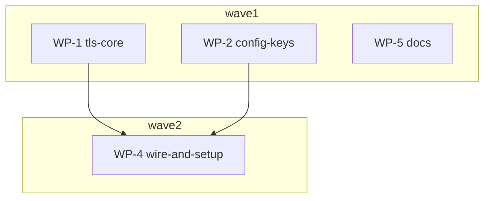

# Plan: Extra CA roots — `extra_ca_certs` config pair and `OCX_EXTRA_CA_CERTS`

## Status

- **Plan:** plan_extra_ca_certs
- **State:** executing <!-- planning → plan-approved → executing → review → done -->
- **Tier:** high
- **Tier-grammar:** 5
- **Effective-tier:** derived
- **Active phase:** 8 — fold fix pass over delta review round 1 (`.tmp/hex/ca448-fold/hex-review-fold.md`): 2 Block + 3 High + D1/D2 folded in + 10 Warn applied as 10 commits on top of `bde09d18`; awaiting the orchestrator's re-review
- **Step:** fix pass applied → re-review
- **Updated:** 2026-09-15
- **Last update:** 2026-09-15 (fix pass `bb80eae8`..`9831689d`: H1 dry-run read-only, H2 `EditError::Locked` → 75, H3 `UntrustedCertificateHint`, D1 fence writers under the edit lock, D2 `system_locked` status, W1–W10 + deferred D3 docs sentence; clippy clean, nextest 8049/8049, acceptance 106/106 over the four files, claude:tests 51, website:build green)
- **Next:** /hex-review .claude/artifacts/plan_extra_ca_certs.md --base=bde09d18 (delta round 2 over the fix pass)
- **Reviewed:** bde09d183ae31700241a282ec40c49cef359665d
- **Verify-default:** scoped

---

## Overview

**Status:** Approved
**Author:** hex-plan orchestrator (tier high, trimmed: research=skip, architect=inline, adversary=off), 2026-09-13
**Design record:** inline (this file, § Design) — settled with the owner in session before planning
**Related issues:** [ocx#448](https://github.com/ocx-sh/ocx/issues/448); installer handover [ocx-sh/www-setup#23](https://github.com/ocx-sh/www-setup/issues/23)
**Research:** skipped — design settled in session; discovery by 4 explorers, review by spec + security seats, all cited inline

### Classification

- **Scope:** small–medium (1–3 days)
- **Reversibility:** two-way for the code. Published interfaces: the two config keys, the env var, the `ocx self setup --format json` `extra_ca_certs` object, the new exit-code rows, and — one-way-door (medium) — `extra_ca_certs_pem` inside managed-config packages: a key whose name changes must ship under a new tag family with the old tag still served (`adr_managed_config_tier.md` key-evolution rule), never as a bare rename, or every consumer silently drops the fleet's CA.
- **Tier:** high (trimmed) — 4 subsystems, trust-anchor code under `crates/ocx_lib/src/oci/**` (always-on `reviewer:security`)
- **Overlays:** architect=inline, research=skip, adversary=off

## Objective

Let ocx trust a corporate CA on every platform, durably: one additive trust-anchor
setting that (1) lives in `config.toml` at any tier including the managed one, (2) can be
handed in by the installer through one env var and is persisted by `ocx self setup`, and
(3) is appended to — never replaces — the platform store and the bundled Mozilla roots.

Today the installer exports `SSL_CERT_FILE`, which reqwest's platform verifier reads only
on Linux/BSD (`rustls-platform-verifier` `others.rs` → `rustls-native-certs`), where it
*replaces* the system store, and which dies with the install shell. Windows and macOS
ignore it entirely.

## Scope

### In scope

- Config keys `extra_ca_certs` (path) / `extra_ca_certs_pem` (inline), top-level, every
  `config.toml` tier (never `ocx.toml`).
- Env var `OCX_EXTRA_CA_CERTS` (path or inline PEM), row-8 precedence.
- One validating choke point, then appending into every outbound TLS client (registry
  transport, index static-file client, Sigstore client, forge HTTP client).
- `ocx self setup`: persist the env value as `extra_ca_certs_pem` into `$OCX_HOME/config.toml`.
- `ocx config push`: inline a path-form key; managed-tier guard for the path form.
- ADR amendment (`adr_managed_config_tier.md` "Security posture"), docs (configuration,
  environment, command-line, user-guide), JSON schema regen.
- www-setup handover issue (env var contract).

### Out of scope

- A `--extra-ca-certs` flag on `ocx self setup` / `ocx config setup` (env covers installer +
  CI; add when a caller cannot set env — YAGNI).
- Clearing via CLI (`OCX_EXTRA_CA_CERTS=""` is "unset", like `OCX_MANAGED_CONFIG=""`); a
  persisted key is removed by editing `config.toml`.
- Forwarding the CA to the `git` subprocess (`forge/git_command.rs` passes
  `SSL_CERT_FILE`/`GIT_SSL_CAINFO` through from the parent env; unchanged).
- Per-registry CA pinning (`[registries.<ns>] ca`). A host-wide trust set is the ask.
- DER input. PEM only, like every other trust-material key.
- Root fingerprints in the setup / `config update --check` reports (fleet audit) — add
  when asked; the `certificates` count is the v1 signal.

## Design

### Key decisions

| # | Decision | Rationale |
|---|---|---|
| D-1 | Two top-level keys `extra_ca_certs` (path) / `extra_ca_certs_pem` (inline), mirroring `[trust.sigstore] trusted_root` / `trusted_root_json` (`crates/ocx_lib/src/trust.rs:143-152`) one-for-one: cross-tier XOR on merge, **both in one file is ambiguous → refused**, relative path anchored at the declaring file, path form stripped from a managed payload, `config push` inlines, exit-code parity (74 unreadable or over-size path / 65 malformed file bytes / 78 malformed or over-size inline text, ambiguity). | Owner's ask; only precedent in the tree (`oci/verify/trust_resolve.rs:103-107`, `error.rs:757-786`); no content-sniff in TOML. |
| D-2 | "Extra" in every name. Roots are **appended** to platform store + Mozilla set, never replacing. Verified additive on all three verifier backends (rev-sec: `others.rs:81-115`, `windows.rs:656-668`, `apple.rs:170-180`); no path disables hostname verification. | `NODE_EXTRA_CA_CERTS` / rustls `extra_roots` read additive; `CURL_CA_BUNDLE` / `REQUESTS_CA_BUNDLE` read replace. |
| D-3 | Across tiers: ordinary replace (env > `--config` > managed > home > user > system). No union special-case. | One merge rule for every key; owner decision. |
| D-4 | `OCX_EXTRA_CA_CERTS` is one env var carrying a path **or** the PEM text; a value containing `-----BEGIN` is text (the installer's own content sniff, `www-setup/src/install.sh:712`). | One var is what an installer can export; a path can never contain `-----BEGIN`. |
| D-5 | `ocx self setup` persists **inline PEM only** (`extra_ca_certs_pem`), reading a path value at that moment. | The installer's path is a `mktemp` file deleted on exit; a persisted path would dangle immediately. |
| D-6 | The managed-config fetch client (`context.rs::build_managed_config_client`, local-only config view per `adr_managed_config_tier.md` "Mirror posture"; single consumer `context.rs:460`, registry-only `managed_config/persistence.rs:253`) gets the **local** trust set (system/user/home tiers + env) — never the managed payload's own CA. | The refresh channel can never be secured by material it delivered. |
| D-7 | `extra_ca_certs_pem` from a managed payload is honoured **without** a digest-pinned source for the registry, index and forge clients; the **Sigstore client** receives managed-tier roots only behind a digest-pinned source (local tiers + env always). Residual recorded as an ADR amendment. | rev-sec verdict: without network position a tag-mover gains nothing from a root (signature verification never consults TLS roots), unlike `trusted_root_json` / `fulcio_url`; with network position the root impersonates every dialled host — for registry/index traffic that is strictly weaker than the already-accepted unpinned `insecure = true` (`adr_managed_config_tier.md:334-388`), for Sigstore it reaches the OIDC identity token `fulcio_url` is gated to protect. See [NEEDS CLARIFICATION 1]. |
| D-8 | Not in `OcxConfigView` / `apply_ocx_config`, not in `CREDENTIAL_KEYS`. A child `ocx` under an inherited env sees the same variable; under `ocx exec --clean` (`Env::clean`, `env.rs:645`) and the launcher it spawns, an **env-only** CA does not reach the child — the config form does, because the child re-reads disk. Documented on the key's doc comment and in `environment.md`. | Same posture as `OCX_INSECURE_REGISTRIES` / `OCX_SIGSTORE_TRUSTED_ROOT` (not forwarded). Forwarding an inline PEM would exceed Windows' 32 767-char per-variable limit and land in every launched tool's env; a CA is public, so scrubbing would be wrong too. |
| D-9 | Trust material is validated at **one choke point** (C-004) before any `ClientBuilder` sees it, and every failure is fail-closed at `Context` init. | The existing builders degrade on a failed build — fork `Client::new` falls to `..Default::default()` dropping the SSRF resolver pin (`external/rust-oci-client/src/client.rs:525-537`), the index client retries with **no roots** (`ocx_index.rs:257-274`), Sigstore falls to `reqwest::Client::new()` (`endpoint.rs:110-124`). Those arms are unreachable only while roots are compile-time constants; user input makes them reachable (CWE-636, CWE-918). Rejecting before build keeps them unreachable. |
| D-10 | Cap `MAX_EXTRA_CA_CERTS_BYTES = 32 KiB`; every path read goes through `utility::fs::read_bounded` (`utility/fs/bounded_read.rs:66`) — refuses non-regular files, stops at cap+1. Only `CERTIFICATE` PEM blocks; any other tag refuses. | `MAX_CONFIG_SIZE` is 64 KiB (`loader.rs:26`) — a 64 KiB value would make `config.toml` unloadable; 32 KiB also sits under the Windows env limit. `read_bounded` is the repo's own fix for `--key file:/dev/zero` (CWE-400). `reqwest::from_pem_bundle` silently skips non-certificate sections, so the tag check is load-bearing; a pasted private key must never be silently ignored. |
| D-11 | Error messages carry the source (env name, path, tier), a byte count and a block index — **never content**. A path longer than 256 bytes or containing a newline renders as `OCX_EXTRA_CA_CERTS (<N> bytes, not a readable path)`. | An operator who exports the wrong secret into the variable must not see it echoed into CI logs (CWE-532). |
| D-12 | **System-scope lock (ocx#469, 2026-09-15).** A pair set in `/etc/ocx/config.toml` locks as one unit (`Config::extra_ca_certs_system_locked`, set iff the system file sets either key): every lower tier's pair AND `OCX_EXTRA_CA_CERTS` are ignored with a warning that names the tier or variable, never a value; the pair survives `OCX_NO_CONFIG`. Supersedes the system-weakest half of D-3. | Owner decision (2026-09-15); mirrors the `[registry]` / `[records]` lock shape (`adr_managed_config_tier.md` "Amendment (2026-09-15)"). |

### Component contracts

Numbered; every ID is a coverage join key.

**C-001 `Config` fields.** `crates/ocx_lib/src/config.rs`, beside `toolchain_dir` (`:216`):
`pub extra_ca_certs: Option<PathBuf>` and `pub extra_ca_certs_pem: Option<String>`, both
`#[serde(default)]`, `schemars::JsonSchema` via the existing derive, doc comments written for
the generated schema (schemars copies them verbatim; the D-8 forwarding note lives on the
env-key constant, not here). `Config::merge`: if `other` sets either field, both are taken
from `other` (XOR, `trust.rs:225-228` shape). Load-time: `extra_ca_certs` relative →
anchored at the declaring file's directory via `FileReference::parse(..).anchored_at(dir)`
(`trust.rs:256-263` shape, hooked where `sigstore.anchor_relative_root(dir)` is called,
`config/loader.rs:1505`). Both keys accepted at every `config.toml` tier including
`OCX_CONFIG`/`--config`. The project tier `ocx.toml` (`ProjectConfig`, `loader.rs:1486`) is
a different type and carries neither key — a cloned repository can never add a root.

**C-002 Managed-tier guard.** `ConfigLoader::guard_managed_sigstore_trust` (`loader.rs:504`)
gains a sibling arm (same function, one call site `loader.rs:460`): a managed payload's
`extra_ca_certs` (path form) is `take()`n with the existing "cannot name a file on this
machine — publish with `ocx config push`" `log::warn!`; `extra_ca_certs_pem` is kept
regardless of pinning (D-7). The arm's doc comment states why `_pem` is honoured where
`trusted_root_json` is not (no signature-verification bypass; needs network position) so a
later reviewer does not "fix" it. The Sigstore-only pin rule is applied at C-005, not here.

**C-003 Publish-time inlining.** `managed_config/publish.rs::inline_trusted_root` (`:319`)
gets a sibling for `extra_ca_certs` → `extra_ca_certs_pem`, run from `publish_managed_config`
(`:404-424`, after validation — `validate_managed_config_payload` stays pure/sync and shared
with `preview.rs:61`). Read via `read_bounded` (D-10); NotFound → 79, PermissionDenied → 77,
other I/O → 74 (reuse the `TrustedRootReadFailed` variant shape, `publish.rs:202-206`);
content failing C-004 → 65. Both keys in the payload → `AmbiguousExtraCaCerts` (78) in
`validate_managed_config_payload`, beside `AmbiguousTrustRoot` (`:281-286`), so `ocx config
test` refuses it too. **After** inlining, the payload size is re-checked against
`MAX_MANAGED_CONFIG_BYTES` (`managed_config.rs:64`) — this closes the same gap for the
`trusted_root` sibling.

**C-004 `tls::ExtraRoots` — the single choke point.** New in
`crates/ocx_lib/src/tls.rs` (moved there from `utility/tls.rs` in fix round 2, DX-20;
`utility::tls` keeps `seed_embedded_roots` only):

```rust
pub const MAX_EXTRA_CA_CERTS_BYTES: usize = 32 * 1024;
#[derive(Clone, Default)]
pub struct ExtraRoots(Vec<pki_types::CertificateDer<'static>>);   // DER, may be empty
pub enum ExtraRootsSource { Env, EnvPath(PathBuf), ConfigPath(PathBuf), ConfigInline(ConfigTier) }
impl ExtraRoots {
    /// The only constructor from bytes. Every CA byte passes here before any ClientBuilder.
    pub fn parse_pem(pem: &[u8], source: &ExtraRootsSource) -> Result<Self, TlsError>;
    pub fn seed(&self, builder: reqwest::ClientBuilder) -> reqwest::ClientBuilder; // tls_certs_merge
    pub fn der(&self) -> &[pki_types::CertificateDer<'static>];  // for the fork's Certificate { Der, data }
    pub fn len(&self) -> usize; pub fn is_empty(&self) -> bool;
}
pub enum TlsError { TooLarge{origin,..}, NotACertificate{origin,tag}, Empty{origin}, Malformed{origin,index}, Truncated{origin,index}, Unreadable{origin,io} }  // DX-6: no Ambiguous; DX-9: origin, not path; DX-20: Truncated
```

`parse_pem` in order: size > cap → `TooLarge`; enumerate blocks with the `pem` crate
(direct dep) — any tag ≠ `CERTIFICATE` → `NotACertificate { tag }`; zero blocks →
`Empty`; each block → `x509_cert::Certificate::from_der` → `Malformed { index }`; finally
one **probe build** `reqwest::Client::builder().tls_certs_merge(..).build()` — `Err` →
`Malformed { index: None }`. The probe is the platform-exact acceptance (webpki / CryptoAPI /
Security.framework) that keeps D-9's fallback arms unreachable. `seed` uses
`tls_certs_merge` (`add_root_certificate` is deprecated in reqwest 0.13). Display per D-11.
`TlsError: ClassifyExitCode` — `Unreadable` → 74 (every `BoundedReadError`, `TooLarge` and
`NotRegularFile` included, maps here for a file source — parity with `trust_resolve.rs:85-89`),
`Malformed`/`NotACertificate`/`Empty` from a **file** → 65, the same plus `TooLarge` from
**inline text** (env text, `_pem`) → 78, `Ambiguous` → 78 (parity with `[trust.sigstore]`, `oci/verify/error.rs:757-786`); registered
in the chain walker `crates/ocx_lib/src/cli/classify.rs` `try_downcast!` list (`:152-232`)
or 78 is unreachable from `Context::try_init`. `seed_embedded_roots` is unchanged.

**C-005 Resolution ladder and the three root sets.** `resolve_extra_roots` +
`sigstore_extra_roots` in `ocx_lib::tls` (`crates/ocx_lib/src/tls.rs`, lib-hosted in fix
round 2 — DX-20), called from `Context::try_init` (`crates/ocx_cli/src/app/context.rs`):
`resolve_extra_roots(config: &Config, env: Option<&str>, tier: Option<ConfigTier>) -> Result<ExtraRoots, TlsError>` —
env set and non-empty → sniff `-----BEGIN` → inline text (source `Env`), else path →
`read_bounded` (`EnvPath`) → C-004; env unset or `""` → config: both keys set →
`Ambiguous`; `extra_ca_certs_pem` → C-004 (`ConfigInline(tier)`); `extra_ca_certs` →
`read_bounded` (`ConfigPath`) → C-004; neither → empty. (DX-6: the both-keys case is refused
by the loader per file; the merged config never carries both.) Evaluated in `Context::try_init`
for **three views**, all stored on `Context`: `merged` (the tiered config; registry, index,
forge); `local` (the local-only view D-6 already builds for the managed client); `sigstore`
= `merged` when the resolved `[managed] source` carries a digest **or** the managed payload
set neither key — computed as `merged.{extra_ca_certs, _pem} == local.{…}`, no per-key tier
provenance exists and none is added — else `local` (D-7). `ExtraRootsSource::ConfigInline`
carries the tier derived from which view won, not a loader stamp. A `TlsError` from any view aborts init (D-9).
`OCX_EXTRA_CA_CERTS` constant + doc comment in `env::keys` (`env.rs:145` style: path-or-text,
`=""` is unset, **not** forwarded — D-8 text verbatim).

**C-006 Registry transport.** `oci::ClientBuilder::extra_roots(ExtraRoots)` (setter beside
`ssrf_guard`, `oci/client/builder.rs`); `TransportRecipe::config()` (`:118-131`) appends
`oci::native::Certificate { encoding: Der, data }` per DER onto `extra_root_certificates`
(`external/rust-oci-client/src/client.rs:3052-3098`) after the `..Default::default()` spread —
`root_certificate_count()` = Mozilla count + N. `Context::client_builder()` (`context.rs`,
the one recipe every registry client of an invocation is built from — fix round 2, DX-20)
pre-applies `merged`; `build_managed_config_client` passes `local`.

**C-007 Hand-rolled reqwest clients.** `build_index_http_client` (`oci/index/ocx_index.rs:243`)
and `build_forge_http_client` (`forge/http.rs:33`) take `&ExtraRoots` and chain `.seed()`
after `seed_embedded_roots` (callers: `ocx_index.rs:250`, `forge/http.rs:38`; `OcxIndexConfig`
gains an `extra_roots` field so the struct literals in `package/cascade/gather.rs:367,827`
carry it; forge callers `forge/github.rs:112`, `forge/gitlab.rs:240` thread it from their
config). The Sigstore client is a zero-arg process-wide `OnceLock`
(`sigstore_http_client()`, `endpoint.rs:108-125`, 4 call sites) that reads `proxy_rules()` (a
`LazyLock` global, `ssrf.rs:530-533`); it gets the same shape: `tls::install_sigstore_roots(ExtraRoots)`
— a `OnceLock<ExtraRoots>` set exactly once from `Context::try_init` **before** any Sigstore
call; `sigstore_client_builder(roots: &ExtraRoots)` stays a pure function (the test seam) and
the `OnceLock` initializer passes the installed set (empty when never installed, e.g. unit
tests). A second install is a no-op.

**C-008 `ocx self setup` persistence.** New phase **0.5** in `setup::run` (`setup.rs:312`),
before bootstrap (no network; a later fetch failure leaves the CA persisted, which is
wanted). Input: `OCX_EXTRA_CA_CERTS` only (no flag — Out of scope). Behaviour: resolve as
C-005's env arm (a path is read now via `read_bounded`, D-5/D-10) → C-004 → render the
document with `toml_edit::DocumentMut` (the `shell_config::set` mechanism,
`setup/shell_config.rs:95-138`; root-level values render before every `[table]` regardless of
insertion order, `toml_edit` `encode.rs:222`, so no hoist) setting root `extra_ca_certs_pem`
and removing a root `extra_ca_certs` if present (XOR) → refuse (78, before any write) when
the rendered document exceeds `MAX_CONFIG_SIZE` → write via the existing atomic 0o600 path.
Diff-gated on the **parsed TOML string** (CRLF PEM escapes `\r`), not file bytes: identical
→ no write. Idempotent. Must not disturb a `[managed]` rc-block fence (`rc_block::classify`
still `Clean`). Env unset → no-op. `--dry-run` reports without writing. Invalid value →
exit per C-004 before any phase writes (byte-identical machine, same posture as the
session-PATH preflight). `ocx config setup` does **not** run this phase.

**C-009 Setup report.** `SelfSetupData` (`api/data/self_setup.rs:335`) gains
`extra_ca_certs: ExtraCaCertsEntry { status, certificates? }` — always present,
`ManagedConfigEntry` shape (`:210-252`). `status` ∈ `persisted | unchanged | not_configured`;
under `--dry-run` `would_persist | unchanged | not_configured` (the report's own convention,
`:227-239`). `certificates` = N when a value was resolved. `reload_hint` unaffected.

**C-010 Exit codes.** Per C-004's classification: 74 / 65 / 78; publish-side 79 / 77 / 74 /
65 / 78 (C-003). `setup/error.rs:113` map gains the wrapping variant delegating to
`TlsError::classify` via the source chain. No new codes.

**C-011 Schema.** `task schema` regenerates `website/src/public/schemas/config/v1.json`
from the derive (`crates/ocx_schema/src/lib.rs:73`). The file is **generated and gitignored**
(`website/.gitignore:19`), never committed — the gate is `task schema` succeeding and the
two new keys appearing in its output with their doc comments (DX-1).

**C-012 www-setup contract** (documented here, implemented there):
`install.{sh,ps1,fish,nu,elv}` export `OCX_EXTRA_CA_CERTS="$OCX_INSTALL_CA_BUNDLE"` **raw**
(path or PEM, no temp-file materialisation needed for ocx) before `ocx self setup`; keep the
`SSL_CERT_FILE` export for older binaries; fix the `install.ps1` comment claiming
`SSL_CERT_FILE` reaches `ocx self setup` on Windows (it does not).

**C-013 ADR amendment.** `adr_managed_config_tier.md` "Security posture" gains a dated
amendment in the register the `insecure = true` amendment used (`:334-388`): an unpinned
managed publisher can add a trust root; combined with an on-path party (a corporate CONNECT
proxy included) it impersonates every TLS endpoint ocx dials except the Sigstore client, which
takes managed roots only behind a digest pin; the hard guarantee is a digest-pinned
`[managed] source`; unlike `insecure`, no system-scope lock — a deliberate non-feature, see the
ADR amendment.

### User-experience scenarios

- **S-001 Installer hand-off.** `OCX_INSTALL_CA_BUNDLE=/tmp/corp.pem` → installer exports
  `OCX_EXTRA_CA_CERTS` → `ocx self setup` bootstraps from the corp registry over TLS, then
  `$OCX_HOME/config.toml` opens with `extra_ca_certs_pem = """-----BEGIN CERTIFICATE-----…"""`
  above every `[table]`; report `extra_ca_certs.status = "persisted"`, `certificates = 1`.
  Re-run: `"unchanged"`, file unchanged. `--dry-run`: `would_persist`, nothing written.
  Errors: a `PRIVATE KEY` block in the value → 78 naming `OCX_EXTRA_CA_CERTS` and never echoing
  the value (DX-17); a path value that is `/dev/zero` → 74 promptly; a value whose rendered
  `config.toml` would exceed 64 KiB → 78; in every case nothing written.
- **S-002 Every later command trusts the CA.** With that config, `ocx index update`
  against an HTTPS index signed by the corp CA succeeds; without the key the same command
  fails with the TLS `UnknownIssuer` error (exit 69). Windows and macOS behave identically
  (unit-tier handshake proof, verify-deep matrix).
- **S-003 Managed fleet.** Operator writes `extra_ca_certs = "corp-ca.pem"` in the source
  config; `ocx config test` validates it; `ocx config push` publishes
  `extra_ca_certs_pem`; workstations adopting by tag get the CA for registry, index and
  forge traffic on the next refresh; Sigstore traffic uses it only when the seed is
  digest-pinned (D-7). Errors: `ocx config push` with a missing path → 79 naming the path;
  both keys in the payload → 78 from `config test` and `push`.
- **S-004 Managed payload with a path form** (published by another route): the key is
  dropped with the existing consumer-side warning; nothing else changes.
- **S-005 Precedence.** `OCX_EXTRA_CA_CERTS` set → wins over every file tier; a
  `$OCX_HOME` key wins over the user tier; a managed key wins over both — unless the
  system file sets the pair, which then locks it against every lower tier and the env
  (D-12; the rows that used to drive the system tier now drive `OCX_CONFIG`/home);
  `OCX_EXTRA_CA_CERTS=""` behaves as unset; `ocx.toml` carrying either key is refused as an
  unknown key (DX-7).
- **S-006 Managed refresh isolation (D-6).** A managed payload's CA is never used by the
  client that fetches the managed config; the local set is.
- **S-007 Misconfiguration is loud and fail-closed.** `extra_ca_certs = "/nonexistent.pem"`
  in any tier → every command exits 74 with the path in the message, including under
  `--offline`; a `CERTIFICATE` block the platform verifier rejects (a v2 root, DX-10) → 65 (file) /
  78 (inline) — never a built client with fewer roots than configured.

### Error taxonomy

| Condition | Error | Exit |
|---|---|---|
| path unreadable / not a regular file / FIFO / device (config or env) | `TlsError::Unreadable { path, io }` | 74 |
| value > 32 KiB — from a file (`read_bounded` `TooLarge`, parity with `[trust.sigstore]`, `trust_resolve.rs:85-89`) | `TlsError::Unreadable { path, io }` | 74 |
| value > 32 KiB — inline (env text, `_pem`) | `TlsError::TooLarge { source, bytes }` | 78 |
| PEM block with tag ≠ `CERTIFICATE` — file / inline | `TlsError::NotACertificate { source, tag }` | 65 / 78 |
| no certificate block — file / inline | `TlsError::Empty { source }` | 65 / 78 |
| block rejected by `x509_cert` parse or the probe build — file / inline | `TlsError::Malformed { source, index }` | 65 / 78 |
| PEM block with `-----BEGIN ` and no `-----END` — file / inline | `TlsError::Truncated { origin, index }` | 65 / 78 |
| managed payload `extra_ca_certs_pem` this host's verifier refuses — at adoption (`config update`, setup phase 1.5, apply tick) | `ManagedConfigPersistError::ExtraCaCertsInvalid { source: TlsError }`; previous snapshot kept | 78 (update / first adoption); warn, exit 0 (tick / setup re-run) |
| both keys set in one file (load) / in the payload (publish, `config test`) | `TlsError::Ambiguous` / `AmbiguousExtraCaCerts` | 78 |
| publish-side path NotFound / PermissionDenied / other I/O | `TrustedRootReadFailed`-shaped variant | 79 / 77 / 74 |
| rendered `config.toml` would exceed `MAX_CONFIG_SIZE` (setup) | setup error, before write | 78 |
| managed payload path form | warning, key dropped | — |
| TLS still fails (wrong CA) | transport error carrying the extra-CA remedy (`UntrustedCertificateHint`) | 69 |

### Edge cases

- Bundle with 2+ certificates → all appended (`certificates = N`).
- CRLF PEM, leading comment lines / `subject=` labels before `-----BEGIN` (Fedora/RHEL
  bundles) → accepted (the `pem` crate skips leading text); the persisted `"""` string
  carries escaped `\r` — the idempotence check compares parsed strings.
- Windows env value limit 32 767 chars — the 32 KiB cap sits at it; a larger bundle uses
  the path form or config.
- `OCX_NO_CONFIG=1` → config tiers skipped; env still applies.
- `--offline` → still resolved and validated (D-9); no network needed to fail.
- Windows consults extra roots only after the platform chain fails (`windows.rs:656-668`);
  same revocation policy applies. Documentation nuance only.
- Managed payload sets neither key → `sigstore` view == `merged` (nothing to gate).

## Parallelization

Work packages for parallel execution in `.agents/worktrees/<wp-slug>`; base `goat` tip at
plan approval. WP-3 (context wiring, ~60 lines, one hub file) is folded into WP-4 as its
first step — below the overhead floor and it depends on both wave-1 code WPs.

| WP | Repo | Scope (C-/S-) | Expected files | Size | Wave | Depends-on | Review | Verify | Status |
|---|---|---|---|---|---|---|---|---|---|
| WP-1 tls-core | . | C-004, C-006, C-007, S-002 (unit tier), S-007 (unit tier) | `crates/ocx_lib/src/utility/tls.rs`, `crates/ocx_lib/src/cli/classify.rs`, `crates/ocx_lib/src/oci/client/builder.rs`, `crates/ocx_lib/src/oci/index/ocx_index.rs`, `crates/ocx_lib/src/oci/endpoint.rs`, `crates/ocx_lib/src/forge/http.rs`, `crates/ocx_lib/src/forge/github.rs`, `crates/ocx_lib/src/forge/gitlab.rs`, `crates/ocx_lib/src/package/cascade/gather.rs`, `Cargo.toml`, `Cargo.lock`, `crates/ocx_lib/Cargo.toml` (dev-dep `tokio-rustls`, `default-features = false`) | M | 1 | — | sec | scoped | merged |
| WP-2 config-keys | . | C-001, C-002, C-003, C-011, C-013, S-003, S-004, S-005 (file tiers) | `crates/ocx_lib/src/config.rs`, `crates/ocx_lib/src/config/error.rs` (DX-3), `crates/ocx_lib/src/config/loader.rs`, `crates/ocx_lib/src/managed_config/publish.rs`, `.claude/artifacts/adr_managed_config_tier.md`, `test/tests/test_config_push.py`, `test/tests/test_config_test.py` | M | 1 | — | sec | scoped | merged |
| WP-4 wire-and-setup | . | C-005, C-006 (call sites), C-007 (install), C-008, C-009, C-010, S-001, S-002 (acceptance), S-005 (env), S-006, S-007 (acceptance) | `crates/ocx_cli/src/app/context.rs`, `crates/ocx_lib/src/env.rs` (keys const), `crates/ocx_lib/src/setup.rs`, `crates/ocx_lib/src/setup/error.rs`, `crates/ocx_lib/src/setup/shell_config.rs` (only if the writer is generalised), `crates/ocx_cli/src/command/self_group/setup.rs`, `crates/ocx_cli/src/api/data/self_setup.rs`, `crates/ocx_lib/src/forge/kind.rs` (DX-5), `crates/ocx_cli/src/command/package_announce.rs`, `crates/ocx_cli/src/command/package_claim.rs` (DX-13), `crates/ocx_lib/src/oci/index/ocx_index.rs` (DX-14), `crates/ocx_lib/src/cli/classify.rs` (tests, DX-15), `crates/ocx_lib/src/config/loader.rs` (tier accessor + `MAX_CONFIG_SIZE` visibility, DX-16), `test/src/tls_index.py` (new), `test/tests/test_self_setup.py`, `test/tests/test_extra_ca_certs.py` (new) | M | 2 | WP-1, WP-2 | sec | full | merged |
| WP-5 docs | . | C-012 text, D-7/D-8 prose, every S- as prose | `website/src/docs/reference/configuration.md`, `website/src/docs/reference/environment.md`, `website/src/docs/reference/command-line.md`, `website/src/docs/user-guide.md` | S→M (4 files) | 1 | — | docs | scoped | merged |



**Critical path:** WP-1 → WP-4 (WP-2 is the same length; either may gate).
**Shippable after wave:** 2 — nothing user-visible ships before WP-4 wires the parsed roots
into `Context`. WP-5 lands in wave 1 against this plan's contracts; `doc-reviewer` at the
WP-4 merge checks the rendered report fields against the docs.
**Merge plan (serialized, topological):** WP-1, WP-2, WP-5, then WP-4 — `cargo check` + the
WP's `Verify` after each.
**Build slot:** WP-1 and WP-2 are the only build-capable wave-1 workers (host limit 2).

## Implementation steps

> Contract-first TDD per WP: Stub → Specify → Implement → Review. Tests are written from the
> contracts above, not from the stubs.

### WP-1 tls-core

- Stub: `ExtraRoots`, `ExtraRootsSource`, `TlsError` + `ClassifyExitCode` + `try_downcast!`
  registration (`cli/classify.rs`); `ClientBuilder::extra_roots`; `&ExtraRoots` on
  `build_index_http_client` / `build_forge_http_client` (+ `OcxIndexConfig.extra_roots`,
  forge config threading); `install_sigstore_roots` + `sigstore_client_builder(&ExtraRoots)`.
  Callers pass `ExtraRoots::default()` until WP-4 wires them.
- Specify (unit, `utility/tls.rs`): two-cert bundle → 2; CRLF + leading `subject=` line →
  1; `PRIVATE KEY` block → `NotACertificate`; empty → `Empty`; cap + 1 → `TooLarge`;
  base64 of non-DER inside `CERTIFICATE` → `Malformed`; **a `CERTIFICATE` block the verifier
  rejects** (a v2 certificate — DX-10 — hand-assembled from `x509_cert::TbsCertificate`, no
  extensions) → `Malformed` from the probe — `#[cfg(not(any(windows, target_os = "macos")))]`:
  only webpki refuses v2 roots, CryptoAPI and Security.framework accept them, so the case is
  Linux-only by design; the malformed-DER case stays cross-OS; mutation: delete the probe →
  the v2 case reds on Linux; Display
  of every variant contains no PEM bytes and truncates a 300-byte pathless value per D-11.
  `builder.rs`: `root_certificate_count()` == Mozilla + 2 after `.extra_roots(..)`.
  `endpoint.rs`: `sigstore_client_builder` seeded from an installed set (test seam).
  **Handshake (the cross-OS proof):** an in-process `tokio-rustls` server with a leaf minted
  by the existing `x509-cert` recipe (`oci/verify/trust_root.rs:326-354`, add SAN
  `localhost`) signed by a minted test root; a reqwest client seeded via `.seed()` → 200; the
  same client without it → error chain contains `UnknownIssuer`. Both outcomes in one test.
- Implement: as C-004/C-006/C-007; `/deps` check for the dev-dep edge.
- Review: spec + security (every CA byte passes C-004 before any builder; no fallback arm
  reachable from CA input).

### WP-2 config-keys

- Stub: fields (C-001), merge arm, anchor hook, guard arm (C-002), inline sibling +
  `AmbiguousExtraCaCerts` + post-inline size check (C-003), ADR amendment (C-013).
- Specify: `config/loader.rs` tests beside `managed_tier_ignores_a_path_form_trusted_root`
  (`:4817`): path form dropped + warning; `_pem` kept from an **unpinned** source; relative
  path anchored to the declaring dir; tier precedence for both keys; XOR — a higher tier
  setting `_pem` clears a lower tier's path; both keys in one file → `Ambiguous` (78);
  `ocx.toml` carrying either key → refused as an unknown key (DX-7). `publish.rs`: path inlined via `read_bounded`,
  missing → 79, both keys → 78, inlined payload over `MAX_MANAGED_CONFIG_BYTES` → refused.
  Acceptance: `test_config_push.py` (path → `_pem` in the published payload; missing path →
  79), `test_config_test.py` (both keys → 78; clean `_pem` payload reports nothing).
- Implement; run `task schema` and assert both keys render (DX-1: the JSON is generated, gitignored).
- Review: spec + security (guard parity with the sigstore arm; no `deny_unknown_fields`).

### WP-4 wire-and-setup

- Step 1 (folded WP-3): `resolve_extra_roots` (C-005) for the three views, stored on
  `Context`; pass `merged`/`local` to the two registry builders (C-006), `merged` to the
  index and forge clients (C-007), `sigstore` to `install_sigstore_roots` before any client
  is built; `env::keys::OCX_EXTRA_CA_CERTS` constant + D-8 doc comment.
- Step 2: setup phase 0.5 (C-008), report entry (C-009), exit-code map (C-010).
- Specify: `test/src/tls_index.py` — `StaticIndexServer` (`test/src/static_index.py:305`)
  wrapped with `ssl.SSLContext.wrap_socket`, CA + leaf (SAN `IP:127.0.0.1`) minted with
  `cryptography` (already a test dep) at fixture time. `test_extra_ca_certs.py`: S-002
  red/green (`ocx index update` against the HTTPS index with and without
  `OCX_EXTRA_CA_CERTS`; `[registries."corp"] index = "https://127.0.0.1:<port>/"`), S-005
  (env vs `$OCX_HOME` key; `=""` is unset), S-007 (`/nonexistent.pem` → 74 also with
  `--offline`; `OCX_EXTRA_CA_CERTS=/dev/zero` → 74 promptly). `test_self_setup.py`: S-001
  (path value persisted inline above the first table; re-run unchanged; inline value;
  garbage → 78 and `config.toml` byte-identical; `--dry-run` reports `would_persist` and
  writes nothing; over-size rendered document → 78; a pre-existing `[managed]` fence stays
  `Clean` — assert via a following `ocx config setup` not exiting 82). Unit (context.rs):
  S-006 — the managed client's roots come from the local view; D-7 — the sigstore view
  equals `local` when the managed source is unpinned and set `_pem`, `merged` when pinned.
- Implement.
- Review: spec + security + docs (report fields vs `command-line.md`).

### WP-5 docs

- `configuration.md`: `### extra_ca_certs / extra_ca_certs_pem {#keys-extra_ca_certs}`
  after `toolchain_dir` (path vs inline, additive, ambiguity refused, tiers, exit codes;
  managed: path stripped, `_pem` honoured unpinned for registry/index/forge, Sigstore only
  behind a digest pin, the refresh client never uses it; D-8 `--clean` caveat); row in
  `#env-overrides`; `[managed]` section paragraph mirroring C-013.
- `environment.md`: `### OCX_EXTRA_CA_CERTS {#…}` in the `OCX_MANAGED_CONFIG` shape
  (path or PEM, `=""` unset, not forwarded and the `--clean` consequence, `self setup`
  persists it, 32 KiB).
- `command-line.md` § `self setup`: phase list gains 0.5; JSON `extra_ca_certs` object +
  status table incl. `would_persist`; exit-code rows 65/74/78 extended; `config push`
  79/78 rows.
- `user-guide.md` § `#managed-config` (`:977`): "Ship a corporate CA" paragraph;
  § `#mirrors` one-line pointer. No migration prose (pre-1.0).

## Testing strategy

| ID | Test | Tier | WP |
|---|---|---|---|
| C-004 | parse matrix (8 cases incl. verifier-rejected v2 cert (DX-10) — Linux-only — + Display redaction) | unit | WP-1 |
| C-006 | `root_certificate_count` = Mozilla + N | unit | WP-1 |
| C-007, S-002 | tokio-rustls handshake red/green, 3 OSes; sigstore builder seam | unit | WP-1 |
| C-001 | merge XOR, anchor, tier precedence, ambiguity, `ocx.toml` ignored | unit | WP-2 |
| C-002, S-004 | managed guard drops path, keeps `_pem` unpinned | unit + acceptance | WP-2 |
| C-003, S-003 | push inlines / 79 / 78 / post-inline size | unit + acceptance | WP-2 |
| C-005, S-005, S-007 | env ladder, `""`, unreadable → 74, `/dev/zero` | acceptance | WP-4 |
| C-005, C-006, S-006, D-7 | three views: managed client = local; sigstore pinned/unpinned | unit | WP-4 |
| C-008, C-009, S-001 | persist, idempotent, dry-run, fence clean, over-size, 78 | acceptance | WP-4 |
| S-002 | HTTPS static index with/without CA | acceptance (Linux) | WP-4 |
| C-011 | `task schema` regenerates with both keys present (file is gitignored, DX-1) | gate | WP-2 |
| C-013 | ADR amendment present | review | WP-2 |

Mutation proof per WP (builder red/green): delete the probe build → the verifier-rejected
test reds; revert the guard arm → the managed-path test reds; revert the toml_edit write →
S-001 reds; swap the managed client to `merged` → S-006 reds.

## Risks

| Risk | Mitigation |
|---|---|
| A CA that passes parsing but fails the verifier reaches a builder → silent fallback (D-9) | Probe build inside C-004; every builder is fed only an `ExtraRoots` value. |
| toml_edit root-key write lands inside the `[managed]` fence → false-dirty exit 82 | toml_edit renders root values first (`encode.rs:222`); C-008 pins fence `Clean` with a pre-seeded fence test. |
| Sigstore `OnceLock` initialised before roots are installed | Install in `Context::try_init` before any client; unit test on the seam; the 4 call sites are all post-init command code. |
| Docs drift from the final report shape | `doc-reviewer` at WP-4 merge. |

## Open questions

1. `[NEEDS CLARIFICATION: D-7 — honour extra_ca_certs_pem from an unpinned managed source for
   registry/index/forge clients, and gate only the Sigstore client behind a digest pin?]`
   **Recommended: yes to both** — rev-sec's verdict: for registry/index traffic an unpinned
   root is strictly weaker than the already-accepted unpinned `insecure = true`; the Sigstore
   client carries the OIDC identity token that `fulcio_url`'s gate protects, and gating it
   alone costs nothing on the installer path (S-001 delivers the CA locally). Alternatives:
   honour fleet-wide (simpler, one rule; residual reaches Fulcio) or gate everything like
   `trusted_root_json` (tag-adopting fleets never receive a CA).
2. `[NEEDS CLARIFICATION: D-8 — keep OCX_EXTRA_CA_CERTS out of OcxConfigView (env-only CA
   does not survive `ocx exec --clean` → launcher)?]` **Recommended: keep it out** — both
   seats concur; forwarding an inline PEM breaks the Windows per-variable limit and lands in
   every tool env; the config form (which `ocx self setup` writes) survives `--clean`.

## Schedule log

| # | Event | SHA | Gate | Result |
|---|---|---|---|---|
| 13 | fold fix pass over delta review round 1 (`.tmp/hex/ca448-fold/hex-review-fold.md`): B1+B2 `bb80eae8`; H1+H2+D1+W2+W3+W4 `5f1c4a40`; D2+W8 `e2686016`; W7 `1fc5fa71`; H3 `2e7796c4`; W1 `729a291c`; W5 `eb6ff2c7`; W6+W10+H2/D2 docs+D3 sentence `0032b266`; docs wrap fix `9831689d`. Mutation reds quoted in the builder report (H1 dir/lock, H2 Locked→74, H3 hint absent, W1 roots dropped, W2/M5, W4 per-pid lock). Gates: `cargo clippy --workspace --all-targets -D warnings` rc=0; `cargo nextest run --workspace` 8049 passed; `task test:parallel` extra_ca/self_setup/config_push/proxy_registry 106 passed; `task claude:tests` 51 passed; `task website:build` green | 9831689d | scoped + full unit | pass |
| 12 | /hex-finalize: `goat` @ `2dcad4ba` (20 commits) → `feat/extra-ca-certs`, recomposed on the merge-base `03d2ab01` into 5 commits (tree equality vs `backup/feat/extra-ca-certs-2dcad4ba` proven, tree `2148f9b0`), rebased clean onto `origin/main` @ `2cc0f172` (rebased tree `97e7c0c0` = `git merge-tree origin/main backup`): `9338a192` feat(config), `72750dff` feat(tls), `8566045c` feat(setup), `bf2e1c6f` docs(tls), `efe28af6` chore(plan) + this trailing chore(plan); each code commit passes `cargo check --workspace --all-targets`. `task verify --force` on the first push (`e13f79d2`): 8027/8027 unit, 3435/3436 acceptance (known push-mount red); the PR's first CI run (`bb7bcf76`) failed the macOS/Windows smoke build — `mint_v2_root` and its import were ungated while their one consumer is `#[cfg(not(any(windows, target_os = "macos")))]` (DX-10), `dead_code` under `-D warnings` on the first non-Linux build the series ever had — gated the same way and folded into feat(tls); the second CI round then reached the tests and found two more platform-only test defects — the minted test leaf had no `extendedKeyUsage`, which Security.framework's SSL policy refuses (`EkuError`, 9 macOS handshake tests) while webpki/CryptoAPI tolerate its absence, and the whitespace-only env path expected `NotFound` where Windows returns `InvalidFilename` (os error 123) — and, once the seeded halves passed, the unseeded halves' `chain.contains("UnknownIssuer")` at eight sites, which Security.framework spells `“<CN>” certificate is not trusted: -67843` (errSecNotTrusted) — one `test_pki::assert_untrusted_root` accepts both spellings and still refuses a dead server; all folded into feat(tls) (`72750dff`); the Linux gate was re-run on each tip. PR [ocx-sh/ocx#465](https://github.com/ocx-sh/ocx/pull/465); Deep Verify [run 34819739631](https://github.com/ocx-sh/ocx/actions/runs/34819739631) on `e13f79d2` (red: the pre-existing `Index Conformance Drift` — indexbot v0.6.2 owners login/id only, fixed separately in [ocx-sh/ocx#472](https://github.com/ocx-sh/ocx/pull/472) — and the same non-Linux build error), re-dispatched on the final tip. Follow-ups filed: [#466](https://github.com/ocx-sh/ocx/issues/466) publish unbounded read, [#467](https://github.com/ocx-sh/ocx/issues/467) HTTPS_PROXY CONNECT fixture, [#468](https://github.com/ocx-sh/ocx/issues/468) config.toml RMW lock, [#469](https://github.com/ocx-sh/ocx/issues/469) system-scope CA lock, [#470](https://github.com/ocx-sh/ocx/issues/470) TUF client seam, [#471](https://github.com/ocx-sh/ocx/issues/471) polish bundle; www-setup#23 contract comment posted | e13f79d2 | full (`task verify`) + CI | pass |
| 1 | run ca448-exec-1789332668 started; frozen base `8efde4d5`; wave 1 launched (WP-1, WP-2, WP-5) | 8efde4d5 | — | — |
| 4 | WP-2 config-keys merged (post-stub 2 High/4 Warn; Specify 10 red/15 green on declared-real arms; Implement 25/25 + 40/40 acceptance + 3 mutation proofs; L2 seat 1 Warn/1 Suggest applied) | cf840596 | scoped (51/51 extra_ca + cargo check) | pass |
| 5 | wave 2 launched: WP-4 wire-and-setup from cf840596 | cf840596 | — | — |
| 11 | /hex-review xhigh round 2 — FINAL (`reviews/hex-review-r2.md`): Request Changes — 2 Block (docs: installer one-liner never reaches `sh` + www-setup hand-off unshipped; configuration.md shared-lever claim), 1 High (Codex: a managed `_pem` the consumer's verifier rejects bricked every command incl. `config update`), 14 Warn, 21 Suggest; Converged 20/20; round-1 46/46 landed. Fix pass applied Blocks + High (adoption-time `parse_pem` refusal keeps the previous snapshot, DX-20) + O_NONBLOCK FIFO race + 3 test riders + 7 message/docs Warns: `c7d3ac46` (code) + `13fe165b` (docs/plan); `task verify` 8024/8024 unit, 3434/3435 acceptance (known push-mount red). Loop exhausted — remaining Warn/Suggest filed as issues at finalize | 13fe165b | full (`task verify`) | pass |
| 10 | fix round 2 applied (`3e608685`): trust ladder lib-hosted at `crates/ocx_lib/src/tls.rs` (utility::tls keeps `seed_embedded_roots` only), `Context::client_builder()` replaces four identical `oci::ClientBuilder` chains, unused `extra_roots_sigstore` dropped, D-11 residual + webpki anchor notes recorded; mutation proof 11/13 red → 13/13 green; `task verify` 8022/8022 unit, 3433/3434 acceptance (known push-mount red); ≤2-round loop exhausted — round-2 review findings go to follow-up issues | 3e608685 | full (`task verify`) | pass |
| 9 | fix round 1 applied (`08393ad2`): Block + 3 High + 18 Warn + 15 Suggest; `ConfigPath { path, tier }` names the key and tier; FIFO pre-check; `TlsError::Truncated`; ADR levers stated; schema text corrected; `task verify` 8022/8022 unit, 3433/3434 acceptance (known push-mount red). Deferred rulings → round 2: lib-host the ladder (`crates/ocx_lib/src/tls.rs`, consistency doctrine), `Context::client_builder()`, drop the unused `extra_roots_sigstore` accessor, D-11 short-token residual recorded, webpki anchor note; NO change: per-process probe on the warm path (D-9 stands, `--offline` must refuse), `Malformed{None}` wording (DX-11), toml_edit prologue fold (waits for the RMW lock), TUF seam (docs only). Follow-up issues: HTTPS_PROXY CONNECT fixture, config.toml RMW lock, system-scope CA lock, TUF client seam. | 08393ad2 | full (`task verify`) | pass |
| 8 | /hex-review xhigh round 1 (`reviews/hex-review-r1.md`): Request Changes — 1 Block (schema doc text on the wrong key), 3 High (ConfigPath origin unnamed; ADR guarantee wording; reversibility note), 18 Warn, 16 Suggest; 10 deferred; Converged 20/20; Codex skipped (usage limit) | 572cb458 | — | fix round 1 |
| 7 | end-of-run L2 aggregate (20/20 IDs; 1 High chain-leak, 3 Warn, 5 Suggest; deferred High → ruled: validate inline `_pem` at push) + Codex adversary (15 leads: 3 client construction paths without roots — index physical-fetch, announce publisher, login probe — truncated last block, 3 pre-existing) → one fix pass, 5 mutation proofs | c41a01bc | final gate (`task verify`: 8013/8013 unit, 3430/3431 acceptance — known push-mount red) | pass |
| 6 | WP-4 wire-and-setup merged (post-stub 1 Block/5 Warn/8 Suggest; Specify 20 red/4 justified; Implement 80/80 + 75/75 acceptance + 4 mutation proofs incl. the S-006 seam; L2 seat 1 Warn/2 Suggest applied) | b161d857 | full (`task verify`: 8008/8008 unit, 3428 passed / 1 failed acceptance — `test_package_push_mount_cross_repository_reuse`, the known local-registry red) | pass |
| 3 | WP-1 tls-core merged (post-stub review 1 Block/6 Warn; Specify 24 red; Implement 25/25 + 3 mutation proofs; L2 seat 3 Warn/2 Suggest, all applied) | 2050cc4c | scoped (25/25 extra_ca + cargo check) | pass |
| 2 | WP-5 docs merged (L0 grep + raised L1: 1 Block/3 High/3 Warn/5 Suggest, all applied) | 511055d2 | scoped (`task website:build`) | pass |

## Execution deviations

| # | Deviation | Why |
|---|---|---|
| DX-1 | `website/src/public/schemas/config/v1.json` dropped from WP-2's file set; C-011 gate = `task schema` output, not a committed file. | The schema tree is gitignored (`website/.gitignore:19`); nothing to commit. |
| DX-3 | `crates/ocx_lib/src/config/error.rs` added to WP-2's file set. | The loader-side ambiguity refusal (78) needs a variant on `config::error::Error`; no other WP owns the file. |
| DX-4 | C-007 index seam: `ReqwestIndexTransport::with_extra_roots(ExtraRoots)` (setter, before the lazy client build) instead of an `OcxIndexConfig.extra_roots` field; `gather.rs` untouched. | `OcxIndexConfig` is also constructed at `context.rs:996` and `chained_index.rs:5407`; the roots belong on the transport that builds the reqwest client. WP-4 calls the setter at `context.rs:996`. |
| DX-5 | C-007 forge seam: `GitHubForge::with_extra_roots(&ExtraRoots)` / `GitLabForge::with_extra_roots(&ExtraRoots)` rebuild the client; `new()` signatures unchanged. WP-4's file set gains `crates/ocx_lib/src/forge/kind.rs` (the two construction sites). | The forges have no config struct; a `new()` param would ripple into ~10 test constructors. |
| DX-6 | Ambiguity (both keys in one file, 78) has ONE home: the loader's per-file guard raising `config::error::Error::AmbiguousExtraCaCerts { path }`; the XOR merge means the merged config never carries both, so C-005's "both keys set → Ambiguous" arm and `TlsError::Ambiguous { tier }` are dropped. Publish keeps `AmbiguousExtraCaCerts` (78) for the payload. | Two homes for one taxonomy row is drift; the sigstore sibling's resolve-time check has nothing to see here. |
| DX-7 | `ocx.toml` carrying either key is **refused as an unknown key** (`ProjectConfig` is `deny_unknown_fields`), not silently ignored; S-005 / the WP-2 Specify row assert the refusal. | Stronger than a silent drop; existing posture, no code change. |
| DX-8 | WP-2 Implement runs after WP-1 has merged (WP-2 merges the feature branch into its branch first) so `ExtraCaCertsInvalid` becomes `{ path, #[source] source: utility::tls::TlsError }` and the wave-1 `validate_extra_ca_certs_pem` seam disappears. | `TlsError` is not importable across concurrent worktrees. |
| DX-9 | `TlsError::Unreadable { origin: ExtraRootsSource, io: BoundedReadError }` — `origin` replaces `path` (`EnvPath`/`ConfigPath` carry it), so the message names which door named the path and prints it once. `TooLarge` with a file origin classifies 74 (parity), unreachable while the read cap is `MAX_EXTRA_CA_CERTS_BYTES`. `ConfigInline` renders `extra_ca_certs_pem (<ConfigTier Display>)`. `ExtraRoots` has a manual `Debug` printing only the count. | Post-stub spec review (WP-1); D-11. |
| DX-10 | The verifier-rejected probe case uses a **v2** root (`issuerUniqueID`, no extensions), not v1: rustls-webpki 0.103 has an explicit v1 fallback (`extract_trust_anchor_from_v1_cert_der`) and accepts a v1 root; a v2 root fails `BadDer`/`BadEncoding`. Linux-only gate unchanged. | Probed by WP-1 Specify: `tls_certs_merge([v1]).build()` is `Ok` on Linux. |
| DX-11 | `ExtraRoots::parse_pem` is **blocking** (the probe build loads the platform trust store); `Malformed { index: None }` renders "certificate bundle is not one this platform accepts" (two producers: the probe and a `pem` decode error); a bundle with `-----BEGIN ` but zero parsed blocks is `Truncated` (DX-20 supersedes: was `Malformed`), not `Empty`. WP-4 wraps read + parse together in `spawn_blocking` from `Context::try_init` (which is `async fn`). | WP-1 L2 review. |
| DX-12 | Publish refuses a non-UTF-8 bundle as `ExtraCaCertsNotUtf8` (65) — strict, never lossy. Follow-up (deferred, human): one `FileReference::anchor(path, dir)` home for the three identical anchor sites (`config.rs`, `trust.rs`, `publish.rs`). | WP-2 L2 review. |
| DX-13 | WP-4's file set gains `crates/ocx_cli/src/command/package_announce.rs` and `package_claim.rs` (one-line each: pass `context.extra_roots_merged()` to `ForgeKind::client`). | `ForgeKind::client` gained the `extra_roots` parameter (DX-5); these are its only two callers. |
| DX-14 | WP-4's file set gains `crates/ocx_lib/src/oci/index/ocx_index.rs`: `OcxIndex::resolve_base_url(.., extra_roots: &ExtraRoots)` constructs `ReqwestIndexTransport::new().with_extra_roots(..)` in the network arm; `context.rs:1034` passes the merged view. | `OcxIndexConfig.transport` is a `Box<dyn IndexTransport>` built inside `resolve_base_url`; the `context.rs:996` site named by DX-4 cannot reach the concrete transport. WP-1 is merged, so no concurrent owner. |
| DX-15 | `setup::Error::ExtraCaCerts` is `#[error(transparent)]` and classifies by delegating `inner.classify()` (the `SessionPath` shape) — thiserror forwards `source()` past a transparent wrapper, so the chain walker never sees the inner `TlsError`. Two `cli/classify.rs` unit tests pin it (WP-4's file set gains `crates/ocx_lib/src/cli/classify.rs` tests). Phase 0.5 runs in `spawn_blocking`. | WP-4 post-stub review. |
| DX-16 | `ConfigInline` provenance is TRUE, never guessed: the loader's tier fold records the last tier that set either key (`pub(crate)` accessor, ≤20 lines in `config/loader.rs`, which joins WP-4's file set together with `MAX_CONFIG_SIZE` → `pub(crate)`); `resolve_extra_roots` takes that tier. `sigstore_extra_roots(..)` is a pure seam called from `try_init`. | WP-4 Specify: the merged `Config` carries no tier stamp. |
| DX-17 | S-001's "no CERTIFICATE block → 78" example: an env value routed to the inline arm always contains `-----BEGIN`, so the refusal is `NotACertificate` (a `PRIVATE KEY` block) or `Malformed` (a truncated bundle), both 78; `Empty` is reachable only from a file. Docs must not promise a "no CERTIFICATE block found (N bytes)" message. | WP-4 Specify. |
| DX-18 | WP-4's file set gains `oci/client.rs` (`extra_root_count()`), `package_manager.rs` (managed-client accessor), `utility/tls.rs` (`ExtraRoots::from_env_value` — the one env arm shared by `Context` and setup), `oci/client/builder.rs` + `forge/{http,github,gitlab}.rs` (doc-marker cleanup). S-006 is discriminated by a `try_init` test reading the managed client's root count (mutation i was green without it). | WP-4 Implement: no test observed which set reached `build_managed_config_client`; the env arm was written twice. |
| DX-19 | Publish validates an inline `extra_ca_certs_pem` too (`ExtraCaCertsPemInvalid`, 78); every OCI client construction site carries the merged view (index physical-fetch client, announce publisher, `ocx login` probe now built through `oci::ClientBuilder`); `TlsError::Unreadable.io` is a path-free `std::io::Error` (single reader `ExtraRoots::read_path`); a bundle whose last block is truncated is `Truncated` (DX-20 supersedes: was `Malformed`). | End-of-run L2 aggregate + Codex pass. Deferred to the handoff (pre-existing): the `[shell]` write before phase 0.5 / lockless RMW on config.toml; the snapshot metadata/payload pairing hazard; runtime 74 vs publish 79/77 for the same path is by design. |
| DX-20 | `TlsError::Truncated { origin, index }` (65 file / 78 inline; the message index is one-based, the field zero-based) supersedes the `Malformed` clauses of DX-11 and DX-19; the truncation count uses the decoder's own `-----BEGIN ` needle. Homes moved to `crates/ocx_lib/src/tls.rs` (family, ladder, Sigstore install); `Context::client_builder()` replaces `build_registry_client`/`announce_client`. **Adoption-time validation** (review r2 H1): `persist_managed_config` runs `ExtraRoots::parse_pem(.., ConfigInline(Managed))` on the candidate payload's `extra_ca_certs_pem` before any write — `ManagedConfigPersistError::ExtraCaCertsInvalid` (78 via the inner verdict), previous snapshot kept; the apply tick warns, a setup re-run behind a matching snapshot stays best-effort (`RefreshUnavailable`). `trusted_root_json` gets no mirror rule: it is resolved lazily by `verify`/`sbom` only (`trust_resolve.rs`), never at `try_init`, so an unloadable one cannot brick a host, and `TrustRoot::load_trusted_root_json` is platform-independent — the publish-time check already proves what adoption would. `read_bounded` opens `O_NONBLOCK` on Unix (stat→open race, CWE-367). | r1 W10 + entries 9/10; r2 H1 + W1/W5 |
| DX-2 | `Repo` column normalised to `.`; plan is single-repo, not federated. | `ocx` was not a declared Federation key; hex.md carries no `Federation:` bullets. |
| DX-21 | **WP-7 (unplanned, fold):** a TLS certificate refusal on the registry dial is terminal (69) and excluded from the retry ladder (`transport_policy::is_tls_certificate_refusal`), where it was a retried 75; the fix pass wraps it in `UntrustedCertificateHint` naming `extra_ca_certs` / `OCX_EXTRA_CA_CERTS` on both the registry and index legs. The Sigstore legs keep their own codes (Fulcio 75, Rekor 83, TUF 78). | A verifier's verdict is the same on every dial; re-dialing spent the budget on an outcome that could not change. Accepted on merits by the delta review. |
| DX-22 | **D-12 consequence:** three S-005 acceptance rows that drove the system tier now drive `OCX_CONFIG` / `$OCX_HOME` (both directions kept), since the system tier locks rather than loses. | The rows' premise (system weakest) was superseded by the lock. |
| DX-23 | The fold's "all four read rows are timeout-shaped" claim was false for `publish_oversize_candidate_is_78`: an unbounded read leaves it green (the size check already reported the whole payload's length). The FIFO row is the boundedness guard; the docstring says so. | Delta review W5, mutation M4 re-verified. |
| DX-24 | **Fold fix pass (review D1/D2/H2):** the `[managed]` fence writers (`apply_managed_config`, `clear_managed_config`) go through `config::edit::edit_text` under the same `config-edit` lock (taken after the fetch, around a re-read); a lock timeout is `EditError::Locked` → 75, not 74; under the system lock `ocx self setup` persists nothing and reports `system_locked` (no persist-and-warn). `--dry-run` takes neither the lock nor creates `$OCX_HOME`. | #468's title says every writer; the ADR's own lock-timeout row says 75; a persisted value the loader ignores on every later run is a trap, not a feature. |

## Related work

- Settled contract posted: [ocx#448 comment](https://github.com/ocx-sh/ocx/issues/448#issuecomment-5655991351).
- Installer handover: [ocx-sh/www-setup#23](https://github.com/ocx-sh/www-setup/issues/23) — export `OCX_EXTRA_CA_CERTS` raw, keep `SSL_CERT_FILE`, fix the `install.ps1` comment.

## Progress log

| Date | Update |
|---|---|
| 2026-09-13 | Plan written from the settled session contract + 4 discovery reports. |
| 2026-09-13 | Spec re-validation: all 5 Blocks resolved; 2 new Highs fixed inline — file `TooLarge` → 74 (parity), v1-cert probe case cfg-gated to Linux (later DX-10: v2); `Env::clean` anchor corrected; three-view rule derivation pinned. |
| 2026-09-13 | Review round 1 (spec, security — opus): 5 Block, 2 High, 7 Warn, 4 Suggest folded in — DER storage, probe build, `read_bounded`, 74/65/78 parity, ambiguity refused, `OnceLock` Sigstore seam, `classify.rs` downcast, 32 KiB cap + rendered-size check, `would_persist`, D-8 rewritten, ADR amendment, file cells completed. Deferred → open questions 1–2 with recommendations. |
