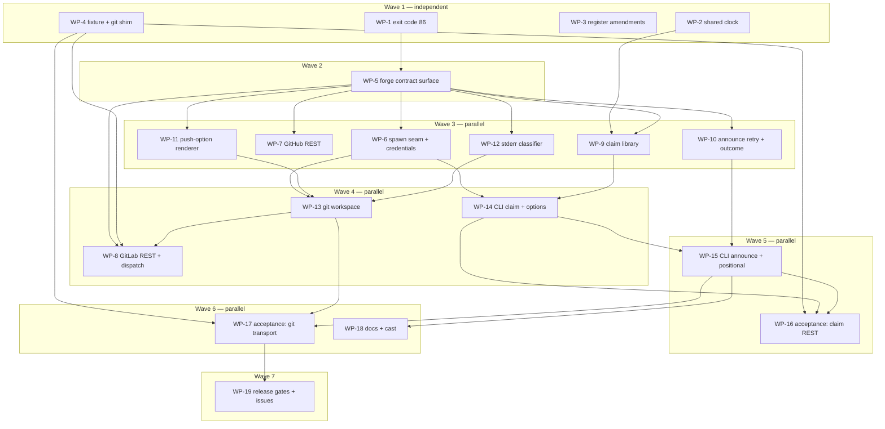

# Plan: Index claim command, forge write transports, and forge-neutral owners

## Status

- **Plan:** plan_index_claim_command
- **State:** review <!-- planning → plan-approved → executing → review → done -->
- **Tier:** high
- **Active phase:** 9 — draft PR open and fully green; awaiting the owner's `/hex-finalize`
- **Step:** review turn 2 complete — Converged, no execute round needed. All 9 previously-unmet IDs met (C-020 and C-037 met-by-amendment, both honest: measurement showed the contract text wrong, each carries a DX row). Cross-model pass returned needs-attention with 2 High findings — one partly refuted, one fixed as a doc correction, the deferred half staged as closeout row 9.
- **Reviewed:** 9b663281 (turn 2: spec/convergence inline + codex adversarial, baseline 43536771). Full release verification green at pinned 66149efb — 13 gates, all rc=0, exit codes captured without a pipe.
- **Updated:** 2026-09-06
- **Last update:** 2026-09-06 (wave 6 and WP-18/WP-19 merged; both WP-17 release blockers fixed, the documentation sweep landed, the release gates measured)
- **Next:** owner runs `/hex-finalize` — the skill is `disable-model-invocation` and cannot be invoked by an agent. PR #420 is green on all 10 checks; Verify Deep run 34042282820 green on all 7 jobs (Windows, macOS, Linux, ARM64 cross-compile, Index Conformance Drift, Acceptance, Publish). Known flake staged as closeout row 10: `push_to_a_moved_branch_classifies_non_fast_forward` reds intermittently on macOS with an empty git stderr — proved intermittent because the failing and passing SHAs differ only inside an assertion's format string.
- **Release blockers found by WP-17:** **both fixed in wave 6.** `claim --transport git` could not succeed on any input (the multi-line request body reached `render_push_options`, which refuses LF) — fixed by `escape_newlines` at the seam; C-043's retry did not converge under `git` (`commit_files` rebuilt in the pre-race clone) — fixed by refreshing the workspace against the observed remote tip. Both xfails are now real assertions.
- **Release gates still owner-owned:** gate 4 (live run against the [#411](https://github.com/ocx-sh/ocx/issues/411) reporter's self-managed GitLab — the authoritative source for the two server-side refusal texts C-044 matches, so far proved only against a fixture-authored line) and the posting of the six cross-repository issue drafts, which are staged at [`issue_drafts_index_claim_closeout.md`](./issue_drafts_index_claim_closeout.md), not filed.
- **Verify-default:** scoped

---

## Overview

**Status:** Approved
**Author:** hex-plan orchestrator (tier high), 2026-09-05
**Design record:** [`adr_index_claim_command.md`](./adr_index_claim_command.md) (Status **Accepted**) + [`system_design_index_claim_command.md`](./system_design_index_claim_command.md)
**Dossier:** [`../../.agents/discussions/index-claim-command.md`](../../.agents/discussions/index-claim-command.md) (owner-ratified, read as data)
**Related issues:** [ocx#410](https://github.com/ocx-sh/ocx/issues/410), [ocx#411](https://github.com/ocx-sh/ocx/issues/411), [ocx#399](https://github.com/ocx-sh/ocx/issues/399)
**Release vehicle:** ocx 0.6.1 — claim command and git transport ship together (Handoff decision 1)

### Classification

- **Scope:** large
- **Reversibility:** one-way (high) — new CLI grammar, two new published env-var names, exit code 86 and its `error.kind` value, and bytes in merged index roots
- **Tier:** high
- **Overlays:** architect=on (the ADR is the delegated design output), research=3, adversary=on

## Objective

Ship `ocx package claim` and the `--transport api|git` write seam so a publisher on
github.com, GitHub Enterprise Server, gitlab.com or self-managed GitLab opens their first
index claim from the CLI, and so a GitLab CI job authors that request as the invoking human
using the job's own token.

The ADR decides **what**. This plan decides **who builds which file, in what order, proving
what**. It re-opens no ratified decision.

## Scope

### In scope

Every one of the ADR's ten Implementation Plan steps and every row of its
"Handoff decisions (2026-09-05)" table, distributed across 19 work packages:

- the new `ocx package claim` command, its library orchestration, its report;
- the `--transport` seam on both write commands and the whole git transport;
- the forge-neutral `owners[]` wire (`login`/`id` only, no `format_version` bump);
- exit code 86 with its compelled `ErrorCategory` arm;
- the announce non-fast-forward retry widening (ADR step 6);
- `announce --package` → positional, joining the open 0.6 → 0.7 batched window, **including
  the migration of every in-repository invocation**;
- the git-over-HTTP test fixture, the recording `git` shim, and both acceptance suites;
- the full documentation sweep including a new use-case page **with a recorded cast**;
- the two register amendments (`design_spec_announce_initiative.md` S1, `adr_announce_gitlab_forge.md` D0/D1);
- the blobless-clone measurement, and the six cross-repository issues.

### Out of scope

- `ocx-mirror`'s missing `forge`/`transport` fields — filed as an issue (WP-19).
- The corporate-CA REST-client gap — filed as an issue (WP-19), **release-blocking to file**.
- `ocx-sh/catalog`'s GitHub-hardcoded owner href — filed as an issue (WP-19); it is a
  **prerequisite for advertising the GitLab path**, so the use-case page (WP-18) must not
  tell anyone to claim from GitLab until it is closed. WP-18 carries that gate explicitly.
- indexbot's dual-emit stop date, the `actor_id` governance question, the index reviewer
  checklist — all cross-repository issues (WP-19), none of them code here.
- `OCX_ANNOUNCE_*` → `OCX_FORGE_*` rename (batched, breaks publisher CI).
- A third forge (Gitea/Forgejo AGit) — needs a refspec-shape parameter, not an enum arm.

## Research

Three axes were researched for this plan, on top of the seven artifacts the ADR already
carries. Each is persisted with an `Expires:` line:

| Artifact | Axis | The finding that changed this plan |
|---|---|---|
| [`research_plan_index_claim_git_fixture.md`](./research_plan_index_claim_git_fixture.md) | technology / tools | A hand-rolled CGI bridge over `git http-backend` is the only workable shape (~150–220 lines). `dulwich` was evaluated and **rejected**: it never negotiates the `push-options` capability, verified in its source. `http.server` never decodes chunked bodies, and `CGIHTTPRequestHandler` is removal-bound. Push options, hook synchrony and the CGI wire format were verified empirically against git 2.54.0. |
| [`research_plan_index_claim_cli_patterns.md`](./research_plan_index_claim_cli_patterns.md) | design patterns | **clap cannot distinguish an alias from the canonical spelling at parse time** — confirmed twice ([clap#1820](https://github.com/clap-rs/clap/issues/1820) closed `wontfix`). So `value_source` cannot drive the deprecation warning; two separate `Arg` ids merged in code is the supported shape, exactly as `jj bisect run --command` did. The project's own `deprecated.rs` covers **whole-subcommand renames only** and has no field-level equivalent. |
| [`research_plan_index_claim_gitlab_verification.md`](./research_plan_index_claim_gitlab_verification.md) | domain | No ADR claim refuted. The asynchronous push-option worker moved from "cited" to **confirmed at GitLab source level** (`PostReceiveService#execute` → `Repositories::PostReceiveWorker.perform_async`), strengthening D-T4. The partial-clone "unresolved gate" is **refined**: the three cited Gitaly issues all closed 2019–2020, six years before the supported window, so it becomes verify-once-expect-pass. Proof-the-filter-applied mechanism named: `git rev-list --objects --missing=print` plus a `GIT_TRACE_PACKET=1` capability trace, each against a full-clone negative control. |

## Deviations from the ADR

The design is fixed. Seven deviations are recorded, each forced by the code as it stands at
HEAD `487570fb` or by a research finding, none of them a feature cut.

| # | Deviation | Why | Where it lands |
|---|---|---|---|
| **DV-1** | The capturing subprocess helper lands in **`crates/ocx_lib/src/forge/git_command.rs`**, not in `utility/child_process.rs`, and its `SPAWN_ALLOWED` row lands in the same work package. | **The ADR's premise is stale against HEAD.** `utility/child_process.rs` (135 lines) no longer holds any spawn primitive — it is now two pure `ExitStatus → ExitCode` functions, and its own module doc says the primitives "live in `launch/child_process.rs` as a private submodule of `crate::launch`". A structural test `no_process_spawn_outside_launch` (`launch.rs:1114`) refuses any new file matching `SPAWN_TOKENS` unless it is named in `SPAWN_ALLOWED` (`launch.rs:914`). The firewall's own doctrine — "the subject is a **tool launch**: running a program this invocation resolved out of a package" — puts an ocx-chosen `git` in the same class as the eleven entries already there (`codesign.rs`, `host_capabilities.rs`, `setup/profiles.rs`). See § Constitution deviations for what this gives up and for the alternative that was rejected. | WP-6 |
| **DV-2** | The work is decomposed into 19 work packages across 7 waves — file-disjoint **within each wave**, with the named cross-wave exceptions listed in § Parallelization — not the system design's five sequential phases. | The design withdrew a *false* parallelism claim about its own phase grouping; it did not forbid a finer cut. Contract-first stubs make the cut real: WP-5 lands the whole forge public surface plus stub bodies in both REST clients, so later packages fill disjoint files behind it. The ADR's step order is preserved as the dependency DAG, not as a serial chain. | Parallelization |
| **DV-3** | `announce --package` → positional needs a **new field-level pattern**, not a reuse of `deprecated.rs`'s existing one, and the 0.7 removal is a file deletion **plus two clap declarations**. | `crates/ocx_cli/src/command/deprecated.rs` (33 lines) handles hidden **subcommand** variants dispatched through `warn_renamed`, and its own module doc says "Nothing else may depend on it." There is no field-level equivalent, and clap cannot detect an alias at parse time. The pattern is two `Arg` ids (`--package` hidden, positional canonical) in one `ArgGroup` with `required = true`, merged in code. What is reused from `warn_renamed` is its **stderr channel and the `REMOVAL_RELEASE` constant**, not its message string — the existing message is command-shaped. | WP-15 |
| **DV-4** | The new use-case page ships **with a recorded cast**, produced by this project's PTY recorder, and joins the transcluded walkthrough set via **`WALKTHROUGH_PAGES` in `test/src/doc_binding.py`**. | The ADR names a use-case page but no cast. This project records casts rather than hand-writing them: `test/doc_scripts/<slug>.sh` is replayed through a real PTY by `test/recordings/test_recordings.py`, writing `website/src/public/casts/<slug>.cast`, embedded via the `<Terminal>` component. The anti-drift gate is **not** `test_doc_scripts_one_tree.py` (glob-driven, carries no page list and would need no edit); it is the `WALKTHROUGH_PAGES` tuple, whose NC1–NC3 checks require every inline `ocx` fence on a listed page to be a `<<<` transclusion backed by a tested script. Outside that set snippets are hand-typed and **provably drifted today**. | WP-18 |
| **DV-5** | The partial-clone check is a **verify-once release gate**, not an open question. | Research established the three cited Gitaly filter defects all closed 2019–2020, ~6 years before the currently supported self-managed window. The gate stays — a server that silently ignores an unsupported filter would defeat the cost rationale — but it is expected to pass, and it now has a named proof mechanism instead of "test that the filter applies". | WP-19 |
| **DV-6** | The claim's REST branch-existence read is asserted against the **Branches API call `get_ref_sha` already makes**, not a new client method. | ADR step 0 introduces one REST read. Reusing the existing call keeps `capability_checks` honest about the request count and adds no surface. Stated because a reader of the recipe could reasonably add a method. | WP-8 |
| **DV-7** | The merge-request confirmation poll **reuses `forge::poll::backoff_delays`**; it mints no second schedule. | `crates/ocx_lib/src/forge/poll.rs` already exists in the module being edited, is deterministic and clock-free by design ("tests assert the schedule without sleeping"), and with `PollSchedule { initial_interval: 1s, max_interval: 30s, deadline: 30s }` yields exactly `1, 2, 4, 8, 15` — the ADR's schedule, from a config literal and no new code. A private constant plus its own loop inside `git_workspace.rs` would be a second clock in the module the ADR insisted must have one. | WP-13 |

No deviation touches one of the dossier's nine `## Decisions` or one of the ADR's `D-C*` /
`D-T*` / `D-W*` decisions.

### Deviations during execution

Recorded as execution discovered them, per the living-design-record rule: the plan is
amended first, then the test is written, then the code. None is a feature cut.

| # | Deviation | Why | Where it lands |
|---|---|---|---|
| **DX-1** | `test/tests/test_git_http_fixture.py` is added to WP-4's Expected Files. | The test inventory names nine `test_git_http_fixture.py::…` deliverables for WP-4 while the module itself was absent from the declared file set, so every one of them would have failed merge-time file-set re-validation. | WP-4 |
| **DX-2** | `test/tests/fake_gitlab.py` is added to WP-4's Expected Files. | WP-4's Scope carries S-015…S-017 and C-041, which need `ci_push_repository_for_job_token_allowed` on the project body, a `GET /projects/:id/job_token_scope/allowlist` route and a delayed merge-request read. All three live in `fake_gitlab.py` (route table `:40-52`, project body `:159-175`, MR list `:298-306`), and **no work package claimed that file**. It is fixture code, so it belongs to the fixture package; WP-8 owns the Rust `gitlab.rs`, not the fake. Wave 1 holds no other writer, so disjointness is preserved. | WP-4 |
| **DX-3** | WP-1's named test `error_kind_inventory_contains_forge_capability_unavailable` is delivered as a **new row plus a `cases.len()` guard inside the existing frozen inventory test** `error_category_serializes_snake_case`, not as a new function. | The inventory is a function-local array, so no separate test can observe it; and renaming the existing test would move a function that already pins eleven other wire strings. C-004's substance — the inventory gains the row and the omission reds — is delivered exactly, and the guard is what makes it red (the inventory test has **no** length assertion today, unlike its sibling at `error_category.rs:155-159`). | WP-1 |
| **DX-4** | WP-18's `command-line.md` scope gains **two prose sentences** (`:300` "reserves 79–85 for OCX-specific cases" and `:303` "OCX occupies 79–85"), and `.claude/rules/rust-quality/cli-contract.md:44`'s `\| 83–99 \| *(unassigned)* \|` row is assigned to WP-18. | The plan's WP-18 row named only the canonical exit-code table. The two range sentences become false at 86 and no test catches them. The `cli-contract.md` row is already wrong today (83, 84 and 85 are assigned) and 86 widens it; it had **no owner** in any work package. | WP-18 |
| **DX-5** | WP-4's fixture seeds commits **git-first** — created with real `git` in the bare repository, then imported into the in-memory REST graph — and its `post-receive` hook imports the pushed ref and tree back. | `git init --bare` is a second, real object store with real SHA-1s, while `fake_forge.py:456-472` mints synthetic ones. Without reconciliation `gl_get_branch` answers a synthetic sha while `--force-with-lease=<branch>:<expected-sha>` (C-040) carries a real one, and every C-042 / S-024 / S-025 assertion measures the fixture rather than ocx. | WP-4 |
| **DX-6** | The **fixture `HOME` builder** — a scratch `HOME` carrying a deliberately different `user.name`/`user.email` and an optional recording `credential.helper` — is a named WP-4 deliverable. | C-034 and C-045 both state the requirement ("proved from one fixture `HOME` carrying a recording `credential.helper`"; "runs with a `~/.gitconfig` carrying a *different* identity") and name their consuming tests as WP-17's, but WP-17's file set is `test_transport_git.py` + `announce_helpers.py`. It is fixture infrastructure and had no owner. Without it "no helper was invoked" is true in every state of the code. | WP-4 |
| **DX-7** | `.claude/rules/quality-rust-exit_codes.md` is **deliberately not amended** for exit 86. | It is a shareable, project-independent quality rule whose exit-code block is illustrative; `meta-ai-config.md` anti-pattern #10 forbids OCX-specific content in `quality-*.md`. Recorded so a later reader does not read the omission as an oversight. | — (decision) |
| **DX-8** | WP-1's contract-first red comes from a `todo!()` match arm, not from an `unimplemented!()` body. | `ExitCode` and `ErrorCategory` are enums: there is no body to stub. The compiler forbids adding the exit code without the category (the match is wildcard-free), and mapping the new code to an existing category during a stub phase would ship a wrong wire value. So the Stub phase adds both variants plus `ExitCode::ForgeCapabilityUnavailable => todo!()`, which compiles, and the Specify phase's tests panic against it. Implement replaces the `todo!()`. The named mutations in § Red/green discipline remain the second, independent proof. | WP-1 |
| **DX-9** | WP-4's Scope widens to the forge-user and job-token REST route surface it had to build — `seed_user`, `users`, `users_api_status`, `token_identity_id`/`_is_bot`, the `/users/<login>` route, `gl_get_users`, `gl_get_job_token_*` — serving C-008, C-009, C-023, C-024, C-027, C-028, C-048 and C-049, whose **Rust** halves stay WP-7/WP-8/WP-9's. | None of it exists in `test/tests/` today, and S-015…S-017 (already in WP-4's Scope) are unreachable without it. Placement follows DX-2: the fake is fixture code and belongs with the fixture package; WP-8 owns `gitlab.rs`, not the fake of it. The residual is that the fake's route shapes freeze in wave 1 while the Rust client arrives in wave 3, so a WP-8 discovery about the real GitLab API cannot flow back without reopening a merged package — WP-17 is where a disagreement first reds. | WP-4 |
| **DX-10** | WP-4's scoped merge gate widens beyond `test_git_http_fixture.py` to include `test_announce.py` and `test_announce_gitlab.py`. | Six existing modules consume `fake_forge.py` / `fake_gitlab.py` and none is in WP-4's declared set, so a regression there would be invisible to WP-4's own gate. | WP-4 |
| **DX-11** | WP-1 delivers a fourth test the inventory did not name, `current_timestamp_renders_the_seconds_z_form` — read WP-2. | C-005 states a *format* as well as a same-instant relation, and no pinned test can reach the format: the `__OCX_TESTING_ANNOUNCE_CLOCK` seam returns its value verbatim, so all three named tests stay green while production emits `%Y-%m-%d %H:%M:%S`. Proved by mutation: the space-separated form reds this test and nothing else. | WP-2 |
| **DX-12** | WP-5 ships a **fifth** implemented item beyond C-017's four: one real `ForgeCredentials` constructor, storing `api`, `push: None`, and deriving `api_is_job_token` by the narrow rule "the API token equals a non-empty `CI_JOB_TOKEN`". WP-6 keeps C-063's full precedence ladder, the push half, and `credentials_derive_api_is_job_token_internally`. | The plan puts the type in WP-5 and the behaviour in WP-6, but WP-5 must thread a `ForgeCredentials` through `package_announce.rs:215` **and** through `GitHubForge::with_base_url`, which `github.rs`'s own test module calls four times (`:1078`, `:1586`, `:1597`, `:1611`). An `unimplemented!()` constructor panics all four plus `test_announce.py` — at WP-5's own `Verify: full` gate. Public fields are the only alternative and C-015 forbids them (`api_is_job_token` "can never be set by a caller"). Same shape as C-017's carve-out: no later package can finish a stub left here without breaking the file-set rule. | WP-5 |
| **DX-13** | The **publishing project** C-029's allowlist check compares against is carried as a CI-derived field on `ForgeCredentials`, filled from the same environment snapshot as `api_is_job_token`. | `ensure_push_access(&self, repo)` takes one `RepoCoordinate` — the *index* project — while the allowlist is read "only when the publishing project differs from the index project" and S-016's exit-86 message must name **both** paths. `CI_PROJECT_PATH` / `CI_PROJECT_ID` appear **nowhere** in the ADR or this plan, so the publishing project had no named source at all. Three options were weighed: a second trait parameter (meaningless on GitHub, and it widens a signature every implementor pays for), the forge reading the environment itself (breaks the rule WP-14 is built on, that credentials resolve at the CLI boundary), and this. It is the same class of value as `api_is_job_token` — CI-environment-derived identity, resolved once at the boundary, unsettable by a caller. | WP-5 (type) / WP-8 (use) |
| **DX-14** | `PushAccess` is declared in **`forge/api.rs`**, never in `forge.rs`. | C-011's guarantee is that `PushAccess { checks: Vec::new() }` does not compile outside the declaring module, with the compiler as the sole control. Declared in `forge.rs` that guarantee is **false**: every submodule is a descendant of `forge` and sees its private fields, so `github.rs`, `gitlab.rs` and `git_workspace.rs` — exactly the modules C-069 must constrain — could construct one freely. Proved both ways with `rustc --edition 2024`: a sibling submodule is refused with `E0451`, a child of the declaring module's parent is not. The live precedent for the hole is `ForgeToken`, declared in `forge.rs:49` with a private tuple field that `github.rs:125` and `gitlab.rs:163` both read as `self.token.0`. | WP-5 |
| **DX-15** | `check_status_has_no_failed_variant` is renamed **`check_status_wire_spellings_and_arity`**. | The named test cannot deliver what its name promises. Absence of an enum variant has no runtime representation, and a mutation that adds `Failed` breaks the **build** rather than reding the test — which `quality-core.md` § Unchecked Green does not accept as a red. The reachable half (three wire spellings plus an arity assertion) is what the test actually holds; the absence is held by a wildcard-free `match` whose non-exhaustiveness is E0004, the same compiler control C-002 already relies on. A source-text scan is the worst option available: `api.rs`'s own doc comment must explain *why* there is no `Failed`, so the needle matches its own file. | WP-5 |
| **DX-16** | `client_requires_git_binary_under_git` returns **`ForgeError::GitUnavailable`** (exit 69). | C-017 requires a `GitBinary` under `Git` but no contract named the error. 69 matches C-065's "a missing `git` exits 69 with zero network calls". Its message reads slightly wrong for a caller that merely forgot to thread the binary, which is acceptable because C-065's argv-boundary gate makes that path unreachable in production. Decided here so the builder does not mint a twelfth `ForgeError` variant. | WP-5 |
| **DX-17** | WP-4's merge gate names `OCX_TESTS_NO_REGISTRY=1 uv run pytest tests/test_fake_forge_mergeability.py` as the check that DX-2's six consumer modules still import. `pytest --collect-only` is **not** part of the gate, in any form. | `test/conftest.py:239-251` loads `fake_forge.py` with `spec_from_file_location` + `exec_module` and never registers it in `sys.modules`, and the call sits inside the **fixture body**, so it runs only at test-execution time. Collection performs the five modules' ordinary `from fake_forge import FakeForge`, which *does* register the module — precisely the state in which the fault cannot occur. Demonstrated in both polarities on the real tree: with `ForgeUser` mutated to a frozen dataclass, `--collect-only` reports 120 collected and exit 0 exactly as with the `NamedTuple`, while the real run goes from 3 passed to 3 errors (`AttributeError: 'NoneType' object has no attribute '__dict__'`). A green that cannot be told from the check never having run is not a check. | WP-4 |
| **DX-18** | WP-16's acceptance cell gains `::test_git_below_the_floor_exits_69` and `::test_git_at_the_floor_is_accepted`, driven by `GitShimVariant.VERSION_2_30_9` and `VERSION_2_31_0`. | S-021 has two halves and only the absent-binary one had a named test (`::test_missing_git_binary_69_with_zero_network_calls`, WP-16). WP-6's three `probe_git_binary_*` unit tests parse a version **string** and never resolve a real `git` off `PATH`, so nothing exercised the shim's two version variants end to end — they would have shipped with no consumer, and C-075's accept side would rest on a gate that a refuse-everything implementation also passes. Same file and same shape as the absent-binary test, so WP-16 rather than WP-17. | WP-4 (shim) / WP-16 (tests) |
| **DX-19** | Three WP-4 tests are amended against **observed** git 2.54.0 behaviour, and one is renamed: `test_push_option_count_absent_when_no_options_sent` becomes `test_push_option_count_is_zero_when_no_options_sent`; both chunked tests select the chunked request **by identity** instead of by index; and the `HOME`-side `post_buffer` floor is **65536**, not 1. | Three findings, each verified outside the fixture before the test moved. **(a)** git 2.54.0 exports `GIT_PUSH_OPTION_COUNT=0` to receive hooks even when the client never negotiated `push-options`, with `receive.advertisePushOptions` either way, over both the local transport and smart HTTP — confirmed with a plain `/bin/sh` hook from a parent shell holding no `GIT_PUSH_*` variable. The absent state is unreachable, so the only implementation satisfying `option_count_present is False` is a hook that fabricates the absence — the very defect the assertion existed to forbid, and the mutation turned it GREEN. The reachable, still discriminating form is the count and the values (`"0"`/`[]` against `"4"`/four). `option_count_present` stays on `PushRecord` as honest capture but is documented as **not a check**. **(b)** A chunked push is always **two** receive-pack POSTs: git sends a `probe_rpc` (a 4-byte `0000` `Content-Length` request) before any chunked stream, because a chunked body cannot be replayed after a 401. `posts[0]` is the probe, so `len(posts) == 1` red on git's protocol rather than on framing; suppressing the probe from the log would have been a lie. Selecting by identity is what `subsystem-tests.md` § Unfalsifiable Greens prescribes for exactly this. **(c)** `LARGE_PACKET_MAX` is 65520 and any `HOME`-side `postBuffer` at or below it aborts every protocol-v2 fetch with `BUG: remote-curl.c:1533`, so the clone died before the push. The per-invocation `-c http.postBuffer=1` route is unaffected — a push speaks v0. | WP-4 |
| **DX-20** | WP-4 delivers three test names beyond the inventory and the edge-case table: `::test_post_redirect_target_is_reachable`, `::test_a_deferred_stub_answers_501_with_its_message`, and `::test_credential_helper_records_an_invocation`. Five fixture stubs that raise inside an HTTP handler thread now answer **501 with the message in the body**; the two raised on the test thread keep raising. | Each closes a guard with no reachable red. **(a)** `git_http_redirect_receive_pack` shipped with zero consumers while its `info/refs` twin had both halves of its reachability pair — and WP-17, which owns S-039, cannot add a fixture knob because its declared files are `test_transport_git.py` and `announce_helpers.py`, so the knob had to be proved here or not at all. **(b)** Converting the stubs to 501 created a path nothing exercised; an untested 501 is the same defect class as the traceback it replaced. **(c)** The recording `credential.helper` — DX-6's whole reason for existing — had no consumer and no positive control: a helper broken by a `noexec` `TMPDIR` or a lost `chmod` records nothing, git continues silently, and C-034's `credential_calls() == []` is green in a world where the helper never ran. Block-tier under `quality-core.md` § Unchecked Green; proved by mutating the helper to mode `0644`. | WP-4 |
| **DX-21** | Round 3 adds two more WP-4 test names — `::test_forbidden_receive_pack_refuses_the_pack_not_the_probe` and `::test_rest_seeding_is_refused_on_a_git_project` — and the `Content-Length` request arm now **refuses** an oversized or unparsable declaration with 400 instead of clamping it. | The probe skip added in DX-20's round was itself undefended: replacing its predicate with `True` left all 37 tests green, so a WP-17 test arming the knob under chunked framing would have measured the handshake refusal while believing it observed the pack refusal — the same finding, one round later, on the sibling knob. DX-5's REST/git seeding guard had **no** test in the tree at all, and its own docstring's claim that route handlers never reach it was false via `handle_patch_ref`'s `concurrent_ref_advance` branch. The clamp returned a short body as if complete and left the remainder framing the next request on a keep-alive socket, where the chunked arm answers 400 and closes; three arms (oversized, negative, unparsable) each answered 200 under mutation. | WP-4 |
| **DX-22** | WP-5's post-stub review surfaced four undeclared decisions and one false plan sentence, all now ruled and recorded. `ensure_push_access` ships **implemented** on both forges, a fifth and sixth item beyond C-017's four. The `redact` re-export the plan requires is **not** added. `CapabilityCheck::detail` differs by forge — GitHub's `push-access` row carries `None`, GitLab's `Some("access level {n}")` — and that stays. `CheckStatus::ALL` is added, and `ForgeCredentials` reads the environment through `crate::env::var`. | `ensure_push_access` pre-existed returning `Result<(), ForgeError>`, so stubbing it would panic `test_announce.py` at WP-5's own `full` gate — DX-12's argument exactly; it pulls part of C-025 and C-026…C-032 forward, so WP-7 and WP-8 inherit a statement rather than a surprise. `redact`'s only consumers are `forge` descendants reaching it as `super::git_command::redact` and no CLI contract names it, so the omission is right and the plan sentence at line 694 is what is wrong. The `detail` asymmetry is real signal, not drift — GitLab exposes an access level and GitHub does not, and minting a GitHub string to match would be fabrication; a later package must not reconcile them. `CheckStatus` had no production enumeration, so the arity half of `check_status_wire_spellings_and_arity` could only count an array the test itself wrote — green in every state, the shape DX-15 rejected. `std::env::var` bypassed the crate's own seam, which would have forced WP-6's `credentials_derive_api_is_job_token_internally` through `unsafe { set_var }`. **Correction:** the seam isolates a test only when that test takes `crate::test::env::lock()` and sets an override — `get_override` otherwise falls through to `std::env`. The four `github.rs` tests take no lock and so still read the ambient environment; harmless while nothing asserts on `api_is_job_token`, and a stated requirement on WP-6's named test, whose green would otherwise be the ambient-environment green. | WP-5 (WP-7/WP-8 inherit) |
| **DX-23** | `forge_error_exit_code_table` ships **unable to detect an eleventh unclassified variant**, and that is accepted rather than fixed in WP-5. Recorded as a follow-up, not a defect of this package. | `ForgeError::classify` ends in `_ => None`, so a variant added later and never classified returns `None` silently — no compiler control and no test control. Unlike `CapabilityName` and `CheckStatus`, `ForgeError`'s variants carry data, so there is no `ALL` const to pair the arity against; the test's count is over the rows it exercises, and a dropped row does red (proved). The wildcard is **pre-existing**: it is present at base `c872551e` with 21 variants, so WP-5 inherited it rather than introducing it, and rewriting a 31-arm match mid-package is the drive-by the refactor workflow forbids. Worth noting that WP-1 removed exactly this wildcard from the sibling `ErrorCategory` table for exactly this reason, which is what makes the asymmetry visible now. **Follow-up:** make `classify` wildcard-free by listing the fourteen deliberately unclassified variants, so the compiler forces a decision the way `ErrorCategory` already does. | WP-5 (follow-up: unassigned) |
| **DX-24** | git's stderr reaches `ForgeError` as a **`Redacted` newtype**, not a `String`. Declared in `git_command.rs` with a private tuple field whose only constructor is `redact`; re-exported from `forge.rs` while `redact` stays private. `redact` therefore ships implemented rather than stubbed. | The guarantee that git's stderr was scrubbed lived in a doc comment, on the one path where a secret arrives **inside** forge-controlled bytes rather than beside them. WP-5 is the sole writer of `forge/error.rs` while WP-12 and WP-13 construct both variants, so they could never have changed the field type without breaking the file-set rule — the window closed at this merge and the change was nearly free, neither variant having a constructor outside the test fixture. Placement follows DX-14 exactly: a private field is visible to the declaring module and its **descendants**, `git_command` has no submodules, and every other forge module is a sibling. Proved from all three construction syntaxes — a raw `String` is E0308, `Redacted(..)` from a sibling is E0423, `Redacted { 0: .. }` is E0451. The redacted form stays classifiable against C-044's table (`[redacted]` cannot straddle a phrase), and length-capping remains WP-6's per C-019. | WP-5 (WP-12/WP-13 inherit) |
| **DX-25** | `GitLabForge` carries `workspace: tokio::sync::OnceCell<GitWorkspace>`, so the clone lives as long as the forge and is created lazily on first use of the git half. | An ownership decision WP-5 made that the plan never specified and that **binds WP-13**. It is forced rather than chosen: `commit_files` builds a local commit only `open_or_update_pull_request` publishes, both take `&self`, and the transport must stay invisible to the caller — so interior mutability on the forge is the only option, and `tokio::sync::OnceCell` is the async-correct one because init is an `async fn` and no `std` guard may cross an `.await`. Recorded so WP-13 inherits a statement. | WP-5 (WP-13 inherits) |
| **DX-26** | `crates/ocx_lib/src/env.rs` gains one fix, in **WP-14**: its `NotUnicode` arm logs the variable's **value** (`log::warn!("... is not valid: {:?}", key, os_str)`). Drop `os_str`. | WP-5 creates the first credential-to-log-line path in the tree by reading `CI_JOB_TOKEN` through `crate::env::var`, and WP-6's `OCX_ANNOUNCE_GIT_TOKEN` will follow it. It needs a non-UTF-8 credential to fire, so it is not attacker-reachable on an ordinary runner — but a CI job log is durable and read by more parties than the process environment, and the key alone is what a reader acts on. `env.rs` is already in WP-14's declared file set for C-066, so this needs no file-set amendment. | WP-14 |
| **DX-27** | WP-9's in-module `FakeForge::get_ref_sha` keyed its refs by **bare branch name** while the `Forge` trait takes a ref *path*. It now `expect`s the `heads/` prefix. | GitHub builds `/git/ref/{ref}` verbatim and 404s on a bare name; GitLab strips the prefix. A claim implementation written to satisfy the double as it stood would have resolved nothing in production, and the double's own green was the only evidence. Dropping the prefix now reds eleven tests. | WP-9 |
| **DX-28** | `non_fast_forward_retry_regenerates_exactly_once` took **two live `crate::test::env::lock()` guards on one thread**; it now takes one. | The lock is a plain `std::sync::Mutex`, so the second acquire deadlocks. It was invisible while the first `claim()` panicked at the stub — the stub phase cannot observe a deadlock that only the implementation reaches. | WP-9 |
| **DX-29** | `pinned_clock` set `__OCX_TESTING_ANNOUNCE_CLOCK` through `std::env::set_var` with no cleanup; it is now a `ClockSeam` guard with a `Drop`, matching `claim/root.rs`. | `EnvLock::drop` clears only the override map, so the pin leaked into every later reader of the shared clock in the same process — a cross-test green that no assertion could see. Second face of DX-22: the crate env seam isolates only a test that both takes the lock *and* sets an override. | WP-9 |
| **DX-30** | C-049's **weak** bot-shape check runs on every list and **before** the charset guard, and a forge user carrying `bot: true` under a login no shape matches was added so the **strong** guard has a reachable red. | `dependabot[bot]` violates both guards; "this is a bot account" is the actionable diagnosis, and the reverse order reds `bot_identity_is_refused` for the wrong reason. Without the added row the strong guard was green in every state — C-049's two strengths need two independent reds. | WP-9 |
| **DX-31** | C-072's stderr line is a `log::info!` **from the library**, emitted after owner resolution and before any write — not an `eprintln!` from the CLI. | The CLI only sees the outcome *after* the write, so "before any write" is unsatisfiable at the WP-14 boundary. Residual, recorded rather than hidden: the default console level is INFO to stderr so the line appears, but it is filterable through `OCX_LOG_CONSOLE` / `OCX_LOG` / `RUST_LOG`. If S-001's acceptance assertion must hold under any log configuration, WP-16 reds and the line becomes unconditional. | WP-9 (WP-16 may reopen) |
| **DX-32** | Every claim commit is parented on the **index base** in every branch state, and `ensure_push_access` runs on the fork-free write path only — `--out`, the fork path and the no-write `Ahead` row report `PushAccess::skipped_all()`. | A claim root accumulates nothing, so C-051's `Behind`/`Diverged` rebuild and its `Absent` create are the same commit shape; stating it stops a later reader adding a branch-parented arm. The `skipped_all()` half is how S-011's `push-access: skipped` is reachable at all — DX-41's GitHub exception raises `PushAccessDenied` rather than reporting `Unknown`, so under `--out` the preflight must **not be called**, never called-and-downgraded. | WP-9 (WP-14 inherits) |
| **DX-33** | `branch_state_machine_table`'s row is a `type StateRow` alias rather than a bare 7-tuple. | `clippy::type_complexity` under `-D warnings`. A one-line alias rather than an `#[expect]`, so the lint keeps its teeth on the next row that grows. | WP-9 |
| **DX-34** | WP-13's diff deletes four `#[cfg_attr(not(test), expect(dead_code, …))]` attributes from `git_command.rs` (`run_git`, `CredentialScope::new`), `git_push_options.rs` (`render_push_options`) and `git_stderr.rs` (`classify_push_failure`) — files owned by WP-6, WP-11 and WP-12. | Forced, not chosen: `expect` **fails the build** once the lint stops firing, and every one of those `reason` strings names the git workspace as its first production caller. WP-13 cannot compile without removing them. Attribute-only deletions, no behaviour change. All three owners are **declared ancestors** of WP-13 (`WP-6 → WP-13`, `WP-11 → WP-13`, `WP-12 → WP-13`), so § Parallelization's merge predicate already permits it. | WP-13 |
| **DX-35** | `GitWorkspace::push` gains a `RefusalContext<'_>` parameter (the `&PushAccess` from the preflight plus the repository path), grouped into a struct. | `classify_push_failure` needs both to make C-044's 86 promotion, and neither is derivable inside a workspace that holds only a URL. Passing `PushAccess::skipped_all()` instead makes the promotion **unreachable** and silently lands every capability refusal on 77 — the exact defect C-029 and C-044 were split to prevent. Grouped rather than passed as two arguments to stay inside clippy's seven-argument bound. **Binds WP-8**, whose `open_or_update_pull_request` is the caller. | WP-13 (WP-8 inherits) |
| **DX-36** | **C-037's example notation is inverted against git.** `rev-list --left-right --count <base>...<branch>` prints `<base-only> <branch-only>`, so `0 n` is `Ahead` and `n 0` is `Behind` — the opposite of the plan's `n/0 → Ahead`. Implemented semantically and asserted over four real branch states. | Measured against git 2.54.0 rather than reasoned from the plan text. The mapping is what C-037 means; the digits in its example are what is wrong. | WP-13 (C-037 amended) |
| **DX-37** | Three hygiene items the ADR's recipe does not name: `hash-object` carries `--no-filters`; the credential rides **only** the fetch and the push, never the local plumbing; and `refresh_commit` retries once after a one-second sleep when the refreshed sha reproduces the head. | `HOME` reaches the child by design (C-033), so an operator's `core.autocrlf` would otherwise rewrite an index root's bytes on the way into the object store — a silent wire-format corruption. Scoping the credential to two invocations narrows the `/proc/<pid>/environ` window C-034 records as a residual. The refresh retry exists because same tree, parent, message and fixed identity (C-045) leave the committer date as the only varying input, at one-second granularity; marked `ponytail:` with `GIT_COMMITTER_DATE` as the named upgrade path. | WP-13 |
| **DX-38** | `GitWorkspace`'s scratch `GIT_INDEX_FILE` (C-038) is the workspace repository's **own** index, and `move_ref` maps every `update-ref` failure to `NonFastForward`. | `run_git` builds the child environment from the C-035 allowlist and takes no per-invocation additions, so no file outside `git_command.rs` can set `GIT_INDEX_FILE` — and the clone is per-workspace and removed with it, so its index *is* scratch. The `move_ref` narrowing is deliberate (a private throwaway workspace, ocx-minted object names, no other ref-lock holder) and documented at the call site rather than left as an accident. | WP-13 |
| **DX-39** | WP-10's diff includes `crates/ocx_cli/src/api/data/announce.rs` — WP-15's file — for a **test-construction-only** edit: one widened `use` and two fields added to three `#[cfg(test)]` `AnnounceOutcome` literals. | C-055 adds two fields to a struct with no `Default`, and C-069 makes `PushAccess::skipped_all()` the only way to spell one, so every *full* literal must name them; the file's other three literals use `..outcome_updated()` and need nothing. `cargo build` compiles the lib target only and hides the breakage — only `--all-targets` sees it — so leaving it hands every wave-3/4/5 package a tree whose `cargo test` and `cargo clippy --all-targets` are red until wave 5. This is § Parallelization's eighth-row exception restated: WP-10 is a declared ancestor of WP-15, so the two writers are serialized and the ancestor rule already covers the pair. No production code and no assertion changes. | WP-10 (WP-15 inherits) |
| **DX-40.1** | `AnnounceOutcome::capability_checks` is a **`PushAccess`**, not C-055's literal `Vec<CapabilityCheck>`. | C-069's whole guarantee is that no code outside the declaring module can produce an empty `checks`. Copying the rows out at five sites in `announce.rs` makes `Vec::new()` spellable again and re-opens exactly that hole, so C-055's literal type contradicts C-069's stated rationale. **Binds WP-15** (C-061): read `outcome.capability_checks.checks()`, not a vector. | WP-10 (WP-15 inherits) |
| **DX-40.2** | The retry predicate is `NonFastForward \| StaleLease`, not `NonFastForward` alone. | `Spent` and `Stale` branches are repointed with `RefUpdate::Reset`, which git spells `--force-with-lease`, and losing that race surfaces as `StaleLease`. Both classify to exit 75, so only a **call-count** assertion can see the difference, and the count is asserted before the result is read. Not really a free deviation: `adr_index_claim_command.md:1441` already required `(stale info)` → `StaleLease` → "re-read the expected sha, retry once" — C-056 was under-specified against the ADR it derives from. | WP-10 (C-056 amended) |
| **DX-40.3** | `AnnounceOutcome::branch` is the empty string under `--out`, which reads no branch and pushes nothing. | `String`, not `Option<String>`, is what C-055 names. **Binds WP-15**: C-060's idiom for an absent field is `null` in JSON and a dash in plain — `push_credential_kind` is explicitly `null` under `api` — so WP-15 maps `""` to `null`/dash rather than emitting `"branch": ""`. | WP-10 (WP-15 inherits) |
| **DX-41** | Three WP-7 corrections. **(a)** C-025's `git-version` clause is unreachable on GitHub: `GitHubForge` holds no `GitBinary` and GitHub plus the git write transport is refused before a client exists, so the row stays `skipped` and `kind.rs` needs no edit. **(b)** C-011's "an unreadable field reports `Unknown` and does not fail the call" has a shipped **GitHub exception** — a 404, an absent `permissions` object or an absent `push` key raises `PushAccessDenied` before any write; a `permissions.push` that reads `false` is an ordinary readable denial and not an exception at all. **(c)** `github_ensure_push_access_emits_rows` is a **characterization** test, green on arrival because DX-22 shipped the function in WP-5. | (a) and (b) are the code as it stands rather than as C-025/C-011 read; (b)'s posture is on the ordinary announce path and is pinned by test rather than changed. Its consequence binds WP-9 and WP-14 and is the reason DX-32 exists: S-011's `push-access: skipped` under `--out` is reachable **only by not calling the preflight**. (c) is disclosed rather than dressed up — its contract-first red came from the two `unimplemented!()` bodies (10 of 39 failed with "not implemented"), and the review round added the missing mutation (`CapabilityName::PushAccess` → `JobTokenPush`) so it has a red of its own. | WP-7 (WP-9/WP-14 inherit) |
| **DX-42** | C-009's GitHub `Ok(None)` is a **403 matched on the body message `Resource not accessible by integration`**, not a 404 — 404 remains a second `Ok(None)` arm. | C-009 names a GitHub App installation token as the `Ok(None)` case, and that credential answers `GET /user` with **403**, never 404. As shipped, the one credential the contract names by example exited 80 through `AuthError` and C-009's first clause was unreachable in production; WP-7 had additionally pinned the wrong side, asserting 403 → `Status` on a WP-5 doc sentence ("GitHub has no credential that is forbidden the endpoint outright") that is false for exactly that credential. That sentence is struck from both sites. Matched on the **message** rather than the bare status so an ordinary permission 403 still exits 80. `UsersApiUnavailable` was not used: the ADR scopes it to a GitLab job token. Residual: the message string is GitHub's documented text, not a recorded response — release gate 4 is its verification. | WP-7 (C-009 amended) |
| **DX-43** | `GitHubForge::resolve_user` refuses the **empty** login alongside `.` and `..`; the test is renamed `github_resolve_user_refuses_a_login_that_cannot_be_a_path_segment`. | `/users/` is GitHub's *list-users* endpoint, whose 200 array carries no `login`, so an empty login previously failed closed with a decode-shaped `MissingField` where C-048 owes `OwnerUnknown` (79). One token, no new scaffolding. The parse-boundary guard `forge.rs::is_valid_path_segment` remains the right long-term home once `--owner` exists (WP-14). | WP-7 |
| **DX-44** | `test/tests/fake_gitlab.py` becomes a **WP-4 → WP-8 second-writer pair** and joins WP-8's Expected Files; a `WP-4 → WP-8` dependency edge joins the DAG. | WP-4 shipped the file with two C-029 fixture knobs as documented `NotImplementedError` stubs, its own comment stating that "the row's own red state — `preflight_readable_false_errs_86` — is unreachable until WP-8's and WP-17's consumers exist". So WP-4 deliberately deferred work **into** WP-8 while no work package claimed the second write. The two never run concurrently (wave 1 against wave 3) and WP-4 was merged long before WP-8 launched, so the file-set rule is satisfied in substance; the edge makes it satisfied on paper. | WP-4 → WP-8 |
| **DX-45** | The deviation numbers **DX-27…DX-38** are allocated by this run, while **DX-39, DX-40.x and DX-41** keep the numbers already written into merged and in-flight commit messages. | The orchestrator session that executed the first half of wave 3 was killed by the host running out of memory, and its plan edits were never committed while its workers' commits were. Reallocating DX-39/40/41 would have stranded every citation in `90e58991` and `4e3eb1e2`; renumbering the commits is impossible. Recorded so a reader does not read the ordering as a mistake. | — (record) |
| **DX-46** | WP-8's diff deletes `confirm_merge_request`'s `#[cfg_attr(not(test), expect(dead_code, …))]` in `git_workspace.rs` — WP-13's file. | The same compiler-forced shape as DX-34, one wave later and in the other direction: the attribute's own `reason` names "the git-transport dispatch arm that confirms a push" as its first caller, `warnings = "deny"` makes an unfulfilled `expect` a hard error, and WP-8 **is** that arm. No other module can call it. The block-level `expect` on `impl GitWorkspace` is untouched and stays fulfilled. | WP-8 (WP-13's file) |
| **DX-47** | Same file: `confirm_merge_request`'s bound moves from `impl AsyncFn()` to `Fn() -> Fut`, and its three test call sites from `async \|\|` to `\|\| async move`. | `AsyncFn`'s associated future is higher-ranked over the call lifetime, so a probe borrowing its forge cannot be proved `Send` for *every* lifetime — which is exactly what `async_trait`'s boxed `Send` future demands of the GitLab client that calls it. rustc reports it as "implementation of `Send` is not general enough" on the whole trait method and never mentions the bound, so it is recorded here rather than left to be rediscovered. Reproduced in isolation both ways: the `AsyncFn` form errors, `Fn() -> Fut` compiles. Consequence: **`git_workspace.rs` is a WP-13 → WP-8 second-writer pair and a `WP-13 → WP-8` edge joins the DAG**, moving WP-8's write half into wave 4. WP-8's REST half was wave-3 work and merged last only because its git dispatch could not be written before WP-13 existed. | WP-8 (WP-13's file) |
| **DX-48 (C-042 amendment)** | Under `git`, `open_or_update_pull_request` treats "this run built no commit not yet offered" as C-042's no-pending-local-commit case: it reads the open merge requests over REST **first** and returns one without opening a clone at all. The discriminator is forge-side state (`GitRun::pending`, taken on every push attempt), **not** `GitWorkspace::has_unpushed_commit`. | Found by WP-10's review panel. `announce.rs`'s widened retry has a `root_bytes == head_bytes` arm that skips `commit_files` and goes straight to the push — but under `git` the re-fetch that makes a retry converge lives *inside* `commit_files` (recipe step 4r), so the temporary clone still held the losing commit at `refs/heads/<branch>` and a stale `o/<base>`, and the ADR states verbatim that "the second push would be rejected identically — a retry guaranteed to fail". Not a regression (it degraded to the pre-widening exit 75, nothing lost or overwritten) and not fixable in `announce.rs`, which must stay transport-blind. The local-versus-tracking-ref comparison is the wrong oracle because it answers the same thing on the fresh path and on the losing-retry path. | WP-8 (C-042 amended) |
| **DX-49** | The preflight sits **between** the "already open" return and the clone: a run that writes nothing demands no preflight, a run that will push is refused at 86 before any `git` process starts, and a push reaching that point with no recorded preflight **performs** one rather than substituting `PushAccess::skipped_all()`. | The placement is what makes DX-35 pay off. Substituting an empty answer at the push is the one move that makes C-044's 86 promotion unreachable while every test that only asserts "a refusal happened" stays green; stating the ordering stops a later reader from moving the call for tidiness. | WP-8 |
| **DX-50** | `GitLabForge.workspace` is `tokio::sync::OnceCell<GitHalf>`, not `OnceCell<GitWorkspace>` as **DX-25** recorded. `GitHalf` additionally carries the branch head the clone was taken at. | C-040's lease must name the sha the run *read*; re-reading it at push time degrades `--force-with-lease` into a plain force, which C-040 forbids by name. `PullRequest::updated` is decided from the same value. DX-25's ownership decision is unchanged — only the cell's payload is wider than it predicted. | WP-8 (amends DX-25) |
| **DX-51** | `ClaimOutcome` gains `author: Option<ResolvedOwner>`, resolved in `claim/owners.rs` beside the owner ladder, and `crates/ocx_lib/src/claim.rs`, `claim/request.rs`, `claim/owners.rs` join WP-14's Expected Files as a **WP-9 → WP-14 second-writer set**. | C-060's sixteenth key had **no carrier**. `ClaimOutcome` (`claim/request.rs:141-165`) declares ten fields and none of them is the authoring identity, and the CLI cannot derive it — the identity lookup happens inside `claim::claim`. The ADR contracts the field precisely (`adr_index_claim_command.md:1138`): "the token identity, else the CI-environment identity; `null` when neither is available — a bare job token with no CI user variables, reachable only with an explicit `--owner`". That order is the **reverse** of C-048's seeding ladder (which puts `--owner` first and the token identity last), so it is a second resolution over the same two rungs, not a re-use of the first. Under an explicit `--owner` it costs one `authenticated_identity()` call that the owner ladder does not make; an `Err` from that call is **not** fatal to the claim (the field's contract is "when known"), so it falls through to the CI-environment pair and then to `None`, logged at debug with the reason rather than swallowed. Dropping the key to fifteen was the alternative and is a feature cut of a ratified contract. WP-9 is a declared ancestor of WP-14, so § Parallelization's merge predicate already permits the pair. | WP-14 (WP-9's files) |
| **DX-52** | `ForgeCredentials` gains `api_is_present(&self) -> bool`, and `crates/ocx_lib/src/forge/credentials.rs` joins WP-14's Expected Files as a **WP-6 → WP-14 second-writer pair**. | every field is private (C-015 requires it) and the public surface is `new`, `resolve`, `api`, `push`, `api_is_job_token`, `push_is_job_token`, `publishing_project`. `api()` hands back a `ForgeToken` whose own field is private to `forge`, so **nothing outside `forge` can see whether the API credential is empty** — which is what `credential_kind: "none"` reports (C-060) and what C-063's exit-80 refusal branches on. The CLI cannot re-read `OCX_ANNOUNCE_TOKEN` itself instead: the whole point of C-063 is that the ladder, not the caller, decides which rung answered. WP-6 is a declared ancestor of WP-14. | WP-14 (WP-6's file) |
| **DX-53** | `crates/ocx_cli/src/app.rs` joins WP-14's Expected Files for one compiler-forced line: `PackageCmd::Claim(_) => "package claim",` in the wildcard-free `canonical_command_name`. | the same shape as DX-34 and DX-46. The match has no wildcard, so a new `Package` variant is `E0004` and the workspace does not compile — WP-14's own `cargo check` gate is unreachable without it. Additive to the frozen v1 error envelope (a new arm, no existing mapping changed), and `every_record_frame_command_matches_the_canonical_cli_name` is unaffected. `app.rs` is in **no** work package's Expected Files, so there is no second writer to serialize against. | WP-14 |
| **DX-54 (S-035 amendment)** | `ocx index claim` produces clap's ordinary `unrecognized subcommand` error with **no** did-you-mean hint, and no hidden `claim` variant is added to the `ocx index` group. `index_claim_suggests_package_claim` is renamed `index_group_declares_no_claim_subcommand`, and the `index` group's `about` — WP-14's declared `command.rs` edit — names `ocx package claim`. | measured, not reasoned. clap 4's did-you-mean is similarity-gated over **one command's own subcommand list**: `ocx index catalo` prints `tip: a similar subcommand exists: 'catalog'`, while `ocx index claim` prints `error: unrecognized subcommand 'claim'` and nothing else. There is no cross-command hook. The only mechanism that emits a pointer is a hidden `claim` arm on `enum Index` (`command/index.rs`, in no work package's set), and it makes clap **parse** rather than suggest — so `ocx index claim --help` would render a help page for a command that does not exist, and `find_subcommand("claim").is_none()` would invert into the opposite of the property S-035 exists to protect. The repo's hidden-variant precedent (`package.rs:47-52` `describe`/`info`) is scoped to *renames* of forms that once worked; `ocx index claim` never was one. The reachable, discriminating half is therefore pinned instead: no forge write may land under `ocx index`, and the group's own help — one `--help` away, which is exactly where clap's `For more information, try '--help'` sends the operator — names the right command. **Residual, recorded rather than hidden:** the pointer is one step away, not inline. | WP-14 (S-035 amended) |
| **DX-55** | `empty_token_falls_through_to_job_token_pickup` is renamed `empty_token_resolves_the_job_token_at_the_cli_boundary`. | the inventory name describes a property WP-6 already ships and already tests — `credentials.rs:582-609`'s `the_api_ladder_prefers_a_non_empty_ocx_token_over_the_job_token` asserts exactly `OCX_ANNOUNCE_TOKEN=""` → `CI_JOB_TOKEN`. Re-asserting it at the CLI would be a second green over the same code. The CLI-boundary property no other test can see is *which transport the CLI hands `ForgeCredentials::resolve`* and *that C-063's exit-80 refusal branches on the resolved credential rather than on a direct `std::env::var(OCX_ANNOUNCE_TOKEN)`* — which is the live shape at `package_announce.rs:205` a builder would otherwise copy. | WP-14 |
| **DX-56** | DX-26's fix (dropping `os_str` from `env.rs`'s `NotUnicode` `log::warn!`) ships with **no reachable red**, and that is recorded on the change rather than papered over with a vacuous test. | `log::warn!` only formats its arguments once a logger is installed, and no unit test in this workspace installs one; the crate's own env seam (`crate::test::env`) stores `String` overrides and structurally cannot hold a non-UTF-8 value, so the arm is unreachable from a test at all. Per `quality-core.md` § Unchecked Green, a check whose green cannot be told from "never ran" is not a check — so none is written. The control is the review checklist plus the one-token diff. | WP-14 |
| **DX-57** | `crates/ocx_schema/src/reports.rs` joins WP-14's Expected Files for one row: `ocx::api::data::claim::ClaimReport,` in `report_roots!`. | found by WP-14's post-stub review. `report_roots!` is the hand-maintained registry of every published `--format json` root, and `reports.rs:305`'s `every_printable_root_is_published` scans `crates/ocx_cli/src/api/data/*.rs` for `impl … Printable for <T>` and fails for any unpublished `T` — so the stub is **red at that test** the moment `ClaimReport` gains its `Printable` impl. `crates/ocx_schema` appears **zero** times in the whole plan, so no work package owns the file and no later package closes the gap, while WP-14's `Verify: scoped` cell runs `ocx_cli` and would not have seen it. The durable cost is larger than the red: CLAUDE.md's stability tiers make a published report schema an interface, and `ocx package claim --format json` would ship absent from it. Same test-forced shape as DX-53. **Consequence:** WP-14's scoped merge gate must run `ocx_schema` as well as `ocx_cli`. | WP-14 |
| **DX-58 (C-058/C-059 ruling)** | `--out` ⟂ `--fork` is declared **inside** `ForgeWriteOptions`, on the two flattened fields, not in each command file. | the stub's doc ruled that a command declares its exclusions "in its own command file, never here", and C-058's one exclusion between two *shared* flags then has no field on the outer command to hang `conflicts_with` on — it is expressible from the outside only as an `ArgGroup`, which the note did not name. The stated rationale ("the exclusions differ per command") has no instance: `package_announce.rs:82`/`:90` carry the identical pair today, pinned by `target_selection_is_mutually_exclusive`, which would red the moment WP-15 replaces those attributes with the flatten. The value-dependent refusals (`--transport git` with `--fork`, with `--out`, or with a GitHub forge) are runtime checks under either design and so are not a counter-example. Only *command-specific* flags declare a conflict against a flattened arg id. **Binds WP-15**: it inherits the pair from the flatten and must delete announce's two `conflicts_with` attributes rather than duplicating them. | WP-14 (WP-15 inherits) |
| **DX-59** | the shared report vocabulary lands in a new `crates/ocx_cli/src/api/data/forge_report.rs`, which joins WP-14's Expected Files, rather than in `api/data/claim.rs` with `announce.rs` importing from it. | C-060 and C-061 contract the **same** value vocabularies for `credential_kind`, `push_credential_kind` and the capability-check rows across both reports, so one renderer is right and two would drift. The stub put them in `claim.rs` and disclosed that WP-15's `announce.rs` would import them — which points the older, more general report at the newer, more specific one and makes that inversion permanent for the life of the branch. A neutral module costs one file and has two callers by construction, so it is not a speculative abstraction. It carries no `Printable` impl and therefore owes no `report_roots!` row (DX-57). **Binds WP-15**: C-061's keys are rendered from `forge_report.rs`, never from `claim.rs`. | WP-14 (WP-15 inherits) |
| **DX-60** | the `Index` group's long help loses the sentence "These subcommands read the local index copy and refresh it from the registry". | found by the post-stub review; it is false for three of the group's five subcommands (`catalog` lists repositories in the **registry**, `list` only reads, `regenerate` re-derives `c/index.json` from the local `p/` walk and consults no source at all), and `quality-cli-help.md` § Forbidden names an incorrect statement of behaviour. The S-035-bearing sentence that follows it is correct and stays. | WP-14 |
| **DX-61** | `.claude/rules/subsystem-cli-commands.md` and `.claude/tests/test_ai_config.py` join WP-14's Expected Files, for one Command-Summary row and one `_STEM_REWRITES` entry. | `test_subsystem_cli_commands_table_covers_all_commands` globs `crates/ocx_cli/src/command/*.rs` and demands a documented row for every stem, mapping the stem through `_STEM_REWRITES` — so the moment `package_claim.rs` exists, `task claude:tests` reds, and with it `task verify`. Without this the integration branch carries a red gate from WP-14's merge until WP-18's documentation wave, which is exactly the "every wave-N package inherits a broken tree" defect the eighth-row exception (§ Parallelization) exists to prevent. The plan assigns `subsystem-cli-commands.md` to **WP-18**, which rewrites the *announce* row for the positional migration — a different row in the same table, and WP-14 is a declared ancestor of WP-18 (`WP-14 → WP-15 → WP-18`), so the merge predicate already permits the pair. `test_ai_config.py` is in no work package's set. Proved load-bearing in both directions: with the table row deleted the gate exits 201, restored it exits 0. | WP-14 (WP-18's file for the table; unowned for the test) |
| **DX-62 (C-065 clarification)** | C-065's "**zero** network calls" ships as zero **forge** calls. The ambient self-update check does precede `execute`, and what keeps it from dialling is not claim's ordering. | found by WP-14's round-1 spec review and confirmed by reading `app/update_check.rs`: `check_for_update` returns before `self_check_update` when `!std::io::stderr().is_terminal()`, and `test/src/runner.py:118` runs `ocx` with `capture_output=True`, so stderr is a pipe in every acceptance test; `env::is_ci()` is a second independent short-circuit. The git gate was **not** moved — moving it would not change this, since the update check is upstream of every command. **Consequence for WP-16:** a socket count under `::test_missing_git_binary_69_with_zero_network_calls` is genuinely zero, so the plan's test name can be carried honestly, but the guarantee claim's own code makes is zero *forge* calls; the test's doc comment must record that the socket half rests on the harness's stderr redirection, so a fixture that ever gave `ocx` a TTY would flip it for a reason unrelated to claim. | WP-14 (C-065 clarified; WP-16 inherits) |
| **DX-63** | `claim_usage_puts_options_before_the_positional`, `out_and_fork_conflict_is_declared_on_the_shared_struct` and `target_maps_each_flag_pair_to_its_claim_target` each carry a **mutation that does not red**, written on the test rather than hidden. | three separate measurements, each verified in both directions. (a) clap renders `[OPTIONS]` before positionals **regardless of field order**, so the mutation the plan's own test design named — declaring the positional first — leaves the assertion green; the discriminating mutation is renaming the `value_name`. (b) clap's `conflicts_with` is **symmetric**, so deleting one of the two attributes leaves the surviving sibling refusing; only deleting both reds. Per `quality-core.md` § Unchecked Green that is "two independent guards", not a weak check. (c) clap makes `--out` and `--fork` both-present unreachable, so reordering `target()`'s match arms is a no-op. In each case the doc comment now states the **measured** fact and names the mutation that does red it. | WP-14 |
| **DX-64** | `--upstream-repository-url` must be an absolute `http`/`https` URL, refused at exit 64 otherwise. | raised by WP-14's round-1 security review. C-067 keeps every operator-supplied string out of the request title and body, but `--upstream-repository-url` reaches the **index root file** by design, and `ocx-sh/catalog` renders it as a link — so an unvalidated scheme is a stored-link vector in a downstream site that no ocx-side control covers. Three lines in `package_claim.rs`'s argv-fault block. Deliberately **not** widened: no guard is added for `--upstream-org` or `--upstream-disclaimer`, whose contract is that they reach the root only and whose stated control is the G-04 reviewer. | WP-14 (contract addition to C-057) |
| **DX-65 (C-062 correction)** | a required `ArgGroup` renders **every** member in the usage line regardless of `Arg::hide`, so the hidden `--package` reappears as `Usage: announce [OPTIONS] <PACKAGE\|--package <PACKAGE>>`. C-062's "hidden" therefore needs `override_usage`, which C-062 does not name. | measured on the workspace's clap 4.6 with a probe crate kept at `.tmp/hex/clapprobe`. clap 4.6's `ArgGroup` has no `hide`, and `Arg::hide` is not consulted when the group is rendered. Without `override_usage` the deprecation window advertises the deprecated spelling in the help of every `ocx package announce --help` — the opposite of C-062's contract, and invisible to any test that only asserts the flag is `hide`-flagged. `.args(["package", "package_flag"]).required(true)` is exactly-one on its own; `.multiple(false)` is redundant. Both forms → `ArgumentConflict`, neither → `MissingRequiredArgument`, both 64 through `cli::clap::parse`. | WP-15 (C-062 amended) |
| **DX-66 (C-062 count correction)** | the sweep is **99 invocations across fourteen files**, not fifteen, and one of the 89 acceptance hits (`test/tests/test_package_cascade.py:445`) is a **docstring**, exempt under C-062's own predicate — so 88 acceptance invocations, not 89. | the sweep was run rather than inherited: 124 raw hits across 17 files, filtered by C-062's stated predicate (a *rendered* `ocx package announce` command line carrying `--package`) and its exclusion set. This is the second time this count has been wrong in this plan — § "a widened check scope needs the sweep re-run" — and it is why C-062 states the predicate as well as the scope. WP-15 reaches twelve files; `command-line.md` (8 hits) and `subsystem-cli-commands.md` (1) stay WP-18's. | WP-15 (C-062 amended) |
| **DX-67** | announce's `--transport git` runs the **same argv-fault block** WP-14 built (`ForgeWriteOptions::validate()` / `::needs_git()` / the `probe_git_binary` gate), not a bare flattened flag. | flattening `ForgeWriteOptions` into announce ships `--transport git` without announce ever resolving a `GitBinary`, so `ForgeKind::client` returns `GitUnavailable` (exit 69) on a host where `git` is present and fine — a flag that cannot succeed, on the command the release is named for. C-065 puts the gate at the argv boundary for both write commands; sharing the options struct without sharing its validator is the half-measure that looks done. | WP-15 |
| **DX-68** | `announce_report_gains_six_keys` must carry a `--transport git` case. | `push_credential_kind` is `null` on **every** default-transport run (C-061), so a six-keys test built only from `--transport api` asserts `null` against a field that is `null` in every state — green in a world where the mapping does not exist. The `git` case is the only one that makes the key discriminate. | WP-15 |
| **DX-69 (test split, DX-15 shape)** | `announce_warning_never_reaches_stdout` cannot be written at unit scope and splits: the Rust half asserts what it can reach, and the stdout-purity half becomes an acceptance assertion in `test/tests/test_announce.py`, which is WP-15's own file. | `Printer` writes the real streams and `Cell` exposes no text, so no Rust seam observes stdout — the same wall WP-14 hit and solved with a pure `plain_table()` builder. The positive control already exists at acceptance scope: `test/tests/test_tag_reserved.py:131,137` proves a `ui().warn` lands on stderr while stdout stays parseable JSON in the same run. | WP-15 |
| **DX-70** | the four user-facing remediation strings (`api/data/package_cascade_repair.rs:163,167,170`, `api/data/package_cascade_check.rs:151`) are covered by **no** assertion today, so migrating them reds nothing. WP-15 extracts a pure message builder and asserts against it, the same shape as WP-14's `plain_table()`. | they are inline arguments to `print_hint`, which writes the real stream; the only nearby assertion (`test_package_cascade.py:470`) checks `--tags-file`, not `--package`. C-062 calls these the reason the sweep is correctness rather than housekeeping — leaving them unasserted makes that claim untestable. | WP-15 |
| **DX-71 (file-set amendment + a new dependency edge)** | `test/tests/fake_forge.py` and `test/tests/fake_gitlab.py` join WP-16's Expected Files, add-only; and a **`WP-15 → WP-16`** edge joins the DAG. | (a) arming `users_api_status` needs both fakes in one package, and `author`'s rungs 2 and 3 need a new `token_identity_absent` field — the documented `users_api_status` also gates `/users/<login>` and would break the owner list those same tests need. WP-15 owns `test_announce.py` and `test_announce_gitlab.py`, which consume both fakes, so WP-16's changes are **additive only** and its scoped gate widens to run both modules — DX-10's widening, restated for wave 5. (b) `::test_announce_unclaimed_namespace_exits_79` invokes `ocx package announce`, which takes a **positional** only after WP-15; written at WP-16's base it would be a 100th `--package` invocation that C-062's sweep and WP-18's structural check would both red on. The edge makes WP-16 rebase onto the WP-15 merge, so the test is written once, in the final grammar. | WP-16 |
| **DX-72** | `owner_identity_source: "asserted"` is **unreachable on GitHub**. | found by WP-16's hunt. The `asserted` rung requires the users API to be unreachable while a `LOGIN:ID` was supplied (C-048), and only GitLab produces `UsersApiUnavailable`, only under `api_is_job_token`. Nothing in the plan, the ADR or C-048 says the three-value vocabulary is not uniformly reachable across forges. Recorded because a reader — and WP-18's use-case page, which documents the posture table — would otherwise present it as forge-neutral. | WP-16 (WP-18 inherits) |
| **DX-73** | `::test_missing_git_binary_69_with_zero_network_calls` asserts exit 69 plus **both** empty request logs (`fake_forge.requests` and the separate git HTTP log) plus the **probe's** message, never the constructor's. | DX-62 established that the guarantee is zero *forge* calls. WP-16's hunt narrowed it further: `env::is_ci()` is **not** a live second guard here, because it reads only `CI` and `test/src/runner.py`'s child-environment whitelist excludes it — the sole reason the ambient update check stays silent is `capture_output=True` making stderr a pipe. Asserting the probe's own message is what keeps the green from coming from the harness rather than from claim. | WP-16 |
| **DX-74** | `fake_forge.users` starts **empty**, so every claim run without `--owner` exits **79** (`OwnerUnknown`) unless the fixture seeds an identity. | found while establishing S-011's reachability. Neither fake enforces authentication (zero `401` responses in either file), so every `--out` × `--owner` × credential combination is reachable and no named test needs `--owner` to run at all — the real constraint is the empty user table, which would otherwise make a whole class of tests red for a reason unrelated to what they assert. | WP-16 |
| **DX-75** | DX-31 is settled the way it was written: C-072's owner line stays a library `log::info!` and **WP-16 does not red**. | measured rather than assumed. `test/src/runner.py:69-83` builds the child environment from a whitelist, so `OCX_LOG_CONSOLE`, `OCX_LOG` and `RUST_LOG` are structurally absent; `log_settings.rs:146-177` defaults the console to INFO; and `tracing-subscriber` 0.3.23's default features include `tracing-log` (the workspace does not set `default-features = false`), so `util.rs:61-77`'s `try_init` installs `LogTracer` and the `log::info!` reaches the subscriber. The residual DX-31 recorded — that the line is filterable — is pinned **behaviourally** instead of hidden: one scenario asserts the line is present on a default run and absent under `--log-level error`, with an identical report and exit 0 either way. | WP-16 (DX-31 closed) |
| **DX-76** | `test/tests/test_git_http_fixture.py` joins WP-16's Expected Files for a one-line probe repoint. | WP-4's `::test_a_deferred_stub_answers_501_with_its_message` proves the deferred-stub path by setting `fake_forge.users_api_status = 403` on `/user` and asserting **501**. The moment WP-16 arms that stub the probe reds — for the right reason, on a test whose subject is the *mechanism*, not that particular stub. The fix is to point the probe at a stub WP-16 does not arm (`gl_get_job_token_allowlist`), which keeps the mechanism assertion alive. WP-4 is a declared ancestor of WP-16, so § Parallelization's merge predicate already permits the pair, and the two never ran concurrently (wave 1 against wave 5). | WP-16 (WP-4's file) |
| **DX-77** | WP-16's Specify phase adds six hunt rows the inventory never named: E-01 (omitting the identity seed yields 79), E-10 (the GitLab `asserted` rung — the only forge that reaches it, per DX-72), E-19 (`--out` into a nested directory, **and the exit-74 write-failure half — 74 is the only claim-owned exit code with no row anywhere in the plan**), E-23 (the five-column plain render at acceptance scope, which no unit test can reach), E-33 (the four `--upstream-*` combinations) and E-34 (the two `--upstream-repository-url` refusals from DX-64). | § "Edge-case additions (execution)" exists for exactly this — hunt rows that extend the named inventory rather than replacing it — and every earlier wave used it. E-19's exit-74 half is the sharpest: S-010 names "write failure → 74" and no test anywhere in the plan reaches it, so the code path ships unexercised. Each row lands with the mutation that reds it, gated on the release binary's sha256 changing. | WP-16 |
| **DX-78 (non-issue, recorded so it is not re-investigated)** | WP-15's stub flagged that adding keys to `AnnounceReport` staledates the published reports JSON schema, which `task schema` writes under `website/` (WP-18's surface). | It does not: `website/.gitignore:19` ignores `src/public/schemas/`, so the output is a generated artifact, never committed, regenerated on demand, and no gate diffs it against a stored copy. | — (record) |
| **DX-79 (C-048/C-049 amendment)** | `DuplicateOwner` is refused on the **supplied** list, on **both** the confirmed and the unconfirmed path, and `crates/ocx_lib/src/claim/owners.rs` joins WP-16's Expected Files for the fix. | found by WP-16's acceptance suite. As shipped, `--owner alice --owner alice` exits **0** recording one owner when the users API is reachable, and **64** (`DuplicateOwner`) when it is not — the same argv, two outcomes, decided by an external service's availability. That is not a contract, and the cost is specific: the index root is a governance artifact a human merges under G-04, so the recorded list silently differing from the command line is the failure the owner ladder exists to prevent. C-049's other two guards already run over the supplied spellings "before any of them can reach a request body" — this one belongs beside them, which is also the smaller change. WP-9 is a declared ancestor of WP-16 through WP-14, so the merge predicate permits the pair. **Residual, recorded rather than guarded:** two spellings differing only in case still collapse on the confirmed path, because C-048's canonical-login override is doing exactly what it is specified to do. **Consequence:** WP-16's gate gains `task rust:verify` — it is no longer a Python-only package. | WP-16 (WP-9's file; C-048/C-049 amended) |
| **DX-80 (DX-76 correction)** | the deferred-stub probe is repointed to `/users/alice` (`handle_get_user_by_login`), not to `gl_get_job_token_allowlist` as DX-76 named. | the named target is **already implemented** by WP-8, so it is not a stub at all. `handle_get_user_by_login`'s arm is the only one that can stay deferred, and for a contract reason rather than a scheduling one: DX-72 proves GitHub can never produce `UsersApiUnavailable` there, so no status that knob answers means what it is named for. `::test_a_deferred_stub_answers_501_with_its_message` keeps asserting the deferred-stub **mechanism**, which is its actual subject. | WP-16 (amends DX-76) |
| **DX-81** | three WP-16 acceptance tests were **red on first run against a fully implemented command**, and each red was a real defect rather than a test bug: the duplicate-owner asymmetry (DX-79), the weak bot-shape row, and `::test_git_at_the_floor_is_accepted`, where the fixture route encodes `.` as `%2E`. | recorded because WP-16 could not run the plan's contract-first cycle as written — `ocx package claim` is fully implemented at WP-16's base (WP-9…WP-14 merged), so the suite **validates** rather than specifies and "every test red first" was not reachable. Per-row red evidence was produced by mutation instead, which is the honest substitute. That three of forty-four reddened on arrival is the argument for the package existing at all: every one was invisible to the unit suites that shipped green in waves 3 and 4. | WP-16 |
| **DX-82** | `crates/ocx_lib/src/forge/credentials.rs` joins **WP-15's** Expected Files as a second **WP-6 → WP-15** pair, for a `push_is_explicit()` accessor and its backing field. | C-064/S-027 is in WP-15's Scope cell and **cannot be implemented from WP-15's declared file set**. Its condition is "a non-job `OCX_ANNOUNCE_TOKEN` **and no `OCX_ANNOUNCE_GIT_TOKEN`**", and nothing on `ForgeCredentials` distinguishes push-rung 1 from rung 2: `ForgeToken` holds a private `String` with no accessor and no `PartialEq` (`forge.rs:73`). The alternative — a second `std::env::var(OCX_ANNOUNCE_GIT_TOKEN)` read at the CLI — is refused by `.claude/rules/subsystem-cli.md`'s own credential-exemption table, which pins that variable's read site to `credentials.rs::resolve`. Same shape as DX-52, one wave later. WP-6 is a declared ancestor of WP-15 through WP-14. **Consequence:** WP-17's `::test_pre_existing_token_warning_emitted` and `::..._absent_outside_gitlab_ci` have nothing to drive until this lands. | WP-15 (WP-6's file) |
| **DX-83** | the C-063 credential repoint's own discriminating assertion lands in `test/tests/test_announce.py`, WP-15's file, not deferred to WP-17. | WP-15's Implement phase proved by mutation that the assertion the Specify record nominated (`credential_kind == "none"`) **stays green** under a revert to the direct `std::env::var` read — both sources yield an empty credential on the `--out` path it exercises, so it cannot see the change. The builder then found a discriminator that *is* reachable at WP-15 scope, because the exit-80 refusal precedes any network call: `OCX_ANNOUNCE_TOKEN="" GITLAB_CI=true CI_JOB_TOKEN=…` with `--transport git` exits **80** on the reverted code and passes the credential gate on the repointed code, red and green both observed on the live binary with the sha gated. Leaving it to WP-17 would merge a credential-ladder change whose only observer is a test that cannot see it — the shape where a dead feature merges green. | WP-15 |
| **DX-84** | the cascade remediation hints render the package **before** the flags (`ocx package announce acme/widget --refresh`), which reads against C-057's "flags precede the positional". | recorded because it looks like a defect and is not. C-057 governs the grammar the CLI **accepts** and how usage is **documented**; a remediation hint is a line an operator copy-pastes, and clap accepts flags after a positional, so both forms run. The hint reads naturally with the subject first. Stated so a later reviewer does not "fix" it into disagreement with the tests that pin it. | WP-15 |
| **DX-85** | `crates/ocx_cli/src/command/package.rs` and `crates/ocx_cli/src/options/forge_write.rs` join **WP-15's** Expected Files as second **WP-14 → WP-15** pairs. | WP-15's fix round applied the round-1 Block — announce's long help claimed a merge request needs `OCX_ANNOUNCE_TOKEN`, which the job-token ladder this same branch shipped disproves — and then found the corrected sentence **is never rendered**. clap takes each command's `about`/`long_about` from the `Package::Announce` / `Package::Claim` **variant doc comments** in `command/package.rs`, which override the args struct's. Proved on the binary: `--help` prints `package.rs:38`'s wording, drops two of `package_claim.rs`'s paragraphs, and **neither command's rendered help mentions credentials at all**. So both WP-14's and WP-15's long-about text is dead text, and the Block is only half-fixed until the variant docs carry it. `forge_write.rs` carries two doc lines that describe the pre-migration announce shape as "live". WP-14 is a declared ancestor of WP-15. | WP-15 (WP-14's files) |
| **DX-86 (C-064 ruling)** | the notice names the **push credential kind** and the variable the credential came from; it must **not** print the HTTP Basic username as if it were an identity. | WP-15's fix round asked which reading of C-064's "the identity it will author as" binds, because in exactly the state the notice fires the Basic username is `gitlab-ci-token` (`OCX_ANNOUNCE_GIT_USERNAME`'s default) — a protocol artifact naming the wrong party. The warning's whole purpose is to tell an operator inside a GitLab job that *their own* `OCX_ANNOUNCE_TOKEN`, not the job's token, is about to push; naming a fixed protocol string defeats that and is an incorrect statement of behaviour under `quality-cli-help.md` § Forbidden. Where ocx cannot observe a person for the credential it says so rather than substituting the username. | WP-15 (C-064 clarified) |
| **DX-87** | S-003's exit-75 cell ("`Ahead` with a moved base → re-read, regenerate once, then 75") is **WP-17's**, not WP-16's. | WP-16's reviewer found the cell uncovered and the fix worker refused it with the right evidence: 75 needs a **persistent** non-fast-forward, while `fake_forge.concurrent_ref_advance` pops when it fires, so the single retry always succeeds. Reaching it means a new persistently-rejecting knob on the shared ref-update handler that every announce module writes through — which belongs where the retry machinery is already exercised end to end (S-022, S-023), not bolted onto the REST-only claim suite. | WP-16 → WP-17 |
| **DX-88 (C-039/C-067 upheld, not amended)** | The claim request body's newlines are escaped to the two-character `\n` sequence at the **push-option construction site**, so no literal LF byte reaches the wire and C-039's refusal keeps its teeth. | `claim --transport git` could not succeed on **any** input: `request_body` renders a multi-line markdown body, `publish_over_git` passes it as `merge_request.description`, and `render_push_options` refuses LF — exit 1, `{"kind":"internal"}`, "byte 41 is U+000A". Every step up to the push succeeded, and the whole unit suite was green over it. The obvious remedy was to collapse the body to one line and amend C-067; research retired that first. GitLab **documents** the escape and converts it at parse time before storing the description — `docs.gitlab.com/topics/git/commit/`: "To include newlines in push option values (for example, in a merge request description), use the `\n` escape sequence instead of a literal newline", implemented in `gitlab-org/gitlab!87020` closing `#241710`. So the markdown structure survives and **neither C-039 nor C-067 changes**. The escape lands in `GitWorkspace::push` rather than the renderer, keeping `render_push_options` a pure refusing function — every escaped byte still passes its `0x20..=0x7E` allowlist, pinned by `the_escape_launders_nothing_but_the_newline`. Applied to `.description` only: `.target` is a ref name and `.title` is one line, so a newline in either must still be refused. The backslash is deliberately **not** doubled, marked `ponytail:` with C-067's fixed template named as the premise. **Version floor, a note and not a gate:** instances predating the !87020 release (2022-05) store the literal `\n`, which is far below the GitLab version the job-token preflight already requires. | wave 6 (found by WP-17) |
| **DX-89 (C-043 honoured; reopens DX-25/DX-50's ownership)** | `GitLabForge::commit_files` refreshes the single `OnceCell` workspace against the observed remote tip before recomputing a retry commit — one conditional fetch naming both refspecs, gated on a new `GitRun::push_attempted` flag set **before** the push. | C-043's retry did not converge under `git`: `commit_files` reached the workspace through `git_half`, so a retry rebuilt in the **pre-race** clone, and `publish_over_git` fetched only on its `PendingCommit::None` arm. Measured — `commit-tree` ran twice with the same `-p`, both pushes were refused, exit 75. C-043's contract is unchanged; only the implementation that failed to honour it. **One owner, refreshed — never a second clone** (DX-25/DX-50), which is the decision this reopens and re-ratifies. The flag is set before the push so it stays false on a path that never attempted one, making the non-retry path cost zero. C-040's lease is deliberately **not** refreshed: a lease re-read after the race degrades `--force-with-lease` into a plain force, which C-040 forbids by name. Proof is convergence, not retry — the second push succeeds, asserted as `parents[0] != parents[1]`. | wave 6 (found by WP-17) |
| **DX-90 (amends DX-46)** | Deleting `GitWorkspace::has_unpushed_commit` was **compiler-forced** to also remove the block-level `#[cfg_attr(not(test), expect(dead_code, …))]` on `impl GitWorkspace`. | DX-46 ruled the function dead; WP-17 confirmed it — no production caller since the `confirm_merge_request` attribute went, only its own two unit tests and a `gitlab.rs:757` doc line saying it is *not* the pending-commit oracle (DX-48 names `GitRun::pending` as the real one). Removing it left every remaining method with a production caller, so the block `expect` became an unfulfilled expectation and a hard error under `warnings = "deny"`. Its absence is now the check. | wave 6 |
| **DX-91** | `forge::git_workspace`'s test fixture resolves the host's `git` off the **process** `PATH` rather than through `crate::env::var("PATH")`, and its scratch tree lives under the repository's gitignored `.tmp/`. | **The `/tmp` reaper was innocent** — recorded because four earlier work packages carried a `TMPDIR` workaround against the wrong cause. The fixture resolved `git` through `probe_git_binary` → `crate::env::var("PATH")`, a **process-global test override** any test in the binary can set: `git_command`'s `probe_git_binary_resolves_git_on_the_child_path` points it at a tempdir holding a `--version`-only shim, and its locals drop in reverse declaration order, so the directory is removed **before** the override is released. Selecting only `forge::git_workspace` plus that one sibling reproduced it — 10 failed, then 7, then green across three runs, every failure `/bin/sh: /tmp/.tmpXXXX/git: No such file or directory`, which reads exactly like a reaper. `/tmp`'s real policy on this host is `systemd-tmpfiles` at 10 days, so it cannot delete a seconds-old directory. After the fix: 5/5 green on the same selection, and the module is green with **no** `TMPDIR` workaround at all. | wave 6 |
| **DX-92 (amends C-062)** | C-062's exclusion set gains a fourth entry, `.tmp`. | C-062 named `.git`, `target`, `external`, `.agents`, `node_modules`, `website/.vitepress/dist`, `.claude/artifacts` and `.claude/state`, but not the repository's gitignored scratch directory — and the check's own failure message renders a matching command line, so the first true positive writes itself into the verify log and reds every subsequent run. Same rationale as the build-output entry it sits beside: gitignored, not repository content. Proved by discrimination — one byte-identical probe file reds at the repository root and stays green under `.tmp`. | WP-18 |
| **DX-93 (closes EXIT-10)** | The exit-86 acceptance assertion gains one envelope read: `envelope["error"]["kind"] == "forge_capability_unavailable"` at `test_transport_git.py::test_job_token_push_disabled_86_before_any_push`. | WP-19's gate 7 found `cli-contract.md`'s EXIT-10 half-red at the merged tip: WP-18 landed the public `command-line.md` row, but all three 86 rows asserted only `returncode == 86` plus stderr substrings, and `forge_capability_unavailable` appeared zero times under `test/` — the run already passed `format="json"`, so the envelope was produced and never read. Proved by mutating the expected literal and observing the real envelope in the failure. | WP-19 |
| **DX-94** | WP-18's diff carries one file outside its declared set: `website/src/docs/reference/execution-records.md`. | `task website:build` — WP-18's own Implement gate, and a gate `task verify` does not run — was **already red at the merge base** on three dead relative links (`./in-depth/…` from `docs/reference/`, resolving to `docs/reference/in-depth/…`; last touched 2026-07-26, unrelated to this plan). No other package declares the file, so nobody else could have fixed it, and WP-18 could not turn its own gate green without it. One `sed` of three link targets, committed separately. | WP-18 |
| **DX-95 (allocates `DX-31.1`)** | `probe_git_binary` takes no argument, so a green from it says nothing about the 2.31 floor — the fixture must probe a shimmed binary at a chosen path. | `git_command.rs` cited `DX-31.1` at two sites, a register number that was never allocated. The observation is real and the fix shipped; only the citation was dangling. | review round 1 (P2-17) |
| **DX-96 (allocates `DX-31.2`, amends C-020)** | The version parser anchors on the literal `git version ` prefix rather than taking the first `\d+\.\d+` anywhere in the output. | C-020's unanchored wording would match a digit pair inside a vendor suffix or a path, accepting a build whose real version is below the floor. The code anchored from the start; the contract text carried the defect until review round 1 corrected it. Cited at two sites in `git_command.rs`. | review round 1 (P2-16, P2-17) |
| **DX-97 (allocates `DX-31.4`)** | C-035's flat credential-triple table contradicts C-034's `only those` — every invocation carries one triple, not the table's cross-product. | Cited once in `git_command.rs`. The narrower reading is what shipped and what WP-17 asserts; the register number was never allocated. | review round 1 (P2-17) |
| **DX-98 (allocates `DX-31.8`)** | `credentials.rs`'s `mod var` keeps its `expect(dead_code)` until the precedence ladder's body lands; the attribute is deleted in that same change. | Cited once in `credentials.rs:33`. Unchanged in substance — allocated so the register resolves. | review round 1 (P2-17) |
| **DX-99 (widens C-051)** | Claim's lost-race retry wraps the **commit and the pull-request open together**, mirroring C-056 and `announce.rs:362`, rather than the commit alone. | C-051's retry was unreachable under `--transport git` (`claim.rs:273-309`). The alternative — amending C-051 to scope it to `api` — was **rejected**: announce already converges under git, so leaving claim divergent on identical argv is the surprise, and the retry is what makes a raced claim safe. | review round 1 (P0-3) |
| **DX-100 (narrows C-018's 5xx mapping)** | A 5xx raised **inside `confirm_merge_request`'s poll** classifies as `MergeRequestUnconfirmed` (75), not `Unavailable` (69). A 5xx anywhere before the push keeps 69. | The blanket `Status{500..=599}` → `Unavailable` told a CI wrapper not to retry a case where **the push already landed** and a rerun is the correct recovery. No new exit code and no new variant: the 75 vocabulary already existed and already meant exactly this. | review round 1 (P0-6) |
| **DX-101 (adds a report key)** | `ClaimReport` gains `author_identity_source`: `"resolved"` \| `"ci-environment"`, `null` when `author` is `null`, mirroring `owner_identity_source`. | The orchestrator's earlier ruling admitted a new key only if the report could not already answer the question. That precondition **failed** — it could not, and two documentation pages carried prose apologising for the gap. `resolve_author` now returns the rung it took instead of the call site recomputing it. | review round 1 (P0-9) |
| **DX-102** | The git-over-HTTP fixture enforces HTTP Basic: 401 with a `WWW-Authenticate: Basic` challenge for a missing or malformed credential, 403 for one that is well-formed but unauthorised. | The fixture enabled anonymous receive-pack and never read `Authorization` — and **every credential claim on this branch is proved against it**, so a whole class of assertions was passing for the wrong reason. Six existing assertions changed meaning and were rewritten. Measured en route: the `WWW-Authenticate` challenge itself has **no reachable red state**, because git converts a 401 into a credential request without one; the inherited comment claiming otherwise is now marked measured-false rather than left standing. | review round 1 (P0-1) |
| **DX-103 (completes DX-95's sibling case)** | A credential rejected at `git-receive-pack` exits **80**, not 1. | The round-1 fix classified the **fetch** path only. The index project in production is public, so the fetch succeeds and the refusal lands on receive-pack — the common shape, still exiting 1 with `{"kind":"internal"}` after the first fix. Found by the auth-enforcing fixture of DX-102, which made the case reachable for the first time; pinned as a strict xfail before it was fixed. The ticket named one path and the fix landed on one path, which is the failure mode the root-cause rule exists to catch. | review round 1 (P0-2) |
| **DX-104 (amends C-019)** | The capturing helper's argv builder takes `(command, flags, positionals)` and emits `--end-of-options` structurally between the two, rather than "before the first positional". | Review round 1 asked for the terminator before the first positional. Measured against git 2.54.0, the naive "first argument without a leading dash" rule **breaks three real invocations**: `commit-tree` (`fatal: must give exactly one tree`), `update-index --cacheinfo <entry>` and `push … -o <opt>`. Splitting the argv shape makes the placement fall out of the structure and cannot be got wrong at a new call site. Also measured, and worth reading as a symptom rather than as a fix: with the terminator emitted, a bare `git rev-parse` **prints `--end-of-options` back as its own first line of output**. The caller read that stdout as a sha, so `commit-tree` received a **two-line blob** where it expected one object id, and failed on the second line rather than at the site that produced it. An existing test caught it. The repair is `--verify` — one word in the diff, which is exactly why the symptom is recorded here: nothing in the change itself tells a later reader what it was for. Contract text amended rather than left specifying something unimplementable. | review round 1 (P0-7) |
| **DX-105 (amends C-038)** | The commit chain batches: one multi-path `hash-object -w` plus repeated `--cacheinfo`, collapsing `2N+6` subprocesses to **8** — not the `--stdin-paths` / `--index-info` pair the finding named. | Same eight subprocesses for the case that pays (announce's mature cascade is 100+ files per publish; claim is N=1 and gains nothing), with **two fewer assumptions**: no new stdin seam in `git_command.rs`, and no no-tab-in-path premise to defend. The ceiling is stated at the call site — `ARG_MAX`, ~tens of thousands of files. Recorded because the arity check initially **could not red** (git exits non-zero before returning a short list); the pairing was extracted into `index_entries` so the refusal has a reachable red state rather than shipping an unfalsifiable guard. | review round 1 (P1-14) |

## Constitution deviations

The constitution is `.claude/rules/arch-principles.md`. The ADR's Constitution Check §1–§8
records eight boundary crossings, all argued at their point of use and ratified with the ADR's
`Accepted` status. This plan adds one, and states the cost in the firewall's own words.

| Violation | Why needed | Simpler alternative rejected because |
|---|---|---|
| A twelfth `SPAWN_ALLOWED` entry widens the process-spawn firewall (DV-1), moving the file that spawns the credential-bearing `git` from **module privacy** to a **source-text search**. `launch.rs:40-46` is explicit that the searches "are not proofs" and that "**privacy is what actually holds**", so this is a real weakening and not a formality. | `--transport git` cannot exist without ocx spawning `git`, and the firewall is designed so a new spawn site is *named* rather than hidden. Eleven precedents already sit in this class — every one of them spawns "a program *ocx itself* chose for its own purposes", which is exactly what `git hash-object` is. | Two alternatives were weighed. **Routing through `Launch`** is wrong on its merits: `Launch` exists to emit an execution record describing a resolved package tool, so `git hash-object` would put false rows in an operator's records sink. **Adding a capturing primitive to the private `launch/child_process.rs` and exporting a narrow non-recording `launch::capture`** preserves privacy and needs no allowlist row — it is the stronger option on security alone, and it is rejected because it makes `launch` own a forge concern, invents a shared seam nothing else uses, and departs from the eleven-precedent pattern the firewall was built around. The residual is closed by contract instead: **C-021** makes `forge/git_command.rs` the only file permitted to name a `Command` on this path and forbids it from exporting a type alias or wrapper that would let a sibling spawn without naming one — which is the concrete evasion the source-text search cannot see. |

---

## Component contracts

Numbered `C-001…`. Every ID maps to at least one work package (`Scope` column) and at least
one named test, or is marked **doc-only: reviewed, not tested** with the reviewer named as the
control. Behaviour comes from the ADR; this section is the testable projection of it.

### Exit codes and error categories

- **C-001** — `ExitCode::ForgeCapabilityUnavailable` exists with numeric value **exactly 86**.
  86 is the first free slot: 85 is `UnsupportedKeyBackend` (`cli/exit_code.rs:93`). Its doc
  comment distinguishes it from 69 (unreachable), 80 (invalid credential) and 81
  (caller-side policy), and deliberately does **not** claim "the instance is too old".
- **C-002** — `ErrorCategory::ForgeCapabilityUnavailable` exists, serializes as
  `forge_capability_unavailable`, and `ErrorCategory::from_exit_code(ExitCode::ForgeCapabilityUnavailable)`
  returns it. Totality is the **compiler's** job — the match is wildcard-free by design, so
  adding C-001 without C-002 is an E0004 build failure. **No source-text guard is written for
  it**: `error_category.rs`'s own doc comment quotes the forbidden `_ => Internal` form, so a
  needle scanning for it would match that comment on day one.
- **C-003** — `ExitCode::PermissionDenied`'s doc comment covers a forge-side branch-protection
  refusal in addition to filesystem `EPERM`. **Doc-only: reviewed, not tested**; WP-1's review
  checklist is the control.
- **C-004** — the frozen `error_kind` inventory test gains the `forge_capability_unavailable`
  row, **and `error_category_total_over_exit_codes`'s hardcoded case count is bumped in the
  same change** — a fourth edit site the ADR's three-edit framing does not name, and one that
  fails loudly rather than silently, which is why it is cheap to get right.

### Shared clock

- **C-005** — `oci::index::current_timestamp()` returns `%Y-%m-%dT%H:%M:%SZ`;
  `oci::index::current_date()` returns the first ten characters of the **same instant**
  (`%Y-%m-%d`). One clock, two renderings.
- **C-006** — `__OCX_TESTING_ANNOUNCE_CLOCK` keeps its exact spelling and overrides both.
- **C-007** — `announce::pipeline` delegates to C-005 and holds no clock of its own. The guard
  is a **behavioural** one — announce and claim rendered in the same run carry the same instant
  — not a source-text count of readers, which would match its own comment.

### Forge public surface

- **C-008** — `ForgeIdentity { login: String, id: u64, bot: bool }`; `bot` carries the forge's
  own assertion, never a login heuristic.
- **C-009** — `async fn authenticated_identity(&self) -> Result<Option<ForgeIdentity>, ForgeError>`.
  `None` when the credential has no user (a GitHub App installation token).
  `ForgeError::UsersApiUnavailable` when the credential may not call the endpoint at all.
- **C-010** — `async fn resolve_user(&self, login: &str) -> Result<Option<ForgeIdentity>, ForgeError>`.
  `Ok(None)` when the forge has no such account; `UsersApiUnavailable` as C-009.
- **C-011** — `async fn ensure_push_access(&self, repo: &RepoCoordinate) -> Result<PushAccess, ForgeError>`
  where `PushAccess` holds a **private** `Vec<CapabilityCheck>` — the only ways to build one are
  `skipped_all()` and the row-upgrade methods (C-069), and reads go through an accessor, so
  `PushAccess { checks: Vec::new() }` does not compile **from outside the module that declares
  it**. That is the whole guarantee, and the compiler is its control: no source-text or
  compile-fail test is written for it, exactly as C-002 declines one for match totality. WP-5's
  `panel` review confirms the field carries no `pub`, and the module's own inherent methods stay
  the sole builders. The row type is
  `CapabilityCheck { name: CapabilityName, status: CheckStatus, detail: Option<String> }`.
  A check whose field cannot be read reports `Unknown` and does **not** fail the call.
  **`detail` is built only from a closed set of values ocx already holds** — the parsed git
  version, the numeric access level, the name of the field that was unreadable, a project
  path — and **never from a forge response body**. Widening that closure requires routing the
  new source through the C-022 redactor first.
- **C-012** — `CapabilityName` renders `git-version`, `push-access`, `job-token-push`,
  `job-token-allowlist`. `CheckStatus` renders `passed`, `unknown`, `skipped`. There is
  **no `Failed`** — no code path can emit one, and these spellings are one-way once shipped.
- **C-013** — `GitBinary { path: PathBuf, version: GitVersion }`, produced once by the
  argv-boundary gate and carried into the forge constructor. `GitVersion` is a **local
  `(major, minor, patch)` tuple newtype**, not `crate::package::version::Version` (see C-075).
- **C-014** — `WriteTransport { Api, Git }`, a clap `ValueEnum` spelling `api` / `git`,
  `Default = Api`. The default is what makes "existing announce users: nothing changes by
  default" literally true, so both the spellings and the default are contracted, not incidental.
- **C-015** — `ForgeCredentials { api: ForgeToken, push: Option<GitPushCredential>, api_is_job_token: bool }`.
  `api_is_job_token` is **derived inside the constructor from an environment snapshot** and
  can never be set by a caller.
- **C-016** — `ForgeKind::validate_transport(self, transport) -> Result<(), ForgeError>` is pure,
  performs no network call, and returns `TransportUnsupported` for GitHub + `Git`. It is called
  from two places and implemented once.
- **C-017** — `ForgeKind::client(transport, credentials, coordinate, git)` calls
  `validate_transport` itself, and **requires** a `GitBinary` whenever `transport == Git`.
  **It ships implemented, not stubbed, in the package that owns `kind.rs`.** The constructor is
  a thin factory — today it is one `match` returning `Box::new(GitHubForge::new(..)?)` or
  `Box::new(GitLabForge::new(..)?)` — so widening it to thread `ForgeCredentials`, the transport
  and the `GitBinary` needs only the two `Forge::new` constructors, which are field-storing
  functions, not trait methods. All four are therefore real in WP-5 while every *trait method*
  body stays `unimplemented!()`. This is stated because **no later package owns `kind.rs`**: a
  stub left there could never be finished without breaking the file-set rule, and the ADR's
  premise that "one constructor stays the single place a concrete forge is named" would be lost.
- **C-018** — `ForgeError` gains `TransportUnsupported`, `TransportOperationUnsupported`,
  `UsersApiUnavailable`, `GitUnavailable`, `GitCommandFailed`, `GitPushFailed`, `StaleLease`,
  `PushRefused`, `PushOptionRefused`, `WriteCapabilityUnavailable`, `MergeRequestUnconfirmed`, each mapped by
  `ClassifyExitCode` per the ADR exit-code table. `GitCommandFailed` and `GitPushFailed` are
  **deliberately unclassified** and must map to `None`, asserted as `None` rather than omitted,
  so a later accidental classification also reds.
- **C-019** — a capturing subprocess helper returns `(ExitStatus, Vec<u8>, Vec<u8>)`, builds the
  child environment from `Env::clean()`, keeps `kill_on_drop`, and redacts before any byte
  reaches an error or a log. `Env::new()` / `Env::default()` are **forbidden** on this path —
  verified: `env.rs:464-483` shows `Env::new()` collecting `std::env::vars_os()` and `Default`
  delegating to it, while `Env::clean()` starts empty. Its argv builder takes
  **`(command, flags, positionals)` as three separate parts** and emits `--end-of-options`
  between the flags and the positionals, so a forge-supplied value can never be read as an
  option. The separation is structural rather than a rule about where the terminator goes:
  measured against git 2.54.0, "before the first argument without a leading dash" breaks
  `commit-tree` (`fatal: must give exactly one tree`), `update-index --cacheinfo` and
  `push -o` — see DX-104.
- **C-020** — `probe_git_binary()` parses the version out of `git --version` **anchored on the
  literal `git version ` prefix**, not as the first `\d+\.\d+(\.\d+)?` anywhere in the output,
  and returns `ForgeError::GitUnavailable` when `git` is absent or below the 2.31 floor.
  *(Corrected in review round 1, DX-96: the unanchored wording this contract shipped with
  matches a digit pair inside a vendor suffix or a path, so it would accept a build whose real
  version is below the floor. The code anchors; the contract text did not.)*
- **C-021** — the firewall is pinned **as a mutation, not as a state**: removing the
  `ocx_lib/src/forge/git_command.rs` row from `SPAWN_ALLOWED` turns
  `no_process_spawn_outside_launch` **red**, with the observed failure text recorded in the
  work package's review notes; renaming the file without updating the row turns the
  allowlisted-path-exists companion red. `forge/git_command.rs` is additionally the **only**
  file permitted to name a `Command` on this path, and it must not export a type alias,
  re-export or wrapper that would let a sibling file spawn without naming one of `SPAWN_TOKENS`
  — the one evasion a source-text search structurally cannot see.
- **C-022** — the redactor takes a **slice** of secrets and masks all three live forms: the API
  credential, `OCX_ANNOUNCE_GIT_TOKEN`, and the `base64(user:secret)` blob the credential
  exists as on the wire. It is fed from the same value the injector used, so a wrong-value
  agreement between the two is caught by asserting the injected header decodes to the resolved
  credential.

### GitHub REST

- **C-023** — `authenticated_identity` reads `GET /user`; `type == "Bot"` sets `bot: true`.
- **C-024** — `resolve_user` reads `GET /users/{login}`; 404 → `Ok(None)`.
- **C-025** — `ensure_push_access` emits `push-access` from the existing probe, `git-version`
  from the held `GitBinary` when present, and `skipped` rows for the two job-token checks.

### GitLab REST

- **C-026** — header selection, transport-independent: empty credential → no header; credential
  equals the environment's own `CI_JOB_TOKEN` → `JOB-TOKEN`; otherwise **`PRIVATE-TOKEN`,
  unchanged from today**.
- **C-027** — `authenticated_identity` reads `GET /user`; under a job token it returns
  `UsersApiUnavailable` rather than an opaque status error.
- **C-028** — `resolve_user` reads `GET /users?username=<login>`; the forge's `bot` field sets
  `ForgeIdentity::bot`; an empty result is `Ok(None)`.
- **C-029** — the preflight reads `GET /projects/:id` for
  `permissions.project_access.access_level >= 30` and `ci_push_repository_for_job_token_allowed`,
  and `GET /projects/:id/job_token_scope/allowlist` **only** when the push credential is a job
  token and the publishing project differs from the index project. **Three outcomes, not two:**
  a field that reads `true` passes; a field that reads **`false` returns
  `ForgeError::WriteCapabilityUnavailable` (86) from `ensure_push_access` before any push**,
  with the Settings → CI/CD → Job token permissions message and the project path, and an
  allowlist that does not contain the publishing project does the same naming both paths; only
  an **unreadable** field yields `unknown`-and-proceed. The readable-`false` path never reaches
  the stderr classifier, which is why C-044's promotion covers only the `unknown` path.
- **C-030** — the claim branch's existence is read over REST before any workspace exists;
  404 → `BranchState::Absent` (DV-6).
- **C-031** — every read is REST under both transports **except `compare_branch`**, which under
  `git` is computed from the clone. `commit_files` and `open_or_update_pull_request` dispatch on
  the transport enum. `find_fork` / `ensure_fork` return `TransportOperationUnsupported` under
  `git`; `sync_fork` is a logged no-op. The two transport-varying methods carry their
  per-transport contract **in the trait doc**, so an implementer of a future forge reads it
  where the signature is, not only in the ADR.
- **C-032** — the `forge/gitlab.rs` doc comment is rewritten **whole**, correcting both wrong
  sentences: the job-token access claim (read-only access does exist) and
  "`Authorization: Bearer` accepts only OAuth2 tokens". **Doc-only: reviewed, not tested**;
  WP-8's review checklist is the control.

### Git subprocess and workspace

- **C-033** — workspace hygiene, all mandatory: tempdir mode `0700` **on Unix only**,
  `-c core.symlinks=false`, never `--recurse-submodules`, `GIT_TERMINAL_PROMPT=0`,
  `GIT_CONFIG_NOSYSTEM=1`, `LC_ALL=C`, `LANGUAGE=`. The directory is removed by a guard that
  runs on every path that unwinds. Three notes the next reader needs:
  `LC_ALL=C` protects **exit-code fidelity, not confidentiality or integrity** — a localised
  runner degrades push failures to exit 1 and bypasses no gate. `~/.gitconfig` **reaches the
  child by design** (`HOME` is allowlisted for proxy and CA settings); `credential.helper` is
  the only key reset, and `url.<x>.insteadOf`, `http.<url>.proxy` and `include.path` are
  accepted because the operator's own `HOME` is inside the trust boundary. A SIGKILL leaves the
  directory, which is acceptable **only because nothing secret is ever written into it** — the
  credential lives in the environment, never in `.git/config`; a future change that writes into
  `.git/config` invalidates that premise and must say so.
- **C-034** — the push credential travels as `GIT_CONFIG_COUNT` / `GIT_CONFIG_KEY_n=http.<prefix>.extraHeader`
  / `GIT_CONFIG_VALUE_n=Authorization: Basic <base64>`, where `<prefix>` includes the **full
  project path**, never just the host — a prefix that is too narrow fails closed and loudly, one
  that is too broad fails open and silently, so the path component is asserted directly and
  again through git's own URL normalisation (trailing slash, uppercase host, explicit port).
  `-c credential.helper=` is carried on **every invocation that injects an ocx credential and
  only those** — under push-credential precedence step 3 nothing is injected and the operator's
  own helpers stay in charge. **Both halves are proved from one fixture `HOME` carrying a
  recording `credential.helper`**: without a helper configured, "no helper was invoked" is true
  in every state of the code, including with the reset deleted.
- **C-035** — the child environment is an allowlist held as **data tables, one per platform**
  (`PASSTHROUGH` / `SET` / `NEVER`), so the Windows arm is pinned and reviewable on Linux where
  it cannot be exercised. **Passed through:** `PATH`; `HOME`/`USERPROFILE`/`HOMEDRIVE`/`HOMEPATH`;
  `http_proxy`, `https_proxy`, `no_proxy`, `all_proxy` and their uppercase forms;
  `GIT_SSL_CAINFO`/`GIT_SSL_CAPATH`/`SSL_CERT_FILE`/`SSL_CERT_DIR`; `TMPDIR`/`TEMP`/`TMP`;
  `SYSTEMROOT` on Windows. **Set by ocx:** `GIT_TERMINAL_PROMPT=0`, `GIT_CONFIG_NOSYSTEM=1`,
  `GIT_CONFIG_COUNT`/`KEY_n`/`VALUE_n`, **`GIT_AUTHOR_NAME`/`GIT_AUTHOR_EMAIL`/
  `GIT_COMMITTER_NAME`/`GIT_COMMITTER_EMAIL`**, `LC_ALL=C`, `LANGUAGE=`. **Never passed:**
  `GIT_TRACE*`, `GIT_CURL_VERBOSE`, `GIT_ASKPASS`, `SSH_ASKPASS`, every `OCX_*` credential,
  `CI_JOB_TOKEN`. The invariant is caller-enforced rather than structural, so the child's actual
  environment block is asserted against the tables by name, not merely seeded from `Env::clean()`.
- **C-036** — the fetch carries `--filter=blob:none` and **never `--depth`**. The second refspec
  (`<branch>`) is named **only** when C-030 found the branch.
- **C-037** — `compare_branch` under `git` runs `rev-list --left-right --count o/<base>...o/<branch>`
  and maps `0/0 → Identical`, `0/n → Ahead`, `n/0 → Behind`, `n/m → Diverged`. It is not called
  at all when the branch is `Absent`. *(The pairing is stated in git's own output order —
  `<base-only> <branch-only>` — so commits only the branch has mean **Ahead**. DX-36 found the
  inversion during execution; this text kept the inverted form until review round 1.)*
- **C-038** — the commit is an index-file chain, never `mktree`: **one `hash-object -w` for all
  files** (multi-path, not one invocation per file — DX-105),
  `read-tree o/<base>` into a scratch `GIT_INDEX_FILE`, `update-index --add --cacheinfo`,
  `write-tree`, `commit-tree`, then `update-ref refs/heads/<branch> <new> <old>` as a local
  compare-and-swap. `<old>` is `0{40}` when the branch is `Absent`, making the update a create.
- **C-039** — the push carries **exactly four option keys** — `merge_request.create`,
  `.target`, `.title`, `.description` — asserted as **the sorted key set, not merely a count of
  four**: swapping `.description` for `merge_request.merge_when_pipeline_succeeds` keeps the
  count at four while auto-merging the claim and defeating G-04, the single governance control
  this command exists to respect. `merge_request.merge_when_pipeline_succeeds` and
  `merge_request.remove_source_branch` are forbidden **by name**, with a test that reds when
  either is sent. Every rendered option value is rejected before it reaches the pkt-line if it
  contains a newline, a NUL, **any other control character, or any of the delimiter characters
  a server-side push-option parser is known to split on** — CVE-2026-3854 was a delimiter
  injection through printable text, not a control character, so a control-character-only filter
  would not have caught it.
- **C-040** — `--force-with-lease=<branch>:<expected-sha>` is used **only** for the
  `RefUpdate::Reset` rebuild; a naive `--force` never appears.
- **C-041** — the merge request is confirmed by a bounded poll driven by the **existing**
  `forge::poll::backoff_delays` with `PollSchedule { initial_interval: 1s, max_interval: 30s,
  deadline: 30s, .. }`, which yields `1, 2, 4, 8, 15` — the ADR's schedule, from a configuration
  literal (DV-7). Exhaustion maps to `ForgeError::MergeRequestUnconfirmed` (exit 75) with a
  message naming the rerun as the remedy. The `remote:` URL line is a log nicety only.
- **C-042** — under `git` with **no pending local commit**, `open_or_update_pull_request` first
  reads the open merge requests over REST: if one exists it is returned and **no write of any
  kind happens**; if none exists a refresh commit (same tree, new committer timestamp, parented
  on the branch head) makes the ref genuinely advance so the server processes the push options.
- **C-043** — a `NonFastForward` retry **re-fetches `<base>` and `<branch>`** into the workspace
  before re-running `commit_files`. A retry always names both refspecs, because a rejection
  proves the branch exists now whatever C-030 reported.
- **C-044** — the stderr classifier maps `(fetch first)`/non-fast-forward → `NonFastForward`,
  `(stale info)` → `StaleLease`, `pre-receive hook declined` + a protected-branch phrase →
  `PushRefused` (77), and — **only when the preflight reported `job-token-push: unknown`** — an
  HTTP 403 or a `not allowed to push` line → `WriteCapabilityUnavailable` (86). The same text
  with the preflight reporting `passed` lands on 77. **The promotion is driven by the preflight,
  never by the phrase.** Anything else is `GitPushFailed` (exit 1) with git's stderr redacted
  and capped. **The phrase table annotates each phrase with its source**: `(fetch first)` and
  `(stale info)` are emitted by the local `git` client, so a fixture exercises real evidence;
  the 403 / `not allowed to push` phrases are written **by the fixture's own hook**, so those
  cases prove the classifier's wiring and not the phrase itself, and remain unproved against a
  real server until release gate 4.
- **C-045** — commit identity is a fixed `ocx <noreply@ocx.sh>` injected through
  `GIT_AUTHOR_*` / `GIT_COMMITTER_*` (C-035), and **never tracks `--owner`**. The assertion runs
  with a `~/.gitconfig` carrying a *different* identity, so it discriminates between "ocx set it"
  and "git read it from `HOME`".

### Claim library

- **C-046** — `ClaimRequest`, `ClaimTarget { Out, Fork, Direct }`, `ClaimOutcome`,
  `ClaimStatus { Unchanged, Updated }`, `OwnerIdentitySource { Resolved, Asserted, CiEnvironment }`
  (rendering `resolved` / `asserted` / `ci-environment`), `OwnerSpec { Login, Resolved }`,
  `Upstream { org, repository_url: Option<_>, disclaimer: Option<_> }`.
  `owner_identity_source` is a field on the outcome, **not** derivable at the CLI boundary.
- **C-047** — the root renderer emits, in this order: `name`, `repository`, `owners`, `status`,
  `deprecated_message`, `created`, `desc`, `upstream` (omitted entirely when absent, never
  `null`), `tags`. `name` is `<resolved default registry>/<namespace>/<package>`, from the same
  source `announce` uses for `Identifier::with_domain` (`OCX_DEFAULT_REGISTRY`, default
  `ocx.sh`) — **no new flag**; `repository` is `--repository` verbatim after the
  `oci://host/path` parse; `status` is always `"active"`; `deprecated_message` and `desc` are
  `null`; `tags` is always `{}`; `created` is a **date**, not a timestamp. Bytes go through the
  existing `oci::index::serialize_root`; there is no second serializer.
- **C-048** — the owner ladder is two questions in order. **Which logins**: `--owner` if given at
  all (the list is exactly what was given), else the CI environment (`GITLAB_USER_LOGIN`+`GITLAB_USER_ID`
  or `GITHUB_ACTOR`+`GITHUB_ACTOR_ID`, both halves required), else `authenticated_identity`, else
  `NoActingIdentity` (64). **Who confirms**: users API reachable → resolve every login and take
  the server's `id`, `bot` and **canonical login spelling**, source `resolved`; a supplied id that
  disagrees → exit 64; a login the forge does not know → `OwnerUnknown` (79); users API
  unreachable with `LOGIN:ID` → `asserted`; unreachable with a bare `LOGIN` → exit 64 naming the
  `LOGIN:ID` form; unreachable with a CI-derived list → `ci-environment`.
- **C-049** — a bot identity is refused at exit 64 naming `--owner`. Two strengths, both stated
  in code: the forge's own `bot` / `type == "Bot"` field on a confirmed list, and the documented
  bot login shapes (`[bot]` suffix, `project_<n>_bot*` / `group_<n>_bot*`) on an unconfirmed one.
  The weak form's hole — a GitLab service account with an operator-chosen login — is recorded as
  a comment, not papered over as coverage.
- **C-050** — a root already committed at `p/<ns>/<pkg>.json` is refused at **exit 65** with a
  message pointing at `ocx package announce`. This holds in **every** mode, `--out` included.
- **C-051** — the claim branch state machine, **stated per transport** so no state is undefined:
  `Absent` → commit parented on the index base, `RefUpdate::FastForward` as a create, no lease;
  `Identical` → ordinary fast-forward, no lease; `Ahead` byte-identical **with** an open request
  → no write at all; `Ahead` byte-identical **without** one → the request is ensured, which under
  `api` is the REST open and under `git` is a refresh commit (C-042); `Ahead` differing →
  `FastForward`, and on `NonFastForward` re-fetch, re-read the winning head and regenerate
  **once**; `Behind`/`Diverged` → rebuild on the current index base with `RefUpdate::Reset`.
- **C-052** — `ClaimError` implements `ClassifyExitCode` **explicitly** and delegates
  `Forge(inner) => inner.classify()`, because `#[error(transparent)]` makes the generic
  source-chain walker skip past the wrapped error.
- **C-053** — claim never calls `pull_request_mergeability`: every divergent case resets onto the
  current base, so the request is mergeable by construction.
- **C-054** — the claim branch is `indexbot-claim-<namespace>-<package>`, distinct from
  `indexbot-announce-<namespace>-<package>`, so indexbot's G-04 `new-package` classification is
  never confused with a refresh. The name is asserted directly, not inferred from idempotence.

### Announce

- **C-055** — `AnnounceOutcome` gains `branch: String` and `capability_checks: Vec<CapabilityCheck>`.
  Verified absent today at `crates/ocx_lib/src/announce/request.rs:115-141`; the CLI can derive
  neither, so the fields and the report keys land in one work package.
- **C-056** — the `NonFastForward` retry wraps the **commit-and-open pair**. Today `commit_files`
  is called at `announce.rs:293` and the `NonFastForward` arm opens at `:308`, while
  `open_or_update_pull_request` sits at `:406`, outside that `match` — so under `git`, where
  D-T4 moves the rejection to the second call, a concurrent announce is silently lost.
  The existing guard `announce::error::unclaimed_namespace_classifies_as_not_found` must stay
  green: this work must not disturb the 79 signal a release wrapper branches on (S-005).

### CLI

- **C-057** — `ocx package claim [OPTIONS] <NAMESPACE>/<PACKAGE>` with `--repository` (required,
  parsed by the **existing** `oci::index::parse_physical_repository`), repeatable `--owner`
  (`LOGIN` or `LOGIN:ID`), `--upstream-org` (the anchor), `--upstream-repository-url` and
  `--upstream-disclaimer` (each independently optional, each `requires` the anchor),
  `--index-repo`, `--forge`, `--transport`, `--fork`, `--out`. `--format` is the root flag, never
  a subcommand flag. Flags precede the positional.
- **C-058** — the mutual exclusions and their codes: `--out` + `--fork` → 64;
  `--transport git` + `--fork` → 64 naming both flags; `--transport git` + `--out` → 64;
  `--transport git` + a resolved GitHub forge → 64 naming the forge and the flag;
  either `--upstream-*` without `--upstream-org` → clap `requires`, 64; a self-hosted host with
  no `--forge` → 64; `--fork` host ≠ `--index-repo` host → 64.
- **C-059** — a shared `ForgeWriteOptions` struct is `#[command(flatten)]`-ed into **both** write
  commands, and a test asserts both commands expose it. **The expected set is derived from
  `<ForgeWriteOptions as clap::Args>::augment_args` on an empty `Command`, never hardcoded** — a
  hardcoded list never learns about a newly added flag, which is exactly the drift the check
  exists to catch — and the test additionally asserts the derived set is **non-empty**, so a
  refactor that empties the struct reds rather than passing vacuously.
  **The assertion is split across two waves, because the two flattens are.** WP-14 creates the
  struct and flattens it into `claim`; the announce flatten is WP-15's edit to a file WP-14 does
  not own. So WP-14 asserts the derived set is non-empty and that **`claim`** exposes it, and
  WP-15 — which depends on WP-14 — adds the **parity** assertion across both commands. A single
  both-commands test owned by WP-14 would be red at WP-14's own merge gate by construction.
- **C-060** — `ClaimReport` carries `package`, `name`, `status`, `forge`, `transport`,
  `credential_kind`, `push_credential_kind`, `author`, `owners`, `owner_identity_source`,
  `branch`, `pull_request_url`, `pull_request_number`, `fork`, `written_paths`,
  `capability_checks`. **The value vocabularies are contracted, not only the keys**:
  `status` is `"unchanged"` | `"updated"` — and claim compares against the **open claim branch**,
  so a claim `--out` run always reports `updated`, unlike announce's, which compares against the
  committed root; `credential_kind` is `"job-token"` | `"token"` | `"none"` and **may not report
  a kind ocx cannot observe** (no `pat`, no `deploy-token`, no `oauth`);
  `push_credential_kind` is `"job-token"` | `"token"` | `"git-helper"` | `null`, `null` under
  `api`. `capability_checks` is **non-empty on every run** (C-069), inapplicable checks carrying
  `status: "skipped"`, ordered by `CapabilityName`'s declaration order so the array is stable
  across runs. Plain rendering is five columns — `Package`, `Status`, `Transport`, `Branch`,
  `Pull Request` — with a dash for an absent field. The whole sixteen-key set is asserted, not
  only individual fields.
- **C-061** — the announce report gains `forge`, `transport`, `credential_kind`,
  `push_credential_kind`, `branch`, `capability_checks`, with C-060's value vocabularies, and
  **not** `owners` or `author`.
- **C-062** — `announce`'s `--package` becomes a **hidden** argument; the positional is canonical;
  exactly one of the two is required; supplying both is a usage error; the hidden form warns
  **once on stderr and never on stdout**, naming the `REMOVAL_RELEASE` constant. Because clap
  cannot distinguish them at parse time, this is two `Arg` ids in one `ArgGroup`, merged in code
  (DV-3). The warning helper and `REMOVAL_RELEASE` live in `deprecated.rs`; the hidden `Arg` id
  and the `ArgGroup` necessarily live on the announce args struct and carry a
  `// 0.7 removal:` comment naming `deprecated.rs`, and `deprecated.rs`'s module doc records
  both sites — so the 0.7 removal is a file deletion **plus two clap declarations**, and one
  grep still finds the whole set. **Every in-repository invocation moves to the positional form**,
  and the swept total is **99 across fourteen files** (DX-66 — the count was stated as fifteen
  until execution enumerated them) — the six acceptance modules (89), the
  publishing workflow (1), three `test/manual/**` shell scripts that run the deprecated form live
  (3), the four **user-facing remediation strings** `ocx package cascade check` and `cascade
  repair` print (4), and the two reference surfaces (`command-line.md` 8 hits are counted as the
  one grammar rewrite of C-062's own page; `subsystem-cli-commands.md` 1). The remediation strings
  are the reason this is a correctness item and not housekeeping: after this change ocx's own
  output would instruct an operator to run a form ocx warns about, and at 0.7 a form that does not
  exist.

  **The predicate, stated so the check cannot be written green.** "Invocation" means a *rendered
  `ocx package announce` command line carrying `--package`* — which exempts prose that discusses
  the flag (`test/manual/announce-e2e/CLAIM.md`) and the one explanatory comment in
  `crates/ocx_cli/src/command/package_cascade_repair.rs`, and catches format strings, shell
  scripts, YAML and markdown code fences alike. Scope is **repo-wide**, excluding `.git`,
  `target`, `external`, `.agents`, `node_modules`, `website/.vitepress/dist` (build output,
  gitignored), `.claude/artifacts/**` + `.claude/state/**` (historical records that must not
  be rewritten) and `.tmp/**` (gitignored scratch — DX-92; the check's own failure message
  renders a matching command line, so the verify log would keep it red forever after its first
  true positive). Exactly one dedicated test retains the hidden `--package` form and is the
  check's sole allowed hit. **A rendered command line may span physical lines**: backslash
  continuations are joined before matching, against a line-number map so a hit still reports
  the line the command starts on. The check is **red-proved with a multi-line probe**, then
  removed — the single-line proof this contract originally specified is green by construction
  against a continuation, which is how the blindness survived to review round 1 (P0-4).

  **The check itself is WP-18's deliverable, not WP-15's** — two of the surfaces it scans
  (`command-line.md`, `subsystem-cli-commands.md`) are rewritten in wave 6, one wave after WP-15,
  so a wave-5 check is red at its own merge gate by construction. WP-15 performs every migration
  it owns; WP-18 lands the grammar rewrite and then the check that proves the sweep complete.
- **C-063** — the API credential precedence is `OCX_ANNOUNCE_TOKEN` **when set and non-empty**,
  then `CI_JOB_TOKEN` **when non-empty and** `--transport git` is selected and `GITLAB_CI` is
  set, then none — and the terminal rung produces `AuthError` (80) naming `OCX_ANNOUNCE_TOKEN`
  for every write mode, while `--out` proceeds unauthenticated. The push credential precedence
  is `OCX_ANNOUNCE_GIT_TOKEN` **when set and non-empty** with `OCX_ANNOUNCE_GIT_USERNAME`
  (default `gitlab-ci-token`), then the resolved API credential with the same username default,
  then nothing injected. The non-emptiness qualifier is load-bearing: an
  `OCX_ANNOUNCE_TOKEN=""` exported by a wrapper would otherwise win rung 1, suppress the
  job-token pickup, and produce a silently unauthenticated run inside a CI job that had a
  perfectly good `CI_JOB_TOKEN`.
- **C-064** — when `--transport git` runs inside `GITLAB_CI` with a non-job `OCX_ANNOUNCE_TOKEN`
  and no `OCX_ANNOUNCE_GIT_TOKEN`, one stderr line is emitted **before the write**, naming the
  push credential kind and the identity it will author as — **and the same run outside
  `GITLAB_CI` emits nothing**. Both halves are asserted; a test that only proves the line appears
  cannot tell the specified conditional from an unconditional warning.
- **C-065** — the `git --version` gate runs at the CLI argv-fault block beside
  `validate_transport`, **before the forge is constructed**, so a missing `git` exits 69 with
  **zero** network calls recorded. Its result travels as `GitBinary` into the constructor, and
  `ensure_push_access` renders the `git-version` row from it — one producer, one assembler.
- **C-066** — adding `OCX_ANNOUNCE_GIT_TOKEN` to `ocx_lib::env::keys::CREDENTIAL_KEYS` is a
  **four-edit change landing in one work package**: the constant itself; `env.rs`'s own
  **"Known non-members"** doc block, which today explains why the announce family is excluded
  and would otherwise document a rationale that a member of that family violates;
  `.claude/rules/subsystem-cli.md`'s credential-exemption table; and
  `website/src/docs/reference/environment.md`. Both the constant edit and the two documentation
  edits **must record the asymmetry**: `OCX_ANNOUNCE_GIT_TOKEN` is scrubbed from plugin child
  environments while its sibling `OCX_ANNOUNCE_TOKEN` deliberately is not, so a
  plugin-dispatched `ocx-mirror` inherits the API half and not the push half. That is benign
  today only because `AnnounceConfig` carries no `transport` field, which is why the WP-19
  ocx-mirror issue must say that any transport wiring there passes the push credential
  explicitly rather than relying on inheritance. `OCX_ANNOUNCE_GIT_USERNAME` is **not** a
  credential and must **not** enter `CREDENTIAL_KEYS` — the membership rule is "if holding the
  string authenticates you" — and both the positive and the negative membership are asserted.

### Contracts added by the review round

- **C-067** — the claim and announce **request title and body are one fixed template over
  structured values only**: the logical name, the physical repository, the branch, the resolved
  `login:id` pairs and the `owner_identity_source` word. **No operator-supplied string is
  interpolated** — in particular `--upstream-disclaimer`, `--upstream-repository-url` and
  `--upstream-org` reach the **root file only**, where the serializer escapes them. Owners render
  as bare `login:id`, **never `@login`**, so a claim fires no mentions in a repository humans
  review. This is the premise C-039's control-character check is cheap *because of*; without it
  an implementer may reasonably render a disclaimer into `.description`, where markdown reaches
  a G-04 reviewer and no control character is involved.
- **C-068** — **every** git invocation carries `-c http.followRedirects=false`, without
  exception — the fetch, the retry fetch and the push alike. Git's default is
  `followRedirects=initial`, so the initial request of the push *is* followed, and the push is
  the one invocation carrying the credential as an `http.<prefix>.extraHeader`. The credential
  pair and `-c credential.helper=` keep the narrower scope of C-034 (credential-injecting
  invocations only); the redirect flag does not.
- **C-069** — `PushAccess` is constructed through `PushAccess::skipped_all()`, which seeds one
  row per `CapabilityName` at `CheckStatus::Skipped`; implementations **upgrade** rows and never
  build the vector from empty, and — because C-011 makes the field private to its declaring
  module — no code outside that module can produce an empty `checks`. C-060's "non-empty on every run" is thereby
  unrepresentable-otherwise rather than asserted downstream, where a CLI-side test could only
  check a vector it built itself.
- **C-070** — `#[non_exhaustive]` policy, stated so nobody guesses: `ClaimError` and every new
  error enum carry it, matching `ForgeError` (`forge/error.rs:13`) and `AnnounceError`
  (`announce/error.rs:39`). `WriteTransport`, `CapabilityName`, `CheckStatus`,
  `OwnerIdentitySource`, `ClaimTarget`, `ClaimStatus` and `OwnerSpec` are internal non-error
  enums and carry **no** `#[non_exhaustive]`, per `arch-principles.md` § Internal enum
  exhaustiveness — the same side of the line `BranchComparison` and `RefUpdate` already sit on.
- **C-071** — `ClaimError` is registered in `cli::classify`'s `try_downcast!` ladder, beside
  `AnnounceError` (`classify.rs:181`) and `ForgeError` (`:180`), per that module's own doc
  comment: "Add a new `try_downcast!` entry here whenever a new top-level error type gains a
  `ClassifyExitCode` impl." **Without the row, `classify_error` falls through to
  `ExitCode::Failure`** and every claim-owned code — 65 for an already-claimed namespace, 79 for
  an unknown owner, 64 for a bot identity — becomes exit 1, while the forge-derived codes
  survive because `ForgeError` is separately registered. The test drives `classify_error` over a
  boxed `ClaimError`, never `ClaimError::classify` directly: testing the impl in isolation is
  exactly the green that cannot tell registration from its absence.
- **C-072** — the resolved `login:id` pairs and the `owner_identity_source` word are written to
  **stderr before any write**, so a human running the command by hand sees who they are claiming
  for. The same word appears in three places — the stderr line, the JSON report, and the request
  body — and one test asserts all three agree from a single run.
- **C-073** — every new `ForgeError` and `ClaimError` message follows `quality-rust-errors.md`:
  lowercase, no trailing punctuation, acronyms canonical, `#[source]` on every wrapping variant,
  no credential in any message.
- **C-074** — the fixture's chunked request-body decoder **refuses chunk extensions and
  trailers, caps total body length, and raises rather than truncating**. A decoder that returns
  the first chunk and drops the rest would make the four-option assertion pass or fail for
  reasons unrelated to ocx. The fixture also states **how it forces chunked framing from real
  git** — git sends `Content-Length` for a small push and a claim root is small, so without
  forcing (`-c http.postBuffer=…`) the chunked path may never execute.
- **C-075** — the git version comparison is a plain `(major, minor, patch)` tuple over the
  digits extracted by C-020 — **not** `crate::package::version::Version`, whose `Ord` implements
  **rolling-parent** semantics under which `2.31` compares *greater than* `2.31.0`, so a
  `parsed >= minimum` gate written against it would reject git 2.31.0, the exact boundary
  release the floor is named for. The gate's **accept** side is tested, not only its refusals: a
  gate that refuses everything passes every refusal test.

---

## User-experience scenarios

Numbered `S-001…`, each `action → expected outcome → error cases`.

| ID | Action | Expected outcome | Error cases |
|---|---|---|---|
| **S-001** | `ocx package claim acme/widget --repository oci://ghcr.io/acme/widget` on github.com, by hand | Owner detected from the token identity; root rendered; branch `indexbot-claim-acme-widget` created; PR opened; plain report shows five columns; stderr carries the `login:id` owner line before the write | no credential → 80; committed root exists → 65; forge 5xx → 69 |
| **S-002** | The same with `--format json` | `ClaimReport` on stdout with `capability_checks` non-empty and `owner_identity_source: "resolved"` | malformed `--repository` → 64 |
| **S-003** | Re-running S-001 before the request merges | The same open request is updated, not duplicated; `status` reflects whether the content moved | `Ahead` with a moved base → re-read, regenerate once, then 75 |
| **S-004** | `ocx package claim` after the claim merged | Refused at **65**, message points at `ocx package announce` | — |
| **S-005** | `ocx package announce` on an unclaimed namespace | Unchanged: `UnclaimedNamespace`, **79** — the signal a release wrapper branches on is preserved | — |
| **S-006** | `--owner alice --owner bob` | Exactly those two, in order, each resolved to `login:id`; the invoker is **not** added | `alice` unknown to the forge → 79; `alice:<wrong-id>` → 64 |
| **S-007** | No `--owner` inside GitHub Actions | `GITHUB_ACTOR`/`GITHUB_ACTOR_ID` seed the list, then the users API confirms and overrides with the canonical login spelling; source `resolved` | neither CI vars nor token identity → 64 naming `--owner` |
| **S-008** | No `--owner` under a bare `CI_JOB_TOKEN` with GitLab CI user vars | List carried unconfirmed; `owner_identity_source: "ci-environment"`; the stderr line, the report and the request body all say so | bare `LOGIN` with the users API unreachable → 64 naming the `LOGIN:ID` form |
| **S-009** | The detected identity is a bot | Refused at **64** naming `--owner` | a service account with a free-form login under a job token is **not** caught — the reviewer is the control |
| **S-010** | `--out ./dir` | Root written under the directory, `written_paths` populated, no request opened; the forge is still read for the existing-root refusal and owner resolution; `status` is always `updated` | `--out` + `--fork` → 64; write failure → 74; committed root exists → 65 |
| **S-011** | `--out` with no credential against a public index | Proceeds unauthenticated; `capability_checks` still non-empty with `push-access: skipped` | — |
| **S-012** | `--upstream-org "Acme Org"` alone | `upstream` carries only `org` | `--upstream-repository-url` without the anchor → 64 |
| **S-013** | A first claim over `--transport git` on gitlab.com | Branch-existence read returns 404; fetch names **one** refspec; no compare runs; commit parented on the base; ref update is a create; one push whose option **key set** is exactly the four; MR confirmed by poll | a fifth or substituted option key → the fixture's hook fails the test |
| **S-014** | The same claim inside a GitLab job with no ocx variable | `CI_JOB_TOKEN` picked up for both halves; reads carry `JOB-TOKEN`; the push authors as the invoking human | outside a job with no variable → 80 |
| **S-015** | `--transport git` where `ci_push_repository_for_job_token_allowed` reads **`false`** | **86 from the preflight, before any push**, naming Settings → CI/CD → Job token permissions and the project path | — |
| **S-016** | `--transport git` cross-project where the publishing project is absent from the allowlist | **86** naming both project paths, before any push | — |
| **S-017** | `--transport git` against an instance that **hides** the field, push then refused | **86** with the "field unreadable (GitLab < 18.4 or hidden); push refused" message — the two-signal rule | the same `unknown` preflight with a **successful** push → exit 0 |
| **S-018** | `--transport git` where the preflight said `passed` and the push is refused anyway | **77** `PushRefused` — an ordinary refusal, not a capability gate | — |
| **S-019** | `--transport git` on a GitHub forge | **64** naming the forge and the flag | — |
| **S-020** | `--transport git` with `--fork`, or with `--out` | **64**, message naming both flags | — |
| **S-021** | `--transport git` on a host with no `git`, or `git` below the floor | **69**, named error, **zero network calls**; git 2.31.0 exactly is **accepted** | — |
| **S-022** | The push succeeds but no merge request appears within ~30s | **75** naming the rerun as the remedy; the rerun finds no open request, takes the refresh-commit direction, and converges | — |
| **S-023** | A concurrent claim moves the target between read and push | Re-fetch, re-read the winning head, regenerate, **second push succeeds** | still rejected → 75 |
| **S-024** | `ocx package announce --transport git` on an unchanged run with an open request | **No push at all** — the open request is read over REST and returned | no open request → refresh commit, then the push |
| **S-025** | `ocx package announce --transport git` on a spent (diverged) branch | Rebuilt on the index base **with the tag delta carried forward** (the #399 guarantee) and repointed with a lease | — |
| **S-026** | A git failure of any kind | Never produces a REST write; the fixture records zero REST write calls on every git failure path; the temp clone is removed | — |
| **S-027** | `--transport git` inside `GITLAB_CI` with a non-job `OCX_ANNOUNCE_TOKEN` and no git token | One stderr line **before the write**, naming the push credential kind and the authoring identity | the same run outside `GITLAB_CI` emits nothing |
| **S-028** | `OCX_ANNOUNCE_GIT_TOKEN` set | Overrides the push credential only; the API half keeps its own token | — |
| **S-029** | Neither ocx git variable set, outside a job | Nothing injected; git's own helpers authenticate; no `extraHeader` is configured; report says `push_credential_kind: "git-helper"` | — |
| **S-030** | Any failing git path | No secret in argv, in the remote URL, in `.git/config`, in `git remote -v`, in the reflog, in stderr or in a log — for all three secret forms, on **every** failure path | — |
| **S-031** | An ambient `GIT_TRACE`, `GIT_CURL_VERBOSE`, `GIT_ASKPASS`, `OCX_ANNOUNCE_TOKEN` or `CI_JOB_TOKEN` in the parent | None of them reaches the child; the child's key set is a subset of the C-035 tables | — |
| **S-032** | A runner with a non-English locale | `LC_ALL=C` keeps the English classifier phrases matching, so a push failure still classifies to the right exit code | — |
| **S-033** | An ambient `http_proxy` | Passed through to the child | — |
| **S-034** | `ocx package announce --package acme/widget` | Works, warns **once on stderr** naming the positional form and the removal release; stdout and any `--format json` payload are untouched | `--package` **and** a positional → 64; neither → 64 |
| **S-035** | `ocx index claim` | the `ocx index` group's help states that **no index subcommand writes to a forge**. *No did-you-mean hint* — DX-54 established clap emits one only for a near-miss of an existing subcommand, so producing it would require making `ocx index claim` parse, which is the opposite of the intent. The group help is the whole mechanism. | — |
| **S-036** | A pipeline reads `capability_checks` to assert the preflight ran | Non-empty on every run, with inapplicable rows present as `skipped`, ordered by `CapabilityName`'s declaration order so the array is stable across runs | — |
| **S-037** | A script branches on exit codes | 79 from `announce` means "claim first"; 65 from `claim` means "already claimed, go announce"; 86 means an administrator must act; 81 remains caller-side policy; every claim-owned code survives the `classify_error` ladder | — |
| **S-038** | A claim whose `--upstream-disclaimer` contains markdown and an `@mention` | The disclaimer reaches the **root file only**; the request title and body contain neither the disclaimer text nor any `@` | — |
| **S-039** | The index host answers the receive-pack request with a redirect | The push does not follow it, and no `Authorization` header reaches the redirect target | — |
| **S-040** | A second project on the same host as the index | The `extraHeader` credential is not sent to it — the prefix carries the full project path, and git's own URL normalisation is what is tested | — |

---

## Parallelization

Work packages run in git worktrees under `.agents/worktrees/<wp-slug>` (gitignored,
`.gitignore:50`), each on branch `hex/index-claim-command--<wp-slug>`, integrating onto one
feature branch `hex/index-claim-command`.

**File-set rule, stated precisely.** File sets are **disjoint within a wave**, which is what
makes concurrent execution safe. **Eight** files are written twice **across** waves, always as
the same pair of roles — WP-5 writes the file first, with its contract text and
`unimplemented!()` bodies (and, for a brand-new module, its `mod` row in
`crates/ocx_lib/src/forge.rs`), and a later package writes it second:

| File | First writer | Second writer |
|---|---|---|
| `crates/ocx_lib/src/forge/github.rs` | WP-5 (existing 69 KB file — gains stub trait methods) | WP-7 |
| `crates/ocx_lib/src/forge/gitlab.rs` | WP-5 (existing 45 KB file — gains stub trait methods) | WP-8 |
| `crates/ocx_lib/src/forge/git_command.rs` | WP-5 (new: stub + `mod` row) | WP-6 |
| `crates/ocx_lib/src/forge/credentials.rs` | WP-5 (new: stub + `mod` row) | WP-6 |
| `crates/ocx_lib/src/forge/git_push_options.rs` | WP-5 (new: stub + `mod` row) | WP-11 |
| `crates/ocx_lib/src/forge/git_stderr.rs` | WP-5 (new: stub + `mod` row) | WP-12 |
| `crates/ocx_lib/src/forge/git_workspace.rs` | WP-5 (new: stub + `mod` row) | WP-13 |
| `crates/ocx_cli/src/command/package_announce.rs` | WP-5 (call-site update only) | WP-15 |

**The eighth row is not a stub pair, and it is the one exception to "WP-5 creates".** C-017
widens `ForgeKind::client` from two arguments to four in wave 2. That symbol has exactly one
caller outside `kind.rs` — `crates/ocx_cli/src/command/package_announce.rs`, at the `kind.client(…)`
line inside the announce command — so wave 2 either updates it or the workspace stops compiling
until wave 5, with every wave-3 and wave-4 package inheriting a broken tree and WP-5's own
`Verify: full` red. WP-5 therefore makes the **mechanical** edit: thread the resolved
`ForgeCredentials`, `WriteTransport::Api` and a `None` git binary through that one call, changing
no behaviour. WP-15 is where the flag that makes the transport non-default arrives, and where the
rest of that file changes. WP-5 is a declared ancestor of WP-15 (`WP-5 → WP-10 → WP-15`), so the
ancestor rule already covers the pair and no new edge is needed. The two constructors are safe by
comparison: `GitHubForge::new` and `GitLabForge::new` are called only from `kind.rs`, and
`impl Forge for` appears only in `github.rs` and `gitlab.rs`, both WP-5's.

**`crates/ocx_lib/src/forge.rs` stays single-writer.** Rust needs a `mod` row for every
submodule and the file is a hand-written declaration block, so if WP-6, WP-11 and WP-12 each
added their own row, three packages in one wave would write one file — exactly the collision
the same-wave rule exists to prevent. WP-5 therefore pre-declares and pre-creates every
submodule a later wave fills, including the `pub use` re-exports of the types WP-6 produces and
WP-13/WP-14 consume (`GitBinary`, `ForgeCredentials`, the redactor). A `mod` row for a file that
does not exist fails WP-5's own `cargo check` gate, which is why the row and the stub file are
inseparable.

Each pair above is serialized by a declared dependency edge, so the two writers never run
concurrently. The merge-time predicate is therefore: **every file in a WP's actual diff must
appear in that WP's declared set; a file also claimed by another WP is permitted only when that
other WP is a declared ancestor.** Anything else blocks the merge.

### Work packages

| WP | Scope (C-/S- IDs) | Expected files | Size | Wave | Depends on | Review | Verify | Status |
|---|---|---|---|---|---|---|---|---|
| **WP-1** | Exit code 86 + error category + the case-count edit. C-001…C-004; S-037 | `crates/ocx_lib/src/cli/exit_code.rs`, `crates/ocx_lib/src/cli/error_category.rs` | S | 1 | — | panel | scoped | merged |
| **WP-2** | Shared clock accessor moved down. C-005…C-007 | `crates/ocx_lib/src/oci/index.rs`, `crates/ocx_lib/src/announce/pipeline.rs` | S | 1 | — | light | scoped | merged |
| **WP-3** | Register amendments — S1 at its source, D0 restatement, D1 operation count | `.claude/artifacts/design_spec_announce_initiative.md`, `.claude/artifacts/adr_announce_gitlab_forge.md` | S | 1 | — | self | scoped | merged |
| **WP-4** | git-over-HTTP fixture **and the recording `git` shim**. C-030, C-033…C-045, C-074; S-013…S-033, S-039, S-040 | `test/tests/git_http_fixture.py` (new), `test/tests/git_shim.py` (new), `test/tests/test_git_http_fixture.py` (new), `test/tests/fake_forge.py`, `test/tests/fake_gitlab.py` | L | 1 | — | panel | scoped | merged |
| **WP-5** | Forge contract surface: trait, vocabulary types, error variants, stub bodies, **the two `ForgeKind` functions and both `Forge::new` constructors implemented for real**, **and a stub file plus `mod` row for every submodule a later wave fills**. C-008…C-014, C-016…C-018, C-031, C-069, C-070, C-073 | `crates/ocx_lib/src/forge.rs`, `crates/ocx_lib/src/forge/api.rs`, `crates/ocx_lib/src/forge/error.rs`, `crates/ocx_lib/src/forge/kind.rs`, `crates/ocx_lib/src/forge/github.rs` (stub impls), `crates/ocx_lib/src/forge/gitlab.rs` (stub impls), `crates/ocx_lib/src/forge/git_command.rs` (stub), `crates/ocx_lib/src/forge/credentials.rs` (stub), `crates/ocx_lib/src/forge/git_push_options.rs` (stub), `crates/ocx_lib/src/forge/git_stderr.rs` (stub), `crates/ocx_lib/src/forge/git_workspace.rs` (stub), `crates/ocx_cli/src/command/package_announce.rs` (call-site update only) | L | 2 | WP-1 | panel | full | merged |
| **WP-6** | Capturing spawn seam, credentials, version gate, firewall row. C-015, C-019…C-022, C-035, C-075 | `crates/ocx_lib/src/forge/git_command.rs` (implementation), `crates/ocx_lib/src/forge/credentials.rs` (implementation), `crates/ocx_lib/src/launch.rs` | M | 3 | WP-5 | panel | scoped | merged |
| **WP-7** | GitHub REST identity + preflight. C-023…C-025 | `crates/ocx_lib/src/forge/github.rs` | M | 3 | WP-5 | panel | scoped | merged |
| **WP-8** | GitLab REST identity, header arm, preflight incl. the readable-`false` refusal, branch-existence read, transport dispatch, doc-comment correction. C-026…C-032 | `crates/ocx_lib/src/forge/gitlab.rs`, `test/tests/fake_gitlab.py` (second writer, DX-44), `crates/ocx_lib/src/forge/git_workspace.rs` (second writer, DX-46/DX-47) | L | 4 | WP-4, WP-5, WP-13 | panel | scoped | merged |
| **WP-9** | Claim library incl. the request template and the classifier registration. C-046…C-054, C-067, C-071, C-072 | `crates/ocx_lib/src/claim.rs`, `crates/ocx_lib/src/claim/request.rs`, `crates/ocx_lib/src/claim/error.rs`, `crates/ocx_lib/src/claim/root.rs`, `crates/ocx_lib/src/claim/owners.rs` (all new), `crates/ocx_lib/src/lib.rs`, `crates/ocx_lib/src/cli/classify.rs` | L | 3 | WP-2, WP-5 | panel | scoped | merged |
| **WP-10** | Announce retry widening + outcome fields. C-055, C-056; S-005, S-024, S-025 | `crates/ocx_lib/src/announce.rs`, `crates/ocx_lib/src/announce/request.rs` | M | 3 | WP-5 | panel | scoped | merged |
| **WP-11** | Push-option rendering and value refusal — pure. C-039; S-013 | `crates/ocx_lib/src/forge/git_push_options.rs` (implementation) | S | 3 | WP-5 | panel | scoped | merged |
| **WP-12** | git stderr classifier — pure. C-044; S-017, S-018, S-032 | `crates/ocx_lib/src/forge/git_stderr.rs` (implementation) | S | 3 | WP-5 | panel | scoped | merged |
| **WP-13** | Git workspace: clone hygiene, fetch, compare, commit chain, lease, poll, refresh commit, retry. C-033, C-034, C-036…C-038, C-040…C-043, C-045, C-068; S-022, S-023, S-026, S-030, S-039, S-040 | `crates/ocx_lib/src/forge/git_workspace.rs` | L | 4 | WP-6, WP-11, WP-12 | panel | scoped | merged |
| **WP-14** | CLI: shared options + claim command + report + argv gate + the four-edit credential change + the `ocx index` group help. C-057…C-060, C-063, C-065, C-066; S-035 | `crates/ocx_cli/src/options.rs`, `crates/ocx_cli/src/options/forge_write.rs` (new), `crates/ocx_cli/src/command.rs`, `crates/ocx_cli/src/command/package_claim.rs` (new), `crates/ocx_cli/src/command/package.rs`, `crates/ocx_cli/src/api/data.rs`, `crates/ocx_cli/src/api/data/claim.rs` (new), `crates/ocx_lib/src/env.rs`, `.claude/rules/subsystem-cli.md`, `website/src/docs/reference/environment.md`, `crates/ocx_lib/src/claim.rs` (second writer, DX-51), `crates/ocx_lib/src/claim/request.rs` (second writer, DX-51), `crates/ocx_lib/src/claim/owners.rs` (second writer, DX-51), `crates/ocx_lib/src/forge/credentials.rs` (second writer, DX-52), `crates/ocx_cli/src/app.rs` (DX-53), `crates/ocx_schema/src/reports.rs` (DX-57), `crates/ocx_cli/src/api/data/forge_report.rs` (new, DX-59), `.claude/rules/subsystem-cli-commands.md` (second writer, DX-61), `.claude/tests/test_ai_config.py` (DX-61) | L | 4 | WP-9, WP-6 | panel | scoped | merged |
| **WP-15** | CLI announce: `--transport`, report keys, pre-existing-token warning, `--package` → positional **and the migration of every in-repository invocation**. C-059 (the announce flatten and the both-commands parity half), C-061, C-062, C-064; S-027, S-034 | `crates/ocx_cli/src/command/package_announce.rs`, `crates/ocx_cli/src/api/data/announce.rs`, `crates/ocx_cli/src/command/deprecated.rs`, `test/tests/test_announce.py`, `test/tests/test_announce_gitlab.py`, `test/tests/test_announce_push_file.py`, `test/tests/test_tag_reserved.py`, `test/tests/test_exit_codes.py`, `test/tests/test_package_cascade.py`, `.github/workflows/oci-publish.yml`, `crates/ocx_cli/src/api/data/package_cascade_repair.rs`, `crates/ocx_cli/src/api/data/package_cascade_check.rs`, `crates/ocx_cli/src/command/package_cascade_repair.rs`, `test/manual/announce-e2e/scripts/run_update_union.sh`, `test/manual/announce-e2e/scripts/run_idempotency.sh`, `test/manual/announce-gitlab-e2e/scripts/run_gitlab_e2e.sh`, `test/manual/announce-e2e/CLAIM.md`, `crates/ocx_lib/src/forge/credentials.rs` (second writer, DX-82), `crates/ocx_cli/src/command/package.rs` (second writer, DX-85), `crates/ocx_cli/src/options/forge_write.rs` (second writer, DX-85) | L | 5 | WP-10, WP-14 | panel | full | merged |
| **WP-16** | Acceptance: claim over REST, owners, `--out`, usage refusals. S-001…S-012, S-036…S-038 | `test/tests/test_package_claim.py` (new), `test/tests/fake_forge.py` (second writer, DX-71), `test/tests/fake_gitlab.py` (second writer, DX-71), `test/tests/test_git_http_fixture.py` (second writer, DX-76), `crates/ocx_lib/src/claim/owners.rs` (second writer, DX-79), `crates/ocx_lib/src/claim/error.rs` (second writer, DX-79) | M | 5 | WP-4, WP-14 | light | scoped | merged |
| **WP-17** | Acceptance: git transport on both commands, credential and child-environment assertions, capability gate. S-013…S-034, S-039, S-040 | `test/tests/test_transport_git.py` (new), `test/tests/announce_helpers.py`, `test/tests/fake_forge.py` (second writer, DX-87) | L | 6 | WP-4, WP-13, WP-15 | panel | full | merged |
| **WP-18** | Documentation sweep, use-case page with a recorded cast, the announce grammar rewrite on every reference surface, sidebar entry, rule rows, **and C-062's repo-wide structural check**. All C-/S- IDs as documented surfaces | `website/src/docs/reference/command-line.md`, `website/src/docs/user-guide/claiming-a-namespace.md` (new), `website/src/docs/in-depth/indices.md`, `website/.vitepress/config.mts`, `test/doc_scripts/user-guide__claiming-a-namespace.sh` (new), `test/src/doc_binding.py`, `test/tests/test_deprecated_package_flag.py` (new), `website/src/docs/reference/execution-records.md` (added at merge, DX-94), `.claude/rules/subsystem-cli-commands.md`, `.claude/rules.md` | L | 6 | WP-15 | panel | scoped | merged |
| **WP-19** | Release gates: blobless-clone measurement, partial-clone proof, **six** cross-repository issues, the two issue-body posts | `test/manual/measure-index-clone.sh` (new), `.claude/artifacts/issue_drafts_index_claim_closeout.md` (new), `test/tests/test_transport_git.py` (second writer, DX-93), `test/tests/test_deprecated_package_flag.py` (second writer, DX-92) | M | 7 | WP-17 | light | full | merged |

`Verify: full` is declared on four packages, each for a reason a merge-time predicate cannot
see. **WP-5** changes a trait every forge implementation and the whole announce orchestration
depend on. **WP-15** rewrites CLI grammar and edits six acceptance modules that nothing else
exercises in wave 5. **WP-17** is the first end-to-end run of the git transport and is the
package whose green is the release signal. **WP-19** is the terminal gate.

### Dependency graph



The table is canonical; the graph is its index.

### Critical path

`WP-1 → WP-5 → WP-9 → WP-14 → WP-15 → WP-17 → WP-19` — seven packages, five of them large.
WP-5 remains the single serialization point, but it is now materially smaller than the first
draft's: the capturing spawn seam, the credentials module and the firewall row moved out into
WP-6, so wave 2 no longer reviews a live subprocess implementation and 2,714 lines of stub edits
under one panel.

**WP-4 is deliberately scheduled in wave 1 despite being consumed in waves 5–6.** It is the
largest single new artifact, it has zero Rust dependencies, and starting it last would make it
the real critical path.

### Shippable after wave: 5

After wave 5 the tree carries `ocx package claim` working end to end over the REST transport on
both forges, with acceptance coverage, plus `--transport` on announce, the widened retry and the
positional migration. The git transport is implemented and unit-tested but not yet proved
against the fixture, so **0.6.1 does not ship before wave 6 completes** — the release couples
the two by Handoff decision 1.

### Merge plan

Serialized, one merge at a time, in this topological order onto `hex/index-claim-command`:

```
WP-3, WP-1, WP-2, WP-4, WP-5, WP-6, WP-7, WP-8, WP-9, WP-10, WP-11, WP-12,
WP-13, WP-14, WP-15, WP-16, WP-17, WP-18, WP-19
```

Each merge re-validates its file set with `git diff --name-only <base>..<wp-branch>` against the
Expected Files column, under the ancestor rule stated above, and pays the scoped check unless
its `Verify` cell says `full`.

### Under-parallelization justification

Waves 2 and 7 hold a single package each. Wave 2 is WP-5, the trait change every implementation
must compile against — after the WP-6 split there is no further cut that keeps the workspace
compiling. Wave 7 is a release gate that by definition runs after everything.

**WP-3 stays isolated below the overhead floor** (three sentence-level edits to two markdown
files) rather than folding into WP-5 or WP-18, because it is the amendment that makes the whole
design constitutionally legal: `design_spec_announce_initiative.md` S1 currently refuses both
halves of what this plan builds, and landing that correction first, alone and reviewable in
isolation, is worth one worktree. Folding it into WP-18 would land it in wave 6, six waves after
the code it authorises.

---

## Implementation steps

> **Contract-first TDD.** Every work package runs **Edge-case hunt → Stub → Verify → Specify →
> Implement → Review**. Tests come from this plan's C-/S- IDs and from the ADR, never from the
> stubs.

### The edge-case hunt (mandatory, once per work package, before any implementation)

Before a package's Implement phase, a worker enumerates that package's edge cases in writing
and designs a test for each. This is a gate, not a suggestion: the ADR's most expensive
defects were all missing states rather than wrong logic. The hunt must reach at least the
following, per package, and record any it judges out of scope with the reason:

- **Branch states:** absent branch, branch equal to base, branch ahead byte-identical with and
  without an open request, branch ahead differing, behind, diverged — **each under both
  transports**, since C-051 is stated per transport.
- **Concurrency:** a second writer moving the base between read and push; a `NonFastForward`
  after the re-fetch; a stale lease; a retry that must **converge**, not merely run.
- **Async server:** a merge request created inside the poll bound; one created beyond it; one
  never created.
- **Preflight outcomes:** field reads `true`; field reads **`false`** (refuse before any push);
  field unreadable (proceed); allowlist hit; allowlist miss; allowlist unreadable.
- **Credentials:** each of the three push-precedence rungs; a job token; a non-job token; an
  **empty** credential at each rung; the pre-existing-token trap; all three secret forms in a
  redaction test; an injected header that decodes to the wrong value.
- **Environment:** `git` absent; `git` below the floor; **git exactly 2.31.0** (must be
  accepted); a non-English locale; an ambient `GIT_TRACE`; an ambient `http_proxy`; a credential
  helper present with a run that must not invoke one **and** its complement that must, from one
  fixture `HOME`; the Windows-only allowlist members.
- **Input:** control characters **and printable delimiters** in a rendered push-option value; a
  disclaimer containing markdown and an `@mention`; a malformed `--repository`; a `LOGIN:ID`
  whose id disagrees; a login the forge does not know; both owner wire forms on read; `--owner`
  explicit versus detected versus a bot.
- **Transport:** a redirect answered on the receive-pack request; a sibling project on the same
  host; a chunked request body, including a truncated one.
- **Deployment:** GitHub Enterprise Server and self-managed GitLab hosts; a nested namespace on
  GitHub; Windows paths and the Unix-only tempdir mode.
- **Modes:** `--out` in every refusal that must still hold; `--fork`; every mutual exclusion.

### Phase pattern, per work package

1. **Edge-case hunt** — the enumeration above, written into the package's worktree notes.
2. **Stub** — create the public surface with `unimplemented!()` bodies (Rust) or
   `raise NotImplementedError` (Python). Gate: `cargo check -p <crate> --all-targets --locked`.
3. **Verify architecture** — a reviewer checks the stubs against this plan's contracts and the
   ADR. Skipped only for packages touching ≤3 files.
4. **Specify** — write the named tests below. They **must fail** against the stubs.
   Gate: tests compile/parse and fail with `unimplemented`/`NotImplementedError`.
5. **Implement** — fill bodies until the tests pass. Gate: `task rust:verify` for Rust packages;
   the named pytest invocation for Python packages; **`task website:build` for WP-18**, which is
   neither and which `task verify` does not cover.
6. **Review** — at the package's declared `Review` budget.

### Per-package notes that are not mechanical

- **WP-4** writes the recording shim's executable into a **per-test `tmp_path` directory and
  prepends only that directory to the child `PATH`**. It is never written under `test/bin/`,
  under `~/.ocx/`, or to any path that outlives the test — this repository already stages
  `test/bin/ocx` and puts `~/.ocx/**` on `PATH` through direnv, so a `git` shim in either would
  shadow the real `git` for every other acceptance module, for `task verify`, and for the
  developer's own shell. `::test_shim_records_argv_and_env_then_delegates` asserts the placement
  as well as the capture.
- **WP-5** must land stub bodies in `github.rs` and `gitlab.rs`, **and a stub file plus its
  `mod` row for every submodule a later wave fills**, in the same change as the trait
  signatures — otherwise either the workspace does not compile or three wave-3 packages
  concurrently edit `forge.rs`. It also lands the `pub use` re-exports for types produced in
  WP-6 and consumed in WP-13/WP-14. Its gate is that every wave-3 package's stubs compile
  against it.
  **"Stub bodies" means trait-method bodies only.** Four things in WP-5 ship implemented:
  `ForgeKind::validate_transport`, `ForgeKind::client`, `GitHubForge::new` and
  `GitLabForge::new` (C-017). No later package owns `kind.rs`, so anything left
  `unimplemented!()` there is unreachable by the rest of the plan — the one place where the
  contract-first split would otherwise strand a symbol permanently. **C-016 and C-017 are
  therefore WP-5's Scope, and `client_requires_git_binary_under_git` is WP-5's test** — the
  plan's convention is an inline `#[cfg(test)]` in the module under test, and that module is
  `kind.rs`. C-015 stays WP-6's: `ForgeCredentials`' `api_is_job_token` derivation is real
  behaviour in a file WP-6 owns.
  **Widening `client` reaches one file outside `crates/ocx_lib`.** Its only caller is the
  `kind.client(…)` line in `crates/ocx_cli/src/command/package_announce.rs`, so WP-5 makes that
  one mechanical call-site edit — see § Parallelization, the eighth row. Without it wave 2 leaves
  the workspace uncompilable and every wave-3 and wave-4 package inherits a broken tree.
- **WP-6** implements the capturing helper **for real**, not as a stub — WP-14's argv gate reads
  a version from its captured stdout. It must prove the firewall as a **mutation** (C-021),
  recording the observed failure text, not merely assert that an array contains a row.
- **WP-11 and WP-12 are deliberately small and pure.** They are the two pieces of the git
  transport a reviewer most wants to read alone — the value that reaches an external
  security-sensitive parser, and the classifier that decides a published exit code — and both
  are testable with no workspace, no subprocess and no network. Splitting them out of the
  workspace is what keeps `git_workspace.rs` from becoming the second `announce/pipeline.rs`.
- **WP-13** is where the ADR's git recipe becomes code, step by step, in the recipe's own order.
  Its retry must be proved to **converge** — a fixture that rejects once proves only that the
  retry runs.
- **WP-14** resolves credentials at the CLI boundary and passes a `ForgeCredentials` down; it
  never lets a caller set `api_is_job_token`. It owns all four edits of C-066 so the
  constant, its own doc block, the exemption table and the reference page never disagree. Its
  edits to `crates/ocx_cli/src/command.rs` are **two distinct lines a reviewer must tell apart**:
  the `pub mod package_claim;` declaration row, and the `Index` variant's doc comment, which
  today reads "Operations related to the package index" and becomes the S-035 sentence stating
  that no index subcommand writes to a forge. Help text is contract text under
  `quality-cli-help.md`. Its edit to `crates/ocx_cli/src/api/data.rs` is the one `pub mod claim;`
  row the new report module needs.
- **WP-15** owns the whole flag→positional window **and** the migration of every in-repository
  `--package` invocation it can reach in wave 5: 89 across six acceptance modules, one in
  `.github/workflows/oci-publish.yml`, three live invocations in `test/manual/**` shell scripts,
  and — the item that makes this correctness rather than housekeeping — **four user-facing
  remediation strings** that `ocx package cascade check` and `ocx package cascade repair` print
  at the operator (`api/data/package_cascade_repair.rs`, three; `api/data/package_cascade_check.rs`,
  one). Leaving those behind means ocx's own output tells a user to run a form ocx warns about,
  and at 0.7 a form that does not exist. `CLAIM.md`'s two mentions and
  `command/package_cascade_repair.rs`'s one comment are prose *about* the flag, not invocations;
  they are updated for accuracy in the same package but are outside C-062's predicate. If the
  cascade strings are covered by snapshot assertions, that is where the red lands.
  **C-062's repo-wide structural check is WP-18's**, not WP-15's — two of the surfaces it scans
  are rewritten in wave 6, so a wave-5 check would be red at its own merge gate.
  **The reference-page grammar rewrite lands in WP-18, not here** — `command-line.md` is a
  5,866-line file WP-18 already owns for the `claim` block, and two packages writing it in
  adjacent waves would break the single-writer rule. WP-18 depends on WP-15, so the grammar is
  final before it is documented; the coupling is stated here rather than left to be noticed.
- **WP-18** must not publish a use-case page advertising the GitLab path until the
  `ocx-sh/catalog` owner-href issue is closed, because a GitLab-sourced claim currently renders
  owner links pointing at unrelated github.com accounts. If the catalog fix has not landed, the
  page ships with the GitLab recipe marked as a documented prerequisite, and the gate is
  recorded in the PR body. The page joins `WALKTHROUGH_PAGES`, and the join is proved red by
  adding an untranscluded `ocx` fence before removing it.

---

## Test inventory

Unit tests are Rust, inline `#[cfg(test)]` in the module under test unless noted. Acceptance
tests are pytest under `test/tests/`. Every name below is a deliverable. Three contracts are
marked **doc-only: reviewed, not tested** (C-003, C-032, and WP-3's amendments), with the named
package's review checklist as the control.

| WP | Unit (Rust) | Acceptance (pytest) |
|---|---|---|
| WP-1 | `forge_capability_unavailable_is_86`, `error_category_round_trips_86`, `error_kind_inventory_contains_forge_capability_unavailable`, `error_category_case_count_matches` | — |
| WP-2 | `current_date_is_first_ten_chars_of_timestamp`, `testing_clock_overrides_both`, `claim_and_announce_render_the_same_instant` | — |
| WP-3 | — | — (register amendment; doc-only: reviewed, not tested) |
| WP-4 | — | `test_git_http_fixture.py::test_clone_over_http`, `::test_push_delivers_exactly_the_four_option_keys`, `::test_merge_when_pipeline_succeeds_is_rejected_by_the_hook`, `::test_post_receive_records_after_delay`, `::test_chunked_receive_pack_body_decoded` (stating how chunked framing is forced), `::test_truncated_chunked_body_is_an_error`, `::test_rejection_hook_writes_literal_refusal_line`, `::test_seeded_branch_fixture_reaches_ahead_and_diverged`, `::test_shim_records_argv_and_env_then_delegates` |
| WP-5 | `validate_transport_refuses_github_git`, `write_transport_default_is_api`, `write_transport_value_spellings`, `capability_name_wire_spellings`, `check_status_has_no_failed_variant`, `push_access_skipped_all_seeds_every_name_in_declaration_order`, `client_requires_git_binary_under_git`, `forge_error_exit_code_table` (all ten variants, with the two unclassified asserted as `None`), `new_error_messages_follow_style`, `non_exhaustive_policy_holds` | — |
| WP-6 | `probe_git_binary_refuses_below_floor`, `probe_git_binary_refuses_absent`, `probe_git_binary_accepts_the_boundary_release` (2.31, 2.31.0 and a real-world `2.54.0.windows.1` accepted; 2.30.9 refused), `git_version_compare_is_a_plain_tuple`, `redactor_masks_all_three_secret_forms`, `injected_header_decodes_to_the_resolved_credential`, `git_child_env_is_built_from_clean`, `git_child_env_allowlist_tables_are_complete` (both platforms, by `#[cfg]`), `credentials_derive_api_is_job_token_internally`, **firewall mutation** — removing the `SPAWN_ALLOWED` row reds `no_process_spawn_outside_launch`, failure text recorded | — |
| WP-7 | `github_authenticated_identity_reads_user`, `github_bot_type_sets_bot_flag`, `github_resolve_user_404_is_none`, `github_ensure_push_access_emits_rows` | — |
| WP-8 | `job_token_selects_job_token_header`, `non_job_token_keeps_private_token_header`, `empty_credential_sends_no_header`, `gitlab_job_token_users_api_is_unavailable`, `gitlab_resolve_user_reads_bot_flag`, `gitlab_ensure_push_access_emits_rows`, `preflight_readable_false_errs_86`, `preflight_allowlist_miss_errs_86`, `preflight_unknown_field_does_not_fail`, `allowlist_read_only_when_cross_project`, `branch_absent_on_404`, `fork_ops_refused_under_git`, `capability_detail_is_never_response_derived` | — |
| WP-9 | `root_field_order_matches_fixture`, `root_name_uses_the_default_registry_prefix`, `tags_is_always_empty_object`, `created_is_a_date_not_a_timestamp`, `upstream_omitted_when_absent`, `owner_ladder_explicit_replaces`, `owner_ladder_ci_environment`, `owner_ladder_token_identity`, `owner_canonical_login_replaces_supplied_spelling` (C-048's confirm half: a supplied `AliCe:7` against a server answering `alice`/`7` renders `alice` with source `resolved`; a build that skips the override and reports the supplied spelling reds), `owner_id_mismatch_is_refused`, `bot_identity_is_refused`, `claim_error_reaches_classify_error` (over a boxed `ClaimError`, asserting 65/79/64), `branch_state_machine_table` (every state × both transports), `claim_never_calls_mergeability`, `claim_branch_name_is_distinct_from_announce`, `request_body_is_a_fixed_template` (a disclaimer carrying `[x](https://evil)` and `@alice` appears in neither title nor body), `owner_logins_render_without_at_sign`, `owner_identity_source_agrees_across_stderr_report_and_body` | — |
| WP-10 | `announce_outcome_carries_branch_and_capability_checks`, `non_fast_forward_retry_wraps_commit_and_open`; regression guard: the existing `announce::error::unclaimed_namespace_classifies_as_not_found` must stay green | — |
| WP-11 | `push_options_render_exactly_the_four_keys`, `merge_when_pipeline_succeeds_is_never_rendered`, `remove_source_branch_is_never_rendered`, `control_character_in_option_value_is_refused`, `delimiter_character_in_option_value_is_refused` | — |
| WP-12 | `classifier_maps_each_phrase` (annotated with each phrase's source), `capability_row_needs_unknown_preflight`, `passed_preflight_with_same_line_is_77`, `unrecognised_stderr_is_exit_1_redacted` | — |
| WP-13 | `fetch_names_one_refspec_when_absent`, `fetch_never_carries_depth`, `every_git_invocation_carries_no_redirects`, `compare_maps_four_way`, `commit_chain_writes_nested_path`, `update_ref_uses_zero_old_when_absent`, `force_with_lease_only_on_reset`, `poll_uses_forge_poll_backoff_delays` (asserting the configuration yields `1,2,4,8,15`), `extra_header_prefix_carries_the_project_path` (trailing slash, uppercase host, explicit port), `commit_identity_is_fixed` (run with a differing `~/.gitconfig`), `refresh_commit_advances_the_ref`, `retry_refetches_both_refs` | — |
| WP-14 | `claim_grammar_conflicts`, `claim_requires_repository`, `upstream_flags_require_anchor`, `shared_forge_write_options_derived_set_matches_claim` (derived via `augment_args`, asserted non-empty; the both-commands parity half is WP-15's, C-059), `claim_report_plain_is_five_columns`, `credential_kind_wire_spellings`, `push_credential_kind_wire_spellings`, `claim_out_status_is_always_updated`, `empty_token_falls_through_to_job_token_pickup`, `credential_keys_contains_git_token_not_username`, `index_claim_suggests_package_claim`, `index_group_help_states_no_forge_write` | — |
| WP-15 | `announce_accepts_positional`, `announce_hidden_package_flag_warns_once`, `announce_warning_never_reaches_stdout`, `announce_both_forms_is_usage_error`, `announce_neither_form_is_usage_error`, `announce_report_gains_six_keys` (with C-060's value sets), `cascade_remediation_strings_use_the_positional_form` (over the four `cascade check` / `cascade repair` message builders), `shared_forge_write_options_parity_across_both_commands` (C-059's second half — the announce flatten is this package's edit) | the six migrated modules must stay green under the positional form |
| WP-16 | — | `test_package_claim.py::test_claim_writes_login_id_only`, `::test_claim_field_order_byte_exact`, `::test_claim_branch_name`, `::test_claim_json_report_key_set` (C-060's whole sixteen-key set, with `capability_checks` in declaration order — no unit test covers the assembled report), `::test_rerun_updates_same_request`, `::test_existing_root_refused_65`, `::test_out_renders_and_opens_nothing`, `::test_out_without_credential_reports_push_access_skipped`, `::test_out_still_refuses_existing_root`, `::test_owner_explicit_replaces`, `::test_owner_ci_environment`, `::test_owner_canonical_login_overrides_supplied_case` (S-007 end-to-end: `fake_forge` answers the canonical spelling, the written root and the JSON report both carry it with source `resolved`), `::test_owner_bot_refused_64`, `::test_owner_id_mismatch_64`, `::test_owner_unknown_79`, `::test_no_acting_identity_64`, `::test_no_credential_exits_80`, `::test_disclaimer_reaches_root_not_request_body`, `::test_transport_git_on_github_64`, `::test_transport_git_with_fork_64`, `::test_transport_git_with_out_64`, `::test_missing_git_binary_69_with_zero_network_calls`, `::test_git_below_the_floor_exits_69`, `::test_git_at_the_floor_is_accepted` (both driven by the WP-4 shim's version variants — DX-18), `::test_announce_unclaimed_namespace_exits_79` |
| WP-17 | — | `test_transport_git.py::test_first_claim_absent_branch_one_refspec`, `::test_two_refspec_form_fails_without_branch` (the red control), `::test_push_carries_exactly_the_four_option_keys`, `::test_merge_when_pipeline_succeeds_is_never_sent`, `::test_merge_request_confirmed_within_bound`, `::test_merge_request_unconfirmed_exits_75_and_rerun_converges`, `::test_moved_target_refetch_and_second_push_succeeds`, `::test_unchanged_path_with_open_request_performs_no_push`, `::test_unchanged_path_without_open_request_makes_refresh_commit`, `::test_announce_spent_branch_carries_tag_delta_forward`, `::test_git_failure_records_zero_rest_writes`, `::test_tempdir_removed_on_every_failure_path`, `::test_job_token_pickup_headers_and_push_user`, `::test_non_job_token_keeps_private_token`, `::test_git_token_overrides_only_push`, `::test_transport_git_outside_job_with_no_variable_exits_80`, `::test_secret_absent_from_every_surface_on_every_failure_path`, `::test_each_secret_form_proved_red_then_green`, `::test_child_env_matches_the_allowlist` (asserting `OCX_ANNOUNCE_TOKEN`, `OCX_ANNOUNCE_GIT_TOKEN`, `CI_JOB_TOKEN`, `GIT_CURL_VERBOSE`, `GIT_ASKPASS`, `SSH_ASKPASS` absent while set in the parent), `::test_ambient_git_trace_does_not_reach_child`, `::test_lc_all_c_keeps_classifier_matching`, `::test_ambient_http_proxy_passed_through`, `::test_no_helper_invoked_on_injecting_run` and `::test_helper_invoked_on_step_three_run` (one shared fixture `HOME` with a recording helper; the second also asserts no `extraHeader` and `push_credential_kind: "git-helper"`), `::test_push_does_not_follow_a_redirect`, `::test_header_not_sent_to_a_sibling_project_on_the_same_host`, `::test_job_token_push_disabled_86_before_any_push`, `::test_allowlist_miss_86_names_both_projects`, `::test_two_signal_old_instance_86`, `::test_same_line_with_passed_preflight_77`, `::test_unknown_preflight_with_successful_push_exits_0`, `::test_pre_existing_token_warning_emitted`, `::test_pre_existing_token_warning_absent_outside_gitlab_ci`, `::test_tempdir_mode_0700_unix_only` |
| WP-18 | — | `WALKTHROUGH_PAGES` gains `user-guide/claiming-a-namespace.md` and its NC1–NC3 checks run against it; `test_recordings.py` records `user-guide/claiming-a-namespace.cast`; `test_deprecated_package_flag.py::test_no_package_flag_invocation_survives_outside_the_deprecation_test` (C-062's repo-wide check, with C-062's stated predicate and exclusion set, red-proved by a scratch invocation) |
| WP-19 | — | — (release gate; produces a measurement, not a test) |

### Edge-case additions (execution)

Produced by the mandatory per-package edge-case hunt, folded back here before any test was
written. These extend the rows above; they do not replace them.

**WP-1.**

| Addition | Why the named four miss it | Mutation that must red it |
|---|---|---|
| `exit_code_forge_capability_unavailable_is_86` — the plan's `forge_capability_unavailable_is_86`, renamed to the `exit_code_` prefix every one of the 16 tests in that module already carries, quoting 86 as a literal from the ADR rather than reading the enum. | Naming convention only. | Change the discriminant to `87`. |
| `error_category_round_trips_86` must assert **both** `from_exit_code(ForgeCapabilityUnavailable) == ForgeCapabilityUnavailable` **and** the serialized string `forge_capability_unavailable`, in one function. | C-002 says totality is the compiler's job, and it is — but nothing forces the arm to be the *right* one. `ForgeCapabilityUnavailable => Self::Internal` compiles clean and ships exit 86 with `"kind":"internal"`, the exact defect the wildcard-free match exists to prevent. This repository already writes that mutation twice for exit 85 (`oci/verify/error.rs:1406`, `oci/sign/error.rs:754`). | Rewrite the arm to `Self::Internal`; the build stays green and this test reds. |
| "Round trips" is **one direction**. `ErrorCategory` derives `Serialize` only (`error_category.rs:22`) — no `Deserialize`, no `FromStr`, none anywhere in the workspace. No derive is widened. | — | Control: `grep -n "Deserialize" crates/ocx_lib/src/cli/error_category.rs` stays empty in the diff. |
| `error_category_serializes_snake_case` gains the `forge_capability_unavailable` row **and** an `assert_eq!(cases.len(), …)` guard mirroring `:155-159`. | The frozen inventory has **no** length assertion today, so omitting the row leaves the wire string asserted nowhere in the workspace while the suite stays green. This is DX-3's delivery of the plan's `error_kind_inventory_contains_forge_capability_unavailable`. | Delete the row — red only once the count guard exists. |
| `error_category_total_over_exit_codes` gains the `(ForgeCapabilityUnavailable, ForgeCapabilityUnavailable)` row and its hardcoded count moves 16 → 17. | C-004. | Two mutations, both required: delete the row alone → reds on the count; delete the row **and** lower the count to 16 → **stays green**, which is the proof that the dedicated round-trip test above is load-bearing rather than redundant. |
| The new `from_exit_code` arm is inserted **above** the three-line rationale comment at `error_category.rs:76-78`, not below it. | That comment explains 85. Appending the 86 arm after it silently reassigns 85's rationale to 86 and leaves 85 unexplained — and the sentence happens to read correctly for 86, so the misattribution is invisible. | Review-checklist item; no test. |
| C-001's doc comment must name **81** as well as 69, 80 and 84. | The ADR's own proposed comment block (`adr_index_claim_command.md:1207-1218`) omits 81; it argues the distinction in prose at `:1258-1263` and never folds it in. A copy-paste of the ADR block therefore fails C-001. | Review-checklist item; no test. |
| C-003 is **not mechanically checkable**, and nothing should be invented. | There is no rustdoc-content test, no `#![deny(missing_docs)]` on `ocx_lib`, and `test_doc_command_reference.py` checks anchors and prose markers, never the exit-code table. | The control is WP-1's review recording the final sentence verbatim so a later drift is a diff rather than a memory. |
| S-037's 79 / 65 / `classify_error`-ladder clauses are **not** WP-1's. | They live in `AnnounceError` (WP-10) and `ClaimError` + the C-071 `try_downcast!` row (WP-9). WP-1's observable half is 86's value and doc, plus the negative that `PolicyBlocked => PermissionDenied` (`error_category.rs:67`) and `exit_code_policy_blocked_is_81` (`:176`) stay untouched. | Diff review. |

Two guards were considered and **rejected** for WP-1: a discriminant-uniqueness test (a collision is E0081 on a `#[repr(u8)]` enum with explicit discriminants, so the check can never be red on a tree that compiles) and a docs↔enum parity test (a `test/` file outside the declared set, and red at WP-1's own merge gate because the doc row is WP-18's — worth having as a WP-18 follow-up).

**WP-4.** The hunt returned twenty required fixture capabilities and twenty additional cases; the ones that change what gets built:

| Addition | Why | Mutation / negative control |
|---|---|---|
| Per-request capture of **method, path, the full header map, the observed body framing (`chunked` \| `content-length`) and the decoded body length**. | `HTTP_AUTHORIZATION` is the only server-side observation point for `http.extraHeader`, and the framing field is the sole negative control for C-074. | See the chunked control below. |
| `::test_chunked_framing_was_actually_observed` | A claim root's pack is far below `http.postBuffer`'s default, so an ordinary push is `Content-Length`-framed and `::test_chunked_receive_pack_body_decoded` passes **without the decoder ever running**. | Remove the `postBuffer` override; the recorded framing reads `content-length` and the push still succeeds. Assert the framing field, never the push's success. |
| `::test_chunk_extension_is_refused`, `::test_trailer_section_is_refused`, `::test_oversized_chunked_body_is_capped`, `::test_refused_body_closes_the_connection` | C-074's three refusals, plus connection hygiene: the fixture speaks HTTP/1.1 with keep-alive (`fake_forge.py:74`), so a half-read body desynchronises the next request on that socket and the failure surfaces in an unrelated test. **Real git never emits a chunk extension or a trailer** — only a hand-built raw-socket stream can drive these. | Delete each check in turn. |
| `::test_post_receive_hook_invocation_counter_is_nonzero`, asserted before any option assertion. | `HOME` reaches the child by design (C-033), so a developer's global `core.hooksPath` disables every hook and every "the options parsed correctly" assertion that filters an empty log passes. A `noexec` `TMPDIR` produces the same silence. | Set `core.hooksPath=/dev/null` on the bare repo. |
| Bare-repo configuration held as an **explicit data table**: `receive.advertisePushOptions=true`, `http.receivepack=true`, `uploadpack.allowFilter=true`, `http.getanyfile=false`, `-b main`, created under `GIT_CONFIG_NOSYSTEM=1` with a scratch `HOME`. | Without the first the push-option payload never reaches a hook; without the second anonymous receive-pack is refused; without the third `--filter=blob:none` is silently ignored and C-036's rationale is untested. | `::test_partial_clone_filter_is_honoured` — `git rev-list --objects --missing=print` reports a non-zero missing count against a full-fetch control. Drop `allowFilter` and the count goes to zero while the fetch still succeeds. |
| Hook payload captured as **JSON, one object per push**: the raw `GIT_PUSH_OPTION_<n>` values in order, `GIT_PUSH_OPTION_COUNT`'s **presence recorded distinctly from the value `"0"`**, the stdin `<old> <new> <ref>` triples, and a monotonic invocation counter. | The create-shaped `old == 0{40}` that proves C-038's first-claim path is visible nowhere else, and line-oriented logging cannot survive an option value a refusal test deliberately made hostile. | `::test_push_option_count_is_zero_when_no_options_sent` — renamed, and asserting the count and values rather than absence: git 2.54.0 always exports the variable, so the absence assertion was satisfiable only by the fabricating hook it existed to forbid (DX-19). |
| **Server-side ref advance, once-then-clear**, evaluated immediately before `receive-pack` runs. | Produces a genuine client-side non-fast-forward and a genuine `(stale info)`. Once-then-clear is the whole point: it is what proves the C-043 retry **converges** rather than merely runs. | `::test_moved_target_refetch_and_second_push_succeeds` (WP-17). |
| **Two refusal channels, independently armed**: a `pre-receive` hook writing a literal line to stderr, and the bridge answering HTTP 403 — armed separately for `GET /info/refs?service=git-receive-pack` and for `POST /git-receive-pack`, which produce different client-side stderr. | C-044's phrase table does not distinguish the two 403 shapes. **The hook must write the refusal line without the `remote: ` prefix** — `send-pack` adds that prefix itself, so a hook echoing the ADR's quoted string verbatim produces `remote: remote: …` and an exact-line assertion reds for the wrong reason. | `::test_server_side_rejection_texts_are_recorded` captures verbatim stderr for all six refusal shapes and publishes them as module constants — the **producer** for WP-12's phrase table, whose red state is "git 2.54 emits a phrase the table does not contain". |
| **A raw-git replay helper**: run an arbitrary `git` invocation at a chosen fixture URL with a chosen environment. | The only route to C-034's "again through git's own URL normalisation" — ocx builds exactly one prefix per run, so trailing slash / uppercase host / explicit port / sibling path are four replays, not four ocx runs. It is also how the chunked path is forced. Note the server binds `127.0.0.1` (`fake_forge.py:343`), so the normalisation variant set is built from the bound address and the uppercase-host variant has no IP-literal form. | — |
| Redirect knob whose target is **the sibling project**, plus `::test_redirect_target_is_reachable` and `::test_authorization_reaches_the_index_project`. | A synthetic redirect path cannot match the credential's URL prefix under any implementation, so "no `Authorization` reached it" would be true by construction; and an absence assertion over zero requests is vacuous in both directions. | Replay the same 302 with `-c http.followRedirects=true`; assert the sibling received ≥1 request and that the index project's requests **did** carry the header. |
| `::test_merge_request_poll_reads_more_than_once` | The ADR raises the concern and no named test closes it: a synchronous fixture means the poll never polls. | Set the delay to zero; the MR-list hit count drops to 1. |
| Shim: **wrap, do not `execv`** — `subprocess.run(real_git, argv[1:])` with stdio inherited, then snapshot, then `sys.exit(rc)`. Record per invocation argv, the full environment, cwd, the `-C <dir>` value, `os.stat(dir).st_mode` **at entry**, the `.git/config` bytes at exit, and the return code. | S-030 asserts no secret in `.git/config`, `git remote -v` or the reflog — all inside the tempdir ocx deletes on unwind (C-033), so the shim is the only observer and it must observe **after** the child ran and **before** the directory is gone. Named residual: a signal-killed child reports as `128+n` rather than as a signal death, which interacts with C-019's `kill_on_drop`. | `::test_shim_records_the_tempdir_mode_before_it_is_removed`; `::test_shim_preserves_exit_code_and_stderr_bytes`; `::test_shim_does_not_recurse_into_itself` (resolve the real git with `shutil.which` and the shim finds itself). |
| Shim: the record path and the real-`git` path are **baked into the source at generation time**, and the shebang is `sys.executable`. | C-035's allowlist passes no `__OCX_TESTING_*` variable, so a private env var telling the shim where to write does not survive the child environment. The venv interpreter is not on the child's `PATH`. | `::test_shim_refuses_placement_outside_tmp_path` — the installer validates its target is under the test's `tmp_path` and raises otherwise, because "there is no `git` in `test/bin/`" cannot be turned red without writing one. |
| Shim: **version spoofing and total absence** — no `git` resolvable at all; a shim answering `git version 2.30.9`; one answering exactly `git version 2.31.0` and delegating. | S-021 is inside WP-4's scope and had no named deliverable. C-075 requires the gate's **accept** side to be tested: a gate that refuses everything passes every refusal test. | — |
| Git traffic goes in its **own log, dispatched before `record()`**. | `record()` is called at the top of `do_GET`/`do_POST` (`fake_forge.py:116`, `:175`) and `request_count` has 28 call sites in `test_announce.py`. Polluting it silently breaks S-026's "zero REST writes" into unfalsifiability. | `::test_git_requests_are_not_recorded_in_the_rest_log`. |
| Response framing: the bridge **buffers and sets `Content-Length`** (or sends `Connection: close`) for `http-backend`'s RPC bodies. | `git http-backend` streams with no `Content-Length`; under HTTP/1.1 keep-alive that hangs the client. This is the primary way the fixture can wedge a run, and there is no `pytest-timeout` in `test/pyproject.toml`. | `::test_fixture_shuts_down_with_a_request_in_flight`; `::test_bridge_stderr_is_surfaced`. |
| The CGI bridge forwards **all** request headers as `HTTP_<NAME>`, including `Git-Protocol`. | A bridge passing a hard-coded env set silently downgrades every request to protocol v0, so capability-dependent behaviour differs from a real server invisibly. | Assert the recorded `info/refs` request carried `Git-Protocol` and that the advertisement contains the expected capability line. |

WP-4's scoped merge gate is widened beyond `test_git_http_fixture.py` to include `test_announce.py`
and `test_announce_gitlab.py`: six existing modules consume `fake_forge.py` / `fake_gitlab.py` and
none of them is in WP-4's declared set, so a regression there would be invisible to WP-4's own gate.
`_read_body`'s `Content-Length` arm must stay byte-identical (dispatch on `Transfer-Encoding` only),
and `_store_commit_locked`'s `file_last_commit` bookkeeping is GitLab's only compare-and-swap oracle
(`fake_gitlab.py:401-421`) — the file's own comment states that getting it wrong makes the CAS
"either never fires or always fires".

**Deferred from the WP-1 hunt (needs a human decision).** `ErrorCategory` is `pub` and carries no
`#[non_exhaustive]`, which is correct per `arch-principles.md` § Internal enum exhaustiveness — but
`ocx-mirror` links `ocx_lib` from a separate repository, where an exhaustive match over it would
break on this addition. Zero pattern-position matches exist in this workspace; the cross-repo case is
unverifiable from here. WP-19's cross-repository issue set does not cover it.

**WP-7, WP-8, WP-9, WP-10, WP-13 (wave 3-4).** The hunts' additions beyond the inventory rows, and
the renames they forced. Each addition names the mutation that reds it; each rename is DX-15's shape —
the inventory's name promised something the test could not reach, and the reachable half is what shipped.

| WP | Addition or rename | Why the inventory row missed it | Mutation that reds it |
|---|---|---|---|
| WP-7 | `github_authenticated_identity_is_none_for_an_app_installation_token`; `..._surfaces_an_ordinary_403_as_a_status` (renamed from `..._surfaces_a_403_as_a_status`, narrowed onto a SAML-enforcement body) | C-009 names the installation token as the `Ok(None)` case and the code pinned it to a 404, which that credential never returns (DX-42). One test asserting "403 is an error" cannot tell the two 403s apart. | Widen the `NO_INTEGRATION_USER` marker to `":"` so it matches every detail — the ordinary-403 test reds; narrow it to a marker no body carries — the installation-token test reds. Deleting the `detail.contains` clause instead kills the **build**, which is why the marker is the mutation point. |
| WP-7 | `github_resolve_user_refuses_a_login_that_cannot_be_a_path_segment` (renamed, `""` added to the loop) | `/users/` is GitHub's *list-users* endpoint; an empty `--owner` failed closed with a decode-shaped `MissingField` where C-048 owes 79 (DX-43). | Narrow the guard back to `"." \| ".."`. |
| WP-7 | The C-025 characterization test gains a red of its own | DX-41(c): `ensure_push_access` shipped in WP-5, so the test was green on arrival — a green indistinguishable from "never ran". | `access.record(CapabilityName::PushAccess, …)` → `JobTokenPush`; the ordered-slice assertion reds. |
| WP-8 | `unchanged_path_with_an_open_request_pushes_nothing_under_git`; `commit_files_under_git_posts_no_rest_commit`; `a_run_that_will_push_is_preflighted_before_any_git_process`; `the_recorded_preflight_is_reused_by_the_publish_path` | C-031's dispatch, C-042's no-write path and DX-49's ordering are all **absences** — no push, no REST commit, no `git` process — and an absence over zero attempts is vacuous in both directions. Each test uses an unspawnable `git` as its positive control, so "the git half was reached" is asserted rather than assumed. | Route the arm back through REST: the open request is re-minted instead of reused. Re-read the preflight at push time instead of threading it: `WriteCapabilityUnavailable` fires on a run that should succeed. |
| WP-8 | `preflight_readable_false_errs_86`, `preflight_allowlist_miss_errs_86` | Inventory rows; both needed WP-4's deferred fixture knobs, which is why DX-44 moved them into this package. | Report `Unknown` instead of refusing — the preflight returns rows where it owes exit 86. |
| WP-9 | A forge user carrying `bot: true` under a login no shape matches | C-049's **strong** guard had no reachable red: every existing row (`dependabot[bot]`) violates the weak shape check too, so the strong guard was green in every state (DX-30). | Delete the strong `bot` guard. |
| WP-9 | `root_bytes_match_the_claim_root_form` (renamed from `root_field_order_matches_fixture`, asserting **bytes**) | `IndexMap::eq` is order-independent, so comparing two parsed `Value`s passes with C-047's fields in any order — the one thing the test exists to pin. | Reorder any two fields in the renderer. |
| WP-9 | `claim_error_reaches_classify_error` drives `classify_error` over a **boxed** error | C-071: testing `ClaimError::classify` directly is the green that cannot tell registration in the `try_downcast!` ladder from its absence. | Remove the `try_downcast!(ClaimError)` row — 65 becomes exit 1. Set `Forge(_) => None` — 80 becomes exit 1. |
| WP-9 | `owner_identity_source_is_rendered_once_for_body_and_outcome` (renamed from `..._agrees_across_stderr_report_and_body`) | Two of the three named surfaces live outside this crate (DX-31: the stderr line is a library `log::info!`, the report is WP-14's). | Render the word from a second source. |
| WP-10 | `a_persistent_race_converges_after_exactly_one_retry` | C-056's inventory row proves the retry *runs*; a fixture that rejects once cannot prove it **converges**. This one scripts two rejections and asserts `opens() == 2` / `commits() == 2`. | Make the retry a bounded `loop`: the counts move while the returned error stays identical. |
| WP-10 | `a_stale_lease_drives_the_same_retry_as_a_lost_compare_and_swap` | DX-40.2: `NonFastForward` and `StaleLease` both classify to exit 75, so the outcome cannot discriminate them — only a call count can, and it is asserted **before** the result is read. | Narrow the predicate back to `NonFastForward` alone. |
| WP-13 | `update_ref_swaps_against_the_value_the_commit_was_built_on` (replaces `commit_files_surfaces_non_fast_forward_when_the_local_ref_moved`) | The replaced test asserted a window that does not exist: under `git` the caller-visible concurrency rejection is at the **push**, not at `commit_files` (D-T4, C-056). | Omit `<old>` from `update-ref`: both CAS halves red. |
| WP-13 | `commit_identity_is_fixed` runs against a scratch `HOME` carrying a different `user.name`/`user.email` | C-045: without the differing identity the assertion cannot tell "ocx set it" from "git read it from `HOME`". | Delete the four identity rows from `git_command`'s `SET` table — `author not-ocx <someone@example.invalid>`. |
| WP-13 | **A mutation that failed to red, recorded rather than hidden**: re-reading the ref at update time instead of before the build leaves the argv byte-identical in a single-threaded test, so *when* `<old>` is read is unobservable here. | Per `quality-core.md` § Unchecked Green, a mutation that fails to red means "no guard found yet", not "the check is weak" — it is documented on the test rather than papered over. | — (none reachable at unit scope; WP-17's fixture is where it becomes observable) |

**WP-14, WP-15, WP-16, WP-17 (waves 5-6).** The hunts' additions beyond the inventory rows, and
the renames they forced. Each addition names the mutation that reds it; each rename is DX-15's shape —
the inventory's name promised something the test could not reach, and the reachable half is what shipped.

| WP | Addition or rename | Why the inventory row missed it | Mutation that reds it |
|---|---|---|---|
| WP-14 | `claim_grammar_conflicts` is a table over all seven C-058 pairs, each row naming the exit code and the site, not one assertion. | The inventory row is one name over seven independent rules; one `try_parse_from` on `--out --fork` satisfies it while six rules go unasserted. | Delete any one `conflicts_with` / `requires` / hand-written arm — exactly one row reds. |
| WP-14 | `--transport git` + GitHub is refused via `ForgeKind::validate_transport`, not a re-spelled CLI check. | `kind.rs:194` already owns the rule and `ForgeKind::client` calls it anyway, so a hand-written CLI copy is 64 either way and drift is invisible. | Replace the call with a hand-written `if kind == GitHub && transport == Git` — reds a test asserting the message is `ForgeError::TransportUnsupported`'s exact text, which names the forge and the API remedy. |
| WP-14 | `--fork` host ≠ `--index-repo` host → 64, and the same host spelled two ways (omitted vs `github.com`, mixed case) → accepted. | `package_announce.rs:186-199` documents this exact trap: `Option` equality refuses `ocx-sh/index` + `--fork github.com/me/index`, which names one instance twice. Claim needs the same `same_host` comparison, and only the accept side catches an `Option`-equality copy. | Compare with `fork.host == index_repo.host` instead of `kind.same_host(..)`. |
| WP-14 | `push_credential_kind` is `null` under `api` even when a push credential was resolved — the highest-value row in this hunt. | `ForgeCredentials::resolve(WriteTransport::Api)` sets `push = Some(..)` whenever `OCX_ANNOUNCE_TOKEN` is non-empty, with no transport guard. A report rendered from `push()` alone therefore emits "token" under `api`, violating C-060; `push_credential_kind_wire_spellings` over the vocabulary alone cannot see it. | Drop the `match transport { Api => None, … }` gate — an ordinary REST claim reports `push_credential_kind: "token"`. |
| WP-14 | `capability_checks` is rendered from `outcome.push_access.checks()` (DX-40.1) and is non-empty on every run, including `--out`. | C-069 makes an empty vector unrepresentable inside the declaring module; the CLI could still render an empty array by filtering `Skipped` rows out — exactly the "omit what doesn't apply" instinct S-011 exists to catch. | Filter `status == "skipped"` out of the rendered array — the `--out` run reports `[]`. |
| WP-14 | `claim_report_plain_is_five_columns` needs a seam: `print_plain` must delegate to a private `fn plain_table(&self) -> (Vec<Column>, Vec<Vec<Cell>>)`. | `DataInterface::print_table` writes to real stdout with no capture; the live precedent in the sibling file is `print_plain_smoke`, which calls the function and asserts nothing — a green indistinguishable from never having run, and exactly what this row becomes without the seam. | With the seam: delete a column, or reorder two — the header-sequence assertion reds. Without it: no red is reachable at all. |
| WP-14 | The C-065 probe runs iff `--transport git` — WP-14 has no named test for C-065 at all. | WP-6 owns `probe_git_binary_at`'s three version cases; WP-16 owns the end-to-end 69s. The property only WP-14 can hold is the condition, asserted via a pure `fn needs_git(&self) -> bool` on the args. | Make the probe unconditional — an ordinary `api` claim on a host with no `git` exits 69. `needs_git()` returns `true` for `Api`. |
| WP-14 | `credential_keys_contains_git_token_not_username` asserts membership by name, and the negative membership of `OCX_ANNOUNCE_GIT_USERNAME` is asserted in the same function. | The existing scrub test `apply_ocx_config_never_forwards_credential_tokens` iterates `CREDENTIAL_KEYS`, so removing an entry leaves it green; C-066 requires both the positive and the negative membership asserted. | Remove `OCX_ANNOUNCE_GIT_TOKEN` from the array — the by-name assertion reds and the scrub test does not. Add `OCX_ANNOUNCE_GIT_USERNAME` to the array — the negative reds. |
| WP-14 | The derived set is built from `<ForgeWriteOptions as clap::Args>::augment_args(...)` without calling `build()`, and any auto-generated `help`/`version` id is filtered explicitly. | C-059's non-empty assertion is what stops a vacuous pass — but if `help` leaks into the derived set, `!derived.is_empty()` is true for an empty struct, and the whole guard passes vacuously. | Empty `ForgeWriteOptions` of all fields — the derived set must be empty and the non-empty assertion must red. If it does not red, the filter is missing. |
| WP-14 | `owner_spec_parses_both_wire_forms` — a table over `alice`, `alice:7`, `alice:`, `:7`, `alice:x`, `alice:7:8`, `""`, `alice:-1`, `alice:18446744073709551616`. | No contract names the CLI-side parser at all. `OwnerSpec` has no `FromStr` anywhere in the workspace, so WP-14 must write it, and every malformed form is unruled. Ruling: split on the first `:`, the tail must parse as `u64`, a failure is a clap `ValueValidation` error (64). | Split on the last `:` — `alice:7:8` becomes login `alice:7`. Parse the id as `i64` — `alice:-1` is accepted. |
| WP-15 | New: `announce_usage_does_not_advertise_the_deprecated_flag` — `PackageAnnounce::command().render_usage()` must not contain `--package`. | No inventory row covers this, and C-062 as written ships the defect: a required `ArgGroup` renders every member in usage regardless of `Arg::hide` (measured: `Usage: announce [OPTIONS] <PACKAGE\|--package <PACKAGE>>`), and clap 4.6's `ArgGroup` has no `hide`. | Delete `override_usage`; the usage string regains `--package` and the assertion reds. Proved in both directions by the V1/V3 probe. |
| WP-15 | `announce_hidden_package_flag_warns_once` — once-ness is not observable in a Rust unit test; the reachable form is `result.stderr.count(<needle>) == 1` on one process. | One process dispatches one command, so "once" is true by construction unless the merge is done in an accessor `execute` calls more than once — and `execute` reads the package twice today (`self.package.with_domain(...)`, then `package.clone()` into `AnnounceRequest`). | Move the warn call into a `fn package(&self)` accessor and call it at both read sites; the acceptance count assertion reds at 2. |
| WP-15 | `announce_report_gains_six_keys` must assert the exact serialized key set of `AnnounceReport`, not "the six are present". | A presence-only assertion cannot see `owners` or `author` leaking in, which C-061 forbids by name. It also cannot see a key silently dropped; `ClaimReport`'s sibling already asserts the whole set. | Add `pub owners: Vec<OwnerEntry>` to `AnnounceReport`; a presence check stays green, an exact-set check reds. |
| WP-15 | `branch` under `--out` must serialize as `null`, never `""` (DX-40.3) — hold it as `Option<String>` and map `""` → `None` at `from_outcome`. | `AnnounceOutcome::branch` is a `String` that is empty on the `Out` arm, so the naive projection ships `"branch": ""` — a value C-060's vocabulary has no meaning for. | Project `branch: outcome.branch` directly; a `--out` fixture's `report["branch"] is None` assertion reds with `""`. |
| WP-15 | New: extract `AnnounceReport::plain_table() -> (Vec<&'static str>, Vec<String>)` and assert the five headers/cells, mirroring `claim.rs:213-227`. | WP-14's own doc comment names announce as the counter-example: the live precedent asserts nothing. Without the seam, WP-15 ships a report change with zero plain-mode coverage — a green indistinguishable from never having run. | Reorder two cells in `plain_table`; the pairing assertion reds. Without the seam no mutation is detectable at all. |
| WP-15 | `credential_kind` must be read through `forge_report::credential_kind(&credentials)` with credentials from `ForgeCredentials::resolve(transport)`, not `resolve(WriteTransport::Api)`. | A run built from `ForgeCredentials::new(...)` reports `token`/`none` correctly for the ocx variable but reports `none` for a GitLab job that authenticated on rung 2 — and no default-transport test can see the difference. | Replace `resolve(transport)` with `resolve(WriteTransport::Api)`: an acceptance case with `OCX_ANNOUNCE_TOKEN=""`, `GITLAB_CI=1`, `CI_JOB_TOKEN=…`, `--transport git` flips from `job-token` to `none` and exits 80. |
| WP-15 | `push_credential_kind` is `null` for every run on the default `api` transport — a test suite that never exercises `--transport git` cannot distinguish the mapper from a hardcoded `null`. | The inventory row is "the six keys with C-060's value sets" — satisfied vacuously by six `null`s and two constants. | Return `Some(PushCredentialKind::Token)` unconditionally from `push_credential_kind`. If no `--transport git` announce case exists, nothing reds — that absence is the finding. |
| WP-15 | `capability_checks` must be non-empty and in `CapabilityName` declaration order on an `--out` run, with every row `skipped`. | C-069 makes non-emptiness unrepresentable-otherwise, so a `len() > 0` assertion is green in every state — the classic unchecked green. Order and the `skipped` statuses are the discriminating part (S-011). | Filter `status == "skipped"` out of `CapabilityCheckEntry::from_checks`; the `--out` array empties and the order assertion reds. |
| WP-15 | `shared_forge_write_options_parity_across_both_commands` must assert membership, not set equality, over each command's longs. | `get_arguments()` yields the hidden arg with `get_long() == Some("package")`. An exact-equality parity assertion over announce's longs would include `package` and either fail spuriously or be "fixed" by filtering hidden args — which would also hide a real regression. | Rename `--transport` to `--write-transport` on the flatten only: the membership loop reds for announce and for claim, from one place. |
| WP-15 | `--transport` reaching announce's grammar without the git write path is a dead feature that ships green. | `ForgeKind::client` returns `ForgeError::GitUnavailable` when `transport == Git && git.is_none()`. If WP-15 flattens `--transport` but does not resolve a `GitBinary`, `ocx package announce --transport git` against a GitLab index fails on a message about ocx's own plumbing, not about anything the operator did. | Delete the `if self.forge.needs_git() { probe_git_binary() }` block; a `--transport git` announce case fails with `GitUnavailable`. Without such a case nothing reds. |
| WP-16 | Every no-`--owner` test seeds `seed_user("test-forge-bot", 1001)`, and one dedicated row asserts that omitting the seed yields 79. | F2: without the seed the token rung resolves and is then refused as an unknown owner. Every ladder test would red at 79 while reading as if it had exercised the rung. | Drop the seed from any rung test — 79 instead of 0. The dedicated row's own mutation is `confirm_with_forge`'s `Ok(None) => Err(OwnerUnknown)` arm returning the seed unconfirmed. |
| WP-16 | `::test_owner_bot_refused_64` is three rows, one per guard: the weak login shape (`dependabot[bot]`), the strong confirmed guard on a login no shape matches, and the strong detected guard in `seed_logins`. | DX-30 established at unit scope that the strong guard has no reachable red while every existing bot row also violates the weak shape check too. Acceptance inherits the same trap, and the three guards live at three different lines. One row cannot red three. | Narrow `login_has_bot_shape` to `project_`/`group_` only; delete the `identity.bot` check in `confirm_with_forge`; delete the `identity.bot` check in `seed_logins`. Each reds exactly one row. |
| WP-16 | The `asserted` word gets its own row: GitLab + `api_is_job_token` + `users_api_status = 403` + `--owner alice:7`. | `asserted` is unreachable on GitHub. `take_operator_word` is only entered when `confirm_with_forge` returns `Ok(None)`, which requires `Err(UsersApiUnavailable)` from `resolve_user`; GitHub's `resolve_user` never produces it. Only GitLab produces it, and only under a job token. | Widen `users_api_is_out_of_reach` to drop the `api_is_job_token` conjunct — the row still passes, so the discriminating mutation is returning `Resolved` from the `None` arm of `resolve_owners`. |
| WP-16 | `::test_out_without_credential_reports_push_access_skipped` asserts all four capability rows are `skipped`, as an ordered sequence, and that the array is non-empty. | A `push-access: skipped` assertion alone passes for a renderer that filters `skipped` rows out and happens to leave the array empty — exactly the "omit what does not apply" instinct C-069 exists against (WP-14's own edge-case row above). | Filter `status == "skipped"` in `CapabilityCheckEntry::from_checks` — the array is `[]`. Call `ensure_push_access` on the `--out` path — GitHub answers `passed`, the row reds. |
| WP-16 | `::test_out_writes_under_a_nested_directory` — `--out` into a path whose parents do not exist, plus the exit-74 write-failure half. | `write_out` creates parents and maps failure to `OutputWrite` (74). Neither the creation nor the 74 has any named test, and 74 is the only claim exit code with no row in the plan at all. | Replace `create_dir_all` with `create_dir` — the nested row reds. The 74 half is a second row: point `--out` at a path whose parent is a regular file. |
| WP-16 | `::test_claim_json_report_key_set` also asserts each value vocabulary against the run's known state, not against a regex — including `credential_kind` and `push_credential_kind`. | The key-set half passes with every value wrong. `resolve` populates the push half whenever an API credential exists, so a report rendered from `push()` alone emits "token" under `api` (WP-14's own edge-case row above). | Drop the `match transport { Api => None, … }` gate in `forge_report::push_credential_kind` — `push_credential_kind` becomes "token" on an ordinary REST claim. |
| WP-16 | `::test_claim_field_order_byte_exact` compares the bytes of the committed root against a literal, with `__OCX_TESTING_ANNOUNCE_CLOCK` pinned. | `claim/root.rs:19-24` states it: `IndexMap::eq` is order-independent, so comparing two parsed values passes with C-047's fields in any order. `created` is `current_date()`, which without the pin is today's date and makes the literal rot within a day. | Reorder any two `root.insert` calls in `render_root`; emit `null` for an absent `upstream`; emit the four-key owner form. |
| WP-16 | `::test_disclaimer_reaches_root_not_request_body` (S-038) asserts the disclaimer text, an `@`, and the markdown link are absent from the request title and body, and present in the root — from one run — and that owners render as bare `login:id`, never `@login`. | C-067's guarantee is an absence across two fields; asserting only the body leaves the title, and asserting only absence leaves "the disclaimer never reached anywhere" indistinguishable from a pass. The root half is the positive control. | Interpolate `upstream.disclaimer` into `request_body` — the absence reds; drop it from `render_root` — the presence reds. Prefix owner pairs with `@` in `request_body` — the `@`-absence row reds. |
| WP-16 | `::test_malformed_repository_exits_64_without_a_credential` (new) asserts 64, the message naming the refused value, `fake_forge.requests == []`, and that `OCX_ANNOUNCE_TOKEN` is unset in that invocation. | This is the only scope that can red `execute`'s argv-fault ordering. A unit test can call `argv_faults` directly and prove the call exists, but not that it outranks the credential refusal — `app::Context` installs a process-global subscriber, so `execute` is not unit-callable. | Move `claim::parse_repository` out of `argv_faults` and into `claim::claim` alone — the run exits 80. Move it below `require_credential` — same. |
| WP-16 | `::test_git_below_the_floor_exits_69` / `::test_git_at_the_floor_is_accepted` (DX-18) share one discriminator: the number of forge REST requests, run against a GitLab index repo. | C-075's accept side needs a positive: "a gate that refuses everything passes every refusal test". A bare "exit code is not 69" is satisfied by any later failure including a crash. The request count is the cheapest observation that the run got past the probe. | Swap the tuple compare for `package::version::Version` — 2.31.0 is refused and the accept row reds. Accept everything — the 2.30.9 row reds. |
| WP-17 | `::test_first_claim_absent_branch_one_refspec` asserts the fetch argv — exactly one `<branch>:refs/remotes/o/<branch>` refspec pair beyond the base — from `shim.invocations()`, selecting the invocation by identity (`"fetch" in inv.argv`), never by index. | The run makes six-plus `git` invocations. `invocations()[1]` is index selection, the exact shape `subsystem-tests.md` § Unfalsifiable Greens forbids, and it moves the moment a hygiene flag adds an invocation. | Make the second refspec unconditional (drop the `if let Some(branch_refspec)`) — the fetch then names two and the row reds. |
| WP-17 | `::test_push_carries_exactly_the_four_option_keys` asserts the sorted key set of `PushRecord.options` split on the first `=`, and `option_count == "4"` — nothing about `option_count_present`. | DX-19(a): git 2.54.0 exports `GIT_PUSH_OPTION_COUNT=0` unconditionally, so `present is False` is unreachable and the only implementation satisfying it is a fabricating hook. | Substitute `merge_request.merge_when_pipeline_succeeds` for `.description` in `git_push_options.rs` — the count stays 4 and the key set reds. |
| WP-17 | `::test_unchanged_path_with_open_request_performs_no_push` asserts three absences and one presence: `git_pushes(INDEX_FULL) == []`, `shim.invocations() == []`, no receive-pack entry, and that the REST merge-request read did happen with the seeded `pull_request_url`. | An absence over an unconstrained log is vacuous in both directions: a run that failed before contacting anything passes it. The positive half is what says "path 2 was taken", and `shim.invocations() == []` is the stronger claim C-042 actually makes — no clone is even created. | Delete the `matches!(pending, PendingCommit::None) && let Some(existing) = …` early return — a clone is created and the row reds on `invocations()`. |
| WP-17 | `::test_moved_target_refetch_and_second_push_succeeds` asserts exactly two receive-pack POSTs, the first rejected, the second 200, and that the second push's commit carries the winning writer's file as well as ocx's. | "The run exited 0" passes for a retry that clobbered the winner. C-043's re-fetch exists so the regenerated commit is parented on the winner; only reading the merged content sees that. | Delete the `fetch(base, branch)` from the retry arm — the second push replays the losing commit and is rejected identically; the row reds on the POST count. |
| WP-17 | `::test_merge_request_confirmed_within_bound` sets `git_http_merge_request_delay = 2.0` and asserts the run exits 0 and that more than one merge-request read reached the fixture. | A delay of `0.0` is answered on the poll's first probe, which happens before the first sleep — so a `0.0` fixture proves the poll never polled, the exact risk the Risks table names. A positive delay inside the bound is the only arrangement that exercises the schedule. | Delete the `for delay in backoff_delays(…)` loop, keeping the pre-loop probe — the 2.0 row reds while a `0.0` row would not. |
| WP-17 | Every credential row runs with `GITLAB_CI=true` and `CI_JOB_TOKEN` exported, and one dedicated row asserts that omitting `GITLAB_CI` turns the same environment into a rung-3 run. | `ForgeCredentials::resolve` gates the job-token rung on `transport == Git && GITLAB_CI non-empty`. A row that forgets `GITLAB_CI` silently measures rung 3 while reading as a job-token row — and, worse, `job_token_push_applies()` then returns false and the whole capability matrix goes `Skipped`. | Drop the `GITLAB_CI` conjunct from `resolve` — the dedicated row reds. |
| WP-17 | `::test_child_env_matches_the_allowlist` is a three-assertion form (subset, named-absence-with-parent-presence, named-presence-with-value), over an invocation selected by identity. | The named form asserts only absence, which is green with the whole `NEVER` table deleted — `git_command.rs` says so in its own words. The subset half is the only one a passthrough widening reds. | Add `"OCX_ANNOUNCE_"`-matching names or `CI_JOB_TOKEN` to `UNIX_PASSTHROUGH` — the subset and the named absence both red. Replace `Env::clean()` with `Env::new()` — the subset reds hard. |
| WP-17 | `::test_lc_all_c_keeps_classifier_matching` is renamed `::test_child_locale_is_pinned_to_c` and asserts `LC_ALL == "C"` and `LANGUAGE == ""` in the recorded child env, with the behavioural clause kept only as a corroborating, explicitly-labelled non-check. | No reachable red as named. `LC_ALL` and `LANG` are absent from both `PASSTHROUGH` tables, so the parent's locale can never reach the child; deleting the `("LC_ALL","C")` `SET` row leaves the child with no locale variable, git defaults to C, and the classifier still matches — green in every state. | Delete `("LC_ALL","C")` from `SET` — the environment assertion reds; the behavioural clause does not, which is why it is labelled. |
| WP-17 | `::test_secret_absent_from_every_surface_on_every_failure_path` is parametrised over ten failure arms, and each parametrisation asserts, in order: invocations non-empty, at least one invocation with `git_dir_exists is True`, the surface keys asserted against are present, then neither secret form appears in argv, any snapshot value, stderr or stdout. | The plan's loop shape — iterate invocations, assert the secret is in no snapshot — is vacuous on a whole run when `git_dir` resolved to a non-repository, and `logs/HEAD` is absent in a no-checkout workspace, so a naive negative is over an empty set. The positive controls are what make the negative a check. | Embed the credential in the remote URL — the negative reds on `argv` and on the reflog snapshot. Pass `&[]` instead of `self.secrets()` to `redact` in `push` — the negative reds on stderr for the arms that classify. |
| WP-17 | `::test_push_does_not_follow_a_redirect` asserts exactly one receive-pack POST recorded against the index project with `status == 302`, that POST carried an `Authorization` header, and zero requests recorded for the sibling project. | The sibling-absence half alone is vacuous — nothing reached the sibling because the push failed, which is also true if the credential were never injected. The `Authorization`-present clause is the positive control that the credential was live at the moment the redirect was refused. | Delete `http.followRedirects=false` from `argv_with` — git follows, the sibling receives a request, and the sibling-absence half reds. |

### Red/green discipline

Every regression test is **proved red before it is trusted green**, per `quality-core.md`
§ Unchecked Green: mutate the consumer arm, observe red, restore, observe green, and prove the
restore landed. Named mutations for the checks whose red state is least obvious:

| Check | The mutation that must red it |
|---|---|
| The `SPAWN_ALLOWED` row (C-021) | Remove the row; `no_process_spawn_outside_launch` reds. Record the failure text. |
| `git_child_env_is_built_from_clean` (C-019) | Construct with `Env::new()` instead of `Env::clean()`. |
| `::test_no_helper_invoked_on_injecting_run` (C-034) | Delete `-c credential.helper=` from the argv, with a helper configured in the shared fixture `HOME`. |
| `::test_push_carries_exactly_the_four_option_keys` (C-039) | Substitute `merge_request.merge_when_pipeline_succeeds` for `.description` — the count stays 4. |
| `::test_two_refspec_form_fails_without_branch` (C-036) | This *is* the control: it asserts the unconditional form fails, so the conditional is not decoration. |
| `probe_git_binary_accepts_the_boundary_release` (C-075) | Swap the tuple compare for `package::version::Version`; 2.31.0 is then refused. |
| `WALKTHROUGH_PAGES` join (DV-4) | Add an untranscluded `ocx` fence to the new page; NC1 reds. |

Three traps this plan names because they have bitten this repository before:

- A mutation that **breaks the build** is not a red. Mutate the consumer arm, not the type.
- An `_`-prefixed probe never trips `dead_code`, and `cargo build` skips `#[cfg(test)]` modules.
  A zero-warning claim needs `cargo check --all-targets` run unfiltered.
- A stale `test/bin/ocx` produces phantom acceptance results. Rebuild and copy before every
  acceptance run (command below), and gate an acceptance mutation on the **binary's sha256
  changing**, never on a file-level grep alone.

**Two guards were deliberately not written**, because each would measure itself:
a source-text scan for a `_ =>` wildcard in `error_category.rs` (whose own doc comment quotes
the forbidden form), and a source-text count of readers of `__OCX_TESTING_ANNOUNCE_CLOCK`
(same shape). Both properties are covered instead — the first by the compiler's exhaustiveness
check, the second by a behavioural assertion that both writers render the same instant.

---

## Verification commands

| Purpose | Command |
|---|---|
| Fast check while working | `task` |
| Rust subsystem gate (per-WP Implement gate) | `task rust:verify` |
| Acceptance suite | `task test` |
| Rebuild and stage the acceptance binary | `cargo build --release -p ocx -p ocx_shim --features ocx/__testing --locked` then copy `target/release/ocx` to `test/bin/ocx` |
| One acceptance module | `cd test && uv run pytest tests/test_package_claim.py -v` |
| The git-transport module | `cd test && uv run pytest tests/test_transport_git.py -v` |
| Website build (WP-18's Implement gate; **not covered by `task verify`**) | `task website:build` |
| AI-config structural tests | `task claude:tests` |
| Full gate, before the PR | `task verify --force` |
| Bypass the commit hook during the working phase only | `task verify:mark` |

Three standing rules from this repository's own history:

- **Never pipe `task verify`** — under zsh `${PIPESTATUS[0]}` expands empty, so a piped gate
  yields no exit code while its output still scrolls past looking green. Redirect to a log and
  read `$?` on the next line.
- **Always `--force`**, and never edit the tree while the gate runs — a gate result against a
  tree that moved under it is not evidence.
- **One `task verify` at a time across all worktrees.** Every `.agents/worktrees/*` shares one
  Docker compose project on `localhost:5000`, and concurrent full runs produce three different
  failures, none of them real. Per-WP gates are `task rust:verify`; exactly one serialized
  `task verify` runs on the integration branch.

---

## Documentation surfaces

Every surface, with what changes and which package owns it.

| Repository | Surface | Change | Owner |
|---|---|---|---|
| ocx | `website/src/docs/reference/command-line.md` | New `#### claim {#package-claim}` block in the established five-part shape (prose, Usage, Options table, Exit codes table, JSON report); `--transport` added to the `#package-announce` block; the announce exit-code table extended with 86; the canonical `## Exit codes {#exit-codes}` table (`:295-347`) gains the 86 row. **Plus the announce grammar rewrite the `!` commit makes**: the `#package-announce` Usage line, its Options table row and its five example invocations move to the positional form, and the prose reference to `announce --package` follows; the hidden `--package` is recorded once as deprecated until 0.7 and nowhere presented as required. Eight sites in total. | WP-18 |
| ocx | `website/.vitepress/config.mts` | The sidebar is hand-maintained, not filesystem-globbed, so the new use-case page needs an explicit entry beside `Attestations` and `Promoting`. Without it the page builds green and is unreachable — `task website:build` accepts an orphan page. | WP-18 |
| ocx | `website/src/docs/reference/environment.md` | `OCX_ANNOUNCE_TOKEN` gains a per-transport statement; new sections for `OCX_ANNOUNCE_GIT_TOKEN` (naming the plugin-scrub asymmetry) and `OCX_ANNOUNCE_GIT_USERNAME`; **the job-token claim at line 128 corrected** from "does not work here" to "no write access — read-only for branches, commits, raw files, merge requests and tags". | **WP-14** (one of C-066's four edits) |
| ocx | `website/src/docs/user-guide/claiming-a-namespace.md` (**new**) | The use-case page. Who authors the request under each posture; a posture → env vars → author identity → owner-gated auto-merge → minimum forge version table; one copy-paste CI recipe per posture; a troubleshooting section keyed to every named error; the `/proc/<pid>/environ` residual stated for shared-runner operators. **With a recorded cast** and transcluded snippets (DV-4). **No external precedent is cited for the two-credential split** — the Homebrew thread offered during research is a fork-permission troubleshooting thread supporting no such claim, and is retracted. Present the split on its own merits: a deploy token can push but cannot call the API; a job token can read but cannot open a merge request. | WP-18 |
| ocx | `test/doc_scripts/user-guide__claiming-a-namespace.sh` (**new**), `test/src/doc_binding.py`, `test/recordings/setups.py` | The cast's driving script — named with the tree's `<section>__<page>` slug convention so the cast lands at `website/src/public/casts/user-guide/claiming-a-namespace.cast` — its recorder setup, and the `WALKTHROUGH_PAGES` entry that brings the page under NC1–NC3. | WP-18 |
| ocx | `website/src/docs/in-depth/indices.md` | The announce narrative gains `--transport` and the four credential postures. | WP-18 |
| ocx | `crates/ocx_lib/src/forge/gitlab.rs` | The whole doc comment rewritten — **both** wrong sentences (C-032). | WP-8 |
| ocx | `crates/ocx_lib/src/forge/api.rs` module doc | Stop naming an operation count. | WP-5 |
| ocx | `crates/ocx_lib/src/cli/exit_code.rs` | Variant 86 with its numeric test; `PermissionDenied`'s doc widened. | WP-1 |
| ocx | `.claude/artifacts/design_spec_announce_initiative.md` **S1** | The canonical "REST API only, no git subprocess, no local clone" text, amended **at its source**. | WP-3 |
| ocx | `.claude/artifacts/adr_announce_gitlab_forge.md` | D0's S1 restatement and D1's "exactly the ten operations" sentence — the count is **dropped, not bumped**. | WP-3 |
| ocx | `.claude/rules/subsystem-cli.md` | `OCX_ANNOUNCE_GIT_TOKEN` in the credential-exemption table, with the asymmetry stated. | **WP-14** |
| ocx | `.claude/rules/subsystem-cli-commands.md`, `.claude/rules.md` | New `package claim` command row, **and the `package announce` row's flag column moved to the positional form** — it lists `--package` first today. `.claude/rules.md` must be updated in the same commit as any rule change; `task claude:tests` enforces it. | WP-18 |
| index (`ocx-sh/index`) | `site/src/docs/how-to/claim-a-namespace.md` | Rewritten around the command. Cross-repo — WP-19 opens the issue; the edit is not made here. | WP-19 |
| index | `reference/entry-schema.md`, `reference/namespace-policy.md` | Moved to `login`/`id`; the reserved-segment list gains `index`. Cross-repo. | WP-19 |
| indexbot | its own owners-drop ADR | Referenced, **not authored here** (D-W3). Cross-repo. | WP-19 |

**Never edit `CHANGELOG.md`.** It is generated by `git-cliff` from commit subjects at release
time. The changelog entry **is** the commit subject.

### Commit subjects that carry a release-note line

| WP | Subject | `!`? |
|---|---|---|
| WP-1 | `feat(cli): add exit code 86 for a forge capability a transport needs` | no |
| WP-10 | `fix(announce): widen the non-fast-forward retry to the commit-and-open pair` | no |
| WP-14 | `feat(package)!: claim a namespace from the CLI with ocx package claim` | **yes** |
| WP-15 | `feat(announce): add --transport git so a GitLab job token authors the merge request` | no |
| WP-15 | `feat(announce): report forge, transport, credential kind and capability checks` | no |
| WP-15 | `feat(announce)!: take the package as a positional, deprecating --package until 0.7` | **yes** |

Everything else is `refactor:`, `test:`, `docs:` or `chore:` and carries no release-note line.

---

## Cross-repository closeout (WP-19)

**Six issues and two posts**, none of which can land in this repository. Execution added a seventh staged draft — release gate 4's live-run request (row 7 of [`issue_drafts_index_claim_closeout.md`](./issue_drafts_index_claim_closeout.md)). **Nothing in the closeout is posted from here:** every row is outward-facing and owner-gated, and WP-19 records outcomes rather than filing. The count in WP-19's
Scope cell, this header and this table must agree — an earlier draft said three, which would
have silently dropped three Handoff-decision rows that land only here.

| # | Item | Repository | Content | Release-blocking? |
|---|---|---|---|---|
| 1 | Corporate-CA REST client | `ocx-sh/ocx` | Make the forge REST client honour `GIT_SSL_CAINFO`, `GIT_SSL_CAPATH`, `SSL_CERT_FILE` and `SSL_CERT_DIR` — **the four CA variables only**. Not the proxy set: `reqwest` already honours those, so an issue written around them would close with the real gap open. | **yes, to file** — it is the §2 unfixed gap the ADR forbids describing as fixed |
| 2 | ocx-mirror transport fields | `ocx-sh/ocx-mirror` | `AnnounceConfig` has no `forge` field and gains no `transport` field here. **Must state** that any transport wiring passes the push credential explicitly, because `OCX_ANNOUNCE_GIT_TOKEN` is scrubbed from plugin child environments while `OCX_ANNOUNCE_TOKEN` is not (C-066). **Also state** that ocx-mirror's next submodule bump will hit E0004 on any exhaustive `match` over `ErrorCategory`, which gains a variant in WP-1: no `#[non_exhaustive]` is being added, deliberately — it would force a downstream wildcard and convert that compile error into a silent swallow, which is the defect the wildcard-free match exists to prevent. **And ask** whether ocx-mirror names `ocx_lib::forge::Forge` at all: WP-5 widens that trait with required methods and changes `ensure_push_access`'s return type, which is source-breaking for any out-of-repo implementor. Unverifiable from this repository. | no |
| 3 | catalog owner href | `ocx-sh/catalog` | `MetaRail.vue` hard-codes `https://github.com/<login>` for every owner. A **named prerequisite** for advertising GitLab-sourced claims, gating WP-18's GitLab recipe. | no, but gates the doc |
| 4 | indexbot dual-emit stop date | `ocx-sh/indexbot` | Recommend indexbot 0.7 with its own owners-drop ADR, referencing this ADR. **One issue, not two** (ruled): the decision, the ADR and the code all live in `ocx-sh/indexbot`, so the entry-schema line in `ocx-sh/index` is a deliverable *of* this issue — stop date decided there, then named in `ocx-sh/index`'s entry-schema reference. Splitting an undecided thing across two repositories gives it two half-owners. | no |
| 5 | `actor_id` governance | `ocx-sh/index` | The GitHub invoker-identity question, naming **`actor_id`** explicitly — the OIDC claim carrying the triggering human's account id, requestable with a plain `id-token: write` permission, materially stronger than the bare `GITHUB_ACTOR` string. | no |
| 6 | Reviewer checklist | `ocx-sh/index` | **Verify** whether `governance-contracts.md` already requires checking `owners[]` against forge profiles; if it does not, open an issue to add it. Record the outcome either way. | **yes, to verify** — the STRIDE Spoofing row's stated control is the G-04 reviewer reading the rendered `login:id` list, and nothing else catches a human-minted token on a shared release account |
| — | Issue-body posts | `ocx-sh/ocx` | Post the drafted [#410](https://github.com/ocx-sh/ocx/issues/410) body and the [#411](https://github.com/ocx-sh/ocx/issues/411) comment from the dossier's "Issue drafts" section, at PR time. | no |

**A PR footer "Closes #a, #b, #c" closes only `#a`.** Each number is audited individually after
the merge. WP-19 completes only when all six rows above have a recorded outcome.

### Release gates (WP-19, before 0.6.1 ships)

1. **Blobless-clone measurement** of `ocx-sh/index`: wall clock, on-disk size, and bytes
   transferred, recorded **in the PR body**. Handoff decision 2 gates the release, not the ADR.
2. **Proof the filter applied**, not merely that the clone was small:
   `git rev-list --objects --missing=print` must report a non-zero missing-object count, and a
   `GIT_TRACE_PACKET=1` capture must show the `filter` capability negotiated — each against a
   full-clone negative control. A server that silently ignores an unsupported filter leaves the
   compare correct and the cost rationale defeated, and only the negative control tells them
   apart (DV-5). Note that measuring against `ocx-sh/index` on GitHub does not prove GitLab
   behaviour.
3. **Schema check**: a generated claim root passes the index repository's `schema-validate`,
   and the negative control (drop `id`) fails.
4. **Live run**: the [#411](https://github.com/ocx-sh/ocx/issues/411) reporter's self-managed
   GitLab. The only real-server signal, and **the authoritative source for the two server-side
   refusal texts C-044 matches**, which until then are proved only against a fixture-authored
   line. **The same run also carries gate 2's filter proof against that instance** —
   `git rev-list --objects --missing=print` plus a `GIT_TRACE_PACKET=1` capability trace, each
   against a full-clone negative control on the same host. This is the ADR's "partial clone
   against a self-managed GitLab, not only gitlab.com" item; gate 2 alone measures against a
   GitHub-hosted repository and cannot answer it.
5. **Forge-coordinate source check**: confirm argv remains the only source of a forge coordinate.
   If execution finds a non-argv source — a `[managed]` payload, `ocx.toml`, an ocx-mirror spec —
   apply the **existing proxy-aware SSRF guard** to it. No new guard is written.
6. **Closeout rows 1 and 6 filed / verified** (see the table above).
7. **Exit 86 is publicly documented and asserted end to end**: a `command-line.md` row (WP-18) and an envelope assertion over `error.kind`, not only over the exit integer (WP-17). `cli-contract.md`'s EXIT-10 (MUST — "public doc row count == variant count", plus a test asserting a real invocation produces it) is red from WP-1's merge until both land, and no other gate covered it.

---

## Risks

| Risk | Probability | Impact | Mitigation |
|---|---|---|---|
| The process-spawn firewall is discovered at implementation time rather than at planning time | ~~High~~ **closed by DV-1** | High | The allowlist row is a named contract (C-021) pinned as a **mutation**, and its file is in WP-6's declared set |
| A later refactor moves the spawn behind an alias in an allowlisted file, evading `SPAWN_TOKENS` | Medium | High — a live spawn site nobody reviews as one | C-021 forbids `git_command.rs` from exporting a type alias, re-export or wrapper that lets a sibling spawn without naming a `Command` |
| The git-over-HTTP fixture is larger than budgeted and becomes the critical path | Medium | High | Scheduled in **wave 1** with no dependencies; the CGI-bridge shape and its ~150–220-line size are researched, not guessed; `dulwich` was evaluated and rejected with evidence; the recording shim and the seeded-branch configuration are named deliverables rather than discovered in wave 6 |
| WP-5's stub bodies are incomplete, so wave 3 cannot compile against them | Medium | High | WP-5 carries `Verify: full` and a `panel` review; its gate is that all seven wave-3 packages' stubs compile |
| The `--package` → positional window ships without a warning, because clap silently accepted an alias | Medium | Medium | Research established clap **cannot** distinguish the two at parse time; C-062 mandates two `Arg` ids merged in code, and the warning is asserted on stderr **and** asserted absent from stdout |
| Existing `--package` invocations are left behind and all red at 0.7 | Medium | High | C-062 is the single place the count lives, so it stays correct as the sweep widens. WP-15 migrates every surface it can reach in wave 5, including the four remediation strings ocx prints at operators; WP-18 lands the repo-wide structural check once the wave-6 reference surfaces are final |
| The stderr classifier stops matching on a localised runner | Medium | High — every push failure degrades to exit 1 | `LC_ALL=C` on the child (C-033), asserted by a test that runs with a non-English locale set. Recorded as an **operability** control, not a security one |
| The two-signal exit-86 rule is reachable by one signal alone, or a readable `false` lands on 77 | Medium | High — a wrong published exit code | C-029 makes a readable `false` an error **from the preflight, before any push**; C-044's promotion covers only the `unknown` path; WP-17 asserts four cases from one fixture: readable-false → 86 pre-push, unknown+refused → 86, passed+refused → 77, unknown+success → 0 |
| The push follows a redirect and hands the credential to another host | Medium | **High — credential disclosure** | C-068 puts `-c http.followRedirects=false` on **every** invocation, asserted over each rendered argv and end to end by a fixture that answers the receive-pack POST with a 302 |
| The `extraHeader` prefix is host-scoped rather than path-scoped | Medium | High — credential sent to sibling projects | C-034 asserts the path component directly and again through git's own normalisation; WP-17 serves a second project on the same host and asserts no header arrives |
| The child environment is widened by a convenience prefix loop | Medium | **High — API token in the git child's environment** | C-035 holds the allowlist as data tables and WP-17 asserts the child's actual key set against them by name, with the `Env::new()` mutation as the red proof |
| A `NonFastForward` retry regenerates from a stale workspace | ~~Medium~~ **closed by design** | High | C-043's re-fetch, and a fixture that proves the second push **succeeds** |
| The merge-request confirmation is tested against a synchronous fixture, so the poll never polls | Medium | High | The fixture's `post-receive` hook records after a **configurable delay**; WP-17 asserts both a delay inside the bound and one beyond it |
| Two write commands drift apart on the shared options surface | Medium | Medium | One flattened struct plus a parity test whose expected set is **derived from `augment_args`**, never hardcoded, and asserted non-empty (C-059) |
| `ClaimError` never reaches the exit-code classifier | ~~Medium~~ **closed by C-071** | High — every claim-owned code becomes exit 1 | `cli/classify.rs` is in WP-9's declared set, and the test drives `classify_error` over a boxed error rather than calling the impl directly |
| A free-text flag reaches the request body a human merges under G-04 | Medium | High — markdown injection into a governance artifact | C-067 fixes the template and forbids operator strings; WP-9 asserts a disclaimer carrying markdown and an `@mention` appears in neither title nor body |
| Acceptance runs against a stale `test/bin/ocx` produce phantom results | Medium | Medium | The rebuild command is named, and acceptance mutations gate on the binary's sha256 changing |
| Concurrent `task verify` runs across worktrees produce unreal failures | High if unmanaged | Medium | Per-WP gates are `task rust:verify`; exactly one serialized `task verify` on the integration branch |
| The Windows arm of the child-environment allowlist ships unexercised | Medium | Medium — total failure of `--transport git` on one platform | The allowlist is a data table with a `#[cfg]`-asserted unit test, so the Windows list is pinned and reviewable on Linux; the residual is recorded in the test's own doc comment, following `child_process.rs`'s precedent |
| A third-party reader of published roots depends on `github`/`github_id` | Low | Medium | indexbot keeps dual-emitting on roots it rewrites; the entry-schema docs name the drop (cross-repo, WP-19) |
| The use-case page advertises the GitLab path before the catalog href is fixed | Medium | Medium — published owner links point at unrelated github.com accounts | WP-18 carries the gate explicitly; the page ships the GitLab recipe only when the catalog issue is closed, else marks it a prerequisite |

---

## Open questions

**None.** Every question this plan raised was resolved by reading the code or by a research
worker, and every previously deferred item is decided in the ADR's "Handoff decisions
(2026-09-05)" table or routed to WP-19 as a cross-repository issue.

---

## Schedule log

<!-- Append-only. One bullet per merge onto the feature branch. Never edited or reordered. -->
<!-- Grammar: - <ISO-8601 UTC> · merged <WP> @ <post-merge SHA> · verify <scoped | full(<trigger>)> [<elapsed>] · ready: <ids | —> · blocked: <id (<blocker>), … | —> -->

- 2026-09-05T01:54:21Z · merged WP-3 @ `58a12b5d31dfe1e4b4f77d6d1bbcbfe785d3553e` · verify scoped [1s] · ready: WP-1, WP-2, WP-4 · blocked: WP-5 (WP-1)
- 2026-09-05T03:39:48Z · merged WP-1 @ `a850c03a6176de0a99536a3bf12a152594a78ba1` · verify scoped [2m37s] · ready: WP-2, WP-4, WP-5 · blocked: —
- 2026-09-05T03:42:30Z · merged WP-2 @ `c872551e0a4321f6afa4ed7b446313898acb8ea4` · verify full(counter) [16m50s] · ready: WP-4, WP-5 · blocked: —
- 2026-09-05T07:59:37Z · merged WP-4 @ `05ffdc80f116ab249201f18c431939f84a4adac7` · verify full(dependency level: wave 1 clear; WP-4 is high-risk — coincident, one run) [8m12s] · ready: WP-5 · blocked: —
- 2026-09-05T09:49:02Z · merged WP-5 @ `f94c811c2cb3f2c6a760fc55af4bde35c6101f09` · verify full(WP-5's Verify cell; wave 2 clear — coincident, one run) [10m31s] · ready: WP-6, WP-7, WP-8, WP-9, WP-10, WP-11, WP-12 · blocked: WP-13 (WP-6, WP-11)
- 2026-09-05T12:58:54Z · merged WP-11 @ `e2d821763204b71f1667fa366ea9b81a627cde55` · verify scoped · ready: WP-6, WP-7, WP-8, WP-9, WP-10, WP-12 · blocked: WP-13 (WP-6, WP-12)
- 2026-09-05T12:58:54Z · merged WP-12 @ `279ae8a0eae0415e365815047544516546ba6c76` · verify scoped · ready: WP-6, WP-7, WP-8, WP-9, WP-10 · blocked: WP-13 (WP-6)
- 2026-09-05T13:18:50Z · merged WP-6 @ `9067b5013fdb6702b50fe9fe8816ea0f82edbaa4` · verify scoped · ready: WP-7, WP-8, WP-9, WP-10, WP-13 · blocked: —
- 2026-09-05T16:18:37Z · merged WP-7 @ `9940b30488fcc3f2fef7e4ac20ef0cdc7ca8cec1` · verify scoped [3s] · ready: WP-8, WP-9, WP-10, WP-13 · blocked: —
- 2026-09-05T16:19:29Z · merged WP-9 @ `cd8dda80542a0e1a74060973892f586448929525` · verify scoped [12s] · ready: WP-8, WP-10, WP-13 · blocked: —
- 2026-09-05T16:20:59Z · merged WP-10 @ `1ac77f969c873ee028ee8206f5060f4d7f005097` · verify scoped [6m] · ready: WP-8, WP-13 · blocked: —
- 2026-09-05T16:26:49Z · merged WP-13 @ `a6d8bc151a11e1dbf483ac43a302e8b10c4f90a9` · verify scoped(paid inside WP-8's branch gate, which merged this tip and ran `task rust:verify` green over it) · ready: WP-8 · blocked: —
- 2026-09-05T17:22:39Z · merged WP-8 @ `5b384f66decf5cc3f3b52ba2015041784b6a6ae9` · verify full(dependency level: wave 3 and wave 4 clear) · ready: WP-14 · blocked: WP-15 (WP-14), WP-16 (WP-14), WP-17 (WP-15), WP-18 (WP-15), WP-19 (WP-17)
- 2026-09-05T21:51:40Z · merged WP-14 @ `c05d2fa2` · verify scoped(`task rust:verify --force` 7050 + `task claude:tests` + `ocx_schema`, green over a tree byte-identical to the merge) · ready: WP-15, WP-16 · blocked: WP-17 (WP-15), WP-18 (WP-15), WP-19 (WP-17)
- 2026-09-06T02:46:49Z · merged WP-15 @ `219a93d0` (+ `a6eecd4e`) · verify scoped(WP-15's `full` cell paid inside its own branch gate: `task rust:verify --force` 7067 passed, six acceptance modules 122 passed; merged tree byte-identical) · ready: WP-16, WP-17, WP-18 · blocked: WP-19 (WP-17)
- 2026-09-06T02:49:02Z · merged WP-16 @ `6a4cb66a` (+ `53d7a1e6`) · verify scoped(`task rust:verify --force` 7050; post-merge acceptance 158 passed after `--tags` was added to the one row WP-15's grammar unblocked) · ready: WP-17, WP-18 · blocked: WP-19 (WP-17)
- 2026-09-06T04:40:28Z · merged WP-17 @ `cb7e8e1f` · verify full(WP-17's `Verify` cell; the release-signal package) · ready: WP-18, WP-19 · blocked: —
- 2026-09-06T08:20:00Z · merged WP-18 @ `7dee00b2` (five commits, fast-forward) · verify scoped(`task website:build --force`, `task claude:tests --force`, the structural check, NC1-NC4 doc binding, the doc-script drift gate, the command-reference gate, `ruff`, `shellcheck`/`shfmt`) · ready: WP-19 · blocked: —
- 2026-09-06T08:22:00Z · merged wave 6 @ `6c5b438c` (three commits, rebased onto WP-18's tip) · both WP-17 release blockers fixed; both strict xfails flipped to real assertions; `has_unpushed_commit` deleted (DX-90) · ready: WP-19 · blocked: —
- 2026-09-06T08:36:00Z · merged WP-19 @ `045be2ec` (+ `565efed5`, `c81c88e0`) · verify full(in flight at `c81c88e0`) · **all nineteen packages merged** · release gates: 1-3, 5 measured and green; 6 verified (the index reviewer-checklist requirement is absent, so the draft stands); 7 closed by DX-93; **gate 4 is the owner's**

<!-- The three 2026-09-05T12:58:54Z–13:18:50Z rows are reconstructed from the merge commits themselves:
     the orchestrator session that made them was killed by the host running out of memory before it
     wrote them, and their gate timings are therefore unrecorded rather than estimated. See DX-45. -->

## Post-merge verification set

Recorded 2026-09-06 during the review-fix round. Run after fx-claim and fx-test
merge onto `feat/index-claim-command`, with `ocx` rebuilt
(`--features ocx/__testing`) and copied to `test/bin/ocx` — a stale binary
produces phantom failures.

| Target | Why it is on the list |
|---|---|
| `test/tests/test_transport_git.py` | 67 passed at `f2fa872b`; must be re-measured once the fetch-path guard generalization lands |
| `test/tests/test_git_http_fixture.py` | the fixture's own suite; owns the bad-credential row |
| `test/tests/test_deprecated_package_flag.py` | carries the permanent continuation control row |
| `test/tests/test_package_claim.py` | **argued, never executed** — a direct fixture consumer that was reasoned to be push-free rather than measured |
| `test/tests/test_announce.py` | same reasoning (REST only); measure rather than argue |

Open items carried into the re-review:

- C-064's push-identity notice on `ForgeWriteOptions` — `push_identity` greps
  zero across `crates/` at `9183a755`; item (d) of the forge set, unaccounted for.
- `git_command.rs` cites DX-31.1, DX-31.2, DX-31.4 as `TODO(DX)` with
  unallocated register numbers.

## Handoff state — 2026-09-06, fix round

Written for resumption after a session loss. Branch `feat/index-claim-command`,
tip `8de30d0c`. All 19 WPs merged and verified earlier; this section covers only
the post-review fix round.

### Merged into the branch

| SHA | What |
|---|---|
| `9183a755` | forge: exit 80 on rejected **fetch** credential, MergeRequestUnconfirmed(75) on a poll 5xx, `branch_sha` hex refusal, `--end-of-options`, stall bounds, 2N+6 → 8 subprocess cut, git-half identity tuple |
| `4da29cbf` | test: git HTTP fixture demands Basic auth on receive-pack; continuation-blind `--package` sweep fixed; six assertions that passed for the wrong reason rewritten |
| `b7070a47` | claim: retry around commit AND pull request, C-067 login charset at both sites, `author_identity_source` (17th report key) |
| `b933be75` / `90e6946e` | artifacts: C-018/C-020/C-037/C-062/S-035 texts corrected; DX-95..DX-105 allocated (DX-95..98 allocate the invented `DX-31.1/.2/.4/.8`) |
| `8de30d0c` | chore: cargo build jobs 4 → 12 |

### UPDATE 12:00 — fix round fully merged

Tip `66149efb`. Every fix-round branch is merged and its worktree removed; no
`hex/index-claim-command--*` branch remains. The push-path fix landed as a single
conventional commit `6706a477` (the three `wip:` checkpoints were squashed away by
its author, so no reword was needed), and C-064's notice hoist plus the DX
citation replacement landed as `63c6dfd7` / `449dda62`.

All subagents hit the account session limit at ~11:48 (resets 14:20 Europe/Berlin)
and died: the spec/convergence check never started, the independent push-path
verifier died after restoring its mutation (worktree confirmed clean, nothing
leaked), and the final-gate runner never re-pinned. The final verification is
therefore being run directly from the orchestrator via
`.tmp/hex/final-verify.sh`, logging to `.tmp/hex/final-verify-<sha>.log`, with
each gate's exit code recorded explicitly.

**Still owed before the PR:** the spec/convergence check against the nine
previously-unmet IDs (C-018, C-020, C-037, C-039, C-051, C-062, S-003, S-035,
DX-4), and one codex adversarial pass over the merged delta. Both need the limit
to reset.

### Superseded — outstanding branches (all now merged)

- `hex/index-claim-command--fx-forge2` @ `4b369214` — the **push-path exit-80 fix**
  (`RejectionScope`/`GitInvocation` so `classify_push_failure` consults the
  credential needles). Three `wip:` subjects to reword at merge. **Evidence is
  missing**: two writers drove that worktree, one was wrongly declared dead, and
  the only record is the subject "acceptance green". An independent verifier
  (`prove-pushpath`, worktree `.agents/worktrees/prove-pp`, detached at
  `4b369214`) is producing the red-by-mutation. **Do not merge without it.**
- `hex/index-claim-command--fx-c064` @ `b7070a47` + uncommitted — C-064's
  push-identity notice hoisted onto `ForgeWriteOptions` so `claim` renders it as
  `announce` does, plus the `TODO(DX)` citation replacement in `git_command.rs`
  (cite DX-95/96/97/98; **do not allocate new numbers**).

### Verification status

Green at `4da29cbf` and, for the five acceptance files, through `b7070a47`:
clippy 0 warnings, 7000 unit passed, `test_transport_git.py` 69 + 1 xfail,
`test_git_http_fixture.py` 41, `test_deprecated_package_flag.py` 2,
`test_package_claim.py` 47 (17-key gate), `test_announce.py` 48, ruff clean.
The Rust gates predate the claim merge and are re-run in the final pinned pass.

### Systemic finding for the PR body

Four checks that could not fail, one root cause — a permissive fixture. The
fixture served receive-pack anonymously; `test_bridge_stderr_is_surfaced` passed
while pushing with no credential; the `WWW-Authenticate` assertion had no
reachable red; the batched-commit arity check could not red until `index_entries`
was extracted. **Fix: a fixture standing in for something that authenticates,
authorises or validates defaults to REFUSING, each acceptance an explicit knob.**
Open question for the body: whether `fake_forge.py` / `fake_gitlab.py` permit by
default — answer wanted, follow-up issue, not scope for this branch.

### Remaining pipeline

1. Merge `fx-forge2` (after proof) and `fx-c064`; reword the `wip:` subjects.
2. Final verification in a **pinned throwaway worktree** — nothing may write to
   the tree under test (a merge into a live verification tree already invalidated
   one pass this round).
3. One codex adversarial pass over the merged delta + one spec/convergence check
   against the C-/S- IDs. **No review panel** — owner cut it; builder red/green
   proof plus the cross-model pass replaced it.
4. Squash → rebase onto local `main` → push via https → single **draft** PR
   (Closes #410, #411) → CI incl. manual `gh workflow run verify-deep.yml
   --ref feat/index-claim-command` → `/hex-finalize`, with no `task verify:mark`.

PR body must carry release gate 1's numbers labelled GitHub-measured, beside the
full-fetch control: 0.80 s / 1860 KiB / 1.48 MiB against 1.08 s / 7224 KiB /
6.59 MiB. Gate 4 (a live run against a self-managed GitLab) stays owner-gated,
as do the seven staged drafts in `issue_drafts_index_claim_closeout.md`.
