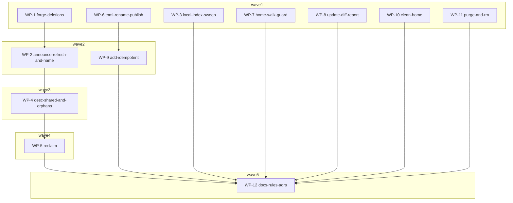

# Plan: Issue batch #477–#494 — index self-cleaning, re-claim, project manifest rename-publish, exec fixes

## Status

- **Plan:** plan_issue_batch_477_494
- **State:** review <!-- planning → plan-approved → executing → review → done -->
- **Tier:** high
- **Tier-grammar:** 5
- **Effective-tier:** derived
- **Active phase:** 3 — merged: WP-1 6645f12e, WP-6 9291e8b5, WP-11 64715604, WP-3 aa9543fc (+fixup 5517b91e), WP-2 5a63dc06, WP-8 b7579be2, WP-9 498f8cfd; WP-4 7aba248a, WP-7 fc4a2c5a; active: WP-10, WP-5, WP-12 (docs, no build; started early on the collected notes — commits only after WP-5's notes)
- **Step:** awaiting /hex-finalize (review loop closed after 3 rounds; PR #498 draft; CI verify-basic + verify-deep running on f8afbb2d; local verify #9 running)
- **Updated:** 2026-09-21
- **Last update:** 2026-09-21 (after 149e9480: chore(plan); plan-review fix pass applied; feature branch `goat`, frozen base 149e9480)
- **Next:** /hex-execute .claude/artifacts/plan_issue_batch_477_494.md (resume)
- **Verify-default:** scoped

---

## Overview

**Status:** Approved
**Author:** hex-plan orchestrator (tier high, trimmed: research=skip, architect=inline via three
opus mini-architects, adversary=off), 2026-09-21
**Design records:** `.agents/research/design_index_cluster.md`, `.agents/research/design_project_cluster.md`,
`.agents/research/design_exec_cluster.md` (gitignored; every decision restated below with its evidence,
so this plan is self-contained)
**Related issues:** [#494](https://github.com/ocx-sh/ocx/issues/494) [#490](https://github.com/ocx-sh/ocx/issues/490)
[#488](https://github.com/ocx-sh/ocx/issues/488) [#489](https://github.com/ocx-sh/ocx/issues/489)
[#487](https://github.com/ocx-sh/ocx/issues/487) [#486](https://github.com/ocx-sh/ocx/issues/486)
[#485](https://github.com/ocx-sh/ocx/issues/485) [#482](https://github.com/ocx-sh/ocx/issues/482)
[#481](https://github.com/ocx-sh/ocx/issues/481) [#477](https://github.com/ocx-sh/ocx/issues/477)
**Research:** skipped — every issue is a defect or small feature against code that already exists;
the design notes carry `file:line` evidence for each decision.

### Classification

- **Scope:** medium (one PR, 12 work packages, three clusters)
- **Reversibility:** two-way for the code. Published interfaces that change, each announced by its
  commit subject and nowhere else (CLAUDE.md § Stability tiers): `ocx package claim` on an
  already-claimed root exits 0 instead of 65 (#481); `ocx update` plain/JSON report shape (#489);
  `ocx package exec --rm` (#486); `announce`/`claim` gain a 65 refusal on a root-name mismatch (#477);
  `ocx.toml` inode rotates on every mutation (#494). Index wire format unchanged; the published index
  repo gains deletions of unreferenced objects.
- **Tier:** high — 6 crates, one always-on security perspective (`crates/ocx_config/**` in WP-7,
  WP-10; `crates/ocx_store/**` untouched).
- **Overlays:** architect=inline, research=skip, adversary=off

## Objective

Close ten open issues in one PR with the smallest correct change per issue, reusing the helpers the
codebase already has, and make every index write (announce, claim, refresh, local sync) leave no
orphaned object behind — dispatch objects and description blobs alike.

## Scope

### In scope

- **Index cluster**: #487 refresh on an empty tag set; #482 claim writes the description; #481
  re-claim unions owners; #477 root-name check on announce and claim; owner mandate — the published
  index and the local index collection sweep every object no root references, always on.
- **Project cluster**: #494 `ocx.toml` rename-publish with the mutex in `$OCX_HOME/locks`; #490
  idempotent `ocx add`; #489 `ocx update` change report with `-v/--verbose`; #485 the CWD walk skips
  `$OCX_HOME/ocx.toml`.
- **Exec cluster**: #488 `--clean` forwards `OCX_HOME`; #486 `ocx package exec --rm`.
- Docs, rules, ADR amendments, unit + acceptance tests for all of the above.

### Out of scope

- `ocx.lock.prev` (#489 item 4) — YAGNI; the predecessor lock is in memory for the whole commit and
  the rollback path already captures its bytes (`mutation.rs:122`).
- Retiring `LockedFile::replace_bytes` / `LockedTomlFile` — `LockedJsonFile` callers keep it.
- A `Forge` directory-listing read to reclaim objects orphaned *before* this ships — a one-time
  backlog for the indexbot; recorded in the ADR amendment.
- Forwarding `HOME` / `DOCKER_CONFIG` under `--clean` — pre-existing gap, unchanged.
- `--rm` on `ocx exec` (project tier: every package is lock-rooted → guaranteed no-op).
- Requiring `<domain>` to be a configured `[registries."<domain>"]` key for claim — announce imposes
  none today; consistency wins.
- Any `CHANGELOG.md` edit — generated from commit subjects.
- Asciinema casts — `ocx update` appears in no `test/doc_scripts/` scenario, no script adds the same
  binding twice, and docs-style forbids a cast whose value is a flag list. Verify with
  `grep -rn 'ocx update' test/doc_scripts/` before landing.

## Design

### Key decisions

| # | Decision | Rationale |
|---|---|---|
| D-1 | `NoCuratedTags` fires only for `TagSelection::Replace` and `UnionFile`; `Refresh`/`FromRegistry` return an empty `ResolvedTags` and proceed to `observe_desc`. No new outcome word. | The empty-set refusal guards against retraction; `Refresh` cannot retract. `AnnounceOutcome::desc_status` already discriminates a desc-only update (`announce/request.rs:128-133`). |
| D-2 | Claim calls announce's `observe_desc` + `build_files` (`pipeline` → `pub(crate)`); `ClaimError::Description(#[from] AnnounceError)` inherits the announce exit taxonomy. | One description observer, two callers. No parallel error family. |
| D-3 | `ClaimError::PackageAlreadyClaimed` is **deleted**; a committed root is a re-claim. Owners union by resolved `id`; `created`/`status`/`deprecated_message`/`tags` carry verbatim; `desc` re-observed; `upstream` given-replaces / absent-carries; `repository` mismatch → `RepositoryMismatch` (65). Nothing changed → `Unchanged`, exit 0. | #481. Repository decides where bytes come from and must not move as a side effect of adding an owner. |
| D-4 | `render_root` gains `carried: Option<&Value>` and emits the fixed nine-field order. | CONTRACTS §14 field order; mutating the parsed root in place would append `upstream` after `tags`. |
| D-5 | Announce refuses `root.name != claim::root_name(&id)` with `AnnounceError::RootNameMismatch` (65); absent `name` counts as mismatch. Claim raises `ClaimError::RootNameMismatch` (65) on the re-claim path only. | #477. 65 not 64: the argv is well-formed, two sides disagree — the `DescDisappeared` family. One spelling of the expected value. |
| D-6 | Published index: `Forge::commit_files` payload becomes `BTreeMap<String, FileChange>` with `enum FileChange { Put(Vec<u8>), Delete }`; `pipeline::orphan_paths` (signature in C-006) = `referenced(prev) \ referenced(new)` where referenced = `tags[].content ∪ desc.readme ∪ desc.logo`; logo extension resolved by probing `<hex>.png` then `<hex>.svg` via `get_file_contents`. Folded into `build_files`; always on. | Owner mandate. One ordered map keeps C15 atomicity; diffing referenced sets needs no listing API. Every driver is compiler-forced to handle `Delete`. |
| D-7 | Local index: new `regenerate::sweep_orphan_objects(store, source, repository)` removes `p/<ns>/<pkg>/o/<algo>/<hex>.json` not named by any `tags[].content` of the on-disk root; called at the end of `LocalIndex::refresh_published` and `refresh_derived` inside the source lock. `regenerate_catalog` keeps its "removes no object" contract. | `regenerate_catalog` runs on served checkouts an operator owns; the sweep belongs on the write path only. `.json` scope: the only extension ocx writes locally. |
| D-8 | `ocx.toml` is published by rename via `init_project`'s existing `atomic_write` helper (extended: preserves the existing file's Unix mode, `persist_temp_file` + parent fsync); mutex moves to `lock_scoped(locks_root, "project-mutate", <config dir>, <file name>, budget)` in `$OCX_HOME/locks`; readers become plain bounded reads. **Not** `write_bytes_atomic` (publishes 0o600). | #494. `arch-principles.md` § Locking Policy already mandates `$OCX_HOME/locks` for rename-replaced data; `ocx_config/src/edit.rs` is the working instance. |
| D-9 | `add.rs` partitions bindings before staging: absent → today; present + equal identifier → no manifest edit, lock-only commit if unlocked, skipped if locked (never re-resolve a locked binding); present + different identifier → `BindingAlreadyExists` 64 with an improved message. Info line on stderr: `<name> is already added; use \`ocx update <name>\` to move it`. JSON unchanged (`LockReport`). | #490. Re-resolving `:latest` is `ocx update`'s job. |
| D-10 | New `UpdateReport { changes: [{name, group, platform, tag, from, to}], unchanged: [...], metadata_changed }`; key `(group, name, platform)`, value = pull identifier string (`repository.clone_with_digest(leaf)`); `from`/`to` `Option<String>`. Plain: one 5-column table `Binding | Group | Platform | From | To` (last 12 hex), hint line naming `--verbose` when `unchanged` non-empty; `-v/--verbose` appends unchanged rows, JSON payload identical at both verbosities. `--check` prints the report then exits 65 when non-empty. `lock_content_matches` deleted. | #489. Matches the `ocx version --verbose` / `ocx shell state -v` rendering-tier contract; the pull identifier catches a repository move a digest diff would miss. |
| D-11 | `walk_for_project_file` resolves `home::default_ocx_root()` once (lexically normalized) and skips a candidate whose directory equals it, continuing upward; debug log, not warn. `ProjectConfig::resolve` signature unchanged. | #485. One definition of `$OCX_HOME`; skip-and-continue so a nested home inside a real project still finds the project. |
| D-12 | `Env::apply_ocx_config` sets `OCX_HOME` from `crate::home::default_ocx_root()` — set-always; `env::keys::OCX_HOME` const added. `HOME` stays stripped. | #488. Single allowlist; every spawn site (six + plugin dispatch) reaches it. `--script` fixed by the same change. |
| D-13 | `ocx package exec --rm`: after the child exits, `PackageManager::purge_unrooted(&[PinnedIdentifier])` builds the collector with `clean`'s roots (`collect_project_roots` + `resolve_site_patch_roots(RecordedAndSnapshot)`), drops seeds already reachable, purges the rest; `RetainAll` → retain everything + warn. `--rm` selects `spawn_and_wait` + `propagate_exit_code` instead of `launch::exec`. Removal failure warns on stderr, never overrides the child's exit code. stderr only. | #486. `uninstall` is a no-op (no candidate symlink); `purge_all` would delete lock-pinned packages. Docker semantics; exit-code contract in `command-line.md` publishes the child's status. |

### Component contracts

Numbered `C-`; each names the WP that owns it.

**Index cluster**

- **C-001** (WP-1) `crates/ocx_announce/src/forge/api.rs`: `pub enum FileChange { Put(Vec<u8>), Delete }`; `Forge::commit_files(&self, …, files: &BTreeMap<String, FileChange>, …)`. Each driver — `forge/github.rs` (tree entry `sha: null`), `forge/gitlab.rs` (action `delete`), `forge/git_workspace.rs` (`git rm`) — applies `Delete` for a path that exists and treats `Delete` of an absent path as a no-op (never an error). `test/tests/fake_forge.py` `handle_post_tree` drops an entry with `sha: null`; the GitLab commits handler honours `delete`.
- **C-002** (WP-2) `pipeline::resolve_curated_tags`: `Refresh` and `FromRegistry` with an empty resulting set return `Ok(ResolvedTags { tags: vec![], reserved_dropped })`; `Replace`/`UnionFile` keep `NoCuratedTags`. The announce pipeline proceeds to `observe_desc` on an empty set; an empty-`tags` root regenerates byte-identical → `unchanged` unless `desc` moved → `updated`, `desc_status: updated`.
- **C-003** (WP-2) `AnnounceError::RootNameMismatch { path, committed, expected }` → `ExitCode::DataError` (65), raised immediately after the root-shape check in `announce.rs`, `expected = crate::claim::root_name(&request.package)`; absent `name` → `committed: ""`. `ClaimError::RootNameMismatch { committed, expected }` and `ClaimError::RepositoryMismatch { committed, supplied }` → 65; `ClaimError::Description(#[from] AnnounceError)` → `inner.classify()`, `kind_detail` `"description"`. `claim/error.rs` arity assertion (`claim_error_messages_follow_style`, currently 13): WP-2 adds the three variants and sets it to **16** in the same commit; WP-5 deletes `PackageAlreadyClaimed` and sets it to **15**. Each WP's gate is green on its own.
- **C-004** (WP-3) `pub async fn sweep_orphan_objects(store: &IndexStore, source: &str, repository: &str) -> Result<Vec<String>>` in `crates/ocx_index/src/regenerate.rs`: removes every `p/<ns>/<pkg>/o/<algo>/<hex>.json` whose `<hex>` is not named by any `tags[].content` in the package's on-disk root; returns removed relative paths; leaves non-`.json` files alone; a missing root document → `Ok(vec![])`. Called once per package at the end of `LocalIndex::refresh_published` and `refresh_derived` inside the source lock. `regenerate_catalog` unchanged.
- **C-005** (WP-4) `pipeline` is `pub(crate)`. `guarded_physical(pointer: &str, registry_name, trusted, insecure) -> Result<Physical, AnnounceError>`; `observe_and_rebuild` lifts `repository` and keeps raising `RootMissingField`. `observe_desc(publisher, physical, committed_root) -> Result<ObservedDesc, AnnounceError>` contract unchanged: `desc` is `Some` iff the observed `__ocx.desc` digest differs from `committed_root.desc.digest` (both-absent = equal); `blobs` carries the full payload set whenever a description is served; committed-but-unserved → `DescDisappeared`. Unit: after the `repository` lift, a root without `repository` still raises `RootMissingField` (the invariant the refactor could drop).
- **C-006** (WP-4) `pub(crate) async fn orphan_paths(previous_root: Option<&Value>, new_root: &Value, package_repo: &str, forge: &dyn Forge, repo: &RepoCoordinate, base_ref: &str) -> Result<Vec<String>, AnnounceError>` (`Forge::get_file_contents(&self, repo: &RepoCoordinate, path: &str, r#ref: &str) -> Result<Option<Vec<u8>>, ForgeError>` is the probe; a probe `ForgeError` **propagates** through the existing `AnnounceError` forge variant — never a silent skip, an orphan left behind by a transport error is still an orphan and the run should say so): `referenced(prev) \ referenced(new)` over `tags[].content` ∪ `desc.readme` ∪ `desc.logo`; a `.json` path per tag hex, a `.md` per readme hex, the logo probed `.png` then `.svg` via `Forge::get_file_contents` at the parent ref (the ref already threaded as `RootRead::base_sha`/`committed_root`), and skipped when neither answers (`Ok(None)` twice). `build_files` folds the result as `FileChange::Delete` entries; a path both put and deleted is unrepresentable (the map is keyed by path, `Put` wins because a referenced object is never an orphan by construction). `previous_root == None` (fresh claim) → `Ok(vec![])` without any probe.
- **C-007** (WP-5) `claim::claim(request, forge, publisher)`; `ClaimRequest` gains `trusted_hosts: Vec<String>`, `insecure_hosts: Vec<String>`. Fresh claim: rendered root with `desc` from `observe_desc` (`None` when no `__ocx.desc`), blobs in the same commit. Re-claim (a root exists at `INDEX_BASE_REF`): field rules per D-3; `render_root(…, carried: Option<&Value>)` emits nine fields in fixed order; `name` mismatch → `RootNameMismatch`; `repository` mismatch → `RepositoryMismatch`; byte-identical root + no new blob + no orphan → `ClaimStatus::Unchanged`, no write. Orphan desc blobs from the previous root are deleted via C-006. `package_claim.rs` sources the two host lists exactly as `package_announce.rs` does; `argv_faults` still runs before any network I/O.

**Project cluster**

- **C-008** (WP-6) `ocx_project::mutate::atomic_write(path, bytes)` (extended from `init_project`'s helper): temp file in the parent dir, existing file's Unix mode copied onto it when present (tempfile default otherwise), `persist_temp_file`, parent fsync. All four write sites (`mutate.rs` `add_binding`/`remove_binding`/`set_activate`, `mutation.rs` `MutationGuard::commit`) use it; no `replace_bytes` on `ocx.toml`. `acquire_project_lock{,_for_file}(…, locks_root: &Path)` → `lock_scoped(locks_root, "project-mutate", config_dir, config_file_name, CONTENTION_BUDGET)`; no `.lock` beside `ocx.toml`; `read_config_via_guard` and `project_context.rs`'s snapshot load become plain `read_bounded` reads under `FILE_SIZE_LIMIT_BYTES`; `refuse_symlink_at` runs once before the read. Prose at `project_lock.rs:4-23` and `mutation.rs:247-260` rewritten to state rename-publish; the Windows rationale paragraph deleted.
- **C-009** (WP-6) tests: `replace_bytes_keeps_ocx_toml_inode_stable` inverted and renamed (rename-publish rotates the inode); `replace_bytes_via_locked_handle_no_lock_violation` → publish succeeds under a held scoped lock (Windows); `a_symlink_planted_during_the_retry_loop_is_refused` → plain "symlink at `ocx.toml` is refused"; `acquire_project_lock_leaves_no_sidecar` keeps name and meaning; new: concurrent reader never observes a short/spliced document (the #441 shape from `auth/store.rs`); new Unix-gated: a 0644 `ocx.toml` stays 0644 after `ocx add`. `test/tests/test_project_crash_recovery.py`: SIGKILL at `OCX_TEST_FAULT=pause_before_manifest_write` leaves `ocx.toml` intact; `test_project_concurrency.py` rows updated to the new contract.
- **C-010** (WP-7) `ConfigLoader::walk_for_project_file`: skips a candidate at `home::default_ocx_root()` (lexically normalized, compared to `current`), keeps walking; debug-logged. Unit: `$OCX_HOME/{ocx.toml,sub/}` → `walk_for_project_file($OCX_HOME/sub, None) == None`; `ProjectConfig::resolve(.., global = true)` still selects `$OCX_HOME/ocx.toml`; `OCX_NO_PROJECT=1` still hard `None`. Acceptance (`test_project_config.py`): from a cwd under `$OCX_HOME`, a project-tier command exits 64 "no project", and `ocx --global lock` from the same cwd resolves `$OCX_HOME/ocx.toml`.
- **C-011** (WP-8) `crates/ocx_cli/src/api/data/update.rs`: `UpdateReport { changes: Vec<BindingChange>, unchanged: Vec<BindingState>, metadata_changed: bool }`, `BindingChange { name, group, platform, tag: Option<String>, from: Option<String>, to: Option<String> }`, `BindingState { name, group, platform, tag, digest: String }`; `VerboseUpdateReport(UpdateReport)` newtype with transparent serde; `UpdateReport::diff(previous: Option<&ProjectLock>, next: &ProjectLock, config: &ProjectConfig) -> Self` (`None` = no predecessor lock: every pin reports as newly introduced). `unchanged` lists only the bindings the run examined (a scoped run omits out-of-scope bindings). Digests abbreviate via the CLI-wide `Digest::to_short_string` (first 12 hex, `sha256:`-prefixed). Plain rendering per D-10 (≤5 columns, `sha256:`+12-hex digests, `Binding` = `name` or `name:tag`, hint line when unchanged non-empty and not verbose). `ocx update -v/--verbose` flag. `--check` → report printed, then exit 65 iff `!changes.is_empty() || metadata_changed`. `lock_content_matches` deleted; its tests move onto `diff`. Unit cases: digest move, added platform, dropped platform, added binding, dropped binding, repository move, metadata-only, serde parity verbose == plain.
- **C-012** (WP-9) `add.rs` partition per D-9: key = `name` if given else `ocx_project::binding_key`, scoped to the target group; equality = `Identifier` equality against `config.tools[key]` / `groups[g].tools[key]` (both sides carry the `:latest` default). Present+equal+unlocked → in `touched`, commit `staged.lock_only()`, manifest byte-identical; present+equal+locked → not touched, one stderr status line; whole batch present+locked → guard rolled back, no write, report existing lock. A batch repeating the same identifier twice is idempotent (second occurrence collapses), not an atomic abort. Present+different → `BindingAlreadyExists` 64, message names both identifiers and points at `ocx remove`+`ocx add` or `ocx update <name>`. Library duplicate tests in `mutate.rs` untouched.

**Exec cluster**

- **C-013** (WP-10) `ocx_config::env::keys::OCX_HOME`; `Env::apply_ocx_config` sets `OCX_HOME` to `crate::home::default_ocx_root()` when `Some` (absolute; an ambient `OCX_HOME=""` becomes the absolute fallback); never removes. Unit: `Env::clean()` + `apply_ocx_config` under `EnvLock::isolate_project_home()` carries the temp root; second arm with `OCX_HOME=""`. Mutation proof: delete the `set` line → both red. `clean_env_carries_no_ocx_keys` untouched. The three literal `"OCX_HOME"` sites (`ocx_script/src/ocx_module.rs:73`, `ocx_shim/src/main.rs:348`) are left as-is unless the const is trivially reachable — the shim crate is a separate wire ABI and stays untouched.
- **C-014** (WP-11) `GarbageCollector::reachable(&self) -> HashSet<PathBuf>` (delegates to `graph.reachable()`); `PackageManager::purge_unrooted(&self, identifiers: &[PinnedIdentifier]) -> Result<PurgeUnrooted { removed: Vec<PathBuf>, retained: Vec<PinnedIdentifier> }>` per D-13, seeds canonicalized before the membership test, `RetainAll` → everything retained. Unit: candidate-symlinked seed survives; project-root-pinned seed survives; unrooted seed deleted. Mutation proof: drop `collect_project_roots` from the builder → the project-root case reds.
- **C-015** (WP-11) `ocx package exec --rm` (clap flag on `command/exec.rs`; `ocx exec` untouched): with the flag, `spawn_and_wait` + `propagate_exit_code`, then `purge_unrooted` over the composed package's pinned identifiers; `context.ui().status` per removed path, `warn` per retained/failed; child exit code preserved verbatim including on removal failure. Without the flag: byte-identical behaviour (`launch::exec`).

### User-experience scenarios

- **S-001** (WP-2/WP-4) `describe` then `announce --refresh` on a claimed, unreleased package → exit 0, `status: updated`, `desc_status: updated`; run again → `unchanged`. an empty `--tags-file` still 64 (`--tags ''` exits 79: clap's comma delimiter yields one empty tag name, refused as unresolved — pre-existing, unchanged).
- **S-002** (WP-5) `ocx package claim <domain>/<ns>/<pkg> --repository R --owner alice` on an unclaimed package whose registry serves `__ocx.desc` → the claim PR carries `desc` and the readme/logo blobs.
- **S-003** (WP-5) A second `claim … --owner bob` → PR adds `bob` to `owners`, `created` and `tags` unchanged, exit 0; a third with `--owner bob` again → `status: unchanged`, exit 0, no PR. With `--repository OTHER` → exit 65 `RepositoryMismatch` naming both. Against a root whose `name` is `other.example/ns/pkg` → exit 65 `RootNameMismatch`.
- **S-004** (WP-2) `announce acme/ns/pkg …` against a root whose `name` is `other.example/ns/pkg` → exit 65, message names both values; `--out dir` render on a machine with no `[registries]` entry still works.
- **S-005** (WP-4) Announce twice with a tag whose digest moved → the second PR's tree lacks the old `o/<algo>/<hex>.json` and has the new one; a changed readme removes the old `.md`; a logo change png→svg removes the `.png`. Nothing moved → no deletions.
- **S-006** (WP-3) `ocx index update` (local) after a remote pin moved → the old dispatch object is gone from `$OCX_HOME/index/…/o/`, a `.md` blob beside it survives.
- **S-007** (WP-6) `ocx add x` while `ocx status` loops in another shell → the reader never sees a torn/short manifest; `kill -9` mid-write leaves `ocx.toml` intact; a 0644 manifest stays 0644; no `ocx.toml.lock` in the project.
- **S-008** (WP-9) `ocx add cmake && ocx add cmake` → both exit 0, second prints `cmake is already added; use \`ocx update cmake\` to move it` on stderr, `ocx.toml` byte-identical; after a failed pull, a re-add pulls; `ocx add cmake:3.30` after `cmake` → 64 with both identifiers in the message.
- **S-009** (WP-8) `ocx update` after a tag bump → table lists only moved bindings plus a hint line; `-v` shows all; `--check` lists and exits 65; `--format json` carries `changes`/`unchanged`/`metadata_changed` at both verbosities; nothing moved → empty table, exit 0.
- **S-010** (WP-7) `cd $OCX_HOME/packages/x && ocx --format json status` → 64 "no project"; `ocx -g shell state` from the same cwd → `toolchain_home: $OCX_HOME/toolchain`; `OCX_NO_PROJECT=1` likewise.
- **S-011** (WP-10) `ocx package exec --clean pkg -- sh -c 'printf %s "$OCX_HOME"'` prints the parent's absolute home; a bundle whose entrypoint dispatches through a generated launcher runs under `--clean` with `OCX_HOME` at a fresh dir → exit 0 (was 78). `HOME` absent.
- **S-012** (WP-11) `ocx package exec --rm pkg -- cmd` → package store path from `ocx package which` (captured before) is gone afterwards; child exit 3 → 3; a package also `ocx package install`ed survives with its candidate symlink resolving.

### Error taxonomy

| Error | Exit | Introduced by |
|---|---|---|
| `AnnounceError::RootNameMismatch` | 65 | C-003 |
| `ClaimError::RootNameMismatch`, `ClaimError::RepositoryMismatch` | 65 | C-003 / C-007 |
| `ClaimError::Description(AnnounceError)` | inherits (`Ssrf`, `ObserveDesc`, `DescDisappeared` …) | C-003 |
| `ClaimError::PackageAlreadyClaimed` | **deleted** (was 65) | C-007 |
| `ProjectErrorKind::BindingAlreadyExists` | 64, unchanged, better message | C-012 |
| `ocx update --check` non-empty diff | 65, unchanged, now with the list on stdout | C-011 |
| `--rm` removal failure | child's code preserved, warning on stderr | C-015 |

### Edge cases

- Empty curated set under `Refresh` with every committed tag reserved → `reserved_tags_dropped` populated, no error (C-002).
- Re-claim where the forge canonicalizes a supplied owner login to an existing `id` → `Unchanged` (C-007).
- `orphan_paths` when the same hex is referenced by a tag and as readme (impossible by content type but harmless): it is in `referenced(new)` → not an orphan.
- Logo probe where neither `.png` nor `.svg` exists at the parent ref → skip silently (C-006).
- `ocx.toml` absent at `atomic_write` time (init) → tempfile default mode (C-008).
- `add` with `--name` alias colliding with an existing key of a different identifier → 64 (C-012).
- `update` where a platform vanished from the lock → `to: None` row (C-011).
- `$OCX_HOME` spelled through a symlink → lexical comparison misses; documented limitation, same as `OCX_CEILING_PATH` (C-010).
- `--rm` when `collect_project_roots` returns `RetainAll` → nothing removed, one warning (C-014).
- `--rm` with SIGKILL of ocx itself → no cleanup (documented, same as docker).

## Parallelization

| WP | Repo | Scope (C-/S-) | Expected files | Size | Wave | Depends-on | Review | Verify | Status |
|---|---|---|---|---|---|---|---|---|---|
| WP-1 forge-deletions | . | C-001 | `crates/ocx_announce/src/forge/api.rs`, `crates/ocx_announce/src/forge/github.rs`, `crates/ocx_announce/src/forge/gitlab.rs`, `crates/ocx_announce/src/forge/git_workspace.rs`, `crates/ocx_announce/src/forge.rs` (re-export only if needed), `test/tests/fake_forge.py`, `crates/ocx_announce/src/announce/pipeline.rs` (**only** `build_files`' return type → `BTreeMap<String, FileChange>` wrapping every entry in `Put`, so no adapter is ever written at a call site), and every in-crate `commit_files` call site/test fixture that must compile against the new payload type (`crates/ocx_announce/src/announce.rs` `:337`, `:498`, test fake `:1496`; `crates/ocx_announce/src/claim.rs` `:287`, `:342` — mechanical, no behaviour change; WP-2/WP-4/WP-5 re-touch these files in later waves, sequentially) | M | 1 | — | | scoped | merged |
| WP-2 announce-refresh-and-name | . | C-002, C-003, S-001 (refresh half), S-004 | `crates/ocx_announce/src/announce/pipeline.rs` (`resolve_curated_tags` + tests only), `crates/ocx_announce/src/announce.rs` (root-name check only), `crates/ocx_announce/src/announce/error.rs`, `crates/ocx_announce/src/claim/error.rs`, `crates/ocx_cli/src/exit/ocx_announce.rs`, `test/tests/test_announce.py` (rows for S-001 refresh, S-004) | M | 2 | WP-1 | | scoped | merged |
| WP-3 local-index-sweep | . | C-004, S-006 | `crates/ocx_index/src/regenerate.rs`, `crates/ocx_index/src/local_index.rs`, `test/tests/test_index_selfcontained.py` (S-006 home — its dispatch-object count assertions at `:146`, `:213`, `:322`, `:423` are collateral), `test/tests/test_index.py` (`:260-290` asserts on the same local `o/sha256` dir) | M | 1 | — | | scoped | merged |
| WP-4 desc-shared-and-orphans | . | C-005, C-006, S-001 (desc half), S-005 | `crates/ocx_announce/src/announce/pipeline.rs` (`guarded_physical`, `orphan_paths`, `build_files`, visibility), `crates/ocx_announce/src/announce.rs` (`pub(crate) mod pipeline`, field lift, orphan fold), `test/tests/test_announce.py` (S-005 rows) | M | 3 | WP-1, WP-2 | risk | scoped | merged |
| WP-5 reclaim | . | C-007, S-002, S-003 | `crates/ocx_announce/src/claim.rs`, `crates/ocx_announce/src/claim/root.rs`, `crates/ocx_announce/src/claim/request.rs`, `crates/ocx_announce/src/claim/error.rs` (delete `PackageAlreadyClaimed`, arity), `crates/ocx_cli/src/command/package_claim.rs`, `crates/ocx_cli/src/exit/ocx_announce.rs` (drop the deleted arm), `test/tests/test_package_claim.py` | L | 4 | WP-4 | risk | scoped | merged |
| WP-6 toml-rename-publish | . | C-008, C-009, S-007 | `crates/ocx_project/src/project_lock.rs`, `crates/ocx_project/src/mutate.rs`, `crates/ocx_project/src/mutation.rs`, `crates/ocx_cli/src/app/project_context.rs`, `crates/ocx_project/src/lock.rs` (test call sites `:1877-1950`), `crates/ocx_package_manager/src/mutate.rs` (test call site `:553`), `test/tests/test_project_concurrency.py`, `test/tests/test_project_crash_recovery.py`, `test/tests/test_project_toml_preservation.py` | L | 1 | — | risk | full | merged |
| WP-7 home-walk-guard | . | C-010, S-010 | `crates/ocx_config/src/loader.rs`, `test/tests/test_project_config_home_walk.py` (new), `test/SUITE_FLOOR` | S | 1 | — | | scoped | merged |
| WP-8 update-diff-report | . | C-011, S-009 | `crates/ocx_cli/src/api/data/update.rs` (new), `crates/ocx_cli/src/api/data.rs`, `crates/ocx_cli/src/command/update.rs`, `test/tests/test_update.py`, `test/tests/test_update_report.py` (new), `crates/ocx_schema/src/reports.rs`, `crates/ocx_schema/tests/golden/reports.json`, `test/SUITE_FLOOR` | M | 1 | — | | scoped | merged |
| WP-9 add-idempotent | . | C-012, S-008 | `crates/ocx_cli/src/command/add.rs`, `test/tests/test_project_add.py` | M | 2 | WP-6 (S-008 asserts `ocx.toml` byte-identical after a re-add; WP-6 replaces the write path that produces those bytes) | | scoped | merged |
| WP-10 clean-home | . | C-013, S-011 | `crates/ocx_config/src/env.rs`, `crates/ocx_config/src/home.rs`, `crates/ocx_script/src/ocx_module.rs`, `test/tests/test_exec_clean_home.py` | S | 1 | — | sec | scoped | merged |
| WP-11 purge-and-rm | . | C-014, C-015, S-012 | `crates/ocx_package_manager/src/tasks/purge.rs`, `crates/ocx_package_manager/src/tasks/garbage_collection.rs`, `crates/ocx_package_manager/src/lib.rs` (export, if needed), `crates/ocx_cli/src/command/exec.rs`, `test/tests/test_exec.py` | M | 1 | — | | scoped | merged |
| WP-12 docs-rules-adrs | . | every S- as prose; `SUITE_FLOOR` | `website/src/docs/authoring/announcing.md`, `website/src/docs/reference/command-line.md`, `website/src/docs/in-depth/indices.md`, `website/src/docs/in-depth/project.md`, `website/src/docs/in-depth/storage.md`, `website/src/docs/user-guide.md`, `website/src/docs/reference/environment.md`, `website/src/docs/reference/env-composition.md`, `website/src/docs/in-depth/environments.md`, `.claude/rules/subsystem-cli-commands.md`, `.claude/rules/subsystem-oci.md`, `.claude/rules/arch-principles.md`, `.claude/artifacts/adr_index_claim_command.md` (amendment), `.claude/artifacts/adr_project_lock_inplace.md` (Superseded), `.claude/artifacts/adr_file_lock_unification.md` (amendment), `.claude/artifacts/adr_project_toml_rename_publish.md` (new), `test/SUITE_FLOOR` | M | 5 | WP-1…WP-11 | | full | merged |

Justifications: WP-7 and WP-10 stay isolated below the overhead floor because each lives in a
different crate from every sibling and carries its own acceptance file — folding either into a
neighbour would couple `ocx_config` to a `ocx_cli`/`ocx_project` WP for no shared file. WP-6 `full`:
it changes how every `ocx.toml` mutation is published and the lock location — a default nothing
textually references. WP-12 `full`: last merge, whole-tree gate before review.

**Critical path:** WP-1 → WP-2 → WP-4 → WP-5 → WP-12.
**Shippable after wave:** 4 — every issue closed; WP-12 documents what shipped.
**Merge plan (serialized, topological):** WP-1, WP-7, WP-10, WP-3, WP-8, WP-11, WP-6, WP-2, WP-9, WP-4,
WP-5, WP-12 — `cargo check` + the WP's `Verify` after each.
**Build slot:** host cap — at most 3 worktrees alive, 2 build-capable at once (16 GB), full verifies
one at a time (`hex.md › Memory`). Launch wave 1 critical-path-first: WP-1, WP-6 first.
**Effective tier histogram:** `effective tier: high 12 (ceiling high)` — printed at spawn per WP.

## Implementation steps

Every WP runs Stub → Specify → Implement → Review. Per-WP specifics:

### WP-1 forge-deletions
- Stub: `FileChange`, new `commit_files` signature; drivers `todo!()` on `Delete`; wrap every existing caller's bytes in `Put` (mechanical).
- Specify: per-driver unit test that a `Delete` entry produces a `sha: null` tree entry / `delete` action / `git rm`; a `Delete` of an absent path is a no-op. `fake_forge.py` handlers updated with a test in `test/tests/test_fake_forge.py` if one exists (else inline in `test_announce.py` under WP-4).
- Implement; Review: spec.

### WP-2 announce-refresh-and-name
- Stub: new error variants + exit arms (compiler-forced); `resolve_curated_tags` signature unchanged.
- Specify: rewrite `pipeline::tests::empty_curated_set_is_an_error` (Replace/UnionFile only), `resolve_curated_tags_all_reserved_is_no_curated_tags` (Refresh half → Ok with drops); announce unit tests for `{matching, differing, absent}` name; acceptance S-001 refresh rows, S-004.
- Implement; Review: spec.

### WP-3 local-index-sweep
- Stub: `sweep_orphan_objects` `todo!()`.
- Specify: moved pin → old `.json` removed, control `.md` survives, missing root → empty; `regenerate_removes_no_root_document_and_no_dispatch_object` still green.
- Implement (call sites at the end of `refresh_published`/`refresh_derived`; the sweep logs at `debug!` **only** — `local_index.rs` `production_half()` guards (`:1560-1670`, C-026) count the module's operator-facing output lines and scan the text between the two functions; re-read that guard before adding the call); Review: spec.

### WP-4 desc-shared-and-orphans
- Stub: `pub(crate) mod pipeline`, `guarded_physical(&str, …)`, `orphan_paths` `todo!()`.
- Specify: `orphan_paths` over {tag moved, tag removed, desc moved, logo png→svg, nothing moved, prev None}; mutation proof — delete the diff call → "old object still present" assertion reds; C-005 `RootMissingField` unit case; acceptance S-005 via the fake forge's tree, and S-001's description half (seed `__ocx.desc` on a claimed empty-`tags` root, `--refresh` → `status: updated`, `desc_status: updated`; rerun → `unchanged`).
- Implement; Review: spec + quality (risk).

### WP-5 reclaim
- Stub: `claim(request, forge, publisher)`, request fields, `render_root(…, carried)`, delete `PackageAlreadyClaimed`.
- Specify: re-claim table (owners union, already-present → Unchanged, `created`/`tags` preserved, repository mismatch, upstream given/absent, name mismatch); SSRF pre-flight ordering mirror of `from_registry_refuses_a_forbidden_host_before_listing_any_tag`; `--out` parity; acceptance S-002/S-003; delete the exit-65 row.
- Implement; Review: spec + quality (risk).

### WP-6 toml-rename-publish
- Stub: `atomic_write` extended signature, `acquire_project_lock*(…, locks_root)`.
- Specify: C-009 test set (inverted inode test, mode preservation, concurrent reader, SIGKILL crash case, symlink refusal).
- Implement; Review: spec + quality (risk); `Verify: full`.

### WP-7 home-walk-guard
- Stub: none (guard inside an existing fn). Specify: C-010 both halves. Implement; Review: spec + security (always-on for `crates/ocx_config/**`).

### WP-8 update-diff-report
- Stub: `UpdateReport`, `BindingChange`, `BindingState`, `VerboseUpdateReport`, `diff` `todo!()`, `-v` flag.
- Specify: C-011 unit cases + serde parity; acceptance S-009.
- Implement (delete `lock_content_matches`); Review: spec.

### WP-9 add-idempotent
- Stub: partition helper in `add.rs`. Specify: acceptance S-008 rows incl. rewritten `test_add_batch_atomic_on_duplicate_in_batch`. Implement; Review: spec.

### WP-10 clean-home
- Stub: `keys::OCX_HOME`. Specify: C-013 unit arms + acceptance S-011. Implement; Review: spec + security (always-on).

### WP-11 purge-and-rm
- Stub: `reachable()`, `purge_unrooted` `todo!()`, `PurgeUnrooted`, `--rm` flag parsed but unwired.
- Specify: C-014 unit set with the mutation proof; acceptance S-012.
- Implement (spawn-and-wait branch); Review: spec.

### WP-12 docs-rules-adrs
- Every docs surface in the file set; `SUITE_FLOOR` raised to the new passed count measured on the merged branch (one commit, same as the docs); `task claude:tests` and `task website:build` green; `doc-reviewer` pass over the rendered reports (`ocx update`, `ocx package claim`, `ocx package exec --rm`, `--clean`) vs the pages.

## Testing strategy

Unit tests live beside the code (`#[cfg(test)]`); acceptance tests in `test/tests/` run via
`task test:parallel --force -- <file>` from the repo root (never a hand-rolled `uv run pytest`), one
suite at a time under `.agents/acceptance-suite.lock`. Every regression test is shown red against the
pre-fix code (revert-and-rerun or the named mutation) before it counts. Each WP's merge gate is its
`Verify` cell; the final gate before `/hex-review` is `task verify` (full) on the feature branch.

## Risks

| Risk | Mitigation |
|---|---|
| A concurrent announce PR references an object this run deletes | Self-heals: the next announce re-writes every curated tag's bytes (`pipeline.rs:801-807`); recorded in the ADR amendment, no cross-branch check. |
| `atomic_write` mode handling silently makes `ocx.toml` owner-only | Unix-gated assertion in C-009; `write_bytes_atomic` explicitly not used. |
| `--rm` deletes something another root holds | `purge_unrooted` drops reachable seeds; three unit cases + mutation proof (C-014). |
| `fake_forge.py` ignores deletions → S-005 vacuous | C-001 makes the fake honour `sha: null`/`delete`; S-005 asserts absence, and a control run with nothing moved asserts presence. |
| Build slot contention on this host | Cap per `hex.md › Memory`; wave 1 launches critical-path-first. |

## Open questions

None — every decision is recorded in § Design with its evidence.

## Schedule log

<!-- append-only; one `merged` line per merge, one `phase` line per completed phase -->
- 2026-09-20T23:24:47Z · merged WP-1 @ 6645f12e · verify scoped (ff; builder's in-tree gates: nextest 8222/8222, acceptance announce+claim 97/97, gitlab 101/101, fakes 4/4 all VERIFY_EXIT=0) · ready: WP-2 WP-3 WP-7 WP-8 WP-10 · blocked: WP-4 (WP-2) WP-5 (WP-4) WP-9 (WP-6) WP-12 (all)
- 2026-09-20T23:56:10Z · merged WP-6 @ 9291e8b5 · verify full(column) [builder's in-tree task verify VERIFY_EXIT=0 at 0bdbd6cc; post-merge nextest ocx_project+ocx_announce 859/859] · ready: WP-2 WP-7 WP-8 WP-9 WP-10 · blocked: WP-4 (WP-2) WP-5 (WP-4) WP-12 (all)
- 2026-09-21T00:09:51Z · merged WP-11 @ 64715604 · verify scoped [post-merge cargo check ocx all-targets + nextest ocx_package_manager 1107/1107; builder's in-tree scoped→full verify VERIFY_EXIT=0 at e94afb07, targeted re-gate at 8ead030f] · ready: WP-7 WP-8 WP-9 WP-10 · blocked: WP-4 (WP-2) WP-5 (WP-4) WP-12 (all)
- 2026-09-21T00:29:19Z · merged WP-3 @ aa9543fc · verify scoped [post-merge cargo check ocx all-targets + nextest ocx_index 454/454; builder's in-tree acceptance 34/34 VERIFY_EXIT=0 at ca3aa01a] · ready: WP-7 WP-9 WP-10 · blocked: WP-4 (WP-2) WP-5 (WP-4) WP-12 (all)
- 2026-09-21T00:54:51Z · merged WP-2 @ 5a63dc06 · verify scoped [post-merge cargo check ocx all-targets + nextest ocx_announce 404/404; builder's in-tree: unit 1781/1781, acceptance 8 modules 240 passed VERIFY_EXIT=0] · ready: WP-4 WP-7 WP-10 · blocked: WP-5 (WP-4) WP-12 (all)
- 2026-09-21T01:13:58Z · merged WP-8 @ b7579be2 · verify scoped [post-merge cargo check ocx all-targets + nextest ocx+ocx_schema 1429/1429; builder's in-tree acceptance 35/35 VERIFY_EXIT=0 at 5039f5c2; SUITE_FLOOR conflict resolved 3825+5=3830] · ready: WP-7 WP-10 · blocked: WP-5 (WP-4) WP-12 (all)
- 2026-09-21T01:45:17Z · merged WP-9 @ 498f8cfd · verify scoped [post-merge cargo check ocx all-targets + nextest ocx_project+ocx 1862/1862; builder's in-tree acceptance 28/28 VERIFY_EXIT=0 at cb0c4631; SUITE_FLOOR 3830+7=3837] · ready: WP-10 · blocked: WP-5 (WP-4) WP-12 (all)
- 2026-09-21T01:47:29Z · merged WP-4 @ 7aba248a · verify scoped [post-merge cargo check ocx all-targets + nextest ocx_announce 412/412; builder's in-tree acceptance 106/106 VERIFY_EXIT=0 at cc37e797; SUITE_FLOOR 3837+3=3840] · ready: WP-5 · blocked: WP-12 (all)
- 2026-09-21T02:08:23Z · merged WP-7 @ fc4a2c5a · verify scoped [post-merge cargo check ocx all-targets + nextest ocx_config 620/620; builder's in-tree acceptance 14/14 VERIFY_EXIT=0 at 40adb8de; SUITE_FLOOR 3840+1=3841] · ready: — · blocked: WP-12 (WP-5, WP-10)
- 2026-09-21T02:31:00Z · merged WP-10 @ 2e14b677 · verify scoped [post-merge cargo check ocx + nextest ocx_config/ocx_script → merge-wp10-check.log; builder in-tree: 679 unit, acceptance test_exec_clean_home.py 2 passed]
- 2026-09-21T03:17:30Z · merged WP-5 @ 58ff59ee (d590e24d + 58ff59ee; floor 3848) · verify scoped [L1 review-wp5 pass, W1–W4 amended; builder in-tree: nextest 1824, acceptance 146 passed VERIFY_EXIT=0, clippy 0; post-merge cargo check ocx + nextest ocx_announce/ocx → merge-wp5-check.log]
- 2026-09-21T03:19:00Z · merged WP-12 @ aee33256 · verify full (pending) [builder in-tree: claude:tests 260 passed, website:build 0, lint:links 3213 OK; post-merge docs gates → merge-wp12-check.log; full `task verify --force` on goat next]

## Execution deviations

| ID | WP | Deviation | Why |
|---|---|---|---|
| DX-0 | WP-12 | `SUITE_FLOOR` rises once, in WP-12, not per test-adding WP (`subsystem-tests.md:129` says "in the commit that adds the tests"). | The floor is a minimum checked before the run, so a stale-low floor stays green; twelve WPs bumping one shared file would serialize the whole DAG. `/hex-finalize` recomposes commits per user-facing change, and the floor bump folds into the last one. Plan-review deferred item, decided by the orchestrator. |
| DX-2 | WP-1 | `build_files`/`write_out` retyped together; `fake_gitlab.py` edited (not in the owned list — it holds the GitLab commits handler); `SUITE_FLOOR` 3819→3823 bumped in-WP. | `write_out` consumes `build_files`' map at `announce.rs:182`; the brief assumed one fake file. Floor bumped in the commit that adds the tests (the rule), superseding DX-0 for this WP — WP-12 recomputes the final floor. |
| DX-3 | WP-6 | Five files outside the owned set: `self_group/setup.rs:295` (only production caller of `set_activate`, gained `locks_root`), `ocx_util/src/fs/locked_file.rs` (`read_bytes`/`replace_bytes` → `pub(crate)`, the public-item-consumer gate's own remedy), `ocx_project/src/error.rs` (stale doc), `scripts/suite_census.py` (skipped pin 105→108), `rustdoc-warn-baseline.json` (ratchet improvement). | Each forced by a signature change or a red gate; listed by the builder, verified by review-wp6. |
| DX-4 | WP-11 | Acceptance tests in NEW `test/tests/test_exec_rm.py` (not `test_exec.py`); `launch.rs` comment-only edit outside the owned set; `RootSet` discriminator added to `PurgeUnrooted` after L1. | `scripts/test_diff_guard.py` forbids helpers/import edits in existing test modules; the comment was falsified by the change; L1 finding (false reason on a fail-closed run). |
| DX-5 | WP-3 | The local sweep is a referenced-set diff (previous root ∖ new root), not a tree walk of unreferenced `.json` objects (D-7 as written). Objects orphaned before this ships are not collected. | L1 review (review-wp3) found a block-tier race: a same-repository sibling refresh in one `ocx index update` persists its dispatch object lock-free before committing its pin, and a tree-walk sweep deletes it — self-heals online, not offline. The diff shape never considers a never-referenced object, closes the race in-process and cross-process with no new lock, and matches the published-index design (D-6). |
| DX-6 | WP-2 | (a) `crates/ocx_cli/src/exit.rs` gains a `NEW_ARMS` table for the six new classifier arms (the DEC-55 frozen-baseline sweep has no route for a variant minted after the freeze; `STANDS_IN_FOR` would mark a baseline row covered). (b) Acceptance fixtures corrected outside the owned set — `announce_helpers.py`, `test_announce.py` (2 rows), `test_tag_reserved.py`, `test_announce_gitlab.py`: seeded roots named `ocx.sh/<pkg>` while announce resolves the identifier through the compose registry, which the new #477 check must refuse; `scripts/test_diff_guard.py` reports 33 violations, all seed-data/helper-signature hunks, none an assertion change (verified in full by review-wp2). (c) S-001 text corrected: `--tags ''` exits 79, not 64. | The guard enforces the crate-split "suite passes unmodified" freeze, a premise a batch that changes announce's contract deliberately breaks; it is a manual task, not a CI or hook gate. Not overridden mechanically — recorded here. Live check: all 128 roots in `ocx-sh/index` carry `name` = `ocx.sh/<ns>/<pkg>` and `oci-publish.yml` announces the bare path (default registry `ocx.sh`), so no existing publisher trips the new refusal. |
| DX-7 | WP-8 | `diff` takes `Option<&ProjectLock>`; acceptance in new `test_update_report.py`; schema registration + golden regenerated; digest abbreviation aligned to `Digest::to_short_string` and scoped runs' `unchanged` restricted to the examined scope (both after L1); `--format json update --check` on drift emits the report and no `error.detail` envelope (sanctioned report-then-fail shape, exit 65 unchanged). | A bare `ocx update` with no `ocx.lock` is legal; the guard forbids helpers in existing modules; `every_printable_root_is_published` demands the registration; one abbreviation CLI-wide; `unchanged` must not read as "verified current" for bindings a scoped run never examined. |
| DX-8 | WP-9 | `BindingAlreadyExists { group, name, existing, requested }` in `ocx_project` (out of set, authorized — no other active WP touched the crate); acceptance in `test_project_add.py` (new fns) + new `test_project_add_render.py`; the whole-batch no-op path re-renders the toolchain via a private `render_and_warn` mirroring `pull.rs`; long help moved to the `Command::Add` variant doc in `command.rs`. | The library owns the message; the guard forbids import edits in existing modules; L1 found the no-op path skipped the render the help promises and the struct doc is rustdoc-only. |
| DX-9 | WP-12 | Started before WP-5 merged (4th worktree). | Docs are file-disjoint from every code WP and need no cargo build, so the host's build cap does not apply; the claim sections are written last from WP-5's return, and the commit waits for it. |
| DX-10 | WP-7 | Acceptance in new `test_project_config_home_walk.py`; a relative `OCX_HOME` is joined onto the walk start before comparison (L1); `-g` half asserts `project_dir == $OCX_HOME` (the `toolchain_home` probe cannot discriminate); the 64 half asserts the `NoProject` message and uses `ocx status`. | Guard forbids `subprocess.run` in existing modules; L1 findings. |
| DX-1 | WP-4 | The published-index orphan sweep ships always-on, not behind a flag, despite the accepted transient dangling-reference risk (§ Risks). | Owner mandate: "make sure the index auto-cleans itself always". Self-heals on the next announce. |
| DX-11 | WP-5 | `scripts/test_diff_guard.py 7aba248a..HEAD` exits 1 (147 violations; `--allow` admits only 1:1 hunks): `test_package_claim.py` helpers rewritten (`seed_claimed_root` writes canonical bytes + takes physical/name/owners/created/tags, `PHYSICAL` sentinel, `make_package` import, `test_existing_root_refused_65` deleted — contract reversed by C-007); `test_transport_git.py` / `test_logging.py`: fixtures that pointed `--repository` at `oci://ghcr.io/acme/widget` now name the harness registry (+ loopback `trusted_hosts`), and the logging row joins `EXPECT_NONZERO`. `crates/ocx_cli/src/exit.rs` gains a third `DissolvedClaim` arm `Retired { was }`; `error_envelope.rs` / `exit/classify.rs` fixtures re-point from the deleted `PackageAlreadyClaimed` to `RepositoryMismatch`. | Behaviour-forced: claim now dials the physical pointer (C-008), so a public-host fixture reds via the public internet — the same class as DX-6. Accepted; guard is a manual gate. Floor +5 (49→54 in the module). |
| DX-12 | WP-5 | Review-wp5 D2: claim dials the registry in every mode, `--out` included, and a re-claim whose `__ocx.desc` was deleted fails with `DescDisappeared` instead of carrying the committed `desc`. | Follows D-2/C-003 (claim = announce's description path, one implementation). An offline `--out` render is a separate feature; deferred, not built. Review W1–W4 (dead `render_root`, hand-rolled trusted-hosts fixture, `EXPECT_NONZERO` on the SSRF row, `\\n` readme literals) fixed in the amend pass. |
| DX-13 | finalize | Breaking markers: `feat(update)` (JSON payload lock report → update report) and `feat(announce)` (root-name refusal, a new 65 for a previously accepted input) get `!` at recomposition; claim's repository-mismatch 65 and the ocx.toml inode rotation stay unmarked. | Round-1 spec review: the plan's own Classification names four interface changes, one carries `!`. Wire/persisted formats are interfaces (CLAUDE.md); the changelog is the only announcement. |
| DX-14 | verify | Full verify #4 reddened two pre-existing acceptance rows that asserted the behaviour this batch replaces: `test_project_groups.py::test_add_same_name_same_group_rejected` (64 on a duplicate add, #490) → renamed `…_is_a_noop`, asserts exit 0 + byte-identical `ocx.toml` + "already added"; `test_shell_reconcile.py::test_shell_allow_refuses_the_ocx_home` (`$OCX_HOME` no longer yields a project key, #485) → asserts the key is null and no stamp dir exists. `test_patches.py::…dedup…@patch_global_slot` red once under 30 workers, 63/63 green in isolation — flake, watched. | Intended breaks land on unaudited fixtures (memory); both rows re-pointed, none weakened. Fixups on 498f8cfd / fc4a2c5a. `scripts/test_diff_guard.py` over that range: exit 1, 22 violations, all in these two rows (helper-signature and assertion re-points). |
| DX-15 | R1 fix | `ocx.lock` no longer caps its carried Unix mode at `0o644`: `ocx.toml` and `ocx.lock` publish through one `ocx_project::mutate::publish_by_rename` (Windows transient-lock retry, parent fsync, mode carried `& 0o0777` — permission bits only, after review-r2 security); no `mode_mask` parameter. `add_binding`/`remove_binding` (disk-touching, test-only) deleted; tests drive `MutationGuard`. | One policy for the two files one commit publishes; the cap fired only on saves and stripped the group-write bit in `umask 002` checkouts. Review R1 Warn rows. Compile-forced edits in `mutation.rs`, `lib.rs`, `project_lock.rs`. |
| DX-16 | finalize | Census pin: the batch adds 45 tests (2859→2904) and two POSIX-only skips (108→110); `7edc0bf5`'s subject says 42 — corrected at recomposition. `d1a466ba`'s body claims `test_diff_guard.py` exit 0 over `50477a97..HEAD`; the range contains the two re-pointed rows (22 violations, DX-14) — body corrected at recomposition. | Round-2/3 review record findings; the subject is the changelog line, so it is fixed where the commit is rebuilt. |
| DX-17 | verify | `test_patches.py@patch_global_slot` rows red in 3 of 4 full runs (a different row each time), green alone: `test_managed_config.py::test_setup_refresh_syncs_patch_descriptors` publishes a `match: "*"` global descriptor to the registry-wide reserved `global:__ocx.patch` repository without the `xdist_group`, so on another worker it overwrote the slot mid-test. Both writers predate the batch (`5a5828af`, `e6ddb1ee`); the batch's 42 rows shifted the schedule until they overlapped. Fix: the mark on the managed-config row; `test_patch_global_slot.py` sweeps the suite for unsynchronised `--global` publishers (reader floor); `test_diff_guard.py` admits a literal `@pytest.mark.xdist_group("…")` line (self-test: literal admitted, runtime name refused). Floor 3875, census 2906. | Not a batch regression; the test-isolation defect is fixed at its source and guarded. |
