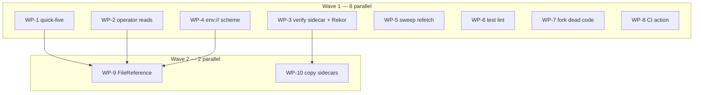

# Plan: Issue sweep 2026-08-30 — cosign-parity fallout

## Status

- **Plan:** plan_issue_sweep_2026-08-30
- **Active phase:** complete — all 10 work packages merged
- **Step:** finalized
- **Last update:** 2026-08-31 (landed on main as ced7e76e via PR #390; all 17 issues closed)
- **State:** done
- **Tier:** medium
- **Next:** none — plan complete

---

## Overview

**Scope:** Small–Medium (3–5 days across 10 parallel work packages)
**Reversibility:** Two-way door throughout. No new module, no storage-layout change, no
protocol change. One wire-value addition (`key_backend: "env"`), pre-1.0, changelog-only.
**Artifacts:** this plan. No ADR — every design decision either already has one
(`adr_key_reference_grammar.md` for WP-9, `adr_package_copy.md` for WP-10) or is a local
fix with no boundary decision.
**Research:** `.claude/artifacts/research_cross_registry_sidecar_promotion.md` (WP-10 axis).

**Objective.** Close the 17 issues filed 2026-08-29/30 — cosign-parity fallout from
[PR #369](https://github.com/ocx-sh/ocx/pull/369) plus two pre-existing gaps — on the
long-living `goat` branch, as ten file-disjoint work packages in two waves.

Three issues were closed not-planned before planning began:
[#378](https://github.com/ocx-sh/ocx/issues/378) (zero population),
[#384](https://github.com/ocx-sh/ocx/issues/384) (unreproducible),
[#383](https://github.com/ocx-sh/ocx/issues/383) (superseded by
[#389](https://github.com/ocx-sh/ocx/issues/389)).

[#319](https://github.com/ocx-sh/ocx/issues/319) is **not** in the 17 but is closed by
WP-3 as a side effect — it shares a root cause with #374.

---

## Decisions taken before planning (do not re-litigate)

| # | Decision | Source |
|---|---|---|
| D1 | #386: read **all** layers, report every one. Layer ordering is undefined. | Owner, 2026-08-30 |
| D2 | #389 supersedes #383: adopt cosign's `env://VAR`. `read_bounded`'s regular-file guard is untouched — no `/dev/fd` allowlist, no `O_NONBLOCK`. | Owner, 2026-08-30 |
| D3 | #367: fix **all** ruff findings and wire ruff into `.verify:lint`. | Owner, 2026-08-30 |
| D4 | #376: sidecar copy is **verbatim**, source tag name → same tag name at the destination, and runs **independently** of `ensure_target_serves_referrers`. OCX still never writes the OCI fallback *index* tag. | Owner, 2026-08-30 |
| D5 | Landing: all WPs merge onto `goat`; then squash maximally onto a feature branch rebased on local `main`; one PR; #388 verified against that PR's pipeline runs. | Owner, 2026-08-30 |

### D4 rationale, recorded because the research disagrees in part

`research_cross_registry_sidecar_promotion.md` recommends never writing legacy tag names
at a destination, citing the lost-update race in
[go-containerregistry#2205](https://github.com/google/go-containerregistry/issues/2205).
That race is specific to the OCI **fallback index tag** — one `<algo>-<hex>` index
accumulating all referrers, updated read-modify-write with no `If-Match`. A cosign
per-type tag is written as a whole manifest, not merged into, so *that* race does not
reach it. The two mechanisms were conflated.

**But a second accumulation mechanism does exist, and an earlier draft of this plan denied
it.** A `.sig`/`.att` manifest accumulates signatures **as layers within itself**:
`simplesigning_read.rs:325` filters `manifest.layers` by the simplesigning media type and
`:338` iterates them under `take(MAX_SIGNATURE_CANDIDATES)` — the same loop C-022 cites.
So a verbatim PUT under an existing destination tag silently discards any signature the
destination has and the source does not. That is the research's warned-about failure
class, reached through a different door. C-098 is the guard; it is why the guard exists
rather than being assumed unnecessary.

The alternative the research implies — re-homing a sidecar as a proper OCI referrer —
is impossible without reconstruction, because a cosign `.sig`/`.att`/`.sbom` manifest
declares neither `artifactType` nor `subject`. Reconstruction is precisely what corrupts
signatures in [cosign#4207](https://github.com/sigstore/cosign/issues/4207). Verbatim
copy under the same tag name is the only shape that preserves bytes.

Constraint kept from the research: a sidecar tag found-but-unfetchable **fails the copy**
rather than silently completing — the existing
`a_referrer_listed_but_not_servable_fails_the_copy` rule.

Constraint **dropped**: the research's probe-only-when-primary-discovery-is-empty
optimisation. A package can carry an OCX referrer *and* a cosign `.sig` — the normal state
of a repository mid-migration — and under that rule the sidecar would be silently dropped
with exit 0, which `copy.rs:432-437` explicitly forbids. C-094 probes unconditionally with
`HEAD`, which answers the same cost question without trading correctness for it.

---

## Component contracts

Numbered `C-nnn`. Every ID appears in at least one WP Scope cell — that half is mechanically
checked. **There is deliberately no per-contract test-step table**: each WP's Specify phase
derives its tests from its own contracts, and a second C-ID-keyed list would be a copy of
this one that drifts from it. An earlier draft asserted every ID also mapped to a test step;
no such section existed, so the assertion was false for 22 contracts.

Four contracts carry real behaviour that was invisible in the scenario list and are now
scenarios in their own right: C-011, C-081, C-094, C-096. Four others are non-testable by
construction and stay that way on purpose — C-021 and C-025 (doc comments), C-035 (rule
prose), C-061 (artifact corrections).

### WP-1 — quick-five

- **C-001** `ConfigLoader::project_path` (`config/loader.rs:649`): a relative
  `OCX_CEILING_PATH` is absolutized against `start` before the walk. An absolute value
  behaves exactly as today. *(#380)*
- **C-002** One shared home-directory resolver backs both `ConfigLoader::home_dir()`
  (`loader.rs:1357-1361`) and `file_structure::default_ocx_root()`
  (`file_structure.rs:183-189`). `auth/store.rs:163` routes through it too.
  `setup::home_env_from_environment()` (`setup.rs:840-846`) stays separate — it resolves
  the *login shell's* home, a different concern, and the plan records that rather than
  changing it. *(#381)*
- **C-003** `OcxIndex::resolve_base_url` refuses `index = "file:/srv/x"` (single slash)
  with `Error::InvalidIndexUrl` (exit 78), message naming the corrected `file:///srv/x`
  spelling. Raised through the existing `invalid_index_url()` helper
  (`ocx_index.rs:524-538`) with `source: None`, matching its three current sites. *(#382)*
- **C-004** `AnnounceError::classify()` (`announce/error.rs:192`) gains an `OutputWrite`
  arm mapping to `ExitCode::IoError` (74). *(#377)*
- **C-005** The `lint:links` lychee invocation (`.claude/taskfile.yml:67-81`) carries
  `--include-fragments`. *(#375)*

### WP-2 — operator-typed file reads

- **C-010** All **three** reads in `resolve_trust_root` (`trust_resolve.rs:71`, `:91`,
  `:101`) go through `utility::fs::read_bounded`. An earlier draft of this plan claimed a
  fourth at `:107`; that line is the `Err(source) =>` arm of the `match` opened by the read
  at `:101`, not a read. The issue's count of three was right.
- **C-010a** Rung 4's fall-through survives the change. `trust_resolve.rs:106` is
  `Err(source) if source.kind() == ErrorKind::NotFound => {}` — the drop-a-file convention,
  where an absent `$OCX_HOME/sigstore/trusted-root.json` falls through to the cache while a
  present-but-unreadable one does not, "or a permission problem would masquerade as *not
  configured*" (the code's own words). `read_bounded` returns `BoundedReadError`, not
  `io::Error`, so the arms are reshaped. **Only `Io { source }` with
  `source.kind() == NotFound` falls through.** `TooLarge` and `NotRegularFile` are errors,
  not absence: routing either into the fall-through lets an operator-pinned trust root
  silently downgrade to the cache and then to TUF — the exact masquerade that arm exists to
  prevent, arriving through a new door. `read_bounded`'s own docs warn against a wildcard
  arm here. The cap value is named in the contract, not left to the implementer. *(#370)*
- **C-011** `package_announce.rs:130` (`--tags-file`) and `package_sign_common.rs:213`
  (`--identity-token-file`) are bounded. Both already classify to exit 74 via
  `Error::InternalFile` — the bound is the only change. *(#370)*

  > **Mechanism deviation, accepted during execution: the token path does NOT call
  > `read_bounded`.** `read_bounded(path: &Path, cap: u64)` reopens with
  > `std::fs::File::open(path)` (`bounded_read.rs:72`). The `--identity-token-file` path
  > already opens with `O_NOFOLLOW` and gates uid and mode **on the resulting handle**, so a
  > literal call would reopen a name an attacker may have swapped since that gate ran
  > (CWE-367) and return an unzeroized `Vec` holding the token. Both halves of
  > `read_bounded`'s contract are therefore asked of the validated handle instead:
  > `meta.is_file()` for the regular-file guard, `take(cap + 1)` plus a length check for the
  > byte ceiling, into a `Zeroizing<String>`. The contract said "go through `read_bounded`";
  > it meant "be bounded". `--tags-file` has no such handle and calls `read_bounded`
  > normally.
- **C-011a** `append_to_tags_file` (`command/package_push.rs:601`) — the **third** caller of
  `parse_tags_file`, found during execution — reads an operator-typed `--tags-file`
  unbounded. Same defect class as C-011, owned by no work package in either wave, so WP-2's
  scope was extended to close it rather than leave the sweep shipping a known third instance
  of the defect it exists to fix. *(#370)*
- **C-012** A **missing file** named by `--sigstore-trusted-root`,
  `OCX_SIGSTORE_TRUSTED_ROOT`, or `[trust.sigstore] trusted_root` exits **74**, matching
  `--key file:<missing>`. Mirrors the shipped precedent at `verify/error.rs:718-729`
  (`TrustPolicyInvalid(KeyUnreadable)` → `IoError`). *(#371)*
- **C-013** The other two paths reaching `AssetReadFailed` — `trust_root.rs:141`
  (`load_embedded`, TUF fetch failure) and `pipeline.rs:1529` (`Verifier::new`, trust
  root unusable) — keep exit **78** (`ConfigError`). Neither is a file read. Naming the
  code matters: "keeps its current exit code" is not testable without reading the source.
  *(#371)*
- **C-014** `kind_detail()` (`verify/error.rs:772`) answers unchanged for all six other
  `TrustRootLoadReason` variants. See Open Question 2 for the missing-file case. *(#371)*

### WP-3 — verify sidecar reads and Rekor memo

- **C-020** `read_sbom_sidecar_tag` (`verify/pipeline.rs:822-863`) returns every layer's
  document, not `layers.first()`. Return type `Result<Option<UnverifiedSbom>, …>` →
  `Result<Vec<UnverifiedSbom>, …>`; the caller at `:789` pushes all. No change to
  `UnverifiedSbom`, `AttestationScan.unverified` (already a `Vec`), or
  `package_sbom.rs`'s reporting — all already iterate generically. *(#386)*
- **C-021** The doc comment at `verify/pipeline.rs:817-821` — which asserts, with a cited
  measurement against cosign 3.1.1, that only the first layer can exist — is **removed
  and replaced** with the reason the new behaviour is correct: cosign cannot write a
  multi-layer `.sbom`, but the tag is generic OCI and a registry can serve anything, so
  the reader does not assume its producer. *(#386)*
- **C-022** `resolve_rekor_public_key_pem` (`verify/pipeline.rs:2658`) resolves at most
  once **per log ID** per run — memo keyed on `log_id_hex`, **successes cached only**.
  This closes **both** #374's per-layer refetch (`simplesigning_read.rs:402`, inside the
  `take(MAX_SIGNATURE_CANDIDATES)` loop at `:338`) and
  [#319](https://github.com/ocx-sh/ocx/issues/319)'s per-candidate refetch on the bundle
  path.

  > **A per-run memo keyed on nothing would be a trust demotion, and an earlier draft
  > specified exactly that.** The function's answer is a function of `log_id_hex`, so a
  > memo that ignores it can serve one log's key for another.
  >
  > **The door is key rotation, not a forced fetch — this corrects the rationale as first
  > written, and execution caught it.** The original argument was that a hostile layer could
  > declare an unpinned log ID, force a TOFU `fetch_rekor_public_key_pem`, and have an
  > unkeyed memo serve that fetched key to a *pinned* log on the next layer. That path is
  > unreachable: `TrustRoot::rekor_public_key_pem_for` (`verify/trust_root.rs:293-298`) ends
  > in `.or_else(|| self.rekor_public_key_pem())`, so an unknown log id falls back to the
  > trust root's default key rather than to `None`. A trust root holding **any** rekor key
  > therefore never fetches, and one holding none has no pinned key to demote.
  >
  > The demotion is real through rotation instead: a trust root pinning **two** logs with
  > **two** keys — the ordinary state across a Rekor key rotation, and what the shipped test
  > constructs. An unkeyed memo caches the first log's key and serves it for the second.
  > Same conclusion, same implementation, same mandated test; only the attack narrative was
  > wrong, and a wrong security rationale that reads as authoritative is exactly the thing
  > that rots.
  >
  > Caching `Err` is the second half: one transient Rekor 5xx on candidate 1 would poison
  > every later candidate, against this module's own ANY-of semantics
  > (`simplesigning_read.rs:325-331`, "one verified signature is the ANY-of answer").

  Test: two candidates declaring different `log_id_hex` values resolve twice, distinctly.
  *(#374, #319)*
- **C-023** The simplesigning path calls `cache_trust_material` the way the bundle path
  does (`verify/pipeline.rs:2244` and `:2334` — **not** `:2059`/`:2149` as the issue
  states), so `state/trust_root/<authority>.json` is populated after a simplesigning
  verify and a subsequent offline verify succeeds from cache. *(#374)*
- **C-024** The **second** `manifest.layers.first()` — `read_unverified_referrer`
  (`verify/pipeline.rs:910`) — is resolved in the same change, not left disagreeing with
  C-020. C-021's rationale ("the manifest is generic OCI and a registry can serve
  anything") is true of it verbatim, and D1 names a behaviour, not a function. Both doors
  funnel into the same `read_unverified_layer`, so fixing one and not the other leaves two
  readers of one shape answering differently. If the Specify phase establishes that an OCI
  1.1 referrer manifest can carry only one payload layer by construction, record that
  finding and leave `:910` alone — but do not leave it unexamined. *(#386)*
- **C-025** The reciprocal doc comment at `verify/pipeline.rs:914-917` — which states the
  `.sbom` tag "reaches the *same* layer" under the first-layer rule — is updated with
  C-021, not left contradicting it. *(#386)*
- **C-026** The stale comment at `verify/pipeline.rs:2348` ("`Scheme::File` is the only
  backend `Scheme::is_implemented` admits") is corrected **by WP-3**, on WP-4's behalf, so
  that no second work package writes into `verify/pipeline.rs`. This is the declared
  cross-WP handoff from the collisions table, given a contract ID so it belongs to
  someone's scope instead of only to a table row. *(#389, landed by WP-3)*

### WP-4 — `env://` key reference

- **C-030** `Scheme` gains `Env`; `SPELLINGS` (`key_ref.rs:83`) gains `"env"`;
  `is_implemented()` (`:98-100`) admits it. **That `matches!` is not exhaustive** — a
  forgotten update leaves `Env` silently refused as `UnsupportedBackend` (exit 85). Same
  silent-miss risk in `Scheme::parse()`'s `_ => None` wildcard (`:103-113`). Both are
  named test steps, not left to the compiler. *(#389)*
- **C-031** `KeyRef` gains an `as_env_var()` accessor parallel to `as_path()`
  (`:198-200`). The two consumers of `as_path()` — `build_signer` (`tasks/sign.rs:321-324`)
  and `compile_key_reference` (`trust.rs:1063-1067`) — each gain an `Env` branch.
  `FileKeyBackend::from_encrypted_pem(pem: &[u8], password: &[u8])` already takes raw
  bytes, so no new crypto code. *(#389)*
- **C-032** `KeyBackendKind` gains `Env` → wire value `"env"` in `signatures[].key_backend`.
  `impl From<Scheme>` (`key_ref.rs:244-311`) is exhaustive, so the compiler forces it.
  This is an interface addition: it ships with a changelog-bearing commit subject.
  *(#389)*
- **C-033** An unset or empty `env://VAR` fails with an error naming the variable.
  `MAX_KEY_PEM_BYTES` still bounds the value. `OCX_KEY_PASSWORD` is unrelated — it is the
  decryption passphrase, and both coexist. *(#389)*
- **C-034** `crates/ocx_cli/src/options/key.rs`'s `--key` help agrees with `Scheme`.

  > **The contract's premise was false, and execution caught it.** The help never listed
  > `env` among the rejected schemes — it names `awskms`, `gcpkms`, `azurekms`, `hashivault`
  > and `k8s`. So the risk is not a stale *rejection* to delete; it is an **implemented
  > scheme missing from the help**, the opposite direction. The shipped test loops over
  > `Scheme::SPELLINGS` and catches both directions, plus a scheme whose status flips later.
  > This site is not compiler-enforced, which is why it needs a test at all. *(#389)*
- **C-035** The `env://` convention is documented beside the "Credential exemption" table
  in `.claude/rules/subsystem-cli.md`, framed as the general shape for secret-bearing
  values — not a `--key` special case. It states the **consequence**, not just the posture:
  a variable ocx does not know the name of **is inherited by plugins and entrypoint
  launchers**, and an operator choosing a non-conventional name is choosing that. *(#389)*
- **C-036** A conventional name, `OCX_SIGNING_KEY`, is defined in `env::keys` and added to
  `CREDENTIAL_KEYS`, so the documented case is scrubbed from child environments like every
  other credential.
- **C-036a** **The credential list is extracted into one documented surface.** Today
  `CREDENTIAL_KEYS` is a bare `&[&str]` at `env.rs:167` whose membership rule lives only in
  a doc comment, and whose two members are individually documented while the *set* is not.
  The set becomes the single source of truth for "this variable carries a bearer
  credential": each entry carries its purpose and its read site, and the rule for joining
  it is stated where a future contributor adding a credential variable will actually look —
  next to the constants, not in a rule file.
- **C-036b** Every credential variable is documented in
  `website/src/docs/reference/environment.md`, the canonical env-var reference named by
  `CLAUDE.md`. `OCX_IDENTITY_TOKEN` and `OCX_KEY_PASSWORD` are user-settable inputs and
  belong there regardless of #389; `OCX_SIGNING_KEY` joins them. Each entry states that it
  is **never forwarded to child processes**, which is the property an operator needs to
  know and currently cannot learn from the docs. The `subsystem-cli.md` exemption table
  gains the same row, keeping the reviewer-facing and user-facing lists in step. *(#389)*

  > **`env://` as first specified was a security regression against the thing it replaces,
  > and this contract is why it is not.** `CREDENTIAL_KEYS` is a fixed two-element list —
  > `&[OCX_IDENTITY_TOKEN, OCX_KEY_PASSWORD]` (`env.rs:167`) — and `plugin_dispatch.rs`
  > (`:192`, `:267`) strips exactly it while deliberately inheriting the rest of the
  > ambient environment. An operator-chosen variable name cannot be on a fixed list, so
  > `ocx-<plugin>` would inherit the raw private PEM.
  >
  > The asymmetry is specific and new. `OCX_KEY_PASSWORD` — comparable sensitivity — *is*
  > stripped today. And under the spelling this replaces, `--key file:<path>`, a plugin
  > inherits no pointer at all and the file can be `0600`. So `env://` with an unknown
  > name hands a plugin something neither existing path does.

  A non-conventional name still works, and is still not scrubbed — that is the operator's
  call, made knowingly per C-035, not a silent default. *(#389)*

### WP-5 — sweep double-fetch

- **C-040** A `--tags` sweep of N tags performs N manifest fetches, not 2N.
  `resolves_to_index` (`tasks/sign.rs:243`) currently discards the `(Digest, Manifest)`
  that `resolve_platform_target` (`oci/sign/pipeline.rs:250`) then refetches. *(#373)*
- **C-041** The same fix covers `attest_tags` (`tasks/attest.rs:174-204` →
  `oci/attest/pipeline.rs:303`), which imports the same `resolve_platform_target`. The
  issue does not name this; it is the same root cause and is in scope. *(#373)*
- **C-042** The two callers that do **not** pre-resolve —
  `command/package_sign.rs:215` (single identifier) and `tasks/sign.rs:291`
  (`sign_platforms`, digest-pinned) — behave unchanged. See Open Question 3 on the
  signature. *(#373)*

### WP-6 — test lint and fixtures

- **C-050** `test/pyproject.toml:4` is corrected from `requires-python = ">=3.10"` to the
  project's real floor (3.13+, per `product-tech-strategy.md`), **and** `[tool.ruff]` is
  added. **This step runs first.**

  > Corrects an earlier draft, which set only ruff's `target-version` and called the three
  > `invalid-syntax` findings false positives. They are not false: against the floor the
  > file actually declares, `f"…{x["k"]}…"` really is a syntax error before 3.12. The
  > declaration is what is wrong. Setting `target-version` alone would silence a correct
  > lint while leaving the wrong floor in place for every other consumer of that file.

  *(#367)*
- **C-051** `ruff` is added to `test/pyproject.toml`'s `[dependency-groups] dev` and
  invoked as `uv run ruff check .`, matching how every other Python tool in `test/` runs.
  Not `ocx add` — that would make ruff a project-toolchain tool sitting outside `test/`'s
  own dependency group, unlike every other Python dep in the suite. *(#367)*
- **C-052** A `test:lint` task in `test/taskfile.yml` shaped like `ci:actionlint` (no
  `sources:`/`generates:` — lint runs every invocation), wired into `.verify:lint`. *(#367)*
- **C-053** Every `PLW1510` site declares `check=` explicitly. Near-uniformly
  `check=False`: all ten sampled sites already inspect `.returncode` by hand, and
  `check=True` would raise instead of returning. The two genuinely fire-and-forget calls
  (`test/bench/harness.py:842`, `test/src/helpers.py:71`) already declare `check=True` and
  are not in the finding set. *(#367)*
- **C-054** `RUF100` is evaluated **only after** C-050 lands. The 95 unused-noqa are not
  stale drift: with no ruff config at all, every `# noqa: <code>` reads unused by
  definition. Autofixing first and configuring second silently re-introduces everything
  they suppress. *(#367)*
- **C-055** `test/tests/test_golden_fixtures.py` gains a second test calling
  `attestations.py`'s `self_check()` via `runpy.run_path`, mirroring the `generate.py`
  case. Path is `test/tests/fixtures/attestations.py` — **the issue says
  `fixtures/golden/attestations.py`, which does not exist**. `self_check()` needs only
  committed files plus `cryptography`; no docker, registry or Sigstore stack. *(#385)*

### WP-7 — fork dead code

- **C-060** `Client::pull_referrers` (`external/rust-oci-client/src/client.rs:2175`) and
  `pull_referrers_via_tag_schema` (`:2256`) are deleted, with their two
  `#[cfg(feature = "test-registry")]` tests and the two doc cross-references at `:2212`
  and `:2218`. Zero non-test call sites, confirmed by grep excluding the defining file.
  *(#368)*
- **C-061** `.claude/artifacts/discover_referrers_architecture_map.md:205,260` and
  `discover_oci_client_extension_points.md:98` are corrected — all three still claim
  `NativeTransport` calls `pull_referrers`, which became false when the function split.
  *(#368)*

### WP-8 — CI action

- **C-070** `verify-basic.yml:47` uses
  `ocx-sh/setup-ocx@25fa771f8572572dc64528db89560de68a163a0e # v1.4.0`. **SHA verified**
  against `ocx-sh/setup-ocx` tags; the floating `v1` points at the same commit. *(#388)*
- **C-070a** Both steps pass **`cache: false`**. The upstream action declares
  `cache: default: "true"` — restoring `$OCX_HOME/{blobs,layers,packages,tags}` through
  `@actions/cache`, keyed on an `ocx.lock` hash. The local action has no such input, so the
  swap would enable a cross-run object-store cache that nothing in #388 asks for, and a
  restored object store is runner-executable content. Blast radius is bounded
  (`contents: read` at `:41-42`, `pull_request` trigger at `:6`), so this is a deliberate
  default-off rather than a refusal — turn it on later as its own change, with its own
  reasoning. *(#388)*
- **C-071** `verify-basic.yml:54` becomes `task ci:actionlint` — the `ocx run` wrapper
  disappears. The comment at `:51` moves with the command. This is the only `ocx run`
  usage repo-wide. *(#388)*
- **C-071a** **An explicit `version:` input stays on both steps.** The local action
  declares `version: required: true`, described as *"exact version, not `latest`"*, and
  `:49` supplies `'0.5.2'`; the upstream action defaults `version` to `"latest"`. Dropping
  the input therefore does not preserve behaviour — it silently floats CI onto whatever
  ocx released most recently, so a green pipeline stops being evidence about a fixed
  toolchain and an upstream regression arrives unannounced in an unrelated PR.

  > The issue proposes removing the pin ("the upstream action defaults to `latest`"). That
  > is a reproducibility regression, not a simplification, and this plan declines it.

  **Pin `0.5.8`** (current release, verified against `ocx-sh/ocx` releases). The issue
  warns against `0.5.8` on the grounds that it "has no `exec` either" — but that objection
  dies with the wrapper. Once the upstream action activates the project, the step invokes
  `task ci:actionlint` directly with the bound tools on `PATH`; `ocx exec` is never called,
  so the release only has to support `ocx pull` and activation. Bump when 0.6.0 ships,
  which is a routine dependency bump, not a blocker for this sweep. *(#388)*
- **C-072** `.github/actions/setup-ocx/` is deleted. **Three** references exist, not two:
  `verify-basic.yml:47`, `verify-basic.yml:114`, and **`renovate.json:47`**, whose
  `managerFilePatterns` lists `/^\.github/actions/setup-ocx/`. The third was found during
  execution; an earlier draft asserted "exactly two". It is benign — a manager pattern
  matching no path simply matches nothing — but leaving it makes `renovate.json` claim a
  directory that does not exist. WP-8 removes it with the deletion that causes it. *(#388)*
- **C-073** **DECLINED during execution, on measured evidence — the contract's goal is
  unreachable from this repository.** The intent was that a `[group.ci]` named in the `:47`
  step's `groups:` input would make Workflow Lint pre-warm three tools rather than eight.

  > The upstream action routes `groups` to **one** command. `setup-ocx@v1.4.0`
  > `src/project.ts:133-136` appends `-g <groups>` to `pullArgs` only; `:144` then runs
  > `ocx --project <file> env --ci=github` with **no `-g`**, so `env` composes the whole
  > `[tools]` table and auto-installs every missing binding. Eight tools are installed
  > either way, and the group narrows nothing. Verified against the pinned SHA, not
  > inferred.
  >
  > Independently, the change is undeliverable within WP-8's file scope: adding
  > `[group.ci]` invalidates `declaration_hash`, and `ocx pull` then exits **65** on the
  > stale `ocx.lock` (demonstrated). Shipping the `ocx.toml` half alone would red Workflow
  > Lint — the exact gate this contract exists to speed up.

  The real fix is upstream: `setup-ocx` must pass `-g` to `ocx env` as well as to
  `ocx pull`. Tracked as an owner decision, not as sweep work. *(#388)*
- **C-074** `verify-basic.yml:114` is **also** rewritten to
  `ocx-sh/setup-ocx@25fa771f8572572dc64528db89560de68a163a0e # v1.4.0`, with
  `project: ""` — the upstream action's documented way to disable project auto-load —
  preserving today's binary-only behaviour for the `ocx --remote package env` step.

  > Corrects an earlier version of this plan, which declared `:114` out of scope while
  > C-072 deleted the directory both references point at. Deleting
  > `.github/actions/setup-ocx/` with `:114` still naming it leaves the smoke job unable
  > to load its action — and WP-8's only acceptance is the PR pipeline run (D5), so the
  > breakage would surface after push.

  What stays out of scope is giving `:114` project activation or a toolchain; it needs the
  binary and nothing else. *(#388)*

### WP-9 — `FileReference`

- **C-080** `FileReference<'a>` + `Spelling { Bare, FileUrl }` in `utility/fs/path.rs`,
  sibling to `RelativePath` (`:204-289`). No `as_path()`: the three exits
  (`anchored_at`, `absolute`, `as_written`) each name a policy, so a caller cannot obtain
  a path without stating one. Scope is authoritatively fixed by
  `adr_key_reference_grammar.md` — **two** spellings, not three; any three-spelling
  phrasing elsewhere is stale. *(#379)*
- **C-081** `index` still refuses the bare form (`spelling()` is public and
  `resolve_base_url` matches on it) — a schemeless `index = "index.corp.example"` already
  means https. *(#379)*
- **C-082** `KeyRef` becomes a thin layer over `FileReference` on the **file arm only**.
  `Scheme::Env`'s `rest` is a variable name, not a path — the delegation must not reach
  it. This constraint exists because WP-4 lands first. *(#379)*
- **C-083** Exactly one widening, at two doors: `[trust.sigstore] trusted_root` and
  `--sigstore-trusted-root`/`OCX_SIGSTORE_TRUSTED_ROOT` gain `file://`. Nothing narrows.
  *(#379)*

### WP-10 — copy sidecars

- **C-090** `ocx package copy` carries cosign's `sha256-<hex>.sig`, `.att` and `.sbom`
  sidecar tags to the destination, **verbatim** — raw `pull_manifest_raw` from source, raw
  `push_manifest_raw` to target under the same tag name. No parse, no re-serialize; the
  same discipline `leaf_manifest_bytes_survive_the_copy_verbatim` already pins. *(#376)*
- **C-097** **Every blob a sidecar manifest references is copied before the manifest is
  pushed**, through the existing `copy_blobs` path, in the same before-the-manifest order
  `copy_leaf` already uses.

  > Corrects an earlier premise in this plan. "Sidecar payloads are annotation-embedded,
  > so there is no blob layer" is **half true**: the *verification material* (signature,
  > certificate, chain, Rekor bundle) lives in annotations
  > (`simplesigning_read.rs:9-17`), but the **signed payload is a blob** —
  > `simplesigning_read.rs:373` fetches it with
  > `pull_blob_capped(transport, image, &digest, MAX_SIMPLESIGNING_PAYLOAD_BYTES)` off the
  > layer's own digest. Copying the manifest alone would publish a manifest at the
  > destination naming a blob that was never transferred — the same defect shape as
  > finding F-9 in `review_r1_security_package_copy.md` (an image-index referrer pushed
  > with its children uncopied).

  A sidecar manifest whose layer blob cannot be fetched **fails the copy**, per C-095.
  *(#376)*
- **C-097a** **An image-index-shaped sidecar is refused before any push**, reusing the
  refusal arm `copy_referrers` already applies at `copy.rs:523-527`. `blob_set` takes
  `&ImageManifest` (`copy.rs:553`), so C-097's blob walk cannot see an index's children: a
  hostile source serving an index under `sha256-<hex>.sig` would otherwise land at the
  destination naming children that were never transferred — the same defect as finding F-9
  in `review_r1_security_package_copy.md`, which is why that refusal arm exists. *(#376)*
- **C-091** Sidecar copy runs **independently of, and positionally before**,
  `ensure_target_serves_referrers` (`copy.rs:275`). That gate demands the destination
  support the Referrers API, which is backwards for a mechanism that exists for registries
  lacking it. Per D4.

  > "Independently" is not enough on its own: the gate **returns** at `copy.rs:241`, ahead
  > of `copy_referrers`. A sidecar step placed after it could never run against a
  > `registry:2` destination, which would make S-017 unreachable — a scenario that passes
  > only because it never executes. The ordering is the contract, and S-017 is what proves
  > it.

  *(#376)*
- **C-092** Tag names come from the existing helpers — `SIG_SIDECAR_SUFFIX`,
  `ATT_SIDECAR_SUFFIX`, `SBOM_SIDECAR_SUFFIX` (`package/tag.rs:205-207`),
  `sidecar_tag`/`SidecarKind` (`simplesigning_read.rs:176-208`), and
  `sibling_tag_reference` (`oci/client.rs:156`). Nothing is re-derived. *(#376)*
- **C-093** `SidecarKind` is **left alone**. The copy path iterates a new
  `SIDECAR_SUFFIXES: [&str; 3]` const in `package::tag`, beside the three suffix constants
  C-092 already cites.

  > **An earlier draft added an `Sbom` variant, which would have reverted a deliberate
  > deletion.** `simplesigning_read.rs:1540-1546` records that the variant and its two
  > sweeps were removed together because "both iterated a `.sbom` variant nothing reads,
  > which is how a documented gap came to look covered" — a test suite that appeared to
  > cover a gap it could not reach. Re-adding the variant for a copy-side consumer
  > re-creates exactly that shape. A bare suffix list carries no such implication.

  *(#376)*
- **C-094** The three legacy tags are probed **unconditionally**, with `HEAD`, not `GET`.

  > **Corrects an earlier draft that probed only when primary discovery came back empty.**
  > A package can carry *both* an OCX referrer and a cosign `.sig` — mixed-mechanism
  > subjects are the normal state of a repository mid-migration. Primary discovery is then
  > non-empty, the probe never runs, the cosign signature is dropped, and the copy exits 0
  > — precisely what `copy.rs:432-437` forbids ("silently dropped … reported as a success
  > (PKG-11)"). The optimisation was answering a cost question with a correctness
  > regression. `HEAD` answers the same question for three round-trips of headers.

  *(#376)*
- **C-095** A sidecar tag that is found but not fetchable **fails the copy**, matching
  `a_referrer_listed_but_not_servable_fails_the_copy`. A 404 is "no sidecar", not a
  failure. *(#376)*
- **C-096** `--no-referrers` skips sidecar tags too. *(#376)*
- **C-098a** **The conflict travels as data, not as an error, and becomes exit 65 at the
  CLI boundary.** Found unimplementable-as-written during execution: `publisher/copy.rs`
  consumes `copy_leaf(...).await?`, so returning `Err` for a conflicting sidecar aborts
  before phase 2 (index merge, cascade, keep tags) and the destination tag never moves —
  blocking exactly the legitimate re-promotion C-098 says must not be blocked, since a
  destination holding *more* signatures necessarily has a different `.sig` digest. So
  `LeafCopy` and `CopyOutcome` carry `sidecar_conflicts: Vec<String>` and `sidecars: usize`,
  `CopyReport` surfaces both, and `command/package_copy.rs`'s unconditional
  `Ok(ExitCode::SUCCESS)` becomes conditional — **after** `report()`, so the named tags
  still print. Exit **65** (`DataError`): the destination holds registry-supplied state this
  build declines to destroy, the class `sign/error.rs:417` and `platform/error.rs:48`
  already use. This is an interface change — `ocx package copy` could previously only exit 0
  on a completed run — and ships with a changelog-bearing commit subject. *(#376)*
- **C-098b** **The write is verified by read-back.** Raised by the cross-model gate and
  confirmed in-tree: C-098's absent → write is check-then-act, so two concurrent copies can
  both observe absent and the later PUT silently overwrites the earlier manifest —
  recreating the accumulation loss C-098 exists to prevent. `client/transport.rs:645-660`
  states there is **no conditional manifest PUT anywhere in the OCI distribution spec** and
  documents the repo's own answer: write, then read back and check for **this call's own**
  descriptor, not merely a successful PUT. The sidecar write adopts that pattern. The
  guarantee it buys is bounded — that comment is explicit that two writers converge and
  three do not — so the report states which guarantee was achieved and which was not.
  *(#376)*
- **C-098** **A destination sidecar tag that already exists with a manifest digest
  different from the source's is never overwritten.** A `.sig`/`.att` manifest accumulates
  signatures as layers within itself (`simplesigning_read.rs:325`, `:338`), so a verbatim
  PUT over an existing tag silently destroys every signature the destination holds and the
  source does not.

  Same digest → no-op, the copy proceeds. Absent → write. **Different → refuse that
  sidecar**, name it, and continue: the leaf and the other sidecars still land, and the
  command exits non-zero.

  Per-sidecar refusal, not whole-copy failure — a deliberate split from C-095. C-095 fails
  the entire copy because a listed-but-unfetchable referrer means the *source* view is
  incoherent: you cannot tell what you were supposed to copy, so nothing written is
  trustworthy. A pre-existing destination tag is the opposite — the source view is
  perfectly coherent, and the conflict is local to one sidecar. Failing the whole copy
  there would block legitimate re-promotion onto a destination that merely holds *more*
  signatures than the source.

  Merging the two layer sets is rejected outright: merging is reconstruction, and
  reconstruction is what corrupts signatures in
  [cosign#4207](https://github.com/sigstore/cosign/issues/4207). Overwriting is rejected
  because it is the silent-loss failure this work package exists to fix. *(#376)*

---

## User-experience scenarios

- **S-001** Relative `OCX_CEILING_PATH=some/dir` → walk stops there, as an absolute value
  would. *(C-001)*
- **S-002** `index = "file:/srv/x"` → exit 78, message names `file:///srv/x`. *(C-003)*
- **S-003** `ocx package announce --out <unwritable>` → exit 74, not 1. *(C-004)*
- **S-004** A doc link to a heading that does not exist → lychee gate fails. *(C-005)*
- **S-005** `--sigstore-trusted-root <missing>` → exit 74, same as `--key file:<missing>`.
  *(C-012)*
- **S-006** `OCX_SIGSTORE_TRUSTED_ROOT` pointing at a huge file → bounded read, exit 74;
  `install`/`pull`/`exec`/`env` no longer wedge. *(C-010)*
- **S-007** `ocx package sbom --no-verify` on a hand-built multi-layer `.sbom` tag → every
  document listed, none silently dropped. *(C-020)*
- **S-008** A simplesigning verify, then `--offline` verify of the same subject → succeeds
  from `state/trust_root/<authority>.json`. **The positive path at the `.sig` door is proven
  by the acceptance suite only**: no committed fixture makes a keyless simplesigning verify
  *with* a transparency entry constructible without minting a Rekor SET. The unit wiring
  test drives the `.att` door, which is the identical construct. *(C-023)*
- **S-009** `ocx package sign --key env://OCX_SIGNING_KEY <ref>` → signs; report shows
  `key_backend: "env"`. *(C-030, C-032)*
- **S-010** `--key env://UNSET_VAR` → clear error naming the variable. *(C-033)*
- **S-011** `ocx package sign --tags-file f <ref>` with N tags → N manifest fetches.
  **Unit-level only — the fetch count is not CLI-observable.** A 2N run and an N run emit
  byte-identical reports and the same exit code, so the only acceptance test writable here
  would be a smoke test asserting nothing about the property. Measured 6 → 3 for three tags
  on both `sign_tags` and `attest_tags`; the nine existing sweep and single-reference
  acceptance tests cover every observable half. Recorded rather than silently dropped.
  *(C-040)*
- **S-012** `task verify` fails on a ruff finding in `test/`. *(C-052)*
- **S-013** A drifted `attestations.py` golden fixture → pytest fails. *(C-055)*
- **S-014** Workflow Lint runs `task ci:actionlint` unwrapped and green. *(C-071)*
- **S-015** `[trust.sigstore] trusted_root = "file:///abs/path"` → accepted. *(C-083)*
- **S-016** `ocx package copy` of a cosign-signed package to a second registry → verifies
  identically at the destination. *(C-090)*
- **S-017** Same, where the destination is `registry:2` with no Referrers API → sidecars
  still land. *(C-091)*
- **S-018** A `.sig` tag that lists but 404s mid-copy → copy fails, not silently
  completes. *(C-095)*
- **S-019** After copying a `.sig`-signed package, the destination serves both the sidecar
  manifest **and** its payload blob — `ocx package verify` at the destination succeeds
  without reaching back to the source registry. *(C-097)*
- **S-020** Copying onto a destination whose `.sig` tag already holds a *different*
  manifest → that sidecar is refused and named; the leaf and the other sidecars still
  land; exit is non-zero. Copying onto an identical `.sig` tag → succeeds as a no-op.
  *(C-098)*
- **S-021** `--identity-token-file` and `--tags-file` pointed at an oversized file → each
  refuses at the cap rather than reading unbounded, exit 74. *(C-011)*
- **S-022** `index = "index.corp.example"` (schemeless) still resolves as https, not as a
  file path. The negative contract the `FileReference` work must not break. *(C-081)*
- **S-023** `ocx package copy` performs **exactly three sidecar-tag `HEAD`s on every copy**,
  regardless of what primary discovery returned, and **zero GETs** when all three 404.

  > **Corrected during execution — as first written this scenario contradicted its own
  > contract.** It said "no extra sidecar-tag GETs" when discovery is non-empty and "exactly
  > three" when empty, which is precisely the probe-only-when-primary-discovery-is-empty
  > optimisation C-094 deletes and explains at length why. The contract was corrected by the
  > security review; the scenario was not brought forward with it, and the pair sat
  > contradicting each other until WP-10 read both. A test written from the old S-023 would
  > have pinned the defect.

  *(C-094)*
- **S-024** `ocx package copy --no-referrers` copies no sidecar tags. *(C-096)*
- **S-025** With `OCX_SIGNING_KEY` set, a dispatched `ocx-<plugin>` does not see it in its
  environment — the same scrub `OCX_KEY_PASSWORD` already gets. *(C-036)*

---

## Parallelization

| WP | Scope (C-/S- IDs) | Expected files | Size | Wave | Depends on | Review | Status |
|---|---|---|---|---|---|---|---|
| WP-1 quick-five | C-001..C-005; S-001..S-004, S-022 | `.claude/taskfile.yml`, `announce/error.rs`, `config/loader.rs`, `file_structure.rs`, `auth/store.rs`, `oci/index/ocx_index.rs` | S | 1 | — | light | **MERGED @ f27799ef** |
| WP-2 operator reads | C-010, C-010a, C-011..C-014; S-005, S-006, S-021 | `oci/verify/trust_resolve.rs`, `oci/verify/error.rs`, `command/package_announce.rs`, `command/package_sign_common.rs` | S | 1 | — | panel | **MERGED** |
| WP-3 verify sidecar + Rekor | C-020..C-026; S-007, S-008 | `oci/verify/pipeline.rs`, `oci/verify/simplesigning_read.rs` | M | 1 | — | panel | **MERGED** |
| WP-4 `env://` scheme | C-030..C-036b; S-009, S-010, S-025 | `oci/sign/key_ref.rs`, `oci/sign/key_backend.rs`, `env.rs`, `trust.rs`, `options/key.rs`, `tasks/sign.rs`, `.claude/rules/subsystem-cli.md`, `website/src/docs/reference/environment.md` | S | 1 | — | panel | **MERGED** |
| WP-5 sweep refetch | C-040..C-042; S-011 | `tasks/sign.rs`, `tasks/attest.rs`, `oci/sign/pipeline.rs`, `oci/attest/pipeline.rs`, `command/package_sign.rs` | M | 1 | WP-4 (rebase only, see collisions) | panel | **MERGED** |
| WP-6 test lint | C-050..C-055; S-012, S-013 | `test/**`, `test/pyproject.toml`, `test/taskfile.yml`, `taskfile.yml` | M | 1 | — | **panel** | **MERGED @ e597403c** |
| WP-7 fork dead code | C-060, C-061 | `external/rust-oci-client/src/client.rs`, two `.claude/artifacts/discover_*.md` | S | 1 | — | panel | **MERGED** |
| WP-8 CI action | C-070, C-070a, C-071, C-071a, C-072, C-074 (C-073 declined); S-014 | `.github/workflows/verify-basic.yml`, `.github/actions/setup-ocx/` (delete), `renovate.json` | S | 1 | — | panel | **MERGED** |
| WP-9 `FileReference` | C-080..C-083; S-015 | `utility/fs/path.rs`, `oci/index/ocx_index.rs`, `trust.rs`, `oci/sign/key_ref.rs`, `command/package_sign_common.rs` | M | 2 | WP-1, WP-2, WP-4 | panel | **MERGED** |
| WP-10 copy sidecars | C-090..C-098 (incl. C-097a); S-016..S-020, S-023, S-024 | `oci/copy.rs`, `oci/verify/simplesigning_read.rs`, `test/tests/test_package_copy.py` | M | 2 | WP-3, WP-6 | panel | **MERGED** |

**Critical path:** WP-3 (M) → WP-10 (M). An earlier draft named WP-4 → WP-9; that is the
tightest *correctness* ordering (the `key_ref.rs` restructure must be written against the
final `Scheme` set, or it gains a non-path variant immediately after landing), but WP-4 is
S, so the chain is shorter in duration. Both orderings must hold; only WP-3 → WP-10 sets
the finish time.

**Shippable after wave 1: 15 of 17 issues** — everything except #379 and #376.

**Merge order (serialized topological):** **WP-6 first** (it owns `test/**`, and every WP
adding an acceptance test rebases onto its tip), then WP-1, WP-2, WP-4, WP-5, WP-3, WP-7,
WP-8, then WP-9, then WP-10. `cargo check` after each merge.

**Wave 1 is exactly 8 packages, matching the concurrency cap.** No WP folds into a sibling.
The smallest is **WP-7** — two function deletions, two test deletions, three doc lines —
and it stays separate because it is the only package touching the vendored submodule, which
lands as its own PR against a different repository. WP-1 already bundles the five
sub-overhead fixes that would otherwise be one-line packages.

### Declared collisions and their resolutions

| Files | WPs | Resolution |
|---|---|---|
| `oci/verify/pipeline.rs` (~5000 lines) | WP-3 (`:822-863`, `:2244`, `:2334`, `:2658`), WP-4 (stale comment `:2348`) | **WP-3 owns the file exclusively.** WP-4 hands it the one-line comment fix as a declared cross-WP handoff rather than reaching in. |
| `oci/verify/simplesigning_read.rs` | WP-3 (`:338`, `:402`), WP-10 (`SidecarKind` +`Sbom`) | WP-10 is wave 2, after WP-3. |
| `oci/index/ocx_index.rs` | WP-1 (`scheme_of`, `resolve_base_url`), WP-9 (`file_root`, `has_drive_prefix`) | Same file, different functions. WP-9 is wave 2. |
| `oci/sign/key_ref.rs` | WP-4 (`Scheme` impl), WP-9 (`KeyRef::parse`'s `None` arm) | **Same file, different functions — sequence, do not merge.** `KeyRef::parse`'s body is generic over `Scheme`; WP-4 never touches it. |
| `trust.rs` (root, 3334 lines) | WP-4 (`compile_key_reference:1063-1067`), WP-9 (`anchor_relative_*`) | Different functions. WP-9 is wave 2. |
| `command/package_sign_common.rs` | WP-2 (`:213` read), WP-9 (`resolve_trust_root:502-523`) | WP-9 is wave 2. |
| `command/package_push.rs` | **WP-5** (`:565`, a forced `, None` from `attest_one`'s signature), **WP-2** (`:601` `append_to_tags_file`, the third unbounded `--tags-file` caller — C-011a) | **Created at execution, not planned.** WP-5's line was forced by its own signature change; WP-2's was a scope extension granted after it found the defect. 36 lines apart. Merge order already puts WP-2 first; WP-5 rebases onto `goat` before its merge. |
| `package_manager/tasks/sign.rs` | **WP-4** (`build_signer:310`), **WP-5** (`sign_one:110`, `resolves_to_index:240`, `sign_platforms:282`) | **Same file, same wave, four sites — this was missed in the first draft, and it falsified the "file-disjoint" claim for wave 1.** Merge order already puts WP-4 first; the resolution is explicit: **WP-5 rebases onto WP-4's tip before its stub phase**, and its orchestrator is told so in the handover. WP-4 touches only `build_signer`'s `as_path()` branch; WP-5 owns the three sweep functions. |
| `website/src/docs/reference/command-line.md` | **WP-2** (exit-code tables, stale after C-012), **WP-4** (`--key` grammar rows) | **Undeclared in the original table — found at execution.** Neither package listed the file; both legitimately had to touch it, and neither reached outside its own subject. Different sections, so line-level at worst. Merge order already puts WP-2 first; WP-4 rebases onto `goat` and resolves it before its own merge. |
| `test/**` | WP-6 (all of it, incl. `test_golden_fixtures.py`) | **#385 moved from WP-1 into WP-6.** The original partition was not one — WP-6's `test/**` swallowed WP-1's declared file. |
| `test/tests/**` — acceptance tests | **WP-6** (exclusive owner), and **WP-2, WP-4, WP-5, WP-8, WP-10** (each adds acceptance tests for its own CLI-observable scenarios: S-005, S-006, S-009, S-010, S-011, S-014, S-016..S-020) | A declared-exclusive `test/**` cannot coexist with five other packages needing acceptance coverage there — the first draft asserted both. Resolution: **WP-6 merges first in the serialized order**, and every WP that adds an acceptance test rebases onto WP-6's tip before its Specify phase. WP-6's edits are mechanical and file-wide (`check=`, import order, noqa); a later WP adding a new test function on top conflicts at worst at line level, never structurally. The reverse order would force WP-6 to re-lint files that moved under it. |

> **Three things named `trust_resolve` / `trust`.** WP-2's
> `crates/ocx_lib/src/oci/verify/trust_resolve.rs` (the six-rung ladder), WP-9's
> `crates/ocx_lib/src/trust.rs` (root, 3334 lines, `TrustPolicy`/`SigstoreTrust`), and
> `crates/ocx_cli/src/command/package_sign_common.rs:502`'s **own** `resolve_trust_root` —
> the CLI wrapper, which both WP-2 and WP-9 work around. Three functions share that name.
> Open the full path; never grep for the bare symbol and assume one hit.

---

## Executable phases

Each WP runs Stub → Specify → Implement → Review. Notes below are the per-WP deviations;
where a WP has none, the standard cycle applies.

- **WP-1** — no stub phase; five independent point fixes. C-002 is the only one with a
  blast radius worth mapping first (four callers of `default_ocx_root`, three of
  `ConfigLoader::home_dir`).
- **WP-2** — C-010 and C-012 touch the **same closure** (`read_err`, `trust_resolve.rs:62-66`).
  Land the bounded-read change first, then the exit-code carve-out against whatever error
  type it settles on.
- **WP-3** — do C-022 (the memo) before C-023, since the cache call and the resolve share a
  path. C-021 (the comment) is part of C-020's commit, never a separate one.
- **WP-4** — C-030's two non-exhaustive sites (`is_implemented`'s `matches!`, `parse`'s
  wildcard) get explicit tests; the compiler will not catch them. `ALL_SCHEMES`
  (`key_ref.rs:319-326`) goes `[Scheme; 6]` → `[Scheme; 7]`, and
  `only_the_file_backend_is_implemented` becomes `matches!(scheme, File | Env)`.
- **WP-5** — stub the threaded type first; the signature change ripples to three callers
  and is the whole risk of this package.
- **WP-6** — **strict order: C-050 → re-run ruff → C-053 → C-054.** Autofixing before the
  config lands re-introduces every suppressed finding.
- **WP-7** — deletion only. Verify the fork builds with `--features test-registry` after
  removing the two tests.
- **WP-8** — cannot be verified locally. Its acceptance is the PR's pipeline run (D5).
- **WP-9** — `adr_key_reference_grammar.md` is the design record; do not re-derive it.
- **WP-10** — the read-side pattern to mirror is `pull_sbom_sidecar_manifest`
  (`verify/pipeline.rs:2782-2792`): 404 → `Ok(None)`, any other error propagates.

### Execution deviations (recorded at dispatch, /hex-execute 2026-08-30)

Two rebase-before-Specify orderings in the collisions table are relaxed to
**rebase-at-merge**, so wave 1 runs 8-wide instead of serializing behind two packages.

1. **WP-2/WP-4/WP-5/WP-8 no longer rebase onto WP-6 before Specify.** WP-6's edits to
   `test/**` are mechanical (`check=`, import order, noqa) and a sibling's *new* test
   function cannot conflict with them structurally — the plan says so itself. The residual
   risk is narrow and self-announcing: a new `subprocess.run` written without `check=`
   fails the ruff gate at WP-6-then-sibling merge time, which is a one-line fix caught by
   a gate rather than a silent defect. Mitigation: every WP that adds a pytest test is
   briefed to write ruff-clean Python with explicit `check=` on every `subprocess.run`.
   WP-6 still merges **first**.

2. **WP-5 no longer rebases onto WP-4 before Stub.** The four `tasks/sign.rs` sites are in
   different functions — WP-4 touches only `build_signer`'s `as_path()` branch, WP-5 owns
   `sign_one`, `resolves_to_index`, `sign_platforms` — so the two diffs are line-disjoint
   within one file and merge cleanly. WP-4 still merges before WP-5.

Both deviations trade a *sequencing* guarantee for a *merge-time* one. The collisions
table's analysis is unchanged and still binds the merge order; only the moment of
reconciliation moves.

### Pre-flight (gated, before any worktree is created)

`.agents/worktrees/` holds five trees — `fx-wpSEC`, `p10-record`, `shell-env`, `winleg`,
and `helphead-target` (orphaned; not in `git worktree list`). Ten new trees land on top.
Sweep them first, using all three landedness tests in order, and **never delete on
ambiguity**. This step reports; the owner decides.

---

## Verification

`task verify` runs ~25 minutes here (5959 unit + 2664 acceptance) and exceeds the
foreground bash cap. Run it as `nohup … > log 2>&1 &` with `disown`, then a `Monitor`
until-loop on the PID. Never pipe it; always `--force`. Rebuild `test/bin/ocx` with
`--features ocx/__testing` first, or acceptance failures are phantom.

During per-WP review-fix loops, run the subsystem gate (`task rust:verify`), not the full
gate.

---

## Constitution check

Checked against `.claude/rules/arch-principles.md`. **No deviations.** Notes:

- C-032 adds a value to a wire-frozen vocabulary. Pre-1.0, read-path compatible (a new
  value, not a changed meaning), announced in the commit subject.
- No `deny_unknown_fields` is added anywhere reachable from `Config`.
- C-093 extends an existing enum rather than minting a second one — type economy.
- WP-1's C-002 removes a duplicated resolver rather than adding an abstraction.

---

## Open questions

1. **[NEEDS CLARIFICATION: #386 budget semantics]** Today the `.sbom` tag costs exactly one
   `budget.examined()` slot (`verify/pipeline.rs:790`). If it can now yield N documents,
   does each layer take its own slot, or does the tag stay one slot regardless?
   *Recommended: the tag stays one slot (it is one manifest fetch), but `budget.charge()`
   accounts every layer's bytes. Rationale: the slot cap bounds discovery breadth, the byte
   cap bounds transfer, and layers are transfer.*
2. **[NEEDS CLARIFICATION: #371 error slug]** `kind_detail()` maps `TrustRootLoad(_)` →
   `"trust_root_load"` with a wildcard. The precedent this fix mirrors
   (`TrustPolicyInvalid(KeyUnreadable)`) minted its own slug, `"key_unreadable"`.
   *Recommended: mint a distinct slug for the missing-file case. Following the precedent
   fully keeps the exit code and the slug telling the same story, and `kind_detail` is
   asserted in a frozen table (`verify/error.rs:1352-1407`) where an ambiguous slug is the
   thing that rots.*
3. **[NEEDS CLARIFICATION: #373 facade signature]** Avoiding the refetch requires
   `resolves_to_index`'s discarded `(Digest, Manifest)` to survive into
   `SignContext`/`AttestContext`, which changes `sign_one`'s signature for all three
   callers. *Recommended: accept it. `ocx_lib` is not a published library and internal
   structure has no stability; the alternative is an in-run memo inside
   `resolve_platform_target`, which hides the cost rather than removing it.*

---

## Deferred / out of scope

- Merging to `main`; any push before the single PR (D5).
- Narrowing what Workflow Lint pre-warms (C-073) — blocked upstream in `setup-ocx`,
  which passes `-g` to `ocx pull` but not to `ocx env`. See C-073.
- The website docs still pinning `ocx-sh/setup-ocx@v1.2.2` with a placeholder SHA — real,
  but a docs task, not this sweep.
- `setup::home_env_from_environment()` staying on its own resolver (C-002).
- Referrers-API capability probing beyond what exists; OCX keeps failing closed on a
  destination that cannot serve referrers for *referrer* copy (D4 changes only the sidecar
  path).
- Registry capability matrix rows the research could not confirm for 2026 (Docker Hub,
  Google Artifact Registry, Sonatype Nexus).
