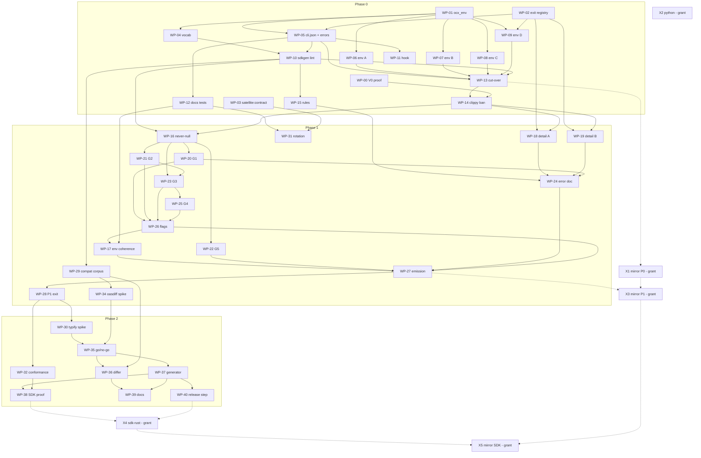

# Plan: The OCX machine-interface contract — one vocabulary, gated documents, generated SDKs

## Status
- State:   review
- Tier:    medium (D-50; was xhigh for waves 1–12)
- Tier-grammar: 5
- Effective-tier: derived
- Updated: 2026-10-04
- Next:    /hex-finalize
- Reviewed: 7f21f48cf

- **Plan:** plan_ocx_interface_contract
- **Active phase:** 0 — Vocabulary, lints, env registry (WP-00 … WP-15)
- **Step:** awaiting /hex-finalize (all in-repo WPs merged; integration gate + review + 2 fix passes done)
- **Last update:** 2026-10-04 (after 7f21f48cf: fix pass 2)
- **Resume rule:** take the `hex/adr-ocx-interface-contract` tip as the base; owner edits made during the pause are authoritative over this plan; every new WP worktree branches from the feature-branch tip at dispatch time (never from another WP branch).

Source ADR: `.claude/artifacts/adr_ocx_interface_contract.md` (**Accepted**) · System design (the design
record; contracts cite it as SD § n): `.claude/artifacts/system_design_ocx_interface_contract.md` ·
Goal: `.agents/goals/adr-ocx-interface-contract.md` · Branch: `hex/adr-ocx-interface-contract`.

## Classification

- Scope: large (45 WPs: 40 in-repo, 5 cross-repo) · Reversibility: one-way door, high (phase 1 is the user-visible
  break wave; published `schema_version` integers never decrease) · Tier: xhigh.
- Overlays: architect=on (applied the validation fixes to ADR + SD, then Accepted), research=skip (D-01),
  adversary=on (cross-model plan review ran in the review batch).
- Required artifacts: this plan; the ADR (Accepted); the SD; the seven research artifacts the ADR cites
  (`research_cli_interface_contracts_prior_art.md`, `research_machine_output_compat.md`,
  `research_interface_vocabulary_enforcement.md`, `research_interface_contract_tooling.md`,
  `research_zero_dep_sdk_codegen.md`, `research_interface_coherence_inventory.md`, `research_ocx_interface_recon.md`),
  `discover_ocx_interface_contract.md`, five round-1 reviews and the validation review. Phase 2 adds two spike
  artifacts (WP-30, WP-34).
- Constitution (`.claude/rules/arch-principles.md`): no principle deviation. One ADR-process deviation is recorded:
  D-17 (phases entered with cross-repo exit criteria deferred).

## Objective

Land ADR Option D: phase 0 (vocabulary, lints, env registry), phase 1 (coherence pass), and phase 2 (compat gate,
generator, SDK contract), with the phase-2 Rust type layer decided D vs E at a recorded go/no-go (WP-35).

## Decisions (question → research → decision)

| # | Question | Research | Decision |
|---|---|---|---|
| D-01 | Run a fresh 3-axis research phase? | Seven research artifacts plus the round-1 SOTA review cover tooling, patterns and domain at `34337a6a2`. The plan review's researcher seat re-checked execution pitfalls (schemars, clap, rules_rust, jsonschema, typify, oasdiff, process spawning); its findings are folded into D-18, D-19, D-21 and the contracts. | Skip. The phase-2 spikes (WP-30, WP-34) are the only new measurement. |
| D-02 | Validation Block B1 and the 9 Warns | `review_adr_interface_contract_validation.md`; the architect re-checked each against code. Mirror tests carry 45 `set_var`/`remove_var`, not 2. | All applied (B1 a/b/c, W1–W9, S1–S10); mirror's own `std::env` clippy ban is optional (W6). ADR **Accepted**. |
| D-03 | ADR open questions 2 and 3 | Their `Recommended:` lines; no contrary evidence. | Adopt both. `-g` is a permanent `exemptions.toml` entry citing the ruling at `context_options.rs:41`. Env spellings in flight live in `RETIRED`; `deprecated.rs` gains `RENAMED_ENV`; the sweep reads it. Open question 1 is WP-35. |
| D-04 | ocx-mirror, ocx-sdk-python, ocx-sdk-rust changes under a grant covering only this repo | Mirror calls `ocx_util::env::{var,flag}` and `ocx_config::env::{keys,insecure_registries}` (≈25 sites); WP-13 breaks its build. `satellite:verify` builds mirror over this tree; mirror CI builds at its own submodule pointer, so X1 cannot land on mirror main before `ocx_env` is on ocx main. `ocx-sdk-rust` does not exist. | Every other-repo change is its own WP (X1–X5), **needs other-repo grant**, not executed by this loop. ocx-side WPs land on this branch. Landing order once granted: X1 PR open → deep verify dispatched with `mirror_ref=<X1 branch>` (WP-03's input) green → merge the ocx PR → merge X1 with the submodule pointer bump → flip `satellite:contract` to required (drop `continue-on-error`) in a follow-up commit. The release that carries phase 1 waits for X2 to be published. |
| D-05 | How do 15 crates move to `ocx_env` without a flag day? | Tests in one crate set env through `ocx_util::env::overrides` to drive reads in another; two override tables would break them. | WP-01 turns `ocx_util::env` into a forwarder over `ocx_env` (one override table; one transitional `ocx_util → ocx_env` edge). WP-13 deletes it and the edge. It never reaches main or a release: the branch lands whole. Not a compat shim (architect review concurs). |
| D-06 | V0 is a phase-0 **entry** proof, but the ban cannot land with baseline 0 before ≈35 production and ≈60 test raw reads move | rules_rust 0.74.0 ignores a root `clippy.toml` until `.bazelrc` sets the label flag; the file must be named exactly `clippy.toml`. | WP-00 proves V0 (red, green, inverse, plus a `cfg(windows)` seed showing Bazel stays green there) on a throwaway worktree and records the evidence. WP-14 depends on it. If V0 is red, WP-14 relies on the standing source scan alone (D-18) and WP-00 records an ADR amendment. |
| D-07 | One `waivers.toml` would be edited by every phase-1 group; L09/L14 cannot clear before emission | Plan-time disjointness; L09 needs the `schema_version` wrappers only WP-27 delivers. | `contract/waivers/<area>.toml`: `reports-g1`…`reports-g5`, `reports-emission` (L09, L14; created by WP-10, deleted by WP-27), `errors`, `cli`, `cli-env`. ADR and SD updated. |
| D-08 | Generated files edited by parallel WPs | Goldens, `Cargo.lock`, `Cargo.bazel.lock.json`, `scripts/bazel_label_map.toml`, `clippy-warn-baseline.json`, `rustdoc-warn-baseline.json`, `.code-docs-*.json` are produced by commands. | Never hand-merged: on conflict, regenerate (`cargo run -p ocx_schema -- <kind> > crates/ocx_schema/tests/golden/<kind>.json`; `cargo metadata` for the lock; the baseline's own update task) and re-run the WP's gate. Not counted as file overlap. |
| D-09 | Phase-1 report groups share acceptance modules | G1/G2/G5 modules are disjoint by filename prefix; `test_patches` parses G2 roots and G3/G4 roots; G3 and G4 share `test_dependencies`, `test_env`, `test_install*`. | G1, G2, G5 parallel (wave 7); G3 after G2 (wave 8); G4 after G3 (wave 9). `test_patches` belongs to WP-21; later groups edit it in their own wave. A group that breaks an undeclared module records it in its WP notes and fixes it; merge order resolves the hunk. |
| D-10 | The bootstrap rotation needs a release tag | Cutting a release and rotating are owner acts (ADR § Baseline rotation, W1). | This branch ships the gate proven on the corpus and fixture baselines (V6), the rotation task and both T0 lints proven on a temp git repo (V7, V24). The bootstrap release and the first `task contract:rotate` are owner actions after merge. |
| D-11 | Where is the SDK proven without `ocx-sdk-rust`? | SD § 3.14: backends keep golden output; compile and integration run in the SDK's CI. | In-repo: the generated SDK is a committed golden under `crates/ocx_sdkgen/tests/golden/rust/`, compiled by `ocx_sdkgen` tests via `#[path]`, run against the Bazel-built `ocx` passed in an env var only Bazel sets. Without it the test fails loudly; verify-deep's raw `cargo nextest` legs exclude it by name. Repository and publishing are X4. |
| D-12 | `PackageDescription` and `PackageInspect` are registered roots no command prints | Nested only (`inspect.rs`, `package_description_pull.rs:128`); `every_printable_root_is_published` would red if only the registry rows went. | WP-05 deletes both `impl Printable` (plain rendering moves to the enclosing reports) and their registry rows, as its own `!` commit. Roots 56 → 54 (ADR counts amended). The branch lands whole, so no release sees it outside the break wave. |
| D-13 | Issues [ocx-sh/ocx#571](https://github.com/ocx-sh/ocx/issues/571), [ocx-sh/ocx#572](https://github.com/ocx-sh/ocx/issues/572) | The prefix rule forces `OCX_TEST_FAULT*` → `__OCX_TESTING_FAULT*`; the two-way docs test forces `OCX_CEILING_PATH` to be declared and documented. | WP-07 renames and cfg-gates the fault vars (bounded pause stays in #571); WP-01/WP-12 declare and document `OCX_CEILING_PATH` Public (canonicalisation stays in #572). Commits reference, never close, either issue. |
| D-14 | New acceptance modules bump shared counters | `scripts/bazel_gate_proofs.py:234` asserts equality with `test/tests/`. | Only WP-24 adds an acceptance module (`test_error_document.py`); WP-27 extends an existing module for `version` (`test_self_update.py` covers `version` JSON today). T0 lint modules: WP-12 (wave 3) and WP-31 (wave 6) only. |
| D-15 | `ocx_shim` cannot link `ocx_env` (size budget) | SD § 3.4. | Its two literals stay; a `workspace_structure.rs` check (WP-01) reads `crates/ocx_shim/src/main.rs` and asserts both are registered names. |
| D-16 | Build contention | One build at a time host-wide. | `/hex-execute` fans out edit workers per wave and serializes `task` builds and gates. |
| D-17 | ADR entry criteria that depend on X-WPs | Phase-1 entry = phase-0 exit (includes `satellite:verify`/`satellite:contract` green, X2 released); go/no-go (a) = phase-1 exit (includes `satellite:contract` green). | Phases 1 and 2 are entered with those clauses **deferred**, not waived: they are reported not met until X1–X3 land. WP-35 records criterion (a) as partially unmet. `satellite:contract` against mirror main is red from WP-03 (wave 1) until X1 lands (no `ocx_contract_site` markers exist yet), and again across waves 7–12 unless X3 lands per group; WP-03 keeps the job `continue-on-error` until X1 merges, so the push to main between the ocx merge and the X1 merge (D-04) stays green. Owner action: accept the deferral. |
| D-18 | Gaps found by the plan review in the lint and ban designs | The current `reports.json` golden already carries `$comment`, `default`, `examples`, `maxLength`, `propertyNames`, `uniqueItems` (shared input-contract types). The clippy aspect skips `rust_doc_test`, `build.rs` and non-Linux `cfg` arms, and `task verify` runs no cargo clippy. | Allowlist gains `maxLength`, `uniqueItems`, `propertyNames` (B06 on change); a `StripAnnotations` transform drops `default`, `examples`, `$comment` from `reports`/`errors` only (WP-16); WP-10 runs a keyword census before sizing waivers. WP-14 adds a standing comment-stripped token scan over every `crates/**/*.rs` and `build.rs`, equal to the pinned residue list. SD updated. |
| D-19 | SDK cancellation and output bounds on all platforms | `Child::kill` is `TerminateProcess` on Windows; console ctrl events need a shared console; `wait_with_output` is unbounded and sequential reads deadlock. | Unix: own process group, SIGINT to the group, grace period, then SIGKILL (hand-declared `extern "C"`, no libc dep). Windows: Job Object with kill-on-close, no interrupt step (hand-declared kernel32 externs, no `windows-sys`). stdout and stderr drained concurrently; secret stdin written on its own thread; overflow kills the child → `OutputTooLarge`. |
| D-20 | `scripts/test_diff_guard.py` refuses changed assertions | It is the crate-split episode's "unmodified suite" proof, a `task scripts:…` entry, not wired into `task verify` or the commit gate. | It does not gate this intentional-break series. Behaviour-preserving WPs (WP-01, WP-04, WP-06…WP-09, WP-13, WP-14) run it over their own range as a characterization proof; WP-07's #571 rename passes with `--allow` lines. |
| D-21 | clap 4 exposes no getter for `requires`, `required_unless*`, group relations or `overrides_with` | clap_builder 4.6.6: those fields are `pub(crate)`; `get_value_parser`/`get_num_args` are only meaningful after `Command::build()`. | WP-05 builds the command first, dispatches on `get_action()` before `type_id()`, derives `requires` by probing (`try_get_matches_from` on a minimal argv, reading the missing args), symmetrises conflicts and adds non-`multiple` group exclusivity and `overrides_with`, de-duplicates propagated globals, and exports hidden choice values with their deprecation. V5 asserts the walk covers the same arg set as `collect_clap_help_texts`. |
| D-22 | WP-33 (`ocx version` `contract` field) was a 2-file WP | Plan review: sub-overhead; WP-27 already owns every `SCHEMA_VERSION`. | Folded into WP-27. |
| D-23 | When does the compat gate "register", and when does the byte lint die? | ADR/SD said the gate test does not exist before rotation and the byte lint is deleted when it registers; `bazel:build:drift` enforces `TEST_TARGET_MAP.toml` row parity, so a target that appears only once `baseline/` exists breaks it, and deleting the byte lint breaks the no-go path. | The `compat_gate` target is always built from WP-35; its live case's early return on a missing `baseline/` is guarded by the baseline lint (rotation pending → red). The byte lint is never deleted; its activation rule makes it inert once the gate is live. ADR § Baseline rotation and SD § 3.9 amended. |
| D-24 | Which children lose `OCX_AUTH_{REGISTRY}_TOKEN` and `ACTIONS_ID_TOKEN_REQUEST_TOKEN`? (WP-01 L1) | Today's `CREDENTIAL_KEYS` holds only `OCX_IDENTITY_TOKEN`, `OCX_KEY_PASSWORD`, `OCX_SIGNING_KEY`, `OCX_ANNOUNCE_GIT_TOKEN`; plugin-dispatched ocx-mirror needs registry auth, `ocx exec` tools need the CI OIDC request token. | Both declared `child = Inherit`; the registry is behaviour-preserving. `Child::Scrub`'s doc says what is true (plugin dispatch). SD § 3.4's example amended by this row. |
| D-25 | WP-02 deletes `ErrorCategory::from_exit_code`, which ocx-mirror calls (2 sites) | No compat shim for an internal refactor (CLAUDE.md stability tiers); the branch lands whole. | `satellite:verify` is red from WP-02 (not WP-13) until X1 lands; X1's scope (C-035) gains the two `x.category()` swaps. |
| D-26 | Six slugs ship under several exit codes (`description`, `forge`, `internal`, `invalid_endpoint_url`, `key_backend`, `registry`) | All six live in WP-19's files; the interim skip list `SLUGS_SPANNING_CODES` lives in `exit.rs`. | WP-19 splits them into per-code slugs in its own `!` commit and empties the list; WP-19's file set gains `crates/ocx_cli/src/exit.rs` (that const only). Until then `errors.json` carries a stand-in `exit_code` for them (nothing ships between waves). |
| D-27 | `__OCX_SELF_IMAGE`, `__OCX_TEST_LIBC` break the `Testing` prefix rule (registry exception list) | Both reads are already `cfg(any(test, feature="__testing"))`. | WP-17 renames them to `__OCX_TESTING_*` and deletes the exception. |
| D-28 | C-002 says the `ocx_script` deny set derives from `child == Scrub` (WP-08 L1) | The deny set is "names a script may not read or override" (resolution keys + `OCX_AUTH_*`), not the credential scrub set; deriving it from `Scrub` would drop all 13 names. | C-002's clause is amended: the deny set is expressed over registry declarations with unchanged membership, pinned by a test. SD § 3.4 and ADR follow this row. |
| D-29 | Empty value = unset in `ocx_env` changes registry auth for an empty `OCX_AUTH_<REGISTRY>_*` (WP-06 L1) | WP-01 rule (empty = unset) agreed at WP-01 L1; reverting needs a verbatim secret reader. | Keep; ship it as its own `fix(oci):` commit with a test pinning the three empty cases. |
| D-30 | `OnInvalid::Default` booleans lost the invalid-value warning in every migrated crate | `ocx_env` is std-only (no logger); the process environment is fixed at context init. | Context init (WP-09's `check_hardening_env`) warns once per invalid `Default` boolean, naming the key, never the value; hardening (`Error`) booleans exit 78. |
| D-31 | `ocx_env` follow-ups found in wave 2 | WP-13 owns `crates/ocx_env/src/**`. | WP-13 adds `Sensitive::into_inner`, re-declares `__OCX_TESTING_SHIM_LOST_PUBLISH_RACE` as `Path` and `__OCX_TESTING_REQUIRE_LIVE_SHELLS` as `String`, makes `dynamic()` refuse a declared-secret name, and converts the three `ocx_announce` clock fixtures (`claim.rs`, `claim/root.rs`, `announce/pipeline.rs`) to `ocx_env::overrides` (file set grows by those three). |
| D-32 | `cli.json` gaps found at WP-05 L1 | D-21's goal is full clap semantics; G14 needs env choices; WP-11 needs a raw-document output mode. | WP-05 exports `required_unless` (probe-derived) and `EnvSpec.choices`, adds an `OutputMode` for a raw document (`package sbom --output -`), and propagates `InvalidEnv` from `apply_env`. WP-26's file set gains `crates/ocx_schema/src/cli.rs` (wiring `ArgSpec`/`Choice` `deprecated`). WP-16 takes the `Timestamp` consumer proof and replaces `ocx_oci::endpoint::scrub_for_echo` with `RedactedUrl` (`endpoint.rs` joins its file set). |
| D-33 | Full `task verify` at WP merges reds on wall-clock budgets (`scripts:self-test` 20 s, lint tier 30 s) under shared-host load from other sessions | Every such red in waves 1–2 had all tests passing; reruns at lower load were green. | Merge gates export `OCX_TOOLING_BUDGET_SECONDS=60`, wait for load < 12 before starting, and retry a budget-only red up to 4×; the lint-tier 30 s budget stays as is. Finalize runs the default budgets. Two pre-existing network dependencies on Sigstore's public TUF repo were pinned to the local trust root (`test_logging` `ocx_trust` row, `test_sign_platforms` key-env verify). |
| D-34 | Declarations with no product reader: `CI_PROJECT_ID`, `COMSPEC` (WP-12 L1) | SD § 3.4 declares what OCX reads; both are read only by tests. | WP-13 removes both declarations (tests keep literals) and their `environment.md` rows (file set grows by that page). |
| D-35 | C08 fires on `--key` (5×), a key *reference* (`env://`, path, KMS URI), not a secret | Typing it as a path mistypes URIs. | WP-26 converts the five `cli.toml` waivers into one `exemptions.toml` entry citing this row (its `adr` field names the plan decision). |
| D-36 | Ownership of wave-3 review residue | WP-10/WP-11 L1. | WP-16: `reports.json` lists serde-optional fields as `required` (`Bundle.strip_components`, `Dependency.name`, `WriteOutcome.dropped`) — fix via `for_serialize()`; give schemars-collision `$def`s (`Dependency2`, `StatusKind2`, `SweepReport2`, …) distinct names. WP-23: `update` declares `report_then_fail`. WP-28: route the acceptance helpers that bypass `OcxRunner` (cwd-taking `run_in`/`_run` helpers; `StatusReport`, `ShellStateReport`, `LockReport`, `PullDryRun`, `WarmedPaths` never validated) through it, and export clap aliases or resolve them before the hook blocks. WP-15: `test/CONFORMANCE_FLOOR` in `subsystem-tests.md`. |
| D-37 | Owned `Sensitive` copies at seven sites outside every remaining WP's file set (`ocx_sign` key_backend/oidc_ambient_inline, `ocx_cli` package_sign_common, `ocx_oci` auth, `ocx_announce` credentials); stale env rule text | WP-13 L1: no later WP owns the files; WP-06/08/09 merged. | WP-13 file set widened: `into_inner` at all seven, `subsystem-cli{,-commands}.md` re-pointed at `ocx_env`. `dynamic()` refusing a declared secret changes `ocx env --ci` folding of an existing CI secret (now never folded) — carried as its own `fix(ci):` commit. |
| D-38 | Owner cut the gate to one full `task verify` per wave; the commit gate refuses a scoped mark on a merge commit | Owner decision 2026-10-04; `scripts/commit_gate.py` merge clause (C-017). | A wave lands as ONE `git merge --no-ff --no-commit <wp>…` (octopus) → one full `task verify` → commit; a conflicting wave falls back to per-WP merges with the full gate. Builders and fix passes run scoped only. WPs whose DAG deps are merged may start ahead of their wave and join the next wave merge. |
| D-39 | A payload property that sits both inline in its own root's wrapper (L09 mirror) and in a `$def` other roots reach: one finding or two? | WP-29 L1; SD § 3.9 ledger example (`/$defs/PushReport/properties/digest`, subjects `[PushReport, CopyReport]`) assumes one; SD § 3.9 excludes unreachable `$def`s; the derived `not.enum` precedent (C-027 S9). | **One finding.** The wrapper's inline copy is a derived mirror (L09 holds it equal) and the differ skips it, like `not.enum`. When the payload `$def` is reachable from any root, the finding's pointer is the `$def` node and its subjects are every root reaching it, the wrapper's own root included; when unreachable, the finding sits on the wrapper. WP-29 pins it with a corpus case; WP-36 implements it. |
| D-40 | Should `std::env::temp_dir`/`home_dir` (TMPDIR/HOME) or doctest bodies join the raw-env ban; the C-004 residue list drifted | WP-14 L1; SD § 3.5 lists exactly six functions; TMPDIR/HOME are OS conventions, not OCX vocabulary; 0 doctest reads today. | No: the ban stays the six SD § 3.5 functions, doctests out of scope. The residue authority is `RAW_ENV_RESIDUE`/`RAW_ENV_NAMED_RESIDUE` in `workspace_structure.rs`; SD § 3.5 was aligned to it in WP-14 (`e45e3c559`); C-004's residue wording defers to it. V0b/V13 red/green recorded in WP-14's L0 report (seeded `std::env::var` → cargo clippy exit 101 + Bazel clippy exit 201; ungated `__OCX_TESTING_FAULT.get()` → `cargo build --release` E0425). |
| D-41 | WP-18/WP-19 blocked: (a) a pass-through arm takes its exit code from a wrapped cause, so a literal slug ships under open-ended codes; (b) the two file sets delegate into each other (`OciIndexError`→`ClientError`, `PackageError`→`Archive`/`Index`) and cannot compile apart; (c) `exit.rs`'s classification pin wants a `NEW_ARMS` row per `kind_detail` arm (~400); (d) `exit/ocx_env.rs` is in neither set | WP-18 and WP-19 builder reports; SD § 3.3; C-018 "no slug shared across codes". | (a) **Delegate:** a pass-through arm's `kind_detail` returns the cause's own slug; a literal slug only where the arm's exit code is fixed; arms classifying through a type-erased chain use a chain-detail helper pulled forward from WP-24 into `exit/classify.rs`. `forge`/`description`/`registry` dissolve into their causes' slugs; `internal` stays a fixed-code literal. C-018's "no slug shared across codes" holds per literal. (b) **WP-18 folds into WP-19** — one builder, union file set + `exit.rs` (pin tables, `SLUGS_SPANNING_CODES`), `exit/ocx_env.rs`, `exit/classify.rs` (chain-detail helper only), acceptance tests and `command-line.md` detail tables naming changed slugs. (c) The pin keeps covering `classify()` (exit-code) arms against the pre-split baseline; `kind_detail` arms are covered by each family's `DETAILS` table and per-variant stability tests, not `NEW_ARMS`. WP-24 keeps the error document and `collect_detail` reporting the slug of the error that decided the exit code. |
| D-42 | Wave-6 review residue: the lint and `open_union` ignore a `$ref` union arm's sibling `type` tag (Metadata/Var unions waived in `reports-g3.toml`); `shell_state.stamp_written_at` stays `String`; pure pass-through error families (`UtilError`, `PhysicalDialRefused`) have no literal slug | WP-16 L1, WP-19 report; C-016/C-017/C-018. | WP-23's file set += `crates/ocx_sdkgen/src/lint.rs` (L05 reads the sibling tag) and `crates/ocx_schema/src/reports.rs` (`open_union` only). WP-25 types `stamp_written_at` as `Option<Timestamp>`. A family whose every arm delegates to its cause is exempt from C-018's non-empty `DETAILS` and is listed as such in its exit file's test; `CommandError` (caller-chosen code) likewise. |
| D-43 | Does IC-08 (`_at` suffix) bind a field typed `Timestamp` whose name is not `_at` (`config update`'s `paused_until`)? | WP-22 L1; L11 checks name → type only. | Yes: a `Timestamp`-typed report field ends in `_at`. `paused_until` → `pause_ends_at` (report only; the persisted pause file keeps its key), in its own `!` commit. |
| D-44 | Wave-7 residue: IC-09 on a root with no `status` (`package cascade repair`'s `dry_run: bool`); G3 env entries still name the modifier field `type` | WP-21 L1. | IC-09 binds roots that carry a `status`; a root without one keeps `dry_run: bool`. WP-23 renames `EnvEntry`/`EnvValueOut`/`EnvVarAttribution`'s modifier field `type` → `kind` (IC-05: a plain field is never `type`), matching WP-21's `PatchTestReport`. WP-24 deletes `render_success_envelope`/`render_envelope_with_exit_code` (no callers after WP-20). |
| D-45 | Wave-8 residue | WP-23/WP-24 L1. | `CommandError` carries no `DETAILS` (D-41(a)); C-019's wording defers to that. WP-17 sets up stderr diagnostics before `apply_env`, so a plain-mode invalid `OCX_*` exits 78 naming the key (S-005). WP-28 (owns `test/src/conformance.py`) renames the stale `ErrorEnvelope`/"envelope" labels there and in `app/seam.rs`/`api.rs`. WP-27's vocabulary sweep decides whether L11 types pinned-identifier fields named `package`/`repository`. Commit `db4efee7e`'s subject gains `!` at finalize (it drops `remediation` from the published errors schema). |
| D-46 | WP-23 renamed `env`'s `entries`/`type` to `items`/`kind`, but the nushell `env.nu` shim and `self activate --shell=nushell` still parse the old keys, and `default []` silently applies no global env. The nushell acceptance cases skip on a host without `nu`, so the full verify stayed green. Separately: G4 residue. | WP-25 L1; `crates/ocx_setup/src/shims.rs`; `verify-basic.yml` is the only lane that sets `__OCX_TESTING_REQUIRE_LIVE_SHELLS`. | WP-25's file set gains `crates/ocx_setup/src/shims.rs`, `crates/ocx_cli/src/command/activate.rs` (test), and `crates/ocx_shell/src/shell/reconcile/ledger.rs` (comment). It applies the fix plus a Rust cross-check that the nushell loop names the keys `EnvVars` actually emits, so the check no longer depends on `nu` being installed. `WatchMember.mtime` becomes `modified_at: Option<Timestamp>`. The report mirrors the shell-state `Verdict` in snake_case. WP-27's vocabulary sweep decides whether the `packages` homonym (map vs array) and `ocx_home`/`home` versus IC-08's `_dir` suffix are bound by type → name. |
| D-47 | WP-26 plan gaps | WP-26 builder + L1. | Boolean switches spell `--with-tags` / `--with-description` (IC-12 sets no switch names; the `--with-` pair is consistent). D-35 is five exemption entries (the matcher compares pointers exactly). `--shell` resolves through the shared shell list: the five newly listed values were already exit 64, so not a break. `--group` untouched. `Choice.deprecated` stays unwired: no flag choice is renamed in this window, so C-021's "choice renames warn" has nothing to apply in 0.6; the first choice rename wires it. |
| D-48 | WP-17 env renames | WP-17 builder + L1 (C05 checked against `cli.json` long flags). | `OCX_NO_COMPLETIONS` → `OCX_NO_COMPLETION` and `OCX_LOG` → `OCX_LOG_LEVEL` (mirrors root `--log-level`; an exemption would contradict WP-28's empty waivers) — both `Window` rows, removed 0.7; `ocx_env` now feeds the log filter value so the retired spelling is honoured. Test seams hard-renamed to `__OCX_TESTING_*` (cfg-gated, no retired row). `self activate`/`shell completion` honour the old name without the notice (shim stderr is discarded); at the 0.7 window close they must call `retired_env_notices` in the static-bypass branch. Census `skipped` ceiling 112 → 113 (a `win32` skip for POSIX-only output). |
| D-49 | WP-27 vocabulary and residue | WP-27 builder + L1. | L11 binds `home`/`*_home` to the path vocabulary (IC-08 amended in the rule and SD § 5); `About.home`, `toolchain_home`, `toolchain_bin` are real `AbsolutePath`s. L11 does not bind `package`/`repository` (user spellings and index paths, not refs) nor the `packages` homonym (map / ref array / string array by root). `PruneOutcome.package`/`.repository` still use `OciIdentifier`, which SD § 3.1 retires from reports — WP-28's phase-1 exit check owns it, along with `configuration.md`'s stale "`Option<T>` is always present and `null`" sentence (contradicts IC-04). `reports/v1.json` 404s after the next deploy (schema dir is generated, current version only) — owner item at finalize. At finalize, `bc43cf969`'s subject names the break (`reports/v2.json` replaces `reports/v1.json`) and `547aea8de` gains backticks with its rule edit split out as `chore:`. No ledger entry: the ledger arrives with WP-36. |
| D-50 | Run shape for the remaining WPs (WP-28, 30, 32, 35–40) | Owner, 2026-10-04: waves 1–12 cost ≈30% of a weekly budget — 61 review/fix agents for 28 WPs, builders polling the build lock, a full verify per merge. Owner edits during the pause touched only tooling and AI config, so no WP is pruned. | Tier medium, set per WP. No per-WP review: one `/hex-review` over the phase-2 delta before `/hex-finalize`; only WP-37 (argv/spawn) and WP-40 (release step) get a single security pass. Sonnet builders (opus only for WP-35's go/no-go). Builders run the WP's own crate tests, never `task verify`. Merges: `git merge --no-ff` on `task verify:mark`. One full `task verify`, at finalize. |
| D-51 | Phase-2 go/no-go (C-026 (a)–(d)) | `research_typify_spike.md`, `research_oasdiff_spike.md`; LOC estimate by analogy with `ocx_sdkgen`'s `lint.rs`/`subset.rs`/`versions.rs` (ADR § Go/no-go outcome). | **Go, Option D**: owned Rust backend over an OCX IR, no typify. With the published schema typify 0.8.0 emits 0 of 13 unions as tagged dispatch (12 of 13 only with a stripped closed copy plus pre-passes, and `Var` still mis-dispatches silently). Its 139-LOC post-pass still decodes a known tag with a bad payload as `Unknown`. D costs about 500 more owned LOC than E (≈1,450 total). oasdiff is not adopted: even tuned it misses 12 of 37 breaks and carries no pointer, so the schema differ is owned without the earlier "provisionally". Criterion (a) is partially met: the ocx side meets it, and `satellite:contract` is deferred to X1/X3 per D-17. OpenCLI/MCP backends fit the IR as is; not scheduled. Stubs: the WP-37 backend is `src/rust.rs` (the repo has no `mod.rs`), not `src/rust/mod.rs`. Every phase-2 dep and Bazel target lands in WP-35, so WP-36–38 do not touch `Cargo.toml`, `Cargo.lock` or `BUILD.bazel`; `Cargo.bazel.lock.json` repin and the Bazel-measured counts are deferred to the first bazel run. |

## Scope

In scope: ADR phases 0–2 inside this repository; the five cross-repo WPs as plan entries only.
Out of scope: `ocx-sdk-python` generated-types migration (follow-up plan after phase 2); the bounded-pause part of
#571 and the canonicalisation part of #572; the ADR's deferred findings (retired schema URLs, `ocx_script` trust
boundary); LINT-09's remaining `clippy.toml` entries (owner action: file an issue).

## Component contracts

Each contract is the SD section it cites plus the edge cases listed. A tester writes failing tests from this table
and the SD without reading code.

### Phase 0

| ID | Contract | Testable behaviour and edge cases |
|---|---|---|
| C-001 | `ocx_env` crate (SD § 3.4): `EnvVar`, `EnvValue`, `OnInvalid`, `Visibility`, `Child`, `Reader`, `env_vars!`, `SecretVar`, `Sensitive`, `dynamic()`, `snapshot()`, `all()`, `overrides` (moved, `__testing` only). Std only outside `__testing`. Its `rust_library` and `rust_doc_test` set `crate_features = ["__testing"]` like `ocx_util`'s. | `env_vars!` emits one static per entry plus `DECLARED`; Testing entries exist only under `cfg(any(test, feature="__testing"))`; `Sensitive` has no `Display` and `Debug` prints `<redacted>`; `SecretVar` has no `get() -> String`; `bool_or` honours `on_invalid` (`Error` → `InvalidEnv` naming the key, never the value); `get_slot` substitutes one `{SLOT}`; `dynamic` reads data-derived names. |
| C-002 | Declarations and registry tests (SD § 3.4): every variable OCX reads is declared; `CREDENTIAL_KEYS` and the `ocx_script` deny set derive from `child == Scrub`; hardening set = declarations with `on_invalid = Error`, pinned by a test (`OCX_FROZEN`, `OCX_OFFLINE`, `OCX_NO_CONSENT`, `OCX_NO_VERIFY` at minimum). | Names unique across `all()` and `RETIRED`; prefix per visibility (`^OCX_`, `^__OCX_TESTING_`, `^__OCX_(?!TESTING_)`); a `TOKEN|SECRET|PASSWORD|KEY$` name without `secret` reds; empty doc reds; a pattern with ≠ 1 `{SLOT}` reds; `ocx_shim`'s two literals registered (D-15); `OCX_CEILING_PATH` Public (D-13). V16 registry part. |
| C-003 | Read-path migration and cut-over: every production and test env read goes through `ocx_env` statics or `dynamic()`; `ocx_util::env` deleted, `PATH_SEPARATOR` kept in `ocx_util::path`; `ocx_config::env::keys` deleted; no `&str`-taking read exists. | V1: `compile_fail` doctest `ocx_env::var("X")`; `dynamic()` count pinned by a `workspace_structure.rs` ratchet; `deps_direction`, `readme_may_depend_on_rows_match_the_crate_map` and `bazel:build:drift` green with a direct `ocx_env` edge on each of the 15 reading crates and none on `ocx_util`. |
| C-004 | Clippy ban (SD § 3.5, D-18): root `clippy.toml` disallows `std::env::{var,var_os,vars,vars_os,set_var,remove_var}`; `.bazelrc` label flag; root `exports_files`; no `disallowed_methods` baseline key; standing source scan equal to the pinned residue list (seam body, overrides, `ocx_shim` ×2, `ocx_cli/build.rs`, `workspace_structure.rs` `CARGO` ×2); clap's `env` feature asserted off. | V0 (WP-00): seeded read in a lib and in `#[cfg(test)]` → `task rust:clippy:check` red; removed → green; `.bazelrc` line removed with seed → green (inverse). V0b: same seed → `cargo clippy -- -D warnings` red. Scan: a seeded `std::env::var` in a `cfg(windows)` arm or `build.rs` → red. |
| C-005 | Testing-var release gating (SD § 3.4). | V13: seeded ungated `.get()` of a Testing var → `cargo build --release -p ocx --locked` red; gated → green. `release_feature_set_excludes_testing_seams` stays green. |
| C-006 | Retired names (SD § 3.4): `RETIRED`, `Change::{Rename, ValueRename, Polarity}`, `Status::{Window, Removed}`; context init (`ocx_cli/src/app/context.rs`) scans `snapshot()` once. | V14 (Rust tests over context init with overrides): window → one stderr warning naming both keys, old value honoured when replacement unset, no warning when only the replacement is set; removed → exit 78 naming the replacement; polarity always `Removed`; a `Window` with `removal` ≤ crate version reds. |
| C-007 | Vocabulary types (SD § 3.1): `Timestamp`, `ByteSize`, `AbsolutePath` (+ `RelativePath` `JsonSchema`), `OpaqueJson` in `ocx_util`; `RegistryHost`, `RedactedUrl` in `ocx_oci`; fixed `schema_name`/`schema_id`. | `Timestamp` serialises RFC 3339 with `Z` and its `$def` carries a `pattern` enforcing `Z`; `ByteSize` schema max 2^53−1 and serialising more errors; `OpaqueJson` round-trips nulls and non-snake keys byte-identically; `RedactedUrl` strips userinfo and credential query params at construction. |
| C-008 | Exit registry (SD § 3.3): `ExitCode::ALL`, `summary()`, `category()`; `ErrorCategory::ALL`; `DetailEntry`, `ClassifyErrorKind::DETAILS`, `detail_registry()`; per-file family registration in `exit/*.rs`. | Every produced slug registered; every registered slug produced; one slug → one exit code; `ALL` exhaustive (match-based test). |
| C-009 | `errors` schema kind (SD § 3.3): document schema + `ExitCode`, `ErrorCategory`, `ErrorDetail` scalar enums in `x-ocx-enum` form; `$id` `errors/v1.json`; golden `errors.json` (built from the current envelope types, which gain `JsonSchema`). | Golden byte test; entries carry `value`, `name`, `description` (+ `category` / `exit_code`); no `enum`, no const-`oneOf`. |
| C-010 | `cli.json` export (SD § 3.6, D-21): `Cli` (incl. `retired`), `CommandSpec`, `ArgSpec`, `GroupSpec`, `ValueSpec`, `OutputMode`, `EnvSpec` (incl. `on_invalid`), `RetiredSpec`, `Deprecation`; `CONTRACT`; `ENV_FLAGS`; hermetic literal defaults with env applied in `ContextOptions`; goldens `cli.json`, `cli-schema.json`; a golden filegroup in `crates/ocx_schema/BUILD.bazel` for data consumers. | V5: renaming a flag and mutating each of requires/conflicts/num_args/require_equals/last/allow_hyphen_values changes `cli.json`, and the probe parses one valid and one invalid argv per relation in agreement; `OCX_OFFLINE=1` leaves `cli.json` byte-identical (C07); an unmapped value parser panics; walk arg set = `collect_clap_help_texts` arg set; `ENV_FLAGS` naming a missing flag reds (V16 flag part); changing a declaration's `on_invalid` or a `RETIRED` entry changes `cli.json`; CONTRACT test reds a non-hidden leaf without an entry, a stale entry, a `Report*` root missing from the registry, and a registered root no command produces. |
| C-011 | Subset + lint (SD § 3.7, § 3.8, D-18): crate `ocx_sdkgen` (`subset`, `lint::run`), codes L01–L18, C01–C09; `contract/exemptions.toml`, `contract/waivers/<area>.toml` (D-07); `json_keys_are_snake_case.rs` deleted (L06 absorbs it). | V3: the red fixture (and its `cli` twin) yields exactly the full code set; `allOf` → L17; a new violation reds; a stale waiver/exemption reds; exemption without `adr` reds; reader floor below independent counts reds. V4: blanked `#[arg]` doc → C01. Unknown arm without `required: ["type"]` → L05. |
| C-012 | Conformance hook (SD § 3.10): the acceptance JSON helper validates every captured `--format json` stdout against the root its command's `output` modes select (`error` key → errors schema), with one cached `Draft202012Validator` per root and a registry holding the full document, `format_checker` on (`jsonschema[format-nongpl]`), duplicate keys rejected; closed producer check on `x-ocx-enum` values and union tags; distinct roots recorded; one shared checker wired into `bazel:test:accept` and into `task test` as a post-run step beside `.suite-ceilings`, reading `results/junit.xml` (`.suite-floor` is collection-only and cannot see validated roots); floor = measured distinct roots − 2 in `test/CONFORMANCE_FLOOR`. Warn-only in phase 0. | V11 (blocking from WP-28): wire-only field drop → red; root not in declared modes → red; unlisted status → red; payload missing its union tag → red; duplicate `schema_version` key → red; distinct roots below floor → red in both lanes. |
| C-013 | Docs coverage (SD § 3.11): `test/lint/test_env_reference_coverage.py` (new), `test/lint/test_doc_command_reference.py` (extended). | V2: removed heading, extra `OCX_BOGUS`, < 50 headings parsed → red. V21: flag missing from its Options block, global flag missing from General Options, node count < measured − 3 → red. |
| C-014 | Sync rule and amendments (SD § 3.13, ADR § CLAUDE.md amendment): `subsystem-interface-contract.md` (globs only paths that exist when it lands — `error_envelope.rs` until WP-24), catalog rows and overlaps, `subsystem-cli-api.md` § JSON Serialization, `CLAUDE.md` (tiers text, ecosystem list, crate table 21 → 23, break-records paragraph, `RENAMED_ENV` sentence), `arch-principles.md` crate table, `adr_crate_split_workspace.md` amendments, supersession note on `adr_oci_referrers_signing_v1.md`, product-context crate count; the rule body says "re-audit env reads inside dependencies on each bump". | V23: missing catalog row or undeclared identical-pattern overlap → `task claude:tests` red; every rule glob matches a file. |
| C-015 | `task satellite:contract` (SD § 3.12): builds the candidate `ocx`, runs `ocx-mirror/test` with `OCX_COMMAND` and `OCX_TEST_BINARY` pointing at it, floors on ≥ 6 passed `ocx_contract_site` tests; `verify-deep.yml` job `continue-on-error` until X1 merges, then required (D-04, D-17); both satellite jobs take a `mirror_ref` dispatch input. | V20: per parsed root a report-only mutation → red; named case: sweep rows re-nested under `data` → red; < 6 sites passed → red (reachable now: mirror has no marker yet); same-series mirror fix → green (needs X1). |

### Phase 1

| ID | Contract | Testable behaviour and edge cases |
|---|---|---|
| C-016 | Never-null infra (SD § 3.2, D-18): `for_serialize()`; `NeverNull` strips `null` only from non-required properties; `StripAnnotations`; `OpaqueJson` leaves untouched; `IntegrationAttribution.payload` (`api/data/env.rs`) is `OpaqueJson`; payload types shared across groups (e.g. `EntrySource`, `ModifierKind`) made coherent here; each `ocx_util` vocabulary type gets its first consumer and leaves `OCX_UTIL_WITHOUT_CONSUMER`. | V9: removing `skip_serializing_if` from an `Option` → L03 red. V10: transform or lint descending into an opaque leaf → fixture `null` stripped or L03 fires (red); published payload with nested `null` and non-snake keys byte-identical on stdout (green). No `default`/`examples`/`$comment` in `reports.json`. |
| C-017 | Report coherence per group (ADR § Root convention, § Vocabulary; SD § 5 IC-03…IC-19): object roots; list roots `{items}`; maps under a named property; envelope roots unwrapped (G1: 5 impls, 6 published roots); tagged unions with `type` + unknown arm; payload fields named `type` renamed; `entries` retired; vocabulary types; open snake_case status `$def`s with dry runs as a status value (L18); every property described (L08); zero nullable forms. | The group's `waivers/reports-g<n>.toml` is deleted (L09/L14 stay in `reports-emission` until WP-27) and `contract_lint` is green; the golden changes only for the group's roots; the group's acceptance modules pass. G1 records the mandatory `semantic` review of verification, signature, attestation, sweep and push-attestation roots (absent ≠ empty, e.g. `VerificationReport.signatures`). |
| C-018 | Error detail families (SD § 3.3): a `ClassifyErrorKind` impl with non-empty `DETAILS` for every `ClassifyExitCode` family in `exit/*.rs` and `app/project_context.rs`. | Per-file tests: every variant maps to a registered slug; slugs snake_case; no slug shared across codes. |
| C-019 | Error document finished (ADR tension 3, SD § 3.3): `error_envelope.rs` → `error_document.rs`; `remediation` removed; pretty-printed (own `!` commit); `ErrorContext` vocabulary-only (L16); `collect_detail` via `detail_registry()`; one document for context-init (exit 78) and clap usage (exit 64) errors when `--format json`/`--json` precedes any `--`; families in `exit.rs` and `app.rs` (`CommandError`) get `DETAILS`; completeness test over every `ClassifyExitCode` impl (the test is the authority, not a count). | V12; `--quiet` with a failure still prints the document; V15: poisoned `OCX_AUTH_*_TOKEN`, `OCX_IDENTITY_TOKEN`, userinfo proxy/mirror URLs never reach stdout/stderr; a secret var with an invalid bool never echoes its value; `ocx exec -- tool --format json` with a usage error prints no document. |
| C-020 | Env coherence (ADR § Env contract; SD § 5 IC-13, IC-14), after the flag renames: names follow C05 against the final flag names; positive `OCX_X` / negative `OCX_NO_X`; renames into `RETIRED` with a `Window`; polarity changes `Removed`; the hardening set is `on_invalid = Error` (exit 78); `RENAMED_ENV` equals the in-window subset of `RETIRED`; `test_deprecated_spellings.py` reads it. | Equality test red on a missing or extra entry; the sweep finds a stale env spelling → red; invalid value on each hardening var → exit 78 naming the key; `waivers/cli-env.toml` deleted. V14 acceptance cases for one real renamed var. |
| C-021 | Flag coherence (ADR § Flag renames; SD § 3.8 C02–C06): global flags keep their short; colliding subcommand shorts (`-c` on `--cascade`/`--check`, `-l` on `--compression-level`) dropped; `-g` exemption (D-03); `--group`, `--tags`, `--description` one `ValueSpec` each; output destinations `--output`/`-o` (multi-destination commands get a cited exemption); renames via the batched window (hidden variants in `deprecated.rs`, `RENAMED`, one stderr warning, `REMOVAL_RELEASE`); choice renames warn; `ArgSpec.deprecated` exported. | `waivers/cli.toml` deleted; old spelling works with one stderr warning and nothing on stdout; a freed short letter is unbound in `cli.json` (a test asserts no arg carries it this release); `test_deprecated_spellings.py` green; no migration prose in `command-line.md`. |
| C-022 | Root emission (SD § 3.2): `Printable::SCHEMA_VERSION` (no default); `Versioned` single emit path; `print_json` hook deleted; `<Name>Root` wrappers whose builder panics unless the payload is an object with `properties` (a union payload, e.g. today's untagged `catalog.rs`/`tag.rs` roots, moves under a named property in its phase-1 group, matching L09); `SweepReport<R>` versioned per `R`; versions start at 1, the 6 formerly wrapped roots at 2; `reports` `$id` → `v2`; `ocx version --format json` gains `contract: {errors, commands, reports}` (D-22). | V8: nesting a root in another report → L14 red; non-object payload → L09; missing const fails to compile; wrapper properties = payload + 1; all 54 wrappers top-level; `contract` values equal `CONTRACT` and the `SCHEMA_VERSION`s (asserted in `test_self_update.py`'s version case). |
| C-023 | Schema publishing: 8 published files (`errors` and `reports/v2` included) plus `cli.json`/`cli-schema.json` golden-only; genrule, `website/schema.taskfile.yml` expected list and count, `main.rs` kind list, `subsystem-website.md` table. | `task schema:generate` writes exactly the 8 expected files; a count mismatch reds. |
| C-024 | Phase-1 exit: `contract/waivers/` empty (`reports-emission` deleted by WP-27); conformance hook blocking; `SUITE_FLOOR`; `command-line.md` JSON sections (no migration prose). | Any remaining waiver file reds; hook findings fail both lanes. |

### Phase 2

| ID | Contract | Testable behaviour and edge cases |
|---|---|---|
| C-025 | Compat mutation corpus: `crates/ocx_sdkgen/tests/compat_corpus/<case>/{base.json, current.json, expect.json}` covering every differ code of SD § 3.9, one case per `x-ocx-enum` member change (W4), U01 `minItems`, unknown-arm add/remove, `required` flip, description-only edit. | Data only; WP-36's completeness test reds a differ code with no case. |
| C-026 | Go/no-go (ADR Phases row 2 (a)–(d)): (b) typify spike — pinned exact version; schema with unknown arms stripped (tagged dispatch measured) and present (untagged fallback measured); every `::crate` path in the output listed against the SDK dependency budget; post-pass LOC for open enums. (c) oasdiff spike — pinned version + checksum, run without secrets, each root and the errors document wrapped as a response schema; per C-025 case, oasdiff's finding code recorded against SD § 3.9. (d) owned LOC estimate. Also re-check an OpenCLI/MCP-tools emitter as an IR backend. | Spike artifacts state measured values with the command that produced them; the decision cites them; criterion (a) recorded per D-17. |
| C-027 | Differ and gate (SD § 3.9): `compat::diff`, surviving/added/removed algorithms, keyword allowlist with U01, keyword reader floor, ledger schema, gate steps 1–5 (W3), unknown-arm `not.enum` derived and skipped (S9), current release from `CARGO_PKG_VERSION` (S5), G13/G14 read `env`/`retired` from `cli.json`; the `compat_gate` target is always built from WP-35 on; corpus and fixture cases always run; the live-repository case returns early only when `baseline/` is absent, a state C-028's baseline lint proves legitimate or reds (D-23). | V6 over corpus + fixture baselines: exact code set; bump without entry; stale entry; `minItems` → U01; description without `doc`; entry + bump → one finding; acknowledged root deletion green; new root at 1 green; `errors` `doc` change, no bump → green; `on_invalid` → `Error` → G14; rename without window → G13. |
| C-028 | Baseline rotation (ADR § Baseline rotation; SD § 3.9): `task contract:rotate`; `test/lint/test_contract_baseline.py`; `test/lint/test_contract_version_bytes.py`; CODEOWNERS for `crates/ocx_schema/contract/**`; tag fetch in jobs running T0 lints. Bootstrap tag = newest ancestor `v*` tag whose tree has `crates/ocx_schema/tests/golden/cli.json`. Baseline lint: no bootstrap tag → asserts `baseline/` absent; bootstrap tag and no `baseline/` and `HEAD` ≠ tag → red (rotation pending). Byte lint active iff a bootstrap tag exists and the gate is not live (`baseline/` absent, or no differ in `ocx_sdkgen`); never deleted (D-23). | V7 on a temp git repo: byte flip red; `RELEASE` non-tag red; newer release tag pending red; fresh rotation green; release commit green; `backup/*` tag newer than `RELEASE` green. V24: golden byte change without bump red; bump without change red; tag version + 1 green; gate active → byte lint inert. |
| C-029 | Generator (SD § 3.14): IR, subset refusal, deterministic output, Rust types (D or E per C-026), owned command layer (`commands.rs`, `exit.rs` fail-closed `is_success()`, `env.rs`, `contract.rs`), CLI `ocx-sdkgen --lang rust --out <dir>`. | V17: two runs byte-identical; `anyOf` input refused; golden SDK regenerated equals committed. |
| C-030 | Conformance corpus (SD § 3.14): `crates/ocx_schema/contract/conformance/<case>/{instance.json, expect.json}`, instances captured from post-phase-1 output plus synthetic mutations (unknown value, unknown union tag, unknown property, omitted optional, 2^53−1 size, version mismatch, `report_then_fail`). | V19: the Rust backend decodes every case to its `expect.json`. |
| C-031 | SDK runtime and in-repo proof (SD § 3.15, D-11, D-19): `Ocx`, `Outcome<R>`, `Error`, discover/handshake, refusal before spawn, argv rules, spawn env scrub, stdin null, bounded output, cancellation, `Debug` redaction. | V18: unknown enum/tag → `Unknown`; unknown status → `is_success() == false`; partial sign and mixed sweep → `Outcome::Failed { report, exit_code }`; only a command's version changed → zero spawns beyond the handshake; identifier `--env=X=1` refused; leading-`-` positional refused unless `allow_hyphen_values`; child env has no `OCX_*`/`__OCX_*` unless passed; child stdin is null; output over `Limits` → `OutputTooLarge` and the child is gone; cancel → `Cancelled` within grace + ε (Unix in CI; Windows via the local wintest runner); `Debug` of an args struct with a secret prints `<redacted>`; discovery on Windows resolves `ocx.exe` only (unit test of the resolver). |
| C-032 | (folded into C-022, D-22) | — |
| C-033 | `website/src/docs/reference/machine-interface.md`: root convention, versions, open enums, outcomes, error document, exit codes. | docs-quality gate; declares `doc_type: reference`. |
| C-034 | `ocx.sh/ocx/sdkgen` release step + `satellite:contract` SDK arm: package built and signed keyless under the release identity (edits only; publishing happens at release); `satellite:contract` regenerates the SDK from in-tree goldens and builds mirror against it. | A dry-run task builds the package without publishing; the signing job alone holds `id-token: write`; `actionlint` green; the identity matches `[[trust.policy]]`; the satellite SDK arm is skipped with a stated reason until X5. |

### Cross-repo (needs other-repo grant — not executed by this loop)

| ID | Contract |
|---|---|
| C-035 | ocx-mirror phase 0 (ADR § Consumers): `ocx_env` statics, own `env_vars!`, `__testing` feature, `dynamic()` auth names, wiring rows (`[workspace.dependencies]`, `crates/crate_map.toml`, Bazel deps), strict decode at the 6 sites (no `#[serde(default)]` on acted-on fields), one `ocx_contract_site` assertion per site in `test/`. |
| C-036 | ocx-sdk-python release with `MAX_SUPPORTED` = last pre-phase-1 ocx; refuses above it before executing (V22). |
| C-037 | ocx-mirror phase 1: each break to a parsed root lands with its mirror fix, per group (WP-20…WP-27). |
| C-038 | `ocx-sdk-rust` repository: regenerates with the pinned `ocx-sdkgen` (pinned by digest with a `[[trust.policy]]`), runs the corpus and an integration suite, crates.io trusted publishing. |
| C-039 | ocx-mirror phase 2: 6 sites onto `ocx-sdk`; one mirror commit moves submodule pointer, binary pin and SDK version together. |

## User-experience scenarios

| ID | Action | Expected outcome | Error cases | Contracts → WPs |
|---|---|---|---|---|
| S-001 | Script runs `ocx --format json <cmd>` | One pretty JSON object, `schema_version` first; list commands `{schema_version, items}`; unset optionals absent | Unknown fields and enum values tolerated | C-016, C-017, C-022 → WP-16, WP-20…WP-27 |
| S-002 | Command fails under `--format json` (incl. bad `OCX_*` at init, clap usage error) | One error document; exit code authoritative; `--quiet` does not suppress it | `ocx exec -- tool --format json` usage error: no document | C-019 → WP-24 |
| S-003 | Partial sign / mixed sweep | Valid report, non-zero exit, no top-level `error` | — | C-010, C-017, C-031 → WP-05, WP-20, WP-38 |
| S-004 | New enum value or union variant appears | Schema still validates; SDK decodes `Unknown`; `is_success()` false | Payload missing its tag fails validation | C-011, C-012, C-031 → WP-10, WP-11, WP-38 |
| S-005 | User sets a renamed / retired / invalid hardening env var | Window: one warning naming both keys, old value honoured; removed: exit 78 naming the replacement; invalid hardening value: exit 78 naming the key | Secret values never printed | C-006, C-020, C-019 → WP-01, WP-09, WP-17, WP-24 |
| S-006 | User passes a deprecated flag spelling | Works, one stderr warning naming the removal release, stdout unchanged | Freed short letter not rebound | C-021 → WP-26 |
| S-007 | Developer breaks a report field after the baseline exists | `compat_gate` red naming finding and ledger edit; entry + bump → green | Bump without entry, stale entry → red | C-027 → WP-36 |
| S-008 | Developer reads env with `std::env::var` or an undeclared name | Clippy/scan red, or no compile | — | C-003, C-004 → WP-13, WP-14 |
| S-009 | SDK user calls a command whose contract version differs | `ContractMismatch` before spawning | Hyphen-leading positional → `InvalidArgument` | C-031 → WP-38 |
| S-010 | ocx reshapes a root mirror parses, no mirror fix | `satellite:contract` red | — | C-015 → WP-03 (+X1, X3) |
| S-011 | Python SDK user runs against a phase-1 ocx | Refused before executing | — | C-036 → X2 |
| S-012 | Owner cuts the bootstrap release, then rotates | `task contract:rotate` commit; forgetting → "rotation pending" red | A `backup/*` tag never trips it | C-028 → WP-31 (+ owner action) |

## Work packages

Verify (waves 1–12): `scoped` = `task verify:scoped --force`; `full` = `task verify`. From wave 13 (D-50): `mark` =
the WP's own crate tests, then `task verify:mark`; no WP runs `task verify`. Review: perspectives; `risk` = riskier than its file
set. Generated files follow D-08. CE = the crate-enumerating set: `scripts/{bazel_accept_proofs,bazel_gate_proofs,
bazel_floor_proofs,scoped_gate}.py`, `crates/TEST_TARGET_MAP.toml`, `test/scoped_rows.toml`, `.code-docs-length-test.json`,
`.code-docs-linkage.json`, `crates/ocx_test_support/tests/workspace_structure.rs`. Each env-migration WP owns the
`Cargo.toml` and `BUILD.bazel` of its crates (lib dep and the `__testing` test dep).

| WP | Scope (IDs) | Expected files | Size | Wave | Depends on | Review | Verify | Status |
|---|---|---|---|---|---|---|---|---|
| WP-00 | V0 entry proof (D-06): C-004 (V0) | none committed except this plan's Evidence section | S | 1 | — | spec | scoped | merged |
| WP-01 | `ocx_env` crate, declarations, retired machinery, forwarder (D-05), shim-literal check (D-15): C-001, C-002, C-006 (machinery) | `crates/ocx_env/**` (new, incl. `BUILD.bazel`, `README.md`), `crates/ocx_util/{src/env.rs, Cargo.toml, BUILD.bazel, README.md}`, `crates/ocx_cli/{Cargo.toml, BUILD.bazel}` (dep, dev-dep, `__testing` forward), root `Cargo.toml`, `scripts/crate_map.toml` (`ocx_env` row, 15 reader edges, transitional `ocx_util` edge, `ocx_schema += ocx_exit, ocx_env`), README `May depend on` rows of the 15 reader crates and `ocx_schema`, CE set | L | 1 | — | quality, security, spec | full | merged |
| WP-02 | Exit registry: C-008 | `crates/ocx_exit/src/**`, `crates/ocx_cli/src/{exit.rs, exit/classify.rs, exit/ocx_sign.rs, exit/ocx_package.rs, exit/ocx_announce.rs}` | M | 1 | — | quality, spec | scoped | merged |
| WP-03 | `satellite:contract` + CI job + `mirror_ref` input: C-015 | `taskfiles/satellite.taskfile.yml`, `.github/workflows/verify-deep.yml` | M | 1 | — | security, quality | full | merged |
| WP-04 | Vocabulary types: C-007 | `crates/ocx_util/src/{time.rs, size.rs, opaque.rs, fs/path.rs, lib.rs}`, `crates/ocx_util/{Cargo.toml, BUILD.bazel}` (chrono), `crates/ocx_oci/src/{registry_host.rs, redacted_url.rs, lib.rs}`, `crates/ocx_test_support/tests/workspace_structure.rs` (`OCX_UTIL_WITHOUT_CONSUMER` entries) | M | 2 | WP-01 | quality, security (`RedactedUrl`) | scoped | merged |
| WP-05 | `cli.json` export, `errors` kind, `CONTRACT`, `ENV_FLAGS`, hermetic defaults, D-12, golden filegroup, env reads in its own files: C-009, C-010, C-003 (part) | `crates/ocx_schema/{src/{cli,errors,lib,main,reports}.rs, Cargo.toml, BUILD.bazel, tests/golden/{cli,cli-schema,errors}.json, tests/golden_schemas.rs, tests/schema_outputs.rs}`, `test/scoped_rows.toml` (`[verbs]` row for `command/contract.rs`), `crates/ocx_cli/src/{command/contract.rs, command.rs, app/env_flags.rs, app.rs, app/context_options.rs, error_envelope.rs, api/data/package_inspect.rs, api/data/package_description.rs, command/inspect.rs, command/package_description_pull.rs}` | L | 2 | WP-01, WP-02 | quality, spec (CLI surface), risk | full | merged |
| WP-06 | Env migration A: C-003 (part) | `crates/{ocx_config, ocx_oci, ocx_trust, ocx_sign, ocx_store, ocx_index, ocx_console}/{src/**, Cargo.toml, BUILD.bazel}` minus WP-04 files | L | 2 | WP-01 | quality, security | scoped | merged |
| WP-07 | Env migration B + #571 rename (D-13): C-003 (part), C-005 (part) | `crates/{ocx_shell, ocx_project, ocx_setup}/{src/**, Cargo.toml, BUILD.bazel}`, `test/tests/{test_project_crash_recovery.py, test_lock.py}` | L | 2 | WP-01 | quality, security | scoped | merged |
| WP-08 | Env migration C + `ocx_script` deny set: C-003 (part), C-002 (part) | `crates/{ocx_package_manager, ocx_package, ocx_announce, ocx_script}/{src/**, Cargo.toml, BUILD.bazel}` | L | 2 | WP-01 | quality, security | scoped | merged |
| WP-09 | Env migration D (`ocx_cli`) + `RETIRED` scan at context init: C-003 (part), C-006 (call site, V14 Rust tests) | `crates/ocx_cli/src/**` minus WP-05 files (WP-02 files included: wave 1 has merged), `crates/ocx_cli/build.rs` | L | 2 | WP-01, WP-02 | quality, security | scoped | merged |
| WP-10 | `ocx_sdkgen` subset + lint, keyword census, exemptions, initial waivers (D-07), `json_keys_are_snake_case.rs` deleted: C-011 | `crates/ocx_sdkgen/**` (new: `Cargo.toml`, `BUILD.bazel`, `README.md`, `src/{lib,subset,lint}.rs`, `tests/contract_lint.rs`, `tests/fixtures/*`), `crates/ocx_schema/contract/{exemptions.toml, waivers/*.toml}`, `crates/ocx_schema/{tests/json_keys_are_snake_case.rs (delete), BUILD.bazel (its target)}`, root `Cargo.toml`, `scripts/crate_map.toml`, CE set | L | 3 | WP-04, WP-05 | quality, spec | full | merged |
| WP-11 | Conformance hook, warn-only, both lanes: C-012 | `test/src/{runner.py, conformance.py}`, `test/BUILD.bazel` (`suite_inputs` += golden filegroup), `test/{pyproject.toml, uv.lock}` (`jsonschema[format-nongpl]`), `test/CONFORMANCE_FLOOR`, `scripts/conformance_floor.py` (new shared checker), `scripts/tests/test_conformance_floor.py` (new), `taskfiles/bazel.taskfile.yml` (`bazel:test:accept`), `test/taskfile.yml` (post-run step beside `.suite-ceilings`) | M | 3 | WP-05 | quality, spec | full | merged |
| WP-12 | Docs coverage + reference pages (D-13): C-013 | `test/lint/{test_env_reference_coverage.py, test_doc_command_reference.py}`, `test/LINT_FLOOR`, `website/src/docs/reference/{environment.md, command-line.md}` | M | 3 | WP-05 | docs, spec | scoped | merged |
| WP-13 | Env cut-over: forwarder, `keys`, `&str` reads deleted; V1; `dynamic()` ratchet; `CREDENTIAL_KEYS` fn; D-31, D-34 follow-ups: C-003 (rest) | `crates/ocx_util/{src/env.rs (delete), src/lib.rs, src/path.rs, Cargo.toml, BUILD.bazel, README.md}`, `crates/ocx_config/src/{env.rs, lib.rs}`, `crates/ocx_env/src/**` (doctest), `scripts/crate_map.toml`, `crates/ocx_test_support/tests/workspace_structure.rs`, `crates/ocx_announce/src/{claim.rs, claim/root.rs, announce/pipeline.rs}` (clock fixtures), `website/src/docs/reference/environment.md` (D-34 rows), any remaining `ocx_util::env`/`keys` caller | M | 4 | WP-05, WP-06, WP-07, WP-08, WP-09, WP-10 | quality, security, risk (breaks mirror; pairs with X1) | full | merged |
| WP-15 | Sync rule + AI-config and ADR amendments: C-014 | `.claude/rules/subsystem-interface-contract.md` (new), `.claude/rules.md`, `.claude/rules/{subsystem-cli-api.md, arch-principles.md, product-context.md}`, `CLAUDE.md`, `.claude/artifacts/{adr_crate_split_workspace.md, adr_oci_referrers_signing_v1.md}` | M | 4 | WP-10 | docs, spec | scoped | merged |
| WP-14 | Clippy ban + standing scan + residue + clap-env check + V0b/V13 proofs: C-004, C-005 | `clippy.toml` (new), `.bazelrc`, root `BUILD.bazel`, residue `#[expect]` sites (`crates/ocx_env/src/**`, `crates/ocx_shim/src/main.rs`, `crates/ocx_cli/build.rs`), `crates/ocx_test_support/tests/workspace_structure.rs` (scan, residue list, clap feature) | M | 5 | WP-13, WP-00 | quality, security | full | merged |
| WP-16 | Never-null infra, shared payload types, vocabulary first consumers: C-016 | `crates/ocx_schema/src/reports.rs`, `crates/ocx_schema/tests/*` (reports tests), `crates/ocx_cli/src/api/data/env.rs` + files of cross-group payload types and of each vocabulary type's first adoption site (≤ 4 files, listed in the WP's Stub step), `crates/ocx_test_support/tests/workspace_structure.rs` (allowlist entries removed), `crates/ocx_schema/contract/waivers/reports-*.toml` | M | 6 | WP-10, WP-14 | quality, spec, risk (wire) | full | merged |
| WP-18 | Error detail families A: C-018 | `crates/ocx_cli/src/exit/{ocx_config, ocx_util, ocx_store, ocx_setup, cli_input, ocx_shell, ocx_index}.rs`, `crates/ocx_cli/src/app/project_context.rs` | M | 6 | WP-02, WP-14 | quality, spec (wire: slugs) | scoped | merged |
| WP-19 | Error detail families B + spanning-slug split (D-26): C-018 | `crates/ocx_cli/src/exit/{ocx_package, ocx_oci, ocx_package_manager, ocx_project, ocx_announce, ocx_sign}.rs`, `crates/ocx_cli/src/exit.rs` (`SLUGS_SPANNING_CODES` only) | M | 6 | WP-02, WP-14 | quality, spec (wire: slugs) | scoped | merged |
| WP-29 | Compat mutation corpus (hoisted, synthetic): C-025 | `crates/ocx_sdkgen/tests/compat_corpus/**` (new data) | M | 6 | WP-10 | spec | scoped | merged |
| WP-31 | Baseline rotation tooling (hoisted): C-028 | `taskfiles/contract.taskfile.yml` (new), `taskfile.yml` (include), `test/lint/{test_contract_baseline.py, test_contract_version_bytes.py}`, `test/LINT_FLOOR`, `.github/CODEOWNERS`, `.github/workflows/{verify-basic.yml, verify-deep.yml}` (tag fetch) | M | 6 | WP-12, WP-03 | security, quality | full | merged |
| WP-20 | Reports G1 supply chain + publish, envelopes unwrapped, semantic review: C-017 | `crates/ocx_cli/src/api/data/{sweep, signature, attestation, verification, sbom, push, package_copy, package_receipt, package_description, package_prune}.rs`, construction sites in `crates/ocx_cli/src/command/{package_sign, package_attest, package_verify, package_sbom, package_push, config_push, package_copy, package_receipt, package_description_pull, package_prune}.rs`, `test/tests/{test_sign*, test_attest, test_verify, test_sbom, test_cosign_*, test_offline_verify, test_push*, test_package_push*, test_package_copy, test_package_receipt, test_package_prune, test_package_info, test_config_push}.py`, `test/tests/fixtures/{cosign*, attestations, sigstore_stack}.py`, `waivers/reports-g1.toml` (delete) | L | 7 | WP-16 | quality, spec (wire), risk | full | merged |
| WP-21 | Reports G2 index/announce/claim/cascade/patch: C-017 | `crates/ocx_cli/src/api/data/{announce, claim, forge_report, index, catalog, tag, package_cascade_check, package_cascade_repair, patch_freeze, patch_publish, patch_sync, patch_test, patch_why}.rs`, construction sites in `crates/ocx_cli/src/command/{package_announce, package_claim, index_*, package_cascade_*, patch_*}.rs`, `test/tests/{test_index*, test_announce*, test_package_claim, test_package_cascade, test_patches, test_fake_forge_*, announce_helpers, fake_forge}.py`, `test/src/announce_e2e/**`, `waivers/reports-g2.toml` (delete) | L | 7 | WP-16 | quality, spec (wire) | full | merged |
| WP-22 | Reports G5 config/self/login/script: C-017 | `crates/ocx_cli/src/api/data/{config_setup, config_test, config_update, self_setup, self_update, login, script_run}.rs`, construction sites in `crates/ocx_cli/src/command/{config_setup, config_test, config_update, self_group/setup, self_group/update, login, logout, script_runner}.rs`, `test/tests/{test_self_setup, test_self_update, test_managed_config, test_config_setup, test_config_test, test_login, test_package_test_script}.py`, `waivers/reports-g5.toml` (delete) | M | 7 | WP-16 | quality, spec (wire) | full | merged |
| WP-34 | oasdiff-adapter spike: C-026 (c) | `.claude/artifacts/research_oasdiff_spike.md` (new); adapter code throwaway | M | 7 | WP-29 | quality, security (pinned binary, no secrets) | scoped | merged |
| WP-23 | Reports G3 project/env/deps/inspect: C-017 | `crates/ocx_cli/src/api/data/{lock, update, status, env, deps, package_inspect}.rs`, construction sites in `crates/ocx_cli/src/command/{lock, add, remove, update, status, env, toolchain_env, deps, package_inspect, inspect}.rs`, `test/tests/{test_dependencies, test_env*, test_deps_*, test_inspect, test_package_inspect*, test_update_report, test_project_*, test_toolchain_*, test_lazy_loading, test_lock}.py` and G3 hunks in `test_patches.py`, `test/src/{shell_matrix, toolchain_fixtures}.py`, `waivers/reports-g3.toml` (delete) | L | 8 | WP-16, WP-21 | quality, spec (wire) | full | merged |
| WP-24 | Error document finished + `test_error_document.py` (D-14): C-019 | `crates/ocx_cli/src/{error_envelope.rs → error_document.rs, app.rs, exit.rs, exit/classify.rs, lib.rs (mod line)}`, `crates/ocx_schema/{src/errors.rs, tests/golden/errors.json}`, `test/tests/{test_exit_codes.py, test_error_document.py (new)}`, `test/{SUITE_FLOOR, scoped_rows.toml}`, `scripts/bazel_gate_proofs.py`, `waivers/errors.toml` (delete), `.claude/rules/subsystem-interface-contract.md` (glob rename), `.claude/rules.md` (auto-load row) | L | 8 | WP-15, WP-18, WP-19, WP-20 | quality, security, spec (wire), risk | full | merged |
| WP-25 | Reports G4 install/paths/store/runtime: C-017 | `crates/ocx_cli/src/api/data/{install, removed, paths, warmed_paths, pull_dry_run, clean, path_kind, shell_state, about, version}.rs`, construction sites in `crates/ocx_cli/src/command/{install, select, uninstall, deselect, which, package_pull, pull, clean, shell_state, about, version}.rs`, `test/tests/{test_install*, test_select, test_uninstall, test_which, test_purge, test_clean*, test_offline*, test_exec_modes, test_entrypoints, test_resolution_chain_refs, test_execution_records, test_metadata_forward_compat}.py` plus G4 hunks in modules WP-21/WP-23 own, `waivers/reports-g4.toml` (delete) | L | 9 | WP-23 | quality, spec (wire) | full | merged |
| WP-26 | Flag coherence + batched window: C-021 | `crates/ocx_cli/src/command/{update, package_create, package_push, package_copy, config_push, add, remove, pull, index_catalog, package_announce, package_description_push, deprecated}.rs`, `crates/ocx_cli/src/options/{group_selection, forge_write, tags}.rs`, `crates/ocx_schema/contract/{exemptions.toml, waivers/cli.toml (delete)}`, `website/src/docs/reference/command-line.md`, test modules using renamed spellings (any module; no other WP in its wave) | L | 10 | WP-20, WP-21, WP-23, WP-25 | quality, spec (CLI surface) | full | merged |
| WP-17 | Env coherence after flag renames: C-020 | `crates/ocx_env/src/**` (declarations, `RETIRED`), renamed-var call sites in `crates/*/src/**`, `crates/ocx_cli/src/app/env_flags.rs`, `crates/ocx_cli/src/command/deprecated.rs`, `test/lint/test_deprecated_spellings.py`, `website/src/docs/reference/environment.md`, test modules setting renamed vars, `waivers/cli-env.toml` (delete) — alone in its wave | L | 11 | WP-26, WP-12 | quality, security, spec (env surface) | full | merged |
| WP-27 | Root emission, `reports/v2`, 8 schema files, `version` `contract` field (D-22): C-022, C-023 | `crates/ocx_cli/src/{api.rs, api/data/*.rs (one `SCHEMA_VERSION` line each; `version.rs` contract field), command/version.rs}`, `crates/ocx_schema/{src/reports.rs, src/lib.rs, src/main.rs, BUILD.bazel (genrule)}`, `website/schema.taskfile.yml`, `.claude/rules/subsystem-website.md`, `test/tests/test_self_update.py` (version case), `waivers/reports-emission.toml` (delete) | L | 12 | WP-17, WP-22, WP-24, WP-26 | quality, spec (wire), risk | full | merged |
| WP-28 | Phase-1 exit: hook blocking, waivers empty, floors, JSON sections: C-024, C-012 (blocking) | `test/src/conformance.py`, `test/{CONFORMANCE_FLOOR, SUITE_FLOOR}`, `crates/ocx_sdkgen/tests/contract_lint.rs` (empty-waivers assertion), `website/src/docs/reference/command-line.md` | M | 13 | WP-27 | phase (D-50) | mark | pending |
| WP-30 | typify spike: C-026 (b) | `.claude/artifacts/research_typify_spike.md` (new); spike code throwaway | M | 14 | WP-28 | phase (D-50) | mark | pending |
| WP-32 | Conformance corpus data: C-030 | `crates/ocx_schema/contract/conformance/**` (new) | M | 14 | WP-28 | phase (D-50) | mark | pending |
| WP-35 | Go/no-go decision + every phase-2 target and dep stubbed: C-026 (a)(d) | `.claude/artifacts/adr_ocx_interface_contract.md` (§ Go/no-go outcome), this plan (Decisions), `crates/ocx_sdkgen/{src/lib.rs, src/compat.rs, src/ir.rs, src/rust.rs, src/versions.rs, src/main.rs, Cargo.toml, BUILD.bazel, tests/{compat_gate,sdk_rust,conformance}.rs}` (stubs), `crates/ocx_schema/BUILD.bazel` (`contract` filegroup widened), `crates/TEST_TARGET_MAP.toml`, `scripts/{bazel_floor_proofs,bazel_gate_proofs}.py` | M | 15 | WP-30, WP-34 | phase (D-50) | mark | pending |
| WP-36 | Differ + gate + ledger + corpus completeness: C-027 | `crates/ocx_sdkgen/{src/compat.rs, tests/compat_gate.rs}`, `crates/ocx_schema/contract/ledger.toml` (new, empty) | L | 16 | WP-35, WP-29 | phase (D-50) | mark | pending |
| WP-37 | Generator: IR + Rust backend (D or E) + command layer + CLI: C-029 | `crates/ocx_sdkgen/src/{ir.rs, rust.rs, rust/**, main.rs}`, `crates/ocx_sdkgen/tests/golden/rust/**` (generated golden) | L | 16 | WP-35 | security (D-50) | mark | pending |
| WP-38 | SDK runtime proof + conformance run (D-11, D-19): C-031, C-030 (run) | `crates/ocx_sdkgen/tests/{sdk_rust.rs, conformance.rs}`, `crates/ocx_sdkgen/BUILD.bazel` (data dep on `//crates/ocx_cli:ocx`, env var), `.github/workflows/verify-deep.yml` (nextest exclusion) | L | 17 | WP-37, WP-32 | phase (D-50) | mark | pending |
| WP-39 | `machine-interface.md`: C-033 | `website/src/docs/reference/machine-interface.md` (new), website sidebar config | M | 17 | WP-36, WP-37 | phase (D-50) | mark | pending |
| WP-40 | `ocx.sh/ocx/sdkgen` release step + `satellite:contract` SDK arm: C-034 | `taskfiles/release.taskfile.yml`, release workflow under `.github/workflows/` (not `verify-deep.yml`), `taskfiles/satellite.taskfile.yml` | M | 17 | WP-37 | security (D-50) | mark | pending |
| X1 | ocx-mirror phase 0 — **needs other-repo grant** (push/PR `ocx-sh/ocx-mirror`): C-035 | `ocx-mirror`: `Cargo.toml`, `crates/crate_map.toml`, `crates/**` (env, 6 decode sites), `test/**` (`ocx_contract_site`), Bazel deps | L | 5 | WP-13 | quality, security | (mirror's) | blocked: grant |
| X2 | ocx-sdk-python upper-bound release — **needs other-repo grant**: C-036 | `ocx-sdk-python`: `src/ocx_sdk/{_types.py, _client.py, _errors.py}`, tests, `docs/guide/concepts/compatibility.md` | S | 1 | — | quality | (sdk's) | blocked: grant |
| X3 | ocx-mirror phase-1 root fixes, per group — **needs other-repo grant**: C-037 | `ocx-mirror` decode sites per changed root | M | 13 | X1, WP-27 | quality | (mirror's) | blocked: grant |
| X4 | `ocx-sdk-rust` repository + crates.io trusted publishing — **needs other-repo grant** (repo creation, publishing): C-038 | new repository | L | 18 | WP-38, WP-40 | security, quality | (sdk's) | blocked: grant |
| X5 | ocx-mirror onto `ocx-sdk` — **needs other-repo grant**: C-039 | `ocx-mirror` 6 sites | M | 19 | X4, X3 | quality | (mirror's) | blocked: grant |

WP-33 is retired (D-22). Effective-tier histogram (derived at spawn from Size + Review): S 2 · M 23 · L 20
(40 in-repo, 5 cross-repo); `risk` on 7.

### Wave graph

Critical path (17): WP-01 → WP-05 → WP-10 → WP-13 → WP-14 → WP-16 → WP-21 → WP-23 → WP-25 → WP-26 → WP-17 →
WP-27 → WP-28 → WP-30 → WP-35 → WP-37 → WP-38.

Shippable after wave: 17 — the branch lands whole (D-05, D-12); no intermediate wave ships.

Narrower than file-disjointness allows, with reasons: G3 after G2 and G4 after G3 (D-09, shared acceptance modules);
flags after the groups (shared command files); env coherence after flags (C05 derives env names from final flags;
shared `deprecated.rs`); WP-15 waits for WP-10 so both new crates exist when `CLAUDE.md`'s crate table is written;
WP-13 after WP-10 (shared `crate_map.toml` and `workspace_structure.rs`).

### Merge plan (serialized, topological)

Wave 1: WP-00 (evidence only), WP-01, WP-02, WP-03 · 2: WP-04, WP-06, WP-07, WP-08, WP-09, WP-05 · 3: WP-12, WP-11,
WP-10 · 4: WP-15, WP-13 · 5: WP-14 · 6: WP-18, WP-19, WP-29, WP-31, WP-16 · 7: WP-22, WP-21, WP-20, WP-34 · 8: WP-23,
WP-24 · 9: WP-25 · 10: WP-26 · 11: WP-17 · 12: WP-27 · 13: WP-28 · 14: WP-32, WP-30 · 15: WP-35 · 16: WP-36, WP-37 ·
17: WP-39, WP-40, WP-38.
Each merge (waves 1–12): `git merge --no-ff --no-commit` → regenerate any conflicted generated file (D-08) → `task verify` →
commit. From wave 13 (D-50): `git merge --no-ff`, regenerate conflicted generated files, `task verify:mark`. Every user-visible break is its own `!` commit subject (ADR § Communicating breaks): D-12 inside WP-05, each
group's root changes, the error document's pretty print inside WP-24, each flag rename batch, the env renames.

## Executable phases (per WP, for /hex-execute)

- **Stub:** public surface from the contract rows (types, trait items, function shells with `unimplemented!()`, new
  test modules raising `NotImplementedError`); gate `cargo check` (Bazel build for BUILD edits). WP-16 lists its
  ≤ 4 extra `api/data` files here before editing them.
- **Specify:** tests from the contract's "Testable behaviour" column and its V rows, written red against the stubs.
  Every V row shows both sides (quality-core "Unchecked Green"); mutation proofs gate on the mutation being present.
- **Implement:** fill stubs until the WP's Verify budget is green.
- **Review:** waves 1–12 per the Review column. From wave 13 (D-50): none per WP except one security pass on WP-37 and WP-40; one `/hex-review` over the phase-2 delta before finalize.

Decision and spike WPs (WP-00, WP-30, WP-34, WP-35) replace Stub/Specify with: state the measurement, run it, record
the numbers and the command that produced them.

## Goal criteria → WPs

| Goal criterion | WPs | In-repo status |
|---|---|---|
| Option D landed: phases 0–1, compat gate, SDK contract; phase-2 type layer decided D vs E | WP-00…WP-28, WP-36, WP-37, WP-38, WP-35 (decision) | **Partial without grants:** ADR phase exits include X1 (phase 0), X3 (phase 1), X4/X5 and the bootstrap rotation (phase 2); reported not met until they land (D-04, D-10, D-17) |
| Grammar: owned `cli.json`, full clap semantics, directional compat rules | WP-05 (V5), WP-10 (C01–C09), WP-36 (G01–G15) | met in-repo |
| Root convention: object roots, `schema_version` first, list payloads as `items` | WP-20…WP-25, WP-27, WP-10 (L09/L13/L14) | met in-repo |
| Errors: v1 on stdout, pretty, `error.detail` for every family, `remediation` removed | WP-02, WP-05, WP-18, WP-19, WP-24 | met in-repo |
| Compat gate: in-house allowlist differ, unmodelled red, ledger-acknowledged breaks | WP-29, WP-36, WP-31 | **Proven on corpus and fixture baselines only**; live on the repo after the owner's bootstrap release + rotation (D-10) |
| Never-null: zero nullable forms, opaque payloads preserved, runtime output validated | WP-16, WP-20…WP-25, WP-11, WP-28 | met in-repo |
| Enum additions additive, openness in schema, fail-closed status decisions | WP-10, WP-16, WP-20…WP-25, WP-36, WP-37, WP-38, WP-15, WP-11, WP-28 | met in-repo |
| PR merge-ready · CI green · deep verify (DONE block only) | `/hex-finalize`; deep-verify satellite jobs need X1 (D-04) | DONE block |

## Verification

ADR V rows → WPs: V0 WP-00/WP-14 · V0b WP-14 · V1 WP-13 · V2 WP-12 · V3 WP-10 · V4 WP-10 · V5 WP-05 · V6 WP-36 · V7 WP-31 ·
V8 WP-27 · V9 WP-16 · V10 WP-16 · V11 WP-11/WP-28 · V12 WP-24 · V13 WP-14 · V14 WP-09 (Rust)/WP-17 (acceptance) ·
V15 WP-24 · V16 WP-01 (registry)/WP-02 (slugs, C-008)/WP-05 (flag links) · V17 WP-37 · V18 WP-38 · V19 WP-38 · V20 WP-03 (+X1) · V21 WP-12 ·
V22 X2 · V23 WP-15 · V24 WP-31.

## Evidence

(WP-00 and the spike WPs record measured results here.)

### WP-00 — V0 entry proof (D-06): green

Worktree at `422394bb7`, rules_rust 0.74.0, clippy 1.95.0. Wiring per SD § 3.5 (root `clippy.toml`, `.bazelrc` label
flag, root `exports_files`). Runs: `flock -o .agents/build.lock task rust:clippy:check [-- ARGS]`. Discriminator: a
scratch baseline B = committed baseline + measured hits (`-- --update --allow-regression --allow-codes
unreachable_pub,clippy::disallowed_methods --baseline B`); probes run `-- --check --allow-codes … --baseline B` (ARGS).

| Step | Tree | Observed |
|---|---|---|
| measure | wired, no seed | exit 201; 86 `disallowed_methods` hits over 32 files (ocx_cli 30, ocx_oci 12, ocx_announce 11, ocx_index 5, ocx_sign 5, ocx_store 5, ocx_console 4, ocx_package_manager 3, ocx_shell 3, ocx_project 2, ocx_setup 2, ocx_test_support 2, ocx_config 1, ocx_util 1) |
| green pre-seed | wired, no seed, ARGS | exit 0 `263 diagnostics over 75 keys within` B |
| red lib | `std::env::var("X")` in `ocx_exit/src/lib.rs` | exit 201 `lib.rs::clippy::disallowed_methods: 1 live, baseline 0 (+1)` |
| red test | same call in `#[cfg(test)]` of `ocx_exit/src/exit_code.rs` | exit 201 `exit_code.rs::clippy::disallowed_methods: 1 live, baseline 0 (+1)` |
| inverse | `.bazelrc` label removed, seeds present | exit 0, committed baseline, 0 `disallowed` lines |
| green | label restored, seeds removed | exit 0 `263 diagnostics over 75 keys` |
| `cfg(windows)` seed | read inside `#[cfg(windows)]` fn | exit 0 — Bazel blind to non-Linux arms |

Real instances of that gap: `ocx_shim/src/main.rs` (2, inside `#[cfg(windows)] fn run`) and `ocx_cli/build.rs` (3, no
Bazel target) — WP-14's standing scan pins them as residue. `task verify` runs no cargo clippy (D-18 confirmed);
`task verify:scoped`'s scoped arm runs `cargo clippy -p <crate> --all-targets -- -D warnings`, which reads a root
`clippy.toml` natively — so WP-14 lands `clippy.toml` only once the raw-read count is 0 apart from the residue (it
already follows WP-13).

## Risks

| Risk | Mitigation |
|---|---|
| Phase-1 groups break modules outside their declared sets | D-09 ordering; merge-time hunk resolution; full `task verify` at every merge |
| Mirror grant never arrives | D-04/D-17: ocx side lands; phase exits and V20 reported not met; the owner holds the ocx PR until X1 is ready |
| Go/no-go says no-go | Stop at C: WP-36…WP-40 cancelled and recorded; the byte lint stays permanent (C-028); goal criteria 1 and 5 reported not met |
| `ocx_env` doc edits rebuild everything | Accepted (ADR NFR Build); declarations batched per WP |

## Owner actions (for the meta-orchestrator)

- Grant other-repo work or record it not met: X1, X3, X5 (`ocx-sh/ocx-mirror`), X2 (`ocx-sdk-python`), X4 (create
  `ocx-sdk-rust`, crates.io trusted publishing).
- Accept D-17 (phases 1–2 entered with cross-repo exit clauses deferred).
- After merge: cut the bootstrap release only after X2 is published, then run `task contract:rotate` (D-10).
- Issues to file: LINT-09's remaining `clippy.toml` entries (`process::exit`, `thread::sleep`); optionally the ADR's
  deferred findings (retired schema URLs; `ocx_script` trust boundary).

## Open questions

None open. ADR open questions 2 and 3 are decided (D-03); open question 1 is WP-35.

## Review

Round 1 (plan-artifact scope): spec (opus), architect (opus), researcher (sonnet), cross-model (Codex). 4 + 5 + 7
Block findings across seats (overlapping), all actionable and applied: BUILD/README ownership, the `ocx_schema`
crate-map edge, the L09 waiver area, the dead rule glob, the byte-lint/gate overlap, D-12's `Printable` impls, the
conformance floor's real wiring, test-target registration, the constitution claim (D-17). Warns and Suggests applied
as D-17…D-22 and contract edits; none deferred. Re-validation: one spec pass (opus) — pass, 0 Block; its 9 Warns and 3 Suggests applied (D-23, ADR/SD amended).

## Progress Log

| Date | Event |
|---|---|
| 2026-10-03 | Plan written (hex-plan xhigh); ADR Accepted after validation fixes |
| 2026-10-03 | Review round 1 applied (spec, architect, researcher, Codex) |
| 2026-10-03 | Spec re-validation: pass; Warns/Suggests applied |
| 2026-10-03 | /hex-execute xhigh started (flat execution: one opus builder per WP; L1 per WP; L2 + cross-model at run end) |
