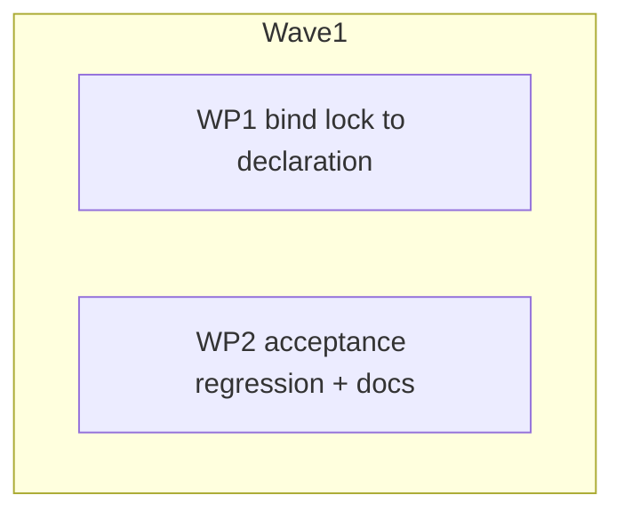

# Plan: Tag-scoped patch rules match project tools resolved from `ocx.lock`

## Status

- **Plan:** plan_patch_lock_advisory_tag
- **Active phase:** 1 — Stub
- **Step:** /hex-execute → Stub
- **Last update:** 2026-09-29 (review round 1 + re-validation folded)
- State:   review
- Tier:    high
- Tier-grammar: 5
- Effective-tier: derived
- Updated: 2026-09-29
- Next:    /hex-review .claude/artifacts/plan_patch_lock_advisory_tag.md
- Reviewed: 1c6d2ca79 (hex-review high round 2, full pass, Needs Work)
- Feature branch: hex/patch-lock-advisory-tag (from main 59b8b579d)

---

## Overview

**Type:** Bug fix · **Scope:** Small (1–3 days) · **Reversibility:** two-way — `ocx.lock` bytes, the lock JSON schema and execution-record bytes for lock-resolved tools stay identical (C-001, C-008).
**Severity:** High. A `required` tag-scoped overlay is silently missing for every project tool, and the user guide's own `ocx.sh/java:*` example is one of them.

### Observed

A patch rule anchored on a tag (`ocx.sh/java:*`, `*/java:21*`) never matches a tool resolved from `ocx.toml` + `ocx.lock`. That covers `ocx exec`, `ocx env`, `ocx pull`, eager materialization on `add`/`lock`/`update`, `ocx direnv export` and the global toolchain. The same package installed with `ocx package install ocx.sh/java:21` gets the companion.

### Root cause

- **What the lock stores.** `ocx.lock` keeps only the bare `repository` plus one leaf digest per platform. This is by design: `LockedTool` is `deny_unknown_fields` and `validate()` rejects a repository that is not bare (`lock.rs:246`).
- **Where the tag is dropped.** Every lock→identifier site rebuilds the identifier from the lock alone: `repository.clone_with_digest(leaf)` → `registry/repo@sha256:<leaf>`. The tag declared in `ocx.toml` is never joined back.
- **Downstream is already correct.** `clone_with_digest` keeps a tag. `PinnedPackageRef` is "digest plus advisory tag". The composer's `admitted` set stays tag-bearing (`composer.rs:189`, `:269`). `collect_companions` matches both the full form and the `without_digest()` form (`descriptor.rs:231-236`).
- **Why no test caught it.** The lock-plus-patches acceptance tests (`test_patches.py:1041`, `:1294`) use only `"*"` rules.
- **Found during execution, a separate root cause.** Project commands (`ocx lock`, `ocx pull`, `ocx exec`) never run install-time patch discovery, so no companion is ever installed or pinned for a tool reached only through `ocx.toml`, whatever the descriptor. Filed as [ocx-sh/ocx#550](https://github.com/ocx-sh/ocx/issues/550). This plan fixes the flow that does work today: the package was installed once by tag, which pins its companion, and is then run through `ocx.toml`. Before the fix, the lost tag meant the pinned companion was ignored. The acceptance tests seed each scenario with `ocx package install <repo>:<tag>`, and S-004 asserts only C-006.

Production lock→identifier sites. The ones marked *tag* need it for patch matching; the ones marked *content* are content-addressed and stay tagless on purpose:

| Site | Path | Needs |
|---|---|---|
| `crates/ocx_project/src/compose.rs:280` `resolve_selected_tools` → `host_leaf_identifier` | `ocx exec`, `ocx env`, `ocx inspect --resolve` | tag |
| `crates/ocx_cli/src/app/project_context.rs:327` `materialize_lock` | eager pull on add/lock/update | tag |
| `crates/ocx_cli/src/command/pull.rs:187` | `ocx pull` | tag |
| `crates/ocx_cli/src/command/direnv_export.rs:96` | `ocx direnv export` | tag when lock current |
| `crates/ocx_cli/src/command/toolchain_env.rs:388` (hand-built) | global toolchain env | tag when lock current |
| `crates/ocx_cli/src/command/inspect.rs:25-39` `declared_identifier` (duplicate join) | `ocx inspect` | tag (already joined — replace with C-003) |
| `crates/ocx_package_manager/src/mutate.rs:199-215` `default_group_roots` | `bin/` trampoline names (metadata-derived) | content |
| `crates/ocx_package_manager/src/tasks/render_toolchain.rs:912` `link_target` | `links/` render | content |
| `crates/ocx_project/src/consent.rs:196`, `:213` `verified_sources` | shell consent | content |
| `crates/ocx_package_manager/src/tasks/clean.rs:46`, `:141` | GC roots | content |
| `crates/ocx_cli/src/api/data/update.rs:86-88` `pull_identifier` | `ocx update` diff (compares against a possibly stale lock) | content |

### Owner direction

- The tag is advisory, and the digest always wins for resolution.
- Carry the `ocx.toml` tag onto the lock-built identifier by joining on `(group, name)`. The lock format does not change.
- Enforce it in the type system. A pinned identifier made from a lock entry is either *bound* (tag from the declaration) or an explicitly named *untagged* pin. There is no silent third path.

---

## Design

Reviewed options: A adds the declared ref to the signature only; B binds the lock to the declaration and seals the repository. A leaves `toolchain_env.rs:388` and its siblings compiling tagless without anyone noticing, so **B is chosen**, reusing the existing `ocx_oci::Repository` instead of minting a type.

Rejected:

- **Private `LockedTool` fields:** more churn, and no stronger guarantee than C-001.
- **Joining only in `select_tool_set`:** the pull, direnv, global and eager paths never reach it.
- **Returning `PinnedPackageRef` from the bound path:** `ResolvedTool`, `ComposeRequest` and `manager.find` all take `PackageRef`, so the ripple is not worth it in a fix.

### Component contracts

- **C-001 `LockedTool.repository: ocx_oci::Repository`.** This reuses `crates/ocx_oci/src/repository.rs`, which is already bare with no way to attach a tag or digest.
  - `ocx.lock` TOML bytes round-trip identically. Fixture: the repo's own `ocx.lock` plus the existing lock fixtures.
  - The generated lock schema stays byte-identical. The gate is `crates/ocx_schema/tests/golden/project-lock.json`. Use `#[schemars(with = "PackageRef")]` on the field, and leave the field and struct doc comments untouched because they are schema text.
  - A hand-edited tagged repository still fails with the typed `LockRepositoryNotBare` (exit 78), not a serde `TomlParse`. `Repository`'s own `Deserialize`, serde `try_from` and `deserialize_with` all surface as `TomlParse`. The mechanism is therefore a private raw mirror struct (`RawLockedTool { repository: PackageRef, .. }`, `deny_unknown_fields`), parsed in `from_str_with_path`, checked by `validate()` (`lock.rs:239-266`), then converted.
  - The write-side test `write_rejects_tagged_repository` (`lock.rs:1057-1079`) becomes unrepresentable. Delete it, since the type now guarantees it, and add a **new** load-side test for the typed error. None exists today.
  - Test fixtures use an infallible `Repository::new(registry, repo)` so the ~41 `LockedTool { .. }` literals stay mechanical. `resolve.rs:340` builds it the same way.
- **C-002 `Repository::pin_untagged(&self, digest: Digest) -> PinnedPackageRef`** (`ocx_oci`, additive). This is the only named way to pin a lock entry without a tag. Its callers are exactly the *content* rows above plus the C-004 fallbacks, and each one is a greppable, reviewed choice. Two helpers, added during the stub phase, serve it. `LockedTool::host_leaf(platform) -> Digest` does the host-leaf lookup and returns a bare digest, so it cannot pin by itself. `ProjectLock::lenient_host_identifiers(Option<&ProjectConfig>, platform)` is the single tag-path fallback site (`lock.rs:544`), and its name says it is lenient.
- **C-003 `ProjectLock::bind(&self, config: &ProjectConfig) -> Binding`**, with `enum Binding { Current(Vec<BoundTool>), Stale }`. Pure, never an error.
  - It returns `Stale` when any of these hold: `lock::is_stale(config)` is true; any lock entry has no declaration under its `(group, name)`; or `entry.repository != declared.without_specifiers()` for any entry (per-entry desync the hash cannot see).
  - Otherwise it returns `Current`, one `BoundTool` per lock entry, joined through the existing private `resolve.rs:303` `declared_identifier`.
  - `inspect.rs:25-39` `declared_identifier` is deleted in favour of it.
- **C-004 `BoundTool`** owns a `LockedTool` plus its declared `PackageRef`. It exposes:
  - `locked()`;
  - `declared() -> &PackageRef`: the full declaration, including a declared digest. `ocx inspect` reports it as its `identifier` JSON field;
  - `advisory_tag() -> Option<&str>`: the declaration's tag, `None` for a digest-only declaration;
  - `host_leaf_identifier(&self, platform) -> Result<PackageRef, Error>`, which returns `registry/repo[:tag]@<host leaf digest>`. The declared digest is ignored in favour of the lock's platform leaf, so the digest wins. The `NoHostLeaf` / `AmbiguousHostLeaf` errors are unchanged.

  The free `ocx_project::host_leaf_identifier(&LockedTool, ..)` is deleted.

  **Stale-lock policy (all *tag* rows):**
  - Strict callers (`ocx exec`, `ocx env`, `ocx pull`, inspect) already refuse a stale lock with exit 65 before this point. If `bind` returns `Stale` there, they report the same stale-lock error.
  - Lenient callers fall back to `pin_untagged`, which is exactly today's behaviour:
    - `direnv_export.rs:77-80` warns and continues;
    - the global `toolchain_env.rs:314-412` has no staleness gate and still emits locked tools when the global `ocx.toml` fails to parse;
    - eager `materialize_lock` (`project_context.rs:297-310`) has no staleness gate. It gains a `&ProjectConfig` parameter from its callers: `add.rs:126` (the no-op path, which reads `previous_lock()`), `add.rs:178`, `command/lock.rs:109` and `command/update.rs:155`. The first can see a stale lock, and it degrades to untagged instead of gaining a new exit 65.

  A new tag is never paired with an old digest. Without this rule, a `java:17*` rule would match Java 21 content after an unrelocked edit.
- **C-005 `ToolSource::Locked(BoundTool)`.** `select_tool_set` / `compose_tool_set` use their `config` argument; drop the `_config` underscore and the "unused" doc line. For a locked tool, `ResolvedTool.identifier` is `registry/repo:tag@sha256:<leaf>`. `ToolSource::Explicit` is unchanged.
- **C-006 No new persisted index state.** A project pull of `repo:tag@digest` adds no tag→digest entry to the local index or tag store, and no `candidates/<tag>` symlink the tagless install did not create. The premise holds because `chained_index.rs:425-429` grows the tag store only for a tag without a digest.
- **C-007 Pre-compose dedup is content-based.** The `PackageRef ==` dedup in `materialize_lock` (`project_context.rs:310`) compares content (`eq_content` / digest), so two bindings of the same content under different tags yield one pull and one root. `mutate.rs:204` needs no change, because it sees only `pin_untagged` refs. The first binding's tag is the one patch matching sees, which is a documented limitation. The composer and record dedups are already tag-blind (`composer.rs:161`, `:173`, `:266`, `:340`, `:352`, `:588`).
- **C-008 Execution records for lock-resolved tools are byte-identical to today.**
  - No `sh.ocx.resolved-from: "tag"` annotation (`execution_record.rs:962`). The digest came from the lock, not through a tag.
  - No purl `tag` qualifier (`purl.rs:47`). This covers both purl sites: the package entry in `project()` and `executable_block` (`execution_record.rs` ~790), which renders its own purl from `info.identifier()`.
  - `website/src/docs/reference/execution-records.md:121` stays true, reworded from "the lock stores no tags" to "a lock-resolved digest is not reached through a tag".
  - `resolution.autoInstalled` entries (`composer.rs:895-897` → `execution_record.rs:700-701`) are filled from the pull request identifiers, so they also drop the advisory tag for lock-origin tools.
  - **Launcher-shim frames record no tag provenance at all** (decided in WP1 review): no marker, no purl tag, and a tagless `autoInstalled` and `scope.requested`. This applies to every shim, package-tier ones included. A shim pulls by its baked digest, and the baked tag is first-writer-wins across the whole `OCX_HOME`, so it is not reliable provenance.
  - How it keys, with no threading needed: `Scope::Project.bindings` holds only `Origin::Group` tools, which are exactly the lock-resolved ones. `binding_for(identifier, &inputs.scope).is_some()` inside `project()` (`execution_record.rs:974-977`) is therefore the lock-origin test. It gates the marker (`:959`), the tag passed to `package_url`, and the `autoInstalled` identifier. A positional `name=repo:tag` still carries all three.

### UX scenarios

- **S-001** `ocx.toml` declares `java = "<reg>/java:21"`, the project is locked, and a descriptor rule has `match: "<reg>/java:*"`. `ocx exec -- env` and `ocx env` both contain the companion variable. Before the fix it is absent.
- **S-002** Same setup with `required: true` and the companion unavailable: the command fails closed on the existing `required` exit path.
- **S-003** `ocx.toml` declares a digest-only `java = "<reg>/java@sha256:…"`: a `:*`-anchored rule does not match, and a `<reg>/java*` rule does.
- **S-004** On a fresh `OCX_HOME`, `ocx pull` for S-001's project installs the tag-scoped companion, and the local index has no tag entry for `java` afterwards (C-006).
- **S-005** Global toolchain: after `ocx --global add <reg>/java:21` with a tag-scoped rule, the global env contains the companion.
- **S-006** Stale lock after editing the tag in `ocx.toml` without relocking:
  - (a) `ocx exec` exits 65, unchanged;
  - (b) `ocx direnv export` warns and emits the env *without* the tag-scoped companion (tagless fallback), never pairing the new tag with the old digest;
  - (c) the global toolchain with a stale lock or an unparseable `ocx.toml` still emits its tools, tagless.
- **S-007** `ocx exec` on S-001's project writes an execution record whose `java` entry has no `sh.ocx.resolved-from` annotation and no purl `tag` qualifier (C-008).

### Edge cases

- The same binding name in two groups is two `(group, name)` keys, so they never collide.
- A declaration with no tag defaults to `latest` (`config.rs:620`), so the only tagless bound tool is a digest-only one.
- A positional `name=identifier` is untouched.
- Launcher re-entry (`install_info_from_package_root`) mints the synthetic `file-url-mode/<hex>` id, which matches catch-all rules only. This is pre-existing and documented (AF1) and out of scope; see Deferred.

### Error taxonomy

There are no new error kinds or exit codes. Stale lock stays 65 (strict callers only). `LockRepositoryNotBare` stays 78. `bind` never errors.

### Constitution check (`arch-principles.md`)

No deviations:

- The join lives in the lib (`ocx_project`), and the CLI call sites get thinner.
- There is no compat shim: the free function and the inspect duplicate are deleted.
- `ocx_package_manager → ocx_project` is an allowed edge (`scripts/crate_map.toml`).
- `ocx_oci` is an ecosystem crate. C-002 is additive, so no satellite consumer breaks.

---

## Executable phases

Contract-first TDD per WP: **Stub → Specify → Implement → Review**.

### WP1: bind lock to declaration (opus)

1. **Stub.** Add:
   - `Repository` as the `LockedTool.repository` type (C-001);
   - `Repository::pin_untagged` (C-002);
   - `ProjectLock::bind` / `Binding` / `BoundTool` (C-003, C-004), with `unimplemented!()` bodies;
   - `ToolSource::Locked(BoundTool)` (C-005).

   Then switch every row of the site table:
   - *tag* rows go to `BoundTool`, with a `pin_untagged` fallback on `Stale` for the lenient callers;
   - *content* rows go to `pin_untagged`.

   Delete the free `host_leaf_identifier` and `inspect.rs` `declared_identifier`. Fix the fixture literals so the workspace compiles.
2. **Specify.** Unit tests, red against the stubs:
   - `bind`: joins by `(group, name)`, including the same name in two groups; returns `Stale` for a stale hash, a missing declaration, and a repository/declaration desync.
   - `host_leaf_identifier`: returns repo + tag + leaf; a digest-only declaration gets no tag; a declared digest is ignored.
   - C-005: `ResolvedTool.identifier` carries the tag.
   - C-001: lock bytes and the schema golden are unchanged. New load-side test: a tagged repository yields `LockRepositoryNotBare`.
   - C-002: `pin_untagged` yields `registry/repo@digest` with no tag.
   - C-007: two bindings with the same content and different tags yield one pull in `materialize_lock`.
   - C-008: the record for a lock-resolved tool has no marker, no purl tag and a tagless `autoInstalled` entry, while a positional tag keeps all three.
3. **Implement.** Fill the bodies and apply the lenient fallbacks (C-004). Switch the two pre-compose dedups (C-007) and key the C-008 marker on lock origin.
4. **Review.** Spec, quality and security perspectives. The diff touches `ocx_oci` and the identity of every project install.

### WP2: acceptance regression + docs (sonnet)

- **Tests** in `test/tests/test_patches.py`, reusing the existing `_run_in` project helper: S-001, S-002, S-003, S-004 (including the no-index-tag assertion), S-005, S-006 (a/b/c) and S-007.
  - Prove it red on the current tree in this WP's worktree before WP1 lands. S-001, S-002, S-004 and S-005 are red; S-003, S-006 and S-007 are green, because they pin unchanged behaviour.
  - Run it with `task test:parallel --force -- tests/test_patches.py` from the repo root.
  - A new `xdist_group` needs its `module_slots` entry in `test/BUILD.bazel`.
- **Docs:**
  - `website/src/docs/user-guide/patches.md`, after the `match` paragraph (~line 58). The identifier matched is the one you declared: `repo:tag` from the command line, `ocx.toml` or the global toolchain, with the resolved digest attached. A digest-only reference has no tag, so tag-anchored rules skip it; match on the repository (`ocx.sh/java*`) to cover both. A digest in a pattern matches the platform-specific manifest digest, not the multi-platform index digest. When one package is declared under two tags, the first declaration's tag is the one matched. No migration prose.
  - `website/src/docs/reference/execution-records.md:121`: reword per C-008.
  - `crates/ocx_package_manager/src/patch/matcher.rs` module doc: "an untagged identifier does not match `*:*`" holds only when there is no digest either, because `repo@sha256:…` matches `*:*` through the digest's colon. One-line fix.

---

## Parallelization

| WP | Scope | Expected files | Size | Wave | Depends-on | Review | Verify | Status |
|---|---|---|---|---|---|---|---|---|
| WP1 | C-001–C-008 | `crates/ocx_oci/src/repository.rs`; `crates/ocx_project/src/{lock.rs,compose.rs,resolve.rs,consent.rs,lib.rs}`; `crates/ocx_cli/src/app/project_context.rs`; `crates/ocx_cli/src/command/{pull.rs,direnv_export.rs,toolchain_env.rs,inspect.rs,toolchain_exec.rs,add.rs,lock.rs,update.rs}`; `crates/ocx_cli/src/api/data/{update.rs,lock.rs}`; `crates/ocx_package_manager/src/{mutate.rs,composer.rs,activation.rs}`; `crates/ocx_package_manager/src/tasks/{render_toolchain.rs,clean.rs}`; `crates/ocx_package_manager/src/record/{execution_record.rs,purl.rs}` (fixtures and compile fallout included) | M | 1 | — | risk: identity of every project install | full | merged |
| WP2 | S-001–S-007; docs for S-003 and C-008 | `test/tests/test_patches.py`, `test/BUILD.bazel` (only if a slot is added), `website/src/docs/user-guide/patches.md`, `website/src/docs/reference/execution-records.md`, `crates/ocx_package_manager/src/patch/matcher.rs` | S | 1 | — | | scoped | merged |

- **Why two WPs:** WP1 is one compile-coupled type change. Splitting it would leave a WP that does not compile on its own. The docs fold into WP2 because on their own they fall below the overhead of a worktree.
- **Critical path:** WP1.
- **Shippable after wave:** 1. The fix, its regression tests and the docs land together.
- **Merge order:** WP1, then WP2. WP2's red-before proof is taken in its own worktree against the pre-WP1 base, and it goes green after the merge. Run `task verify` (full) at the WP1 merge and at finalize; scoped otherwise.
- **Commit subject (the changelog line):** `fix(project): tag-scoped patch rules now match tools resolved from ocx.lock`.

---

## Decisions taken by default (owner may override before /hex-execute)

- **Option B, reusing `ocx_oci::Repository`**, over signature-only A. Both reviewers concurred.
- **Lenient callers degrade to untagged on a stale lock** (C-004) instead of refusing. This includes the `ocx add` no-op path. That matches today's never-block contract for direnv and the login exporter.
- **Execution records for lock-resolved tools stay byte-identical** (C-008). The alternative, gaining the `resolved-from` marker and a purl tag, would misreport provenance: the digest came from the lock, not through a tag.

## Deferred findings (need human judgment)

- **With a stale lock, lenient callers skip a `required` tag-scoped rule.** `ocx direnv export`, the global toolchain and eager materialize fall back to the untagged identifier, so a required tag-scoped rule silently does not match until `ocx lock` runs. Strict commands exit 65. Warn or fail closed instead?
- **A cached "no descriptor" result never expires** ([ocx-sh/ocx#551](https://github.com/ocx-sh/ocx/issues/551)), so a descriptor published later is ignored. This predates this branch.

- **Shim patch matching uses the first-baked tag.** A lazy shim's patch matching (path E) uses the tag first baked into the shared shim directory, not the invoking project's. That extends C-007's "first tag wins" from one project to the whole home. The alternative is to re-derive the tag from the project in scope at shim exec.

- **Patch discovery on the project path:** [ocx-sh/ocx#550](https://github.com/ocx-sh/ocx/issues/550). Until it lands, a companion reaches an `ocx.toml` tool only after an `ocx package install` of the same package.

- **Launcher re-entry identity.** `ocx launcher exec` rebuilds the base as the synthetic `file-url-mode/<hex>@digest` (`crates/ocx_package_manager/src/lib.rs:607`). Under a generated entry-point launcher, only catch-all rules re-derive, for every package. This is documented design (AF1) with a separate root cause. Recommended: a follow-up issue, not this plan.
- **Dependencies' tags.** Whether a tool's dependencies reach the composer tagged depends on package metadata, not the lock, so this bug does not apply. It is not traced here.
