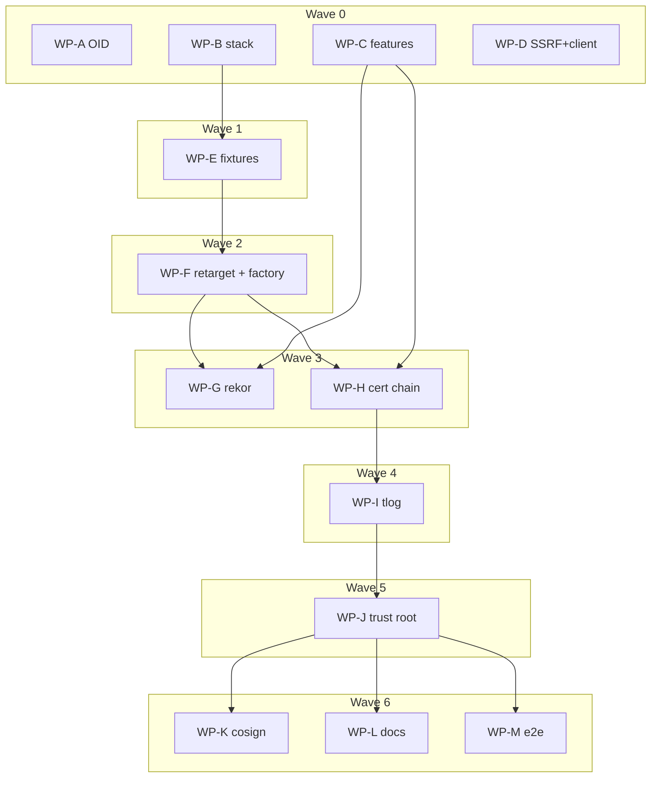

# Plan — Real Sigstore stack, delegation, milestones 2 & 5

## Status

- **Plan:** plan_real_sigstore_stack
- **Active phase:** 7 — bounded review-fix loop
- **Step:** finalized
- **Last update:** 2026-08-18 (after cf747f75: /finalize squashed 100 commits into feat + chore)

### Contract changes the squashed commit subject / PR body must announce

Round-3 review found three behaviour changes that landed under subjects naming
something else. The branch squashes at `/finalize`, so the remedy is the final
subject and the PR body, not a history rewrite:

1. **Verify exit codes.** `VerifyErrorKind::Internal(_) => None` in the classifier
   means a registry fault reaching verify now keeps its own code (80/75/69/65)
   instead of collapsing to 1. The sign-side twin got its own commit
   (`5656874b`); the verify half rode inside `dd5ec1ac`.
2. **`--format json` `.error.kind` for exit 82** (`DirtyRcBlock`) moved from
   `internal` to `permission_denied`. More truthful, and a break for a script
   matching the old value.
3. **Ambient OIDC source selection** unified `detect`/`acquire`'s emptiness rule:
   a set-but-empty `ACTIONS_ID_TOKEN_REQUEST_URL` is now absent to both. Landed
   inside `801e389d`, whose subject names terminal sanitization.

### Scope audit (post-round-3, after the owner flagged partial achievement)

Green CI was mistaken for delivered scope. The audit found the substance present
and the **bookkeeping** wrong, in one place that mattered:

- **PR #203 declared closure for two issues, not fifteen.** The body listed them
  as `Closes #194 #195 #196 ...`, and GitHub parses only the first issue after
  each keyword — so #195, #196, #98, #99, #106, #24, #206-#210 were all silently
  unlinked. Rewritten as `closes #N, closes #N`; `closingIssuesReferences` now
  returns all 15.
- **#197, #204 and #205 were still listed as deferred** while being delivered.
  #197 has bidirectional cosign 3.x interop tests that raise rather than skip;
  #204's cast was re-recorded against the live stack during this audit
  (`Signed at 2026-08-18T17:31:50Z`, 17s before the check); #205 is the stack.
- **A stale comment in `trust_cache.rs` called TUF expiry "deferred"** in the
  same file whose issue (#210) the PR claims to close. Corrected: expiry is
  enforced online by sigstore's client, and the 24h TTL is the separate offline
  bound.
- Everything else in the directive verified present: real stack, SSRF guard on
  all four Sigstore dial sites (sign, verify, auto-verify, ambient OIDC URL) with
  address pinning against rebinding, docs covering public-good and self-hosted
  deployments plus GitHub Actions and GitLab CI, and the oci-client change landed
  as one merged PR against `ocx/integration`.

Only **#107 (Rekor v2)** stays open, deliberately: sigstore-rs 0.14 ships no v2
client and the alternative is hand-writing one.

### Two CI blockers cleared after round 3 (neither in this branch's diff)

Both surfaced only once the Windows Deep job actually ran, and neither is
reachable from any commit on this branch.

**`dockerconfigstore_locked_reader_never_observes_torn_json` (`crates/ocx_lib/src/auth/store.rs`).**
Failed on the Windows runner with `lock timed out`: the reader thread raced
100 back-to-back writers for one exclusive lock and lost past its 5s budget
under nextest's parallelism. The test asserted more than its name — losing a
lock race is not observing torn JSON. It now skips a starved round instead of
panicking, and counts completed non-empty locked reads so a fully starved
reader cannot pass vacuously. That counter is the check: proven red by forcing
every acquisition to fail. `git log FETCH_HEAD..HEAD -- crates/ocx_lib/src/auth/store.rs`
is empty, so this is pre-existing.

**`cargo-about` was unpinned (`taskfiles/rust.taskfile.yml`).**
`license:notice:check` diffs a committed file against the tool's output, so
the tool version is a gate input — but the install task guarded only on
`cargo about --version` exiting 0, i.e. on the binary existing at all. CI
installed 0.9.1 at 13:45 UTC on 2026-08-18 and passed; 0.9.2 published after
that and groups multi-licensed crates differently (separate sections for
rustix, linux-raw-sys, encoding_rs, schemars, tracing-core), so the next run
on any branch would have failed against a file nobody had touched. Version now
pinned and matched exactly in the status check; notice regenerated under the
pin. The added sections are attribution that was being omitted.

### Windows Verify Deep failure (fixed)

`Build & Unit Test (Windows)` failed on `-D dead-code`: every caller of the
`make_sign_cmd` test helper was `#[cfg(unix)]`, so the helper was unused in the
Windows test build. The **production** build passed, so the earlier cfg fix is
CI-verified. Remedy is the test the arm never had: a `#[cfg(not(unix))]` case
asserting `--identity-token-file` is refused with `OidcPreCheckFailed` naming
both escape hatches. Proven red by inverting the guard; the cfg was forced
active locally to run both directions, and both mutations were restored.

### Round-3 second pass (r3-security-3, r3-integrity-3)

- **Fixed.** The four bidi sanitizer tests asked `is_bidi_control` whether the
  output was clean, and the sanitizer filters on that same function — the exact
  negation of the predicate under test. Now assert the injected literal;
  proven red on a narrowed `is_bidi_control` and green on the restored range.
- **Fixed (message only).** A pinned-resolver refusal now names the HTTP-proxy
  case instead of blaming a host the operator never configured.
  [#323](https://github.com/ocx-sh/ocx/issues/323) carries the policy call.
- **Refuted.** The two `sign::pipeline` tests reported red re-run green at HEAD
  under the reviewer's own invocation (266/266). Stale checkout, not a defect.
- **Already recorded.** The `801e389d` scope-creep finding is contract change 3
  above; the squashed subject and PR body are the remedy.

### Deferred to issues rather than fixed here

- [#320](https://github.com/ocx-sh/ocx/issues/320) — `--format json` emits the
  certificate identity fields unsanitized (bidi reordering, not injection).
- [#321](https://github.com/ocx-sh/ocx/issues/321) — an undecodable Rekor proof
  is reported as retryable (exit 83) alongside the genuinely transient case.
- [#323](https://github.com/ocx-sh/ocx/issues/323) — every Sigstore dial fails
  under an HTTP proxy configured by hostname; fail-closed, and the remediation
  is a policy call (guarding the proxy refuses every RFC1918 corporate proxy;
  exempting it is a documented weakening of the guard).
- [#322](https://github.com/ocx-sh/ocx/issues/322) — nothing forces a new error
  variant to get an error-slug row; the count assertions only catch deletions.

Design record: [`adr_real_sigstore_stack_and_delegation.md`](./adr_real_sigstore_stack_and_delegation.md).
The ADR's **Migration plan** table is the canonical step order; this file maps its
steps onto file-disjoint work packages and waves. Where the two disagree, the ADR wins.

## Component contracts

| ID | Contract | Testable behaviour |
|---|---|---|
| C-001 | `FULCIO_ISSUER_OID` is `1.3.6.1.4.1.57264.1.8` (issuer v2), everywhere it appears | Unit test asserts the constant and the two doc comments; a cert carrying only `.1.1` no longer matches |
| C-002 | `test/docker-compose.yml` gains a `sigstore` profile: dex, tesseract-ct, fulcio, mysql, trillian-log-server, trillian-log-signer, rekor | `docker compose --profile sigstore up -d` reaches healthy for all seven |
| C-003 | `test/sigstore/trusted_root.json` is a valid Sigstore `TrustedRoot` matching the live services | `verify-trusted-root.py` exits 0; flipping one key byte makes it exit non-zero |
| C-004 | `sigstore_stack.py` exposes a session-scoped fixture that signs once and yields a reusable signed package | Fixture import succeeds; suite green |
| C-005 | Zero acceptance test in the signing set is skipped when the profile is up | Assertion is shown **red** with the profile flag removed |
| C-006 | Adversarial-artifact factory produces: tampered chain, missing intermediate, expired leaf, tampered proof, tampered SET, tampered body, wrong identity, wrong issuer, absent SET + TSA, exhausted candidates, unknown bundle version | 11 fault-injection tests green with no fake |
| C-007 | `oci/sign/rekor.rs` is a thin adapter over `sigstore::rekor::apis::entries_api::create_log_entry`, with the shared hardened client injected into `Configuration.client` | Sign acceptance green; bundle carries non-null `inclusionProof` |
| C-008 | Certificate-chain verification is `sigstore::bundle::verify::Verifier`; `verify_cert_chain` and `cert_expired_but_tlog_valid` are deleted | Tampered-chain / missing-intermediate / expired tests red then green |
| C-009 | `oci/verify/tlog.rs` verifies Merkle inclusion and the SET via `InclusionProof::verify`, replacing `verify_rekor_set` + `verify_transparency_body_binding` **in the same commit that deletes them** | Tampered-proof and tampered-SET tests red then green |
| C-010 | `trust_root.rs` parses a typed `TrustedRoot`, exposes `ctfe_keys`, bumps the cache version, and loads the embedded root through `tough` | Offline verify green from `--tuf-root` and from a fresh cache; expired TUF with no network → exit 78 |
| C-011 | Every registry/Fulcio/Rekor dial goes through one hardened `reqwest::Client` carrying `connect_timeout`, `read_timeout`, finite `pool_max_idle_per_host`, and the SSRF-guarded resolver | A rewritten physical host resolving to loopback is refused on the **sign** path |
| C-012 | Exit codes unchanged: 65/77/79/81/83/84 keep their current mapping; `kind_detail()` stays an exhaustive match | Existing exit-code tests pass untouched |

## User-experience scenarios

| ID | Action | Expected | Error case |
|---|---|---|---|
| S-001 | `ocx package sign -p linux/amd64 REF` against the local stack | exit 0; referrer attached; leaf carries embedded SCT | Fulcio unreachable → exit 83, no partial referrer |
| S-002 | `ocx package verify … --certificate-identity … --certificate-oidc-issuer …` | exit 0 | identity mismatch → exit 77; issuer mismatch → exit 77 |
| S-003 | `ocx package verify --offline --tuf-root DIR` | exit 0 from cached material | no Rekor key offline → exit 78 |
| S-004 | Verify against registry:2 (no Referrers API) | exit 84 | — |
| S-005 | `cosign verify` an ocx-signed artifact, and `ocx package verify` a cosign-signed one, one trusted root | both exit 0 | — |
| S-006 | Self-hosted stack per the docs walkthrough | operator reproduces `trusted_root.json` with `generate-trusted-root.py` | — |

## Work packages

| ID | Scope (C-/S- IDs) | Expected files | Size | Wave | Depends | Review | Status |
|---|---|---|---|---|---|---|---|
| WP-A | ADR step 0 — Fulcio issuer OID v2 (C-001) | `oci/verify/identity.rs` | S | 0 | — | self | done |
| WP-B | ADR step 1 — the seven services, keys, trusted root, helper scripts (C-002, C-003) | `test/docker-compose.yml`, `test/sigstore/**` | M | 0 | — | light | done |
| WP-C | ADR step 5 — sigstore crate features, deny re-confirm | `crates/ocx_lib/Cargo.toml`, `Cargo.lock`, `deny.toml` | S | 0 | — | light | done |
| WP-D | ADR step 10 — hardened shared client + dial-site SSRF guard (C-011) | `oci/sign/{fulcio,rekor}.rs`, `oci/client.rs` | M | 0 | — | panel | done |
| WP-E | ADR steps 2–3 — bring-up measurement, `sigstore_stack.py`, sign-once fixture, zero-skip assertion (C-004, C-005) | `test/conftest.py`, `test/tests/fixtures/sigstore_stack.py`, `test/taskfile.yml` | M | 1 | WP-B | light | done |
| WP-F | ADR step 4 — retarget 64 tests, adversarial-artifact factory, delete the fake (C-006) | `test/tests/test_{sign,verify,auto_verify,trust_policy,offline_verify,referrers_capability}.py`, `test/tests/fixtures/adversarial.py`, delete `fake_sigstore.py` + `test_fake_sigstore.py` | L | 2 | WP-E | panel | done |
| WP-G | ADR step 6 — Rekor thin adapter (C-007) | `oci/sign/rekor.rs` | M | 3 | WP-C, WP-F | panel | done |
| WP-H | ADR step 7 — delete `verify_cert_chain` + `cert_expired_but_tlog_valid`, route through `Verifier` (C-008) | `oci/verify/pipeline.rs` | M | 3 | WP-C, WP-F | panel | done |
| WP-I | ADR step 8 — `oci/verify/tlog.rs` (C-009) **ordering invariant: never merged into WP-H** | `oci/verify/tlog.rs`, `oci/verify/pipeline.rs` | M | 4 | WP-H | panel | done |
| WP-J | ADR step 9 — trust-root reshape, `tough` embedded root (C-010) | `oci/verify/{trust_root,trust_cache,trust_resolve}.rs` | L | 5 | WP-I | panel | done |
| WP-K | ADR step 11a — cosign interop read-path tolerance (S-005) | `oci/verify/pipeline.rs`, `test/tests/test_cosign_interop.py` | M | 6 | WP-J | panel | done |
| WP-L | ADR step 11b — docs: self-hosting, public-good services, GitHub Actions, GitLab CI, asciicasts (S-006) | `website/src/docs/in-depth/signing.md`, `website/src/docs/reference/{command-line,configuration,environment}.md`, `website/src/docs/user-guide.md`, casts | L | 6 | WP-J | light | done |
| WP-M | e2e repo `michael-herwig/e2e-signing-*` | external repo | M | 6 | WP-J | self | done |

**Critical path:** WP-B → WP-E → WP-F → WP-H → WP-I → WP-J → WP-K.
**Shippable after wave: 4** — at that point transparency verification is delegated and
intact; waves 5–6 are trust-root fidelity, interop and docs.

**Merge order (serialized topological):** A, C, B, D, E, F, G, H, I, J, K, L, M.

**Parallelism note.** Waves 3 and 6 are the only ones with genuine intra-wave
parallelism; WP-E and WP-F are single-WP waves because both mutate
`test/tests/conftest.py`'s re-export block and splitting them would need a
merge-conflict dance costing more than the serialization.

## Open questions

- [NEEDS CLARIFICATION: does `tough` resolve the embedded-root staleness story offline, or does WP-J need a checked-in root plus a documented refresh command? Decide inside WP-J against real behaviour, not from docs.]

## Gates

Every WP: `task rust:verify` for Rust, `task test:parallel` for pytest, never piped, `--force`.
Rust changes rebuild with `--features ocx/__testing` and copy to `test/bin/ocx` before pytest.
`TMPDIR` outside `/tmp` and outside any git tree.
