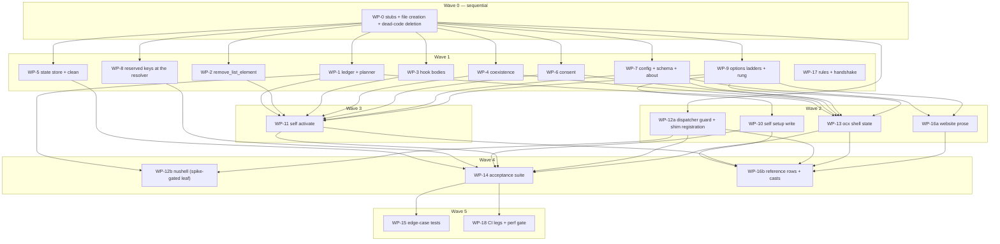

# Plan: Shell Environment Overhaul — Native Per-Prompt Reconciler

## Status

- **Plan:** plan_shell_env_overhaul
- **State:** review
- **Tier:** high (`/hex-plan high`)
- **Active phase:** 6 — `/hex-review high` round 3; findings are landing as fixes on this branch
- **Step:** `/hex-review → round 3`
- **Last update:** 2026-08-26 (round 3: twelve late commits reconciled with the record; A-39…A-42 added)
- **Next:** finish the round-3 fix pass, then re-run `/hex-review` on the fixed diff before asking the owner to merge [ocx-sh/ocx#339](https://github.com/ocx-sh/ocx/pull/339)

**Review round 1 (`/hex-review high`, 2026-08-25).** Eight-perspective panel plus the
cross-model (Codex) gate. 6 Block, 18 High, 20 Warn; every finding ended as a fix or an
issue, nothing dropped. Fixed on this branch: the clause-2 consent RCE (a `namespaces`
grant was satisfiable by attacker-authored `ocx.lock` text, reaching project `[env]` and
so PATH-front — clause 2 now authorizes the tool channel only), fish and nushell
path-kind corruption for any key not ending in `PATH`, pwsh unbounded PATH growth and its
Unix parity break, list-element normalisation contradicting the byte-exact contract, the
missing A-10 parse-boundary refusal, A-23's nushell `list` arm, a retired global constant
leaking forever (global scope had no priors), restore/remove ordering re-introducing a
retired element, the hook's missing `--offline` (31.5 ms/prompt) and the uncached
no-project walk (56 ms → 5 ms per `cd`), the unguarded `ocx()` wrapper (14.4x on read-only
commands), and four vacuous gates — the EC register parser silently under-parsing three
rows, nine rows "covered" by assertion-free skips, `live_*` tests green with a missing
interpreter, and the C-044 injection sitting outside the measured process.
Deferred as issues: [#340](https://github.com/ocx-sh/ocx/issues/340) (C-044's 2 ms budget
vs ~16 ms shipped startup — owner decision), [#341](https://github.com/ocx-sh/ocx/issues/341)
(Elvish has `$edit:before-readline`; the "no hook point" premise was false),
[#342](https://github.com/ocx-sh/ocx/issues/342) (the reconciler has no fixed point),
[#343](https://github.com/ocx-sh/ocx/issues/343) (~1180 lines of orchestration in `ocx_cli`),
[#344](https://github.com/ocx-sh/ocx/issues/344) (the consent residual that survives the fix),
[#345](https://github.com/ocx-sh/ocx/issues/345) (`reconcile.rs` holds three concepts).

**Review round 3 (`/hex-review high`, 2026-08-26).** Twelve late commits had changed shipped
behaviour without the record following; this round's highest-value defect was a clause corrected
in one document and left false in two others, so every correction below was applied in **all**
documents that state it. Landed as record: **A-39** (clause 2 quantifies over the store's
`refs/origins/` record, never `ocx.lock`'s claim — with `evaluate` gaining a fourth parameter and
`Activate(Grant::Namespace)` withholding the project `[env]` channel), **A-40** (a refused
`[shell.consent]` table is stripped on every tier and the rest of the file survives — *except* when
it carries a non-empty `namespaces.exclude`, which withdraws another tier's grant and therefore
keeps the 78 hard failure, because dropping a withdrawal widens), **A-41** (the host-capability
record is evidence rather than assertion, gated on a per-loader file identity, and a detection that
classified nothing is never persisted), **A-42** (every existence probe resolves in the namespace it
asks about and no wider — the rule behind both the `command -v` and the elvish `to-string` defects), and
— added by the round-3 correction pass — **A-43** (the per-prompt guard's five terms are enumerated
normatively, with the yield sentinel among them and an admission rule for any future term; `be740590`
shipped that term with no design anchor to add it against).
Also corrected: the elvish idempotency mechanism, recorded in two places as the text scan that was
deleted as a silent-suppression bug; and C-048 / ADR Decision 6(b)'s nushell `Plan` channel, which
is **produced but not yet consumed** — both nu paths still re-run `ocx --format json --global env`.

**Three of round 1's six deferred issues are closed on GitHub**:
[#340](https://github.com/ocx-sh/ocx/issues/340) (the latency-budget amendment is withdrawn as a
misdiagnosis — C-044), [#341](https://github.com/ocx-sh/ocx/issues/341) (the elvish arm shipped),
[#342](https://github.com/ocx-sh/ocx/issues/342) (the fixed point is asserted). Three stay **OPEN**,
verified against `gh` rather than against this plan's own prose:
[#343](https://github.com/ocx-sh/ocx/issues/343) and
[#345](https://github.com/ocx-sh/ocx/issues/345) are >500-LOC refactors, out of scope for a review
fix pass and correctly not attempted inside one; and
**[#344](https://github.com/ocx-sh/ocx/issues/344) is still open, not "closed by A-39"** — an
earlier revision of this line said it was. A-39 moved clause 2's quantifier off `ocx.lock`'s claim
and onto the store's `refs/origins/` record, which is the larger half, but the record's **write
gate** does not deliver what A-39 first claimed for it: `record_origin` fires from any pull that
reaches the fetching branch, including one re-assembled entirely from the layer cache with no
registry contact, so a marker attests *an act of pulling on this host under that name* rather than
*a registry serving under it*. A-39 now carries that residual explicitly, and the code fix — gating
the write on observed wire contact — is tracked as
[ocx-sh/ocx#348](https://github.com/ocx-sh/ocx/issues/348). #344 closes when that lands.

**Review round 3's own residuals, filed and open** (they belong in this register, and an earlier
revision omitted them): [#346](https://github.com/ocx-sh/ocx/issues/346) — the host-capabilities
record derives its own path instead of going through `StateStore`, the seam A-41 assumed;
[#347](https://github.com/ocx-sh/ocx/issues/347) — a prompt framework that clobbers the registration
leaves the idempotency marker behind, so re-sourcing never repairs it, which is the read side A-42
governs meeting a write it does not. Both are code, neither is a record gap.

**Review round 4's residuals, filed and open.**
[#348](https://github.com/ocx-sh/ocx/issues/348) — `record_origin`'s write gate does not observe
wire contact, so clause 2's floor is *an act of pulling on this host under that name* rather than
*a registry serving under it*; the ADR, the design spec and the Rust docs are corrected to that
strength, and the code fix is a change to the OCI resolve path that wants its own design pass.
[#349](https://github.com/ocx-sh/ocx/issues/349) — **closed in round 5.** `PARITY_ARMS` carries
`["elvish", "-c"]` and `["nu", "-c"]` with their seed/read arms, so both are driven through
`export_path`, `export_constant`, both removal primitives, the apply/revert round trips and
`emit_message`; `every_hook_shell_has_a_parity_arm` anchors the matrix on the `Shell` enum so no arm
can be dropped in silence; `assert_every_present_interpreter_ran` fails when an installed
interpreter ran nothing and names the observed cause of every skip; and the two interpreters are
installed and required on the unit-test leg (`verify-basic.yml`) and on the Debian shell zoo
(`test/taskfile.yml`). A-15 and A-16 are shipped in full. [#348](https://github.com/ocx-sh/ocx/issues/348)
remains open: it is code, not a record gap.

**Wave status.** WP-0, WP-1, WP-2, WP-3, WP-4, WP-5, WP-6, WP-7, WP-8, WP-9, WP-10,
WP-11, WP-12a, WP-13, WP-14, WP-15, WP-16a, WP-16b, WP-17, WP-18 `merged`.
WP-12b `pending` — the spike-gated nushell leaf; nothing depends on it, and the
acceptance suite skips every nushell project-scope row through a probe that reads the
shipped `env.nu` and reports the `reconcile` count it observed, so those skips vanish
by themselves the day it lands.

**Both `## 10. Open questions` markers are now CLOSED** — the nushell `hide-env` spike (full
parity, `hide-env --ignore-errors`, harness at `test/manual/nushell-hide-env-spike.sh`) and the
per-family shim body-size ceilings (measured post-implementation in WP-12a).

## Classification

- **Scope:** large — 3 new library modules, 1 new CLI command, 1 new config section, a new
  session-carried state format, a new on-disk per-project state root, and a default-on behaviour change
  that reaches every user at their next shell start.
- **Reversibility:** **one-way (high)** on exactly one axis — `ocx package create` refusing reserved
  `OCX_*` / `__OCX_*` metadata env keys is a write-path narrowing (the read path stays permanently
  compatible). Everything else is two-way at four levels (see the ADR's "How Would We Reverse This?").
- **Overlays:** architect=on, research=3, adversary=on.

## GitHub context

- **Closes [ocx-sh/ocx#170](https://github.com/ocx-sh/ocx/issues/170)** — *native `ocx shell hook` for
  local project toolchain (direnv-free)*. This plan is that issue; the PR closes it.
- **[ocx-sh/ocx#265](https://github.com/ocx-sh/ocx/issues/265)** (unset directive in project `[env]`) is
  **out of scope and stays open** — the ADR's Decision 3 keeps it out deliberately. It is a package-metadata
  wire-format change (a fourth `ModifierKind` variant) plus a project-config syntax change, both of which D6
  excludes; nothing in the reconciler is blocked on it, and when it lands the reconciler makes it cheap
  rather than the reverse, since revert already handles the `priors: Unset` case.
- No open PR touches this surface.

## Artifacts

| Artifact | Role |
|---|---|
| [`adr_shell_env_overhaul.md`](./adr_shell_env_overhaul.md) | **Authoritative design record.** Status `Proposed`; treated as Accepted for planning. Nothing here re-decides it. |
| [`adr_shell_env_addenda.md`](./adr_shell_env_addenda.md) | **Binding companion to the ADR**, produced in parallel with this plan. 42 numbered resolutions (`A-01`…) closing 51 `UNSPECIFIED-BY-ADR` rows of the edge-case register, each with a named test hook and red state. **Where the ADR and the addendum conflict, the addendum wins** (§0). It landed after this plan's contracts were cut; that gap is now **closed** — the `A-NN` ↔ `C-NNN` diff is §1a, its corrections are applied to the ADR and the register, and its resolutions are folded into the §7.2 Scope cells. Every WP reads it alongside the ADR, and `reviewer:spec` checks contracts against both. |
| [`design_spec_shell_env_overhaul.md`](./design_spec_shell_env_overhaul.md) | **C-001…C-052** contracts and **S-001…S-045** scenarios, each traced to an ADR Decision. The executable spine. **Its §4 is superseded by §7 of this plan.** |
| [`brief_env_overhaul.md`](./brief_env_overhaul.md) | Scope brief, owner decisions, downstream coupling. |
| [`discover_shell_env_map.md`](./discover_shell_env_map.md) | file:line component map, re-verified this run. |
| [`research_shell_hook_cast_recording.md`](./research_shell_hook_cast_recording.md) | Cast tooling for interactive prompt-hook demos. Decides WP-16. |
| [`research_prompt_hook_ci_testing.md`](./research_prompt_hook_ci_testing.md) | How incumbents test and benchmark prompt hooks. Decides WP-14 and WP-18. |
| [`research_shell_env_sota_gap_check.md`](./research_shell_env_sota_gap_check.md) | Falsification pass over the ADR's external citations. Two contradictions, six gaps. |
| `research_{project_state_layout,trust_whitelist_grammar,shell_integration_rollout,private_env_state_vars,shell_env_reconciler_and_launcher_farm}.md` | Prior research, carried unchanged. |
| `review_adr_env_{spec,security,quality,sota}.md` | Prior ADR review panel; deferred findings are inputs. |

---

## 0. Precedence — which document wins, so nobody has to guess

Reconciled 2026-08-25. All four artifacts were edited into agreement; these three lines are
what a future edit must preserve.

1. **Code wins over every document.** Where an artifact disagrees with `crates/`, the code is
   the fact and the artifact is the bug — fix the artifact, in the same commit.
2. **Addendum > ADR > design spec, on *semantics*.**
   [`adr_shell_env_addenda.md`](./adr_shell_env_addenda.md) binds; where it and the ADR or the
   design spec differ on *what the behaviour is*, the addendum is the answer. Its corrections
   have been applied to both, so no live contradiction remains — a new one is a defect, not a
   choice.
3. **Plan > design spec, on *decomposition*.** Work packages, file ownership, waves, review
   budgets and Scope cells come from §7 of this plan; the design spec's §4 cut is **void**.
   [`analysis_shell_env_edge_cases.md`](./analysis_shell_env_edge_cases.md) is a **test corpus,
   never a source of behaviour** — where a row and a resolution disagree, the resolution governs.

---

## 1. ADR Decision → work-package traceability

**Every Decision maps to at least one work package. No Decision is unmapped.** Contract IDs here match
the §6.2 Scope cells exactly — the two tables were reconciled after review round 1.

| ADR Decision | Subject | Contracts | Work packages |
|---|---|---|---|
| **1** | Private state carrier `__OCX_ENV_STATE` | C-001…C-012, C-036, C-037 | **WP-1** (ledger, codec, forgery rules, planner), **WP-8** (reserved-key gate at the resolver + `create` rejection), WP-13 (decoded render), WP-14/15 (degradation matrix) |
| **2** | One project key, one per-project state root | C-022, C-023 | **WP-5** (`StateStore` accessors + `ocx clean` sweep, `dry_run`-honouring), WP-17 (`subsystem-file-structure.md`'s two edits) |
| **3** | Reconciler: typed three-way, provenance-tagged | C-010, C-011, C-013…C-021 | **WP-1** (planner semantics), **WP-2** (`remove_list_element` + parity + separators), WP-11 (per-prompt wiring), WP-14 (lifecycle matrix) |
| **4** | Consent and the activation whitelist | C-024…C-033 | **WP-6** (stamp, `evaluate`, source normalization, per-caller write seam), **WP-7** (`[shell.consent]` strict grammar, env channel, project-tier strip) |
| **5** | Enablement, symmetric with completions | C-038…C-046 | **WP-9** (both ladders + rung provenance), **WP-10** (`self setup` write), **WP-11** (`self activate`, `--reconcile`), **WP-3** (hook bodies), **WP-12a** (shim-side registration, C-043's shim half) |
| **6** | Regeneration: thin-dispatcher invariant, where lag lives | C-047, C-048 | **WP-12a** (C-047 dispatcher guard, **ungated**), **WP-12b** (C-048 nushell JSON `Plan`, **spike-gated leaf**) |
| **7** *(OD-2)* | `[shell]` in the managed tier | C-029, C-032, C-034 | **WP-7** (digest-pin gate + the strip's reader; `hook` merges unconditionally; tier provenance) |
| **8** *(OD-3)* | Accept the silent digest swap; name the real mitigation | C-026 residual | **No behavioural contract — that is the decision.** Lands as the residual clause in WP-6's `evaluate` docs, and as an **explicitly default-off** mitigation statement in **WP-16a**. |
| **9** | Coexistence with direnv / mise | C-049 | **WP-4** (live-session detection, typed verdict), **WP-11** (the behavioural half: narrow `desired` to global, revert the project scope, one info line) |
| **10** | `ocx shell state` | C-050, C-051 | **WP-13** |
| — | Exit codes and error semantics | C-051 | **WP-8**, **WP-11**, **WP-13** (see §3) |
| — | Documentation surfaces | C-052 | **WP-16a/b** (website + casts), **WP-17** (rules + handshake) |
| — | NFR Latency gate, Validation ladder, Windows leg | C-035, C-044 | **WP-14** (tiers 2–3), **WP-15** (edge cases), **WP-18** (CI legs + perf gate) |

### 1a. Addendum resolution → work-package traceability

**All 44 resolutions of [`adr_shell_env_addenda.md`](./adr_shell_env_addenda.md) are reachable
from a work package. None needed a new one.** This is the `A-NN` ↔ `C-NNN` diff the earlier
WP-15 brief called for; it has been done, so WP-15 starts at its tests. A resolution appearing
in two rows names a seam already declared in §7.2's coverage note. **A-39…A-43 were added during
review rounds 2–3**, each recording a shipped behaviour change the record had not caught up with;
**A-44 records an owner decision**. All land inside existing work packages and add none.

| A-NN | Subject | Contracts | Work packages |
|---|---|---|---|
| A-01 | Over cap ⇒ marker-only ledger, never an absent one | C-002, C-004, C-006, C-050 | WP-1, WP-13 |
| A-02 | `PATH`/`PATHEXT` never constant-kind, either direction | C-007, C-010 | WP-1 |
| A-03 | `dir` never gates a revert; the revert set is L-scoped | C-007, C-017 | WP-1 |
| A-04 | Schema `v` additive-only; a break ships a `v-1` revert-read arm | C-002, C-003 | WP-1 |
| A-05 | Set-but-empty is `Value("")`, never `Unset` (`var_os`) | C-002, C-015 | WP-1 |
| A-06 | Carrier trusted at the privilege level that set it | C-007 | WP-1 |
| A-07 | Apply per kind — path front, **list back**, constant overwrite | C-013, C-016, C-018 | WP-1 |
| A-08 | Ledger stores the **effective** separator; `None` = path-kind only | C-001, C-014 | WP-1, WP-2 |
| A-09 | Component-wise ownership; removal operand comes from C | C-010, C-013, C-016 | WP-1 |
| A-10 | `L ⊆ emittable(D)`; `plan` drops four classes | C-010, C-014 | WP-1, WP-2 |
| A-11 | Indeterminate walk retains the scope; a determinate one reverts | C-017, C-018, C-019 | WP-1 |
| A-12 | Symlinked candidate promotes the ancestor, reported on demand | C-019, C-050 | WP-1, WP-13 |
| A-13 | Consent inputs join the watch set, as recorded paths | C-002, C-019, C-042 | WP-1, WP-7, WP-11 |
| A-14 | Fast-path ceiling is granularity-free, full `SystemTime` | C-019 | WP-1 |
| A-15 | `export_constant` uses that arm's own escaper (five POSIX arms) | C-009, C-021 | **WP-2**, WP-1 |
| A-16 | Nushell escaper drops the interpolation cases | C-009, C-048 | **WP-2**, WP-12b |
| A-17 | `export_path` refuses an empty value | C-010, C-013, C-021 | **WP-2** |
| A-18 | bash/zsh `export_path` collapses empty segments to a fixpoint | C-013, C-021 | **WP-2** |
| A-19 | One PATH-element comparison rule; ledger stores what was written | C-008, C-013, C-014, C-021 | **WP-2**, WP-1 |
| A-20 | Batch: one precondition, three refusals, a `%`-only escaper | C-009, C-014 | **WP-2** |
| A-21 | `Shell::emit_message`; **no startup diagnostics** | C-006, C-034, C-046, C-051 | **WP-2** (primitive), WP-3, WP-7, WP-11, WP-13 |
| A-22 | pwsh hook runs under its own error prefs, restores `$?` | C-041, C-043 | WP-3, WP-11 |
| A-23 | `Plan` carries a structural `v`; nu gains a `list` arm | C-011, C-048 | WP-1, WP-12b |
| A-24 | nu PWD hook appended; every path level defaulted | C-043, C-047 | WP-12a, WP-3 |
| A-25 | Any unusable stamp is an absent stamp | C-024, C-025 | WP-6 |
| A-26 | A `paths` grant is unconditional; **the auto-stamp rule is deleted** | C-025, C-027, C-050 | **WP-6**, WP-13, WP-16a |
| A-27 | One `namespaces` grammar, one validator | C-029, C-030, C-031 | WP-7 |
| A-28 | `paths` stays a literal byte compare, plus a near-miss diagnostic | C-030, C-050 | WP-7, WP-13 |
| A-29 | Read-only commands never consent — a negative contract | C-024, C-050 | WP-6, WP-13 |
| A-30 | Canonicalize the resolved **file**, then take its parent | C-022, C-025, C-030 | WP-5, WP-6 |
| A-31 | An unreadable stamp is **retained** by the sweep | C-023 | WP-5 |
| A-32 | The explicit config tier outranks the managed tier | C-032, C-034, C-050 | WP-7, WP-13 |
| A-33 | `OCX_CONFIG` / `--config` is the third consent-bearing channel | C-029, C-031, C-034 | WP-7 |
| A-34 | The hook always resolves through `current`; `OCX_BINARY_PIN` cannot reach it | C-041, C-047 | WP-11, WP-12a |
| A-35 | The wrapper returns the wrapped command's exit status | C-045 | WP-3, WP-11 |
| A-36 | The hook-order flap is accepted, bounded to one prompt | C-043, C-049, C-052 | WP-3, WP-16a |
| A-37 | Both yield sentinels fire independently | C-049, C-050 | WP-4, WP-11, WP-13 |
| A-38 | Combined env-block size is an OS boundary, not an ocx mitigation | C-004, C-051 | WP-1, WP-11, WP-13 |
| A-39 | Clause 2 quantifies over the store's `refs/origins/` record, never the lock's claim | C-025, C-026, C-050 | **WP-6** (`evaluate`'s fourth parameter + `verified_sources`), WP-5 (`record_origin` writer), WP-13 (`UncorroboratedNamespace`) |
| A-40 | A refused `[shell.consent]` table is stripped; `exclude` keeps the hard failure | C-031, C-034, C-051 | **WP-7** (strip + the withdrawal exception), WP-11, WP-13 |
| A-41 | Host-capability record is evidence; a degraded detection is never persisted | C-044 | **WP-18** (perf gate), WP-14 |
| A-42 | Every existence probe resolves in the namespace it asks about, and no wider | C-043, C-045, C-051 | **WP-3** (per-arm probes + structural guard), WP-11 |
| A-43 | The per-prompt guard's terms are enumerated; the yield sentinel is one | C-019, C-046, C-049 | **WP-3** (guard strings per arm), WP-11 |
| A-44 | The ocx home toolchain is always consented — consent is project-scope only | C-018, C-025 | **WP-11** (`compose` resolves global before consent), WP-6 (the predicate's scope boundary) |

**Three resolutions moved a work package's weight and the Scope cells in §7.2 reflect it.**
A-15/A-16/A-17/A-18/A-19/A-20 turn **WP-2** from "one new primitive" into "one new primitive
plus a behaviour change to three shipped emitters", and A-21 puts a **new `Shell` primitive**
(`emit_message`, which does not exist today) in the same file. A-26 deletes a rule **WP-6** was
going to implement, which makes it smaller and its negative test the load-bearing one.

---

## 2. Verdict: the `oci-client` fork needs **no change**

Asked explicitly, answered with evidence.

- `external/rust-oci-client` is a git submodule (`.gitmodules` → `ocx-sh/rust-oci-client`), vendored via
  `Cargo.toml:17` (`oci-client = { path = "external/rust-oci-client" }`).
- The `oci_client` crate is imported in **exactly five files, all under `crates/ocx_lib/src/oci/`**
  (`ssrf.rs`, `client/native_transport.rs`, `endpoint.rs`, `identifier.rs`, `client.rs`). A workspace grep
  finds no other consumer.
- **Every file this plan touches has zero `oci_client` references**: `env.rs`, `shell.rs`,
  `setup/shims.rs`, `self_group/{activate,setup,update}.rs`, `project/*.rs`, `config/loader.rs`,
  `trust.rs`, `state_store.rs`, `clean.rs`, `composer.rs`, `conventions.rs`.
- `ocx self activate` runs **before** `Context::try_init` (`app.rs:161-173`) — no OCI client, no
  `OciIndex`, no `PackageManager`. The `--reconcile` path is compose-only and never fetches.
- The consent stamp's source derivation reads `LockedTool.repository: Identifier`
  (`project/lock.rs:163-176`). `Identifier` is OCX's own parsed type, not a wrapper over
  `oci_client::Reference`; `crates/ocx_lib/src/project/` imports no `oci_client`. The one thing it needs —
  a first-path-segment accessor — is **new code in `oci/identifier.rs`**, not a fork change.

**Therefore: no fork branch, no fork PR, no `ocx/integration` work.** Should a later change contradict
this, it is a separate branch + PR against the fork's `ocx/integration` branch, never folded into this plan.

---

## 3. Exit codes and CLI grammar — decided concretely

Aligned with [`quality-rust-exit_codes.md`](../rules/quality-rust-exit_codes.md) and
[`subsystem-cli.md`](../rules/subsystem-cli.md). Every row below has matching contract text in **C-051**,
so no work package invents a variant. No new `ExitCode` enum variant is introduced.

| Situation | Code | Rationale |
|---|---|---|
| The per-prompt hook path, including `ocx self activate --reconcile` | **0, always** | D3 — the hook must never break a prompt. Malformed state degrades, logs once at debug, exits 0. |
| `Inert` consent verdict (fresh clone, no grant) | **0** + one hint line, **from the first `--reconcile`, not from startup** | Not an error. `ocx self activate` emits a valid, project-empty stream and **no diagnostic at all** — A-21 deletes the startup channel outright rather than conditionally suppressing it. The first prompt of every shell always reconciles, so the line still arrives, one prompt later. |
| `ocx shell state` in every reportable state — inert, corrupt ledger, over-cap, yielded | **0** | Read-only introspection. It reports a state; it never fails because the state is bad. |
| `ocx shell state` cannot read `$OCX_HOME` | **74** `IoError` | The only non-zero path. |
| `ocx package create` with a reserved `OCX_*` / `__OCX_*` metadata env key | **65** `DataError` | Existing code for invalid package input. Write-path narrowing; the read path skips-with-warning and keeps resolving. |
| A refused `[shell.consent]` table that only **grants**, in **any** tier | **0** — the table is stripped, the rest of the file applies, one WARN + a reason recorded on the payload | A-40. A hard error would take `[registries]`, `[mirrors]` and `[[trust.policy]]` down over one typo in an optional consent table — fleet-wide, and silently on a `required = false` managed tier. Same strip-and-continue shape C-034 already uses for an unpinned managed source, one tier wider. |
| A refused `[shell.consent]` table carrying a non-empty `namespaces.exclude`, **home / system / `--config`** tiers | **78** `ConfigError` | A-40's exception. `exclude` is the only key that **withdraws** another tier's grant, and it accumulates across tiers — stripping it leaves that `include` standing unopposed, which **widens**. Never partial-parse, never widen. |
| The same withdrawing table in the **managed** tier | **no exit code** — the snapshot goes unapplied, one WARN | Same refusal, fleet blast radius (`config/loader.rs`, `log::warn!` + benign-absent fold). |
| Malformed `OCX_CONSENT_NAMESPACES` on the **env channel** | **no exit code** — the whole contribution is discarded, one warning, config tiers stand alone | D3 forbids breaking a prompt over an env var. |
| `[shell]` written into `ocx.toml` | **78** `ConfigError` | `ProjectConfig`'s `deny_unknown_fields` parse error, plus the explicit project-tier strip (C-033). Help text names `config.toml`. |
| `ocx self setup --hook` / `--completion` write failure | **74** `IoError` | The `[shell]` write is **not** fenced, so **82 `DirtyRcBlock` does not apply** (Discovery correction 1). |

**CLI grammar** — flags before positionals, per house style:

- `ocx self setup [--hook|--no-hook] [--completion|--no-completion] [VERSION]` — new pairs,
  `overrides_with` each other, POSIX last-wins. **Flag absent writes nothing**; the default applies.
  (`VERSION` is `self setup`'s only positional and the four new flags are booleans, so it cannot be swallowed.)
- `ocx self activate [--hook|--no-hook] [--completion|--no-completion] [--shell[=NAME]] [--reconcile]` —
  `--reconcile` is **hidden** at flag level (`#[clap(long = "reconcile", hide = true)]`), following the
  shipped flag-level precedent `command/login.rs:42`.
- `ocx shell state` — no subcommand-local format flag. The **root** `--format json` applies, per
  `subsystem-cli.md`'s "no subcommand declares its own `--format`/`--json`". `ocx shell hook` / `init` /
  `env` stay deleted; their `command-line.md` tombstones stay valid and untouched.
- Env: `OCX_NO_HOOK` (boolean, `env::flag`, negative-only, a bare literal in `options/hook.rs` following
  `OCX_NO_COMPLETIONS`'s precedent — **not** added to `ocx_lib`'s `env::keys`),
  `OCX_CONSENT_PATHS` (OS PATH-separator list), `OCX_CONSENT_NAMESPACES` (comma-separated).
  Bare `OCX_SHELL` is **reserved and never read**.

**The five-rung ladder, identical for both keys** (C-038, C-039):
1. `--no-X` → off. 2. `--X` → on. 3. `OCX_NO_X` truthy → off. 4. `[shell] X` → as set. 5. auto: `interactive`.
Both `Hook::enabled` and `Completion::enabled` additionally expose **which rung decided** (C-038), so
`ocx shell state` reads the decision rather than re-implementing a security-relevant ladder in the CLI crate.

---

## 4. Constitution Deviations

Checked against [`arch-principles.md`](../rules/arch-principles.md) "Project-wide conventions enforced by
reviewer" (`:127-133`): Locking Policy, error-type design, exit codes, crate layering, module structure,
`#[non_exhaustive]`, test-only seams, fleet forward-compat. **One deviation.**

| Convention | Rule (`arch-principles.md:130`) | Deviation | Justification | Recorded by |
|---|---|---|---|---|
| Fleet forward-compat on fleet-read config | *"Deviation = Bug: `deny_unknown_fields` on **any** struct reachable from `Config`"* | `ShellConsent` — reachable from `Config` — carries `deny_unknown_fields`, and `namespaces` deserializes through a **strict** `ConsentScopeSpec` wrapper that refuses unknown keys inside the table | On a consent-bearing table, dropping an unknown **narrowing** key **widens** trust rather than narrowing it — the one direction fleet forward-compat must not take. The ADR states this (Decision 4) and `trust.rs:252-257` states the same reasoning for `[[trust.policy]]`'s `Set` variant. **`ShellConfig.hook` / `.completions` keep the tolerant behaviour**; only the consent table is strict. | **WP-17** amends `arch-principles.md:130` with a consent-bearing-table carve-out, in the same commit as the rule edits |

**The precedent the ADR cited does not hold and this is why the deviation must be explicit.** `ScopeSpec`'s
hand-written deserializer drops unknown keys inside the table (`trust.rs`, `visit_map`'s
`_ => IgnoredAny` arm, commented *"Fleet forward-compat … dropped, never a hard failure"*); its refusal
fires only when **both** `include` and `exclude` are absent. So reusing `ScopeSpec` verbatim would deliver
the opposite of the asserted property. **WP-7** ships the strict wrapper; `[[trust.policy]]`'s own
`ScopeSpec` is unchanged.

Everything else checked clean: stamp writes go through `write_bytes_atomic` with `lock_scoped` deferred to
a future multi-writer surface and never a sidecar (Locking Policy); C-051 introduces no `ExitCode`
variant; the five new lib modules are one-concept-per-file with no `mod.rs`; `ocx_lib` gains no CLI
knowledge and the `toml_edit` writer sits in `ocx_lib/src/setup/` where "Where Features Land" puts shell
integration; C-023's amendment of the "`state/` is not walked by `ocx clean`" bullet is scheduled in
WP-17 rather than left as a silent contradiction.

---

## 5. Discovery corrections — these supersede the ADR's wording

Verified against the code this run; folded into the design spec.

1. **The home-tier `config.toml` write cited as `setup.rs:389` is in `crates/ocx_lib/src/setup.rs`**, not
   the CLI crate — and the shipped `--managed` write is **not** a `toml_edit` edit. It reads the whole
   file as a string and drives a **fenced-block state machine** via `setup/rc_block.rs`. The shipped write
   shares only the **target path**; the surgical `toml_edit` mechanism is genuinely new, `[shell]` must
   **not** be fenced, and exit 82 does not apply. → **C-040, WP-10**.
2. **`website/src/public/schemas/` is gitignored and generated** (`website/.gitignore:18-19`), not checked
   in. Config-schema generation is **not exercised by PR CI** — `verify-basic.yml` / `verify-deep.yml` run
   `task schema:generate`, which builds `metadata/v1.json` only, and **no test calls `schema_for("config")`**.
   A broken `ShellConfig` `JsonSchema` compiles clean and passes `task verify`. → **C-035, WP-7**.
3. **`Identifier` has no first-path-segment accessor** (`registry()`, `repository()`, `name()` — the last
   segment — `tag()`, `digest()`). Source normalization is new code. → **WP-0** stub, **WP-6** body.
4. **`OCX_NO_COMPLETIONS` is a bare literal** in `options/completion.rs:44,81`, not in `env::keys`.
   `OCX_NO_HOOK` follows that precedent. → **C-038, WP-9**.
5. **`Completion::enabled` has exactly one call site** (`activate.rs:102`). The signature change is a
   one-line blast radius plus unit tests. → **C-039, WP-9**.
6. **Two dead-code orphans, not three — and deader than first stated.** `shell/applied_set.rs`
   (`AppliedEntry`, reached only by `shell.rs:6`'s re-export) and `package_manager/tasks/hook.rs`
   (`AppliedSet`, `collect_applied`, re-exported at `package_manager.rs:287`) have **zero consumers
   and zero `#[test]`s** — re-verified this run; an earlier draft credited them with their own tests.
   `applied_set.rs`'s module doc still claims it is "consumed by `ocx direnv export`", which is stale:
   `direnv_export.rs` imports neither. They are genuinely dead — the shape of the
   *deleted* `_OCX_APPLIED` mechanism, **not** of `__OCX_ENV_STATE`. **Delete both in WP-0**, because a
   builder greping `applied` or `hook` while implementing the ledger will otherwise find a plausible wrong
   shape to copy.
   **A third claimed orphan was wrong.** `crates/ocx_lib/src/project/hook.rs` (`ProjectState`,
   `MissingState`, `load_project_state`) is **LIVE** — called from
   `crates/ocx_cli/src/command/direnv_export.rs:11, :94, :96, :102`, a shipped command this ADR leaves
   untouched. Deleting it would have broken WP-0's own `cargo check` gate and, through it, all eighteen
   packages. It stays. Caught by a workspace grep that excluded the defining file — the check every
   "zero call sites" claim needs before it is acted on.
7. **`test/tests/test_doc_command_reference.py` hard-codes the `{#shell-hook}` tombstone**: it must
   contain `"REMOVED"`, must **not** contain a `**Usage**` block, and must reference `_OCX_APPLIED`. This
   design does not resurrect `ocx shell hook`, so the tombstones stay valid — but any prose rewrite must
   leave them intact. Separately, `website/src/docs/reference/environment.md:55-59` states *"the
   per-prompt shell hook … has been removed"*; that becomes **false** and must be **rewritten, not
   appended to**. → **C-052, WP-16a**.
8. **The reserved-key gate's home is the RESOLVER, not `Env::apply_entries` alone.**
   `crates/ocx_cli/src/conventions.rs::emit_lines` (`:217-256`) dispatches `Entry` → `Shell::export_*` and
   gates **only** on `is_valid_env_key` — it never routes through `apply_entries`. So a package-declared
   `__OCX_ENV_STATE` or `OCX_CONSENT_NAMESPACES` would still reach an **eval'd** stream through
   `ocx env --shell`, `ocx direnv export` and `ocx package env` — the exact consent bypass C-036 exists to
   close. The gate goes in the `resolve_env*` seam — `crates/ocx_lib/src/package_manager/tasks/resolve.rs`
   (`resolve_env` :724, `resolve_env_with_patch_boundary` :774, `resolve_env_with_attribution` :803),
   **not** `composer.rs`, which only exposes `compose` — and both consumers reach it. → **C-036, WP-8**.
9. **`ScopeSpec` does not refuse unknown keys** — see §4. → **C-029/C-030, WP-7**.
10. **Neither "which rung" nor "which tier" exists today.** `Hook::enabled` returns a bare `bool`;
    `Config::merge` (`config.rs:145-201`) is destructive and keeps no provenance (`grep` for
    `ConfigTier`/`ConfigSource` → nothing). C-050 and C-040 both assert those data. → **C-032 (WP-7)** adds
    tier provenance on the two scalar `[shell]` fields via a `#[serde(skip)]` runtime field, following the
    shipped `RegistryDefaults::system_locked` precedent (`config.rs:134-136`); **C-038 (WP-9)** adds a rung
    accessor.
11. **All six consent-stamp commands route through two sibling functions in one file** —
    `crates/ocx_cli/src/app/project_context.rs`: `run.rs:162` and `pull.rs:77` call
    `load_project_with_lock`; `add.rs:109`, `remove.rs:73`, `update.rs:70`, `lock.rs:75` call
    `load_project_for_mutate`. **But `load_project_with_lock` has three further callers** —
    `inspect.rs:147`, `patch_freeze.rs:81`, `toolchain_env.rs:336` — so a blanket stamp in the shared
    loader would auto-grant consent on `ocx inspect` and `ocx env`, silently **widening** a security
    control beyond its stated set. The seam must be **per-caller opt-in**. → **C-024, WP-6**.

**From the SOTA falsification pass**, carried as work rather than trivia:

12. **Restricted shells (`rbash` / `rksh`) are a real, unaddressed gap.** They forbid setting `PATH` and
    forbid invoking any command containing `/` — both of which the emitted hook does unconditionally.
    D3's "never break a prompt" has no stated behaviour for this class. → **WP-3** ships a
    detect-and-silently-no-op path; **WP-15** ships the case.
13. **Two ADR citations are wrong and better ones exist:** Nix's never-cleaned directory is
    **`gcroots/per-user/`**, not `gcroots/auto/` ([nix#7166](https://github.com/NixOS/nix/issues/7166));
    the conda coincidence-restore bug is **[conda#12769](https://github.com/conda/conda/issues/12769)**,
    not #9597 — and #12769 is the *exact* failure Decision 3's Coincidence clause avoids, so the swap
    strengthens the argument. The fish index-shift hazard is better cited as
    [fish-shell#7776](https://github.com/fish-shell/fish-shell/issues/7776) than #8604/#9147. → **WP-17**.
14. **`sudo -E` / ssh `SendEnv` can carry a stale carrier across a host boundary.** Structurally handled by
    Decision 1 rule (a), but never named. → one Security-NFR sentence, **WP-17**; one case, **WP-15**.
15. **`set -e` interaction with the emitted freshness test is not asserted anywhere.** Likely safe as
    `[[ file -nt stamp ]] && ocx …` (errexit does not fire inside an `&&` list), but "likely" is not a
    contract. → **WP-15**.
16. **[CVE-2026-50523](https://nvd.nist.gov/vuln/detail/CVE-2026-50523)** — PowerShell command injection
    (CWE-77), published 2026-08-14, CVSS 7.8, affecting 7.4.0–7.4.18 / 7.5.0–7.5.9 / 7.6.0–7.6.4, fixed in
    7.4.19 / 7.5.10 / 7.6.5; the named attack surface includes `Invoke-Expression`, which is the pwsh
    shim's own loader. → **WP-18** pins/verifies `pwsh` at or above the patched release rather than
    trusting a floating `windows-latest` image, and records that OCX's per-arm escaping is
    defence-in-depth **independent** of host patch level — WinPS 5.1 is a separate, permanently unpatched
    codebase outside this CVE's fix train.

---

## 6. Executable phases

Every work package runs the same four-stage cycle, so `/hex-execute` needs no further decomposition.

1. **Stub** — create the public surface named in the WP's contracts with `unimplemented!()` bodies.
   Gate: `cargo check --workspace --all-targets` green. (For WP-0 this *is* the whole package.)
2. **Specify** — write failing tests from the design spec's contract text, **naming the C-/S- IDs each
   test covers**. Gate: tests compile and fail with `unimplemented`. Every ID in the WP's Scope cell has
   at least one failing test before Implement starts.
3. **Implement** — fill the bodies until the tests pass. Gate: the subsystem verify for the changed area
   (`task rust:verify`; `cd test && uv run pytest tests/<file>` for test WPs; `task website:build` for
   WP-16).
4. **Review** — the WP's declared budget (`self | light | panel`), then merge in topological order.

**Red-and-green is a gate, not a nicety.** Every WP whose contracts include a check must demonstrate that
check **red as well as green**, and must **prove the mutation landed** before trusting the red. §6.6
assigns each injection.

---

## 7. Parallelization

### 7.1 Wave 0 — contract stubs (SEQUENTIAL, blocks everything)

**WP-0 is one commit, one writer, and it is not optional.** It owns every module declaration, **file
creation**, type shell and flag struct exactly once, which is what dissolves the file conflicts in the
parallel set. Every WP below compiles against a fixed API from its first commit.

**WP-0 CREATES these nine files** (they do not exist on disk today — `crates/ocx_lib/src/shell/` holds
only `applied_set.rs` and `error.rs`), then hands ownership to the named WP at merge:

| Created file | Handed to |
|---|---|
| `crates/ocx_lib/src/shell/reconcile.rs` | WP-1 |
| `crates/ocx_lib/src/shell/hook.rs` | WP-3 |
| `crates/ocx_lib/src/shell/coexistence.rs` | WP-4 |
| `crates/ocx_lib/src/config/shell.rs` | WP-7 |
| `crates/ocx_lib/src/project/consent.rs` | WP-6 |
| `crates/ocx_cli/src/options/hook.rs` | WP-9 |
| `crates/ocx_cli/src/command/shell_state.rs` | WP-13 |
| `crates/ocx_cli/src/api/data/shell_state.rs` | WP-13 |
| `crates/ocx_lib/src/setup/shell_config.rs` | WP-10 |

**WP-0 EDITS these files:**

| File | WP-0 edit |
|---|---|
| `crates/ocx_lib/src/shell.rs` | `pub mod reconcile; pub mod hook; pub mod coexistence;` + `remove_list_element` signature, `unimplemented!()` |
| `crates/ocx_lib/src/config.rs` | `pub mod shell;` + `pub shell: Option<ShellConfig>` + `merge` arms, `unimplemented!()` |
| `crates/ocx_lib/src/config/shell.rs` | the **full field shapes** of `ShellConfig` and `ShellConsent` (not just bodies) — WP-6's `evaluate(…, whitelist: &ShellConsent)` must compile in wave 1 without waiting for WP-7 |
| `crates/ocx_lib/src/file_structure/state_store.rs` | the three C-022 accessor **signatures**, `unimplemented!()` — WP-6's `ConsentStamp::record` has a hard compile dependency on `consent_stamp_file` |
| `crates/ocx_lib/src/project.rs` | `pub mod consent;` |
| `crates/ocx_lib/src/package/metadata/env/modifier.rs` | add `Deserialize` to `ModifierKind` (one derive) |
| `crates/ocx_lib/src/oci/identifier.rs` | first-path-segment accessor stub (C-026) |
| `crates/ocx_cli/src/options.rs` | `pub mod hook;` |
| `crates/ocx_cli/src/command.rs`, `command/shell.rs` | `ShellState` subcommand variant + dispatcher arm |
| `crates/ocx_cli/src/api/data.rs` | `pub mod shell_state;` |
| `crates/ocx_lib/src/setup.rs` | `pub mod shell_config;` |
| **deletions** | `shell/applied_set.rs`, `package_manager/tasks/hook.rs`, and the re-export lines `shell.rs:6` and `package_manager.rs:287`. **`project/hook.rs` is LIVE and is NOT deleted** — Discovery correction 6 |

**Gate:** `cargo check --workspace --all-targets` green with `unimplemented!()` bodies. **Merge-time
re-validation for every other WP reads "declared file set ∪ WP-0's created stubs"** — a WP editing a file
WP-0 created for it is not a scope violation.

### 7.2 Work packages

Status initialized `pending`. `Model` follows the CLAUDE.md policy: opus for anything non-mechanical,
security-adjacent, wire-format, or error/exit-code semantics; sonnet only where the shape is decided and
the change is local.

| WP | Title | Model | Wave | Depends-on | Review | Size | Scope (C-/S- IDs) | Files it OWNS |
|---|---|---|---|---|---|---|---|---|
| **WP-0** | Contract stubs, file creation, dead-code deletion | opus | 0 | — | **panel** | M | (every module surface) | the 9 created + 11 edited files + 2 deletions above |
| **WP-1** | Ledger, envelope codec, forgery rules, `plan`, `Plan` JSON | opus | 1 | WP-0 | **panel** | L | C-001…C-013, C-015…C-021 · S-021, S-024, S-026, S-027, S-028, S-042 · **A-01…A-14, A-19, A-23, A-38** | `crates/ocx_lib/src/shell/reconcile.rs`, `…/reconcile/**` |
| **WP-2** | `Shell::remove_list_element` — 10 arms, per-arm escaper, Batch `None`, 5 hazards, **non-default separators**; the in-process/emitted parity tests; **plus the addendum's emitter changes** — `export_constant` moves off `escape_value` on five POSIX arms, `export_path` gains an empty-value guard and three `None` arms, the PowerShell ordinal/`OrdinalIgnoreCase` split, the Batch `%`-only escaper, and the **new `Shell::emit_message` primitive** | opus | 1 | WP-0 | **panel** | **XL** | C-009 (behavioural half), C-014, C-021 · S-031, S-032, **S-034**, S-039 · **A-08, A-10, A-15, A-16, A-17, A-18, A-19, A-20, A-21 (primitive)** | `crates/ocx_lib/src/shell.rs` |
| **WP-3** | Per-shell hook + wrapper emission, append-only registration, zero-exec short-circuit, `set -u`, `printf >&2` channel, **restricted-shell no-op** | opus | 1 | WP-0 | **panel** | L | C-043, C-044, C-045, C-046 · S-025, S-041, S-044 · **A-21 (channel), A-22, A-24, A-35, A-36** | `crates/ocx_lib/src/shell/hook.rs` |
| **WP-4** | direnv/mise live-session detection → typed `Yield` verdict | sonnet | 1 | WP-0 | **panel** | S | C-049 (detection half) · S-017, S-018, S-019, S-020 (tier-1 half) · **A-37 (detection half)** | `crates/ocx_lib/src/shell/coexistence.rs` |
| **WP-5** | `StateStore` project accessors + the `ocx clean` sweep — four guards, **`dry_run`-honouring**, every swept stamp in `CleanResult` | opus | 1 | WP-0 | **panel** | M | C-022, C-023 · S-033 · **A-30 (key derivation), A-31** | `crates/ocx_lib/src/file_structure/state_store.rs`, `crates/ocx_lib/src/package_manager/tasks/clean.rs` |
| **WP-6** | `ConsentStamp`, `load`/`record`/`evaluate`, source normalization, the **per-caller opt-in** write seam. **No auto-stamp** — A-26 deletes it, so C-027 is now a *negative* contract and its test is the load-bearing one | opus | 1 | WP-0 | **panel** | **M** | C-024…C-028 · S-011, S-012, S-013 · **A-25, A-26, A-29, A-30 (stamp half)** | `crates/ocx_lib/src/project/consent.rs`, `crates/ocx_lib/src/oci/identifier.rs`, `crates/ocx_cli/src/app/project_context.rs` |
| **WP-7** | `ShellConfig`/`ShellConsent` + the **strict `ConsentScopeSpec`**, grammar-at-parse, env channel, `Config::merge` + **tier provenance**, managed digest-pin gate **and its reader**, project-tier strip, **schema test** | opus | 1 | WP-0 | **panel** | XL | C-029…C-035 · S-035, S-036, S-037, S-043 · **A-13 (recorded config-tier paths), A-21 (managed-strip reason), A-27, A-28 (`paths` half), A-32, A-33** | `crates/ocx_lib/src/config/shell.rs`, `crates/ocx_lib/src/config.rs`, `crates/ocx_lib/src/config/loader.rs`, `crates/ocx_schema/**`, `crates/ocx_cli/src/command/about.rs` |
| **WP-8** | Reserved-key gate at the **resolver** (covers `apply_entries` *and* `emit_lines`) + `package create` rejection at 65 | opus | 1 | WP-0 | **panel** | M | C-036, C-037, C-051 (create half) · S-038 | `crates/ocx_lib/src/package_manager/tasks/resolve.rs`, `crates/ocx_lib/src/env.rs`, `crates/ocx_cli/src/conventions.rs`, `crates/ocx_lib/src/package/metadata/validation.rs` |
| **WP-9** | `options::Hook` + `Completion::enabled` gaining `configured`; both five-rung ladders; **rung provenance** | **opus** | 1 | WP-0 | **panel** | S | C-038, C-039 · S-014, S-015 | `crates/ocx_cli/src/options/hook.rs`, `crates/ocx_cli/src/options/completion.rs` |
| **WP-17** | AI-config rules, handshake amendments, ADR citation corrections, **the constitution carve-out** | sonnet | 1 | — | light | M | C-052 (rules half) | `.claude/rules/subsystem-{cli,cli-commands,file-structure}.md`, `.claude/rules/arch-principles.md`, `.claude/rules.md`, `.claude/artifacts/handshake_toolchain_cli.md`, `.claude/artifacts/adr_shell_env_overhaul.md` (citations + NFR sentence only) |
| **WP-10** | `self setup --[no-]hook` / `--[no-]completion` + the **new** surgical `toml_edit` home-tier writer | opus | 2 | WP-9 | **panel** | M | C-040 · S-016 | `crates/ocx_cli/src/command/self_group/setup.rs`, `crates/ocx_lib/src/setup/shell_config.rs` |
| **WP-12a** | Thin-dispatcher guard (per-family ceiling table + shared denylist) **and** the shim-side hook registration for all five families. **Ungated.** | opus | 2 | WP-0 | **panel** | M | C-047, C-043 (shim half) · **A-24, A-34 (`current` resolution)** | `crates/ocx_lib/src/setup/shims.rs` |
| **WP-13** | `ocx shell state` — read-only report, enumerated reasons, never-eval-able, no background init | opus | 2 | WP-1, WP-4, WP-6, WP-7, WP-9 | **panel** | M | C-050, C-051 (`shell state` half) · S-022 · **A-01, A-12, A-21, A-26, A-28, A-29, A-32, A-37, A-38 (reason rows)** | `crates/ocx_cli/src/command/shell_state.rs`, `crates/ocx_cli/src/api/data/shell_state.rs` |
| **WP-16a** | Website prose: the new shell-integration page, `environment.md` rewrite, user-guide rewrite | sonnet | 2 | WP-7, WP-9 | **panel** | M | C-052 (prose half) · **A-26 (grants do not stamp), A-36** | `website/src/docs/in-depth/shell-integration.md`, `website/src/docs/reference/environment.md`, `website/src/docs/user-guide.md`, `website/.vitepress/config.mts` |
| **WP-11** | `self activate`: `--hook`, hidden `--reconcile`, cross-version rules, probe guard, emission order, **the yield behaviour**, config read point + negative-consent cache, consent-before-parse ordering | opus | 3 | WP-1, WP-2, WP-3, WP-4, WP-6, WP-7, WP-9 | **panel** | L | C-028, C-041, C-042, C-044, C-045, C-049 (behavioural half), C-051 (hook half) · S-006, S-029, S-030, S-041 · **A-13 (read point), A-21 (every deferred message), A-22, A-34, A-35, A-37, A-38** | `crates/ocx_cli/src/command/self_group/activate.rs` |
| **WP-12b** | Nushell JSON-`Plan` apply body. **Spike-gated LEAF — nothing depends on it.** | opus | 4 | WP-1, WP-12a | **panel** | M | C-048 · S-040 · **A-16, A-23** — note A-23 makes this **partly a live-defect fix, not only new work**: today's `else` arm already applies a `type: "list"` entry as a constant, and `ModifierKind` already serialises List that way | `crates/ocx_lib/src/setup/shims.rs` (`ENV_NU` + `nu_autoload_body` only, after WP-12a merges) |
| **WP-14** | Acceptance suite, tiers 2–3 — the all-shell matrix | opus | 4 | WP-5, WP-8, WP-10, WP-11, WP-12a, WP-13 | **panel** | XL | **S-001…S-045**, tier-2/3 half of every scenario | `test/tests/test_shell_reconcile.py` (new), `test/src/shell_matrix.py` (new), `test/tests/conftest.py` |
| **WP-16b** | `command-line.md` rows + the three asciinema casts + recorder shell support | sonnet | 4 | WP-10, WP-11, WP-12a, WP-13, WP-16a | light | L | C-052 (reference + cast half) | `website/src/docs/reference/command-line.md`, `test/doc_scripts/*.sh` (new), `test/recordings/**`, `test/src/doc_scripts.py` |
| **WP-15** | Edge-case corpus → one named acceptance test per row | sonnet | 5 | WP-14 | light | L | **all 220 rows** of `analysis_shell_env_edge_cases.md` (each already carries a tier and, where it was `UNSPECIFIED-BY-ADR`, its closing `A-NN`), plus corrections 12, 14, 15 | `test/tests/test_shell_reconcile_edge_cases.py` (new), `.claude/artifacts/analysis_shell_env_edge_cases.md` (coverage column only) |
| **WP-18** | CI legs (incl. **the per-PR paths filter**), shell-zoo refresh, and the NFR latency gate with its red state **and a durable output artifact** | opus | 5 | WP-14 | **panel** | M | C-035 (CI wiring), C-044 (gate) · S-045 | `.github/workflows/shell-activation.yml`, `…/shell-activation-deep.yml`, `…/verify-{basic,deep}.yml`, `test/docker/shells*.Dockerfile`, `test/taskfile.yml`, `test/bench/**`, `test/manual/test-windows-activation.ps1` |

**Coverage note — the honest version.** Most C-IDs sit in exactly one Scope cell. **Six are deliberately
shared, and each names its seam:**

| C-ID | Seam |
|---|---|
| C-021 | in-process/emitted parity tests = **WP-2** (it owns `shell.rs`, where the sibling `live_*` tests live); WP-1 consumes the primitive through WP-0's stubbed signature only |
| C-035 | the schema test = **WP-7**; wiring it into a CI job = **WP-18** |
| C-043 | hook **body** emission = **WP-3**; shim-side **registration** = **WP-12a** |
| C-044 | shell-side short-circuit body = **WP-3**; activation-time emission = **WP-11**; the CI latency gate = **WP-18** |
| C-045 | wrapper body + the bare-`ocx` grep = **WP-3**; the five escape-form behavioural cases = **WP-11** |
| C-049 | detection = **WP-4**; the yield behaviour (narrow `desired` to global, revert the project scope, one info line) = **WP-11** |
| C-051 | `package create` 65 = **WP-8**; the hook-always-0 rows = **WP-11**; the two `shell state` rows = **WP-13** |
| C-052 | prose = **WP-16a**; reference + casts = **WP-16b**; rules + handshake = **WP-17** |

Every S-ID appears in **WP-14's** Scope by construction (it owns the tier-2/tier-3 matrix); the per-WP
S-IDs above name the **tier-1 half** that ships with its own code. `reviewer:spec` checks both directions
mechanically at execution.

### 7.3 The conflict files — explicit single ownership

| Conflict file | Owner | How the other Decisions reach it |
|---|---|---|
| `crates/ocx_cli/src/command/self_group/activate.rs` | **WP-11, sole owner** | Decisions 5, 9 and 10 land here as *emission-order* decisions inside one function; splitting puts two agents inside `emit_activation`. WP-4 (yield detection) and WP-13 (`shell state`) provide **library seams WP-11 calls** and touch this file not at all — C-049's yield is expressible as *narrow `desired` to the global scope, then call `plan`*, after which C-016's retirement rule retires the project's L entries subtractively, with no new planner arm. |
| `crates/ocx_lib/src/config/loader.rs` | **WP-7, sole owner** | Decisions 4, 5 and 7 land as three edits inside one idiom — `guard_managed_sigstore_trust`'s home hosts both the managed digest-pin gate (C-034) and the project-tier `[shell]` strip (C-033); WP-11's read point only *calls* `load_with_local_view`. |
| `crates/ocx_lib/src/config.rs` | **WP-7, sole owner** | The `pub shell` field and `mod shell` land in WP-0; every `merge` arm and the tier-provenance field afterwards are WP-7's. |
| `crates/ocx_lib/src/setup/shims.rs` | **WP-12a, then WP-12b** | The thin-dispatcher guard (C-047) is **one** test over a per-family ceiling table plus one shared denylist — a single artifact spanning all five families, so WP-12a owns the file first and covers all five. WP-12b then touches **only** `ENV_NU` and `nu_autoload_body`, after WP-12a has merged. Serialized, never concurrent. |
| `crates/ocx_lib/src/oci/identifier.rs` | **WP-6** | WP-0 stubs the accessor; WP-6 fills it. |
| `crates/ocx_cli/src/app/project_context.rs` | **WP-6** | No other WP owns it. The stamp seam is **per-caller opt-in**, never a hook in the shared loader. |
| `test/src/doc_scripts.py` + `test/recordings/**` | **WP-16b** | The recorder change is ~30 lines and folds into its only consumer rather than paying a WP's overhead. |

### 7.4 Dependency graph

The table is canonical; the graph is its visual index. **Waves are a derived reporting view, not a launch
gate** — a WP becomes eligible the moment every WP in its `Depends-on` is `merged`. The ready-set is
ordered critical-path-first.

### 7.5 Critical path, shippability, merge plan

- **Critical path by hops:** `WP-0 → WP-1 → WP-11 → WP-14 → WP-15` and `WP-0 → WP-1 → WP-11 → WP-14 →
  WP-18`, five hops. Three sibling paths share that length, so hop count does not discriminate — give
  **WP-1 and WP-11** the deepest reviewers, and start WP-11's flag wiring the moment WP-0 lands rather
  than waiting for all of wave 1.
- **Critical path by duration is not on the graph, and that is deliberate.** WP-12b carries the plan's only
  **unbounded** element — a spike against an upstream nushell issue open since 2022 and unresolved at
  v0.115.1. It is a **leaf**: nothing depends on it, so however long it takes it extends nothing. That is
  the whole reason C-047 was split out of it into WP-12a. **Give WP-12b a hard timebox**, after which
  nushell ships documented-partial parity and WP-14's nushell arm stays skipped with a named cause.
- **Code-complete for the nine non-nushell shells after wave 3. Shippable after WP-16a.** One wave-4 package
  does still own a `crates/` path — **WP-12b**, the nushell arm, whose gate may never clear (§9 Risk 2) — so
  the honest statement is *code-complete except nushell*, not *code-complete*. No other wave-4/5 file set
  contains a `crates/` path. And "no behaviour change" is not "shippable" for a **default-on** feature
  that reaches every user at their next shell start. Three things make wave 3 unshippable and all three
  are WP-16a: `environment.md:55-59` still says the per-prompt hook *"has been removed"*, which the
  product would be contradicting; `__OCX_ENV_STATE` becomes a user-facing contract the moment the repair
  gesture exists, and its cost (priors destroyed) is documented only there; and the **consent model is a
  default-on security control** whose user documentation lives nowhere else. WP-16a is in wave 2 for
  exactly this reason.
- **Merge plan (serialized, topological order):**
  `WP-0` → `WP-4, WP-9, WP-17` (smallest first, they unblock the most) → `WP-1, WP-2, WP-3` →
  `WP-5, WP-7, WP-8` → `WP-6` (after WP-7, so it lands against the real `ShellConsent`) →
  `WP-10, WP-12a, WP-13, WP-16a` → `WP-11` → `WP-14, WP-16b` → `WP-12b` (whenever its gate clears) →
  `WP-15, WP-18`.
  Every merge re-validates the WP's declared file set **∪ WP-0's created stubs** against its actual diff,
  and **escalates the Review budget if the diff outgrew its class** — a plan-time estimate never caps
  review of what was built.
- **Under-parallelization justification:** wave 3 is a single package by necessity. `activate.rs` is a
  genuine single-writer integration point (§7.3), and splitting the shell matrix across worktrees is how a
  shell suite becomes unmaintainable — the ADR makes matrix control an explicit design output.

### 7.6 Fault injections — assigned, each with a named red state

Every check is demonstrated red as well as green, and the mutation is proved to have landed before the red
is trusted.

| Injection | Expected red | Owner |
|---|---|---|
| Route one arm's escaper through `escape_value` | the `'`-injection fixture (`/tmp/a';id;'b`) goes red | WP-2 |
| Drop the `separator` parameter (assume the platform one) for a `{type = list, separator = " "}` var | the `CFLAGS` apply-and-revert case goes red | WP-2 |
| Make the list repair **additive** instead of subtractive | the digest-duplicate assertion (`…/packages/<old>/bin` count must be 0) goes red | WP-1 (tier 1), WP-14 (tier 2) |
| Keep empty tokens in the env-channel parser | **assert on the parsed `include` set directly**, before any match is evaluated — the set gains an empty pattern. Asserting only that `ghcr.io/evil/tool` matches is insufficient: an empty token could leak through the parser and still be filtered downstream, giving a false green | WP-7 |
| Delete the strict `ConsentScopeSpec` wrapper | a `namespaces` table with `include` + one unknown key **starts deserializing** — the failure direction | WP-7 |
| Remove the `namespaces` branch from the generated schema | the `schema_for("config")` test goes red **on the exact asserted branch** (`shell.consent.namespaces`), not on any parse failure. A blind truncation can land where the parser swallows it or where no assertion looks — target the branch, and **prove the mutation is present in the generated JSON before trusting the red** | WP-7 |
| Build the consent source set from a re-derived **physical** address | the consent test fails | WP-6 |
| Stamp inside the shared loader instead of per-caller | the "`ocx inspect` must not stamp" test goes red | WP-6 |
| Make the `ocx clean` sweep ignore `dry_run` | the dry-run retention test goes red | WP-5 |
| Gate only `Env::apply_entries`, not the resolver | a package-declared reserved key appears in `ocx env --shell=bash`'s emitted stream | WP-8 |
| Inline a denylisted business-logic token into a shim body | the thin-dispatcher guard goes red | WP-12a |
| Inject a **calibrated deterministic delay** (not an extra `ConfigLoader` pass) on the no-op prompt path, sized at 3-5x the Δ budget | the `exec_floor + Δ` assert goes red on every run, on every platform | WP-18 |

**Two rules over the table above, because three of these injections were caught as under-specified in
review.** (1) **Name the assertion the mutation must flip**, never just "the test goes red" — an injection
whose blast radius is wider than the assertion can red for the wrong reason, which is the same evidence
value as not running. (2) **Prove the mutation landed** before trusting the red: gate the run on the
mutated text actually being present in the built artifact. A harness that reports success unconditionally
makes a no-op edit indistinguishable from a real one.

**The latency injection is deliberately not "an extra `ConfigLoader` pass".** C-044 itself flags a
wall-clock assert on shared CI runners as the canonical flaky-or-vacuous gate, and an injection whose
effect is smaller than the runner's own noise floor produces a red that is indistinguishable from a
scheduling hiccup — and a green indistinguishable from the check never running. A calibrated delay at
3-5x the Δ budget reds deterministically. If cachegrind instruction counting lands as the second signal
(§9 Risk 4), its injection is a counted-instruction mutation with the same discipline.

---

## 8. Work-package briefs — the four the task singles out

### WP-14 — Acceptance suite, tiers 2 and 3

Extends the shipped `test/tests/test_shell_activation.py` idiom rather than inventing one: stdlib + pytest
only (no `src.runner`, no registry fixtures), `_POSIX_SHELLS` parametrization, `_script_pty_command`
(which already absorbs the util-linux/BSD `script(1)` split), `_clean_env` (which keeps assertions
non-vacuous by guaranteeing the ocx bin dir is *not* pre-present on PATH), `shutil.which` host-skip, and
the shell-zoo Docker image. Shell zoo: `sh, dash, ash, bash, zsh, fish, pwsh, nushell, elvish` (+ Batch
where it applies).

**Matrix control — all shells × a small core; bash and pwsh × full depth.** The core is apply, retire,
idempotency under double application, and cross-shell inheritance. Depth runs on the two arms whose
mechanisms differ most. Breadth × depth is what makes a shell suite unmaintainable.

**The nushell arm is skipped with a named cause until WP-12b lands** — never silently, and never with a
skip message naming a condition the test did not observe.

| Behaviour | Tier |
|---|---|
| Enter a project; leave a project; **project switch** (revert A, apply B in one pass) | 3 |
| **First prompt after `self activate`** — a boundary of its own: the mtime-stamp fast path's baseline is correct when the stamp file does not yet exist. Distinct from the `set -u` row and from the PATH-growth row | 3 |
| **Subshell inheritance**, and containment — a subshell that `cd`s elsewhere rewrites the carrier in its own env only | 2 |
| **Cross-shell inheritance** — `bash -c` under zsh, `fish -c` from bash, `pwsh -Command` from either | 2 |
| **`ocx add --global` picked up at the next prompt in the SAME shell** (owner's headline criterion) | 2 |
| `ocx update` → the new version resolves | 2 |
| **`ocx remove --global` → the binary is GONE**, not shadowed (the retirement rule's proof; an apply-only reconciler passes this vacuously) | 2 |
| **Digest change produces no duplicate PATH entry** — assert the old segment's **count is zero** | 2 |
| **Branch switch** changing the toolchain — one checkout that deletes a tool from `ocx.lock`, one that changes only `[env]` | 2 |
| **A non-default-separator list var applies AND reverts** — `CFLAGS` with `separator = " "`, `CLASSPATH` with `":"` on Windows (S-034). The defect `remove_list_element`'s signature was re-cut for; a `Some(" ")` arm that removes nothing passes every other test here | 2 |
| **A foreign, never-tracked ocx bin dir already on PATH before first activation** — a hand-written profile line or a second install. Needs a `_clean_env` variant, because the shipped fixture deliberately excludes this state | 2 |
| **Ledger degradation, end to end** — absent, truncated, unknown envelope tag, and **over cap ⇒ a decodable marker-only ledger** (`v`, `fp`, `verdict`, `over_cap`), with omission only as the second rung if even the marker will not fit (A-01); the emitted consequence, not only the decode | 2 |
| **`ocx clean` against a real `state/projects/` tree** — retains an `[env]`-only project's stamp, collects a stamp whose `project_dir` is gone, and **`--dry-run` deletes nothing** | 2 |
| **A shell with the wrapper defined still resolves the absolute path** — no emitted snippet calls bare `ocx` | 2 |
| Consent: fresh clone **inert**; post-`add` active; source-swap re-prompts (same-cardinality `ghcr.io/acme → ghcr.io/evil`); absent **and** unreadable lock inert; a **`paths`-granted project activates and writes NO stamp** — `state/projects/<key>/` must stay absent, and revoking the grant is immediately effective (A-26 deletes the auto-stamp rule); a `namespaces`-granted project goes inert when a source leaves the grant, by clause 2's own quantifier and without a stamp; **`ocx inspect` / `ocx env` do NOT stamp** | 2 |
| Whitelist tiers + the env channel; managed `[shell.consent]` stripped under an unpinned source **and present under a pinned one**, with the strip **visible** (not a discarded stderr warning) | 2 |
| `--hook` / `--no-hook` / `OCX_NO_HOOK` / `[shell] hook`, each rung, and the managed tier winning over a user's file | 2 |
| `ocx shell state` on each enumerated inertness reason; **never eval-able**; no background update check | 1 + 2 |
| **`unset __OCX_ENV_STATE`** repair — lists repaired, constants left in place, **`priors` gone**, confirmed through `ocx shell state` | 2 |
| direnv / mise **yield** — including `DIRENV_DIR` naming a *different* directory (no yield) and an `.envrc` present with direnv **not** active (no yield) | 2 |
| **Constant revert on scope exit**, including the `C == L.applied` guard and prior re-capture | 2 |
| **`set -u` safety** across every POSIX arm, on the first prompt where the carrier is unset by construction | 2 |
| **PATH element removal with hostile characters** — spaces, colons, quotes, glob metacharacters, unicode, and the `/tmp/a';id;'b` live-injection element | 1 (assert on the emitted string) + 2 |
| Idempotency under repeated application — N evals leave PATH byte-identical and the ledger unchanged | 2 |
| Probe guard: binary removed mid-session ⇒ silent no-op; older binary rejecting `--reconcile` ⇒ no output on either stream | 2 |
| Prompt-hook coexistence under **starship**, **oh-my-zsh**, **powerlevel10k**, with `$?` preserved and both `PROMPT_COMMAND` forms | 3 |
| PATH does not grow across N prompts in one session | 3 |
| Same-command-line freshness through the wrapper function; and **five named escape-form cases** each degrading to next-prompt correctness | 3 (freshness) + 2 (escape forms) |

**Escaping lives at tier 1 and nowhere else** — it is the one property whose tier-2/3 failure is a
*silent* wrong value rather than a visible one.

### WP-15 — Edge-case corpus → named acceptance tests

**Inputs:** [`analysis_shell_env_edge_cases.md`](./analysis_shell_env_edge_cases.md) — the row corpus —
and [`adr_shell_env_addenda.md`](./adr_shell_env_addenda.md), which **binds** and closes 51 of that
corpus's `UNSPECIFIED-BY-ADR` rows with 42 numbered resolutions, each carrying a test hook and a red
state. Both were written in parallel with this plan. **If either is absent at execution time, WP-15's
first task is to say so and stop** — it is not the place to re-derive the corpus.

**The `A-NN` ↔ `C-NNN` diff is done — WP-15 starts at its tests.** It is §1a of this plan: all 38
resolutions map to at least one contract and at least one work package, and none needed a new WP. The
register's `UNSPECIFIED-BY-ADR` cells now name their closing `A-NN` inline, and the rows the addendum
retired, restated or corrected carry an **Addendum override** marker. WP-15 must not re-derive any of
this; if it finds a row whose marker disagrees with the resolution it points at, that is a review
finding against this reconciliation, not a licence to decide.

**Contract:** every row of that file becomes **one named test** in
`test/tests/test_shell_reconcile_edge_cases.py`, and the analysis file gains a **coverage column** naming
the test. A row with no test, or a test not traceable to a row, is a review finding. Add rows for
Discovery corrections 12 (restricted shells), 14 (`sudo -E` / `SendEnv` cross-host carrier) and 15 (`set -e`
and the freshness test) if the corpus does not already carry them.

**Corpus accounting, stated so a shortfall is visible rather than inferred.** 220 rows, every one
carrying a tier, zero duplicates, zero empty expected-behaviour cells. The register's tier column names
the **harness** (`rust-unit` 112 · `pytest-hostshell` 75 · `pytest-shellzoo` 30 · `manual-only` 3) and
maps onto the ADR's cost ladder as `rust-unit` → tier 1, `pytest-hostshell` → tier 2, `pytest-shellzoo` →
tier 2 in the shell-zoo image (tier 3 where the row needs a prompt to fire). **The three `manual-only`
rows — `EC-FP-002`, `EC-PROC-011`, `EC-PROC-013` — are a stated residual, not an orphan**: they get a
documented manual procedure, not a skipped test with a cause the test never observed. Eight ids are
referenced in other rows' prose but exist as no row (`EC-PATH-009/011/012`, `EC-HOOK-012`,
`EC-IDENT-005`, `EC-FS-009/011`, `EC-SIZE-001`) — leftovers from removed duplicates. **Do not add rows
for them and do not renumber**; a test author chasing one is chasing nothing.

Model `sonnet`, review `light`: the shape is decided, the work is transcription against WP-14's helpers,
and the package's own gate — one test per row, mechanically traceable — is stronger than a review pass.

### WP-16a / WP-16b — Documentation and casts

**A dedicated section, not a new chapter.** A new page
`website/src/docs/in-depth/shell-integration.md`, entered in the sidebar's **In Depth** group at
`website/.vitepress/config.mts:104`, immediately after `Environments` (`:103`).

**Structure — copy the field's best practice, not our own instinct.** mise's trust docs lead with the
*reason* consent exists before the *mechanism*; direnv shows the consent step **live**, as a transcript,
rather than explaining it abstractly. So: open with *why a fresh clone is inert and what makes it stop
being inert*, then the grants, then the commands. **No migration prose** — pre-1.0 breaks just break, and
the pre-existing `{#project-toolchain-migration}` section (`user-guide.md:1162-1206`) is legacy for a
different release and is **not** a template to extend.

**Casts — extend the one tree, do not add a second pipeline.** `CastRecorder` already drives a **real
interactive bash** via `pexpect.spawn("/bin/bash", ["--norc","--noprofile"])` and blocks on a private
sentinel `PS1`, so a `PROMPT_COMMAND` hook fires during replay provided the registration line is inside
the `# region cast` block. Add an optional `# shell:` header key (default bash) parsed by the existing
`parse_doc_header`, and a shell parameter on `CastRecorder.open()`. **No `.tape`, no VHS, no second
discovery path** — EQ1/EQ2/EQ3 in `design_spec_doc_command_scripts.md` §6i are tested invariants and a
second pipeline reopens exactly the drift class they closed. Two mechanics the WP must carry: `cd` alone
produces no visible output, so **every cast runs a version command after the `cd`** to make the effect
visible (the technique mise's own `docs/tapes/demo.tape` uses); and `run_command()`'s silent `echo $?`
cycle makes a bash hook fire **twice** per recorded line — harmless for an idempotent hook, worth a comment.

Four `test/doc_scripts/*.sh` sources, each producing both the transcluded prose snippet and its cast:
adding a package, `cd`-ing into a project, `cd`-ing out, and **the inert → consented transition** (direnv's
demo technique — show it, do not only describe it).

**Every documentation surface, enumerated:**

| Surface | Change | WP |
|---|---|---|
| `website/src/docs/in-depth/shell-integration.md` | **new page** — why consent exists first, then the hook, `ocx shell state`'s diagnostic role, direnv/mise coexistence, the `unset __OCX_ENV_STATE` repair gesture **with its cost**, and Decision 8's residual stated as **default-off** | 16a |
| `website/.vitepress/config.mts:104` | sidebar entry under **In Depth** | 16a |
| `website/src/docs/reference/environment.md:55-59` | **rewrite, do not append** — the `_OCX_APPLIED` "the per-prompt shell hook has been removed" passage is now false. Add `OCX_NO_HOOK` (beside `OCX_NO_CONFIG`/`OCX_NO_COMPLETIONS`, ~:503-554), `OCX_CONSENT_PATHS` / `OCX_CONSENT_NAMESPACES` (~:114-172), and `__OCX_ENV_STATE` as a **deliberate, ADR-mandated exception** to the private-`__OCX_*` convention — say so explicitly | 16a |
| `website/src/docs/user-guide.md:352-370` and `:503-514` | both activation sections rewritten for per-prompt reconciliation | 16a |
| `website/src/docs/reference/command-line.md` | new `#### state {#shell-state}` between `{#shell-completion}` (:2045-2083) and the `{#shell-init}` tombstone (:2085); `self setup` flag rows (:2121-2130) gain the four new flags; `self activate` (:2320-2327) gains `--hook`/`--no-hook`. **Must not disturb the `{#shell-hook}` tombstone assertions** in `test/tests/test_doc_command_reference.py` | 16b |
| `test/doc_scripts/*.sh` ×4 + `website/src/public/casts/**` (generated) | the four casts | 16b |
| `website/src/public/schemas/config/v1.json` | **generated and gitignored — no checked-in change.** Regenerated by `task schema`; its *verification* is C-035 and is owned by **WP-7**. Listed so the enumeration matches the ADR's, not dropped | — |
| CLI `--help` text (`self_group/{setup,activate}.rs`, `command/shell_state.rs`) | owned by **WP-10 / WP-11 / WP-13** | — |
| `.claude/rules/subsystem-{cli,cli-commands,file-structure}.md`, `arch-principles.md`, `.claude/rules.md`, `handshake_toolchain_cli.md` §2/§7a | **WP-17** | — |

### WP-17 — Rules, handshake, constitution carve-out, ADR citation corrections

| File | Change |
|---|---|
| `.claude/rules/subsystem-cli.md` | "`ocx shell` — reduced to one survivor" (~:43-45) and the "No `ocx shell hook`/`shell init`" line (~:285) — **rewrite**: `ocx shell` now carries `{completion, state}`; `hook`/`init`/`env` stay deleted |
| `.claude/rules/subsystem-cli-commands.md` | rows :210-212 and prose :261, :268 |
| `.claude/rules/subsystem-file-structure.md` | **two edits** — a `state/projects/<key>/` layout row **and** an amendment to the "`state/` is **not walked** by `ocx clean`" bullet (:236), which Decision 2 changes for exactly this subdirectory. Also **name the two `projects` directories** (`$OCX_HOME/projects/` the GC ledger at :99, vs `$OCX_HOME/state/projects/` the consent stamps) so the collision is documented once |
| `.claude/rules/arch-principles.md` | glossary entries; ADR index **row :117 replaced** (`adr_live_env_reload.md` is superseded in full, so per the table's convention it loses its standalone row); **and `:130`'s "Deviation = Bug" row gains the consent-bearing-table carve-out** recorded in §4 |
| `.claude/rules.md` | catalog parity in the same commit (structural tests enforce it) |
| `.claude/artifacts/handshake_toolchain_cli.md` | §2's `shell hook` deletion table (:86-93) and §7/§7a's reconciliation register (:249-334). §7a is itself a stale-doc safeguard naming this exact file set — **reuse its list and its reconcile-before-review discipline** |
| `.claude/artifacts/adr_shell_env_overhaul.md` | **external citation corrections only** — Nix `gcroots/per-user/` not `gcroots/auto/`; conda#12769 not #9597; fish#7776 for the index-shift hazard — plus one Security-NFR sentence on `sudo -E` / `SendEnv`. **The addendum's own `## ADR corrections` table is already applied** (this reconciliation commit), so WP-17 must not re-apply it; it corrects only the three external citations above. No decision is reopened |

Gate: `task claude:tests` green (catalog parity, glob validity, cross-reference resolution).

### WP-18 — CI gates: the paths filter is the finding, not the workflow edit

**`.github/workflows/shell-activation.yml`'s `pull_request.paths` filter does not match a single file this
plan creates.** It lists `crates/ocx_lib/src/shell.rs` as a *file*, not a glob, plus
`crates/ocx_lib/src/setup{,.rs,/**}`, `shim.rs`, `command/self_group/**`, the two existing shell test
modules, `test/docker/**` and `test/taskfile.yml`. None of `crates/ocx_lib/src/shell/**` (WP-1, WP-3,
WP-4), `project/consent.rs`, `config/shell.rs`, `tasks/resolve.rs`, `test/tests/test_shell_reconcile*.py`
or `test/src/shell_matrix.py` is covered.

So a PR touching only the new reconciler runs the per-PR shell gate **not at all** — and GitHub reports a
skipped path-filtered workflow as *not required*, never as red. That is an Unchecked Green of the exact
shape the ADR's Validation section refuses: a check whose passing state is indistinguishable from its never
having run. **Widen the filter in the same PR that adds the files, and prove it** — push a commit touching
only a new file and show the workflow triggering, which is the green half; the red half is the existing
per-shell assertion.

**Green criteria for the finished PR**, both required:

1. **Per-PR gates green** — `shell-activation.yml` (Debian + Alpine shell-zoo legs, *after* the filter
   widening), `verify-basic.yml`, `verify-licenses.yml`, `verify-version.yml`.
2. **A dispatched `verify-deep.yml` passes** — the manual Deep Verify gate: the ubuntu/macos/windows
   `nextest --workspace --features ocx/__testing` matrix, `cross-compile`, and Linux `acceptance-tests`.

**Workflow changes WP-18 owns** (there is no separate package — this is why WP-18 exists):

- the `shell-activation.yml` paths filter, widened to globs covering the new modules and test files;
- `test/docker/shells*.Dockerfile` — **no new shell is added**, so the image changes only if a pinned
  version moves; `pwsh` is pinned at or above 7.6.5 (CVE-2026-50523, §5 correction 16);
- a longer timeout on the shell-zoo legs if the reconciler matrix outgrows the current budget — measure
  before changing it, and record the before/after in the WP;
- `shell-activation-deep.yml`'s Windows job, which already runs `test/manual/test-windows-activation.ps1`
  under WinPS 5.1 / built-in pwsh 7 / ocx-installed pwsh 7 — extended, **not replaced**, and honest about
  the tier-3 residual (§9 Risk 5);
- the latency job and its durable artifact (§9 Risk 4). It attaches to `verify-deep.yml`, not to a per-PR
  gate: a wall-clock number on a shared runner does not belong on the path that blocks every PR.

---

## 9. Risks priced in

1. **WP-6's write seam is located, and it carries an over-grant hazard.** All six commands route through
   two sibling functions in `crates/ocx_cli/src/app/project_context.rs` — but `load_project_with_lock` has
   three further callers (`inspect.rs:147`, `patch_freeze.rs:81`, `toolchain_env.rs:336`). A blanket stamp
   there would auto-grant consent on `ocx inspect` and `ocx env`, **widening a security control beyond its
   stated set, silently**. The seam is per-caller opt-in, with a test that the three non-members do not
   stamp. This closed the plan's former open question #1.
2. **WP-12b is a gated leaf, and that is now structurally true.** The nushell `hide-env`-inside-a-hook-block
   spike must go **red and green on a real nushell** before any parity claim; upstream is unresolved at
   v0.115.1 ([#6593](https://github.com/nushell/nushell/issues/6593),
   [#11818](https://github.com/nushell/nushell/issues/11818),
   [#15872](https://github.com/nushell/nushell/issues/15872)) and may **never** land. Splitting C-047 into
   WP-12a is what makes "do not let this gate block anything" a fact rather than an instruction: nothing
   depends on WP-12b. Give it a hard timebox; on expiry, nushell ships documented-partial parity and
   WP-14's nushell arm stays skipped with a named cause.
3. **WP-1 and WP-2 are file-disjoint but semantically coupled** — the planner emits what the primitive
   renders, and C-021's parity tests span both. WP-0's signature stub removes the compile block; C-021's
   parity tests are **WP-2's** (it owns `shell.rs`, where the sibling `live_*` tests live), and WP-1
   consumes the primitive through the stubbed signature only.
4. **No CI perf job exists to hang the latency gate on.** `test/bench/` exists but is not wired into any
   workflow, and there are no criterion benches. WP-18's gate is greenfield. **Nobody in the field
   CI-gates prompt wall-clock** — mise gates on Valgrind instruction counts instead
   ([jdx/tak](https://github.com/jdx/tak): 0.008–0.027 % variance vs 147–164 % for wall clock on the same
   runners). Keep the ADR's relative `exec_floor + Δ` design; do **not** downgrade to an absolute
   threshold. Two additions review demanded: the gate takes **min-or-median of N repeats (N ≥ 10) for both
   the floor and the total**, never a two-sample subtraction — each sample is a separate process spawn,
   independently exposed to scheduler placement even inside one job; and WP-18 **measures and records the
   shell-startup `ConfigLoader` cost as a number**, which C-044 and the ADR both require and which no
   artifact currently carries. **The gate needs a durable output contract, not just an assert**: the job
   writes a machine-readable result (floor, total, Δ, N, platform, runner class) as a CI artifact and a
   job-summary line, so a number exists to compare against next time. An assert that leaves nothing behind
   cannot be trend-checked, and a threshold nobody can see drift toward is a threshold nobody will notice
   has gone vacuous. Cachegrind is worth evaluating as an **additional** signal, never a
   substitute for the fault-injected red state.
5. **Windows tier-3 has no off-the-shelf harness.** The existing `shell-activation-deep.yml` Windows job
   invokes `test-windows-activation.ps1` non-interactively under WinPS 5.1 and pwsh 7 — that proves
   activation-time behaviour, not prompt *firing*. A true interactive ConPTY session would need a bespoke
   harness (oh-my-posh's `go-pty` pattern is the only working precedent found, and it skips 5.1). WP-18
   ships the non-interactive legs, pins `pwsh` past CVE-2026-50523, and **states the residual explicitly
   rather than claiming coverage it does not have.**
6. **The shim-lag blast radius for the installed base is unmeasured.** `refresh_shell_integration_after_swap`
   runs in the **old binary still in memory** (`update.rs:109-111`), so any shim-borne part of the hook
   lands one `self update` late — or never, without a `self setup` re-run. For a default-on feature this is
   the difference between "everyone gets it next shell" and "everyone gets it next-but-one update".
   WP-14 carries one acceptance case for "first update after the hook release" to settle whether it matters.

---

## 10. Open questions

Two. The third — the consent write seam's home — was closed by doing the code read (§9 Risk 1).

- **CLOSED (2026-08-25) — the per-family shim body-size ceilings (C-047) are measured, not invented.**
  WP-12a measured each body **after** its own registration changes landed, on **comment-stripped bytes**
  (blank lines and whole-line `#` comments dropped), and set the ceiling from that:

  | family | shipped | ceiling | headroom |
  |---|---:|---:|---:|
  | `env.sh` | 602 | 950 | 348 |
  | `env.fish` | 375 | 600 | 225 |
  | `env.ps1` | 811 | 1250 | 439 |
  | `env.nu` | 1812 | **2300** | 488 |
  | `env.elv` | 360 | 550 | 190 |
  | `conf.d/ocx.fish` | 153 | 250 | 97 |

  **Bytes, not lines** — a line ceiling is defeated by one 2 KB one-liner, which is exactly the shape
  nushell's inlined apply already has. ×1.5 rounded up to the next 50 everywhere except `env.nu`, cut to
  ×1.25 because it is the one **denylist-exempt** family, so its ceiling is the only guard it has.
  The derivation table lives as a doc comment above the constants, so the next implementer sees the
  method rather than six magic numbers.

  **The headroom itself is now checked, which is what stops the ceilings going vacuous by drift.**
  `INLINED_LOGIC_FLOOR = 500` (nushell's whole apply loop is 460 bytes) is asserted against every row's
  headroom on every run, so a constant raised without re-measuring reds — demonstrated by bumping
  `CEILING_ENV_ELV` 550 → 900. The denylist stays the semantic gate; the ceiling is the growth tripwire.
- **CLOSED (2026-08-25) — nushell's `hide-env` DOES permit constant-revert inside a hook block, so
  nushell ships FULL parity, not documented-partial.** Settled by a red+green spike on real nushell
  **0.113.1** (the version `test/docker/shells.Dockerfile` pins), reproducible as
  [`test/manual/nushell-hide-env-spike.sh`](../../test/manual/nushell-hide-env-spike.sh) — green:
  `const=<UNSET>`; red (one token changed, `load-env {K: ""}` instead): `const=`; the hook is proved
  to have fired independently of the unset form, via the `list`/`path` values it also sets. **The
  required form is `hide-env --ignore-errors <KEY>`** — bare `hide-env` is a hard error once the key
  is already absent, which is every prompt after the first. **WP-12b is therefore ungated**: C-048's
  "unimplementable on nu until the spike lands" clause is discharged and §9 Risk 2's timebox does not
  apply. The `Plan` `v`-gated four-way dispatch (A-23) can implement `restores: (key, None)` directly.
  Two traps the spike had to route around, both recorded in the harness header because either one
  produces a **false** documented-partial verdict: `env_change` hooks **do not fire in a nushell
  script** (only in the REPL loop, so a `nu file.nu` spike is green-indistinguishable-from-never-ran),
  and the REPL needs a pty that answers DSR before reedline evaluates anything. A third trap bit this
  run for real — the pty driver was first written as `pty.py`, which shadows the stdlib module it
  imports, and the harness then reported "hide-env did not propagate" for a mechanism that works.

Everything else the ADR left ambiguous is resolved in the design spec under an explicit `ASSUMPTION:`
with its justification.

## 10a. Owner call recorded

Decided during reconciliation so execution is unblocked. Each is one sentence to overturn; none
needs to be overturned before WP-0 starts, and all three are cheap to reverse at contract level.

- **A-26 ships: grants do not stamp.** The addendum deletes ADR:193's auto-stamp rule and this
  reconciliation applied it to the ADR, the design spec (C-027 inverted to a negative contract) and
  WP-6/WP-13/WP-14. Reversing it re-introduces a stamp write on the activation path and breaks the
  devcontainer case ADR:236 states.
- **A-15 ships: `Shell::export_constant` moves off `escape_value` on five POSIX arms.** This is a
  behaviour change to a **shipped** emitter used by `ocx env`, `ocx package env` and `ocx direnv
  export`, not only by the new reconciler — verified this run at `crates/ocx_lib/src/shell.rs:432`
  and `:484-489`, where `!` becomes `\!` unconditionally. Scoping the fix to the reconciler instead
  would leave the shipped emitters corrupting values *and* break the `C == L.applied` guard, whose
  two operands must be byte-identical. WP-2 owns it and its size moved S → XL accordingly.
- **`namespaces` descendant implication is vacuous, and the ADR example was deleted rather than kept.**
  A-27 makes a source exactly two components, so `ocx.sh/acme/*` and `ocx.sh/acme` match the same set
  and the three-component pattern form is rejected at parse. The ADR's `ocx.sh/acme/team/tool` example
  described a *repository* and would have licensed patterns the grammar now refuses.

### Recorded during execution of waves 0 and 1

- **`crates/ocx_lib/src/utility/path.rs` was owned by no work package** — A-19's *in-process* half
  (`move_to_front` / `remove_segment`), whose divergence from WP-2's emitted half is a live C-021
  parity gap. **Assigned to WP-8**, which owns the apply seam that calls it; shipped with a parity test.
- **`crates/ocx_lib/src/project/config.rs`'s explicit `[shell]` arm was owned by no work package** —
  C-033's second half, so the exit-78 refusal does not merely fall out of `deny_unknown_fields`'s typo
  detector. **Assigned to WP-6**, the other `project/` owner; shipped with a red state.
- **C-044 names a freshness stamp but never defines it, and `registration`'s signature carries no path
  for one.** WP-3 emits `mktemp -t` at registration (unpredictable name, `O_EXCL`, mode 600 — a
  predictable `/tmp` name is a symlink-truncation surface), refreshed after each reconcile; a failing
  `mktemp` degrades to exec-every-prompt. Because `mktemp` creates the file, stamp *absence* cannot be
  what makes the first prompt reconcile — the **empty carrier** is, which is also what makes C-012's
  `unset __OCX_ENV_STATE` repair take effect on the next prompt.
- **Nothing was contracted to build the *next* ledger.** `plan` returns only a `Plan`, leaving C-015
  rules 3-4 and C-018's prior-capture ordering homeless. WP-1 added one pure function,
  `reconcile::capture_priors(applied, current, previous) -> Priors`, with the ordering left to the
  caller. **WP-11 must call it.**
- **Correction 11 undercounted the excluded callers by one.** `load_project_with_lock` has a **fourth**
  non-member call site — `lock.rs:169` (`lock --check`) — alongside `inspect.rs`, `patch_freeze.rs` and
  `toolchain_env.rs`. WP-6's negative test covers all four.
- **`ocx clean`'s report has no `Consent` kind.** Swept stamps reach `CleanResult.consent` and an info
  log, but `api/data/clean.rs`'s `CleanKind` is `Object | Temp` and is owned by no work package. WP-5
  deliberately did not launder stamps through `objects`, which would emit a non-package path under
  `kind: "object"` in the JSON other tools parse. **WP-14's tier-2 assertions need the row added first.**
### Recorded during execution of wave 2

- **`crates/ocx_cli/src/app.rs` was owned by no work package** — but C-050's "no background work on the
  init path" cannot be honoured without it: `Shell::State` was absent from `should_check_for_update` and
  `should_check_managed_config_refresh`, and the third gate delegates to the second, so
  `[managed] required = true` with no snapshot exits **78 before the diagnostic runs** — the exact broken
  state the user is told to diagnose. **Assigned to WP-13**, the only wave-2 writer that could reach it;
  shipped with a wildcard-free exhaustive canary over `Shell`, so a future subcommand is never skipped by
  default.
- **All agent worktrees share ONE Docker test registry**, because every worktree's `test/` directory
  yields the same compose project name (`test_default`). `test_patches.py` holds a **registry-wide**
  global patch-descriptor slot that is not UUID-scoped and that no fixture cleans, so two concurrent
  `task verify` runs false-red each other, and a run **killed mid-module** leaves the slot poisoned for
  the next one. `xdist_group` serializes it *within* a run and does nothing across runs. **Operational
  consequence adopted for the rest of this plan:** the per-WP gate is `task rust:verify`; the full
  acceptance suite runs **once, serialized, on the integration branch**, after a
  `docker compose down -v`. Waves 4-5 must not fan the acceptance suite out across worktrees.
- **`test/manual/nushell-hide-env-spike.sh` is orchestrator-owned**, not a work package's — it is the
  reproducible evidence for §10's nushell answer, and it is a manual rig, deliberately outside
  `task verify`.
- **WP-10's S-016 has no unit-level filesystem assertion** — `neither_flag_requests_no_write` asserts the
  write is not *requested*, not that `config.toml` is untouched, because observing the file needs an
  `app::Context` no unit test builds cheaply. **WP-14 owns the acceptance half**, and it is the only
  place the "flag absent writes nothing" contract is observable end to end.
### Recorded during execution of waves 4 and 5

- **The `Consent` `CleanKind` row was NOT added, and WP-14 does not need it.** Wave 1
  recorded that `api/data/clean.rs`'s `CleanKind` is `Object | Temp`, so swept consent
  stamps never reach the JSON `entries` list, and concluded "WP-14's tier-2 assertions
  need the row added first". They do not: WP-14 observes `state/projects/<key>/` on
  disk, which is strictly stronger than the report about it, and keeps waves 4-5 out of
  `crates/` entirely. Adding the variant stays available as a separate decision.
- **WP-14 owns the `shells:` task's `docker run` mount and argument lines** in
  `test/taskfile.yml`, which §7.2 assigns wholesale to WP-18. The task bind-mounts one
  test file, so without those lines WP-14 could not demonstrate a green zoo leg at all,
  and the two packages are serialized across waves so there is no concurrent writer.
  WP-18 owns everything else in that file.
- **`test/src/shell_matrix.py` is imported top-level as `import shell_matrix`**, not as
  `src.shell_matrix`. `test/pyproject.toml` already puts `src` on `pythonpath` for
  exactly this reason (its comment names `announce_e2e` as the precedent), and the same
  statement then works unchanged inside the zoo container, which mounts the file alone.
- **direnv coexistence was dead in shipping code and its unit test proved nothing.**
  Real direnv exports `DIRENV_DIR=-/abs/path`; `coexistence::detect` compared the raw
  value, so C-049 never fired in the field while passing CI against a bare-path fixture
  no direnv emits. Fixed in `b01f52be` — outside waves 4-5's file ownership, but the
  acceptance suite finding it is the suite doing its job, and shipping a dead
  default-on coexistence feature was not a defensible alternative.
- **One C-045 violation is still pinned; the elvish one is fixed.** `format_global_env_eval`'s
  nushell arm still emits a bare `ocx`, pinned as a strict xfail so it reds the day it is
  fixed. The elvish arm was pinned alongside it on the grounds that elvish hosted no
  wrapper and so could not be shadowed — [#341](https://github.com/ocx-sh/ocx/issues/341)
  gave it one, which turned the exemption into the defect: `has-external ocx` is a name
  lookup and would have found `edit:add-var ocx~`'s function on any re-source. It now
  probes `?(test -x '<path>')` and calls the resolved absolute binary, and its unit test
  asserts that instead of the bare form.
- **`NU_ENV_APPLY_LOOP` has no `list` arm** (`setup/shims.rs:188`): a list-kind global
  overwrites a prior value under the shipped `env.nu` where every other arm appends.
  Pinned `xfail(strict=True)`; it belongs to A-23, which is WP-12b's.
- **Nushell stores path-kind values as `list<string>`**, and nu drops a list-valued
  non-`PATH` variable when spawning an external — so it vanishes for every child with
  no error. EC-NU-007's third clause names this; no test asserts it yet.
- **The latency contract was not met, the gate warned rather than asserting, and both
  have since been resolved** ([#340](https://github.com/ocx-sh/ocx/issues/340), closed
  2026-08-25). The per-prompt `--reconcile` Δ measured ~17 ms against C-044's 2 ms budget.
  Any command that constructs the package manager pays the same ~16 ms — `ocx env`
  included — so it predates the reconciler and was not something this plan introduced. The
  decision taken was **move the budget**: C-044 now states `Δ ≤ 2 ms` for shell startup and
  `Δ ≤ 25 ms` for the reconcile, the second measured (14.3 ms on a 4-cpu GitHub runner,
  16.7 ms on a WSL2 box) rather than aspirational, and **both are asserts** with their own
  fault-injected red states. Funding the startup work stays open as #340's remaining half
  and lowers the number when it lands.
- **Three tests were vacuous in the container and green on the host**, all the same
  shape: a premise staged with `chmod` that a uid-0 container ignores, and an assertion
  that only checked "did not crash". Each now probes whether the premise actually held
  and skips naming what it observed, and asserts the degradation itself rather than the
  exit code alone.

### Recorded during execution of wave 3

- **WP-12b has a precondition nothing has shipped: `--reconcile --format json` carries no ledger.**
  `Plan` (C-011) has no field for one, so nushell — which consumes the JSON `Plan` rather than an
  emitted stream — can apply a plan but can never **advance `__OCX_ENV_STATE`**, leaving its carrier
  frozen at whatever the previous prompt wrote. Every subsequent `plan` call then diffs against a stale
  ledger. The wire shape is WP-12b's to decide (a `ledger` field beside `v`, or a second document), so
  it is recorded here rather than guessed at in wave 3. **WP-12b cannot be called done without it.**
- **`crates/ocx_lib/src/shell/hook.rs` was owned by no work package after WP-3 merged** — and its
  emitted guard had no `$PWD` term, so on bash, zsh, fish and PowerShell a `cd` between projects never
  reconciled: the carrier is non-empty, the stamp is fresh, and the watch paths are the ones fixed at
  shell start. Nushell was unaffected, because WP-12a's `env_change.PWD` hook fires on directory change —
  which is exactly why the gap was invisible from the nushell side. That is the feature's headline use
  case (this ADR replaces direnv, whose whole job is reacting to `cd`). **Assigned to WP-11.**
- **A-11's determinacy distinction was assigned to WP-1, which structurally could not host it.** `plan`
  sees a `desired` set and never the walk that produced it; only `activate.rs` holds both operands. Until
  WP-11 fixed it, a transient walk error, a fail-closed `.git` boundary and a genuine miss all collapsed
  to one `None` and reverted the whole project scope — so an `EACCES` or a slow mount tore down a
  correctly-applied environment for one prompt. **Reassigned to WP-11**; the check runs only on the
  revert path, so the no-op prompt pays nothing.
- **`Ledger` gained an additive `tiers` field (A-04-legal, no `v` bump) — and the field alone was not
  enough.** The ledger is written by the first `--reconcile`, and that process has no `--config`, so it
  would have recorded system/user/home and never the overlay: correct-looking and permanently empty of
  the one path it exists for (A-13, A-33). The shell-start pass — the only run that ever sees
  `--config` — therefore emits a **seed carrier** carrying the recorded tier list and nothing else:
  empty `fp` so it can never match a real fingerprint, empty scopes so the first prompt plans against
  `Ledger::empty()`. The alternative, putting `--config` in the hook body's argv, is arguably more
  honest but rewrites three arms and their goldens; recorded here so the choice is visible.
- **`validate_consent_pattern` returns a local `ConsentPatternError`**, not the stub's `crate::Result` —
  adding a variant to `config/error.rs` would have touched an unowned file, and the exit codes fall out
  unchanged (serde error → `Error::Parse` → 78 in a user tier; `log::warn!` + `Ok(...)` in the managed tier).

## 11. Deferred findings — for the owner, not for execution

- **No way to see what the last reconcile *did*.** `ocx shell state` is read-only and never emits a plan;
  `ocx shell refresh` is a recorded considered-and-cut. So the field diagnostic for "my PATH is wrong
  after `cd`" is a state dump, not a diff. `Plan` already has a JSON wire shape (C-011), so a hidden
  `--reconcile --dry-run --format json` would be nearly free later. Recorded so the exclusion is
  deliberate rather than an oversight.
- **Concurrent shells racing on the same project** are untested here and, verifiably, untested in the
  field — neither mise's `e2e/env` nor `e2e/core` has a concurrency, locking or race case. The read side is
  idempotent by construction and the write side goes through `write_bytes_atomic`, so a genuine collision
  is low-risk. One WP-15 row if the corpus does not already carry it; not a blocker.
- **Windows interactive tier 3** (Risk 5) — whether to accept the non-interactive residual or fund a
  bespoke ConPTY harness is a scope and cost decision, not a technical one.
