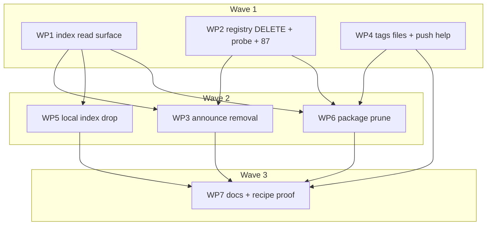

# Plan: Snapshot tag lifecycle — `ocx package prune` and ephemeral index rows

## Status

- **Plan:** plan_snapshot_lifecycle
- **State:** done
- **Tier:** xhigh
- **Tier-grammar:** 5
- **Effective-tier:** derived
- **Active phase:** 4 — closing review approved (hex-review xhigh; findings fixed a730c47aa, 3be195e41, 939b57256; decisions DEC-46 to DEC-54)
- **Step:** /hex-review done → /hex-finalize
- **Feature branch:** `hex/adr-snapshot-lifecycle` (worktree `/home/mherwig/dev/ocx-sion`)
- **Reviewed:** 6b2163a23 (branch scope vs `main`; full `task verify` green on this tip)
- **Last update:** 2026-09-30 (/hex-review Approve; convergence: Converged; Fold-Back not performed, no `## Spec Deltas`)
- **Next:** none. Landing is `/hex-finalize`, gated on the fork PR ocx-sh/rust-oci-client#8 and the out-of-grant repositories

---

## Overview

**Date:** 2026-09-29 · **Issue:** [ocx-sh/ocx#549](https://github.com/ocx-sh/ocx/issues/549) (ephemeral version deployment for reviews)
**Decision record:** [`adr_snapshot_lifecycle.md`](./adr_snapshot_lifecycle.md) (Proposed; Owner decision log R1–R6, A–C, S5
and the 2026-09-29 redesign are **binding**) · **Design:** [`system_design_snapshot_lifecycle.md`](./system_design_snapshot_lifecycle.md)
§§ 3, 5–7 · **Research:** `research_snapshot_{registry_delete,index_format,deletion_security,ux_prior_art,multistage_promotion}.md`,
`discover_snapshot_lifecycle.md` · **Goal (run contract):** `.agents/goals/adr-snapshot-lifecycle.md`

**Classification.** Scope large (7 in-grant WPs over `ocx_oci`, the fork, `ocx_exit`, `ocx_index`, `ocx_package`,
`ocx_announce`, `ocx_cli`, tests, docs). Reversibility **one-way (high)**: the `ephemeral` key in published roots and
registry tag DELETE (ADR § Reversibility). Tier `xhigh` by signal (new subcommand, wire key, new exit code,
cross-area). Overlays: `architect=inline` and `research=skip` — the ADR, system design and five research artifacts
were produced by `/hex-architect xhigh` and owner-ruled today, so re-running them buys nothing; `adversary=on`.

**Governing principle.** "ocx is low-level" settles every doubt: no channels, retention grammar, repoint, keep-tag
walks or linting. Where this plan is simpler than the design sketch, the simplification is recorded in § Decisions.

**Model routing (owner emphasis: more sonnet).** Builders on `sonnet` except the three genuinely hard WPs (OCI DELETE
wire path + exit 87, announce removal logic, prune safeguard/delete loop), which get an `opus` builder. Testers and
doc writers are `sonnet` everywhere. Every reviewer is `opus` (hex.md overrides; CLAUDE.md model policy). A sonnet
builder that fails the same subtask twice escalates to opus.

## Objective

A publisher can push snapshot builds marked ephemeral, delete them from the registry with `ocx package prune`, and
have one `ocx package announce` remove their index rows. On a governed (bot-reviewed) index a durable row is never
removed without a human seeing it; on an ungoverned `--out`/direct-write index a durable row goes only when the user
names it (S5). Every removal decision of prune, announce and the bot reads the canonical registry and index, never a
cache or `[mirrors]` entry (the consumer's local index copy: DEC-15).

## Scope

### In scope (this repository, ocx-sh/ocx)

Everything in ADR §§ prune, announce, Other commands (ocx side), Caches, Exit codes, Data model (read path), and the
documentation surfaces in § Rollout and documentation, including the keep-tag guidance on every listed surface.
The oci-client fork change is authored in the `external/rust-oci-client` submodule working tree (DEC-10).

### Out of scope

- Anything the ADR rules out: promotion (R5), channels, retention grammar, repoint, keep-tag/referrer walks, linting.
- `ocx package copy` (R5). Digest DELETE (R1).
- Other repositories — see § Out of grant.

## Decisions

Question → decision. "ADR" = the ADR's own recommendation or text adopted.

| # | Question | Decision |
|---|---|---|
| DEC-1 | ADR Open Question 1: the bot's registry credential for ruling C | **ADR recommendation adopted:** reuse the G-15 `RegistryPort` credentials; a missing credential or disabled network checks sends the removal to human review, never auto-merge. Bot-side, so out of grant (§ Out of grant). |
| DEC-2 | ADR Open Question 2: a pushed-never-announced build stays 75 | **ADR recommendation adopted:** keep 75; the recipes split push from publish so a retry never re-pushes; the 75 hint names the fix (`announce --tags-file` listing the tag, with `--ephemeral`). Prune never announces (one index writer). Covered by C-026 and the how-to (C-033). |
| DEC-3 | Re-run architect and research at xhigh? | No: ADR, system design and research exist and are owner-ruled; `architect=inline`, `research=skip`. |
| DEC-4 | `TagLifetime`/`RootView` types from the design sketch | Simplified: `RootTag` gains a lenient `ephemeral: bool` (C-006); `fetch_root_uncached` returns the root bytes' sha256 plus the existing `IndexRoot`. No new enum or view type. Announce writes through `serde_json::Value`, so no serialization path changes. |
| DEC-5 | Delete-enabled `registry:2` compose service (design WP3) | Dropped (YAGNI): a compose service, conftest fixture, `test/bazel.bzl` env and two workflow edits for a case the design marks "unverified". Exit 87 is proven on the existing `mirror-registry` (`registry:2`, delete disabled → 405 `UNSUPPORTED`). WP2 **measures** delete-enabled `registry:2` once (`docker run -e REGISTRY_STORAGE_DELETE_ENABLED=true registry:2`, one tag DELETE), records the envelope in its Schedule-log entry, and pins the unit test to it (research: 2.8.x answers 400 `DIGEST_INVALID`, v3 untags with 202). The docs claim only measured registries. |
| DEC-6 | Where prune's host guard and logic live (`guarded_physical` is private to `ocx_announce`) | Reuse the guard `ocx_index` already runs: `OcxIndex::physical_identifier`'s check is split into a pub `guard_repository_pointer(&IndexRoot)` over the root C-007 fetched — no second GET, no TOCTOU against the root the safeguard judged; `Error::Ssrf` already maps to 78. Prune's selection, safeguard and delete loop live in a new `ocx_package::prune` module (lib hosts substance, CLI thin; `ocx_package → ocx_index, ocx_oci` are allowed edges in `scripts/crate_map.toml`); `ocx_cli` keeps args → task → report. No `ocx_announce` change for prune. |
| DEC-7 | `[mirrors]` index substitution is baked into `OcxIndex::base_url` | The canonical root read calls the existing `build_index_sources` (the single place index clients are minted, `context.rs:618`) with an empty `mirrors_index` map and picks the namespace's source (C-008); no memo, no local commit. |
| DEC-8 | ADR row "`NAME_UNKNOWN`, bare 404, other error: an error, as today" — today these fold to `UnresolvedTag` | Keep today's exit (79 `UnresolvedTag`) for `Absent(NameUnknown \| Unspecified)` in announce; nothing is removed or written. Only `Absent(ManifestUnknown)` drives removal. |
| DEC-9 | The description probe (`pipeline.rs:327,357`) also reads `Mirrored` | Unchanged: it decides no removal. Only tag observation moves to `Canonical`. |
| DEC-10 | The DELETE verb and `Delete` token scope need a fork change (`ocx-sh/rust-oci-client`, another repo) | Author it as one upstreamable commit in the `external/rust-oci-client` submodule working tree, local branch `ocx/snapshot-delete` off the current submodule HEAD (fork rustfmt config, fork test style), and bump the pointer in ocx. **Pushing that branch is out of grant** and blocks the ocx PR's CI checkout (§ Out of grant). Fork diff stays minimal: the enum arm, the scope string, one `delete_manifest`, the status-carrying error. |
| DEC-11 | `announce --tags-file` on an empty file (a rerun prune that selected nothing writes an empty file) is `NoCuratedTags` (64) today, breaking the ADR's convergent-rerun recipe | One rule: under `--tags-file`, an empty given set (after the reserved-tag filter) is a no-op success, exit 0, returning before any forge or branch work. `--tags` (Replace) keeps today's empty-input check (64). |
| DEC-12 | Commit body "CI run URL" (ADR) — no commit-body builder exists | Commit and PR body list added, removed and `durable_missing` tags; the run URL is `CI_JOB_URL` (GitLab), else `$GITHUB_SERVER_URL/$GITHUB_REPOSITORY/actions/runs/$GITHUB_RUN_ID` when all three are set, else omitted. The env is read in `ocx_cli` and passed as `AnnounceRequest.run_url: Option<String>` (`ocx_announce` may not depend on `ocx_shell`). |
| DEC-13 | `--tags` Replace whose result is an empty tag map | No special case: the root is written as the rules produce it (an empty `tags` object is schema-legal; claim already writes one). |
| DEC-14 | Does zot accept tag DELETE by default? | Measured as WP2's first acceptance step (zot source: 202; after the last tag the repository stays, so GET answers `MANIFEST_UNKNOWN`). If zot refuses, WP2 stops and reports; no plan branch is pre-built for it. |
| DEC-15 | The local-index drop (C-021/C-022) reads the configured index source, which a `[mirrors]` index entry may substitute | By design: the local copy follows the consumer's configured authority (an air-gapped consumer only has the mirror), only ephemeral rows can drop, and ADR § Caches binds prune, announce and the bot, not the local copy. Prune, announce and bot removals stay canonical (C-003, C-004, C-007, C-013). |
| DEC-16 | DEC-8 leaves no announce form that removes rows once a registry drops an emptied repository (every probe is `NAME_UNKNOWN`; the ADR's "`--tags` escape hatch" needs a present tag) | ADR row kept: error, nothing removed. Documented limitation in the how-to: remove such rows with a human change to the index repository. zot and distribution keep the repository after its last tag, so common registries never reach it. The ADR escape-hatch sentence is reported as an ADR inconsistency; no workaround is built. |
| DEC-17 | The fork commit is unpushed; later WP worktrees check submodules out from GitHub | After WP2 merges, every later WP worktree fetches the commit from the feature checkout before building: `git -C external/rust-oci-client fetch <feature checkout>/external/rust-oci-client ocx/snapshot-delete && git submodule update --no-fetch external/rust-oci-client`. |
| DEC-18 | Canonical observation (C-013) changes announce for a publisher that reaches its registry only through `[mirrors]` | Accepted (ADR § Caches). Listed under Risks; WP3's commit subject states it so the changelog carries it. |
| DEC-19 | Execution: "one build at a time host-wide" across parallel WP worktrees | Every cargo, bazel and `task` run (build, unit, acceptance, verify) holds `flock /home/mherwig/dev/ocx/.agents/build.lock` — one lock for build and suite, host-wide. In-worktree cargo runs use the worktree's own target dir (a shared one mixed WP artifacts and gave a false result). |
| DEC-20 | Execution: Verify-Architecture seats at xhigh (spec reviewer + architect per WP) | One opus seat per xhigh WP (WP2, WP3, WP6) carries both the post-stub spec check and ADR compliance; WP1, WP5, WP7 (effective high) skip it and their tester reports contract gaps; WP4 (effective medium) runs the collapsed builder. Owner emphasis: fast loops, more sonnet. |
| DEC-21 | Measured (WP2): zot answers a tag DELETE in a repository that does not exist with **400 `NAME_UNKNOWN`**, not 404 | `delete_tag` maps 404 (any envelope) and 400 `NAME_UNKNOWN` to `AlreadyAbsent`, so a rerun prune over a vanished repository converges (S-010). 400 `DIGEST_INVALID`/`UNSUPPORTED` stay `DeleteUnsupported` (87). |
| DEC-22 | Measured (WP2): `registry:2` answers a GET in a repository that does not exist with 404 **`MANIFEST_UNKNOWN`** | Accepted, no special case: the tag is absent from the canonical registry either way, and removal still needs an ephemeral or named row (C-015). DEC-8 keeps its meaning for registries that do send `NAME_UNKNOWN`. |
| DEC-23 | C-003 names no error for "identifier with a digest or without an explicit tag" | `ClientError::DeleteNeedsTag` → 64 in `exit/ocx_oci.rs` (the "other" bucket in `ocx_project/resolve.rs`). Prune refuses both at argv first (C-023); this is the library's own guard. |
| DEC-24 | C-008 unit test needs a `Context` constructor that does not exist (~30 fields) | No new seam: `canonical_index_source` is one call of `build_index_sources` with an empty mirrors map; WP6's S-018 acceptance test (prune with a `[mirrors]` index entry reads the configured URL) is its proof. |
| DEC-25 | Cross-model gate per WP (plan § WP2/WP3/WP6 steps) or once (tier `xhigh` Phase 6) | Once, in the end-of-run `L2` batch over the whole feature branch diff (one-shot); WP2, WP3 and WP6 each still get an opus security or adversarial seat at `L1`. |
| DEC-26 | WP2 security review: a registry that answers 404 to hide a repository the caller may not modify makes a refused DELETE read as `AlreadyAbsent` | Prune runs its confirm probe after `AlreadyAbsent` too (not only after `Deleted`); a tag still `Present` there → 75. `delete_tag` itself keeps DEC-21. |
| DEC-27 | C-030 "a failed run prints the document" when routing fails before a repository is known (index unreachable 69, pointer refused 78, no root 79) | Narrowed to every run that entered the safeguard: routing failures print only the error envelope (the repository and root digest are unknown; inventing them breaks "report actual results"). |
| DEC-28 | A failed prune under `--format json` emits the report document and the error envelope | Both on stdout, document first, then the standard envelope the CLI emits for every error; consumers pick by key (`tags` vs `error`). |
| DEC-29 | Prune's registry client (WP6 post-stub review) | With an index: a client pinned to the SSRF guard for the package namespace (the list `guard_repository_pointer` checked). Without an index the host comes from the command line, as for `push`: the ordinary client. |
| DEC-30 | `--tags ''` (one empty tag name) | Stays 79 as today's test asserts; DEC-11's no-op covers only an empty `--tags-file`. Superseded by DEC-37. |
| DEC-31 | Structural prune when the registry answers the tag listing with `NAME_UNKNOWN` (repository gone) | An empty family: selects nothing, exit 0, empty tags file — the ADR's convergent rerun. |
| DEC-32 | WP6 security review: an explicit TAG is interpolated into the manifest URL | `parse_tag` accepts only the OCI tag grammar `[A-Za-z0-9_][A-Za-z0-9._-]{0,127}` (else 64), and refuses the `__ocx.keep.` prefix (64) so the help's "never a keep tag" holds even under `--force`. |
| DEC-33 | WP3 merge verify: `announce --tags-file` no longer drops a committed reserved-name row the file does not list | Intended per ADR ruling A ("every other row is carried verbatim"); only `--refresh` and `--tags-from-registry` drop such rows. `test_tag_reserved` updated to match. |
| DEC-34 | WP3 merge verify: the run URL reached the change-request body, which the git transport sends as a push option (C-067: no link, no `http`) | The run URL goes only into the commit message, as the ADR requires; the request body names the package and links nothing. |
| DEC-35 | WP6 re-review: an invalid tag refused as `DeleteNeedsTag` on the read-only probe path | New `ClientError::InvalidTag` (64) for grammar refusals in both `delete_tag` and `probe_manifest_canonical`; `DeleteNeedsTag` keeps a missing tag or a digest only. |
| DEC-36 | WP7 docs: registry support statement | Only zot is stated as working. `registry:2` refuses tag DELETE with delete enabled (400 `DIGEST_INVALID`) or disabled (405), both 87, per DEC-5; GHCR, Docker Hub and ECR are stated from their docs as refusing (87), unmeasured here. |
| DEC-37 | WP6 malformed-tag guard reaches `announce --tags ''` | Superseded DEC-30: one empty tag name is outside the OCI tag grammar, so it exits 64 (`InvalidTag`, usage error), not 79. The same guard in `fetch_manifest_raw_bytes_capped` refuses `1.0#x`, which had resolved tag `1.0`. |
| DEC-38 | A malformed tag that reaches announce from a committed row or a registry listing, not the command line | Fail closed with 64 naming the tag; no drop, no new exit code. Such a row predates the guard or comes from a hostile registry, and is repaired in the index repository by hand. Revisit only if it is seen in the wild. |
| DEC-39 | WP7 recipe test: `push --tags-file` recorded the tag from before `--build-timestamp` was applied, so announce never saw the new build | `PushOutcome.primary_tag` carries the tag actually written, and the tags file uses it. The push report's `identifier` still echoes the user's input; changing that JSON field is out of scope and becomes a follow-up. |
| DEC-40 | L2: a tag deleted under `--force` that the served root never listed went to `--tags-file`, and the next announce exited 79 | Prune appends only tags the served root lists (deleted or already gone). Reads ADR § prune step 3 ("every tag this run deleted") as "every indexed tag"; the ADR text needs the same amendment. |
| DEC-41 | L2: three copies of the tags-file writer, each truncating before rewrite | One shared `append_tags_file` (merge, dedupe, atomic temp-file rename). The file is now created 0600, not 0644. |
| DEC-42 | L2 and cross-model: confirm DEC-28 (a failed prune prints its report, then the error envelope) | Kept, as decided. |
| DEC-43 | Cross-model: the `index update`/`sync` drop reads the root through the ordinary source path, which honours `[mirrors].index` | Kept. The local index is a view of the configured source, and on an air-gapped host that mirror is the only source. A lagging mirror can drop only an ephemeral local row, which the next update restores. The ADR's bypass list names prune, announce and the bot. |
| DEC-44 | Cross-model: a failed tags-file write after a failed prune is "discarded" | False positive: it is logged at warn, and the prune error decides the exit code. Lost entries are recovered by the scheduled `announce --refresh`. |
| DEC-45 | Cross-model: unescaped tag names from committed rows in the change-request body (C-067) | `change_body` lists only names in the OCI tag grammar (3a9d22777). |
| DEC-46 | Closing review (a): prune's reference section used bold labels for topic subsections (DOC-PLAIN-13) | Topic subsections (Selecting tags, Locating the registry, Safeguard, Deleting, Registry support) are `#####` headings with `package-prune-*` ids, as `create` does; Usage/Arguments/Options/Exit codes stay bold like the other 66 commands on the page. Converting that page-wide pattern is a separate follow-up, not one command's diff. |
| DEC-47 | Closing review (b): DEC-43 against ADR § Caches ("every removal decision bypasses caches and `[mirrors]`") | DEC-43 kept, and the ADR § Caches now scopes the rule: the local-copy drop follows the configured source and is outside it. Bypassing the mirror only for the drop would read adds and drops from two sources and break air-gapped hosts; the harm is bounded to an ephemeral local row the next update restores. |
| DEC-48 | Closing review (c): DEC-40 and DEC-16 ADR amendments | Applied to the ADR: prune step 3 appends only tags the served root lists; the `--tags` escape-hatch sentence is replaced by the documented human-change path. ADR Changelog row 2026-09-30. |
| DEC-49 | Closing review: DEC-28/DEC-42 put two JSON documents on stdout for a failed `--format json` prune, against `subsystem-cli-api.md` ("one JSON document") and the `reported` guard in `app.rs` | **Supersedes DEC-28 and DEC-42.** A failed prune prints only its report on stdout; the classified exit code is the status and the error message goes to stderr, as for every other report-then-fail command. |
| DEC-50 | Closing review (security, CWE-532): prune printed the index base URL with its `user:pass@` userinfo in the JSON report and in three error messages | `prune::locate` takes the `OcxIndex` and reports `OcxIndex::redacted_base_url()`, the URL it actually reads, redacted; the second `resolve_base_url` computation is gone. |
| DEC-51 | Closing review (cross-model): `merge_root` dropped every in-scope ephemeral local row when a fetched root had no `tags` object | Fail closed: a root without a `tags` object drops nothing. |
| DEC-52 | Closing review: ADR § prune "builds oldest first and the rolling tag last" vs explicit mode's input order (C-030) | Explicit mode keeps input order: ordering named tags means interpreting them, which "ocx is low-level" and the explicit mode's "the user computes the list" rule out. The ordering sentence governs structural mode. |
| DEC-53 | Closing review (architecture): `fetch_root_canonical` is canonical only for a source built without `[mirrors]`; the "only JSON `true` is ephemeral" rule lived in three places | Renamed `fetch_root_uncached` with the precondition on its doc; one `RootTag::is_ephemeral_marker` used by the wire read, the local merge and announce. |
| DEC-54 | Closing review: cross-model findings already settled | Dropped with their settling record: 404-on-DELETE masking (DEC-21, DEC-26), `DeleteDenied` is 80 not 87 and package-not-in-index is 79 (ADR § Exit codes), reserved rows under `--tags-file` (DEC-33), empty `--tags-file` skipping description work (DEC-11), description probe via mirrors (DEC-9), `cascade repair` appending (ADR § Other commands), `--remote` local drop (ADR § Other commands), tags-file write after a failed prune (DEC-44), refused-run tags file (ADR § prune: no effect after a refusal), unlocked concurrent tags-file writers (one writer per file in every recipe). |
| DEC-55 | Inner review round (goal criterion 5): HTTP caches in front of the index could answer a removal-deciding root read | Prune's root read (`fetch_root_uncached`) and the two local-drop reads (`index update`/`sync` `refresh_tags`, the `--remote` drop re-read) send `Cache-Control: no-cache` and `Pragma: no-cache` via `revalidate_root_document`, which also replaces the memo. Resolve, routing, cascade and `config.json` reads stay cacheable. |
| DEC-56 | Same round: the headers on registry GETs (announce observation, prune confirm probe) | Not sent: the fork's `pull_manifest_raw` takes no per-request headers, and a second client would re-own the auth handshake. Accepted per ADR § Caches: a cache in front of a registry can only answer a stale "present", which delays a removal (safe direction). A fork option is a follow-up, not a blocker. |
| DEC-57 | Same round (the local index is the package-tier lock): a source marking an existing durable local row ephemeral could make it droppable | `merge_root` refuses the flip: an existing durable row stays durable; a new row keeps the source's marker; an ephemeral row still takes updates. |
| DEC-58 | Same round: require the served root's `repository` pointer to equal the package path before a DELETE | Rejected as ADR-inconsistent: the pointer is the volatile physical location and differs from the logical path by design (`adr_index_indirection.md` DR3; ADR § prune "Locating the registry"). Prune keeps the SSRF host guard; residual risk (a compromised reviewed index steering deletes within the credential's reach) is a security note for the DONE block. |

## Out of grant (other repositories — not executed by this plan)

The meta-orchestrator reports these; nothing here edits, commits in or pushes to them.

| Repo | Needed | Blocks |
|---|---|---|
| `ocx-sh/rust-oci-client` | Push WP2's submodule branch `ocx/snapshot-delete` (`RegistryOperation::Delete`, `pull,push,delete` scope, `delete_manifest`, status-carrying error) and merge it into `ocx/integration` | The ocx PR's CI (submodule checkout of an unpushed commit fails). Hard blocker for goal criteria "PR merge-ready" and "CI green". |
| `ocx-sh/ocx-indexbot` | Design WP1: classification rows (ADR § Bot table; design § 3.3), ruling-C canonical confirmation (`RegistryPort.get_manifest` exposes the not-found code instead of `KeyError`), DEC-1 credential rule, marker preservation (`core/regenerate.py:95-96`), review summary of removals and marker diffs, reconcile skip on ephemeral rows | Goal criterion 3. Until it lands, today's bot classifies any removal as `refresh` and auto-merges it (pre-existing, ungated). |
| `ocx-sh/index` | Design WP2: `ephemeral` (`const: true`) on `$defs.tagEntry` — today `additionalProperties: false`, so a root carrying the marker **fails schema validation** until this lands; bot pin bump | Real use of `--ephemeral` on the public index. Release ordering: bot → index → ocx release. |
| `ocx-sh/ocx-mirror` | Design WP8: carry the marker verbatim, drop a destination row that is ephemeral and missing upstream (`registry_sync/index_write.rs:136-156`), `task satellite:verify` | Goal criterion 4 (mirror clause). The ocx changes are additive for the mirror (no mirror-owned `RootTag` literal), so `satellite:verify` should stay green without it. |

## Component contracts

Signatures are the contract; names may be adjusted by the implementing WP only if review agrees.

### Registry layer (`ocx_oci`, fork, `ocx_exit`) — WP2

- **C-001** Fork: `RegistryOperation::{Push, Pull, Delete}`; `Delete` requests scope `repository:<repo>:pull,push,delete`;
  the token cache keys on the operation, so a Delete token is cached apart from Push.
- **C-002** Fork: `Client::delete_manifest(&Reference, &RegistryAuth) -> Result<(), OciDistributionError>` issues
  `DELETE /v2/<repo>/manifests/<tag>`. It refuses a reference carrying a digest (a digest DELETE removes every tag on
  it). 200/202 → `Ok`; any other status → an error that **keeps the HTTP status and the parsed envelope codes** (the
  fork's error path drops the status today). A 401 on the DELETE is returned, never retried in a re-auth loop.
- **C-003** `ocx_oci::Client::delete_tag(&OciIdentifier) -> Result<DeleteOutcome, ClientError>`,
  `enum DeleteOutcome { Deleted, AlreadyAbsent }`. Always canonical (never a `[mirrors]` host; `ensure_auth` gains a
  canonical `Delete` arm). An identifier with a digest, **or with no explicit tag** (`canonical_reference()` would
  default it to `latest`), is a usage error (64). 404 → `AlreadyAbsent`. 405 with code `UNSUPPORTED` or with no
  envelope, 400 `UNSUPPORTED`, and 400 `DIGEST_INVALID` (distribution 2.8.x refusing a tag reference) →
  `ClientError::DeleteUnsupported { registry, status }`; any other 405 (zot's `DENIED` for a referenced manifest)
  keeps today's mapping. 401/403 → the existing auth error (80); 429/503 → the existing transient mapping (75). The
  mapping runs before `registry_error`'s fallback to `ClientError::Registry` (69).
- **C-004** `ocx_oci::Client::probe_manifest_canonical(&OciIdentifier) -> Result<ManifestPresence, ClientError>`,
  `enum ManifestPresence { Present(Digest), Absent(NotFoundCode) }`, `enum NotFoundCode { ManifestUnknown,
  NameUnknown, Unspecified }`. A GET (not HEAD), canonical, reading the error envelope **before** the
  `native_transport.rs:187-209` fold; a 404 without an envelope → `Unspecified`. Every existing `ManifestNotFound`
  caller is unchanged. Needs a method on the sealed `OciTransport` trait plus the test-transport seam.
- **C-005** Exit 87: `ExitCode::RegistryDeleteUnsupported = 87`; `ErrorCategory::RegistryDeleteUnsupported`, slug
  `registry_delete_unsupported` (the `from_exit_code` table and both count assertions rise by one);
  `ClientError::DeleteUnsupported` → 87 in `crates/ocx_cli/src/exit/ocx_oci.rs` beside `ReferrersUnsupported` and in
  the second exhaustive match `crates/ocx_project/src/resolve.rs:591-623`; `crates/ocx_cli/src/exit/ocx_project.rs`
  delegates (`OciClient(e) => e.classify()`) and needs no arm. The `PolicyBlocked` (81) doc names the prune
  safeguard. The frozen `classify_baseline_7adaea62.json` is left untouched unless its test demands otherwise.

### Index read surface (`ocx_index`, `ocx_cli` context) — WP1

- **C-006** `RootTag.ephemeral: bool`, lenient: only JSON `true` is ephemeral; absence, `null`, `false` or any other
  value parses as durable and **never fails the root parse** (same reasoning as the `wire.rs:82` yank guard).
  `IndexRoot` keeps no `deny_unknown_fields`. The in-repo struct literal
  (`crates/ocx_package/src/cascade/graph/tests.rs:189`) is updated.
- **C-007** `OcxIndex::fetch_root_uncached(&self, repository) -> Result<Option<(Digest, IndexRoot)>, Error>`: one GET
  of the root (after the existing format-version check), no memo, never commits locally; the `Digest` is the sha256
  of the served bytes. Root absent → `Ok(None)`; transport failure → `Err` (classifies 69).
- **C-008** Context helper `canonical_index_source(namespace) -> Result<Option<OcxIndex>>`: calls the existing
  `build_index_sources` with an empty `mirrors_index` map (DEC-7) and returns the namespace's source; `None` when the
  namespace has no index. Offline is refused before this is reached (C-029).
- **C-009** `OcxIndex::guard_repository_pointer(&self, &IndexRoot) -> Result<OciIdentifier>`: parses the root's
  `repository` pointer and runs the existing SSRF `guard_destination` with the namespace's trusted/insecure hosts
  (78 on a forbidden target; a DNS failure stays 69). `physical_identifier` is refactored to call it (DEC-6).

### Tags files and push help (`ocx_cli`) — WP4

- **C-010** `conventions::merge_tags_file` joins with `\n` and ends with a trailing newline; `parse_tags_file` of an
  old comma-joined file still yields the same tags (round-trip).
- **C-011** `package cascade repair --tags-file` reads, merges and writes (`read_tags_file_if_present` +
  `merge_tags_file`, as push does) instead of truncating, and still writes the file when nothing moved.
- **C-012** Help: push `--tags-file` and repair `--tags-file` state newline format and append; push `--keep-tag` long
  help says when to disable it: "push ephemeral builds with `--no-keep-tag`, or prune frees no storage" (ASCII only,
  no internal references — the `app.rs` help guards).

### Announce (`ocx_announce`, `package_announce.rs`) — WP3

- **C-013** Tag observation uses `ReadAddressing::Canonical` (was `Mirrored`, `pipeline.rs:278`). DEC-18.
- **C-014** Given set per ruling A: `--tags` list | `--tags-file` lines | the canonical listing under
  `--tags-from-registry` | every committed row under `--refresh`. `UnionFile` no longer re-observes committed rows
  (`union_onto_committed` retired for it). A row outside the given set is carried **verbatim, in committed order**.
- **C-015** Per observed tag (ADR § announce table): present → upsert; `Absent(ManifestUnknown)` and base row
  ephemeral → remove; durable and named (`--tags`, `--tags-file`) → remove (reviewed bot-side; S5 — announce behaves
  the same for every target); durable reached by `--refresh`/`--tags-from-registry` → keep, list in
  `durable_missing`, exit 0; no base row → `UnresolvedTag` (79); `Absent(NameUnknown|Unspecified)` → 79, nothing
  written (DEC-8). The probe runs only after `fetch_manifest_raw_bytes_addressed(Canonical)` returned not-found; if
  that follow-up probe answers `Present` (a push raced the two reads) → 75.
- **C-016** `--tags-from-registry` is a sync: every listed tag is added; a committed row the listing lacks is probed
  by GET before it counts as absent.
- **C-017** `--ephemeral` marks each row the run **adds**; never changes an existing row's marker; key order
  `content, observed, yanked, ephemeral`. `--ephemeral` with `--refresh` → 64 (clap `conflicts_with`).
- **C-018** `regenerate` walks committed rows in committed order (observed → regenerated, confirmed-absent → dropped,
  `--tags` unnamed → dropped, else cloned verbatim), then appends newly observed tags in observation order. A moved
  digest clones the whole existing JSON object and changes only `content` and `observed` (so `yanked`, `ephemeral`
  and any unknown field survive). `orphan_paths` runs over the final root: a carried row keeps its `o/` object; a
  removed row's object goes only when no remaining row references it. `CommittedTagsDropped` exempts exactly the
  confirmed-absent rows. Removal is idempotent under the one-retry race path and the `carry_branch_tags` stale
  rebuild (a rebuilt branch may re-propose a removed ephemeral row; the next naming announce removes it again).
- **C-019** `AnnounceOutcome` and its JSON report gain `removed` and `durable_missing` (always present, possibly
  empty), carried through every construction site; `ocx_schema` golden `reports.json` regenerated. Commit/PR body per
  DEC-12 (`AnnounceRequest.run_url`). Empty `--tags-file` per DEC-11. Any new error arm is classified in
  `crates/ocx_cli/src/exit/ocx_announce.rs`.
- **C-020** Help text exactly as ADR § "Help text changes" for `--tags-file`, `--tags-from-registry`, `--refresh`,
  `--ephemeral`; the `--ephemeral` long help also carries the keep-tag guidance (C-012 wording).

### Local index (`ocx_index`) — WP5

- **C-021** `merge_root`: under `RootScope::Package`, a local row absent from the authoritative root **and** marked
  ephemeral is dropped (`changed = true`); under `RootScope::Tags(named)`, a named tag the root lacks is dropped when
  ephemeral (the `:799-802` early return and the `refresh_published` `!adopted.is_empty()` guard at `:238`
  adjusted). Durable rows keep today's never-delete guarantee; `RootScope::Routing` never drops a row. The `o/` pin
  sweep follows from `commit_published_root`. `.claude/rules/subsystem-oci.md` ("Neither scope deletes a pin",
  ~309) gains the ephemeral carve-out (ADR "Amends"). DEC-15.
- **C-022** `ocx --remote` resolve of a tag the authoritative root lacks: in the `NotInIndex` arm
  (`chained_index.rs:458-470`), **before** returning 79, obtain the root bytes via `source.fetch_root_document`
  (served from the source's memo when this process already fetched the root; one re-read otherwise) and commit them
  through `commit_published_root` with `Tags(&[tag])`, so a local ephemeral row is dropped; a transport or parse
  error mutates nothing and the exit stays 79.

### Prune (`ocx_package::prune` + `ocx_cli`) — WP6

- **C-023** Grammar (ADR § prune): `ocx package prune [OPTIONS] <PACKAGE> [TAG]...` with `--prerelease <VERSION>`,
  `--keep-builds <N>`, `--force`, `--tags-file <PATH>`, `--dry-run`, `--format json`. 64 on: neither TAG nor
  `--prerelease`, or both; `--prerelease` not a pre-release without a build; `--keep-builds` without `--prerelease`
  or `< 1`; a digest as TAG.
- **C-024** Routing: namespace with an index → `fetch_root_uncached` (always, `--force` or not): unreachable → 69
  with hint "the index locates the registry; retry"; no root → 79; `repository` pointer →
  `guard_repository_pointer` (78, zero DELETEs). Namespace with no index → `<PACKAGE>` is the repository.
- **C-025** Selection: explicit → deduplicated, input order. Structural → canonical `list_tags`, every tag parsing as
  the same variant/core/pre-release **with** a build, plus the rolling tag **if the listing holds it**;
  `--keep-builds N` keeps the newest N by `Version::cmp` (reason `newest`) and the rolling tag (reason `rolling`).
  Nothing else is interpreted; selection never reads the index.
- **C-026** Safeguard over every selected tag, before any DELETE: root ephemeral → deletable; root durable → refused
  `durable`; not in root → `probe_manifest_canonical`: present → refused `not_in_index`, absent → `absent`. Any
  refusal aborts before the first DELETE, the rest are `not_attempted`; exit 81 if any `durable`, else 75. No index
  and no `--force` → 81. `--force` skips only the refusals: `durable` and `not_in_index` tags become deletable (final
  action `deleted`, reason `null`); the root is still read and the not-in-root probe still runs, so a tag absent
  everywhere stays `absent`. Hints per ADR § Safeguard refusals; the 75 hint names the DEC-2 fix.
- **C-027** Delete loop: builds oldest first, the rolling tag last: `delete_tag`, then confirm with
  `probe_manifest_canonical` up to 3 tries 250 ms apart; any `Absent(_)` after this run's own successful DELETE
  counts as gone; still present → 75; `DeleteUnsupported` → 87 on the first tag, nothing deleted; 401/403 → 80 on the
  first DELETE (the token server grants a reduced scope silently), hint "the credential lacks delete rights, or the
  tag is protected"; any other error stops the loop, remaining tags `not_attempted`, exit by the error's source.
- **C-028** Tags file: a non-dry run past selection appends (read-merge-write, C-010) every tag it deleted plus every
  selected tag already gone from the registry but still in the root; written even when empty; **also written, with
  what is gone so far, before a mid-loop error returns**; a write failure → 74 after the deletes. `--dry-run` runs
  the safeguard, exits exactly as the real run would, deletes and writes nothing.
- **C-029** `--offline` → 81 before any network or index read (`context.remote_client()?` first).
- **C-030** Report: table `Action Tag Digest Reason`; JSON `{package, repository, selection: {tags: [...]} |
  {prerelease, keep_builds}, force, dry_run, index: {url, root_sha256} | null, tags: [{tag, digest, action,
  reason}]}`, `action ∈ deleted|absent|would_delete|kept|refused|not_attempted`, `reason ∈ newest|rolling|durable|
  not_in_index|null`. `digest` = the root row's `content`, else the probe's `Present` digest, else `null`. Rows in
  processing order (explicit: input order; structural: builds oldest first, rolling last, kept rows in the same
  order). A failed run prints the document before exiting. Registered in `ocx_schema` reports + golden.
- **C-031** Prune long help carries the keep-tag guidance (C-012 wording) and the fixed-width build-id note
  (`--build-timestamp=datetime`).

### Documentation — WP7 (+ help text in WP3, WP4, WP6)

- **C-032** Reference `website/src/docs/reference/command-line.md`: new `{#package-prune}` section (after cascade
  repair, ~3429); announce rows (`--tags-file`, `--tags-from-registry`, `--refresh`, new `--ephemeral`, ~2968-2970)
  with keep-tag guidance on `--ephemeral`; `index sync` "a merge never deletes" (~1230) gains the ephemeral
  exception; cascade repair `--tags-file` sentence (~3304) says append; push `--keep-tag` (~3731) carries the
  guidance; exit table (~296-350, the reserved-range note at 302/305 updated) gains 87 and the prune 81/75 rows;
  `error.kind` gains `registry_delete_unsupported` wherever kinds are listed.
- **C-033** New how-to `website/src/docs/user-guide/snapshot-tracks.md` (sidebar entry in
  `website/.vitepress/config.mts` beside "Promoting"): the ADR's canary, change-request teardown, explicit-list and
  lazy-sync recipes, GitLab and GitHub CI examples, `--no-keep-tag` with the reason and what happens if it is missed,
  fixed-width build ids, per-track serialization, the DEC-2 recovery, the DEC-16 limitation, "schedule `--refresh`,
  never `--tags-from-registry`", and registry support limited to what was measured (zot; `registry:2` per DEC-5;
  GHCR/Docker Hub/ECR refuse → 87). Declares `<!-- doc_type: how-to -->` / `<!-- doc_tier: integration -->`.
- **C-034** `website/src/docs/authoring/announcing.md` mode table (~99-104) and the governance sections
  (`#announcing-review`, ruling C); `website/src/docs/in-depth/indices.md:141` ephemeral exception.
- **C-035** `.claude/rules/subsystem-cli-commands.md`: `package prune` row + layering table (WP6, with the
  `_STEM_REWRITES` entry in `.claude/tests/test_ai_config.py`); announce row, cascade repair note (append), index
  update row (WP7).

## User-experience scenarios

| ID | Action | Expected | Error cases |
|---|---|---|---|
| S-001 | Canary recipe: push `--cascade --no-keep-tag --build-timestamp=datetime --tags-file t`, prune `--prerelease 0.5.0-canary --keep-builds 1 --tags-file t`, cascade repair `--tags-file t`, announce `--tags-file t --ephemeral --out` | Registry lost the older builds; the written root lost exactly those rows, gained the new build marked ephemeral; the rolling tag keeps its marker | — |
| S-002 | Teardown: prune `--prerelease 0.5.0-mr42 --tags-file t`, announce `--tags-file t --out` | Every `0.5.0-mr42_*` and `0.5.0-mr42` gone from registry and root; `latest`, `0.5`, `0` untouched | — |
| S-003 | Prune a durable tag without `--force`, with and without `--dry-run` | 81 both; registry tag list identical before/after; hint names `--force` | — |
| S-004 | Prune a pushed tag the index does not list | 75; registry unchanged; hint names `announce --tags-file … --ephemeral` | — |
| S-005 | Prune with no index configured, then with `--force` | 81, then deleted, exit 0 | — |
| S-006 | `--dry-run` of a passing structural selection | Exit 0; registry unchanged; report lists `would_delete` and `kept` (`newest`, `rolling`) | — |
| S-007 | Prune the last tags of a repository (zot) | Exit 0; every tag gone (zot keeps the repository → `MANIFEST_UNKNOWN`); `NAME_UNKNOWN` acceptance is a unit test | — |
| S-008 | Prune a tag on `mirror-registry` (`registry:2`, delete disabled) | 87; nothing deleted; `error.kind` `registry_delete_unsupported` | — |
| S-009 | `announce --refresh --out` with one gone durable and one gone ephemeral row | Exit 0; ephemeral removed; durable kept and in `durable_missing` | — |
| S-010 | Rerun an explicit prune that already deleted everything | Exit 0; every tag `absent`; tags file lists the same tags | — |
| S-011 | Rerun a structural prune after a full delete, then `announce --tags-file` on its empty file, then `announce --refresh --out` | Prune selects nothing, exit 0, empty tags file; the `--tags-file` announce exits 0 with no change (DEC-11); refresh removes the rows | — |
| S-012 | `announce --ephemeral --refresh` | 64 | — |
| S-013 | `announce --tags-file` listing a tag absent from registry and index (typo) | 79, nothing written | — |
| S-014 | `ocx index update <pkg>` after an ephemeral row left the served root | Local ephemeral row dropped; a durable pin the root also lacks survives | — |
| S-015 | `cascade repair --tags-file t` onto an existing file | Tags appended, newline-separated with trailing newline | — |
| S-016 | `ocx --offline package prune …` | 81, no network touched | — |
| S-017 | Prune with argv errors (both TAG and `--prerelease`; `--keep-builds 0`; `--prerelease 0.5.0`; a digest TAG) | 64 each | — |
| S-018 | Prune with `[mirrors]` configured for the index host | The root is read from the configured index URL, never the mirror | — |
| S-019 | Prune where the root's `repository` pointer names a forbidden host | 78; zero DELETEs | — |
| S-020 | Prune while the index is unreachable (with and without `--force`) | 69 both; hint "the index locates the registry; retry" | — |
| S-021 | Prune a package the index has no root for | 79 | — |

## Parallelization

Ceiling `xhigh`. Model = builder / tester; every reviewer is `opus`. Size per `decompose.md`.

| WP | Scope | Expected files | Size | Wave | Depends on | Model | Review | Verify | Status |
|---|---|---|---|---|---|---|---|---|---|
| WP1 | Index read surface: C-006–C-009; `static_index.write_package(ephemeral=)` fixture | `crates/ocx_index/src/wire.rs`, `crates/ocx_index/src/ocx_index.rs`, `crates/ocx_index/tests/index_wire_conformance.rs`, `crates/ocx_package/src/cascade/graph/tests.rs`, `crates/ocx_cli/src/app/context.rs`, `test/src/static_index.py` | M | 1 | — | sonnet / sonnet | | scoped | merged |
| WP2 | Registry DELETE + canonical probe + exit 87: C-001–C-005; DEC-5/DEC-14 measurements; S-008 (unit half) | `external/rust-oci-client/src/{token_cache,client,errors}.rs` (+ fork tests), `crates/ocx_oci/src/{client,lib,testing}.rs`, `crates/ocx_oci/src/client/{transport,native_transport,error,test_transport}.rs`, `crates/ocx_oci/src/referrer/capability.rs`, `crates/ocx_exit/src/{exit_code,error_category}.rs`, `crates/ocx_cli/src/exit/ocx_oci.rs`, `crates/ocx_project/src/resolve.rs` | L | 1 | — | **opus** / sonnet | risk | full | merged |
| WP4 | Tags files + push help: C-010–C-012; S-015 | `crates/ocx_cli/src/conventions.rs`, `crates/ocx_cli/src/command/package_cascade_repair.rs`, `crates/ocx_cli/src/command/package_push.rs`, `test/tests/test_package_cascade.py`, push tags-file acceptance tests asserting commas (`test/tests/test_package_push*.py`, `test/tests/test_announce_push_file.py`, only where they assert the old format) | S | 1 | — | sonnet / sonnet | | scoped | merged |
| WP3 | Announce removal: C-013–C-020; S-009, S-011 (announce half), S-012, S-013 | `crates/ocx_announce/src/announce.rs`, `crates/ocx_announce/src/announce/{request,pipeline,error}.rs`, `crates/ocx_cli/src/command/package_announce.rs`, `crates/ocx_cli/src/api/data/announce.rs`, `crates/ocx_cli/src/exit/ocx_announce.rs`, `crates/ocx_schema/tests/golden/reports.json`, `test/tests/test_announce.py`, `test/tests/test_announce_refresh_and_name.py`, `test/SUITE_FLOOR` | L | 2 | WP1, WP2 | **opus** / sonnet | risk | full | merged |
| WP5 | Local index ephemeral drop: C-021, C-022; S-014 | `crates/ocx_index/src/local_index.rs`, `crates/ocx_index/src/chained_index.rs`, `.claude/rules/subsystem-oci.md`, `test/tests/test_index_servable_snapshot.py`, `test/SUITE_FLOOR` | M | 2 | WP1 | sonnet / sonnet | risk | scoped | merged |
| WP6 | `ocx package prune`: C-023–C-031, C-035 (prune row); S-003–S-008, S-010, S-016–S-021 | `crates/ocx_package/src/prune.rs` (new), `crates/ocx_package/src/lib.rs`, `crates/ocx_package/Cargo.toml` (dev-dep `ocx_oci` with `__testing`, for the unit tests; Bazel already has it), `crates/ocx_cli/src/command/package_prune.rs` (new), `crates/ocx_cli/src/api/data/package_prune.rs` (new), `crates/ocx_cli/src/{command,api/data,app}.rs`, `crates/ocx_cli/src/command/package.rs`, `crates/ocx_cli/src/exit/ocx_package.rs`, `crates/ocx_schema/src/reports.rs`, `crates/ocx_schema/tests/golden/reports.json`, `test/tests/test_package_prune.py` (new), `test/SUITE_FLOOR`, `test/scoped_rows.toml`, `test/BUILD.bazel` (only if a slot/data entry is needed), `scripts/bazel_gate_proofs.py`, `.claude/rules/subsystem-cli-commands.md`, `.claude/tests/test_ai_config.py` | L | 2 | WP1, WP2, WP4 | **opus** / sonnet | risk | full | merged |
| WP7 | Docs + recipe proof: C-032–C-035; S-001, S-002, S-011 end to end | `website/src/docs/reference/command-line.md`, `website/src/docs/user-guide/snapshot-tracks.md` (new), `website/.vitepress/config.mts`, `website/src/docs/authoring/announcing.md`, `website/src/docs/in-depth/indices.md`, `.claude/rules/subsystem-cli-commands.md`, `test/tests/test_package_prune.py`, `test/SUITE_FLOOR` | M | 3 | WP3, WP4, WP5, WP6 | sonnet / sonnet | | scoped | merged |

Verify `full` justifications: WP2 bumps a submodule pointer and adds an interface exit code; WP3 changes what
announce writes into published roots (wire); WP6 edits `scripts/bazel_gate_proofs.py` (escalates anyway) and adds a
CLI verb.

**Shared files (hub), one writer per merge, serialized by the merge order below:** `test/SUITE_FLOOR` (WP3, WP5,
WP6, WP7 — each raises it by its own new-test count at merge), `crates/ocx_schema/tests/golden/reports.json` (WP3,
WP6 — the later merge regenerates), `.claude/rules/subsystem-cli-commands.md` and `test/tests/test_package_prune.py`
(WP6 then WP7). No same-wave file overlap outside these.

**Critical path:** WP2 → WP6 → WP7 (WP2 → WP3 → WP7 is equal length).
**Shippable after wave: 2** — all behaviour (prune, announce removal, local drop, tags files) with its own tests;
wave 3 adds the docs and the end-to-end recipe proof the goal's keep-tag criterion needs.
**Merge order (serialized, topological):** WP4, WP1, WP2 · WP5, WP3, WP6 · WP7. After WP2 merges, DEC-17 applies to
every later worktree.
**Width:** three WPs per wave is what the file sets allow; WP7 stays one WP because its prose depends on the final
flag grammar of WP3/WP6 and its end-to-end test needs both. One build at a time host-wide (31 GB host); edit workers
fan out freely.

Effective tier (snapshot at plan time, `decompose.md` grammar):
`effective tier: medium 1 · high 3 · xhigh 3 (ceiling xhigh)` — WP4 medium; WP1, WP5, WP7 high; WP2, WP3, WP6 xhigh.

## Implementation steps (per WP: Stub → Specify → Implement → Review)

Tests are written from this plan's contracts, not the stubs, and must fail against the stubs. Each negative case is
shown red on a mutation before it is trusted (design § 7): remove the safeguard call → S-003 fails; remove the
`guard_repository_pointer` call → S-019 fails; switch announce back to `Mirrored` → the canonical-observation test
fails; make `regenerate` drop unnamed rows → the carry test fails.

### WP1 — Index read surface (sonnet)
- **Stub:** `RootTag.ephemeral`; `fetch_root_uncached`, `guard_repository_pointer`, `canonical_index_source` with
  `unimplemented!()`.
- **Specify (C-006–C-009):** wire parse with the key absent, `true`, `false`, `null`, a string (`wire.rs` tests +
  conformance); `fetch_root_uncached` against the existing `ocx_index.rs` transport fakes: sha256 of bytes, `None` on 404, no memo
  (two calls = two GETs), no local commit; `guard_repository_pointer` refuses a forbidden host and `physical_identifier`
  still passes its tests; context helper ignores a `[mirrors]` index override (S-018, unit).
- **Implement:** read over `check_format_version` + `fetch_root`; guard split; helper over `build_index_sources`;
  `write_package(..., ephemeral=...)` in `test/src/static_index.py`.
- **Review:** spec + quality.

### WP2 — Registry DELETE, probe, exit 87 (opus builder)
- **Stub:** C-001–C-005 signatures; `OciTransport` trait method with stub impls in every transport/test double.
- **Specify:** fork unit tests (scope string for `Delete`; `delete_manifest` refuses a digest reference; non-2xx keeps
  the status); `ocx_oci` unit tests over each envelope code (`MANIFEST_UNKNOWN`, `NAME_UNKNOWN`, bare 404 → three
  `NotFoundCode`s), existing `ManifestNotFound` callers unchanged, `delete_tag` 202 → `Deleted`, 404 →
  `AlreadyAbsent`, 405 `UNSUPPORTED`/no envelope, 400 `UNSUPPORTED`, 400 `DIGEST_INVALID` → `DeleteUnsupported`,
  405 `DENIED` → not 87, digest or missing tag → 64, canonical-only (a mirror is never contacted); `ocx_exit` 87
  numeric + slug tests and both category counts; classification tests in `exit/ocx_oci.rs` and
  `ocx_project/resolve.rs`. Measurements first: zot tag DELETE (DEC-14) and delete-enabled `registry:2` (DEC-5), each
  recorded in the Schedule log.
- **Implement:** fork commit on submodule branch `ocx/snapshot-delete` (DEC-10), pointer bump; `ocx_oci` methods;
  exit mapping.
- **Review:** spec, quality, **security** (always-on `crates/ocx_oci/**` perspective: canonical-only, digest and
  missing-tag refusal, scope widening recorded in ADR § Threats), cross-model code-diff gate.

### WP4 — Tags files + push help (sonnet)
- **Specify:** `merge_tags_file` output (newline + trailing newline) and parse round-trip of a comma file; repair onto
  an existing file appends; repair with nothing moved still writes; help-guard tests stay green.
- **Implement:** one join change; repair read-merge-write; help text (C-012); fix `test_j12` and any push tags-file
  test asserting commas.
- **Review:** spec + quality.

### WP3 — Announce removal (opus builder)
- **Stub:** `AnnounceRequest.{ephemeral, run_url}`, outcome fields, `--ephemeral` flag, tri-state observation type.
- **Specify (unit, `pipeline.rs`/`announce.rs` with `StubTransport`):** every branch of C-015 (remove, keep+report,
  79, 64, 75 race, DEC-8); `regenerate` with named, absent and unnamed rows (unnamed byte-identical, committed order;
  moved row keeps the whole object incl. an unknown field); `orphan_paths` keeps a carried row's object and deletes a
  removed row's unshared one; `--tags-from-registry` GET-before-absent; `--ephemeral` marks adds only; guard
  exemption; stale rebuild re-proposes then a naming announce removes; empty tags file no-op before forge work
  (DEC-11); commit body (DEC-12). Help-string assertions for the four ADR help texts (C-020). Clap:
  `--ephemeral`/`--refresh` conflict added to the pairwise tests. **Acceptance** (`test_announce*.py`, zot, `--out`):
  S-009, S-012, S-013, and canonical observation with a `[mirrors]` entry configured.
- **Implement:** C-013–C-020; commit subject states the canonical-observation change (DEC-18).
- **Review:** spec, quality, adversarial (removal is the one-way path), cross-model code-diff gate.

### WP5 — Local index ephemeral drop (sonnet builder, `risk`)
- **Specify:** `merge_root` unit tests: Package scope drops an absent ephemeral row and keeps an absent durable one;
  Tags scope drops a named absent ephemeral row; Routing scope drops nothing; sweep test (template
  `local_index.rs:2312`); `--remote` `NotInIndex` arm drops the ephemeral row and a transport error mutates nothing.
  Acceptance S-014 in `test_index_servable_snapshot.py`.
- **Implement:** C-021, C-022, the `subsystem-oci.md` carve-out.
- **Review:** spec + quality.

### WP6 — `ocx package prune` (opus builder; sonnet tester)
- **Stub:** `ocx_package::prune` (task entry, `PruneSelection`, `PruneAction`, `PruneReason`, error type); command +
  args struct (shape of `package_cascade_repair.rs`), report type, registration (`package.rs`, `command.rs`,
  `api/data.rs`, `app.rs` name arm, `ocx_schema` reports), exit arms in `exit/ocx_package.rs`.
- **Specify (unit, `ocx_package::prune` over the `ocx_oci` test transport):** family selection over mixed tags (other
  variants, other pre-releases, releases, non-versions, rolling tag missing from the listing); `--keep-builds` with
  fixed-width datetime ids; argv 64 cases (S-017); safeguard matrix incl. "81 wins" and the `--force` actions/reasons;
  routing 78/69/79 (S-019–S-021); delete-loop ordering, confirm retry, `NAME_UNKNOWN` accepted after own DELETE,
  80 on first DELETE, 87 with nothing deleted, mid-loop error → rest `not_attempted` and tags file written with what
  is gone; 74 on a tags-file write failure; tags-file union (deleted ∪ gone-but-in-root); JSON document shape and
  "failed run prints the document"; help contains the keep-tag and build-id notes.
  **Acceptance** `test/tests/test_package_prune.py` (zot + `static_index`, pattern `test_package_cascade.py:307-338`;
  `pytestmark = pytest.mark.command("package_prune*")`, one `@pytest.mark.smoke` test): S-003–S-008, S-010, S-016,
  S-018–S-021. Obligations in the same commit: `test/SUITE_FLOOR`, `ACCEPTANCE_MODULE_TARGETS` 171 → 172 and every
  assertion of that count in `scripts/bazel_gate_proofs.py`, `test/scoped_rows.toml`, `test/BUILD.bazel` only if the
  module names an `xdist_group` or reads a non-suite input.
- **Implement:** C-023–C-031; `subsystem-cli-commands.md` prune + layering rows and `_STEM_REWRITES` entry.
- **Review:** spec, quality, **security** (DELETE path, pointer guard, canonical-only reads), cross-model gate.

### WP7 — Docs + recipe proof (sonnet writer; sonnet tester)
- **Specify:** extend `test_package_prune.py` with S-001, S-002 and S-011 as written in the how-to (one tags file,
  `--out`), so the documented recipe is executed, not just shown.
- **Implement:** C-032–C-035 (announce, cascade repair and index update rows in `subsystem-cli-commands.md`).
  Keep-tag guidance must appear on: prune long help (WP6), `--ephemeral` long help (WP3), push `--keep-tag` help
  (WP4), the command-line reference for all three, and the how-to with reason and consequence. Acceptance check: a
  grep for `--no-keep-tag` over those six surfaces finds all six.
- **Review:** docs reviewer + spec.

## Testing strategy

Unit tests per WP above; acceptance on zot (`registry`, 5000) and `mirror-registry` (`registry:2`, 5001, delete
disabled) with `test/src/static_index.py` serving roots. Scenario → WP: S-001/S-002 WP7; S-003–S-008, S-010,
S-016–S-021 WP6; S-009, S-012, S-013 WP3; S-011 WP3 (announce half) + WP7 (end to end); S-014 WP5; S-015 WP4.
Acceptance runs through `task test:parallel --force -- <module>` from the repo root, never a hand-rolled pytest.

## Risks

| Risk | Mitigation |
|---|---|
| Fork push not granted → ocx PR CI cannot check out the submodule | First out-of-grant action; local gates run against the local submodule commit (DEC-17) |
| Index schema rejects `ephemeral` until `ocx-sh/index` lands | Release ordering bot → index → ocx release; docs ship with the ocx release |
| zot refuses tag DELETE | DEC-14: measured first in WP2; stop and report |
| Canonical observation breaks announce for a mirror-only publisher | DEC-18: accepted by the ADR; changelog line via WP3's commit subject |
| Announce carry-verbatim regresses the additive guard | Mutation proofs above; opus builder + adversarial review on WP3 |
| `SUITE_FLOOR` / golden churn across four WPs | Serialized merge order; each merge raises by its own count and regenerates the golden |

## Rollback

Every in-grant change is two-way before release (pre-1.0, changelog-only). Revert the WP commits; the fork pointer
reverts with WP2. Published roots are untouched until someone announces with `--ephemeral`.

## Review record

Round 1 (plan-artifact scope, one panel round): `reviewer:spec` (opus) 1 Block + 9 Warn + 5 Suggest, `architect`
(opus) 5 Warn + 8 Suggest, `researcher` (sonnet) 3 contract tweaks — all actionable findings folded above.
Cross-model: `codex:rescue` ran out of quota mid-review (3 unconfirmed leads, all triaged: dispatch-object handling →
C-018, local drop via mirror → DEC-15, fork error drops status → C-002); substitute seat `copilot` ran read-only
from a throwaway worktree: 4 Block + 3 Warn, folded (WP1 → WP3 edge, governed/ungoverned wording in § Objective,
`--remote` drop before 79 in C-022, partial-result tags file in C-028, whole-object carry in C-018, DEC-5
measurement); a spec re-validation pass confirmed all fixes and added three (ocx_package dev-dep, C-022 byte source, DEC-17 path), folded; its "wrong exit site" Block was checked and rejected (`exit/ocx_project.rs` delegates to
`ClientError::classify`; `ocx_project/resolve.rs` is the real second match). Deferred to a human: none (DEC-16's ADR
inconsistency is reported, not blocking).

## Schedule log

- 2026-09-29T00:00:00Z · plan written by /hex-plan (xhigh; architect inline, research skip, adversary on); review round 1 folded
- 2026-09-29 · WP2 measurements (throwaway containers, DEC-14/DEC-5): zot v2.1.18 tag DELETE → 202; GET of the deleted tag → 404 `MANIFEST_UNKNOWN`, sibling tag on the same digest → 200; DELETE again → 404 `MANIFEST_UNKNOWN`; DELETE of the last tag → 202, repository kept (GET → 404 `MANIFEST_UNKNOWN`); GET in a never-created repository → 404 `NAME_UNKNOWN`; DELETE there → 400 `NAME_UNKNOWN` (DEC-21). `registry:2` delete-enabled: tag DELETE → 400 `DIGEST_INVALID`, tag stays (→ 87); GET in a never-created repository → 404 `MANIFEST_UNKNOWN` (DEC-22). `registry:2` delete-disabled: tag DELETE → 405 `UNSUPPORTED` (→ 87).
- 2026-09-30 · merged WP4 (1ce597b08), WP1 (1c2928fe1), WP2 (7aca67b33), each with a full `task verify` green (trigger: WP merge). Three pre-existing base reds fixed first as chores (path-scope overlap declaration, a dead vendored link, a retired `--package` spelling in the discussion). Fork `ocx/snapshot-delete` 3ee5a1f pushed by the meta-orchestrator (ocx-sh/rust-oci-client#8); DEC-17 retired.
- 2026-09-30 · merges: WP5 ed1104282, WP3 d8cab1317 (two re-squashes after merge-verify reds: `unreachable_pub` ratchet; the transport body and reserved-tag test), WP6 946df0659 (a `scripts:self-test` timing-budget flake needed one rerun), WP7 79c4b1935 (docs, recipe tests, push `--tags-file` fix). L2 opus: CHANGES, no Block; fixes landed in WP7. Cross-model: Codex out of quota; the Copilot CLI (gpt-5.4, read-only) substitute ran, and its one valid finding is fixed in 3a9d22777.
