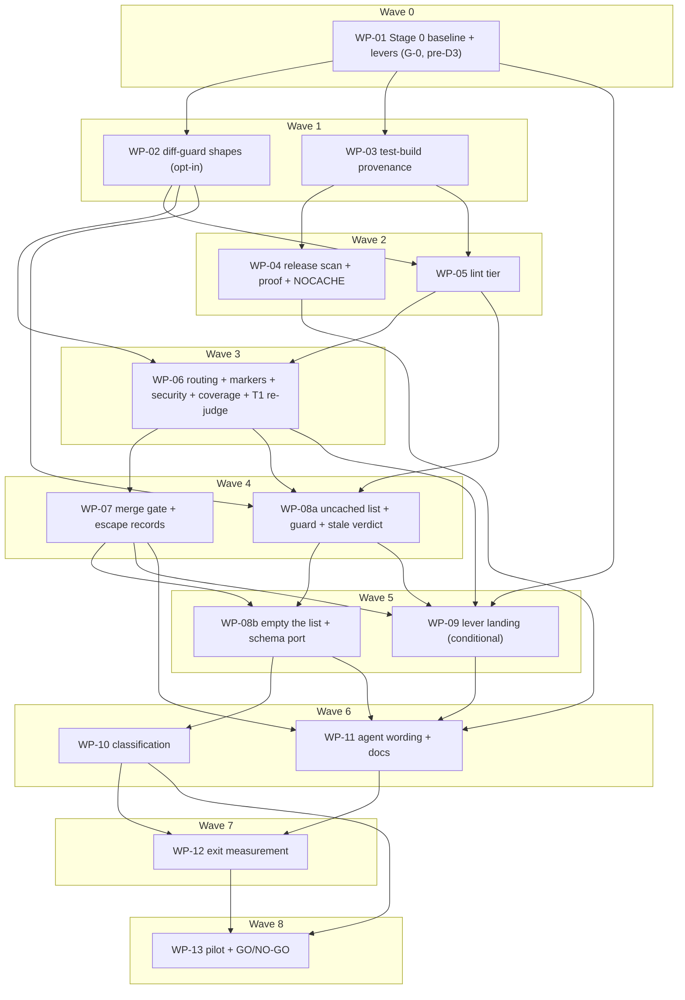

# Plan: Tiered, cache-driven verification for the AI implementation loop

## Status

- State: review
- Tier: high
- Tier-grammar: 5
- Effective-tier: derived
- Updated: 2026-09-24
- Next: /hex-review .claude/artifacts/plan_test_speed_tiers.md
- **Plan:** plan_test_speed_tiers
- **Active phase:** 8 — all 14 WPs merged; end-of-run L2 + adversary fix pass merged
- **Step:** awaiting /hex-review
- **Last update:** 2026-09-24 (exec-orch: WP-01…WP-13 merged, L2/adversary fix pass merged, final full verify on the feature tip)

> **Pre-execution step (orchestrator, not a WP).** The design record is untracked on this
> checkout (`adr_test_speed_tiers.md` including its `## Amendment 2026-09-22 (plan review)`,
> `system_design_test_tiers.md`, four `research_*` artifacts). Commit them on the feature
> branch before wave 0 —
> `chore: record the tiered-verification ADR, system design and research` — or every WP
> branches from a base that does not contain the contracts it implements. This checkout is
> on `main`, so `/hex-execute` creates `hex/test-speed-tiers` from trunk.
> `.claude/state/plans/` is gitignored (`.gitignore:39`): if this plan must ship with the
> branch, move it to `.claude/artifacts/` first (precedent: `plan_toolchain_tree_layout.md`).

---

## Header

| Axis | Value |
|---|---|
| Scope | **Medium** (ADR stages 0–6; 14 WPs) |
| Reversibility | **one-way (medium)** — D7 deletions only; everything else two-way per the ADR's door table |
| Tier | **high** (ceiling) |
| Overlays | architect=on, research=1, adversary=on |
| Design (binding) | [`adr_test_speed_tiers.md`](./adr_test_speed_tiers.md) (Accepted 2026-09-23, **with § Amendment 2026-09-22 AM-1 … AM-8**; OQ defaults below), [`system_design_test_tiers.md`](./system_design_test_tiers.md) |
| Research | [`research_test_tier_tooling.md`](./research_test_tier_tooling.md), [`research_test_tier_patterns.md`](./research_test_tier_patterns.md), [`research_test_tier_operability.md`](./research_test_tier_operability.md), [`research_cargo_dist_prehost_scan.md`](./research_cargo_dist_prehost_scan.md) |

**ADR open questions carried as defaults (not re-asked):** OQ1 port-down is pilot-gated
(WP-13's GO/NO-GO); OQ2 the T2 engine is decided by measurement (WP-12 records the share of
merges that left `test/bin/ocx` unchanged; the switch itself is a follow-up); OQ3 the porting
model is decided by the pilot's two-model comparison (WP-13).

**Out of scope.** ADR Stage 7 porting waves — a follow-up plan, written only after WP-13
records GO. `CHANGELOG.md` (generated; the commit subject is the changelog line). Any remote
writer for acceptance verdicts (ADR D6). Editing vendored `hex-*` skills. Amending crate-split
DEC-10 (see § Deferred owner decisions, B2).

---

## Plan rulings (where this plan adds to or departs from the ADR)

Each is a code-path fact the ADR did not carry, verified against the tree while planning.
Rulings that change an ADR contract are carried in the ADR's **§ Amendment 2026-09-22**
(AM-n) and only referenced here.

| # | Ruling | Evidence |
|---|---|---|
| P-1 | **= ADR AM-1.** Stage 0's Tempo root-cause and its "0 error spans" exit clause move to Follow-ups; T1 is task-step wall clock. | ADR § Amendment AM-1 |
| P-2 | **`scripts/test_diff_guard.py` blocks D2, D3 and D6 as the ADR wrote them.** `check_range` refuses every `D` under `test/` (`:1488`), every new file that is not `test/tests/**/*.py` (`:1502`), and any new `conftest.py` (`_NEVER_NEW`, `:343`). WP-02 lands every sanctioned shape first — including C-RUBRIC's ported-from deletion shape, pulled forward from Stage 6 because D6's schema port needs it — **behind one opt-in flag, `--tiered-shapes`**, passed by the orchestrator only for this plan's ranges (`task scripts:test-diff-guard -- --tiered-shapes`). Without the flag the guard behaves exactly as today (crate-split DEC-10 untouched). Whether the marker/config shapes become default is owner decision B2. | `scripts/test_diff_guard.py:152,285,343,1485-1506`; `taskfiles/scripts.taskfile.yml:195-222` (the range guard is not in `verify` — only its `--self-test` is, `:56`) |
| P-3 | **= ADR AM-2.** `--self-test` keeps the synthetic reds; the real-binary green (and the real `__testing` red) is `task release:provenance:proof`, run by `release:prepare`; `verify-deep.yml`'s `cross-compile` job scans a real release build on every push to `main`. | ADR § Amendment AM-2; `taskfiles/rust.taskfile.yml:234` |
| P-4 | **The scan job must both gate `host` and see the artifacts.** Research found `host` needs every `local-artifacts-jobs`/`global-artifacts-jobs` entry; it did not establish which of the two renders a job that `needs: build-local-artifacts`. WP-04 regenerates with each and keeps the one satisfying both, proven by a structural test on `release.yml`. Neither → Stage 1 fails and the ADR is amended (as the ADR already says). The scan carries a reader floor: one binary per `dist-workspace.toml` target. `pr-run-mode = "skip"` means `release.yml` itself first runs at a tag push, so the scanner's pre-release proof is AM-2's main-push scan plus the `deploy-dev.yml` dispatch run (WP-04 evidence). | `research_cargo_dist_prehost_scan.md`; `dist-workspace.toml:13,22,26` |
| P-5 | **D4 merges before the last code WPs, on purpose.** `commit-msg` runs `python3 scripts/commit_gate.py` from the working tree (`.pre-commit-config.yaml:26`), so the clause is live **from WP-07's own merge commit**: WP-07 and every later WP merge as `git merge --no-ff --no-commit` → `task verify` → `git commit`. The vendored hex merge step does not do that; the orchestrator runs the recipe by hand and WP-11 writes it into `workflow-swarm.md`. WP-08a, WP-08b and WP-09 merge after WP-07 and change the test binary or the acceptance graph, so they are the live proof of S-009/S-010 on the binary-changed path; WP-10/11/12/13 follow. | `.pre-commit-config.yaml:16-26`; ADR C-TIER Enforcement |
| P-6 | **= ADR AM-3.** `[security]` widened by seven command files; WP-06 records the escalation share with and without them. | ADR § Amendment AM-3 |
| P-7 | **`release:` NOCACHE is owned by WP-04**, the only writer of `taskfiles/release.taskfile.yml`: `release:prepare` runs `task verify NOCACHE=1` (go-task CLI vars are global, so `bazel:test:accept` sees it — proven red/green by a structural test, not assumed). | `taskfiles/release.taskfile.yml:91`, `taskfiles/bazel.taskfile.yml:644` |
| P-8 | **Warm acceptance runs are measured once, on the merged branch (WP-12).** A cold `bazel:test:accept` is 1421 s and the host runs one suite at a time. Code WPs prove the underlying graph property cheaply and discriminatingly (binary sha equality; `bazel query 'kind(sh_test, rdeps(...))'`); WP-12 takes the Stage 1/2/3 executed-count numbers. **T1 is the exception** (= ADR AM-4): WP-01 measures the pre-D3 arm, WP-06 re-measures T1 on the new arm and re-judges G-0, WP-12 confirms. | ADR § Context 1, § Amendment AM-4; memory `project_acceptance_suite_flock` |
| P-9 | **D5 wording lands late (WP-11).** "Enforced by the commit gate" is false until WP-07 merges. | ADR C-AGENT text |
| P-10 | **Extra hot files the ADR did not list:** `scripts/bazel_gate_proofs.py:196` (`ACCEPTANCE_MODULE_TARGETS = 181`), `scripts/bazel_accept_proofs.py:185-188` (`SCOPED_ROWS = 20`, `SCOPED_ESCALATE_ROWS = 2`, read off `test/taskfile.yml`), `scripts/bazel_accept_proofs.py:199` (`external` reds by name), `scripts/suite_census.py:105` (`PINNED` — a *decrease* in `tests` needs an edit), `taskfiles/scripts.taskfile.yml` (`self-test:complete` list + floor). Each is owned by one WP per wave below. | grep, this run |
| P-11 | **Stage 0 runs alone and first (= ADR AM-4).** WP-01 is wave 0 and merges before any other WP starts; no build worker runs concurrently with it. | ADR Validation line 1, § Amendment AM-4 |
| P-12 | **`target/release/ocx` has two producers.** `rust:build` (`taskfiles/rust.taskfile.yml:234`) and `test/taskfile.yml` `.build-binaries` (`:163-169`) both build `--release --features ocx/__testing`, and `task verify` runs both (`taskfile.yml:348`, `taskfiles/bazel.taskfile.yml:630`). Applying `[profile.test-bin]` to `.build-binaries` alone would compile `ocx` twice per verify and break the S-015 reader (`taskfiles/bazel.taskfile.yml:549`, `--built-binary target/release/ocx`). So WP-09 moves both producers to the profile and updates their readers: `verify-basic.yml:200-213` and the S-015 command + `bazel_accept_proofs.py` prose. `deploy-website.yml:65`, `taskfile.yml:42` and `website/recordings.taskfile.yml:20` have their own builds and are unaffected. | grep of `target/release/ocx`, this review |

---

## Component contracts

Numbered `C-nnn`; each maps to an ADR contract and to ≥ 1 WP. "Red/green" names the proof
that must be shown **both ways** (`quality-core.md` Unchecked Green).

### C-001 — Stage 0 baseline and lever measurement (ADR Stage 0, C-TIER budget, AM-4, AM-5) · WP-01
- **Artifact:** `.claude/artifacts/measurement_test_tiers_stage0.md`.
- **Reference edit:** a one-line change to *emitted* code (DX-37) in `crates/ocx_setup/src/`, e.g. a string literal in a message `ocx self setup` prints. The artifact names the file and line.
- **Rows:** lever ∈ {none, `[profile.test-bin]` (`incremental = true`), local-disk sccache, profile (`incremental = false`) + sccache} × each step of the **first** `task verify:scoped --force` after the edit (git:hooks, plan, fmt, cargo check, clippy -p, bazel test, doc test, doc ratchet, test binary build, test:smoke, test:scoped, mark). The profile and sccache rows are exclusive where they conflict (AM-5). An unchanged re-run goes in a separate column. Also: local `bazel:test:accept` executed-count for a docs-only commit and for a one-crate commit (pre-D1 baseline; expected 181/181).
- **Invariants:** every cell names its command, exit code and wall clock. The per-step timing method is stated once. Host load is recorded at each run. Levers are applied only in a throwaway worktree; nothing lands from WP-01 but the artifact. `SCCACHE_DIR` is on local disk, never the S3 store. No concurrent build worker.
- **Output:** the dominant step is named. Each lever is marked **kept** or **dropped** with its measured delta. **G-0 baseline verdict**, on the **pre-D3 arm**: T1 with kept levers ≤ 120 s → GREEN, > 120 s → RED. The artifact states that the pre-D3 arm runs no `rdeps` `rust_test`, so GREEN does not predict D3; WP-06 re-judges G-0.
- **Error behaviour:** G-0 RED does not block other WPs. It sets Status `Next:` to an owner question (ADR amendment, candidate Option C) and reframes the T1 claims of WP-06, WP-09 and WP-12 as "measured, over budget".
- **Red/green:** the reviewer re-runs one lever row and one baseline row; a delta outside ±15 % reds the artifact.

### C-002 — `build.rs` placeholder branch (ADR C-PROV 1–5) · WP-03
- **File:** `crates/ocx_cli/build.rs`. **Predicate:** `std::env::var_os("CARGO_FEATURE___TESTING").is_some()`.
- **Under the predicate:** no `GixBuilder`, no read of `CI` or any `GITHUB_*`, and no `rerun-if-env-changed` for them. `CargoBuilder` and `RustcBuilder` are kept. One constant `&[(&str, &str)]` table emits exactly the 12 placeholder rows of ADR C-PROV (`VERGEN_GIT_SHA` … `__OCX_BUILD_CHANNEL=test`). `__OCX_BUILD_VERSION` stays pass-through. `cargo:rerun-if-changed=build.rs`.
- **Off the predicate:** byte-for-byte today's behaviour (release, tarball degrade, `CI` timestamp).
- **Edge cases:**
  - `--all-features` builds (clippy) take the branch. That is harmless: no artifact ships.
  - A `.git`-less tarball without the feature keeps the warning path.
  - `GITHUB_*` set in CI under `__testing` is ignored, so the CI test binary is identical across runs.
- **Red/green:**
  - (1) `sha256` of every `test/bin/ocx*` is equal across two commits differing only in a docs file, and across clean → dirty with no code change. **Red on the base `build.rs`, green after.**
  - (2) **Feature-toggle provenance flip**, in the **same target dir**: build without `--features ocx/__testing`, then with it, then without it again. `ocx --format json version` must flip `channel` real → `test` → real, and `commit.sha` real → zero → real, at each step. **Red on the base `build.rs`** (it passes `__OCX_BUILD_CHANNEL` through and never sets `test`, so `channel` does not flip; run with `__OCX_BUILD_CHANNEL` unset), green after (research R4). A planted rerun-less `build.rs` is *not* a usable red: features enter cargo's unit hash, so the build script re-runs on the toggle regardless (§ Edge cases).
  - Evidence for both goes in the commit body.

### C-003 — placeholder acceptance case (ADR C-PROV acceptance-side proof) · WP-03
- **Where:** a new test function in `test/tests/test_self_update.py`, the module that already runs `ocx --format json version` (`ocx.json("version")`, `:55`, `:99`). Using an existing module means no new `sh_test` and no `ACCEPTANCE_MODULE_TARGETS` change.
- **Asserts:** the exact placeholder JSON of `commit`, `ci`, `channel` and `build.timestamp`, and the **exact key set** of the version report. A new provenance key then reds until it gets a placeholder.
- **Also:** re-read the five named modules (`test_config.py`, `test_config_test.py`, `test_install_libc.py`, `test_self_update.py`, `test_update_check_throttle.py`). Each either tolerates placeholders, or its real-value assertion moves to C-004's `--exec`. An edit to an existing assertion line needs the guard's `--allow <path>:<line>`, named in the commit body.
- **Red/green:** the case reds on the base binary (real SHA) and greens after. `test/SUITE_FLOOR` rises by the added count in the same commit.

### C-004 — `scripts/release_provenance_check.py` (ADR C-PROV release guard) · WP-04
- `--scan <file>... [--min-files N]` — byte scan for exactly three markers (`placeholder-g00000000`, `ci.invalid`, `placeholder/placeholder`).
  - A hit prints file, marker and byte offset, and exits 1.
  - Reading fewer than `N` files exits 1 (reader floor).
  - The all-zero SHA is **not** scanned: dependency bytes already contain 40-zero runs.
- `--exec <binary>` — runs `<binary> --format json version` and exits 1 unless all of these hold:
  - `channel != "test"`;
  - `commit.sha` is 40 hex, non-zero;
  - `commit.dirty == false`;
  - `ci.run_url` matches `^https://github\.com/ocx-sh/ocx/actions/runs/\d+$`;
  - `build.timestamp` is non-epoch.

  Only ever run on a binary native to the runner.
- `--self-test` — synthetic reds: one fixture per marker, a fixture missing `ci`, a zero SHA, `dirty: true`, a foreign run_url, and a scan below `--min-files`. Synthetic greens exercise the parser only (AM-2).
- **Exit codes:** 0 clean, 1 finding, 2 usage. Stdlib only.

### C-005 — release workflow wiring (ADR C-PROV wiring; P-4, AM-2) · WP-04
- **Scan workflow.** `dist-workspace.toml` gains `local-artifacts-jobs` **or** `global-artifacts-jobs = ["./scan-binaries"]`. A new reusable `.github/workflows/scan-binaries.yml` (`workflow_call`, `permissions: contents: read`) does the scan:
  - Inputs: `artifact-pattern`, `min-files`, `extract` (archives vs raw binaries).
  - It downloads the artifacts, extracts archives when asked, and runs C-004 `--scan --min-files <n>` over every binary and `--exec` over the runner-native one.
- **`release.yml`** is regenerated with `dist generate` (cargo-dist 0.31.0), never hand-edited; `dist generate --check` exits 0.
- **Other workflows:**
  - `.github/workflows/oci-publish.yml:165`: the bare `ocx version` becomes `--exec`.
  - `.github/workflows/deploy-dev.yml` (`workflow_dispatch` only, `:14-15`) **calls `scan-binaries.yml`** between its `build-*` jobs and `publish`, and `publish` `needs` the scan.
  - `.github/workflows/verify-deep.yml` `cross-compile` job (a `--release` build without `__testing`, `:262-286`, runs on every push to `main`) gains one `--scan` step over its binary. This is the AM-2 real-bytes proof on every main push.
- **Structural tests** in `.claude/tests/test_workflows.py`:
  - `jobs.host.needs` ∋ the scan job; `jobs.host.if` reads its result; the scan job's `needs` ∋ `build-local-artifacts`. **Red on today's `release.yml`**.
  - `oci-publish.yml` runs `release_provenance_check.py --exec`. **Red today**.
  - `deploy-dev.yml`'s `publish` job `needs` a job that `uses: ./.github/workflows/scan-binaries.yml`. **Red today**.
  - `verify-deep.yml` `cross-compile` has a `--scan` step. **Red today**.
  - All green after.

### C-006 — release path hardening (ADR C-PROV; C-UNCACHED `release:` NOCACHE; P-3, P-7) · WP-04
- `task release:provenance:proof` builds `cargo build --release -p ocx --locked` into its own target dir. It then asserts both polarities and exits 1 if either is wrong:
  - `--scan` over that release build → **green**;
  - `--scan test/bin/ocx` (the `__testing` build) → **red**.
- `release:prepare` runs `release:provenance:proof` and `task verify NOCACHE=1`.
- **Structural test** in `.claude/tests/test_hooks.py`: `release:prepare` names both. Red on today's taskfile.
- **Probe:** `task --dry verify NOCACHE=1` shows `--nocache_test_results` on the `bazel test //test:all` line. Red without the var.
- **`--exec` green** can only come from CI (it needs a real `ci.run_url`). It is shown by the `deploy-dev.yml` dispatch run in WP-04's evidence, which is an owner action (§ Deferred owner decisions, D-2).

### C-007 — test-diff-guard sanctioned shapes, opt-in (P-2; ADR C-RUBRIC deletion guard, C-LINT, C-ROWS marker; AM-7) · WP-02
- **File:** `scripts/test_diff_guard.py` only.
- **Opt-in:** shapes (a)–(e) and the floor rule apply **only under `--tiered-shapes`**. Without it, every self-test case that passes on the base tree passes unchanged, and each new shape is refused as today. Self-test: each shape red without the flag and green with it.
- **(a) Move:** a `test_*` function removed under `test/tests/` is sanctioned iff a function with the same name and identical AST (`ast.dump`, positions excluded) is added under `test/lint/` in the same range. A whole deleted module is sanctioned iff every one of its test functions is matched that way. Module-level statements may differ (path constants move).
- **(b) New lint files:** `test/lint/conftest.py`, `test/lint/test_*.py` and `test/LINT_FLOOR` are admitted. `test/lint/__init__.py`, data files and anything else under `test/lint/` are refused.
- **(c) Marker line:** one added module-level statement, with no removed line in its hunk, whose only effect is to add a `pytest.mark.command(...)` mark with string-literal arguments. Exactly three forms are admitted, keyed by what the module already binds; it must follow the module's last `pytestmark` binding:
  - no `pytestmark`: `pytestmark = pytest.mark.command("<key>", ...)`;
  - a single mark (21 modules today, 19 of them `pytestmark = pytest.mark.skipif(`, e.g. `test_login.py:38`, `test_exec_forwarding.py:23`, `test_self_setup.py:50`): `pytestmark = [pytestmark, pytest.mark.command("<key>", ...)]` — the form `test_shell_activation.py:88` already uses;
  - a list: `pytestmark.append(pytest.mark.command("<key>", ...))` — the form `test_shell_reconcile.py:64` already uses.

  **Reconciled with "skip/xfail refused":** the bare name `pytestmark` carries the existing mark forward and is the only non-literal name admitted besides `pytest.mark.command`; the existing `skipif` line is never edited. Refused: a `skip`/`skipif`/`xfail` (or any other mark) inside the added statement, a non-literal argument, and rewriting the existing assignment (a removed line).
- **(d) Config:** `test/scoped_rows.toml` and `test/LINT_FLOOR` join `ALLOWED_CONFIG`. `_selection_hit`'s `.toml` key rule (`_PERMITTED_CONFIG_KEYS`, `scripts/test_diff_guard.py:200,274`) is scoped to `path == "test/pyproject.toml"`, the only `.toml` in `ALLOWED_CONFIG` today — so flag-off behaviour is unchanged, and a rows key (`ocx_setup = [...]`) is not refused as an ini key. The selection-token check still reads every rows line.
- **(e) Ported-from deletion:** a removed test function is sanctioned only when all of these hold:
  - its `module::case` appears in an added `// ported-from: test/tests/<module>.py::<case>` marker;
  - its enclosing Rust test *executed and passed* in the **per-case** report `target/bazel/junit.xml`, not `bazel-testlogs/**/test.xml`, which names targets only (AM-7);
  - the report is **fresh for a tree containing the range tip**. The guard requires the tip to be an ancestor of HEAD (`git merge-base --is-ancestor <tip> HEAD`; after P-5's `--no-ff` merge HEAD is the merge commit, never the tip) and a tree with no unstaged or untracked non-ignored changes. It runs `task bazel:test:unit` itself **at HEAD** (it is the only producer of that report and is cached when already green), checks its exit status, and refuses a report whose mtime predates that run.

  Refused: an `#[ignore]`d port (JUnit `skipped`), a name absent from the report, a stale report, and a failed unit run.
- **Floors:** a `test/SUITE_FLOOR` decrease must equal the collected count of sanctioned (a)/(e) removals. The count is taken once, with `pytest --collect-only -q` at the base and `OCX_TESTS_NO_REGISTRY=1`.
- **`PLAN_OWNED_STRUCTURAL_TESTS`** names the modules at both their `test/tests/` and `test/lint/` homes for the move window.
- **Red/green:** `--self-test` shows each shape green under the flag, plus these greens:
  - a new `test/scoped_rows.toml` key (e.g. `ocx_setup = ["tests/test_self_setup.py"]`) under `--tiered-shapes`;
  - `pytestmark = [pytestmark, pytest.mark.command("login")]` added after a single `pytestmark = pytest.mark.skipif(...)`;
  - shape (e) **post-merge**: HEAD is a `--no-ff` merge commit whose parent is the tip, the unit run at HEAD executed the port → green.

  And each of these red:
  - each shape without the flag;
  - an unlisted key added to `test/pyproject.toml` under the flag (the key rule still holds there);
  - a body changed on move;
  - a deletion with no counterpart;
  - `__init__.py` under `test/lint/`;
  - a non-literal marker;
  - a marker combined with skip (`[pytestmark, pytest.mark.skipif(...), pytest.mark.command("x")]`);
  - the existing `skipif` assignment rewritten into a list (a removed line);
  - a ported-from marker with no executed test;
  - an `#[ignore]` port;
  - a **stale report** (the self-test's injected unit runner leaves an old `junit.xml` in place);
  - a failed unit run;
  - the tip not an ancestor of HEAD;
  - a floor decrease ≠ removed count.

### C-008 — lint-tier admission (ADR C-LINT home/admission) · WP-05
- **Files:** `test/lint/conftest.py` (`pytest_plugins = ["pytester"]`), `test/lint/test_lint_tier_guards.py`.
- **Invariants:**
  - A lint test requesting `ocx`, `ocx_binary`, `registry`, `mirror_registry`, `legacy_registry`, `published_package` or `sigstore_stack` errors at setup.
  - `subprocess` is wrapped, so an argv whose executable resolves under `test/bin/` (after `shutil.which` + `Path.resolve()`), or is `task`, raises.
  - `git` and `sys.executable` stay allowed.
- **Budget:** the conftest measures session wall clock and fails the session above `OCX_LINT_BUDGET_SECONDS` (default 30).
- **Red/green:** `test_lint_tier_guards.py` drives `pytester` fixtures:
  - each forbidden fixture → red;
  - a `test/bin/ocx` spawn → red;
  - a `task` spawn → red;
  - `git ls-files` → green (control);
  - a sleeping test with budget 1 s → red, with 30 s → green.

### C-009 — lint-tier membership and moves (ADR C-LINT membership) · WP-05
- **Whole moves:** `test_smoke_coverage.py`, `test_no_crate_path_assertions.py`, `test_deprecated_spellings.py`, `test_patch_global_slot.py`. A binary case, if one is found, stays in acceptance.
- **Partial moves** into `test/lint/test_<stem>_structure.py`, with distinct basenames (two same-named rootless modules clash under pytest's default import mode):
  - `test_doc_scripts_publish.py`: its sweep and pure-render cases (ADR list);
  - `test_logging.py::test_every_crate_that_logs_has_a_row`;
  - `test_shell_reconcile_edge_cases.py`: its 3 sweep cases + `_SWEEP_SHELL`.
- **Candidates:** `test_doc_binding.py`, `test_doc_scripts_parser.py`, `test_doc_command_reference.py` and `test_doc_project_toolchain.py` move if the conftest admits them; otherwise they are left for C-019/C-020.
- **Each moved module:** one mutation of its subject shown red then green, with the restore proven landed, recorded in the move commit body.
- **Floors:** `test/SUITE_FLOOR` is lowered by exactly the moved collected count, and `test/LINT_FLOOR` is created with the lint collected count.
- **Stale paths in code and comments** (grep `test_(deprecated_spellings|smoke_coverage|patch_global_slot)\.py` outside `.claude/`, this review): each is repointed to its `test/lint/` home in the move commit:
  - `crates/ocx_cli/src/command/deprecated.rs:47` (doc) and `:212` (an `assert!` message in its unit test);
  - `test/pyproject.toml:25,35` (comments);
  - `test/tests/test_patches.py:54` (a comment line; the guard admits it as inert);
  - `.github/workflows/verify-basic.yml:566` (comment);
  - `scripts/suite_census.py:99` (comment);
  - `test/taskfile.yml:377` and the `test/bazel.bzl:88-89,131` docstring, already in the WP-05 set.

  The `.claude/` and `CLAUDE.md` mentions are docs and belong to WP-11 (§ Documentation surfaces).
- The range is checked with `task scripts:test-diff-guard -- --tiered-shapes`.

### C-010 — `task test:lint:structure` (ADR C-LINT runner, floor, placement) · WP-05
- **Task**, in `test/taskfile.yml`:
  - runs `uv run pytest lint/` with `OCX_TESTS_NO_REGISTRY=1`;
  - the LINT_FLOOR check is a `cmds:` entry (never `preconditions:`);
  - inputs are the working tree (uncached, no `sources:`).
- **Wiring:**
  - `.verify:lint` (phase 1). Update the summary too; `TestVerifySummary` holds summary ↔ phases.
  - `verify:scoped`, for the `routed` and `scoped` decisions. Escalate reaches it through `verify`.
  - `verify-basic.yml`'s `smoke` job.
- **Red/green:** collected < LINT_FLOOR reds; the budget reds per C-008.

### C-011 — acceptance graph invariant after the move (ADR C-LINT graph invariant) · WP-05
- `test/BUILD.bazel`: `extra_data`, `_SWEEP_ALL` and `_SWEEP_SHELL` are deleted. `test/bazel.bzl`: the `extra_data` parameter and its docstring are deleted (no caller left — YAGNI).
- `scripts/bazel_tag_guard.py` sweeper clause: any acceptance module whose source sweeps its siblings reds, because there is no longer a way to declare it. `scripts/bazel_gate_proofs.py`: `ACCEPTANCE_MODULE_TARGETS` = the new count.
- **Red/green:**
  - the tag-guard self-test plants a sweeping acceptance module → red; the live graph is green.
  - `bazel query 'kind(sh_test, rdeps(//test:all, //test:tests/test_install.py))'` answers exactly `//test:test_install`: **5 targets on the base, 1 after**. The `kind()` filter matters because unfiltered `rdeps` also returns the source-file node.

### C-012 — `test/scoped_rows.toml` (ADR C-ROWS single table; AM-3) · WP-06
- **Schema:**
  - `[crates]`: crate → glob list or `"escalate"`;
  - `[verbs]`: command-path pattern → `"escalate"`;
  - `[security] escalate = [...]`: the ADR list + AM-3.
- Only `scripts/scoped_gate.py` reads it (`tomllib`). `SCOPED_ROWS` is deleted from `test/taskfile.yml`.
- `[crates]` holds a row for every workspace member except `ocx`, which is routed by `[verbs]` + markers + the permit-list default. `ocx_test_support = "escalate"`.
- **Error:** a missing or malformed file is a red (exit 1 with the parse error), never a silent escalate.
- `scripts/bazel_accept_proofs.py` `SCOPED_ROWS`/`SCOPED_ESCALATE_ROWS` are re-pointed to the TOML (19 rows, 1 escalate).

### C-013 — `command` markers (ADR C-ROWS verb mapping) · WP-06
- `test/pyproject.toml` registers `command` under `--strict-markers`.
- **Marker form:** modules carry `pytestmark = pytest.mark.command("<key>", ...)`. A key is the path under `crates/ocx_cli/src/command/` without `.rs` (`package_push`, `launcher/exec`, `self_group/update`), and is `fnmatch`-able (`package_push*`).
- `scoped_gate.py` reads markers with `ast` (no import): module-level `pytestmark` assignments, list or single, `pytestmark.append(...)` calls, and `pytest.mark.command` calls with literal args. A bare `pytestmark` name inside a list carries the previous binding forward.
- **Edges:**
  - a module already carrying `pytestmark` adds its marker in exactly one of the three C-007(c) forms: `pytestmark = [pytestmark, pytest.mark.command(...)]` after a single mark (skipif), `pytestmark.append(...)` after a list;
  - one module may name several keys;
  - a `command` mark with a non-literal argument is **unreadable**, and the coverage guard reds naming the module.

### C-014 — routing in `classify` (ADR C-ROWS routing, plan output; AM-3) · WP-06
- **Order:**
  1. `[security]` glob → escalate (the reason names the glob).
  2. A path under `command/**` → the modules whose marker matches, unless `[verbs]` says escalate.
  3. Any other `crates/ocx_cli/src/**` → escalate (permit-list default).
  4. Other crates → the existing hub/ecosystem/`[crates]` logic.

  `ocx` leaves `TABLE_ESCALATES`; `ocx_test_support` stays.
- **Output:** `plan.acceptance_globs` = the sorted union of selected module paths and `[crates]` globs; `plan.reason` on escalate.
- **Red/green (`--self-test`):**
  - a marked verb → scoped with its module;
  - `*_common.rs` → escalate;
  - an unmarked command file → escalate by name;
  - `app/context.rs` → escalate;
  - **one red per `[security]` glob**;
  - an `ocx_setup` edit → scoped (control);
  - a **missing** and a **malformed** `scoped_rows.toml` → exit 1, never `decision: escalate`;
  - marker-reader edges: append to an existing `pytestmark` list is read; `pytestmark = [pytestmark, pytest.mark.command("login")]` after a single `skipif` is read as `login` (and the skipif is not mistaken for a key); a multi-key marker selects on each key; non-literal args → coverage red;
  - the table-agreement self-test, re-pointed from the `test/taskfile.yml` regexes to the TOML.

### C-015 — coverage guard (ADR C-ROWS coverage) · WP-06
- `scoped_gate.py --check-coverage` is run by a new `task test:rows:check` (in `test/taskfile.yml`), called from `.verify:lint` and `verify:scoped`. It checks three invariants:
  1. every `test/tests/test_*.py` is matched by a `[crates]` glob or carries a marker;
  2. every `crates/ocx_cli/src/command/**/*.rs` is named by a marker, a `[verbs]` entry or `[security]`;
  3. `[security].escalate` ⊇ the `reviewer:security` `when:` globs in `.agents/memory/hex.md`.
- **Reader floors are independent of the glob they check.** Otherwise a narrowed glob would lower its own floor.
  - The module floor is `ACCEPTANCE_MODULE_TARGETS`, read with `ast` from `scripts/bazel_gate_proofs.py`.
  - The command-file floor is a constant `COMMAND_FILES_FLOOR = 80` in `scoped_gate.py`.
  - Reading fewer than either is a red. An unparseable `when:` is a red.
- **Red/green:** one self-test fixture per invariant red; a fixture whose glob reads fewer modules than the floor → red; the live tree is green.

### C-016 — the scoped arm (ADR D3 inner loop; AM-4) · WP-06
- `verify:scoped` replaces `for CRATES: bazel test //crates/<c>:all` (`taskfile.yml:249-250`) with one `task bazel:test:unit` (rdeps by construction, reader floor kept). `test:scoped` consumes `plan.acceptance_globs`; each glob must still collect ≥ 1 test.
- **Red/green:** an `ocx_setup` edit's scoped run executes `ocx_cli`'s `rust_test` targets (they are in `rdeps(ocx_setup)`). They are absent from the base arm's run log and present after.
- **T1 re-measure (AM-4):** the reference edit's **first** `task verify:scoped --force` on the new arm, timed per step by C-001's method with no concurrent build worker. G-0 is re-judged: > 120 s → RED, which raises the Option C owner question now, not at WP-12. The result goes in WP-06's commit body.

### C-017 — merge-commit gate and mark `tree` (ADR C-TIER enforcement, D4; AM-8) · WP-07
- **Mark:** `scoped_gate.py --mark` adds `tree` = `git write-tree` of the real index (`GIT_INDEX_FILE` unset).
- **Clean-tree precondition under a merge (AM-8):** while `<git-dir>/MERGE_HEAD` exists, `--mark` **refuses**, with exit 1 and no mark written, when the working tree differs from the index: `git diff --quiet` fails, or `git ls-files --others --exclude-standard` is non-empty. The refusal names the offending paths. The marked tree then equals the tree that was built. Outside a merge, marking is unchanged.
- **`commit_gate.py` clause:** when `<git-dir>/MERGE_HEAD` exists, it admits only a mark with `scope == "full"` and `tree == git write-tree` now. A `write-tree` failure → refuse (fail-closed). Rebase stays exempt as today; the cherry-pick/revert hand-back is unchanged.
- **Refusal text:** names the scope found, both tree ids, and the recipe `git merge --no-ff --no-commit` → `task verify` → `git commit`.
- **Red/green (`--self-test`):**
  - merge + scoped mark → red;
  - merge + full mark for another tree → red;
  - merge + full mark for this tree → green;
  - ordinary commit + scoped mark → green;
  - an untracked file added **after** the mark → still green;
  - under `MERGE_HEAD`, a **planted unstaged edit** → `--mark full` refused, no mark file written (red);
  - under `MERGE_HEAD`, a planted untracked non-ignored file → refused;
  - outside a merge, the same unstaged edit → mark written (control).

### C-018 — scoped-run log and escape records (ADR C-ESC; telemetry) · WP-07
- **Run log:** `--mark scoped` appends `{ts, worktree, tree, head, acceptance_globs}` to `$(git rev-parse --git-common-dir)/ocx-gate/scoped_runs.jsonl` under `fcntl.flock`, never truncating. `acceptance_globs` is recomputed from `plan()` at mark time.
- **Escape recorder:** `scoped_gate.py --record-escapes --junit-dir <dir>`.
  - `bazel:test:accept` runs it after a nonzero bazel status, **only while `MERGE_HEAD` exists**.
  - It reads failing modules from the copied JUnit, and matches records on `tree == MERGE_HEAD^{tree}` from any worktree.
  - ≥ 1 record and none selected the module → it appends `{ts, tree, head, merge_head_tree, module, scoped_globs}` to `escapes.jsonl`, prints `escape: <module>`, and writes `target/bazel/accept/gate_escape` (the run's escape marker).
  - No record → it prints `unattributed: <module>` and writes no marker.
  - It **never changes `bazel:test:accept`'s exit status**; a recorder failure is a stderr warning.
- **Telemetry:** `taskfiles/telemetry.taskfile.yml` adds these span attributes:
  - `ocx.gate` from `OCX_GATE`. The vocabulary is the system design's `lint`/`inner`/`full`/`deep`. This plan sets `full` (by `verify`) and `inner` (by `verify:scoped`); `lint` and `deep` are a follow-up, and an unset `OCX_GATE` omits the attribute.
  - `ocx.git.tree`.
  - `ocx.gate.escape=true`, when `target/bazel/accept/gate_escape` exists and is newer than the run start.
- **Red/green (`--self-test`):**
  - a record from another worktree on `MERGE_HEAD^{tree}` that missed the module → one escape **and** the marker file;
  - a record on another tree → unattributed, no marker;
  - a record that selected the module → none;
  - no `MERGE_HEAD` → unattributed.
- **Red/green (telemetry attributes)**, a case in `.claude/tests/test_ai_config.py` that runs `task telemetry:push` for real with a stub `junit2otlp` first on `PATH` (it writes its argv to a file), `OTEL_EXPORTER_OTLP_ENDPOINT` set, `HOME` pointed at a temp dir and a one-case JUnit fixture. It asserts on the parsed `--additional-attributes` value:
  - `OCX_GATE=inner` → `ocx.gate=inner` present; `OCX_GATE` unset → no `ocx.gate` key;
  - `ocx.git.tree` present and equal to `git rev-parse HEAD^{tree}`;
  - a `gate_escape` marker newer than the run start → `ocx.gate.escape=true` present; the same marker with an mtime before the run start (stale) → absent; no marker → absent.

  Red on today's taskfile (no `ocx.gate`), green after. The stub-on-`PATH` run is what makes the red reachable: `task --dry` would print the unexpanded `$vars`.

### C-019 — uncached under-declared modules (ADR C-UNCACHED) · WP-08a
- **List:** `test/bazel.bzl` gets an `UNCACHED_MODULES` list; those targets get `external` added to `ACCEPTANCE_TAGS`.
- **Predicate (AST, not text):** a module names an undeclared root when a string constant joined by `/` onto `PROJECT_ROOT` or `Path(__file__).parents[n]` begins with `target`, `website`, `crates` or `.github`, or with the pair `test`/`doc_scripts`. Multi-segment joins and `"a/b"` single literals both count. Literals joined onto `tmp_path` or appearing only in message strings do not.
- **Sizing (read-only grep, this review):**
  - 17 modules carry such a literal today. WP-05 moves `test_smoke_coverage`, `test_deprecated_spellings` and parts of `test_logging`, `test_shell_reconcile_edge_cases` and `test_doc_scripts_publish`, plus the doc candidates if admitted.
  - Expected to remain for WP-08a's list:
    - `test_schema_generation.py`, `test_project_env.py:92` and `test_execution_records.py:255` (`target/release/ocx_schema`, AM-6);
    - `test_windows_shim.py:69-70` (`target/*/ocx-shim.exe`);
    - `test_doc_scripts.py:40` and `test_doc_scripts_one_tree.py:35` (`test/doc_scripts`);
    - the residual `task`-invoking cases of `test_doc_scripts_publish.py`;
    - whichever doc candidates WP-05 could not move.
  - Roughly 7–11 modules. WP-08a publishes the exact list the predicate yields.
- **`scripts/bazel_tag_guard.py`:**
  - on acceptance targets, `external` is admitted **exactly** on the list;
  - a module naming an undeclared root and not listed → red;
  - a listed module naming none → red (rot);
  - `no-cache`/`local` stay refused as insufficient.

  `scripts/bazel_accept_proofs.py` stops redding `external` on listed targets.
- **Red/green:**
  - tag-guard self-test: (a) an undeclared-root module unlisted → red; (b) listed + `external` → green; (c) listed but reads no undeclared root → red; (d) `no-cache` instead → red; (e) `external` on an unlisted module → red; (f) a `tmp_path / "website"` join → not flagged (predicate control).
  - **The planted stale verdict**, in a throwaway worktree (ADR Stage 5 row).

### C-020 — empty the list (ADR C-UNCACHED named resolution; AM-6) · WP-08b
- **`test_schema_generation.py`:** any assertion `crates/ocx_schema/tests/schema_outputs.rs` lacks is ported there with a `// ported-from:` marker. The module is then deleted under C-007(e), using `--tiered-shapes`.
- **`test_project_env.py`, `test_execution_records.py`:** a `rust_binary` for `ocx_schema` in `crates/ocx_schema/BUILD.bazel`, given to their `sh_test`s as `data` through `test/BUILD.bazel`/`test/bazel.bzl`. Each module's `SCHEMA_BINARY` line reads the runfiles path (env var) instead of `target/release/`: a one-line-for-one-line hunk under `--allow <path>:<line>`, named in the commit body.
- **`test_windows_shim.py`:** the `target/*/ocx-shim.exe` candidates are dropped in favour of the existing `OCX_SHIM_BINARY` override (`:72`), which the `acceptance-windows` job sets. This is an `--allow` hunk.
- **`test/doc_scripts` and `website/` readers:** an exported filegroup from the owning package (`test/doc_scripts/BUILD.bazel`, `website/BUILD.bazel`), declared as the module's `data`.
- **Same commit:** `test/SUITE_FLOOR`, `scripts/suite_census.py` `PINNED`, the `scripts/bazel_gate_proofs.py` count, and the `[crates].ocx_schema` row (now `tests/test_schema.py`).
- **Trust-boundary addendum:** `.claude/artifacts/research_bazel_cache_trust_boundary.md` gains a dated "Stage 5 addendum". It records that finding #10's conclusion (acceptance out of remote-cache scope) holds because there is no remote writer (ADR § Security). The review reds WP-08b if it is absent.
- **Exit:** `UNCACHED_MODULES` is **empty** on the live tree and the guard is green.
- **Red/green:** mutate the schema generator → the ported Rust test reds; restore → green, with the restore proven landed. For each declared filegroup: change a declared file → the module's target re-executes, not `(cached)`, on the next `bazel:test:accept`.

### C-021 — latency levers landing (ADR Stage 0 levers; AM-5; P-12) · WP-09 (conditional on C-001)
- **Scope:** only the levers C-001 marked **kept**.
- **Profile:** `[profile.test-bin]` in root `Cargo.toml` (`inherits = "release"`), each setting commented with its measured effect per `rust-cargo.md` REL-01. `incremental = false` whenever sccache is also kept (AM-5).
- **Producers:** both `target/release/ocx` producers move to the one profile, so they never rebuild over each other: `test/taskfile.yml` `.build-binaries` (build + copy lines) and `taskfiles/rust.taskfile.yml` `build`.
- **Readers updated (P-12):**
  - `.github/workflows/verify-basic.yml:200-213` upload path;
  - the `taskfiles/bazel.taskfile.yml:549` S-015 command;
  - the `scripts/bazel_accept_proofs.py` prose (`:87`, `:1505`, `:1767`).
- **sccache:** local-disk sccache as `RUSTC_WRAPPER` on those builds, only when unset and resolvable.
- **Persistent assertion:** a case in `.claude/tests/test_ai_config.py` checks that `.build-binaries` and `rust:build` name the same `--profile` and that the copy source matches it. It is red if they diverge (shown by a synthetic taskfile).
- **Withdrawal:** if nothing was kept, WP-09 is **withdrawn**, not failed.

### C-022 — agent-gate wording (ADR C-AGENT) · WP-11
- The ADR sentence goes into every gate-prescribing file under `.claude/rules/**`, `.claude/agents/**` and `.claude/skills/**`. Only project-owned files; vendored `hex-*` files are untouched. The sites:
  - the six Context-3 sites;
  - `subsystem-{cli,oci,package-manager,package}.md`, `subsystem-taskfiles.md:70` and `subsystem-tests.md:413`;
  - `workflow-feature.md` § Quality Gates;
  - the merge recipe (P-5), in `workflow-swarm.md` and `workflow-git.md` § Quality Gate.
- **Regression test** in `.claude/tests/test_ai_config.py`: a line-scoped regex per ADR C-AGENT with an explicit allow-list. **Red** on a synthetic offending line and with one site reverted; **green** on a synthetic allowed line and on the tree.

### C-023 — in-process seam (ADR C-SEAM) · WP-13, only if a pilot case needs it
- The ADR signature and invariants 1–5 verbatim; each invariant a test that can go red; poisoned `env` on the pilot `rust_test` in `crates/ocx_cli/BUILD.bazel`.

### C-024 — port-down classification (ADR C-RUBRIC) · WP-10
- **Artifact:** `.claude/artifacts/classification_test_port_down.md`.
  - Every remaining acceptance case is classified as keep-e2e (rubric item number) or port-capable (target crate + API).
  - Totals, and the ≥ 300 below-`ocx_cli` threshold evaluated.
  - 3–5 pilot modules proposed (never `test_state_providers.py`).
- Read-only.

### C-025 — pilot and GO/NO-GO (ADR C-RUBRIC pilot) · WP-13
- **Ports:** each carries `// ported-from:`. Evidence is committed under `.claude/artifacts/port_evidence/pilot.md` (mutate → red, restore → green, restore proven). Originals are deleted under C-007(e) (`--tiered-shapes`), with floor/census/count updates.
- **Two-model comparison:** a Sonnet 5 worker and an Opus 5.5 worker port the same cases, in separate throwaway worktrees. Per case: cost, wall clock, first-pass mutation-proof rate. One port lands.
- **Artifact:** `.claude/artifacts/decision_port_down_pilot.md` — GO/NO-GO against the four ADR criteria, with the numbers.

### C-026 — exit measurement (ADR Quantified Impact "after" column) · WP-12
- **Artifact:** `.claude/artifacts/measurement_test_tiers_exit.md`.
- **Conditions:** the merged feature branch, a warm disk cache, no concurrent build worker and no merge verify in flight.
- **Rows:**
  - executed count: docs-only (target 0), clean→dirty (0), unchanged re-run (0), `test_install.py` edit (1; the uncached list is empty);
  - binary sha equality;
  - T1 first verification for the reference edit and for a verb-file edit (≤ 120 s), confirming C-016's number;
  - lint wall clock (≤ 30 s);
  - the share of the last 50 `crates/ocx_cli/` diffs on `main` that escalate, with and without the AM-3 rows;
  - the share of this plan's WP merges that left `test/bin/ocx` unchanged (OQ2 input).

---

## User-experience scenarios

Users: AI agents running the loop, and the owner.

| ID | Action | Expected outcome | Error / edge | Proven by |
|---|---|---|---|---|
| S-001 | Agent edits one line of emitted code in `crates/ocx_setup/src/`, runs `task verify:scoped --force` | `decision: scoped`. Runs: T0 lint + rows check; clippy -p; `bazel:test:unit`, which executes only the `rdeps(ocx_setup)` targets (the rest are cached); smoke; `test:scoped` over the `ocx_setup` globs. **≤ 120 s** first run | > 120 s → G-0 RED at WP-06 (AM-4) | WP-06, WP-12 |
| S-002 | Agent edits `crates/ocx_sign/src/…` | `decision: escalate`, `reason` names the `[security]` glob; runs `task verify` | — | WP-06 |
| S-003 | Agent edits `command/package_push.rs` | scoped; selects modules marked `package_push*`; `ocx_cli` rust_tests run | Marker missing → S-007 | WP-06 |
| S-004 | Agent edits `command/package_sign.rs` / `login.rs` / `shell_allow.rs` | escalate (`[security]`) | — | WP-06 |
| S-005 | Agent edits `command/patch_common.rs` | escalate (`[verbs]`) | — | WP-06 |
| S-006 | Agent edits `crates/ocx_cli/src/app/context.rs` | escalate (permit-list default) | — | WP-06 |
| S-007 | Agent adds `command/foo.rs` with no marker | T0 `test:rows:check` reds naming the file | — | WP-06 |
| S-008 | Agent adds `test/tests/test_foo.py` with no row or marker | T0 reds naming the module | — | WP-06 |
| S-009 | Orchestrator commits a WP merge holding only a scoped mark | commit refused; message names scope, both trees and the recipe | Fast-forward merge bypasses (named residual) | WP-07 (self-test); live from WP-07's own merge |
| S-010 | `git merge --no-ff --no-commit` → `task verify` → `git commit` | admitted | Untracked file created after verify → still admitted; unstaged edit present at verify time → `--mark` refused, commit refused | WP-07; live on WP-08a/08b/09 merges |
| S-011 | Docs-only commit, then `task verify` | `test/bin/ocx*` sha unchanged; `Executed 0 out of N` acceptance targets locally | Any target executed → an undeclared volatile input | WP-03, WP-12 |
| S-012 | Clean → dirty tree, no code change | 0 acceptance targets executed | — | WP-12 |
| S-013 | A release whose staged binary carries a placeholder marker | scan job exits 1 → `host` skipped → no GitHub Release, no OCI publish | Scan reads fewer binaries than targets → red (floor) | WP-04 |
| S-014 | A lint-tier test requests `ocx`, spawns `test/bin/ocx`, or runs `task` | pytest error naming the forbidden route | `git ls-files` allowed | WP-05 |
| S-015 | Lint tier grows past 30 s | `test:lint:structure` fails with measured seconds vs budget | — | WP-05 |
| S-016 | Agent edits `test/tests/test_install.py` | 1 acceptance target executes; the uncached list is empty at exit | — | WP-05 (graph), WP-12 (run) |
| S-017 | A module reading `website/` is added without being listed | `bazel:tag:guard` reds. Listed + `external` → re-executes every run. Tagged `no-cache` instead → reds | — | WP-08a |
| S-018 | T2 at a WP merge fails a module the scoped runs did not select | exactly one `escapes.jsonl` line, `ocx.gate.escape` set; T2 stays red | No scoped record for the WP tip → `unattributed` | WP-07 |
| S-019 | Owner runs `task release:prepare` | provenance proof (real release green, `__testing` red), then `task verify` with `--nocache_test_results` | — | WP-04 |
| S-020 | A pilot port is `#[ignore]`d, or its test never ran, or the unit report is stale | the deletion of the original is refused | — | WP-02, WP-13 |
| S-021 | Agent edits `.github/workflows/x.yml` | escalate (`[security]`) | — | WP-06 |
| S-022 | `test/lint/` collects nothing (path drift) | LINT_FLOOR reds | — | WP-05 |
| S-023 | A diff-guard range with a moved test is checked **without** `--tiered-shapes` | refused exactly as today (DEC-10 default) | — | WP-02 |
| S-024 | Owner dispatches `Deploy Dev` | builds → `scan-binaries` → publish; `--exec` green on the native binary | a marker in a staged binary → publish skipped | WP-04 (evidence: owner dispatch, D-2) |

---

## Error taxonomy

| Source | Exit | Message shape |
|---|---|---|
| Every new/changed gate script (`scoped_gate.py`, `commit_gate.py`, `test_diff_guard.py`, `bazel_tag_guard.py`, `release_provenance_check.py`) | 0 green · 1 finding · 2 usage | `<tool>: <subject>: <what failed> — <fix>`; a reader floor names read vs expected |
| `commit_gate.py` merge clause | 1 (commit aborted, index intact) | scope found, tree expected vs found, the merge recipe |
| `scoped_gate.py --mark` under `MERGE_HEAD`, dirty tree | 1 (no mark written; `task verify` fails at the mark step) | the unstaged/untracked paths; "stage or remove them, then re-run `task verify`" |
| `scoped_gate.py --plan` | 0 with `decision`, `reason` | escalate reason names the matched rule; a malformed or missing `scoped_rows.toml` is exit 1, not an escalate |
| `--check-coverage` | 1 | each unmapped module / command file / missing security glob / unreadable marker listed; floor read vs expected |
| `test_diff_guard.py` shape (e) | 1 | ported-from case, Rust test name, and which of: not in report, skipped, stale report (mtime vs run start), unit run failed, tip not an ancestor of HEAD |
| Lint conftest | pytest error (collection/setup) | `lint tier admits no <fixture/binary/task>: <route>` |
| Lint budget / LINT_FLOOR | 1 | measured seconds vs budget; collected vs floor |
| Escape recorder | never changes T2's status | `escape:` / `unattributed:` lines; own failure → stderr warning |
| Release scan / exec | 1 | file, marker, byte offset; or field name + value |

## Edge cases

- **Merge with resolved conflicts:** the index tree is the resolved tree, so the full mark must be taken after resolution. Unmerged entries make `write-tree` fail → refuse. An unstaged post-resolution edit makes `--mark` refuse (AM-8).
- **Named residuals:** a fast-forward merge, an `--amend` of a merge commit, and a T2 run with no `MERGE_HEAD` are outside the clause and unattributed for C-ESC. The finalize/main full mark is the backstop.
- **Concurrent worktrees appending the run log:** `flock` around a single-line write; common git dir shared by all worktrees.
- **Module already has `pytestmark`:** a single mark → `pytestmark = [pytestmark, pytest.mark.command(...)]`; a list → `pytestmark.append(...)` (C-007(c)); several verbs per module allowed.
- **Nested command files** (`launcher/exec.rs`, `self_group/*.rs`): key is the relative path without `.rs`.
- **`bin/ocx*` holds three binaries** (`ocx`, `ocx-shim`, and `ocx-mirror` when present): C-002's sha equality covers every file the glob matches; one that churns for its own reasons is recorded, not hidden.
- **`--all-features` clippy builds** take the placeholder branch (no artifact ships).
- **Feature toggle in one target dir:** C-002(2) proves provenance follows the feature both ways (cargo re-runs the build script on a feature change).
- **Moved modules' path constants** (`TESTS_DIR`) change; the mutation proof per module (C-009) is what catches a move that made a sweep vacuous.
- **Stale `bazel-testlogs` for moved/deleted targets:** already handled by `bazel:test:accept`'s expected-set read (`bazel.taskfile.yml:656-666`).
- **Stale unit report for C-007(e):** the guard runs `task bazel:test:unit` itself at HEAD (the tip must be an ancestor) and refuses an older `target/bazel/junit.xml`.
- **`cargo-auditable` data inside release binaries:** crate names only; none equals a marker (proven by C-006's real-binary green and the main-push scan).
- **Host contention:** one acceptance suite at a time (`flock` on `.agents/acceptance-suite.lock`); measurement runs (WP-01, C-016's T1, WP-12) with no concurrent build worker.

---

## Executable phases

Every WP: **Stub → Specify (tests first, must fail) → Implement → Review**, then its verify
budget. "Red" below is a check shown failing on the pre-WP tree or a planted defect.

### WP-01 — Stage 0 baseline and levers (C-001)
- **Stub:** artifact skeleton — lever × step table, executed-count table, G-0 line.
- **Specify:** before any run, record the reference edit (file:line), the per-step timing method, the four lever configs (profile and sccache exclusive where they conflict, AM-5) and the exact commands.
- **Implement:**
  - In the throwaway worktree `.agents/worktrees/stage0-bench`: a warm run, then the edit, then the first `task verify:scoped --force` timed per step.
  - Repeat per lever, cleaning `target/` between lever configs where the lever is a build setting.
  - Executed counts for a docs-only and a one-crate commit (pre-D1).
  - **Runs alone on the host.**
- **Acceptance (can red):** a row missing its command/exit/wall clock; no dominant step named; G-0 unset; the pre-D3 caveat missing.
- **Review:** the reviewer re-runs one baseline and one lever row (±15 %).
- **Verify:** scoped (`.claude/**` routes to `claude:tests`). **Merges before any other WP starts.**

### WP-02 — test-diff-guard shapes, opt-in (C-007)
- **Stub:** shape predicates with `raise NotImplementedError`; the `--tiered-shapes` flag parsed; self-test case names added.
- **Specify:** new `--self-test` cases from C-007's red/green list (incl. flag-off reds, stale report, failed unit run) — all red against the stubs.
- **Implement:**
  - fill the predicates;
  - the shape-(e) freshness check, with an injectable unit-runner command for the self-test;
  - `ALLOWED_CONFIG` and the new-file allow-list (under the flag);
  - `PLAN_OWNED_STRUCTURAL_TESTS` at both homes.
- **Acceptance:** `python3 scripts/test_diff_guard.py --self-test` is green, and each new red case is shown red by deleting its predicate once (mutation), recorded in the commit body. The flag-off behaviour is identical to the base: every pre-existing self-test case passes unchanged.
- **Verify:** full (`scripts/**` escalates).

### WP-03 — test-build provenance (C-002, C-003)
- **Stub:** a `build.rs` branch returning early with an empty table.
- **Specify:**
  - the C-003 acceptance case in `test/tests/test_self_update.py`, red on the base binary;
  - the evidence script (commit body): sha256 of `test/bin/ocx*` at two docs-only commits and clean/dirty, red on the base;
  - the C-002(2) feature-toggle flip, red on the base `build.rs` (`channel` never `test`).
- **Implement:** the placeholder table and branch; re-read the five modules; `SUITE_FLOOR` += the added count.
- **Acceptance:** C-003 green; sha equality green; feature-toggle flip green both ways; the five modules green under `task test:parallel --force -- <files>`.
- **Verify:** full (`ocx` escalates today).

### WP-04 — release guard and release path (C-004, C-005, C-006)
- **Stub:** `release_provenance_check.py` argparse + `NotImplementedError`; an empty reusable workflow.
- **Specify:**
  - `--self-test` synthetic reds;
  - `test_workflows.py` cases: host-needs-scan, scan-needs-build, `oci-publish --exec`, `deploy-dev` publish-needs-scan, `verify-deep` cross-compile scan (all red today);
  - `test_hooks.py` `release:prepare` assertions (red today).
- **Implement:**
  - the script and `scan-binaries.yml` (with inputs);
  - `dist-workspace.toml` (P-4 selection, both variants rendered and compared), then `dist generate`;
  - `oci-publish.yml` `--exec`; `deploy-dev.yml` calls the scan and `publish` needs it; the `verify-deep.yml` cross-compile `--scan` step;
  - `release.taskfile.yml`: the proof task + `task verify NOCACHE=1`;
  - `scripts.taskfile.yml`: the self-test line + `self-test:complete` floor.
- **Acceptance:**
  - `dist generate --check` exits 0;
  - `task release:provenance:proof` shows both polarities;
  - the structural tests are green;
  - `task --dry verify NOCACHE=1` shows `--nocache_test_results`;
  - **deferred to the owner (D-2):** one `Deploy Dev` `workflow_dispatch` run on the pushed branch showing the scan green and `--exec` green.
- **Review:**
  - `reviewer:security` fires (`.github/workflows/**`);
  - a `/security-auditor` pass on C-004/C-005 (ADR Validation).
- **Verify:** full.

### WP-05 — lint tier (C-008, C-009, C-010, C-011)
- **Stub:** `test/lint/conftest.py` with admission hooks raising `NotImplementedError`; a `test:lint:structure` task skeleton.
- **Specify:**
  - `test/lint/test_lint_tier_guards.py` (the C-008 list), red against the stubs;
  - a tag-guard self-test planting a sweeping acceptance module, red;
  - the `kind(sh_test, rdeps(...))` expectation (1 target), red on the base (5).
- **Implement:**
  - the conftest;
  - the moves (per C-009, each with its mutation proof);
  - the BUILD/bzl deletions and the tag-guard sweeper clause;
  - the `bazel_gate_proofs.py` count and the floors;
  - task wiring in `test/taskfile.yml`, `taskfile.yml` (`.verify:lint`, summary, `verify:scoped`) and `verify-basic.yml`;
  - the stale-path repoints listed in C-009.
- **Acceptance:**
  - `task test:lint:structure` is green and ≤ 30 s (measured, printed);
  - LINT_FLOOR == collected;
  - the SUITE_FLOOR decrease == the moved collected count (C-007's floor rule agrees);
  - `task scripts:test-diff-guard -- --tiered-shapes` is green over the WP range;
  - `bazel:tag:guard` is green;
  - `.claude/tests` `TestVerifySummary` is green.
- **Verify:** full.

### WP-06 — routing (C-012 … C-016)
- **Stub:** a `scoped_rows.toml` loader and marker reader returning empty; the `--check-coverage` flag raising.
- **Specify:** `scoped_gate.py --self-test` cases from the C-014 and C-015 lists (one red per `[security]` glob, missing/malformed TOML, marker-reader edges, the independent floor), red against the stubs.
- **Implement:**
  - the TOML (all current rows + AM-3);
  - the `classify` order and `acceptance_globs`;
  - the coverage guard + `test:rows:check`;
  - the `test/pyproject.toml` marker;
  - markers on every module that covers a verb, driven by coverage invariant 2 until green;
  - `test:scoped` over the globs; `verify:scoped` → `task bazel:test:unit`;
  - the `bazel_accept_proofs.py` constants.
- **Acceptance:**
  - the self-test is green;
  - `task test:rows:check` is green on the live tree with floors;
  - C-016 red/green;
  - **the T1 re-measure on the new arm and the G-0 re-judgement (C-016, AM-4)**, recorded in the commit body, with no concurrent build worker;
  - `task scripts:test-diff-guard -- --tiered-shapes` is green (only marker-line shapes in `test/tests/`).
- **Review:**
  - a security perspective on the `[security]` list and routing order (`risk`);
  - `/security-auditor` on C-ROWS `[security]` (ADR Validation).
- **Verify:** full.

### WP-07 — merge gate and escape records (C-017, C-018)
- **Stub:** the clause, the dirty-tree refusal and the recorder, each raising `NotImplementedError` behind its flag.
- **Specify:** red against the stubs:
  - `commit_gate.py --self-test`: the five merge cases;
  - `scoped_gate.py --self-test`: the three dirty-tree `--mark` cases (AM-8) and the four escape cases, with the marker file;
  - the `test_ai_config.py` telemetry-attribute case (C-018), red on today's `telemetry.taskfile.yml`.
- **Implement:**
  - `tree` in the mark, and the `MERGE_HEAD` dirty-tree refusal;
  - the clause;
  - the run-log append and `--record-escapes`;
  - the `bazel:test:accept` call on failure under `MERGE_HEAD`;
  - the telemetry attributes (`ocx.gate`, `ocx.git.tree`, `ocx.gate.escape`);
  - `OCX_GATE` on `verify`/`verify:scoped`.
- **Acceptance:**
  - the self-tests are green;
  - a planted failing acceptance module, merged from a second throwaway worktree, produces exactly one escape line, and a non-matching tree produces none (ADR Stage 5 exit);
  - `bazel:test:accept`'s exit status is unchanged by the recorder (red if it ever exits 0 on a failed run).
- **Verify:** full. **WP-07's own merge commit is gated by the clause** (`commit-msg` runs the working-tree `commit_gate.py`), so it merges with P-5's recipe, and so does every later WP.

### WP-08a — uncached list, guard, planted stale verdict (C-019)
- **Stub:** `UNCACHED_MODULES = []` and the guard clause raising.
- **Specify:** tag-guard self-test cases (a)–(f) of C-019, red against the stub.
- **Implement:**
  - the AST predicate;
  - the list populated with exactly what the predicate yields on the post-WP-06 tree, and `external` on those targets;
  - the guard clause;
  - `bazel_accept_proofs.py`.
- **Acceptance:**
  - the guard is green on the live tree, with the list printed in the commit body;
  - the **planted stale verdict** in a throwaway worktree (ADR Stage 5 row): both the `external` re-execution red and the `no-cache` guard red.
- **Review:** `/security-auditor` on C-UNCACHED (ADR Validation).
- **Verify:** full; merged with P-5's recipe.

### WP-08b — empty the list (C-020)
- **Stub:** the `ocx_schema` `rust_binary` target declared; the ported Rust test shells.
- **Specify:**
  - the ported assertions in `schema_outputs.rs`, with the schema-generator mutation red;
  - per declared filegroup, a changed declared file → the target re-executes (red while undeclared: cached).
- **Implement:**
  - the port, and the deletion of `test_schema_generation.py` under C-007(e);
  - the `rust_binary` as `data` + the two `SCHEMA_BINARY` `--allow` hunks;
  - the `test_windows_shim.py` `--allow` hunk;
  - the filegroups in `test/doc_scripts/BUILD.bazel` and `website/BUILD.bazel`, wired as `data`;
  - the list emptied in `test/bazel.bzl`;
  - the floors, census, gate-proofs count and `[crates].ocx_schema` row;
  - the trust-boundary addendum.
- **Acceptance:**
  - `UNCACHED_MODULES` is empty and `bazel:tag:guard` is green;
  - `task scripts:test-diff-guard -- --tiered-shapes` is green over the WP range (shape (e) runs `bazel:test:unit` itself);
  - the addendum is present.
- **Verify:** full; merged with P-5's recipe.

### WP-09 — lever landing (C-021; conditional)
- **Specify:** the `test_ai_config.py` same-profile case, red on a synthetic divergent taskfile.
- **Implement:**
  - the kept levers only, with REL-01 comments carrying WP-01's measured deltas;
  - both producers on the profile;
  - the readers updated per P-12.
- **Acceptance:**
  - `test/bin/ocx` is built from the profile, and `task verify` compiles `ocx` once (one `Compiling ocx` line in the verify log);
  - `verify-basic.yml` uploads the profile's path;
  - the S-015 command names it;
  - T1 is re-measured by WP-12.

  WP-09 is withdrawn if WP-01 kept nothing.
- **Review:** `reviewer:security` (`.github/workflows/**`, `Cargo.toml`).
- **Verify:** full; merged with P-5's recipe **after WP-07** (W5), so the binary-changed merge path runs under the clause.

### WP-10 — classification (C-024)
- Sonnet, read-only. **Acceptance:** every module and case is classified; the totals reproduce from the table (the reviewer recounts one module); the pilot list meets C-RUBRIC selection. **Verify:** scoped.

### WP-11 — agent wording and documentation (C-022; § Documentation surfaces)
- **Specify:** a `test_ai_config.py` sweep case, red on a synthetic offending line and with one site reverted.
- **Implement:** the wording sweep, and every doc surface listed below.
- **Acceptance:** `task claude:tests` is green **from the main checkout** (a run inside `.agents/worktrees/` skips path-bearing checks — hex.md lesson); CLAUDE.md stays < 200 lines.
- **Verify:** scoped.

### WP-12 — exit measurement (C-026)
- Runs alone on the host, after WP-10's and WP-11's merge verifies have finished.
- **Acceptance:**
  - every ADR Quantified Impact target row is filled with command + result;
  - any target missed is stated as missed, never re-baselined;
  - G-0 is re-evaluated with the landed levers.
- **Verify:** scoped.

### WP-13 — pilot and GO/NO-GO (C-023, C-025)
- **Stub:** the expected file set, declared from WP-10's pilot list (the plan is amended before launch — file-set re-validation needs it).
- **Specify:** per pilot case, the Rust test is written first and shown red against a mutation of the exercised code. If C-023 is built, the seam invariant tests come first.
- **Implement:** the two-model ports; land one; delete the originals under C-007(e) (`--tiered-shapes`); write the evidence and decision artifacts.
- **Acceptance:** the deletion guard is green only on executed, fresh ports; the SUITE_FLOOR decrease == the deleted count; GO/NO-GO is recorded with the four numbers.
- **Verify:** full.

---

## Parallelization

14 work packages, 9 waves (0–8). `Verify: full` where the WP touches `scripts/**`, `crates/ocx_cli`,
`Cargo.toml` or `.github/**` — `scoped_gate.py` escalates those to `task verify` anyway, so
`scoped` would be a label, not a budget. `Review: risk` = riskier than the file set shows.

| WP | Scope | Expected files | Size | Wave | Depends-on | Model | Review | Verify | Status |
|---|---|---|---|---|---|---|---|---|---|
| WP-01 | Stage 0 baseline + lever measurement; G-0 baseline verdict (pre-D3 arm). C-001, S-001 | `.claude/artifacts/measurement_test_tiers_stage0.md` | M | 0 | — | opus | risk | scoped | merged |
| WP-02 | Diff-guard sanctioned shapes behind `--tiered-shapes`: move, lint files, marker line, config, fresh ported-from deletion, floor match. C-007, S-020, S-023 | `scripts/test_diff_guard.py` | M | 1 | WP-01 | opus | risk | full | merged |
| WP-03 | Placeholder provenance under `__testing`; acceptance key-set case; feature-toggle flip; five modules re-read. C-002, C-003, S-011 | `crates/ocx_cli/build.rs`, `test/tests/test_self_update.py`, `test/tests/test_config.py`, `test/tests/test_config_test.py`, `test/tests/test_install_libc.py`, `test/tests/test_update_check_throttle.py`, `test/SUITE_FLOOR` | M | 1 | WP-01 | opus | risk | full | merged |
| WP-04 | Release scan + exec check, pre-`host` job, deploy-dev + main-push scan, proof task, `release:` NOCACHE. C-004, C-005, C-006, S-013, S-019, S-024 | `scripts/release_provenance_check.py`, `dist-workspace.toml`, `.github/workflows/release.yml`, `.github/workflows/scan-binaries.yml`, `.github/workflows/oci-publish.yml`, `.github/workflows/deploy-dev.yml`, `.github/workflows/verify-deep.yml`, `taskfiles/release.taskfile.yml`, `taskfiles/scripts.taskfile.yml`, `.claude/tests/test_workflows.py`, `.claude/tests/test_hooks.py` | L | 2 | WP-03 | opus | risk | full | merged |
| WP-05 | Lint tier: conftest, moves, task, floors, graph invariant. C-008 … C-011, S-014, S-015, S-016, S-022 | `test/lint/conftest.py`, `test/lint/test_*.py`, `test/tests/test_smoke_coverage.py`, `test/tests/test_no_crate_path_assertions.py`, `test/tests/test_deprecated_spellings.py`, `test/tests/test_patch_global_slot.py`, `test/tests/test_doc_scripts_publish.py`, `test/tests/test_logging.py`, `test/tests/test_shell_reconcile_edge_cases.py`, `test/tests/test_doc_{binding,scripts_parser,command_reference,project_toolchain}.py`, `test/BUILD.bazel`, `test/bazel.bzl`, `scripts/bazel_tag_guard.py`, `scripts/bazel_gate_proofs.py`, `test/SUITE_FLOOR`, `test/LINT_FLOOR`, `test/taskfile.yml`, `taskfile.yml`, `.github/workflows/verify-basic.yml`, `crates/ocx_cli/src/command/deprecated.rs`, `test/pyproject.toml`, `test/tests/test_patches.py`, `scripts/suite_census.py` | L | 2 | WP-02, WP-03 | opus | risk | full | merged |
| WP-06 | Routing: TOML rows, markers, `[security]`, coverage guard, scoped arm on `bazel:test:unit`; T1 re-measure + G-0 re-judge. C-012 … C-016, S-001 … S-008, S-021 | `scripts/scoped_gate.py`, `test/scoped_rows.toml`, `test/taskfile.yml`, `taskfile.yml`, `test/pyproject.toml`, `test/tests/test_*.py` (marker lines only), `scripts/bazel_accept_proofs.py` | L | 3 | WP-02, WP-05 | opus | risk | full | merged |
| WP-07 | Merge-commit gate, mark `tree`, dirty-tree refusal under merge, run log, escape records, gate telemetry. C-017, C-018, S-009, S-010, S-018 | `scripts/commit_gate.py`, `scripts/scoped_gate.py`, `taskfiles/bazel.taskfile.yml`, `taskfiles/telemetry.taskfile.yml`, `taskfile.yml`, `.claude/tests/test_ai_config.py` | M | 4 | WP-06 | opus | risk | full | merged |
| WP-08a | AST predicate, `UNCACHED_MODULES` + `external` + guard clause; planted stale verdict. C-019, S-017 | `test/bazel.bzl`, `scripts/bazel_tag_guard.py`, `scripts/bazel_accept_proofs.py` | M | 4 | WP-02, WP-05, WP-06 | opus | risk | full | merged |
| WP-08b | Empty the list: schema port + deletion, `ocx_schema` `rust_binary` as data, filegroups, trust addendum. C-020 | `crates/ocx_schema/tests/schema_outputs.rs`, `crates/ocx_schema/BUILD.bazel`, `test/tests/test_schema_generation.py`, `test/tests/test_project_env.py`, `test/tests/test_execution_records.py`, `test/tests/test_windows_shim.py`, `test/BUILD.bazel`, `test/bazel.bzl`, `test/doc_scripts/BUILD.bazel`, `website/BUILD.bazel`, `test/SUITE_FLOOR`, `scripts/suite_census.py`, `scripts/bazel_gate_proofs.py`, `test/scoped_rows.toml`, `.claude/artifacts/research_bazel_cache_trust_boundary.md` | L | 5 | WP-08a, WP-07 (merge order) | opus | risk | full | merged |
| WP-09 | Land kept levers on both `target/release/ocx` producers + readers (withdrawn if none). C-021 | `Cargo.toml`, `test/taskfile.yml`, `taskfiles/rust.taskfile.yml`, `taskfiles/bazel.taskfile.yml`, `scripts/bazel_accept_proofs.py`, `.github/workflows/verify-basic.yml`, `.claude/tests/test_ai_config.py` | M | 5 | WP-01, WP-06, WP-07, WP-08a | opus | risk | full | merged |
| WP-10 | Port-down classification (read-only). C-024 | `.claude/artifacts/classification_test_port_down.md` | M | 6 | WP-08b | sonnet | | scoped | merged |
| WP-11 | Agent-gate wording + regression test + every doc surface. C-022 | see § Documentation surfaces | L | 6 | WP-04, WP-07, WP-08b, WP-09 | sonnet | | scoped | merged |
| WP-12 | Exit measurement on the merged branch. C-026, S-011, S-012, S-016, S-001 | `.claude/artifacts/measurement_test_tiers_exit.md` | S | 7 | WP-10, WP-11 | opus | risk | scoped | merged |
| WP-13 | Pilot ports (two models), seam if needed, GO/NO-GO. C-023, C-025, S-020 | `test/tests/test_config_setup.py`, `test/tests/test_status.py`, `test/tests/test_execution_record_standards.py`, `test/tests/test_platform_pairs.py`, `test/tests/test_config_test.py` (pilot list, WP-10 exit), `crates/ocx_setup/**`, `crates/ocx_cli/**` (status port; seam: `src/app.rs`, `BUILD.bazel`), `crates/ocx_package_manager/**`, `crates/ocx_oci/**`, `crates/ocx_util/src/env.rs` (seam), `test/SUITE_FLOOR`, `test/LINT_FLOOR`, `scripts/suite_census.py`, `scripts/bazel_gate_proofs.py`, `scripts/bep_to_otlp.py`, `test/scoped_rows.toml`, `.claude/artifacts/port_evidence/pilot.md`, `.claude/artifacts/decision_port_down_pilot.md`, `.claude/artifacts/plan_test_port_down_waves.md` (follow-up plan) | L | 8 | WP-10, WP-12 | opus | risk | full | merged |

**Justification lines.**
- WP-01 alone in wave 0 (P-11, ADR AM-4): the Stage 0 breakdown lands before any other stage, and its numbers are void with a concurrent build worker.
- WP-08 split into WP-08a/08b (premortem): "list empty" rested on a text predicate and an unsized list of ~7–11 modules whose owning BUILD files were outside the set. 08a lands the guard and the honest list; 08b empties it with every owning BUILD file declared.
- WP-09 (M) follows WP-07 and WP-08a: it rewrites `taskfiles/bazel.taskfile.yml` (WP-07's) and `scripts/bazel_accept_proofs.py` (WP-08a's). Merging after WP-07 also puts the one binary-changing lever merge under the merge clause (W5). It stays isolated because it is conditional on WP-01's verdict.
- WP-12 (S) stays isolated: it measures the merged branch after every code WP and after WP-10/11's merge verifies, which would otherwise contend for the host.
- WP-13 depends on WP-12 for host serialization only.
- Under-parallelization: waves 0, 3, 7 and 8 hold one WP each. Wave 0 and 7 are measurement (host-exclusive); wave 3 is WP-06 as the sole writer of `scoped_gate.py`, `test/taskfile.yml`, `taskfile.yml` and `bazel_accept_proofs.py`; wave 8 is the pilot. The host caps worktrees at 3 and build-capable workers at 2 regardless.

**Shared-file ownership (one writer per wave, sequenced by edges):** `test/taskfile.yml` WP-05 → WP-06 → WP-09 · `taskfile.yml` WP-05 → WP-06 → WP-07 · `scripts/scoped_gate.py` WP-06 → WP-07 · `scripts/commit_gate.py` WP-07 · `taskfiles/bazel.taskfile.yml` WP-07 → WP-09 · `test/bazel.bzl` WP-05 → WP-08a → WP-08b · `scripts/bazel_tag_guard.py` WP-05 → WP-08a · `test/BUILD.bazel` WP-05 → WP-08b · `scripts/bazel_accept_proofs.py` WP-06 → WP-08a → WP-09 · `scripts/bazel_gate_proofs.py` WP-05 → WP-08b → WP-13 · `test/SUITE_FLOOR` WP-03 → WP-05 → WP-08b → WP-13 · `scripts/suite_census.py` WP-05 → WP-08b → WP-13 · `test/scoped_rows.toml` WP-06 → WP-08b → WP-13 · `.github/workflows/verify-basic.yml` WP-05 → WP-09 · `.claude/tests/test_ai_config.py` WP-07 → WP-09 → WP-11 · `test/pyproject.toml` WP-05 → WP-06 · `test/tests/test_patches.py` WP-05 → WP-06 (marker line) · `crates/ocx_cli/src/command/deprecated.rs` WP-05 · `CLAUDE.md`, `.claude/rules/subsystem-cli-commands.md` WP-11 · `taskfiles/scripts.taskfile.yml`, `taskfiles/release.taskfile.yml`, `.claude/tests/test_{workflows,hooks}.py`, `.github/workflows/verify-deep.yml` WP-04 · `scripts/test_diff_guard.py` WP-02 · `test/tests/test_self_update.py` WP-03 → WP-06 (marker line).

### Wave graph



**Critical path:** WP-01 → WP-03 → WP-05 → WP-06 → WP-08a → WP-08b → WP-11 → WP-12 → WP-13
(M, M, L, L, M, L, L, S, L) — one WP per wave, 9 waves. Equal-length alternatives (same wave
count as the critical path, so a slip on any of them slips the plan): WP-01 → WP-02 → WP-05;
WP-06 → WP-07 → WP-09 → WP-11; WP-06 → WP-07 → WP-08b.

**Shippable after wave 5: D1 (test binary provenance fixed; release guard), D2 (lint tier, no
sweepers), D3 (CLI verbs route narrow, `[security]` escalates), D4 (merge commits need a full
mark on a clean tree), D6 (no cached under-declared verdict) and the kept levers are landed and
enforced.** After wave 2, D1's sha equality and D2's graph change have landed. Equal hashes are
necessary but not sufficient, so the claim that the measured churn is *fixed* rests on WP-12's
executed counts (0 docs-only, 0 clean→dirty, 1 on a `test_install.py` edit). Until then it is
unproven. Wave 6 adds the docs, wave 7 the numbers, and wave 8 the port-down decision. Nothing
after it lands without a follow-up plan.

**Merge plan (serialized, topological):**
WP-01, WP-02, WP-03, WP-04, WP-05, WP-06, WP-07, WP-08a, WP-08b, WP-09, WP-10, WP-11, WP-12, WP-13.
- Each merge runs its `Verify` budget.
- `cargo check --workspace` runs after any merge touching `crates/**` or `Cargo.toml`.
- `task scripts:test-diff-guard RANGE=<wp-base>..<wp-tip> -- --tiered-shapes` runs after any merge touching `test/`.
- **From WP-07's own merge on**, every merge is `git merge --no-ff --no-commit` → `task verify` (tree clean against the index) → `git commit` (P-5).

effective tier: high 14 (ceiling high)

sizes: S 1 · M 7 · L 6

*Snapshot at plan time.* `hot` degrades to **true** for every WP: `hex.md › Pointers` names a
security-sensitive convention but no hot-path one, and an absent half reads `true`
(decompose.md degrade rule 3) — so every WP resolves to the ceiling. `sec` also fires on
WP-04, WP-05 and WP-09 (`.github/workflows/**`, `Cargo.toml`), and `door` fires on every `full` row.

### Execution constraints

- Worktrees go under `.agents/worktrees/<wp-slug>`, **max 3** (2 under 16 GB free), with **2 build-capable workers**. Whoever creates a worktree removes it when its WP lands.
- **One acceptance suite at a time** (`flock` on `.agents/acceptance-suite.lock`). Never hand-roll pytest; run `task test:parallel --force -- <files>` from the repo root.
- **Never pipe `task verify`.** Redirect it to a log under your own worktree and read `$?` on the next line. It exceeds the 10-min foreground cap, so background it with `nohup … &` and poll the PID.
- **Host-exclusive runs**, void with a concurrent build worker or merge verify: WP-01, C-016's T1 re-measure inside WP-06, and WP-12.
- Use `/usr/sbin/git` for git reads (the proxied `git` drops merges and diffs).
- Scratch and `TMPDIR` go under `~/.cache/<wp>tmp`: never `/tmp` (reaper, tmpfs), and never repo-local (config-walk tests).
- WP-04 needs `dist` 0.31.0 installed (`cargo install cargo-dist --version 0.31.0 --locked`). Run `bazel` only via `ocx exec bazel --`.

---

## Commit plan

One commit per WP unless noted; the subject is the changelog line (`chore:` stays out of it).

| WP | Subject |
|---|---|
| pre | `chore: record the tiered-verification ADR, system design and research` |
| WP-01 | `chore: record the stage-0 verification latency baseline` |
| WP-02 | `chore(test): let the diff guard admit moved, marker-only and ported-away tests on request` |
| WP-03 | `build: bake fixed placeholder provenance into test builds of ocx` |
| WP-04 | `ci(release): scan every release binary for test provenance before publishing` |
| WP-05 | `test: move the structural sweeps into an uncached lint tier` |
| WP-06 | `chore(verify): route CLI verb edits to their marked acceptance modules` |
| WP-07 | `chore(verify): require a full verify of a clean tree for work-package merge commits` |
| WP-08a | `chore(bazel): run under-declared acceptance modules uncached` |
| WP-08b | `test(schema): port the schema generation checks into schema_outputs` + `chore(bazel): declare the remaining acceptance module inputs` |
| WP-09 | `build: build the acceptance binary under a dedicated test-bin profile` |
| WP-10 | `chore: record the port-down classification of the acceptance suite` |
| WP-11 | `chore: name the tiered gate in agent rules, skills and docs` |
| WP-12 | `chore: record the tiered-verification exit measurements` |
| WP-13 | `test: port the pilot acceptance cases into crate tests` + `chore: record the port-down pilot decision` |

No `CHANGELOG.md` edit anywhere. No `Co-Authored-By`. Never push.

## Documentation surfaces (all WP-11 unless noted)

- `.claude/rules/subsystem-tests.md` —
  - a new "Verification tiers" section: T0–T3, lint-tier admission and budget, `LINT_FLOOR`, `command` markers, `test/scoped_rows.toml`, `UNCACHED_MODULES`;
  - Smoke Tier and Guards: the new guard shapes and the `--tiered-shapes` opt-in;
  - the Quality Gate line (C-AGENT).
- `.claude/rules/subsystem-taskfiles.md` —
  - the two-phase verify lists (`test:lint:structure`, `test:rows:check`);
  - the `verify:scoped` row (TOML, `bazel:test:unit`, run log);
  - `.verify:mark` (`tree`, dirty-tree refusal under merge);
  - `bazel:test:accept` (uncached list, escape recorder);
  - `rust:build`/`.build-binaries` profile (if WP-09 landed);
  - the AI Quality Gate Pattern (C-AGENT).
- **Stale test paths after WP-05's moves** — every `test/tests/test_{deprecated_spellings,smoke_coverage,patch_global_slot}.py` mention repointed to `test/lint/`: `CLAUDE.md:23` (the `deprecated.rs` / `RENAMED` sweep authority), `.claude/rules/subsystem-cli-commands.md:63`, `.claude/rules/subsystem-tests.md:126,153,157`, `.claude/rules/subsystem-ci.md:21`.
- `.claude/rules/subsystem-cli-commands.md` — adding a verb now also needs a `command` marker (coverage guard).
- `.claude/rules/subsystem-ci.md` —
  - the `verify-basic` smoke job runs the lint tier;
  - the `scan-binaries` pre-`host` job and the reusable-workflow call from `deploy-dev`;
  - the `verify-deep` cross-compile scan;
  - the `oci-publish` exec check.
- `.claude/rules/workflow-release.md` — the scan job via `dist-workspace.toml`; `release:prepare` provenance proof + NOCACHE.
- `.claude/rules/workflow-swarm.md`, `.claude/rules/workflow-git.md` — gate wording; the merge recipe (P-5), including the clean-tree requirement.
- `.claude/rules/subsystem-{cli,oci,package-manager,package}.md`, `workflow-feature.md`, `.claude/skills/{builder,deps}/SKILL.md`, `.claude/agents/worker-{builder,tester}.md` — the C-AGENT sentence.
- `.claude/rules/arch-principles.md` — an ADR index row for `adr_test_speed_tiers.md`.
- `CLAUDE.md` —
  - Build & Development: the `verify:scoped` description;
  - the Bazel paragraph: "one edited module executes 5 … four modules whose own source reads every sibling" becomes 1; the target count.
- `website/src/docs/contributing/bazel.md` — only if it names the sweep set, `extra_data` or the target count (it matches the grep today; WP-11 confirms).
- `test/bazel.bzl`, `test/BUILD.bazel` docstrings — updated by the code WPs that change them (WP-05, WP-08a, WP-08b), not WP-11.

---

## Open questions

- [NEEDS CLARIFICATION: ADR § Amendment 2026-09-22 (AM-1 … AM-8) is written but the ADR stays Proposed. Accept the amendment as binding for execution?]
  Recommended: yes. AM-1/AM-3 widen or narrow in the safe direction. AM-2/AM-4/AM-5/AM-6/AM-7 are code-path facts. AM-8 closes the index-vs-built gap Codex found. Veto any row by number.
- [NEEDS CLARIFICATION: P-5 — once WP-07 lands, every hex WP merge in *any* plan on *any* worktree must run a full `task verify` on a clean merged tree before its merge commit, and the vendored hex merge step does not do `--no-ff --no-commit`. Accept the cost and the orchestrator-side recipe, or scope the clause (e.g. only merges onto `hex/*` feature branches)?]
  Recommended: accept as designed (ADR D4); WP-11 documents the recipe; raise the `--no-commit` merge step upstream in the hex bundle as a follow-up.
- [NEEDS CLARIFICATION: AM-8 refuses a mark on a dirty tree only while `MERGE_HEAD` exists. Refusing it globally would also make every ordinary `task verify` with unstaged edits fail at the mark step. Keep it merge-scoped?]
  Recommended: keep merge-scoped. It is the only clause that reads `tree`; the ordinary flow keys on HEAD and stays unchanged.

---

## Deferred owner decisions

- **B2 — diff-guard shapes default vs opt-in.** WP-02 ships shapes (a)–(e) behind `--tiered-shapes`, and DEC-10's default is unchanged. The plan passes the flag only for its own ranges. **Decide:** whether (c) marker lines and (d) the `scoped_rows.toml`/`LINT_FLOOR` config become default. D3's coverage guard makes every future verb need a marker, so without that, a marker added to an existing module needs the flag forever. (a) move and (e) ported-from would stay opt-in until DEC-10 is revisited in the crate-split plan (paused at B1). Raised by architect B2 and spec 1.
- **D-2 — WP-04's CI evidence needs a push.** The `Deploy Dev` `workflow_dispatch` run (scan green, `--exec` green on a real `ci.run_url`) can only run on a pushed branch, and this plan never pushes. The owner pushes `hex/test-speed-tiers` and dispatches it once, before `/hex-finalize`. Until then, WP-04's `--exec` green is unproven, and the main-push cross-compile scan is the first CI proof of `--scan`.

## Verification

- **Per WP:** its Specify tests shown **red** first (against stubs, the base tree, or a planted defect) and **green** after. Its `Verify` budget runs at the in-worktree exit gate and at the merge. `task scripts:test-diff-guard -- --tiered-shapes` runs over every range touching `test/`.
- **Stage exits → WPs:**

  | Stage | Proven by |
  |---|---|
  | 0 | WP-01 (G-0 baseline) + WP-06 (G-0 re-judge) + WP-12 |
  | 1 | WP-03 (sha equality, toggle flip), WP-04 (scan wiring, proof, main-push scan; dispatch run = D-2), WP-12 (executed 0) |
  | 2 | WP-05 (graph, floors, budget, conftest reds), WP-12 (executed 1) |
  | 3 | WP-06 (self-tests, coverage, T1), WP-12 (T1, escalation share) |
  | 4 | WP-07 (merge cases, dirty-tree refusal), WP-11 (sweep test) |
  | 5 | WP-07 (escape lines), WP-08a (planted stale verdict), WP-08b (list empty) |
  | 6 | WP-10 + WP-13 (GO/NO-GO) |

- **Security:**
  - `/security-auditor` on C-004/C-005 (WP-04), C-014 `[security]` (WP-06) and C-019 (WP-08a) — ADR Validation;
  - `reviewer:security` fires on every `.github/**` or `Cargo.toml` WP (WP-04, WP-05, WP-09) by `hex.md` config.
- **Final gate:** `task verify` green on the feature branch tip (from the main checkout, not a worktree), then `/hex-review` over the branch with the cross-model adversary.
- **Finalize diff guard (branch-wide, the one range the squash leaves).** Run from the repository root, exit 0 required. `task scripts:test-diff-guard`'s default range is `merge-base(origin/main)..HEAD` — finalize rebases the branch onto *local* `main`, which can differ from `origin/main`, so the base is pinned explicitly via the task's `BASE=` var rather than left to the default:

  ```sh
  task scripts:test-diff-guard BASE=$(git merge-base main HEAD) -- --tiered-shapes \
    --allow test/tests/test_doc_scripts_one_tree.py:151 \
    --allow test/tests/test_doc_scripts_publish.py:67 \
    --allow test/tests/test_doc_scripts_publish.py:154 \
    --allow test/tests/test_doc_scripts_publish.py:174 \
    --allow test/tests/test_execution_records.py:257 \
    --allow test/tests/test_project_env.py:94 \
    --allow test/tests/test_project_env.py:1696 \
    --allow test/tests/test_taplo_project_toolchain.py:113 \
    --allow test/tests/test_taplo_project_toolchain.py:138 \
    --allow test/bench/harness.py:83 \
    --allow test/bench/baseline.py:179 \
    --allow test/doc_scripts/BUILD.bazel:65 \
    --allow test/doc_scripts/BUILD.bazel:69 \
    --allow test/doc_scripts/BUILD.bazel:72 \
    --allow test/lint/test_logging_structure.py:13 \
    --allow test/lint/test_logging_structure.py:15 \
    --allow test/lint/test_logging_structure.py:23 \
    --allow test/lint/test_shell_reconcile_edge_cases_structure.py:191 \
    --allow test/lint/test_shell_reconcile_edge_cases_structure.py:216 \
    --allow test/lint/test_shell_reconcile_edge_cases_structure.py:219 \
    --allow test/lint/test_shell_reconcile_edge_cases_structure.py:412 \
    --allow test/tests/test_patches.py:56 \
    --allow test/tests/test_patches.py:59 \
    --allow test/tests/test_patches.py:105 \
    --allow test/tests/test_frozen.py:344 \
    --allow test/tests/test_frozen.py:433 \
    --allow test/tests/test_frozen.py:470 \
    --allow test/tests/test_frozen.py:562 \
    --allow test/tests/test_frozen.py:605 \
    --allow test/tests/test_frozen.py:635 \
    --allow test/tests/test_managed_config.py:59 \
    --allow test/tests/test_managed_config.py:263 \
    --allow test/tests/test_managed_config.py:318 \
    --allow test/tests/test_managed_config.py:331 \
    --allow test/tests/test_doc_scripts.py:75 \
    --allow test/tests/test_execution_records.py:2309 \
    --allow test/tests/test_execution_record_standards.py:248 \
    --allow test/recordings/setups.py:475 \
    --allow test/src/helpers.py:109 \
    --allow test/src/helpers.py:127 \
    --allow test/src/helpers.py:131 \
    --allow test/src/helpers.py:152 \
    --allow test/tests/test_patches.py:1362
  ```

  The allows are exactly the reviewed ones the work packages already carried, at their branch-tip line numbers: WP-08b's fourteen one-line re-points (commit `19354743`) and WP-05's seven lint-home rewrites (recorded by the L2 fix pass, `b79b96b7`), then the refine pass's 22 isolation-only re-points — `perf(test): give each patch test its own patch registry path…` (18, `patch_global_slot` isolation) and `fix(test): re-check the registry under the compose lock…` (4, `test/src/helpers.py`, review W2); each is listed with its reason in its commit body. No other shape needs one. The numbers are head-side lines of `merge-base..HEAD`; a rebase that moves any of these files shifts them — re-derive from `git diff --unified=0 <merge-base> HEAD -- <file>` and re-run, never widen. Two guard fixes (refine pass) were needed for this range to go green: C-007(c) judged the marker's hunk by either side of a hunk (a false red over `test_doc_scripts_publish.py` that the `:67` allow happened to hide), and the config deletion rule read C-021's `cargo build --release` → `--profile test-bin` as a dropped option — WP-09's own merge range was red on this and landed without the guard run.
- **Metrics:** the ADR Quantified Impact table re-stated in WP-12's artifact with measured "after" values; a missed target is reported as missed.

## Follow-ups (not in this plan)

- ADR Stage 7 porting waves — a new plan, only on WP-13 GO.
- `.claude/rules/product-tech-strategy.md` `Linker | Mold (dev)` row is stale (rust-lld is the 1.95 default).
- Grafana board fixes (per-run wall-clock panels, not summed durations).
- `bazel-build` Tempo error spans (`errorCount ≈ spanCount`) root-cause, then the `bazel.tests.{executed,cached}` span attributes (ADR AM-1).
- `ocx.gate` values `lint` and `deep` (C-018 emits `inner`/`full` only).
- `test:scoped` with pytest `--lf`/`--nf` for agent re-iteration (gap G4) — measure after WP-12.
- OQ2: if WP-12 shows under half of WP merges keep `test/bin/ocx` unchanged, switch WP-merge T2 to `test:parallel` (the full mark still requires the full suite).
- Upstream to the hex bundle: a `--no-ff --no-commit` → verify → commit merge step (P-5).
- Finish the Codex adversary pass (quota hit; fast-forward-bypass check vs `commit_gate.py` and the remaining categories not reviewed) before `/hex-review`.

## Review history

**Round 1 (2026-09-22).** Panel: spec (opus), architect (opus), researcher. The cross-model
Codex adversary was **PARTIAL**: it hit its usage limit mid-run, and its fast-forward-bypass and
remaining categories went unreviewed (Follow-ups). Every cited code fact was re-checked against
the tree before a finding was applied. Orchestrator rulings applied as given, except where noted.

Applied:
- **spec 1 / architect B2 / Codex X1** — shape (e) reads the per-case `target/bazel/junit.xml`, fresh for the tip via a guard-run `bazel:test:unit`, with a stale-report self-test red. New shapes sit behind `--tiered-shapes`; DEC-10 is not amended; B2 is deferred.
  - Found while applying: the plan's `bazel-testlogs/crates` default names targets, not tests (AM-7).
- **spec 2** — `ocx.gate.escape` via the marker file, asserted in the self-test.
- **spec 3** — TOML missing/malformed and marker-reader edge cases in the self-test.
- **spec 4** — structural tests for `oci-publish`, `deploy-dev` and `verify-deep`.
- **spec 5** — independent coverage floors.
- **spec 6** — persistent same-profile assertion in `test_ai_config.py`.
- **spec 7 / architect B1** — WP-01 alone in wave 0, merged first; WP-12 after WP-10/11.
- **spec 8** — P-5: the clause is live from WP-07's own merge.
- **spec 9 / Codex X2 / architect premortem** — WP-08 split into 08a/08b, with owning BUILD files declared, an AST predicate, and the list sized by grep. 17 modules today, ~7–11 expected to remain after WP-05.
  - New fact: `test_project_env.py:92` and `test_execution_records.py:255` also read `target/release/ocx_schema` (AM-6).
- **spec S10** — C-003's module is `test_self_update.py`.
- **spec S11** — `ocx.gate` vocabulary aligned; trust addendum contract in C-020.
- **architect W1** — ADR § Amendment 2026-09-22 carries P-1/P-3/P-6 and the Stage-0 ordering.
- **architect W2** — WP-06 re-measures T1 and re-judges G-0; the wave-2 "churn fixed" claim is reworded.
- **architect W3** — see P-12.
  - `.build-binaries`-only would not keep the readers unchanged: `task verify` would compile `ocx` twice, and the S-015 `--built-binary target/release/ocx` would read the wrong build.
  - So WP-09's file set is widened (6 → 7 files), sequenced after WP-07/WP-08a, and resized S → M.
- **architect W4** — WP-04 resized to L; `deploy-dev` calls the reusable scan; the dispatch evidence is deferred as D-2.
- **architect W5** — WP-07 merges before WP-08a/08b/09.
- **architect S1** — `kind(sh_test, …)` on the rdeps query.
- **researcher R1** — no `incremental` with sccache (AM-5).
- **researcher R4** — feature-toggle flip red/green in C-002.
- **Codex X3** — dirty-tree `--mark` refusal (AM-8) with planted unstaged/untracked reds.

Rejected (evidence):
- **architect W4, premise "deploy-dev proves the scan on every main push"** — `deploy-dev.yml:14-15` is `on: workflow_dispatch` only. The per-main-push proof moved to `verify-deep.yml`'s `cross-compile` job instead: a `--release` build without `__testing`, on `push` to `main` (`verify-deep.yml:36,262-286`).

Narrowed (open question 3):
- **Codex X3, global scope.** Refusing every mark on a dirty tree would fail ordinary `task verify` runs with unstaged edits, and the mark is keyed on HEAD outside a merge. The refusal is therefore scoped to `MERGE_HEAD`, the only reader of `tree`.

No-gap (researcher): R2 (commit-msg fires on the final merge commit; `commit_gate.py:139-145`
already exempts the merge subject) and R3 (`attr(tags,…)` sees macro-generated tags).

**Round-1 re-validation (spec): 8 findings applied.** Each cited fact re-checked first.
- C-007(d): the `.toml` key rule is scoped to `test/pyproject.toml` (a rows key reds via `_selection_hit`, `test_diff_guard.py:200,274`); new-rows-key green case.
- C-007(e): tip must be an ancestor of HEAD, unit run at HEAD (a `--no-ff` merge makes HEAD ≠ tip); post-merge green and non-ancestor red cases. ADR AM-7 row updated to match.
- C-007(c)/C-013: three admitted marker forms named, `[pytestmark, pytest.mark.command(...)]` for single-mark modules; guard and reader cases. Count corrected: 21 single-mark modules (19 `skipif`), not 24.
- C-002(2): red is the base `build.rs`; the planted rerun-less red was unreachable.
- C-018: stub-`junit2otlp` red/green for `ocx.gate`/`ocx.gate.escape` in `test_ai_config.py` (WP-07 set; ownership WP-07 → WP-09 → WP-11, no new edge).
- Stale paths: code/comment repoints added to WP-05 (+ `scripts/suite_census.py:99`, found in the same grep); `CLAUDE.md`, `subsystem-{cli-commands,tests,ci}.md` to WP-11. Waves stay file-disjoint.
- Histogram per decompose.md:67-71; `sizes:` on its own line.
- The WP-06 → WP-07 chains relabelled equal-length with the critical path.

## Execution divergences

Recorded by the execution orchestrator; each overrides the contract text it names.

- **WP-01 / C-001 — profile defined in `.cargo/config.toml` for the bench only.** Keeps Bazel's crate inputs unchanged during measurement; cargo applies it identically. WP-09 still lands it in root `Cargo.toml`. Kept lever: `[profile.test-bin]` with `incremental = true` (T1 114.2 s → 88.5 s); sccache dropped (0 hits after an edit), so AM-5's `incremental = false` clause does not fire.
- **WP-02 / C-007 floor rule — a `test/SUITE_FLOOR` decrease must be *at most* (not exactly) the collected count of sanctioned (a)/(e) removals.** `task scripts:test-diff-guard` also checks the merge-base range, which carries WP-03's floor raise; strict equality would red that range permanently once WP-03 and WP-05 both land. A smaller decrease keeps the floor stricter and the suite's own floor check still binds. WP-05's own-range acceptance ("decrease == moved count") is unchanged.
- **WP-02 / C-007(e) clean tree — staged edits are refused too** (`git status --porcelain` empty), since the guard's unit run tests the working tree and a staged port HEAD lacks would otherwise pass.
- **WP-02 / C-007(a) implied relaxations** — imports/assignments orphaned by a move may be deleted (only when a moved def read them), an emptied `Test*` class may go, and the plan's three structural tests at their `test/lint/` homes are exempt from the line checks. New `test/lint/test_*.py` files get the same whole-module check as new `test/tests/` modules, and `test/lint/conftest.py` may not ignore or skip collection (L1 Block fix).
- **WP-02 / C-007(b) new-module scope is the move's addition, not the whole module** — a new `test/lint/**` module is walked as new code *except* what it carries verbatim from the source module of its moved tests (module-level statements and undecorated helper defs, per the shape's own wording). This is narrower than a whole-module new-code check on purpose: over the three modules WP-05 actually moved into `test/lint/`, a whole-module check would have refused 2, 32 and 605 pre-existing findings respectively — patterns already reviewed and passing in their original `test/tests/` home, not introduced by the move.

- **WP-05 file-set extension — `scripts/test_diff_guard.py`.** WP-05's moves hit two guard bugs (the base `collect_count` archive lacked `website/scripts`, which two moved doc modules import; verbatim moved helpers were judged as new code). WP-02 had merged and no other WP writes the guard, so WP-05 fixes both in its own range with self-test red/green.
- **WP-05 / C-009 membership** — all five shell traceability cases moved (not three), so the register parser is not duplicated; `doc-scripts:drift` split into an acceptance run and a lint run; `verify-basic.yml` gained an "Install uv" step; the 30 s budget is written into the task command (an inherited env var overrides the taskfile `env:`). `PLAN_OWNED_STRUCTURAL_TESTS` names `test/lint/test_logging.py` where the file is `test_logging_structure.py` (C-009 naming rule) — reconciled by the guard-fix commit.

- **WP-06 / C-016 G-0 re-judgement.** On the new arm T1 is 133.6 s without levers (RED) and 109.9 s with the kept `[profile.test-bin]` lever (GREEN). C-001 defines G-0 on the kept levers, so G-0 is **GREEN, conditional on WP-09** — WP-09 is load-bearing and no longer merely conditional; the Option C question is not raised.
- **WP-06 / C-012 rows beyond the ADR list.** `[verbs]` escalates every multi-verb group file (`package`, `config`, `shell`, `self_group`, `index`, `patch`, `direnv`, `launcher`); `[security]` adds every `build.rs`, `auto_verify.rs`/`verify.rs`, `consent.rs`, `shell_state.rs`, `self_group/{activate,setup}.rs`; every non-command path under `crates/ocx_cli/` escalates; `test/lint/**` routes to the lint tier; the coverage guard also checks a minimum `[security]` list, dead globs and over-wide marker keys; doc-script harness modules carry the doc-script verb set. `taskfiles/bazel.taskfile.yml` joins WP-06's set (its `bazel:test:scoped` called the changed table reader). `package_push` stays scoped per S-003; `package_claim`/`package_announce`/`package_copy` stay scoped (credential handling; merges still pay full T2) — owner-deferred.

- **WP-07 / C-017–C-018.** `test/taskfile.yml` joins WP-07's set (+6 lines: go-task does not pass a caller's `env:`/vars to called tasks, so `OCX_GATE=inner` is passed down explicitly). Run records also carry `worktree_tree`; escapes match on either tree (the index tree alone rarely equals the merged tip in the verify → stage → commit flow). Only `verify:scoped` logs runs (`--log-run`). The merge check runs before the `Checkpoint` exemption (the old order let `git commit -m Checkpoint` conclude a merge unmarked). Under `MERGE_HEAD`, `verify` pre-checks the clean tree at its start and `--mark` refuses if the index tree changed during the run (L1). `bazel:test:accept` pushes its JUnit best-effort with `OCX_GATE=full` so `ocx.gate=full` / `ocx.gate.escape` are actually sent (L1 ruling: keep C-018/S-018). **Named residuals** (edge cases): fast-forward merge, `--amend` of a landed merge, and `git merge --squash` + commit (no `MERGE_HEAD`).
- **WP-08a / C-019 predicate widened** (stricter than the contract text; L1-accepted). Beyond the five roots, reads anywhere outside the target's declared inputs count (`packaging/`, `.claude/`, root `ocx.toml`/`taplo.toml`, repo-root cwd); reads in imported helpers and `conftest.py` are attributed to the modules that use them; a directory counts as declared only when every tracked file under it is. The live list is **23 modules**, not ~7–11. WP-08b's scope widens accordingly (per-module declaration table from the L1 review, `.tmp/hex-tiers/wp08a-l1.md`, carried into its brief); the exit stays **list empty**.

- **WP-08b / C-020 exit — one named residual: `test_windows_shim.py` stays on `UNCACHED_MODULES`.** Dropping its two adjacent `target/*/ocx-shim.exe` fallback lines is a two-line deletion the diff guard's one-line-for-one-line `--allow` cannot express, and the only 1:1 rewrite hides the read from the tag guard (worse). The module is skipped off Windows and every lane sets `OCX_SHIM_BINARY`, so `external` costs one collection per Linux run. Owner-deferred: a one-off guard exception (then the list empties) or accept the residual. The other 22 modules are declared on their own targets (root `ocx.toml`/`ocx.lock` on 11 targets only, never `//test:suite_inputs`). Out-of-set files, each forced by the new `ocx_schema` `rust_binary`: `test/LINT_FLOOR`, `scripts/bazel_build_drift.py`, `scripts/bep_to_otlp.py`, `taskfiles/telemetry.taskfile.yml`, `scripts/bazel_tag_guard.py`, `website/site.bzl`. `test_project_env.py`/`test_execution_records.py` read the schema binary from PATH / `OCX_SCHEMA_BINARY`; WP-09 exports both for runs outside Bazel so `task test:parallel` keeps the schema cases.
- **WP-09 / C-021** — the profile carries exactly the bench's settings (`inherits = "release"`, `incremental = true`, `codegen-units = 256`, `debug = 0`); the same-profile assertion also checks `--features`; `taskfiles/release.taskfile.yml` (stale comment) and `.github/workflows/verify-deep.yml` (three dead schema-binary steps, WP-08b L1) join WP-09's set. On CI `Swatinem/rust-cache` sets `CARGO_INCREMENTAL=0`, so the lever is local-only (noted in `Cargo.toml`).

- **WP-11 merge fix (orchestrator, playbook one fix pass).** WP-11's own gate ran `claude:tests`/`claude:lint:links` only; the merge's full verify caught the lint tier's PT6b (a `test/tests/…` discovery path written into `website/src/docs/contributing/bazel.md`). Reworded in the merge commit. WP-11 also fixed two C-AGENT sites the ADR had not listed (`subsystem-website.md`, `workflow-feature.md` step 9) and the stale `rust:verify` description in `taskfiles/rust.taskfile.yml` (file-set extension).
- **WP-10 / C-024** — homogeneous modules are classified module-level (the class applies to each case); mixed modules are split per case; totals are in collected cases (the ADR's 300 is a collected-case count).

- **WP-12 / C-026 verdicts.** T1 re-measure at exit was contaminated by concurrent `ocx-sion` sessions (load 16–33); G-0 rests on WP-06's clean 109.9 s with the landed lever (GREEN), and a quiet-host T1 re-measure is owed to the speed-up workstream. The verb-edit T1 (`install.rs`, 18 marked modules) is projected ≥ 150 s clean — a miss. OQ2 is decided by the ADR's letter: 8/12 WP merges left `test/bin/ocx` unchanged → keep `bazel:test:accept` at WP merges; only 5/11 merges were cache-served because shared suite inputs (`test/taskfile.yml`, `test/pyproject.toml`, test BUILD files) re-key every target — the speed-up workstream's lead item. Escalation share 39/50 (78 %) with or without AM-3 — above the ADR's 50 % mark (`api/**`/`app/**` rows are a follow-up).
- **WP-13 file set** declared from WP-10's pilot list before launch (Parallelization row). The ≥ 300 threshold is already NOT MET (195 collected port-capable cases below `ocx_cli`; L1 error bar ~150–235), so GO/NO-GO is NO-GO on that criterion whatever the pilot measures; the pilot still runs for the other three criteria and the two-model comparison.

- **WP-13 / C-023, C-025 — NO-GO recorded.** Two of the ADR's four GO criteria are unmet: ≥ 300 port-capable cases below `ocx_cli` (195 classified; the pilot landed 35 below-`ocx_cli`-classified cases, only 1 actually below `ocx_cli`) and the median cost per case (agent usage arrives as one total per agent, so only a mean exists). Per the ADR, the ports stay and no wave starts; `plan_test_port_down_waves.md` is written `State: blocked` with the unmet criteria as entry conditions. OQ3: Opus porters with an independent Opus audit per wave (Sonnet's evidence rows were 0/57 reproducible; Opus 12/12 sampled). Landed: the C-SEAM seam (poisoned `HOME`/`XDG_CONFIG_HOME`/`OCX_HOME`/`DOCKER_CONFIG` pointing at invalid configs so an ambient read fails the case) and 37 Opus-ported functions (45 collected cases; `SUITE_FLOOR` 3445 → 3400). File-set extensions: `crates/ocx_console`, `crates/ocx_config` (seam invariants 1 and 5), `scripts/bazel_gate_proofs.py` `CRATES_TWIN_TEST_TARGETS`, `crates/TEST_TARGET_MAP.toml` (hand-edited — no generator). The seam surfaced one production fix, split into its own commit: `fix(cli): a closed stdout no longer panics while printing the JSON error envelope` (exit 101 → 64 on a closed pipe; bytes otherwise unchanged).

- **End-of-run join (L2 + cross-model adversary), one fix pass.** L2 (opus, `review=full`): PASS, 2 Warn, 2 Suggest. The Codex adversary (terra) **ran** and raised four Block-class holes, all triaged actionable and fixed with red→green self-tests: (1) a full mark written outside a merge recorded the index tree even when the verified working tree differed — `tree` is now recorded only when index == working tree at the run's start and end, else the merge clause refuses; (2) a moved test with an identical AST could lose assertions through a changed module-level binding in its lint home — referenced names (transitively through moved helpers) must be AST-identical, only path constants may differ; (3) the lint conftest could replace test callables through hook parameters (`item.obj = …`) — hook-provided objects are read-only and hook registration under other names is refused; (4) acceptance modules importing a sibling acceptance module (`test_auto_verify`, `test_execution_record_standards`, `test_lazy_loading`, `test_purge`) read an undeclared input — the sibling files are declared as `module_data` and the tag guard reds an undeclared sibling import (live stale `(cached) PASSED` before, re-execution after). L2 fixes: `ocx_cli_seam_test` is an `sh_test` over the one `ocx_cli_test` binary (Rustc actions 6 → 5), OCI publish downloads only `ocx-*` (the scanned set), refreshed target counts (329 rules / 287 wildcard). With the stricter move rule, WP-05's own range passes only with seven `--allow` lint-file lines (`test/lint/test_logging_structure.py:13,15,23`, `test/lint/test_shell_reconcile_edge_cases_structure.py:191,216,219,412`) — WP-05 rewrote four names its moved tests read; its L1 had verified no assertion was lost. The branch-wide merge-base guard range stays red (per-WP ranges green; owner decision, see handoff).

## Schedule log

<!-- append-only; one line per merge and per completed phase (decompose.md grammar) -->
- 2026-09-22T23:20Z · merged WP-01 @ 992804e8 · verify scoped [~5m] · ready: WP-02, WP-03 · blocked: —
- 2026-09-23T01:38Z · merged WP-03 @ cb150ea4 · verify full(column) [28m49s] · ready: WP-04 · blocked: WP-05 (WP-02)

- 2026-09-23T02:43Z · merged WP-04 @ 63345dfc · verify full(column) [2m28s] · ready: — · blocked: WP-05 (WP-02)
- 2026-09-23T03:39Z · merged WP-02 @ a0584af7 · verify full(column) [2m35s] · ready: WP-05 · blocked: —
- 2026-09-23T05:36Z · merged WP-05 @ 41e5d2c3 · verify full(column) [28m01s] · ready: WP-06 · blocked: —
- 2026-09-23T08:10Z · merged WP-06 @ 69fdd4eb · verify full(column) [27m15s] · ready: WP-07, WP-08a · blocked: —
- 2026-09-23T10:55Z · merged WP-07 @ 07ad0602 · verify full(column) [27m15s] · ready: WP-08a (done) · blocked: —
- 2026-09-23T11:05Z · merged WP-08a @ efe832a7 · verify full(column) [8m44s] · ready: WP-08b, WP-09 · blocked: —
- 2026-09-23T14:22Z · merged WP-08b @ ed23bd1a · verify full(column) [29m01s] (+ post-merge shape-(e) guard green) · ready: WP-09 (reviewed) · blocked: WP-10, WP-11 (WP-09)
- 2026-09-23T14:54Z · merged WP-09 @ fad8312e · verify full(column) [30m48s] · ready: WP-10 (running), WP-11 · blocked: WP-12 (WP-10, WP-11)
- 2026-09-23T15:50Z · merged WP-11 @ 83d1664b · verify full(column) [4m26s; first run red on lint PT6b, one orchestrator fix pass in the merge] · ready: — · blocked: WP-12 (WP-10)
- 2026-09-23T16:01Z · merged WP-10 @ d631b95d · verify full(column) [4m46s] · ready: WP-12 · blocked: WP-13 (WP-12)
- 2026-09-23T17:49Z · merged WP-12 @ 864b9b80 · verify full(column) [5m11s] · ready: WP-13 · blocked: —
- 2026-09-23T21:40Z · merged WP-13 @ c99b4873 · verify full(column) [35m28s] (+ post-merge shape-(e) guard green on its own range) · ready: — · blocked: —
