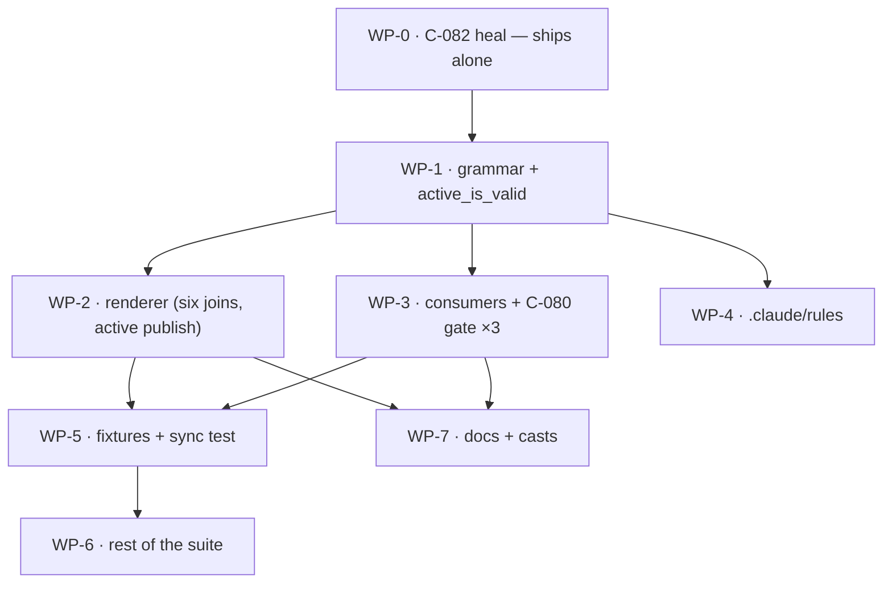

# Plan: Toolchain tree layout — the closed depth-1 set

## Status

- **Plan:** plan_toolchain_tree_layout
- **State:** review
- **Tier:** xhigh
- **Active phase:** 5 — Review & documentation
- **Step:** [PR #437](https://github.com/ocx-sh/ocx/pull/437) — basic gate green (17/17) on `bc5ba409`, Verify Deep dispatched and its Linux, macOS, Windows-ARM64 and drift legs green. Every inherited red is fixed on this branch. Next: /hex-finalize
- **Feature branch:** `feat/toolchain-tree-layout` (rebased onto `bab70440`; carries only this plan's work)
- **Last update:** 2026-09-08

---

## Overview

**Status:** Approved
**Date:** 2026-09-07
**Related ADR:** [`adr_toolchain_activation.md`](./adr_toolchain_activation.md) § *Addendum — 2026-09-07 (layout: the closed depth-1 tree)*
**Research:** [`research_toolchain_tree_doc_surface.md`](./research_toolchain_tree_doc_surface.md) · [`research_toolchain_tree_corrupt_states.md`](./research_toolchain_tree_corrupt_states.md)
**Discussion of origin:** [`.agents/discussions/shell-multi-activation.md`](../../.agents/discussions/shell-multi-activation.md)

### Contract-ID convention — read before adding an ID

This plan does **not** mint its own `C-001…` catalog. Three `C-NNN` catalogs already
exist in this repo and collide by range with different meanings:
`adr_toolchain_activation.md` (C-001…C-084), `design_spec_shell_env_overhaul.md`
(its own C-001…), and `classify.rs:1370` (the index-claim catalog, C-071).
A fourth would be actively harmful. **Contract IDs below are the toolchain ADR's
own** (C-071…C-084). Only user-experience scenarios are plan-local, numbered
`S-001…`.

**In code, a `C-NNN` names its record**: `C-074 (adr_toolchain_activation)`.
A bare number is legible only in a file that cites one catalog exclusively —
and `cli/classify.rs:1370-1372` already carries a *different* C-071, adjacent to
files WP-3 touches.

## Objective

Move every user-supplied name in the rendered toolchain tree one level down, under
`links/`, so depth 1 becomes a closed set of tree-own names. This retires the `bin`
reservation by construction rather than by validation, and it must happen before
0.6.1 because `<home>/toolchain/<group>/<entry>` is emitted into user environments as
`PATH` and `JAVA_HOME` values (C-065) — free to move while unreleased, a wire break
afterwards.

## Scope

### In scope

- The grammar: `entry()` renders under `links/`; new `links_group()`; the two raw
  joins that bypass the grammar today are closed.
- The renderer: depth-1 orphan scan becomes a closed-set comparison; prune
  containment; a legacy tree is reported once, never deleted.
- Retirement of the `bin` group/binding reservation, deleted with its error variant.
- **C-082** — the dereferenced-copy heal for `<group>/<entry>`. A live defect on
  `goat`, independent of this layout change, shipped first and separately.
- Every documentation surface: 17 website pages, 9 casts, 2 generator scripts,
  25 Rust files / 112 doc-comment lines — enumerated exhaustively in the doc-surface
  artifact, which is the checklist of record.
- The acceptance-suite literal-path bypasses, and the new lock-swap sync test.

### Out of scope

- **Multi-shell itself.** [#363](https://github.com/ocx-sh/ocx/issues/363)
  (selection config) and [#189](https://github.com/ocx-sh/ocx/issues/189)
  (`ocx select`) stay open and undesigned. Nothing here selects, names, or
  activates a second shell.
- Any user migration. The tree is unreleased — `toolchain_store.rs` is absent at
  tag `v0.6.0`.
- `CHANGELOG.md`. Generated by `git-cliff` from commit subjects; never edited.

## Key decisions

| Decision | Rationale |
|---|---|
| Depth 1 is a closed, tree-own set | A user-supplied name at depth 1 is the coupling that forced the `bin` reservation. Removing it by construction is D-V14's own stated method. |
| The `bin` reservation is **deleted**, not deprecated | Never shipped — `git grep` finds the string only in the working tree (`project/error.rs:176`), nothing at `v0.6.0`. Retiring it is a loosening: `feat(project): allow "bin" as a group and tool name again`, no `!`. |
| `links`/`shells`/`active` are **not** reserved as group names | A group name is a component of `links/<group>/<entry>`, one level below every tree-own name. `[group.links]` renders at `links/links/<entry>` and collides with nothing. Re-reserving would reintroduce by hand the coupling C-071 removes. *This claim was made independently by two workers and is wrong both times — see the struck rows in the corrupt-states artifact.* |
| C-082 ships first, on its own | It reproduces on `goat` today and lands under every layout option. Bundling it would hide a user-facing fix inside a refactor. |
| Option D (platform-divergent tree) rejected outright | A `cfg`-branched validity predicate is the cross-host unreachable-red class RUL-10/C-025 already refused, and it would fork the tree shape, goldens and prune rules. |

## Decisions taken

| Question | Answer | Date |
|---|---|---|
| Does 0.6.1 wait for the layout change? | **Yes — hold the release.** After 0.6.1 the `<group>/<entry>` move stops being free: `composer.rs:566` substitutes those paths as a lock root's `${installPath}`, which is what reaches `PATH` and `JAVA_HOME` (C-065, verified). | 2026-09-08 |
| Which layout shape? | **Option B** — `active -> shells/default/` + `links/` + `shells/`. Owner's call, made against the review recommendation of C (scored 112-91) and reaffirmed after the security finding was put on the record. The two arguments for C stand in the ADR; they are not re-litigated here. **Consequence carried into WP-3:** C-080 must be amended to re-anchor all three guard call sites before B is safe. | 2026-09-08 |
| File a GitHub issue for C-082? | **No** — carried as WP-0 in this plan. | 2026-09-08 |
| Windows verification | **Ignored by decision.** No CI leg, no `MAX_PATH` guard, no issue filed. The 3 platform-limited rows stay labelled in the corrupt-states artifact so nobody later mistakes them for coverage. | 2026-09-08 |

## Parallelization

`Verify` column: `scoped` = the WP's own crate/suite; `full` = `task verify`.

| WP | Scope | Contracts | Key files | Size | Wave | Depends on | Review | Verify | Status |
|----|-------|-----------|-----------|------|------|------------|--------|--------|--------|
| WP-0 | C-082 dereferenced-copy heal for `<group>/<entry>`: kind-dispatch in the link publish, non-recursive, `Skipped` + an actionable remedy on a real directory. **Ships alone, first.** Also corrects C-082's own text, which cites `symlink::update` where `publish_link_within:1564` calls `replace_atomic` | C-082 | `render_toolchain.rs` (`publish_link_within:1540-1573`), `test/tests/test_toolchain_render.py` | S | 0 | — | risk: live defect on `goat` | full | merged |
| WP-1 | Grammar + the shared validity predicate. `entry()` → `links/<group>/<entry>`; add `links_group()`; `bin()` stays PATH-facing and `shell_bin()` becomes the render target; **`active_is_valid` lives here** so WP-2's heal and WP-3's gate call one function. Delete the reserved table, the reservation error variant — **`ReservedToolchainName` (`project/error.rs:177`), not `ReservedGroupName`; ADR item 40 names a variant that does not exist** — and every construction/assertion site. **Flips the 4 parametrized acceptance rows at `test_toolchain_render.py:470-488` that assert `bin` is reserved**: they are the direct inversion of this deletion (S-003), and leaving them to WP-5/WP-6 reds WP-2's `full` gate for two waves against a test with no owner. **Rewrite `TrailingDotOrSpace`'s justification** (`toolchain_store.rs:548-551`) — its only rationale is the reservation this WP deletes; the refusal stays, the comment cannot cite a dead rule | C-071, C-072, C-073, C-078 accessors, C-080 predicate | `file_structure/toolchain_store.rs`, `file_structure.rs`, `project/{config,error,mutate}.rs`, `cli/classify.rs:1359`, `test/tests/test_toolchain_render.py:470-488` (the 4 reservation rows only) | M | 1 | WP-0 | risk: deletes a CLI error variant across 4 files | **scoped** — see merge note | merged |
| WP-2 | Renderer: depth-1 scan → closed-set comparison, prune containment, legacy tree reported **per render**, the `active` publish and heal-by-observed-kind, ordering, **all six raw joins onto the home root** (`:975` heal lock, `:1437`, `:1647` `artifact_path`, `:1743` `observe_default_group_links`, `:2130` `repoint_link`, `:2581` `prune_within`), the `RenderedArtifact::GroupDirectory` parent split, this file's 25 doc-comment sites, 8 RT rows + 7 `[active-only]` RT rows. **Owns every through-`active` site inside `render_toolchain.rs` — four, not the two the ADR named**: `refuse_symlinked_home_leaves` (`:2299`), `create_bin_owner_only` (`:2388`), the trampoline publish (`:1178`, `:1646`, `:2580`) and — the one nobody had — **`fingerprint_bin` (`:1679`, `symlink_metadata` at `:1721`), a *producer***: it writes the render stamp from `bin()`, so an `active` repointed before a render makes the stamp **certify** the attacker's directory and `bin_matches_recorded` then passes by agreeing. Re-anchoring readers alone makes this strictly worse. `.bin()` has **87** sites in this file (reproduced three ways — an earlier "120" in this plan was the rtk proxy's collapsed output, and the still-earlier "six raw joins" was also wrong), of which only **6** are production and all 6 are physical. **Two traps a mechanical sweep walks straight past:** **(a) `reserved_name(&home.bin())` (`:1456`) must be DELETED, not swept.** `reserved_name` is `path.file_name()` (`:1476-1478`), so it returns the string `"bin"` whether the argument is `bin()` or `shell_bin()` — a `bin() → shell_bin()` rename compiles, runs, and changes nothing. The depth-1 scan then keeps a legacy `bin/` at the root forever, C-074 and C-076 ship unimplemented, and **no test reds**. Replace the two-element `reserved` array with C-074's closed set (`.gitignore`, `active`, `links`, `shells`). **(b) `links` and `shells` are unguarded intermediate components — a write-outside-the-home this layout *introduces*.** `refuse_symlinked_home_leaves` (`:2299-2308`) covers exactly `[root(), bin()]`; `publish_link_within` (`:1544`) checks only the entry's *immediate* parent (`links/<group>`, never `links`); `create_owner_only` (`:2342`) is `DirBuilder::recursive(true)`, which follows existing symlinks. So a committed `.ocx/toolchain/links -> /outside` puts every group directory and every entry link outside the home on a plain `ocx pull`. Today's `<group>/` sits AT depth 1 and so *is* the immediate parent `publish_link_within` checks; option B inserts a component above it and no guard follows. **Extend the leaf refusal to the whole closed depth-1 set.** | C-074, C-075, C-076, C-079, C-080 gate (in-file sites), C-081, C-083 | `render_toolchain.rs` (8,162 lines), `file_structure/state_store.rs` | L | 2 | WP-1 | risk: **security** — `repoint_link:2130` and `prune_within:2581` are guards | full | merged |
| WP-3 | Consumers, the C-080 gate, and the session-PATH deregistration. **C-080 re-anchors the through-`active` sites that live OUTSIDE `render_toolchain.rs`** — `bin_matches_recorded` (`activation.rs:1279-1285`) and **`wrapper_binary_path` (`ocx_cli/src/command/self_group/activate.rs:939-940`)**, which probes `toolchain.bin()/ocx` with `Path::is_file` (follows every component) on the **global** tier and bakes the result as the absolute program behind a login-emitted `ocx` shell function. The in-file sites moved to WP-2, which owns that file — the ADR's original three-site table put two of them here and would have collided in the same wave. Six sites total, not three; `lstat` does not follow a final component but does follow every intermediate one. **Plus G-1 — a new `toolchain_bin` field on the `ocx shell state` report** (`api/data/shell_state.rs`, field list at `command-line.md:2183`). `in-depth/shell-integration.md:224` calls this JSON "the supported way for an editor, a devcontainer feature or a CI step to discover a toolchain from outside ocx", and two published recipes then build the path by concatenation — `user-guide.md:444` (`jq -r '.toolchain_home + "/bin"'`) and `:474` (`echo "$(… jq -r .toolchain_home)/bin" >> "$GITHUB_PATH"`). Under option B that directory does not exist; both recipes still **exit 0**, and the failure surfaces steps later in someone else's automation with no ocx process in the trace. Prose cannot fix this: documenting `+ "/active/bin"` re-creates the identical defect at the next layout change and leaks a tree-internal name into every consumer's YAML. The field is additive and therefore backward compatible on the read path. Plus the C-010 exclusion audit and the clap-rendered `--help` text that is CLI surface | C-077 (verify-only), C-080 gate, C-084 | `activation.rs`, `setup.rs`, `setup/session_path*`, `composer.rs`, `env.rs`, `activate.rs`, `record/execution_record.rs`, `package_manager/{mutate.rs,launcher/body.rs}`, `oci/client/builder.rs`, `ocx_cli/src/{app.rs,command.rs,command/**,command/self_group/activate.rs,options/pinned.rs,api/data/shell_state.rs}`, `ocx_shim/src/{core,main}.rs` | M | 2 | WP-1 | risk: **security** — restores guard parity B removes | full | merged |
| WP-4 | `.claude/rules/` and repo-internal references to the tree shape | — | `.claude/rules/subsystem-file-structure.md`, `subsystem-package-manager.md`, `.claude/rules.md` | S | 2 | WP-1 | — | scoped | merged |
| WP-5 | **Owns `test/src/toolchain_fixtures.py` outright.** `bin_entries`/`link_entries`; extends `two_branch_checkout:511-568` to vary the tool *and group* set; **the lock-swap sync test**; 9 TR rows + 6 `[active-only]` TR rows | S-001 | `test/src/toolchain_fixtures.py`, `test/tests/test_toolchain_render.py` | M | 3 | WP-2, WP-3 | — | full | merged |
| WP-6 | **Search `test/**` for the doc surface first** — it was never in the enumeration's scope. Then route every literal-path bypass through the fixture seam; enumerate them rather than trusting a count (`test_toolchain_cli.py` has 12 `/ "bin" /` joins, `test_trampoline_exec.py` 16); delete the stale claim at `shell_matrix.py:82` that `"toolchain/bin"` is asserted nowhere else | — | `test/src/shell_matrix.py`, `test_toolchain_cli.py`, `test_trampoline_exec.py`, `test_toolchain_offline_after_pull.py`, `test_session_path.py`, `test_toolchain_activate.py`, `test_self_activate.py`, `test_shell_reconcile.py`, `test/bench/shell_latency.py` | L | 4 | WP-5 | — | full | merged |
| WP-7 | Docs + casts: 17 sites across 11 website pages, the `configuration.md:1670-1684` reserved-names rows, the 2 generator scripts, fix the **2 generator scripts** — casts and `website/src/_scripts/` are gitignored and regenerated by `website:build` → `scripts:publish` → `recordings:parallel` (`website/taskfile.yml:43-46`), so fixing the generators *is* fixing the casts and the `_scripts` copy self-heals. **Only 4 of the 9 casts show the tree's interior**; the other five print the home root, which does not move — re-recording them proves nothing. **Zero new casts** (every candidate fails `docs-style.md`'s "shows work, not grammar" bar). **Plus one unchecked green to close:** `test/doc_scripts/user-guide__toolchain-bin-mode.sh` carries no `# expect:` golden, so its gate is the exit code — and its body is `export PATH="$PWD/.ocx/toolchain/bin:$PATH"` then `command -v cmake` under `set -euo pipefail`, with the harness never scrubbing `PATH`. When that directory stops existing the **host's** cmake answers and a wrong cast records green on `ubuntu-latest`. Design in `.tmp/hex/run/wp7-docs-design.md` § 3c. Then re-run `website:scripts:publish` and `task schema` | — | `website/src/docs/**`, `test/doc_scripts/{user-guide__toolchain-bin-mode,user-guide__bin-mode-render}.sh`, `website/src/public/casts/**` | L | 3 | WP-2, WP-3 | — | full | merged |
| WP-8 | Follow-up found by the S-001 convergence check: a group dropped from the lock left its `links/<group>/` behind because `reconcile_links` scanned only the *selected* groups. Adds the departed-group prune, and the shared `refuse_not_a_link` guard in `prune_within`'s `Link` arm after the first pass silently deleted a planted regular file (`symlink::remove` is `std::fs::remove_file` on Unix) | C-075, C-079 | `render_toolchain.rs` (`reconcile_links:1519-1551`, `prune_within`), `test/tests/test_toolchain_render.py` | S | 5 | WP-5 | risk: **security** — a prune that removes a payload | scoped + acceptance | merged |
| WP-9 | Follow-up found while re-running the acceptance gate: `ocx self setup` re-run was not idempotent (C-036) because `session_path::deregister` validated its `directories` and then `remove_file`d the whole `conf_path(home)` regardless, and `setup.rs:382` called it unconditionally. Makes the deregistration subtractive, and keeps both branches of the switch fixture on one consent source | C-084 follow-up (C-036 idempotence) | `crates/ocx_lib/src/setup/session_path/linux.rs`, `crates/ocx_lib/src/setup.rs`, `test/src/toolchain_fixtures.py` | S | 5 | WP-3 | risk: consent-stamp state | scoped + acceptance | merged |

**Merge note — WP-1 and WP-2 land as one commit.** WP-1 moves `entry()` under
`links/` while the orphan scan (`:1455-1469`) and `observe_default_group_links`
(`:1741-1743`) still read `root().join(group)`. After WP-1 alone, `links/` is an
unexpected depth-1 name reported `Skipped` forever and default-group observation
returns empty, so `bin` mode withholds. WP-1's gate is `scoped`; the pair shares one
`full` gate at WP-2's merge.

**`trampoline_lookup_exclusions` stays WP-3's — a widening proposed and withdrawn.** I first
assigned it to WP-1, reasoning that WP-1's accessor split falsifies it and should not hand the
next packages a red base. WP-1 refused with the better argument and it stands: this base is red
*by design* (the merge note below), 35 unit tests are legitimately deferred to WP-2/WP-3 already,
and C-078's both-spellings obligation makes WP-3 rewrite those very assertions — so a WP-1 edit
would collide rather than help. **The obligation itself is unchanged and is not optional:** ADR
item 45 requires both spellings per home, so the set becomes four paths. Excluding only `bin()`
leaves a trampoline reached by the physical spelling re-entering itself — item 22's fork loop,
which asdf#2166, opencodex#1439 and claude-code#47978 all shipped. WP-3 owns it, with
`toolchain_exec.rs:782` and `setup.rs:1050` red on the old `bin()` literal until it lands.

**Prerequisite — the ADR is amended before WP-2 and WP-3 start.** C-080 as first written
covered `refuse_symlinked_home_leaves` alone; the 2026-09-08 amendment widened it to three.
The WP-1 edge-case hunt found **two more** (`fingerprint_bin`, `wrapper_binary_path`), and the
first of them is a **producer**, which changes the argument rather than lengthening a list:
a stamp written through `active` *certifies* whatever `active` points at, so a read-side-only
re-anchor leaves `bin_matches_recorded` passing by agreement with a poisoned stamp. Six sites,
split by file ownership: four to WP-2, two to WP-3. C-078's independence rule (deleting either
guard must leave the other observably firing) is violated by construction until all six move.

**Critical path:** WP-0 → WP-1 → WP-2 → WP-5 → WP-6.

**Shippable after wave 3** (WP-5 and WP-7 merged). WP-6 is a consistency sweep.

**Merge order:** WP-0, WP-1+WP-2 (one commit), WP-3, WP-4, WP-5, WP-7, WP-6.

## Validation items to mint

The ADR's items 39-50 cover most contracts; two gaps need new items before execute,
and one contract is verify-only. Drafted in
[`review_toolchain_tree_plan_spec.md`](./review_toolchain_tree_plan_spec.md) § 4-5.

| Gap | Item | Owner |
|---|---|---|
| `links_group()`'s hostile-component refusal through **both** accessors | mint | WP-1 |
| A depth-1 directory named after a **locked** group is pruned | mint | WP-2 |
| `reserved_name(&home.bin())` no longer decides the depth-1 keep-set — a `bin/` at the root is pruned, and the test reds under a mechanical `bin() → shell_bin()` rename (which is a no-op here) | mint | WP-2 |
| Every tree-own depth-1 component is refused when it is a symlink — `links`, `shells` and `active`, not only `root` and `bin`. Red: point `links` at a directory outside the home, run `ocx pull`, and assert nothing is written there | mint | WP-2 |
| C-077 (re-anchoring is text-only) | **verify-only, do not mint** | WP-3 |

## User-experience scenarios

- **S-001 — a checkout swaps `ocx.toml` and `ocx.lock`.** *(WP-5)* A user switches to a branch
  whose lock declares a different tool *and* group set, then runs `ocx pull`.
  *Expected:* the rendered tree matches the new lock exactly — no orphan group
  directory, no trampoline for a departed tool, no stale link, render stamp current.
  *Errors:* a group directory that still holds entry links is reported `Skipped` with
  a remedy naming the path, never silently deleted (RUL-32).
- **S-002 — a project is copied with a symlink-dereferencing tool.** `cp -rL`, unzip,
  or Docker `COPY`. *Expected:* `ocx pull` reports each affected `<group>/<entry>`
  once, with a remedy that names the directory to delete. *Errors:* today this is `Skipped` forever with a raw `EISDIR` and no remedy.
  **WP-0 does not make it heal** — the directory is a real package copy, deletion
  stays non-recursive per RUL-32, so the outcome remains `Skipped`. What WP-0
  changes is that the reason names the cause and the fix. *(WP-0)*
- **S-003 — a group or tool is named `bin`.** *(WP-1; ADR item 40)* *Expected:* accepted, renders at
  `links/bin/<entry>`. *Errors:* none; the previous exit-78 refusal is gone.

- **S-004 — a CI step or editor discovers the launcher directory from outside ocx.** *(WP-3)* A
  user runs `ocx --format json shell state` and needs the directory to put on `PATH`.
  *Expected:* the report carries `toolchain_bin` directly, and the documented recipes read that
  field rather than concatenating onto `toolchain_home`. *Errors:* none — the field is always
  present whenever `toolchain_home` is, so a consumer never has to branch. The failure this
  replaces was silent: concatenation produced a non-existent directory and exited 0.

## Implementation Steps

> Contract-first TDD. Tests come from the ADR's contracts and validation items,
> never from the stubs.

### Phase 1: Stubs

- [x] **1.1** `ToolchainHome::entry()` renders `<root>/links/<group>/<entry>`; add
      `links_group()`. Delete `ToolchainPathError::Reserved`, the reserved-name
      comparison (`toolchain_store.rs:558-563`), and every construction and
      assertion site (`project/error.rs:176`, `project/config.rs:1034`,
      `project/mutate.rs:916-946`, `cli/classify.rs:1359`). *(WP-1)*
- [x] **1.2** Route all six raw home-root joins through the grammar, and give
      `RenderedArtifact::GroupDirectory` a parent so the depth-1 scan and the
      group-orphan pass can address different roots. *(WP-2)*

### Phase 2: Architecture review

Stubs against the ADR: do the accessors leave exactly one spelling of each path?
Does every guard that named `<root>/<group>` now name `<root>/links/<group>`?
**Gate:** `repoint_link` and `prune_within` provably guard the path they write.

### Phase 3: Specification tests

- [x] **3.1** ADR validation items 39-41 + the two minted items. *(WP-1, WP-2)*
- [x] **3.2** §C Rust rows 1, 3, 4, 5, 12, 14, 15. *(WP-2)*
- [x] **3.3** §C pytest rows 2, 7, 9-11, 13, 16-18 + the lock-swap sync test. *(WP-5)*

**Gate:** every test fails against the stubs, and each has been *seen* red.

### Phase 4: Implementation

- [x] **4.1** Grammar + renderer bodies, merged as one commit. *(WP-1+WP-2)*
- [x] **4.2** Consumers, `.claude/rules/`, the remaining suite. *(WP-3, WP-4, WP-6)*
- [x] **4.3** Docs, casts, `website:scripts:publish`. *(WP-7)*

**Gate:** `task verify`.

### Phase 5: Review & documentation

- [x] **5.1** Spec compliance — every contract to a WP and a test step
- [x] **5.2** Security review of WP-2's guard re-anchoring
- [x] **5.3** The doc-surface checklist walked row by row, not sampled

## Testing strategy

Two matrices, and §C is **not** the whole of it — a claim the first draft got wrong.

- **Contract tests** are the ADR's validation items **39-50**, mapped per contract in
  [`review_toolchain_tree_plan_spec.md`](./review_toolchain_tree_plan_spec.md) § 1,
  plus the two items minted above.
- **Corrupt-state tests** are §C of
  [`research_toolchain_tree_corrupt_states.md`](./research_toolchain_tree_corrupt_states.md):
  **32 live rows including** the `[active-only]` ones — not 32 plus a further 15.
  After the four strikes (19, 20, 32, 35) **all 32 survive under option B**, because B
  ships `shells/` and `active` and therefore has every state the matrix describes: the
  13 `[active-only]` rows are in scope (WP-2 renders `active`, WP-5 owns the fixture),
  rows 6-7 stay live as `shells/`-only states, and row 5 stays anchored to `shells`.
  *This paragraph previously carried the option-C accounting — 19 rows, rows 6-7
  struck, row 5 re-anchored to `links`. That framing is void; B was chosen.*
  Live not-CI-verifiable rows are **3** (14, 33,
  34) — the pytest suite runs on a Linux-only leg today
  ([#419](https://github.com/ocx-sh/ocx/issues/419)); documented gaps, not coverage.
  Row 8 carries no mutation and is verify-only against existing `ensure_gitignore_*`
  cases.

Two standing rules apply to every row:

1. **No row without a named red.** A green that cannot be told apart from "never ran"
   is not a check.
2. **Two §0 rows have unreachable reds as written, and WP-5 owns the rewrite.**
   Rows 2 and 3 predict "the payload disappears" from a populated directory, but the
   `Link` prune arm is `symlink::remove` (`:2620`) and the heal's repair is
   `replace_atomic` (`:2144`); neither removes a populated directory, and
   `repoint_link`'s `Err` is swallowed at `debug` (`:2098-2100`). The reachable
   red for both is therefore **the render outcome, not the payload**: a populated
   real directory where a link belongs must surface as `RenderOutcome::Skipped`
   carrying an actionable remedy, and the payload must still be present afterwards.
   WP-5 rewrites both rows to assert that pair (outcome + payload intact) before it
   writes the fixture; deleting them is not an option, since that is exactly the
   state C-082 heals.
3. **Watch for unreachable reds.** Validation item 46's red is unreachable on Linux —
   `linux.rs:203` regenerates `ocx.conf` wholesale and self-heals. Any row whose red
   depends on a self-healing platform path must say so.

## Risks

| Risk | Mitigation |
|---|---|
| **Option B silently defeats two existing security guards.** `refuse_symlinked_home_leaves` (`render_toolchain.rs:2299-2308`) and `bin_matches_recorded` (`activation.rs:1283`) both `symlink_metadata` a path whose intermediate `active` component would be followed — `lstat` does not follow the final component but does follow every intermediate one. `create_bin_owner_only` (`:2388`) follows it too, so the write lands before any gate. | **B was chosen, so this is a blocking contract, not a trade-off.** C-080's extended predicate is amended in the ADR (2026-09-08) to name all three call sites; WP-1 ships `active_is_valid` and WP-3 re-anchors each site to the physical `shell_bin()` path, `create_bin_owner_only` included — it runs before any gate, so ordering is part of the contract. WP-3 carries a `reviewer:security` pass. |
| `render_toolchain.rs` is ~7,900 lines and already shipped. | WP-2 is sized L and isolated in its own wave; `task verify` gates its merge. |
| Casts embed the tree in recorded terminal output — not fixable by editing prose. | WP-6 re-records all 9 against a built binary; `test_doc_scripts.py` executes the generator scripts for real, so a missed one fails loudly rather than drifting. |
| Some "doc comments" are shipped CLI text (`app.rs:369,854` are clap-rendered `--help`; `setup.rs:803` is a user-visible string). | Flagged in WP-3's review hint; treated as CLI surface, not prose. |
| **Windows `MAX_PATH` is unguarded and this change makes it strictly worse.** 260 chars is the unconditional Win32 default; opting out needs both the machine-wide `LongPathsEnabled` registry key and a manifest `<longPathAware>true</longPathAware>` — ocx has neither, and `dunce::canonicalize` (used by `resolve_toolchain_home`) *strips* the `\\?\` prefix, trading long-path capability for compatibility. The added `links/` component stacks with `toolchain-dir` relocation's hashed project key and long CI workspace roots. | Recorded as a residual, not fixed here: cargo carries the identical open gap ([cargo#7986](https://github.com/rust-lang/cargo/issues/7986)). WP-2 adds no new guard, but must not deepen the tree beyond the one component this plan specifies. |
| Per-name `.exe` trampolines may draw AV heuristic flags — rustup hit this with per-toolchain proxy copies ([rustup#4891](https://github.com/rust-lang/rustup/issues/4891)). ocx's are hardlinks from `ShimBinStore`, not copies, so it may not apply. | Unverified either way; noted so a Windows AV report is recognised rather than re-diagnosed from scratch. |
| Windows behaviour is unverified by CI. | Labelled inline per row rather than counted as coverage; the gap is documented, not silent. |

## Rollback

Every WP is a separate commit on a feature branch, merged in the order above; no
user migration exists to reverse, since the tree is unreleased and re-rendered by the
next `ocx pull`. Reverting WP-1 reverts the grammar and everything above it fails to
compile — which is the intended coupling, not a hazard.

---

## Schedule log

| Wave | WP | Merge SHA | Gate | Notes |
|---|---|---|---|---|
| 0 | WP-0 | [`32e70b4f`](https://github.com/ocx-sh/ocx/commit/32e70b4f) | scoped | Shipped alone, first. Also corrected C-082's own text. |
| 1 | WP-1 | [`db030f0d`](https://github.com/ocx-sh/ocx/commit/db030f0d) · [`3629cb66`](https://github.com/ocx-sh/ocx/commit/3629cb66) | scoped | WP-1 refused the boundary widening I proposed and was right — the base is red by design and C-078 makes WP-3 rewrite those assertions anyway. |
| 1 | WP-2 | [`aa3a1919`](https://github.com/ocx-sh/ocx/commit/aa3a1919) | scoped | Merged its pre-rebase commit; the rebase would have reverted the accessor fix and deleted the C-078 correction. |
| 2 | WP-3 | [`66916623`](https://github.com/ocx-sh/ocx/commit/66916623) | scoped | Falsified my `owned_spellings` ruling with a two-tree test; ADR paragraph rewritten. |
| 2 | WP-4 | [`0f7c1a55`](https://github.com/ocx-sh/ocx/commit/0f7c1a55) | scoped | — |
| 3 | WP-5 | [`cd0d638d`](https://github.com/ocx-sh/ocx/commit/cd0d638d) · [`1779e899`](https://github.com/ocx-sh/ocx/commit/1779e899) | scoped | Owns `test/src/toolchain_fixtures.py`, the seam WP-6 routes 63 literal joins through. |
| 3 | WP-7 | [`cc3fa0b1`](https://github.com/ocx-sh/ocx/commit/cc3fa0b1) | scoped | — |
| 4 | WP-6 | [`66323b1d`](https://github.com/ocx-sh/ocx/commit/66323b1d) | scoped | Rebase was byte-identical to the pre-rebase commit; skipped. |
| 5 | WP-8 | [`737bb66b`](https://github.com/ocx-sh/ocx/commit/737bb66b) · [`28b47228`](https://github.com/ocx-sh/ocx/commit/28b47228) | scoped + acceptance | I told WP-8 links were safe to prune. False — `symlink::remove` is `remove_file` on Unix; the unfiltered first pass deleted a planted file. The `is_symlink` filter is the guard. |
| 5 | WP-9 | [`3d89954b`](https://github.com/ocx-sh/ocx/commit/3d89954b) | scoped + acceptance | Found by the acceptance gate, not by a plan row: `ocx self setup` re-run was not idempotent. |

## Progress Log

| Date | Update |
|------|--------|
| 2026-09-08 | **Every `not in segments` withhold assertion in the activation module was vacuous, and the convergence pass found it.** `ocx self activate --reconcile` picks its output arm via `Shell::detect` (`shell.rs:78`), which walks the process tree and falls back to `$SHELL` — which `OcxRunner` does not set. A suite run detached from its launching shell has no shell in the chain, so the emitter prints **nothing and exits 0**. Measured on one binary: 2371 bytes / 2 segments with a shell ancestor, 0 bytes / 0 without. An empty list satisfies every `x not in segments` assertion in the module, so every withhold row was green for a reason unrelated to withholding. Fixed by pinning `--shell=bash` **plus a non-empty guard** — the guard is the load-bearing half; without it the pin alone still admits the vacuous state. |
| 2026-09-08 | **Second deferral, to be filed with the first: [#434](https://github.com/ocx-sh/ocx/issues/434) — `ocx self activate --shell` (bare) exits 0 with empty output where its own `--help` documents exit 64.** Only the `--format json` arm honours the documented contract. A shell sourcing `$OCX_HOME/env.sh` on a host where detection fails is therefore silently un-activated *with a success exit*. Real and user-visible, but it is an exit-code contract change on a shipped login path — a shell that starts erroring on source has login-wide blast radius, and nothing in this plan's scope forced the discovery. Out of scope for a layout branch; filed rather than smuggled. Found by the convergence pass while pinning the shell arm. **File cross-referencing [ocx-sh/ocx#400](https://github.com/ocx-sh/ocx/issues/400)** (`OCX_NO_CONSENT`) as the sibling case — that session's framing is sharper than mine and generalises past both: *the honest answer is do-nothing, and the exit code has to say which do-nothing it was.* A silent success on an activation path is indistinguishable from a success that did the work. |
| 2026-09-08 | **Standing preference, earned by four false readings in one session: gate on an artifact the run itself writes, never on a process query.** `pgrep -f <term>` self-matches when the querying shell's command line contains `<term>` (deadlocked WP-0 for ten minutes, then fooled the orchestrator twice); `ps -eo args \| grep '[p]attern'` silent-negatives through this host's proxy (reported a *live* suite as absent, costing one wrong accusation); and even a `/proc/*/cmdline` walk self-matches if the pattern appears in the walker's own argv. Zero false readings came from a sentinel file or a log's terminal line. Liveness recipe that works here, with the walker's own pid excluded: `for p in /proc/[0-9]*; do tr '\0' ' ' < $p/cmdline; echo; done \| grep pytest`. |
| 2026-09-08 | **Pattern worth naming, found twice in one day from opposite directions: an absence assertion needs a witness that the absence was *produced*, not merely observed.** Here, every `x not in segments` row was satisfied by an empty list the emitter never populated. Independently, the `OCX_NO_CONSENT` work (ocx#400) guards the same shape on the other axis — its fixture runs `ocx lock` under `OCX_NO_CONSENT=1` and asserts zero stamps *before* the act, because `lock` is itself a stamp writer that would otherwise make every "no stamp" assertion vacuous. Candidate for `.claude/rules/subsystem-tests.md`; not added here, since this branch should not carry an unrelated rule change. |
| 2026-09-08 | **Deferred out of this plan, to be filed as an issue: [#433](https://github.com/ocx-sh/ocx/issues/433) — `Error::InternalFile`'s `Display` should carry its `#[source]`.** The variant hides its cause behind `#[source]`, so every producer that builds a reason with `error.to_string()` emits `internal file error for '<path>'` and names neither errno nor cause. Three sites were fixed per-producer on this branch; three remain (`render_toolchain.rs:1333`, `:1683`, `:2269`). Fixing `Display` once closes the whole class — and is the better fix — but it rewrites the *rendered text* of a shared error type everywhere it reaches, far past this branch and with no test here that would catch a regression at an untouched site. Changing error text broadly inside a layout PR is how an unrelated regression gets attributed to the layout. Found and correctly refused by WP-8. |
| 2026-09-08 | **A silent data-loss path, found because the fix was tried without its guard.** WP-8 shipped the departed-group sweep unfiltered on the orchestrator's premise that "removing a link is not removing a payload" — `symlink::remove` refuses a non-link. It does not: `symlink-0.1.0`'s Unix `remove_symlink_auto` is `pub use std::fs::remove_file`, and our wrapper guards only on `exists() \|\| is_link()` (`symlink.rs:380-386`), so a regular file `exists()` and is deleted. Measured: a planted file vanished and the render printed nothing. The `is_symlink` filter is the guard. The **selected**-group sweep has the identical shape on a path that runs every render, and is fixed here too rather than left as pre-existing — a silent-deletion path in a file this branch already rewrites is not something to leave for consistency's sake. |
| 2026-09-08 | **WP-8 added during execution: S-001's Expected clause did not ship, and the test the owner asked for is what found it.** After a branch switch, `reconcile_links` (`:1519-1551`) builds `selected` from `request.groups` and iterates only that set, so a group the new lock no longer declares is never scanned and its entry links are never pruned. The directory never empties, the depth-1 `remove_dir` is `ENOTEMPTY` on every render forever, and the outcome is `Skipped` reading `internal file error for '<path>'` — no cause, no remedy, because `prune_outcome:1811` uses `error.to_string()` where its sibling deliberately uses `render_chain`. **Not a regression** — the pre-`links/` layout had the identical shape; newly *checkable* only because S-001 was written down. WP-5 pinned both halves as `strict` xfails and refused to patch outside its file set; WP-8 fixes it under RUL-32 (prune entry links and `remove_dir` an emptied group directory, never `remove_dir_all`, never a populated one). Verified in source before scheduling. |
| 2026-09-08 | **`task verify` cannot go green on this repo, and CI never runs it.** `.verify:lint` is red from pre-existing drift: 2 catalog tests (fixed in `ce248e3d`, 28→26), ~26 `TestSwarmTiers` cases asserting `/swarm-*` skills the hex family replaced, and `shell:shellcheck` SC2148 on fixtures under `.claude/rules/docs-quality/checks/fixtures/**` plus their `.opencode/` mirror. None of it is reachable from this plan's diff. **Consequence for this run:** per-WP gates are `task rust:verify` + targeted pytest (which the session mandate asks for anyway), and the real pipeline gate is CI's `verify-basic.yml` / `verify-deep.yml`, which do not invoke `task verify`. The `Verify: full` cells below mean that pair, not the red task. The remaining rot is left for the owner — it is repo hygiene, not layout work. |
| 2026-09-08 | **`task claude:tests` is a broken gate and is NOT a WP-4 signal.** 28 failures on a clean `main` checkout, mostly `TestSwarmTiers` asserting `/swarm-*` skills that the hex family superseded. A 29th, `TestRuleCatalog::test_all_markdown_refs_resolve`, appears only in this worktree — proven not ours: the test skips `.claude/artifacts/`, and `git diff-tree ec53adc5` shows every file of the plan commit is either under that path or is `.agents/memory/hex.md`, outside the scanned tree entirely. WP-4's evidence is its own revert/reapply parity, not this gate. Out of scope; not fixed here. |
| 2026-09-08 | Wave-1 edge-case hunt found **two more through-`active` sites** (6 total, not 3) and a plan defect: WP-3's scope named two sites inside WP-2's file in the same wave. Re-cut on file ownership; C-080 second amendment recorded in the ADR. The 4 `bin`-reservation acceptance rows moved to WP-1 — the package that deletes a refusal owns flipping the test asserting it. |
| 2026-09-07 | Plan initialized from ADR addendum + 2 research artifacts. |
| 2026-09-08 | Owner decided: hold 0.6.1, **option B**, no C-082 issue, Windows ignored. Re-cut all 8 WPs to the option-B wave assignment — `active_is_valid` moves into WP-1 so the heal and the gate share one predicate; C-078/C-079/C-081/C-083 ride WP-1/WP-2; C-080's gate and C-084 ride WP-3 with the three-call-site amendment as a prerequisite. |
| 2026-09-07 | Folded adversary findings 8, 12, 13: dropped the unimplementable "reported once", gave `test/**` an owner (4 more files, WP-6 resized M→L), and flagged that `TrailingDotOrSpace`'s comment cites the rule WP-1 deletes. |
| 2026-09-07 | Revised after review round 1 (spec: Fail, 7 Blocks · trade-offs: uphold C, 112-91 · SOTA: 2 gaps · adversary: 11+ actionable). Re-cut to 8 WPs on the option-C assignment; added `- **S-004 — a CI step or editor discovers the launcher directory from outside ocx.** *(WP-3)* A
| 2026-09-08 | **WP-9 had no plan row until the spec review found it.** The acceptance gate — not a plan row — surfaced that `ocx self setup` re-run was not idempotent (C-036): `session_path::deregister` (`setup/session_path/linux.rs:281-310`) validates its `directories` via `encode(directory)?` and then never reads them, `remove_file`ing the whole `conf_path(home)`; `setup.rs:382` called it unconditionally. Fixed subtractively in [`a0d82750`](https://github.com/ocx-sh/ocx/commit/a0d82750), with [`432db25b`](https://github.com/ocx-sh/ocx/commit/432db25b) keeping both branches of the switch fixture on one consent source. **The lesson is the missing row, not the bug**: a WP with no row is a WP no reviewer was told to look at, and this one touched the C-084 surface. |
| 2026-09-08 | **Four pre-plan commits ride this branch and are not this plan's work.** [`f620ba9a`](https://github.com/ocx-sh/ocx/commit/f620ba9a) (script reads resolve against the bundle content), [`fb829ad3`](https://github.com/ocx-sh/ocx/commit/fb829ad3) (reconcile a project created where the shell already is), [`4aa3e79b`](https://github.com/ocx-sh/ocx/commit/4aa3e79b) (`ocx init` consents to the project it creates), [`3be56ff3`](https://github.com/ocx-sh/ocx/commit/3be56ff3) (watch the project file `OCX_PROJECT` names). They were carried for base currency and contributed ~900 lines across four subsystems no contract touches. **Resolved 2026-09-08 by landing:** all four reached `main` independently as [`550dc573`](https://github.com/ocx-sh/ocx/commit/550dc573), [`b932ed6d`](https://github.com/ocx-sh/ocx/commit/b932ed6d), [`365a166f`](https://github.com/ocx-sh/ocx/commit/365a166f) and [`f95c75d8`](https://github.com/ocx-sh/ocx/commit/f95c75d8), and the rebase onto `origin/main` skipped all four as already applied. The branch now carries only its own work, so the attribution hazard is gone rather than merely disclosed. |
| 2026-09-08 | **Review round 1 (`/hex-review xhigh`, 4 reviewers + cross-model adversary) and the three issues it produced.** Filed [#433](https://github.com/ocx-sh/ocx/issues/433) (`Error::InternalFile::Display` hides its `#[source]` — **three** producer sites, not two: `reconcile_bin`, `publish_link`, `heal_links`; my first grep for them silently dropped one, the known proxy false-negative, and a `python3` re-read found it), [#434](https://github.com/ocx-sh/ocx/issues/434) (`ocx self activate --shell` exits 0 where its `--help` documents 64, cross-referencing [#400](https://github.com/ocx-sh/ocx/issues/400)), and [#435](https://github.com/ocx-sh/ocx/issues/435) (**DOC-09 declares a `cargo doc` gate this repo never runs** — found by consequence: the C-073 deletion broke seven intra-doc links, six were fixed by hand and the seventh survived every gate). The review's own highest-value finding was not a contract gap but a **silent data-loss path**: `prune_within`'s `GroupDirectory | RootEntry` arm `remove_file`s a foreign regular file at `<home>/` and — newly reachable on this branch — at `<home>/links/`, one match arm below the `Link` arm [`9bd34123`](https://github.com/ocx-sh/ocx/commit/9bd34123) hardened for exactly that. |
| 2026-09-08 | **Two gate cycles lost to a hand-rolled pytest invocation, and the failure did not look like one.** `cd test && uv run pytest …` loses everything the taskfile's `default` task sets — above all `OCX_INSECURE_REGISTRIES`, without which ocx tries HTTPS against the plain-HTTP test registry. The result reads as the branch being broken: **181 failed, 48 errors** across seven files, every one an `ocx package push` in a 2-minute retry loop with *"Transient registry failure … error sending request for url"*. The first hand-rolled run also lost `-n auto` and crawled serially, which read as a hang. The rule: run the acceptance suite **only** as `task test:parallel --force -- <files>` from the repo root, and treat a mass failure concentrated in registry I/O as an environment fault until the invocation is cleared. Recorded in project memory, not just here. |
| 2026-09-08 | **Four inherited reds cleared, and the forge one was not what the first diagnosis said.** [#439](https://github.com/ocx-sh/ocx/issues/439) is not a classifier that cannot read git's prose — `git push` is **killed by SIGPIPE** and prints nothing on either channel. `send-pack` writes its push-option section unconditionally; `receive-pack` reads it only when at least one ref command was sent, and a refspec skipped *client-side* sends none, so the reader exits, the client's write hits `EPIPE`, and git's `write_or_die` re-raises the signal. The `status` field added for diagnosability is what named it — a fix disproving its own first hypothesis is exactly what that field was added for. Zero-commands-sent also makes the remote authoritative, so the push path now branches on `status.code().is_none()` and reads the verdict from one `ls-remote` instead of from the corpse; forced deterministically in a test by two 60 000-char options that overflow the pipe buffer while staying under the pkt-line ceiling. The other three: the vendored indexbot corpus had drifted (upstream added two `__ocx.keep.sha256-…` rows); `Smoke (Windows)` reddened on two of this branch's own fixtures that hardcoded `/` — the sharper one planted a *relative* `active` target where Windows derives an absolute junction target, so four negative rows were being refused for being relative and never reached the comparison they exist to exercise; and `task claude:tests` was asserting the structure of three `swarm-*` skills the hex family replaced. **Not fixed, filed:** [#441](https://github.com/ocx-sh/ocx/issues/441), a flaky torn read of `~/.docker/config.json` — `LockedFile` replaces in place under an advisory `flock` that binds only writers. Latent since 2026-05-28 and byte-identical to the trunk on this branch; the remedy moves the lock's inode and so belongs to `LockedFile`'s other callers too. |
| 2026-09-08 | **The inherited red is fixed on this branch, and Verify Deep is no longer withheld.** [#439](https://github.com/ocx-sh/ocx/issues/439) was a *classifier fragility*, not a race: `classify_push_failure` matched `(fetch first)` against `git push`'s **stderr** only, so the non-fast-forward verdict rode git's prose, and on the CI runners that stderr arrives empty — an ordinary concurrent-writer rejection surfaced as `GitPushFailed { stderr: Redacted("") }`, unclassified. The fix adds `--porcelain` (git's documented machine-readable per-ref status, on **stdout**) as a second channel the needle scan reads, and gives `GitPushFailed` the `status` field its sibling `GitCommandFailed` already had, so a residual failure is characterisable from the CI log alone. Both halves red-proven: dropping the stdout arm reproduces the CI symptom byte-for-byte with the positive control still green; dropping `--porcelain` reds the producer assertion while the *outcome* assertion stays green — the exact arrangement that was green locally and red on CI. Could not reproduce the stderr silencing in four environments (native git 2.54, git 2.55 in a container matching CI's version, module-only, full suite); the honest limit is recorded in the PR rather than papered over. Also narrowed `SHELL_GLOB` so `shell:shellcheck` stops linting `docs-quality`'s three-line fixtures, which model shebang-less doc snippets and are checker *inputs*, not scripts — 120 shell files including every `test/doc_scripts/**` cast stay in the gate. |
| 2026-09-08 | **Landed as [PR #437](https://github.com/ocx-sh/ocx/pull/437) (draft); two CI legs are inherited red and Verify Deep is deliberately withheld.** Eleven legs green including both Windows cross-builds, Windows shim acceptance, `alpine-shells` and `debian-shells`. `Unit Test Results` and `Smoke (Linux)` fail on `forge::git_workspace::tests::push_to_a_moved_branch_classifies_non_fast_forward`, which fails on `main` itself at [`38d172fa`](https://github.com/ocx-sh/ocx/commit/38d172fa) and passed at [`02e52f8e`](https://github.com/ocx-sh/ocx/commit/02e52f8e) — this branch does not touch `forge/` and inherited it by rebasing; filed as [#439](https://github.com/ocx-sh/ocx/issues/439) with the suspect commit and mechanism. **Verify Deep was NOT dispatched**: its `build` job runs `cargo nextest run --workspace`, so it would go red on the same test on all three OSes, and `acceptance-tests` needs `[build, cross-compile]` and would skip — real money for zero new signal. Also reverted this branch's four shim doc-comment edits ([#438](https://github.com/ocx-sh/ocx/issues/438)): `build-windows-shims.yml` gates on **recency**, so any touch of `crates/ocx_shim/` demands a blob re-cut, and `shim.rs` says blob refreshes ride a dedicated PR. |
  user runs `ocx --format json shell state` and needs the directory to put on `PATH`.
  *Expected:* the report carries `toolchain_bin` directly, and the documented recipes read that
  field rather than concatenating onto `toolchain_home`. *Errors:* none — the field is always
  present whenever `toolchain_home` is, so a consumer never has to branch. The failure this
  replaces was silent: concatenation produced a non-existent directory and exited 0.

## Implementation Steps`; C-072 widened from 2 raw joins to 6; WP-1+WP-2 merged as one commit; corrected every row count; S-002 no longer over-claims a heal WP-0 does not deliver. |
