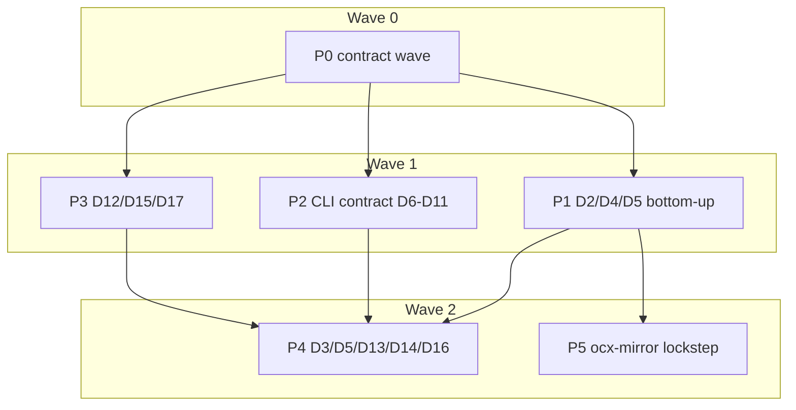

# Plan: Typed, compile-time-checked contract registries

## Status
- State:   review
- Tier:    high
- Tier-grammar: 5
- Updated: 2026-10-05
- Next:    /hex-finalize
- Reviewed: eeeb9a2e6256b0c3532ae553200c1f8b683d361a

- **Plan:** plan_typed_contract_registries
- **Parent plan:** plan_ocx_interface_contract (resume at `/hex-finalize` once this plan reaches `done`; one squashed commit for both)
- **Active phase:** 3 — Integration gate ∥ review
- **Step:** /hex-execute → handoff (P6 merged; integration gate green at `eeeb9a2e6`; review round 2 Approve)
- **Last update:** 2026-10-05 (after eeeb9a2e6: test(exit): only a struct-level delegate counts as reaching a derived type)
- **Resume rule:** base every pipeline worktree on the `hex/adr-ocx-interface-contract` tip at dispatch time. The plan is squashed to one commit at finalize (hex.md › Preferences), so no step may depend on a commit boundary.

Source ADR: `.claude/artifacts/adr_typed_contract_registries.md` (**Accepted**, D1–D17). It amends `adr_crate_split_workspace.md` E3/E4. Goal: `.agents/goals/pr-580.md`. PR: [ocx-sh/ocx#580](https://github.com/ocx-sh/ocx/pull/580). Branch: `hex/adr-ocx-interface-contract`.

## Classification

- **Scope:** medium, about 1–2 weeks of agent work. About 75 error types and roughly 450 variants across 13 crates, 54 report roots, 69 command leaves and about 386 declared-name `EnvLock` literal call sites in 39 files (plus the `EnvLock` subset of the `X.name` form; `ocx_config::env::Env::set` is a different type and out of scope).
- **Reversibility:** two-way at the wire, because nothing published changes. The one structural one-way door is the crate-split amendment (a new proc-macro crate, tier crates declaring their own classification), and the accepted ADR already decides it.
- **Tier:** high (auto). Overlays: `architect=inline` (the accepted ADR covers every decision), `research=skip` (the ADR is accepted and research is never repeated), `adversary=off` (tier baseline; the plan carries no new one-way door).
- **Constitution** (`.claude/rules/arch-principles.md`): no deviation. The crate-split change is the ADR's recorded amendment, and CW-3 applies it to `adr_crate_split_workspace.md`.

## Objective

Land D1–D17 so that each drift the ADR names fails `cargo check`, and delete the test scaffolding that a type makes redundant. Wire bytes do not change: `website/src/public/schemas/errors/v1.json`, `reports/v2.json`, `cli.json`, every schema golden under `crates/ocx_schema/tests/golden/`, every slug, exit code, flag spelling, env name and warning string stay byte-identical. Runtime `error.detail` values and exit codes also stay identical for every error.

## Discovery facts the plan rests on

These were verified by four explorer passes on 2026-10-04; paths are relative to the repo root.

- **Classification today.** `crates/ocx_cli/src/exit/{classify.rs, ocx_*.rs, cli_input.rs}` hold 72 impls, and 2 more live in `app.rs:66` and `app/project_context.rs:59`.
  - About 525 `details!` rows, about 100 delegating arms, about 25 guarded or computed arms, and 9 `exit_code()` overrides.
  - Delegation comes in three shapes: static (`e.kind_detail()`, `e.as_ref()`, `pe.kind`), dynamic with a fallback (`chain_detail(self).unwrap_or("slug")`, about 30), and guards on payload (`if origin.is_file()`, `io::ErrorKind`).
  - The traits are `pub(crate)` in `ocx_cli`, and `ClassifyErrorKind::exit_code`'s default calls the CLI ladder.
- **Orphan rule.** A trait moved into `ocx_exit` cannot be implemented in `ocx_cli` for a tier-crate type. Each type therefore migrates together with its declaring crate.
- **Static delegation forces a bottom-up order.** A variant may only delegate statically to a type that already derives the trait. The classified crates form an almost linear chain: `util, env → oci → sign | config → store → index → package → shell → project → package_manager → setup`, with `announce` after `package`.
- **Declaring files (P1's file set).** These files hold a classified type:
  - `ocx_util`: `{archive,compression}/error.rs`, `error.rs`, `boolean_string.rs`, `fs/{empty_or_absent,path,same_filesystem,symlink_walk}.rs`, `singleflight.rs`
  - `ocx_env`: `lib.rs`
  - `ocx_oci`: `{auth,client,digest,package_ref,platform}/error.rs`, `endpoint.rs`, `layer_layout.rs`, `layer_ref.rs`, `pinned_package_ref.rs`, `ssrf.rs`
  - `ocx_sign`: `{sign,verify}/error.rs`
  - `ocx_config`: `error.rs`, `lib.rs`, `env.rs`, `edit.rs`, `managed.rs`, `managed_config/persistence.rs`, `mirror.rs`, `patch.rs`, `tls.rs`
  - `ocx_store`: `file_structure/{error,toolchain_store}.rs`
  - `ocx_index`: `error.rs`
  - `ocx_package`: `error.rs`, `bin_scan.rs`, `dependency_pinning.rs`, `launch.rs`, `libc_lint.rs`, `metadata/{authoring,dependency}.rs`, `metadata/env/apply.rs`, `metadata/template/error.rs`, `prune.rs`, `publisher/{copy,publish_gate}.rs`
  - `ocx_shell`: `{ci,shell}/error.rs`
  - `ocx_project`: `error.rs`, `lock.rs`, `registry/error.rs`
  - `ocx_package_manager`: `error.rs`, `activation.rs`, `launch.rs`, `managed_config/publish.rs`, `patch/error.rs`, `record/error.rs`
  - `ocx_setup`: `error.rs`, `session_path.rs`
  - `ocx_announce`: `{announce,claim,forge}/error.rs`
- **Collisions this plan sequences around.**
  - `ocx_config/src/env.rs` declares `CommandResolutionError` (D2) and is also edited by D14 and D13.
  - `ocx_package_manager/src/launch.rs` and `ocx_package/src/libc_lint.rs` declare errors (D2) and are also D16 sites.
  - `app.rs` is edited by D7 and also holds `CommandError` (D2 / D3).
  - `contract.rs`, `deprecated.rs` and `ocx_schema/src/cli.rs` are shared by D6, D7, D8 and D9.
  - `sweep.rs` is shared by D6, D10 and D11.
- **ocx-mirror** (`/home/mherwig/dev/ocx-mirror/.agents/worktrees/ocx-env-port`, branch `feat/ocx-env-port`, head `ae3b3c7`, clean).
  - It uses only `ExitCode` and `ErrorCategory`, plus a hand copy of `impl ClassifyExitCode for TlsError` (`crates/ocx_mirror_error/src/lib.rs:193-230` `tls_exit_code`, called at `src/main.rs:85-98`). That copy is the "satellite reclassifies" case the ADR's Context names.
  - It uses no `EnvLock` and no `Printable`.
  - `task satellite:verify` rsyncs this tree over the mirror's `external/ocx` and runs `cargo build` (not `--locked`) plus closure checks.
- **No proc-macro crate exists yet.** `syn` 2.0.119, `quote` 1.0.47 and `proc-macro2` 1.0.107 are already workspace deps with Bazel labels, so neither deny/about nor a crates.io repin is needed. Internal Bazel edges are hand-listed in each `BUILD.bazel`.
- **Bazel clippy does not deny warnings.** It reads root `clippy.toml` (`.bazelrc:90`), but `.bazelrc:84` drops `-Dwarnings`. A new warning reds through the `clippy-warn-baseline.json` ratchet (`task rust:clippy:check`). The scoped lane's `cargo clippy -p X --all-targets -- -D warnings` (`taskfile.yml:374`) is the hard deny.

## Key decisions taken in planning

Loop mode allows no prompts, so each doubt was resolved here.

| # | Decision | Rationale |
|---|---|---|
| K-1 | D2's trait returns a `Detail`, not a bare entry: `enum Detail { Fixed(&'static DetailEntry), Chain { fallback: &'static DetailEntry } }`. The CLI resolver keeps returning `&'static DetailEntry` (or `&'static str`) to callers. | About 30 arms pick their slug from the first classified cause in the chain, a walk only `ocx_cli` can do because it holds the foreign `io::Error` rung. Collapsing those arms to the fallback would change runtime `error.detail` values. Every slug either side can produce is still a declared `DetailEntry`. |
| K-2 | `#[exit(delegate)]` is **static**: it calls the field's own `ClassifyErrorKind` impl, and auto-derefs a `Box`. `#[exit(delegate = field)]` names a field (for `pe.kind`). `#[exit(chain, fallback(Code, slug = "…", summary = "…"))]` is the dynamic form. `#[exit(with = path, rows(…))]` covers guarded or computed rows; the fn returns one of the variant's declared rows through generated per-row consts, so it cannot return an undeclared slug. | Static delegation makes "delegate to an unclassified type" a compile error, which is the ADR's typed property. `thiserror`'s `#[error(transparent)]` forwards `source()` past the wrapped error, so a dynamic walk would skip it. |
| K-3 | `ocx_exit` re-exports the derive (`pub use ocx_exit_derive::Classify`). The edge is `ocx_exit → ocx_exit_derive`, and tier crates name only `ocx_exit`. | One dependency per tier crate. ocx-mirror's `crate_map.toml` `[ocx].allowed` needs no new row. E4 is restated to "`serde` + `ocx_exit_derive`". |
| K-4 | D2 runs as **one serial pipeline (P1), bottom-up by crate**, not as parallel per-crate pipelines. | Static delegation (K-2) requires a callee to derive before its caller does (see the Discovery facts above). P2 and P3 run beside P1 for parallelism. |
| K-5 | **Transitional bridge.** CW-4 keeps the legacy `pub(crate)` traits in `ocx_cli` alongside the new ones, adds a `classified_arm!` rung for migrated types and a `slug_of(&dyn Error)` helper for legacy arms that delegate to migrated types. P4-1 deletes the bridge and the legacy traits. | Every intermediate state compiles. The squash at finalize leaves no trace of the bridge. |
| K-6b | **Per-variant parity proof for the migration.** CW-4 dumps today's per-variant rule from the family files' `classify` / `kind_detail` arms (reusing `exit.rs`'s existing `syn` arm parsing, one-shot) into `crates/ocx_cli/src/exit/variant_rows.txt`: one line per `Type::Variant` → `Fixed(code, slug)` / `Delegate(field)` / `Chain(fallback slug)` / `With(slugs…)`. The derive emits a `#[doc(hidden)] const VARIANT_ROWS` in the same notation, and a comparator test in `exit.rs` checks every type that derives against the snapshot (unmigrated types skipped). P4-1 asserts full coverage, then deletes the snapshot, the comparator and `VARIANT_ROWS` (D5). | `detail_rows.txt` pins rows, not which variant yields which row: two slugs swapped between variants with the same code would pass it, the errors golden and most per-family tests. This makes C-005's "equals today's for every variant" mechanical. |
| K-6 | D5 keeps a **generated-rows snapshot**: `crates/ocx_cli/src/exit/detail_rows.txt`. It holds the sorted, non-deduplicated `(slug, exit_code, summary)` rows of `detail_registry()`. CW-4 captures it from today's code, and it must stay byte-identical through P1 and P4. `classify_baseline_7adaea62.json` is retired in P1-1. | `errors_schema_matches_golden` deduplicates by slug, so it cannot see a dropped or duplicated row. `family` is excluded because the derive names the declaring type, not today's `use … as` alias, and only tests read `family`. |
| K-7 | D8's `Release { major, minor, patch }` lives in `ocx_env::retired` and has two explicit renderings. `Release::minor_form()` gives `"0.7"` for command rows (`REMOVAL_RELEASE`, 11 golden rows), and `Display` gives `"0.7.0"` for env rows (`golden/cli.json:14002,14009`). One const backs both. | One `Display` would change `cli.json` bytes, which breaks zero wire change. |
| K-8 | D11's macro (`wire_words!`) lives in `ocx_util` (new `src/wire_words.rs`). It applies to an enum only when the plain-text word **equals** the serde name. `DescriptionOutcome` (`package_copy.rs`) and the `shell_state.rs` verdict (`"no project"` against `no_project`) keep their hand-written display. | Those plain words differ from serde by design and are visible bytes. The ADR item is "status words from serde", and both cases fall outside it. `ocx_util` is the one home that `ocx_cli`, `ocx_package` (`SlotStatus`) and `ocx_shell` (`Verdict`, `ScopeId`, `Tool`) all depend on. |
| K-9 | D9's ids for the string-versioned execution record and the `u32` versions are built from one literal source each, through a shared `macro_rules!` literal or `concat!` over a version macro. No `const_format` dependency. | The ADR's property is that no version literal appears twice. `concat!` takes only literals. |
| K-10 | D16 is enforced through the Bazel clippy ratchet plus the scoped `-D warnings` lane. A stale `#[expect]` raises `unfulfilled_lint_expectations`, a new warning the ratchet reds. `exemption_allowed` / `ExemptionReason::` stays unbanned because only `Launch::exempt` is bannable. The token scan shrinks to `ocx_sdkgen/templates/**` and `ocx_sdkgen/tests/golden/**`. | This matches the ADR. Item-level `#[expect]` only, because LINT-17 forbids a new crate-level `#![expect]`. |
| K-11 | **Mirror lockstep:** P5 replaces the mirror's `tls_exit_code` copy with a call to the derived `ocx_config::TlsError` classification and deletes its parity test. It commits locally on `feat/ocx-env-port`. The `external/ocx` submodule bump to the **squashed** final SHA, and the mirror `Cargo.lock` refresh that comes with it, are the orchestrator's post-finalize remote acts. | `satellite:verify` overlays the tree by rsync, so the bump is not needed to verify. A bump to a pre-squash SHA would dangle after the squash. |
| K-12 | **D2 fallback (escalation path).** *Unwind:* the fallback gets a fresh brief from this row; revert P1's derive conversions and CW-2/CW-3's derive crate, tier-crate edges, `crate_map`/`ADR_MAP` rows, CLAUDE.md/rules/ADR edits; keep CW-1's D1 table, the `DetailEntry` move is reverted to `ocx_cli`. D2-conditional items: C-002–C-006, C-007b (becomes "no classification in libraries" again), K-2, K-3, K-5, K-6b (comparator reads the macro rows instead), K-11/P5 (skipped), S-004. D3–D17 otherwise unchanged. If the derive approach fails twice (CW-2, or a P1 step that cannot express an arm through any derive form), execution switches to ADR option 2: `macro_rules!` rows inside `ocx_cli`, one row per variant generating `classify` / `kind_detail` / `DETAILS`. In that case `ocx_exit_derive` and the tier-crate edges are dropped, E3/E4 stay as they are, and K-11's mirror change is skipped. The reason is recorded in the PR. D3–D17 do not depend on the choice. | ADR option 2 is the recorded fallback. The counter, not a rationale, triggers it (CLAUDE.md model policy). |

## Component contracts

Each contract lists its property, then its evidence: the compile-time red, the scaffolding it deletes, and the test that proves it.

- **C-001 (D1)** — `crates/ocx_exit/src/error_category.rs`: `ErrorCategory`, `ALL` and `summary()` come from one `error_categories!` `macro_rules!` table shaped like `exit_codes!`. It keeps the same 15 variants in the same order, `serde(rename_all = "snake_case")`, and `pinned_kind` / `pinned_value` unchanged.
  - Evidence: a `compile_fail` doctest (a row missing its summary) and `cargo test -p ocx_exit`.
  - Deleted: the hand-written `ALL` slice and `summary()` match.
- **C-002 (D2)** — `ocx_exit` owns `DetailEntry { slug, exit_code, family, summary }` (fields unchanged), `ClassifyExitCode { fn classify(&self) -> Option<ExitCode> }` (`None` defers to the next cause), `ClassifyErrorKind: Error + 'static { const DETAILS: &'static [DetailEntry]; fn kind_detail(&self) -> Detail; }`, and `Detail` (K-1).
  - `ocx_exit` names no concrete error type (E4 restated).
- **C-003 (D2)** — `crates/ocx_exit_derive` provides `#[derive(Classify)]`, which implements both traits.
  - Per-variant attribute forms:
    - `#[exit(Code, slug = "…", summary = "…")]`
    - `#[exit(delegate)]` and `#[exit(delegate = field)]`
    - `#[exit(chain, fallback(Code, slug, summary))]`
    - `#[exit(with = path, rows(…))]`
  - On a struct (wrapper types such as `SignError` and `VerifyError`): `#[exit(delegate = kind)]`.
  - `DETAILS` lists every declared row in variant order, deduplicated by slug within the type. A slug declared twice in one type with a different code or summary fails const evaluation.
  - `family` is the type's ident.
- **C-004 (D2)** — compile-time reds, each a `compile_fail` doctest on the `ocx_exit` re-export:
  - (a) a variant with no `#[exit]`
  - (b) `#[exit(delegate)]` on a field whose type does not derive `Classify`
  - (c) an unknown `ExitCode` name
  - (d) a duplicate slug that disagrees with its first declaration
  - (e) a `with` fn returning a non-row value
- **C-005 (D2)** — every classified tier type (the declaring-file list above) derives `Classify` in its declaring crate.
  - `ocx_cli` keeps only foreign types (`std::io::Error`'s `PermissionDenied` rung, `docker_credential` inside `AuthError`'s rows via `with`) and the CLI-local types (`UsageError`, `MetadataResolutionError`, `RetiredEnvError`, `CommandError`, `ProjectContextError`), which also derive.
  - Runtime `classify` / `kind_detail` results equal today's for every variant. Evidence: the `variant_rows.txt` comparator (K-6b, run by every P1 step), the per-family test modules kept in `crates/ocx_cli/src/exit/*.rs`, the `detail_rows.txt` snapshot (K-6), `errors_schema_matches_golden`, and acceptance `test_exit_codes.py` / `test_error_document.py`.
- **C-006 (D2)** — crate-split amendment:
  - Edges: `scripts/crate_map.toml` and `workspace_structure.rs` `ADR_MAP` gain `ocx_exit → ocx_exit_derive`, plus `ocx_exit` edges for `ocx_util` and `ocx_env` (and a manifest edge for `ocx_config`, `ocx_store`, `ocx_package`, `ocx_shell`, `ocx_project`, `ocx_package_manager`, all already allowed).
  - ADR text: `adr_crate_split_workspace.md` E3 is inverted, E4 restated, and the member count changes 23 → 24.
  - Test: `no_classification_in_libraries` and its `classify_impl.rs.txt` fixture are replaced by the inverse (C-007b).
- **C-007 (D3)** — one `families!` list in `ocx_cli/src/exit.rs`, through a macro defined in `ocx_exit`, generates the downcast ladder (`try_classify`), `detail_registry()` and the family set. A listed type that does not implement both traits fails to compile, so a type cannot be registered without being armed.
  - Deleted: the per-file `try_downcast`, `downcast_arm!`, `DETAIL_FAMILIES`, the legacy traits, `details!`, `classified_arm!` and `slug_of`.
  - Kept: `every_utility_error_reaching_the_cli_is_armed`, re-pointed at the `families!` list.
  - Registry order matches today's family order, so the first family's description wins for a shared slug.
  - **C-007b**: a new `workspace_structure.rs` test asserts that no hand-written `impl ClassifyExitCode for` / `impl ClassifyErrorKind for` exists in any `crates/*/src` (derive output only). It floors on files read and has a red fixture.
- **C-008 (D4)** — `ocx_oci::endpoint::UrlRejectionKind`, an exhaustive enum, decides the slug and code through the derive. The `match self.exit() { …, _ => … }` wildcard is deleted. The `UrlRejection::new(reason)` and `From<SsrfError>` signatures are unchanged. Evidence: adding a kind without `#[exit]` is a C-004(a) compile error.
- **C-009 (D5)** — test deletions:
  - Deleted `exit.rs` tests: `every_extracted_module_row_renames_onto_an_unoccupied_name`, `a_fold_onto_one_canonical_name_hides_a_moved_exit_code`, `the_enrichment_added_columns_and_changed_no_frozen_value`, `every_classification_matches_the_pre_split_baseline` (with `BASELINE`, `DISSOLVED`, `stands_in_for`, `ALIASES`, `EXTRACTED_MODULES`), `every_produced_slug_is_registered_under_its_family` / `produced_slugs`, `every_registered_slug_has_a_producer`, `every_literal_slug_mirrors_a_fixed_code_arm` / `COMPUTED_CODE_SLUGS`, `every_family_but_the_pass_through_ones_owns_a_slug` / `PASS_THROUGH`, `every_detail_family_without_a_rung_states_its_exit_code`, `every_classified_family_reports_a_detail`.
  - Also deleted: `classify_baseline_7adaea62.json`, its `scripts/dead_path_sweep.py:95` exemption, the `crates/ocx_cli/BUILD.bazel:168` skip, and `ocx_cli`'s `syn` / `quote` / `proc-macro2` deps if no other user remains.
  - Kept: `one_slug_carries_one_exit_code`, `a_shared_slug_carries_one_description`, `every_deferring_literal_variant_is_source_less`, `errors_schema_matches_golden`, the `detail_rows.txt` snapshot test, and the `assert_registered` / `assert_detail` helpers.
- **C-010 (D6)** — `Printable` gains `const ROOT: &'static str`, with values equal to today's root strings, including `SweepReport<AttestationReport>` / `<SignatureReport>`.
  - `OutputMode::report::<T>()` and `report_then_fail::<T>()` replace `Report { root: "…" }` literals in `CONTRACT`.
  - `RootVisitor::root::<T>()` takes no name.
  - Evidence: a typo cannot be written; a renamed root type fails `cargo check`; the `compile_fail` doctest in `api.rs` is extended; `reports_schema_matches_golden` and `cli_document_matches_golden` are byte-identical.
  - Deleted: the source scan in `ocx_schema/src/reports.rs:~395-416` ("Printable for ") if the type list makes it redundant.
- **C-011 (D7)** — `enum Leaf` with exhaustive `path() -> &'static [&'static str]` and `contract() -> (u32, &'static [OutputMode])`, plus `Command::leaf()`. `canonical_command_name`, `CONTRACT` and `deprecated.rs` (its `Renamed.path` rows, C-012) read from `Leaf`. Frozen spellings `"direnv"` and `"run"` stay explicit `Leaf` rows. A new `Command` variant without a `Leaf` mapping fails exhaustiveness (E0004; mutation shown in the step report).
- **C-012 (D8)**:
  - `Renamed { path: Leaf-or-path, old: Spelling, new }` consts, with `enum Spelling { Command(&str), Long(&str), Short(char) }`.
  - Dispatch sites take the const, and hidden arg ids are derived (`Renamed::arg_id()`), never hand-typed (`deprecated_c` / `_l` / `_tags` / `_out` / `_description`).
  - `RENAMED_ENV` is deleted and derived from `ocx_env::RETIRED`.
  - The removal release is one `Release` const (K-7) shared by `retired.rs`, `deprecated.rs` and `ocx_schema/src/cli.rs`.
  - `test/lint/test_deprecated_spellings.py` reads `cli.json`'s `deprecated` / `retired` fields; its regexes over `deprecated.rs` are deleted.
  - Deleted Rust text scans: `every_warn_renamed_dispatch_site_is_listed_in_renamed`, `renamed_env_is_exactly_the_in_window_retired_rows`, `the_announce_deprecation_sites_are_marked_for_the_removal_release`.
  - Warning text and `cli.json` stay byte-identical.
- **C-013 (D9)** — `ERRORS_ID`, `CLI_SCHEMA_ID`, `REPORTS_ID`, the project-lock id (from `LockVersion::V3`) and the execution-record id (from `record::execution_record::SCHEMA_VERSION`) are built from their version consts, plus a new reports version const (2). No version literal appears twice in `ocx_schema/src/`. `ocx_project/src/lock.rs` is read, not edited, because it is P1's file. Evidence: `every_schema_kind_the_binary_prints_carries_its_canonical_id` and the goldens, byte-identical.
- **C-014 (D10)** — `SweepReport<R>` takes `R::SCHEMA_VERSION`. `SweptReport::SWEEP_SCHEMA_VERSION` and both implementor consts are deleted, and the value stays 2. Evidence: `reports_schema_matches_golden` byte-identical and the sweep roots' `schema_version` asserted 2 in the existing `roots_start_at_one_and_the_six_formerly_wrapped_at_two` test; a mismatching `R` version can no longer be written.
- **C-015 (D11)** — `ocx_util::wire_words!` generates serde names, `as_str()` and `ALL` for `SweptStatus`, `Transport`, `WriteStatus`, `CredentialKind`, `PushCredentialKind`, `Capability`, `CapabilityStatus`, `IdentitySource`, `CopyStatus`, `SlotStatus` (`ocx_package/src/cascade/graph.rs`, kebab-case) and the `ocx_shell` `Verdict` / `ScopeId` / `Tool` enums where they print their serde word (K-8).
  - Evidence: one `ocx_util` unit test over a fixture enum asserting `as_str()` equals the serde word and `ALL` lists every variant, for both snake and kebab case.
  - Deleted: hand `label()` / `as_str` / `slot_status_label` / `scope_name` / `tool_name` matches and the `as_str`-equals-serde tests in `forge_report.rs:325-368`.
- **C-016 (D12)** — `ocx_sdkgen`:
  - `enum Rule` (L01…L18, C01…C09) and `enum Code` (B01–B08, D01, U01, R01–R03, G01–G15) come from `macro_rules!`, with `ALL` / `id()` / `title()`.
  - `Finding.rule` / `compat::Finding.code` hold the enum, and `REPORTS_ONLY` becomes `Rule::applies(Kind)`.
  - The `Entry.rule` / `LedgerEntry.rule` fields deserialize into `enum EntryRule { Code(Code), Doc, Semantic }` (the D01 special case folds in), so an unknown rule fails at parse. TOML syntax is unchanged.
  - Evidence: a test that a ledger or exemption entry with `rule = "Z99"` fails `parse_ledger` / `parse_exemptions`; `ocx_schema/contract/*.toml` parse unchanged.
  - Deleted: `every_rule_has_a_title`, the `title()` test helper and the `declared.len() == 27` literal.
- **C-017 (D13)** — `ocx_env::overrides::EnvLock::{set(&'static EnvVar, value), remove(&'static EnvVar)}` and `set_raw(&str, …)` / `remove_raw(&str)`.
  - Every `EnvLock` call naming a declared variable (literal or `X.name` form) is rewritten to the static. Secrets go through `SecretVar::declaration()`.
  - `ocx_config::env::Env::set` (a different type) is out of scope.
  - `set_raw` / `remove_raw` panic when handed a declared name, so the escape hatch cannot launder one (unit test shows the panic).
  - Evidence: a misspelled declared name is a compile error (`compile_fail` doctest on `overrides`).
- **C-018 (D14)** — `ocx_config/src/env.rs` `apply_ocx_config` forwards through `forward(&'static EnvVar, …)`. One test asserts that the forwarded set equals `ocx_env` vars declared `child = Forward` (25 today); it is shown red by dropping one forward.
- **C-019 (D15)** — `ocx_announce/src/forge/git_command.rs` `UNIX_PASSTHROUGH` / `WINDOWS_PASSTHROUGH` become `COMMON: &[&'static EnvVar]` plus `WINDOWS_EXTRA`, using the `*_LOWER` statics. Entries are built through a `const fn`/macro that const-asserts each declaration is not secret, so listing a secret (whose `SecretVar::declaration()` is an `&'static EnvVar`) fails const evaluation — a compile error, as the ADR's wording requires. Evidence: a `compile_fail` doctest listing `CI_JOB_TOKEN`. `SET`, `INJECTED`, `NEVER` and `NO_LAZY_FETCH` stay strings. Deleted: `every_passthrough_name_is_a_registry_declaration`.
- **C-020 (D16)**:
  - Root `clippy.toml` bans `std::process::Command` and `tokio::process::Command` (disallowed-types) and `Launch::exempt` / `std::os::unix::process::CommandExt::exec` (disallowed-methods).
  - Each of the 20 `SPAWN_ALLOWED` rows, 4 `EXEMPTION_ALLOWED` rows and the `launch/` seam becomes an item-level `#[expect(clippy::disallowed_…, reason = "…")]`.
  - Deleted: `SPAWN_ALLOWED`, `EXEMPTION_ALLOWED`, `EXEMPTION_TOKENS`, `every_allowlisted_file_still_exists`, `a_renamed_command_import_is_still_caught`, `every_launch_exemption_is_enumerated`.
  - `no_process_spawn_outside_launch` scans only `ocx_sdkgen/templates/**` and `ocx_sdkgen/tests/golden/**`.
  - Also fixed: the `ocx_setup/src/session_path/macos.rs:760` doc comment.
- **C-021 (D17)**:
  - `ocx_oci::media_type::SIGNABLE_MANIFEST_TYPES` (the name avoids the existing `ACCEPTED_MANIFEST_MEDIA_TYPES`) replaces the three `ACCEPTED_MANIFEST_TYPES` copies in `ocx_sign/src/{attest,sign,verify}/pipeline.rs` and their three importers.
  - `attest.rs`'s `STATEMENT_TYPE_WRITTEN` / `TLOG_KIND_WRITTEN` are defined as the accepted tables' entries.
- **C-022 (invariant)** — zero wire change at every merge: `cargo test -p ocx_schema --test golden_schemas`, `cargo test -p ocx_sdkgen --test compat_gate`, `detail_rows.txt`, and `website/src/public/schemas/**` unchanged (`git diff --exit-code`).
- **C-023 (lockstep)** — ocx-mirror `feat/ocx-env-port` holds no hand reclassification of an ocx error type. `OCX_MIRROR_DIR=/home/mherwig/dev/ocx-mirror/.agents/worktrees/ocx-env-port task satellite:verify --force` is green against the integrated tree.

## User-experience scenarios

- **S-001** — A user hits any error, for example a bad registry URL, a TLS failure or a missing package. Result: the same exit code, the same `error.detail` slug and the same error document bytes as before. Error case: a dynamically delegated arm whose chain holds no classified cause still yields today's fallback slug (K-1). Proof: `test_exit_codes.py`, `test_error_document.py`, per-family unit tests.
- **S-002** — A user runs a deprecated spelling (`ocx run`, `package copy -c`, `OCX_LOG`). Result: stderr shows the same one-time warning, and stdout is unchanged. Error case: an old and a new flag given together still conflict with the same clap error. Proof: `every_renamed_flag_still_parses_and_is_detected`, `a_renamed_value_flag_conflicts_with_its_replacement`, `test_deprecated_spellings.py`.
- **S-003** — A tool reads `ocx --format json …`, `cli.json`, `errors/v1.json` or `reports/v2.json`. Result: byte-identical documents and ids. Proof: C-022.
- **S-004** — ocx-mirror maps a TLS config error. Result: it exits with the same code as before, now read from ocx's own classification. Proof: `cargo test -p ocx_mirror_error` and `satellite:verify`.
- **S-005** — A developer adds an error variant, a command, a report root, a deprecated spelling, an sdkgen rule or a declared env var, and forgets its counterpart. Result: `cargo check` (or the clippy ratchet, for D16) names the missing counterpart. Proof: the C-004 `compile_fail` doctests and the per-step mutation logs.

## Contract wave (P0 — commit once, before P1–P3 start)

The orchestrator runs this as one pipeline in one worktree, with serial steps.

- **CW-1** `ocx_exit` (C-001, C-002, and C-007's `families!` macro definition): add `error_categories!`, move `DetailEntry`, add the traits, `Detail` and the `families!` macro. Test: `cargo test -p ocx_exit`.
- **CW-2** `ocx_exit_derive` (C-003, C-004): the full derive, all attribute forms, and the `compile_fail` doctests on `ocx_exit`'s re-export. Unit tests live in `crates/ocx_exit/tests/derive.rs`, covering each form on a fixture enum and asserting `classify()`, `kind_detail()` and `DETAILS`.
  - Registration: crate `Cargo.toml` (`[lib] proc-macro = true`, `publish = false`, `[lints] workspace = true`), README with `**May depend on:**`, `BUILD.bazel` `rust_proc_macro` (the first in the repo), and `ocx_exit/BUILD.bazel` `proc_macro_deps`.
  - Test: `cargo test -p ocx_exit -p ocx_exit_derive`, plus `ocx exec bazel -- build //crates/ocx_exit/... //crates/ocx_exit_derive/...` and `ocx exec bazel -- test //crates/ocx_exit/...`.
  - **This step counts toward K-12.** A second failure triggers the fallback.
- **CW-3** registration and docs (C-006):
  - Manifest and Bazel: root `Cargo.toml` `[workspace.dependencies]` entry (sorted). Each of `ocx_util`, `ocx_env` (new `crate_map` edge; `ocx_util = []` / `ocx_env = []` today), `ocx_config`, `ocx_store`, `ocx_package`, `ocx_shell`, `ocx_project`, `ocx_package_manager` (edge already allowed) gains an `ocx_exit` dependency in its manifest and its hand-listed Bazel `deps`. `ocx_trust` gains none (no classified type, verified). Fix the stale manifest comments (`ocx_exit/Cargo.toml:10-21`, `ocx_util/Cargo.toml` "no `ocx_*` row", `ocx_env/Cargo.toml` "std only") and the `**May depend on:**` rows in `crates/{ocx_exit,ocx_util,ocx_env}/README.md` (`readme_may_depend_on_rows_match_the_crate_map`).
  - Gate tables: `scripts/crate_map.toml` and `workspace_structure.rs` `ADR_MAP` (both in this step), `test/scoped_rows.toml`, `crates/TEST_TARGET_MAP.toml`, and the counts in `scripts/bazel_gate_proofs.py` (23 → 24).
  - Docs and rules: `CLAUDE.md` (member count, crate table row), `.claude/rules/arch-principles.md`, `.claude/rules/subsystem-interface-contract.md` `paths:` + `.claude/rules.md`, and `adr_crate_split_workspace.md` (E3 inverted, E4 restated, member count).
  - Delete `no_classification_in_libraries` and its fixture (C-007b replaces it in P4-1).
  - Test: `cargo test -p ocx_test_support --test workspace_structure`, `task test:rows:check`, `task claude:tests`, `task scripts:self-test`.
- **CW-4** bridge and snapshots (K-5, K-6, K-6b, K-7):
  - `ocx_cli/src/exit/classify.rs` re-exports `ocx_exit::DetailEntry`; add `classified_arm!` and `slug_of`. Teach `armed_error_types()` (`workspace_structure.rs:2990`) to read `classified_arm!` as well as `downcast_arm!`, so `every_utility_error_reaching_the_cli_is_armed` stays green through P1.
  - Dump `crates/ocx_cli/src/exit/variant_rows.txt` (K-6b) from today's arms and add the comparator test (no type derives yet, so it compares nothing until P1-2; it floors on the snapshot's line count).
  - Capture `crates/ocx_cli/src/exit/detail_rows.txt` from today's `detail_registry()`, plus its comparing test. Wire it the way the retired baseline JSON is wired (`compile_data` in `crates/ocx_cli/BUILD.bazel`).
  - Add the `ocx_env::retired::Release` type and the export for P2 (K-7).
  - Test: `cargo test -p ocx --lib exit::`, `cargo test -p ocx_env retired`, `cargo test -p ocx_test_support --test workspace_structure every_utility_error`.

Contract tests every pipeline starts from: the C-004 doctests, `crates/ocx_exit/tests/derive.rs`, the `detail_rows.txt` snapshot, and the C-022 golden set.

## Parallelization

| Pipeline | Scope | Expected Files | Wave | Depends on | Marks | Status |
|---|---|---|---|---|---|---|
| P0 | Contract wave: C-001, C-002, C-003, C-004, C-006, C-022 (capture), K-5/6/6b/7 | `crates/ocx_exit/**`, `crates/ocx_exit_derive/**`, `Cargo.toml`, `crates/{ocx_util,ocx_env,ocx_config,ocx_store,ocx_package,ocx_shell,ocx_project,ocx_package_manager}/{Cargo.toml,BUILD.bazel}`, `crates/ocx_env/src/{retired.rs,lib.rs}`, `crates/{ocx_exit,ocx_util,ocx_env}/README.md`, `crates/ocx_cli/src/exit/classify.rs`, `crates/ocx_cli/src/exit.rs`, `crates/ocx_cli/src/exit/{detail_rows,variant_rows}.txt`, `crates/ocx_cli/BUILD.bazel`, `scripts/{crate_map.toml,bazel_gate_proofs.py}`, `crates/ocx_test_support/tests/{workspace_structure.rs,fixtures/boundaries/classify_impl.rs.txt}`, `test/scoped_rows.toml`, `crates/TEST_TARGET_MAP.toml`, `CLAUDE.md`, `.claude/rules.md`, `.claude/rules/{arch-principles,subsystem-interface-contract}.md`, `.claude/artifacts/adr_crate_split_workspace.md` | 0 | — | hard | merged |
| P1 | D2/D4/D5 bottom-up: C-005, C-008, C-009 (and C-002–C-004 in use), S-001 | the declaring files listed in Discovery facts; `crates/ocx_cli/src/exit/{ocx_*,cli_input}.rs`; `crates/ocx_cli/src/exit.rs`; `crates/ocx_cli/{Cargo.toml,BUILD.bazel}`; the pre-split classification baseline JSON (deleted in P1-1); `scripts/dead_path_sweep.py` | 1 | P0 | review | merged |
| P2 | CLI contract D6–D11: C-010, C-011, C-012, C-013, C-014, C-015, S-002, S-003 | `crates/ocx_cli/src/{api.rs,api/data/**,command.rs,command/**,options/**}`, `crates/ocx_cli/src/app.rs` (the `canonical_command_name` hunk only; `CommandError` belongs to P4), `crates/ocx_cli/src/app/{seam,context}.rs`, `crates/ocx_env/src/retired.rs`, `crates/ocx_schema/src/{cli,reports,errors,lib}.rs`, `crates/ocx_schema/tests/schema_outputs.rs`, `crates/ocx_util/src/{wire_words.rs,lib.rs}`, `crates/ocx_package/src/cascade/graph.rs`, `crates/ocx_shell/src/shell/{reconcile/ledger.rs,coexistence.rs}`, `test/lint/test_deprecated_spellings.py`, `CLAUDE.md` (batched-window paragraph) | 1 | P0 | — | merged |
| P3 | Tier odds D12/D15/D17: C-016, C-019, C-021 | `crates/ocx_sdkgen/{src/lint.rs,src/compat.rs,tests/contract_lint.rs,tests/compat_gate.rs,README.md}`, `crates/ocx_announce/src/forge/git_command.rs`, `crates/ocx_oci/src/media_type.rs`, `crates/ocx_sign/src/{attest.rs,attest/pipeline.rs,sign/pipeline.rs,verify/pipeline.rs,verify/candidates.rs,sign/rekor.rs,sign/bundle.rs,verify/dsse.rs}`, `crates/ocx_sign/src/verify/{simplesigning_read,attestation_sidecar}.rs` | 1 | P0 | — | merged |
| P4 | Consolidate and sweep D3/D5-tail/D13/D14/D16: C-007, C-007b, C-017, C-018, C-020, S-005 | `crates/ocx_cli/src/{exit.rs,exit/**,error.rs,app.rs,app/project_context.rs}`, `crates/ocx_schema/src/errors.rs`, `crates/ocx_test_support/tests/workspace_structure.rs`, `.code-docs-length-test.json`, `crates/ocx_config/src/env.rs`, `clippy.toml`, `crates/ocx_package_manager/src/{launch.rs,launch/child_process.rs}`, the 20 D16 sites, `crates/ocx_env/src/overrides.rs`, and the D13 `EnvLock` call-site files (about 40 across the workspace; discriminator is the receiver type `EnvLock`, never `Env`) | 2 | P1, P2, P3 | hard | merged |
| P5 | ocx-mirror lockstep (external worktree, commits in place): C-023, S-004 | `ocx-mirror:crates/ocx_mirror_error/src/lib.rs`, `ocx-mirror:src/main.rs` (no file in this repo) | 2 | P1 | — | failed |
| P6 | Review round-1 fixes (convergence gaps R-1..R-9, appended by `/hex-review` xhigh 2026-10-05): C-003/C-004 derive input validation, C-007 registration completeness, C-016 ledger red, C-019 secret guard, C-020 cfg-gated spawn guard, C-006/stale-prose | `crates/ocx_exit_derive/src/{spec,expand}.rs`, `crates/ocx_exit/{src/families.rs,tests/derive.rs,README.md,Cargo.toml,src/classify.rs}`, `crates/ocx_test_support/tests/workspace_structure.rs`, `crates/ocx_package_manager/src/launch.rs`, `clippy.toml`, `crates/ocx_env/src/lib.rs`, `crates/ocx_announce/src/forge/git_command.rs`, `crates/ocx_sdkgen/{src/lint.rs,tests/compat_gate.rs}`, `crates/ocx_index/src/error.rs`, `crates/TEST_TARGET_MAP.toml`, stale-prose files named in the P6 step, `.claude/artifacts/{adr_crate_split_workspace,plan_crate_split_workspace}.md` | 3 | P1, P2, P3, P4 | — | merged |

Pipelines run P0 first, then P1 ∥ P2 ∥ P3, then P4 ∥ P5. **Critical path:** P0 → P1 (12 steps) → P4 (6 steps). **Shippable after wave 1:** D1, D2, D4, D5 (P1 part), D6–D12, D15 and D17, with the internal bridge still present. **After wave 2:** everything, plus the mirror lockstep.

Notes on the table:

- **Hub and generated files belong to no pipeline.** `Cargo.lock`, `MODULE.bazel.lock`, `clippy-warn-baseline.json`, `rustdoc-warn-baseline.json` and `crates/ocx_schema/tests/golden/**` are regenerated once, minimally, at integration. The goldens and `detail_rows.txt` must come out byte-identical.
- **Why fewer pipelines than disjointness allows:**
  - D2 is serial by nature (K-4).
  - D13 touches about 40 files across nearly every crate, so it runs last and alone.
  - D14 and D16 share files with P1 (`ocx_config/src/env.rs`, `launch.rs`, `libc_lint.rs`), so they ride in P4.
- **Contract-wave edits.** A step that must edit a P0 file, such as the derive, shows up in `git diff` against the P0 commit and gets the affected pipelines re-briefed. A P1 step that needs a new derive form edits `crates/ocx_exit_derive/**` and its tests in place.

## Pipeline steps

**Every step:**
- Runs only its narrowest test, named below, plus `cargo test -p ocx_schema --test golden_schemas` when it touches a wire producer.
- Commits with `--no-verify`.
- Never runs `task verify` or `task verify:scoped`.
- Converts code 1:1: it must not change a slug, code, summary or warning string.
- Ends with the wire check (C-022): `git diff --exit-code <P0 commit> -- website/src/public/schemas crates/ocx_schema/tests/golden crates/ocx_cli/src/exit/detail_rows.txt crates/ocx_cli/src/exit/variant_rows.txt`.
- Deliberate exceptions to "narrowest test": P1-12's `bazel build //crates/...`, P4-3's `task rust:clippy:check` and P4-5's `cargo check --workspace` — each is the narrowest check that sees its subject (a cross-crate graph, the clippy ratchet, a workspace-wide rename).

### P1 — D2 / D4 / D5, bottom-up (mark `review`)

1. **P1-1** — delete the C-009 scaffolding: tests, baseline JSON, the `dead_path_sweep.py` exemption, the BUILD skip, and unused `syn` deps (the K-6b dump already ran in CW-4). Test: `cargo test -p ocx --lib exit::`.

Every step P1-2 … P1-12 deletes its types' impls from the family file (keeping that file's tests), switches their rungs to `classified_arm!`, and runs: its crates' `cargo test -p <crate>`, `cargo test -p ocx --lib exit::` (includes the K-6b comparator and `detail_rows.txt`), and `cargo test -p ocx_test_support --test workspace_structure every_utility_error`.

2. **P1-2** — `ocx_util` (11 types) and `ocx_env` (`InvalidEnv`).
3. **P1-3** — `ocx_oci` (11 types, `LayerRefParseError` included) plus **D4** `UrlRejectionKind`.
4. **P1-4** — `ocx_sign` (`SignError` / `SignErrorKind` / `VerifyError` / `VerifyErrorKind`; wrapper structs use `delegate = kind`). About 1,600 lines of hand impls and tests in `exit/ocx_sign.rs`; impls only move.
5. **P1-5** — `ocx_config` (11 types, including `TlsError` and `CommandResolutionError` in `env.rs`).
6. **P1-6** — `ocx_store` (2).
7. **P1-7** — `ocx_index` (1).
8. **P1-8** — `ocx_package` (14).
9. **P1-9** — `ocx_shell` (2) and `ocx_project` (3, `LockCurrency` included).
10. **P1-10** — `ocx_package_manager` (8, including `ManagedConfigPublishError` and `SessionError`), folding its `exit_code()` overrides into rows or `with`.
11. **P1-11** — `ocx_setup` (2), folding its `exit_code()` override; then any remaining of the 9 overrides.
12. **P1-12** — `ocx_announce` (3). Then confirm no tier type keeps a legacy impl and the comparator covered every snapshot line of a tier type. Extra test: `cargo test -p ocx_schema --test golden_schemas`, `ocx exec bazel -- build //crates/...`.

**Escalation:** a step that fails twice on `sonnet` goes to `opus`. If the failure is the derive's expressiveness, K-12 applies.

### P2 — CLI contract

1. **P2-1 (D6)** — `Printable::ROOT`, `OutputMode::report::<T>()`, `RootVisitor::root::<T>()` across `api/data/**`, `contract.rs`, and `ocx_schema` `reports.rs` / `cli.rs` / `version.rs`. Mechanical recipe so edits fan out to parallel edit workers with one build at the end: the file list is every `impl … Printable for` under `crates/ocx_cli/src/api/data/` (about 44 files, 56 impls); each `ROOT` is the exact string `visit_report_roots` passes for that type today (generic sweep roots via a `SweptReport` associated const); then replace the 76 `root:` literals in `contract.rs`. Test: `cargo test -p ocx_schema`, `cargo test -p ocx --lib api::`, `cargo test -p ocx_sdkgen --test compat_gate`.
2. **P2-2 (D7)** — `command/leaf.rs` `Leaf`, plus `CONTRACT`, `canonical_command_name` and `cli.rs` contract lookup re-keyed. Test: `cargo test -p ocx --lib app:: command::`, `cargo test -p ocx_schema`, `cargo test -p ocx_sdkgen --test compat_gate`.
3. **P2-3 (D8, Rust)** — `Renamed` / `Spelling` consts, derived arg ids, `Release` used in `retired.rs` / `deprecated.rs` / `cli.rs`, `RENAMED_ENV` deleted, and the three Rust text-scan tests deleted. Test: `cargo test -p ocx --lib command::deprecated`, `cargo test -p ocx_env retired`, `cargo test -p ocx_schema --test golden_schemas`, `cargo test -p ocx_sdkgen --test compat_gate`.
4. **P2-4 (D8, lint)** — `test/lint/test_deprecated_spellings.py` reads `cli.json`; update the `CLAUDE.md` batched-window prose that names `RENAMED` / `RENAMED_ENV`. Test: `task test:lint:structure` (or `uv run pytest test/lint/test_deprecated_spellings.py` through the task wrapper).
5. **P2-5 (D9)** — schema ids from version consts (K-9). Test: `cargo test -p ocx_schema`.
6. **P2-6 (D10)** — `SweepReport` reads `R::SCHEMA_VERSION`. Test: `cargo test -p ocx --lib api::data::sweep`.
7. **P2-7 (D11)** — `ocx_util::wire_words!` applied per K-8. Test: `cargo test -p ocx_util wire_words`, `cargo test -p ocx --lib api::data`, `cargo test -p ocx_package cascade`, `cargo test -p ocx_shell`.

### P3 — tier odds

1. **P3-1 (D12)** — sdkgen `Rule` / `Code` / `EntryRule`. Test: `cargo test -p ocx_sdkgen`.
2. **P3-2 (D15)** — `git_command.rs` passthrough as declarations. Test: `cargo test -p ocx_announce git_command`.
3. **P3-3 (D17)** — shared media-type const. Test: `cargo test -p ocx_oci media_type`, `cargo test -p ocx_sign`.

### P4 — consolidate and sweep (mark `hard`)

1. **P4-1 (D3 + D5 tail)**:
   - `families!` list; CLI-local types derive (`error.rs`, `app.rs` `CommandError`, `app/project_context.rs`).
   - Delete the legacy traits, `details!`, `downcast_arm!`, `classified_arm!`, `slug_of`, per-file `try_downcast` / `DETAIL_FAMILIES`.
   - `ocx_schema/src/errors.rs` reads the registry.
   - Re-point `armed_error_types`, add the C-007b inverse test, re-key `.code-docs-length-test.json`. Assert the K-6b comparator covered every `variant_rows.txt` line (CLI-local types included), then delete `variant_rows.txt`, the comparator and the derive's `VARIANT_ROWS`.
   - Test: `cargo test -p ocx --lib exit::`, `cargo test -p ocx_test_support --test workspace_structure`, `cargo test -p ocx_schema --test golden_schemas`.
2. **P4-2 (D14)** — `forward()` plus the forwarded-set test (shown red by dropping one forward). Test: `cargo test -p ocx_config env::`.
3. **P4-3 (D16)** — `clippy.toml` bans, item-level `#[expect]`s, the reduced token scan. Test: `cargo clippy --workspace --all-targets --locked -- -D warnings`, `task rust:clippy:check`, `cargo test -p ocx_package_manager launch::firewall_tests`, plus a mutation log (an unexpected spawn reds; a stale `#[expect]` reds).
4. **P4-4 (D13a)** — the `EnvLock` API and the `compile_fail` doctest; rewrite `ocx_env`, `ocx_config` (`loader.rs`, about 284 sites) and `ocx_project`. Test: `cargo test -p ocx_env -p ocx_config -p ocx_project --no-run`, then `cargo test -p ocx_env overrides`.
5. **P4-5 (D13b)** — rewrite the remaining crates (`ocx_setup`, `ocx_package_manager`, `ocx_package`, `ocx_cli`, `ocx_shell`, `ocx_announce`, `ocx_oci`, `ocx_sign`, `ocx_trust`, `ocx_index`, `ocx_store`, `ocx_script`, `ocx_sdkgen`). Test: `cargo check --workspace --all-targets --locked`.
6. **P4-6** — a closing scan: no hand-typed declared-name literal is left in `EnvLock` calls, and each D-item's deleted scaffolding is absent (a `git grep` for every deleted symbol returns nothing). Test: the scan output in the step report.

### P5 — ocx-mirror lockstep

1. **P5-1** — in `/home/mherwig/dev/ocx-mirror/.agents/worktrees/ocx-env-port`, committing in place on `feat/ocx-env-port`:
   - Replace `tls_exit_code` (`crates/ocx_mirror_error/src/lib.rs`) and its `src/main.rs` call with the derived `ocx_config` `TlsError` classification, and delete its parity test.
   - Commit locally only.
   - Test: `OCX_MIRROR_DIR=/home/mherwig/dev/ocx-mirror/.agents/worktrees/ocx-env-port task satellite:verify --force`, run from the integrated ocx checkout (P1 merged), plus `cargo test -p ocx_mirror_error` inside the satellite overlay.
   - Do not bump the `external/ocx` submodule (K-11).

### P6 — review round-1 fixes (appended by `/hex-review` xhigh, range `8f69a8772..195749a10`)

One fix pass; every item cites the finding's file and line in the review report. No wire change; each item that adds a guard shows it red then green.

1. **R-1 derive input validation** (`ocx_exit_derive/src/{spec,expand}.rs`): reject a repeated key and a surplus positional (`slug = "a", slug = "b"`, `#[exit(NoSuchCode, DataError, …)]`), `reserve` on a delegating struct, an `ExitCode::Success` row, a non-`Failure` `chain` fallback and `defer` inside `fallback`; make struct-level `delegate` through `Box`/`Arc` build `DETAILS` (or reject it); add one mixed-form fixture and a `compile_fail` per refusal. Cite K-2/C-004.
2. **R-2 registration completeness** (`workspace_structure.rs`, `ocx_exit/src/families.rs`): a test that every `derive(Classify)` type is in `families!`, is the target of a struct-level `delegate`/`chain`, or is on a named allowlist (today five derived types are unregistered behind delegating wrappers); delete `FAMILY_NAMES` unless that test consumes it; resolve `use … as` aliases in the C-007b scan.
3. **R-3 cfg-gated spawn guard** (`launch.rs` `firewall_tests`, `clippy.toml`): widen the residual scan to every `crates/**/*.rs` file (a spawn token needs the file's `clippy::disallowed_types` expect, except the launch seam and `GENERATED_SDK_SPAWNERS`); add `allow-invalid = true` to the `CommandExt::exec` path.
4. **R-4 secret guard** (`ocx_env/src/lib.rs`, `git_command.rs`): drop `not_secret` and its doctests in favour of a unit test that `COMMON`/`WINDOWS_EXTRA` hold no `secret` declaration, or make list entries a newtype only a checked constructor builds; either way the `.declaration()` bypass must fail a test.
5. **R-5 sdkgen reds** (`compat_gate.rs`, `lint.rs`): `parse_ledger` with `rule = "Z99"` fails with `unknown ledger rule`; `doc`/`semantic` parse; a `Rule::applies` table test; every `Rule`/`Code` title non-empty.
6. **R-6 test hygiene**: delete the empty `derive.rs` `delegation_snapshot_lines_name_the_field_path` and rename the test citing the deleted snapshot; regenerate `crates/TEST_TARGET_MAP.toml` rows (`ocx_exit_doc_test`, `derive_test`, `ocx_env_doc_test`); renamed-flag floor equals the row count; drop or replace the `0.7 removal:` marker claim at `deprecated.rs:9-10`.
7. **R-7** `ocx_index/src/error.rs` `source_failure`: the `other` arm returns `Pick::row(row)` (the arm recurses forever if ever reached).
8. **R-8 stale prose**: `crates/{ocx_store,ocx_project,ocx_shell}/CLAUDE.md`, `ocx_cli/src/exit/ocx_*.rs` module headers, `ocx_cli/Cargo.toml` dependency comments, `ocx_exit/{README.md,Cargo.toml}`, `ocx_exit/src/classify.rs` `DETAILS` doc, `ocx_package_manager/src/error.rs:53`, `workspace_structure.rs` comments (`C-007b`, `exit/ocx_sign.rs`), `scripts/dead_path_sweep.py` docstring, `ocx_cli/src/exit.rs:41-42`, `adr_crate_split_workspace.md` E3 (`CommandError` exception), `.claude/rules/product-context.md` ("20" tier crates becomes 21).
9. **R-9 citations**: drop or re-point the four `classify_baseline_7adaea62.json` citations (`plan_crate_split_workspace.md` lines 457, 1775, 2837 and this plan's P1 row) until `linkage_check.py records --base 8f69a8772` exits 0.
10. **A-1 (D14 tail)**: `forward()` refuses a variable not declared `child = Forward` — at compile time where the call site is const-evaluable, else a unit test over every `forward` call; shown red by forwarding a non-`Forward` variable.
11. **A-2**: `OutputMode::Report { root }` gets a private field (constructors `report::<T>()` / `report_then_fail::<T>()` only; test fixtures in `ocx_schema/src/cli.rs` move to a constructor), unless a consumer outside the module needs the field — then record why.
12. **A-3 rules + ADR**: `.claude/rules/quality-rust-exit_codes.md` (and any sibling rule) stops forbidding trait-based exit-code mapping and describes the accepted derive design (types classify in their own crate via `#[derive(Classify)]`; the binary's `families!` ladder walks the chain); `adr_typed_contract_registries.md` D2 gains a dated "Implementation note" stating what was built where it differs from the decision text (no rewrite).
13. **A-4 `chain = field` direct `classify()`**: decide fix vs document; record the decision in the Schedule log.
14. **A-5 Windows clippy**: fix `collapsible_if` (`ocx_util/src/fs/symlink.rs:247-248`), `redundant_closure` (`ocx_config/src/env.rs:92`) and `result_large_err` (`ocx_package/src/libc_lint.rs:75,291`) so `cargo clippy --workspace --all-targets -- -D warnings` is clean on Windows with no `allow`/`expect`.
- Out of scope this round (owner files the issue): a Windows clippy leg in `verify-deep.yml`.

## D-item → evidence map

| D | Pipeline / step | Compile-time property (the red) | Deleted redundant scaffolding |
|---|---|---|---|
| D1 | P0 CW-1 | `compile_fail` doctest: a category row without a summary | hand `ALL` + `summary()` match |
| D2 | P0 CW-2/3, P1-2…12, P4-1 | `compile_fail` doctests C-004 (a)–(e); about 75 types derive in their own crate | about 77 hand impls in `ocx_cli/src/exit/*.rs`, `details!`, `no_classification_in_libraries` + fixture (replaced by C-007b) |
| D3 | P4-1 | `families!` bound: a listed type without both traits fails | per-file `try_downcast`, `downcast_arm!`, `DETAIL_FAMILIES`, hand `try_classify` rungs |
| D4 | P1-3 | `UrlRejectionKind` variant without `#[exit]` fails | the `_ =>` slug wildcard, the `UrlRejection` `COMPUTED_CODE_SLUGS` rows |
| D5 | P1-1, P4-1 | n/a, a deletion item; guarded by `detail_rows.txt` + `errors_schema_matches_golden` | the 10 syn/regex `exit.rs` tests, `classify_baseline_7adaea62.json`, `ALIASES` / `EXTRACTED_MODULES` / `COMPUTED_CODE_SLUGS` / `PASS_THROUGH`, `ocx_cli` `syn` deps |
| D6 | P2-1 | a misspelled or renamed root type fails `cargo check` | string `root:` literals, name arg of `RootVisitor::root`, the "Printable for " source scan |
| D7 | P2-2 | E0004 on a `Command` without a `Leaf` (mutation log) | three hand command-name tables collapse into `Leaf` |
| D8 | P2-3/4 | dispatch takes a `Renamed` const; arg ids derived | `RENAMED` / `RENAMED_ENV` tuples, `flag_row` split, 3 Rust text-scan tests, the regexes in `test_deprecated_spellings.py` |
| D9 | P2-5 | id strings derive from the version const; one literal | duplicate version literals |
| D10 | P2-6 | sweep version is `R::SCHEMA_VERSION` | `SWEEP_SCHEMA_VERSION` ×3 |
| D11 | P2-7 | serde name, `as_str` and `ALL` from one macro row | hand `label` / `as_str` / `*_name` matches, the `as_str`-equals-serde tests |
| D12 | P3-1 | an unknown rule id fails at parse; enum match is exhaustive | `every_rule_has_a_title`, the `title()` helper, `len() == 27` |
| D13 | P4-4/5 | `compile_fail` doctest: an undeclared name passed to `set` | string `set` / `remove` on declared names |
| D14 | P4-2 | forwarded set == declared `Forward` set (test shown red) | hand forward list |
| D15 | P3-2 | an undeclared name fails to resolve; a secret fails the const assertion (`compile_fail` doctest) | `every_passthrough_name_is_a_registry_declaration` |
| D16 | P4-3 | clippy `disallowed_*` plus `unfulfilled_lint_expectations` (mutation log) | `SPAWN_ALLOWED`, `EXEMPTION_ALLOWED`, `EXEMPTION_TOKENS`, 3 scanner tests |
| D17 | P3-3 | one const; the copies cannot drift | 3 `ACCEPTED_MANIFEST_TYPES` copies |

## Integration gate (hex-execute, after wave 2)

Per hex.md › Pointers and Preferences, these run once, in this order:

1. `task verify` — the full run.
2. `task rust:test:bazel-skipped`.
3. `OCX_MIRROR_DIR=/home/mherwig/dev/ocx-mirror/.agents/worktrees/ocx-env-port task satellite:verify --force`.
4. Targeted native Windows tests. Stage the tree at `C:\Users\ecom\ocx-wintest\src` and run them via `cmd.exe /c` from a `C:` cwd, using nextest to avoid the single-process noise:
   - `-p ocx_exit -p ocx_exit_derive` (doctests included)
   - `-p ocx_test_support --test workspace_structure`
   - `-p ocx --lib exit::`
   - `-p ocx_schema --test golden_schemas`
   - `-p ocx_sdkgen`
   - `-p ocx_package_manager launch::`
   - `-p ocx_env -p ocx_config`
5. `git diff --exit-code -- website/src/public/schemas crates/ocx_schema/tests/golden crates/ocx_cli/src/exit/detail_rows.txt` against the pre-run base.

Every run must be committed before it starts (no gate on a dirty tree). Before any push, the orchestrator runs `satellite:verify` and the Windows set again.

## Risks

| Risk | Mitigation |
|---|---|
| The first `rust_proc_macro` in the Bazel graph (rules_rust and crate_universe proc-macro deps, doctests on a proc-macro crate) | CW-2 proves it with `bazel build` / `bazel test` on both crates; doctests live on `ocx_exit` (`rust_library`). A Bazel wiring failure is an environment fix, not a K-12 trigger. |
| The derive grammar misses an arm shape (guards on foreign payloads, nested `docker_credential` match, `exit_code()` overrides) | `with = path, rows(…)` is the catch-all. P1 steps may extend the derive in place. Two failures trigger K-12. |
| Registry order or dedup shifts a shared slug's description | Order is preserved in `families!` (C-007). `detail_rows.txt` plus `a_shared_slug_carries_one_description`. |
| D13's size (about 386 literal sites in 39 files, plus `EnvLock` `.name` uses) | Mechanical, two steps, run last. `cargo check` is the gate. `Env::set` is not `EnvLock`, and the brief says so. |
| D16 under warn-only Bazel clippy | Ratchet plus the scoped `-D warnings` lane. The P4-3 mutation log shows both reds. |
| The mirror's Bazel splice of a transitive proc-macro path dependency | `satellite:verify` is cargo only. The mirror's own CI sees it after the orchestrator's submodule bump, and the mirror PR CI is the gate. |
| The K-6b dump reads guarded arms through the existing `syn` parser and may be lossy for `With(slugs…)` rows | CW-4's step report lists every arm it could not render exactly; those types get a hand-checked line, and the P1 step for them runs its family's per-variant tests. |
| Build contention (one build at a time, host-wide) | hex-execute serializes builds and fans out edits only. |

## Deferred / open

- None blocking. `[NEEDS CLARIFICATION]` count: 0. Every doubt was resolved in K-1 … K-12.
- **Remote acts this plan needs, none of them in a pipeline:**
  - Push `hex/adr-ocx-interface-contract`.
  - Push `feat/ocx-env-port`, with `external/ocx` bumped to the squashed final SHA and `Cargo.lock` refreshed.
  - Dispatch `verify-deep.yml` with `mirror_ref=feat/ocx-env-port`.

## Plan review

- 2026-10-04, `reviewer:spec` (sonnet), decomposition only, one round: 3 Block (B1 per-variant parity proof → K-6b; B2 bridge invisible to `armed_error_types` → CW-4; B3 secrets fit `&'static EnvVar` → C-019 const assertion), 7 Warn (C-022 per-step check, two wrong paths, step sizing → P1 split to 12 steps and the P2-1 recipe, D13 counts, three missing proofs, CW-3 wording and READMEs, the K-12 unwind) and 3 Suggest. All were applied; none was deferred. No re-validation pass was needed beyond the fixes, because each Block's fix is the reviewer's own proposed one.

## Schedule log

- 2026-10-04 /hex-execute (loop mode) start at 3aa037bf8. Scope change from the orchestrating loop: **P5 (ocx-mirror) not granted this run** — no edits, commits or branches in ocx-mirror; `satellite:verify` read-only at the integration gate; a red that needs mirror source edits is recorded under "Mirror lockstep (owner act)". Contract wave runs on the feature branch in the primary checkout (steps serial, no worktree). Wave 1 jobs: P1 6 · P2 4 · P3 2 (=12).
- 2026-10-04 Contract wave done, frozen base `48f027c0e` (CW-1 831fa4e97, CW-2 731b65418, CW-3 01c9a416f + c701bf0ca, CW-4 19643a8ac + cacf11f01 merged). Wave sanity: `workspace_structure` 43/43, `ocx --lib exit::` 292/292, `ocx_exit`+`ocx_env` green.
  - **Contract decisions recorded during the wave** (living record; supersede the K-rows where they differ):
    - CW-2 changed CW-1's API: `Detail<'a>` with `Chain { from, fallback }` (the error to walk), `kind_detail(&self) -> Detail<'_>`, new `Row` / `Pick` (the `with` fn signature is `fn(&Self, [Row; N]) -> Pick<'_>`), lifetimes on `Decision` / `try_classify`.
    - Final derive grammar: `Code, slug, summary` · `defer(Code), slug, summary` (classify None, fixed row) · `delegate` / `delegate = path` (static, through Box/Arc, `0.kind` paths) · `chain, fallback(…)` (None, chain from self) · `chain = field, fallback(…)` (Some(fallback code), chain from field) · `with = fn, rows(…)` · type-level form for structs, `family = "Alias"` to keep today's family strings (~14 types).
    - `VARIANT_ROWS` notation: `Type::Variant => classify=<Code|None|Delegate(f)|With> detail=<"slug"|Delegate(f)|Chain("s")|With("s",…)>`; struct types render `Type => …`; `chain = field` renders `classify=With detail=Chain("…")`. Snapshot: `detail_rows.txt` 525 rows, `variant_rows.txt` 583 lines (floor 583).
    - `CommandError` (`app.rs`) keeps a hand `ClassifyExitCode` impl — a runtime-held code with no slug, which no derive form expresses. C-007b allows exactly that one impl.
    - `ocx_exit_derive` joins `NOT_ON_THE_BOUNDARY` in `workspace_structure.rs` (its `pub(crate)` fns returning `syn::Error` are not CLI-reaching errors).
    - Lockfiles: `Cargo.lock` committed in the wave (new member + edges only); `Cargo.bazel.lock.json` is gitignored, so no repin is committed.
    - Whole-type `exit_code()` overrides to fold in P1: `ToolchainRootError`, `PhysicalDialRefused`, `LockCurrency`, `ProjectRegistryError`, `MetadataDependencyError`, `SessionPathError`; `CopyErrorKind` / `SignErrorKind` / `VerifyErrorKind` carry per-variant `exit_code` matches (their classify column).
- 2026-10-04 P3 merged (P3-1 6e8ca9ca3 D12, P3-2 4a7378620 D15, P3-3 a2efce823 D17). File-set extras, accepted: `crates/ocx_env/src/lib.rs` (`EnvVar::not_secret` const fn — the D15 `compile_fail` doctest needs a public home; `forge::git_command` is private), `crates/ocx_sdkgen/src/lib.rs` (`id_enum!`), `test/tests/test_transport_git.py` (5 comment lines naming the deleted `UNIX_PASSTHROUGH`). Decision: waiver/exemption `Entry.rule` is `Rule` (lint ids only); `EntryRule { Code, Doc, Semantic }` is on `LedgerEntry` only — the ledger is the one table that names compat codes.
- 2026-10-04 P2-1 (5bedc165c) kept the "Printable for " source scan in `ocx_schema/src/reports.rs`: `T::ROOT` fixes a root's name, but the hand-listed `visit_report_roots` decides which roots publish, and the scan catches an unlisted impl. Residual: `OutputMode::Report { root }` is still a public field (test fixtures in `ocx_schema/src/cli.rs` build it by hand) — review item.
- 2026-10-04 P2 merged (P2-1 5bedc165c D6, P2-2 9ac0e5b9a D7, P2-3 d973e5807 D8, P2-4 c6162e5c1 + 9fde0c2a3 D8 lint, P2-5 845e06eac D9, P2-6 4a4a76519 D10, P2-7 21fdeccc4 D11). Decisions: D8 uses two typed rows, `RenamedCommand { old: Leaf, new: Leaf }` and `RenamedFlag { path: Leaf, old/new: Spelling, id }` (`Spelling` = `Long | Short`; a command rename is two `Leaf`s), `Status::Window { removal: Release }`; the lint reads the committed golden `crates/ocx_schema/tests/golden/cli.json` (the website copy is gitignored build output), extracted sets equal the old regex's (11 command/flag + 2 env pairs); D9 version literals are one-line macros in `ocx_schema/src/lib.rs` with an equality test against `LockVersion::V3`, execution-record `SCHEMA_VERSION` and `ERRORS_SCHEMA_VERSION`; D11 leaves `Verdict` hand-written (plain "no project" ≠ serde) beside `DescriptionOutcome`; `"direnv"` stays the one explicit `canonical_command_name` arm (`"run"` needed none). Extra file: `.code-docs-length-test.json` (ratchet rows lowered by deletions). Open for integration: `test_code_docs_ratchets_hold` LEN-03 rises in `ocx_exit`/`ocx_exit_derive`/`api.rs`/`workspace_structure.rs` (P4-1 owns the ratchet file).
- 2026-10-04 P1 decisions so far: `UrlRejection` (D4 restructured it onto the new `UrlRejectionKind`) is outside `MIGRATED_VARIANT_ROWS` — its snapshot line cannot match by design; P4-1 records it as the one coverage exception. `DERIVED_EQUIVALENTS` (exit.rs) pairs six snapshot lines no derive form reproduces byte-for-byte (`SignError`/`VerifyError` wrappers, `*Kind::InvalidEndpointUrl`, `*Kind::Internal`) with their behaviourally identical derived lines. `PhysicalDialRefused` delegates to its source (`DETAILS` now the source's rows; still outside the registry — P4-1 must keep `detail_rows.txt` identical). `TlsError` file-vs-inline split is one `with = row_by_origin` picker; `With` rows carry no codes, so `detail_rows.txt` and the TLS unit tests prove its codes.
- 2026-10-04 **P4 split** (decision, to shorten the critical path): P4a = P4-2 (D14), P4-4/P4-5 (D13), starts now from the feature tip `3fe558677` (P2 + P3 merged) beside P1 — no `EnvLock` call-site file is a remaining P1 declaring file (checked); P4b = P4-1 (D3 + D5 tail), P4-3 (D16), P4-6 (closing scan) after P1 merges. Jobs P1 6 · P4a 6.
- 2026-10-04 P4a merged (P4-2 b93abada9 D14 `forward()` + forwarded-set test; P4-4 ecc76393f D13a `EnvLock::{set,remove}(&'static EnvVar)` + `set_raw`/`remove_raw` panicking on declared names + `compile_fail` doctest; P4-5 28612369c D13b, 46 files, `cargo check --workspace --all-targets --locked` clean). Decisions: pattern-filled names (`OCX_AUTH_{REGISTRY}_USER`) go through `set_raw` (no static exists for a filled slot); `app/seam.rs` forwards caller-supplied names, so it resolves via `ocx_env::all()` and picks `set` vs `set_raw`; `CI_PROJECT_ID` is undeclared → `set_raw`. One P1 file touched: two test lines in `exit/ocx_config.rs`.
- 2026-10-04 P1 merged (P1-1 1331b9318 · P1-2 fb0a8e2bb · P1-3 507da47b5 · P1-4 cd9b40dcc · P1-5 1df688496 · P1-6 4e87a5ee7 · P1-7 5605e1b16 · P1-8 d34488745 · P1-9 e02f286a7 + 98c35d0d0 · P1-10 fffb6f1af + 4efb1eb51 · P1-11 e3b89e238 · P1-12 96d0c9fbd · Cargo.lock refresh f5ef855d0, dependency removals only). Post-merge: `cargo check --workspace --all-targets --locked` clean, `exit::` 283/283, `workspace_structure` 43/43, `golden_schemas` 10/10, wire + row snapshots byte-identical. Bazel `build //crates/...` green on the P1 branch (99 targets).
  - Contract drift: P1-12 added a type-level `#[exit(reserve(Code, slug, summary))]` form — `announce_failed` / `forge_failed` were produced only by `_ =>` wildcard arms that, expanded per variant, no variant maps to; reserving keeps both rows in `DETAILS`, `detail_rows.txt` and the errors golden.
  - Comparator residue (unmatched snapshot lines, 11 of 583): the CLI-local types P4-1 derives (`MetadataResolutionError` ×3, `ProjectContextError` ×5, `RetiredEnvError`, `UsageError`) and `UrlRejection` (D4 exception). `DERIVED_EQUIVALENTS` holds 12 pairs, each a behaviourally identical form change (wrapper `delegate = kind`, nested `delegate = 0.kind`, `ArcError` `with` pickers, `Internal` chains, `ManagedConfigLocked`).
  - `chain = field` makes a direct `.classify()` answer the fallback code; the walker resolves the real code and slug from the field's chain (`classified_arm!` today). **P4-1 must keep that resolution in the `families!` resolver** (a `Detail::Chain { from }` with `Some(code)` answers the first classified cause of `from`, else `code` + fallback).
  - Unarmed by design (no legacy impl, no "no slug" form): `ocx_shell::shell::error::Error`, `PackageError` (the wrapper), `SessionPathError` (no rung; `UNARMED_AT_THE_BOUNDARY`), `MetadataDependencyError` (no rung), `LockCurrency` (reached via `SessionError::Lock`).
- 2026-10-04 **P5 not granted this run** (orchestrating loop's scope change): Status `failed` = deferred as residue, not attempted; the mirror's `tls_exit_code` hand copy remains. See "Mirror lockstep (owner act)" once the integration gate has run `satellite:verify`.
- 2026-10-05 P4b/P4c merged (P4-1 bd52948be + 29a3746ec D3/D5 tail; P4-3 4a11bb02d D16; P4-6 8be1ecccb closing scan + ratchets). P4-1 coverage, run once before deleting K-6b: `total=583 matched=569 via_equivalent=13 url_rejection_excluded=1 uncovered=0`. Decisions: `families!` gains `: rows_only` (registered row, no ladder rung — 8 types incl. `ProjectContextError`); `CopyError`/`SignError`/`VerifyError` replace their `*Kind` in the list (identical `DETAILS`); C-007b skips `#[cfg(test)]` items and the derive's `quote!` output, exempts `CommandError`'s `ClassifyExitCode`; derive docs moved to `crates/ocx_exit_derive/GRAMMAR.md` (`include_str!`); D16 sanctioned spawns are item-level `#[expect]`s, the residual token scan covers `ocx_sdkgen/templates/**` + `tests/golden/**` with a `GENERATED_SDK_SPAWNERS` allowlist for the two generated SDK files; cfg-gated expects listed in the P4-3 report (macOS/unix/linux sites unverified on their platforms). P4-6: 0 declared-name literals in `EnvLock` calls; every deleted D-item symbol absent; `clippy-warn-baseline.json` lowered via the ratchet's `--update` (git_command.rs 0), code-docs ratchet re-keyed.
- 2026-10-05 `satellite:verify` (read-only, mirror `feat/ocx-env-port` ae3b3c7) green at an intermediate tip before the P4b merge (superseded by the gate run at `11562f046` below): mirror builds, closure holds. The mirror needs no source edit to build.
- 2026-10-05 **Integration gate** (all at `11562f046`, tree clean):
  - Fix pass 1 `48a5f0338`: Bazel `--skip` for `no_hand_written_classification_impl_outside_command_error` (it walks the workspace tree, like its siblings); `TEST_TARGET_MAP.toml` 16→17 cases, 27→28 skipped. Fix pass 2 `11562f046`: drop the two `--skip`s naming the deleted launch firewall tests (`rust:test:bazel-skipped` red "skip names no testcase"); skipped 5→3. An earlier `bazel:build:drift` red was a stale gitignored `Cargo.bazel.lock.json` (repinned, infra rerun); an acceptance run with 25 module reds was the shared registry's 2 GB tmpfs (`no space left on device`, `docker restart test-registry-1`, infra rerun).
  - `task verify --force`: green, full mark written. Includes `rust:test:bazel-skipped` 48/48 and `bazel:test:accept` 174/174 modules, 3556 cases (floor 3536), 156 skipped, 5 xfailed.
  - `satellite:verify` (read-only, `OCX_MIRROR_DIR=…/ocx-env-port`): green — mirror builds against this tree, closure holds; mirror worktree untouched.
  - Wire identity: `git diff --exit-code` against `a57eb0d69` and `8f69a8772` over `website/src/public/schemas` and `crates/ocx_schema/tests/golden` is empty; `detail_rows.txt` identical to `df5dd1da9` (525 rows).
  - Native Windows (cargo 1.95.0, staged `C:\Users\ecom\ocx-wintest\src`, `cargo test`, no nextest on the host): `ocx_exit`+derive 32+19, `ocx_env` 36+1, `workspace_structure` 45/45, `ocx --lib exit::` 282/282, `golden_schemas` 10/10, `launch::` 13/13, `ocx_sdkgen` green except the 4 `sdk_rust::real_binary` tests (need `SDK_TEST_OCX_BINARY`, Bazel-only). One red not from this branch: `ocx_config` `the_transcribed_system_prefix_list_matches_the_implementation` (host `SystemRoot=C:\WINDOWS` vs `C:\Windows`; assertion body unchanged since `a57eb0d69`). `cargo clippy --workspace --all-targets -D warnings` with `collapsible_if`, `redundant_closure`, `result_large_err` allowed: clean, so every cfg(windows) D16 `#[expect]` is fulfilled; clippy also warns that `clippy.toml`'s `std::os::unix::process::CommandExt::exec` path is unreachable on Windows (R-3). The three allowed lints were compared against a staged `a57eb0d69` tree with the same `cargo clippy --keep-going` command: `collapsible_if` at `ocx_util/src/fs/symlink.rs:247,248`, `redundant_closure` at `ocx_config/src/env.rs:92` and `result_large_err` at `ocx_package/src/libc_lint.rs:75,291` fire identically there. Both trees go clean with the three allowed, so none of them is a D16 `disallowed_types` hit. The `exec` path warning is this branch's, because `a57eb0d69`'s `clippy.toml` has no such entry.
- 2026-10-05 **Review call** (`/hex-review` xhigh, range `8f69a8772..195749a10`, anchor `195749a10`): Needs Work, 0 Block, 9 Warn (R-1…R-9 → P6), no wire change, classification parity holds for every variant. Deferred to the owner: C-023 mirror lockstep; D14 `forward()` does not assert `child == Forward`; a direct `.classify()` on a `chain = field` variant answers the fallback code (resolver restores it); amending the Accepted ADR's D2 text; a Windows clippy leg in `verify-deep.yml`; `quality-rust-exit_codes.md` vs trait-based mapping; `OutputMode::Report { root }` public field. P6 not run: the gate's two fix passes are spent, so it is residue for the next `/hex-execute` round.
- 2026-10-05 **P6** (anchor `e950e92e0`, pipelines derive / guards / sdkgen / docs, merged `388da154d`, `bc0af9b26`, `a24b820f1`, `8f3ae0af0`): R-1 `b95a8b996`; R-2 `4c9915ad3`; R-3 `a83ab9b33`; R-4 `77691bfd2`; R-5 `41e701fc6`; R-6 `8eaae12a5` + floors `a55c65dec`; R-7 `e031bbe57`; R-8 `156baccc7`, `87a941f8e`; R-9 `e5d81653b`; A-1 `d52929175`; A-2 `1ca1ed358`; A-3 `87a941f8e`; A-4 `9a60f4101`; A-5 `6bffe4538`, `42b589ef4`, `89df8448c`, `379ec6e6d`, `fba803ac5`. Decisions:
  - A-4 **documented, not changed**: a `chain = field` variant's direct `classify()` answers its fallback code; the binary's chain resolution is the exit-code authority. Recorded on `ClassifyExitCode::classify`, in `GRAMMAR.md` and the ADR D2 note; pinned by `a_chain_over_a_field_decides_the_fallback_code_and_starts_at_the_field`.
  - A-1: compile-time `const _: () = assert!(matches!($var.child, Child::Forward))` in a local `forward!` macro; the method it wraps is `forward_unchecked`.
  - A-2: `ReportRoot(&'static str)` newtype with a private field, `#[schemars(with = "String")]`, so `cli.json` is unchanged.
  - R-4: a unit test over `COMMON`/`WINDOWS_EXTRA` replaces `EnvVar::not_secret`.
  - A-5: Windows `result_large_err` fixed by boxing payloads that are not chain-walk targets (`ocx_config` Parse source and Toolchain payload, `ocx_project::Error::Project`, `LibcLintError::UndeclaredLibc` fields). A boxed `#[source]` is a `Box<T>` the CLI ladder cannot downcast, so a source the walker must classify stays inline (`LibcLintError::Scan`).
- 2026-10-05 **Review call** (`/hex-review` high, range `e950e92e0..fba803ac5`, loop mode; seats spec, test-coverage, quality — sonnet; security — opus; adversary codex on its default model, since the `terra` model is refused by this Codex login): Needs Work, 0 Block, 1 High (Codex + spec: boxed `LibcLintError::Scan` source moved a scan I/O failure from exit 74 to 1), Warn: registration guard counted enum-arm reach, spawn scan accepted any lint mention, `TEST_TARGET_MAP` skipped count, A-4 schedule entry. Fix pass 1: `fc0dd1e30` (Scan inline again + chain-walk test, shown red with the box), `5054accf4` (spawn claim must be an `#[expect(` attribute outside comments; `process::*`), `eeeb9a2e6` (struct-level delegate only; pure `classification_verdict` with a red witness; `PhysicalDialRefused` allowlisted), `c695c1e80`, `4703109f1`, `9cd1182af`. Round 2 over `fba803ac5..eeeb9a2e6`: Approve, 0 actionable. Deferred: item-level spawn-claim pairing (the scan is per file, documented); cross-file `use … as` re-export aliasing in the trait-rename scan.
- 2026-10-05 **Integration gate** (all at `eeeb9a2e6`, tree clean): `task verify --force` green, full mark (unit floor 65 targets; acceptance 174/174, 3556 cases; `test_index_servable_snapshot` hit a Python interpreter-shutdown crash after 30/30 passed on the first run and passed on the re-run). `task rust:test:bazel-skipped` 49/49. `satellite:verify` (read-only, mirror `ae3b3c7`) green. Wire: `git diff --quiet a57eb0d69 -- website/src/public/schemas crates/ocx_schema/tests/golden` empty, `detail_rows.txt` unchanged. Native Windows: `cargo clippy --workspace --all-targets -D warnings` clean with no `allow`; targeted tests (ocx_exit, ocx_exit_derive, ocx_env, ocx_config, ocx_sdkgen, workspace_structure, `ocx --lib exit::`, golden_schemas, pm `launch::`, ocx_project, ocx_util symlink, ocx_package libc) green except the two known reds (`ocx_config` `the_transcribed_system_prefix_list_matches_the_implementation`; 4 `sdk_rust` `real_binary` tests need `SDK_TEST_OCX_BINARY`).

## Mirror lockstep (owner act)

`satellite:verify` is green at `11562f046`: the mirror builds against this tree with no source edit, so nothing here blocks the build. C-023 (K-11) is still undone because P5 was not granted — the mirror keeps its hand copy of TLS classification. The diff to apply in ocx-mirror (`feat/ocx-env-port`) after this branch is squashed:

- `crates/ocx_mirror_error/src/lib.rs`: replace `tls_exit_code`'s hand `match` with `ocx_exit::ClassifyExitCode::classify(error).unwrap_or(ExitCode::Failure)` (or delete the fn and call that at its use site), and delete the `tls_error_codes_match_ocx` parity test.
- `src/main.rs` (~line 91): classify through the same call.
- Bump `external/ocx` to the squashed final SHA, refresh `Cargo.lock`, push, and dispatch `verify-deep.yml` with `mirror_ref=feat/ocx-env-port`.
