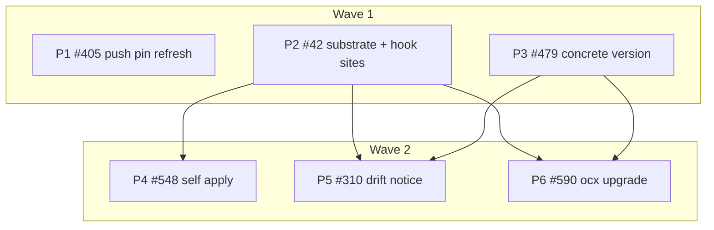

# Plan: Update family — freshness substrate, self auto-update, toolchain drift notice, tag versions, `ocx upgrade`, push pin fix

## Status

- **Plan:** plan_update_family
- **State:** review
- **Tier:** high
- **Tier-grammar:** 5
- **Active phase:** 3 — landing
- **Step:** integration gate green (`task verify` full at a8c4a8b4c); fixups await autosquash
- **Feature branch:** `goat` (worktree `/home/mherwig/dev/ocx-sion`); one squashed commit per issue
- **Last update:** 2026-10-06 (all six pipelines merged; integration review fixed; full verify green)
- **Next:** /hex-finalize

---

## Overview

**Date:** 2026-10-05 · **Issues:** [ocx-sh/ocx#405](https://github.com/ocx-sh/ocx/issues/405),
[#42](https://github.com/ocx-sh/ocx/issues/42), [#479](https://github.com/ocx-sh/ocx/issues/479),
[#548](https://github.com/ocx-sh/ocx/issues/548), [#310](https://github.com/ocx-sh/ocx/issues/310),
[#590](https://github.com/ocx-sh/ocx/issues/590)
**Binding decisions:** [#42 decision comment](https://github.com/ocx-sh/ocx/issues/42#issuecomment-6001699720) (settings
shape, env vars, sequencing; all additive) and the owner rulings recorded in § Decisions.
**Research:** [`research_update_upgrade_ux.md`](./research_update_upgrade_ux.md)

**Classification.** Scope medium (six issues, ~6 pipelines, 1–2 weeks of agent work). Reversibility **two-way /
one-way (medium)**: new config keys, env vars, report fields and one CLI verb are interface additions. Nothing
breaks — pre-1.0, additive, changelog line = commit subject. Tier `high` (new subcommand, new config surface).
Overlays: `architect=inline` (decisions settled by the owner on #42), `research=1`, `adversary=off`.

**Model routing** (project CLAUDE.md model policy). Builders: `opus` for every implementation step — each touches
config precedence, OCI index reads, async probes or exit-code semantics. Testers and doc writers: `sonnet`.
Reviewers: `opus`. A step that fails twice on its model escalates per the policy.

## Objective

1. `ocx package push` never leaves a stale local tag→digest pin (#405).
2. One shared settings vocabulary and one shared background-check gate for every "is there something newer?" check,
   reused from `[managed]` (#42).
3. `ocx update` names the concrete version an advisory tag resolves to, before and after (#479).
4. `[update] self = "apply"` installs a newer ocx automatically once the user's command finishes (#548).
5. A throttled notice tells the user when an advisory tag in their toolchain has moved past the lock (#310).
6. `ocx upgrade` moves the advisory tags themselves in `ocx.toml`; never automatic (#590).

## Scope

### In scope

The six issues above, as specified by the contracts below, including docs, acceptance tests and rule updates.

### Out of scope

- The remaining #42 items not decided on the comment: auto-refresh of cached tags (problem 2), negative caching of
  absent tags (problem 4), and replacing the self-check `list_tags` with a pinned-tag digest probe. They move to one
  follow-up issue, opened before the #42 commit lands with `Closes #42`.
- A Renovate datasource or `ocx.toml` manager. Renovate's `docker` datasource already resolves OCX tags; a docs
  snippet is a follow-up (research rec. 2).
- `OCX_NO_CONFIG_REFRESH` and the managed tick's behaviour. Only its gate helper and interval parser are shared.
- A minimum-ocx-version field in `ocx.toml`.
- `ocx update --check` output: already emits the would-move list in plain and JSON (`command/update.rs:114-126`,
  pinned by `test_update_report.py:147-235`). #310's second bullet is done; only the notice remains.

## Decisions

| ID | Decision | Rationale |
|---|---|---|
| D-1 | `RefreshPolicy` and `parse_interval` move to a new `ocx_config::refresh` module, shared by `[managed]` and `[update]`. Old paths deleted, no re-export. | Owner ruling (shared struct). CLAUDE.md: no compat shims for internal code. |
| D-2 | `[update]` is a personal setting. It is read from the local `config.toml` tiers only (system, user, `$OCX_HOME`, `OCX_CONFIG`, `--config`). The **managed** tier ignores `[update]` entirely (`fold_managed_tier` drops it, debug log only). In `ocx.toml` it is refused by name (a named arm in `RawProjectConfig`, like `[shell]`); **never add an `update` field to `ProjectConfig`.** Not a system-lockable section. | Owner ruling 2026-10-05: personal preference, CI never runs the checks, so a fleet has no need to push it. This also removes any way for a managed-config publisher or a cloned repository to switch on binary replacement. `ProjectConfig` already has `deny_unknown_fields` (`ocx_project/src/config.rs:93,:213`); the named arm only gives a better message. |
| D-3 | **`[update]` never fails a command.** An invalid or unknown value anywhere (a local `config.toml`, `OCX_SELF_UPDATE`, `OCX_TOOLCHAIN_UPDATE`, `OCX_UPDATE_CHECK_INTERVAL`) is ignored and the next tier or the default applies. A file value prints one warning naming the key and file; an env value logs at debug (today's behaviour). `toolchain = "apply"` is treated as `notify` with one warning. The shared `RefreshPolicy` deserializes leniently: an unknown variant becomes "not set" with one warning instead of a parse error, so a value added by a later ocx never breaks an older one, for `[managed] refresh` as well. | Owner ruling 2026-10-05: no new setting may break any host. Config ignores unknown keys by design (`ocx_config/src/lib.rs:65`); an unknown *value* of an enum key was the remaining hole. `test_malformed_interval_env_falls_back_to_default` already pins exit 0 for the env var. |
| D-4 | Throttle state stays per key under `state/update-check/`. Self keeps its identifier key. The toolchain marker is keyed by the existing 16-hex `name_for_path` of the canonical project dir (the same derivation as `state/projects/<key>/`), i.e. `state/update-check/toolchain/<key>`; the global toolchain uses the fixed name `global`. One shared interval. | A per-identifier marker would let project A's clean probe suppress project B's drift. A path slug is lossy and can exceed NAME_MAX, and `state_store.rs:20-21` forbids a second project-key derivation. A per-binding `interval` split is a later additive key (`self_interval` / `toolchain_interval`). |
| D-5 | Self-apply runs **after** the user's command completes (on `Ok` and on `Err`) and never changes its exit code. It installs on the `Context` manager that carries `with_auto_verify` (`context.rs:395`), so trust policy applies to the unattended install. The new binary takes effect on the next run, without a re-exec. The throttle is touched before the outcome (today's posture), so a failed apply is not retried within the interval. | The owner was told "after a command has finished, never in the middle of one". Rustup's model. No retry storm. |
| D-6 | The toolchain drift check compares platform **leaf** digests (the lock's `LockedTool.platforms`) against a live read through `index().remote_view()` (ReadOnly, cannot move a pin). It never runs `resolve_lock`. | The lock pins leaves, not the index digest (`resolve.rs:359-367`). A full re-resolve per check is too heavy. |
| D-7 | The drift check runs at the same site as the existing checks (`app.rs:164-169`, before the command, under `!in_seam()`), never from the per-prompt hook. Overall deadline: 5 s. The **project** toolchain is probed only when `ocx_project::consent::evaluate` reports it consented (the predicate the per-prompt hook uses); the global toolchain needs no gate. | The `--reconcile` fast path is stat-only and discards stderr (`activate.rs:83`, `:208-215`). Without the consent gate, a freshly cloned repository's `ocx.lock` could make every ocx command contact arbitrary registry hosts (the SSRF guard covers only index-root pointers, `ocx_oci/src/ssrf.rs:4-6`). |
| D-8 | `ocx upgrade` stays within the current major at the current precision (`3.28` → `3.29`). `--major` crosses (`3` → `4`). The report always lists the newest tag beyond the major as information. Prerelease, build-suffixed, `latest`, non-version and digest-pinned bindings are skipped with a reason. | proto `--latest`, cargo `--incompatible`, Renovate `disableMajor` (research). Owner ruling OQ-2 → (a), 2026-10-05. |
| D-9 | #405 refreshes exactly the tags the push wrote (primary + `cascade_tags` + `aliases_written`, never `__ocx.keep.*`) right after the upload, before the sign/SBOM band, through `index_common::refresh_packages`. It is best-effort and never fails the push. | Invariant 2 of `subsystem-oci.md`: only what the user named moves. `--sbom` then attests the fresh digest. |
| D-10 | The version lookup (#479) is a pure candidate pick from cascade algebra (`cascade::decompose_targets`) plus a bounded leaf-digest probe. It lives in `ocx_package` (allowed edge `ocx_package → ocx_index`). Nothing is added to `ocx.lock`. | Reuses publisher algebra. Leaf comparison handles per-platform cascade blocking. The lock is an interface (V3). |

## Component contracts

### P2 — #42 substrate (contract-carrying pipeline)

- **C-001** `crates/ocx_config/src/refresh.rs` (new, `pub mod refresh;`):
  - `pub enum RefreshPolicy { Apply, Notify, Manual }`, moved, with `serde(rename_all = "snake_case")`, `Display` and
    `JsonSchema`. Doc text becomes neutral (not `[managed]`-specific).
  - `pub fn parse_interval(value: &str) -> Result<Duration, IntervalError>`, grammar unchanged: `\d+[smhd]?`, bare =
    seconds, `"0"` = `Duration::ZERO`, saturating, rejects unknown suffix and digit overflow.
  - `pub struct IntervalError { value: String }`, `thiserror`, message `interval '<v>' is not a valid duration`.
  - `pub const DEFAULT_INTERVAL: &str = "1d"`. The 24h `DEFAULT_THROTTLE` in `tasks/update_check.rs:13` derives from it.
  - `ManagedConfigError::InvalidInterval` wraps `IntervalError`. The user-visible managed message stays byte-identical
    (`managed config interval '<v>' is not a valid duration`).
  - Every caller listed in the discover report moves to the new path in the same commit: `tasks/managed_config.rs`,
    `app/managed_config_check.rs`, `command/config_update.rs:54`, `ocx_setup/src/lib.rs:553`, `ocx_setup/src/rc_block.rs`
    (tests). `IntervalError` gets a `downcast_arm!` in `ocx_cli/src/exit/ocx_config.rs` (exit 78) for the existing `[managed]`
    path only; `[update]` never raises it (D-3).
- **C-002** `Config.update: Option<UpdateConfig>`, with
  `UpdateConfig { #[serde(rename = "self")] self_policy: Option<RefreshPolicy>, toolchain: Option<RefreshPolicy>, interval: Option<String> }`:
  - Field-wise nearest-wins merge over the local tiers, wired into `Config::merge` after `managed`.
  - `fold_managed_tier` drops `update` from a managed payload (D-2), with a debug log.
  - `RefreshPolicy` gets a lenient `Deserialize` (unknown variant → not set, one warning; D-3), with a unit test for
    both `[update]` and `[managed] refresh`.
  - No `deny_unknown_fields`.
  - `retain_system_locked_sections` drops it (`*update = None`, not lockable).
  - Config schema golden regenerated (hub file).
- **C-003** `RawProjectConfig` (`crates/ocx_project/src/config.rs`) gets a named refusal arm for `[update]`, like `[shell]`
  (`:248-251`). An `ocx.toml` carrying `[update]` fails the parse with the existing `ocx.toml` parse-error exit code and a
  message that says `[update]` belongs in `config.toml`. `fold_project_tier` also strips `update` as defense-in-depth
  (it has no production caller today), with a unit test.
- **C-004** `pub struct ResolvedUpdatePolicy { pub self_policy: RefreshPolicy, pub toolchain: RefreshPolicy, pub interval: Duration }`,
  produced by one resolver in `ocx_config`:
  - Precedence per key: env (`OCX_SELF_UPDATE`, `OCX_TOOLCHAIN_UPDATE`, `OCX_UPDATE_CHECK_INTERVAL`), then
    `Config.update`, then defaults (`Notify`, `Notify`, `1d`).
  - Per D-3 the resolver has **no error path**: an invalid file value warns once and falls through, an invalid env
    value logs at debug and falls through.
  - `toolchain` is never `Apply` after resolution.
  - **Where:** exposed on `Context` as `ctx.update_policy() -> &ResolvedUpdatePolicy`
    (`crates/ocx_cli/src/app/context.rs`), resolved lazily, once per invocation. Warnings are printed only by commands
    that actually run a check, so `ocx config …` and `ocx version` stay quiet.
- **C-005** Typed keys `OCX_NO_UPDATE_CHECK`, `OCX_UPDATE_CHECK_INTERVAL`, `OCX_SELF_UPDATE`, `OCX_TOOLCHAIN_UPDATE` are
  added to `ocx_config::env::keys` and read through them. Rule per key:
  - `OCX_NO_UPDATE_CHECK` follows the ambient kill-switch pattern (`test_exec_forwarding.py:441-467`): it reaches a
    `--clean` child.
  - `apply_ocx_config` never adds `OCX_SELF_UPDATE`, `OCX_TOOLCHAIN_UPDATE` or `OCX_UPDATE_CHECK_INTERVAL` to a
    child's env (the `OCX_LAZY_MODE` "not forwarded" pattern, `env.rs:91-93`).
  - Tests: a published package env declaring `OCX_SELF_UPDATE=apply` is dropped from the resolved env
    (`is_reserved_ocx_key`, `ocx_util/src/env.rs:198-202`), and `ocx.toml` `[env] OCX_SELF_UPDATE = …` is refused.
- **C-006** One gate helper in `crates/ocx_cli/src/app/` (e.g. `background_check.rs`):
  - Order: kill switch → `is_ci()` → offline → stderr not a TTY.
  - It returns the skip reason, used for debug logging.
  - Used by the self check (kill switch `OCX_NO_UPDATE_CHECK`), the managed tick (`OCX_NO_CONFIG_REFRESH`, unchanged)
    and the toolchain check (`OCX_NO_UPDATE_CHECK`).
  - `self_policy == Manual` skips the probe entirely, with no state-file touch.
- **C-007** `fn should_check_toolchain_drift(command: &Command) -> bool` in `app.rs`:
  - The `should_check_for_update` skip set, plus `Update`, `Lock`, `Add`, `Remove`, `Init`.
  - It is an exhaustive match, with canary unit tests beside `should_check_for_update_*`.
- **C-008** Hook sites in `app.rs`, wired and shipped as no-ops so P4 and P5 never edit `app.rs`:
  - `check_for_update(&ctx) -> Option<PackageRef>` returns the identifier to apply when the posture is `Apply` and an
    update is available. In P2 it always returns `None`, and `Apply` behaves as `Notify`.
  - After `command.execute` returns, **on both `Ok` and `Err`**, `update_check::apply_pending(handle, id)` runs if
    `Some`. The command's original result is returned unchanged. If `Context` is consumed by `execute`, capture what
    apply needs beforehand: the `Context` manager clone that carries `with_auto_verify` (`context.rs:395`), never a
    freshly built manager.
  - `toolchain_drift_check::check_for_toolchain_drift(&ctx)` is called after the managed tick, under `!in_seam()`,
    behind C-007 and C-006. P2 creates `app/toolchain_drift_check.rs` (plus its `mod` line) with a body that returns
    immediately.

### P1 — #405 push pin refresh

- **C-010** Refresh the pushed tags (per D-9):
  - In `command/package_push.rs`, after a successful upload and before the sign/SBOM band, the local index entries for
    exactly the pushed tags are refreshed from the registry. These are the primary tag, `outcome.cascade_tags` and
    `outcome.aliases_written`, excluding `__ocx.keep.*`.
  - The refresh reads the **canonical** registry (the write's addressing, `subsystem-oci.md` invariant 5). If the
    available index constructor only reads mirrored, the builder must stop and report back rather than accept it.
  - A failed refresh never changes the push exit code. It logs at debug, or warn at most, and keeps both log-count
    guards (`package_push.rs` sanitize guard, `index_common.rs` count guard) valid.
  - Under `--frozen` it is skipped silently (owner ruling OQ-1 → a); acceptance case added to S-012.
  - Index-owned or no-op namespaces stay quiet.

### P3 — #479 concrete version of an advisory tag

- **C-020** `crates/ocx_package/src/concrete_version.rs` (new):
  - `pub fn candidate_versions(advisory: &str, tags: &[String]) -> Vec<Version>`:
    - It keeps version tags of the advisory's variant whose `decompose_targets(v).targets` contains the advisory (or
      `latest_eligible` when the advisory is `latest`).
    - It keeps only patch-precision tags (`has_patch()`), and excludes prerelease and build-suffixed tags. Without the
      patch filter, `Version` ordering puts `3.28` above `3.28.4` (`version.rs:326-347`) and the lookup would report the
      rolling minor.
    - It sorts in descending `Version` order.
    - Unit case: tags `3`, `3.28`, `3.28.4`, `3.28.3` → `candidate_versions("3") == [3.28.4, 3.28.3]`.
  - `pub async fn resolve_concrete_version(index: &Index, advisory: &PackageRef, leaves: &BTreeMap<String, Digest>, max_probes: usize) -> Result<Option<Version>>`:
    - It calls `index.read_only_view()` itself and always uses `IndexOperation::Query`, so no caller can reach a path
      that writes the local index.
    - It probes candidates in order via `Index::fetch_candidates`.
    - It returns the first one whose leaf digest matches on every platform present in `leaves`.
    - It stops after `max_probes` (8) and returns `None` when nothing matched.
    - An advisory that already is a full version returns itself if its leaves match.
- **C-021** `ocx update` report fields:
  - `BindingChange` gains `from_version: Option<String>` and `to_version: Option<String>`. `BindingState` gains
    `version: Option<String>`.
  - JSON is additive. The plain table shows a version cell. The reports schema golden is regenerated (hub).
  - The values come from `context.update_index()`, filled after `UpdateReport::diff` and before the `--check` emit.
  - Per row: `leaves = {row.platform: from|to digest}`. Lookups are deduped on (repository, tag, digest), so one binding
    on several platforms does not repeat probes. Per-platform cascade blocking therefore gives per-row versions.
  - The lookup fans out with bounded concurrency (≤ 8), with results in stable order.
  - Any miss, offline run, `--frozen` run, error or digest-pinned binding gives `null`, with no warning. The exit code
    never changes.
- **C-022** `ocx_package::Version` ordering and `variant_names` are reused as they are. No change to `ocx.lock`.

### P4 — #548 self auto-apply

- **C-030** Extract `PackageManager::self_apply(latest: PackageRef) -> Result<SelfUpdateResult, Error>` from the
  `UpdateAvailable` arm of `self_update()`: `install_all`, then `hand_off_setup`, then the verdict.
  - `self_update()` calls it.
  - The caller passes the hand-off child's stdio policy. `ocx self update` keeps today's stdout→stderr redirect. The
    background apply sets the child's stdin and stdout to `Stdio::null()` (`update_check.rs:441-454` inherits stdin
    today).
  - Existing `test_self_update.py` cases pass unmodified (refactor hat, its own step).
- **C-031** `check_for_update` returns `Some(id)` when `self_policy == Apply` and the probe reports `UpdateAvailable`.
  `apply_pending` then calls `self_apply`, and stderr gets exactly one line:
  - on `Installed { handoff: None }`: `ocx <version> installed; it takes effect on the next run.`
  - on `Installed { handoff: Some(_) }`: `ocx <version> installed; run \`ocx self setup\` to finish setup.`
  - on an error or `Pulled`: `Automatic ocx update to <version> failed: <reason>. Run \`ocx self update\` to retry.`
    `<reason>` is rendered through `sanitize_error_chain` (`api/data.rs:84`), with one unit test feeding an ESC/bidi
    string.
  - `Skipped(Bootstrap)` (an ocx not installed by ocx) is silent at debug level.
  - `Notify` keeps today's notice verbatim. `Manual` never probes (C-006).
  - The advisory wording (`advisory_for` / `emit_advisory`) moves from `command/self_group/update.rs` into the existing
    `app/update_check.rs`, and `self update` calls it from there. No new `app/` file, so no `mod` line in `app.rs`.
- **C-032** Apply never runs:
  - on a command in the `should_check_for_update` skip list;
  - under CI, offline, a non-TTY stderr, the kill switch, or `in_seam()`.
  - The user command's stdout is untouched.

### P5 — #310 toolchain drift notice

- **C-040** Fill `check_for_toolchain_drift(ctx)`. The probe logic lives in a library crate that `crate_map.toml`
  allows; the CLI module only gates and prints.
  - It runs only when `toolchain != Manual` and `--frozen` is not set.
  - **Consent gate (D-7):** the project toolchain is probed only when `ocx_project::consent::evaluate` reports the
    project consented. An unconsented project means no probe and no state file.
  - **Toolchains covered:** the project toolchain (`resolve_project_paths`, then `ProjectConfig::from_path` and
    `ProjectLock::from_path`), and the global toolchain (`$OCX_HOME/ocx.toml` + lock) when present. The two are
    deduped when `--global` already selects it.
  - **Silent cases:** no project, a missing lock, a stale lock (`!lock.is_current(&config)`), an error or the deadline.
    Errors and deadline hits log at debug.
  - **Throttle:** one marker per project key (D-4: `name_for_path`, `global` for the global toolchain). It is touched
    on every probe, success or failure, and never on a throttle hit. Unit test with a project path longer than 300
    characters.
  - **Probe:** for each binding with a tag (digest-pinned bindings are skipped), read the platform leaf map through
    `index().remote_view()` and compare it with `LockedTool.platforms` on the platforms the lock holds. Any difference
    is drift. The version lookup (C-020) is passed the same `remote_view()`.
  - **No local-index writes:** `$OCX_HOME/index` is byte-identical before and after a drift notice (asserted in the
    acceptance test).
  - **Limits:** bounded concurrency (≤ 8) and an overall deadline of 5 s.
- **C-041** Notice text, one stderr line per toolchain file with drift:
  `Newer content is available for <name> (<tag> → <version>)[, …] in <path>. Run \`ocx update\` to advance the lock.`
  - The global toolchain names `ocx --global update`.
  - `<version>` comes from C-020 when resolvable. Otherwise `(<tag>)` alone.
  - `<name>`, `<tag>` and `<path>` are rendered through `sanitize_for_terminal` (`api/data.rs:99`), with one unit test
    feeding an ESC/bidi string.

### P6 — #590 `ocx upgrade`

- **C-050** `ocx upgrade [NAMES...] [-g GROUP]... [--check] [--major] [-v|--verbose]`:
  - Name and group scoping is shared with `ocx update` (`select_touched`, made `pub(crate)`).
  - The help text says `update` moves the lock to where a tag points now, and `upgrade` moves the tag itself.
- **C-051** `crates/ocx_package/src/upgrade_target.rs` (new):
  - `pub fn upgrade_target(current: &Version, tags: &[String], allow_major: bool) -> Option<Version>` picks the
    newest tag strictly greater than `current`.
  - The candidate must have the same variant and the same precision (major / minor / patch), no prerelease and no
    build suffix, and stay within `current.major()` unless `allow_major`.
  - `pub fn newest_beyond_major(current: &Version, tags: &[String]) -> Option<Version>`: same filters, any major.
- **C-052** Skip reasons (a report row, never an error):
  - `digest_pinned`
  - `latest`
  - `not_a_version`
  - `prerelease_or_build`
  - `up_to_date`
- **C-053** Write path:
  - `retag_binding_in_memory` is new in `ocx_project/src/mutate.rs` and exported. It runs through `MutationGuard`, so
    comments and formatting survive (`document.rs::sync_bindings`).
  - Re-locking uses `resolve_lock_touched` for the retagged bindings.
  - `commit` follows, then the consent stamp (an eighth writer in
    `project_context.rs::a029_exactly_seven_commands_write_a_consent_stamp`, renamed to match), then
    `materialize_lock`.
  - `--check` writes nothing, exits 65 if any within-policy upgrade exists, else 0.
- **C-054** Guards mirror `update`:
  - a missing predecessor lock gives 78 before any resolve;
  - a drifted `ocx.toml` gives 65;
  - an unknown name or group gives 64;
  - `--frozen` or `--offline` gives 81.
- **C-055** `UpgradeReport { upgrades: [{name, group, from_tag, to_tag}], skipped: [{name, group, tag, reason}], beyond_major: [{name, group, tag, newest_tag}], lock: UpdateReport }`:
  - Plain and JSON output. It embeds P3's `UpdateReport`, versions included.
  - It is registered in `ocx_schema/src/reports.rs`, and the reports golden is regenerated (hub).
- **C-056** `Command::Upgrade` is added to the exhaustive matches: `canonical_command_name` (`"upgrade"`) and
  `should_check_toolchain_drift` (skipped, like `Update`). It is **not** added to the `!matches!` skip lists
  `should_check_for_update` / `should_check_managed_config_refresh`, so it keeps the self check and managed tick, the
  same as `Update`.

## User-experience scenarios

| ID | Action | Expected outcome | Error / edge cases |
|---|---|---|---|
| S-001 | `[update] interval = "6h"` in user `config.toml` | The self check fires at most every 6 h | — |
| S-002 | `OCX_UPDATE_CHECK_INTERVAL=1d` / `3600` / `0` / `bogus` | 1 day / 3600 s / always / default 1 d; always exit 0 | — |
| S-003 | `[update] self = "manual"` | No probe, no state file | `OCX_SELF_UPDATE=notify` overrides it, and the probe runs (S-008) |
| S-004 | `[update] self = "apply"` inside `ocx.toml` | `ocx.toml` parse error (existing exit code, as for any unknown key) whose message says `[update]` belongs in `config.toml` | — |
| S-005 | `[update] toolchain = "apply"` in `config.toml` | Exit 0; one warning naming `[update].toolchain`; behaves as `notify` | `OCX_TOOLCHAIN_UPDATE=apply` → debug log, `notify` |
| S-006 | `[update] interval = "bogus"` or `self = "someday"` in `config.toml` | Exit 0; one warning naming the key; the default applies | — |
| S-006b | A managed payload carrying `[update] self = "apply"`; and one carrying `[managed]`-style `refresh = "someday"` | `[update]` ignored (no apply, exit 0); the unknown `refresh` value warns once and the default applies | — |
| S-006c | `ocx package exec --clean` child; a package env and an `ocx.toml` `[env]` declaring `OCX_SELF_UPDATE` | Child sees `OCX_NO_UPDATE_CHECK` (when set) and none of the other three; package key dropped; `ocx.toml` key refused | — |
| S-007 | `OCX_NO_UPDATE_CHECK=1` | No self probe and no toolchain probe; no state files | — |
| S-008 | Config `self = "manual"` + `OCX_SELF_UPDATE=notify` | The probe runs (env beats config) | — |
| S-009 | Existing managed-config tick | Unchanged behaviour; `OCX_NO_CONFIG_REFRESH` unchanged | — |
| S-010 | Push A to `repo:t`, resolve, push B to `repo:t`, resolve by tag | The second resolve returns B | — |
| S-011 | Same, with `--cascade` | The cascade tags (`repo:1`) resolve to B too | — |
| S-012 | Refresh fails after a successful upload | Push exit 0; no ERROR line | Under `--frozen` the refresh is skipped silently |
| S-020 | `cmake:3` moved 3.28.3 → 3.28.4; `ocx --format json update --check` | `from_version` 3.28.3, `to_version` 3.28.4; exit 65 | — |
| S-021 | Same under `--offline`, or with a digest-pinned binding | Version fields are `null`; exit code unchanged | — |
| S-022 | Variant track `debug-3` | Only `debug-3.x` candidates are considered | — |
| S-022b | Two platforms; cascade blocking leaves one platform on an older version | Per-row versions differ by platform | — |
| S-030 | `OCX_SELF_UPDATE=apply`, a newer ocx published, `ocx <cmd>` on a pty | stdout byte-identical to a `notify` control run; exit code unchanged; `current` points to the new version; stderr has exactly one ocx-authored apply line | — |
| S-031 | Same with `notify` (control) | `current` unchanged; today's notice printed | — |
| S-032 | Apply fails | Command exit code unchanged; one `failed … Run \`ocx self update\`` line | — |
| S-033 | Apply with an ocx not installed by ocx (no `current`) | No install; silent | — |
| S-034 | `OCX_SELF_UPDATE=apply` + a newer ocx, run (a) without a pty, (b) with `CI=1`, (c) on a skip-list command | `current` unchanged; no apply line | — |
| S-035 | `OCX_SELF_UPDATE=apply` + a `[[trust.policy]]` for `ocx.sh/ocx/cli` with a wrong identity | Apply refused; `current` unchanged; one `failed` line; command exit code unchanged | — |
| S-040 | The lock pins `cmake:3` and the tag moved; `ocx status` on a pty | One notice line naming cmake and `ocx update` | — |
| S-041 | Second run within the interval | Silent; `OCX_UPDATE_CHECK_INTERVAL=0` makes it fire again | — |
| S-042 | `OCX_TOOLCHAIN_UPDATE=manual` or `OCX_NO_UPDATE_CHECK=1` | Silent; no state file | — |
| S-043 | No drift / stale lock / no project / non-TTY / unconsented project | Silent; no state file for the unconsented project | — |
| S-044 | Global toolchain drifted | The notice names `ocx --global update` | — |
| S-050 | `cmake:3.28` with 3.29 published; `ocx upgrade` | `ocx.toml` reads `cmake:3.29` with comments kept; lock advanced; exit 0 | — |
| S-051 | `cmake:3` with 4.0 published | Nothing upgraded; `beyond_major` lists 4; `--major` gives `cmake:4` | — |
| S-052 | `ocx upgrade --check` with an upgrade available | Exit 65; files byte-identical | — |
| S-053 | Digest-pinned or `latest` binding | Skipped row with a reason; exit 0 | — |
| S-054 | Unknown name / missing lock / `--offline` / edited `ocx.toml` (lock drifted) | 64 / 78 / 81 / 65 | — |

## Parallelization

Pipelines are cut along issue boundaries, which here coincide with contract boundaries: P2 carries every shared
contract (C-001…C-008), including the hook sites P4 and P5 fill. There is **no separate contract-wave commit**, because
the owner wants exactly one commit per issue. P2 *is* the contract wave and lands as the #42 commit.

| Pipeline | Scope | Expected files | Wave | Depends on | Marks | Status |
|---|---|---|---|---|---|---|
| P1 #405 | C-010; S-010–S-012 | `crates/ocx_cli/src/command/package_push.rs`, `crates/ocx_cli/src/command/index_common.rs` (only if a quiet variant is needed), `test/tests/test_package_push.py` | 1 | — | | merged |
| P2 #42 | C-001–C-008; S-001–S-009 (incl. S-006b, S-006c) | `crates/ocx_config/src/{refresh.rs (new),lib.rs,managed.rs,loader.rs,env.rs}`, `crates/ocx_package_manager/src/tasks/{managed_config.rs,update_check.rs}`, `crates/ocx_cli/src/app.rs`, `crates/ocx_cli/src/app/{context.rs,update_check.rs,managed_config_check.rs,background_check.rs (new),toolchain_drift_check.rs (new, no-op)}`, `crates/ocx_project/src/config.rs` (C-003 refusal arm), `test/scoped_rows.toml` (route `test_update_config.py`), `crates/ocx_cli/src/command/config_update.rs`, `crates/ocx_cli/src/exit/ocx_config.rs`, `crates/ocx_setup/src/{lib.rs,rc_block.rs}`, `test/tests/test_update_check_throttle.py`, `test/tests/test_update_config.py` (new), `website/src/docs/reference/{configuration.md,environment.md}`, `website/src/docs/in-depth/configuration.md`, `website/src/docs/user-guide.md`, `.claude/rules/subsystem-cli.md`, `.claude/rules/subsystem-package-manager.md` | 1 | — | review | merged |
| P3 #479 | C-020–C-022; S-020–S-022b | `crates/ocx_package/src/{concrete_version.rs (new),lib.rs}`, `crates/ocx_cli/src/api/data/update.rs`, `crates/ocx_cli/src/command/update.rs`, `test/tests/test_update_report.py`, `website/src/docs/reference/command-line.md` (§ update report) | 1 | — | | merged |
| P4 #548 | C-030–C-032; S-030–S-035 | `crates/ocx_package_manager/src/tasks/update_check.rs`, `crates/ocx_cli/src/app/update_check.rs`, `crates/ocx_cli/src/command/self_group/update.rs`, `test/tests/test_self_update.py` | 2 | P2 | | merged |
| P5 #310 | C-040–C-041; S-040–S-044 | `crates/ocx_cli/src/app/toolchain_drift_check.rs`, `crates/ocx_store/src/file_structure/state_store.rs`, library probe module (new file in the crate `crate_map.toml` allows, e.g. `crates/ocx_package_manager/src/tasks/toolchain_drift.rs` + its `tasks.rs` line + the `lib.rs` re-export), `test/tests/test_toolchain_drift_notice.py` (new), `test/scoped_rows.toml` (route the new module) | 2 | P2, P3 | hard | merged |
| P6 #590 | C-050–C-056; S-050–S-054 | `crates/ocx_package/src/{upgrade_target.rs (new),lib.rs}`, `crates/ocx_project/src/{mutate.rs,lib.rs}`, `crates/ocx_cli/src/command/{upgrade.rs (new),update.rs (select_touched visibility only)}`, `crates/ocx_cli/src/command.rs`, `crates/ocx_cli/src/app.rs` (C-056 match arms), `crates/ocx_cli/src/app/project_context.rs`, `crates/ocx_cli/src/api/data/{upgrade.rs (new)}`, `crates/ocx_cli/src/api/data.rs`, `crates/ocx_schema/src/reports.rs`, `test/tests/test_upgrade.py` (new), `website/src/docs/reference/command-line.md` (§ upgrade + the `update` intro sentence), `.claude/rules/subsystem-cli-commands.md`, `.claude/rules/subsystem-cli.md` | 2 | P2, P3 | | merged |

**Hub files (no pipeline owns them; the orchestrator regenerates them in each pipeline's landing commit):**
`test/SUITE_FLOOR`, `crates/ocx_schema/tests/golden/config.json`, `crates/ocx_schema/tests/golden/reports.json`,
`Cargo.lock`, and `scripts/bazel_gate_proofs.py` (`ACCEPTANCE_MODULE_TARGETS`, +1 for each new acceptance module: P2,
P5, P6). A pipeline may bump these in its own worktree so its scoped verify stays green; the orchestrator recounts them
in the landing commit. A `scripts/**` edit escalates `verify:scoped` to the full gate, so pipelines leave the
`bazel_gate_proofs.py` bump to landing and name it in their report.

**Disjointness check.** Wave 1 (P1, P2, P3) share no file. In wave 2, P4, P5 and P6 share no file: P2 pre-wires
`app.rs` (hook sites and `mod` lines) and the docs, P4 adds no new `app/` file, only P5 touches
`ocx_package_manager/src/lib.rs`, P5 stays out of `ocx_project`, and P6's `app.rs`/`subsystem-cli.md` edits are
ordered after P2. `test/scoped_rows.toml` is edited by P2 and P5, which are serialized (P5 depends on P2).
P3 and P6 share `ocx_package/src/lib.rs`, `command/update.rs` and `command-line.md`, which is why P6 depends on P3.
P5 reads P3's `concrete_version` API for its notice text.

**Critical path:** P2 → P5. Launch on dependency-ready: P4 starts the moment P2 merges, and P5/P6 once both P2 and P3
have merged.
**Shippable after wave 1:** the #405 fix, the `[update]` settings with shared gate and parser, and version fields on
the `ocx update` report.
**Parallel width:** 3 + 3. This is the widest the owner's one-commit-per-issue constraint permits. Pre-stubbing
P4–P6 in a separate contract commit would add a commit outside the per-issue history.

### Pipeline steps

Each step is one fresh agent. Inside a pipeline: Stub → Specify → Implement, serial, one worktree
(`.agents/worktrees/<pipeline-slug>`, branched from the current `goat` tip at launch).

**P1 #405**
1. *Specify* (sonnet tester): a warm-`OCX_HOME` regression test in `test_package_push.py` covering S-010–S-012. It must
   fail red on the current code; record the red run.
2. *Implement* (opus builder): C-010. Verify canonical addressing (stop and report if it cannot be had), keep both
   log-guard counts valid, and turn the test green.

**P2 #42**
1. *Move* (opus builder, refactor hat): C-001. This is a pure move plus `IntervalError` and its exit arm, with every
   caller updated. Existing tests pass unmodified, except the import paths.
2. *Stub + Specify* (opus builder, then sonnet tester): C-002–C-008 signatures, the no-op hook sites and the C-007
   predicate. Unit tests for the C-004 precedence and leniency ladder (red/green per arm), the C-003 strip, the C-007
   canaries, and the new `test_update_config.py` for S-001–S-009, S-006b, S-006c.
   - Rewrite the vacuous `requires_tty` cases in `test_update_check_throttle.py` onto `run_on_a_terminal`, using a
     command that actually reaches the check. Each gate case shows both red and green.
3. *Implement* (opus builder): fill C-002–C-006 until green.
4. *Docs* (sonnet doc writer):
   - `configuration.md`: a new `### [update]` section with per-key blocks shaped like `#### refresh {#keys-managed-refresh}`.
   - `environment.md`: entries for `OCX_SELF_UPDATE` / `OCX_TOOLCHAIN_UPDATE`, the widened `OCX_UPDATE_CHECK_INTERVAL`,
     and `OCX_NO_UPDATE_CHECK` covering the toolchain. Say explicitly that these env vars beat config, unlike
     `OCX_TOOLCHAIN_ACTIVATE`.
   - `in-depth/configuration.md` and `user-guide.md`: fix the inaccurate "does not block the command" claims at
     `user-guide.md:1149` / `environment.md:1004`.
   - The pages describe the final behaviour of `apply` and the drift notice. P4 and P5 land in the same series before
     any release.
   - Update the rule files listed for P2.

**P3 #479**
1. *Stub + Specify* (sonnet tester against opus-written stubs): `concrete_version.rs` signatures; unit tests for
   `candidate_versions` (cascade membership, variants, prerelease and build exclusion, `latest`); acceptance cases
   S-020–S-022 in `test_update_report.py`.
2. *Implement* (opus builder): C-020 and C-021. Docs for the update-report fields in `command-line.md`.

**P4 #548**
1. *Extract* (opus builder, refactor hat): C-030. `test_self_update.py` passes unmodified.
2. *Specify* (sonnet tester): S-030–S-035 on `run_on_a_terminal` with the `__OCX_SELF_IMAGE` seam and
   `_publish_two_versions`, in a test-owned `HOME`. S-031 is the control; S-034 (a) runs without a pty by design.
3. *Implement* (opus builder): C-031 and C-032, plus the advisory hoist.

**P5 #310** (`hard`)
1. *Stub + Specify* (opus builder, then sonnet tester): the throttle accessor in `state_store.rs`; the library probe
   signature; unit tests for leaf comparison, the per-lock marker and the deadline. Acceptance S-040–S-044 in
   `test_toolchain_drift_notice.py`. Move the tag with `index=False` as in `test_update.py:284-352`, use a pty, and
   use `OCX_NO_UPDATE_CHECK`-free control runs. Consent the fixture project explicitly; the unconsented case is S-043.
2. *Implement* (opus builder): C-040 and C-041.

**P6 #590**
1. *Stub + Specify* (opus builder, then sonnet tester): `upgrade_target.rs`, `retag_binding_in_memory`, the
   `Command::Upgrade` skeleton and report types; unit tests for target selection (precision, variant, majors, skip
   reasons). `test_upgrade.py` with `@pytest.mark.smoke` and `@pytest.mark.command("upgrade")`, covering S-050–S-054.
2. *Implement* (opus builder): C-050–C-056.
3. *Docs and rules* (sonnet doc writer): the `command-line.md` upgrade section; the `update` intro sentence (the
   "edit `ocx.toml` to pin a new version" line at `:1876` now points to `ocx upgrade`); `subsystem-cli-commands.md`
   (Command Summary); `subsystem-cli.md` (consent-stamp writer count).

## Landing and verification

- **One commit per issue on `goat`.** Each pipeline lands as **one squashed conventional commit** in topological order:
  P1, P2, P3, then P4 / P5 / P6 in merge order. The commit subject is the release-note line; the body says
  `Closes #N`. The orchestrator regenerates the hub files inside that commit.
- **Per step and per review-fix iteration:** `task verify:scoped --force` in the pipeline worktree. **Builds run one
  at a time host-wide**; edit and test-writing agents fan out freely (31 GB host OOM precedent). Acceptance runs go
  through `task test:parallel --force -- <file>` under the suite `flock`.
- **Per landing commit:** `task verify:mark`, naming the deferral of the full gate in the body (CLAUDE.md escape hatch).
- **Once at the end:** a full `task verify` on the `goat` tip, then one integration review. Its panel is spec and
  quality, plus security (always-on: `crates/ocx_config/**` and `crates/ocx_store/**` are touched), plus one
  cross-model pass. P2 carries the `review` mark: it is reviewed on its own before it lands, because three pipelines
  build on its contracts.

Draft commit subjects:

- P1: `fix(package): \`ocx package push\` refreshes the local index for the tags it wrote, so a moved tag no longer resolves to the old digest`
- P2: `feat(config): an \`[update]\` table sets the ocx and toolchain update-check policy and interval, and \`OCX_UPDATE_CHECK_INTERVAL\` accepts \`6h\` and \`1d\``
- P3: `feat(update): the \`ocx update\` report names the version each advisory tag resolved to before and after`
- P4: `feat(self): \`[update] self = "apply"\` installs a newer ocx automatically once the command finishes`
- P5: `feat(project): ocx tells you when an advisory tag in your toolchain has moved past \`ocx.lock\``
- P6: `feat(cli): \`ocx upgrade\` moves advisory tags in \`ocx.toml\` to the newest series, and \`--major\` crosses a major version`

## Risks

| Risk | Mitigation |
|---|---|
| The probes block the user's command (inline, not detached) | Self probe throttled; drift probe has a 5 s deadline and is throttled per lock; apply runs after the command (D-5) |
| Two shells apply concurrently | `install_all` is digest-addressed and idempotent; the hand-off select is last. No extra lock (YAGNI); revisit on a report |
| A value added by a later ocx breaks older hosts | `RefreshPolicy` deserializes leniently (D-3); `[update]` never fails a command; the managed tier ignores `[update]` |
| Vacuous TTY tests | Every gate test runs on `run_on_a_terminal` and shows red and green on the same fixture (quality-core "Unchecked Green") |
| #405 refresh reads a mirror instead of the canonical registry | C-010 requires canonical addressing or a stop-and-report |
| Unattended install of an unverified binary | Apply runs on the auto-verify-carrying manager (D-5); S-035 proves a trust-policy refusal. No built-in policy exists for `ocx.sh/ocx/cli`, so without a user policy it installs what `ocx self update` would |
| Per-platform cascade blocking maps one advisory tag to different versions | C-020 compares leaves per platform, never index digests |

## Open questions

None. Owner rulings 2026-10-05:
- OQ-1 → (a): under `--frozen`, `ocx package push` skips the post-push index refresh silently (C-010).
- OQ-2 → (a): `ocx upgrade` stays within the current major at the current precision; `--major` crosses (D-8).

## Constitution deviations

| Principle | Deviation | Justification |
|---|---|---|
| Offline-first: the local index never auto-updates; a pin moves only under a command naming it (`subsystem-oci.md` invariant 2) | P4's background apply runs `install_all` on the ambient index, which writes the `ocx.sh/ocx/cli` tag pin without the user naming the package on that command | `apply` is an explicit opt-in to exactly what `ocx self update` does; the write is identical to that command's. Only `ocx.sh/ocx/cli` is touched. |

Everything else holds: P1 refreshes only the tags the user just pushed; P3 and P5 read without writing
(`read_only_view` / `remote_view`, asserted by the byte-identical-index check in P5); P5 never moves a pin.

## Schedule log
- 2026-10-05T20:43:09Z · launched P1, P2, P3 @ 03667131e · ready: — · blocked: P4 (P2), P5 (P2, P3), P6 (P2, P3)
- 2026-10-05T21:35:00Z · merged P1 as 922e19cab (+ chore 8b34e8877: module count drift from d0667f02b) · ready: — · blocked: P4 (P2), P5 (P2, P3), P6 (P2, P3)
- 2026-10-05T21:45:00Z · merged P3 as e7c39999c · ready: — · blocked: P4 (P2), P5 (P2), P6 (P2)
- 2026-10-05T22:30:00Z · merged P2 as a972418b9 (after review fix pass) · ready: P4, P5, P6
- 2026-10-05T22:35:00Z · launched P4, P5, P6 @ a972418b9 · ready: — · blocked: —
- 2026-10-06T00:30:00Z · merged P4 as 94698ac26 · merged P5 as 4cc900340 (fixture fix: `ocx lock` stamps consent) · ready: — · active: P6
- 2026-10-06T00:55:00Z · merged P6 as aa87f2407 · all pipelines merged · integration: fixture fix (make_package index=False vs #405 push refresh) + review running
- 2026-10-06T02:10:00Z · integration: fixture fix (#405), review fix pass (#310, #548), lint/ratchet/census fixups, 4 chores for pre-existing reds (d0667f02b, xwin cache) · `task verify` full green at a8c4a8b4c
