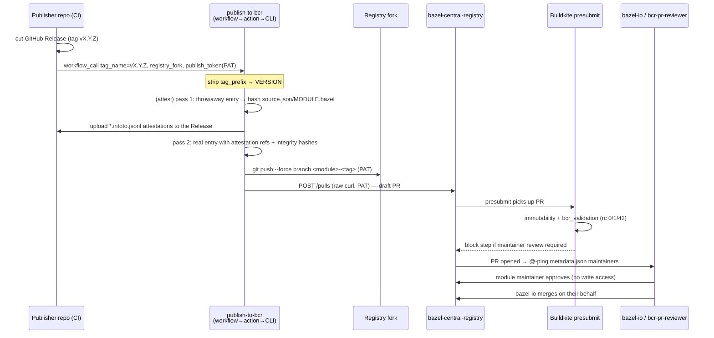

# Research: `publish-to-bcr` Anatomy — How BCR Solves Which Problem

<!--
Long-lived planning reference. Factual reconstruction of the Bazel Central
Registry publish flow at the pinned commits below. No OCX opinions in this
file — the transfer/verdict layer lives in
research_publish_to_bcr_transfer.md. Write for a reader with zero session
context.
-->

## What this document is

A problem→solution catalogue of the **Bazel `publish-to-bcr`** publish pipeline
and the **Bazel Central Registry (BCR)** validation/merge machinery behind it.
It is the reference OCX's `ocx package announce` lane
([`adr_announce_publisher_surface.md`](./adr_announce_publisher_surface.md), index
ADR-6) is trying to match on ergonomics while diverging on transport. This file
describes only what BCR does and why; the "what we take" mapping is a separate
artifact.

**Date:** 2026-07-18

**Analysed commits (cite as `owner/repo@short-sha:path#line`):**

| Repo | Commit | What was read |
|---|---|---|
| `bazel-contrib/publish-to-bcr` | `ad6879fd` (`ad6879fd015a01c3e3b1b318fe3c061f928ac2fb`) | reusable workflow, composite action, TypeScript domain (`src/`), templates, e2e |
| `bazelbuild/bazel-central-registry` | `fdcdc7f1` (`fdcdc7f12769f345f8f55d914065481ad317c501`) | `tools/`, `docs/`, `.github/`, `modules/platforms/` (sparse) |
| `bazelbuild/continuous-integration` | `f613e43a` (`f613e43a2d19712927a96d694b30da638bf339f5`) | `buildkite/bazel-central-registry/` presubmit scripts (sparse) |

Two pinned action SHAs appear inline in the flow and matter for the analysis:
the composite action self-reference `bb52f0cc…` inside `publish.yaml`, and the
BCR bot action `bazelbuild/continuous-integration/actions/bcr-pr-reviewer@3d8663cb…`.

**Sources:** the four verbatim code-reader reports captured this session
(orchestration surface, TypeScript domain internals, publisher-facing contract,
registry side) plus the web-research report `scratchpad/bcr_report.md` (history,
App→workflow migration, pain-point issue table). Issue numbers below are from the
web report; code refs are from the checkouts.

**Two delivery mechanisms coexist in the repo — one is being retired.** The
**legacy GitHub App** (Cloud Functions webhook service under `deployment/` and
`src/application/release-event-handler.ts`, e2e under `e2e/github-webhook/`) is
sunsetting after 2026-06-30. The **current** mechanism is a reusable GitHub
Actions workflow (`.github/workflows/publish.yaml`) wrapping a composite action
(`action.yaml`) wrapping a Node CLI (`dist/cli/index.js`). This document tracks
the **current** mechanism. The App's domain code is cited only where the CLI path
reuses the same `src/domain/**` logic; App-only wiring is flagged as such.

---

## System map

Four moving parts and one bot:

1. **Publisher repo** — a Bazel ruleset repo. Holds a `.bcr/` template folder and
   a thin `.github/workflows/publish.yaml` caller. Cuts a GitHub Release.
2. **`publish-to-bcr`** — the reusable workflow + composite action + CLI. Runs in
   the *publisher's own* CI, authenticated by the publisher's PAT. Renders the BCR
   entry, pushes a branch to the publisher's registry fork, opens the PR.
3. **Registry fork** — a fork of `bazelbuild/bazel-central-registry` owned by the
   publisher (or their org). The entry branch is force-pushed here.
4. **BCR** (`bazelbuild/bazel-central-registry`) — the canonical registry the PR
   targets. Add-only, immutable published versions.
5. **Buildkite presubmit + `bazel-io` bot** — BCR's CI (`bcr_presubmit.py` on
   Buildkite) validates the PR; the `bcr-pr-reviewer` GitHub Action
   (`review_prs`/`handle_comment`/…) pings maintainers, dismisses stale approvals,
   and merges on the maintainer's behalf.



The **recurring** publisher cost is "push a tag." Everything else in the loop is
automated. The full friction is front-loaded into one-time day-1 setup
(credentials, templates, fork) — see the Transfer artifact for the day-1/day-N
split we must beat.

---

## Problem → Solution catalogue

### Trigger and version derivation

**Problem.** Turn "a release happened" into "a specific module version to
publish," without the tool inventing the version.

**Solution.** The publisher wires a thin caller workflow with `on: workflow_call`
(chained after a release-automation workflow that passes `tag_name`) and/or
`workflow_dispatch` (manual retry) — README recommends offering both. The
reusable workflow strips a configurable `tag_prefix` (default `"v"`) from
`tag_name` to compute `VERSION`
(`bazel-contrib/publish-to-bcr@ad6879fd:.github/workflows/publish.yaml#200-207`).

**Why that shape.** Releases are the natural human-driven trigger; the tag *is*
the version declaration, so nothing is guessed. `tag_prefix` exists at the
**workflow** layer only — it is the knob multi-module repos use to derive
per-module versions from divergent tags (e.g. `bazel-v1.2.3` → `1.2.3`).

**Sharp edge.** `tag_prefix`/`tagPrefix` does **not** exist in the CLI domain code
at all (grep of `src/` is empty). The CLI's `RulesetRepository.getVersionFromTag()`
(`…@ad6879fd:src/domain/ruleset-repository.ts#225-230`) hard-strips a single
leading `v` and passes everything else through unchanged. So prefix flexibility is
a workflow-YAML feature, not a domain feature — a divergent-tag multi-module repo
leans entirely on GHA expression plumbing (see *Multi-module repos*).

### Publisher contract surface — the `.bcr/` templates

**Problem.** A BCR entry needs a fixed file shape (`metadata.json`, `source.json`,
`presubmit.yml`, optional `config.yml`), but the tool cannot invent business facts
— homepage, maintainers, archive-URL layout. Those must come from the publisher.

**Solution.** Ship stencils the publisher copies into their repo root as `.bcr/`
and hand-edits once (`…@ad6879fd:templates/`):

| File | Publisher edits | Tool-managed (leave alone) |
|---|---|---|
| `metadata.template.json` | `homepage`, `maintainers[].{name,email,github}`, `repository` OWNER/REPO | `versions[]` (must stay `[]`), `yanked_versions{}` |
| `source.template.json` | `strip_prefix`, `url` (must match real archive layout) | `integrity` (auto-computed) |
| `presubmit.yml` | `module_path` → real bzlmod test workspace, `platform`/`bazel` matrix | — |
| `config.yml` (optional) | only for `fixedReleaser` or non-default `moduleRoots` | — |

Placeholders `{OWNER}` `{REPO}` `{VERSION}` `{TAG}` are substituted at release
time by naive `replaceAll('{KEY}', val)`
(`…@ad6879fd:src/domain/substitution.ts#1-18`), applied only to `docs_url`/`url`/
`strip_prefix` in the source template
(`…@ad6879fd:src/domain/source-template.ts#62-75`).

**Why that shape.** Business facts and secrets are irreducibly publisher-supplied;
the tool substitutes only the mechanical version/URL bits. `versions[]` is *input
noise* — the tool discards the template's copy and takes BCR's authoritative list
(see *Metadata merge*).

**Sharp edge.** `templates/.bcr/config.yml` is **empty on disk** — its real shape
lives only in `templates/README.md` prose plus `e2e/fixtures/*/config.yml`. And
`config.yml`'s `fixedReleaser` key is explicitly annotated "Only used by the
Legacy GitHub app, not the reusable workflow" — a stale key that silently no-ops
on the modern path.

### Entry generation and integrity

**Problem.** Produce a `source.json` whose `integrity` is the real SRI hash of the
release archive, and a `MODULE.bazel` matching what presubmit will build.

**Solution.** `CreateEntryService.createEntryFiles()`
(`…@ad6879fd:src/domain/create-entry.ts#44-145`): resolve the archive (local
`--local-artifact-path` hit bypasses network, else download), extract to a tmpdir,
look up `path.join(strip_prefix, 'MODULE.bazel')`, compute
`sha256-<base64>` via `computeIntegrityHash()`
(`…@ad6879fd:src/domain/integrity-hash.ts#4-9`), and write it into `source.json`.
Downloads stream through `axios` with `axiosRetry` (3 attempts) whose retry
condition is *default idempotent errors plus 404*
(`…@ad6879fd:src/domain/artifact.ts#171-180`) — the only place 404 is transient,
specifically to ride out the release-asset-visibility race when a
release-published webhook fires before the asset is public.

If the archived `MODULE.bazel`'s `version = "…"` field mismatches the release
version (source kept at `0.0.0`), `patchModuleVersionIfMismatch()`
(`…@ad6879fd:src/domain/create-entry.ts#199-235`) auto-generates a synthetic
`module_dot_bazel_version.patch`, integrity-hashes it, and registers it in
`source.json` like a user patch. User patches from `.bcr/patches/*.patch` are
copied in with `patch_strip` hard-coded to `1`
(`…@ad6879fd:src/domain/create-entry.ts#147-193`).

**Why that shape.** Integrity is the anti-tamper anchor — the registry serves a
hash, and BCR re-verifies it (see *Registry-side validation*). Re-hashing from the
actual downloaded archive (not trusting a claimed value) is the whole point.

**Sharp edge.** `strip_prefix` mismatches surface as `MissingModuleFileError` with
a "did you get strip_prefix wrong?" hint — a common day-1 misconfiguration since
GitHub-generated archives nest under `{REPO}-{VERSION}/` but self-built archives
may not.

### Metadata merge and yanked-version preservation

**Problem.** The publisher's `metadata.template.json` cannot know which versions
are already published, and must never clobber BCR's authoritative history or
silently un-yank a version.

**Solution.** `updateMetadataFile()`
(`…@ad6879fd:src/domain/create-entry.ts#237-266`):

```
metadataTemplate.clearVersions();                 // discard template's versions[]
updateMaintainerIdsIfMissing(metadataTemplate);
if (existing bcr metadata) {
  if (bcr.hasVersion(v)) throw VersionAlreadyPublishedError;
  metadataTemplate.addVersions(...bcr.versions);         // pull BCR history forward
  metadataTemplate.addYankedVersions(bcr.yankedVersions);// merge yanks
}
metadataTemplate.addVersions(version);            // add the new version
```

`clearVersions()` wipes `versions[]` only — **never** `yanked_versions`
(`…@ad6879fd:src/domain/metadata-file.ts#92-99`). `addYankedVersions` spreads
`{...template.yanked, ...bcr.yanked}`
(`…@ad6879fd:src/domain/metadata-file.ts#101-106`), so on key collision BCR wins
but any key unique to either side survives. Result file = template's non-version
fields (homepage, maintainers, description) + BCR's `versions[]` + new version +
merged yanks.

**Why that shape.** A ruleset's template ships `"versions": []` and is untrusted
for release history; BCR is canonical for what exists. The two spec tests that
lock this: `'merges yanked_versions from the ruleset metadata file'` and, load-
bearing, `'does not un-yank yanked versions in the bcr'`
(`…@ad6879fd:src/domain/create-entry.spec.ts#428-467, #559-594`).

**Sharp edge (issue class).** `yanked_versions` handling was a recurring
correctness bug — issues #372/#374 (missing field breaks publish; yanks not merged
into existing metadata). The spec tests above encode the invariants those fixes
established. Also: `maintainers[]` is **not** merged — the template fully replaces
BCR's list, so any maintainer added directly to registry `metadata.json` outside
the ruleset's template is silently dropped on the next publish.

### Fork, branch, and force-push idempotency

**Problem.** Push an entry branch as the PAT owner without persisting credentials
in the checked-out registry clone, and make repeat publishes of the same tag not
fail on a stale branch.

**Solution — the two implementations differ, and this matters.**

- **Reusable-workflow path** (the current mechanism): deterministic branch name
  `<module-names>-<tag>`, `git push --force` to a `authed-fork` remote built as
  `https://x-access-token:<PAT>@github.com/<fork>.git`
  (`…@ad6879fd:.github/workflows/publish.yaml#363-390`). Force-push + deterministic
  name = idempotent: re-publishing the same tag overwrites the same branch instead
  of erroring on a diverged ref. Author/committer identities are fully parameterised
  via inputs, decoupled from the push credential.
- **Legacy App path** (`src/domain/publish-entry.ts`): branch name
  `<canonicalName>@<tag>-<randomBytes(4).hex>`
  (`…@ad6879fd:src/domain/publish-entry.ts#19-27`), plain `push` with **no** force
  (`…@ad6879fd:src/infrastructure/git.ts#67-73`) — safe precisely because every
  attempt is a brand-new random branch. Push authenticated via a separate
  `authed-fork` installation-token remote, retried with `backOff` (5 attempts).

**Why that shape.** Two different idempotency strategies for two transports:
deterministic-name-plus-force (workflow) vs random-name-always-new (App). Both
avoid clobbering a diverged ref; they choose opposite mechanisms.

**Sharp edge.** The workflow's `Push to fork` step has **zero e2e coverage**
anywhere in the repo (see *e2e testing strategy*) — only the App path is exercised
end-to-end, and it uses the *other* branch strategy.

### PR creation, update, and dedupe

**Problem.** Open the PR against BCR with the classic PAT, without pulling in
`gh`-CLI's broader auth scopes, and tolerate retried publishes of the same tag.

**Solution — again the two paths differ.**

- **Workflow path:** raw `curl POST /repos/<registry>/pulls` with the PAT
  (`…@ad6879fd:.github/workflows/publish.yaml#407-459`), branching on the status
  code: `201` → write PR URL to `$GITHUB_STEP_SUMMARY` (the *only* structured
  signal in the whole pipeline); `422` "already exists" → soft success (idempotent
  retry after force-push); anything else → dump body, `exit 1`. When
  `open_pull_request: false`, a sibling step just prints a compare-URL deep link to
  the log. **No search for an existing open PR, no update-in-place** — 422 is the
  dedupe, relying on the deterministic branch name.
- **Legacy App path:** `PublishEntryService.publish()` unconditionally calls
  `createPullRequest()` — **create-only, no dedupe** (grep for `pulls.list`/
  `search_issues` in `src/` is empty), and immediately arms `enableAutoMerge()`
  (`…@ad6879fd:src/domain/publish-entry.ts#93-130`,
  `…@ad6879fd:src/infrastructure/github.ts#154-165`). A retried publish creates an
  entirely new random-named branch and a new PR.

**Why that shape.** BCR's add-only immutability means a duplicate PR is caught
downstream (`VersionAlreadyPublishedError` / presubmit), so the tool tolerates a
weak dedupe. The workflow's deterministic branch + 422-as-success is the stronger
of the two.

**Sharp edge.** Neither path has an open-or-update-in-place PR mechanism. A
publisher who re-runs after a bad template gets either an overwritten branch
(workflow) or a fresh duplicate PR (App) — never an updated existing PR with a
hidden marker.

### Token model and the fine-grained-PAT gap

**Problem.** Forking a public repo and opening a cross-repo PR needs a credential
the ambient CI token does not carry.

**Solution.** A **classic** PAT with `workflow`+`repo` scopes, stored as the
`BCR_PUBLISH_TOKEN` Actions secret (repo/org, or in a deployment `environment` for
two-party approval — issue #294), passed as `secrets.publish_token`. The ambient
`GITHUB_TOKEN` is scoped to the publisher's own repo and cannot fork or open a
cross-repo PR. README recommends a dedicated **machine account** (e.g.
`bazel-contrib-bot`) so no individual's PAT sits in secrets.

**Why that shape.** GitHub platform limits: **fine-grained PATs cannot open PRs
against public repos** (github/roadmap#600, still open). Documented workaround:
`open_pull_request: false` prints a manually-constructible PR URL (issue #271,
v0.2.0).

**Sharp edge.** This is a hard external ceiling, not a design choice — every
fork-PR publisher (winget-create, Homebrew) hits the same wall and mandates a
classic PAT while rejecting the ambient token.

### Self-approval workaround — the draft-PR trick

**Problem.** BCR needs the PR approved, but GitHub forbids a PR author from
approving their own PR. Under the legacy App a *separate bot* authored the PR, so
the human maintainer could self-approve; the PAT-workflow migration made the
*human* the author, breaking self-approval (issue #261).

**Solution.** PRs default to `draft: true`. BCR's PR-reviewer bot treats a draft
PR's author clicking "Ready for review" as the author's sign-off — draft state
*is* the approval bit
(`…@ad6879fd:.github/workflows/publish.yaml`, `draft` input default `true`). If the
PAT belongs to a bot/machine account, set `draft: false` — a human who is not the
author can then approve normally.

**Why that shape.** It threads GitHub's self-review prohibition without a second
credentialed identity, but it required a **coordinated two-repo rollout** — a
matching change to BCR's own reviewer bot (issue #261). Token-model changes have
knock-on effects on the *consumer registry's* review automation.

**Sharp edge.** This is pure workaround debt: a UX trick standing in for an
identity the flow deliberately removed. Any lane that keeps author≠approver (a
bot-authored PR, or a machine merge lane) does not need it at all.

### Registry-side presubmit validation

**Problem.** Decide which module versions a PR touches, enforce add-only
immutability, gate expensive CI on a human when trust is not yet established, and
expand `presubmit.yml` into a real build/test matrix.

**Solution.** BCR generates its entire Buildkite pipeline at runtime from
`bcr_presubmit.py`
(`bazelbuild/continuous-integration@f613e43a:buildkite/bazel-central-registry/bcr_presubmit.py`):

- `get_target_modules()` diffs `main...HEAD` and regex-matches
  `modules/<name>/<version>/` (`#77-92`).
- `validate_existing_modules_are_not_modified()` fails the build if any
  Modified/Renamed/Deleted file touches `source.json`, `MODULE.bazel`, `patches/`,
  or `overlay/` under an existing version (`#326-350`) — the immutability enforcer.
  A sibling check forbids a `modules/`-touching PR from editing anything outside
  `modules/` (`#353-364`).
- `should_wait_bcr_maintainer_review()` (`#418-434`) shells out to
  `bazel run //tools:bcr_validation`; return code **42** = "passed but needs
  maintainer review," which prepends a Buildkite **block step** ("Wait on BCR
  maintainer review") to the pipeline (`#562`) — the literal "blocked" state.
- The matrix expands each `presubmit.yml` task into one Buildkite step per
  platform×bazel-version (`#151-183`), each re-invoking the script as a leaf runner
  that delegates to the shared `bazelci` runner.

The validator `tools/bcr_validation.py`
(`bazelbuild/bazel-central-registry@fdcdc7f1:tools/bcr_validation.py`) does the
consistency work: source-URL-under-`repository`-allowlist with GitHub ref
anti-spoofing that explicitly rejects PR refs (`#203-219`, `#162-200`);
integrity re-download and SRI recompute (`#370-402`); `MODULE.bazel` re-derivation
by extracting the real archive, re-applying patches/overlays (path-traversal
guarded), and diffing (`#543-728`); `compatibility_level` monotonicity;
maintainer `github_user_id` cross-checked live against the GitHub Users API. Return
code contract: `0` clean / `1` hard fail / `42` needs review (`#966-977`).

**Why that shape.** The whole pipeline is dynamic because the module/version set is
unknown until the PR diff is read; immutability is the reproducible-builds
guarantee; the `42` block-step gate spends human attention only when trust is not
cached in-repo.

**Sharp edge (negative finding).** `metadata.schema.json` exists at the repo root
with a full JSON Schema, but **zero** code path runs it through a validator (grep
for `jsonschema`/`validate(` is empty in `tools/` and `.github/`) — it is
documentation/IDE-hint only. `verify_metadata_json` hand-checks a few fields.

### Maintainer approval without write access + bazel-io merge

**Problem.** Let a module's own maintainer authorise a version bump without giving
every maintainer write access to the whole registry.

**Solution.** Trust is cached as in-repo data. `metadata.json`'s `maintainers[]`
declares who may approve; on PR open the `bazel-io` bot (the `bcr-pr-reviewer`
action, `bazelbuild/continuous-integration/actions/bcr-pr-reviewer@3d8663cb…`,
invoked from six workflows under
`bazelbuild/bazel-central-registry@fdcdc7f1:.github/workflows/`) @-pings those
maintainers. A maintainer approves through the normal GitHub review UI **without
write access**; `bazel-io` performs the actual merge on their behalf. `CODEOWNERS`
is deliberately inverted — `@bazelbuild/bcr-maintainers` own everything *except*
`/modules/`, whose review-routing is handled dynamically by the bot, not statically.

**Why that shape.** BCR is the closest analogue to "authorise a bump by whether a
maintainer listed in the module's own data can approve it" — trust cached as data,
not a per-publisher registry credential. `dismiss_approvals.yml` invalidates stale
approvals on new pushes (defeats approve-then-sneak-a-change).

**Sharp edge.** The actual bot logic (matching, merge decisions) lives inside the
external `bcr-pr-reviewer` action, outside the checked-out trees — not inspectable
from these checkouts. Every one of the six bot workflows uses a
`BCR_PR_REVIEW_HELPER_TOKEN` with an inline "needs to be updated annually on Feb
05" comment — a manually tracked credential-rotation liability.

### Add-only immutability and the escape hatch

**Problem.** Guarantee reproducible builds — a published version's bytes must never
change — while still allowing fixes.

**Solution.** Published `modules/<name>/<version>/` files are immutable (enforced
in presubmit above). To fix a bug you either cut a new upstream version, or, if the
bug is BCR-side only (e.g. a bad patch), publish `<version>.bcr.<N>` — an
append-only convention
(`bazelbuild/bazel-central-registry@fdcdc7f1:docs/README.md#220-222`). Yanking is
metadata-only (`yanked_versions` map with a reason string) — it does not delete;
Bzlmod resolution fails closed unless `--allow_yanked_versions`. The *latest*
version cannot be yanked unless `deprecated` is set (enforced at
`…:tools/bcr_validation.py#836-841`).

**Why that shape.** Immutability is the trust anchor for a package registry; yank
is a soft-deprecation signal that must survive regeneration (see *Metadata merge*).

### Attestation chain — throwaway entry and the hardcoded builder-id

**Problem.** BCR wants Sigstore-backed provenance on the entry files
(`source.json`, `MODULE.bazel`) and the source archive. But `attestations.json`
must reference the attestation files by URL and integrity, and those attestations
can only be produced by hashing the *already-rendered* entry files — a
chicken-and-egg dependency.

**Solution — the two-pass throwaway dance**
(`…@ad6879fd:.github/workflows/publish.yaml#242-361`):

1. Strip any pre-existing `attestations.template.json`.
2. **Pass 1** — run the composite action with `attest: true` to render
   `source.json`/`MODULE.bazel` and produce Sigstore bundles by hashing them, via
   `@actions/attest` in-process (`…@ad6879fd:src/application/action/attest.ts`).
3. Upload those `*.intoto.jsonl` bundles to the GitHub Release.
4. Synthesise the *real* `attestations.template.json` pointing at the just-uploaded
   URLs.
5. Discard the pass-1 working tree (`git checkout -- ./ && git clean -ffxd`).
6. **Pass 2** — re-run the action *without* `attest:`, now with a real template
   present, so integrity hashes are computed against the uploaded attestation URLs.

The two action calls are pinned to a **hardcoded commit SHA** (`bb52f0cc…`) rather
than resolved at the workflow's own ref, because GitHub gives a reusable workflow
no way to know the SHA it was invoked at (community#18602).

BCR-side, `tools/slsa.py`
(`bazelbuild/bazel-central-registry@fdcdc7f1:tools/slsa.py#248-253`) trusts an
attestation only if its provenance says it was built by exactly one of two
hardcoded reusable workflows — a 2-entry **basename lookup**, not a list:
`MODULE.bazel`/`source.json` → `publish-to-bcr`'s own `publish.yaml`; source
archive → `bazel-contrib/.github`'s `release_ruleset.yaml`. Two `TODO`s in that
file acknowledge it should become config-driven (`#36`, `#195`).

**Why that shape.** Provenance closes the supply-chain gap flagged post-xz
(CVE-2024-3094, issue #157) that motivated the whole App→workflow migration. The
throwaway pass is the only way to break the entry↔attestation cycle.

**Sharp edge (top adoption blocker).** The hardcoded builder-id (issue #262) means
any org unwilling to adopt the one blessed `release_ruleset.yaml` gets its
attestations rejected outright by `slsa-verifier` — "the single most-cited adoption
blocker," with no clean fix short of an upstream slsa-verifier change. Attestation
history is also a ratchet: if a prior version had attestations and this one does
not, presubmit fails (except a temporary `ATTESTATION_HISTORY_CHECK_OPT_OUT`
carve-out for `gcc_toolchain`/`protobuf`) — the feature is `experimental` today but
on a roadmap toward mandatory (`…:docs/attestations.md`).

### Multi-module repos

**Problem.** One git repo, several independently-publishable Bazel modules — either
co-versioned or on divergent tags.

**Solution.** `.bcr/config.yml`'s `moduleRoots` (default `["."]`) lists each
module root; every root needs its own `.bcr/<root>/{metadata,source}.template.json`
+ `presubmit.yml` at the mirrored relative path
(`…@ad6879fd:src/domain/configuration.ts`, fixture `e2e/fixtures/multi-module/`).
All roots' entries are generated in a loop **before** a single commit, so a
multi-module repo publishes all its modules in **one commit / one PR**, not one per
module (`…@ad6879fd:src/application/release-event-handler.ts#74-100`). Divergent-tag
modules override at the workflow layer with `tag_prefix` + `module_roots`
(newline-separated, overrides `config.yml`), via conditional per-module jobs.

**Why that shape.** One PR per release keeps the registry-side review atomic;
`moduleRoots` is the config-file default, the workflow inputs are the per-release
override for divergent cadences.

**Sharp edge.** The single-`tag_prefix` model fought independently-versioned
sub-modules (issue #368, landed v1.3.0 via the `module_roots` override); attestation
validation being single-workflow-scoped compounds with #262 here.

### Failure observability

**Problem.** A publisher debugging a failed run needs to know *why* it failed.

**Solution (thin).** Three layers, three fidelities:

- **CLI** reserves stdout for a single success-path JSON payload
  (`…@ad6879fd:src/application/cli/create-entry-command.ts#161-172`); all errors go
  to stderr, with known domain errors pattern-matched into actionable hints in
  `handleErrorAndExit` (`#177-264`) and unknown errors deliberately rethrown as raw
  stack traces.
- **Composite action** streams the CLI's stdout/stderr into the live job log; on
  non-zero exit it emits one generic `core.setFailed("CLI exited with code N")`
  (`…@ad6879fd:src/application/action/main.ts#81`) — the actual reason exists only
  in the preceding raw log.
- **Reusable workflow** uses `set -euo pipefail` throughout; the **only** curated
  UX in the entire pipeline is the single PR-URL line written to
  `$GITHUB_STEP_SUMMARY` on success (`…:publish.yaml#449`). Failure paths produce a
  bare red-X and raw log, no annotation, no summary.

**Why that shape.** It was underbuilt from day one and bolted on issue-by-issue
(issues #176/#174/#94/#38: "unknown error occurred," requests for error emails).

**Sharp edge (explicit lesson).** Net effect: a publisher reads the **raw Actions
job log**, not curated annotations or summaries. The one structured signal anywhere
is the success PR URL. This is the canonical "build failure observability from day
one, not later" cautionary tale.

### Tool versioning and distribution

**Problem.** GitHub Actions `uses:` resolves a `main:` entrypoint directly against
files at the pinned ref — there is no npm-publish or build step available to a
consumer, so the built JS must exist as committed source.

**Solution.** `dist/action/index.js` (5.4 MB) and `dist/cli/index.js` (6.2 MB) are
committed, generated from `src/application/{action,cli}` via esbuild Bazel targets,
and drift-checked by an `aspect_bazel_lib` `diff` rule that fails `bazel test //...`
if the checked-in bundle diverges from a fresh build. On a same-repo PR, a CI
failure handler rebuilds with `--output_groups=autopatch`, applies the generated
patch, and pushes the fixup back onto the PR branch. `package.json` has no
`version` key (`"private": true`); the only tag is `v1.4.2`, cut by
`softprops/action-gh-release` with auto-generated notes. Consumers pin the reusable
workflow to a tag/SHA of their choosing.

**Why that shape.** `uses:`-consumed repos must ship built artifacts; the
committed-bundle-plus-drift-check is how you keep source and artifact honest without
a publish step.

**Sharp edge.** The composite action hard-codes the on-disk sibling relationship
`dist/action/` ↔ `dist/cli/` (`…@ad6879fd:src/application/action/main.ts#98-101`)
and shells out to the CLI as a child process — layering is
**workflow (git/PR) → composite action (GH-toolkit glue) → CLI subprocess (domain
logic)**.

### E2E testing strategy

**Problem.** Exercise the flow without a real registry fork or real network.

**Solution — two unrelated harnesses:**

- `e2e/action/` + `.github/workflows/action-e2e.yaml` cover the **composite action
  only** (not the push/PR steps): tar a fixture into a release archive, rewrite
  `source.template.json`'s `url` to a local `file://`, `git init` a throwaway local
  registry, run `uses: ./this`, assert on generated file content and outputs. Real
  OIDC attestation cases are skipped on fork PRs (no `id-token`).
- `e2e/github-webhook/` is the **only** full "release → push branch → open PR"
  harness, but it drives the **deprecated** App/Cloud-Functions path: a `FakeGitHub`
  `mockttp` server, `FakeSecrets` for GCP Secret Manager, the real
  `functions-framework` CLI as a child process, local git repos as fork/ruleset
  remotes, and ephemeral email via Ethereal.

**Why that shape.** The fully-faked sandbox (mock HTTP + local git + local SMTP +
real process boundary) is a genuinely good pattern, but it validates the *legacy*
transport.

**Sharp edge (gap).** The current mechanism's `Push to fork` and `Open pull
request` steps have **zero e2e coverage anywhere in the repo** — only unit/manual
verification. The reusable-workflow transport, the one publishers actually use, is
the least-tested part of the system.

---

## Consolidated sharp-edges index

| Area | Sharp edge |
|---|---|
| Version derivation | `tag_prefix` is workflow-only; CLI hard-strips a leading `v` |
| Templates | `config.yml` empty on disk; `fixedReleaser` a stale legacy-only key |
| Integrity | `strip_prefix` mismatch is the common day-1 failure |
| Metadata | `maintainers[]` replaced not merged; yank-merge was a repeated bug class (#372/#374) |
| Fork/branch | two divergent idempotency strategies (deterministic+force vs random+new) |
| PR dedupe | no open-or-update-in-place on either path; workflow leans on 422-as-success |
| Token | fine-grained PAT cannot open public-repo PRs (roadmap#600) — hard external ceiling |
| Self-approval | draft trick is workaround debt; needed a coordinated two-repo rollout (#261) |
| Schema | `metadata.schema.json` never programmatically enforced |
| Attestation | hardcoded 2-entry builder-id allowlist — top adoption blocker (#262) |
| Observability | one structured signal (success PR URL); everything else is raw log |
| E2E | current transport's push/PR steps untested; only the legacy path is |
