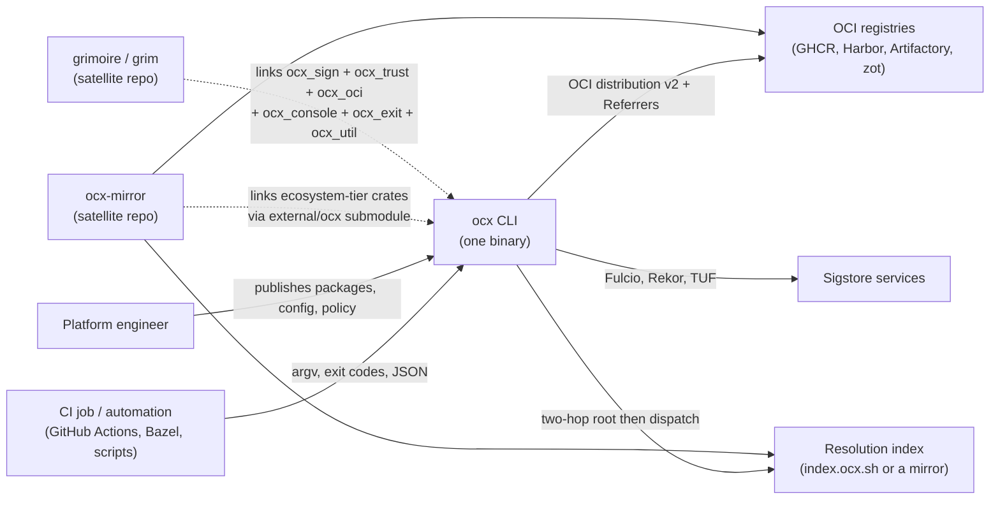
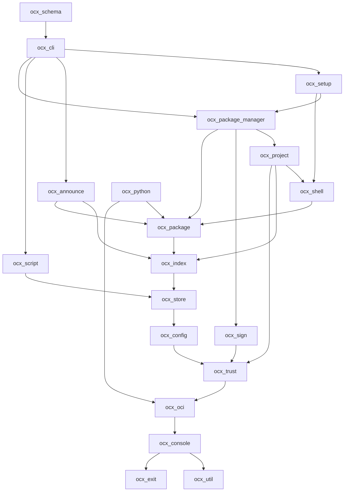
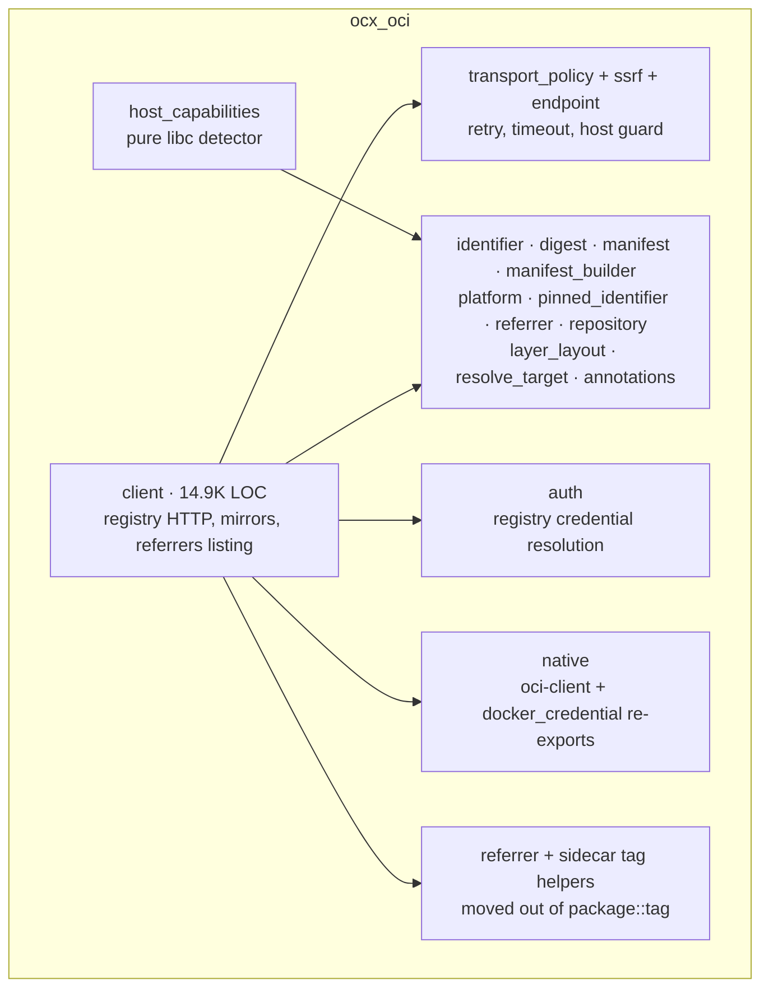
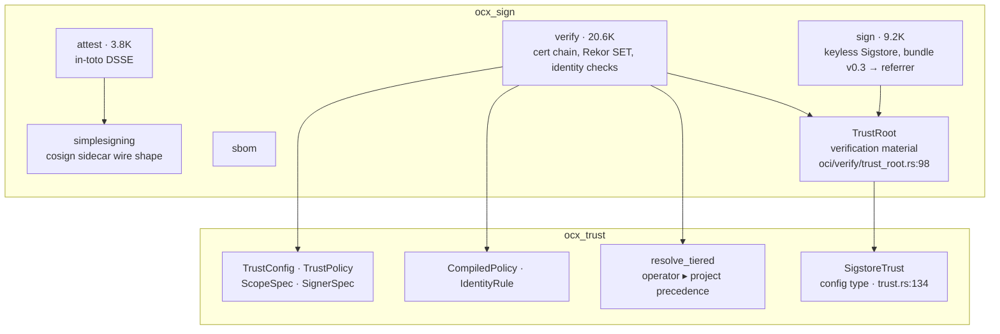
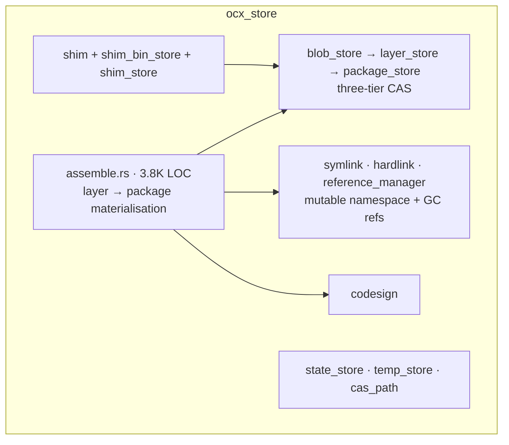
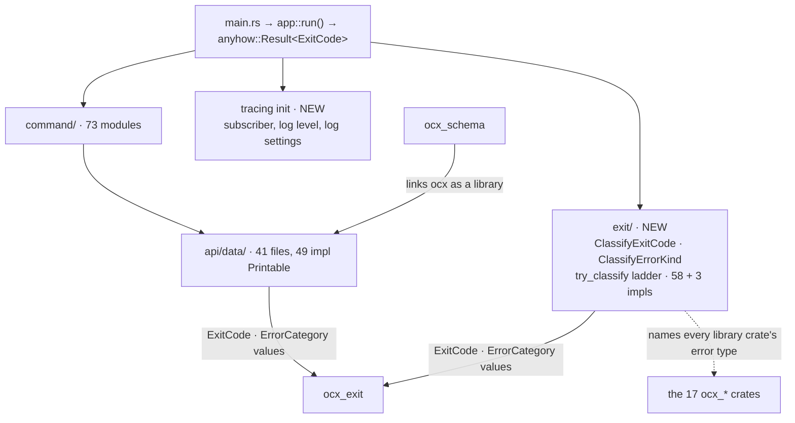
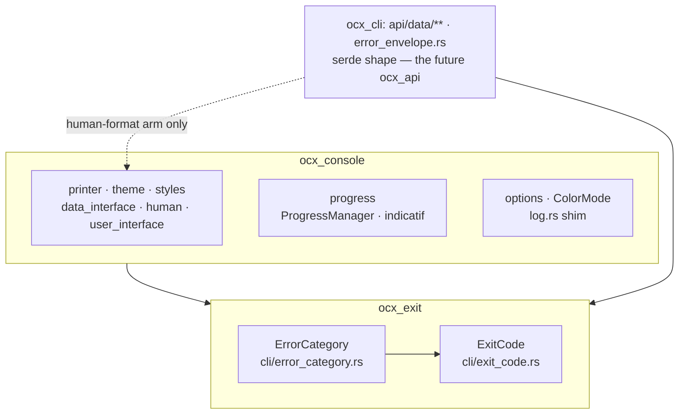

# System Design: the `ocx_*` crate workspace

## Metadata

**Status:** Draft
**Author:** Michael Herwig
**Date:** 2026-09-06
**Related ADRs:** [`adr_crate_split_workspace.md`](./adr_crate_split_workspace.md) — the decision, the trade-off matrix, the stability tiers, and the migration phases. This document does not restate them.
**Also constraining:** `adr_shell_env_addenda.md` (A-45), `adr_cli_repo_split_template.md`, `adr_trust_policy.md`, `adr_real_sigstore_stack_and_delegation.md`, `adr_ai_config_path_scope_correction.md`

**Tech Strategy Alignment:**
- [x] Rust 2024, Cargo workspace, resolver v3 — unchanged Golden Path
- [x] No database, no service tier, no new runtime dependency

## Executive Summary

`ocx_lib` becomes seventeen `ocx_*` library crates — sixteen product crates plus
`ocx_test_support` — alongside the unchanged `ocx_cli`,
`ocx_schema` and `ocx_shim`. Dependencies flow strictly downward from the
application layer to a domain-free foundation. Two lockstep satellite
repositories consume a subset as path dependencies into a git submodule:
`ocx-mirror` today, `grimoire` next. Nothing observable from outside changes —
no CLI grammar, no exit code, no wire or persisted format.

Sections 5 (HTTP API), 6 (entity/ERD, data migration), 7's authentication
subsection, and 9 (deployment topology, environments) are **n/a**: this is a
compile-time restructuring of one binary, with no service, no schema and no
deployment surface of its own. Section 7 is kept for the security properties the
boundaries must preserve.

---

## 1. Context (C4 Level 1)

### System Context Diagram



### Actors and external systems

| Actor / system | Relationship | Changed by this design |
|---|---|---|
| CI job, automation | Invokes `ocx`; reads exit codes and `--format json` | No. The CLI surface and exit codes are the interface tier |
| Platform engineer | Publishes packages, pushes managed config, sets trust policy | No |
| OCI registries | `ocx_oci` speaks to them; the SSRF guard sits on the outbound path | No behavioural change. The guard is opt-in today — see § 7 |
| Resolution index | `ocx_index` owns the protocol and the local collection | No wire change |
| Sigstore services | `ocx_sign` orchestrates; verification is delegated to `sigstore-rs` | No |
| `ocx-mirror` | Lockstep path dependency into `external/ocx`. Imports across ~10 top-level `ocx_lib` modules | Yes — per-crate paths; its four `ocx_lib::Error::OciClient` matches become `ocx_oci` matches |
| `grimoire` | Not a consumer today. No signing code at all. Its `oci-client` fork is pinned to a *different* branch and commit than this tree's submodule | Yes — becomes a consumer of six crates, after a fork reconciliation |

---

## 2. Containers (C4 Level 2)

Each crate is a container. The edges below are the **allowed** dependency set;
an edge not drawn here is a defect even when Cargo accepts it, and
`task rust:deps:direction` is the check. This diagram is identical to the ADR's;
both omit transitive edges, and the ADR's crate table is the authority.
`ocx_test_support` is omitted from both: it is a dev-dependency of every crate,
so drawing it adds seventeen edges that say nothing.



### Container descriptions

Contents, responsibility, tier and justification per crate are the ADR's crate
map. Four facts matter at container level:

- **The satellite rule is about naming, not about the compile graph.** A
  satellite may take a **direct** dependency on any ecosystem-tier crate and on
  no other. One transitive path is sanctioned and drawn above: `ocx_index`
  depends on `ocx_store` (21 references from `oci/index` into `file_structure`,
  load-bearing and not scheduled for inversion), so a satellite linking
  `ocx_index` compiles `ocx_store` without being permitted to name it. The
  earlier draft of this document asserted a "cut line" the diagram itself
  crossed; the rule is a naming rule, and the check is a manifest and source
  check, not a closure-shape check.
- **The cut itself is right.** Every `file_structure` item `ocx-mirror` imports
  is defined in `index_store.rs` and moves to `ocx_index`: `IndexStore`,
  `CatalogEntryStatus`, `CatalogTransaction`, `RootReadResult`,
  `SOURCE_LOCK_TIMEOUT`. It names no other store type.
- **`grimoire`'s closure is `ocx_sign → ocx_trust → ocx_oci → ocx_console →
  ocx_util`, with `ocx_exit` beneath all of them.** Six crates, no operations
  crate, no `ocx_config`, no `ocx_index`.
- **`ocx_exit` sits beneath every crate; `ocx_console` beneath the three that
  render.** Ruled 2026-09-16 (ADR § Rulings OQ3): the lib-internal `cli` module
  splits. `ocx_exit` holds `ExitCode` and `ErrorCategory` with `serde` as its
  only dependency — the interface-tier value crate a future SDK lifts
  unchanged. `ocx_console` keeps the progress, printer, theme and
  data-interface primitives; subscriber initialisation moves up to `ocx_cli`,
  so a satellite no longer links ocx's tracing setup to obtain a `Digest`.
  Only `ocx_oci` (`ProgressManager`), `ocx_shell` (`Theme`) and
  `ocx_package_manager` (`ProgressManager`) name `ocx_console` directly; every
  other crate that reached `cli` did so for `ExitCode` values and names
  `ocx_exit` alone. § 3.5 carries the contracts.

---

## 3. Components (C4 Level 3)

Five containers carry the design's real weight.

### 3.1 `ocx_oci` — the generic/product line

The one boundary that has to be argued rather than asserted: 8 of `oci`'s 23
sub-modules are genuinely mixed today.



Twelve of the dossier's thirteen generic sub-modules land here; `simplesigning`
is the exception and goes to `ocx_sign`, because a cosign sidecar wire shape is a
signing concern. `layer_layout` is here too, not in `ocx_store` as an earlier
draft had it: its annotation namespace is `sh.ocx.layer.*`, but the type is a
manifest layer-descriptor wire shape, and `ocx-mirror` imports `LayerLayoutSpec`
from `ocx_lib::oci` at four load-bearing sites (`src/pipeline/push.rs:8,62`,
`crates/ocx_python/src/compose.rs:52,154,361`). Placing it in a satellite-forbidden
crate would have broken the linking rule on day one.

| Component | Contract, testable without reading the implementation |
|---|---|
| `client` | Takes resolved values only. It never reads `Config`, an environment variable, a project, or an announce/publisher/patch/managed-config type. Boundary tests `oci_does_not_import_config` and `oci_client_does_not_import_workflow` before extraction; the manifest after |
| `auth` | Same rule. Named site to invert: `auth/store.rs:165` reaching `crate::env::var` for `DOCKER_CONFIG`, which would otherwise close `ocx_oci → ocx_config → ocx_trust → ocx_oci` |
| `ssrf` | See § 7. The guard is opt-in today; the split's obligation is a boundary test over `reqwest::Client` construction sites, not the preservation of a decorator that does not exist |
| `transport_policy` | Retry and timeout are value objects plus one driver, transport-agnostic |
| `platform` | Owns the compatibility relation and the canonical grammar. It does not own the `ocx.lock` key spelling — that moves to the lock reader in `ocx_package_manager` |
| `layer_layout` | A descriptor-annotation wire shape with no I/O. Its assemble-side consumer lives in `ocx_store` and reads it, never the reverse |
| tag helpers | `referrer_fallback_tag`, `sbom_sidecar_tag` and their siblings are OCI/cosign tag conventions, not package metadata. Moving them here removes `ocx_oci → ocx_package` (`oci/client/transport.rs:16`) and `ocx_sign → ocx_package` (`oci/verify/pipeline.rs`) in one step. `Tag` itself stays in `ocx_package` |
| `host_capabilities` | Pure detection. The 1-hour `state/host/capabilities.json` cache moves to `ocx_store`; composition happens in the caller |
| `native` | Re-exports of `oci-client` and `docker_credential`. The `[patch.crates-io]` forks reach here and nowhere else |

### 3.2 `ocx_trust` and `ocx_sign` — the signing cut

Two crates, not one and not three. The split point is the measured reuse
boundary: `trust` has in-degree 7, and most of those consumers need the policy
model without ever touching Sigstore verification.



`SigstoreTrust` and `TrustRoot` are two different things and are drawn as two
boxes: the first is the `[trust.sigstore]` config type in `ocx_trust`, the second
is the verification material in `ocx_sign`. An earlier draft conflated them.

| Contract | Statement |
|---|---|
| T1 | `ocx_trust` answers exactly one question: which signer identities are accepted for which package scope. No signature discovery, no cryptographic verification |
| T2 | **`resolve_tiered` stays in `ocx_trust`.** It is a pure function over an operator policy slice, a project policy slice and a target (`trust.rs:1271`); its caller already supplies both slices (`crates/ocx_cli/src/command/package_sign_common.rs:493`). An earlier draft moved it to `ocx_config`, contradicting the ADR — that would leave `grimoire`, which links `ocx_trust` and not `ocx_config`, with only the flat `resolve`, whose own doc names cross-tier pooling as an enrollment channel |
| T3 | `ocx_sign` depends on `ocx_trust`; nothing depends on `ocx_sign` except `ocx_package_manager` and `ocx_cli` |
| T4 | Neither crate defines or implements `ClassifyExitCode` — a signing crate that did would make `grimoire` link ocx's exit-code vocabulary |
| T5 | `codesign` is not here. macOS ad-hoc Mach-O signing during package extraction is local binary signing, not provenance, and it lives in `ocx_store`. **This contradicts the ratified dossier addendum**, which lists `codesign.rs` inside the signing stack grimoire needs; the ADR argues the contradiction; ruled 2026-09-16 — it stays in `ocx_store`, the addendum is descriptive, and grimoire may take a direct `ocx_store` dependency if it ever needs `codesign` |

**`ocx_sign` is not a leaf today**, and three named inversions (ADR phase 1.9)
must land before it is extracted: `file_structure::StateStore` at
`oci/sign/referrers.rs:16`, `oci/verify/trust_cache.rs:27` and
`oci/verify/trust_resolve.rs:43` becomes an injected `&Path`; the sign and verify
pipelines take a resolved target instead of an `oci::index` handle
(`oci/sign/pipeline.rs:33`, `oci/verify/pipeline.rs:59`); the `package::tag` edge
is removed by the tag-helper move in § 3.1. Its extraction is scheduled after
`ocx_package`, so a residual edge fails to compile rather than passing unnoticed.

**Open dependency.** `adr_trust_policy.md` is Proposed. Both of its outcomes
preserve T1, so this boundary is outcome-independent, and the map therefore
resolves `ocx_trust → ocx_oci` (for `Identifier`) rather than carrying it as a
question. That ADR states `trust` is a leaf "with no `oci` dependency"; the tree
measures 28 references. The extraction amends the claim; it does not leave both
standing.

### 3.3 `ocx_store` — one owner for `$OCX_HOME`



| Contract | Statement |
|---|---|
| S1 | No crate above `ocx_store` writes under `$OCX_HOME` except through a store type. **Review-only** — no gate proves it; the ADR lists it among the review-only invariants rather than implying a check |
| S2 | `assemble.rs` is business logic, not a helper. Its move out of `utility` is what lets `ocx_util` become domain-free: it removes `utility -> error` (57 refs) and `utility -> symlink` (31 refs) |
| S3 | `index_store` is not here — it moves to `ocx_index`, the index protocol's on-disk half |
| S4 | The locking policy is unchanged: `LockedFile` for stable inodes, `lock_scoped` into `$OCX_HOME/locks` for atomic-rename-replaced data |
| S5 | `ocx_store` carries a `__testing` seam (`file_structure/shim_bin_store.rs`) with a `cfg(not(...))` sibling arm, so it appears in `ocx_cli`'s forward list |

### 3.4 The application layer — `ocx_cli`



| Contract | Statement |
|---|---|
| A1 | `ocx_cli` is the only crate that may name `anyhow` in a non-dev dependency. Checked by the rewritten `anyhow_is_dev_dependency_only`, which walks every `crates/ocx_*/Cargo.toml` — re-homed unchanged it would parse only its own manifest and leave sixteen crates untested |
| A2 | `ocx_cli::exit` is the only place `ClassifyExitCode` is defined or implemented, and the only place more than one library crate's error type is named in one file |
| A3 | `ocx_cli` remains a library target. `ocx_schema` links it for the report types under `api/data/` (41 files, 49 `impl Printable`), and that path must stay reachable |
| A4 | `ocx_cli` forwards the `__testing` feature of **all seven** crates that carry it: `ocx_announce`, `ocx_config`, `ocx_store`, `ocx_oci`, `ocx_package`, `ocx_package_manager`, `ocx_shell`. A short list does not fail the build — four of the eleven seam files carry a `cfg(not(...))` sibling arm, so a missing forward silently swaps production behaviour into the acceptance run |
| A5 | `ocx_cli` owns subscriber initialisation. Libraries emit `tracing` events; binaries configure subscribers |

`ocx_schema`'s other edges re-point from `ocx_lib` to `ocx_config` (`Config`),
`ocx_package` (`AuthoringMetadata`), `ocx_project` (`ProjectConfig`,
`ProjectLock`) and `ocx_package_manager` (`PatchDescriptor`, `ExecutionRecord`).
`schemars` derives currently span 13 top-level modules and will span roughly
eight crates; each takes `schemars` as a workspace dependency, which is a
non-issue because every derive applies to a local type.

### 3.5 `ocx_exit` and `ocx_console` — the SDK seam

Ruled 2026-09-16 (ADR § Rulings OQ3). The lib-internal `cli` module splits along
the line a future Rust SDK would need: values that describe a process outcome
below, everything that draws a terminal above.



| Contract | Statement |
|---|---|
| X1 | `ocx_exit` depends on `serde` and std, nothing else — no `indicatif`, `console`, `tracing`, `clap`, no `ocx_*` crate. Its manifest is the check |
| X2 | `ocx_exit` is interface tier: an exit-code value is a CLI contract, so a change to it is a decision, not a refactor. A satellite may name it directly (ADR § Satellite linking rule) |
| X3 | `ocx_console` depends on `ocx_exit` and `ocx_util` and on nothing else in the workspace; it is where `indicatif` and `console` enter the graph. Only `ocx_oci`, `ocx_shell` and `ocx_package_manager` name it |
| X4 | The serialized shape of every `api/data/**` type and of `error_envelope.rs` is `serde` derives over `ocx_exit` values and plain data. The human-format arm (`DataInterface`, `Cell`, `Theme`, `Printer`) is a separate `impl` a future `ocx_api` extraction leaves behind in `ocx_cli`. Review-only this round (ADR contract E6); the types do not move — one consumer |
| X5 | No reporter port. `ProgressManager` is one implementation with one home; a port appears the day a second implementation does |

---

## 4. Key Design Decisions

Argued in the ADR with alternatives and rationale; listed so a reader of this
document alone does not miss them.

| # | Decision | Where argued |
|---|---|---|
| 1 | Layer in place first; extract only when a crate's disallowed-edge count is zero in the phase-0 inventory | ADR § Considered Options, § Phase 0.2 |
| 2 | No facade crate | ADR § No facade crate |
| 3 | No cycle-detection tool; `task rust:deps:direction` closes the gap Cargo leaves, and the phase-0 inventory covers phase 1 where no crate exists yet | ADR § No cycle-detection tool |
| 4 | Per-crate `thiserror`; the workspace-wide `Error` dissolves; its domain-free helpers go to `ocx_util`; `ArcError` has no successor | ADR § API Contract |
| 5 | All exit-code classification moves to `ocx_cli`, for every crate | ADR § API Contract |
| 6 | Subscriber initialisation moves to `ocx_cli`; the presentation vocabulary splits into `ocx_exit` (values, interface tier) and `ocx_console` (rendering), both below the libraries | § 2, § 3.4 and § 3.5 above; ADR § Rulings OQ3 (2026-09-16) |
| 7 | `ocx_test_support` exists because a `#[cfg(test)] mod` cannot be shared across crates | ADR crate map, § Phase 0.5 |
| 8 | Basic acceptance is a `smoke` marker with three anti-rot checks, and may not narrow `verify-basic.yml` until `verify-deep.yml` has a per-PR trigger — ruled: draft-gated `pull_request` plus `merge_group` | ADR § Verification tiers, § Rulings OQ1 |

---

## 5. API Design

n/a — no HTTP or RPC surface. The CLI grammar, exit codes and wire formats are
the interface tier and are unchanged by construction; the full acceptance suite
passing unmodified at every commit is the proof.

---

## 6. Data Model

n/a — no database and no schema change. Every persisted format is byte-identical
before and after; the `index_wire_conformance.rs` byte-parity gate moves to
`crates/ocx_index/tests/` and keeps running, which is how that is demonstrated
rather than asserted.

---

## 7. Security Architecture

Authentication and authorization: n/a at the design level — registry auth is
delegated to `docker_credential` and the registry's own token flow, unchanged.

| Property | Risk introduced by the split | Check |
|---|---|---|
| SSRF on remote-controlled hosts | The guard and the code that must call it end up in different crates | `ssrf` and `client` stay in `ocx_oci`. **`GuardedTransport` does not exist** — an earlier draft named it as the mitigation, but repo-wide it appears only in `adr_real_sigstore_stack_and_delegation.md:516`, which is Proposed. What exists is opt-in: `ClientBuilder::ssrf_guard` (`oci/client/builder.rs:155`) with `dns_resolver` defaulting to `None`, three of four `ClientBuilder::new()` sites unguarded, raw `reqwest` clients at `forge/http.rs:34` and `oci/index/ocx_index.rs:238`, and explicit `guard_destination` calls at `announce/pipeline.rs:291` and `oci/index.rs:437`. New boundary test: every `reqwest::Client` construction under `crates/ocx_*` seeds a `GuardedResolver` or is preceded by `guard_destination`. The pre-existing opt-in gap is ruled in the ADR's Deferred list: the split does not wait for [#409](https://github.com/ocx-sh/ocx/pull/409); the boundary test lands first and #409 rebases |
| Credential handling | A `pub(crate)` path widens to `pub` to cross a new boundary | The `unreachable_pub` ratchet the earlier draft leaned on **does not exist**; standing up its baseline is ADR phase 0.8. Until then this is manual review. `media_type` is the one known intentional widening |
| Trust-policy tiering | Splitting `resolve_tiered` from `CompiledPolicy` lets a lower tier displace a system-tier pin | Both stay in `ocx_trust` (T2). Adversarial test at extraction: a project-tier policy cannot override a `system_locked` operator policy |
| Test seams | A missing forward silently substitutes production behaviour into the acceptance run | Seven crates declare `__testing`; `ocx_cli` forwards all seven; a test pins the forward list to `grep -rl 'feature = "__testing"' crates/*/src`. `config/loader.rs`'s seam redirects the system config tier, which carries `system_locked` trust pins, so this is security-relevant, not only convenience. Features are consumer-selected: a satellite *can* enable `ocx_oci/__testing` and gets unsupported seams outside the ecosystem tier's obligations. "Release artifacts lack the code path" is a property of the release feature selection, asserted by a feature-graph check, not a crate invariant |
| Unit tests that read the process environment | `env::var`'s `#[cfg(test)]` override (`env.rs:1297`) resolves through `crate::test::env`, which lands in `ocx_config` while its callers scatter across ten crates — `ocx_sign` tests reading `OCX_SIGNING_KEY`, `OCX_KEY_PASSWORD` or `DOCKER_CONFIG` would fall through to the real environment and pass either way | `ocx_test_support` (phase 0.5) owns the hook and is a dev-dependency of every crate that used `crate::test`. Red state: one such test shown red with the hook removed |
| Path containment | `assemble.rs` and the symlink-escape guards land in different crates | Both land in `ocx_store`; `utility::fs::path` helpers stay in `ocx_util` and are used, not duplicated |

Review routing: a diff touching `ocx_oci`, `ocx_sign`, `ocx_trust`, `ocx_config`
or `ocx_store` is security-relevant and reviews at Opus per CLAUDE.md § Model
Policy.

---

## 8. Non-Functional Requirements

Measured baselines and the full NFR table are in the ADR. Two design-level points:

- **Latency of the shipped binary is unaffected.** The `dist` profile is fat-LTO
  with `codegen-units = 1`, which erases crate boundaries at link time.
- **Observability moves up, not down.** Subscriber initialisation
  (`log_level`, `log_settings`, `progress`'s subscriber wiring) lands in
  `ocx_cli`, so exactly one place configures tracing and no library crate — and
  therefore no satellite — links ocx's subscriber setup. `log.rs`, a 4-line
  `tracing_log` re-export shim rather than an init site, travels to
  `ocx_console` with the rest of the vocabulary.

---

## 9. Infrastructure

n/a for deployment. Build-pipeline impact only: `dist-workspace.toml`'s
`members = ["cargo:."]` resolves through `cargo metadata`, only `ocx` declares a
`[[bin]]`, and `publish = false` on every new manifest keeps cargo-dist's scan
correct. `deny.toml` and `.licenserc.toml` are already workspace- and
glob-scoped.

**Three workflows carry `paths:` filters**, not two as an earlier draft said.
`build-windows-shims.yml` (naming `crates/ocx_lib/src/shims/**` and `shim.rs`)
and `shell-activation.yml` (naming `setup.rs`, `setup/**`, `shim.rs`, `shell.rs`,
`shell/**`) both name files that move; `verify-release-ci.yml` filters on
`**/Cargo.toml`, which survives the split. The failure mode of a stale filter is
a job that quietly never runs, so the two that change are edited in the same
commit as the `ocx_store`, `ocx_shell` and `ocx_setup` extractions and validated
by an automated repository check asserting every workflow `paths:` entry resolves
to at least one file on disk — not by a manual no-op push.

`task satellite:verify` runs as a job in `verify-deep.yml` (ruled 2026-09-16:
the deep tier, not per commit), building `../ocx-mirror` at its current
submodule pointer against this workspace. Without it the ecosystem tier
is a documentation label rather than a contract.

---

## 10. Dependencies

**Internal.** The container diagram in § 2, plus `ocx_test_support` as a
dev-dependency of every crate that used `crate::test`. Dev-dependency edges are
legal in Cargo but make `cargo test` graphs confusing, so
`task rust:deps:direction` treats `[dev-dependencies]` as a separate allowed set:
a dev-only edge cannot smuggle in a runtime one.

**External.** No dependency is added, removed or upgraded. Three distribution
facts govern how they reach a satellite, stated in full in the ADR:
`[patch.crates-io]` does not travel across a path or git boundary; feature
unification resolves in the consumer's graph, so `serde_json/preserve_order` and
`serde_json/raw_value` are named contract lines; full-tree submodule vendoring is
required (rust-lang/cargo#14946).

Dependency isolation is a design goal, not a side effect: the `starlark` family
(`starlark`, `starlark_syntax`, `starlark_map`, `starlark_derive`, `allocative`)
reaches exactly one crate, `ocx_script`, after the split; it reaches everything
today. `h2` and `tokio/test-util` are dev-dependencies of `oci/transport_policy.rs`
and travel to `ocx_oci`; `anyhow` travels to `ocx_script`.

**Fork reconciliation.** Onboarding `grimoire` is not a re-point of an existing
pattern. Its `external/rust-oci-client` is pinned to `ocx/integration` @
`7f3d0b6c` while this tree's submodule is on `ocx/drop-dead-referrers-fallback` @
`e5ed433a`. The reconciliation is the risk in phase 3, not the manifest edit.

---

## 11. Risks and Mitigations

| Risk | Likelihood | Impact | Mitigation |
|---|---|---|---|
| A boundary test passes because its needle stopped matching | High — documented precedent in this repo's own guidance | Silent loss of the enforcement mechanism | The § 12.1 harness bakes in the witness and non-empty-walk assertions, and every boundary ships a committed negative fixture so the red state is machine-checkable rather than quoted in a commit body |
| A boundary violation written as a fully-qualified path or through a lib-root re-export | High — already observed: the security review cited `oci/sign/key_ref.rs:117` reaching config, which is not visible in that file's `use` lines | A whole class of edges stays invisible | The scanner and the phase-0 inventory both cover `use` imports, fully-qualified `crate::x::` expressions, and lib-root re-exports (`use crate::Config`) |
| The map is stale on the day phase 1 starts | High — #420 adds a module absent from the tree the map was derived from | Every downstream phase built on a wrong graph | Hard post-merge gate: re-run the inventory and diff the map after the three named merges, with `claim`'s edges assigned |
| A hand-maintained CI path filter stops firing after a move | High | A job silently never runs; CI reports green | Filters edited in the same commit as the move, validated by an automated check that each `paths:` entry resolves |
| A phase-1 inversion is judged "clean" without measurement | Medium | Extraction proceeds against a crate that still has upward edges — the defect that put `ocx_sign` at the wrong point in the earlier order | Extraction of crate X requires X's disallowed-edge count to be 0 in the phase-0.2 inventory; the reciprocated-pair count is recorded per commit |
| Phase 2 collides with a long-lived branch | Medium | Painful rebase across a 43K-LOC module | Phase 1 gated on three named PRs; `ocx_store` additionally on [#169](https://github.com/ocx-sh/ocx/pull/169); leaves extracted before hubs, and `ocx_script` extracted in parallel rather than behind them |
| The scoped gate misses a regression | Medium | A false green in a work package | Non-crate paths escalate first; hub membership is computed from reverse-dependent count, not hand-picked; the residual class is named in the ADR rather than implied away |
| Signing regressions leave per-PR coverage with the basic tier | Certain, by design | A Sigstore or trust-policy break reaches main | Anti-rot check (c) asserts the deep suite's per-PR trigger exists; the label fallback is ruled out |
| Cross-crate dead-code analysis stops working | Certain | Unused items in library crates no longer warn | Accepted. `unreachable_pub` covers the visibility half once phase 0.8 lands; there is no mitigation for the rest and none is claimed |

---

## 12. Implementation Phases

Phases, ordering, per-phase verification, rollback and PR dependencies are in the
ADR § Implementation Plan. Three code-level contracts the phases depend on are
specified here, because they are the shapes every subsequent step is written
against.

### 12.1 The boundary-test harness (phase 0.1)

Generalized from `shell_does_not_import_project`
(`crates/ocx_lib/src/activation.rs:1159`) — the only architectural boundary test
in the repository, which already carries both guards a boundary test needs. The
harness makes them impossible to omit.

```rust
/// Assert that no `.rs` file under `subtree` reaches any module in `forbidden`.
///
/// `witness` must be a file that DOES reach at least one forbidden module.
/// Without it a green result is indistinguishable from a scanner whose needle
/// stopped matching after a rustfmt rewrap or a refactor.
pub fn assert_no_imports(subtree: &Path, forbidden: &[&str], witness: &Path);
```

Four mandatory properties:

1. No scanned file reaches a forbidden module — via a `use crate::x` import, a
   fully-qualified `crate::x::` expression path, **or** a lib-root re-export
   (`use crate::Config`, where `Config` is `config`'s). Import-only scanning
   misses violations that are already in the tree.
2. The walk found more than one file, so it did not scan nothing.
3. The scanner still finds a forbidden reach in `witness`, so property 1 is not
   vacuous.
4. Comments are stripped before scanning: whole-line `//`, trailing `//` after
   code, and `/* … */` blocks. The test this generalizes strips only whole-line
   `//`, which leaves a denylist able to match its own trailing comment —
   the self-matching failure `quality-rust.md` § "Structural guards" names.

Each boundary ships a committed negative fixture, so its red state is reproducible
by anyone rather than attested in a commit body. Each boundary test is **deleted**
in the commit that extracts the crate it guarded: Cargo then enforces the same
property, and a test that can no longer go red is not coverage.

### 12.2 The `ClassifyExitCode` relocation (phase 1.1)

Before, in `crates/ocx_lib/src/cli/classify.rs` — trait and ladder in the
library, 58 `ClassifyExitCode` impls plus 3 `ClassifyErrorKind` impls scattered
across 51 files in 23 top-level modules, and 42 `use crate::` lines inside one
function:

```rust
// ocx_lib::cli::classify
pub trait ClassifyExitCode { fn classify(&self) -> Option<ExitCode> { None } }
fn try_classify(cause: &(dyn Error + 'static)) -> Option<ExitCode> {
    use crate::oci::client::error::ClientError;
    use crate::package_manager::error::PackageErrorKind;
    // … 40 more `use crate::` lines, 55 try_downcast! entries
}
```

After, in `crates/ocx_cli/src/exit/classify.rs` — the trait is local to
`ocx_cli`, so impls for foreign types are permitted by the orphan rule:

```rust
// ocx_cli::exit
pub trait ClassifyExitCode { fn classify(&self) -> Option<ExitCode> { None } }

impl ClassifyExitCode for ocx_oci::client::error::ClientError { /* … */ }
impl ClassifyExitCode for ocx_package_manager::error::PackageErrorKind { /* … */ }
// … one impl per library-crate error type, all in this crate
```

Counting note, because the plan is sized on it: a single-line grep undercounts to
the high 30s (several impls read `impl crate::cli::ClassifyExitCode for X`), and
the raw string `ClassifyExitCode for` appears 60 times including doc text. The
figures above come from a multi-line-aware scan with comment lines stripped.

`ExitCode` and `ErrorCategory` live in `ocx_exit` as plain value types with no
knowledge of any error type. That separation lets `ocx-mirror` keep consuming
`ExitCode` as a value at 201 sites — as `ocx_exit::ExitCode` — while defining
its own per-source `classify_error` functions.

### 12.3 Facade re-export shape

n/a — the design has no facade crate. A satellite names the crates it needs in
its own manifest. See the ADR for why, and for the criterion that would reverse
it.

---

## 13. Open Questions

None remain. The three carried questions and the five Deferred items were ruled
by the owner on 2026-09-16 — ADR § Rulings and § Open Questions — ruled. Two new
deferred items (merge-queue enablement, the `ocx_api` extraction) are optional
and block nothing.

---

## Appendix

### Glossary

New terms this design introduces; everything else is in `arch-principles.md`
§ Key Concepts.

| Term | Meaning |
|---|---|
| **Ecosystem tier** | A crate a lockstep submodule consumer links. Breaks are allowed when justified, with the consumer upgraded in the same change series. Enforced by the `task satellite:verify` CI job, without which it is a label |
| **Satellite linking rule** | A satellite may take a **direct** dependency on any ecosystem-tier crate and on `ocx_exit`, and on no other, and may not name a forbidden crate in its manifest or source. One sanctioned transitive path: `ocx_store` beneath `ocx_index`. Replaces the "CLI for operations" doctrine, and widens the permitted surface by an order of magnitude — a trade, not a preservation |
| **Hub crate** | Computed, not listed: a crate whose reverse-dependent count within the workspace is ≥ 4, recomputed from `cargo metadata` on every scoped-gate run. On the map as drawn: `ocx_exit`, `ocx_util`, `ocx_console`, `ocx_oci`, `ocx_config`, `ocx_store`, `ocx_index`, `ocx_package`. Touching one escalates the scoped gate to the full gate |
| **Scoped gate** | `task verify:scoped` — changed-crate clippy and unit tests, plus the smoke tier, plus a command-mapped acceptance subset. Escalates to full on any non-crate path or any hub or ecosystem-tier crate. Local only, ≤ 5 minutes |
| **Smoke tier** | The `smoke`-marked acceptance subset: 20–30 tests, one happy path per top-level CLI verb, zero touching sign/attest/verify, so the Sigstore stack never starts. One list serving both the scoped gate and CI's basic tier. Its exclusion is a coverage loss, pinned to the deep tier by anti-rot check (c) |
| **Disallowed-edge count** | Per intended crate, the number of module references the map forbids, reported by the phase-0.2 inventory. Zero is the precondition for extracting that crate — the operational definition of "clean" |

### References

Every measurement, count and citation comes from the artifacts linked in
[`adr_crate_split_workspace.md`](./adr_crate_split_workspace.md) § Links, or from
files in this repository read directly during the design and re-verified during
the Round 1 fix pass.

---

## Changelog

| Date | Change |
|---|---|
| 2026-09-06 | Initial draft alongside the ADR. Status: Draft. |
| 2026-09-06 | Round 1 review fixes. Removed the non-existent `GuardedTransport`; corrected `resolve_tiered` to stay in `ocx_trust`; split `SigstoreTrust` from `TrustRoot`; moved `layer_layout` to `ocx_oci` and subscriber init to `ocx_cli`; added `ocx_test_support`, the seven-crate `__testing` forward list, the `ocx_sign` inversions, the fully-qualified/re-export scanner requirement and the comment-stripping specification, the three-workflow correction, the fork-reconciliation note, and the mechanical hub definition. Container diagram made identical to the ADR's. |
| 2026-09-16 | Owner rulings applied (ADR § Rulings): `ocx_exit` split out of `ocx_console` — new § 3.5 with contracts X1–X5, container diagram and grimoire's closure (six crates) updated, hub set and satellite rule gain `ocx_exit`, counts recounted (17 `ocx_*` library crates); decisions 6 and 8, T5, the SSRF row, § 9 (`task satellite:verify` in the deep tier), § 12.2 and § 13 carry the rulings. |
| 2026-09-23 | `ocx_python` (ecosystem, moved from ocx-mirror) added to the container diagram, kept identical to the ADR's. It was never part of `ocx_lib`, so the executive summary's seventeen stands; `ocx_cli` does not link it and the classification ladder never names it. |
