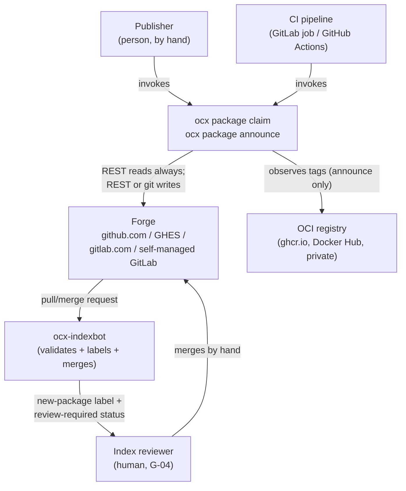
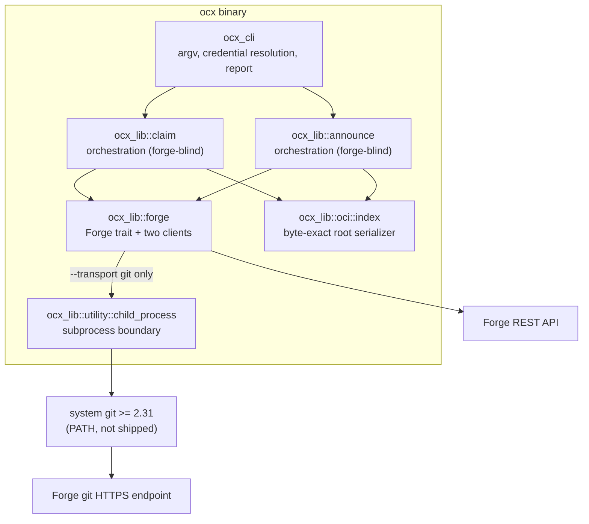
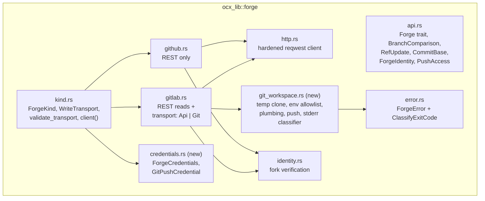

# System Design: `ocx package claim` and the forge write transports

## Metadata

**Status:** Draft
**Author:** Architect (Opus 5)
**Date:** 2026-09-05
**Beads Issue:** N/A
**Related issues:** [ocx#410](https://github.com/ocx-sh/ocx/issues/410), [ocx#411](https://github.com/ocx-sh/ocx/issues/411)
**Related ADRs:** [`adr_index_claim_command.md`](./adr_index_claim_command.md) (**the decision record — this document does not re-decide anything**), [`adr_announce_gitlab_forge.md`](./adr_announce_gitlab_forge.md) (amended), [`adr_announce_publisher_surface.md`](./adr_announce_publisher_surface.md), [`adr_announce_diverged_branch_rebuild.md`](./adr_announce_diverged_branch_rebuild.md)

**Tech Strategy Alignment:**
- [x] Rust 2024 + Tokio, per the Golden Path. Zero new crate dependencies.
- [ ] Database choice — **not applicable**: ocx has no database; the persisted state is a JSON file in a git repository.
- [ ] Infrastructure tier — **not applicable**: this is a CLI binary, not a deployed service.
- [ ] OpenTelemetry — **not applicable**: ocx observability is `tracing` to stderr plus a JSON report on stdout; no OTLP exporter exists or is proposed.
- [x] Deviations documented in the ADR (Constitution Check §1: the `git` subprocess amends S1).

## Executive Summary

`ocx package claim` opens the first-claim pull or merge request for a package on an ocx
index, across github.com, GitHub Enterprise Server, gitlab.com and self-managed GitLab. It
exists because `ocx package announce` refuses an unclaimed namespace by design, so today
every publisher's first release ends in a hand-written JSON file and a hand-opened pull
request. Alongside it, a `--transport api|git` seam lets a GitLab CI job author that request
as the invoking human using the job's own token, which REST cannot do.

---

## 1. Context (C4 Level 1)

### System context diagram



### Actors and external systems

| Actor / system | Type | Description | Interaction |
|---|---|---|---|
| Publisher | Person | Claims a namespace by hand, usually once per package | Runs the command; reads the plain report and the stderr owner line |
| CI pipeline | System | GitLab job or GitHub Actions workflow | Runs the command; consumes `--format json` and the exit code |
| Forge | System | Four deployment shapes across two products | REST for every read **except `compare_branch`**, which a job token cannot read over REST and the clone computes exactly (D-T5); REST **or** git for the write |
| OCI registry | System | Where the package's artifacts live | `claim` never contacts it — it only records the pointer the publisher supplies. Announce observes tags there. |
| ocx-indexbot | System | Validates the request, applies `new-package`, enforces G-04/G-19 | Reads the committed root; never invoked by ocx |
| Index reviewer | Person | Judges whether the claimed namespace plausibly belongs to the entity it names | Merges by hand; this step is not automatable by construction |

**The claim command's boundary is narrow on purpose.** It produces one pull or merge request
containing one added file. Everything downstream — validation, labelling, the merge decision —
belongs to the index and its reviewer, and ocx has no credential there.

---

## 2. Containers (C4 Level 2)

### Container diagram



### Container descriptions

| Container | Technology | Purpose | Scaling |
|---|---|---|---|
| `ocx_cli` | clap derive | Parse argv, diagnose argv faults *before* the credential check, resolve credentials from the environment, build the request, render the report | One invocation, one package |
| `ocx_lib::claim` | Rust, `async` | The claim orchestration: read, refuse-if-claimed, resolve owners, render, commit, open the request. Never learns the forge or the transport | — |
| `ocx_lib::announce` | Rust, `async` | Unchanged except that its retry scope widens to the commit/open pair (ADR D-T4) | — |
| `ocx_lib::forge` | `reqwest` + `async-trait` | The `Forge` trait and its two implementations; `GitLabForge` holds the transport enum | — |
| `ocx_lib::oci::index` | `serde_json` | `serialize_root` — the byte-exact writer both commands already share | — |
| `utility::child_process` | `tokio::process` | The existing subprocess boundary, **plus a new capturing sibling**. `exec` is forbidden here (it never returns, so no RAII guard removes the clone) and `spawn_and_wait` is insufficient (it inherits all three streams and returns only an `ExitStatus`, so no object sha can be read back and git's stderr never reaches the classifier or the redactor). The sibling keeps `env_clear()`, signal forwarding and `kill_on_drop`, and pipes all three streams. | — |
| system `git` | external binary | Plumbing, compare, and the one push that carries the merge-request push options | Not shipped; resolved via `PATH`; version-gated |

**Why the transport lives inside the forge container, not beside it.** The alternative
placements were evaluated in the ADR's Part 2 matrix. The short version: the orchestration
containers hold every concurrency decision the project has ever had an incident about, and
any design that branches on transport inside them, or clones them, re-opens those decisions.

**Do not read that as "a third forge is just another enum arm."** Gitea's AGit is
mechanically close to GitLab's model — push to the ordinary branch ref, carry metadata in
`-o` options — so it could reuse this workspace nearly as-is. Forgejo's AGit-Flow cannot: it
pushes to `refs/for/<base>/<topic>`, where the **ref target itself** carries the "this is a
pull request" signal. `git_workspace.rs` as specified performs one push with the target ref
fixed to the branch, so a Forgejo arm needs a refspec-shape parameter on the seam, not just a
new `ForgeKind` variant. Out of scope at 0.6.1; recorded for whoever inherits the code.

---

## 3. Components (C4 Level 3)

### `ocx_lib::forge` components



### Component responsibilities

| Component | Single responsibility | Depends on |
|---|---|---|
| `api.rs` | The forge-neutral operation set and its vocabulary types. Gains `ForgeIdentity`, `PushAccess`, `CapabilityCheck`, `CapabilityName`, `CheckStatus` (`Passed` / `Unknown` / `Skipped` — no `Failed`, because no code path can emit one), and `GitBinary { path, version }` | `ForgeError` |
| `kind.rs` | Which forge a coordinate is on, whether a transport is expressible there, and the single constructor — which **takes the `GitBinary` the CLI's argv-boundary gate produced**, required whenever the transport is `git` | `github.rs`, `gitlab.rs`, `credentials.rs` |
| `credentials.rs` *(new)* | The resolved credential pair and the one fact the header decision needs (`api_is_job_token`). Holds no environment-reading logic — that is the CLI's job | — |
| `gitlab.rs` | GitLab REST, plus dispatch of the two write operations to the transport half | `http.rs`, `git_workspace.rs`, `identity.rs` |
| `git_workspace.rs` *(new)* | Everything about the temp clone: creation and hygiene, the `Env::clean`-built child environment, the **index-file commit chain** (`read-tree` into a scratch `GIT_INDEX_FILE` → `update-index --add --cacheinfo` → `write-tree` → `commit-tree`, depth-independent so `p/<ns>/<pkg>.json` works — a single `mktree` cannot write a nested path), the compare computation, the retry re-fetch, the single push, and the stderr classifier | `utility::child_process` (the **capturing** helper, not `spawn_and_wait`), `ForgeError` |
| `error.rs` | The error taxonomy and its exit-code classification | `cli::ExitCode` |

**`git_workspace.rs` owns no policy.** It does not decide when to push, what the branch is
called, or whether a request should exist. It executes a named git operation and returns
either a value or a named error. `gitlab.rs` decides *which* operation, and the orchestration
decides *whether*.

**It does not own the version gate either, and that is a deliberate move.** The gate runs at
the CLI argv-fault boundary, before the forge exists, so that "before any network call" is
true rather than aspirational — the workspace is created lazily on the first git-half
operation, which is three REST reads in. The gate's result travels as `GitBinary { path,
version }` into `ForgeKind::client`, so the transport holds the binary it depends on instead of
re-resolving `PATH` per invocation, and `ensure_push_access` renders the `git-version`
capability row from that value. One producer for the row, one assembler for the array, and the
dependency visible in a signature.

### `ocx_lib::claim` components

| Component | Responsibility |
|---|---|
| `claim.rs` | The orchestration: the sequence below, and nothing else |
| `claim/request.rs` | `ClaimRequest`, `ClaimTarget` (`Out` / `Fork` / `Direct`), `ClaimOutcome`, `ClaimStatus` (`Unchanged` / `Updated`), `OwnerIdentitySource` (`Resolved` / `Asserted` / `CiEnvironment`), `OwnerSpec` |
| `claim/error.rs` | `ClaimError` + its `ClassifyExitCode` impl |
| `claim/root.rs` | The root renderer: field set, field order, `created` date form. Pure apart from the clock accessor below, and the one place the wire shape is written |
| `claim/owners.rs` | The owner-resolution ladder and the bot refusal. Pure given a `&dyn Forge` and an environment snapshot |

**The clock is shared, and claim does not reach into announce.** `created` needs today's date;
`announce::pipeline::current_timestamp` already owns the only testing seam for it. A
`claim` → `announce::pipeline` call would make a new command depend on an unrelated one purely
for a helper, so the seam moves down instead: **`oci::index` gains `current_timestamp()` and
`current_date()`** (the date being the first ten characters of the same instant), announce's
function becomes a re-export or a one-line delegation, and both writers read the same clock.
`oci::index` is the right home because it is the module both writers already depend on and
whose wire formats these two strings are; `utility` is the fallback only if a non-index writer
ever needs a clock. The environment variable keeps its current spelling
(`__OCX_TESTING_ANNOUNCE_CLOCK`) so the acceptance fixtures that already set it keep working —
it is `__`-prefixed and testing-only, so renaming it later costs nothing but buys nothing now.

### Sequence — a claim over the API transport

```mermaid
sequenceDiagram
    participant CLI
    participant Claim as ocx_lib::claim
    participant Forge as &dyn Forge
    CLI->>CLI: parse argv; validate_transport; resolve credentials
    CLI->>Claim: claim(request)
    Claim->>Forge: get_file_contents(index, "p/ns/pkg.json", base)
    Forge-->>Claim: None
    Note over Claim: Some(_) here -> NamespaceAlreadyClaimed (65)
    Claim->>Forge: resolve_user / authenticated_identity (owners)
    Claim->>Claim: render root (byte-exact)
    Claim->>Forge: get_ref_sha(index, base)
    Claim->>Forge: get_ref_sha(target, claim branch)
    Claim->>Forge: compare_branch(...) when the branch exists
    Claim->>Forge: ensure_push_access(target)
    Forge-->>Claim: PushAccess { checks }
    Claim->>Forge: commit_files(target, branch, base, msg, files, update)
    Claim->>Forge: open_or_update_pull_request(index, head, branch, base, title, body)
    Forge-->>Claim: PullRequest
    Claim-->>CLI: ClaimOutcome
    CLI->>CLI: report (stdout) + owner line (stderr)
```

### Sequence — the same claim over the git transport

```mermaid
sequenceDiagram
    participant CLI as command/package_claim.rs
    participant Claim as ocx_lib::claim
    participant GL as GitLabForge (Git)
    participant WS as GitWorkspace
    participant REST as GitLab REST
    participant Git as git (subprocess)
    CLI->>Git: git --version (argv-fault gate, before the forge exists)
    Note over CLI,Git: runs beside validate_transport, so "before any<br/>network call" is literally true — no REST call precedes it
    Claim->>GL: get_file_contents / get_ref_sha
    GL->>REST: GET files raw / branches
    Claim->>GL: ensure_push_access
    GL->>REST: GET /projects/:id (+ allowlist when cross-project)
    GL->>REST: GET branches/<branch> (exists? else Absent)
    GL->>WS: ensure workspace
    WS->>Git: git init; git fetch --filter=blob:none <base> [+ <branch> only if it exists]
    Claim->>GL: compare_branch (skipped when Absent)
    GL->>WS: rev-list --left-right --count
    Claim->>GL: commit_files
    GL->>WS: hash-object / read-tree+update-index / write-tree / commit-tree / update-ref
    Note over WS: no network write yet
    Claim->>GL: open_or_update_pull_request
    alt no pending local commit AND an open request already exists
        GL->>REST: GET /merge_requests?source_branch=&state=opened
        Note over GL,REST: returned as-is — NO push, no commit, no write of any kind
        GL-->>Claim: PullRequest
    else pending commit, or no open request
        opt no pending local commit
            GL->>WS: refresh commit (same tree, new committer date) so the ref advances
        end
        GL->>WS: git push -o merge_request.create/.target/.title/.description
        Note over WS: NonFastForward surfaces HERE under git;<br/>retry re-fetches base+branch first
        GL->>REST: GET /merge_requests?source_branch=... (bounded poll, ~30s)
        Note over GL,REST: the MR is created by an async post-receive worker;<br/>exhausting the bound is exit 75, not a failed push
        GL-->>Claim: PullRequest
    end
```

---

## 4. Key Design Decisions

Rationale lives in the ADR; this is the index.

| Decision | Options considered | Chosen | ADR ref |
|---|---|---|---|
| Command placement | sibling under `package`; under `index`; a mode of `announce`; renderer only | sibling under `package` | D-C1 |
| Owner input | always explicit; detect-and-replace; detect-and-append; detect-always | detect when omitted, explicit list replaces, bots refused | D-C4 |
| Transport layering | second `Forge` impl; mode in the pipeline; separate git writer; seam inside `GitLabForge` | seam inside `GitLabForge` | D-T1 |
| Owners wire | dual-emit; `login`/`id` only; `login`/`id` + `format_version` bump; add a per-owner forge field | `login`/`id` only, no bump | D-W1/D-W2 |
| Git library | `gix`; `git2`; system `git` | system `git` >= 2.31, via the existing subprocess boundary | D-T10 |
| Where the push happens | in `commit_files`; twice; deferred to `open_or_update_pull_request` | deferred, with the trait contract rewritten to say so | D-T4 |
| Capability detection | parse push failure text; preflight two REST fields | preflight, with `unknown`-and-proceed and text-matching only as a secondary net | D-T9 |
| Exit code for a capability gate | reuse 69; reuse 64; a new sibling of 84 | new `ForgeCapabilityUnavailable = 86` (85 is taken) | Exit-code table |

---

## 5. API Design

The authoritative contracts — CLI grammar, environment precedence, `Forge` signatures, the
constructor, the report schema and the preflight — are in the ADR's **Technical Details**.
This section adds only what an implementer needs beyond them.

### Command surface additions

| Command | Change |
|---|---|
| `ocx package claim` | New. One `Claim` variant on the `Package` enum, one leaf file `command/package_claim.rs`, one report type `api/data/claim.rs` |
| `ocx package announce` | Gains `--transport`; report gains `forge`, `transport`, `credential_kind`, `push_credential_kind`, `branch`, `capability_checks` |
| root `--format` | Unchanged. Neither command declares its own `--format` and neither builds a local `Api` |

### Request and outcome types

```rust
pub struct ClaimRequest {
    /// The logical package, `<namespace>/<package>`.
    pub package: String,
    /// The physical registry repository, parsed from `oci://HOST/PATH`.
    pub repository: String,
    /// Empty means "detect the acting identity"; non-empty replaces entirely.
    pub owners: Vec<OwnerSpec>,
    /// `Upstream { org: String, repository_url: Option<String>, disclaimer: Option<String> }`
    /// — `org` is the anchor and the schema's only required key inside the object; the other
    /// two are `Option` because the index schema marks them optional and
    /// `additionalProperties: false` forbids emitting a placeholder for an absent one.
    pub upstream: Option<Upstream>,
    pub target: ClaimTarget,
    pub index_repo: RepoCoordinate,
    /// The logical index prefix, from the resolved default registry.
    pub index_prefix: String,
}

pub enum OwnerSpec { Login(String), Resolved { login: String, id: u64 } }

pub enum ClaimTarget { Out(PathBuf), Fork(RepoCoordinate), Direct }

pub struct ClaimOutcome {
    pub package: String,
    pub name: String,
    pub status: ClaimStatus,          // Unchanged | Updated
    pub owners: Vec<ResolvedOwner>,   // always { login, id }
    pub owner_identity_source: OwnerIdentitySource,
    pub author: Option<ForgeIdentity>,
    pub branch: String,
    pub pull_request: Option<PullRequest>,
    pub fork: Option<ForkIdentity>,
    pub written_paths: Vec<String>,
    pub capability_checks: Vec<CapabilityCheck>,
}

/// How the owner list's identities were established. Wire spellings via
/// `Display` / `Serialize`: `resolved`, `asserted`, `ci-environment`.
pub enum OwnerIdentitySource { Resolved, Asserted, CiEnvironment }
```

`ClaimStatus` reuses announce's two words on purpose — one vocabulary across the two
commands, and the same rule that an `unchanged` run still reports an ensured request.

**`owner_identity_source` has to be on the outcome, not derived in the CLI.** Every other
report field is either carried here or recomputable at the boundary — `forge`, `transport` and
the two credential kinds all come from what the CLI itself resolved. This one is produced by
`claim/owners.rs` while it walks the ladder, and nothing downstream can reconstruct it: the CLI
does not know whether the users API answered, was unreachable, or was never consulted because
an explicit `--owner LOGIN:ID` supplied both halves. Omitting the field from the type is how it
ends up emitted as a constant, and the run it would be a constant on is the bare-job-token path
the provenance rule exists for — the one where the G-04 reviewer most needs to see `asserted`
rather than `resolved`.

**`capability_checks` has exactly one assembler, and announce needs two new fields to carry
it.** The array on `ClaimOutcome` is filled from the `PushAccess` the forge returns, including
the `git-version` row `ensure_push_access` renders from its `GitBinary` — the CLI never
concatenates a row of its own, so there is no second place for the report to be assembled.
Inapplicable checks appear as `skipped` rather than being omitted, which is what keeps the
array non-empty on a `--out` run that performs no push-access probe.

Announce is the gap: `AnnounceOutcome` (`crates/ocx_lib/src/announce/request.rs:115-141`)
carries `package`, `status`, `pull_request`, `fork`, `written_paths`, `desc_status` and
`reserved_tags_dropped` — **neither `branch` nor `capability_checks`**. The ADR promises both
as report keys, and the CLI can derive neither (the branch name is computed inside the
orchestration, the checks belong to the forge). Both fields are added to `AnnounceOutcome` in
the same step that wires the report, so a key never ships ahead of its carrier.

### Owner-resolution ladder

Two independent questions, answered in order: **which logins** are the owners, then **who
confirms each one**. Conflating them is what let the first draft write a governance field from
an unverified source on the path it advertises hardest.

**Step 1 — which logins.** First arm that yields a list wins.

1. **`--owner` given at least once** → that list, exactly. Each entry is a `Login(l)` or a
   `Resolved { login, id }`.
2. **CI environment** → `GITLAB_USER_LOGIN` + `GITLAB_USER_ID`, or `GITHUB_ACTOR` +
   `GITHUB_ACTOR_ID`. Both halves of a pair are required; one alone is treated as absent.
3. **`Forge::authenticated_identity`** → the token holder.
4. Nothing → `ClaimError::NoActingIdentity` (64), naming `--owner`.

**Step 2 — who confirms.** Applied to whatever step 1 produced, including step 2's CI pair:

| Situation | Behaviour | `owner_identity_source` |
|---|---|---|
| Users API reachable | Resolve every login. Take the server's `id`, its `bot` flag, and its **canonical spelling of the login** (matching `ForkIdentity`'s "read from a response body, never composed" rule — logins are case-insensitive and homoglyph-confusable, and this pair is the reviewer's identity check). | `resolved` |
| Users API reachable, supplied id disagrees with the resolved one | **Exit 64.** Nothing else binds a login to an id: `alice:<someone-else's-id>` would show the reviewer a name they recognise while granting G-19 auto-merge to a different account. | — |
| Users API reachable, login unknown to the forge | `ClaimError::OwnerUnknown` → exit 79. | — |
| Users API unreachable, `LOGIN:ID` supplied | Carried on the operator's word. | `asserted` |
| Users API unreachable, bare `LOGIN` supplied | Exit 64, message naming the `LOGIN:ID` form. | — |
| Users API unreachable, list came from the CI environment | Carried unconfirmed. | `ci-environment` |

**Errors from the confirming call itself.** `authenticated_identity` and `resolve_user` both
document `ForgeError::UsersApiUnavailable` — the ordinary state under a bare `CI_JOB_TOKEN`,
which is the default #411 flow. It is **not** an error to propagate from step 1 arm 3: it
means "unreachable", so step 1 falls through to arm 4 and step 2 takes an unreachable row
above. It becomes a real error only where step 2's table says exit 64.

**Bot refusal, two rules with two strengths, both stated:**

| Identity source | Rule | Strength |
|---|---|---|
| Any list confirmed through the users API or the token identity | The forge's own `bot` (GitLab) or `type == "Bot"` (GitHub) field | Server-asserted; the strong form |
| A list carried `asserted` or `ci-environment` | The documented bot login shapes — GitHub's `[bot]` suffix, GitLab's `project_<n>_bot*` / `group_<n>_bot*` service-account logins | A name-shape heuristic; the weak form, labelled as such in the code comment |

The weak form has a known hole and it is not hypothetical: a GitLab **service account** is
`bot: true` server-side but carries an operator-chosen login that need not match either shape,
so under a bare job token nothing catches it. Nor does either rule catch a human-minted token
on a shared release account. Both residuals resolve the same way — the control is the G-04
reviewer reading the rendered `login:id` list *and its provenance label*, which is why the
request body carries both.

### Branch state machine (claim)

Simpler than announce's because a claim's content is fully derived from flags — there is
nothing to carry forward.

| Branch state | Action | Ref update |
|---|---|---|
| `Absent` — the branch does not exist on the remote (the **normal** first-claim case) | commit the rendered root parented on the index base | `FastForward`, as a create: `<old>` is all zeros and no lease applies |
| `Identical` (the branch **is** the base commit) | commit the rendered root on it — an ordinary fast-forward, so no lease is needed and none is used | `FastForward` |
| `Ahead`, content byte-identical, **an open request already exists** | commit nothing; the ensure is a REST read and **no write happens at all** | — |
| `Ahead`, content byte-identical, **no open request** | commit nothing of substance, but under `git` create a **refresh commit** on the branch head — same tree, new committer timestamp — so the ref advances and the server processes the push options | `FastForward` |
| `Ahead`, content differs | commit on the branch head | `FastForward`; on `NonFastForward` **re-fetch `<base>` and `<branch>` into the workspace**, then re-read the winning head and regenerate, once |
| `Behind` / `Diverged` | rebuild the rendered root on the current index base | `Reset` (lease-checked under `git`) |

**Why a refresh commit exists at all, and why it is not a hack.** A server processes push
options only when the ref actually moves, and nothing verifies that an already-up-to-date push
delivers them — the mechanism this design refuses to build on. So the byte-identical case
splits in two: with an open request there is nothing to do and nothing is pushed, and without
one the branch head is re-committed with the same tree so the push is a genuine ref update.
The diff against the base is unchanged by construction, so the request that appears is
identical to what a REST ensure would have opened. This is announce's most common repeat-run
path, not an edge case: `announce.rs:211-233` calls `open_or_update_pull_request` alone
whenever a live branch carries unmerged commits and the run changes nothing. Under `api`
neither branch applies — the REST implementation opens or reuses the request directly.

The push that follows either branch is confirmed by the **bounded poll**, because GitLab
creates the request in an asynchronous post-receive worker. Exhausting the bound is exit 75,
and the rerun lands right back on this same no-pending-commit path, which is what makes the
rerun advice safe rather than hopeful.

**`Absent` is determined by a REST read, before the workspace exists.** Under `git` the
temptation is to let the fetch discover it, but `git fetch` fails the *whole* invocation when a
named refspec source is missing on the remote, so an unconditional
`<branch>:refs/remotes/o/<branch>` would make every first claim die with "couldn't find remote
ref" — the headline use case, unreachable. The workspace therefore fetches `<base>` always and
`<branch>` only when a `GET /projects/:id/repository/branches/<branch>` found it. That read is
job-token readable and is the same Branches API call `get_ref_sha` already makes. `Absent` is
**not** `Identical`: there is no `o/<branch>`, so the compare step is skipped entirely rather
than run against a ref that does not exist. A retry after a rejected push always names both
refspecs, because a rejection proves the branch exists now whatever the earlier read said.

**The re-fetch is not optional under `git`.** After a rejected push the workspace still holds
the losing commit at `refs/heads/<branch>` and a stale `o/<base>`, so a retry that skips it
would build on the stale parent, pass the local compare-and-swap (the local ref genuinely does
hold `<old>`), and be rejected identically — a retry guaranteed to fail. Under `api` there is
no workspace and the step does not exist.

Because every divergent case resets onto the current base, the request is mergeable by
construction and claim never consults `pull_request_mergeability`.

### Error taxonomy

| Type | Location | New variants |
|---|---|---|
| `ClaimError` | `claim/error.rs` | `ForgeRequired`, `NamespaceAlreadyClaimed`, `MalformedRepository`, `BotIdentityRefused`, `NoActingIdentity`, `OwnerUnknown`, `MissingBaseRef`, `MissingHeadRoot`, `OutputWrite`, `Forge(#[from] ForgeError)` |
| `ForgeError` | `forge/error.rs` | `TransportUnsupported`, `TransportOperationUnsupported`, `UsersApiUnavailable`, `GitUnavailable`, `GitCommandFailed`, `GitPushFailed`, `StaleLease`, `PushRefused`, `WriteCapabilityUnavailable`, `MergeRequestUnconfirmed` |
| `ExitCode` | `cli/exit_code.rs` | `ForgeCapabilityUnavailable = 86` |
| `ErrorCategory` | `cli/error_category.rs` | `ForgeCapabilityUnavailable` (serialized `forge_capability_unavailable`) |

`ClaimError` implements `ClassifyExitCode` **explicitly** and delegates
`Forge(inner) => inner.classify()`, because `#[error(transparent)]` makes the generic
source-chain walker skip past the wrapped error — the exact trap `announce/error.rs`'s module
doc records. Every message follows the lowercase, no-trailing-punctuation rule and never
carries a credential.

**Four variants are deliberately unclassified**, and the ADR's exit-code table lists them as
such rather than omitting them: `ForgeError::GitCommandFailed` and `ClaimError::{ForgeRequired,
MissingBaseRef, MissingHeadRoot}` fall through to exit 1, exactly as
`AnnounceError::MissingBaseRef` and `MissingHeadRoot` already do. Each is an
internal-consistency failure with no remedy a caller could branch on; the message names the
ref or the path instead.

**The category is a second, compulsory edit, not a follow-up.** `ErrorCategory::from_exit_code`
(`crates/ocx_lib/src/cli/error_category.rs:40-79`) matches every `ExitCode` exhaustively with
no wildcard — deliberately, per that module's doc comment, because the earlier cross-crate form
let a new code compile clean and serialize silently as `internal`. So `ExitCode` and
`ErrorCategory` move together or the build fails. 86 takes its **own** category rather than
folding into `UsageError` (the invocation was well-formed) or `PermissionDenied` (the
credential is valid; an administrator must act), matching the argument the match already makes
for 84 and 85.

---

## 6. Data Model

### Not applicable

No entity-relationship diagram: ocx has no database. The persisted state is one JSON file per
package in a git repository, plus one branch and one pull request. There is no migration
strategy in the database sense — see Migration and Rollout in the ADR for the wire change.

### Entity: the package root (`p/<namespace>/<package>.json`)

Written byte-exactly by `oci::index::serialize_root`. Field order below is the emitted order,
verified against `crates/ocx_lib/tests/fixtures/index_wire/root/full-fields.json` and
`test/manual/announce-e2e/CLAIM.md`. The full field-by-field derivation table is in the ADR.

| Field | Type | Written by claim | Owner |
|---|---|---|---|
| `name` | string | yes | human lane |
| `repository` | string (`oci://host/path`) | yes | human lane |
| `owners` | array of owner | yes | human lane |
| `status` | string, always `"active"` | yes | human lane |
| `deprecated_message` | null | yes | human lane |
| `created` | string, `YYYY-MM-DD` | yes | human lane, set once; from the shared `oci::index::current_date()` accessor, never from `announce` |
| `desc` | null | yes | **bot-regenerated** thereafter |
| `upstream` | object, omitted when absent; `org` required inside it, `repository_url` and `disclaimer` optional, `additionalProperties: false` | conditionally | human lane |
| `superseded_by` | string | never | human lane |
| `tags` | object, always `{}` | yes | **bot-regenerated** thereafter |

There is **no `format_version` field on a package root** — that key lives on the catalog
document. This is worth stating because the owners decision is often discussed as if a root
carried one.

### Entity: the owner entry

| Field | Type | Written | Read |
|---|---|---|---|
| `login` | string | by ocx and indexbot | indexbot; `ocx-catalog` for the display link |
| `id` | integer | by ocx and indexbot | indexbot's G-19 auto-merge, which matches on the numeric id and never the login |
| `github` | string | **by indexbot only**, derived | indexbot's legacy read path |
| `github_id` | integer | **by indexbot only**, derived | as above |

**Schema constraints, read from the live `ocx-sh/index` `schema/root.schema.json`
(sha `153d55d8`).** `login` matches `^[A-Za-z0-9][A-Za-z0-9._-]{0,254}$`, `id` is an integer
`>= 1`, and `owners` carries `minItems: 1`. The `LOGIN:ID` parser and the resolved-owner
renderer both conform, and the minimum-one rule is satisfied by construction: the owner ladder
exits 64 rather than writing an empty array.

**Retention.** An owner entry lives as long as the root does. The numeric id is the durable
key precisely because a login can be renamed and, on GitHub, the freed login can be claimed by
a different person — persisting a login alone would silently misattribute ownership after a
rename. That is why resolution happens at claim time and both halves are persisted.

**No ocx-side reader.** `IndexRoot` (`crates/ocx_lib/src/oci/index/wire.rs`) has no `owners`
field, and `announce/pipeline.rs` carries the array through as an opaque value. ocx gains no
parser for it in this work.

---

## 7. Security Architecture

The full threat model, the four research-lane gaps, the credential-injection rationale and the
mandatory hygiene list are in the ADR's Security Architecture. The implementation-facing
summary:

### Authentication and authorisation

| Mechanism | Implementation | Notes |
|---|---|---|
| REST authentication | `JOB-TOKEN` when the value is the job's own `CI_JOB_TOKEN`, `PRIVATE-TOKEN` otherwise | **Adds one arm, changes none.** Today's header is kept for every non-job token (ADR D-T8); switching it to `Bearer` was unrequested scope on a shipped path. The flag driving the choice is derived inside the `ForgeCredentials` constructor from the environment snapshot, never set by a caller. |
| Git push authentication | `http.<index-url-prefix>.extraHeader` via `GIT_CONFIG_KEY_n`/`VALUE_n`, with `-c credential.helper=` on every invocation **that injects an ocx credential** | Never a credential helper **for an ocx-supplied secret** — and the user-level `~/.gitconfig` one is explicitly reset, not merely the system config. `HOME` is allowlisted for proxy and CA settings, so a cached `osxkeychain` / `manager` / `store` helper would otherwise stay live and re-admit the CVE class this mechanism exists to avoid. Never a remote URL; never argv. |
| Git push authentication, **step-3 fallback** | Nothing injected; git's own helpers authenticate, and the report says `push_credential_kind: "git-helper"` | The owner-ratified last rung of push-credential precedence. Here the reset is deliberately *not* applied — resetting the helper list would make the posture fail rather than secure it. Every other control still holds: `http.followRedirects=false`, `GIT_CONFIG_NOSYSTEM=1`, `GIT_TERMINAL_PROMPT=0`, the environment allowlist and the redacting capture. Residual risk: a helper may leak through its own channels, which is the operator's helper, not an ocx-injected secret. |
| Authorisation probe | `ensure_push_access` before any write | Collapses a mid-sequence bare status into a named error |
| Capability probe | `ci_push_repository_for_job_token_allowed` + the job-token allowlist | `unknown`-and-proceed on an unreadable field |

### Data protection

- **In transit:** HTTPS on both halves. The REST client is redirect-disabled;
  `http.followRedirects=false` is injected for the git half so the two match.
- **At rest:** nothing is persisted by ocx. The temp clone holds repository content, never a
  secret — the credential lives only in the child's environment.
- **Secrets management:** environment variables only, never a config file, never a keyring.
  `OCX_ANNOUNCE_GIT_TOKEN` joins `CREDENTIAL_KEYS` so it is scrubbed from plugin and launcher
  child environments; `OCX_ANNOUNCE_GIT_USERNAME` does not, because it is not a secret.
- **Diagnostic closure is caller-enforced, not structural.** The child environment is built
  from `Env::clean()`, which starts empty; `Env::new()` and `Env::default()` seed from
  `std::env::vars_os()` (`crates/ocx_lib/src/env.rs:419-431`) and would therefore carry an
  ambient `GIT_TRACE`, `GIT_CURL_VERBOSE` or `GIT_TRACE_CURL` straight into the child. The
  git-workspace constructor takes the clean base and adds the allowlist itself; a review that
  sees `Env::new()` anywhere on this path is looking at a defect.

**How the child's output is captured.** The transport needs stdout and stderr as bytes, both
to parse the server's push-option acknowledgement and to redact before anything reaches a log.
Neither shipped subprocess helper does that: `exec` replaces the process image, and
`spawn_and_wait` inherits all three stdio handles and returns only an `ExitStatus` — a
credential echoed by a failing git would land on the user's terminal unfiltered. The design
adds a capturing sibling in `utility::child_process` returning `(ExitStatus, Vec<u8>, Vec<u8>)`,
and the redactor takes a **slice** of secrets so the token, the username and the
`base64(user:secret)` form are all masked. See the ADR for the exact signature and the argument
for a third helper rather than a flag on the second.

### Security considerations (STRIDE)

Reproduced in full in the ADR. The two entries an implementer must not lose:

- **Information disclosure, residual and named:** `GIT_CONFIG_VALUE_n` is readable via
  `/proc/<pid>/environ` by the same UID and by root (CWE-522). Not a regression against the
  existing `OCX_ANNOUNCE_TOKEN` exposure, and not zero.
- **Tampering by content injection:** the request title and body are a fixed template of
  structured values only. Operator free text (`--upstream-disclaimer`) reaches the root file
  and never the request body. Owners render as plain `login:id`, with no `@`, so no mentions
  fire.

### Unsupported deployment, stated rather than implied

Self-managed GitLab or GHES behind an internal corporate CA is **not supported on the REST
half of either transport**. `forge/http.rs` embeds a fixed Mozilla root set with no override.
An operator who installs the CA into the OS trust store will find the git half works and every
REST read still fails.

The asymmetry predates the work, but under `--transport git` it becomes **configured rather
than merely inherited**: the child environment is built from an empty base, and this design
chooses to allowlist the ambient proxy and CA settings into it. The authoritative list is the
ADR's child-environment allowlist table — not repeated here, because a second copy is how the
two artifacts drifted in the first place. That allowlist is what makes the git half succeed
where the REST half fails, so the design owns the divergence and states it rather than letting
an implementer discover it. Not widening it is deliberate: a corporate-CA REST path is a
credential-adjacent change on a shipped client and does not belong in this ADR.

The follow-up issue is scoped precisely, and to the **CA** variables specifically: **make the
forge REST client honour `GIT_SSL_CAINFO`, `GIT_SSL_CAPATH`, `SSL_CERT_FILE` and
`SSL_CERT_DIR`** — the four the git child is given for TLS trust — so one operator
configuration serves both halves. It is **not** about proxies: `HTTP_PROXY` and its siblings
are also allowlisted for the child, but `reqwest` already honours them, so an issue written
around the proxy set would ask for work that is already done and close with the real gap — a
self-managed GitLab behind an internal CA — still open and marked fixed.

---

## 8. Non-Functional Requirements

### Performance

| Metric | Target | Measurement |
|---|---|---|
| API-transport claim, wall clock | Bounded by 5–7 REST round trips | Acceptance suite against the fake; no budget asserted |
| Git-transport claim, wall clock | The above plus one blobless clone and one push | **Unmeasured.** A measurement against `ocx-sh/index` is a release gate, not a claim |
| Clone size | Commit and tree objects only (`--filter=blob:none`) | Measured at the same time |

No latency budget is asserted because none has been measured, and asserting one from a guess
is exactly the failure this project's verification rules exist to prevent.

### Scalability

**Not applicable.** One package per invocation, one branch per package, one request per
branch. There is no fan-out, no queue and no shared state between runs.

### Availability and reliability

| Property | Behaviour |
|---|---|
| Transport fallback | **None, by decision.** A git failure never retries over REST. The cost — a transient git-side problem that REST could have served fails the run — is accepted in exchange for never having two write paths race or double-post. |
| Retry | One in-run re-fetch-re-read-and-regenerate on `NonFastForward`, one on a stale lease. Under `git` the re-fetch is not optional: without it the retry regenerates from the same stale workspace and the lease fails identically. Beyond that the caller sees exit 75 and may retry the whole command. |
| Idempotency | A re-run against an open request updates it; a re-run against a merged claim refuses at exit 65. Neither duplicates a request. |
| Crash safety | The temp clone is removed on every exit path that runs destructors, which is why any process helper that **returns** is mandatory and `exec` is forbidden — it replaces the image, so no `Drop` ever runs. A SIGKILL leaves a directory holding no secret. |

### Observability

| Pillar | Implementation |
|---|---|
| Metrics | None. Not applicable to a CLI invocation. |
| Logging | `tracing` to stderr, at existing levels. `GIT_TRACE` is never set or forwarded. |
| Machine-readable result | The JSON report on stdout, including `capability_checks` so a pipeline can assert the preflight ran rather than trusting a bare success. |
| Alerting | Not applicable. |

---

## 9. Infrastructure

**Not applicable.** ocx is a single binary; there is no deployment topology, no environment
matrix and no CI/CD pipeline for this feature beyond the existing `task verify` gate. The one
infrastructure-adjacent fact is a prerequisite rather than a deployment: `--transport git`
needs `git >= 2.31` on the host, which every current runner image and every supported distro
already ships.

---

## 10. Dependencies

### Internal

| Component | Purpose | Criticality | Fallback |
|---|---|---|---|
| `oci::index::serialize_root` | Byte-exact root bytes | High | None — a second serializer is exactly the drift this project refuses |
| `utility::child_process` — the **new capturing sibling** | The git subprocess boundary; returns `(ExitStatus, Vec<u8>, Vec<u8>)` | High (git transport only) | None. `exec` is forbidden (never returns), and `spawn_and_wait` cannot serve (inherits stdio, returns only a status) |
| `oci::index::current_timestamp` / `current_date` | The one clock and its one testing seam, moved down out of `announce::pipeline` | Medium | None — a second clock reintroduces the non-determinism the seam exists to remove |
| `forge::http::build_forge_http_client` | The hardened REST client | High | None — one builder, so a security control cannot drift |
| `forge::identity` | Fork verification | Medium | Unused under `git` (forks are refused) |

### External

| Dependency | Purpose | Availability | Fallback |
|---|---|---|---|
| Forge REST API | Every read **except `compare_branch` under `git`**, which the temp clone answers because a job token has no compare endpoint; plus the API-transport write, and under `git` the branch-existence read and the merge-request confirmation poll | Vendor SLA | None; failures are named |
| Forge git HTTPS endpoint | The git-transport write | Vendor SLA | **None, by decision** (no cross-transport fallback) |
| system `git` >= 2.31 | Plumbing and push | Host-provided | None; fail closed at the argv-fault boundary, before the forge is constructed and therefore before any network call |

**New crate dependencies: zero.** `gix` and `git2` were both evaluated and rejected in the
ADR — the former because authenticated HTTPS push with push options is not GA, the latter
because it would introduce a second TLS stack into a workspace whose rustls-only invariant is
load-bearing.

---

## 11. Risks and Mitigations

| Risk | Probability | Impact | Mitigation |
|---|---|---|---|
| A deployment rejects the added `JOB-TOKEN` header arm | Low | Medium | The arm is additive: `PRIVATE-TOKEN` stays the header for every non-job token, so no shipped call changes. Only the bare-`CI_JOB_TOKEN` path is new, and it is the path that does not authenticate under `PRIVATE-TOKEN` at all. The earlier draft's blanket switch to `Bearer` is withdrawn — it put a proxy-compatibility risk on paths that work today for no gain here. |
| The undocumented wire text of a job-token push rejection changes | Medium | Medium | The preflight is the primary detector; text matching is only a secondary net and is never the sole path to exit 86 |
| GitLab creates the push-option merge request in an asynchronous post-receive worker, so an immediate read misses it | Medium (loaded instance) | High — a successful claim would report no request, or report failure for a push that worked | Bounded poll at 1s/2s/4s/8s/15s, giving up near 30s; exhaustion is exit 75 naming the rerun, which is safe because it takes the refresh-commit direction and GitLab allows one open request per source branch. The fixture's `post-receive` hook records the request after a configurable delay, so the poll is proved red (delay beyond the bound) and green (delay inside it). |
| A first claim's fetch names a branch that does not exist yet | ~~High~~ **closed by design** | High — every first claim would die in `git fetch` | The branch existence read is REST (Branches API, job-token readable) and the second refspec is conditional on it. `Absent` is its own state: no compare, parent on base, create-not-lease. Fixture case: first claim against a repository with no such branch. |
| A `NonFastForward` retry regenerates from a stale workspace and pushes the loser's tree | ~~Medium~~ **closed by design** | High | The retry re-fetches `<base>` and `<branch>` into the temp clone before re-reading the head, so the second attempt is generated from the winner's bytes. Closed here rather than mitigated: without the re-fetch the retry re-pushes the same rejected commit and the lease fails identically on every attempt. |
| `ci_push_repository_for_job_token_allowed` is absent or hidden on an instance | Medium | Low | `unknown`-and-proceed; the push-time mapping catches it |
| The git stderr classifier stops matching on a localised runner | Medium | High (every push failure degrades to exit 1) | `LC_ALL=C` on the child, asserted by test |
| A minimal CI image has no `git` | Medium | Low | Named error at exit 69, raised at the argv-fault boundary beside `validate_transport` so no REST call precedes it; documented prerequisite |
| The `commit_files` contract change is applied to `announce` incompletely, so its retry still wraps only the first call | Medium | High (silently loses a concurrent announce under `git`) | The retry-scope change is **ADR step 6**, its own numbered step with its own commit subject — it was previously only a phase bullet no step owned, which is exactly how the highest-impact row here ships unimplemented. The fixture's moved-target scenario runs on both commands under both transports. |
| A third-party reader of published roots depends on `github`/`github_id` | Low | Medium | indexbot keeps dual-emitting on roots it rewrites; the entry-schema docs name the drop |
| Two write commands drift apart on shared options | Medium | Medium | One shared options struct, asserted by a test that both commands expose the same forge/transport flag set |

---

## 12. Implementation Phases

Grouped so each phase has an independent gate. Mapping to the ADR's ten steps:
**P1 = step 1, P2 = steps 2–3, P3 = steps 4–6, P4 = steps 7–8, P5 = steps 9–10.**
Step 6 is the announce retry widening, added after a review found the design carrying it as a
phase-3 bullet that no ADR step owned.

**These phases are sequential, not parallel.** An earlier draft claimed phases 1–3 were
file-disjoint from phase 4 and could run concurrently; they are not. Phase 3 writes announce's
new report fields and widens its retry scope, and phase 4 writes the transport those fields
describe and that retry drives — both land in `announce.rs` and in the shared report type.
Phase 4 also depends on phase 2's `WriteTransport` and credential types existing. The only
genuinely independent work is phase 1, which touches a comment, a doc line and one enum
variant, and phase 5's documentation sweep, which needs everything before it.

### Phase 1 — Corrections and the exit code
- [ ] `forge/gitlab.rs:148-160` (the whole comment); `environment.md:128`; the `Forge` doc-count sentence **in both its homes** — `forge/api.rs` and `adr_announce_gitlab_forge.md:62` (D1's "exactly the ten operations" sentence; `:59` is blank)
- [ ] `ExitCode::ForgeCapabilityUnavailable = 86` + numeric-value test; `PermissionDenied` doc widened
- [ ] `ErrorCategory::ForgeCapabilityUnavailable` + its arm in `from_exit_code` + its frozen-inventory test row — **the same commit, because the match at `crates/ocx_lib/src/cli/error_category.rs:40-79` is exhaustive with no wildcard and the phase does not compile without it**
- **Gate:** `task rust:verify`; the new exit code proved red before green.

### Phase 2 — Trait and credential surface
- [ ] `ForgeIdentity`, `authenticated_identity`, `resolve_user`, `PushAccess` and friends; the `ensure_push_access` return-type change; rewritten contract text for `commit_files` / `open_or_update_pull_request`
- [ ] `ForgeCredentials`, `WriteTransport`, `validate_transport`, the new `client` signature taking `GitBinary`, the additive `JOB-TOKEN` header arm (`PRIVATE-TOKEN` otherwise, unchanged)
- [ ] **The `git --version` gate at the argv-fault boundary, and the capturing subprocess helper it needs** — parsing a version out of `git --version` requires captured stdout, so the helper cannot wait for phase 4. It is a small `utility::child_process` addition with no forge dependency.
- [ ] Three-edit checklist for `OCX_ANNOUNCE_GIT_TOKEN`
- **Gate:** stubs compile; the REST implementations pass the existing fake-forge suite unchanged; a missing `git` under `--transport git` exits 69 with no REST call recorded.

### Phase 3 — Claim library and CLI
- [ ] The clock accessor moved down into `oci::index`, announce delegating to it
- [ ] `ocx_lib::claim` (`claim.rs`, `request.rs`, `error.rs`, `root.rs`, `owners.rs`)
- [ ] `command/package_claim.rs`, the `Package::Claim` variant, `api/data/claim.rs`
- [ ] `--transport` on announce; announce's report fields, **including the new `branch` and `capability_checks` fields on `AnnounceOutcome` itself**
- [ ] **The retry widening, as ADR step 6 and its own commit** (`fix(announce): widen the non-fast-forward retry to the commit-and-open pair`) — `announce.rs:292-307`'s `match` must cover `open_or_update_pull_request` at `:404-414`, which today sits outside it
- **Gate:** claim over REST passes against `fake_forge.py` on both forge surfaces.

### Phase 4 — Git transport
- [ ] The capturing subprocess helper in `child_process.rs` and its redactor
- [ ] `git_workspace.rs`: clone hygiene, `Env::clean` allowlist, `-c credential.helper=` on credential-injecting invocations only, the conditional second refspec behind the branch-existence read, the index-file plumbing chain, compare, the refresh-commit path, the retry re-fetch, the single push with the closed four-option set, the bounded confirmation poll, the classifier **including its capability-gate row**
- [ ] The `git --version` gate and the capturing subprocess helper are **already done in phase 2** — the gate must precede the forge for "before any network call" to hold, and the helper must precede the gate because the version is read from captured stdout
- [ ] Preflight rows: `git-version` rendered from the constructor's `GitBinary`, and `skipped` for every check that did not apply
- [ ] `GitLabForge`'s transport dispatch; the deferred-write path; the no-pending-commit contract
- [ ] Preflight and `capability_checks`
- **Gate:** the new fixture's happy path plus every rejection scenario, including the two-push retry converging.

### Phase 5 — Documentation and follow-ups
- [ ] Every surface in the ADR's documentation table, including the new use-case page and **both** amendment sites (`design_spec_announce_initiative.md:27` S1, `adr_announce_gitlab_forge.md` D0)
- [ ] Three follow-up issues filed: make the REST client honour the four **CA** variables (`GIT_SSL_CAINFO`, `GIT_SSL_CAPATH`, `SSL_CERT_FILE`, `SSL_CERT_DIR` — not the proxy set, which `reqwest` already honours); `ocx-mirror`'s missing `forge`/`transport` fields; and the `ocx-catalog` owner href
- **Gate:** `task verify`; website build; index-repo docs reviewed.

---

## 13. Open Questions

**None open.** The ADR's three carried questions were resolved against primary sources on
2026-09-05 — the live index schema (sha `153d55d8`), and the two cross-repository paths, both
of which exist by design. The schema answer loosened the `--upstream-*` grammar, and this
document's data model and request type carry the corrected shape. Two design-level questions
this document raised are answered inline and recorded here for the implementer:

- [x] **Does `claim --out` contact the forge?** Yes — for the existing-root refusal and for
  owner-id resolution, matching announce's `--out`, which also reads the committed root. A
  credential is needed only for a private index or unresolved owner logins.
- [x] **How does the git transport learn whether the claim branch exists?** A REST read of the
  Branches API before the workspace is built, not the fetch. A fetch naming a missing refspec
  fails the whole invocation, so discovery-by-fetch would break every first claim.

---

## Appendix

### Glossary

| Term | Definition |
|---|---|
| Claim | The pull or merge request that adds the first `p/<namespace>/<package>.json` entry. There is no separate reservation step. |
| G-04 | The index governance contract making every new-package request human-lane; it never auto-merges. |
| G-19 | The index's owner-gated auto-merge rule, which matches the request author's **numeric id** against the root's owners. |
| Job token | GitLab's `CI_JOB_TOKEN`. Read-only over REST for branches, commits, raw files, merge requests and tags; can push since 18.4 GA; cannot compare, fork or create a merge request. |
| Push option | `git push -o <key>=<value>`, delivered to the server as pkt-line capability strings. GitLab turns `merge_request.*` options into a merge request; no other forge has an equivalent. |
| Write transport | Which mechanism performs the write half: `api` (REST) or `git` (commit plus push). Reads are REST under both, with one carve-out: under `git`, `compare_branch` is answered from the temp clone's own refs, because a job token has no REST compare endpoint (D-T5). |
| Authorship vs ownership | Who opened the request (the credential and transport decide) versus who is recorded in `owners[]` (`--owner`, or the detected acting identity). Never substituted for one another. |

### References

See the ADR's Links section — the same set, not duplicated here.

---

## Approval

| Role | Name | Date | Status |
|---|---|---|---|
| Architect | Opus 5 (this document) | 2026-09-05 | Drafted |
| Owner | Michael Herwig | | Pending |
| Security | | | Pending |

---

## Changelog

| Date | Author | Change |
|------|--------|--------|
| 2026-09-05 | Architect (Opus 5) | Initial design. C4 levels 1–3, both transport sequences, the owner ladder, the claim branch state machine, the data model, and the phase plan. Template sections 6 (ERD) and 9 (infrastructure) marked not applicable with reasons. |
| 2026-09-05 | Architect (Opus 5) | Fix round 1 against four reviews. Capturing subprocess sibling replaces `spawn_and_wait` at every git call site; `mktree` replaced by the index-file plumbing chain in the sequence; `PRIVATE-TOKEN` kept with `JOB-TOKEN` added as an arm, and the reverse-proxy risk row retired with it; retry re-fetch added to the branch state machine, the reliability table and the risk table (marked closed); `Identical` moved to `FastForward`; the owner ladder split into which-logins and who-confirms with an explicit unavailable-API rule; the clock seam moved down into `oci::index` so `claim` never calls `announce`; `Env::clean` stated as caller-enforced; the corporate-CA divergence restated as configured with the follow-up scoped to four variables; the phases-1–3-parallel claim withdrawn and mapped to the ADR's nine steps. |
| 2026-09-05 | Architect (Opus 5) | Fix round 2a, cross-model adversary. `Absent` is now a first-class branch state determined by a REST branch-existence read, not by a fetch that would fail on every first claim. `ErrorCategory::ForgeCapabilityUnavailable` added to the taxonomy and to Phase 1, because the exit-code match is exhaustive with no wildcard and the phase does not compile without it. The credential-helper reset is scoped to credential-injecting invocations, with the step-3 helper fallback given its own row. The executive summary and glossary carve `compare_branch` out of "REST for every read". The merge-request confirmation is a bounded poll against GitLab's asynchronous post-receive worker, with its own risk row and a delay-configurable fixture. `upstream` shape and owner-field constraints recorded from the live index schema; open questions now zero. |
| 2026-09-05 | Architect (Opus 5) | Fix round 2b, spec re-validation. The refresh-commit path reaches this document at last: the branch state machine splits the byte-identical case by whether an open request exists, the git sequence gains the `alt` block, and the reason a ref must genuinely move is written down. `git --version` moves to the argv-fault boundary and to the top of the sequence, with the dependency and risk rows re-worded to match. `ClaimOutcome` gains `owner_identity_source` and the `OwnerIdentitySource` enum, without which the CLI cannot render a field the ADR mandates in three places. The announce retry widening is now ADR step 6 rather than an unowned phase bullet, and the phase map is re-pointed at a ten-step plan. The corporate-CA follow-up is pinned to the CA variables, not the proxy set, and the allowlist is cited rather than re-listed. `CheckStatus` loses `Failed`. |
| 2026-09-05 | Architect (Opus 5) | Fix round 3, spec re-validation. `GitBinary { path, version }` joins `api.rs` and becomes a required argument to the single constructor under `git`, so the `git-version` row has one producer and the workspace no longer owns a gate it cannot run early enough. `AnnounceOutcome` gains `branch` and `capability_checks` in the same phase that wires the report, and inapplicable checks are `skipped` rather than omitted so a `--out` run keeps a non-empty array. The capturing subprocess helper moves to phase 2 alongside the gate that needs its captured stdout. The git sequence's `alt` becomes a real `alt`/`else`, so the open-request arm returns without pushing instead of falling through to the push. The external-dependency row carves out `compare_branch` and names the two extra REST calls the git transport makes. One code anchor corrected by a line. |
