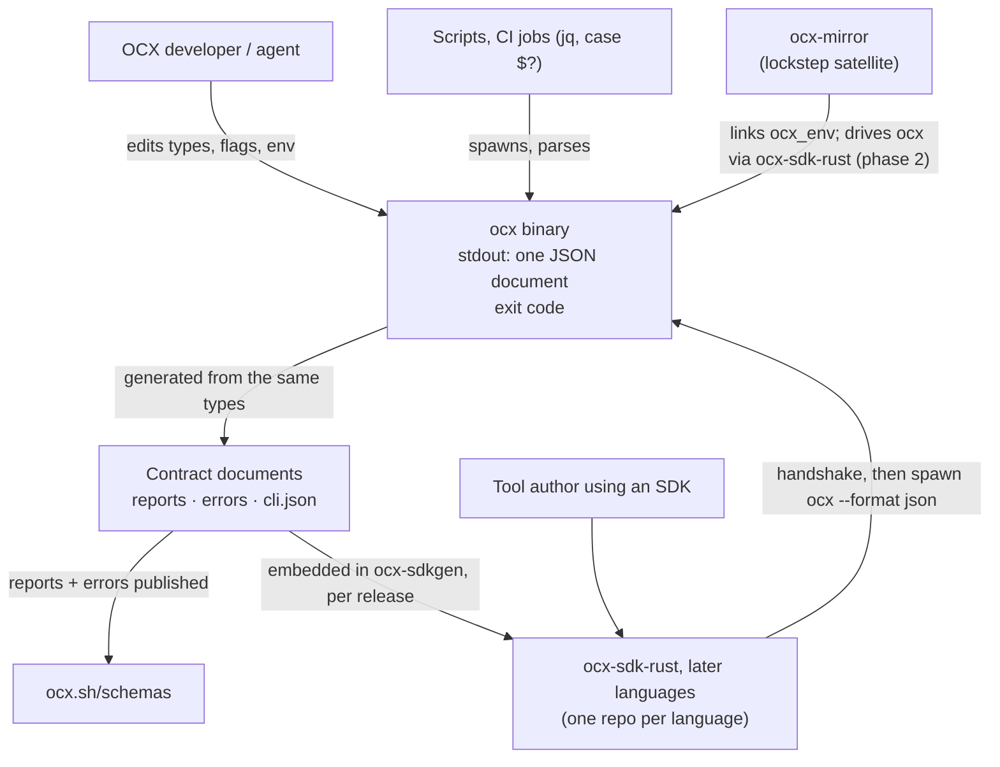
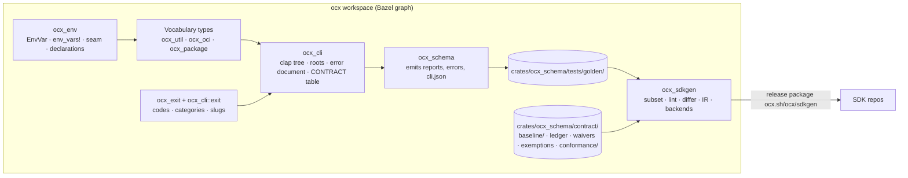

# System Design: The OCX machine-interface contract

## Metadata

**Status:** Accepted (with ADR)
**Author:** Architect (Opus)
**Date:** 2026-10-03 (round-1 review and validation fixes applied the same day)
**Beads Issue:** N/A
**Related ADRs:** [`adr_ocx_interface_contract.md`](./adr_ocx_interface_contract.md) (**the decision record; this document does not re-decide anything**), `adr_crate_split_workspace.md` (tiers, crate map), `adr_bazel_build_adoption.md` (clippy aspect, ratchet), `adr_test_speed_tiers.md` (T0 lints)

**Tech Strategy Alignment:**
- [x] Rust 2024, Bazel graph, `task` entry points. No new tool in `ocx.toml`; no new runtime dependency in `ocx`.
- [ ] Database, infrastructure tier, OpenTelemetry: not applicable (CLI binary and build-time tooling).
- [x] Deviations (Rust SDK runtime deps; typify if Option E wins) recorded in the ADR.

## Executive Summary

Three documents become the machine contract of `ocx`: the `reports` schema (every `--format json` root), the `errors` schema (error document plus exit-code, category and slug registry), and `cli.json` (grammar with full clap semantics, each command's output modes and version, and the env manifest). Shared vocabulary types and one env registry make them coherent by construction. A lint walker keeps them inside a positive representation subset. A compat differ over an explicit keyword allowlist compares them with the last release and passes a break only with a ledger entry and a version bump. An acceptance-suite hook validates real stdout against the schema, so the gate stays tied to the wire. `ocx-sdkgen` turns the documents into SDKs, Rust first.

---

## 1. Context (C4 Level 1)



| Actor / system | Type | Interaction |
|---|---|---|
| Script / CI job | System | Reads exit code first, then `schema_version`, then fields; ignores unknown fields and values |
| SDK user | Person | Calls typed functions; never sees argv or JSON |
| `ocx-mirror` | System, lockstep | Links `ocx_env` and other ecosystem crates from phase 0; drives `ocx` through the Rust SDK from phase 2; gated by `task satellite:contract` |
| SDK repos | System | Pin one `ocx-sdkgen` version (= one contract release), regenerate in CI, run the conformance corpus and an integration suite against a real `ocx` |

External `ocx-<name>` plugins (`adr_cli_plugin_pattern.md`) are outside `cli.json`; the root records `external_subcommands: true`.

---

## 2. Containers (C4 Level 2)



| Container | Tier | Purpose |
|---|---|---|
| `ocx_env` (new) | ecosystem | Bottom leaf crate (std only outside `__testing`, where the override table uses `tempfile`): `EnvVar`, `env_vars!`, the read seam, the test override table (moved from `ocx_util::env::overrides`), every OCX declaration, `RETIRED`. Every crate that reads env depends on it directly; `ocx_util` does not and keeps only `PATH_SEPARATOR` |
| `ocx_schema` | internal | Emits `reports`, `errors`, `cli` schemas and `cli.json` from the Rust types and the clap tree; golden byte tests; registry joins that need both sides (flag links, slugs) |
| `ocx_sdkgen` (new) | internal crate; its CLI and output layout are interface tier | Operates on the documents as JSON only (crate-map row `ocx_sdkgen = []`): representation subset, lint walker, compat differ, IR, backends. Its tests read the goldens and `contract/` as data, so the lint and gate do not rebuild on unrelated Rust edits. Phase 0 ships `subset` + `lint`; phase 2 adds the differ and backends |
| `contract/` | data | Baseline (last release), ledger, waivers, exemptions, conformance corpus; CODEOWNERS-protected |

---

## 3. Components (C4 Level 3)

### 3.1 Vocabulary types

| Concept | Type | Crate | Change |
|---|---|---|---|
| Identifier | `PackageRef`, `PinnedPackageRef` | `ocx_oci` | exists; reports stop using `OciIdentifier` and `String` |
| Digest | `Digest` | `ocx_oci` | exists; 19 bare-string sites adopt it |
| Platform | `Platform` | `ocx_oci` | exists (OCI object); 4 other shapes removed |
| Version | `Version` | `ocx_package` | exists |
| Timestamp | `Timestamp` | `ocx_util` | new; `ocx_util` gains `chrono` (workspace dep) |
| Size | `ByteSize` | `ocx_util` | new; schema `{"type":"integer","minimum":0,"maximum":9007199254740991}`; serialising a larger value is an error |
| Path | `AbsolutePath`, `RelativePath` | `ocx_util::fs::path` | `AbsolutePath` new beside the existing `RelativePath`; both get a `JsonSchema` impl |
| Registry | `RegistryHost` | `ocx_oci` | new |
| URL in error context | `RedactedUrl` | `ocx_oci` | new; userinfo and query credentials stripped at construction |
| Publisher payload | `OpaqueJson` | `ocx_util` | new; wraps `serde_json::Value`, serialises verbatim |

```rust
// ocx_util (ecosystem). Same pattern for every vocabulary type.
#[derive(Clone, Copy, Debug, PartialEq, Eq, PartialOrd, Ord)]
pub struct Timestamp(chrono::DateTime<chrono::Utc>);
impl Serialize for Timestamp { /* to_rfc3339_opts(SecondsFormat::Secs, true): always `Z` */ }
impl schemars::JsonSchema for Timestamp {
    fn schema_name() -> Cow<'static, str> { "Timestamp".into() }       // fixed: a Rust rename never renames the $def
    fn schema_id() -> Cow<'static, str> { "ocx::Timestamp".into() }    // fixed: no module-path dependence
    fn json_schema(_: &mut SchemaGenerator) -> Schema {
        json_schema!({ "type": "string", "format": "date-time", "description": "RFC 3339 instant in UTC (`Z`)." })
    }
}
pub struct OpaqueJson(pub serde_json::Value);   // schema: {"x-ocx-opaque": true, "description": "Publisher-supplied JSON, passed through unchanged."}
```

No new crate-map edges: `ocx_oci` and `ocx_package` already depend on `ocx_util`.

### 3.2 Report roots

```rust
// ocx_cli::api
pub trait Printable: serde::Serialize {
    /// In-band version of this root; changed only through the compat gate (ledger + bump).
    const SCHEMA_VERSION: u32;
    fn print_plain(&self, data: &DataInterface);
}

#[derive(Serialize)]
struct Versioned<'a, T: Serialize> {
    schema_version: u32,
    #[serde(flatten)]
    root: &'a T,
}
// Api::report, JSON branch: the single emit path. The `print_json` override hook is deleted
// together with the 5 envelope overrides (attestation, signature, sbom, verification, sweep).
FormatMode::Json => self.data.print_json(&Versioned { schema_version: T::SCHEMA_VERSION, root: item })?,
```

**Root wrappers.** `report_roots!` (`ocx_schema/src/reports.rs`) emits, per published root, a separate `$def` `<Name>Root` = `{"type":"object","properties":{"schema_version":{"const":N}, …the payload's properties},"required":["schema_version", …]}` built from `<T as Printable>::SCHEMA_VERSION` and the payload `$def`. The payload `$def` (e.g. `SignatureReport`) stays free of `schema_version` and is what other `$def`s reference, so `PackageInspect` nested in another report never claims a field it does not carry. Lint `L14` reds when a `*Root` `$def` is referenced from anywhere but the document's root list. `SweepReport<R>` is published once per `R` with its own wrapper and takes its version from `R` (`const SCHEMA_VERSION: u32 = R::SWEEP_SCHEMA_VERSION`), so each instance versions independently. A root whose payload does not serialise as an object fails `L09` before it fails at runtime in `#[serde(flatten)]`.

**Honest never-null.** Generation for `reports` and `errors` uses `SchemaSettings::draft2020_12().for_serialize()`. The `NeverNull` transform strips a `null` arm or `"null"` type entry **only from properties absent from `required`**: under `for_serialize`, schemars lists an `Option` field as required unless serde can skip it, so "not required" is the serializer's own evidence of omission. A required nullable property keeps its `null` and reds `L03`. Custom `Serialize` impls are covered by the runtime hook (§ 3.10). `normalize` and the `x-ocx-absent-when-none` marker remain only for `execution-record`. Properties of type `OpaqueJson` are leaves: no transform, lint or rename descends into them.

### 3.3 Error document and registry

```rust
// ocx_cli::error_document (renamed from error_envelope)
pub const ERRORS_SCHEMA_VERSION: u32 = 1;          // $id errors/v1.json moves with it

#[derive(Serialize, JsonSchema)]
pub struct ErrorDocument<'a> {
    pub schema_version: u32,
    /// Canonical command path; open string, its value set is gated in cli.json.
    pub command: &'a str,
    #[schemars(with = "u8")]                       // replaced by $ref ExitCode in ocx_schema
    pub exit_code: ocx_exit::ExitCode,
    pub error: ErrorBody<'a>,
}
#[derive(Serialize, JsonSchema)]
pub struct ErrorBody<'a> {
    pub kind: ocx_exit::ErrorCategory,
    #[serde(skip_serializing_if = "Option::is_none")]
    pub detail: Option<&'a str>,                    // schema: $ref ErrorDetail (registry, open)
    pub message: String,
    pub context: ErrorContext,                      // known keys optional; every value a vocabulary type
}                                                   // `remediation` deleted

// ocx_exit (interface tier; serde is its one dependency, no schemars): enum + doc table from one macro.
impl ExitCode { pub const ALL: &'static [ExitCode]; pub const fn summary(self) -> &'static str; pub const fn category(self) -> ErrorCategory; }

// ocx_cli::exit: the slug registry.
pub struct DetailEntry { pub slug: &'static str, pub exit_code: ExitCode, pub family: &'static str, pub summary: &'static str }
pub trait ClassifyErrorKind { const DETAILS: &'static [DetailEntry]; fn kind_detail(&self) -> &'static str; }
pub fn detail_registry() -> Vec<&'static DetailEntry>;   // every family's DETAILS
```

`ocx_schema` (crate-map row gains `ocx_exit` and `ocx_env`) builds the `errors` document: `ErrorDocument`'s derived schema plus three scalar-enum `$defs` in the open form of § 3.7: `ExitCode` (`{"type":"integer","x-ocx-enum":[{value, name, description, category}]}` from `ExitCode::ALL`), `ErrorCategory`, `ErrorDetail` (`{"type":"string","x-ocx-enum":[{value, description, exit_code}]}` from `detail_registry()`). These are lintable as scalar enums, not unions.

**Registry tests:** every slug the classify enumerator produces is registered; every registered slug has a producer; one slug maps to one exit code. Phase 1 adds a `ClassifyErrorKind` impl for each of the 70 `ClassifyExitCode` families; `collect_detail` iterates families instead of four hand-written downcasts.

**Context redaction.** `ErrorContext` fields are vocabulary types only (`PackageRef`, `Digest`, `RegistryHost`, `RedactedUrl`, paths); lint `L16` reds a free `string` or raw URL under `error.context`. `message` is built from `Display` chains, which never format a `Sensitive` value (§ 3.4). A poisoned-secret acceptance test (precedent: the `__testing` env-poison targets in `crates/ocx_cli/BUILD.bazel`) sets every `secret` variable and credential-bearing URL to a sentinel and fails on the sentinel in stdout or stderr across the error paths.

**One document per invocation.** Context-init failures and clap usage errors currently print nothing machine-readable. `main.rs` scans argv for `--format json` / `--format=json` / `--json` before parsing, stopping at the first `--` (so `ocx exec -- tool --format json` stays a plain usage error); when present, a usage error prints an `ErrorDocument` (`command` = the deepest path clap resolved, exit 64) and a context-init failure prints one with exit 78. `--quiet` suppresses reports only.

### 3.4 Env registry (`ocx_env`)

```rust
// ocx_env (ecosystem, std only outside `__testing`). Public API is the satellite API.
pub struct EnvVar {
    pub name: &'static str,                 // literal, or a pattern with one `{SLOT}` (OCX_AUTH_{REGISTRY}_TOKEN)
    pub doc: &'static str,                  // the declaration's doc comment; first line = summary
    pub value: EnvValue,
    pub on_invalid: OnInvalid,              // Error for hardening variables (OCX_FROZEN, OCX_OFFLINE, OCX_NO_VERIFY, …)
    pub visibility: Visibility,
    pub secret: bool,                       // never formatted, never in a warning, read only as `Sensitive`
    pub child: Child,                       // what a spawned child sees
    pub reader: Reader,
}
pub enum EnvValue { Bool, TriBool, String, Integer, Path, PathList, PathOrPem, HostList, Choice(&'static [&'static str]), Json }
pub enum OnInvalid { Default, Error }       // Error: exit 78 naming the key, never the value
pub enum Visibility { Public, Foreign, Plumbing, Testing }   // docs: Public+Foreign+Plumbing; SDK manifest + gate: Public
pub enum Child { Inherit, Scrub, Forward }  // Scrub derives CREDENTIAL_KEYS and the ocx_script deny set; Forward derives mirror's forward list
pub enum Reader { Ocx, Dependency(&'static str) }

impl EnvVar {
    pub fn get(&'static self) -> Option<String>;          // not generated for `secret` entries
    pub fn get_os(&'static self) -> Option<OsString>;
    pub fn get_raw(&'static self) -> Option<OsString>;    // value-preserving (PEM, paths with odd bytes)
    pub fn get_slot(&'static self, slot: &str) -> Option<String>;
    pub fn bool_or(&'static self, default: bool) -> Result<bool, InvalidEnv>;   // honours on_invalid
}
pub struct SecretVar(EnvVar);               // what `env_vars!` emits for `secret` entries
impl SecretVar { pub fn get(&'static self) -> Option<Sensitive>; }
pub struct Sensitive(String);               // no Display; Debug prints "<redacted>"; `expose(&self) -> &str`

pub fn dynamic(name: &str) -> Option<String>;   // data-derived names only (`${self.env.KEY}`, forge passthrough, mirror's computed auth names)
pub fn snapshot() -> Vec<(OsString, OsString)>;
pub fn all() -> impl Iterator<Item = &'static EnvVar>;   // every declaration in this build (Testing only with `__testing`)

#[macro_export]
macro_rules! env_vars { /* … */ }
// Expansion per entry: `pub static NAME: EnvVar` (or `SecretVar`), plus one `DECLARED: &[&EnvVar]` per invocation.
// Testing entries expand under `#[cfg(any(test, feature = "__testing"))]` and are excluded from DECLARED
// unless that cfg holds, so an ungated read is a compile error in a release build.

env_vars! {
    /// Disables network access when truthy.
    pub OCX_OFFLINE: Bool, Public, on_invalid = Error;
    /// OIDC bearer token for keyless signing.
    pub OCX_IDENTITY_TOKEN: String, Public, secret, child = Scrub;
    /// Registry token for one registry; `{REGISTRY}` is the registry slug.
    pub OCX_AUTH_TOKEN = "OCX_AUTH_{REGISTRY}_TOKEN": String, Public, secret, child = Scrub;
    /// Docker credential-store directory, read by the credential helper.
    pub DOCKER_CONFIG: Path, Foreign, reader = Dependency("docker_credential");
    /// CI-provided OIDC request token.
    pub ACTIONS_ID_TOKEN_REQUEST_TOKEN: String, Foreign, secret, child = Scrub;
    /// Fault stage injected into a project mutation (tests only).
    pub __OCX_TESTING_FAULT: String, Testing;
}
```

**Migration.** `ocx_util::env` moves into `ocx_env` except `PATH_SEPARATOR`, which stays for `ocx_util::path` (its 106 typed call sites change paths); `ocx_config::env::keys` is deleted and its 37 doc comments move into `env_vars!`; `CREDENTIAL_KEYS` becomes a function over `all()` filtered by `child == Scrub`. The `&str`-taking `var`, `flag`, `string` are removed, so a literal read stops compiling (V1). Flag links (`OCX_OFFLINE` ↔ `--offline`) live in a table in `ocx_cli` (`app::ENV_FLAGS: &[(&EnvVar, &str)]`), not on `EnvVar`; `ocx_schema` joins them into `cli.json` and checks every named flag exists.

**Satellite API.** `ocx-mirror` uses the same macro for its own variables (`GITHUB_ACTIONS`, `GITLAB_CI`, `NETRC`, its binary override), reads ocx's through `ocx_env` statics, computed auth names through `dynamic()`, and its forward list from `child == Forward`. The expansion's `feature = "__testing"` resolves in the calling crate, so each mirror crate invoking `env_vars!` declares a `__testing` feature, or `unexpected_cfgs` fires under `-D warnings`. A mirror `std::env` clippy ban is optional, mirror's call (residue: 45 `set_var`/`remove_var` calls in 5 test files). The `dynamic()` ratchet in ocx covers `//crates/...` only.

**Retired names.**

```rust
pub struct Retired { pub name: &'static str, pub replacement: &'static EnvVar, pub change: Change, pub status: Status }
pub enum Change { Rename, ValueRename { old: &'static str, new: &'static str }, Polarity }
pub enum Status { Window { removal: &'static str }, Removed }
pub static RETIRED: &[Retired];
```

Context init scans `snapshot()` once. `Window`: one stderr warning naming both keys (never the value); the old name is honoured when the replacement is unset; a `ValueRename` accepts the old spelling with a warning. `Removed`: exit 78 naming the replacement. `Polarity`: always `Removed` (honouring an inverted name would flip a hardening switch). A test reds a `Window` whose `removal` is at or below the crate version, which forces the flip to `Removed`. Open question 3 settles whether `deprecated.rs` also lists the in-window subset.

**Registry tests.** Names unique across `all()` and `RETIRED`. Prefix per visibility: `Public` `^OCX_[A-Z0-9_]+$`; `Testing` `^__OCX_TESTING_[A-Z0-9_]+$`; `Plumbing` `^__OCX_(?!TESTING_)[A-Z0-9_]+$`; `is_reserved_ocx_key` holds for every non-Foreign name. A name matching `TOKEN|SECRET|PASSWORD|KEY$` without `secret` reds. Docs are non-empty. Patterns carry exactly one `{SLOT}`. `ocx_shim` stays free of `ocx_env` (size budget); a test asserts its two literals are registry names. Release proof (V13): `cargo build --release -p ocx --locked` with a seeded ungated Testing read is red, because Bazel always builds `__testing` (`crates/ocx_cli/BUILD.bazel`).

### 3.5 Clippy ban wiring

| File | Content |
|---|---|
| `clippy.toml` (new, root) | `disallowed-methods` = `std::env::{var, var_os, vars, vars_os, set_var, remove_var}`, `reason = "read through ocx_env"`. LINT-09's other entries join through a follow-up issue |
| `.bazelrc` | `build --@rules_rust//rust/settings:clippy.toml=//:clippy.toml` |
| `BUILD.bazel` (root) | `exports_files(["clippy.toml"])` |
| `clippy-warn-baseline.json` | no `disallowed_methods` key: the ratchet counts it as 0, any hit reds `rust:clippy:check` |
| cargo lane | `cargo clippy` reads the root file natively |

The ban covers test code: tests set variables through the `ocx_env::overrides` table (moved from `ocx_util::env::overrides`), and the V0 seed includes a `#[cfg(test)]` module, so the wiring is proven on test targets too. Residue, each an `#[expect(clippy::disallowed_methods, reason = "…")]`, pinned per file by the `workspace_structure.rs` token scan (`RAW_ENV_RESIDUE`, every `cfg` arm and `build.rs` included): `ocx_env/src/lib.rs` (3: the `raw` seam body and the two `vars_os` arms of `snapshot`; the `overrides` table reads no process variable), `ocx_cli/build.rs` (3: cargo's build-script interface), `ocx_shim/src/main.rs` (2, `cfg(windows)`: no `ocx_env` edge, for its size budget; pinned by name to `OCX_HOME` and `OCX_BINARY_PIN`), `ocx_cli/src/app/seam.rs` (2: the `set_var`/`remove_var` of the test proving the seam ignores the process environment, which must set the real one), and `ocx_test_support/tests/workspace_structure.rs` (1: cargo's `CARGO`, read once by the `cargo()` helper). `env!`/`option_env!` are build inputs and are not banned. A crate-local `clippy.toml` would shadow the root file; the sync rule forbids one.

### 3.6 Grammar export (`cli.json`)

```rust
// ocx_schema::cli: walks `ocx::app::cli_command()` plainly; C07's literal defaults mean the clap build reads no env.
// Only the C07 test runs under `ocx_env::overrides::hermetic()`, so `ocx_env/__testing` stays a dev-dependency of `ocx_schema`.
#[derive(Serialize, JsonSchema)]
pub struct Cli { pub schema_version: u32, pub root: CommandSpec, pub env: Vec<EnvSpec>, pub retired: Vec<RetiredSpec> }

#[derive(Serialize, JsonSchema)]
pub struct CommandSpec {
    pub path: Vec<String>,                     // ["package", "push"]
    pub version: u32,                          // per-command contract version (gated)
    pub summary: String,
    pub hidden: bool,
    pub deprecated: Option<Deprecation>,       // from deprecated.rs RENAMED + REMOVAL_RELEASE
    pub external_subcommands: bool,
    pub output: Vec<OutputMode>,               // empty only for groups
    pub args: Vec<ArgSpec>,
    pub groups: Vec<GroupSpec>,                // clap ArgGroups: { id, args, required, multiple }
    pub commands: Vec<CommandSpec>,
}
#[derive(Serialize, JsonSchema)]
#[serde(tag = "type", rename_all = "snake_case")]
pub enum OutputMode { Report { root: String }, ReportThenFail { root: String }, Empty, Passthrough, ShellStream }

#[derive(Serialize, JsonSchema)]
pub struct ArgSpec {
    pub id: String, pub long: Option<String>, pub short: Option<char>, pub position: Option<u16>,
    pub value: ValueSpec, pub required: bool, pub num_args: Arity /* {min, max: Option} */,
    pub global: bool, pub hidden: bool, pub deprecated: Option<Deprecation>,
    pub default: Vec<String>,                  // literal, from the hermetic walk
    pub requires: Vec<String>, pub conflicts: Vec<String>,
    pub require_equals: bool, pub allow_hyphen_values: bool,
    pub last: bool, pub trailing_var_arg: bool, pub value_terminator: Option<String>,
    pub stdin_secret: bool,                    // value read from stdin, never argv
    pub help: String,
    pub env: Option<String>,                   // joined from ENV_FLAGS
}
#[derive(Serialize, JsonSchema)]
#[serde(tag = "type", rename_all = "snake_case")]
pub enum ValueSpec { Switch, Count, String, Integer, Path, Choice { choices: Vec<Choice> }, Identifier, Platform, Digest }
pub struct EnvSpec { pub name: String, pub value: String, pub visibility: String, pub summary: String, pub flag: Option<String>, pub secret: bool, pub on_invalid: String }
pub struct RetiredSpec { pub name: String, pub replacement: String, pub change: String, pub status: String, pub removal: Option<String> }   // from RETIRED; G13/G14 read these
pub struct Deprecation { pub replacement: String, pub removal: String }
```

- **Output modes and versions** come from one table, `ocx_cli::command::CONTRACT: &[(&[&str], u32, &[OutputMode])]`; a test reds a non-hidden leaf without an entry, an entry naming a missing command, a `Report*` root missing from the reports registry, and a registered root no command produces. Today's cases: `package sign` and sweep commands carry `ReportThenFail`; `exec` and `package exec` are `Passthrough`; `shell env --shell` / `--ci` emitters are `ShellStream`.
- **Semantics** are read from clap's `Arg` getters (`get_num_args`, `is_require_equals_set`, `is_allow_hyphen_values_set`, `is_last_set`, `is_trailing_var_arg_set`, `get_value_terminator`) and `Command::get_groups`. `requires`/`conflicts` come from the builder's relations; a probe test parses one valid and one invalid argv per declared relation and asserts clap agrees with the export (V5).
- **Hermetic defaults.** Phase 0 replaces `default_value_t = env::flag(..)` with literal defaults and applies env in `ContextOptions` (env layering moves out of the clap build). Lint `C07`: walking under the hermetic env and under every Public bool set truthy yields identical `cli.json`.
- `ValueSpec` is mapped from `Arg::get_value_parser().type_id()` through a closed table; an unmapped type panics (fail closed). `env` lists Public, Foreign and Plumbing entries; generators filter to Public.
- Outputs: golden `tests/golden/cli.json` (byte-compared from phase 0) and kind `cli` (JSON Schema of `Cli`, golden only, unpublished). The walker replaces `collect_clap_help_texts` in `app.rs`.

### 3.7 Representation subset

`ocx_sdkgen::subset` is the one definition the lint, differ and IR loader share.

| Construct | Required form | Notes |
|---|---|---|
| Object | `type: object`, `properties`, `required`; no `additionalProperties: false`, no `unevaluatedProperties` | Consumers ignore unknowns, so the schema must allow them |
| Map | `type: object`, `additionalProperties: <schema>` | |
| Array | `type: array`, `items: <schema>` | |
| Scalar enum | `type: string\|integer`, `x-ocx-enum: [{value, name?, description, category?, exit_code?}]`; no other entry member; no `enum`, no const-`oneOf` | Open by construction: a validator accepts any string/integer. `category` on exit codes, `exit_code` on slugs |
| Tagged union | `oneOf` of object arms, each with required `type: {const}`; exactly one arm `{x-ocx-unknown-variant: true, type: object, required: ["type"], properties: {type: {type: string, not: {enum: [known…]}}}}` (a payload missing its tag matches no arm) | Validators accept a new variant |
| Optional | absent from `required`; never `null` | |
| Opaque | `{x-ocx-opaque: true, description}` | Leaf; exempt from L03, L05–L07, L11 |
| Root wrapper | `<Name>Root` with `schema_version: {const: N}` first | Only in the root list |

**Keyword allowlist:** `$schema $id $defs $ref title description type properties required additionalProperties items oneOf const not enum(inside an unknown arm's not only) format pattern minimum maximum maxLength uniqueItems propertyNames x-ocx-enum x-ocx-unknown-variant x-ocx-opaque`. `maxLength`, `uniqueItems` and `propertyNames` come from input-contract types shared with `metadata` (`Entrypoints`, `Binaries`). The annotations `default`, `examples` and `$comment` are removed by a `StripAnnotations` transform in `reports`/`errors` generation only. Any other keyword (`allOf`, `anyOf`, `minItems`, `if`, …) anywhere reds `L17` and is `U01 unmodelled` in the differ.

### 3.8 Lint walker

`ocx_sdkgen::lint::run(doc: &Value, kind: Kind) -> Report { findings, visit }`, `$ref`-aware, visiting every `$def`, property, union arm, command and arg once. Test `tests/contract_lint.rs` (reads goldens and `contract/` as data):

1. Lint `reports`, `errors`, `cli.json`; subtract `exemptions.toml` (permanent, each citing an ADR) and every `waivers/<area>.toml` (ratchet; one file per area so parallel phase-1 work packages edit disjoint files); red on any remaining finding, on a waiver or exemption that matched nothing, or on an exemption without `adr`.
2. **Reader floor:** `visit.roots` == registry length; `visit.properties` ≥ an independent raw count of `properties` members; `visit.keywords` == independent raw key count; `visit.commands`/`visit.args` ≥ independent counts over `cli.json`.
3. **Red proof:** `tests/fixtures/contract_lint_red.json` (and a `cli` twin) produce exactly the full set of rule codes.

| Code | Rule | Document |
|---|---|---|
| L01 | no `anyOf` | reports, errors |
| L02 | no `type` array | reports, errors |
| L03 | no `null` outside opaque leaves | reports, errors |
| L04 | scalar enums use the `x-ocx-enum` form with only the § 3.7 entry members; no `enum` or const-`oneOf` | reports, errors |
| L05 | `oneOf` is a tagged union of § 3.7 with exactly one unknown arm (which requires `type`); no payload property named `type` | reports, errors |
| L06 | snake_case property names (absorbs `json_keys_are_snake_case.rs`; borrowed OCI names via exemptions) | reports, errors |
| L07 | snake_case string enum values | reports, errors |
| L08 | every property and `$def` has a non-empty `description` | reports, errors |
| L09 | every root wrapper is an object whose first required property is `schema_version` with a `const`; its properties equal the payload's plus one; no payload `$def` has a `schema_version` property | reports |
| L10 | no root has a top-level `error` property | reports |
| L11 | vocabulary by name: `identifier`/`*_identifier` → identifier `$def`; `digest`/`*_digest` → `Digest`; `*_at` → `Timestamp`; `size`/`*_size` → `ByteSize`; `*_path`/`*_dir` → `AbsolutePath` or `RelativePath`; `platform(s)` → `Platform`; `registry` → `RegistryHost` | reports, errors |
| L12 | no string property carrying a vocabulary `pattern`/`format` outside its `$def` | reports, errors |
| L13 | collections: no top-level `entries`; a root whose only payload is one array names it `items` | reports |
| L14 | a `*Root` `$def` is never referenced from another `$def` | reports |
| L15 | no `additionalProperties: false`, no `unevaluatedProperties` | reports, errors |
| L16 | every `error.context` property is a `$ref` to a vocabulary `$def` | errors |
| L17 | keyword outside the allowlist | reports, errors |
| L18 | `status` is a `$ref` to a scalar-enum `$def`; no `dry_run` boolean beside it | reports |
| C01 | every non-hidden command and arg has non-empty help | cli |
| C02 | a short letter has one meaning across the tree | cli |
| C03 | long flags kebab-case; choice values snake_case | cli |
| C04 | a flag name has one `ValueSpec` across commands | cli |
| C05 | env link derivation: `OCX_` + SCREAMING(long of the flag that departs from the default) | cli |
| C06 | output destinations spell `--output`/`-o` | cli |
| C07 | defaults identical under hermetic and populated env | cli |
| C08 | a flag whose `ValueSpec` or name marks a secret (`*token*`, `*password*`, `*key*` with a value) is `stdin_secret` or file-path-valued | cli |
| C09 | every non-hidden leaf has at least one `output` mode; every `Report*` root exists in `reports` | cli + reports |

Lint codes (`L`, `C`) and differ codes (`B`, `R`, `G`, `U`, `D`) are disjoint namespaces.

### 3.9 Compat gate

`ocx_sdkgen::compat::diff(base: &Value, current: &Value, kind: Kind) -> Vec<Finding>`; test `tests/compat_gate.rs` (phase 2). Comparison is structural: `$ref`s are resolved, `$def` names are not contract (buf `WIRE_JSON`); recursion enters `items` and `additionalProperties` with the same rules. Every keyword is classified by the § 3.7 allowlist; an unlisted keyword in either document is `U01`, breaking. The differ also counts keywords read against an independent raw count and reds below it. Excluded: the `schema_version` property and `$id` (the version step owns them), and each unknown-variant arm's `not.enum` list, which the differ derives from the known arms and skips (else a variant addition reads as an enum change inside `not`, and a removal reports twice).

**Roots and commands, three algorithms.** *Surviving* (in both): structural diff, findings attributed to every root that reaches the pointer. *Added*: no structural diff; must be lint-clean and at version 1. *Removed*: one finding `B01`/`G01` naming it; needs a ledger entry; no version check. `$defs` reachable from no root are ignored (no wire).

| Code | Breaking (output documents) | Code | Breaking (`cli.json`, input direction) |
|---|---|---|---|
| B01 | root removed | G01 | command removed, or hidden without `deprecated` |
| B02 | property removed | G02 | long flag removed or renamed outside a window |
| B03 | required → optional | G03 | short letter removed or changed |
| B04 | type or resolved target changed (incl. map values and array items) | G04 | required arg added, or arg became required |
| B05 | enum value or union variant removed | G05 | choice removed |
| B06 | `pattern`, `format`, `minimum`, `maximum`, `maxLength`, `uniqueItems`, `propertyNames` changed | G06 | `ValueSpec` changed |
| B07 | opaque ↔ structured | G07 | positional order, `num_args` narrowed, `last`/`trailing_var_arg`/`value_terminator` changed |
| D01 | `description` changed (needs `doc` or `semantic`) | G08 | flag no longer global |
| U01 | unmodelled keyword | G09 | default changed |
| R01 | exit code removed or renumbered | G10 | `requires`/`conflicts` added, group made required |
| R02 | code's category changed | G11 | `require_equals` turned on; `allow_hyphen_values` turned off |
| R03 | slug removed, or its exit code changed | G12 | output mode removed or changed (root rename, mode kind) |
| B08 | `x-ocx-enum` entry `name` changed (renames the generated SDK variant) | G13 | Public env removed or renamed without a `RETIRED` window |
| | | G14 | Public env value type changed, choice removed, or `on_invalid` → `Error` |
| | | G15 | `stdin_secret` changed |

**`x-ocx-enum` entries** are compared per member, keyed by `value`: `value` removed → B05; `name` changed → B08; `description` → D01; `category` → R02; `exit_code` → R03; any other member in either document → U01. One `compat_corpus/` case each.

Additive (reported, never red): roots, properties, enum values, union variants, commands, flags, choices and Public env added; optional → required on outputs; input constraints widened; visible → hidden with `deprecated` set; a hidden-deprecated item removed in its named `removal` release. The current release for that check is `ocx_sdkgen`'s `CARGO_PKG_VERSION` (the workspace version).

**Ledger** `crates/ocx_schema/contract/ledger.toml`:

```toml
[[break]]
document = "reports"                      # reports | errors | cli
subjects = ["PushReport", "CopyReport"]   # reports: root names; cli: command paths ("package push"); errors: ["*"]
rule = "B02"                              # a differ code, "doc", or "semantic"
pointer = "/$defs/PushReport/properties/digest"   # baseline document for removals/changes, current for additions
reason = "push reports the manifest digest under manifest_digest"
```

**Gate algorithm.** (1) Diff each document. (2) Every breaking finding needs an entry with the same `document`, `rule`, `pointer`, whose `subjects` ⊇ the roots or commands reaching the pointer; `D01` needs a `doc` (no bump) or `semantic` (bump) entry. (3) Every entry matches a finding, except `semantic`. (4) For each surviving root or command, version = baseline + 1 if any breaking or `semantic` entry lists it, else baseline; added = 1; removed = no check. For `errors`, in-band `schema_version` and the `$id` major = baseline + 1 when any breaking or `semantic` entry exists (a `doc` entry alone bumps nothing). (5) Any violation reds with the finding and the expected edit.

**Baseline** `crates/ocx_schema/contract/baseline/{reports.json, errors.json, cli.json, RELEASE}` holds the previous release, immutable between releases. `task contract:rotate` (run after the tag exists, its own commit) copies `git show <tag>:crates/ocx_schema/tests/golden/<file>`, writes `RELEASE`, truncates `ledger.toml`. T0 lint `test/lint/test_contract_baseline.py`:

- `RELEASE` matches `^v\d+\.\d+\.\d+$` and resolves with `git rev-parse --verify --end-of-options refs/tags/<v>^{commit}`; that commit is an ancestor of `HEAD`.
- Each baseline file equals the file at that tag.
- Let `T` = the newest ancestor tag of `HEAD` matching `^v\d+\.\d+\.\d+$` (`git describe --tags --abbrev=0 --match 'v[0-9]*'`, then the regex). Other tags (`backup/*`, `0.3.1`, `recovered/*`, …) never count. If `T` ≠ `RELEASE` and `HEAD` is not `T`'s commit, red: rotation pending. On the release commit itself (`HEAD` = `T`), green with the old baseline.
- Before the bootstrap rotation, `baseline/` does not exist. The `compat_gate` target is built from phase 2 on: its corpus and fixture cases always run; its live-repository case returns early only when `baseline/` is absent, a state `test_contract_baseline.py` proves legitimate (no bootstrap tag) or reds (rotation pending). The bootstrap tag is the release that first emits `schema_version`; cutting it and running `contract:rotate` are owner/release acts.

**Interim bump rule** (T0 lint `test/lint/test_contract_version_bytes.py`). Active iff a bootstrap tag exists and the gate is not live (`baseline/` absent, or no differ in `ocx_sdkgen`); permanent under a phase-2 no-go. It is never deleted: once the gate is live it is inert by its own activation rule. It reads the goldens at `T` (resolved as above) and at `HEAD`, no differ, no ledger:

- Report root: canonical JSON of its wrapper with every reachable `$def` inlined, `schema_version` excluded. Bytes differ → `const` = `T`'s + 1; equal → `T`'s.
- `errors`: the whole document, `schema_version` and `$id` excluded. Same rule for `schema_version` and the `$id` major.
- `cli.json`: each command node's own fields and args (not its subcommands). Same rule for `version`.
- Added item at 1; removed item unchecked. Any byte change bumps, a description edit included: over-bumping is the price of no differ.

### 3.10 Runtime conformance hook

The acceptance helper that runs `ocx --format json` (in `test/src/`) validates every captured stdout with `jsonschema` (precedent: `test_execution_records.py`) against the root selected by the command's `output` modes in the committed `cli.json` and `reports.json`/`errors.json`: an `error` key selects the error schema; otherwise the command's `Report*` root. A document matching no declared mode reds. The hook validates `ocx`'s own output **closed**: it first rewrites each `x-ocx-enum` into a JSON Schema `enum` of its values and drops each `x-ocx-unknown-variant` arm, so an unregistered status or union `type` reds (V11). The published schema stays open for consumers. Each run records the set of validated roots in its JUnit properties; `bazel:test:accept` (and `task test:parallel`) checks a floor of distinct roots validated, like `SUITE_FLOOR`. Phase 0: findings are recorded, not failed. Phase-1 exit: blocking.

### 3.11 Docs-coverage tests

| Test | Tier | Reads | Assertion |
|---|---|---|---|
| `test/lint/test_env_reference_coverage.py` (new) | T0 | `cli.json` `env`, `environment.md` | headings == Public ∪ Foreign ∪ Plumbing names (patterns literal); floor ≥ 50 headings and ≥ 50 entries |
| `test/lint/test_doc_command_reference.py` (extended) | T0 | `cli.json`, `command-line.md` | every non-hidden command node (groups included, 73 today) has its anchor; every non-hidden long flag appears in its command's Options block; every global flag appears in General Options; floor = measured node count − 3 |
| `C01`, `L08` | Rust | goldens | help and descriptions non-empty |

Both T0 tests read committed files only (`adr_test_speed_tiers.md` C-LINT); the golden byte test keeps `cli.json` fresh.

### 3.12 Consumer gate (`task satellite:contract`)

`satellite:verify` stays the build-and-closure check. `satellite:contract` adds the runtime arm. It builds the candidate `ocx` from the tree and runs mirror's acceptance suite (`ocx-mirror/test`, pytest) with `OCX_COMMAND` and `OCX_TEST_BINARY` both set to that binary. Mirror's `ocx_binary` and `real_ocx_binary` fixtures read those, and its runner derives `OCX_BINARY_PIN` from `OCX_COMMAND`. Mirror's Rust tests do not count: they drive stub binaries.

- **Strict decode.** Mirror's decoders carry no `#[serde(default)]` on any field mirror acts on, so a shape change is a decode error, never an empty value (the `SweepEnvelope.data` failure mode).
- **One test per site.** Each of the 6 spawn sites has one acceptance test, marked `ocx_contract_site("<site>")`, asserting on a parsed field.
- **Floor.** The job reds unless all 6 site ids passed against the candidate binary: none skipped, none on a stub.

So a shape change to a root mirror parses reds before release (V20, run per parsed root). From phase 2 it first regenerates `ocx-sdk-rust` from the in-tree goldens and builds mirror against it. It runs as a required job in `verify-deep` (not `continue-on-error`) and in the pre-ready gate, not in `task verify`. Mirror owns its pin skew: one mirror commit moves the submodule pointer, the released-binary pin and the SDK version together.

### 3.13 Sync rule

New file `.claude/rules/subsystem-interface-contract.md`:

```yaml
paths:
  - crates/ocx_env/**
  - crates/ocx_cli/src/api/data/**
  - crates/ocx_cli/src/command/**
  - crates/ocx_cli/src/options/**
  - crates/ocx_cli/src/app/context_options.rs
  - crates/ocx_cli/src/error_document.rs
  - crates/ocx_cli/src/exit/**
  - crates/ocx_exit/**
  - crates/ocx_schema/**
  - crates/ocx_sdkgen/**
  - website/src/docs/reference/environment.md
  - website/src/docs/reference/command-line.md
```

Body: the § 5 style guide, one line per rule; the counterpart table (env declaration ↔ `environment.md`; flag ↔ `command-line.md`; report field ↔ golden; slug ↔ `error.detail` docs; command output ↔ `CONTRACT`); the authorities (`contract_lint`, `compat_gate`, the conformance hook, the T0 tests); the semantic-break checklist ("does this change what an existing value or description *means*? then a `semantic` entry"); no crate-local `clippy.toml`. Same change: `.claude/rules.md` "By concern" and "By auto-load path" rows; declared-overlap rows for the two identical patterns (`crates/ocx_cli/src/command/**` with the `subsystem-cli-api.md` + `subsystem-cli-commands.md` group; `crates/ocx_schema/**` with `subsystem-metadata-schema.md`); `subsystem-cli-api.md` § JSON Serialization drops "flatten to inner array" and "`#[serde(untagged)]`" and points here. `task claude:tests` is the authority.

### 3.14 Generator (`ocx_sdkgen`) and conformance corpus

| Aspect | Contract |
|---|---|
| Inputs | `reports.json`, `errors.json`, `cli.json` embedded at build (`include_str!`; Bazel `compile_data`); `--contract <dir>` for development |
| Pipeline | JSON → `subset` check (refuses anything outside § 3.7) → `Ir { types, commands, exit_codes, categories, details, env, versions }` → backend |
| Rust types | Option D: owned backend (structs; unions with `Unknown(serde_json::Value)`; scalar enums `#[non_exhaustive]` with `Unknown(String\|i64)`; optional = `Option<T>` + `#[serde(default)]`; opaque = `serde_json::Value`). Option E: typify over the root wrappers + an owned post-pass adding `Unknown` arms. Chosen at the phase-2 go/no-go (ADR open question 1) |
| Rust command layer (owned in both) | `commands.rs` (args struct + fn per non-hidden leaf, argv rules of § 3.15), `exit.rs` (codes, categories, `is_success()` per status enum: known success values true, everything else false), `env.rs` (Public manifest), `contract.rs` (per-root, per-command, `errors` versions; minimum `ocx` release) |
| CLI | `ocx-sdkgen --lang rust --out <dir>`; deterministic output (sorted, no timestamps); interface tier |
| Distribution | `ocx.sh/ocx/sdkgen` at the `ocx` version, signed keyless under the release identity; SDK repos pin it by digest |
| Edges | crate-map `ocx_sdkgen = []`; deps `serde`, `serde_json`, `clap` (workspace); typify only under E |

**Conformance corpus** `crates/ocx_schema/contract/conformance/<case>/{instance.json, expect.json}`. Instances are captured from real output (the acceptance hook can dump them) plus synthetic mutations: unknown enum value, unknown union `type`, unknown property, omitted optional, `ByteSize` = 2^53−1, root version mismatch, `report_then_fail` document with a non-zero exit. `expect.json` is language-neutral: `{"decode": "ok", "unknown": ["/items/0/status"]}` or `{"decode": "refused", "error": "contract_mismatch"}` or `{"outcome": "failed_with_report", "exit_code": 65}`. Every backend's CI runs every case; the corpus lands in phase 2 before any second backend.

### 3.15 Rust SDK (`ocx-sdk-rust`, crate `ocx-sdk`)

```rust
pub struct Ocx { binary: PathBuf, globals: GlobalOptions, env: Vec<(OsString, OsString)>, limits: Limits }
impl Ocx {
    pub fn new(binary: impl Into<PathBuf>) -> Result<Self, Error>;   // canonicalised once
    pub fn discover() -> Result<Self, Error>;                         // OCX_BINARY_PIN, then PATH; Windows: ocx.exe only
    pub fn handshake(&self) -> Result<Handshake, Error>;              // `ocx --format json version`
    pub fn package_push(&self, args: &PackagePushArgs) -> Result<PushReport, Error>;              // Report mode
    pub fn package_sign(&self, args: &PackageSignArgs) -> Result<Outcome<SignReport>, Error>;     // ReportThenFail mode
}
pub enum Outcome<R> { Success(R), Failed { report: R, exit_code: ExitCode } }
pub enum Error {
    Spawn(std::io::Error),
    Ocx(ErrorDocument),                                        // typed exit code, category, detail
    ContractMismatch { subject: String, expected: u32, found: u32 },   // raised before spawning
    Unsupported { found: String, minimum: &'static str },
    InvalidArgument { arg: &'static str, reason: &'static str },
    Decode(serde_json::Error),
    OutputTooLarge, Cancelled,
}
#[cfg(feature = "tokio")] pub mod nonblocking { /* same surface over tokio::process; drop = cancel */ }
```

- **Refuse before spawn.** The handshake reads `contract` from `version`; each generated fn compares its command's version and every root in its output modes with `contract.rs` and returns `ContractMismatch` without spawning. The decoded payload's `schema_version` is checked again before decode.
- **Argv.** Each flag value is one `--long=value` token. A positional starting with `-` is `InvalidArgument` unless the grammar sets `allow_hyphen_values`; `last`/terminator operands follow `--`. `stdin_secret` flags take `&[u8]` written to stdin. Values never pass through a shell.
- **Spawn.** Child env = parent env minus `OCX_*` and `__OCX_*`, plus what the caller set through `Ocx::env`; stdin null unless a `stdin_secret` value is sent; stdout and stderr bounded by `Limits` (`OutputTooLarge`); cancellation sends an interrupt, then kills after a grace period (`Cancelled`).
- **Debug.** `Debug` on args structs prints `<redacted>` for `stdin_secret` fields and Public `secret` env values.
- CI regenerates with the pinned `ocx-sdkgen`, diffs the committed output, runs the conformance corpus and an integration suite against the pinned `ocx`.

---

## 4. File map

| Path | Phase | Role |
|---|---|---|
| `clippy.toml`, `.bazelrc`, `BUILD.bazel` | 0 | env ban, Bazel wiring |
| `crates/ocx_env/` incl. `BUILD.bazel` (new; crate map `ocx_env = []`) | 0 | `EnvVar`, `env_vars!`, seam, overrides, declarations, `RETIRED` |
| `scripts/crate_map.toml` | 0 | `ocx_env` edge on every crate that reads env today (seam or raw): `ocx_console`, `ocx_oci`, `ocx_trust`, `ocx_sign`, `ocx_config`, `ocx_store`, `ocx_index`, `ocx_package`, `ocx_shell`, `ocx_project`, `ocx_package_manager`, `ocx_announce`, `ocx_script`, `ocx_setup`, `ocx`. No `ocx_util` edge: it keeps `PATH_SEPARATOR` in `ocx_util::env`, its only use |
| root `Cargo.toml` | 0 / 2 | `[workspace.dependencies]` rows `ocx_env`, `ocx_sdkgen`; members 21 → 23 |
| `crates/ocx_cli/Cargo.toml` | 0 | `__testing` forwards `ocx_env/__testing` (policed by `testing_feature_forward_list_matches_grep`) |
| `crates/ocx_util/src/{time.rs, size.rs, opaque.rs}`, `fs/path.rs` | 0 | `Timestamp`, `ByteSize`, `OpaqueJson`, `AbsolutePath` |
| `crates/ocx_oci/src/{registry_host.rs, redacted_url.rs}` | 0 | `RegistryHost`, `RedactedUrl` |
| `crates/ocx_exit/src/*.rs` | 0 | `ALL`, `summary()`, `category()` |
| `crates/ocx_cli/src/command/contract.rs`, `app/env_flags.rs` | 0 | `CONTRACT` table, `ENV_FLAGS` |
| `crates/ocx_schema/src/{cli.rs, errors.rs}` (crate map `+= ocx_exit, ocx_env`) | 0 | export, `errors` kind |
| `crates/ocx_sdkgen/src/{subset.rs, lint.rs}`, `tests/contract_lint.rs`, `BUILD.bazel` | 0 | subset, walker |
| `crates/ocx_schema/BUILD.bazel` | 0 | `exports_files`/filegroup for the goldens, read by `ocx_sdkgen` tests as data |
| `crates/ocx_sdkgen/src/{compat.rs, ir.rs, rust/}`, `tests/compat_gate.rs` | 2 | differ, IR, backend |
| `crates/ocx_schema/tests/golden/{errors.json, cli.json, cli-schema.json}` | 0 | new goldens; `website/schema.taskfile.yml`, the website genrule and `main.rs` list them (8 published-or-golden schema files after phase 1) |
| `crates/ocx_schema/contract/{waivers/<area>.toml, exemptions.toml}` | 0 | ratchet (one file per area: `reports-g1`…`reports-g5`, `reports-emission` (L09, L14), `errors`, `cli`, `cli-env`), permanent exceptions |
| `crates/ocx_schema/contract/{ledger.toml, baseline/, conformance/}` | 2 | gate data |
| `test/src/` conformance helper | 0 | runtime validation |
| `test/lint/test_env_reference_coverage.py`, `test_contract_baseline.py`, `test_contract_version_bytes.py` | 0 / 2 / 2 | T0; the byte check lives from the bootstrap tag until the gate exists |
| `taskfiles/` `satellite:contract`, `contract:rotate` | 0 / 2 | consumer gate, rotation |
| release taskfile/workflow: `ocx.sh/ocx/sdkgen` publish step | 2 | signed keyless under the release identity |
| `.github/CODEOWNERS` entry for `crates/ocx_schema/contract/**` | 2 | baseline protection |
| `.claude/rules/subsystem-interface-contract.md`, `.claude/rules.md` | 0 | sync rule, catalog |
| `website/src/docs/reference/machine-interface.md` | 2 | consumer page: root convention, versions, open enums, outcomes, error document, exit codes |

## 5. Interface style guide

Each rule names its lint. Rules without a lint are reviewed by the sync-rule checklist.

| ID | Rule | Lint |
|---|---|---|
| IC-01 | One pretty JSON document per invocation under `--format json`, including usage and init errors | conformance hook, V12 |
| IC-02 | Every report root is an object led by `schema_version`, published as a top-level wrapper | L09, L14 |
| IC-03 | A list root is `{schema_version, items}`; `entries` is retired; nested collections use a plural noun | L13 |
| IC-04 | Unset optionals are omitted; `null` is never emitted outside opaque payloads | L03, conformance hook |
| IC-05 | Unions are internally tagged with `type`, with an unknown arm; no payload field named `type` | L05 |
| IC-06 | Keys and enum values snake_case on every surface (JSON, flag choices, env values) | L06, L07, C03 |
| IC-07 | Shared concepts use the vocabulary types and their `$def` | L11, L12 |
| IC-08 | Timestamps end `_at`, sizes end `size`, paths end `_path`/`_dir`, a home directory is `home`/`_home` | L11 |
| IC-09 | `status` is a named open enum; dry runs are a status value | L18 |
| IC-10 | Everything carries a description or help text | L08, C01 |
| IC-11 | One meaning per short letter (`-g`: ADR open question 2) | C02 |
| IC-12 | One value type per flag name; output destination is `--output`/`-o` | C04, C06 |
| IC-13 | Env name = `OCX_` + SCREAMING(long flag that departs from the default); positive `OCX_X`, negative `OCX_NO_X` | C05 |
| IC-14 | Internal variables are `__OCX_TESTING_*` (tests) or `__OCX_*` (plumbing); never `OCX_TEST_*` | registry test |
| IC-15 | Enum values and union variants are open in the schema; adding one is additive; success checks fail closed | L04, L05, compat classification |
| IC-16 | A value's meaning never changes under the same name; if it must, record a `semantic` break | sync-rule checklist |
| IC-17 | Publisher-supplied JSON is `OpaqueJson`, passed through unchanged | L03 exemption, V10 |
| IC-18 | Never `additionalProperties: false` in an output schema | L15 |
| IC-19 | `error.context` holds vocabulary types only; URLs are `RedactedUrl` | L16 |
| IC-20 | Defaults are literals; env applies in `ContextOptions`, not in clap | C07 |
| IC-21 | Every command declares its output modes and version | C09 |
| IC-22 | Exit code and `error.kind` name a caller's next action, never a feature; feature identity is an `error.detail` slug; ≥3 distinct slugs per code; 83–87 retired | `every_exit_code_carries_at_least_three_distinct_detail_slugs`, `retired_numbers_are_never_reused` |

## 6. Security

| Threat | Mitigation |
|---|---|
| Undocumented env inputs (the `OCX_TEST_FAULT*` [#571](https://github.com/ocx-sh/ocx/issues/571), `OCX_CEILING_PATH` [#572](https://github.com/ocx-sh/ocx/issues/572) class) | Ban + registry; two-way docs test; Testing entries cfg-gated in the macro, proven by a release cargo build |
| A retired hardening variable silently stops protecting | `RETIRED` warns in the window, exits 78 after; polarity never aliased; hardening variables `on_invalid = Error` |
| Secret values in logs, warnings, error documents, SDK `Debug` | `secret` → `Sensitive` (no `Display`); key-only warnings; `error.context` vocabulary-only (L16); poisoned-secret test; SDK redaction |
| Credentials leaking into children | `child = Scrub` derives `CREDENTIAL_KEYS`, the `ocx_script` deny set and mirror's forward list from one place |
| Option injection through an SDK | `--long=value` tokens; hyphen-leading positionals refused; `stdin_secret`; no shell |
| Mismatched or substituted binary | Handshake is a compatibility check, not a trust boundary: binary resolved once to an absolute path, `OCX_BINARY_PIN` preferred, Windows `.exe` only; per-command refusal before spawn |
| Tampered baseline or ledger weakening the gate | `RELEASE` validation against tags; CODEOWNERS on `contract/**` |
| Generator supply chain | `ocx.sh/ocx/sdkgen` signed, pinned by digest; oasdiff spike pinned with checksum and run without secrets |

Risks: see the ADR § Consequences.

---

## Changelog

| Date | Author | Change |
|---|---|---|
| 2026-10-03 | Architect (Opus) | Initial design |
| 2026-10-03 | Architect (Opus) | Round-1 review fixes: `ocx_env` leaf crate with satellite API, Testing cfg gating, retired names, `secret`/`child` split; root wrappers and honest never-null; open-enum subset with keyword allowlist; lint L14–L18, C07–C09; differ root algorithms, D01/U01, G10–G15; baseline rotation and bootstrap; runtime conformance hook; `satellite:contract`; output modes and grammar semantics in `cli.json`; conformance corpus; SDK outcomes, refusal before spawn, argv and spawn rules |
| 2026-10-03 | Architect (Opus) | Validation fixes: B1 strict mirror decode, named suite and site floor (3.12); W1 interim bump rule; W2 release-tag filter; W3 `doc` entry; W4 `x-ocx-enum` members, B08; W5 `ocx_env` edges; W6 mirror wiring; W9 closed producer hook; S1–S10; Accepted (with ADR) |
| 2026-10-04 | Builder (Opus) | IC-08 mirrors the rule: a home directory is named `home`/`_home` |
