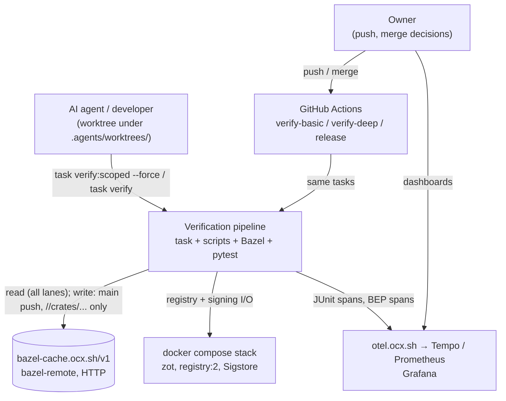
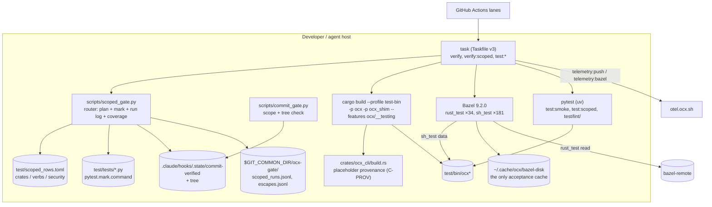

# System Design: Tiered verification pipeline

## Metadata

**Status:** Draft
**Author:** architect (hex-architect Phase 4, revised Phase 5 round 1)
**Date:** 2026-09-22
**Beads Issue:** N/A
**Related ADRs:** `.claude/artifacts/adr_test_speed_tiers.md` (decisions, contracts, trade-off matrix — not repeated here), `.claude/artifacts/adr_bazel_build_adoption.md`, `.claude/artifacts/adr_crate_split_workspace.md`

**Tech Strategy Alignment:**
- [x] Golden Path (Rust, Python/pytest/uv, Taskfile entry point, Bazel per its ADR)
- [x] Observability via OTLP to `otel.ocx.sh` (existing)
- [x] No deviation

## Executive Summary

The verification pipeline turns an agent's edit into a verdict through four tiers: an uncached lint tier, a cached inner loop, a full gate that the commit gate enforces at every WP merge commit and at finalize, and post-merge deep CI that runs acceptance cold. Acceptance verdicts are cached on the local disk only. This document shows the parts, how a one-crate Rust edit moves through them, what enters each cache key, and how each failure mode is detected.

---

## 1. Context (C4 Level 1)



| Actor/System | Interaction |
|---|---|
| Agent | Runs T1 per iteration; T2 before a WP merge commit and at finalize |
| `scripts/commit_gate.py` (git `commit-msg` hook) | Refuses a commit without a fresh mark of adequate scope; a merge commit needs a `full` mark for the same tree |
| bazel-remote | Shared action + test-result cache for `rust_test` only; never holds an acceptance verdict |
| Compose stack | Session-scoped registries for acceptance and smoke |
| OTel collector | Test spans (`ocx-tests`), build spans (`bazel-build`); never blocks |

---

## 2. Containers (C4 Level 2)



| Container | Technology | Purpose |
|---|---|---|
| `task` | go-task | The only entry point, local and CI |
| `scripts/scoped_gate.py` | Python stdlib (`tomllib`, `ast`) | Changed paths → decision, crate set, `acceptance_globs`; writes the mark and appends the run log; `--check-coverage` |
| `scripts/commit_gate.py` | Python stdlib | Mark scope/head/toplevel; merge commits: `full` + matching `tree` |
| `test/scoped_rows.toml` | TOML | Crate rows, `[verbs]` escalate entries, `[security]` escalate list |
| `pytest.mark.command` markers | pytest | Verb → module mapping, reviewed with the test |
| cargo test build | cargo, `[profile.test-bin]` if Stage 0 keeps it | Produces `test/bin/ocx*` |
| Bazel | rules_rust, rules_shell | Cached `rust_test`; acceptance `sh_test` cached locally, `external` for `UNCACHED_MODULES` (the only tag measured to stop result reuse; `no-cache` does not) |
| pytest | uv | Smoke, scoped modules, lint tier (uncached) |

---

## 3. Components (C4 Level 3) — the tiers

```mermaid
graph LR
    subgraph T0["T0 lint (uncached, ≤ 30 s)"]
        L1["test/lint/*.py<br/>LINT_FLOOR, forbidden-route conftest"]
        L2["scoped_gate.py --check-coverage"]
    end
    subgraph T1["T1 inner (verify:scoped)"]
        R1["task bazel:test:unit (floored)"]
        R2["cargo clippy -p crate"]
        R3["test:smoke (90 s budget)"]
        R4["test:scoped plan.acceptance_globs"]
    end
    subgraph T2["T2 full (task verify)"]
        F1["phase 1: lint, fmt, clippy, T0, bazel:pin:check"]
        F2["phase 2: builds, Bazel gates, bazel:test:unit"]
        F3["bazel:test:accept (local cache; UNCACHED_MODULES tagged external always run; NOCACHE on release:)"]
        F4["escape record (C-ESC)"]
    end
    subgraph T3["T3 deep (CI, main)"]
        D1["verify-deep.yml — acceptance cold"]
    end
    T0 --> T1
    T1 -->|"scoped mark + run log"| T2
    T2 -->|"full mark (tree) → merge commit / finalize"| T3
```



| Component | Responsibility | Depends on |
|---|---|---|
| Router (`classify`) | Path → security-escalate / crate / verb marker / escalate; union of globs | `cargo metadata`, `scoped_rows.toml`, module markers |
| Coverage guard | Every acceptance module in a row or marked; every `command/**/*.rs` marked or escalating; `[security]` ⊇ hex.md security globs | working tree, `.agents/memory/hex.md` |
| Lint tier | Structural sweeps; no binary, no registry, no `task` | working tree |
| Inner `rust_test` | Reverse-dependent unit tests, cached, per-target floor | Bazel graph |
| Smoke + scoped pytest | One happy path per verb + selected modules | `test/bin/ocx`, compose |
| Full gate | Everything; acceptance on local disk cache | all |
| Merge-commit guard | Merge commit needs `full` mark with `tree` = index tree | mark |
| Escape recorder | Failing module vs scoped runs on the WP tip's tree (`MERGE_HEAD^{tree}`, any worktree) → escape or unattributed | shared run log, JUnit |
| Release guard | Marker byte scan of every artifact + native exec check, before `host` | staged artifacts |

---

## 4. Data flow — a one-crate Rust edit (`crates/ocx_setup/src/…`)

```
1  agent edits crates/ocx_setup/src/profiles.rs
2  task verify:scoped --force
3  scoped_gate.py --plan
     changed = [crates/ocx_setup/src/profiles.rs]
     not in [security]; ocx_setup: rdeps < 4, not ecosystem, not in TABLE_ESCALATES
     decision = scoped; crates = [ocx_setup]
     acceptance_globs = [crates].ocx_setup
4  T0: test/lint (≤ 30 s) ; --check-coverage
5  cargo fmt --check ; cargo check --workspace ; cargo clippy -p ocx_setup
6  task bazel:test:unit   (bazel test //crates/... + per-target floor)
     cache hits outside rdeps(ocx_setup); executes its ~10 reverse-closure targets
7  cargo build --profile test-bin -p ocx -p ocx_shim --features ocx/__testing
     build.rs takes the __testing branch: no git read, fixed provenance
     → test/bin/ocx bytes = f(source, toolchain, features, profile)
8  test:smoke   (pytest -m smoke, ≤ 90 s)
9  test:scoped  (pytest over acceptance_globs)
10 mark {scope: scoped, head, toplevel, crates, tree = write-tree of index}; append scoped_runs.jsonl
11 ordinary commit (commit_gate.py accepts the scoped mark)
   … iterations …
12 WP merge: git merge --no-ff --no-commit → task verify (T2) on the merged tree
     bazel:test:accept: bin/ocx digest changed → cached modules execute;
                        UNCACHED_MODULES (tagged external) always execute
     failure + scoped run on MERGE_HEAD^{tree} (any worktree) that missed it → escape record
     full mark {tree = git write-tree of the index = merged tree}
13 merge commit → commit_gate.py: full mark, tree == index tree → admitted
14 finalize → push main → verify-deep (T3), acceptance cold on a fresh runner
```

Stage 0 times step 2 through step 10 on the **first** run after the edit; an unchanged re-run is reported separately.

A verb edit (`crates/ocx_cli/src/command/package_push.rs`) takes the modules whose `pytest.mark.command` names `package_push`; step 6 executes `ocx_cli`'s four targets and `ocx_schema`'s. An edit to `command/patch_common.rs` or `app/context.rs` escalates at step 3; so does `command/package_sign.rs` or anything under `crates/ocx_oci/` (`[security]`).

---

## 5. Cache-key composition per tier

| Tier / artifact | Key includes | Key excludes (by design or known gap) |
|---|---|---|
| T0 lint | — (uncached) | — no stale verdict is possible |
| `rust_test` action (Bazel) | rustc toolchain, crate `srcs`, transitive rlibs, `rustc_env`, `compile_data`, flags | build-script output: none exists — `crates/ocx_cli/BUILD.bazel` has no `cargo_build_script` |
| `rust_test` result | test binary digest, `data` runfiles, test env, test flags | — |
| cargo `test/bin/ocx` (after C-PROV) | source, toolchain, features, profile, placeholder table | git state, `CI`, `GITHUB_*` (read nowhere under `__testing`); host path (cross-machine unmeasured; no consumer without a remote writer) |
| acceptance `sh_test` result, cached modules | runner script, module file, `:suite_inputs` (`conftest.py`, `pyproject.toml`, `uv.lock`, `ocx.toml`/`ocx.lock`, `sigstore/**`, `src/**`, `tests/**` helpers + fixtures, `docker-compose.yml`, `zot-config.json`, `bin/ocx*` via `:suite_anchor`), the module's own `module_data` (ADR AM-10: files only some modules read — `scenarios/`, `specs/`, `recordings/`, `taskfile.yml`), flags | compose stack running state (bounded by the runner's host locks, ADR AM-9); reads no AST sees beyond `HAND_DECLARED_READS` / `IMPLIED_READS`; `env_inherit` values (one value per local machine; CI is cold) |
| acceptance `sh_test`, `UNCACHED_MODULES` | — (`external`; `no-cache` measured insufficient, WP-35) | — until their inputs are declared; the list must reach empty (ADR Stage 5) |
| smoke / scoped pytest | — (uncached; `--force` re-runs) | — |
| Remote tier | `rust_test` keys only; written only by the `main`-push lane | acceptance: never written (`.bazelrc:73`, read-only credential in `verify-deep.yml`) |

---

## 6. Failure modes and detection

| Failure mode | How it happens | Detected by | Response |
|---|---|---|---|
| Stale local verdict (undeclared input) | A cached module reads a path not in its inputs | `bazel:tag:guard` reds a module naming an undeclared root that is not in `UNCACHED_MODULES`, and `external` on any acceptance target not listed; `release:` NOCACHE; cold `verify-deep.yml` on `main` | Declare the input, or list the module and tag it `external` |
| Remote-poisoned acceptance verdict | — not reachable: no writer | `test_workflows.py` refuses an upload grant on any job but the `//crates/...` main-push job | A writer needs its own decision (ADR D6) |
| Provenance churn regresses | A new volatile field added to `build.rs` without a placeholder | Acceptance case asserting the exact version-report key set; local executed-count on a docs-only commit rises above 0 | Add the placeholder |
| Provenance leak into release | `__testing` enabled on a release build | `release_feature_set_excludes_testing_seams`; byte scan of every artifact for the three string markers before `host` (not the all-zero SHA — dependency bytes contain 40-zero runs); native exec check catches the zero SHA | Release blocked |
| WP merged on a narrow verdict | Agent skips T2 | `commit_gate.py` merge-commit clause; residual fast-forward path backstopped by finalize/main full mark | Run `task verify` on the merged tree |
| Escaped regression | T1 green, T2 red on a module outside the selection | C-ESC: records under the common git dir whose `tree` = `MERGE_HEAD^{tree}`, any worktree (`escapes.jsonl`, `ocx.gate.escape=true`); non-merge T2 runs stay unattributed | Add a marker or row |
| Security change routed narrow | Verb or security crate edit scoped | `[security]` escalation, one self-test red per glob; subset check vs hex.md | Add the glob |
| Row / marker drift | New module or command file unmapped | `--check-coverage` in T0 | Add the marker or row |
| Vacuous lint tier | `test/lint/` collects nothing, or silently grows slow | `LINT_FLOOR`; 30 s budget gate | Fix collection / split |
| Vacuous port | `#[ignore]`d or untargeted Rust port replaces a deleted case | Deletion guard requires an executed test name in `bazel:test:unit` JUnit | Refused at merge |
| Telemetry lies | `bazel-build` spans all carry error status (open anomaly) | Stage 0 planted-failure red/green on span status | Fix exporter before any panel is trusted |
| Cache outage | bazel-remote unreachable | Slower build, not a failed one (BZL-CACHE-26) | none |

---

## 7. Telemetry needed

| Signal | Carrier | Exists? |
|---|---|---|
| Per-case duration, suite, source, OS, git SHA | `ocx-tests` spans | yes |
| Tier of the run | span attr `ocx.gate` = `lint`/`inner`/`full`/`deep` | **new** |
| Tree identity | span attr `ocx.git.tree` = the mark's `tree` digest | **new** |
| Escape | `ocx.gate.escape=true` + `escapes.jsonl`; `unattributed` count | **new** |
| Acceptance executed vs cached | `bazel-build` summary span attrs `bazel.tests.executed`, `bazel.tests.cached` | **new**, after Stage 0 fixes span status |
| T1 per-step wall clock (first verification) | `ocx.gate=inner` child spans per step | **new** |
| Instance-wide AC/CAS hit rate | Prometheus `bazel_remote_incoming_requests_total` | yes |

Wall-clock panels must read per-run series, not the summed-duration panels (dossier Grafana finding; board fix out of scope).

---

## 8. Open questions

Tracked in `.claude/artifacts/adr_test_speed_tiers.md` § Open Questions (port-down scope, T2 engine for a changed binary, porting-worker model).

## Changelog

| Date | Author | Change |
|------|--------|--------|
| 2026-09-22 | architect | Initial design |
| 2026-09-22 | architect | Round 1: local-only acceptance cache, uncached list, merge-commit guard, security escalation, markers, run log, release guard; weekly uncached job dropped |
| 2026-09-22 | architect | Round-1 re-validation: `external` replaces `no-cache`; scan drops zero SHA; shared run log keyed on `MERGE_HEAD^{tree}`; one `tree` definition |
