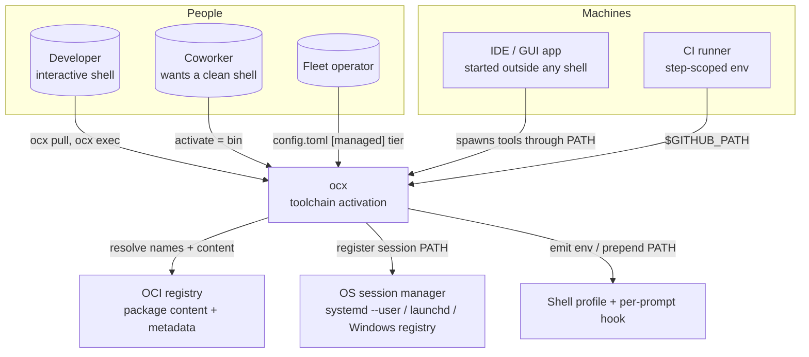
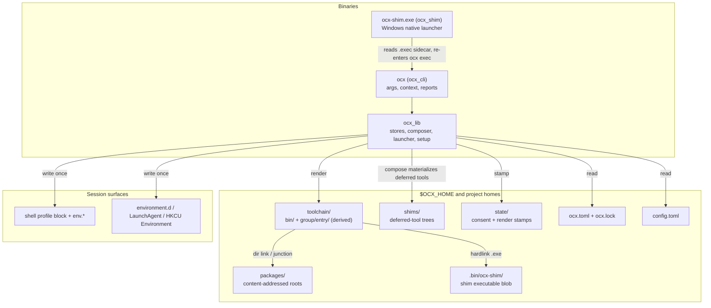
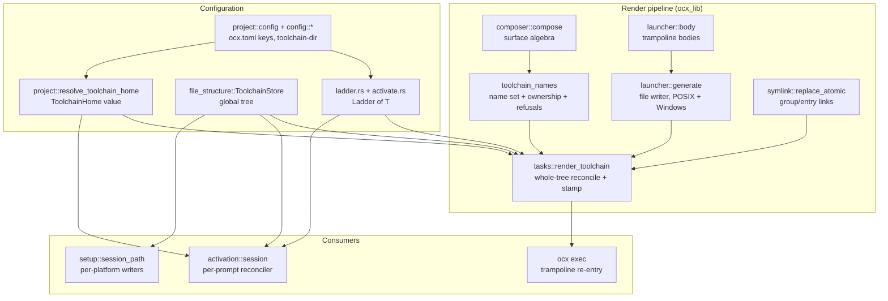
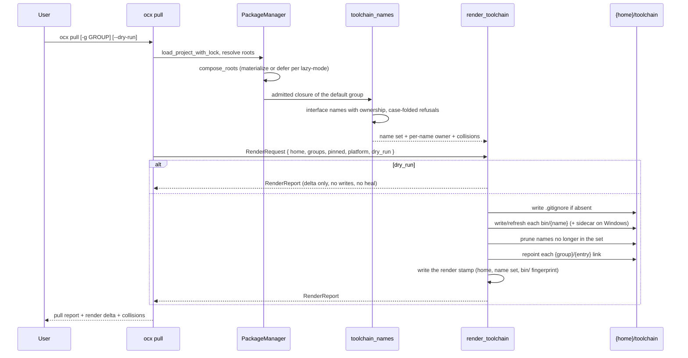
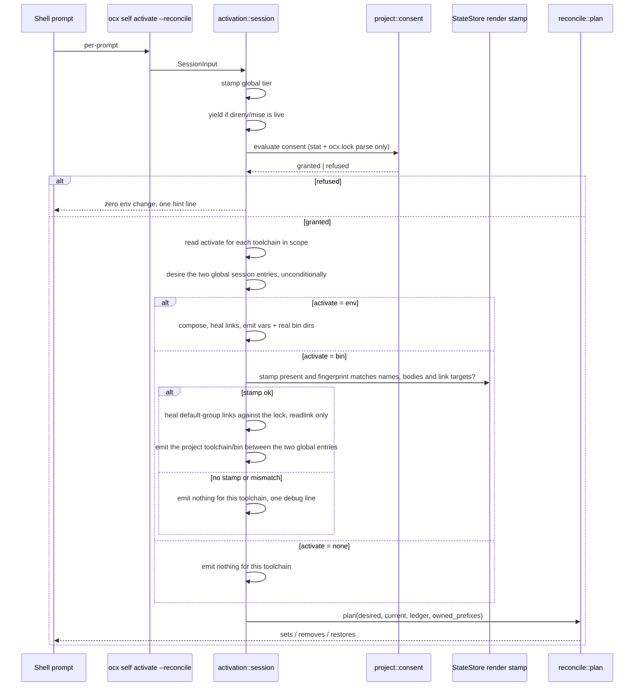
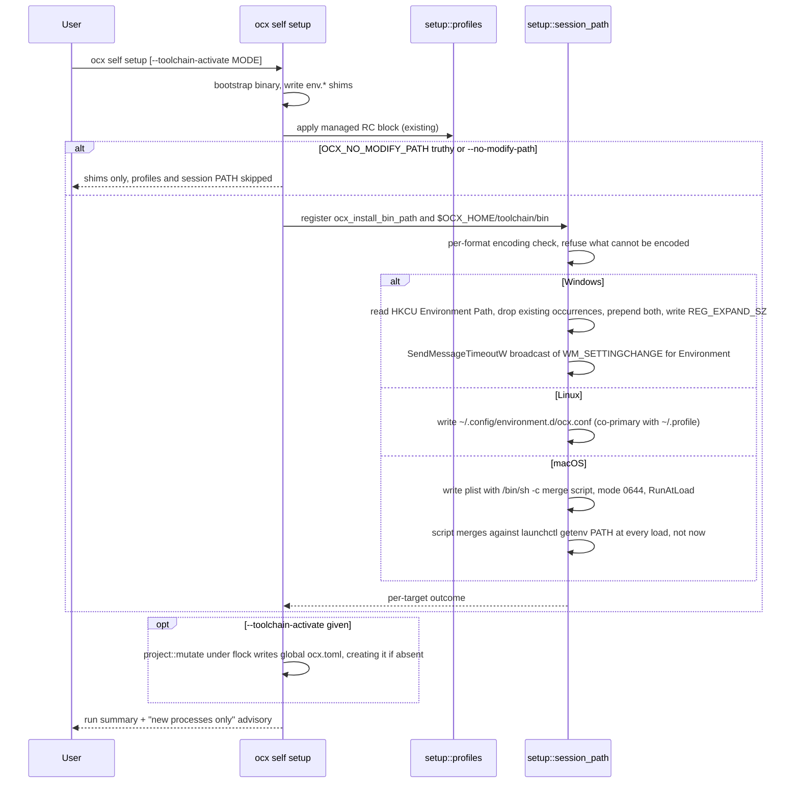

# System Design: Toolchain Activation

## Metadata

**Status:** Draft (review round 1 applied 2026-09-05)
**Author:** Principal Architect session
**Date:** 2026-09-04
**Related ADRs:** [`adr_toolchain_activation.md`](./adr_toolchain_activation.md) (the decision record — D1–D8 and the owner decisions D-1…**D-9**, the options matrix, the residual-risk register and the deferred list live there and are **not** repeated here), [`adr_project_toolchain_links.md`](./adr_project_toolchain_links.md) (amended predecessor), [`adr_shell_env_overhaul.md`](./adr_shell_env_overhaul.md) (the reconciler this joins), [`adr_windows_exe_shim.md`](./adr_windows_exe_shim.md) (the sidecar grammar — **D-9 adds a third extension, `.exec`, on its five shared read rules**), [`adr_lazy_package_loading.md`](./adr_lazy_package_loading.md) (the launcher producer reused)

**Tech Strategy Alignment:**
- [x] Rust 2024, Tokio — Golden Path
- [x] No new crates; `windows-sys` (already a workspace dependency) gains `Win32_System_Registry` and `Win32_UI_WindowsAndMessaging`
- [x] Python 3.13 + pytest for acceptance coverage
- [x] No deviation from `product-tech-strategy.md`

## Executive Summary

Every ocx toolchain gets a rendered directory under its own home: `bin/` holding one launcher trampoline per exposed tool name, and `<group>/<entry>/` holding directory links to package roots. A trampoline re-enters `ocx exec` against its own home, so it runs in the **composed toolchain environment** — the same one `ocx env` prints (ADR D2, decided as D-9). `ocx pull` renders the tree and writes a render stamp; a shell hook, an IDE setting, a CI step or a session-level PATH registration puts it in front of a process. The result is that a GUI application, a hookless IDE, a CI job and a coworker who refuses a per-prompt hook all reach the same toolchain the interactive shell already reaches — without changing what the interactive shell does, and without widening the consent model.

---

## 1. Context (C4 Level 1)

### System context diagram



### Actors and external systems

| Actor / System | Type | Description | Interaction |
|---|---|---|---|
| Developer | Person | Runs ocx directly in a terminal | `ocx pull` renders; the hook imports per `activate` |
| Coworker | Person | Wants project tools on PATH without a per-prompt env envelope | Sets `activate = "bin"`; the hook prepends two directories and exports nothing |
| Fleet operator | Person | Manages many hosts | Sets `toolchain-dir` and `activate` in a `config.toml` tier, including `[managed]`. **Cannot trigger the session-PATH registration from `[managed]`** — that needs `ocx self setup` in user context |
| IDE / GUI application | System | Process started before or outside any shell; never re-runs a shell hook | Resolves tool names through a PATH that a session registration or an IDE workspace setting supplied, **after `ocx pull`** |
| CI runner | System | Per-step environment that does not survive to the next step | `$GITHUB_PATH` (GitHub) or the toolchain `bin/` on the job PATH, after `ocx pull` |
| OCI registry | System | Holds package content and the metadata carrying `binaries` and `entrypoints` | Read during resolution; the name set needs a resolved metadata read, cached or fetched |
| OS session manager | System | `systemd --user`, launchd, Windows `HKCU\Environment` | Written once by `ocx self setup`; reaches processes started afterwards |
| Shell profile + hook | System | `~/.profile` managed block, `$OCX_HOME/env.*`, the per-prompt reconciler | Unchanged mechanism; gains one new import mode |

---

## 2. Containers (C4 Level 2)

### Container diagram



### Container descriptions

| Container | Technology | Purpose | Lifecycle |
|---|---|---|---|
| `ocx` CLI | Rust 2024, clap, Tokio | Parses, builds `Context`, calls a lib task, reports | Per invocation |
| `ocx_lib` | Rust 2024 | Owns the renderer, the name-set resolver, the launcher generator, the ladders, the setup writers | Library |
| `ocx-shim.exe` | Rust, `windows-sys`, no runtime deps | Reads its same-basename sidecar and re-enters `ocx` over the wire ABI. **Gains the `.exec` grammar** (third extension, third wire token) and strips `OCX_GLOBAL`/`OCX_PROJECT` before the spawn | Per exec on Windows |
| `<home>/toolchain/` | Directory tree | The rendered surface: trampolines plus package-root links | **Pure derived state.** Outside the GC graph; regenerated by `pull`/`add`/`remove`/`lock`/`update`; safe to delete |
| `state/` render stamp | JSON under the shipped `StateStore` | Records the resolved home, the computed name set and a fingerprint of `bin/`. Gates whether the hook may emit `bin/` in `bin` mode | Written at render, deletable at any time (deletion makes `bin` mode inert until the next render) |
| `packages/` | CAS | Assembled package roots the links target | Existing, unchanged |
| `shims/` | CAS-adjacent, **GC-rooted by lock pins** | Deferred tools' generated launcher trees | Existing, unchanged |
| Shell profile block + `env.*` | Managed text | Sources `ocx self activate` at shell start | Existing; unchanged by this work |
| Session PATH surfaces | Platform files / registry | Make the global `toolchain/bin` visible to processes started without a shell | **New**, written once by `ocx self setup`, opt-out via `OCX_NO_MODIFY_PATH`, un-written by `deregister_session_path` |

---

## 3. Components (C4 Level 3)



### Component responsibilities

| Component | Single responsibility | Depends on |
|---|---|---|
| `file_structure::ToolchainStore` | Owns the **global** `$OCX_HOME/toolchain/` layout grammar and its accessors. A `FileStructure` field, built once in `with_root` — never re-constructed by a literal path join | — |
| `project::resolve_toolchain_home` | Resolves a **project's** home to a `ToolchainHome` **value** — `<project>/.ocx/toolchain`, or `<toolchain-dir>/<project-key>/toolchain`. Not a store; managed via `project/`, per the predecessor ADR | `config`, `ReferenceManager::name_for_path` |
| `ladder::Ladder<T>` + `activate::ActivateMode` | One generic most-specific-first resolver with a literal floor, replacing two copies of `LazyModeLadder`'s shape | `project::config`, `env::keys` |
| `tasks::toolchain_names` | Turns an admitted closure — roots **and interface-admitted dependencies** — into the exposed name set **with per-name ownership**, and classifies collisions. **No refusals**: every collision is a debug note plus an `ocx inspect` row (owner decision D-4) | `composer`, `tasks::inspect`, `tasks::prepare_lazy` |
| `launcher::body::unix_trampoline_body` | Emits the POSIX trampoline body: `unset OCX_GLOBAL OCX_PROJECT`, then a re-entry into `ocx exec` with the home selector as a **single-quoted literal** (`--project '<root>'`) or as `--global` | `launcher::safety::LauncherSafeString` |
| `launcher::generate` (extended) | Writes one launcher per name — **one shape, no per-entry variants**; on Windows writes `.exe` then the `.exec` sidecar | `ShimBinStore`, `shim.rs` |
| `tasks::render_toolchain` | Whole-tree reconcile — write, repoint, prune — then write the render stamp; report the delta under `--dry-run` | all of the above, `StateStore` |
| `activation::session` (amended) | Imports each toolchain per its `activate`; checks the render stamp before emitting in `bin` mode; adds the consent-scoped project prefix to `owned_prefixes` | `shell::reconcile::plan`, `project::consent`, `StateStore` |
| `setup::session_path` | Registers and de-registers the global directories at session level, per platform, with per-format encoding validation | `setup::rc_block` conventions |
| `ocx_shim::core` | Reads its sidecar, applies containment where the grammar has a path to contain, re-enters over the wire ABI. **Extended by D-9**: the `.exec` extension and its clause, `WIRE_SUBCOMMAND_EXEC`, the root-flag-first child-line arm, and the `OCX_GLOBAL`/`OCX_PROJECT` strip. `.shim` and `.shimref` are untouched | `windows-sys` (`Win32_System_Environment` added) |

---

## 4. Flows

### Flow A — render at `ocx pull`



Ordering notes that are contracts:

1. **Render is a whole-compose pass after roots resolve**, not a per-package hook inside `setup_owned_impl`. `ocx.lock` carries no `binaries` and no `entrypoints`, so the name set needs a resolved metadata read; and collision resolution is a property of the whole composition.
2. **Scope differs per artifact.** `bin/` always covers the **default group**. `<group>/<entry>` links follow `pull`'s shipped `-g` default: bare `ocx pull` renders links for **every** `[tools]` and `[group.*]` entry in the lock, `-g` narrows.
3. Under `pinned = true` the **entire** link pass is suppressed — no writes and **no prunes** (RUL-23). Trampoline bodies are unaffected: every body is byte-identical whatever `pinned` says (C-046, D-9), so flipping the key changes no file under `bin/` and takes effect at the next re-entry with no re-render. *(Corrected 2026-09-06 — see § Amendment; the note previously read "each trampoline bakes a digest root", which D-9 had already made false.)*
4. A write failure is **skip-and-continue**: warn, compose digest paths for this run, exit 0.
5. **`--dry-run` writes nothing, including repairs** — it performs no heal, so a poisoned link is still present afterwards.
6. Rendering a **project** tree registers the project in the `projects/` GC ledger; rendering the **global** tree registers nothing (ARCH-1b).

### Flow B — trampoline exec

*(Rewritten 2026-09-05 for ADR D-9. The trampoline re-enters `ocx exec`, not `ocx launcher exec`; deferred materialization is no longer a branch of this flow — it happens **inside** the composition, through the shipped lazy shim slots.)*

```mermaid
sequenceDiagram
    participant P as Any process
    participant T as toolchain/bin/{name}
    participant X as ocx exec / ToolchainExec
    participant C as compose_roots
    participant Tool as real binary

    P->>T: exec {name} args...
    alt POSIX
        T->>T: unset OCX_GLOBAL OCX_PROJECT
        T->>X: --project '{abs project root}' exec -- {name} args
    else Windows
        T->>T: ocx-shim.exe reads {name}.exec
        T->>T: SetEnvironmentVariableW: drop OCX_GLOBAL, OCX_PROJECT
        T->>X: --project "{abs project root}" exec -- {name} args
    end
    X->>X: load_project_with_lock_consenting (records consent, never gates)
    X->>X: empty group selection expands to DEFAULT_GROUP; read pinned + lazy-mode ladders
    X->>C: compose_roots(requests, host, Materialization::Install)
    C-->>X: roots (a deferred tool resolves to its lazy shim slot)
    X->>X: compose project [env] + group [env], apply_child_env
    X->>X: resolve {name} on the composed PATH, minus both trampoline dirs
    X->>Tool: exec with the composed toolchain environment
```

Contracts this flow pins:

- **The baked home selector is single-quoted.** `LauncherSafeString` rejects `' " \n \r \0` and deliberately admits `$`, backtick, `\` and `%`. Its premise is the single-quoted context the shipped bodies use, so the trampoline emits `--project '{abs project root}'` — never a double-quoted form, which would run `$(…)` out of a project's own directory path. A root containing `'` or a newline is refused at render, naming the path.
- **Both selectors are stripped first, and that is not cosmetic.** `check_global_project_exclusivity` (`crates/ocx_cli/src/app/context.rs:1217-1228`) refuses a set `OCX_GLOBAL` beside an explicit `--project`, and a set `OCX_PROJECT` beside `--global`, with exit 64. Without the strip, one exported variable in a caller's environment breaks every trampoline on their PATH.
- **The re-entry target is the toolchain-tier `ocx exec`** (`ToolchainExec`), never the OCI-tier `ocx package exec`, which takes package identifiers and reads no `ocx.toml`.
- **Nothing about the composition is baked.** `pinned`, `lazy-mode`, group selection and project `[env]` are read at re-entry through the same ladders `ocx env` uses. An empty group selection expands to `DEFAULT_GROUP` (`crates/ocx_cli/src/command/toolchain_exec.rs:158-162`), which is exactly the set `bin/` renders.
- **Deferred materialization is inside the composition, not in the trampoline.** `compose_roots(..., Materialization::Install, ...)` (`toolchain_exec.rs:227-229`) installs on miss and routes a `lazy-mode = always` tool to its shim slot, whose `.shimref` reaches `launcher shim` on first invocation. The trampoline bakes no pinned identifier and produces no `.shimref`.
- **A package `ocx clean --force` collected is re-fetched**, because the composition installs on miss. What stays stale is the *dereference* consumer — a `<group>/<entry>` value already exported into a live shell — until the next composing emit heals it.
- **No self-referential loop, and it is a contract this work writes.** The composed **lookup** PATH excludes `$OCX_HOME/toolchain/bin` and the home's `toolchain/bin`; the **child's** PATH keeps both, so tool-to-tool nesting still resolves through trampolines. `Env::resolve_command`'s bare-name OS fallback (`crates/ocx_lib/src/env.rs:825-829`) becomes `env::CommandResolutionError` (65) rather than handing the name to `execvp` and the ambient PATH. With a global and a project trampoline directory both on PATH, an invocation terminates in one hop.
- **`exec -a` argv0 spoofing is bounded.** The forwarded name is only a name to resolve on the composed PATH of the home the baked selector names; it cannot reach outside the composition.
- **Consent is recorded, never gated.** `load_project_with_lock_consenting` (`crates/ocx_cli/src/app/project_context.rs:345`) stamps exactly as `ocx exec` does. ADR DD4 is unchanged.
- **Cost is zero on the common path.** In an `env`-mode shell the real bin dirs precede the session-PATH trampoline dir, so this flow does not run. When it does run, it costs one full composition — see § *Non-Functional Requirements*.

### Flow C — hook import, per `activate` × `pinned`



Contracts:

- **The two global session entries are desired in every mode**, `ocx_install_bin_path` and `$OCX_HOME/toolchain/bin`. They are what `ocx self setup` registered at session level, and `owned_prefixes` is `$OCX_HOME`, so leaving them out of the desired set does not mean "left alone" — `repair_owned_segments` deletes them (`crates/ocx_lib/src/shell/reconcile/plan.rs:97-135`). *(cross-model gate, 2026-09-05)*
- **The project's `<home>/toolchain/bin` is emitted only in `bin` mode**, between the two global entries: `ocx_install_bin_path`, then the project dir, then `$OCX_HOME/toolchain/bin`. A trampoline reached through the session PATH runs with `OCX_BINARY_PIN` unset, so its `${OCX_BINARY_PIN:-ocx}` falls back to a bare PATH lookup — ocx's own binary directory ahead of both trampoline dirs means that lookup can never land in a repository-controlled directory. In `env` mode the project dir is rendered and not emitted, and the real-dir prepends land ahead of everything, which is why a trampoline never runs in an activated shell.
- **The render stamp is the gate, and it is a fingerprint compare, not a compose.** A fresh clone with a force-committed `bin/cmake` has no stamp, so `bin` mode emits nothing and the hostile file never reaches PATH. Repair is `ocx pull`'s job, not the prompt's.
- **The fingerprint covers the link targets too, and `bin` mode heals them before emitting.** *(cross-model gate, 2026-09-05; narrowed 2026-09-05 by D-9.)* A trampoline no longer dispatches through `<group>/<entry>` — it composes from the lock — so a repointed link cannot make the wrong package run through one. The links are authenticated because they are still **consumed**: the `env`-mode PATH prepends and every dereference value resolve through them, and the heal needs a fingerprint to know it has work. A branch switch at the same project path can repoint an entry at a different but validly installed package while every launcher body stays identical, and no consumer of the link holds lock context to notice. So the stamp carries the sorted `<group>/<entry>` → digest-root pairs, and after the stamp passes the hook runs the predecessor ADR's lock-only heal narrowed to the default group: one `readlink` per entry compared against the lock-derived digest root, `lock_scoped` repoint on mismatch, no compose and no metadata read. Cost is N readlinks per prompt for N default-group entries.
- **`owned_prefixes` is `$OCX_HOME` plus the consented in-scope project's home** — never the bare `toolchain-dir` root. `repair_owned_segments` treats an owned prefix as a deletion authority, so owning `/usr` would strip `/usr/bin`.
- **Consent ordering is inherited, not re-decided.** `activate` lives in `ocx.toml`, which is deserialized *after* consent, so reading it cannot become a pre-consent parse. Heal runs strictly after consent.

### Flow D — session PATH registration at `ocx self setup`



**Encoding is per format, and what cannot be encoded is refused before writing**, with an error naming the offending path — `%` is admissible in a package root by design, and `$OCX_HOME` is user-chosen.

| Format | Structure | Refused | Escaped |
|---|---|---|---|
| `environment.d` | line-structured `KEY=VALUE`, `${FOO}` expansion at read | `\n`, `\r`, `$` | — |
| LaunchAgent plist | XML | control characters XML 1.0 forbids | `&`, `<`, `>` — launchd silently no-loads a malformed plist, so escaping is the only diagnosable outcome |
| `HKCU\Environment\Path` | `REG_EXPAND_SZ`, `%…%` expands at read | `%` — no escape exists | — |

**The macOS agent merges at load, not at setup** *(cross-model gate, 2026-09-05)*. launchd runs no shell, so a plist argument reaches `execve` verbatim and a literal `$PATH` in it would be four characters — which is why the `ProgramArguments` are `/bin/sh -c <script>` rather than `launchctl setenv PATH <literal>`. The script runs at every load: read `launchctl getenv PATH`, fall back to launchd's default set when empty, drop any prior occurrence of the two OCX directories, re-prepend them, `launchctl setenv PATH` the result. **Each directory appears once, bound single-quoted to a shell variable at the top of the script; every later use is a `"$var"` expansion**, so a `$`, backtick or `\` in `$OCX_HOME` is inert at both the `grep -vxF` and the final `setenv`. `LauncherSafeString` is *not* the guarantee — it rejects only `'`, `"`, `\n`, `\r`, `\0` (`crates/ocx_lib/src/package_manager/launcher/safety.rs:47`), which is what a single-quoted context needs and nothing more. The writer refuses an `$OCX_HOME` containing `'` or a newline, naming the path, as the other two writers do for their own unencodable characters; `&`, `<`, `>` are XML-escaped. A setup-time snapshot was the earlier design and was wrong: it replayed the PATH of the day it was written at every subsequent login, silently reverting anything another tool had added since.

**Three promises this flow does not make**, stated in the run summary and the docs: an already-open terminal or IDE seeing the change without restart; winning a collision against the Windows System PATH; PATH visibility on a Linux desktop that is neither a systemd-user session nor profile-sourcing, or inside a Flatpak/Snap sandbox. On macOS there is a fourth: another tool that calls `launchctl setenv PATH` later in the same session simply wins by running last.

**Removal** is `deregister_session_path`, a library counterpart to each writer, and it is **subtractive on every platform** — it removes the two OCX segments from the current value and rewrites the remainder, never clearing or unsetting the variable. On macOS that means unload, delete the plist, `launchctl getenv PATH`, subtract, `launchctl setenv PATH`; **`launchctl unsetenv PATH` is forbidden**, as it would strip every other tool's segment from the whole GUI session. No CLI grammar yet; the ADR documents the three manual removal locations until `ocx self uninstall` exists.

---

## 5. Data Contracts

### Sidecar contents (shared read rules; one new extension)

*(Retitled 2026-09-05 — ADR D-9 adds `.exec`, so "reused unchanged" is no longer true. A sidecar's file extension selects its wire verb, and `ocx exec` is not a verb either shipped extension can express.)*

| File | Payload | Wire verb | Containment |
|---|---|---|---|
| `<name>.exec` | one line: an absolute path (the project root), **or** the literal `global` | `WIRE_SUBCOMMAND_EXEC` — emitted as `--project "<root>" exec` / `--global exec` | none — the value is a **project selector**, not a package root; `ocx` re-resolves it through the ordinary project chain |
| `<name>.shim` | one line, absolute package root | `launcher exec` | canonicalize, then component-wise `starts_with` against `$OCX_HOME\packages` and the two scratch roots |
| `<name>.shimref` | one line, pinned identifier | `launcher shim` | none by design — no local path exists; digest-addressed content-verified fetch stands in its place |

`.shim` and `.shimref` are **unchanged**, and a trampoline writes neither: only `.exec` appears under `toolchain/bin/`. The other two keep their shipped producers — `entrypoints/` launchers and lazy shim slots.

Read side, shared by all three: 32 KiB cap before any further work, exactly one line, one terminator stripped, no NUL/CR/LF, UTF-8, then the per-grammar clause. The reader re-validates independently of whatever wrote the file.

**One structural difference the `.exec` arm carries.** `build_child_command_line` emits `<program> <verb> "<value>" -- "<stem>" <argv…>` for the two shipped grammars — value after verb. A project selector is a **root** flag, so the `.exec` arm emits `<program> --project "<root>" exec -- "<stem>" <argv…>`, and the `global` value emits `<program> --global exec -- "<stem>" <argv…>` with no value token at all. Every token still goes through the `CommandLineToArgvW` quoter.

**Environment strip, Windows.** `CreateProcessW` runs with `lpEnvironment = NULL` (`crates/ocx_shim/src/main.rs:640`), so the child inherits the shim's own block; the shim calls `SetEnvironmentVariableW(name, NULL)` for `OCX_GLOBAL` and `OCX_PROJECT` before the spawn. That is the counterpart of the POSIX body's `unset`, and it is why `windows-sys` gains `Win32_System_Environment`.

### Launcher bodies

**POSIX trampoline — one shape, no variants.** Two values are baked, each **inside single quotes**: the home selector and the absolute `ocx` install path. *(Body updated 2026-09-06 to what shipped — D-V3 `${0##*/}`, D-V19 the baked install path, D-V12/D-V23 the marker line. See § Amendment.)*

```
#!/bin/sh
# ocx-toolchain-trampoline
unset OCX_GLOBAL OCX_PROJECT
__ocx_binary='<abs ocx install path>'
exec "${OCX_BINARY_PIN:-$__ocx_binary}" --project '<abs project root>' exec -- "${0##*/}" "$@"
      … the global home renders `--global` in place of `--project '<…>'`
```

Line 2 is exactly `env::TRAMPOLINE_MARKER` — the POSIX half of `is_ocx_trampoline`, anchored to the whole of that line, and the constant is interpolated from `env.rs` rather than re-spelled so the writer and the predicate cannot drift (D-V12, D-V23). `__ocx_binary` is `$OCX_HOME/symlinks/<ocx cli id>/current/content/bin/ocx` derived at render time, falling back to the bare word `ocx` only when that path does not exist then (D-V19); `OCX_BINARY_PIN` still overrides both. The invoked name comes from the `${0##*/}` shell builtin, never a forked `basename`, which would have resolved out of the ambient `PATH` (D-V3).

There is no deferred variant and no pinned variant: `pinned` and `lazy-mode` are read at re-entry, and a deferred tool is materialized inside the composition through its lazy shim slot. `$0` is read for the basename only, never for self-location, since `toolchain-dir` can put the home where no `$0` walk reaches the project.

**Windows.** `<name>.exe` hardlinked from `ShimBinStore`, then the `.exec` sidecar — `.exe` first, sequenced inside one per-entry task.

**Golden-test obligation.** The trampoline body produces a **third** wire token, `WIRE_SUBCOMMAND_EXEC`, beside `WIRE_SUBCOMMAND` (`launcher exec`, from `unix_launcher_body`) and `WIRE_SUBCOMMAND_SHIM` (`launcher shim`, from `unix_shim_body`). It carries the same two-producer problem as the other two — `ocx_lib` cannot depend on the shim crate — so the canary set gains **one pair**: a byte-exact assertion in `body.rs` and its restatement from the shim side.

### Type signatures

Signatures only — no bodies, no implementation.

```rust
// crates/ocx_lib/src/file_structure/toolchain_store.rs — the GLOBAL tree only
pub struct ToolchainStore { /* root: PathBuf */ }

impl ToolchainStore {
    pub fn root(&self) -> &Path;
    pub fn bin(&self) -> PathBuf;
    pub fn entry(&self, group: &str, entry: &str) -> PathBuf;
    pub fn gitignore(&self) -> PathBuf;
}

// crates/ocx_lib/src/project/toolchain_home.rs — a project home is a VALUE, not a store
pub struct ToolchainHome { /* root: PathBuf */ }

impl ToolchainHome {
    pub fn root(&self) -> &Path;
    pub fn bin(&self) -> PathBuf;
    pub fn entry(&self, group: &str, entry: &str) -> PathBuf;
    pub fn gitignore(&self) -> PathBuf;
}

/// `<project>/.ocx/toolchain`, or `<toolchain-dir>/<project-key>/toolchain`
/// when `toolchain-dir` is configured.
pub fn resolve_toolchain_home(project_dir: &Path, config: &Config) -> crate::Result<ToolchainHome>;

// crates/ocx_lib/src/ladder.rs — one generic, replacing per-key copies
pub struct Ladder<T> { /* most-specific-first tiers */ }

impl<T: Copy> Ladder<T> {
    pub fn resolve(self, floor: T) -> T;
}

// crates/ocx_lib/src/activate.rs
#[derive(Debug, Clone, Copy, PartialEq, Eq)]
pub enum ActivateMode { Env, Bin, None }

impl ActivateMode {
    /// Reads `OCX_TOOLCHAIN_ACTIVATE`. Case-folding, warn-and-fall-back.
    /// The key is bare inside `ocx.toml` and noun-qualified outside it (D-6).
    pub fn from_env() -> Option<Self>;
}

// crates/ocx_lib/src/package_manager/tasks/toolchain_names.rs
#[derive(Debug, Clone, Copy, PartialEq, Eq)]
pub enum NotEnumerablePolicy { Refuse, Skip }

#[derive(Debug, Clone)]
pub struct NameOwner {
    pub tool: oci::PinnedIdentifier,
    pub is_root: bool,
    pub shadowed: Vec<oci::PinnedIdentifier>,
}

/// The one name-set function. Four consumers: `ocx env`, `inspect --closure`,
/// `prepare_lazy` (which uses the keys) and the rendered `bin/`.
pub fn exposed_names(
    nodes: &[ClosureNode],
    policy: NotEnumerablePolicy,
) -> Result<BTreeMap<metadata::BinaryName, NameOwner>, PackageErrorKind>;

// crates/ocx_lib/src/package_manager/launcher/body.rs — the one thing a
// trampoline bakes (D-9). Replaces the relative `<group>/<entry>` pair the
// pre-D-9 body carried: a project home cannot be derived from `$0` once
// `toolchain-dir` moves it, and the two arms spell different root flags.
#[derive(Debug, Clone, PartialEq, Eq)]
pub enum TrampolineTarget {
    /// Renders `--project '<root>'`; the value is `LauncherSafeString`-checked,
    /// so a root containing `'`, `"`, a newline or a NUL is refused at render.
    Project(PathBuf),
    /// Renders `--global`; the Windows sidecar spells it as the literal `global`.
    Global,
}

// crates/ocx_lib/src/package_manager/tasks/render_toolchain.rs
pub struct RenderRequest<'a> {
    pub home: &'a Path,
    /// What every trampoline in this render bakes. Derived from the tier, not
    /// from `home`: `toolchain-dir` moves the home and leaves the target alone.
    pub target: &'a TrampolineTarget,
    pub groups: &'a [String],
    /// Governs the `<group>/<entry>` links only. **No trampoline body reads
    /// it** — `pinned` is resolved again at re-entry, from `ocx.toml` (D-9).
    pub pinned: bool,
    pub platform: oci::Platform,
    pub dry_run: bool,
}

/// One enum for both artifacts — a trampoline and a link differ in what they
/// name, not in what can happen to them.
#[derive(Debug)]
pub enum RenderedItem {
    Trampoline(metadata::BinaryName),
    Link { group: String, entry: String },
}

#[derive(Debug)]
pub enum RenderOutcome { Written, Unchanged, Gone }

#[derive(Debug)]
pub struct RenderReport {
    pub items: Vec<(RenderedItem, RenderOutcome)>,
    pub collisions: Vec<(metadata::BinaryName, NameOwner)>,
    pub skipped: Vec<(PathBuf, String)>,
}

impl PackageManager {
    pub async fn render_toolchain(&self, request: RenderRequest<'_>) -> Result<RenderReport, Error>;
}

// The render stamp — under the shipped StateStore, no new store.
#[derive(Debug, Serialize, Deserialize)]
pub struct RenderStamp {
    pub home: PathBuf,
    pub names: BTreeSet<metadata::BinaryName>,
    /// Sorted `bin/` entry names + per-entry body content hash. No mtime.
    pub bin_fingerprint: String,
    /// Sorted `<group>/<entry>` -> digest-root pairs. Not what the trampolines
    /// dispatch through (D-9: they compose from the lock) — what the `env`-mode
    /// prepends and every dereference value resolve through, and what the heal
    /// needs a baseline for. `bin/` bytes alone do not pin these.
    pub link_fingerprint: String,
}

/// Lock-only link heal for the default group: one `readlink` per entry against
/// the lock-derived digest root, `lock_scoped` repoint on mismatch. No compose,
/// no metadata read, no network. Returns the number of links repointed.
pub fn heal_default_group_links(home: &ToolchainHome, lock: &Lock) -> crate::Result<usize>;

// crates/ocx_lib/src/package_manager/launcher/body.rs
//
// One body per exposed name. `target` is the only baked value; the `unset` of
// `OCX_GLOBAL`/`OCX_PROJECT` is emitted unconditionally, ahead of the `exec`.
pub(super) fn unix_trampoline_body(target: &TrampolineTarget) -> String;

// crates/ocx_lib/src/env.rs — item 22's half of the loop contract.
//
// `resolve_command` becomes fallible for a **bare** name: the OS fallback that
// handed the name to `execvp` and the ambient PATH is what the loop needs, so
// it is removed from the shared default. `update_check.rs` keeps the old
// behaviour explicitly at its own call site.
#[derive(Debug, thiserror::Error)]
pub struct CommandResolutionError { /* the unresolved name */ }

impl Env {
    pub fn resolve_command(&self, command: impl AsRef<OsStr>) -> Result<PathBuf, CommandResolutionError>;

    /// The trampoline-safe form: `which_in` over the composed PATH with
    /// `excluded` removed from the **lookup** copy only. The child's PATH is
    /// untouched, so tool-to-tool nesting still resolves through trampolines.
    pub fn resolve_command_excluding(
        &self,
        command: impl AsRef<OsStr>,
        excluded: &[PathBuf],
    ) -> Result<PathBuf, CommandResolutionError>;
}

// crates/ocx_lib/src/setup/session_path.rs
#[derive(Debug, Clone, Copy, PartialEq, Eq)]
pub enum SessionPathOutcome { Written, Unchanged, Removed, SkippedOptOut, SkippedUnsupported }

pub async fn register_session_path(
    ocx_home: &Path,
    directories: &[PathBuf],
    dry_run: bool,
) -> Result<Vec<(PathBuf, SessionPathOutcome)>, Error>;

pub async fn deregister_session_path(
    ocx_home: &Path,
    directories: &[PathBuf],
    dry_run: bool,
) -> Result<Vec<(PathBuf, SessionPathOutcome)>, Error>;
```

---

## 6. Security Architecture

**Trust boundaries, unchanged by this design:**

| Boundary | Gate | Changed here? |
|---|---|---|
| Ambient per-prompt activation of a project | Consent stamp / `paths` grant / `namespaces` grant | No |
| Explicit `ocx pull` / `env` / `exec` / trampoline invocation | None — the invocation is the consent. A trampoline **records** the consent stamp exactly as `ocx exec` does (`load_project_with_lock_consenting`), and gates on nothing | No |
| A sidecar-driven Windows launcher | 32 KiB cap, byte-exact grammar, canonicalized component-wise containment where the grammar names a path, reader re-validates | **Narrowed for `.exec`** — its clause is a project selector, so there is no package root to contain (see item 3 below) |
| `launcher exec` package root | canonicalize → contain under `packages/` → require `metadata.json` | No — and no longer on the trampoline path at all |

**What this design adds, and what bounds it:**

1. **A directory of executables on a session PATH.** Bounded by: names come from a lock the user pinned to digests; `ocx_install_bin_path` precedes every trampoline directory, so a bare `ocx` lookup cannot land in one; only the **global** tier is registered at session level. **Deliberately *not* bounded by a name denylist** — a project may pin its own `ocx` and shadow the name for itself, so nothing is refused (owner decision D-4, residual R4).
2. **A repo-writable `bin/` that a hook could emit.** Bounded by the render stamp — no stamp or a fingerprint mismatch means no PATH entry, so a fresh clone is inert for `bin` mode exactly as it is for consent.
3. **One path baked into a generated script** — the project root *(D-9; it was the group and entry names before)*. Bounded by the single-quoted context plus a render-time refusal of a root containing `'` or a newline. The group-name and `[tools]`-key charset validator stays, for its two remaining reasons: both strings are path components of the rendered tree, and `ocx env` emits those paths as environment values in following mode.
3a. **A sidecar whose value is a project selector rather than a package root.** It carries no containment of its own — a tampered `.exec` redirects the re-entry at another project's `ocx.toml`. That is the repo-writable-`bin/` class already covered by item 2 and the render stamp: writing the sidecar requires write access to a `bin/` that `bin` mode will not emit without a matching stamp. Bounded further by the fact that the composition it reaches still resolves against a lock the user pinned to digests.
4. **An operator-supplied `toolchain-dir` that becomes a PATH deletion authority.** Bounded by **requiring the root to resolve inside `$HOME`/`%USERPROFILE%` or `$OCX_HOME`** *(cross-model gate, 2026-09-05)*, refusing filesystem roots and system prefixes at parse, requiring an owner-owned and non-group/world-writable root, and owning only `<toolchain-dir>/<project-key>/toolchain/` for the consented in-scope project. The ownership and mode checks look at the root alone and say nothing about a writable **ancestor** — containment is what removes that class, and the residual (an ancestor the user made writable inside their own home) is stated in the ADR as R9.
5. **Three files written outside `$OCX_HOME`.** Bounded by per-format encoding refusal, owner-only-write hygiene, `HKCU` rather than `HKLM`, a user LaunchAgent rather than a system daemon, and `OCX_NO_MODIFY_PATH`.
6. **`ocx self setup` becomes a writer of the global `ocx.toml`.** Bounded by `project::mutate` under `acquire_project_lock_for_file`, one key, create-only-when-absent.

**Explicitly not defended** — full CWE-tagged register in the ADR: an IDE putting a workspace `toolchain/bin` on a terminal PATH; a live writer repointing a link between `readlink` and dereference; a hostile concurrent writer racing the **non-atomic** Windows junction repoint; Windows resolving System PATH before User PATH.

---

## 7. Non-Functional Requirements

### Performance

| Path | Budget | Basis |
|---|---|---|
| Per-prompt reconcile, no-op | unchanged | 4.8 ms quiet / 7.6 ms CI, measured; render is not on this path |
| Per-prompt reconcile, `bin` mode | one directory read plus N small file hashes | the `bin/` fingerprint (sorted entry names + per-entry content hash, no mtime) is recomputed from disk and compared against the stamp — **no compose, no metadata read** |
| Render at `pull` | one resolved metadata read per root, cache-first | structural: `ocx.lock` carries no name data |
| Trampoline exec — the composition itself | one `ocx.toml` load, one lock load, one full compose, per invocation | **D-9**: the trampoline *is* `ocx exec`, so it pays what `ocx exec` pays. Owner trigger at 10 ms of ocx-side overhead; ADR validation item 37 is the measurement |
| Trampoline exec, POSIX | `system()`-shaped, on top of the composition | accepted, unmeasured; escalates to the deferred env-cache item first, the compiled-proxy item second |
| Trampoline exec, Windows | the scoop band, +24 ms to +103 ms, on top of the composition | published third-party numbers, to be validated |
| Activated shell | zero | `env` mode emits no trampoline dir; real bin dirs precede the session-PATH one |

### Scalability

O(exposed names) files plus O(lock entries in selected groups) directory links. Render writes are per-file and independent, so the existing `JoinSet` fan-out in `launcher::generate` applies unchanged. The name set is bounded by the closure the composer already walks.

### Availability and reliability

Never-block. Render failure degrades to digest-path composition and exit 0. A crash mid-render leaves `bin/` missing some names, which the next render repairs and which nothing consumes as a completeness signal — the stamp will not match, so `bin` mode stays inert until then. Link repointing is per-entry atomic on POSIX and a bounded non-atomic window on Windows.

### Observability

- `ocx pull --dry-run` prints the tree delta before any write.
- `ocx pull` reports the delta and every collision in its normal report, so `--format json` carries them structurally.
- `ocx shell state` prints the resolved toolchain home — a **machine-readable contract field** under `--format json`, and the supported way for an IDE or CI integration to discover the home when `toolchain-dir` is set — plus the effective `activate`/`pinned` values. Read-only, never eval-able.
- Collisions are debug-level and visible in `ocx inspect`; only the two refusal classes are errors.

---

## 8. Failure Modes and Self-Heal

| Failure | Detection | Behaviour | Self-heal |
|---|---|---|---|
| Read-only checkout, foreign-owned directory, or lock timeout during render | write error | warn, compose digest paths, exit 0 | next render on a writable tree |
| Crash mid-render | stamp fingerprint mismatch — **the stamp is written last, so a partial tree is detectably incomplete rather than apparently finished** | `bin/` may miss names; `bin` mode stays inert | next `pull`/`add`/`lock`/`update` |
| **Stale tree in `bin` mode** between a lock change and the next composing trigger | stamp fingerprint mismatch | **designed, not a defect**: emit nothing, one hint naming `ocx pull`. The prompt path does not compose, so it also does **not prune** — stale trampolines stay on disk and unreachable | any composing trigger; the full mutation-by-trigger table is `adr_toolchain_activation.md` § *Testing Strategy* |
| Abandoned tree after a `toolchain-dir` change | — | the old home is **left in place, never deleted** — render and prune act only inside the resolved home | user deletes it; `ocx shell state` names the live home |
| Committed hostile `bin/` in a fresh clone | no render stamp for that home | `bin` mode emits nothing, one debug line | `ocx pull` renders and prunes |
| Poisoned committed `.ocx/toolchain/` link | `readlink` mismatch against the lock-pinned root | heal before emit on every composing emit path | repointed under `lock_scoped` |
| Link repointed at a **different but validly installed** package, `bin/` untouched | `link_fingerprint` mismatch in the render stamp; then the default-group `readlink` walk | `bin` mode withholds the entry, then heals before emitting | repointed under `lock_scoped` |
| Branch switch at the same project path without a `pull` | same | same | `ocx pull`, or the heal on the next composing emit |
| `--dry-run` over a poisoned tree | — | **no heal** — the poisoned link is still present afterwards | a real command heals |
| Link target collected by `ocx clean --force`, reached **through a trampoline** | — | the composition installs on miss, so the invocation **succeeds** *(D-9)* | self-heals by re-fetching |
| Link target collected by `ocx clean --force`, reached **as a dereference value** | a consumer holding an exported `<group>/<entry>` path | that path does not resolve; `--force` bypassed the registry | next composing emit re-installs and heals; the hint names `ocx pull` |
| Deferred tool's package absent | the shim slot's `.shimref` inside the composition | `launcher shim` materializes on first invocation | self-heals by design |
| Stale trampoline for a removed tool | name absent from the computed set | pruned during the `bin/` reconcile; until then it exits **65** at command resolution rather than running anything | automatic at the next render |
| **Trampoline invoked under a name the composition does not provide** | `which_in` miss on the composed PATH | `env::CommandResolutionError`, exit 65 — the OS fallback is gone, so it never re-enters PATH lookup of itself *(D-9)* | `ocx pull` re-renders the name set |
| **Project directory moved or deleted** | the baked selector no longer resolves | exit 64 (`NoProject`), naming the path | re-render at the new location |
| **An ambient `OCX_GLOBAL` / `OCX_PROJECT` in the caller's environment** | — | stripped before re-entry (`unset` on POSIX, `SetEnvironmentVariableW` on Windows); without the strip every trampoline would exit 64 | n/a — the strip is unconditional |
| `$OCX_HOME` moved | POSIX and Windows trampolines both bake a **project** selector, which `$OCX_HOME` does not move | both keep resolving; the shim's own `${OCX_BINARY_PIN:-ocx}` / PATH lookup is what has to find the new ocx | `ocx self setup` re-registers the session PATH |
| Two packages claim one name | render-time comparison | last walked wins; debug line; visible in `ocx inspect` | none needed — deterministic |
| A name collides with `ocx`, a privilege name or another package | render-time comparison | debug note, last walked wins, visible in `ocx inspect`; **never a refusal or a warning** | none needed — deterministic |
| Concurrent junction repoint on Windows | none | bounded window where the entry is briefly absent; convergence assumes cooperating writers | next render |
| `OCX_HOME` unencodable for a session-PATH format | pre-write validation | refuse, exit 78, error names path and format | user relocates `OCX_HOME` |
| Registry write succeeds, no broadcast reaches a running process | expected | run summary states "new processes only" | user opens a new terminal |
| LaunchAgent plist mode not 0644 | launchd silently does not load | caught by a dedicated test | setup writes 0644 explicitly |
| Session PATH write fails | write error | warn, advise re-running `ocx self setup`, exit 0 | re-run |

---

## 9. Dependencies

### Internal

| Component | Depended on for | Coupling |
|---|---|---|
| `composer` surface algebra | Which names are exposed | **Reused verbatim.** Re-deriving it is the bug class `adr_two_env_composition.md` exists to prevent |
| `composer` + `compose_roots` | The environment a trampoline runs in | **Reached through `ocx exec`, not re-implemented** (D-9). `Materialization::Install` is what makes a trampoline install on miss and route a deferred tool to its shim slot |
| `launcher::{body, generate, safety}` | Trampoline file writing | Extended with one body (`TrampolineTarget`) and the `.exec` sidecar writer |
| `env::resolve_command` | Command resolution inside `ocx exec` | **Changed** (D-9, ADR item 22): fallible for a bare name, plus a lookup-PATH exclusion for the two trampoline directories. Three CLI call sites and `update_check.rs` adapt |
| `ocx_shim` sidecar grammar | Windows dispatch | **Extended**: `.exec` extension, `WIRE_SUBCOMMAND_EXEC`, root-flag-first child line, `OCX_GLOBAL`/`OCX_PROJECT` strip. `.shim` and `.shimref` unchanged |
| `shell::reconcile::plan` | Hook import | Consent-scoped `owned_prefixes` additions |
| `project::mutate` | `ocx.toml` writes | New caller (`self setup --toolchain-activate`) |
| `StateStore` | Render stamp | New accessor beside the consent stamp; no new store |
| `symlink::replace_atomic` + `junction` | `<group>/<entry>` links | Existing, unchanged — atomic on POSIX, bounded window on Windows |

### External

| Dependency | Version | Purpose | Change |
|---|---|---|---|
| `windows-sys` | 0.61.2 (workspace) | Registry write + `WM_SETTINGCHANGE` broadcast; `SetEnvironmentVariableW` in the shim | **Three features added**: `Win32_System_Registry`, `Win32_UI_WindowsAndMessaging`, `Win32_System_Environment`. The workspace list (`Cargo.toml:228-236`) carries none of them today |
| `junction` | 2.0.0 (workspace) | Windows directory links | none |
| `toml_edit` | workspace | Format-preserving `ocx.toml` write | none |

No new crates.

---

## 10. Implementation Phases

Thirteen file-disjoint work packages with an explicit DAG → ADR § *Implementation Plan*. Phase shape:

1. **Contracts** — `ToolchainStore`, `ToolchainHome`, `Ladder<T>`, the stamp accessors.
2. **Inputs** — config parsing, reserved names and the charset validator, `toolchain-dir` refusals, schema regeneration.
3. **Producers** — name-set refactor with ownership, the Windows shim-slot `.shimref` producer, trampoline bodies, the extended launcher writer and the `.exec` sidecar.
4. **Renderer** — the whole-tree reconcile plus the stamp.
5. **Consumers** — CLI wiring, reconciler import modes and the stamp gate, `self setup --toolchain-activate`, session PATH with per-format encoding.
6. **Proof and prose** — acceptance tests, documentation surfaces, predecessor-ADR amendments.

---

## Appendix

### Glossary

| Term | Meaning |
|---|---|
| **Home** | `$OCX_HOME` (global) or a project's resolved `ToolchainHome` — the root a toolchain renders under |
| **Rendered tree** | `<home>/toolchain/`; pure derived state, outside the GC graph |
| **Trampoline** | A generated launcher in `<home>/toolchain/bin/` that re-enters `ocx exec` against its own home, so it runs in the composed toolchain environment (ADR D2 / D-9) |
| **Home selector** | The one value a trampoline bakes: an absolute project root (`--project '<root>'`) or the global tier (`--global`). Typed as `TrampolineTarget` |
| **Link entry** | `<home>/toolchain/<group>/<entry>` — a directory link to a package root, valid before materialization |
| **Render stamp** | The `StateStore` record proving a home's `bin/` was rendered by ocx; gates `bin`-mode emission |
| **Following / pinned** | Whether emitted paths resolve through links or name digests directly |
| **Exposed set** | The names `bin/` renders — today the default group's interface surface |
| **Session PATH** | A PATH entry registered with the OS session manager, visible to processes started without a shell |

### References

- Decision record: [`adr_toolchain_activation.md`](./adr_toolchain_activation.md)
- Amended predecessor: [`adr_project_toolchain_links.md`](./adr_project_toolchain_links.md)
- Research: [`research_toolchain_activation_competitive.md`](./research_toolchain_activation_competitive.md), [`research_toolchain_activation_shell_session.md`](./research_toolchain_activation_shell_session.md), [`research_toolchain_activation_security.md`](./research_toolchain_activation_security.md)
- Issues: [ocx-sh/ocx#359](https://github.com/ocx-sh/ocx/issues/359), [ocx-sh/ocx#189](https://github.com/ocx-sh/ocx/issues/189), [ocx-sh/ocx#170](https://github.com/ocx-sh/ocx/issues/170)

---

## Amendment — 2026-09-06 (implementation, WP-13b)

Append-only. Two statements in this record were falsified by what shipped; both are corrected in place above and recorded here, with the superseded text quoted so the trail survives.

| # | Where | Superseded text | What ships | Source |
|---|---|---|---|---|
| A-1 | Flow A, ordering note 3 | "Under `pinned = true` no links are written at all, and each trampoline bakes a digest root." | `pinned = true` suppresses the whole link pass — no writes **and no prunes**. No trampoline bakes a digest root: every body is byte-identical whatever `pinned` says, which is why a `pinned` flip needs no re-render. The note had already been overtaken by D-9 and by C-046 when it was written | R-W37, RUL-23 (D-V28), C-046 |
| A-2 | § *Launcher bodies*, the POSIX trampoline block | `# Generated by ocx at install time. Do not edit.` on line 2; `exec "${OCX_BINARY_PIN:-ocx}"`; `"$(basename "$0")"` | Line 2 is `env::TRAMPOLINE_MARKER` (`# ocx-toolchain-trampoline`), interpolated from `env.rs` and anchored to the whole line by the predicate; re-entry is through a baked absolute install path in `__ocx_binary`, with the bare word `ocx` only as a render-time fallback; the invoked name is `${0##*/}`, a shell builtin, never a forked `basename` resolving through the ambient `PATH` | D-V3, D-V12, D-V19, D-V23 |

The decision-level corrections — R9's platform qualifier, C-060's re-justified PATH ordering, the empty-`PATH`-segment drop, `toolchain-dir` expansion, and the divergence index D-V1…D-V38 — live in [`adr_toolchain_activation.md`](./adr_toolchain_activation.md) § *Amendment — 2026-09-06*, not here. This record follows the ADR; it does not decide.

## Changelog

| Date | Change |
|---|---|
| 2026-09-04 | Initial draft. C4 levels for the four flows, data contracts, type signatures, failure-mode table, NFR detail, dependency ledger. |
| 2026-09-05 | Review round 1 applied. `ToolchainStore` (global field) split from `ToolchainHome` (project value) with `resolve_toolchain_home`; `exposed_names` returns per-name ownership; `Ladder<T>` replaces the two ladder copies; `TrampolineOutcome`/`LinkOutcome` merged into `RenderedItem` + `RenderOutcome`; render stamp added to the container diagram, Flow A, Flow C, the type signatures and the failure table; Flow B gained the single-quote contract, the no-loop contract and the `clean --force` asymmetry; Flow C gained the stamp gate, the two-entry `bin` mode and the `owned_prefixes` scope; Flow D gained per-format encoding refusals, the composed macOS value and `deregister_session_path`; the Windows junction "atomic" claim corrected; `ocx shell state --format json` recorded as the home-discovery contract; the three pointer-only sections (Key Design Decisions, Risks, Open Questions) deleted in favour of the ADR. |
| 2026-09-05 | Cross-model gate applied (Codex `sol`, one-shot). `RenderStamp` gained `link_fingerprint` and `heal_default_group_links`; Flow C now desires the two global session entries unconditionally and heals the default group's links before emitting in `bin` mode; the macOS LaunchAgent became a `/bin/sh -c` load-time merge and `deregister_session_path` is subtractive on every platform with `launchctl unsetenv PATH` forbidden; `toolchain-dir` must resolve inside the user's home or `$OCX_HOME`; two link-integrity rows added to the failure-mode table. |
| 2026-09-05 | **D-9 applied — a trampoline runs in the configured toolchain environment.** Flow B rewritten: re-entry is `ocx exec` against a baked home selector, preceded by `unset OCX_GLOBAL OCX_PROJECT` (POSIX) or two `SetEnvironmentVariableW` strips (Windows); deferred materialization moves *inside* the composition via lazy shim slots and is no longer a branch of the flow. § *Sidecar contents* retitled and gains `<name>.exec` (project selector or the literal `global`, `WIRE_SUBCOMMAND_EXEC`, root-flag-first child line, no containment of its own); § *Launcher bodies* collapses to one shape with no linked/pinned/deferred variants; the golden set gains a third-token pair. Type signatures gain `TrampolineTarget`, `RenderRequest.target`, the fallible `resolve_command` and `resolve_command_excluding`; `RenderRequest.pinned` documented as link-only; `RenderStamp.link_fingerprint`'s rationale narrowed to dereference consumers and the heal. Security boundaries, the NFR performance table, the failure-mode table (six rows added or rewritten), the internal/external dependency tables (`windows-sys` gains a third feature) and the glossary updated. |
| 2026-09-05 | Owner decisions applied. The name set is metadata-declared claims of the roots **and every interface-admitted dependency** (D-1); `toolchain_names` performs **no refusals** — every collision is debug plus `ocx inspect`, and the shipped `ShimNameShadowsOcx` refusal is relaxed (D-4), so the failure table's hard-refusal row and the security section's denylist bound are replaced by residual R4; the Windows `.shimref` producer ships here and lifts the lazy-mode floor (D-2); env floors renamed `OCX_TOOLCHAIN_ACTIVATE` / `OCX_TOOLCHAIN_PINNED` and the setup flag `--toolchain-activate`, with the keys inside `ocx.toml` staying bare (D-6). |
