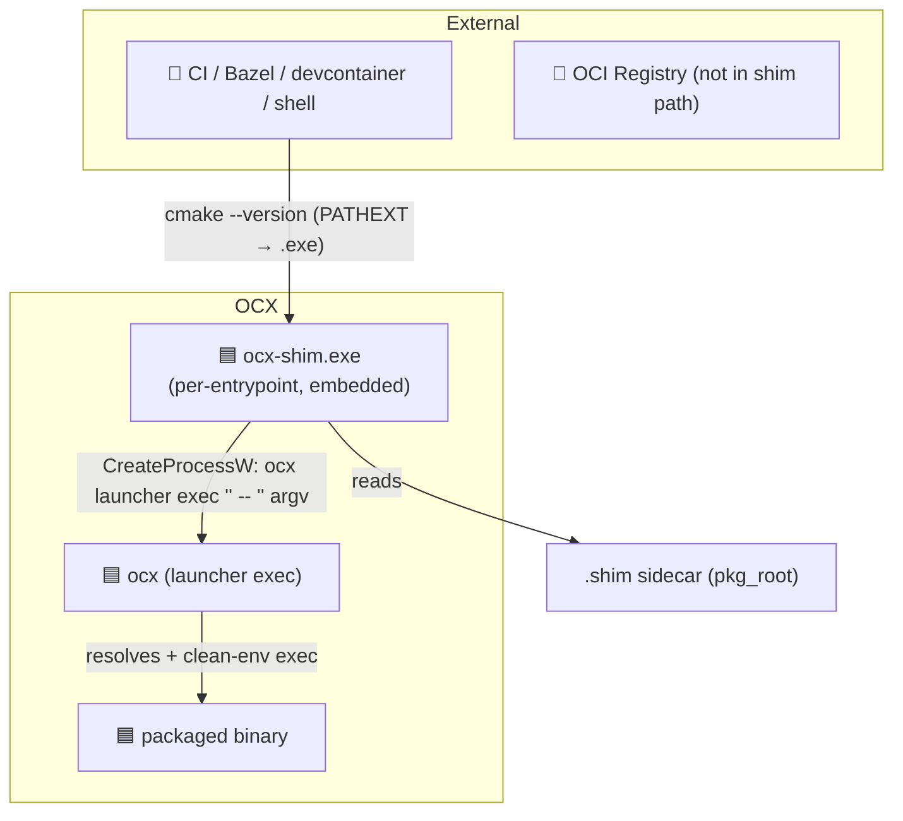
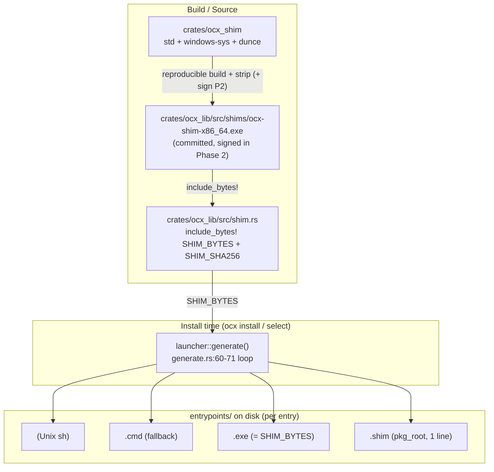
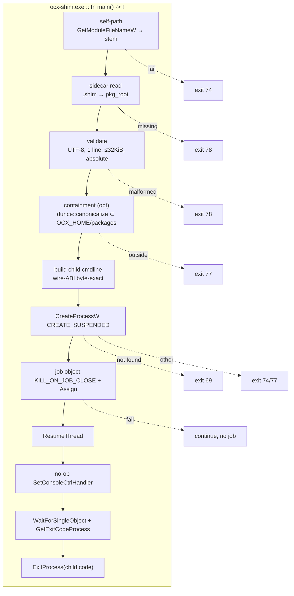
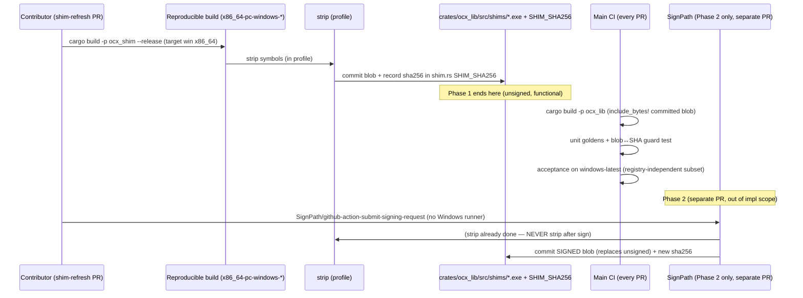

# System Design: Windows Native `.exe` Shim

## Metadata

**Status:** Draft
**Author:** Architect worker (Opus 4.7)
**Date:** 2026-05-18
**GitHub Issue:** [ocx-sh/ocx#66](https://github.com/ocx-sh/ocx/issues/66)
**Related ADRs:**
- [`adr_windows_exe_shim.md`](./adr_windows_exe_shim.md) — decision record (Proposed); contracts, error taxonomy, options
- [`adr_windows_cmd_argv_injection.md`](./adr_windows_cmd_argv_injection.md) — parent (interim `.cmd` mitigation; §Future Work is stale on wire form)
- [`adr_package_entry_points.md`](./adr_package_entry_points.md) — launcher design; byte-exact goldens are One-Way-Door canaries

**Tech Strategy Alignment:**
- [x] Language follows Golden Path: Rust 2024. Shim is sync `std` (no Tokio — single child, blocking wait).
- [x] One deviation (committed prebuilt blob, no `build.rs`) justified in ADR §Considered Options A.
- [x] Deviations documented in ADR.

## Executive Summary

A minimal native Windows executable (`crates/ocx_shim`, < 80 KB) replaces the
`cmd.exe`-mediated `.cmd` launcher as the primary Windows entrypoint. It reads
`pkg_root` from a sibling one-line `.shim` sidecar and spawns
`ocx launcher exec "<pkg_root>" -- "<stem>" <argv>` directly via
`CreateProcessW`, eliminating the BatBadBut / `%*` re-parse surface. The shim
binary is committed prebuilt and embedded via `include_bytes!` (uv/pixi model,
no `build.rs`); the install-time `launcher::generate()` writes it verbatim
alongside the retained `.cmd` fallback.

---

## 1. Context (C4 Level 1)

### System Context Diagram



### Actors & External Systems

| Actor/System | Type | Description | Interaction |
|--------------|------|-------------|-------------|
| Caller (CI/Bazel/shell) | Person/System | Invokes the entrypoint by name | PATHEXT resolution picks `<name>.exe` |
| `ocx-shim.exe` | Component | Embedded native shim, one copy per entrypoint | Reads sidecar, spawns `ocx` |
| `ocx launcher exec` | Component | Existing OCX subcommand; resolves + clean-env execs the tool | Receives the exact current wire ABI |
| OCI registry | System | **Not** in the shim runtime path | n/a |

---

## 2. Containers (C4 Level 2)

### Container Diagram



### Container Descriptions

| Container | Technology | Purpose | Notes |
|-----------|------------|---------|-------|
| `crates/ocx_shim` | Rust `std` + `windows-sys` + `dunce` | The shim binary source | `panic="abort"`, no Tokio, no `no_std` |
| Committed blob | PE32+ x86_64 (`.exe`) | Reproducible artifact embedded into `ocx_lib` | < 80 KB; refreshed via dedicated PR |
| `shim.rs` | Rust | `include_bytes!` arch-gated; `SHIM_BYTES`, `SHIM_SHA256` | Empty on non-Windows |
| `launcher::generate()` | Rust async (Tokio JoinSet) | Writes 4 files/entry on Windows | Existing seam, additive |

---

## 3. Components (C4 Level 3)

### Shim runtime components



### Component Responsibilities

| Component | Responsibility | Failure → exit (see ADR error taxonomy) |
|-----------|----------------|-----------------------------------------|
| self-path | Resolve own `.exe` path, derive `stem` (strip final `.exe`) | E4 → 74 |
| sidecar read | Read `<stem>.shim` fully (≤ 32 KiB) | E1 → 78 |
| validate | UTF-8, single line, absolute, no embedded NUL/CR/LF | E2 → 78 |
| containment | Optional `dunce::canonicalize` ⊂ `OCX_HOME/packages/` | E3 → 77 (skip if `OCX_HOME` unresolvable) |
| build cmdline | Reproduce wire ABI byte-exact; Win32 quoting; never `cmd.exe` | — |
| spawn | `CreateProcessW` + `CREATE_SUSPENDED` | E5 → 69 / E6 → 74/77 |
| job object | `KILL_ON_JOB_CLOSE`, assign child | E7 → continue without job |
| Ctrl+C | no-op `SetConsoleCtrlHandler` (returns TRUE) | — |
| wait/propagate | Wait, `GetExitCodeProcess`, `ExitProcess(code)` full i32 | E8 (transparent) |

---

## 4. Key Design Decisions

| Decision | Options | Chosen | Rationale (detail → ADR) |
|----------|---------|--------|--------------------------|
| Embed | committed blob / `build.rs` / CI artifact | committed blob + `include_bytes!` | No CI ordering; signature survives copy |
| pkg_root delivery | sidecar / filename / PE-patch | `.shim` sidecar | Constant `SHIM_BYTES` → one signature |
| Coexistence | coexist / cutover / flag | coexist (`.exe`+`.shim`+`.cmd`) | Zero migration; PATHEXT shadowing |
| Signing | SignPath / Azure / unsigned-v1 | unsigned v1 → SignPath v2 | Don't gate CVE fix on ops |
| Spawn | `std::process::Command` / direct `CreateProcessW`+job | direct + suspended + job | Race-free tree-kill, Ctrl+C correctness |
| Path normalize | `std::fs::canonicalize` / `dunce` | `dunce::canonicalize` | `\\?\` verbatim paths break `CreateProcessW` |

---

## 5. Module / Crate Layout

```
crates/
  ocx_shim/                         # NEW crate
    Cargo.toml                      # [profile.release] opt-level="z", lto=true,
                                    #   codegen-units=1, panic="abort", strip=true
    src/main.rs                     # fn main() -> ! ; #![windows_subsystem="console"]
                                    #   (default; explicit for clarity)
  ocx_lib/
    src/
      lib.rs                        # + pub mod shim;
      shim.rs                       # NEW: SHIM_BYTES, SHIM_SHA256 (cfg-gated)
      shims/
        ocx-shim-x86_64.exe         # NEW: committed prebuilt blob (Phase 2: signed)
      package_manager/launcher/
        generate.rs                 # MODIFIED: cfg-gated .exe + .shim writes
        body.rs                     # UNCHANGED (goldens stay green)
        pathext.rs                  # later: downgrade once .exe primary
        safety.rs                   # doc-comment note: sidecar reuses LAUNCHER_UNSAFE_CHARS
```

**Workspace:** add `crates/ocx_shim` as a workspace member. It depends on
**nothing internal** (peer of `ocx_lib` in the dependency graph; `ocx_lib`
does **not** depend on `ocx_shim` — it embeds the prebuilt artifact, not the
crate). This keeps `arch-principles.md` crate-dependency direction clean.

**Module boundary:** `shim.rs` is a crate-root cross-cutting module
(`arch-principles.md` "Cross-Cutting Modules"), peer of `hardlink`,
`symlink`, `child_process`. `generate.rs` is the only consumer of
`shim::SHIM_BYTES`.

---

## 6. `.shim` Sidecar Format (exact spec)

| Field | Spec |
|-------|------|
| Path | `<entrypoints_dir>/<name>.shim` (sibling of `<name>.exe`) |
| Encoding | UTF-8, **no BOM** (no `EF BB BF` prefix) |
| Bytes | `<pkg_root_utf8_bytes>` then a single `0x0A` (LF) |
| `pkg_root` | The exact string the `.sh` launcher body single-quotes as `launcher exec '<pkg_root>'` — the `LauncherSafeString`-validated absolute path (the `.cmd` body that previously baked the same string was removed in the Axis C cutover) |
| Generator writes | exactly `format!("{pkg_root}\n")` — LF only, never CRLF |
| Reader accepts | trailing `\n`, trailing `\r\n`, or no terminator (tolerant); strips a single trailing `\r?\n` |
| Reader rejects (→ E2) | empty after strip; any `0x00`; any interior `0x0A`/`0x0D` before the terminator; invalid UTF-8; not absolute; file > 32 KiB |
| Forbidden chars | `'`, `"`, `\n`, `\r`, `\0` — already excluded by `LAUNCHER_UNSAFE_CHARS` (reused, no second validator). (`%` removed at review-fix R2 — post-cutover no consumer treats it specially; admissible-set widening, backward-compatible. See `adr_windows_exe_shim.md` §`.shim` Sidecar Format Contract amendment) |

Byte example (pkg_root `C:\Users\ci\.ocx\packages\ocx.sh\sha256\ab\cd…`):

```
43 3A 5C 55 73 65 72 73 5C 63 69 5C 2E 6F 63 78 ...  (UTF-8 of the path)
0A                                                   (single LF terminator)
```

This is the **One-Way-Door artifact**. Over-specified deliberately so it never
needs migrating across installed packages.

---

## 7. CI Sequencing

Phase 1 (this work) does **not** add a signing job. The blob is built and
committed by a maintainer/contributor in a dedicated PR; the main CI just
builds `ocx_lib` (which `include_bytes!`s the committed blob) and runs tests.



**CI rules honored (`subsystem-ci.md`):** any new build/sign step is wrapped
in a Taskfile task; Windows acceptance gated behind Linux passing
(`runner OS` cost table — Windows $0.010/min); SHA-pinned actions;
`continue-on-error` lint pattern unchanged. cargo-dist `release.yml` is
generated — shim build wired via `dist-workspace.toml` `plan-jobs` if a
release-time build is ever added (Phase 1 uses the committed blob, so no
`release.yml` change needed).

---

## 8. Test Surface

| Level | Test | Asserts | Notes |
|-------|------|---------|-------|
| Unit (ocx_lib) | sidecar body golden | `generate()` writes `<name>.shim` == `format!("{pkg_root}\n")`, LF, no BOM | DAMP, self-contained; new — does not touch `body.rs` goldens |
| Unit (ocx_lib) | 4-file emission (cfg(windows)) | `<name>`, `.cmd`, `.exe`, `.shim` all present; `.exe` bytes == `SHIM_BYTES` | extend `generate_writes_unix_and_windows_launchers` analog under `cfg` |
| Unit (ocx_lib) | non-Windows unchanged | only `<name>` + `.cmd`; `SHIM_BYTES.is_empty()` | existing goldens stay green unmodified (additive) |
| Unit (ocx_lib) | unsafe pkg_root | rejected at `generate.rs:48` before any of the 4 writes | extend `generate_rejects_pkg_root_with_unsafe_character` to assert no `.exe`/`.shim` |
| Unit (ocx_lib) | blob↔source guard | `sha256(SHIM_BYTES) == SHIM_SHA256` (Windows x86_64) | catches stale committed blob |
| Unit (ocx_lib) | `SHIM_BYTES` cfg | non-empty on win-x86_64, empty otherwise | `include_bytes!` path correctness (relative to `shim.rs`) |
| Unit (ocx_shim) | sidecar parser | accepts `\n`/`\r\n`/none; rejects empty/NUL/interior-newline/>32KiB/non-UTF8/relative | pure function, host-runnable (parser split from Win32) |
| Unit (ocx_shim) | child-cmdline builder | byte-exact wire ABI for empty argv / spaces / `&` / unicode / `"` | reference = Rust `Command` quoting; host-runnable |
| Acceptance (`windows-latest`) | resolve from cmd / pwsh | `<name>` resolves to `.exe` via default PATHEXT; tool runs | **registry-independent** (see flag below) |
| Acceptance (`windows-latest`) | argv spaces / `&` / unicode | forwarded verbatim; `& whoami` NOT executed | the BatBadBut regression test |
| Acceptance (`windows-latest`) | exit-code propagation | tool exit 42 → `%ERRORLEVEL%` 42; crash 0xC0000005 passthrough | mirrors `child_process` non-unix semantics |
| Acceptance (`windows-latest`) | Ctrl+C | child handles signal, exits; shim returns child code | job object reaps on force-kill |
| Acceptance (`windows-latest`) | missing/malformed sidecar | exit 78, actionable stderr | E1/E2 |
| Acceptance (`windows-latest`) | `OCX_BINARY_PIN` honored | shim spawns pinned binary (parity with `.cmd` `IF DEFINED`) | wire-ABI parity |

### ⚠ Windows acceptance harness flag

`test/` acceptance tests use pytest + Docker Compose (`registry:2` on
localhost:5000). **Docker registry startup is Linux-only; the
`registry:2` compose fixture does not start on the `windows-latest`
GitHub runner.** The Windows shim acceptance tests therefore **must not
depend on the registry fixture**. Strategy:

- Build a fixture package layout on disk (a fake `pkg_root` with
  `metadata.json` + `content/` + generated `entrypoints/`) **without** a
  registry — reuse the local-materialization path, not `ocx install` from a
  registry.
- Or run the shim against a pre-staged `OCX_HOME` populated on Linux,
  uploaded as an artifact, and exercised on the Windows runner
  (cross-OS artifact handoff; respects `subsystem-ci.md` "share artifacts,
  don't rebuild").
- The shim's own unit tests (parser, cmdline builder) are host-runnable
  (Linux) by splitting pure logic from Win32 syscalls — most coverage lands
  there; the Windows runner only validates the genuinely Win32-dependent
  behaviors (PATHEXT resolution, `CreateProcessW`, job object, Ctrl+C).

This flag is called out so the QA/builder phase budgets for a
registry-independent Windows fixture rather than discovering the
incompatibility mid-implementation.

---

## 9. Non-Functional Requirements

| Metric | Target | Measurement |
|--------|--------|-------------|
| Shim binary size | < 80 KB (50–80 KB realistic) | `ls -l` on committed blob; guard not required but recorded |
| Shim startup overhead | negligible (< few ms: 1 file read + 1 spawn) | not formally benchmarked; no hot loop |
| Build network | zero | committed blob, no `build.rs` fetch |
| Memory | `std` allocator; no custom allocator | `no_std` rejected (ADR option A) |
| Reproducibility | byte-deterministic build for the blob↔SHA guard | pinned toolchain + profile |

---

## 10. Risks & Mitigations

| Risk | Prob | Impact | Mitigation |
|------|------|--------|------------|
| Committed blob drifts from `ocx_shim` source | Med | Med | blob↔SHA guard test; documented refresh-PR flow |
| Nested job objects on GHA (`BREAKAWAY_OK`) | Med | Med | acceptance test asserts exit-code propagation on `windows-latest`; E7 makes job-object best-effort |
| `include_bytes!` path wrong (crate-root vs `shim.rs`) | Low | High | unit test `SHIM_BYTES` non-empty on win-x86_64 |
| `\\?\` verbatim path breaks `CreateProcessW` | Med | High | mandate `dunce::canonicalize` (component contract) |
| Windows acceptance can't use registry fixture | High | Med | §8 flag — registry-independent fixture strategy planned up front |
| Unsigned Phase 1 SmartScreen friction | Low | Low | backend audience, non-interactive; Phase 2 SignPath |
| Orphan `.cmd` invoked by explicit extension keeps `%*` risk | Low | Med | documented residual in ADR + user guide |

---

## 11. Implementation Phases

### Phase 1 (this work — unsigned, x86_64)
- [ ] `crates/ocx_shim` crate + profile + workspace member
- [ ] Reproducible build → strip → commit blob + record SHA-256
- [ ] `ocx_lib/src/shim.rs` + `pub mod shim;`
- [ ] `launcher::generate()` cfg-gated `.exe`/`.shim` writes (`.exe` before `.shim`)
- [ ] Unit + acceptance (registry-independent Windows fixture)
- [ ] Docs surfaces (ADR §Documentation surfaces)

### Phase 2 (separate PR — out of implementation scope)
- [ ] SignPath Foundation prerequisites (ADR §Out of Implementation Scope)
- [ ] Signing workflow step + signed-blob refresh

### Phase 3 (follow-on)
- [ ] aarch64 shim blob + arch-gated `include_bytes!` branch
- [ ] PATHEXT warn/inject downgrade once `.exe` proven primary

---

## 12. Open Questions

- [ ] aarch64 interim behavior until its blob exists: `compile_error!` vs fall back to x86_64 blob with tracked TODO (decide at implementation; ADR leaves open).
- [ ] Whether E3 containment check should be enabled by default or strictly delegated to `launcher exec` (ADR makes it conditional on `OCX_HOME` readability; revisit if it adds startup cost).
- [ ] Exact reproducible-build pinning (toolchain version, target triple `-gnu` vs `-msvc`) for the blob↔SHA guard — implementation detail, must be recorded in the contributor refresh checklist.

---

## Appendix

### Glossary

| Term | Definition |
|------|------------|
| Shim | `ocx-shim.exe` — embedded native launcher binary, one copy per entrypoint |
| Sidecar | `<name>.shim` — one-line UTF-8 file carrying `pkg_root` |
| Wire ABI | `ocx launcher exec "<pkg_root>" -- "<name>" <argv>` — the stable invocation the shim must reproduce byte-exact |
| `SHIM_BYTES` | `&'static [u8]` from `include_bytes!`; verbatim PE bytes |
| Orphan `.cmd` | The retained `.cmd` fallback; only reached if invoked by explicit `.cmd` extension |

### References

- ADR: [`adr_windows_exe_shim.md`](./adr_windows_exe_shim.md)
- Research: [`research_windows_shim_tech.md`](./research_windows_shim_tech.md), [`research_windows_shim_patterns.md`](./research_windows_shim_patterns.md), [`research_windows_shim_signing.md`](./research_windows_shim_signing.md)
- Code seam: `crates/ocx_lib/src/package_manager/launcher/generate.rs:60-71`, `body.rs`, `safety.rs:36`
- Exit-code semantics reference: `crates/ocx_lib/src/utility/child_process.rs` (non-unix `exit_code_from_status` = full i32 passthrough)

---

## Changelog

| Date | Author | Change |
|------|--------|--------|
| 2026-05-18 | Architect worker (Opus 4.7, issue #66) | Initial draft — crate/module layout, `.shim` byte spec, CI sequencing, test surface with Windows-registry-incompatibility flag |
