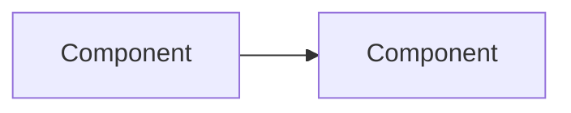

# GitHub Issue Workflow

Rules for creating and managing GitHub issues via `gh`. **Never create issues without user approval.**

## Proposal-First Protocol

When the user describes future work, a feature idea, or technical debt to track:

1. **Draft** — Prepare issue(s) as a proposal table, then ask for approval
2. **Refine** — Incorporate feedback, re-present if changes are significant
3. **Create** — Only after explicit approval, run `gh issue create`

### Proposal Format

Present all proposed issues in a single overview before creating any:

```
## Proposed Issues

| # | Title | Type | Depends On |
|---|-------|------|------------|
| 1 | feat: short user-facing title | Feature | — |
| 2 | fix: another title | Bug | #1 |

### Issue 1: feat: short user-facing title

**Value:** What the user/developer gains from this.

**Context:** Why this matters now, what triggered it.

**Scope:**
- Bullet list of what's in scope
- And what's explicitly out

**Acceptance Criteria:**
- [ ] Testable condition 1
- [ ] Testable condition 2

**Depends on:** None / #other-issue

---

Shall I create these issues? Any changes?
```

## Issue Body Structure

Every issue body follows this template:

```markdown
## Value

Start from the user's perspective. What problem does this solve? What becomes
possible? Lead with the benefit, not the implementation.

## Context

Why now? What triggered this? Link to articles, discussions, ADRs, or other
issues that provide background. Keep it brief — context, not history.

## Scope

What's included and what's explicitly excluded. Bullet list.

## Design

Use mermaid diagrams where they clarify relationships, flows, or architecture.
Skip diagrams for simple issues where prose suffices.



## Acceptance Criteria

- [ ] Testable, observable conditions
- [ ] Written as "X can do Y" or "When X, then Y"

## Dependencies

- #issue — one-line description of why this blocks
```

## Issue Types vs Labels

Prefer **GitHub issue types** (`Bug`, `Feature`) over labels that duplicate
type information (`bug`, `enhancement`).  Issue types are a first-class
GitHub concept — they appear in filters, views, and project boards without
label noise.

| Issue type | When to use | CLI flag |
|------------|-------------|----------|
| Bug | Something broken | `--label bug` (until `gh` supports `--type`) |
| Feature | New feature or capability | `--label enhancement` (until `gh` supports `--type`) |

> **Note:** The `gh` CLI does not yet support `--type`.  Until it does, use
> the corresponding label as a fallback — but do **not** add both a type
> and a duplicate label once `--type` becomes available.

### Additional labels

Use sparingly. Labels should add information beyond the issue type:

| Label | When to use |
|-------|-------------|
| `documentation` | Docs-only changes |
| `good first issue` | Small, well-scoped, clear acceptance criteria |

Do not invent labels. Use only labels that exist on the repository.

## Conventions

- **Title format**: `type: short imperative description` (e.g., `feat: relative symlinks for relocatable stores`)
- **User-first framing**: The Value section answers "why should anyone care?" before "how does it work?"
- **Mermaid where applicable**: Architecture, data flow, state machines, dependency graphs. Not for simple lists or linear sequences.
- **Cross-reference**: Use `#N` to link related issues. Add a "Depends on" section when order matters.
- **One concern per issue**: Don't combine unrelated work. Split if the issue has two distinct acceptance criteria sets.
- **No implementation details in titles**: Titles describe the outcome, not the approach.
