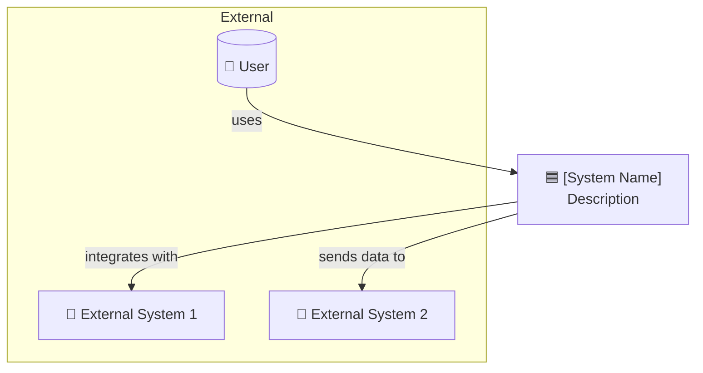
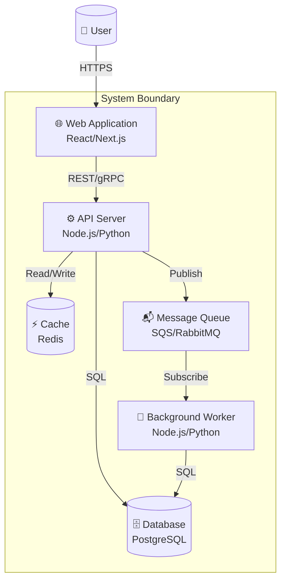
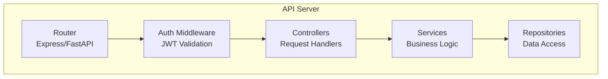
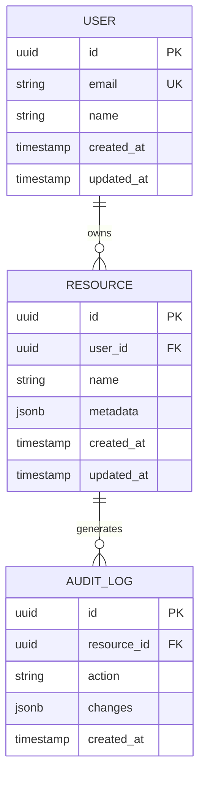
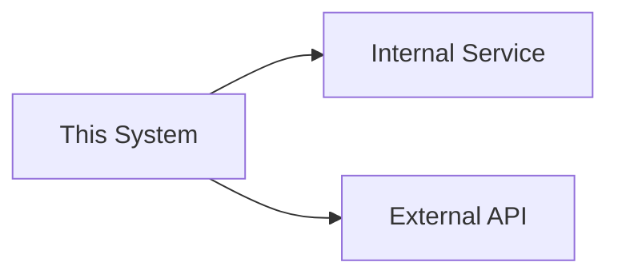

# System Design: [System/Feature Name]

<!--
System Design Document (Technical Architecture)
Filename: artifacts/system_design_[system].md
Owner: Architect (/architect)
Handoff to: Builder (/builder), Security Auditor (/security-auditor)
Related Skills: architect

Covers TECHNICAL architecture. UI/visual design → design_spec.template.md
Uses C4 model (Context → Container → Component → Code)
-->

## Metadata

**Status:** Draft | In Review | Approved | Implemented
**Author:** [Name]
**Date:** [YYYY-MM-DD]
**Beads Issue:** [bd://issue-id or N/A]
**Related PRD:** [Link to PRD]
**Related ADRs:** [Links to relevant ADRs]

**Tech Strategy Alignment:**
- [ ] Language/Framework follows Golden Path (`.claude/rules/product-tech-strategy.md`)
- [ ] DB choice match Data section (PostgreSQL for OLTP)
- [ ] Infra tier fit (Static/Agile/Production)
- [ ] Observability use OpenTelemetry (OTel) + OTLP
- [ ] Deviations doc'd in ADR with reason

## Executive Summary

[2-3 sentences: what system do, why exist, what problem solve.]

---

## 1. Context (C4 Level 1)

### System Context Diagram



### Actors & External Systems

| Actor/System | Type | Description | Interaction |
|--------------|------|-------------|-------------|
| [User Persona] | Person | [Description] | [How interact] |
| [External System] | System | [Description] | [Integration type] |

---

## 2. Containers (C4 Level 2)

### Container Diagram



### Container Descriptions

| Container | Technology | Purpose | Scaling Strategy |
|-----------|------------|---------|------------------|
| Web Application | [Tech stack] | [Purpose] | [How scales] |
| API Server | [Tech stack] | [Purpose] | [How scales] |
| Database | [Tech stack] | [Purpose] | [How scales] |
| Cache | [Tech stack] | [Purpose] | [How scales] |

---

## 3. Components (C4 Level 3)

### API Server Components



### Component Responsibilities

| Component | Responsibility | Dependencies |
|-----------|---------------|--------------|
| [Component 1] | [Single responsibility] | [Depends on] |
| [Component 2] | [Single responsibility] | [Depends on] |

---

## 4. Key Design Decisions

| Decision | Options Considered | Chosen | Rationale |
|----------|-------------------|--------|-----------|
| Database | PostgreSQL, MongoDB, DynamoDB | PostgreSQL | ACID, relational |
| Caching | Redis, Memcached | Redis | Data structures, pub/sub |
| Queue | SQS, RabbitMQ, Kafka | SQS | Managed, AWS native |

**Detail rationale → see ADRs.**

---

## 5. API Design

### Endpoints Overview

| Method | Endpoint | Purpose | Auth Required |
|--------|----------|---------|---------------|
| GET | `/api/v1/resources` | List resources | Yes |
| GET | `/api/v1/resources/:id` | Get single resource | Yes |
| POST | `/api/v1/resources` | Create resource | Yes |
| PUT | `/api/v1/resources/:id` | Update resource | Yes |
| DELETE | `/api/v1/resources/:id` | Delete resource | Yes |

### Request/Response Examples

```typescript
// GET /api/v1/resources/:id
// Response 200 OK
interface Resource {
  id: string;
  name: string;
  createdAt: string;  // ISO 8601
  updatedAt: string;  // ISO 8601
  metadata: Record<string, unknown>;
}

// POST /api/v1/resources
// Request Body
interface CreateResourceRequest {
  name: string;
  metadata?: Record<string, unknown>;
}

// Error Response (4xx/5xx)
interface ErrorResponse {
  error: {
    code: string;
    message: string;
    details?: unknown;
  };
}
```

### API Versioning Strategy

[Versioning approach: URL path, header, query param]

---

## 6. Data Model

### Entity Relationship Diagram



### Key Entities

| Entity | Description | Retention Policy |
|--------|-------------|------------------|
| User | System users | Indefinite |
| Resource | Core business entity | [Policy] |
| Audit Log | Change tracking | [X] days |

### Data Migration Strategy

[How migrate data? Rollback plan?]

---

## 7. Security Architecture

### Authentication & Authorization

| Mechanism | Implementation | Notes |
|-----------|----------------|-------|
| Authentication | JWT / OAuth 2.0 | [Details] |
| Authorization | RBAC / ABAC | [Details] |
| API Security | Rate limiting, WAF | [Details] |

### Data Protection

- **In Transit:** TLS 1.3 minimum
- **At Rest:** AES-256 encryption
- **PII Handling:** [Approach]
- **Secrets Management:** [AWS Secrets Manager / HashiCorp Vault]

### Security Considerations

| STRIDE Threat | Mitigation |
|---------------|------------|
| Spoofing | [Mitigation] |
| Tampering | [Mitigation] |
| Repudiation | [Mitigation] |
| Information Disclosure | [Mitigation] |
| Denial of Service | [Mitigation] |
| Elevation of Privilege | [Mitigation] |

---

## 8. Non-Functional Requirements

### Performance

| Metric | Target | Measurement |
|--------|--------|-------------|
| API Response Time (p50) | < 100ms | [Tool] |
| API Response Time (p99) | < 500ms | [Tool] |
| Throughput | [X] req/sec | [Tool] |
| Database Query Time | < 50ms | [Tool] |

### Scalability

| Dimension | Current Capacity | Target Capacity | Strategy |
|-----------|------------------|-----------------|----------|
| Users | [X] | [Y] | [How scale] |
| Requests/sec | [X] | [Y] | [How scale] |
| Data Volume | [X] GB | [Y] TB | [How scale] |

### Availability & Reliability

| Metric | Target | Strategy |
|--------|--------|----------|
| Availability | 99.9% (3 nines) | Multi-AZ deployment |
| RTO | [X] hours | [Recovery strategy] |
| RPO | [X] minutes | [Backup strategy] |

### Observability

| Pillar | Implementation | Tools |
|--------|----------------|-------|
| Metrics | OpenTelemetry | Prometheus/Grafana |
| Logging | Structured JSON logs | [ELK/CloudWatch] |
| Tracing | Distributed tracing | Jaeger/X-Ray |
| Alerting | SLO-based alerts | [PagerDuty/OpsGenie] |

---

## 9. Infrastructure

### Deployment Architecture

```
┌─────────────────────────────────────────────────────────┐
│                        AWS Region                        │
│  ┌──────────────────────────────────────────────────┐   │
│  │                      VPC                          │   │
│  │  ┌─────────────┐  ┌─────────────┐               │   │
│  │  │  Public     │  │  Public     │               │   │
│  │  │  Subnet AZ1 │  │  Subnet AZ2 │               │   │
│  │  │  ┌───────┐  │  │  ┌───────┐  │               │   │
│  │  │  │  ALB  │  │  │  │  ALB  │  │               │   │
│  │  │  └───────┘  │  │  └───────┘  │               │   │
│  │  └─────────────┘  └─────────────┘               │   │
│  │  ┌─────────────┐  ┌─────────────┐               │   │
│  │  │  Private    │  │  Private    │               │   │
│  │  │  Subnet AZ1 │  │  Subnet AZ2 │               │   │
│  │  │  ┌───────┐  │  │  ┌───────┐  │               │   │
│  │  │  │  ECS  │  │  │  │  ECS  │  │               │   │
│  │  │  └───────┘  │  │  └───────┘  │               │   │
│  │  └─────────────┘  └─────────────┘               │   │
│  │  ┌─────────────────────────────────────────┐    │   │
│  │  │           RDS Multi-AZ                   │    │   │
│  │  └─────────────────────────────────────────┘    │   │
│  └──────────────────────────────────────────────────┘   │
└─────────────────────────────────────────────────────────┘
```

### Environment Configuration

| Environment | Purpose | Infrastructure |
|-------------|---------|----------------|
| Development | Local dev | Docker Compose |
| Staging | Pre-prod testing | [Reduced AWS setup] |
| Production | Live system | [Full AWS setup] |

### CI/CD Pipeline

```
Code Push → Lint/Test → Build → Security Scan → Deploy Staging → Integration Tests → Deploy Prod
```

---

## 10. Dependencies

### Internal Dependencies

| Service | Purpose | Criticality | Fallback |
|---------|---------|-------------|----------|
| [Service 1] | [Purpose] | High/Medium/Low | [Fallback] |

### External Dependencies

| Service | Purpose | SLA | Fallback |
|---------|---------|-----|----------|
| [External API] | [Purpose] | [SLA] | [Fallback] |

### Dependency Diagram



---

## 11. Risks & Mitigations

| Risk | Probability | Impact | Mitigation |
|------|-------------|--------|------------|
| [Risk 1] | High/Med/Low | High/Med/Low | [Strategy] |
| [Risk 2] | High/Med/Low | High/Med/Low | [Strategy] |

---

## 12. Implementation Phases

### Phase 1: Foundation
- [ ] Infra setup (IaC)
- [ ] DB schema
- [ ] Basic API scaffolding
- [ ] CI/CD pipeline

### Phase 2: Core Features
- [ ] Core business logic
- [ ] API endpoints
- [ ] Authentication/Authorization

### Phase 3: Polish & Launch
- [ ] Perf optimization
- [ ] Security hardening
- [ ] Docs
- [ ] Monitoring + alerting

---

## 13. Open Questions

- [ ] [Question 1]
- [ ] [Question 2]

---

## Appendix

### Glossary

| Term | Definition |
|------|------------|
| [Term] | [Definition] |

### References

- [Link to related documentation]
- [Link to external resources]

---

## Approval

| Role | Name | Date | Status |
|------|------|------|--------|
| Architect | | | Pending |
| Engineering Lead | | | Pending |
| Security | | | Pending |

---

## Changelog

| Date | Author | Change |
|------|--------|--------|
| [Date] | [Name] | Initial design |